STM32CubeMX安装

你好！我是你的软件安装专家。

STM32CubeMX 是 ST（意法半导体）推出的一款图形化配置工具，它是嵌入式开发的神器，能通过图形界面配置芯片引脚、时钟和外设，并一键生成初始化代码（支持 Keil、IAR、STM32CubeIDE 等）。

以下是 **STM32CubeMX 的详细安装与保姆级使用指南**，分为 **下载安装**、**环境配置** 和 **基本使用** 三个部分。

------


### 第一部分：环境准备与安装

#### 1. 准备工作（注意事项）

- **Java 环境：** STM32CubeMX 是基于 Java 开发的。虽然新版本安装包通常自带 JRE，但为了保险起见，如果安装后打不开，请检查电脑是否安装了 Java 运行环境 (JRE/JDK)。
- **路径规范（专家核心提示）：** **严禁**在安装路径或后续的项目路径中包含**中文**或**空格**。这会导致代码生成失败或编译报错。


#### 2. 下载软件

建议从官网下载以确保纯净和版本最新，但需要注册 ST 账号。

- **官方网址：** [STMicroelectronics - STM32CubeMX](https://www.st.com/en/development-tools/stm32cubemx.html)
- **步骤：** 点击 "Get Software" -> 选择最新版本 -> "Get Software" -> 登录/注册账号 -> 下载压缩包。


#### 3. 安装步骤

1. **解压：** 下载完成后，解压 `.zip` 压缩包。
2. **运行安装程序：**
   - Windows 用户双击 `SetupSTM32CubeMX.exe`。
   - Linux/Mac 用户运行对应的安装脚本。
3. **安装向导：**
   - 点击 **Next**。
   - 勾选 "I accept..." (接受协议)，点击 **Next**。
   - **选择安装路径：** 再次强调，**不要有中文**。
   - 一路点击 **Next** 直至 **Finish**。

------


### 第二部分：安装固件包 (Firmware Package)

安装好软件后，你还不能直接用，因为软件是个空壳，还需要对应芯片系列的“固件库”。

1. **打开软件：** 运行 STM32CubeMX。
2. **进入仓库管理：** 点击菜单栏的 **Help** -> **Manage Embedded Software Packages**。
3. **选择芯片系列：**
   - 在弹出的窗口中，找到你使用的芯片系列（例如 `STM32F1` 或 `STM32F4`）。
   - 展开该系列，勾选最新的版本（通常最上面的是最新版）。
4. **下载安装：** 点击右下角的 **Install Now**。
   - *注意：如果网络下载很慢，可以去国内电子论坛下载对应版本的“离线包”，然后点击左下角的 "From Local" 进行导入。*

------


### 第三部分：快速上手（点亮你的第一个 LED）

这里演示如何创建一个工程，配置引脚并生成代码。


#### 1. 新建工程

- 点击主界面的 **ACCESS TO MCU SELECTOR**（或者 File -> New Project）。
- 在左上角 **Part Number** 搜索框输入你的芯片型号（例如神车 `STM32F103C8`）。
- 在右侧列表中选中芯片，点击右上角的 **Start Project**。


#### 2. 核心配置（关键步骤）

进入主界面后，你会看到一个芯片图。

- **Step A: 配置调试接口 (非常重要！)**
  - 点击左侧 **System Core** -> **SYS**。
  - 在 **Debug** 选项中，选择 **Serial Wire**。
  - *专家提示：如果不选这个，你烧录一次程序后，芯片可能会被锁死，无法再次下载程序！*
- **Step B: 配置时钟源**
  - 点击左侧 **System Core** -> **RCC**。
  - High Speed Clock (HSE) 选择 **Crystal/Ceramic Resonator** (外部晶振)。
- **Step C: 配置 GPIO (点灯)**
  - 在右侧芯片图上，找到你想点亮 LED 的引脚（例如 `PC13`）。
  - 鼠标左键点击该引脚，选择 **GPIO_Output**。


#### 3. 时钟树配置 (Clock Configuration)

- 点击顶部标签页 **Clock Configuration**。
- 这是很多新手头疼的地方，但 CubeMX 有个“魔法按钮”。直接在 **HCLK (MHz)** 框里输入该芯片的最大频率（例如 F103 输入 `72`），按回车。
- 软件会自动计算并配置倍频系数，你只需要点击 **OK**。


#### 4. 项目管理与代码生成 (Project Manager)

点击顶部标签页 **Project Manager**。

- **Project Name：** 输入工程名。
- **Project Location：** 选择保存路径（**再次提醒：全英文路径**）。
- **Toolchain / IDE：** 选择你的编译器。
  - 如果你用 Keil，请选择 **MDK-ARM**。
  - 如果你用 STM32CubeIDE，请保持默认。
- **Code Generator (左侧菜单)：**
  - 勾选 **Generate peripheral initialization as a pair of '.c/.h' files per peripheral**。
  - *解释：这样生成的代码会把每个外设（如 GPIO、UART）单独分成不同的文件，代码结构更清晰。*


#### 5. 生成代码

- 点击右上角的 **GENERATE CODE** 按钮。
- 生成完毕后，点击 **Open Project** 即可自动打开 Keil 或你选择的 IDE。

------


### 专家的小贴士 (常见坑点)

> 1. 代码保护区：
>
> 打开生成的 main.c 代码，你会看到很多 /* USER CODE BEGIN ... */ 和 /* USER CODE END ... */。
>
> 请务必把你自己的代码写在这两行注释中间！
>
> 如果写在外面，下次你在 CubeMX 里修改配置并重新生成代码时，你的代码会被无情覆盖。

> 2. 遇到下载失败？
>
> 如果你在 Manage Embedded Software Packages 里下载失败，通常是 ST 服务器连接问题。尝试切换网络，或者直接寻找国内的离线包资源。

------

下一步建议：

既然你已经掌握了安装和配置方法，你需要我为你提供一段基础的 main.c 示例代码（例如让 LED 闪烁），来测试你的环境是否搭建成功吗？


# 创建第一个STM32CubeMX工程

没问题！咱们趁热打铁。针对你的 **STM32F103C8T6**，我来带你完成“点灯工程”的创建。

这是最关键的一步，请一步步跟着我操作。

------


### 第一步：创建新工程并选型

1. **回到主界面：** 点击 STM32CubeMX 主界面那个最大的蓝色按钮 **"ACCESS TO MCU SELECTOR"**（或者点击菜单 File -> New Project）。
2. **搜索芯片：**
   - 在左上角的 **"Part Number"** 搜索框里输入 `STM32F103C8`。
3. **选中芯片：**
   - 右下角的列表中会出现一行结果。
   - **点击选中** 这一行。
   - 然后点击右上角的 **"Start Project"** 按钮。

*(此时软件会加载一会，然后你会看到一个巨大的芯片引脚图，这就是配置界面)*

------


### 第二步：关键配置（不做这一步，芯片可能会锁死！）

这是新手最容易忽略的一步，**请务必先做这个**：

1. **配置调试模式：**
   - 看界面左侧的列表，点击 **System Core** -> **SYS**。
   - 在中间的 **Debug** 下拉框中，选择 **Serial Wire**。
   - *(解释：这样设置后，PA13 和 PA14 引脚会被分配给下载器。如果不选，你烧录一次程序后，下载口就会被禁用，芯片就“变砖”了！)*
2. **配置时钟源：**
   - 点击左侧 **System Core** -> **RCC**。
   - 在 **High Speed Clock (HSE)** 处，选择 **Crystal/Ceramic Resonator**（使用外部晶振）。

------


### 第三步：配置 LED 引脚

STM32F103C8T6 核心板（通常叫 Blue Pill）板载的 LED 通常连接在 **PC13** 引脚上。

1. **找到引脚：**

   - 在右边那个大芯片图上，按住鼠标滚轮可以放大缩小，按住右键可以拖动。
   - 找到 **PC13** 引脚（在芯片的左上角或右上角区域）。

2. **设置为输出：**

   - 鼠标**左键点击** PC13 引脚。

   - 在弹出的菜单中选择 **GPIO_Output**。

   - **(此时引脚会变成绿色，表示配置成功)**。

     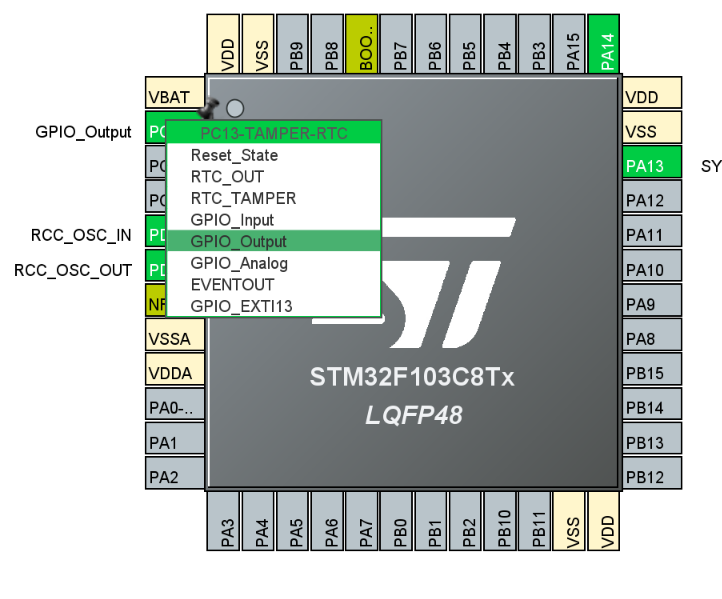

------


### 第四步：配置时钟树 (Clock Configuration)

1. 点击顶部蓝色的标签页 **"Clock Configuration"**。

2. 你会看到一个复杂的树状图。别慌，看中间有一个 **HCLK (MHz)** 的框。

3. 直接在 **HCLK** 框里输入 **72**，然后按键盘回车 (Enter)。

4. 软件会弹窗问你是否自动调整，点击 **OK** 即可。

   

------


### 第五步：生成代码 (Project Manager)

1. 点击顶部标签页 **"Project Manager"**。
2. **Project Name (工程名)：** 随便起一个，比如 `MyFirstLED`。
3. **Project Location (路径)：** **严禁中文！严禁空格！** 选一个全英文的文件夹。
4. **Toolchain / IDE (编译器)：**
   - 这是重点！请问你电脑上装的是 **Keil (MDK)** 还是 **STM32CubeIDE**？
   - 如果是 **Keil 5**，请选择 **MDK-ARM**。
   - 如果是 **STM32CubeIDE**，请保持默认。
5. **Code Generator (左侧菜单设置)：**
   - 点击左边列表里的 **Code Generator**。
   - 勾选第一栏的 **Generate peripheral initialization as a pair of '.c/.h' files...**
   - *(这样生成的代码结构更清晰，不像乱炖)*。

------


### 最后一步：

点击右上角的 **"GENERATE CODE"** 按钮。

进度条跑完后，点击 **"Open Project"**，你的编译器就会自动打开这个工程了！

**操作过程中如果哪一步找不到，截图发给我！**


## 提问1

**配置调试模式：**

- 看界面左侧的列表，点击 **System Core** -> **SYS**。
- 在中间的 **Debug** 下拉框中，选择 **Serial Wire**。
- **(解释：这样设置后，PA13 和 PA14 引脚会被分配给下载器。如果不选，你烧录一次程序后，下载口就会被禁用，芯片就“变砖”了！)**

<span style="font-weight:bold; font-size:1.2em;">这里配置调试模式有什么用呢，我不是太懂，你能够给我解释下吗，最好能够举个例子来让我彻底弄明白。</span>


这是一个非常棒的问题！很多初学者（甚至有经验的工程师）因为不理解这一点，第一次烧录完程序后，板子就再也下载不进去了，以为芯片烧坏了。

为了让你彻底明白，我用一个**“装修房子”**的例子来解释。

------


### 🏠 通俗类比：装修房子与“防盗门”

把你的 STM32 芯片 想象成一间 <span style="color:#CC0000;">房子</span>。

把你的 程序代码 想象成你要搬进去的 <span style="color:#CC0000;">家具</span>。

把你的 ST-Link 下载器 想象成 <span style="color:#CC0000;">搬家工人</span>。

**PA13 和 PA14 这两个引脚，就是<span style="color:#CC0000;">这间房子的“大门”（用来进出数据）</span>。**


#### 情况一：你没有配置 Serial Wire (默认情况)

在 CubeMX 中，默认 Debug 选项是 `Disable`（关闭）。这意味着你给装修队（生成代码）下达了指令：

> “这间房子里的所有空间我都要利用！**把大门拆了，砌成墙**，或者用来挂一幅画（当做普通 GPIO 口用）。”

1. **第一次烧录：** 房子还是毛坯房，大门还在。搬家工人（下载器）顺利进去，把你设计的“拆门代码”搬进去了。
2. **程序运行：** 代码一开始运行，第一件事就是**遵照你的指令，把大门拆了封死**，把这两个引脚变成了普通用途（或者单纯断开了调试功能）。
3. **第二次烧录：** 你修改了代码，想让搬家工人再搬点新家具进去。
   - 搬家工人来到门口，发现**门没了！全是墙！**
   - 他进不去，于是电脑上提示：“**Target not found**” 或者 “**Download Failed**”。
   - **结果：** 你的芯片“变砖”了，无法再写入新程序。


#### 情况二：你配置了 Serial Wire (正确做法)

你在 CubeMX 里选择了 `Serial Wire`。这意味着你下达了指令：

> “这间房子虽然要装修，但 **<span style="color:#CC0000;">PA13 和 PA14 这两个位置必须保留做大门</span>**，专门留给搬家工人用，任何时候都不能封死。”

1. **程序运行：** 代码运行时，会专门把这两个引脚留给调试接口。
2. **第二次烧录：** 搬家工人来了，发现大门敞开着，顺利进入，更新程序。
3. **结果：** 你可以<span style="color:#CC0000;">无限次地反复修改和下载程序</span>。

------


### 🔧 技术层面的解释

STM32 的引脚是**复用**的（Multiplexing），也就是说，<span style="color:#CC0000;">一个引脚既可以当普通的开关（GPIO）用，也可以当下载口（Debug）用，但同一时间只能选一种功能。</span>

- **PA13** = SWDIO (数据线)
- **PA14** = SWCLK (时钟线)

当你选择 `Serial Wire` 时，生成的初始化代码里会明确告诉 CPU：“**保护好这两个引脚，不要把它们变成普通 IO 口，保持与仿真器的连接。**”

如果你不选，CubeMX 为了帮你节省引脚资源（以为你引脚不够用），就会把调试功能关掉。一旦程序跑起来，调试电路断开，你的 ST-Link 就再也“握不到手”芯片了。


### 💡 万一真的忘记选了，芯片“锁死”了怎么办？

不用担心，芯片没坏，只是门被堵住了。有一个**“强行破门”**的方法（按复位键法）：

1. 按住板子上的 **RESET (复位)** 按键不松手。
2. 点击电脑上的 **Download (下载)** 按钮。
3. 看到下载进度条开始走的瞬间，**立刻松开 RESET 按键**。

*原理：趁着芯片刚醒过来还没来得及执行“封门”代码的那一瞬间，强行把新程序塞进去。*

------

结论：

为了避免以后每次下载都要去拼手速按复位键，请务必永远在 System Core -> SYS 里勾选 Serial Wire！ 这是嵌入式开发的“第一条家规”。


## 提问 1 - （1）

<span style="font-weight:bold; font-size:1.2em;">如果我配置了调试模式，那么PA13 和 PA14 这两个引脚是不是就不能够当成普通的IO引脚用了呢，在写代码的时候就不能够用PA13和PA14，如果这个引脚复用了其他功能如I2C，SPI等是不是也就不能用了呢，我不是太懂，你能够给我详细解释下吗。</span>


你的理解非常敏锐！这正是嵌入式开发中**“引脚复用（Pin Multiplexing）”**的核心概念。

直接回答你的问题：

<span style="color:#CC0000;">是的，一旦你配置了 Serial Wire (调试模式)，PA13 和 PA14 就完全属于下载器了。你不能再把它们当做普通 GPIO (开关灯)，也不能用作其他功能 (如 I2C, SPI 等)。</span>

这是一种**“独占”**关系。

为了让你彻底弄明白，我们来深入拆解一下：

------


### 1. 为什么不能同时用？（单轨铁道理论）

想象芯片内部有一条**单轨铁路**通向 PA13 引脚。

- **车站 A：** 是调试模块（连接电脑下载器）。
- **车站 B：** 是普通 GPIO 寄存器（控制高低电平）。
- **车站 C：** 是其他外设（比如定时器或其他功能）。

**道岔（复用器）同一时间只能打向一个方向。**

- 当你选了 **Serial Wire**，道岔就焊死在 **车站 A** 了。
- 这时候你在代码里写 `HAL_GPIO_WritePin(PA13, ...)` 试图让 PA13 变高电平，这指令是发给车站 B 的，但铁路根本没连通到引脚上，所以引脚**<span style="color:#CC0000;">没有任何反应</span>**。


### 2. 如果我强行配置成其他功能会怎样？

如果你在 STM32CubeMX 里做了以下操作：

1. 先在 SYS 里选了 **Serial Wire**（占用了 PA13/PA14）。
2. 然后又跑去右边的图上，强行点击 PA13，把它选为 **GPIO_Output**。

**CubeMX 会直接报错/警告：**

- 它会把引脚变成**红色**或**橘黄色**。
- 它会告诉你：**"Pin Conflict"（引脚冲突）**。
- **意思就是：** “老兄，这根线已经被下载器占了，你不能再把它拿去干别的了。”


### 3. 这是一个“必须付出的代价”

在嵌入式开发中，<span style="color:#CC0000;">引脚是资源，调试也是资源</span>。

<span style="color:#CC0000;">为了获得“随时能够下载程序、随时能够断点调试”的便利，我们需要**“献祭”**掉 PA13 和 PA14 这两根引脚。</span>

- 对于 STM32F103C8T6 (48个引脚)：

  献祭掉 2 个引脚，剩下还有 30 多个引脚可以用，通常是绰绰有余的。你可以把 I2C 接在 PB6/PB7，SPI 接在 PA5/PA6/PA7，完全不需要去抢 PA13/PA14。

- 对于极小封装的芯片 (比如 20 个引脚的 STM32F0)：

  如果你真的引脚不够用了，确实可以把 PA13/PA14 当做普通 IO 用（在 SYS 里选择 No Debug）。

  但是（But）！

  这就回到了我们上一个问题：一旦这样生成代码烧录进去，下次下载程序就非常麻烦（必须用按复位键的方法强行破门）。

------


### 总结与专家建议

1. **铁律：** 只要你的板子引脚够用，**永远不要动 PA13 和 PA14**。把它们留给调试器，这是最稳妥的做法。
2. **代码影响：** 在配置了 Serial Wire 的工程代码中，**千万不要**手动去操作 PA13/PA14 的电平，也不要试图初始化它们为其他功能，否则会导致调试器掉线，程序崩溃。
3. **替代方案：** 如果你需要用 I2C 或 SPI，请在 CubeMX 右侧芯片图上找**其他空闲的引脚**（比如 PB 组的引脚）。

现在你明白了吗？这其实就是一种**资源交换**：用两个引脚的“自由”，换取“永不锁死”的安全和“在线调试”的便利。


## 提问 1 - （2）

<span style="font-weight:bold; font-size:1.1em;">我见现在的调试接口不都是板子上有专门的接口，然后一端是USB，那个好像是T-LINK，这个好像也没有接 PA13 和 PA14啊，我不是太懂，你能够给我详细解释下吗。</span>


这是一个非常敏锐的观察！你被“表面现象”迷惑了，这正是硬件电路设计的**“隐形魔法”**。

简单直接地回答你：

不管你看到的是外部的 USB 盒子，还是板子上自带的 USB 口，它们最终、绝对、必须通过电路板上的线路，连接到主芯片的 PA13 和 PA14 引脚上。

<span style="color:#CC0000;">之所以你觉得“没有接”，是因为它们换了个名字，或者走线藏在了板子内部。</span>

我来把这个“伪装”撕开，让你看清真相。

------


### 1. 名字的伪装：SWDIO 和 SWCLK

在电路板上（特别是像 STM32F103C8T6 这种核心板），通常会有排针引脚。

你仔细看，板子上一定有几个引脚写着：SWDIO 和 SWCLK（或者简写为 DIO, CLK）。

**请记住这个“等式”：**

- <span style="color:#CC0000;">**SWDIO (数据线)** = **PA13**</span>
- <span style="color:#CC0000;">**SWCLK (时钟线)** = **PA14**</span>

当你把 ST-Link（那个像 U 盘一样的调试器）的杜邦线插到板子上的 `DIO` 和 `CLK` 针脚时，**你其实就是插在了 PA13 和 PA14 上！**

只不过为了方便，厂家在画电路板文字层时，把这两个引脚标注成了功能名（SWDIO/SWCLK），而不是物理名（PA13/PA14）。

------


### 2. 物理连接的两种情况

为了让你彻底明白，我们要分两种常见的硬件情况来讨论：


#### 情况 A：你用的是独立的 ST-Link 下载器（像个 U 盘）

这是最常见的情况，特别是用 Blue Pill（蓝色小板）时。

1. **电脑端：** USB 线插电脑。
2. **ST-Link 盒子：** 它是中介。
3. **杜邦线：** 从盒子出来 4 根线（3.3V, GND, SWDIO, SWCLK）。
4. **开发板：** 你把线插在板侧面的排针上。
5. **真相：** 那两个排针的背面，通过肉眼看不见的铜线（PCB 走线），**直接焊死在芯片的 PA13 和 PA14 引脚上**。

> **结论：** 你手动接线了，只是接在了 PA13/PA14 的“延长线”上。


#### 情况 B：你用的是大板子（如 ST 官方的 Nucleo/Discovery）

这种板子比较高级，板子上通常自带两个芯片。

1. **USB 口：** 你把线插在板子的 USB 口上。
2. **板载 ST-Link 芯片：** USB 口后面紧接着一个小芯片（这是板载的调试器）。
3. **隐形走线：** 这个小芯片通过板子内部的铜线，**悄悄地**连到了旁边那个大芯片（主控 MCU）的 **PA13 和 PA14**。
4. **真相：** 虽然你没有亲手接杜邦线，但板子在出厂时，厂家已经帮你把这根“线”画在电路板内部了。

> **结论：** 只要是走 SWD 协议下载，线路最终归宿一定是 PA13/PA14。

------


### 3. 为什么这很重要？（回到配置问题）

现在你明白了，物理上它们是**一直连通**的。

回到软件配置（CubeMX）：

当你勾选 Serial Wire 时，软件生成的代码会做一件事：

“告诉 CPU，PA13 和 PA14 这两个门要一直开着，随时准备接收来自那根铜线（连接着 ST-Link）的信号。”

如果你不勾选（Disable）：

代码一运行，CPU 就会切断 PA13 和 PA14 与内部调试模块的联系，把它们当成控制 LED 或电机的普通开关。

此时，虽然物理上的铜线还连着，但 ST-Link 发出的信号，到了 PA13/PA14 门口，CPU 根本不理会，就像拔了电话线一样。


### 总结

**“没有接”是错觉。**

- **SWDIO 就是 PA13。**
- **SWCLK 就是 PA14。**

它们只是换了个马甲（名字），或者走了地下通道（PCB 内层走线）。所以在 CubeMX 里，你必须把这两个引脚的“控制权”留给调试功能，这就是为什么要选 **Serial Wire** 的终极原因！

现在这个逻辑链条闭环了吗？


## 提问 1 - （3）

<span style="font-weight:bold; font-size:1.2em;">我记得电脑少些程序到板子上不是通过USART通信的吗，那么这样PA13和PA14不就也是USART通信接口吗，我不是太懂，你能够给我详细解释下吗？</span>


这是一个非常棒的误解！之所以说“棒”，是因为你触及到了嵌入式开发中两个完全不同、但经常被混淆的**“下载流派”**。

只要搞清楚这两者的区别，你的功力瞬间就能提升一个台阶。

直接回答你的疑问：

1. **电脑确实可以通过 USART 写程序**（这叫<span style="color:#CC0000;"> ISP 模式</span>），但用的引脚通常是 **PA9 和 PA10**，而不是 PA13 和 PA14。
2. **<span style="color:#CC0000;">PA13 和 PA14 绝对不是 USART 接口</span>**，它们<span style="color:#CC0000;">运行的是一种完全不同的协议，叫 **SWD**</span>。

为了彻底帮你解开这个疙瘩，我们来一场**“两条路线”**的对比。

------


### 🛣️ 路线一：古老的“后门” (USART / ISP 下载)

你印象中的“串口下载”，其实是 STM32 出厂时自带的一个“系统后门”。

- **原理：** 芯片内部固化了一段小程序（Bootloader）。当你改变板子上跳线帽（BOOT0 接高电平）并重启时，芯片就不运行你的代码了，而是进入“傻听话模式”，通过串口接收电脑发来的数据并写入 Flash。
- **使用的硬件：** **USB 转 TTL 模块**（比如 CH340、CP2102，通常是黑色的，或者集成在 Arduino 板子上）。
- **使用的引脚：** **USART1 (PA9 发送, PA10 接收)**。
- **缺点：**
  1. **慢。**
  2. **麻烦：** 每次下载都要手动拨动板子上的跳线帽（BOOT0），按复位键，下载完再拨回去。
  3. **瞎子：** 只能下载，**不能调试**（不能一行行运行代码，不能看变量变化）。

> **结论：** 如果你用这种方式下载，那你确实用的是 USART，但你接线接的是 PA9/PA10，跟 PA13/PA14 没关系。

------


### 🛣️ 路线二：现代的“VIP 通道” (SWD / ST-Link 下载)

这是目前 STM32 开发最主流、最推荐的方式，也就是我们刚才在 CubeMX 里配置的方式。

- **原理：** 这是一个直接连接到芯片内核（CPU 及其大脑）的专用硬件接口。它不需要 Bootloader 配合，不需要改跳线帽，随时随地都能强行控制芯片。
- **使用的硬件：** **ST-Link** (或 J-Link, DAPLink)。虽然它插电脑的一头也是 USB，但另一头输出的信号不是串口信号，而是调试信号。
- **使用的引脚：**
  - **PA13 (SWDIO):** 负责传输数据。
  - **PA14 (SWCLK):** 负责传输时钟信号（打拍子）。
- **优点：**
  1. **极速。**
  2. **无感：** 点一下按钮直接烧录，不用手去动板子。
  3. **上帝视角：** **支持在线调试！** 这就是为什么它叫 Debug (调试) 接口。你可以在电脑上让芯片停在某一行代码，查看当时它是怎么想的。

> **结论：** PA13/PA14 走的是 SWD 协议，不是 USART 协议。

------


### 🔍 为什么 PA13/PA14 不能是 USART？

为了让你从根源上理解，我们看一点点技术细节：

1. **通信方式不同：**
   - **USART (串口):** 是**异步**通信。两个人说话，不需要对表，约定好语速（波特率 9600/115200）就开始喊。
   - **SWD (PA13/PA14):** 是**同步**通信。PA14 (SWCLK) 是时钟线，它像指挥棒一样，每敲一下，PA13 传输一位数据。这比串口更严谨、更高速。
2. **身份不同：**
   - USART 只是芯片的一个“外设”（像个收发室）。
   - SWD (PA13/PA14) 是连接到芯片“大脑皮层”的神经接口。


### 💡 为什么你会产生误解？

大概率是因为以下两个原因：

1. **长得像：** USB 转 TTL 模块（串口工具）和 ST-Link（调试器）长得太像了，都是插 USB 的小棍子，都有 4 根线连到板子上。
2. <span style="color:#CC0000;">**以前的经验：** 如果你玩过 **51 单片机** 或者 **Arduino**，它们确实是 100% 用串口（UART/USART）来下载程序的。但到了 ARM (STM32) 时代，我们有了更高级的 SWD 接口。</span>

------


### 🎯 专家总结

- **USART (PA9/PA10):** 是“老旧的侧门”，能进货（下载），但通过它看不见屋里（不能调试）。
- **SWD (PA13/PA14):** 是“透明的 VIP 电梯”，不仅能进货，还能让你站在上帝视角监控屋里发生的一切。

**所以，我们在 CubeMX 里配置 PA13/PA14 为 `Serial Wire`，就是为了启用这个高级的“VIP 电梯”，而不是在用串口。**

这就解释通了吗？如果还有哪里觉得绕，尽管问！


## 提问2

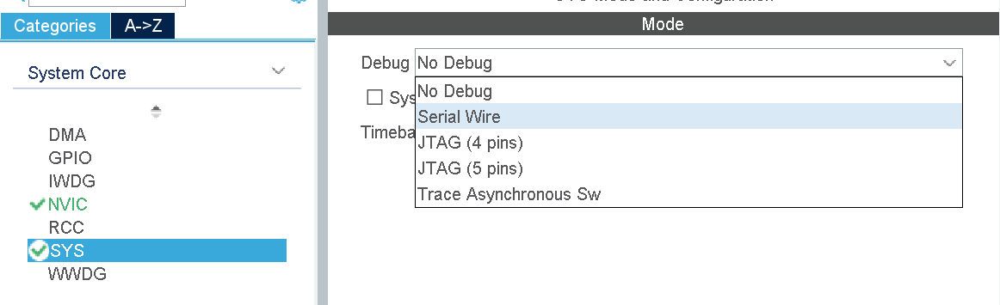

<span style="font-weight:bold; font-size:1.1em;">结合着这张图给我详细解释下System Core里面都有哪些东西，都是干什么的；SYS又是个什么东西呢，Debug是用来看什么的呢，图中Debug好像有多个选项，分别都是有什么用呢，我不是太懂，你能够给我详细解释下吗。</span>


这张截图非常关键，它展示了 STM32 芯片最底层的“生命维持系统”。

作为一个初学者，你可能会觉得这些缩写像天书一样。别担心，我把 **System Core** 比作一个 **“公司的后勤行政部门”**，带你逐个认识它们。

------


### 第一部分：System Core 里都有谁？（后勤部门大揭秘）

`System Core`（系统核心）里的模块，不负责具体业务（比如它们不负责点灯、不负责发波），它们负责维持整个芯片的**正常运行**。

1. **GPIO (General Purpose Input Output) - 公司的门窗和前台**
   - **作用：** 管理所有的引脚。
   - **解释：** 任何外设（比如 I2C、SPI）最终都要通过 GPIO 引脚连出去。你点灯也是在操作 GPIO。
2. **RCC (Reset and Clock Control) - 公司的心脏**
   - **作用：** **时钟控制**。
   - **解释：** 这是最重要的！STM32 的外设默认是“断电”的。你想用任何功能（比如想点个灯），必须先通过 RCC 给那个功能“供血”（开启时钟）。没有时钟，芯片就是一块石头。
3. **NVIC (Nested Vectored Interrupt Controller) - 公司的急诊室/调度员**
   - **作用：** **中断管理**。
   - **解释：** 当发生紧急情况（比如按键被按下、数据传输完成）时，NVIC 负责打断 CPU 正在做的工作，让 CPU 优先去处理紧急事件。
4. **DMA (Direct Memory Access) - 公司的搬运工**
   - **作用：** **直接存储器访问**。
   - **解释：** 它可以帮 CPU 搬运数据。比如要把一堆数据从串口搬到内存，以前要 CPU 亲自搬，有了 DMA，CPU 只要下个单，DMA 就自动搬完了，CPU 可以去干别的事。
5. **IWDG / WWDG (Watchdog) - 公司的保安**
   - **作用：** **看门狗**。
   - **解释：** 它们盯着 CPU。如果 CPU 程序跑飞了、死机了（长期不喂狗），看门狗就会强制重启芯片，防止系统“假死”。

------


### 第二部分：SYS 是个什么东西？

**SYS (System)** 是“系统配置控制器”。

它不像 GPIO 或 UART 那样是个具体的功能外设，它更像是一个**“杂项管理员”**。它<span style="color:#CC0000;">主要管两件事</span>：

1. **Timebase Source (时基源)：** 也就是芯片的“心跳”。默认是 SysTick（系统滴答定时器），RTOS（实时操作系统）需要用到它。
2. **Debug (调试接口)：** 也就是你截图里正在设置的，决定了你如何跟芯片对话。

------


### 第三部分：图中的 Debug 选项都是干嘛的？

这是你最困惑的地方。`Debug` 选项决定了你**牺牲哪些引脚**来换取**什么样的调试能力**。

我们一个一个看截图里的选项：


#### 1. No Debug (无调试)

- **含义：** 关闭调试功能。
- **代价：** PA13/PA14 等引脚全部释放，可以当普通 GPIO 用。
- **后果：** **极度危险！** 也就是我在上文提到的“把门封死”。一旦烧录进去，ST-Link 就连不上芯片了，下次无法下载程序（除非用复位键强行破解）。
- **适用场景：** 产品量产上市，为了防破解或者引脚实在不够用时才选。


#### 2. Serial Wire (串行调试 - **推荐！**)

- **含义：** 使用 SWD 协议。这是 ARM 专门为 STM32 这种微控制器设计的现代调试方式。
- **占用引脚：** **2根** (PA13, PA14)。
- **特点：** 速度快，占引脚少，功能强大（能下载也能调试）。
- **适用场景：** **99% 的 STM32 开发场景**，包括你的 Blue Pill 板子。


#### 3. JTAG (4 pins)

- **含义：** 使用标准的 JTAG 协议。这是一种非常古老的、通用的调试协议（很多路由器、FPGA 也用这个）。
- **占用引脚：** **4根** (PA13, PA14, PA15, PB3)。
- **特点：** 兼容性好，但太浪费引脚了！
- **适用场景：** 除非你用的是那种特别古老的、不支持 SWD 的调试器（比如旧版 J-Link 配合老芯片），否则不要选。


#### 4. JTAG (5 pins)

- **含义：** 4线 JTAG 加上一根复位线 (NJTRST)。
- **占用引脚：** **5根** (PA13, PA14, PA15, PB3, PB4)。
- **特点：** 更加浪费引脚。
- **后果：** 如果你选了这个，你的 PB3 和 PB4 引脚就被占用了，不能当普通的 IO 口用了。


#### 5. Trace Asynchronous Sw (异步追踪)

- **含义：** 在 Serial Wire (2根线) 的基础上，再增加一根 **SWO (Serial Wire Output)** 线。
- **占用引脚：** **3根** (PA13, PA14, PB3)。
- **特点：** 除了能调试，芯片还能通过那根 SWO 线，高速地把内部日志（printf）打印到电脑上，不需要占用额外的串口。
- **适用场景：** 高级调试技巧，需要你的 ST-Link 支持 SWO 功能（几十块钱的盗版 ST-Link 通常不支持）。

------


### 💡 专家总结：你该选哪个？

虽然选项很多，但对于你的 **STM32F103C8T6** 和目前的学习阶段，标准答案只有一个：

👉 **请坚定不移地选择：`Serial Wire`**

- **原因：**
  1. 你的调试器（ST-Link）最擅长这个协议。
  2. 它只占 2 个引脚，最省资源。
  3. 它能完美避开 PB3/PB4/PA15 等引脚的占用，让你少踩很多坑。

现在的概念清楚了吗？**SYS** 是管家，**Debug** 是管家手里通向外界的“电话线”，而 **Serial Wire** 就是最适合现代智能手机的那种高效电话线。


## 提问3

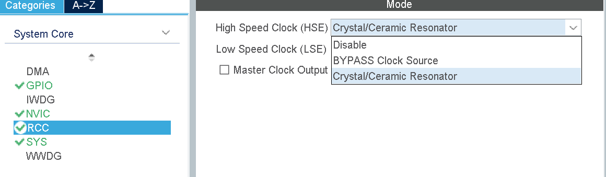


<span style="font-weight:bold; font-size:1.2em;">结合着这张图片给我解释下HSE和LSE都是什么东西，它们和HCLK和PCLK都有关系吗。还有图片中各个选项都是什么意思。我不是太懂，你能够给我详细解释下吗？</span>


这张图片展示的是 STM32 的**时钟源配置（RCC）**。如果说刚才的 System Core 是后勤部，那么 RCC 绝对是整个芯片的**“心脏起搏器”**。

没有时钟，芯片就是死物；时钟不准，通信（如串口、USB）就会全是乱码。

我来用通俗易懂的语言，帮你把这些缩写和选项彻底理顺。

------


### 第一部分：HSE 和 LSE 是什么？（两个心脏）

STM32 芯片里其实住着“两个人”，或者说它有两颗心脏：


#### 1. HSE (High Speed External) - “短跑运动员的心脏”

- **全称：** 高速外部时钟信号。
- **频率：** 很高，通常是 8MHz（蓝普板 Blue Pill 上那个银色的椭圆铁壳）。
- **作用：** **它是干重活的。** 经过内部放大（倍频）后，它变成了 **72MHz** 的主频，驱动 CPU 高速运算、跑游戏、做数学题。
- **关键点：** 如果你要性能稳定，通常都得开启它。


#### 2. LSE (Low Speed External) - “看门大爷的心脏”

- **全称：** 低速外部时钟信号。
- **频率：** 很低，固定是 **32.768kHz**（板子上那个细细长长的黑色圆柱体）。
- **作用：** <span style="color:#CC0000;">**它是用来计时的。** 它主要供给 **RTC (实时时钟)**</span>。哪怕主电源关了，只要有一颗纽扣电池供电，LSE 也能慢慢跳动，保证你下次开机时，时间显示还是准的（就像电脑主板上的时间一样）。
- **你的选择：**<span style="color:#CC0000;"> 如果你不做“电子表”类的功能，**LSE 可以选择 Disable (不开启)**，省两个引脚。</span>

------


### 第二部分：HSE 与 HCLK、PCLK 的关系（水源与水管）

你问到它们有没有关系，答案是：**有巨大的关系！**

这就像是一个**自来水厂的供水系统**：

1. **HSE (水源)：** 外部的 8MHz 晶振是**原始水源**。水流比较小，但很清澈（频率稳定）。

2. **PLL (加压泵/倍频器)：** HSE 的水流进来后，经过内部的 PLL (锁相环)，把 8MHz 的水压强行加大 9 倍，变成了 **72MHz**。

3. HCLK (主水管)：

   这 72MHz 的高压水流，就是 HCLK (AHB Clock)。它直接连接 CPU 大脑，让 CPU 跑得飞快。

4. PCLK (支流管道)：

   主水管 HCLK 的水太急了，外设（比如串口、定时器）受不了这么快的速度。所以需要通过分频器（减压阀）把速度降下来，这就变成了 PCLK (APB Clock)。

   - **PCLK1:** 给慢速外设用（最高 36MHz）。
   - **PCLK2:** 给高速外设用（最高 72MHz）。

总结链条：

HSE (8M) -> PLL (加压) -> HCLK (72M, CPU用) -> PCLK (分流, 外设用)。

如果 HSE 没配好，后面所有的 HCLK 和 PCLK 都会罢工或者频率错误。

------


### 第三部分：图片里的三个选项是什么意思？

在 HSE 这一栏，下拉菜单里有三个选项，这决定了芯片怎么“获取心跳”：


#### 1. Disable (关闭)

- **意思：** 我不接外面的晶振了。
- **后果：** 芯片会切换到使用内部自带的 **HSI (内部高速时钟)**。
- **优点：** 省钱，省引脚。
- **缺点：** **不准！** 内部时钟受温度影响大。如果你做串口通信，温差大时可能会出现乱码。


#### 2. Crystal/Ceramic Resonator (晶体/陶瓷 谐振器) —— **【这是你的正确选择】**

- **意思：** 我在外面接了一个**无源晶振**（就是板子上那个两脚的银色金属壳）。
- **原理：** 芯片内部会往这两个引脚输送能量，让外面的金属片震动起来，产生频率。
- **适用：** 99% 的开发板（包括你的 STM32F103C8T6）都是这种设计。


#### 3. BYPASS Clock Source (旁路时钟源)

- **意思：** 我外面有一个**有源晶振**或者**信号发生器**。
- **原理：** 外部设备自己就能产生方波信号，芯片不需要输出能量，只需要像听收音机一样“听”这个信号就行了（旁路掉内部的驱动电路）。
- **适用：** 复杂的工业板，或者两块芯片共用一个时钟源的情况。

------


### 💡 专家操作建议

针对你手里的 **STM32F103C8T6 (Blue Pill)** 开发板：

1. **High Speed Clock (HSE):** 请务必选择 **Crystal/Ceramic Resonator**。
   - *因为你的板子上焊了一个 8MHz 的无源晶振。*
2. **Low Speed Clock (LSE):** 可以保持 **Disable**。
   - *除非你要做日历功能，否则不需要开启，这样还能省下 PC14 和 PC15 两个引脚当普通 IO 用。*

设置完这一步（选了 Crystal...），你再去点上面的 **"Clock Configuration"** 标签页，在中间的 HCLK 框里输 **72** 回车，软件就会根据你的这个设置，自动把后面的倍频系数算好。

这一块逻辑现在通顺了吗？


## 提问4

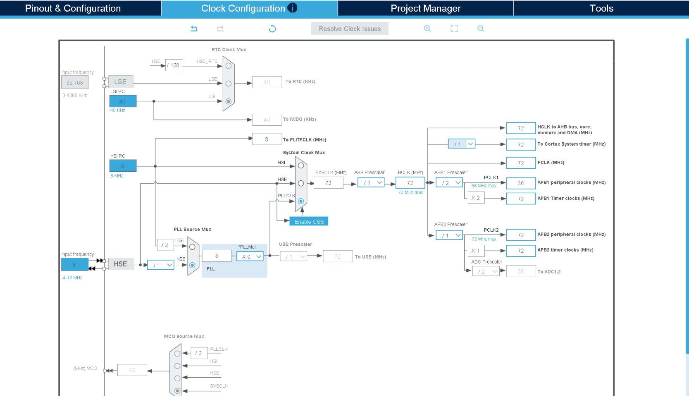

<span style="font-weight:bold; font-size:1.2em;">这个时钟树的配置图我有点看不太懂，你能够给我详细解释下吗。最好能够举个配置例子来让我彻底弄明白。</span>


这张图确实像一张复杂的地铁线路图，但请放心，这是每一个 STM32 开发者都要面对的“成人礼”。一旦你看懂了这一次，以后所有芯片的时钟树你都能秒懂。

为了让你彻底明白，我们采用**“自来水厂供水”**的比喻来拆解这张图。

请把电流（时钟信号）想象成**水流**，把频率（MHz）想象成**水压**。

------


### 🗺️ 核心路径拆解（从左往右看）

你的目标是：把左边仅有 **8MHz**（水压很小）的水源，变成中间 **72MHz**（水压极大）的主流，最后分流给各个部门。

请跟着我看你截图中的那条**高亮的蓝色线条**，这就是水流的路径：


#### 1. 水源头 (Input Frequency)

- **位置：** 最左侧蓝色的 `Input frequency` 框。
- **数值：** **8**。
- **解释：** 这就是我们在上一张图配置的 **HSE**（外部 8MHz 晶振）。这是整个自来水厂的**原始水源**。


#### 2. 第一道关卡 (HSE / PLL Source Mux)

- **位置：** `PLL Source Mux` 那里。
- **状态：** 开关打到了 **HSE** 那一侧。
- **解释：** 意思是我们决定用“外部水源”进厂，而不是用那个不干净的“内部水源”（HSI）。


#### 3. 加压泵 (PLL - 核心！)

- **位置：** 中间那个写着 `PLLMul` 的方框，里面写着 **X 9**。
- **计算：** $8\text{MHz (进来的水)} \times 9\text{ (加压9倍)} = 72\text{MHz}$。
- **解释：** **<span style="color:#CC0000;">锁相环 (PLL)</span>** 是最重要的部件，它是一个超级加压泵。它把微弱的 8MHz 信号变成了强劲的 72MHz。


#### 4. 总闸门 (System Clock Mux)

- **位置：** `System Clock Mux`。
- **状态：** 开关选到了 **PLLCLK**。
- **解释：** 系统确认：“好，我就用这个加压后的 72MHz 水流作为全厂的主供水！”
- **结果：** 后面的 **SYSCLK (MHz)** 显示为 **72**。


#### 5. 主管道 (AHB Prescaler / HCLK)

- **位置：** `AHB Prescaler` 显示 `/1`，后面 `HCLK` 显示 `72`。
- **解释：** 这是通往 **CPU 大脑** 的主管道。这里没有减压（除以1），所以 CPU 全速运行在 **72MHz**。这是 STM32F103 的极限速度。


#### 6. 分流管道 (APB1 和 APB2) —— **这里有坑！**

你会发现右边分成了两条路，为什么一个除以2，一个除以1？

- **PCLK1 (APB1 Prescaler):**
  - **配置：** `/ 2` (除以2)。
  - **结果：** $72 / 2 = 36\text{MHz}$。
  - **原因：** **这是硬性规定！** STM32F103 的 APB1 总线（挂载着普通定时器、串口2等慢速设备）**最高只能跑 36MHz**。如果你强行给它 72MHz，它会烧坏或者罢工。所以 CubeMX 自动帮你设置了除以 2。
- **PCLK2 (APB2 Prescaler):**
  - **配置：** `/ 1` (除以1)。
  - **结果：** $72 / 1 = 72\text{MHz}$。
  - **原因：** APB2 总线（挂载着 GPIO、ADC、串口1等高速设备）性能好，**可以跑满 72MHz**，所以不用减速。

------


### 🧪 举个例子让你彻底明白

假设你要配置一个定时器，让 LED 灯 **1秒钟闪烁一次**。

你作为程序员，需要知道定时器的“心跳”有多快，才能计算出“数多少个数等于1秒”。

**如果你看懂了这张图，你就会知道：**

- 如果你的定时器挂在 **APB1** 上（比如 TIM2, TIM3）：
  - 看图得知 APB1 是 **36MHz**。
  - 但是在图的最右边，有一个 `APB1 Timer clocks (MHz)`，它显示的是 **72MHz**（这里有个倍频机制，x2）。
  - **结论：** 你的定时器 1秒钟会数 72,000,000 下。
- 如果你的定时器挂在 **APB2** 上（比如 TIM1）：
  - 看图得知 `APB2 timer clocks` 也是 **72MHz**。

要是没有这张图配置好：

假设你忘记配置倍频（X9），系统默认跑在 8MHz。你程序里写“延时1秒”，实际运行起来可能会变成“延时9秒”，整个系统就慢得像蜗牛一样。

------


### ⚡️ 专家总结：你只要做一件事

虽然原理讲了这么多，但在 CubeMX 里操作其实只有**一步**：

看到图中那个 HCLK (MHz) 的框了吗？

（就在图中间偏右一点，现在显示 72 的那个框）

1. **以后你不管三七二十一，直接在这个框里输入你想要的频率（比如 72）。**
2. **按下键盘回车键 (Enter)。**
3. **软件会弹窗问你是否自动调整？点击 OK。**

CubeMX 会自动帮你倒推，帮你把前面的 `/1`、`X9`、`/2` 全部计算好并填进去！

**目前的截图状态就是最完美的满速配置 (72M)，你不需要修改任何东西。**

现在，你的“供水系统”已经建设完毕，我们可以去生成代码了吗？


## 提问 4  - （1）

<span style="font-weight:bold; font-size:1.2em;">我有点分不清AHB，SYSCKL，APB1，APB2，HCKL，PCLK1，PCLK2，SYSTIC，它们都是有什么区别吗，我不是太懂，你能够给我解释下吗？</span>


这是一个非常棒的问题！这堆缩写确实是 STM32 时钟系统里最容易把人绕晕的地方。

如果不搞清楚，你以后写代码时可能会遇到“为什么我的波特率不对？”或者“为什么定时器时间没算准？”这类问题。

我把它们分成 **三组** 来讲，配合一个 **“公司管理”** 的比喻，保证你一看就懂。

------


### 第一组：大老板与主干道 (SYSCLK, AHB, HCLK)

想象 STM32 芯片是一个 **大型物流公司**。

1. **SYSCLK (System Clock) —— 公司的大老板（最高决策速度）**
   - **定义：** 系统时钟。它是经过 PLL 倍频后生成的那个 **72MHz** 的源头信号。
   - **地位：** 全公司所有的节奏，都是由它决定的。它是源头。
2. **AHB (Advanced High-performance Bus) —— 公司的高速主干道（物理道路）**
   - **定义：** 先进高性能总线。
   - **比喻：** 这是连接 CEO 办公室（CPU）、仓库（Flash/SRAM）和搬运工（DMA）的 **双向八车道高速公路**。
   - **作用：** 只有最核心、数据吞吐量最大的部门才挂在这条路上。
3. **HCLK (AHB Clock) —— 主干道上的限速牌（时钟频率）**
   - **定义：** AHB 总线的时钟。
   - **区别：** **<span style="color:#CC0000;">AHB 是路的名字，HCLK 是路上的车速。</span>**
   - **数值：** 在 STM32F103 上，通常 **HCLK = SYSCLK = 72MHz**（不分频）。CPU 跑的速度就是 HCLK 的速度。

> **一句话总结：** SYSCLK 产出频率，HCLK 把这个频率送给 CPU 和内存，让它们全速跑 (72MHz)。

------


### 第二组：两条分流支路 (APB1/PCLK1, APB2/PCLK2)

主干道 HCLK 的速度太快了 (72MHz)，很多外设（比如简单的串口、I2C）反应不过来，或者为了省电，不需要那么快。所以需要 **降速**，于是分出了两条支路。

这里有个重要的区分：**Bus (总线)** 和 **Clock (时钟)**。

- <span style="color:#CC0000;">**APB** 是路名（总线）。</span>
- <span style="color:#CC0000;">**PCLK** 是路上的车速（时钟）。</span>


#### 1. 慢速支路：APB1 和 PCLK1

- **APB1 (Advanced Peripheral Bus 1)：** **慢速外设总线**。
- **PCLK1 (Peripheral Clock 1)：** APB1 路上的速度。
- **限制：** 在 STM32F103 上，它的最高速度只能是 **36MHz**（也就是主频的一半）。
- **挂载的设备：** “养老部门”，如普通定时器 (TIM2/3/4)、串口2 (USART2)、I2C、看门狗。


#### 2. 高速支路：APB2 和 PCLK2

- **APB2 (Advanced Peripheral Bus 2)：** **高速外设总线**。
- **PCLK2 (Peripheral Clock 2)：** APB2 路上的速度。
- **限制：** 它可以跑满速，最高 **72MHz**。
- **挂载的设备：** “特种部队”，如 **GPIO** (开关灯要快)、**ADC** (采集电压要快)、串口1 (USART1)、高级定时器 (TIM1/8)。

> ⚠️ 避坑指南：
>
> 写代码时，如果你要开启某个外设的时钟（比如 __HAL_RCC_GPIOA_CLK_ENABLE()），你要知道它挂在哪条线上。
>
> - GPIO 通常在 **APB2** (高速)。
> - 普通串口/I2C 通常在 **APB1** (低速)。

------


### 第三组：特立独行的心跳 (SysTick)

**SysTick (System Tick Timer) —— CPU 的随身怀表**

- **定义：** 系统滴答定时器。
- **区别：** 它不属于上面的任何一个外设（不在 APB1/2 上），它直接住在 **CPU 内核（Cortex-M3）** 里面。
- **作用：**
  1. **给 RTOS 用：** 如果你跑操作系统（FreeRTOS），它需要一个固定的心跳来切换任务（比如每 1ms 醒一次）。
  2. **给 `HAL_Delay()` 用：** 你写代码时用的 `HAL_Delay(1000);` (延时1秒)，就是靠 SysTick 在后台默默数数来实现的。
- **频率：** 通常也是 72MHz。

------


### 📝 总结对照表（以 STM32F103 为例）

| **缩写**    | **全称**     | **这里的“身份”** | **典型频率** | **谁挂在上面？**   |
| ----------- | ------------ | ---------------- | ------------ | ------------------ |
| **SYSCLK**  | 系统时钟     | **总源头**       | 72MHz        | 所有东西的祖宗     |
| **AHB**     | 高速总线     | **路名**         | -            | CPU, DMA, Flash    |
| **HCLK**    | AHB时钟      | **车速**         | 72MHz        | 决定 CPU 跑多快    |
| **APB2**    | 高速外设总线 | **路名**         | -            | GPIO, ADC, USART1  |
| **PCLK2**   | APB2时钟     | **车速**         | **72MHz**    | 高速外设的速度     |
| **APB1**    | 低速外设总线 | **路名**         | -            | USART2, I2C, TIM2  |
| **PCLK1**   | APB1时钟     | **车速**         | **36MHz**    | 慢速外设的速度     |
| **SysTick** | 滴答定时器   | **私人物品**     | 72MHz        | 延时函数, 操作系统 |

现在是不是清晰多了？

CubeMX 那个时钟树图，其实就是把 SYSCLK 这一桶水，通过 HCLK 主管，分流给 PCLK1（限流一半）和 PCLK2（全速）的过程。


## 提问5

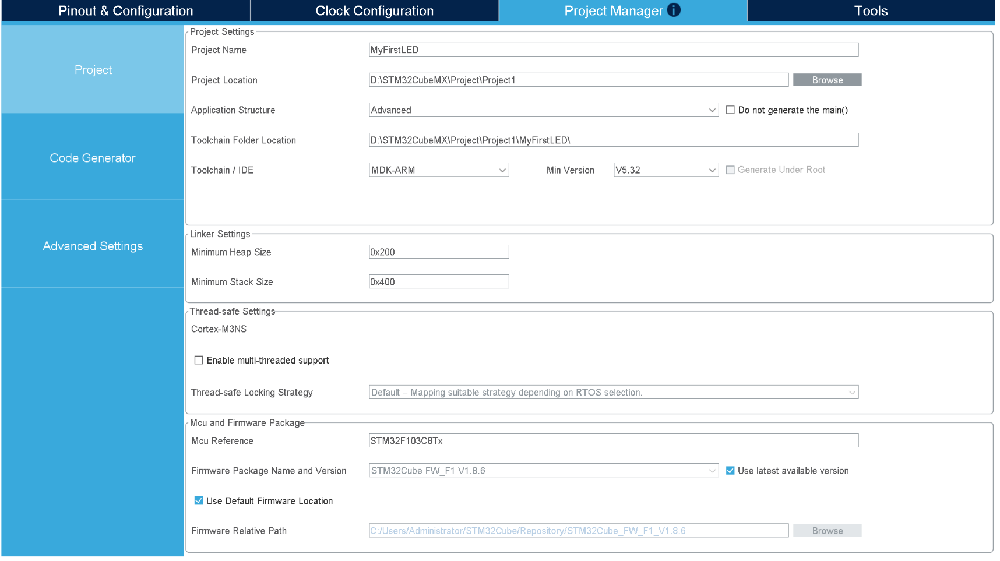

<span style="font-weight:bold; font-size:1.2em;">这里都是用来配置什么的，我有点看不太懂，你能够给我详细解释下吗，有哪些是我需要修改的，有哪些又是不需要我动的呢，最好能够举个例子来让我彻底弄明白。</span>


这张图是 **Project Manager（工程管理器）**，相当于你这个工程的“身份证”和“户口本”。

它决定了你的代码叫什么名字、存放在哪里、以及**<span style="color:#CC0000;">生成给哪个软件（IDE）使用</span>**。

为了让你彻底弄懂，我把它分为 **“必须修改/确认的”** 和 **“不用动的”** 两大类来讲解。

------


### ✅ 第一类：核心配置（你必须懂，且可能要改）

请看 **Project Settings** 这一栏：

#### 1. Project Name (工程名称)

- **现在的填法：** `MyFirstLED`
- **解释：** 就是你这个项目的名字。
- **⚠️ 注意：** 最好用英文，**不要有空格**（比如不要写 `My First LED`，要写 `My_First_LED`）。


#### 2. Project Location (工程路径)

- **现在的填法：** `D:\STM32CubeMX\Project\Project1`
- **解释：** 项目保存在电脑的哪个文件夹里。
- **⚠️ 红色警报：** **路径里绝对不能包含中文！绝对不能！** 否则生成的代码编译时会报错，或者 Keil 打不开。


#### 3. Application Structure (应用结构)

- **现在的选择：** `Advanced`
- **解释：** 决定生成的文件夹长什么样。
  - **Basic (基础)：** 所有代码文件（main.c, stm32xxx.c）都堆在同一个文件夹里。—— *乱，不推荐。*
  - **Advanced (高级)：** 会自动帮你分类。源代码放在 `Src` 文件夹，头文件放在 `Inc` 文件夹。—— *清晰，**强烈推荐保持默认 (Advanced)**。*


#### 4. Toolchain / IDE (工具链 / 开发环境) —— **【最关键的一项】**

- **现在的选择：** `MDK-ARM`
- **解释：** 这里决定了 CubeMX 会生成什么格式的工程文件。
  - 如果你用 **Keil uVision 5** 写代码，**必须选 `MDK-ARM`**（如图所示）。
  - 如果你用 **IAR**，就选 `EWARM`。
  - 如果你用 **STM32CubeIDE**，就选 `STM32CubeIDE`。
  - 如果你用 **VSCode** 配置 GCC，通常选 `Makefile` 或 `CMake`。
- **Min Version:** 后面的 `V5.32` 是指 Keil 的版本号。通常默认即可，除非你的 Keil 版本特别老（比如 V4），否则不用改。

------


### 🛑 第二类：高级配置（新手暂时不用动）

#### 1. Linker Settings (链接器设置 - 堆栈大小)

- **Minimum Heap Size (0x200):** 堆空间。主要用于 `malloc` 动态内存分配。如果你不用 `malloc`，这个其实没啥用。
- **Minimum Stack Size (0x400):** 栈空间。用于函数调用、局部变量。
- **专家建议：** 对于点个灯、跑个串口这种简单程序，**默认值完全够用，不需要改**。以后如果你发现程序莫名其妙跑飞了，或者使用了很大的数组，才需要来把这个改大。


#### 2. Mcu and Firmware Package (固件包版本)

- **解释：** 这里显示你当前用的是哪个版本的 STM32F1 驱动库（图显示 V1.8.6）。
- **专家建议：** **完全不用动**。勾选 `Use latest available version`（使用最新版）是最好的选择。

------


### 🚀 专家补充：千万别漏了左边的一个按钮！

你现在看的是 **Project** 标签页（左侧蓝色背景高亮处）。

**在你点“生成代码”之前，请务必点击左侧蓝色的 【Code Generator】 标签！**

那里有两个**黄金设置**，我强烈建议你修改（虽然不在你现在的截图里，但我必须告诉你）：

1. **勾选** `Copy only the necessary library files`
   - *作用：* 只复制用到的库文件。否则你的工程会非常巨大（几百MB），编译也很慢。
2. **勾选** `Generate peripheral initialization as a pair of '.c/.h' files per peripheral`
   - *作用：* **代码分家**。
   - *不勾选：* 所有的初始化代码（GPIO、串口、定时器）全都会挤在 `main.c` 里，又臭又长。
   - *勾选后：* 软件会自动生成 `gpio.c`, `usart.c`, `tim.c`，每个外设管理自己的代码，`main.c` 会非常清爽。

------


### 📝 总结：你现在该做什么？

针对你这张截图：

1. **检查路径：** 再次确认 `D:\STM32CubeMX...` 这个路径里没有中文。
2. **确认 IDE：** 确认你电脑上装的是 **Keil 5**，且这里选的是 **MDK-ARM**。
3. **下一步操作：** 点击左侧的 **Code Generator** 标签，按我上面的建议勾选那两个选项。
4. **最后：** 点击右上角的 **GENERATE CODE**。

**去做这最后一步配置吧，然后点生成，看看能不能成功唤醒 Keil！**


## 提问 5 - （1）

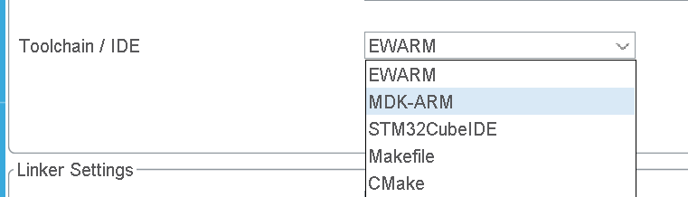


<span style="font-weight:bold; font-size:1.2em;">这里IDE都是有什么区别呢，我不是太懂，你能够给我详细解释下吗，你推荐我使用哪个IDE呢，以及为什么推荐我使用这个IDE呢，还有IDES是个什么东西。</span>


这又是一个直击灵魂的好问题！很多新手上来就照着教程选，却根本不知道自己选的是什么，也不知道为什么要选它。

我先回答你最后那个小问题：**IDE 是什么？**

------


### 1. 什么是 IDE？(Integrated Development Environment)

IDE 的中文叫 “集成开发环境”。

这听起来很学术，我们用 “厨房” 来打比方：

- **写代码** 就像 **切菜**（处理食材）。
- **编译代码**（把C语言变成芯片能懂的0101）就像 **炒菜**（弄熟）。
- **下载/调试** 就像 **装盘和尝味道**。

如果你没有 IDE，你需要买一把刀切菜，再买个灶台炒菜，再买个盘子装菜，每次都要在不同的工具之间跑来跑去，非常麻烦。

IDE 就是一个“一体化智能厨房”：它把刀（代码编辑器）、灶台（编译器）、盘子（下载器）全装在一个软件里了。你只需要点一个按钮，它就自动帮你切好、炒好、端上来。

------


### 2. 这些选项的区别是什么？

STM32CubeMX 这里的选项，就是在问你：**“老板，你打算把这些食材（代码）送到哪个厨房（IDE）里去加工？”**

我们逐个点评一下：


#### A. MDK-ARM (也就是 Keil uVision) —— **【最推荐新手】**

- **江湖地位：** “教科书级”的老大哥。
- **特点：**
  - **优点：** 在国内极其普及，99% 的大学教材、电子发烧友论坛、B站教程都在用它。遇到问题随便一搜就有答案。
  - **缺点：** 界面比较复古（像20年前的软件），也是收费软件（虽然国内很多学生用...你懂的）。
- **适合谁：** **初学者、学生、跟着网上教程学习的人。**


#### B. STM32CubeIDE —— **【官方亲儿子】**

- **江湖地位：** ST 公司自己推出的免费软件。
- **特点：**
  - **优点：** **完全免费**，界面比较现代（基于 Eclipse，像 Java 开发工具），自带了 CubeMX，功能很全。
  - **缺点：** 稍微有点吃内存，启动慢一点。国内教程相对 Keil 少一些，但正在变多。
- **适合谁：** 不想折腾破解软件的人、喜欢免费开源精神的人、公司不允许用盗版软件的工程师。


#### C. EWARM (IAR Embedded Workbench) —— **【工业界的扫地僧】**

- **江湖地位：** 专业、昂贵、硬核。
- **特点：**
  - **优点：** 编译出来的代码跑得飞快，代码体积最小。在汽车、医疗等高端工业领域用得很多。
  - **缺点：** **死贵死贵**（几万块一套），界面比 Keil 还要丑和难用。
- **适合谁：** 资深嵌入式工程师、大厂员工。


#### D. Makefile / CMake —— **【极客的玩具】**

- **江湖地位：** 万能胶水。
- **特点：** 它们不是 IDE，而是构建脚本。选这个是为了配合 **VS Code** 或 **CLion** 这种第三方编辑器使用的。
- **适合谁：** 嫌弃 Keil 界面丑、喜欢用 VS Code 的高级程序员。**新手千万别碰，配置环境会让你崩溃。**

------


### 3. 专家推荐：你该选哪个？

既然你是刚开始学，用的又是 STM32F103C8T6 这种入门神车，我**强烈推荐**你选择：

👉 **MDK-ARM** (配合 Keil 5 软件)

**推荐理由：**

1. **随大流不迷路：** 你在网上找到的关于 STM32F103 的例程代码，几乎全是 Keil 工程。如果你选了别的 IDE，别人的代码你就打不开了。
2. **调试方便：** Keil 的软件仿真功能（不用板子也能跑代码）是目前最强的。
3. **环境单纯：** 你之前的截图里已经选了 `MDK-ARM`，而且后面的版本选了 `V5.32`，这说明你电脑上可能已经装好了 Keil 或者准备装它，这是一条最顺畅的路。

总结建议：

请在下拉菜单中选择 MDK-ARM，然后点击生成代码。生成的工程文件后缀是 .uvprojx，双击它就能直接启动 Keil 开始写代码了！


## 提问6

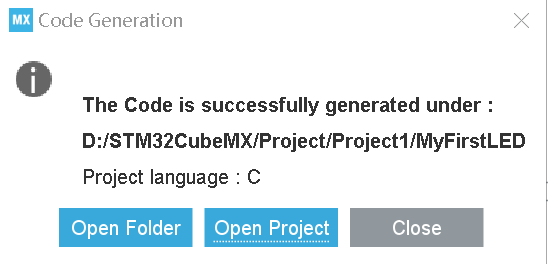

<span style="font-weight:bold; font-size:1.1em;">出现这个页面我该选择哪个选项呢，打开文件夹和打开工程这两个有什么区别吗，我不是太懂，你能够给我详细解释下吗。</span>


恭喜你！看到这个弹窗，说明你的**代码生成工作已经圆满成功**了！

简单直接的回答：

👉 请毫不犹豫地点击中间那个按钮：【Open Project】 (打开工程)。

------


### 详细解释：这两个按钮有什么区别？

为了让你彻底明白，我们把写代码比作 **“炒菜”**。


#### 1. Open Folder (打开文件夹)

- **发生了什么：** 电脑会打开“文件资源管理器”（也就是那个黄色的文件夹窗口），带你来到 `D:\STM32CubeMX\Project\Project1\MyFirstLED` 这个目录下。
- **你能看到什么：** 你会看到 `Src`、`Inc`、`MDK-ARM` 这些文件夹。
- **比喻：** 这就像是你走进了 **“厨房”**，看着一堆食材（文件）摆在那里，但你手里并没有锅铲，也不能开始炒菜。
- **什么时候用：** 当你想把整个工程打包发给别人，或者想手动复制粘贴某些文件时，才点这个。


#### 2. Open Project (打开工程) —— **【这就是你要点的】**

- **发生了什么：** 电脑会自动启动你的编程软件（**Keil MDK**），并且自动帮你加载好刚才生成的所有文件。
- **你能看到什么：** Keil 软件启动，左侧工程栏里整整齐齐列好了代码文件，你可以直接开始写代码了。
- **比喻：** 这就像是你不仅进了厨房，而且**直接点火开灶**，锅铲已经拿在手里了，马上就可以开始炒菜（写代码）了。

------


### ⚠️ 警告：进入代码后的“生死红线”

点击 **Open Project** 后，Keil 会打开。在你兴奋地开始写代码之前，请务必听我这最后一句**最重要的叮嘱**：

在 `main.c` 文件里，你会看到很多像下面这样的注释：

C

```c
/* USER CODE BEGIN 2 */

   （也就是这里！）

/* USER CODE END 2 */
```

专家死命令：

你的所有代码，必须、绝对、只能写在 BEGIN 和 END 这两行注释中间！

- 为什么要这样？

  因为 STM32CubeMX 是支持“反复修改”的。如果你以后想回来改个引脚配置，重新点击“Generate Code”时，软件会保留 BEGIN 和 END 中间的代码，而删除并重写这两行之外的所有代码。

- 如果不遵守：

  如果你把代码写在外面，下次一点生成，你的心血就全没了！

------

现在的操作：

快点击 Open Project 吧！如果有 Keil 启动成功的界面，或者不知道代码写在哪，随时截图发给我！


## 提问7（项目目录）

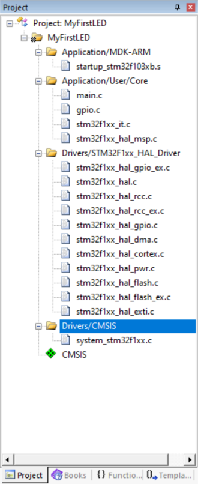

<span style="font-weight:bold; font-size:1.2em;">这里是我生成的代码目录，这个目录结构要怎么看呢以及图中展示的各个文件都是干什么用的呢，我真正写代码是在哪里写的呢，哪些文件是需要我们修改哪些又是不需要我们动的呢。我不是太懂，你能够给我详细解释下吗。</span>


太棒了！看到这个文件列表，说明你已经成功迈过了“环境配置”这座大山，正式进入了“代码开发”的领地。

为了让你看懂这个目录，我把它们按照 **“红绿灯”** 的规则分成三类，告诉你哪里是你的**主战场**，哪里是**绝对禁区**。

------


### 🟢 绿灯区：你的主战场 (Application/User/Core)

请把目光死死锁定在 **`Application/User/Core`** 这个文件夹上。<span style="color:#CC0000;">这里是你的家，你 99% 的时间都在这里工作</span>。

1. **`main.c` (主角 / 司令部)**
   - **作用：** 这是<span style="color:#CC0000;">整个程序的**入口**</span>。芯片上电后，经过一番准备，最终会跳到这里的 `main()` 函数开始干活。
   - **你要做的：** 你的**业务逻辑**（比如：让 LED 亮、延时、让 LED 灭）主要就写在这里面的 `while(1)` 循环里。
2. **`gpio.c` (外设管家)**
   - **作用：**<span style="color:#CC0000;"> 还记得你刚才听我的建议，勾选了“生成独立的 .c/.h 文件”吗？这就是成果！STM32CubeMX 把所有关于 GPIO（引脚）初始化的代码都单独拎出来放在这里了。</span>
   - **你要做的：** 通常不需要动。但如果你想看引脚是怎么被初始化的，可以点进去看看。
3. **`stm32f1xx_it.c` (急诊室 / 中断服务)**
   - **作用：** 专门<span style="color:#CC0000;">处理**中断**的文件</span>。比如你配置了一个定时器中断，或者串口接收中断，当事情发生时，CPU 会自动跳到这个文件里找对应的函数执行。
   - **你要做的：** 目前点灯不需要动它。<span style="color:#CC0000;">等以后学到“中断”章节时，你会在这个文件里写代码。</span>
4. **`stm32f1xx_hal_msp.c` (底层搬运工)**
   - **作用：** 这是 HAL 库的一个底层接口文件（MSP = MCU Support Package），<span style="color:#CC0000;">负责初始化具体的硬件资源（如开启时钟、映射引脚）。</span>
   - **专家建议：** **新手完全不用管，千万别乱改。** CubeMX 已经帮你生成好了。

------


### 🔴 红灯区：绝对禁区 (Drivers & Startup)

这些文件是 ST 官方写好的“地基”和“工具箱”，**严禁修改！** 只要改错一个字，你的程序可能就再也跑不起来了。

1. **`Drivers/STM32F1xx_HAL_Driver` (工具箱)**
   - **里面全是 `stm32f1xx_hal_xxx.c`**。
   - **作用：** 这是 ST 提供的 **HAL 库**（Hardware Abstraction Layer）。比如你想点灯，你会调用 `HAL_GPIO_WritePin()`，这个函数的**具体实现代码**就藏在 `stm32f1xx_hal_gpio.c` 里。
   - **对待方式：** **<span style="color:#CC0000;">只读不改</span>**。把它们当成字典查阅即可。
2. **`Drivers/CMSIS` -> `system_stm32f1xx.c` (系统时钟配置)**
   - **作用：** 负责在上电的一瞬间，把芯片时钟设置成 72MHz。
   - **对待方式：** CubeMX 已经生成好了，**不要动**。
3. **`Application/MDK-ARM` -> `startup_stm32f103xb.s` (启动文件)**
   - **作用：** 这是一个汇编文件（后缀是 .s）。它是芯片上电后运行的**第一行代码**，负责初始化堆栈，然后把指挥权交给 `main` 函数。
   - **对待方式：** **绝对禁区**。看都不要看，这是汇编语言，很难懂且不需要改。

------


### 💻 实战演示：你现在该在哪里写代码？

现在，请双击打开 **`main.c`** 文件，我带你写下你的第一行代码。

1. 找到 while (1) 循环

在 main.c 里向下拉，找到这个死循环：

C

```c
  /* USER CODE BEGIN WHILE */
  while (1)
  {
    /* USER CODE END WHILE */

    /* USER CODE BEGIN 3 */

    // ---> 这里就是你写代码的地方！ <---

    /* USER CODE END 3 */
  }
```

\2. 写入点灯代码

假设你的 LED 接在 PC13 引脚上（Blue Pill 板子的常见接法），请在 USER CODE BEGIN 3 和 END 3 之间输入以下代码：

C

```c
    // 1. 把 PC13 引脚置为低电平 (LED亮，因为板载LED通常是低电平点亮)
    HAL_GPIO_WritePin(GPIOC, GPIO_PIN_13, GPIO_PIN_RESET);
    
    // 2. 延时 500 毫秒 (半秒)
    HAL_Delay(500);
    
    // 3. 把 PC13 引脚置为高电平 (LED灭)
    HAL_GPIO_WritePin(GPIOC, GPIO_PIN_13, GPIO_PIN_SET);
    
    // 4. 再延时 500 毫秒
    HAL_Delay(500);
```

再次强调专家铁律：

一定要把代码写在 /* USER CODE BEGIN ... */ 和 /* USER CODE END ... */ 之间！否则下次更新配置时代码会消失！

------


### 🔧 下一步做什么？

1. **双击 `main.c`** 打开它。
2. 找到 `while(1)`。
3. 把上面的代码复制进去（如果你是 PC13 的话）。
4. 点击 Keil 软件左上角的 **“Rebuild”** 按钮（图标像两个白色的循环箭头，或者按 F7）。

如果下方的 **Build Output** 窗口显示 `0 Error(s), 0 Warning(s)`，那么恭喜你，你的第一个 STM32 程序就编写成功了！

准备好开始写了吗？有问题随时截图给我！


# 自动生成代码Core文件夹内容

## 提问1

<span style="font-weight:bold; font-size:1.1em;">这个使用STM32Cube自动生成的代码（Core文件夹里面内容）我有点看不太懂，你能够给我详细解释下吗？</span>

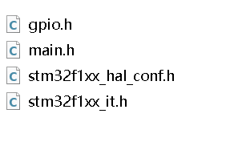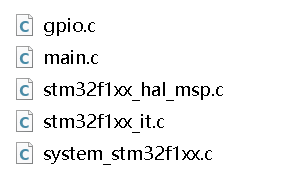

这份 STM32CubeMX 自动生成的代码看起来很复杂，但其实结构非常清晰。你可以把它想象成一个**“拎包入住”的精装修房子**：地基、水电、墙壁（底层驱动）都已经建好了，你只需要把你的家具（业务代码）摆进去就行。

为了让你彻底看懂，我结合你上传的文件，把这个工程拆解成**三个层次**来讲解：


### 第一层：司令部 (main.c) —— 你的主战场

**文件：`Core/Src/main.c`**

这是整个程序的入口，也是你写代码最多的地方。芯片一上电，干完杂活后，最终都会跑到这里的 `main()` 函数里。

我们来看看 `main()` 函数里都发生了什么（请对照你文件中的代码）：

1. **`HAL_Init();`**
   - **作用：** 这是“开机自检”。它会重置所有外设，初始化 Flash 接口，并启动 SysTick（滴答定时器，用于计算延时）。
   - **要改吗？** **绝对不要动。**
2. **`SystemClock_Config();`**
   - **作用：** 这是“心脏起搏”。它配置了我们在 CubeMX 里画的那个时钟树。
   - **细节：** 你看代码下面 `SystemClock_Config` 函数的实现，里面有 `RCC_OSCILLATORTYPE_HSE`（使用外部晶振）和 `RCC_PLL_MUL9`（9倍频），这正是你之前在图形界面里设置的参数。
   - **要改吗？** **不要手动改。** 如果想改时钟，回 CubeMX 软件改完重新生成即可。
3. **`MX_GPIO_Init();`**
   - **作用：** 这是“部门初始化”。它调用了专门负责 GPIO 的初始化函数。
   - **要改吗？** 它是自动生成的，通常不需要动。
4. **`while (1)` 死循环**
   - **作用：** 这是程序的主舞台。
   - **怎么用：** 你的业务逻辑（比如“每隔 1 秒闪烁 LED”）就写在这个大括号里。
   - **关键点：** <span style="color:#CC0000;">记得把代码写在 `/* USER CODE BEGIN 3 */` 和 `/* USER CODE END 3 */` 之间！</span>

------


### 第二层：专业部门 (gpio.c, stm32f1xx_it.c) —— 各司其职

CubeMX 为了不让 `main.c` 太臃肿，把不同功能的代码分到了不同的文件里。


#### 1. `Core/Src/gpio.c` —— 装修队 (负责引脚)

- **内容：** 这里面只有一个主要函数 `MX_GPIO_Init()`。
- **它干了什么：**
  - `__HAL_RCC_GPIOC_CLK_ENABLE();`：**打开时钟**。还记得之前说的吗？不给 GPIOC 供电（时钟），它就是块石头。
  - `HAL_GPIO_WritePin(GPIOC, GPIO_PIN_13, GPIO_PIN_RESET);`：**设置初始电平**。这里默认把 PC13 拉低了。
  - `HAL_GPIO_Init(...)`：**配置模式**。设置为推挽输出 (Output PP)、低速模式等。


#### 2. `Core/Src/stm32f1xx_it.c` —— 急诊室 (负责中断)

- **内容：** 这里全是以后缀 `_Handler` 结尾的函数。
- **它干了什么：** 当发生中断（比如定时器时间到了、串口收到数据了、或者芯片死机了）时，CPU 会暂停手里的活，自动跳到这里对应的函数执行。
- **重要函数：**
  - `SysTick_Handler()`：这是滴答定时器的中断，它调用了 `HAL_IncTick()`，给系统提供时间基准（`HAL_Delay` 就是靠它计时的）。
  - `HardFault_Handler()`：硬件错误中断。如果你的程序卡死在 `while(1)` 里出不来，通常就是掉进这里了（比如数组越界、指针指错地方）。

------


### 第三层：地基与后勤 (system..., msp...) —— 隐形守护者

这些文件你平时基本不用打开，但它们默默支撑着整个系统。

1. **`Core/Src/system_stm32f1xx.c`**
   - **作用：** 这是比 `main()` 更早运行的代码。其中的 `SystemInit()` 函数负责初始化嵌入式 Flash 接口、中断向量表等最底层的硬件。它是芯片的“启动引导”。
2. **`Core/Src/stm32f1xx_hal_msp.c`**
   - **作用：** 这是一个很有趣的文件。MSP 代表 **M**CU **S**upport **P**ackage（MCU支持包）。
   - **解释：** 当你调用通用的 `HAL_UART_Init()` 时，HAL 库不知道你用的是哪个引脚（PA9还是PB6？）。于是 HAL 库会回头调用这个文件里的 `HAL_UART_MspInit()`，在这里完成具体的引脚映射和时钟开启。
   - **例子：** 你的代码中 `HAL_MspInit` 开启了 AFIO 和 PWR 时钟，并禁用了 JTAG 调试口（`__HAL_AFIO_REMAP_SWJ_NOJTAG`），这正是为了释放引脚资源。

------


### 💡 总结：你只需要关注哪里？

面对这堆文件，请遵循**“二八定律”**：

1. **80% 的时间：** 你只需要在 **`main.c`** 里写代码。
   - 在 `main()` 函数的 `while(1)` 里写控制逻辑。
   - 在 `/* USER CODE BEGIN 0 */` 区域写你自己的全局变量或函数。
2. **10% 的时间：** 当你需要处理中断时（比如串口接收），你会去 **`stm32f1xx_it.c`** 里填代码。
3. **剩下的 10%：** 剩下的 `system_xxx.c`, `msp.c` 以及 `Drivers` 目录下的库文件，**通常看都不要看，更是严禁修改**。它们是 ST 公司为你铺好的路，改了容易翻车。

现在，是不是觉得这堆代码没那么可怕了？它们只是分工明确的合作伙伴而已。


## 提问 1 - （1）

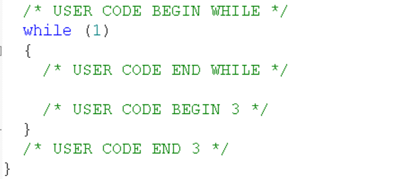

<span style="font-weight:bold; font-size:1.2em;">这里两个配对的USER CODE 感觉放置的位置是不是错了，感觉不太协调。</span>


你的观察力非常敏锐！👍 这确实是很多新手（甚至老手）第一次看 CubeMX 代码时都会吐槽的一个“怪象”。

你感觉“不协调”是完全正常的，因为按照常理，我们习惯 `BEGIN` 和 `END` 像括号一样把一个空的代码块包起来。但在这里，**STM32CubeMX 把 `while(1)` 和 `}` 这两行代码也“包”进了用户代码保护区里**。

这并不是放错了，而是 ST 官方为了**“高阶灵活性”**故意设计的。我来帮你拆解一下这个“三明治”结构，并告诉你该怎么用。

------


### 1. 为什么长得这么奇怪？（为了防误删，也为了高阶修改）

请看你的截图 和代码文件，这个循环其实被拆成了两部分被“保护”起来：


#### 上半部分：头部保护区

C

```c
/* USER CODE BEGIN WHILE */
while (1)
{
/* USER CODE END WHILE */
```

- **现象：** `while(1)` 和 `{` 被包在了 `BEGIN WHILE` 和 `END WHILE` 中间。
- **ST 的逻辑：** 它允许高级用户把这个死循环删掉，改成 `do...while`，或者配合 RTOS（操作系统）改成其他逻辑。因为代码在保护区内，下次生成时 CubeMX 会保留你修改后的循环结构。
- **给你的建议：** **千万别动这两行代码！** 把它们当成透明的空气，不要在这里面写业务逻辑。


#### 下半部分：尾部保护区

C

```c
  /* USER CODE BEGIN 3 */
}
/* USER CODE END 3 */
```

- **现象：** 那个反大括号 `}` 竟然被包在了 `BEGIN 3` 和 `END 3` 中间！
- **ST 的逻辑：** 同样是为了灵活性。
- **给你的建议：** 这就是你真正写代码的地方，但要注意位置！

------


### 2. 正确的“填空”姿势

为了防止出错，请务必遵循以下规则：

#### ✅ 你的代码写在哪里？


请写在 **`/\* USER CODE BEGIN 3 \*/`** 这一行的**下面**，但在 **`}`** 的**上面**。

**正确示范：**

C

```c
  /* USER CODE BEGIN 3 */
  
  // ---> 在这里写你的点灯代码 <---
  HAL_GPIO_TogglePin(GPIOC, GPIO_PIN_13);
  HAL_Delay(500);
  
  }  // <--- 这个大括号是 while(1) 的结束，别删！
  /* USER CODE END 3 */
```


#### ❌ 错误的写法

1. **写在 `}` 下面：** 代码会变成“死代码”（Unreachable code），因为程序永远困在 `while(1)` 里，永远执行不到大括号外面的代码。
2. **删掉 `}`：** 编译器会直接报错（Error: expected '}'），因为你的循环没有闭合。

------


### 总结

虽然这个设计看起来像是个“夹心饼干”，不太符合直觉，但你只需要记住一个简单的口诀：

👉 **“认准 `USER CODE BEGIN 3`，在它屁股后面写代码，千万别碰那个 `}`。”**

只要在这个位置写，你的代码就是安全的，也能正常运行。放心写吧！


## 提问2

<span style="font-weight:bold; font-size:1.1em;">我有个问题，如果部分修改了STM32CubeMX中的一些配置，那么我此时生成的代码会覆盖掉原来的吗，此时我是不是需要将我在原来生成的项目里面所写的代码复制到这个新生成的项目中去呢，我不是太懂，你能够给我详细解释下吗。</span>


这是一个非常关键的问题，也是很多新手最容易“翻车”的地方。

直接给你一个定心丸：**<span style="color:#CC0000;">如果你按照规范写代码，你完全不需要手动复制粘贴，STM32CubeMX 会自动帮你保留你的代码，同时更新配置。</span>**

但这个“自动保留”是有严格条件的。我来为你详细解密它的工作原理。


### 1. 核心机制：保护罩 (USER CODE BEGIN / END)

STM32CubeMX 的代码生成器非常智能，它在更新代码时，不是简单粗暴地把整个文件删了重写，而是像**“填空题”**一样操作。

请看你刚才上传的 `Core/Src/main.c` 文件，里面有很多这样的成对注释：

C

```c
/* USER CODE BEGIN 2 */

   （这里的空间是留给你的）

/* USER CODE END 2 */
```

- **你的地盘：** 只要你的代码是写在 `BEGIN` 和 `END` **中间**的，CubeMX 在重新生成代码时，会原封不动地保留它们。
- **它的地盘：** 在这些注释对**外面**的代码（比如系统初始化函数、外设配置函数），是属于 CubeMX 的。当你修改了配置（比如把 PA1 改成了输出），CubeMX 会把外面的旧代码擦除，换成新的配置代码。


### 2. 实战演示：它是如何工作的？

假设你现在想修改配置：

- **现状：** 你之前配置了 PC13 点灯，并且在 `main.c` 的 `while(1)` 循环里的 `USER CODE BEGIN 3` 中间写了闪烁代码。
- **操作：** 你打开 CubeMX，又去开启了一个 **串口 (USART1)**，然后点击了 **GENERATE CODE**。

**发生的过程：**

1. **保留：** 软件扫描 `main.c`，发现 `USER CODE BEGIN 3` 里有你写的闪烁代码，它先把这段代码“摘”出来存好。
2. **更新：** 软件重写 `main.c`。它会加入 `MX_USART1_UART_Init()` 的初始化代码，并在头部包含 `usart.h`。
3. **回填：** 软件把刚才存好的“闪烁代码”，重新填回新生成的 `main.c` 的 `USER CODE BEGIN 3` 位置。

结果：

打开 Keil，你会发现串口的初始化代码自动加上了，而你写的点灯代码也没丢，依然在那里！你不需要做任何复制粘贴的操作。


### 3. 什么时候会“翻车”？（必须手动复制的情况）

如果你**不小心**把代码写在了“保护罩”外面，那就麻烦了。

**错误示范：**

C

```c
/* USER CODE END 3 */
   
   // 你把代码写在了这里！！（在 END 后面）
   // 这里的代码属于 CubeMX 的管辖区。
   
}
```

后果：

当你再次点击生成代码时，CubeMX 会认为：“咦？这里的代码不是我生成的，也不是在用户保护区里的，那是垃圾吗？删掉！”

结果： 你的代码会直接消失。

补救措施：

如果你真的犯了这个错，重新生成后代码丢了：

1. **不要慌：** CubeMX 在生成代码前，通常会在工程目录下创建一个 `backup` 文件夹（视设置而定），或者你可以去电脑的“回收站”看看有没有被覆盖前的旧文件。
2. **手动复制：** 找到旧文件，把代码复制出来，这次记得**一定要贴在 `BEGIN` 和 `END` 中间**。


### 4. 还有一种特殊情况：USER CODE 块不够用怎么办？

你会发现 `main.c` 里虽然有很多 `USER CODE` 块，但有时候你觉得位置不对，想自己在别的地方加代码。

- **原则：** **千万不要自己手动创造 `/\* USER CODE BEGIN ... \*/` 标签。** 软件是不认你自己写的标签的。
- **方法：** 你必须利用已有的标签。
  - `USER CODE BEGIN Includes`：用来写 `#include "my_sensor.h"`。
  - `USER CODE BEGIN PV`：用来定义全局变量 (Private Variables)。
  - `USER CODE BEGIN 0`：用来写你自己的辅助函数。


### 总结

- **只要你把代码写在 `BEGIN` 和 `END` 之间：** 放心大胆地改配置、重新生成，**不需要**手动复制粘贴，全自动更新。
- **如果你把代码写在外面：** 重新生成后代码会**丢失**，此时才需要你去旧文件里找回代码并手动复制回来。

**专家建议：** 养成好习惯，**永远**只在注释对中间写代码，这样 STM32CubeMX 就是你最好的帮手，而不是麻烦制造者。


# 自动生成FreeRTOS

## 提问1

<span style="font-weight:bold; font-size:1.2em;">我现在想在STM32CubeMX的这个工程里面添加FreeRTOS源码，我不是太懂该怎么操作，你能够告诉我该怎么做吗并且将每一步操作给我解释下。</span>


添加 FreeRTOS 到你的 STM32CubeMX 工程非常简单，就像“<span style="color:#CC00CC;">在超市购物车里多加一件商品</span>”一样。你不需要去官网下载源码包手动复制粘贴，CubeMX 会全自动帮你完成。

但在这个过程中，有一个**“致命坑点”**（时基冲突），90% 的新手第一次都会踩中导致死机。请务必严格按照以下 4 步操作：

------


### 第一步：启用 FreeRTOS (Middleware)

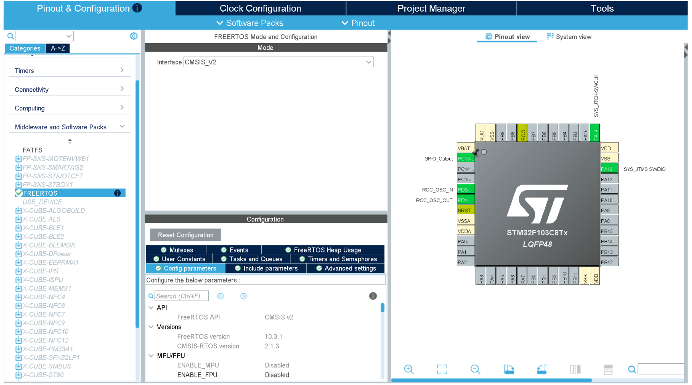

1. **找到中间件：** 在 CubeMX 界面左侧的分类列表中，找到 **Middleware** (中间件) 栏目。
2. **选择 FREERTOS：** 点击 **FREERTOS**。
3. **选择接口版本：**
   - 你会看到右边的 **Interface** 下拉框。
   - 建议选择 **`CMSIS_V2`** (这是更新、更强大的标准封装接口)。
   - **(注：CMSIS_V1 是老版本，V2 是新版本，两者底层都是 FreeRTOS，只是给你的函数名不一样。选 V2 准没错。)**

解释：

<span style="color:#CC0000;">这一步相当于告诉 CubeMX：“我要用操作系统了，请把 FreeRTOS 的核心源码文件准备好，并且给我套上一层 ARM 标准的 CMSIS 接口壳子。”</span>

------


### 第二步：解决“打架”问题 (修改时基源) —— **【最重要的一步！】**

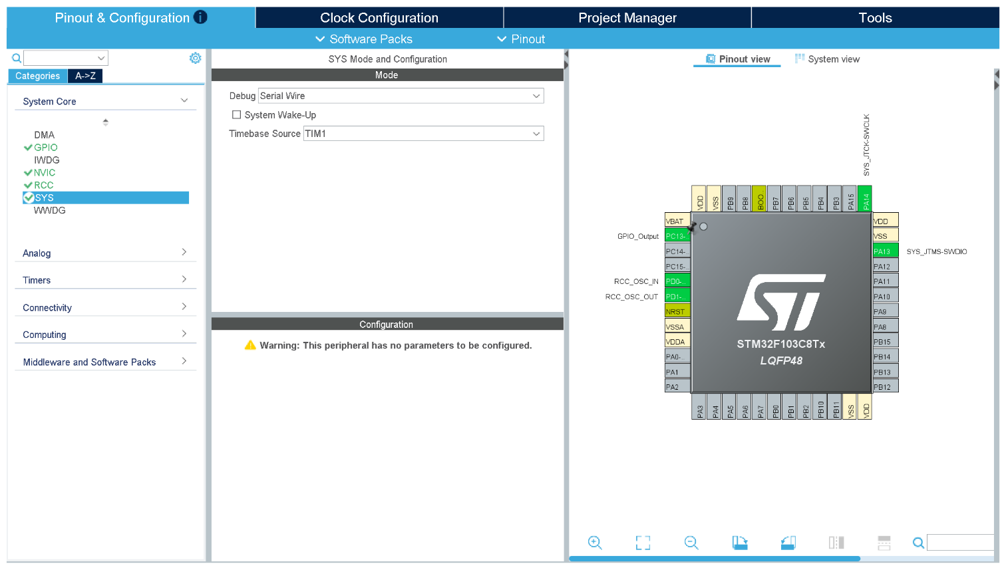

这是最容易被忽略的一步。如果你不做这一步，生成的代码烧录进去后，程序可能会卡死。

1. **回到系统核心：** 点击左侧列表的 **System Core** -> **SYS**。
2. **修改 Timebase Source：**
   - 找到 **Timebase Source** (时基源) 选项。
   - 默认是 `SysTick`。**请把它改成任意一个定时器，比如 `TIM1` 或 `TIM4`**。
   - *(只要不是 SysTick 就行)*。

**为什么要这样做？**

- **冲突原因：** FreeRTOS 需要独占 **SysTick** (滴答定时器) 来进行任务调度（比如每 1ms 切换一次任务）。
- **HAL 库的需求：** ST 的 HAL 库（比如 `HAL_Delay`）默认也用 **SysTick** 来计时。
- **后果：** <span style="color:#CC0000;">如果两者都抢着用 SysTick，且中断优先级配置不当，系统就会混乱甚至死锁。</span>
- **解决办法：** <span style="color:#CC0000;">我们把 **HAL 库** 的计时器“搬家”到普通的硬件定时器 (如 TIM1) 上，把 **SysTick** 完完整整地留给 FreeRTOS 专用。</span>

------


### 第三步：配置任务 (Configuration) —— 可选

当你启用了 FreeRTOS 后，中间会出现一个 **Configuration** 标签页。

1. **Tasks and Queues (任务与队列)：**

   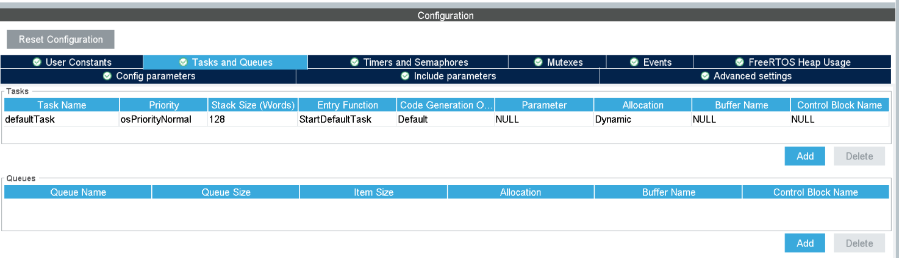

   - 点击这个子标签，你会发现已经默认帮你创建了一个任务，叫 `defaultTask`。
   - 这就是你的“主线程”。等会儿生成代码后，你就在这个任务里写你的 `while(1)`。

2. **Heap Size (堆大小)：**

   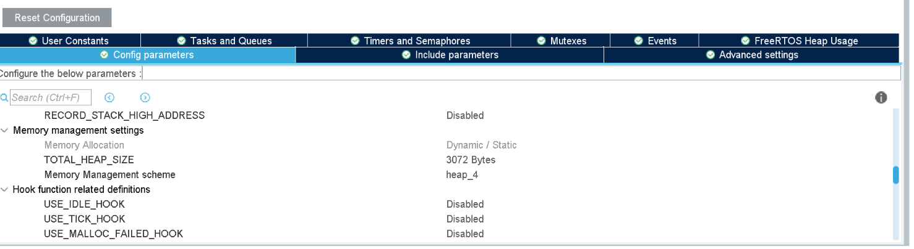

   - 在 `Config parameters` 标签里，有一个 `TOTAL_HEAP_SIZE`。
   - 默认通常是 3072 字节 (3KB) 或更多。对于点灯来说够了，不用改。

解释：

<span style="color:#CC0000;">CubeMX 允许你在图形界面里提前把“线程”、“信号量”、“消息队列”都创建好，省得你去写复杂的 xTaskCreate 代码。</span>

------


### 第四步：生成代码

1. 点击右上角的 **GENERATE CODE**。
2. 打开工程 (Open Project)。

------


### 代码生成后发生了什么变化？

进入 Keil 后，你会发现工程里多了一些东西，主要关注这两个变化：

1. 新的文件组：

   左侧工程目录里多了一个 Middlewares/FreeRTOS 文件夹，里面全是 FreeRTOS 的源码（tasks.c, queue.c 等）。

   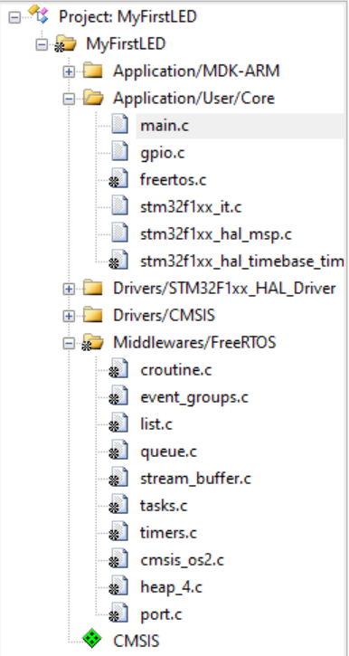

2. **`main.c` 变了：**

   - `main()` 函数里的 `while(1)` 变空了！而且永远不会执行到 `while(1)` 里面的代码了。

   - 多了一个 `osKernelStart();`：这句代码开启了调度器，程序从此进入“多任务世界”。

     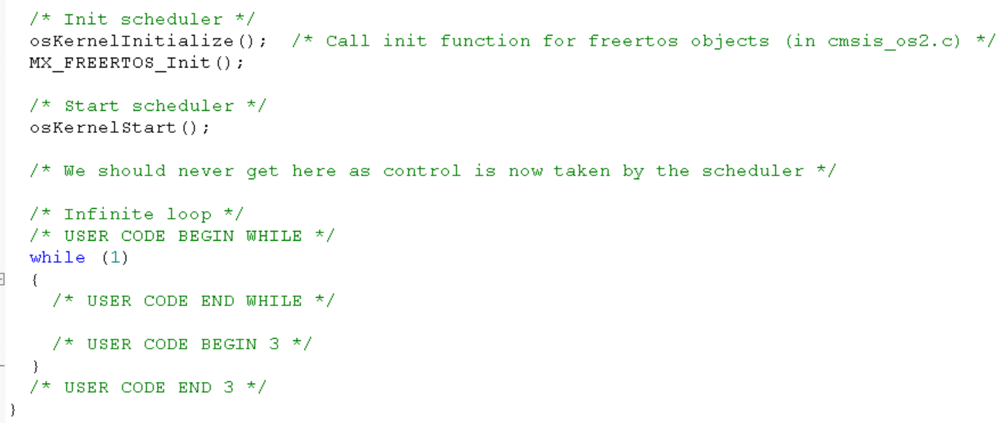

3. **你的新战场：`freertos.c` (或 `main.c` 底部)**

   - 找到一个叫 `StartDefaultTask` 的函数（或者你在 CubeMX 里起的任务名）。

   - **你的 `while(1)` 业务逻辑（比如点灯），以后都要写在这个任务函数里，而不是 main 函数的死循环里了！**

     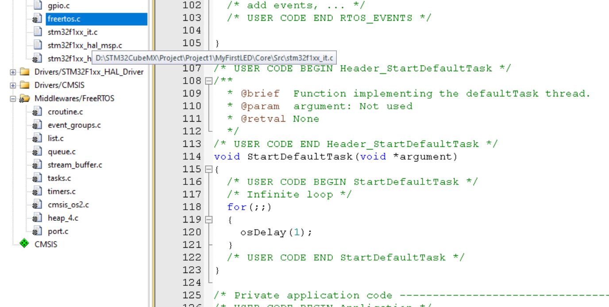

**现在去试试吧！记得一定要修改 SYS 里的 Timebase Source 哦！**


## 提问 1 - （1）

<span style="color:#CC0000;">CubeMX 允许你在图形界面里提前把“线程”、“信号量”、“消息队列”都创建好，省得你去写复杂的 xTaskCreate 代码。</span>

<span style="font-weight:bold; font-size:1.2em;">这句话是什么意思，我不是太懂，你能够给我详细解释下吗，最好能够举个例子来让我彻底弄明白。</span>


这句话的意思是：**STM32CubeMX 充当了一个“代码生成器”或“秘书”的角色。它<span style="color:#CC0000;">把你从繁琐的、死记硬背的初始化代码中解放出来，让你只需要关心核心业务逻辑。</span>**

为了让你彻底弄懂，我们用**“招聘员工”**来打个比方，并对比一下**“手工写代码”**和**“用 CubeMX 配置”**的区别。

------


### 🏢 场景比喻：你需要招聘一个“保洁员”（创建一个线程）

假设你的单片机是一个大公司，现在你需要招聘一个专门负责打扫卫生的员工（也就是创建一个专门运行点灯代码的线程）。


#### 方式一：手工写代码（复杂的 xTaskCreate）

**这就像是你作为老板，必须亲自起草一份法律合同。**

如果不使用 CubeMX 的图形界面，你需要自己在代码里（比如在 `main.c` 中）一字一句地敲出以下内容。你必须背过这些参数的顺序，少写一个逗号都会报错。

**你需要手写的代码（痛苦版）：**

C

```c
// 1. 先定义任务句柄（相当于员工的工牌）
TaskHandle_t xCleaningTaskHandle;

// 2. 还要自己声明任务函数（相当于写岗位职责说明书）
void CleaningTaskFunc(void *argument);

// 3. 在 main 函数里，调用复杂的创建函数（繁琐的签约过程）
// 你必须记住这 6 个参数分别是什么意思：函数名、任务名、栈大小、参数、优先级、句柄...
xTaskCreate(
    CleaningTaskFunc,       // 任务函数
    "Cleaner01",            // 任务名字（给人看的）
    128,                    // 堆栈大小（给多少内存资源）
    NULL,                   // 传递参数
    osPriorityNormal,       // 优先级（职级）
    &xCleaningTaskHandle    // 句柄保存位置
);

// 4. 最后还要开启调度器
vTaskStartScheduler();
```

**痛点：**

- 容易记错参数顺序。
- 容易写错类型。
- 每次加一个新任务，都要重复这套繁琐的流程。

------


#### 方式二：使用 CubeMX 图形界面（轻松版）

**这就像是你告诉人事经理：“帮我招个保洁，名字叫 Cleaner01。”**

在 CubeMX 的 **Middleware -> FREERTOS -> Tasks and Queues** 界面里：

1. 你点击 **"Add"** 按钮。
2. 在弹出的表格里填空：
   - **Task Name:** 填 `Cleaner01`
   - **Priority:** 选 `Normal`
   - **Stack Size:** 填 `128`
3. 点击 **OK**。

结果：

当你点击 GENERATE CODE 生成代码后，CubeMX 会自动帮你把上面那堆复杂的 C 语言代码写好，而且放在了正确的位置（通常在 app_freertos.c 或 main.c 中）。它甚至会自动帮你生成好任务函数的空壳：

C

```c
/* CubeMX 自动生成的代码，你不用动 */
void StartCleaner01(void *argument)
{
  /* USER CODE BEGIN StartCleaner01 */
  /* Infinite loop */
  for(;;)
  {
     // ---> 你只需要在这里写扫地的动作（业务逻辑）就行了！
     // 比如：HAL_GPIO_TogglePin(...);
     osDelay(1000);
  }
  /* USER CODE END StartCleaner01 */
}
```

------


### 🚦 关于“信号量”和“消息队列”也是同理

这句话里还提到了**信号量**和**消息队列**，我也举例解释一下它们在 GUI 里的意义：


#### 1. 信号量 (Semaphore) —— 相当于“会议室的钥匙”

- **如果不预先创建：** 你需要在代码里写 `xSemaphoreCreateBinary()`，还要定义句柄变量，还要检查有没有创建成功。
- **在 CubeMX 里：** 你在 **"Timers and Semaphores"** 标签页点一下 **Add**，起个名叫 `myKey`。生成代码后，系统一启动，这把“钥匙”就已经造好了摆在那里，你在代码里直接用 `osSemaphoreAcquire(myKey)` 就能拿钥匙，非常省心。


#### 2. 消息队列 (Message Queue) —— 相当于“公司内部邮箱”

- **如果不预先创建：** 你要写 `xQueueCreate(深度, 大小)`，要算内存，要定义句柄。
- **在 CubeMX 里：** 你在 **"Tasks and Queues"** 标签页点 **Add**，告诉它“我要个能装 10 封信的邮箱”。生成代码后，这个邮箱就自动挂在那了，你直接往里塞数据就行。

------


### 💡 总结

这句话的意思就是：

STM32CubeMX 帮你把“搭建舞台”这种脏活累活（内存分配、句柄定义、初始化函数调用）都在图形界面里点点鼠标完成了。

你作为程序员，**只需要专注于“在舞台上表演”**（也就是在生成的 `StartDefaultTask` 函数里写你的 `while(1)` 业务代码）。

这就是为什么说它“省得你去写复杂的代码”。现在明白了吗？


## 提问2

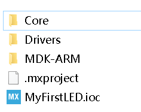


# STM32CubeMX 与 keil 软件使用 疑难杂症

## 提问1

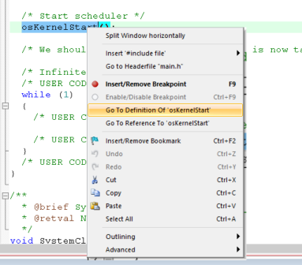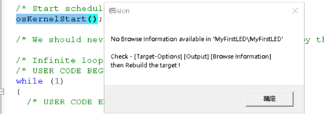

<span style="font-weight:bold; font-size:1.2em;">我现在想要去看下这个osKernelStart()函数是怎么实现的，我这里跳转为什么会出现这个问题呢，我要怎么解决呢？</span>

别担心，这是一个 **Keil 软件最经典的默认设置坑**，99% 的新手第一次都会遇到。

简单来说，Keil 为了让你编译代码快一点，默认**关闭了**“代码索引功能”（也就是 Browse Information）。没有这个索引，它就不知道函数定义在哪里，所以没法跳转。

**解决方法只需 3 步，请跟着我做：**


### 第一步：打开魔法棒 (Target Options)

1. 在 Keil 软件界面的工具栏上，找到一个 **“魔法棒”** 图标（它的学名叫 **Options for Target**）。
2. 点击它，打开设置窗口。


### 第二步：勾选 Browse Information

1. 在弹出的窗口上方，点击 **Output** (输出) 标签页。
2. 在窗口中间位置，你会看到一个叫 **Browse Information** 的复选框。
3. **打勾选中它！**
4. 点击下方的 **OK** 保存。


### 第三步：全编译 (Rebuild) —— 这一步最关键！

设置完后，现在的代码里还没有索引，必须重新编译一次才能生成。

1. 请点击工具栏上的 **Rebuild** 按钮。
   - *注意：是那个图标像“两个循环箭头”的按钮（Rebuild），不是那个只有一个向下的箭头（Build）。*
2. 等待编译完成（Build Output 窗口显示 0 Error）。

------

**现在，你再去右键点击 `osKernelStart()` 选择 `Go To Definition`，就能瞬间跳过去了！**

快去试试吧，弄好了告诉我！