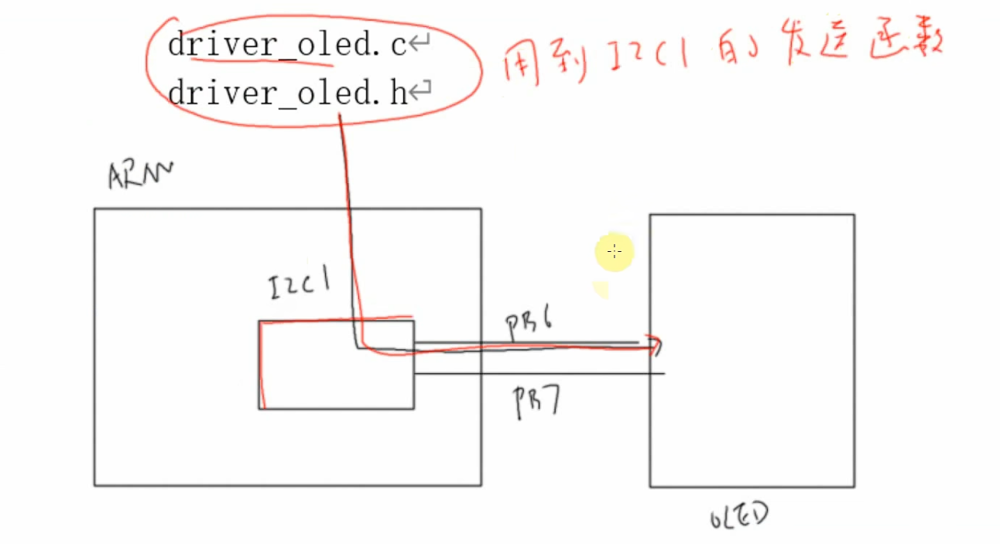
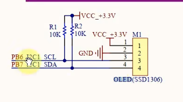
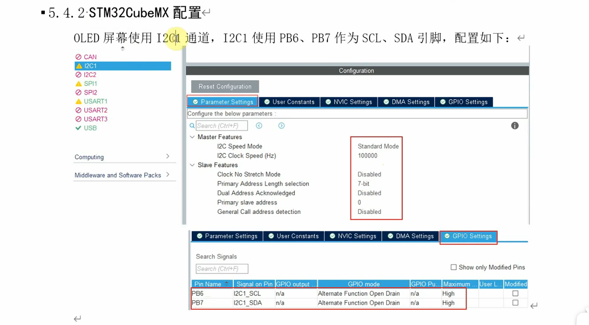
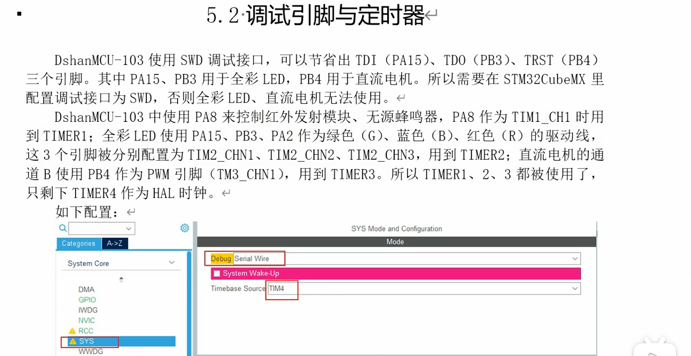

好的，我来帮您分析这个视频，并为您准备嵌入式面试所需的相关材料。

这是一个关于 STM32 嵌入式开发的入门教程，非常适合准备面试时回顾基础概念。


# 📌 视频内容摘要


这个视频的核心目的是解释**<span style="color:#CC0000;">为什么以及如何使用 STM32CubeMX 来配置硬件</span>**，以便能顺利使用上层的模块驱动程序。

它通过一个具体的 **OLED 显示屏** 例子，阐述了嵌入式开发中的“分层”概念：

1. **问题提出：** 开发者想要使用一个模块（如 OLED），通常会有一个高级驱动文件（如 `driver_oled.c`）。但这个驱动程序不能直接工作。

2. **原因分析：** 高级的 OLED 驱动（实现画点、显示字符等功能）需要调用底层的 I2C 通信功能（如 `HAL_I2C_Master_Transmit`）来发送数据。

3. **依赖关系：** 这意味着 `driver_oled.c` **依赖**于 I2C 硬件。

   

4. **解决方案：** 在调用 OLED 驱动之前，必须先对 I2C 硬件本身进行初始化，包括：

   - 启用 I2C1 外设的时钟。

   - 配置 I2C 的通信速率、模式等参数。

   - 根据原理图（视频中查看了原理图，确认是 PB6 和 PB7），将这两个 GPIO 引脚配置为 I2C 的 SCL 和 SDA 功能。

     

5. **工具登场：** **STM32CubeMX** 就是用来完成第 4 步中所有繁琐硬件配置的图形化工具。

   

6. **关键结论：** <span style="color:#CC0000;">正确的开发流程是：先在 STM32CubeMX 中配置好底层硬件（如 I2C、GPIO、Debug 端口），生成初始化代码，然后再将上层的应用驱动（如 `driver_oled.c`）添加到工程中。</span>

视频还提到了一个常见的**“坑”**：Debug 端口（JTAG vs. Serial Wire）的配置。如果不正确配置（例如，选择了引脚冲突的 JTAG），可能会导致其他模块（如 LED 或电机）因引脚被占用而无法工作。

------


# 补充提问

## 提问1




<span style="font-weight:bold; font-size:1.2em;">这张图片我有点看不太懂，你能够给我详细解释下吗，最好能够举个例子来让我彻底弄明白。</span>


这张图片非常经典，它完美地解释了 STM32 开发中一个最核心、最常见的问题：**资源冲突与引脚复用**。

看不懂是很正常的，这说明你正在从“写代码”转向“配硬件”，这是嵌入式开发的必经之路。

我来为您详细分解，并用一个例子来说明。


### 核心思想：为什么需要这些配置？

这张图在告诉您：“DshanMCU-103 这个开发板的**硬件设计**，与 STM32CubeMX 的**默认软件配置**，在两个地方**发生了冲突**。”

你必须在 CubeMX 里手动修改这两个默认配置，来让软件匹配硬件，否则你的程序根本跑不起来。

------


### 冲突点一：调试引脚 (Debug Pins)

这是最容易导致“芯片锁死”或“引脚失效”的坑。


#### 1. 什么是调试引脚？

- 你的电脑需要通过 ST-Link 或 J-Link 下载程序和仿真（Debug）到 STM32 芯片。这个连接不是凭空的，它需要占用芯片上特定的几个引脚。
- STM32 支持两种调试模式：
  - **JTAG 模式（默认）：** 功能最全，但很“霸道”，需要 **5 个引脚** (TDI, TDO, TCK, TMS, TRST)。
  - **SWD 模式 (Serial Wire)：** 是 ARM 的新技术，功能几乎一样，但非常“节俭”，**只需要 2 个引脚** (SWDIO, SWCLK)。


#### 2. 冲突在哪里？

- 从图片文字中看，JTAG 模式（默认）会占用 `PA15` (TDI), `PB3` (TDO), `PB4` (TRST) 这三个引脚。
- **但是！** 这个开发板的**硬件设计师**，已经把 `PA15` 和 `PB3` 用来控制**全彩 LED**，把 `PB4` 用来控制**直流电机**了。
- **这就冲突了！** 想象一下，一个引脚（比如 `PA15`）在同一时间，既要当 JTAG 的“数据输入脚”，又要当 LED 的“绿色控制脚”，它到底该听谁的？


#### 3. 解决方案是什么？

- **放弃 JTAG 模式。**
- 选择**SWD 模式**。因为 SWD 模式只使用 `PA13` 和 `PA14`（这是专用的，一般不会挪作他用），它**根本不需要** `PA15`, `PB3`, `PB4` 这三个引脚。
- **操作：** 正如图片所示，在 CubeMX 的 `SYS` 配置中，把 `Debug` 选项从默认的 `JTAG (5-pin)` 改为 `Serial Wire`。
- **结果：** `PA15`, `PB3`, `PB4` 这三个引脚就被“释放”了，可以“物归原主”，开开心心地去控制它们的 LED 和电机了。

------


### 冲突点二：定时器 (Timers)

这是导致 `HAL_Delay()` 函数卡死或 FreeRTOS 无法运行的常见原因。


#### 1. 什么是 HAL 时钟 (Timebase Source)？

- 你的程序里经常会用 `HAL_Delay(100)` 来延时 100 毫秒。
- 这个 `HAL_Delay` 函数是怎么知道 1 毫秒有多长的？它需要一个“心跳时钟”来计时。
- 这个“心跳时钟”就叫做 **Timebase Source**（时基源）。
- 在 STM32 里，这个“心跳”通常由一个**定时器**（Timer）来提供。


#### 2. 冲突在哪里？

- STM32 芯片里有很多个定时器（TIM1, TIM2, TIM3, TIM4...）。
- **默认情况下**，CubeMX 会选择 **TIM1** 或者 **Systick**（一个专门的系统定时器）来作为 `HAL_Delay` 的时基源。
- **但是！** 这个开发板的**硬件设计师**，已经把 `TIM1`, `TIM2`, `TIM3` 这三个**最好的**定时器拿去用了：
  - `TIM1` (高级定时器) 分配给了：红外模块、无源蜂鸣器 (PA8)。
  - `TIM2` (通用定时器) 分配给了：全彩 LED (PA15, PB3, PA2)。
  - `TIM3` (通用定时器) 分配给了：直流电机 (PB4)。
- **这就冲突了！** 想象一下，`TIM1` 既要负责给 `HAL_Delay` 提供稳定的 1ms 心跳，又要负责给蜂鸣器输出一个特定频率的 PWM 波形。它忙不过来，程序就乱了。


#### 3. 解决方案是什么？

- **“另请高明”。**
- 既然 `TIM1`, `TIM2`, `TIM3` 都被占用了，我们就从剩下的定时器里，找一个**空闲的**来给 `HAL_Delay` 用。
- **操作：** 正如图片所示，开发板的设计者发现 **`TIM4` 是空闲的**，没有分配给任何外设。所以，在 CubeMX 中，手动把 `Timebase Source` 选为 `TIM4`。
- **结果：** `TIM4` 专门负责给 `HAL_Delay` 计时，而 `TIM1`, `TIM2`, `TIM3` 专心负责它们各自的 PWM 输出任务。所有模块各司其职，互不干扰。

------


### 举个例子：帮你彻底理解

假设你的**手机（STM32 芯片）**上只有 4 个 APP（定时器）：

1. `TIM1`：**闹钟 APP** （用于蜂鸣器）
2. `TIM2`：**呼吸灯 APP** （用于全彩 LED）
3. `TIM3`：**震动 APP** （用于直流电机）
4. `TIM4`：**秒表 APP** （空闲）

你现在想用一个**延时函数**（比如 `HAL_Delay`），它需要一个 APP 来帮它计时。

- **默认配置（冲突）：** 手机系统默认让**闹钟 APP (`TIM1`)** 去给延时函数计时。
- **发生什么？**
  - 你调用 `HAL_Delay(1000)`，系统告诉闹钟 APP：“开始计 1 秒，计完告诉我”。
  - 但同时，闹钟 APP 的**本职工作**（闹钟）时间到了，它需要“响铃”（驱动蜂鸣器）。
  - 它到底该“计时”还是“响铃”？**它冲突了**，结果就是你手机卡死，闹钟也不响了。
- **正确配置（解决）：**
  - 你（开发者）进入手机设置（CubeMX），查看了一下，发现**秒表 APP (`TIM44`)** 一直闲着。
  - 你手动把**延时函数**的计时任务指派给**秒表 APP (`TIM4`)**。
- **结果：**
  - 闹钟、呼吸灯、震动（TIM1, 2, 3）正常工作。
  - 当你调用 `HAL_Delay()` 时，秒表 APP (`TIM4`) 在后台帮你计时，也不影响其他 APP。
  - **调试引脚的例子**也是一样：你总不能把“耳机孔”（JTAG）和“充电口”（LED引脚）设计在同一个地方吧？所以你换了一个“蓝牙耳机”（SWD），把“充电口”省了出来。

总结一下，这张图教你的就是：**作为嵌入式工程师，你必须先看懂硬件原理图，了解引脚和外设的分配，然后去配置你的软件 (CubeMX)，让软件去适应硬件。**

您明白了吗？需不需要我再针对“定时器用作 Timebase”和“用作 PWM”的区别做进一步解释？


## 提问2 - （1）

<span style="font-weight:bold; font-size:1.2em;">针对“定时器用作 Timebase”和“用作 PWM”的区别做进一步解释，还有我记得是不是还有一个系统时钟，它和定时器有什么关系呢，还有驱动freeRTos的时钟又是那个呢，我不是太懂，你能够给我解释下吗，最好能够举个例子来让我彻底弄明白。</span>


您提的问题非常棒！这几个概念是嵌入式开发（尤其是 STM32）的**绝对核心**，把它们弄混是初学者最常见的“坎”。

我来帮您一次性彻底弄明白。

我们将使用一个**管弦乐队**的例子来比喻。

------


### 1. 系统时钟 (HCLK / SYSCLK) - 乐队指挥

您记得的“系统时钟”是对的，它是**一切的心脏**。

- **它是什么？** 这就是您在 CubeMX 时钟树配置里设置的那个**最高频率**，比如 **72MHz** 或 168MHz。这是 CPU（大脑）运行的速度。
- **乐队比喻：** 系统时钟就是**乐队指挥**。他设定了整个乐队的**主节拍 (Tempo)**。比如，指挥棒每秒挥动 7200 万次 (72MHz)。
- **它和定时器的关系？**
  - 乐队里所有的**乐手（定时器们）**都**必须**看着指挥的节拍来演奏。
  - **但是**，乐手们（定时器）不会真的每秒也跟着动 7200 万次，他们会根据乐谱（寄存器配置）进行“分频”。
  - 比如，指挥（系统时钟 72MHz）告诉小号手（TIM1）：“你所属的 PCLK2 总线时钟也是 72MHz”。
  - 指挥（系统时钟 72MHz）告诉大提琴手（TIM2）：“你所属的 PCLK1 总线时钟是 36MHz（72MHz 的 2 分频）”。
  - **结论：** 系统时钟是**所有外设（包括定时器）的“能量来源”**。定时器的时钟频率**永远**是系统时钟（或总线时钟）分频得到的。

------


### 2. "Timebase" vs "PWM" - 乐手的两种任务

现在我们有了乐手（定时器）。他们都能“计时”，但您可以给他们分配两种完全不同的“演奏任务”。


#### 任务一：定时器用作 "Timebase" (时基)

- **它是什么？** 它的任务是**周期性地“喊一声”**，来告诉 CPU“嘿，又 1 毫秒过去了！”
- **乐队比喻：** 这就像指挥让**定音鼓手 (`TIM4`)** 来扮演**节拍器**的角色。
- **任务详情：** 指挥对定音鼓手 (`TIM4`) 说：“你看着我的主节拍（比如 36MHz），每当数到 36000 个节拍时（$36,000 / 36,000,000 \text{Hz} = 1\text{ms}$），你就**轻轻地敲一下鼓**。然后从 0 重新数。”
- **结果：** `TIM4` 就会以 1kHz 的频率（每 1ms 一次）稳定地“咚...咚...咚...”。
- **谁在用？** `HAL_Delay()` 函数。当你调用 `HAL_Delay(100)` 时，它就在心里默数 100 次 `TIM4` 的鼓声。


#### 任务二：定时器用作 "PWM" (脉宽调制)

- **它是什么？** 它的任务是**在引脚上输出一种“开关”波形**，用来控制电机的转速或 LED 的亮度。
- **乐队比喻：** 这就像指挥让**小号手 (`TIM3`)** 来**演奏一段旋律**。
- **任务详情：** 指挥对小号手 (`TIM3) 说：“你也看着我的主节拍（36MHz）。我给你的乐谱（周期）是 1000 拍（$36,000,000 / 1000 = 36\text{kHz}$ 的频率）。乐谱要求你，**前 300 拍吹响**（引脚输出高电平），**后 700 拍休息**（引脚输出低电平）。然后**无限循环**。”
- **结果：** `TIM3` 就会稳定地在引脚上输出一个频率为 36kHz、占空比为 30% 的波形。
- **谁在用？** 直流电机驱动器。它看到这个 30% 的占空比，就会让电机以 30% 的功率转动。


#### 区别总结

| **特性**     | **用作 Timebase (时基)**     | **用作 PWM**                       |
| ------------ | ---------------------------- | ---------------------------------- |
| **目的**     | 在**内部**产生一个“计时节拍” | 在**外部**（引脚）输出一个“波形”   |
| **服务对象** | `HAL_Delay()` 或 FreeRTOS    | 直流电机、舵机、LED 呼吸灯         |
| **比喻**     | **节拍器** (每 1ms 敲一下)   | **演奏家** (按乐谱循环演奏)        |
| **配置**     | 只需设置“周期”（何时中断）   | 必须设置“周期”和“比较值”（占空比） |

------


### 3. 驱动 FreeRTOS 的时钟 - Systick (系统滴答定时器)

这是您问题的关键点，也是最容易混淆的。

- **它是什么？** FreeRTOS **也需要**一个“节拍器”来工作。但它**不使用** `TIM1`~`TIM4` 这些通用定时器。
- 它使用的是一个**“指挥专用的节pag(Systick Timer)**。


#### 为什么不用 TIM4？

FreeRTOS 需要一个**极其准时、优先级极高、且绝对独立**的节拍器，来执行它最核心的**“任务调度”**。

- **乐队比喻：**
  - `TIM4` (定音鼓) 是乐队成员，指挥（CPU）还得抽空去听他敲鼓（处理中断），这本身就会占用指挥的精力。
  - **Systick (系统滴答定时器)** 更像是指挥**自己的心脏**，它在指挥的“大脑皮层”（内核）里自动跳动，不占用任何“演奏”精力。
- **FreeRTOS 的工作：**
  - 你（开发者）告诉 CubeMX：“我要用 FreeRTOS”。
  - CubeMX 马上说：“好的。那 `HAL_Delay` 的时基源（Timebase Source）就**不能再用 `TIM4` 了**。”
  - CubeMX 会自动把 Timebase Source 改为 `Systick`。
- **结果（有 FreeRTOS 时）：**
  1. **Systick** 被启动，设置为 1kHz (每 1ms 中断一次)。
  2. **FreeRTOS** 用 Systick 的每一次“心跳”来检查：“OK，1ms 到了，任务 A 该暂停了，轮到任务 B 运行了。”
  3. `HAL_Delay(100)` 函数**也被 FreeRTOS 重写了**。它不再去听 `TIM4` 的鼓声，而是调用 FreeRTOS 的 `vTaskDelay(100)`，意思是：“请把我这个任务挂起 100 个 Systick 心跳”。


### 总结：三种时钟的关系（例子）

假设你有一个项目：

- 用 FreeRTOS 跑两个任务
- 任务 A：控制 `TIM3` 输出 PWM，让一个电机转
- 任务 B：控制 `TIM2` 输出 PWM，让一个 LED 闪烁

这个项目里的时钟关系是：

1. **指挥（系统时钟, HCLK, 72MHz）：** 为所有人提供最快的“主节拍”。
2. **指挥的心脏（Systick, 1kHz）：** **驱动 FreeRTOS**。每 1ms "跳" 一下，让 FreeRTOS 决定是运行任务 A 还是任务 B。
3. **小号手（TIM3, 36kHz, 30%占空比）：** 独立演奏 PWM，**驱动电机**。它只听指挥的节拍，不管 Systick。
4. **大提琴手（TIM2, 1Hz, 50%占空比）：** 独立演奏 PWM，**驱动 LED**。它也只听指挥的节拍。

**最关键的理解：**

- **Systick** 负责**“软件”**的调度（任务A、B切换）。
- **TIM2、TIM3** 负责**“硬件”**的输出（PWM波形）。
- 它们都由**系统时钟**（HCLK）提供动力，但在各自独立地运行，互不干扰。

这就是为什么上一张图片里，作者强调要把 `TIM1`~`TIM3` 都让出来去干“正事”（PWM），而把 `HAL_Delay` 的任务（Timebase）交给空闲的 `TIM4` 或者 FreeRTOS 的 `Systick`。


## 提问2 - （2）

<span style="font-weight:bold; font-size:1.2em;">系统时钟就是HCLK吗，我记得好像还有外设时钟PCLK1和PCLK2，这三个时钟之间都是独立的吧，来自不同的晶振。定时器是个外设应该是靠PCKL来驱动的，和HCLK应该没有关系吧，HCLK应该是用来驱动CPU 内存，freeRTos这些东西的吧。我的理解对吗，还有没有需要补充的呢。</span>


您的理解**对了一大半**，而且问的问题非常关键！这说明您已经开始思考 STM32 的核心——**时钟树 (Clock Tree)** 了。

您理解中**唯一需要纠正**，也是**最最最**容易混淆的一点是：

> "这三个时钟之间都是独立的吧，来自不同的晶振"
>
> "和HCLK应该没有关系吧"

这两句是**不正确**的。

它们**不是独立的**，而是**紧密相关的“父子”关系**。它们**全都**来自**同一个源头**。

------


### 公司的“时钟树”层级（例子）

我们不用晶振，我们用一个**公司层级**来比喻，您马上就懂了。

假设我们有一个公司（STM32 芯片）：


#### 1. 公司的“发电机” (时钟源)

公司需要电来运作，但电可以来自：

- **外部电网 (HSE):** 外部高速晶振。**稳定、昂贵**。
- **内部柴油发电机 (HSI):** 内部高速 RC 振荡器。**启动快、免费，但不稳定**。

公司 CEO 办公室（PLL）会选择一个电源，并把它**倍频**到一个**极高的速度**。


#### 2. SYSCLK (系统时钟) - “公司的总线速度”

这就是 CEO 办公室（PLL）输出的主频率，比如 **72MHz**。这是公司能达到的**最高运行速度**。


#### 3. HCLK (AHB 总线时钟) - “CPU 核心部门”

- **它的时钟来源：** **<span style="color:#CC0000;">来自 SYSCLK</span>** (通常 1:1，也是 72MHz)。
- **它的作用：** 您的理解非常对！它就是用来驱动公司里**最快、最核心**的部门：
  - **CPU (大脑)**
  - **SRAM (内存/记忆)**
  - **DMA (高速物流部)**
- **和 FreeRTOS 的关系：** FreeRTOS 是一个“管理制度”（软件），它运行在 **CPU** 上。所以 **HCLK 的速度决定了 FreeRTOS 跑得多快**。而 FreeRTOS 自己的“心跳节拍”<span style="color:#CC0000;">（Systick）</span>，其时钟源通常也<span style="color:#FF0000;">来自 HCLK</span>（或者是 HCLK 的 8 分频）。


#### 4. PCLK2 (APB2 总线时钟) - “高速业务部”

- **它的时钟来源：**<span style="color:#CC0000;"> **来自 HCLK**</span> (通常 1:1，也是 72MHz)。
- **它的作用：** 专门驱动那些**“高速”**的外设（乐手）。
- **例子：** `TIM1` (高级定时器), `ADC` (模数转换), `SPI1`, `USART1`。


#### 5. PCLK1 (APB1 总线时钟) - “低速业务部”

- **它的时钟来源：** **<span style="color:#CC0000;">来自 HCLK</span>** (但通常会**分频**，比如 2 分频，变成 36MHz)。
- **它的作用：** 专门驱动那些**“低速”**的外设。
- **例子：** `TIM2`, `TIM3`, `TIM4` (通用定时器), `I2C`, `USART2`, `CAN`。

------


### 总结与回顾（帮你理清）

现在我们用一张图来总结这个**层级关系**：

```
[晶振/HSI] -> [PLL] -> SYSCLK (例如 72MHz)
                   |
                   +-> HCLK (72MHz) -> [CPU, 内存, DMA, FreeRTOS(Systick)]
                          |
                          +-> PCLK2 (72MHz) -> [TIM1, ADC, SPI1, ...]
                          |
                          +-> PCLK1 (36MHz) -> [TIM2, TIM3, I2C, ...]
```

我们再来回答您的问题：

- **“系统时钟就是HCLK吗？”**
  - 非常接近。<span style="color:#CC0000;">`SYSCLK` 是“总源头”</span>，`HCLK` 是 `SYSCLK` 分出来的**<span style="color:#CC0000;">第一个</span>**主干道。它俩的频率常常被设置为一样的（比如 72MHz），所以经常被混用，但 `HCLK` 准确地说是 **CPU 和内存**的时钟。
- **“HCLK, PCLK1, PCLK2 独立吗？来自不同晶振？”**
  - **不。** 它们是**<span style="color:#CC0000;">“爷孙”关系</span>**。`HCLK` 来自 `SYSCLK`，而 `PCLK1` 和 `PCLK2` 都来自 `HCLK`。它们**同根同源**，都来自唯一的那个“发电机”（晶振或 HSI）。
- **“定时器靠PCLK驱动？”**
  - **完全正确！** 高速定时器（如 TIM1）靠 PCLK2 驱动；通用定时器（如 TIM2/3/4）靠 PCLK1 驱动。
- **“定时器和HCLK没关系？”**
  - **关系大了！** `PCLK1` 和 `PCLK2` 都是 `HCLK` **分频**后得到的。`HCLK` 是 `PCLK` 的“爸爸”。如果你在 CubeMX 里把 `HCLK` 的速度改了，`PCLK1` 和 `PCLK2` 的速度也会**自动跟着变**，你的定时器周期和串口波特率就全乱了。


### 补充：为什么这么麻烦？

您可能会问：为什么不让所有外设都用最快的 72MHz 呢？

答案是：**省电 和 限制**。

1. **省电：** `I2C` 这种低速协议，最高才 400kHz。你给它一个 36MHz 的时钟（PCLK1）就绰绰有余了，没必要用 72MHz（PCLK2）来驱动它，浪费电力。
2. **限制：** STM32 的芯片设计（比如 F1 系列）就**硬件限制**了 APB1 总线（PCLK1）的最高速度（比如 36MHz），它跑不了 72MHz。

您的理解已经非常接近核心了。这个“时钟树”的概念是 STM32 最难但也是最重要的基石。

这个“公司层级”的比喻是否帮您把它们的关系理清了？


## 提问2 - （3）（重点区分）

<span style="font-weight:bold; font-size:1.2em;">SYSCLK 和SYStick这两个应该是不同的东西吧。</span>


是的，您**完全正确**！

`SYSCLK` 和 `SysTick` 是**两个截然不同的东西**。

您能敏锐地发现这一点，说明您已经快把整个时钟系统弄明白了。

我们还是用之前的比喻，`SYSCLK` 和 `SysTick` 的区别就像：

- **`SYSCLK` (系统时钟):** 是**“发电厂”**。它是一个**时钟源**，它本身就是那个 72MHz 或 168MHz 的**速度**。
- **`SysTick` (系统滴答定时器):** 是一个**“闹钟”**。它是一个**外设**，一个具体的硬件模块。


### 它们的关系是什么？

**“闹钟” (SysTick) 需要插上“电” (时钟) 才能运行。**

1. `SYSCLK`（发电厂）产生 72MHz 的主时钟。
2. 这个时钟经过分配，变成了 `HCLK`（CPU 部门的主电线），也是 72MHz。
3. `SysTick` 这个“闹钟”就**插在 `HCLK` 这条电线上**来获取动力。（或者插在 `HCLK/8` 这条分出来的线上）。
4. 所以，`SysTick` 这个“闹钟”本身也在以 72MHz 的速度“滴答”走时。
5. 然后我们（开发者）给这个“闹钟”设置一个值（重装载值），告诉它：“你每‘滴答’72000 次（$72,000 / 72,000,000\text{Hz} = 1\text{ms}$），就响一次（产生一次中断）。”


### 总结

| **名称**       | **SYSCLK (系统时钟)**       | **SysTick (系统滴答定时器)**                   |
| -------------- | --------------------------- | ---------------------------------------------- |
| **它是什么？** | 一个**时钟频率**（一个值）  | 一个**硬件模块**（一个外设）                   |
| **角色**       | **动力源**（发电厂）        | **使用者**（闹钟）                             |
| **用途**       | 驱动 `HCLK`、`PCLK` 等总线  | 产生**周期性中断**                             |
| **谁用它？**   | `HCLK`、`PCLK` 用它作为源头 | `FreeRTOS` 或 `HAL_Delay` 用它的**中断**来计时 |

所以，`SYSCLK` 是那个**最快的主频率**，而 `SysTick` 是那个**被 FreeRTOS 用来当“心跳节拍”的定时器**。

`SysTick` 靠 `SYSCLK`（间接通过 `HCLK`）提供的时钟来运行。

您这次的理解非常到位！


## 提问2 - （4）

<span style="font-weight:bold; font-size:1.2em;">SysTick 是那个被 FreeRTOS 用来当“心跳节拍”的定时器。这个定时器应该不是定时器1,2,3,4那些外设吧，应该是独立的一个吧。还有为什么要有不同的晶振呢，最后不是只选择一个晶振SYSCLK吗，理论上不是只有一个就行吗。</span>


您又提出了两个直击核心的绝佳问题！这彻底说明了 STM32 时钟系统的复杂性。

您的两个猜想都**完全正确**。我来为您详细解释。

------


### 1. SysTick vs 定时器 1/2/3/4

> "SysTick... 这个定时器应该不是定时器1,2,3,4那些外设吧，应该是独立的一个吧。"

**您的理解 100% 正确。**

SysTick **是完全独立**于那些通用定时器（TIM1, TIM2...）的。

它们的核心区别在于它们“住”在哪：

- **TIM1, TIM2, TIM3, TIM4 (通用/高级定时器):**
  - 它们是 **STM32 芯片** 的“外设”（Peripherals）。
  - 它们住在芯片的“外设总线”上（`PCLK1` 或 `PCLK2`）。
  - **比喻：** 它们就像城市（STM32）里的**“公共时钟”**，比如火车站钟楼、银行大钟。它们功能强大（可以报时、奏乐 PCL），<span style="color:#CC0000;">服务于“公共事务”</span>（如驱动电机 PWM、测量脉冲）。
- **SysTick (<span style="color:#CC0000;">系统滴答定时器</span>):**
  - 它**不属于** STM32 芯片的外设，它属于<span style="color:#CC0000;"> **ARM Cortex-M 内核**</span> 的一部分。
  - **比喻：** 它不是城市里的公共时钟，它是**“指挥官”（CPU 内核）自己的“心脏起搏器”**。

**为什么要有这个区别？**

答案是**“标准化”**和**“可移植性”**。

FreeRTOS 这样的操作系统（RTOS）设计出来，是希望能在**所有**基于 ARM Cortex-M 内核的芯片上运行的（无论芯片是 ST 产的、NXP 产的、还是 TI 产的）。

- 如果 FreeRTOS 依赖 `TIM1` 来计时，那它就只能在 STM32 上运行，因为 NXP 的芯片没有 `TIM1`（它可能叫 `CTIMER`）。
- 但**所有**的 Cortex-M 内核（无论谁生产的）都**保证**会有一个**一模一样**的 `SysTick` 定时器。
- 因此，FreeRTOS 只需要去操作这个标准化的 `SysTick`，就能在所有厂家的芯片上完美运行。

**结论：** `SysTick` 是 CPU 内核自带的、专为操作系统心跳节拍而生的**“私有定时器”**。`TIM1-4` 是芯片厂商（ST）添加的、用于驱动外部硬件的**“公用定时器”**。

------


### 2. 为什么要有不同的晶振 (时钟源)？

> "为什么要有不同的晶振呢，最后不是只选择一个晶振SYSCLK吗，理论上不是只有一个就行吗。"

这是一个非常深刻的硬件设计问题。您说的“最后只选择一个 SYSCLK”是对的，但 `SYSCLK`（比如 72MHz）是**“最终合成”**出来的速度，而不是**“原始材料”**。

**理论上只有一个晶振不够用，因为芯片有完全不同的“工作模式”。**

我们至少需要**两种**截然不同的时钟：

1. **“V8 发动机” (高速时钟, MHz 级别):**
   - **目标：** 让 CPU 全速运行，处理复杂任务（跑 FreeRTOS、算 FFT、驱动 USB）。
   - **要求：** 速度快 (MHz)，但**非常耗电**。
   - **来源：** 这就是 `HSE` (外部高速晶振) 和 `HSI` (内部高速RC)。
2. **“仪表盘时钟” (低速时钟, kHz 级别):**
   - **目标：** 维持“日期和时间”（RTC）的运行，或者在 CPU“深度睡眠”时能唤醒它。
   - **要求：** 速度极慢 (kHz)，**极其省电**。
   - **来源：** 这就是 `LSE` (外部低速晶振) 和 `LSI` (内部低速RC)。

比喻：

您的 SYSCLK (72MHz) 就像汽车的 V8 主发动机。您开车（运行程序）时用它，它马力强劲，但非常耗油（耗电）。

但当您把车停好、拔掉钥匙（CPU 睡眠）后，您总不希望用 V8 发动机来给您的**仪表盘小破钟**供电吧？那样汽车电瓶 1 小时就耗尽了。

您需要一个**独立、超低功耗的“纽扣电池”**（这就是 `LSE`）来<span style="color:#CC0000;">专门维持这个仪表盘时钟（RTC）</span>走上好几年。

**这就是为什么要有不同的晶振：**

- **HSE (外部高速 8MHz 晶振):**
  - **特点：** **高精度**的“V8 发动机”原材料。
  - **用途：** 它是最**稳定、最精确**的源。通过 PLL 倍频后，得到**精确的** 72MHz `SYSCLK`。这对于 USB、CAN 等对时钟要求苛刻的通信至关重要。
- **HSI (内部高速 16MHz RC):**
  - **特点：** **免费但有偏差**的“V8 发动机”原材料。
  - **用途：** 如果您的应用不差钱（不在乎多几毛钱的晶振成本），且需要高精度，就不用它。但如果您的产品是廉价玩具，或者晶振坏了，它就是个**免费的、能立即启动**的备胎。
- **LSE (外部低速 32.768kHz 晶振):**
  - **特点：** **高精度**的“纽扣电池”。(32.768kHz = $2^{15}$，分频 15 次后**刚好是 1Hz/1秒**)。
  - **用途：** **唯一**能用来做**<span style="color:#CC0000;">精确日历（RTC）</span>**的时钟源。
- **LSI (内部低速 32kHz RC):**
  - **特点：** **免费但有偏差**的“纽扣电池”。
  - **用途：** 用于**不需要精确计时**的低功耗任务，比如<span style="color:#CC0000;">“独立看门狗”（IWDG）</span>或低功耗唤醒。

总结：

您需要至少两种时钟：一个High-Speed (高速)的来驱动 SYSCLK，一个Low-Speed (低速)的来驱动 RTC。

而每种时钟又提供了**两种选择**：**E**xternal (外部晶振，精确但贵) 和 **I**nternal (内部RC，免费但不准)。

所以您就看到了 `HSE`, `HSI`, `LSE`, `LSI` 这四种组合。


## 提问3


<span style="font-weight:bold; font-size:1.2em;">这张图片我有点看不太懂，你能够给我详细解释下吗，最好能够举个例子来让我彻底弄明白。</span>


这又是一张非常棒的 STM32CubeMX 配置截图！这张图片完美地衔接了您之前的所有问题。

您之前问过：`driver_oled.c` 驱动 OLED 需要 I2C，而 I2C 需要用 STM32CubeMX 来配置。**这张图就是那个“配置”的实战演练。**

它在告诉您，为了让 `I2C1` 模块“跑起来”，您必须配置两大类东西：**通信参数** 和 **物理引脚**。

我来为您详细分解，并用一个例子来说明。


### 核心思想：您在“聘请”一个 I2C 翻译官


想象一下，您 (STM32 的 CPU 大脑) 不会说“I2C 语”。但您需要和一位只会说“I2C 语”的大使（OLED 屏幕）对话。

怎么办？您需要去“招聘办公室”(CubeMX) 启用您公司（STM32 芯片）内部的**“I2C1 号翻译官”**。这张截图就是您在填写的“翻译官聘用表”。

------


### 冲突点一：参数设置 (Parameter Settings)


这是您在表格的“能力要求”一栏里打勾。

- **`I2C Speed Mode: Standard Mode` (标准模式)**
- **`I2C Clock Speed (Hz): 100000` (100kHz)**

这是什么意思？

这是在规定“对话速度”。I2C 通信有几种速度，就像说话有“慢速、中速、快速”一样。

- `Standard Mode (100kHz)` 是最古老、最通用、**最兼容**的“慢速”模式。几乎所有的传感器、OLED 屏幕都支持它。
- **例子：** 您在聘用表上写明：“翻译官，您的语速必须是‘标准语速’，即每秒 100,000 个比特，不能再快了，因为那位 OLED 大使（屏幕）反应慢，太快了他听不懂。”

------


### 冲突点二：GPIO 设置 (GPIO Settings)


这是您在表格的“后勤保障”一栏里填写。光聘请了翻译官还不够，您得给他**分配两部电话机（引脚）**，他才能开始工作。

#### 1. 引脚分配 (PB6, PB7)

- **`PB6 -> I2C1_SCL`**
- **`PB7 -> I2C1_SDA`**

这是什么意思？

STM32 芯片上有一百多个引脚，您必须明确告诉它，用哪两个引脚来给 I2C1 翻译官用。

- **`SCL` (Serial Clock)**：**时钟线**。这是“节拍”电话。翻译官用这部电话来“打节拍”（咚-咚-咚-咚），告诉 OLED 大使：“我要开始说下一个字了”。
- **`SDA` (Serial Data)**：**数据线**。这是“内容”电话。翻译官在 `SCL` 打节拍的同时，用这部电话把真正的数据（“开”、“关”、“显示这个字母”）传过去。
- **例子：** 您在聘用表上写：“请把大楼里的 `PB6` 号电话线分配给 `I2C1` 翻译官当‘节拍线’，把 `PB7` 号电话线分配给他当‘数据线’。”


#### 2. 引脚模式 (Alternate Function Open Drain)

这是**最核心、最关键**的配置，也是最难理解的。

- **`Alternate Function` (复用功能)**：
  - **默认功能：** 一个引脚默认是“普通IO口”，只能您（CPU）手动控制它“亮”或“灭”。
  - **复用功能：** 这个设置告诉引脚：“你不要再听我（CPU）的了，我把你**‘授权’**给 `I2C1` 翻译官了。从现在起，**`I2C1` 翻译官全权控制**你的电平高低。”
- **`Open Drain` (开漏输出)**：
  - **这是 I2C 协议的精髓。**
  - **普通输出 (推挽)：** 像个“大力士”，能**强行**把电平“推”到 3.3V（高），也能**强行**把电平“拉”到 0V（低）。
  - **开漏输出 (开漏)：** 像个“有礼貌的人”，他**只能**强行把电平“拉”到 0V（低）。但他**不能**输出高电平，他想要高电平时，他能做的只是“松手”（即“开漏”），让电平自己飘着。
  - **为什么？** 因为 I2C 总线（电话线）上可能会挂很多设备（大使）。如果两个“大力士”在同一根线上，一个推高一个拉低，就会**短路**！
  - 而“开漏”模式下，所有人都很“礼貌”。线路上平时由一个**“上拉电阻”**（挂在墙上的弹簧）拉到高电平。谁想说话，谁就把线“拉低”。这样就永远不会短路。


### 总结：这张图做了什么？

这张图完成了您在第一个视频（`driver_oled.c`）里看到的**所有底层准备工作**：

1. **启用 `I2C1` 模块** （“聘请翻译官”）。
2. 设置 `I2C1` 的速度为 **100kHz** （“规定语速”）。
3. 将 **`PB6` 引脚** “授权”给 `I2C1` 作为 `SCL` 节拍线。
4. 将 **`PB7` 引脚** “授权”给 `I2C1` 作为 `SDA` 数据线。
5. 将这两个引脚配置为 **`开漏`** 模式，以符合 I2C 协议的硬件规范。

做完这一切，CubeMX 就会生成一个 `MX_I2C1_Init()` 函数。您的 `main` 函数一调用它，`I2C1` 翻译官就正式上岗了。

此时，您（CPU）才能在代码里调用 `HAL_I2C_Master_Transmit(...)`，放心地把数据（比如 "Hello"）交给翻译官，他会自己处理所有 `PB6` 和 `PB7` 上的复杂信号。


# 🚀 知识扩展与深入


视频中的内容是嵌入式开发的核心基础。针对面试，您需要从以下几个方面进行扩展：


#### 1. 嵌入式软件的“分层”思想

视频中的 `driver_oled.c` 和 `HAL_I2C_...` 就是最经典的分层演示。一个成熟的嵌入式项目通常分为这几层（从上到下）：

- **应用层 (Application Layer):** 顶层业务逻辑。例如，在 `main.c` 中调用 `OLED_ShowString("Hello")`。它不关心数据是如何发送的。
- **模块驱动层 (Module Driver):** 视频中的 `driver_oled.c`。它负责实现具体的功能（如“显示字符串”），它会将“显示字符串”这个高级命令，转换成一系列对底层通信总线的“写”操作。
- **硬件抽象层 (HAL / LL):** 视频中提到的 `HAL_I2C_Master_Transmit`。这是 ST 公司提供的库，它**屏蔽了寄存器的具体细节**。您只需要调用这个函数，而不需要关心是往 `I2C_DR` 寄存器写数据还是检查 `I2C_SR1` 状态寄存器。
- **硬件/寄存器层 (Hardware):** 物理的 I2C1 外设、GPIO 引脚、MCO 内核等。

面试时能清晰地阐述这个分层模型，会展示您对软件架构的理解。


#### 2. 深入理解 STM32CubeMX 的作用

面试官可能会问：“CubeMX 到底为我们做了什么？”

它不仅仅是“点几下鼠标”。它的核心价值是：

1. **时钟树配置 (Clock Tree):** 这是**最重要也最复杂**的部分。CubeMX 让你能以图形方式配置 HCLK, PCLK1, PCLK2 等系统时钟，并自动解算出正确的分频和倍频值。这是所有外设正常工作的前提。
2. **引脚复用与冲突管理 (Pin Muxing):** 视频中提到了 JTAG 冲突。STM32 的引脚功能高度复用（一个引脚可能是 GPIO、ADC、TIM 的通道）。CubeMX 会在你选择功能时，自动检查并提示引脚冲突，这是手动配置极易出错的地方。
3. **外设初始化代码生成:** 自动生成 `MX_I2C1_Init()`、`MX_GPIO_Init()` 等函数，完成所有相关的寄存器配置。
4. **中间件(Middleware)集成:** 帮你一键配置 FreeRTOS（视频中也提到了）、FatFs（文件系统）等复杂组件，并生成相应的初始化代码。


#### 3. I2C 协议基础

既然视频以 I2C 为例，您必须对 I2C 协议了如指掌。

- **物理层:** 只有两条线：SCL (时钟线) 和 SDA (数据线)。
- **关键信号:**
  - **Start 信号:** SCL 保持高电平时，SDA 从高电平跳变为低电平。
  - **Stop 信号:** SCL 保持高电平时，SDA 从低电平跳变为高电平。
  - **ACK (应答):** 主机发送完 8 个 bit 数据后，在第 9 个时钟周期，接收方（从机）必须将 SDA 拉低，表示“已收到”。
  - **NACK (非应答):** 接收方将 SDA 保持高电平，表示“未收到”或“正忙”。
- **数据帧:** 1 个 Start 信号 + 7-bit 从机地址 + 1-bit 读写位 + 1-bit ACK + N-bit 数据 + N-bit ACK + 1 个 Stop 信号。

------


# 🎙️ 经典面试问题与解答


以下是根据视频内容和扩展知识为您准备的“经典且有见解”的面试题。


#### Q1: HAL 库和标准外设库 (StdPeriph) 有什么区别？你为什么选择 HAL 库？

简洁回复：

HAL 库（Hardware Abstraction Layer）是 ST 目前主推的库，它可移植性极强。它通过高度抽象的 API（如 HAL_I2C_...）屏蔽了不同 STM32 型号（如 F1, F4, H7）之间的硬件差异，让代码复用变得简单。

优点是开发快、可移植性好，与 STM32CubeMX 完美集成。

缺点是封装层级多，导致代码量稍大、执行效率理论上低于寄存器。

我选择 HAL 库是因为在当前追求快速迭代的项目中，它的**开发效率**和**可维护性**带来的收益，远大于它在性能上的轻微牺牲。


#### Q2: 视频中 `driver_oled.c` 依赖 I2C。如果你来设计一个传感器驱动，你会如何进行软件分层？

简洁回复：

我会采用分层和解耦的设计思路：

1. **接口层 (API):** 暴露给上层应用的简单函数，如 `Sensor_Init()`、`Sensor_GetTemperature()`。
2. **驱动核心层:** 负责实现 `Sensor_GetTemperature` 的具体逻辑，比如“先发送 0xAF 命令，再读取 2 个字节数据”。
3. **平台通信层:** 将“发送”和“读取”这两个动作，**通过函数指针或回调函数**的方式，交给底层去实现。

**关键点：** 驱动核心层**不应该**直接调用 `HAL_I2C_Transmit`。而是调用一个由上层（或初始化时）注册的 `i2c_write` 函数。这样，我的驱动就可以在任何平台（STM32、Linux、RT-Thread）上使用，只需要重写 `i2c_write` 函数即可，实现了完全解耦。


#### Q3: 视频提到了 JTAG 和 SWD 的引脚冲突。你能否说明一下 JTAG 和 SWD 的区别？

简洁回复：

它们都是 ARM 的调试接口标准，但 SWD（Serial Wire Debug）是更优的选择。

- **JTAG:** 是传统的调试接口，最少需要 4 个引脚（TCK, TMS, TDI, TDO）。
- **SWD:** 是 ARM 推出的新型调试接口，**只需要 2 个引脚**（SWDIO 数据线, SWCLK 时钟线）。

在实际开发中，尤其是引脚资源紧张的 MCU 上，**SWD 是首选**。它释放了 JTAG 所需的额外引脚（如视频中提到的 PB3, PA15），让这些引脚可以用作普通的 GPIO 或其他外设功能，大大减少了硬件冲突。


#### Q4: 你是如何配置 STM32 的系统时钟（Clock Tree）的？如果时钟配错了，会发生什么？

简洁回复：

我主要使用 STM32CubeMX 的图形化时钟配置工具。我会首先根据硬件选择外部晶振（HSE）的频率，然后通过配置 PLL（锁相环）的倍频和分频系数，得到我想要的系统主频（HCLK），比如 72MHz 或 168MHz。

如果时钟配错了：

1. **最常见的是 USART (串口) 失效：** 串口的波特率是由 PCLK 和分频器计算得来的。如果 PCLK 错了，两端的波特率不匹配，就会导致**串口乱码**。
2. **I2C/SPI 速率异常：** 通信速率会不符合预期，可能导致通信失败。
3. **定时器 (Timer) 行为异常：** 定时器的时间基准错了，导致 PWM 频率不正确或 `HAL_Delay` 延时不准。


#### Q5: 既然视频中提到了 I2C，你能简述一下 I2C 的“起始信号”和“停止信号”吗？

简洁回复：

这是 I2C 通信的“边界”信号，它们的共同点是都发生在 SCL（时钟线）为高电平期间：

- **起始信号 (Start):** 当 SCL 为**高**电平时，SDA（数据线）发生一个**下降沿**（从高变低）。
- **停止信号 (Stop):** 当 SCL 为**高**电平时，SDA（数据线）发生一个**上升沿**（从低变高）。

在正常的数据传输期间，SCL 为高电平时，SDA 是绝对禁止变化的，否则就会被误判为 Start 或 Stop 信号。

------

希望这些内容对您的面试有所帮助！您是否需要我再针对 FreeRTOS（视频中也提到了）相关的知识点进行扩展？


# 第2遍复习

## 问题1

<span style="color:#FF0000; background:#00FF80; border:1px solid #FF00FF;">在stm32cubeMX里面有一个TimeBase，这个是什么呢，是用来配置freeRtos的时钟的吗，我记得不是应该SysTick才是freeRtos的基准时钟吗，我不是太懂，你能够给我详细解释下吗？</span>

你的记忆非常准确！**SysTick 确实是 FreeRTOS 的基准时钟（心跳节拍）**。你能记住这一点，说明你对 RTOS 的底层逻辑有很好的直觉。

你之所以在 STM32CubeMX 中看到 `Timebase Source`（时基源）这个配置，并且感到疑惑，<span style="color:#FF0000;">是因为引入 FreeRTOS 后，系统里出现了**“两个需要心跳的系统”**。</span>

为了让你彻底弄明白，我们把这背后的逻辑理清楚：

### 1. 什么是 Timebase (时基源)？

在 STM32 的开发中，<span style="color:#FF0000;">`Timebase Source` 主要是给 **STM32 HAL 库** 提供“时间基准”的。</span>

- 你在代码里用的 `HAL_Delay()` 函数。
- HAL 库内部各种外设初始化的超时检测（Timeout 机制）。

<span style="color:#FF0000;">这些功能都需要一个后台的定时器每隔 1ms 产生一次中断，告诉 HAL 库“1毫秒过去了”。这个提供 1ms 节拍的定时器，就是 Timebase。</span>

### 2. 没有 FreeRTOS 时的默认情况 (冲突的根源)

在裸机开发（不使用 FreeRTOS）时，CubeMX **默认会将 SysTick 分配给 HAL 库** 作为 Timebase。因为 <span style="color:#FF0000;">SysTick 是内核自带的，用起来最方便，不需要占用额外的硬件定时器。</span>

### 3. 引入 FreeRTOS 后的“抢时钟”大战

当你决定在项目中使用 FreeRTOS 时，情况改变了：

- **FreeRTOS 的需求：** 像 FreeRTOS 这样的操作系统，需要一个极度准时、优先级极高、且专属于它自己的定时器来进行**任务调度**（决定什么时候暂停任务 A，去执行任务 B）。在 ARM Cortex-M 架构中，**SysTick 就是专门为这个目的设计的**。
- **产生冲突：** 此时，FreeRTOS 说：“我要用 SysTick 当我的心跳！”；HAL 库说：“我默认也在用 SysTick 算延时！”。如果强行让它们共用 SysTick，就会导致系统的延时和任务调度互相干扰，甚至让系统崩溃。

### 4. CubeMX 里的 Timebase 配置是怎么回事？

为了解决这个冲突，STM32CubeMX 做出了一个强制规定（如果你在 CubeMX 里开启了 FreeRTOS，通常会弹出一个警告提示你这么做）：**必须把 SysTick 完全让给 FreeRTOS，然后给 HAL 库“另请高明”。**

你在 CubeMX 里看到的 `Timebase Source` 配置，就是让你**为 HAL 库重新挑选一个硬件定时器**（比如配置成空闲的 `TIM4`、`TIM6` 或 `TIM7`）：

- **SysTick** 👉 **完全移交给 FreeRTOS**，专职负责系统的任务调度和 `vTaskDelay()`。
- **Timebase (例如 TIM4)** 👉 **分配给 HAL 库**，专职负责 `HAL_Delay()` 和底层驱动的超时计算。

### 总结

你看到的 `Timebase Source` **不是**用来配置 FreeRTOS 时钟的，恰恰相反，它是为了**把 SysTick 腾出来给 FreeRTOS 用**，而给底层 HAL 库重新找的一个“替补计时器”。两者各司其职，互不干扰。

需要我为你讲解一下，在实际项目中，我们通常推荐选择哪几个定时器来作为 HAL 库的 Timebase 吗？


## 问题2

<span style="color:#FF0000; background:#00FF80;">HAL_Delay ( ) 是如何利用时钟来进行工作的呢？</span>

这是一个非常棒的底层探究问题！要搞明白 `HAL_Delay()` 的工作原理，我们需要稍微揭开一点 HAL 库的“源码面纱”。

简单来说，`HAL_Delay()` 的本质是一个**“死等”的轮询循环（阻塞延时）**，而<span style="color:#FF0000;">它判断时间是否到了的依据，就是一个由硬件定时器在后台不断累加的**全局变量**。</span>

我们可以把它的工作机制分为三个关键步骤来理解：

### 1. 后台的“节拍器”（硬件中断产生）

正如我们在前面讨论 `Timebase` 时提到的，你需要给 HAL 库分配一个时基源（默认是 `SysTick`，如果用了 FreeRTOS 则通常会换成 `TIM4` 等普通定时器）。

在系统初始化时，这个定时器会被精准地配置为**每隔 1 毫秒（1ms）触发一次硬件中断**。就像一个永不停歇的节拍器，每毫秒“滴答”一下。

### 2. 不断累加的“计数员”（<span style="color:#FF0000; background:#00FF80; border:1px solid #FF00FF;">全局变量 `uwTick`</span>）

在 STM32 的 HAL 库底层，定义了一个非常核心的全局变量，叫做 **`uwTick`**（通常是一个 32 位的无符号整数）。

<span style="color:#FF0000;">每当那个 1ms 的定时器中断发生时，CPU 就会短暂地打断当前工作，去执行一个中断服务函数（具体会调用 `HAL_IncTick()`）。这个函数只干一件极其简单的事：</span>

- **将 `uwTick` 的值加 1。**

也就是说，只要你的 STM32 芯片在运行，不管前台程序在干什么，后台一直有一个机制让 `uwTick` 每毫秒自动加 1。它就像是系统开机以来的“毫秒级时间戳”。

### 3. `HAL_Delay()` 的“死循环”判断

当你调用 `HAL_Delay(500)`（延时 500 毫秒）时，函数内部实际上是这么工作的（核心逻辑伪代码）：

1. **获取初始时间：** <span style="color:#FF0000;">首先记录下进入函数那一刻的 `uwTick` 值，存放在一个局部变量里，比如 `tickstart = uwTick`。（假设当前 `uwTick` 是 10000）。</span>

2. **确定目标时间：** 知道你要延时 500ms（`wait = 500`）。

3. **进入死循环检查：** 程序进入一个 `while` 循环，不断地用最新的 `uwTick` 减去 `tickstart`，看看差值有没有达到 500。

   C

   ```C++
   // 真实的逻辑大致如下
   while ((uwTick - tickstart) < wait) 
   {
       // 什么都不干，就在这里疯狂循环等待
   }
   ```

4. **延时结束：** 因为<span style="color:#FF0000;">后台中断还在每毫秒偷偷地把 `uwTick` 加 1，所以过了 500 毫秒后，`uwTick` 变成了 10500。</span>此时 `(10500 - 10000) < 500` 不再成立，`while` 循环打破，`HAL_Delay()` 函数执行完毕，程序继续往下走。

------

### 💡 举个生活中的例子

- **硬件定时器（Timebase）**：就像是一个每秒钟敲一下钟的**钟表匠**。
- **全局变量 `uwTick`**：就像是墙上的**日历数字**。钟表匠每敲一下钟，数字就自动加 1。
- **`HAL_Delay(5)`**：就像是你。你接到任务要等 5 秒。你看了一眼日历，当前是 10。于是你**搬个小板凳坐在日历前，死死盯着数字，什么其他事也不干**。直到后台把数字翻到了 15，你才站起来去干下一件事。

### ⚠️ 现实中的缺点

因为 `HAL_Delay()` 是这种“死死盯着日历”的**阻塞式延时**，所以在延时期间，CPU 大脑被完全霸占了，除了响应中断，它干不了任何其他业务逻辑（比如按键检测就会变得极其迟钝）。这也是为什么引入 FreeRTOS 后，我们通常用操作系统提供的 `vTaskDelay()` 来替代它，因为 `vTaskDelay()` 允许 CPU 在延时期间去执行其他任务。

你想了解在实际的裸机项目中，如何避开 `HAL_Delay()` 的这种“死等”缺点，写出既能延时又不阻塞程序的**非阻塞延时**代码吗？


## 问题3

<span style="color:#FF0000; background:#00FF80; border:1px solid #FF00FF;">我有一个问题，就是如果我把TIM4配置为TIMEBase之后，还能够使用这个定时器来完成其他任务吗，多个定时器来共同计时的话不会产生时间误差吗，因为CPU只有一个，CPU应该适合定时器相互独立可以并行工作的吧，只不过定时器中断发生的时候CPU才会介入。</span>

你的直觉极其敏锐！你把 CPU 和外设（定时器）底层的关系理解得**极其透彻，完全正确**！

针对你的问题，我们分两部分来解答：

### 1. 把 TIM4 配置为 Timebase 之后，还能用它干别的事吗？

**直接回答：<span style="color:#FF0000;">在 STM32 的 HAL 库框架下，强烈建议不要这么做（甚至可以说“不能”）</span>。**

虽然在物理硬件层面，一个定时器（比如 TIM4）有多个通道（Channel 1~4），似乎可以一边产生 1ms 的更新中断（Timebase），一边用其他通道输出 PWM。但在实际的软件开发中，这会带来极大的麻烦：

- **专款专用原则：** 当你把 TIM4 交给 HAL 库作为 Timebase 时，HAL 库会自动配置它的预分频器（Prescaler）和计数值（Period），强行把它锁定在**“每 1ms 产生一次中断”**的工作模式上。
- **配置冲突：** 如果你想要用 TIM4 去控制一个电机（比如需要 20kHz 频率的 PWM），你就必须修改 TIM4 的预分频器和计数值。一旦你改了，<span style="color:#FF0000;">1ms 的心跳节拍就全毁了，系统的 `HAL_Delay()` 就会变得快慢不一，彻底乱套。</span>
- **中断函数的霸占：** <span style="color:#FF0000;">HAL 库会接管 TIM4 的全局中断服务函数（`TIM4_IRQHandler`），专门用来给 `uwTick` 加 1。如果你在这个函数里硬塞进你自己的业务代码，会影响系统心跳的执行效率。</span>

**总结：** 既然你已经找了 TIM4 来当“替补计时员”（Timebase），就让它专心致志地掐秒表，千万别再给它派别的活儿了。<span style="color:#FF0000;">STM32 的定时器资源通常很丰富，把其他任务交给 TIM1、TIM2、TIM3 就好了。</span>

------

### 2. 多个定时器共同计时会产生误差吗？CPU 和定时器是并行的吗？

你对这段的理解堪称完美：**“CPU 和定时器是相互独立、可以并行工作的，只有中断发生时 CPU 才会介入。”** 这 100% 正确！

正是基于这种硬件架构，我们可以回答你关于“误差”的疑问：

#### 硬件层面：绝对没有误差

定时器一旦被配置好，它们<span style="color:#FF0000;">就像是挂在墙上的独立时钟，靠着底层的“时钟树（Clock Tree）”提供动力，默默地在后台累加数字。</span>

- TIM2 在算它的 PWM。

- TIM4 在数它的 1ms。

- CPU 在疯狂地执行你的 `while(1)` 里的逻辑。

  这三者是<span style="color:#FF0000;">**完全并行**的，互不干涉。因此在硬件计数的层面上，没有任何时间误差。</span>

#### 软件层面（中断介入时）：会有极其微小的“排队误差”

因为 CPU 只有一个，就像公司里只有一个老板。平时员工（定时器）自己干活没问题，但当员工遇到问题需要汇报（**触发中断**）时，麻烦就来了。

假设出现了一种极端情况：**TIM4 的 1ms 中断 和 某个外部按键中断 在同一个微秒内同时发生了。**

CPU 分身乏术，它只能依赖**“中断优先级控制器（NVIC）”**来做决定：

1. NVIC 看看谁的优先级高（假设 TIM4 优先级更高）。
2. CPU 暂停手头工作，先去处理 TIM4 的中断（给 `uwTick` 加 1）。
3. 处理完之后，CPU 再回过头去处理按键中断。

**这个过程会产生误差吗？**

对于那个<span style="color:#FF0000;">被迫“排队等待”的按键中断来说，它得到 CPU 响应的时间被**延迟**了。这就叫**中断延迟（Interrupt Latency）**。</span>

但是，这种<span style="color:#FF0000;">延迟通常只有几十到几百个纳秒（微秒级别都不到）</span>，对于我们宏观的 `HAL_Delay(1ms)` 或者普通的电机控制来说，这种误差是**完全可以忽略不计的**。

### 💡 核心总结

你不仅搞懂了概念，还触及了嵌入式系统最迷人的部分——**软硬件协同与中断机制**。外设（硬件）负责精准并行，CPU（软件）负责统筹响应。

既然聊到了“当多个中断同时发生时，CPU 怎么排队”，你想了解一下在 STM32CubeMX 中，我们是如何配置 **NVIC（嵌套向量中断控制器）的优先级**，来决定谁先谁后的吗？


## 问题3-1

假设出现了一种极端情况：**TIM4 的 1ms 中断 和 某个外部按键中断 在同一个微秒内同时发生了。**

CPU 分身乏术，它只能依赖**“中断优先级控制器（NVIC）”**来做决定：

1. NVIC 看看谁的优先级高（假设 TIM4 优先级更高）。
2. CPU 暂停手头工作，先去处理 TIM4 的中断（给 `uwTick` 加 1）。
3. 处理完之后，CPU 再回过头去处理按键中断。

**这个过程会产生误差吗？**

对于那个<span style="color:#FF0000;">被迫“排队等待”的按键中断来说，它得到 CPU 响应的时间被**延迟**了。这就叫**中断延迟（Interrupt Latency）**。</span>

但是，这种<span style="color:#FF0000;">延迟通常只有几十到几百个纳秒（微秒级别都不到）</span>，对于我们宏观的 `HAL_Delay(1ms)` 或者普通的电机控制来说，这种误差是**完全可以忽略不计的**。

<span style="color:#FF0000; background:#00FF80; border:1px solid #FF00FF;">这应该是可以从CPU微控制器的角度来理解，这里的中断延迟应该就是若干条指令执行的时间吧。</span>


**完全正确！一针见血！**

你直接透过现象看到了本质。从 CPU（微控制器）的底层视角来看，<span style="color:#FF0000;">所谓的“时间”、“延迟”，在微观世界上就是**“时钟周期”**和**“指令执行次数”**。</span>

你提到的这种“被迫排队等待”的延迟，确实完全可以用“若干条指令执行的时间”来量化。为了让你对这个微观过程有一个更直观、更硬核的认识，我们可以以经典的 STM32F103（基于 ARM Cortex-M3 内核，主频 72MHz）为例，来“算一算”这笔时间账。

当 TIM4 和按键中断同时发生，且 TIM4 优先级更高时，那个可怜的“按键中断”到底等了多长时间？CPU 具体干了哪些事？

### 1. 硬件保存现场（约 12 个时钟周期）

当中断发生时，CPU 不能立刻去执行中断里的代码，它需要先把自己当前正在算到一半的“草稿”（R0-R3, R12, LR, PC, xPSR 等核心寄存器）保存到内存的栈（Stack）里，这叫“压栈”。

> Cortex-M3 硬件自动完成这个过程，大约需要 **12 个时钟周期**。

### 2. 执行更高优先级的 TIM4 中断服务函数（约几十个时钟周期）

CPU 开始执行 TIM4 的中断代码。正如我们之前提到的，HAL 库的 Timebase 中断函数（`HAL_IncTick()`）极其精简，它底层实际上只干了这几句话：

- 读取全局变量 `uwTick`。

- 将它加 1。

- 写回 `uwTick`。

- 清除 TIM4 的硬件中断标志位。

  翻译成汇编指令，可能也就 **20 到 30 条指令**。假设没有复杂的内存等待，这大约需要 **30 个时钟周期**。

### 3. 衔接下一个中断：尾链技术（约 6 个时钟周期）

这是 ARM Cortex-M 内核极其优秀的一个硬件设计，叫做**“尾链（Tail-chaining）”**。 按理说，TIM4 执行完了，CPU 应该把之前存的“草稿”恢复出来（出栈），然后再因为按键中断再次“压栈”。但 CPU 发现：“哎，门外还有个按键中断在排队呢！”于是它干脆**不恢复现场了**，直接用极其短暂的时间（约 **6 个时钟周期**）跳转到按键中断的服务函数入口。

------

### 🧮 我们来算算总账

对于那个“按键中断”来说，它从发生，到第一条指令被 CPU 真正执行，总共等待了：

```C++
12 (压栈) + 30 (执行TIM4代码) + 6 (尾链跳转) = 48 个时钟周期
```

如果你的 STM32 系统时钟配置的是 72MHz：

- 1 个时钟周期的时间 = 1 / 72,000,000 秒 ≈ **13.8 纳秒 (ns)**
- 48 个时钟周期 = 48 × 13.8 ns ≈ **662 纳秒 (ns)**

你看！算出来的结果是 **0.66 微秒**左右。这完美地印证了你的猜测：“中断延迟应该就是若干条指令执行的时间”。在这短短的几百纳秒里，电子信号在硅片中穿梭，CPU 已经完成了好几次华丽的转身。这就是微控制器的魅力所在！

既然我们已经把中断底层的逻辑盘得这么清晰了，**你想不想了解一下在 STM32CubeMX 的实际操作中，我们应该如何配置“抢占优先级（Preemption Priority）”和“响应优先级（Sub Priority）”来决定谁先谁后呢？**