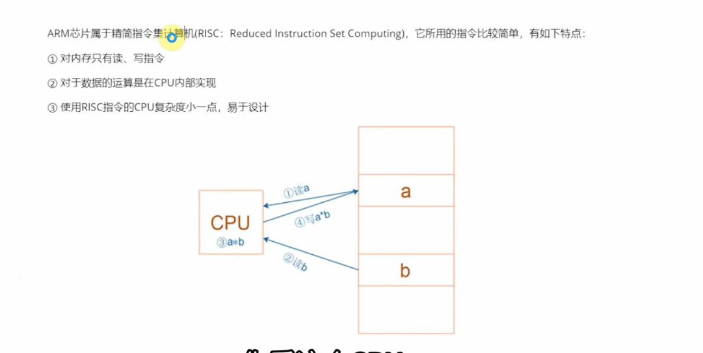
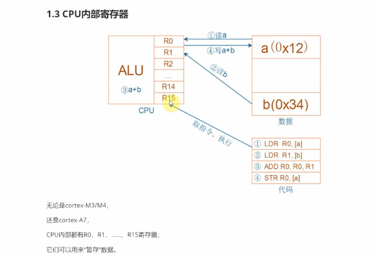
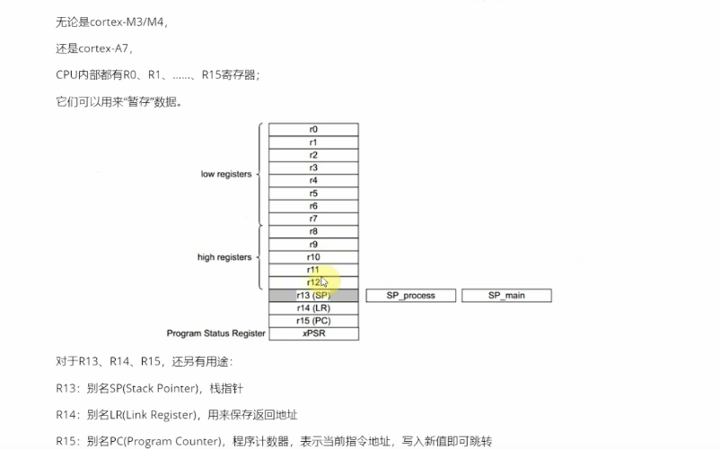
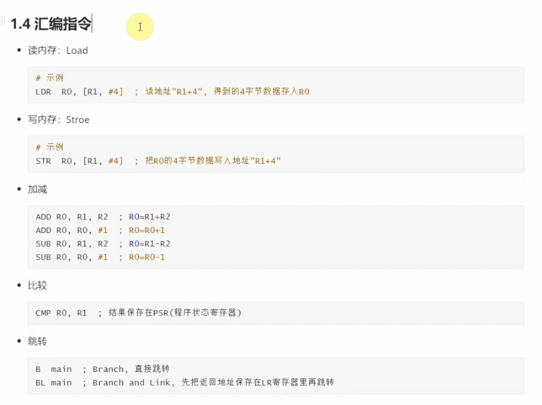

好的，这个视频是一个非常棒的嵌入式入门教程，它清晰地讲解了从硬件架构到汇编指令的核心概念。我已经为您整理了视频的内容摘要、扩展知识点以及一套针对性的面试问题。


# 💻 视频内容摘要 (附时间点)

这是一个关于ARM架构的简明教程，重点讲述了硬件架构和基础汇编指令。

- **00:00 - 01:46 硬件架构对比：PC vs 嵌入式**

  - 视频首先以一个问题（理解RTOS的栈）为引子，说明了理解处理器架构的重要性。
  - **PC架构：** 使用“组装电脑”的例子，说明PC的组件（CPU、内存、硬盘）是**分立的 (Discrete)**，通过主板连接在一起。

- **01:46 - 03:10 嵌入式架构：SoC (System on a Chip)**

  - 与PC不同，嵌入式设备（如单片机）使用的是**SoC (片上系统)**。
  - SoC是将 **CPU**、**内存 (RAM)** 和 **Flash (类似硬盘)** 集成在**一个芯片**上的完整系统。
  - Flash用于存储程序，CPU执行程序，内存(RAM)在程序运行时使用。

- **03:10 - 04:58 RISC 架构核心思想**

  

  - ARM 架构属于 **RISC (精简指令集计算机)**。
  - **核心特点1：** 内存访问（读/写）和数据运算（计算）是分离的。
  - **核心特点2：** 只有 **Load (加载)** 和 **Store (存储)** 指令可以访问内存。
  - **核心特点3：** 所有的算术运算（加减乘除）都必须在 **CPU 内部** 完成。
  - **C语言示例 (`a = a * b`)：** 视频讲解了这条C语言指令在RISC架构下被分解为4个步骤：
    1. `Load`: 从内存读取 `a` 的值到CPU。
    2. `Load`: 从内存读取 `b` 的值到CPU。
    3. `Multiply`: 在CPU内部计算 `a * b`。
    4. `Store`: 将计算结果写回到内存中的 `a` 地址。

- **04:58 - 07:14 CPU 的核心：寄存器 (Registers)**

  - 引出一个问题：数据从内存加载到CPU，具体是放在哪里？答案是 **CPU内部寄存器**。

  - CPU内部包含：

    

    - **ALU (算术逻辑单元)：** 负责计算。
    - **寄存器 (R0-R15)：** 临时存储数据的地方。

  - **汇编示例 (`a = a + b`)：** 视频更新了例子，展示了汇编指令如何工作：

    1. `LDR R0, [a]`：把内存中 `a` 的值加载到 `R0` 寄存器。
    2. `LDR R1, [b]`：把内存中 `b` 的值加载到 `R1` 寄存器。
    3. `ADD R0, R0, R1`：ALU计算 `R0 + R1`，结果存回 `R0`。
    4. `STR R0, [a]`：把 `R0` 的值存储回内存中的 `a` 地址。

- **07:14 - 08:23 特殊功能寄存器**

  

  - R0-R12 是一般用途的寄存器。
  - R13, R14, R15 是有特殊用途的：
    - **R13 (SP - Stack Pointer):** 栈指针，指向栈顶地址。
    - **R14 (LR - Link Register):** 链接寄存器，用于保存函数调用的**返回地址**。
    - **R15 (PC - Program Counter):** 程序计数器，指向**下一条要执行的指令**的地址。

- **08:23 - 12:24 汇编指令：LDR (加载) 与 STR (存储)**

  

  - 类比 `memcpy` 需要源、目的、长度，ARM指令也类似。

    

  - **`LDR R0, [R1, #4]`** (加载指令)

    - `LDR`: 指令名 (Load)，默认读4字节（一个字）。
    - `R0`: **目标**寄存器。
    - `[R1, #4]`: **源地址**（内存）。地址为 `R1` 寄存器中的值 + 4。
    - **含义：** 从内存地址 `[R1+4]` 读取4字节数据，放入 `R0` 寄存器。

  - **`STR R0, [R1, #4]`** (存储指令)

    - `STR`: 指令名 (Store)，默认写4字节。
    - `R0`: **源**寄存器。
    - `[R1, #4]`: **目标地址**（内存）。
    - **含义：** 把 `R0` 寄存器中的4字节数据，写入到内存地址 `[R1+4]`。

  - **LDRB/STRB**：操作1字节 (Byte)。

  - **LDRH/STRH**：操作2字节 (Half-word)。

- **12:24 - 12:58 汇编指令：ADD / SUB (算术)**

  - `ADD R0, R1, R2`: 含义 `R0 = R1 + R2`。
  - `SUB R0, R1, R2`: 含义 `R0 = R1 - R2`。

- **12:58 - 14:50 汇编指令：CMP / B / BL (跳转)**

  - `CMP R0, R1`: 比较 `R0` 和 `R1` 的值，结果存入程序状态寄存器 (PSR)。
  - **`B main` (Branch):** 立即跳转。直接将 `main` 的地址写入 `PC` (R15)，程序从 `main` 开始执行。这是一个**单向跳转**。
  - **`BL main` (Branch with Link):** 带链接的跳转（用于**函数调用**）。它会做**两件事**：
    1. **Link (链接):** 将**下一条指令的地址** (即返回地址) 保存到 `LR` (R14) 寄存器。
    2. **Branch (跳转):** 将 `main` 的地址写入 `PC` (R15)，跳转到函数。

------

 

# 补充提问

## 提问 1 

<span style="font-weight:bold; font-size:1.2em;">在stm32中内存是用来存储数据的，而flash是用来存储程序代码的吗，这和我们PC好像不太一样啊，我不是太懂，你能够给我对比分析下吗，最好能够举个例子来让我彻底弄明白</span>。


您提的这个问题非常敏锐！这确实是PC架构和嵌入式微控制器（M0CU）架构的一个核心区别，也是很多初学者容易混淆的地方。

您的理解基本是正确的：

- 在 **STM32** 上：**Flash** 用来存**程序代码**，**SRAM**（就是您说的“内存”）用来存**运行时数据**。
- 在 **PC** 上：**硬盘/SSD** 用来存**程序代码**，**内存 (RAM)** 在程序运行时，既要存**程序代码**也要存**运行时数据**。

最大的不同点在于：**“程序在哪里执行？”**

下面我来为您详细对比，并用一个例子来说明。


### 💻 架构对比：PC vs. STM32 

| **特性**         | **PC (个人电脑)**                                            | **STM32 (微控制器)**                                         |
| ---------------- | ------------------------------------------------------------ | ------------------------------------------------------------ |
| **程序存储**     | **硬盘 (HDD) 或 固态硬盘 (SSD)** (非易失性，断电不丢)        | **Flash (闪存)** (非易失性，断电不丢)                        |
| **运行时内存**   | **DDR 内存 (RAM)** (易失性，断电丢失)                        | **SRAM (静态内存)** (易失性，断电丢失)                       |
| **程序执行方式** | **“加载后执行” (Load-and-Execute)** CPU **不能**直接从硬盘执行代码。 | **“就地执行” (Execute-In-Place, XIP)** CPU **可以直接**从Flash执行代码。 |
| **架构**         | **冯·诺依曼架构 (为主)** 程序和数据共享同一套总线和内存。    | **哈佛架构 (或改进型哈佛架构)** 程序和数据有**各自独立**的总线。 |
| **启动过程**     | 慢。OS需要从硬盘**加载**到RAM，然后CPU从RAM开始执行。        | **极快**。上电后，CPU直接从Flash的特定地址（如0x08000000）开始读取并执行指令。 |

------


### 💡 举个例子：厨房 vs. 工作室

为了让您彻底明白，我们来打两个比方。

#### 场景一：PC 的“厨房”模式 (加载后执行)

您可以把PC想象成一个**大型专业厨房**：

- **CPU**：是**厨师**。
- **硬盘 (SSD)**：是厨房外的**巨型食谱库**（很大，但很远）。
- **内存 (RAM)**：是厨师面前的**备菜台**（空间有限，但伸手即达）。

**工作流程：**

1. **启动程序（双击Chrome.exe）：** 厨师（CPU）接到命令要做“宫保鸡丁”（运行Chrome）。
2. **加载到内存：** 厨师跑到食谱库（SSD），把“宫保鸡丁”的整张食谱（程序代码）**抄写**一遍，放到自己面前的备菜台（RAM）上。
3. **执行程序：** 厨师**看着备菜台上的食谱抄本（RAM中的代码）**，开始切菜、炒菜（执行指令）。
4. **处理数据：** 所有的原材料、切好的菜（变量、栈数据）也都放在这个备菜台（RAM）上。

**关键点：** 厨师（CPU）**永远不会**跑去食谱库（SSD）那里，一边看食谱一边炒菜。他必须先把食谱“加载”到近处的备菜台（RAM）才能开始工作。


#### 场景二：STM32 的“工作室”模式 (就地执行)

您可以把STM32想象成一个**高度优化的精密工作室**：

- **CPU**：是**工匠**。
- **Flash (闪存)**：是**贴在工匠正前方墙上的操作手册**（永久固定，抬头可见）。
- **SRAM (内存)**：是工匠手边的一个**小托盘**（很小，但速度极快）。

**工作流程：**

1. **上电启动：** 工匠（CPU）一上班（通电），**抬头就看墙上的操作手册（Flash）**，从第一行开始读（从0x08000000地址执行）。
2. **执行程序：** 工匠**自始至终**都看着墙上的手册（Flash）来工作（执行指令）。
3. **处理数据：** 当他需要临时放一下零件、或者计算一个中间值（变量、栈数据）时，他会把这些东西放在手边的托盘（SRAM）上。

**关键点：** 工匠（CPU）**不需要**先把手册抄一遍。他直接**“就地执行” (Execute-In-Place)** 墙上的指令。


### 总结：为什么会有这种差异？

这种差异是由它们的不同使命决定的：

1. **PC (个人电脑)：**
   - **使命：** 灵活性和高性能。需要运行庞大的操作系统（Windows/macOS）和各种大型软件。
   - **妥协：** 硬盘/SSD容量巨大但速度相对较慢，RAM速度极快但昂贵且易失。PC架构选择用RAM作为统一的工作区，通过“加载”过程来弥补硬盘的速度劣势。启动慢几秒钟是可以接受的。
2. **STM32 (嵌入式)：**
   - **使命：** 实时、可靠、低成本、低功耗。
   - **需求：** 必须**立即响应**。比如汽车的ECU或医疗设备，要求一上电就必须马上开始工作，不允许有“加载操作系统”的等待时间。
   - **实现：** “就地执行”(XIP) 是完美的解决方案。程序代码固化在Flash中，CPU上电就直接从Flash读取指令执行，实现了**零启动时间**。SRAM则只用来存储那些*必须*在运行时被修改的数据（比如一个传感器的当前读数）。

这个“就地执行” (XIP) 的概念，以及Flash和SRAM在内存地址空间中的不同映射，是嵌入式开发中非常核心的知识点，在面试中经常被问到。

希望这个对比和例子能帮您彻底弄明白！您是否还想了解一下STM32的“内存映射”（Memory Map），即Flash和SRAM在CPU眼里分别是怎样编址的？


## 提问 1-（1）（重点-stm32内存映射）

<span style="font-weight:bold; font-size:1.2em;">我还想了解下STM32的“内存映射”（Memory Map），即Flash和SRAM在CPU眼里分别是怎样编址的？</span>


这正是一个非常核心和关键的问题！理解了内存映射（Memory Map），您就等于拿到了STM32的“城市地图”，C语言中所有的变量、函数、指针、寄存器操作都会瞬间变得清晰。

简单来说：在CPU眼里，**<span style="color:#CC0000;">它根本不区分什么是Flash、什么是SRAM、什么是外设（补充理解：对外设寄存器操作，如 TIM1->ARR ，是对外设操作；对变量操作是对SRAM中存储单元操作；带指针操作是对SRAM存储单元地址操作 ）</span>**。

CPU只看到一个**统一的、连续的 4GB 地址空间**（从 `0x0000 0000` 到 `0xFFFF FFFF`）。而<span style="color:#CC0000;">“内存映射”就是STM32的硬件设计者画的一张“地图”</span>，它规定了：

- “A街区”（比如 `0x0800 0000` 开始的地址）对应的是 **Flash**。
- “B街区”（比如 `0x2000 0000` 开始的地址）对应的是 **SRAM**。
- “C街区”（比如 `0x4000 0000` 开始的地址）对应的是**外设**（比如GPIO、UART）。

CPU要做的就是**按地址访问**。

- CPU想**执行指令**，就去 Flash 所在的地址“取指令”。
- CPU想**读写数据**，就去 SRAM 所在的地址“读/写数据”。
- CPU想**点个灯**，就去 GPIO 所在的地址“写一个值”。

下面是一张典型的STM32内存“地图”（以STM32F4系列为例，不同型号略有差异，但大框架一致）：


### 🗺️ STM32 内存“地图” (Memory Map)

CPU（Cortex-M4）看到的是一个 4GB (2³²) 的巨大空间。这张地图被划分成了几个主要区域：

| **地址范围**                      | **区域名称**           | **里面“住”的是什么？**                                       | **关键说明**                                     |
| --------------------------------- | ---------------------- | ------------------------------------------------------------ | ------------------------------------------------ |
| **`0x0800 0000` - `0x080F FFFF`** | **Flash (闪存)**       | **程序代码 (`.text`)**、**常量 (`.rodata`)**                 | 这是您程序真正的“家”。CPU从这里“就地执行”(XIP)。 |
| **`0x2000 0000` - `0x2001 FFFF`** | **SRAM (内存)**        | **全局/静态变量 (`.data`, `.bss`)**、**栈 (Stack)**、**堆 (Heap)** | 这是程序运行时的“草稿纸”。断电即丢。             |
| `0x4000 0000` - `0x5FFF FFFF`     | **Peripherals (外设)** | **GPIO, UART, I2C, SPI, Timers...**                          | 您的“开关”和“仪表盘”。                           |
| `0xE000 0000` - `0xE00F FFFF`     | **System (内核外设)**  | **NVIC, SysTick...**                                         | CPU自己核心的“控制台”。                          |
| `0x0000 0000` - `0x000F FFFF`     | **Boot (启动区)**      | **地址“别名”**                                               | **这是理解启动的关键！请看下面的例子。**         |

------


### 💡 举个例子：启动的“魔法”——地址重映射

这是最能让您彻底弄明白的地方。

一个问题：

我们知道，所有Cortex-M处理器（STM32的CPU）都被设计为上电后必须从 0x0000 0000 地址开始取第一条指令（专业点说，是取向量表中的“堆栈顶地址”和“复位地址”）。

一个矛盾：

但我们上面地图显示，我们的程序代码明明是烧录在 0x0800 0000 地址的Flash里！

<span style="color:#CC0000;">**那么CPU怎么能从 `0x0000 0000` 启动呢？**</span>

**答案：地址重映射 (Aliasing)**

STM32内部有一个“地址转发”机制。它通过一个**BOOT引脚**（您在板子上看到的 `BOOT0` 引脚）来决定 `0x0000 0000` 这个地址到底“映射”到哪里。

> 比喻：
>
> 0x0000 0000 就像一个快捷方式或转发邮箱。
>
> 1. **当 `BOOT0` 接地（设为0）时：**
>    - 这是最常见的“从Flash启动”模式。
>    - STM32的硬件会自动设置一个“转发规则”：**“所有发往 `0x0000 0000` 的访问请求，请全部转发到 `0x0800 0000` 去处理。”**
> 2. **当 `BOOT0` 接高电平（设为1）时：**
>    - 这是“从系统内存启动”模式（用于串口下载程序）。
>    - STM32会设置另一条规则：“所有发往 `0x0000 0000` 的访问，请转发到内置的 Bootloader ROM。”

**所以，您的STM32启动的真实流程是：**

1. 您将 `BOOT0` 引脚接地，然后上电。
2. 硬件“转发机制”生效：`0x0000 0000` 这个地址被**映射（重定向）**到了 `0x0800 0000`。
3. CPU 准时上班，它按规定访问 `0x0000 0004` 地址，想取第一条指令的地址。
4. “转发机制”介入，将这个访问请求**自动导向**了 **`0x0800 0004`**。
5. CPU 成功地从 Flash 中取到了指令，开始执行您的 `main` 函数。

在CPU看来，它访问的是 `0x0000 0000`；但在物理上，数据是从 `0x0800 0000` 来的。


### 总结对比

- **PC：** 启动时，BIOS/UEFI 先工作，把硬盘上的操作系统**“拷贝”**到 `RAM` 中，然后CPU再从 `RAM` 中执行。这是一个**“先搬家，再工作”**的模式。
- **STM32：** 启动时，通过“地址重映射”的技巧，让CPU**“误以为”** `0x0000 0000` 就是Flash的地址，CPU**直接从Flash (`0x0800 0000`)** 开始执行。这是一个**“就地工作”**的模式。

这就是为什么STM32一上电就能立刻运行程序，而PC需要一个“开机过程”。

您是否还想了解一下 C 语言中的 `const` 常量和普通变量，在这张“地图”上是如何被分配的？


## 提问 1 - （ 2）

<span style="font-weight:bold; font-size:1.2em;">我还想了解一下 C 语言中的 `const` 常量和普通变量，在这张“地图”上是如何被分配的？</span>

这是一个非常棒的后续问题。简单来说：

**`const` 常量**被分配到 **Flash (闪存)** 中，而“普通”可变变量被分配到 **SRAM (内存)** 中。

这种设计的核心思想是**“物尽其用”**：

- **Flash** 的特性是 **非易失性**（断电不丢）且在运行时**只读**。它就像“刻在石碑上的字”。这使得它成为存储**程序代码**和**永不改变的常量**的完美场所。
- **SRAM** 的特性是 **易失性**（断电即丢）但**读写速度极快**。它就像“工作台上的草稿纸”。这使得它成为存储**运行时会改变的数据**（<span style="color:#CC0000;">如全局变量、局部变量</span>）的唯一场所。


### 幕后功臣：编译器和链接器

您写的C代码，在编译链接后，会被智能地归类到不同的“区段”(Sections)。然后，链接器会根据“内存地图”，把这些区段分配到 Flash 或 SRAM 中。

这是C语言变量和内存地图的对应关系：

| **变量类型 (C语言)**        | **区段 (Linker Section)**      | **最终存储位置**                       | **举例**                                             |
| --------------------------- | ------------------------------ | -------------------------------------- | ---------------------------------------------------- |
| **程序代码**                | **`.text`**                    | **Flash**                              | 您的 `main()` 和其他所有函数。                       |
| **`const` 全局常量**        | **`.rodata`** (Read-Only Data) | **Flash**                              | `const int MAX_USERS = 100;`                         |
| **已初始化的全局/静态变量** | **`.data`**                    | **SRAM** (运行时)   **Flash** (初始值) | `int global_counter = 10;`   `static int state = 1;` |
| **未初始化的全局/静态变量** | **`.bss`**                     | **SRAM**                               | `int sensor_reading;`   `static char buffer[100];`   |
| **函数局部变量**            | **`Stack` (栈)**               | **SRAM**                               | `void func() { int local_var = 5; }`                 |
| **动态分配的内存**          | **`Heap` (堆)**                | **SRAM**                               | `char *p = malloc(20);`                              |

------


### 💡 举个例子：一个程序的“生命周期”

让我们用一个具体的例子，看看STM32上电后到底发生了什么。

**假设您的 C 代码如下：**

C

```c
// 1. .rodata 区 (将被放入 Flash)
const int FIRMWARE_VERSION = 120; // 固件版本号
const char WELCOME_MSG[] = "Hello!"; // 欢迎字符串

// 2. .data 区 (初始值在 Flash, 运行时在 SRAM)
int g_event_counter = 0; // 已初始化的全局变量

// 3. .bss 区 (运行时在 SRAM)
int g_sensor_value; // 未初始化的全局变量
char g_rx_buffer[64];

// 4. .text 区 (将被放入 Flash)
void process_sensor_data() {
    // 5. Stack (栈) (运行时在 SRAM)
    int local_temp = g_sensor_value * 10;
    
    if (local_temp > 100) {
        g_event_counter++; // 修改 .data 区的变量
    }
}

int main() {
    // 启动代码会先执行
    
    while(1) {
        // ... 从硬件读取传感器值，存入 g_sensor_value (SRAM) ...
        process_sensor_data();
    }
}
```


#### 启动前：烧录（.hex 文件）

当您编译并“烧录”程序时，`.hex` 文件被写入 **Flash**。此时 Flash 里的内容大致如下：

- **地址 `0x0800 0000` (启动代码):**
  - 程序入口 `Reset_Handler`
- **地址 `0x0800 0100` (假设, `.text`区):**
  - `process_sensor_data` 函数的机器码
  - `main` 函数的机器码
- **地址 `0x0800 5000` (假设, `.rodata`区):**
  - `FIRMWARE_VERSION` (值: 120)
  - `WELCOME_MSG` (值: "Hello!")
- **地址 `0x0800 5100` (假设, `.data`初始值):**
  - `g_event_counter` 的初始值 (值: 0)

注意：此时 SRAM 里**什么都没有**，是一片空白（或随机值）。


#### 启动时：上电瞬间 (发生“搬运”)

当您给STM32上电，CPU会从Flash (`0x0800 0000`) 开始执行一段**隐藏的启动代码**（在 `startup_stm32.s` 文件里，由IDE自动添加）。

这段代码在您的 `main` 函数**执行之前**，会做两件至关重要的数据“搬运”工作：

1. **搬运 `.data`：**
   - 启动代码去 Flash 的 `0x0800 5100` 地址，读取 `g_event_counter` 的初始值 `0`。
   - 然后将这个 `0` **复制**到 SRAM 中 `g_event_counter` 的运行时地址（例如 `0x2000 0000`）。
   - **（这就是为什么 `g_event_counter` 在 `main` 开始时就是 0）**
2. **清空 `.bss`：**
   - 启动代码找到 SRAM 中为 `.bss` 区（即 `g_sensor_value` 和 `g_rx_buffer`）预留的地址（例如从 `0x2000 0004` 开始）。
   - 它会把这块SRAM区域**全部填充为 0**。
   - **（这就是为什么未初始化的全局变量默认为 0）**


#### 运行中：`main` 函数执行

启动代码完成“搬运”后，才会跳转到 `main` 函数（它在Flash里）开始执行。

1. CPU 执行 `main` 里的 `while(1)` (在 Flash 中取指令)。
2. 当调用 `process_sensor_data()` 时 (在 Flash 中取指令)：
   - **栈操作 (SRAM)：** 栈指针(SP)移动，在 SRAM 的**栈**上为 `local_temp` 分配了4个字节的空间。
   - CPU去 SRAM (`0x2000xxxx`) 读取 `g_sensor_value`。
   - CPU将计算结果写入 SRAM 的**栈**上（`local_temp` 的地址）。
   - 当 `process_sensor_data()` 函数返回时，栈上的 `local_temp` 空间被释放（SP移回）。


### 总结：面试加分项

- **为什么 `const` 要放 Flash？**
  - **节省SRAM：** SRAM是STM32上最宝贵的资源（通常只有几十到几百KB）。如果一个1KB的`const`查询表放在SRAM中，就是巨大的浪费。放在Flash（通常有几百KB到几MB）中不占SRAM。
  - **程序安全：** Flash在运行时是只读的。如果一个野指针试图修改 `FIRMWARE_VERSION`，它会触发一个硬件错误 (HardFault)，这能帮您快速定位bug。如果它在SRAM中，就会被悄无声息地篡改，导致灾难性后果。
- **为什么 `.data` 需要“搬运”？**
  - 因为 `g_event_counter` **必须是可写的**，所以它**必须**住在 `SRAM`。
  - 但它的初始值 `0` **必须是断电不丢的**，所以这个初始值**必须**存在 `Flash`。
  - 因此，唯一的办法就是：上电时，启动代码负责把这个“初始值”从Flash“拷贝”到SRAM。


## 提问2

- **`B main` (Branch):** 立即跳转。直接将 `main` 的地址写入 `PC` (R15)，程序从 `main` 开始执行。这是一个**单向跳转**。
- **`BL main` (Branch with Link):** 带链接的跳转（用于**函数调用**）。它会做**两件事**：
  1. **Link (链接):** 将**下一条指令的地址** (即返回地址) 保存到 `LR` (R14) 寄存器。
  2. **Branch (跳转):** 将 `main` 的地址写入 `PC` (R15)，跳转到函数。

<span style="font-weight:bold; font-size:1.2em;">上面这个过程我不太理解，你能够给我详细解释下吗。</span>


您提的这个问题是理解CPU如何执行C语言函数的**最核心关键**！您能在这里感到困惑，说明您已经触及到底层原理的要害了。

让我们用一个“打电话”的生动比喻来彻底讲清楚这个过程。

在这个比喻中：

- **你 (CPU):** 你是处理器，负责执行任务。
- **你的《主线任务清单》(PC, R15):** 这是程序计数器，上面写着你**当前正在做**的任务。
- **一个便利贴 (LR, R14):** 这是链接寄存器，用来**<span style="color:#CC0000;">临时记下“我刚做到哪了”</span>**。
- **《主线任务清单》上的任务：**
  - `地址 0x100`: "准备调用'main'函数" (即 `BL main`)
  - `地址 0x104`: "调用'main'之后，继续处理数据"
  - `地址 0x108`: "处理完数据，点亮LED"
- **《main 函数任务清单》 (存储在 0x500 地址):**
  - `地址 0x500`: "任务A：初始化串口"
  - `地址 0x504`: "任务B：配置定时器"
  - `地址 0x508`: "任务C：返回" (即 `BX LR`)

------


### 场景一：使用 `B main` (Branch - 单程票)

`B` 指令就像一张**单程车票**或者 `goto` 语句。

1. **当前状态：**
   - 你 (CPU) 正在执行《主线任务清单》。
   - 你的**PC**指向 `0x100`。
2. **执行 `B main`：**
   - 你看到 `0x100` 处的指令是 `B main` (跳转到 `0x500`)。
   - 你拿出你的《主线任务清单》(PC)，**擦掉了 `0x100`，直接写上了 `0x500`**。
3. **后续：**
   - 你开始执行 `0x500` 处的任务 ("初始化串口")。
   - 接着执行 `0x504` ("配置定时器")。
   - 接着执行 `0x508` ... 假设这里没有返回指令，你会继续执行 `0x50C`... 你会永远在 `main` 函数的区域里执行下去。
   - 你**完全忘记**了《主线任务清单》里还有 `0x104` ("继续处理数据") 和 `0x108` ("点亮LED") 这回事。你回不去了！

**`B` 指令的总结：**

- **动作：** `PC = 0x500` (重写任务清单)。
- **LR (便利贴)：** **完全没有碰过。**
- **结果：** 这是一个**有去无回**的跳转。适用于 `while(1)` 循环或 `if-else` 的逻辑跳转，但不适用于“调用”一个函数。

------


### 场景二：使用 `BL main` (Branch with Link - 往返票)

`BL` 是“带链接的跳转”，也就是**打电话**。打电话的精髓在于，你打给别人办完事后，**还要能挂断电话，回来继续做自己的事**。

1. **当前状态：**

   - 你 (CPU) 正在执行《主线任务清单》。
   - 你的**PC**指向 `0x100`。

2. **执行 `BL main` (打电话)：**

   - 你看到 `0x100` 处的指令是 `BL main`。
   - 你知道这是一个“函数调用”，意味着你**等下还要回来**。
   - **你做了两件事：**

   1. **"Link" (链接/记录)：** 你拿出**便利贴 (LR)**，在上面写下你回来后要做的第一件事的地址：`0x104` ("继续处理数据")。
   2. **"Branch" (跳转)：** 你拿出你的《主线任务清单》(PC)，**擦掉了 `0x100`，写上了 `0x500`**。

3. **后续 (在'main'函数中)：**

   - 你开始执行 `0x500` 处的任务 ("初始化串口")。
   - 接着执行 `0x504` ("配置定时器")。
   - 接着执行 `0x508`，这条指令是 `BX LR` (返回)。

4. **执行 `BX LR` (挂断电话)：**

   - 你看到 "返回" 指令。
   - 你看了看你之前写的**便利贴 (LR)**，上面写着 `0x104`。
   - 你拿出你的《主线任务清单》(PC)，**擦掉了 `0x508`，写上了便利贴上的地址 `0x104`**。

5. **返回主线：**

   - 你现在开始执行 `0x104` 处的任务 ("继续处理数据")。
   - 接着执行 `0x108` ("点亮LED")。
   - ...程序完美地接续了下去。

**`BL` 指令的总结：**

- **动作1 (Link)：** `LR = PC + 4` (把**下一条指令**的地址 `0x104` 存入**便利贴**)。
- **动作2 (Branch)：** `PC = 0x500` (重写**任务清单**，跳转到新函数)。
- **结果：** 这是一个**有去有回**的跳转，完美地实现了函数调用。`LR` 寄存器就是CPU用来保存“返回地址”的“便利贴”。

------


### 总结对比

| **指令**              | **B main (Branch)**        | **BL main (Branch with Link)**                |
| --------------------- | -------------------------- | --------------------------------------------- |
| **中文名**            | 跳转                       | 带链接的跳转                                  |
| **比喻**              | **单程票**                 | **往返票** (或 打电话)                        |
| **它做了什么？**      | 1. `PC = main的地址`       | 1. **`LR = 返回地址`**   2. `PC = main的地址` |
| **`LR` (R14) 寄存器** | **不改变**                 | **被修改** (存入了返回地址)                   |
| **`PC` (R15) 寄存器** | **被修改** (存入目标地址)  | **被修改** (存入目标地址)                     |
| **使用场景**          | `if`, `else`, `while` 循环 | **函数调用**                                  |

理解了 `LR` (便利贴) 是用来保存“返回地址”的，您就抓住了 `BL` 指令的全部精髓。


## 提问3

在CPU眼里，**<span style="color:#CC0000;">它根本不区分什么是Flash、什么是SRAM、什么是外设（补充理解：对外设寄存器操作，如 TIM1->ARR ，是对外设操作；对变量操作是对SRAM中存储单元操作；带指针操作是对SRAM存储单元地址操作 ）</span>**。

<span style="font-weight:bold; font-size:1.3em;">我的这个理解对吗，你还有没有什么需要补充的吗。</span>

您的理解**非常棒**！

您的核心观点“在CPU眼里，它根本不区分什么是Flash、什么是SRAM、什么是外设”是**绝对正确**的，这是嵌入式开发中**最重要**的概念之一。CPU只认一个东西：**内存地址（Memory Address）**。

- CPU执行 `LDR R0, [0x08000100]`，它就是从 `0x08000100` 这个地址读数据。
- CPU执行 `STR R0, [0x20000050]`，它就是往 `0x20000050` 这个地址写数据。
- CPU执行 `STR R0, [0x40010014]`，它就是往 `0x40010014` 这个地址写数据。

CPU并“不知道”`0x0800...` 是Flash，`0x2000...` 是SRAM，`0x4001...` 是GPIO。它只管发出地址和读/写信号。是STM32芯片内部的**总线矩阵（Bus Matrix）这个“硬件路由”在背后负责把CPU的请求转发给物理上正确**的设备（Flash控制器、SRAM、或APB/AHB总线上的外设）。

------


### 🔍 对您补充理解的详细分析


您的三点理解非常深刻，我们来逐一分析和补充：


#### 1. "对外设寄存器操作，如 `TIM1->ARR`，是对外设操作"

**您的理解：完全正确！**

补充说明：

这正是<span style="color:#CC0000;">C语言操作硬件的精髓</span>。TIM1 并不是一个变量，它是一个<span style="color:#CC0000;">宏定义</span>，本质是一个指向结构体的指针常量。

在STM32的头文件（如 `stm32f4xx.h`）中，您会找到类似这样的定义：

C

```c
#define PERIPH_BASE       ((uint32_t)0x40000000)
#define TIM1_BASE         (PERIPH_BASE + 0x00010000) // 地址: 0x40010000
#define TIM1              ((TIM_TypeDef *) TIM1_BASE) 
```

`TIM_TypeDef` 是一个描述定时器所有寄存器（如 `CR1`, `ARR`, `CNT`...）的 `struct` 结构体。

所以，<span style="color:#CC0000;">当您写 `TIM1->ARR = 100;` 时：</span>

- 编译器计算出 `TIM1` 的<span style="color:#CC0000;">基地址</span> `0x40010000`。

- 再加上 `ARR` 寄存器在 `TIM_TypeDef` 结构体中的<span style="color:#FF0000;">**偏移量**</span>（比如 `0x2C`）。

- 最终这条C语言被翻译成一条汇编指令，等效于：

  `*( (volatile uint32_t *) (0x40010000 + 0x2C) ) = 100;`

- CPU向 `0x4001002C` 这个**物理地址**写入了 `100`，总线把这个操作转发给了TIM1定时器，从而设置了它的自动重装载值。


#### 2. "对变量操作是对SRAM中存储单元操作"

**您的理解：大部分正确，但有一个重要例外。**

- **正确的部分：**<span style="color:#CC0000;"> 所有的**可变变量**</span>，比如全局变量、静态变量（`.data`, `.bss`区）和局部变量（`Stack`区），它们在运行时**确实**都存储在SRAM中。

- 需要补充的例外 (const 常量)：

  您在C语言中用 const 修饰的变量（特别是全局常量），比如：

  const int VERSION = 120;

  const char MESSAGE[] = "Hello";

  编译器会把它们放到 .rodata (Read-Only Data) 区段，这个区段最终被烧录在 Flash 中（地址位于 0x0800...）。

  当您的程序读取 VERSION 变量时，CPU是在访问Flash，而不是SRAM。这样做的好处是极大地节省了宝贵的SRAM。


#### 3. "带指针操作是对SRAM存储单元地址操作"

**您的理解：不完全正确。这是最容易混淆的地方。**

指针是C语言中最强大的特性，它的威力在于**它可以指向任何地址**。指针操作的对象**完全取决于它指向哪里**。

一个指针可以指向：

1. **SRAM (您的情况)：** 这是最常见的。

   C

   ```c
   int a = 10;       // 'a' 住在 SRAM (地址如 0x20000010)
   int *p = &a;      // 'p' 也住在 SRAM (栈上)，但它存的值是 0x20000010
   *p = 20;          // CPU向 0x20000010 (SRAM) 写入 20
   ```

2. **Flash (常量区)：**

   C

   ```c
   const char *p = "Hello World"; // "Hello World" 字符串存在 Flash (地址如 0x08005000)
   char c = *p;                  // CPU 从 0x08005000 (Flash) 读取 'H' 字符
   ```

3. **外设寄存器 (您的第一点)：**

   C

   ```c
   // 让一个指针指向 GPIOA 的输出数据寄存器 (ODR)
   uint32_t *p_gpioa_odr = (uint32_t *)0x40020014;
   
   // 通过指针点灯
   *p_gpioa_odr |= (1 << 5); // CPU 向 0x40020014 (外设) 写入一个值
   ```

**总结：** <span style="color:#CC0000;">指针操作的对象可以是SRAM、Flash或外设，关键看指针变量里“存的那个地址值”落在了内存地图的哪个区域。</span>

------


### 🚀 您必须补充的知识点：`volatile` 关键字

现在，基于您“CPU不区分地址”的正确理解，一个**终极面试问题**就出现了：

问题：

如果CPU不区分地址，那么当C编译器（比如GCC）优化代码时，它怎么知道 TIM1->ARR = 100 这句代码不能被“优化”掉呢？

场景（编译器的“自作聪明”）：

假设您写了这样的代码来等待定时器标志位：

C

```c
TIM1->SR = 0; // 软件清零中断标志位
while ( (TIM1->SR & 1) == 0 ) {
    // 等待硬件把这个标志位置 1
}
// 标志位置 1 了，继续执行
```

编译器在优化时会这样想：

> “嗯... 程序员刚给 `TIM1->SR` 写入了 0。下一行 `while` 循环又马上读取它，它**肯定**是 0 啊！所以 `(0 & 1) == 0` 永远为真。这是一个**死循环**！我（编译器）应该直接把这个 `while` 循环优化成 `while(1)`，或者干脆把后面的代码全删了，因为它们永远执行不到！”

**灾难发生了！** 编译器不知道 `TIM1->SR` 这个地址的值会被**硬件（CPU之外的东西）**所改变。

**解决方案：`volatile` 关键字**

`volatile`（易变的）关键字就是C语言的“免死金牌”，它用来告诉编译器：

> **“停止优化！你（编译器）对这个变量/地址一无所知！这个地址的值随时可能被外界（硬件、中断）改变。你必须**每次**使用它时，都老老实实地从它的**物理内存地址**重新加载（Load），**不准**使用CPU寄存器里的缓存副本！”**

这就是<span style="color:#CC0000;">为什么所有STM32头文件中，外设的定义都是这样的：</span>

C

```c
typedef struct {
    volatile uint32_t CR1;   // 必须加 volatile
    volatile uint32_t SR;    // 必须加 volatile
    volatile uint32_t ARR;   // 必须加 volatile
    // ...
} TIM_TypeDef;
```

正是 `volatile` 保证了您对 `TIM1->ARR` 的操作不会被编译器“优化”掉，保证了对硬件的访问是真实有效的。

您是否想更深入地了解一下 `volatile` 关键字是如何防止编译器优化的？


## 提问3 -（1）

<span style="font-weight:bold; font-size:1.2em;">我想更深入地了解一下 `volatile` 关键字是如何防止编译器优化的？</span>


这是一个非常棒的问题！要深入理解 `volatile`，您必须把自己想象成一个**“C语言编译器”**。

`volatile` 关键字的**唯一**作用，就是告诉**编译器（Compiler）**：“这个变量很‘易变’，不要对它做任何优化，必须‘老老实实’地对待它。”

它是一个**纯粹的、给编译器的指令**。它对CPU、对硬件**没有任何**影响。它只改变编译器生成的**汇编代码**。

编译器为了让程序跑得更快、代码更小，默认会进行各种“自作聪明”的优化。`volatile` 就是用来阻止这些“聪明”优化的。

------


### 编译器的三大“聪明”优化（以及 `volatile` 如何阻止它们）

让我们来看三种最常见的、会被 `volatile` 阻止的优化。


#### 1. 优化一：将变量“缓存”在CPU寄存器中（最常见的优化）

这是 `volatile` 最核心的用途。

场景：

假设您在等待一个硬件标志位（比如，等待串口接收到数据）。

C

```c
// 定义一个指向串口“状态寄存器”的指针
// (地址是编造的，但它指向一个硬件寄存器)
uint32_t *UART_SR = (uint32_t *)0x40011000;

// 等待接收完成 (假设第5位是'接收完成'标志)
while ( (*UART_SR & (1 << 5)) == 0 ) {
    // 循环等待...
}
// 接收完成，继续处理数据...
```

编译器的“聪明”优化：

编译器会这样想：“这个 while 循环太慢了！它在每一次循环里，都去 0x40011000 这个内存地址读取一次数据 (LDR 指令)，然后再比较。太浪费时间了！”

于是，编译器决定“优化”它：

1. **第一次循环前：** “我先把 `*UART_SR` 的值从内存**加载（LDR）**到 CPU 的一个高速寄存器，比如 `R3`。”
2. **循环中：** “我**不再**去访问内存了。我就在 CPU 内部，**反复检查 `R3` 寄存器**就行了。`while ((R3 & (1 << 5)) == 0)`”

**灾难性的后果：**

- 编译器以为 `*UART_SR` 是一个普通变量，它不知道这个地址的值会被**硬件（串口）在CPU之外**所改变。
- 结果，CPU一直在检查 `R3` 寄存器里的**旧值**（0）。
- 即使串口硬件早就接收完了数据，把内存地址 `0x40011000` 的值改成了 `(1 << 5)`，CPU 也不知道。
- **程序陷入了死循环。**

volatile 如何“拯救”：

现在，我们这样定义：

C

```c
volatile uint32_t *UART_SR = (volatile uint32_t *)0x40011000;
```

您加上的 volatile 告诉编译器：

“不准优化！这个地址的值随时可能被外界改变。<span style="color:#CC0000;">你必须在 while 循环的每! 一! 次! 迭代中，都重新生成一条 LDR 汇编指令，老老实实地从 0x40011000 这个地址重新读取它的值！”</span>

- **优化后的汇编（错误）：**

  Code snippet

  ```c
  LDR R3, [0x40011000]  ; 读一次，缓存到 R3
  loop:
    TEST R3, #0x20      ; 反复检查 R3
    BEQ loop            ; 等于0就继续循环
  ```

- **Volatile 后的汇编（正确）：**

  Code snippet

  ```c
  loop:
    LDR R3, [0x40011000]  ; 每次都重新从内存读取！
    TEST R3, #0x20
    BEQ loop
  ```

------


#### 2. 优化二：删除“无用”的写操作

场景：

您想在某个GPIO引脚上产生一个极短的“频闪”脉冲。

C

```c
// (假设 GPIO_ODR 是一个 volatile 指针)
*GPIO_ODR = 0xFF;  // 引脚拉高
*GPIO_ODR = 0x00;  // 立即拉低
```

编译器的“聪明”优化：

编译器会想：“这个程序员写了两次... 第二次的值 0x00 把第一次的值 0xFF 给覆盖了。那第一次的写入 *GPIO_ODR = 0xFF 不就是完全无用的吗？我应该把它删掉，只保留最后一次写入。”

**灾难性的后果：**

- 编译器“优化”后的代码只剩下了 `*GPIO_ODR = 0x00;`。
- 硬件上，引脚**根本不会**被拉高，那个“频闪”脉冲**消失了**。

volatile 如何“拯救”：

volatile 告诉编译器：“我写的每一个读/写操作都是有意义的，一个都不准少！必须按我写的顺序原封不动地生成汇编代码。”

------


#### 3. 优化三：重排指令顺序

场景：

您在操作一个外设，硬件手册规定：必须先写入数据，再设置“开始”标志位。

C

```c
// (假设 DATA_REG 和 CTRL_REG 都是 volatile 指针)
*DATA_REG = 0xABCD;  // 1. 写入数据
*CTRL_REG = 0x01;    // 2. 写入“开始”控制位
```

编译器的“聪明”优化：

编译器会想：“这两次写入的地址（DATA_REG 和 CTRL_REG）不一样，它们之间没有依赖关系。为了优化CPU的执行流水线，我调整一下它们的顺序，先写 CTRL_REG 可能更快。”

**灾难性的后果：**

- 编译器生成的汇编可能是：

  Code snippet

  ```c
  STR R0, [CTRL_REG]  ; 1. 先写入“开始”
  STR R1, [DATA_REG]  ; 2. 后写入数据
  ```

- 硬件被**提前“触发”**了，但它读到的 `DATA_REG` 还是上一次的旧数据，导致了错误。

volatile 如何“拯救”：

volatile 会阻止编译器对 volatile 变量的访问进行重排序。它确保了C代码中 DATA_REG 的写入一定发生在 CTRL_REG 的写入之前。

------


### 总结：`volatile` 的“黄金使用法则”

在嵌入式开发中，您**必须**使用 `volatile` 的三种情况：

1. **硬件外设寄存器：** 比如 `TIM1->SR`, `GPIOA->ODR`。这是最常见的。

2. **被中断服务程序(ISR)修改的全局变量：**

   - 比如，您在主循环 `while(1)` 中检查 `g_flag`，而这个 `g_flag` 是在定时器**中断**中被置 1 的。
   - 对编译器来说，主循环“看不见”中断，它会以为 `g_flag` 永远不变（优化一），您的主循环将永远卡住。

3. **被多线程（在RTOS中）共享的全局变量：**

   - 与中断类似，一个任务“看不见”另一个任务会修改这个变量，编译器会缓存它的值。

     


# 🚀 知识扩展与补充

视频中的内容是ARM架构的基础，在面试中，面试官很可能会在这些基础上进行延伸：

1. **更完整的SoC架构**
   - 视频提到了SoC包含 CPU、RAM 和 Flash。一个真正的SoC远不止这些。它还包括：
   - **总线 (Bus):** 如 AHB (高性能总线, 连接CPU和内存) 和 APB (低性能总线, 连接外设)。
   - **外设 (Peripherals):** GPIO (通用输入/输出), UART (串口), I2C, SPI, Timers (定时器), ADC/DAC (模数/数模转换) 等。
   - **DMA (Direct Memory Access):** 直接内存访问控制器。它允许外设（如UART）直接与内存（RAM）传输数据，而**不需要CPU介入**，极大地解放了CPU。
2. **RISC vs CISC**
   - **RISC (精简指令集):** 如 ARM, MIPS, RISC-V。指令数量少，格式固定，长度一致，执行周期短。只用 Load/Store 访问内存。编译器需要做更多优化工作。
   - **CISC (复杂指令集):** 如 x86 (Intel/AMD)。指令数量多，功能强大，格式和长度可变。允许一条指令同时完成“计算”和“内存访问”（例如，一条 `ADD` 指令可以直接将内存中的一个值加到另一个内存地址）。
3. **ARM 寄存器模型与工作模式**
   - 视频只提到了 R0-R15。实际上，ARM 处理器有多种工作模式（如 User, FIQ, IRQ, Supervisor, Abort, Undefined, System）。
   - 在不同模式下，一些寄存器（特别是 R13-SP 和 R14-LR）是**分组的 (Banked)**。这意味着每种模式都有自己*独立*的 SP 和 LR。
   - **面试关键点：** 当一个中断 (IRQ) 发生时，CPU 会自动切换到 IRQ 模式，并使用 IRQ 模式的 SP 和 LR。这样做的好处是**不会破坏**用户模式下的 SP 和 LR，使得中断处理可以独立、安全地进行。
4. **栈 (Stack) 的完整作用**
   - 视频提到 R13 是 SP (栈指针)。栈在嵌入式中至关重要，它主要用于：
   - **保存函数局部变量：** 在函数开头，SP 会移动（减小）来为局部变量“分配”空间。
   - **函数调用：** `BL` 指令将返回地址保存在 `LR` 中。但如果函数A调用函数B，B又调用函数C，那么B在调用C之前，必须先把自己的 `LR`（即A的返回地址）**压入 (PUSH) 栈中**。
   - **函数返回：** 当函数执行完毕时，它会从**栈中弹出 (POP)** 之前保存的 `LR` 值到 `PC` 中，从而返回到调用者。
   - `PUSH {R0, LR}` 和 `POP {R0, PC}` 是实现函数调用和返回的关键指令。

------


# 补充提问

## 提问1

<span style="font-weight:bold; font-size:1.2em;">SoC架构 是个什么东西，我不是太懂，你能够给我详细解释下吗，最好能够举个例子来让我彻底弄明白。</span>


好的，没问题！**SoC** 这个词听起来很专业，但它的概念其实非常直观。


### 🚀 SoC 的一句话解释

**SoC** 是 **System on a Chip** 的缩写，中文叫**“片上系统”**。

您可以把它想象成：**<span style="color:#CC0000;">把一台电脑（或一台手机）的所有核心部件，全都压缩、集成到了一个芯片上。</span>**

------


### 💻 对比：传统电脑 (PC) vs. SoC (片上系统)

要理解SoC，最好的办法就是拿它和我们最熟悉的**台式电脑 (PC)** 主板做对比。


#### 1. 传统台式电脑（“分立式”）

您打开一台台式电脑机箱，会看到一块很大的**主板 (Motherboard)**。在这块主板上：

- **CPU (中央处理器):** 像 Intel i7，一块**独立的芯片**，插在CPU插槽里。
- **内存 (RAM):** 几根**独立的内存条** (DDR4)，插在内存插槽里。
- **存储 (硬盘/SSD):** 一个**独立的设备**，通过SATA或M.2接口连接。
- **显卡 (GPU):** 一块**独立的卡** (NVIDIA RTX)，插在PCIe插槽里。
- **网卡/声卡:** 可能是**独立的芯片**或小板卡。

> **比喻：** 就像一个**“分工明确的团队”**。
>
> 厨师 (CPU)、配菜师 (RAM)、仓库管理员 (硬盘)、外卖员 (网卡) 都是**不同的人**，他们在一间大厨房（主板）里通过走来走去（总线）进行协作。**他们是分立的**。


#### 2. SoC (片上系统)（“集成式”）

现在，您拿出您的**智能手机**，它内部的核心就是一块 **SoC**。

在这**一块芯片**（比如高通的骁龙芯片或苹果的A系列芯片）的内部，已经包含了：

- **CPU (中央处理器):** 几个高性能和低功G耗的核心。
- **GPU (图形处理器):** 用于处理游戏和界面的显示。
- **内存 (RAM):** 经常会“堆叠”在CPU旁边，封装在**同一块芯片基板上**。
- **Wi-Fi / 蓝牙 / 5G 模块:** 用于通信。
- **AI 处理单元 (NPU):** 用于人工智能计算。
- **图像信号处理器 (ISP):** 用于处理摄像头数据。
- **甚至还有内存控制器、电源管理单元...**

> **比喻：** 就像一个**“超级全能的瑞士军刀”**。
>
> 还是那个厨房，但现在您有了一个**“全能机器人” (SoC)**。这个机器人**内部**就自带了厨师(CPU)、配菜台(RAM)、菜谱(ISP)、通讯电台(Wi-Fi)。**它自己就是一个完整的系统**。

------


### 💡 为什么需要 SoC？

您可能会想，为什么要把所有东西都塞进去？这带来了三大好处：

1. **⚡ 高能效（省电）：**
   - 在PC主板上，数据从CPU到内存，需要跨越很长的电路（总线），这非常耗电。
   - 在SoC上，CPU和RAM可能只有几毫米的距离，甚至直接堆叠在一起。**距离越短，通信越快，耗电越低**。
   - **这就是为什么您的手机电池能用一天，而您的台式机需要一个大电源风扇。**
2. **📏 小体积（省空间）：**
   - 试想一下，把台式机的主板、CPU、显卡、内存条... **所有这些塞进您的手机里**，这是不可能的。
   - SoC 把所有功能集成在一块指甲盖大小的芯片上，这才使智能手机、智能手表、无人机等便携设备成为可能。
3. **💰 低成本（省钱）：**
   - 对于制造商来说，他们不再需要单独采购CPU、北桥芯片、南桥芯片、网卡...
   - 他们只需要采购**一块SoC**，然后把它焊接到一块更简单、更便宜的电路板上就行了。这大大降低了设计复杂度和制造成本。

------


### 总结：SoC 的应用

您之前提到的 **STM32** 其实就是一种 **SoC**（虽然我们更常叫它 MCU/微控制器，但它完全符合SoC的定义）。

- **STM32 (微控制器):** 是一种**“控制型”SoC**。它集成了 CPU (Cortex-M)、Flash (存代码)、SRAM (存数据) 以及大量的外设（GPIO, UART, I2C）。它的目标不是快，而是**低功耗、可靠、实时控制**。
- **高通骁龙 (手机处理器):** 是一种**“计算型”SoC**。它的目标是**高性能计算和多媒体**，所以它集成了非常强大的CPU、GPU和NPU，用来跑复杂的操作系统 (Android) 和大型游戏。

简单来说：

<span style="color:#CC0000;">SoC 就是把一个“系统”所需的核心功能，从一块大主板压缩到了一块小芯片上。 几乎您身边所有的智能设备（手机、路由器、智能电视、STM32开发板、智能音箱）的核心都是一块SoC。</span>

希望这个解释能让您彻底弄明白！


## 提问2

**DMA (Direct Memory Access):** 直接内存访问控制器。它允许外设（如UART）直接与内存（RAM）传输数据，而**不需要CPU介入**，极大地解放了CPU。
<span style="font-weight:bold; font-size:1.2em;">这里DMA与内存交换数据指的是SRAM还是Flash呢，我不是太懂。</span>


您这个问题问得非常非常好！

您能提出这个问题，说明您已经快要打通嵌入式开发的“任督二脉”了。

您之前的理解中“内存（SRAM）存数据，Flash存代码”是对的，而DMA（直接内存访问）就是用来**“搬运数据”**的。

所以这里给您一个**最直接的答案**：

<span style="color:#CC0000;">**DMA 99% 的时间都是在和 SRAM 交换数据。**</span>

- 当DMA**从外设收数据**时（比如UART串口收到数据），它是把数据搬运到 **SRAM**。
- 当DMA**往外设发数据**时（比如I2C发数据），它是从 **SRAM** 里取数据。

为什么是SRAM？

因为您之前理解的非常对：SRAM是用来存储运行时数据的。

- 一个串口接收缓冲`g_rx_buffer`，它必须在SRAM里，因为它随时要被新数据**写入**。
- 一个ADC采样结果数组`g_adc_values`，它必须在SRAM里，因为它要被**动态填充**。
- 一个待发送的命令`tx_command`，它必须在SRAM里，因为它可能每次发送的都**不一样**。

**DMA就是为了把CPU从这些“搬运易变数据”的苦力活中解放出来的。**

------


### 举个例子：用DMA从串口接收数据

让我们用一个例子，把CPU、DMA、SRAM、Flash和外设（UART串口）的关系彻底理清。

**场景：** 我们要从串口接收100个字节的数据，并存入一个缓冲区。


#### 1. 没有 DMA 的情况（CPU干苦力）

- **SRAM**：您在SRAM中定义了一个缓冲区：`char g_rx_buffer[100];`
- **Flash**：您的程序代码（`main`函数、`while`循环、`UART_IRQHandler`中断函数）存在Flash里。
- **工作流程：**
  1. 串口（外设）收到 1 个字节的数据。
  2. 串口触发一个“接收中断”。
  3. CPU**立即停下**手头所有工作（比如`main`循环里的LED闪烁）。
  4. CPU跳转到Flash里，执行 `UART_IRQHandler` 这段代码。
  5. 在这段代码里，CPU**亲自**去读取串口的数据寄存器。
  6. CPU**亲自**把这个字节写入 **SRAM** 的 `g_rx_buffer[0]`。
  7. CPU返回，继续闪烁LED。
  8. **重复这个过程 100 次**...
- **缺点：** CPU被打断了100次！如果数据来得特别快，CPU光顾着搬运数据了，LED闪烁（主程序）都会被卡顿。


#### 2. 有 DMA 的情况（DMA干活，CPU摸鱼）

- **SRAM**：还是那个缓冲区：`char g_rx_buffer[100];`
- **Flash**：您的程序代码（`main`函数）存在Flash里。
- **工作流程：**
  1. **启动前：** CPU在`main`函数里（执行Flash中的代码）“配置”DMA控制器。CPU告诉DMA：
     - **源地址：** 串口（UART）的数据寄存器地址。
     - **目标地址：** **SRAM** 里的 `g_rx_buffer` 的首地址（`&g_rx_buffer[0]`）。
     - **长度：** 100 个字节。
  2. **启动！** CPU配置完DMA后，就回去干别的事了（比如开心地闪烁LED）。
  3. **DMA工作中：**
     - 串口收到 1 个字节。
     - 串口**通知DMA**：“来活了！”
     - **DMA控制器**（不需要CPU）**自动**从串口读取数据，并**自动**写入 **SRAM** 的 `g_rx_buffer[0]`。
  4. 串口收到第 2 个字节... DMA自动写入 `g_rx_buffer[1]`...
  5. 串口收到第 100 个字节... DMA自动写入 `g_rx_buffer[99]`。
  6. **任务完成：** DMA搬完了100个数据，触发一个“DMA传输完成”中断。
  7. CPU这才**被中断1次**，它知道：“哦，100个字节都到SRAM里了，我可以去处理了。”
- **优点：** 在这100个字节的传输过程中，CPU**完全没有被打扰**，一直在执行 `main` 循环里的LED闪烁，程序运行非常流畅。

------


### 补充：DMA 和 Flash 的唯一联系

那DMA和Flash到底有没有关系？有，但只有一种特殊情况：**内存到内存的传输**。

- 场景： 您的 Flash 里存了一个巨大的、只读的 const 数组，比如一个1000点的正弦波查找表。

  const uint16_t SINE_WAVE[1000] = { ... }; (存在 Flash 0x0800...)

- **需求：** 您的程序需要**非常快**地访问这个表，但从Flash读（即使很快）还是没有SRAM快。

- **做法：** 您可以在程序启动时，**使用DMA**，启动一次**“内存到内存”**传输。

  - **源地址：** Flash 里的 `SINE_WAVE` 首地址。
  - **目标地址：** **SRAM** 里的一个临时数组 `g_sine_buffer[1000]`。
  - **长度：** 1000个点。

- **结果：** DMA会把Flash里的1000个数据点，**一次性“拷贝”**到SRAM里。之后，您的CPU就可以在SRAM里高速访问这个`g_sine_buffer`了。

**总结：**

- **DMA vs SRAM (外设 ↔ 内存)：** 这是DMA的**常规工作**，用来传输**易变的、动态的数据**。
- **DMA vs Flash (内存 → 内存)：** 这是一种**特殊应用**，用来在启动时把**固定的、只读的常量数据**从Flash**“预加载”**到SRAM，以提高后续运行速度。


## 提问3

**函数调用：** `BL` 指令将返回地址保存在 `LR` 中。但如果函数A调用函数B，B又调用函数C，那么B在调用C之前，必须先把自己的 `LR`（即A的返回地址）**压入 (PUSH) 栈中**。

<span style="font-weight:bold; font-size:1.2em;">这里我不是太懂，这里B把自己的LR压入栈中，这里的LR不应该是B自己的吗，怎么是A的呢？</span>


您这个问题问得太好了！您能有这个疑问，说明您离彻底理解函数调用只有一步之遥了。这是一个“Aha！”时刻，一旦想通，终身不忘。

您的困惑点我猜是：您可能认为 A、B、C **各自**拥有一个“LR”。

**<span style="color:#CC0000;">关键事实：CPU 只有一个 LR (R14) 寄存器！</span>**

没错，在同一种处理器模式下，A、B、C... `main` 函数，大家**<span style="color:#FF0000;">共享</span>**这**同一个** `LR` 寄存器。它就像一个“全局变量”。

`BL` 指令（函数调用）会**无情地覆盖** `LR` 寄存器中**当前**的值。

------


### 💡 让我们用“便利贴”的比喻来走一遍

这个比喻能帮您彻底弄明白：

- **CPU (你):** 你是负责干活的人。
- **LR (你的手):** 你只有**一只手**能用来拿“便利贴”，这只手就是 `LR` 寄存器。
- **Stack (栈):** 你桌子上的一个**钉子（便签架）**，你可以把便利贴**“压”**上去（PUSH），也可以从**“顶上”**拿下来（POP）。
- **函数 (任务):** 比如 `main`、A、B、C 是不同的任务。


#### 场景开始：A 调用 B

1. **`main` 调用 A (`BL A`)：**
   - 你在做 `main` 任务。
   - **`BL A` 指令执行：**
     1. **Link (链接):** 你拿出一张**新的便利贴**，写上 `main` 任务的返回地址（比如 "main: 第5行"）。
     2. **Branch (跳转):** 你把这张便利贴**拿在手里 (LR)**，然后跑去做 A 任务。
   - **当前状态：**
     - 你正在做 A 任务。
     - **你的手里 (LR) 拿着：** “返回 main: 第5行” 的便利贴。


#### 核心场景：B 调用 C (您的问题点)

1. **A 任务中，准备调用 B (`BL B`)：**
   - 你在做 A 任务，此时**手里 (LR) **还拿着 "返回 main: 第5行" 的便利贴。
   - 你看到下一行指令是 `BL B` (调用B)。
   - **你 (作为A) 意识到了一个致命问题：**
     - `BL B` 这条指令也会写一张**新的**便利贴（"返回 A: 第x行"）。
     - 它会把这张**新的**便利贴塞进你的**手里 (LR)**。
     - 但你的手**不是**空的！如果你直接执行 `BL B`，你手里的 "返回 main: 第5行" 这张便利贴就会被**挤掉、丢失**！
     - 一旦丢失，你做完 A 任务后，就**永远回不去 main** 了！
   - **A 的解决方案 (PUSH)：**
     - 在执行 `BL B` **之前**，A 必须先**保护**好手里的这张便利贴。
     - A 把**手里 (LR)** 的 "返回 main: 第5行" 这张便利贴，拿下来，**“压”** 在了桌上的**钉子 (Stack) 上**。
     - **现在，你的手 (LR) 终于空出来了！**
   - **A 正式调用 B (`BL B`)：**
     1. **Link:** 你拿出一张**新的**便利贴，写上 A 任务的返回地址（比如 "返回 A: 第8行"）。
     2. **Branch:** 你把这张**新的**便利贴**拿在手里 (LR)**，跑去做 B 任务。
   - **当前状态：**
     - 你正在做 B 任务。
     - **你的手里 (LR) 拿着：** "返回 A: 第8行" 的便利贴。
     - **钉子 (Stack) 上插着：** "返回 main: 第5行" 的便利贴。
2. **B 任务中，准备调用 C (`BL C`)：**
   - 你在做 B 任务，此时**手里 (LR)** 拿着 "返回 A: 第8行" 的便利贴。
   - 你看到下一行指令是 `BL C`。
   - **你 (作为B) 意识到了同样的问题：**
     - `BL C` 会**覆盖**你手里的 "返回 A: 第8行" 这张便利贴。
   - **B 的解决方案 (PUSH)：**
     - 在执行 `BL C` **之前**，B 必须先**保护**好手里的这张便利贴。
     - B 把**手里 (LR)** 的 "返回 A: 第8行" 这张便利贴，拿下来，**“压”** 在了桌上的**钉子 (Stack) 上**。
     - **现在，你的手 (LR) 又空出来了！**
   - **B 正式调用 C (`BL C`)：**
     1. **Link:** 你拿出一张**新的**便利贴，写上 "返回 B: 第12行"。
     2. **Branch:** 你把这张**新的**便利贴**拿在手里 (LR)**，跑去做 C T任务。
   - **当前状态：**
     - 你正在做 C 任务。
     - **你的手里 (LR) 拿着：** "返回 B: 第12行" 的便利贴。
     - **钉子 (Stack) 上插着（从上到下）：**
       1. "返回 A: 第8行"
       2. "返回 main: 第5行"

------


### 解答您的疑问

现在我们回到您的提问：

> “这里B把自己的LR压入栈中，这里的LR不应该是B自己的吗，怎么是A的呢？”

回答：

在B准备调用C的那一刻，LR 寄存器里存的那个值（那个便利贴）确实是 "B的"。它是B任务的返回地址。

而 "B任务的返回地址" 是哪里？**就是 A 函数的地址！**（"返回 A: 第8行"）。

所以，您说的 "A的" 和 "B的" 都没有错，只是角度不同：

- **从属权角度 (B的)：** 这个返回地址是 B 完成任务后需要用到的，是B的“财产”。
- **内容角度 (A的)：** 这个地址值，它指向的**目的地**是 A 函数。

B 把这个“指向A的返回地址”压入栈中，就是为了**保护**它，防止它在B调用C时被覆盖。

------


### 函数返回 (POP)

当函数 C, B, A 依次返回时，就是从“钉子”上把便利贴按顺序**取回（POP）**的过程：

1. **C 返回 (`BX LR`)：**
   - C 看**手里 (LR)** 的便利贴 "返回 B: 第12行"。
   - C 跳转回 B 任务 (PC = "B: 第12行")。
2. **B 返回 (`POP {PC}`)：**
   - B 任务做完了。B 知道自己进来时在“钉子”上存过东西。
   - B 从**钉子 (Stack) 顶上**把 "返回 A: 第8行" 这张便利贴**取下来 (POP)**。
   - B **直接**按这张便利贴的地址跳转 (PC = "A: 第8行")。
3. **A 返回 (`POP {PC}`)：**
   - A 任务做完了。
   - A 从**钉子 (Stack) 顶上**把 "返回 main: 第5行" 这张便利贴**取下来 (POP)**。
   - A **直接**按这张便利贴的地址跳转 (PC = "main: 第5行")。

整个过程完美闭环，大家都能找到回家的路。


# ❓ 嵌入式面试经典问题 (基于视频内容)

以下是根据视频内容为您准备的5个经典面试问题，非常适合考察候选人对底层概念的理解。


#### 问题 1：SoC 与 PC 架构

**问题：** 请简述一下什么是SoC（片上系统）？它与我们日常使用的PC在硬件构成上最主要的区别是什么？

简洁回复：

SoC (System on a Chip) 是指将一个完整的计算机系统（包括CPU、内存RAM、存储Flash以及各种外设接口）全部集成到单一芯片上。

它与PC最主要的区别在于**集成度**：

- **PC** 的组件是**分立的**，CPU、内存条、硬盘是独立的硬件，通过主板上的总线连接。
- **SoC** 是**高度集成的**，所有核心组件都在一个芯片内，功耗更低、体积更小。


#### 问题 2：RISC 架构的 Load-Store 特性

**问题：** 视频中提到ARM是RISC架构。请说明RISC在执行“数据运算”和“内存访问”时有什么样的核心特点？

简洁回复：

RISC架构的核心特点是“Load-Store (加载-存储) 架构”。

这意味着：

1. **指令分离：** CPU的“数据运算指令”（如 `ADD`, `SUB`）和“内存访问指令”（`LDR`, `STR`）是严格分开的。
2. **运算对象：** 所有的算术和逻辑运算**只能**在CPU的**内部寄存器**之间进行。
3. **内存访问：** 如果想对内存中的数据进行运算，必须**先用 `LDR` (Load) 指令将数据从内存加载到寄存器**，运算完成后，再**用 `STR` (Store) 指令将结果从寄存器存回内存**。


#### 问题 3：C语言到汇编的映射

**问题：** 假设有C代码 `a = a + b;`，并且a和b都是内存中的变量。请描述一下这条C代码在ARM (RISC) 架构下执行的汇编指令流程。

简洁回复：

这个过程大致分为四步：

1. **加载a：** 使用 `LDR` 指令，从内存中 `a` 的地址读取值，存入一个通用寄存器（例如 `R0`）。
2. **加载b：** 使用 `LDR` 指令，从内存中 `b` 的地址读取值，存入另一个寄存器（例如 `R1`）。
3. **执行加法：** 使用 `ADD` 指令，在CPU内部计算 `R0` 和 `R1` 的和，并将结果存回 `R0`。
4. **存储a：** 使用 `STR` 指令，将 `R0` 中存储的计算结果，写回到内存中 `a` 的地址。


#### 问题 4：特殊寄存器 PC 和 LR 的作用

**问题：** ARM 处理器中有几个特殊功能寄存器。请说明 R15 (PC) 和 R14 (LR) 分别是什么，以及它们的作用？

**简洁回复：**

- **R15 (PC) 是程序计数器 (Program Counter)。** 它的作用是存储**下一条即将被执行的指令的内存地址**。CPU总是根据PC的值去取指令。
- **R14 (LR) 是链接寄存器 (Link Register)。** 它的主要作用是在进行**函数调用**时，自动保存**函数的返回地址**。


#### 问题 5：B (Branch) 与 BL (Branch with Link) 的区别

**问题：** `B` 指令和 `BL` 指令都是跳转指令，请问它们在功能上有什么核心区别？分别应该在什么场景下使用？

简洁回复：

它们的核心区别在于是否保存返回地址：

- **`B` (Branch)** 是一个**简单的跳转**。它只把目标地址写入PC (R15)，程序就跳过去了，**不会**保存当前位置。它通常用于实现循环（如 `while(1)`）或 `if-else` 结构中的GOTO跳转。
- **`BL` (Branch with Link)** 是**带链接的跳转**，专用于**函数调用**。它在跳转（写PC）的同时，还会做一件额外的事：把**下一条指令的地址（即返回地址）保存到 `LR` (R14) 寄存器**。这样，当被调用的函数执行完毕后，才能通过 `LR` 找到路返回。

希望这份摘要、扩展和面试题对您的嵌入式面试准备有帮助！

您是否需要我再针对 "栈" (Stack) 和函数调用的关系做更深入的讲解？