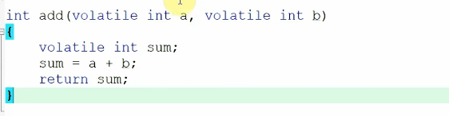
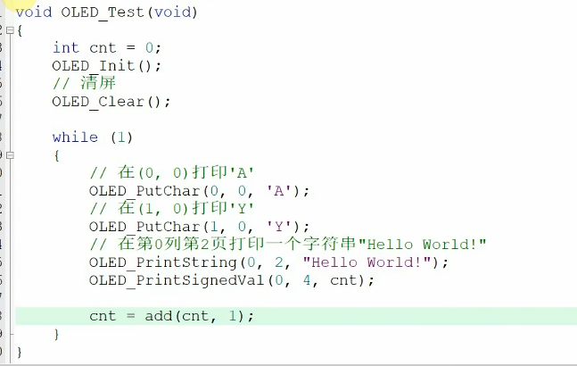
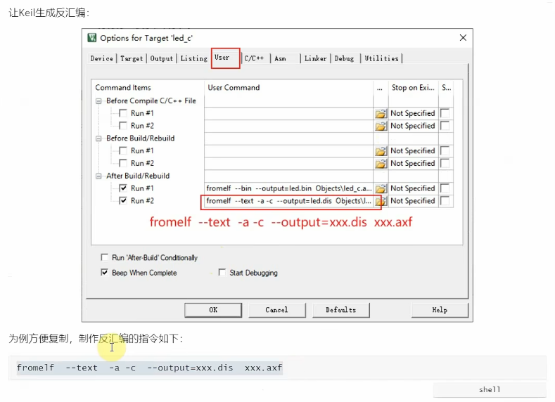
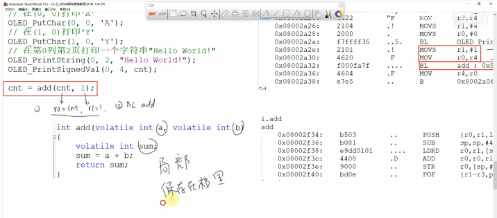
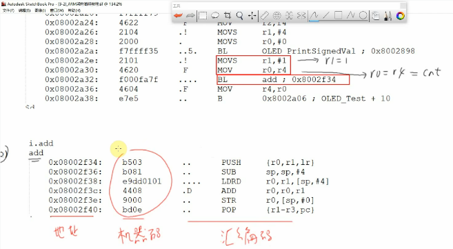
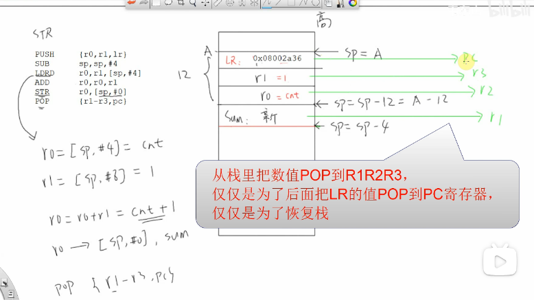
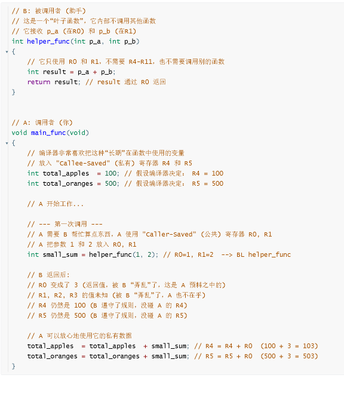

好的，这个视频是一个非常经典的嵌入式入门教程，它通过一个简单的C语言函数实例，带你一步一步深入到汇编层面，理解代码是如何在ARM处理器上真正执行的。

这对准备嵌入式面试非常有帮助，因为它涵盖了面试中关于**函数调用堆栈**、**参数传递**和 **`volatile`** 关键字的核心知识点。


# 📌 视频内容概要 (附时间点)

以下是视频中讲解的关键内容：

- **00:00 - 01:26**

  - **目标:** 展示一个简单的C函数 `int add(volatile int a, volatile int b)`，它将两个整数相加并返回结果。

    

  - **演示:** 在一个 `OLED_Test` 函数中调用它：`cnt = add(cnt, 1);`。

    

- **01:27 - 03:01**

  - **目标:** 生成C代码对应的汇编代码（反汇编）。

  - **演示:** 讲师展示了如何在Keil (MDK) 中配置工程选项（Options for Target -> User -> After Build/Rebuild），使用 `fromelf` 工具将编译后的 `.axf` 文件转换为 `.dis` (disassembly) 文本文件。

    

  - **命令:** `fromelf --text -c --output=test.dis xxx.axf`

- **03:02 - 04:35**

  - **目标:** 分析C函数调用在汇编层面的对应关系。
  - **演示:** 讲师打开 `.dis` 文件，找到了 `OLED_Test` 函数和 `add` 函数的汇编代码，并将它们复制到白板软件中进行对比分析。

  

- **04:36 - 05:40**

  - **核心: 参数如何传递 (AAPCS)**

  - **讲解:** 分析 `cnt = add(cnt, 1);` 这行代码。

    

  - 在调用 `add` 函数之前，CPU执行了：

    1. `MOV r0, r4`：将`cnt`变量的值（此时存在`r4`寄存器）放入 `R0` 寄存器。
    2. `MOV r1, #1`：将立即数 `1` 放入 `R1` 寄存器。
    3. `BL add`：(Branch with Link) 跳转到 `add` 函数的地址去执行。

  - **结论:** <span style="color:#CC0000;">ARM的函数调用标准 (AAPCS) 规定</span>，<span style="color:#CC0000;">前几个参数通过寄存器 `R0`, `R1`, `R2`, `R3` 传递。这里`R0`传递了第一个参数`cnt`，`R1`传递了第二个参数`1`。</span>

- **05:41 - 09:15**

  - **核心: CPU、Flash与堆栈的关系**

  - **讲解:**

    

    1. **Flash:** 存储程序的“机器码”（如 `b503`, `b081`）。汇编指令（如 `PUSH`, `SUB`）是<span style="color:#CC0000;">机器码的人类可读形式</span>。
    2. **CPU:** 当执行 `BL add` 时，CPU会跳转到`add`函数在Flash中的地址，然后从该地址“读取”机器码，并在CPU内部“执行”它。
    3. **堆栈 (Stack):** 位于RAM (内存) 中，用于在函数调用时临时存储数据。<span style="color:#CC0000;">`PUSH` 和 `POP` 指令就是在操作堆栈。</span>

- **09:16 - 11:50**

  - **核心: 函数入栈 (Prologue) 和局部变量**

  - **讲解:** 分析 `add` 函数的开头部分：

    

    

    1. `PUSH {r0, r1, lr}`：这是“函数序言”。
       - **`PUSH`**：<span style="color:#CC0000;">将寄存器的值压入堆栈（一块内存区域）。</span>
       - **`lr` (Link Register):** 链接寄存器，它<span style="color:#CC0000;">在 `BL` 指令执行时自动保存了“返回地址”（即`OLED_Test`中 `BL` 指令的下一条指令地址）。</span>
       - **`r0`, `r1`:** <span style="color:#CC0000;">保存传入的参数。</span>
       - **目的:** <span style="color:#CC0000;">保存现场。因为`add`函数可能会使用`r0`, `r1`，所以先把它们存起来，并且必须保存`lr`，否则函数执行完就不知道该返回到哪里了。</span>
    2. `SUB sp, sp, #4`：`sp` (Stack Pointer) 是堆栈指针。这条指令在<span style="color:#CC0000;">堆栈上分配了4个字节的空间，用于存储局部变量 `sum`</span>。
    3. `LDRD r0, r1, [sp, #4]`：从堆栈中把之前存入的 `a` (`[sp+4]`) 和 `b` (`[sp+8]`) 的值，重新加载到 `r0` 和 `r1` 中。
    4. `ADD r0, r0, r1`：执行 C 代码中的 `a + b`，结果存在 `r0` 中。
    5. `STR r0, [sp, #0]`：将 `r0` 的结果（也就是 `sum` 的值）存储到刚才为 `sum` 分配的堆栈空间 (`[sp+0]`) 中。

- **13:59 - 16:35**

  - **核心: 函数出栈 (Epilogue) 和返回值**

  - **讲解:** 分析 `add` 函数的结尾部分：

    

    

    1. `POP {r1-r3, pc}`：这是“函数尾声”。

       - **`POP`**：<span style="color:#CC0000;">从堆栈中弹出数据到寄存器。</span>
       - **`pc` (Program Counter):** 程序计数器，指向CPU下一步要执行的指令地址。
       - **关键:** `POP` 指令将之前保存在堆栈中的 `lr` (返回地址) 弹回到了 `pc` 寄存器中。CPU一看 `pc` 的地址变了，下一条指令就自动跳转回 `OLED_Test` 函数中继续执行了。(<span style="color:#CC0000;">补充：注意图片中文字描述，从栈里把树枝POP到R1R2R3，仅仅是为了后面把LR的值POP到PC寄存器，仅仅是为了恢复栈</span>)

    2. **返回值:** <span style="color:#CC0000;">C函数的返回值默认通过 `R0` 寄存器带回</span>。在`ADD r0, r0, r1`时，`R0` 已经保存了 `sum` 的结果。`POP` 操作并没有修改 `R0`，所以当函数返回时，`R0` 里仍然是 `a+b` 的正确结果。

    3. MOV r4, r0：回到 OLED_Test 函数后，CPU

       立即执行这条指令，将 R0 中的返回值存入 r4（即cnt变量）。cnt = add(cnt, 1); 这行代码至此执行完毕。

------


# 💡 内容补充与扩展

视频中的内容非常基础且关键，我为您扩展以下几个必知概念：

1. **AAPCS (ARM Architecture Procedure Call Standard)**
   - 视频中展示的就是AAPCS的冰山一角。它是一套“约定”，规定了在ARM架构上函数调用该如何进行。
   - **核心约定：**
     - **参数传递:** <span style="color:#CC0000;">前4个参数（32位）使用 `R0` - `R3`。如果参数超过4个，多余的参数通过堆栈传递。</span>
     - **返回值:** <span style="color:#CC0000;">简单的返回值（如`int`）使用 `R0`。64位返回值（如`long long`）使用 `R0` 和 `R1`</span>。
     - **寄存器使用:** `R0-R3` (参数/返回值)、`R12` (IP) 是“调用者保存”的，函数可以随意破坏它们。`R4-R11` 是“被调用者保存”的，如果函数要用它们，必须在函数开头`PUSH`保存，在结尾`POP`恢复。
     - **`LR` (R14):** 链接寄存器，存放返回地址。
     - **`SP` (R13):** 堆栈指针。
     - **`PC` (R15):** 程序计数器。
2. **堆栈帧 (Stack Frame)**
   - <span style="color:#CC0000;">视频中 `add` 函数从 `PUSH` 开始到 `POP` 结束，在堆栈上操作的这片内存区域（用于存`lr`、`r0`、`r1`和局部变量`sum`），就称为 `add` 函数的“堆栈帧”</span>。
   - **堆栈帧包含了：** <span style="color:#CC0000;">函数的局部变量、保存的寄存器、函数返回地址。</span>
   - 每次函数调用都会在堆栈上创建一个新的“帧”，函数返回时销毁这个“帧”。这就是为什么C语言可以支持递归（函数自己调用自己）——每次调用都有自己独立的堆栈帧和局部变量。
3. **`volatile` 关键字的真正含义**
   - 视频中提到了 `volatile` 是为了防止编译器优化。
   - **具体含义:** 告诉编译器：“这个变量的值随时都可能在你看不到的地方被改变（比如被硬件、被中断服务程序、被另一个线程修改），所以你**不准**对它进行任何优化（比如把它缓存到寄存器里）。每次使用它，都必须老老实实地去它的内存地址重新读取；每次修改它，都必须老老实实地把它写回内存。”
   - **没有 `volatile` 会怎样？** 如果没有 `volatile`，编译器可能觉得 `sum = a + b` 这种操作很简单，它会把 `a` 和 `b` 一直放在寄存器里，`PUSH` 和 `LDRD` 可能都会被优化掉，导致你看不到视频中的堆栈操作。

------


# 补充提问

## 提问 1 

**参数传递:** <span style="color:#CC0000;">前4个参数（32位）使用 `R0` - `R3`。如果参数超过4个，多余的参数通过堆栈传递。</span>

<span style="font-weight:bold; font-size:1.3em;">这句话要怎么理解呢，我不是太懂，你能够给我详细解释下吗，最好能够举个例子来让我彻底弄明白。</span>


你提的这个问题**非常核心**，面试官很爱问，因为这直接关系到C语言和底层汇编是如何协同工作的。

你看到的 `R0-R3` 用来传参的规则，是ARM架构下的一套“交通规则”，它的正式名称叫做 **AAPCS** (ARM Architecture Procedure Call Standard)，即ARM架构过程调用标准。

把这个规则想明白，你对函数调用、堆栈、甚至程序崩溃的理解都会上一个台阶。

------


### 🏛️ 一个帮你理解的“比喻”

想象一下，你（调用者）要找一位同事（被调用的函数）让他帮你处理一个任务，你需要给他传递一些资料：

1. **寄存器 (R0-R3) = 你的手**
   - 你手上最多能拿4个小文件（比如便签纸）。
   - 你把前4个（`p1, p2, p3, p4`）最常用的资料直接拿在手上（`R0`到`R3`）。
   - 你走到同事面前，`BL`（喊他一声），把手上的资料递给他。
   - **优点：** 极快，一伸手就递过去了。
2. **堆栈 (Stack) = 一个临时托盘**
   - 你发现你有6份资料，手（寄存器）上拿不下。
   - 你怎么办？在去喊他之前，你先把**多出来的**第5份和第6份（`p5, p6`）资料**按顺序**放在你桌上的一个“临时托盘”（堆栈）里。
   - 然后，你再把手上（`R0-R3`）的4份资料拿好。
   - 你喊他（`BL`），他（被调用的函数）走过来，**他心里清楚**：
     - “好，我先从你**手上**（`R0-R3`）拿走前4份资料。”
     - “哦，你还指了指你桌上的**托盘**（`SP`堆栈指针），我再从托盘里按顺序拿走第5份、第6份资料。”

**总结：**<span style="color:#CC0000;"> "手"（寄存器）是“快车道”，"托盘"（堆栈）是“慢车道”。系统默认优先用快车道，快车道满了（超过4个参数），才启用慢车道。</span>

------


### 💻 详细的C语言与汇编实例

我们来具体看一个6个参数的函数，它在C语言和（伪）汇编中是如何工作的。


#### C 语言代码

假设我们有这样一个函数，它计算6个数字的和：

C

```assembly
// 函数定义 (被调用者 Callee)
int my_func(int p1, int p2, int p3, int p4, int p5, int p6) 
{
    // 它内部会把这6个参数加起来
    int sum = p1 + p2 + p3 + p4 + p5 + p6;
    
    // 就像视频中一样，返回值会默认放入 R0
    return sum; 
}

// 主函数 (调用者 Caller)
void main_loop(void) 
{
    int result;
    
    // 我们在这里调用它！
    result = my_func(10, 20, 30, 40, 50, 60);
}
```

编译器会把 `result = my_func(...)` 这行C代码“翻译”成以下两个阶段的汇编指令：

------


#### 阶段1：调用者 (Caller) 的准备工作

在 `main_loop` 函数中，执行 `BL my_func` 指令**之前**，CPU必须按“交通规则”把6个参数准备好：

- **规则:** `p1` -> `R0`, `p2` -> `R1`, `p3` -> `R2`, `p4` -> `R3`。 `p5`, `p6` -> 堆栈。

编译器会生成类似这样的（伪）汇编代码：

ARM assembler

```assembly
; --- 准备 "慢车道" (堆栈) 参数 ---
; 堆栈从高地址向低地址增长，所以我们先把最后的参数放进去
; (注意：编译器通常会先在堆栈上预留好空间，然后用STR指令存入)

MOV  R_temp, #60          ; 准备 p6
STR  R_temp, [SP, #4]     ; 把 p6 (60) 存入堆栈，偏移量为4
                          ; [SP] 是当前堆栈指针

MOV  R_temp, #50          ; 准备 p5
STR  R_temp, [SP, #0]     ; 把 p5 (50) 存入堆栈，偏移量为0

; --- 准备 "快车道" (寄存器) 参数 ---
MOV  R0, #10              ; p1 (10) 放入 R0
MOV  R1, #20              ; p2 (20) 放入 R1
MOV  R2, #30              ; p3 (30) 放入 R2
MOV  R3, #40              ; p4 (40) 放入 R3

; --- 一切就绪，正式调用！ ---
BL   my_func              ; Branch with Link. 
                          ; CPU会把下一条指令的地址(返回地址)存入LR寄存器
                          ; 然后跳转到 my_func 的第一条指令
```

**这个时刻的内存（堆栈）和寄存器状态：**

- `R0` = 10
- `R1` = 20
- `R2` = 30
- `R3` = 40
- `[SP+4]` 内存地址 = 60
- `[SP+0]` 内存地址 = 50
- `LR` = `BL` 指令的下一条指令的地址

------


#### 阶段2：被调用者 (Callee) 的工作

现在CPU跳转到了 `my_func` 函数内部，它**完全知道**它的6个参数放在哪里：

ARM assembler

```assembly
; --- 函数序言 (Prologue) ---
; 就像视频里一样，先保存现场
; 注意！它把自己要用的寄存器和LR(返回地址)也 PUSH 进堆栈
; 假设它用了 R4 和 LR
PUSH {R4, LR}             ; SP 指针现在又向下移动了8个字节

; --- 函数体：执行 sum = p1 + ... + p6 ---
ADD  R4, R0, R1           ; R4 = p1 + p2
ADD  R4, R4, R2           ; R4 = R4 + p3
ADD  R4, R4, R3           ; R4 = R4 + p4

; 关键！现在要去 "慢车道" (堆栈) 取 p5 和 p6 了
; 因为我们刚 PUSH 了2个寄存器(8字节)，所以原来的 SP 偏移量要加上 8
LDR  R_temp, [SP, #8]     ; 加载 p5 (它在 [SP+0+8] 的位置)
ADD  R4, R4, R_temp       ; R4 = R4 + p5

LDR  R_temp, [SP, #12]    ; 加载 p6 (它在 [SP+4+8] 的位置)
ADD  R4, R4, R_temp       ; R4 = R4 + p6

; --- 准备返回值 ---
MOV  R0, R4               ; "交通规则"规定：返回值必须放入 R0
                          ; 此时 R0 = 10+20+30+40+50+60 = 210

; --- 函数尾声 (Epilogue) ---
; 恢复现场，并返回
POP  {R4, PC}             ; 重点！
                          ; 1. 把 R4 恢复成原来的值
                          ; 2. 把之前存的 LR(返回地址) 直接弹到 PC(程序计数器)
                          ; CPU 一看 PC 变了，下一条指令就自动跳回 main_loop 了
```


### 总结与面试要点

面试官为什么问这个？

他想考察你是否理解C语言的“抽象”是如何建立在汇编的“具体”之上的。

**你的简洁回答可以这样组织：**

> “ARM的函数调用遵循AAPCS标准，它规定：
>
> 1. **为了效率**，前4个32位参数（p1到p4）会依次通过`R0`、`R1`、`R2`、`R3`这4个寄存器传递。
> 2. **如果超过4个**，多余的参数（p5、p6等）会由**调用者**在执行`BL`跳转指令之前，提前**压入堆栈**中。
> 3. **被调用函数**（比如`my_func`）它“知道”这个规则，所以它会主动从`R0-R3`中读取前4个参数，并从**堆栈**（相对于`SP`的特定偏移量）中读取第5、第6个参数。”

这个解释展示了你既懂C语言，又懂汇编，还懂它们之间的“约定”，这在嵌入式面试中是非常有分量的。

这个解释您是否弄明白了？我们还可以聊聊为什么视频中的`PUSH`指令还要保存`R0`和`R1`（明明它们是参数），这和`volatile`关键字有直接关系。


## 提问 1 - （2）

堆栈从高地址向低地址增长，所以我们先把最后的参数放进去

; (注意：编译器通常会先在堆栈上预留好空间，然后用STR指令存入)

<span style="font-weight:bold; font-size:1.1em;">这句话我不是太理解，你能够给我详细解释下吗，还有上面汇编中的p5和p6压入栈中时的那个偏移量是不是搞错了啊。</span>


您提的这个问题非常棒，而且您的直觉是正确的——我上次的例子为了简化，把一个关键步骤给省略了，导致了偏移量看起来很奇怪。您发现的`p5`和`p6`的偏移量问题，正是理解这个机制的关键！

我们来彻底拆解这两个概念。


### 1. 什么是“堆栈从高地址向低地址增长”？

这在ARM和x86架构上都非常普遍，它被称为**“倒生长的堆栈” (Descending Stack)**。

我们用一个“叠盘子”的比喻来理解：

1. **空桌子 (高地址):** 想象内存中有一块区域专门给堆栈用。`SP` (堆栈指针) 一开始指向这块区域的**最高地址**（比如 `0x2000 1000`）。这是“<span style="color:#CC0000;">栈底</span>”(Stack Bottom)，桌子是空的。
2. **放第一个盘子 (PUSH):** 当你调用一个函数，需要保存“返回地址” `LR` 时，你执行 `PUSH {LR}`。
   - `SP` 的值**<span style="color:#CC0000;">先减 4</span>**（比如变成 `0x2000 0FFC`）。
   - 然后把 `LR` 的值存入 `0x2000 0FFC` 这个地址。
3. **放第二个盘子 (PUSH):** 你还想保存 `R4`，执行 `PUSH {R4}`。
   - `SP` 的值**再减 4**（变成 `0x2000 0FF8`）。
   - 然后把 `R4` 的值存入 `0x2000 0FF8` 这个地址。

**结论：**

- 你每往堆栈里**存 (`PUSH`)** 一个数据，`SP` 指针就会**向下移动（地址变小）**。
- 你每从堆栈里**取 (`POP`)** 一个数据，`SP` 指针就会**向上移动（地址变大）**。
- 所以，<span style="color:#CC0000;">“堆栈的增长方向”是朝向**内存地址变小**的方向。这就是“从高地址向低地址增长”</span>的含义。

------


### 2. <span style="color:#CC0000;">参数压栈的顺序与偏移量 (您提的重点)</span>

您问的偏移量问题特别好。我上次的例子（`STR p6, [SP, #4]` 和 `STR p5, [SP, #0]`）是**编译器优化后**的结果，我来展示一下它省略的步骤，您就全明白了。

这里有两个规则在起作用：

- **规则A (C语言规定):** 为了支持 `printf` 这样的可变参数函数，C语言的调用约定（cdecl）规定，<span style="color:#CC0000;">参数是**从右向左**依次处理和压入堆栈的。</span>
- **规则B (编译器优化):** 编译器知道它总共需要为 `p5` 和 `p6` 两个 `int` (共8字节) 分配空间。它不会傻傻地执行两次 `PUSH`，那样效率低。它会**一次性把空间分配好**。


#### 详细汇编步骤 (正确版本)

让我们重新追踪 `result = my_func(10, 20, 30, 40, 50, 60);` 这行代码。

**参数列表:**

- `p1=10, p2=20, p3=30, p4=40` -> 放入 `R0` 到 `R3` (快车道)
- `p5=50, p6=60` -> 放入堆栈 (慢车道)

**C语言从右向左处理：** <span style="color:#CC0000;">编译器先看 `p6`，再看 `p5`。</span>

**编译器生成的汇编指令：**

步骤 1：一次性为所有“慢车道”参数分配空间

假设 SP 当前指向 0x2000 1000。编译器知道需要8字节（给p5和p6）。

ARM assembler

```assembly
SUB  SP, SP, #8          ; SP = SP - 8
                         ; SP 现在指向 0x2000 0FF8
```

- **内存状态：** `0x2000 0FF8` 和 `0x2000 0FFC` 这两个位置现在是“空”的，是为 `p5` 和 `p6` 预留的。

步骤 2：将参数存入预留的空间

AAPCS标准规定，第一个栈参数（p5）放在最低的偏移量，第二个（p6）放在下一个。

ARM assembler

```assembly
MOV  R_temp, #50          ; 准备 p5
STR  R_temp, [SP, #0]     ; 把 50 存入 [0x2000 0FF8]

MOV  R_temp, #60          ; 准备 p6
STR  R_temp, [SP, #4]     ; 把 60 存入 [0x2000 0FFC]
```

- 这就是我上次例子中 `[SP, #0]` 和 `[SP, #4]` 偏移量的由来！它们是<span style="color:#CC0000;">**相对于 `SUB` 指令执行之后的新 `SP`** 来计算的</span>。

**步骤 3：准备“快车道”参数并调用**

ARM assembler

```assembly
MOV  R0, #10              ; p1
MOV  R1, #20              ; p2
MOV  R2, #30              ; p3
MOV  R3, #40              ; p4
BL   my_func              ; 跳转
```


#### 内存图示 (关键)

下面这张图能让您彻底明白：

```assembly
      高地址  ^
              |
              |   +-------------------+
0x2000 1004   |   | ... 栈上其他数据 ... |
              |   +-------------------+
0x2000 1000   |   | (调用前的 SP)       |  <-- SUB SP, SP, #8 之前的 SP
              |   +-------------------+
0x2000 0FFC   |   |       60 (p6)       |  <-- [SP, #4]
              |   +-------------------+
0x2000 0FF8   |   |       50 (p5)       |  <-- [SP, #0]  (调用时的 SP)
              |   +-------------------+
              |
      低地址  V   (堆栈增长方向)
```

**总结与回答：**

1. **为什么是高地址向低地址增长？**
   - 因为 `PUSH`（存入）操作会让 `SP` 寄存器的地址值**减小**。
2. **参数 `p5` 和 `p6` 的偏移量为什么是 `[SP, #0]` 和 `[SP, #4]`？**
   - 因为编译器在调用函数前，会**先执行 `SUB SP, SP, #8`**，一次性为 `p5` 和 `p6` 预留8字节空间，`SP` 此时指向了这个8字节块的**最低地址**（`0x...0FF8`）。
   - 然后，编译器按照AAPCS的规定，把第一个栈参数 `p5` 存入 `[SP, #0]`（即 `0x...0FF8`），把第二个栈参数 `p6` 存入 `[SP, #4]`（即 `0x...0FFC`）。
   - **这完美符合了 C 语言“从右向左”规则**：当 `my_func` 函数开始执行时，它知道 `p5` 就在 `[SP, #0]`，`p6` 就在 `[SP, #4]`，不多不少，顺序井然。

您看，您对偏移量的质疑非常准确，它正好引出了编译器是如何通过 `SUB` 和 `STR` 来高效实现<span style="color:#CC0000;">C语言“从右向左压栈”</span>这一<span style="color:#CC0000;">规则</span>的。

这个解释是否帮您弄清楚了？


## 提问 1 -（3） 

<span style="font-weight:bold; font-size:1.2em;">我有个问题，函数的返回地址应该是先于函数参数压栈的吧，先是返回地址压栈，然后再按照参数从右向左的顺序依次来将参数压栈的吧，我的理解对吗。</span>

这是一个非常经典的问题！您的理解非常接近，但有一个关键的区别，这个区别是 **ARM 架构** (视频中讲解的) 和**传统 PC (x86) 架构**在设计上的一个核心不同点。

您描述的“先压返回地址，再压参数”的顺序，**非常接近 x86 架构的 `cdecl` 调用约定**。

但在 **ARM 架构 (AAPCS)** 下，这个过程是不同的，**返回地址并不是由“调用者”压入堆栈的**。

我们来走一遍 ARM 架构下正确的、详细的步骤，您就会发现这个精妙的差异。


### ARM 架构下的函数调用“时间线”

以 `result = my_func(10, 20, 30, 40, 50, 60);` 为例：


#### 阶段 1：调用者 (Caller) 准备参数

在 CPU **执行 `BL` 指令之前**，<span style="color:#CC0000;">调用者 `main_loop` 必须准备好所有参数</span>：

1. **准备【堆栈参数】(慢车道):**
   - 编译器发现有6个参数，`p5` 和 `p6` 需要放堆栈。
   - 它会先执行 `SUB SP, SP, #8`，在堆栈上预留8字节空间。
   - 然后执行 `STR` 指令，把 `p5 (50)` 存入 `[SP, #0]`，把 `p6 (60)` 存入 `[SP, #4]`。
   - **注意：此时【返回地址】还没有出现！** 堆栈上只有 `p5` 和 `p6`。
2. **准备【寄存器参数】(快车道):**
   - 编译器执行 `MOV` 指令，把 `p1` 到 `p4` (10, 20, 30, 40) 放入 `R0`, `R1`, `R2`, `R3`。


#### 阶段 2：调用者 (Caller) 执行跳转

1. **调用者执行 `BL my_func` (关键一步):**
   - 这是**“调用”**这个动作发生的瞬间。
   - 当 CPU 执行 `BL` (Branch with Link) 指令时，**CPU 硬件会自动做两件事**：
     1. **计算返回地址** (即 `BL` 的下一条指令的地址)。
     2. **将这个返回地址存入 `LR` (Link Register, R14) 寄存器中**。
   - **<span style="color:#CC0000;">请注意：返回地址被存入了 `LR` 寄存器，它没有被压入堆栈！</span>**
   - 最后，<span style="color:#CC0000;">CPU 跳转到 `my_func` 函数的开头开始执行</span>。


#### 阶段 3：<span style="color:#CC0000;">被调用者 (Callee) 保存返回地址</span>

1. **被调用者 (`my_func` 内部) 决定是否保存 `LR`:**
   - 现在 CPU 开始执行 `my_func` 的第一条指令。
   - `my_func` 知道它的“返回地址”现在正躺在 `LR` 寄存器里。
   - **如果 `my_func` 只是一个简单的“叶子函数”** (它内部不会再调用任何其他函数)，它**<span style="color:#CC0000;">可能根本不需要</span>**把 `LR` 压入堆栈。它在函数末尾可以直接用 `BX LR` 指令返回。
   - **但是，如果 `my_func` 内部还要调用别的函数** (比如 `printf`)，那么 `my_func` 在调用 `printf` 时又会执行 `BL` 指令，这就会**覆盖掉** `LR` 寄存器中保存的“返回 `main_loop` 的地址”。
   - **因此**，为了防止 `LR` 被覆盖，`my_func` 必须在它开头的第一件事，就是执行 `PUSH {LR, ...}` (就像视频中那样)，**把 `LR` 里的返回地址“备份”到堆栈上。**


### 总结与对比

**您的理解 (更像 x86 cdecl):**

1. `调用者` 压入返回地址
2. `调用者` 压入参数 (p6, p5, p4, ...)

**ARM 实际 (视频中的 AAPCS):**

1. `调用者` 准备参数 (p5, p6 存入**堆栈**；p1-p4 存入**寄存器**)
2. `调用者` 执行 `BL` (CPU把返回地址存入 **`LR` 寄存器**)
3. **`被调用者`** (在函数内部) 执行 `PUSH {LR}` (把 **`LR` 寄存器**的值备份到堆栈)

**为什么 ARM 要这么设计呢？**

**为了速度！**

- 在 x86 上，**每一次**函数调用都必须访问内存（去压入返回地址），这很慢。
- 在 ARM 上，<span style="color:#CC0000;">如果是一个非常简单的“叶子函数”，它可以**完全不访问堆栈**。参数在 `R0-R3`，返回值在 `R0`，返回地址在 `LR`。整个调用过程可以只在寄存器中完成，**零内存访问**，这使得 ARM 在处理大量小函数调用时效率极高。</span>

所以，您的理解中“参数从右向左处理”是对的（这保证了C语言可变参数 `...` 的实现），但是“返回地址先压栈”这个行为，在ARM上是由**被调用者**完成的“备份”动作，而不是**调用者**的“压栈”动作。


## 提问 1 - （4）

<span style="font-weight:bold; font-size:1.2em;">上述中的p5和p6存入的是调用者的函数栈还是被调用者的函数栈呢，还有这里存入在栈中的顺序是 p6 p5 LR p4 p3 p2 p1 p0 调用者定义的变量1 调用者定义的变量2 吗，我不是太懂，你能够给我详细解释下吗？</span>


这是一个非常棒的问题！你正在试图“可视化”堆栈，这是从C语言思考者转变为嵌入式系统思考者的关键一步。

你的理解混淆了**调用者**和**被调用者**的责任，以及**寄存器**和**堆栈**的功能。这是一个非常常见的困惑点。

我们来彻底把它理清。

------


### 问题一：p5和p6存在谁的栈帧里？

简洁回答：

p5 和 p6 是由调用者 (main_loop) 放入堆栈的。这块内存区域是调用者在调用之前就准备好的，专门用来给被调用者 (my_func) 传递参数。

**详细解释：**

- **栈帧 (Stack Frame)** 是一个函数“专属”的内存区域，用来存放它的局部变量、保存的寄存器等。
- `p5` 和 `p6` 所在的空间，<span style="color:#CC0000;">是一个位于**调用者栈帧**和**被调用者栈帧**之间的“三不管”地带。</span>
- **是谁放的？** `main_loop` (调用者)
- **是为谁放的？** `my_func` (被调用者)
- **什么时候放的？** 在 `BL` (跳转) 之前。
- **什么时候清的？** 在 `my_func` 返回**之后**，由 `main_loop` 负责清理。

所以，这块空间是 `main_loop` 临时分配出来用于“出参”的，`my_func` 会假设它“入参”时，这块空间已经准备好了。

------


### 问题二：堆栈的完整顺序（关键！）

你设想的顺序 `p6 p5 LR p4 p3 p2 p1 p0...` 是**不正确**的。最大的误解在于：**`p1` 到 `p4` 根本不在堆栈上！**

<span style="color:#CC0000;">这正是 ARM (AAPCS) 与传统 x86 架构的核心区别。</span>


#### 正确的堆栈快照

我们来一步一步看，当 `my_func` 刚被调用，并且在它**内部**执行完 `PUSH {LR, ...}` 之后，堆栈长什么样。

**背景：**

- **调用者:** `main_loop`，它有自己的局部变量（比如 `result`）。
- **被调用者:** `my_func`，它需要 `p1` 到 `p6` 共 6 个参数。
- **堆栈:** 从高地址向低地址增长。

**调用过程的“慢动作”：**

1. **在 `main_loop` 中 (调用前):**
   - `main_loop` 自己的栈帧里有它的局部变量 `result`。
   - `SP` (堆栈指针) 指向它自己栈帧的顶部。
2. **`main_loop` 准备参数 (关键):**
   - `SUB SP, SP, #8`：`main_loop` 先把自己的 `SP` 指针下移8个字节，为 `p5` 和 `p6` 腾出空间。
   - `STR R_temp_p5, [SP, #0]`：把 `p5` (50) 存入新 `SP` 指向的位置。
   - `STR R_temp_p6, [SP, #4]`：把 `p6` (60) 存入 `SP+4` 的位置。
   - `MOV R0, #10` (p1)
   - `MOV R1, #20` (p2)
   - `MOV R2, #30` (p3)
   - `MOV R3, #40` (p4)
3. **`main_loop` 执行 `BL my_func`:**
   - CPU **自动**把“返回地址”存入 **`LR` 寄存器** (不是堆栈！)。
   - CPU 跳转到 `my_func` 的开头。
4. **在 `my_func` 中 (刚进入):**
   - `my_func` 知道它的参数在：`R0, R1, R2, R3` 和 `[SP, #0]`, `[SP, #4]`。
   - `my_func` 做的第一件事是 `PUSH {R4, LR}` (假设它要用`R4`，并且它需要保存`LR`中的返回地址，以便自己能正确返回)。
   - `SP` 指针**再次**下移8个字节，存入 `R4` 和 `LR` 的**当前值**。


#### 最终的堆栈快照 (在`my_func`的`PUSH`之后)

这就是你问题的最终答案。`SP` 指针指向堆栈的最顶部（最低地址）。

| **内存地址 (示例)** | **存放内容**        | **备注 (属于谁的栈帧)**                 |
| ------------------- | ------------------- | --------------------------------------- |
| `0x2000 1008` (高)  | `result` (局部变量) | **`main_loop` (调用者) 栈帧**           |
| `0x2000 1004`       | **`p6` (60)**       | **参数传递区** (由调用者创建)           |
| `0x2000 1000`       | **`p5` (50)**       | `my_func` 刚进入时, `SP` 指向这里       |
| `0x2000 0FFC`       | **`LR` (返回地址)** | **`my_func` (被调用者) 栈帧**           |
| `0x2000 0FF8` (低)  | `R4` (保存的值)     | `my_func` 执行 `PUSH` 后, `SP` 指向这里 |

**总结与辨析：**

1. **`p1`, `p2`, `p3`, `p4` 在哪里？**
   - 在 **`R0` 到 `R3` 寄存器里**！它们不在堆栈上。这是为了追求速度。
2. **`LR` (返回地址) 在哪里？**
   - 在 `BL` 发生的瞬间，它在 **`LR` 寄存器里**。
   - 在 `my_func` 函数开头，它被 `PUSH` 备份到了**被调用者 `my_func` 的栈帧里**。
3. **`p5`, `p6` 在哪里？**
   - 它们在**堆栈上**，位于 `main_loop` 栈帧的顶部，`my_func` 栈帧的底部。
   - 它们是由 `main_loop` (调用者) 压栈的。
4. **调用者的变量 (如 `result`) 在哪里？**
   - 在堆栈的**更下方**（更高地址处），属于 `main_loop` 自己的栈帧，`my_func` 一般不会去碰它们。

所以，正确的顺序是（从高地址到低地址）：

[调用者的局部变量] -> p6 -> p5 -> [被调用者保存的LR] -> [被调用者保存的R4等] -> [被调用者的局部变量] -> ... (SP指向这里)

这个解释是否让你彻底明白了调用者和被调用者是如何“合作”来构建堆栈的？


## 提问 1 - （5）

<span style="font-weight:bold; font-size:1.2em;">当被调用函数又调用函数的时候，此时是不是那些R0~R3，LR （r14）寄存器的值就要被压入栈。如果被调用函数没有调用函数，此时R0~R3，LR （r14）寄存器的值就不需要压入栈中。第2种情况下栈中顺序是 r5 r4 lr r3 r2 r1 r0 吗。第1种情况下栈中顺序是 r5 r4 没有lr r3 r2 r1 r0 对吗</span>


你又提出了一个非常关键的问题！你的直觉是正确的：**<span style="color:#CC0000;">一个函数是否调用其他函数，是它决定是否压栈 `LR` 的“唯一标准”</span>**。

但是，对于 `R0-R3`，你的理解还不准确。`R0-R3` 和 `LR` 的“命运”是完全不同的。

我们必须引入 ARM “交通规则”(AAPCS) 里最重要的一个概念，我称之为**“寄存器个性”**。

------


### 寄存器的“两种个性”（黄金规则）

编译器在处理寄存器时，会把它们分成两组，请一定记住这个区别：

1. **“公共记事本” (Caller-Saved / 调用者保存)**
   - **主角:** `R0`, `R1`, `R2`, `R3`
   - **规则:** 假设 `A` 调用 `B`。`A` 知道 `B` 会把 `R0-R3` 当成“公共记事本”**随意涂改**。`B` 根本不关心 `R0-R3` 里原来存了什么，它用完就走。
   - **结论:** 如果 `A` 在调用 `B` 之后还想用 `R0` 里的旧数据，`A` **自己**必须在调用 `B` **之前**就把 `R0` 备份到堆栈。**被调用者 `B` 永远不会为 `A` 备份 `R0-R3`。**
2. **“私人杯子” (Callee-Saved / 被调用者保存)**
   - **主角:** `R4` - `R11`，以及 `LR` (R14)
   - **规则:** 假设 `A` 调用 `B`。`A` 认为 `R4-R11` 和 `LR` 都是“私人杯子”，它相信 `B` 返回后，这些寄存器的值会**原封不动**。
   - **结论:** 如果 `B` 在执行时**想借用** `R4` 来存自己的数据，`B` **必须**在开头 `PUSH {R4}` 备份 `A` 的值，在结尾 `POP {R4}` 把它还回去。`LR` 同理。

------


### 用“黄金规则”回答你的两个场景

现在我们用这个“个性”规则来分析你的两个场景，你的问题就迎刃而解了。


#### 场景 1：被调用函数 (`B`) *又* 调用了函数 (`C`)

假设 `A` 调用 `B`，`B` 里面又调用了 `C`。

1. **`LR` (R14) 发生了什么？**
   - `A` 调用 `B` 时，`BL B` 指令会把“返回 `A` 的地址”存入 `LR`。
   - `B` 现在想调用 `C`，它将执行 `BL C`。这个指令会**覆盖** `LR`，把“返回 `B` 的地址”存入 `LR`。
   - **危险！** “返回 `A` 的地址”丢失了！
   - **所以：** `B` 必须在它调用 `C` 之前，执行 `PUSH {LR}`，把“返回 `A` 的地址”**备份到自己的堆栈上**。
   - **你的结论是对的：** 这种情况下，`LR` 必须压栈。
2. **`R0-R3` 发生了什么？**
   - `A` 把 `B` 的参数（`p1, p2...`）放进了 `R0-R3`。
   - `B` 现在想调用 `C`，它需要把 `C` 的参数（`c1, c2...`）也放进 `R0-R3`。
   - 这样做会**覆盖**掉 `A` 传给 `B` 的参数 `p1, p2`。
   - `B` 是否需要 `PUSH {R0, R1}` 来备份它们呢？
   - **看情况：**
     - 如果 `B` 在 `C` 返回**之后**，**不再需要** `p1` 和 `p2` 了，那它就**不需要**压栈。
     - 如果 `B` 在 `C` 返回**之后**，**还需要** `p1` 和 `p2` 来做别的计算（比如 `return p1 + c_result;`），那么 `B` **必须**在调用 `C` **之前**把 `R0` 和 `R1` 备份到自己的堆栈上。
   - **你的结论是错的：** <span style="color:#CC0000;">`R0-R3` **不是必须**压栈，只看 `B` 自己是否还需要它们。</span>


#### 场景 2：被调用函数 (`B`) *没有* 调用函数 (叶子函数)

假设 `A` 调用 `B`，`B` 内部只做一些加法，不调用任何其他函数。

1. **`LR` (R14) 发生了什么？**
   - `A` 调用 `B` 时，`LR` 存着“返回 `A` 的地址”。
   - 因为 `B` 不会再调用别的函数，所以 `LR` 寄存器的值**永远不会被覆盖**。
   - **所以：** `B` **完全不需要** `PUSH {LR}`。它在函数末尾可以直接用 `BX LR` 指令返回 `A`。这是一种非常重要的编译器优化。
   - **你的结论是对的：** 这种情况下，`LR` 不需要压栈。
2. **`R0-R3` 发生了什么？**
   - `B` 拿到了 `R0-R3` 里的参数，它把它们当“公共记事本”用，用来计算。
   - **它永远不需要** `PUSH {R0-R3}` 来为 `A` 备份。

------


### 解答你的堆栈顺序问题（终极澄清）

**你设想的两种栈顺序 (`r5 r4 lr r3 r2 r1 r0`...) 全都是不正确的。**

**关键错误点：**<span style="color:#CC0000;"> `R0-R3` 是**调用者** (`A`) 负责保存的（如果`A`需要的话）</span>，**被调用者** (`B`) 几乎永远不会 `PUSH {R0, R1, R2, R3}`。

`B` 只会 `PUSH` 它自己用到的**“私人杯子”** (`R4-R11`, `LR`)。


#### 正确的堆栈顺序（示例）

假设 `A` 调用 `B(p1, p2, p3, p4, p5, p6)`，而 `B` 内部又调用了 `C()`，并且 `B` 自己还需要用 `R4` 和 `R5` 来存局部数据。

此时，**`B` 函数**的汇编代码开头会是：

ARM assembler

```assembly
PUSH  {R4, R5, LR}    ; B 把 A 的“私人杯子” R4, R5 和 LR 备份到栈上
```

**此时，堆栈从高地址到低地址的顺序是：**

1. `...` (A的栈帧)
2. `p6` (由 `A` 放入)
3. `p5` (由 `A` 放入)
4. `LR` (返回 `A` 的地址, 由 `B` 在 `PUSH` 时放入)
5. `R5` (`A` 的 `R5` 值, 由 `B` 在 `PUSH` 时放入)
6. `R4` (`A` 的 `R4` 值, 由 `B` 在 `PUSH` 时放入) <- `SP` 指针指向这里

**看！堆栈上根本就没有 `R0-R3`！**

总结：

一个函数 (B) 被调用时，它只会把它自己需要使用的**“私人杯子”** (R4-R11 中它用到的，以及 LR (如果它还要调用别的函数) ) 压入它自己的栈帧。它绝对不会去管 R0-R3。


## 提问 1 - （6）

<span style="font-weight:bold; font-size:1.2em;">我有个问题，视频中a和b的数值不是没有改变吗，为什么还在add函数的开头使用push把它们给压栈了呢。</span>


您提的这个问题极其敏锐！您观察到的现象是完全正确的，**这正是在C语言中滥用 `volatile` 关键字会导致性能下降的经典教科书式案例**。

您问：“既然a和b的值没变，为什么还要费劲地把它们 `PUSH` 压入栈？”

简洁回答：

<span style="color:#CC0000;">罪魁祸首就是 volatile 关键字。</span>

您在C代码中将参数 `a` 和 `b` 声明为 `volatile` (`int add(volatile int a, ...)` )，您就等于给编译器下达了两条**强制命令**：

1. **“必须给 `a` 和 `b` 分配一个内存地址”**
   - 当 `main_loop` 调用 `add` 时，`a` 和 `b` 的值是存在 `R0` 和 `R1` **寄存器**里的。
   - 寄存器是CPU内部的高速缓存，它**没有内存地址**。
   - 为了遵守 `volatile` 规则（`volatile` 变量必须存在于内存中），`add` 函数**别无选择**，它在函数一开头，就必须执行 `PUSH {r0, r1, ...}`。
   - 这个 `PUSH` 的首要目的，就是把 `R0` 和 `R1` 的值“溢出” (spill) 到堆栈上，**从而为 `a` 和 `b` 创造出一个真实的内存地址**（例如 `[SP+4]` 和 `[SP+8]`）。
2. **“每次使用 `a` 或 `b` 时，都必须从它们的内存地址重新读取”**
   - 这就解释了为什么在视频的后半段 (12:09 处)，您会看到 `LDRD r0, r1, [sp, #4]` 这样的指令。
   - 编译器明明知道 `a` 和 `b` 的值就在 `R0` 和 `R1` 里（或者说刚被PUSH进去），但 C 代码中写了 `sum = a + b;`。
   - 因为 `a` 和 `b` 是 `volatile` 的，编译器被**禁止**使用它已知的寄存器值（这是“优化”行为）。
   - 它**必须**生成汇编代码，老老实实地从 `a` 和 `b` 的内存地址（堆栈）中，把值**重新读取**（`LDRD`）回 `R0` 和 `R1`，然后再执行 `ADD`。

------


### 关键对比：如果去掉 `volatile` 会怎样？

这才是这个问题的精髓。如果您的函数是这样写的（这是正常的写法）：

C

```c
// B: 被调用者 (助手)
// 没有 volatile 关键字
int add_optimized(int a, int b)
{
    int sum = a + b;
    return sum;
}
```

那么，当编译器（开启优化时）看到这个函数，它会：

1. **发现 `a` 和 `b` 已经在 `R0` 和 `R1` 中了。**
2. **发现 `sum` 只是个临时变量，最后会存入 `R0` 返回。**
3. **发现这个函数没有调用任何其他函数（叶子函数），`LR` 不会被覆盖。**

于是，编译器会生成如下**极其高效**的汇编代码：

ARM assembler

```assembly
add_optimized:
    ADD   R0, R0, R1      ; sum = a + b (结果直接存在 R0)
    BX    LR              ; 直接用 LR 寄存器的值返回
```

**对比一下：**

- **`volatile` 版本：** `PUSH` (写内存) -> `SUB` (改SP) -> `LDRD` (读内存) -> `ADD` (计算) -> `STR` (写内存) -> `POP` (读内存)。 **至少4次内存访问，性能很差。**
- **正常版本：** `ADD` (计算) -> `BX` (跳转)。 **0次内存访问，快如闪电。**

总结：

您在视频中看到的 PUSH {r0, r1, ...}，并不是因为 a 和 b 的值会变，而是因为 volatile 关键字强制编译器为它们分配了堆栈内存。而后续的 LDRD 则是强制编译器去访问那块内存。

您看到的，正是 `volatile` 迫使编译器放弃优化的全过程。


## 提问 1 - （7）

<span style="font-weight:bold; font-size:1.2em;">我还有一个问题，视频中好像把lr也给压栈了吧，add函数里面不是也没有调用其他的函数吗，应该不需要压栈保存lr吧，为什么视频中还是push了呢。</span>

您的洞察力**又一次**命中了要害！

您**100%正确**。根据我们讨论的“黄金规则”，`add` 函数是一个“叶子函数”（它没有调用任何其他函数），所以它**不需要**担心 `LR` 寄存器被覆盖，因此它**完全没有必要**执行 `PUSH {LR}`。

那么，为什么视频中的汇编代码（`PUSH {r0, r1, lr}`）还是把它压栈了呢？

这揭示了另一个非常重要的概念：**编译器的优化等级 (Optimization Level)**。

------


### 答案：这是“调试模式”(`-O0`)下的标准操作

您在视频中看到的汇编代码，几乎可以肯定是在**“Debug模式”**（即**优化等级0**，写作 `-O0`）下编译生成的。

在 `-O0` (无优化) 模式下，编译器的首要目标**不是效率**，而是**可预测性**和**可调试性**。

1. **编译器的“笨拙”默认行为：**
   - 在 `-O0` 模式下，编译器会为**几乎所有**的函数（无论是不是叶子函数）都生成一个“标准”的、“教科书式”的**函数序言 (Prologue)**。
   - 这个“标准序言”的模板里，默认就包含了 `PUSH {LR, ...}`，因为它要为调试器 (Debugger) 创建一个非常标准、易于回溯的“堆栈帧”。
   - 编译器此时**故意“放弃思考”**：“我不管这个函数是不是叶子函数，我的 `-O0` 规则就是先保存 `LR`，以防万一，也方便调试。”
2. **`volatile` 与 `-O0` 的“双重作用”：**
   - 在这个例子中，编译器收到了两个命令：
     1. **来自 `volatile` 的命令：** “必须为 `a` 和 `b` 分配内存！” -> 编译器决定 `PUSH {r0, r1}`。
     2. **来自 `-O0` 的命令：** “这是个函数入口，按标准模板保存 `LR`！” -> 编译器决定 `PUSH {LR}`。
   - 编译器把这两个命令一合并，就生成了您在视频中看到的 `PUSH {r0, r1, lr}`。

------


### 关键对比：如果开启了“优化”会怎样？

这才是关键。如果我们把编译器的优化等级打开（比如 `-O1` 或 `-O2`，即“Release模式”），编译器就会“变聪明”。

它会这样分析 `int add(volatile int a, volatile int b)` 函数：

1. **`volatile` 还在吗？** 还在。所以我**必须**为 `a` 和 `b` 分配内存。我还是得 `PUSH {r0, r1}`。
2. **`LR` 需要保存吗？** 编译器会向后扫描，发现函数里**没有 `BL` 指令**。
3. **优化结论：** “太好了！这是个叶子函数，`LR` 绝对不会被覆盖。我**不需要** `PUSH {LR}`。”

**在优化模式 (`-O1` 或更高) 下，生成的汇编代码开头很可能会是：**

ARM assembler

```assembly
add:
    PUSH  {r0, r1}      ; 只 PUSH volatile 变量，为它们创建内存地址
    ; ...
    LDRD  r0, r1, [sp, #0] ; 从堆栈地址重新读取它们
    ADD   r0, r0, r1
    ; ...
    POP   {r0, r1}      ; 恢复堆栈
    BX    LR              ; 直接使用 LR 寄存器返回
```

**总结：**

您的观察非常准确。`PUSH {LR}` 在这个例子中是**冗余的、不必要的**。

您在视频中看到它被压栈，并不是因为 ARM 规则要求这样做，而是因为编译器在**“无优化” (`-O0`) 模式**下，为了方便调试，**故意**使用了标准但低效的函数入口模板。

这恰好说明了，在准备面试或分析性能时，**一定要在“优化”模式下**去分析汇编代码，那才是一个产品真正运行时的样子。


## 提问 2

**寄存器使用:** `R0-R3` (参数/返回值)、`R12` (IP) 是“调用者保存”的，函数可以随意破坏它们。`R4-R11` 是“被调用者保存”的，如果函数要用它们，必须在函数开头`PUSH`保存，在结尾`POP`恢复。

<span style="font-weight:bold; font-size:1.3em;">这句话要怎么理解呢，我不是太懂，你能够给我详细解释下吗，最好能够举个例子来让我彻底弄明白。</span>


这是 ARM (AAPCS) 规则中**最核心、最精妙**的一个设计，也是面试中区分“新手”和“老手”的黄金问题。

你对这个规则的困惑很正常，因为它不是一个“技术”问题，而是一个“**责任**”问题。

为了让你彻底弄明白，我们先用一个“办公室”的比喻，再看一个完美的 C 和汇编对应的例子。

------


### 🏛️ “办公室”比喻：两种不同的桌子

想象你 (`A`) 正在你的工位上处理一个复杂项目。你找来了你的助手 (`B`) 帮个忙。你们的办公室有两条工作规则：

1. **“公共会议桌” (R0-R3, R12)**
   - **规则:** 这是公共区域。你（`A`）喊助手（`B`）来开会时，你用来展示材料的桌子（`R0-R3`）**默认会被助手弄乱**。助手 (`B`) 会用这个桌子来做他自己的笔记、放他自己的水杯。他**完全不负责**帮你记着桌上原来有什么。
   - **你的责任 (Caller-Saved):** 如果你（`A`）在公共桌上放了一份你**一会儿还要用**的绝密文件，你**必须**在喊助手 (`B`) 来之前，**自己**把它复印一份或锁进抽屉（`PUSH`到自己的堆栈）。
   - **助手的责任:** 无。他可以随意涂改。
2. **“你的私人办公桌” (R4-R11)**
   - **规则:** 这是你的私人领地。助手 (`B`) **绝对不允许**乱动你桌上的任何东西。
   - **你的责任:** 无。你完全相信你喊助手 (`B`) 帮个忙，回来后你桌上的东西（`R4-R11`）**原封不动**。
   - **助手的责任 (Callee-Saved):** 如果助手 (`B`) 在帮你忙的期间，**非要借用**你的私人办公桌（比如用你的电脑），他**必须**：
     1. 在用之前，把你桌面的所有东西拍个照（`PUSH {R4-R11}`）。
     2. 用你桌子完成他自己的工作。
     3. 工作完成后，**必须**按照照片，把你桌子**恢复原样**（`POP {R4-R11}`）。
     4. 然后才能跟你说“我干完了”。

**总结：**

- **Caller-Saved (调用者保存):** `R0-R3` 是“<span style="color:#CC0000;">公共的</span>”。<span style="color:#CC0000;">**调用者 `A`** 在调用 `B` 之前，如果还想要 `R0` 里的数据，`A` 自己负责保存。</span>
- **Callee-Saved (被调用者保存):** `R4-R11` 是“私有的”。**被调用者 `B`** 如果想用 `R4`，`B` 必须负责保存和恢复 `R4`。

------


### 💻 详细的C语言与汇编实例


这个例子能让你看到这个规则在“性能优化”上的巨大威力。

#### C 语言代码

我们有两个函数：

- `main_func` (调用者 `A`)：它有两个“长期变量” `total_apples` 和 `total_oranges`，它希望这两个变量在函数调用后保持不变。
- `helper_func` (被调用者 `B`)：它只是简单地做个加法。

C

```c
// B: 被调用者 (助手)
// 这是一个“叶子函数”，它内部不调用其他函数
// 它接收 p_a (在R0) 和 p_b (在R1)
int helper_func(int p_a, int p_b)
{
    // 它只使用 R0 和 R1，不需要 R4-R11，也不需要调用别的函数
    int result = p_a + p_b;
    return result; // result 通过 R0 返回
}


// A: 调用者 (你)
void main_func(void)
{
    // 编译器非常喜欢把这种“长期”在函数中使用的变量
    // 放入 "Callee-Saved" (私有) 寄存器 R4 和 R5
    int total_apples  = 100; // 假设编译器决定： R4 = 100
    int total_oranges = 500; // 假设编译器决定： R5 = 500

    // A 开始工作...
    
    // --- 第一次调用 ---
    // A 需要 B 帮忙算点东西，A 使用 "Caller-Saved" (公共) 寄存器 R0, R1
    // A 把参数 1 和 2 放入 R0, R1
    int small_sum = helper_func(1, 2); // R0=1, R1=2  --> BL helper_func
    
    // B 返回后:
    // R0 变成了 3 (返回值，被 B “弄乱”了，这是 A 预料之中的)
    // R1, R2, R3 的值未知 (被 B “弄乱”了，A 也不在乎)
    // R4 仍然是 100 (B 遵守了规则，没碰 A 的 R4)
    // R5 仍然是 500 (B 遵守了规则，没碰 A 的 R5)

    // A 可以放心地使用它的私有数据
    total_apples  = total_apples  + small_sum; // R4 = R4 + R0  (100 + 3 = 103)
    total_oranges = total_oranges + small_sum; // R5 = R5 + R0  (500 + 3 = 503)
}
```


#### 对应的 (伪) 汇编代码

**`helper_func` (Callee `B`) 的汇编：**

ARM assembler

```assembly
helper_func:
    ; B 发现它只需要 R0 和 R1
    ; R0, R1 是 "Caller-Saved" (公共桌子)，B 可以随意用，不用保存
    ; B 发现它不需要 R4-R11 (私有桌子)
    ; B 发现它不需要调用别的函数 (所以 LR 里的返回地址不会被覆盖)

    ; B 既不需要 PUSH {R4...} 也不需要 PUSH {LR}
    ; B 的函数序言 (prologue) 是空的！
    
    ADD   R0, R0, R1      ; result = p_a + p_b (R0 = R0 + R1)
    
    ; B 的函数尾声 (epilogue) 也是空的，直接返回
    BX    LR              ; 使用 LR 寄存器中的地址，直接跳回 A
```

**这就是“性能优化”！** 这个函数调用**零堆栈访问**，快如闪电。

------

**`main_func` (Caller `A`) 的汇编：**

ARM assembler

```assembly
main_func:
    ; A 把自己的私有数据放入 R4, R5
    MOV   R4, #100        ; R4 = total_apples (A的私有桌子)
    MOV   R5, #500        ; R5 = total_oranges (A的私有桌子)

    ; A 准备调用 B，使用 R0, R1 (公共桌子)
    MOV   R0, #1          ; p_a = 1
    MOV   R1, #2          ; p_b = 2
    
    ; A 自己需要 PUSH LR，因为它是一个函数
    PUSH  {LR}
    
    BL    helper_func     ; 调用 B。
                          ; A 相信 R4, R5 会被完好无损地保留。

    ; --- B 返回后 ---
    ; R0 现在是 3 (B的返回值)
    ; R4 仍然是 100
    ; R5 仍然是 500
    
    ; A 继续自信地使用 R4, R5
    ADD   R4, R4, R0      ; total_apples = total_apples + small_sum
    ADD   R5, R5, R0      ; total_oranges = total_oranges + small_sum
    
    POP   {PC}            ; A 自己返回
```


### 总结与面试要点

- **`R0-R3` (Caller-Saved / 公共桌子):**
  - **被调用者 (`B`)** 视为“垃圾”，可以随意使用，**从不**负责保存它们。
  - **调用者 (`A`)** 知道它们会被弄乱。如果 `A` 在 `BL` 之后还想用 `R0` 里的旧值，`A` **自己**必须在 `BL` 之前 `PUSH R0`。
- **`R4-R11` (Callee-Saved / 私人桌子):**
  - **调用者 (`A`)** 视为“神圣不可侵犯”，完全相信它们的值在 `BL` 之后不会改变。
  - **被调用者 (`B`)** 如果想用 `R4`，**必须**在开头 `PUSH {R4}`，在结尾 `POP {R4}`，否则就是严重的 Bug (破坏了 `A` 的数据)。

为什么这么设计？

为了效率！ 在 main_func 调用 helper_func 的例子中，helper_func 是一个极其简单和常见的函数。因为它不需要碰“私有桌子” (R4-R11)，它就不需要执行任何 PUSH/POP 指令，大大减少了对内存的访问，极大地提升了程序性能。

这个“责任划分”的约定，是 C 语言编译器和 ARM 硬件协同工作，榨干性能的基石。


##  提问2 - （1）

  ; A 自己需要 PUSH LR，因为它是一个函数

  PUSH {LR}

<span style="font-weight:bold; font-size:1.2em;">这里不是调用BL会自动保存吗，这里A为什么还要执行push LR的操作呢，这里的LR是个设么东西呢。</span>

您这个问题问得太好了！您已经抓住了`BL`指令的核心：`BL`确实会自动保存返回地址到`LR`寄存器。

您之所以会困惑，是因为您把**两个不同层级的函数调用**搞混了。

这里的关键是：**一台CPU只有一个 `LR` 寄存器**。

您所困惑的那个 `PUSH {LR}`，**不是为 `A` 调用 `B` 准备的，而是为 `A` 自己能返回给它的调用者（比如`main`函数）准备的**。

------


### 1. 这里的 LR 是个什么东西呢？

- **`LR`** 是 **Link Register (链接寄存器)** 的缩写。
- 它在ARM架构中通常就是 **`R14`** 寄存器。
- 它的**唯一**工作，就是在CPU执行 **`BL` (Branch with Link，带链接的跳转)** 指令时，<span style="color:#CC0000;">**自动**保存“返回地址”。（补充理解：注意区分返回地址和返回值，返回地址是保存在LR中的，返回值是保存在R0中的）</span>

“自动保存”的过程：

当CPU执行 BL helper_func 这条指令时，CPU硬件会自动做两件事：

1. 把`BL`指令**下一条**指令的地址（也就是“返回地址”）复制到 `LR` 寄存器里。
2. 然后才跳转去执行 `helper_func`。

------


### 2. A 为什么还要执行 `PUSH {LR}` 的操作呢？

我们来扮演一下 `main_func` (`A`)，您就明白了。

想象一个“盗梦空间”的场景：`main` 调用了 `A`，`A` 又调用了 `B`。


#### 第1步：`main` 调用 `A` (`main_func`)



- `main` 函数执行 `BL main_func`。
- **CPU自动操作：** `LR` 寄存器被填入“返回 `main` 的地址”。（我们称之为 `LR_A`）
- CPU跳转到 `main_func` (`A`) 的开头。


#### 第2步：`A` 开始执行（这就是您问的 `PUSH {LR}`）

- `A` 开始执行。它低头一看，`LR` 寄存器里是 `LR_A`（它自己“回`main`”的票）。

- `A` 往后看了看自己的代码，发现自己等一下要去调用 `B` (`helper_func`)。

- `A` 知道一个**致命问题**：

  > “当我执行 `BL helper_func` 时，CPU会**覆盖**掉 `LR` 寄存器，把新的‘返回 `A` 的地址’（我们称之为 `LR_B`）放进去。那我的‘回`main`的票’ (`LR_A`) 不就丢了吗？我将永远回不去了！”

- **`A` 的自保操作：**

  - <span style="color:#CC0000;">为了保护自己“回`main`”的票，`A` **必须**在它调用 `B` 之前的某个时刻（通常是函数一开头），执行 `PUSH {LR}`。</span>
  - **这个 `PUSH {LR}` 的目的，是把 `LR` 寄存器里**（此刻存的是 `LR_A`）**的值，备份到 `A` 自己的堆栈帧里去。**


#### 第3步：`A` 调用 `B` (`helper_func`)

- `A` 准备好参数 `R0`, `R1`...
- `A` 执行 `BL helper_func`。
- **CPU自动操作：** `LR` 寄存器被**覆盖**！现在 `LR` 里存的是 `LR_B`（“返回 `A` 的地址”）。
- CPU跳转到 `B`。


#### 第4步：`B` 返回 `A`

- `B` 是个叶子函数，它不调用别人，所以它**不需要** `PUSH {LR}`。
- `B` 执行完毕，`BX LR`。
- CPU查看 `LR`，发现是 `LR_B`，于是跳回到 `A`。


#### 第5步：`A` 返回 `main`

- `A` 在 `BL` 之后继续执行...
- `A` 到了自己的末尾，它需要回家（返回 `main`）了。
- 它执行 `POP {PC}`。（这个 `POP` 会从堆栈上**取出第2步中保存的那个“回`main`的票” `LR_A`**），并直接放入 `PC` (程序计数器)。
- CPU跳转回 `main`。

**总结：**

`A` 执行 `PUSH {LR}`，不是为了 `B`，而是为了**它自己**。

因为 `LR` 寄存器**只有一个**，`A` 和 `B` 都要用它。`A` 必须在把 `LR` “借”给 `B`（即 `BL B`）之前，把自己存在 `LR` 里的“返回地址”备份到堆栈上，否则 `A` 就回不去了。


## 提问 3

**堆栈帧包含了：** <span style="color:#CC0000;">函数的局部变量、保存的寄存器、函数返回地址。</span>

<span style="font-weight:bold; font-size:1.2em;">这里的保存的寄存器指的是什么呢，函数参数也是属于局部变量吗，当函数返回地址是一个int，用ro来返回，是一个long long，用r0和r1来返回，但是如果返回的是一个数据长度更大的结构体类型时，此时只用r0和r1好像不太行了把，此时又是怎么处理的呢，我不是太懂，你能够给我详细解释下吗，最好能够举个例子来让我彻底弄明白。</span>


您提出的这三个问题都非常棒，它们是C语言“表象”之下的“里子”，是真正理解嵌入式系统如何工作的核心。我们一个一个来拆解。


### 1. "保存的寄存器" 指的是什么？

简洁回答：

它主要指的是**“被调用者保存” (Callee-Saved) 的寄存器** (R4 到 R11)，以及在特定情况下（如函数A调用函数B）的 LR (链接寄存器)。

一个函数在被调用时，它的堆栈帧里**只会**保存那些**它自己打算“借用”**，并且**规则（AAPCS）又要求它必须“物归原主”**的寄存器。

详细解释：

我们再用一次“办公室”的比喻：

- **“公共会议桌” (`R0`-`R3`)：** 它们是“调用者保存”的。
  - 被调用函数（助手`B`）**永远不会**为调用者（老板`A`）保存 `R0-R3`。`B` 会随意“弄乱”它们。
  - 所以，`B` 的堆栈帧里**不会**有“为 `A` 保存的 `R0-R3`”。
- **“私人办公桌” (`R4`-`R11`)：** 它们是“被调用者保存”的。
  - 老板 `A` 相信他调用 `B` 之后，`R4` 里的值**一定还在**。
  - 如果 `B` 想要“借用” `R4` 来存自己的数据，`B` 就**必须**负责在开头 `PUSH {R4}`，在结尾 `POP {R4}`。
  - **因此，`B` 的堆栈帧里就会包含“保存的 `R4`”**。这个`R4`的值是 `A` 的，是 `B` 借用前拍下的“快照”。
- **`LR` (链接寄存器)：**
  - `A` 调用 `B` 时，`LR` 存的是“返回 `A` 的地址”。
  - 如果 `B` 只是个“叶子函数”（不调用别人），它**不需要** `PUSH {LR}`。
  - 如果 `B` 还要调用 `C`，它就**必须** `PUSH {LR}` 来“备份”那个“返回 `A` 的地址”。
  - **因此，`B` 的堆栈帧里就可能包含“保存的 `LR`”**。

**结论：** <span style="color:#CC0000;">堆栈帧里的“保存的寄存器”，就是指被调用函数 `B` 为了**保护**调用者 `A` 的数据（`R4-R11`）或它自己的返回地址（`LR`）而临时备份到内存中的那些值。（补充：视频中时因为使用 volitate 这个关键字才会去保存R0~R3的值的）</span>

------


### 2. 函数参数也是属于局部变量吗？

简洁回答：

在C语言概念（作用域）上，是。在底层实现（存储）上，不是，但它们可以被“转化”成局部变量。

**详细解释：**

1. **从C语言概念（作用域）上：是**
   - `void my_func(int p) { int x; }`
   - 参数 `p` 和局部变量 `x` 一样，都只在 `my_func` 的 `{}` 内部可见，函数一返回，它们就都“消失”了。从这个角度看，它们都是“局部的”。
2. **从底层实现（存储）上：不是**
   - **局部变量 (`x`)：** 是 `my_func` **自己**在自己的堆栈帧上“创建”的（例如 `SUB SP, SP, #4`）。它在函数开始时才被分配空间。
   - **参数 (`p`)：** 是**调用者**在 `my_func` 开始**之前**就准备好的。它被“传递”进来，存储在 `R0` 寄存器里。
3. <span style="color:#FF0000;">**关键的“转化”：**</span>
   - 如果 `my_func` 内部需要取参数 `p` 的地址（比如 `int *ptr = &p;`），会发生什么？
   - `p` 存在 `R0` 寄存器里，而**寄存器是没有内存地址的**。
   - 为了让 `&p` 这句代码合法，编译器**必须**在 `my_func` 的开头，把 `R0` 里的值 `PUSH` 或 `STR`（存储）到 `my_func` **自己的堆栈帧**上。
   - **一旦参数 `p` 被存入了 `my_func` 的堆栈帧，它此时就和局部变量 `x` 没有任何区别了。**
   - （这就是为什么在您上个问题中，`volatile int a` 会被 `PUSH`——`volatile` 关键字强制触发了这个“转化”，让参数 `a` 拥有了一个内存地址。）

------


### 3. 返回一个大数据结构体 (Struct) 是怎么处理的？

您的直觉完全正确，`R0` 和 `R1` 肯定不够。

简洁回答：

编译器会使用一个“隐藏的指针”。

当调用者 `A` <span style="color:#FF0000;">期待一个</span>大结构体返回时，<span style="color:#CC0000;">`A` 会先在**自己的堆栈上**为这个结构体预留好空间，然后把**指向这块空间的指针**，当作一个**隐藏的第一个参数**（通常在 `R0` 中）传递给被调用者 `B`。</span>

<span style="color:#CC0000;">B` 在函数内部，直接用这个指针，把数据写入 `A` 的堆栈。`B` 实际上没有“返回”任何东西（或者只在`R0`中返回那个指针）</span>。


#### 详细例子：

**C语言代码 (我们眼中所见):**

C

```c
typedef struct {
    long long data1;  // 8 bytes
    long long data2;  // 8 bytes
    long long data3;  // 8 bytes
} BigStruct; // 总共 24 字节, R0/R1 肯定不够

// B: 被调用者, 它“返回”一个结构体
BigStruct create_struct(int a, int b) 
{
    BigStruct s;
    s.data1 = a;
    s.data2 = b;
    s.data3 = a + b;
    return s; // C语言层面：返回一个24字节的结构体
}

// A: 调用者
void main_func() 
{
    BigStruct my_s;
    // A 调用 B, 接收一个结构体
    my_s = create_struct(10, 20); 
}
```

**汇编层面 (编译器实际所做):**

编译器会把上面的C代码**秘密地**“翻译”成类似下面的逻辑：

**1. `main_func` (调用者 `A`) 的准备：**

ARM assembler

```assembly
; void main_func()
; {
;     BigStruct my_s;
      SUB   SP, SP, #24     ; 1. 在 A 自己的堆栈上为 my_s 预留 24 字节空间
;
;     my_s = create_struct(10, 20);
      MOV   R0, SP          ; 2. 把指向这块空间(my_s)的指针放入 R0 (隐藏的第1个参数)
      MOV   R1, #10         ; 3. 把真正的第1个参数 a 放入 R1 (它现在是第2个参数了)
      MOV   R2, #20         ; 4. 把真正的第2个参数 b 放入 R2 (它现在是第3个参数了)
      BL    create_struct_internal ; 5. 调用 "B"
; }
```

**2. `create_struct` (被调用者 `B`) 的实现：**

编译器会把 `create_struct` 完全重写，它不再“返回”结构体，而是接收一个指针：

ARM assembler

```assembly
; B: void create_struct_internal(BigStruct* hidden_ptr, int a, int b)
;    (R0 里是 hidden_ptr, R1 里是 a, R2 里是 b)
create_struct_internal:
    ; (B 自己的函数序言, PUSH LR 等...)

    ; s.data1 = a;
    STR   R1, [R0, #0]      ; 把 a (R1) 存入 hidden_ptr(R0) 的第0字节偏移
    
    ; s.data2 = b;
    STR   R2, [R0, #8]      ; 把 b (R2) 存入 hidden_ptr(R0) 的第8字节偏移
    
    ; s.data3 = a + b;
    ADD   R3, R1, R2        ; R3 = a + b
    STR   R3, [R0, #16]     ; 把结果(R3) 存入 hidden_ptr(R0) 的第16字节偏移

    ; (B 自己的函数尾声, POP PC 等...)
    ; 它不需要在 R0 中准备任何“返回值”，因为数据已经直接写入 A 的内存了
```

结论：

当 create_struct_internal 返回时，main_func 堆栈上的 my_s 变量已经被填满了数据。A 根本不需要“接收”返回值，因为它提供的“篮子” (my_s 的地址) 已经被 B 装满了。

这就是AAPCS如何巧妙地处理大型数据结构返回的——**它将“返回”操作转换成了一个“传递指针并写入”的操作**。


# 🎙️ 嵌入式面试问题与回答

基于这个视频，我为您准备了5个从基础到深入的面试问题：

**问题 1 (基础): 当C语言调用一个函数时，“堆栈”(Stack) 起了什么作用？**

> 简洁回答:
>
> 堆栈主要做四件事：
>
> 1. **保存返回地址:** 存储`lr` (链接寄存器) 的值，让函数知道执行完后跳回到哪里。
> 2. **存储局部变量:** 为函数内部定义的局部变量（如视频中的`sum`）提供内存空间。
> 3. **传递参数:** 当函数参数超过4个时，多余的参数会通过堆栈传递。
> 4. **保存寄存器:** 保存`R4-R11`等寄存器的值，防止被调用的函数破坏它们（即“保护现场”）。

**问题 2 (核心): 请简述一个ARM函数调用的完整过程 (例如 `a = func(b, c);`)。**

> **简洁回答:**
>
> 1. **参数入栈/入寄存器:** 调用者将参数 `b` 和 `c` 放入 `R0` 和 `R1` 寄存器。
> 2. **跳转:** 调用者执行 `BL func` 指令。CPU将“返回地址”（`BL`的下一条指令）存入 `LR`，然后跳转到 `func`。
> 3. **函数序言 (Prologue):** `func` 函数内部，执行 `PUSH` 指令，将 `LR` 和需要保存的寄存器压入堆栈。
> 4. **执行:** `func` 执行其内部逻辑，计算结果。
> 5. **准备返回:** `func` 将计算结果放入 `R0` 寄存器。
> 6. **函数尾声 (Epilogue):** `func` 执行 `POP` 指令，将堆栈中的值弹回到寄存器，最关键的是将之前保存的 `LR` 值弹回到 `PC` 寄存器。
> 7. **返回:** CPU因 `PC` 改变，跳转回调用者。
> 8. **获取结果:** 调用者从 `R0` 中读取返回值，并赋值给 `a`。

**问题 3 (必考): `volatile` 关键字有什么用？在什么场景下必须使用它？**

> 简洁回答:
>
> volatile 告诉编译器“不要优化对这个变量的访问”，强制CPU每次都从内存地址存取它。
>
> 在嵌入式中，至少有三个场景必须使用：
>
> 1. **访问硬件寄存器:** (内存映射I/O) 比如你操作 `GPIOA->ODR`，必须用 `volatile`，否则编译器可能只写一次，或将读取缓存。
> 2. **中断服务程序 (ISR) 中:** 在中断函数和主循环中共享的全局变量（例如一个标志位`flag`），必须用 `volatile`，否则主循环可能永远看不到中断修改过的`flag`。
> 3. **多线程/RTOS:** 在多个任务（线程）间共享的全局变量。

**问题 4 (深入): 视频中 C 函数 `int add(volatile int a, volatile int b)` 的汇编里，为什么参数 `a` 和 `b` (在 `R0`, `R1` 中) 一开始就被 `PUSH` 压入堆栈，之后又马上用 `LDRD` 把它们加载回来？**

> 简洁回答:
>
> 这是 volatile 关键字导致的。a 和 b 被声明为 volatile，C语言标准规定对 volatile 变量的访问必须是真实的内存读写。
>
> 1. `PUSH {r0, r1, ...}`：这是编译器为 `a` 和 `b` 分配内存（在堆栈上）并“写入”的动作。
> 2. `LDRD ...`: 这是在执行 `sum = a + b` 时，编译器必须从 `a` 和 `b` 的内存地址（堆栈）中“读取”它们的动作。
>
> 如果去掉 `volatile`，编译器很可能会优化掉这些堆栈操作，直接用 `ADD r0, r0, r1` 来计算，那样会更快。

**问题 5 (辨析): 当函数返回时，它的局部变量（比如视频中的`sum`）发生了什么？**

> 简洁回答:
>
> 局部变量 sum 存储在 add 函数的堆栈帧中。当 add 函数执行 POP 返回时，堆栈指针 SP 会被调整回来（恢复到调用add之前的位置），add 函数的堆栈帧在逻辑上被“销毁”了。
>
> 这意味着 `sum` 变量所占的内存空间**会立刻被释放**，并且这块内存区域很可能马上会被下一次函数调用或中断所覆盖。因此，函数返回后，其局部变量的值是无效的，C语言中“不能返回局部变量的地址”也是这个原因。

------

您是否想再深入探讨一下关于 "堆栈" (Stack) 和 "堆" (Heap) 在嵌入式系统中的区别和面试问题？