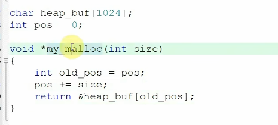
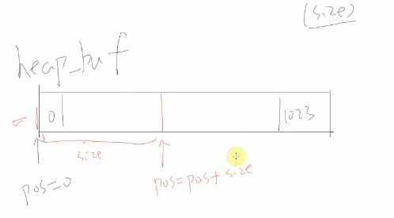
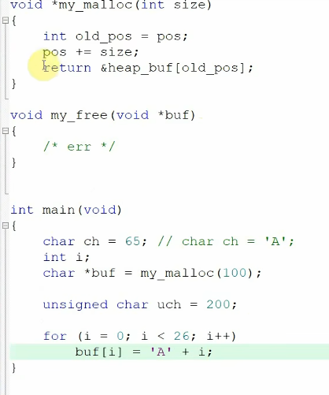
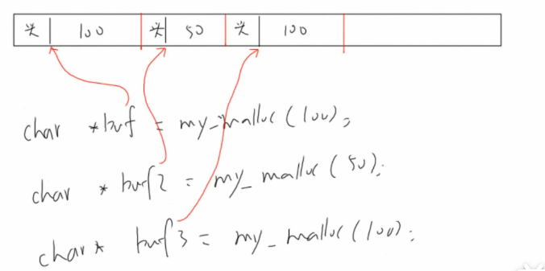
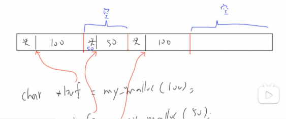
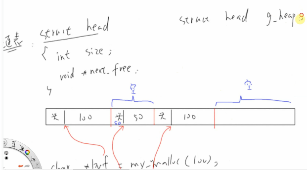
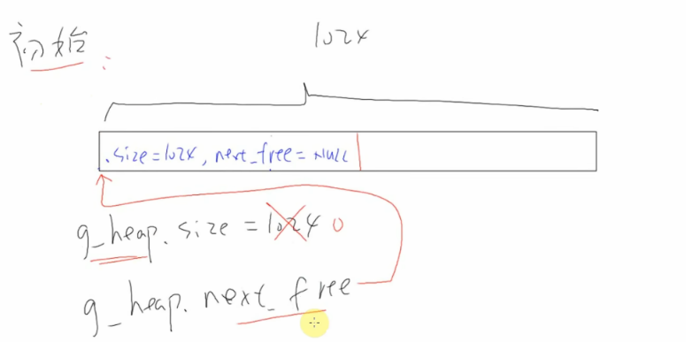

根据您提供的视频内容和准备嵌入式面试的需求，我为您准备了以下总结、扩展和面试问答。


# 🚀 视频内容总结（附时间点）


这个视频通过一个简化的代码实例，讲解了“堆”（Heap）在（嵌入式）C语言环境下的核心概念，即：**堆是一块可供程序动态“申请”和“释放”的内存区域**。

- **(00:00 - 00:33)** 📌 **开场**：介绍本节主题为“堆和栈”，并提到“栈”是RTOS（实时操作系统）的基础。

- **(00:34 - 01:16)** 📌 **堆的定义**：

  - 讲师给出一个非常直观的定义：堆就是一块空闲的内存。
  - 管理这块内存（从中取出和放回）的动作，就是堆管理。
  - 在代码中，这可以是一个**全局的 `char` 数组**，如 `char heap_buf[1024];`。

- **(01:17 - 03:52)** 📌 **实现一个极简的 `my_malloc`**：

  

  - 为了演示“申请”的概念，讲师实现了一个`my_malloc`函数。

  - **核心逻辑**：使用一个全局变量 `int pos = 0;` 作为偏移指针。

  - 每次调用 `my_malloc(size)`，就返回 `heap_buf + pos` 的地址，然后将 `pos` 增加 `size`。

  - **图示 (02:22)**：在画板上展示，`pos` 如何像一个水位线一样，随着每次分配而上涨。

    

- **(03:53 - 07:06)** 📌 **在Keil中调试 `my_malloc`**：

  

  - 在 `main` 函数中调用 `char *buf = my_malloc(100);`。
  - 通过Keil（嵌入式开发IDE）的Debug模式，**实时查看内存**。
  - 演示了 `buf` 确实获取了 `heap_buf` 的首地址 (0x200004)，并且在循环中向 `buf` 写入数据时，`heap_buf` 数组的内容被成功修改。

- **(07:07 - 08:50)** 📌 **极简 `malloc` 的致命缺陷**：

  - **核心问题**：这个极简的 `my_malloc` **无法实现对应的 `my_free` 函数**。

  - **原因 (07:12 画板)**：当调用 `my_free(buf)` 时，`free` 函数只知道一个地址 ( `buf` )，它**无从知晓这个内存块有多大（size）**。因此，它不知道应该释放100字节，还是50字节，也不知道下一块空闲内存从哪里开始。

    

- **(08:51 - 12:55)** 📌 **真正 `malloc` 的工作原理：内存头部（Header）**：

  

  - `malloc(100)` 实际分配的内存会**大于100字节**。
  - 它会在用户数据的**前面**，额外分配一个**“头部”（Header）** (09:24)。
  - 这个头部是一个结构体，用于存储元数据，其中最重要的就是**块的大小（size）**。
  - `malloc` 返回给用户的地址是**紧跟在头部之后**的数据区地址。
  - 当调用 `free(ptr)` 时，`free` 函数会通过指针 `ptr` 向**前偏移**，找到这个隐藏的头部，读取 `size`，从而知道要释放的内存边界。

- **(12:56 - 21:28)** 📌 **管理空闲内存：空闲链表（Free List）**：

  

  - 当`free`被调用后，内存中会出现不连续的“空洞”（内存碎片）。

    

  - **如何管理这些空闲块？** 答案是使用**“链表”（Linked List）** (12:53)。

  - **`struct head` 扩展** (13:18)：头部结构体不仅要有 `size`，还应有一个 `struct head *next_free`（<span style="color:#CC0000;">补充：图中标错了，不是void</span>） 指针，指向下一个空闲块。

    <span style="color:#FF00FF;"></span>

  - **初始化 (13:50)**：整个堆（`heap_buf`）在最开始是一个大的空闲块。

    

  - **分配 (15:47)**：`malloc` 时，遍历空闲链表，找到一个足够大的块，将其**“分裂”（Split）**成两块：一块（包含头部）分配给用户，另一块（剩余部分）仍然留在空闲链表中。

    

    

  - **释放 (19:14)**：`free` 时，将要释放的块（通过头部）重新**插入**到空闲链表的头部。

    

------


# 补充提问

## 提问1

<span style="font-weight:bold; font-size:1.2em;">你能够给我举个例子详细解释下视频中时如何实现对分配于释放以及是如何使用空闲链表来管理空闲内存的吗，要求使用和视频中一样的c语言语句，包括变量等都要一样，最好能够举个例子来让我彻底弄明白。</span>

这正是一个非常核心的嵌入式（尤其是RTOS）面试考点。视频中，讲师首先展示了一个**无法实现`free`的错误示例**，然后才在白板上讲解了**真正能实现`free`的原理**。

我将为您详细拆解白板上的正确逻辑，并严格使用视频中出现的C语言变量名和概念（如`heap_buf`、`g_heap`、`size`、`next_free`等），来模拟一个完整的“分配-分配-释放”过程。


### ⚙️ C语言环境准备

根据视频 (13:18) 和 (13:42) 的讲解，我们首先需要定义两个东西：

1. **总内存块**：一块静态的`char`数组，作为我们的“堆”。
2. **管理结构**：<span style="color:#CC0000;">一个“头部”结构体，用于管理内存块；以及一个全局的“空闲链表头”，用于串联所有空闲的块。</span>

C

```c
/* 1. 模拟的物理内存，这就是我们的堆 (来自 01:05) */
char heap_buf[1024];

/* 2. 内存块头部 (来自 13:18) 
 * 每一块内存（无论空闲或已分配）前面都有这个头部。*/
struct head {
    int size;           // 这块内存数据区的大小
    void *next_free;    // 指向 "下一个" 空闲块的头部
};

/* 3. 全局的空闲链表头 (来自 13:42)
 * 这是一个 "哨兵" 节点，它本身不代表内存块，
 * 它的 next_free 永远指向第一个可用的空闲块。*/
struct head g_heap;
```

------


### 📝 完整流程示例：从初始化到释放

我们将模拟视频中 (15:47) 到 (19:14) 的完整流程：`malloc(100)` -> `malloc(50)` -> `free(buf1)`。


#### 步骤 1：堆初始化 (对应视频 13:50 "初始化")

系统启动时，`heap_buf` 里的1024字节全是空闲的。我们需要将其格式化，让`g_heap`管理起来。

1. `g_heap` 作为一个“哨兵”，它本身的大小是0。
2. `g_heap.next_free` 需要指向第一块空闲内存，也就是 `heap_buf` 的起始地址。
3. 我们必须在 `heap_buf` 的开头也放置一个 `struct head`，用它来描述这“整整1024字节”的巨大空闲块。

**C语言伪代码逻辑：**

C

```c
void my_heap_init() {
    // 哨兵节点初始化
    g_heap.size = 0;
    
    // 找到 "第一块" (也是唯一一块) 空闲块的头部地址
    struct head* first_block = (struct head*) heap_buf;
    
    // 这块空闲内存的 "可用" 大小，是总大小减去头部自身的大小
    first_block->size = 1024 - sizeof(struct head); 
    
    // 它是链表的最后一个，所以指向 NULL (来自 15:26)
    first_block->next_free = NULL; 
    
    // 全局链表头指向这个 "第一块"
    g_heap.next_free = first_block;
}
```

此刻内存状态 (空闲链表)：

[g_heap] --> [Header 0 (位于heap_buf[0]) | size=1016 | ...1016字节空闲空间...] --> NULL

------


#### 步骤 2：第一次分配 `char *buf = my_malloc(100);` (对应 15:47)

`my_malloc(100)` 开始工作：

1. 它从 `g_heap.next_free` 开始遍历空闲链表。
2. 它找到了 `first_block` (大小为1016)。
3. 它判断 `1016 >= 100`，足够分配！
4. **核心操作（分裂 Split）**：它不会把1016字节都给你，而是将这块大切割成两块：
   - **块A (分配块)**：`sizeof(struct head) + 100` 字节。
   - **块B (新的空闲块)**：`1016 - (sizeof(struct head) + 100)` 字节。

**C语言伪代码逻辑：**

C

```c
// 1. (块A) 找到要分配的块，就是 first_block
struct head* allocated_block = first_block;

// 2. (块B) 计算 "新的" 空闲块的起始地址
//    它在 "块A" 的数据区(100字节) 之后
char* new_free_start = (char*)allocated_block + sizeof(struct head) + 100;
struct head* new_free_block = (struct head*)new_free_start;

// 3. 更新 "新的" (块B) 空闲块的头部信息
new_free_block->size = 1016 - (sizeof(struct head) + 100);
new_free_block->next_free = NULL; // 它后面没别的了

// 4. 更新 "已分配" (块A) 块的头部信息
allocated_block->size = 100; // 标记它的大小
// allocated_block->next_free 不需要设置，因为它已不在空闲链表中

// 5. 更新 "全局空闲链表" g_heap，让它跳过块A，指向新的空闲块B
g_heap.next_free = new_free_block;

// 6. 返回 "数据区" 的地址 (跳过头部)
return (void*)(allocated_block + 1); // C语言指针+1，自动跳过struct head
```

此刻内存状态 (空闲链表)：

[g_heap] --> [Header B (新空闲块) | size=908 | ...908字节空闲空间...] --> NULL

（Header A 和 buf 的100字节数据区，已从空闲链表中摘除）

------


#### 步骤 3：第二次分配 `char *buf2 = my_malloc(50);` (对应 17:52)

`my_malloc(50)` 再次工作：

1. 它从 `g_heap.next_free` 开始遍历，这次找到了 `new_free_block`（块B，大小908）。
2. 它判断 `908 >= 50`，足够分配。
3. **再次分裂（Split）**：将块B切割成两块：
   - **块C (分配块)**：`sizeof(struct head) + 50` 字节。
   - **块D (新的空闲块)**：`908 - (sizeof(struct head) + 50)` 字节。

**C语言伪代码逻辑 (同上)：**

C

```c
// 1. (块C)
struct head* allocated_block_C = new_free_block; // (就是块B)

// 2. (块D)
char* new_free_start_D = (char*)allocated_block_C + sizeof(struct head) + 50;
struct head* new_free_block_D = (struct head*)new_free_start_D;

// 3. (块D)
new_free_block_D->size = 908 - (sizeof(struct head) + 50);
new_free_block_D->next_free = NULL;

// 4. (块C)
allocated_block_C->size = 50; 

// 5. (全局链表)
g_heap.next_free = new_free_block_D;

// 6. 返回数据区
return (void*)(allocated_block_C + 1); // buf2 指向这里
```

此刻内存状态 (空闲链表)：

[g_heap] --> [Header D (新空闲块) | size=850 | ...850字节空闲空间...] --> NULL

（此时，buf(100字节) 和 buf2(50字节) 都已被分配出去了）

------


#### 步骤 4：释放 `my_free(buf);` (对应 19:14)

现在我们释放第一个申请的 `buf` (100字节)。

1. `my_free` 接收到 `buf` 指针。
2. 它必须**向前偏移**，找到管理 `buf` 的那个隐藏头部（也就是 `Header A`）。
3. 它读取 `Header A` 的 `size`，知道了这块内存是100字节。
4. **核心操作（插入 Free List）**：它将 `Header A` 重新插入到空闲链表的**最前面**。

**C语言伪代码逻辑：**

C

```c
// 1. 接收 buf 指针，通过指针运算找到它前面的头部
struct head* block_to_free = (struct head*)buf - 1; // (这就是 Header A)

// block_to_free->size 仍然是 100

// 2. 将 "要释放的块" 插入到 g_heap 的后面 (成为新的第一个空闲块)
// (对应视频 20:30)
block_to_free->next_free = g_heap.next_free; // 让它指向原来的第一个空闲块(Header D)

// 3. 让 g_heap 指向 "要释放的块" (Header A)
g_heap.next_free = block_to_free;
```

此刻内存状态 (空闲链表)：

[g_heap] --> [Header A | size=100] --> [Header D | size=850] --> NULL

总结：

我们成功释放了100字节的内存，并将其归还到了空闲链表。此时内存中有两个“空洞”（碎片）：一个是100字节，一个是850字节。下次再 malloc(50) 时，它会遍历链表，找到 Header A，发现 size=100 足够，就会从这100字节里再分裂出50字节给用户。


## 提问 1 - （1） 

  // 找到 "第一块" (也是唯一一块) 空闲块的头部地址

  struct head* first_block = (struct head*) heap_buf;

 

<span style="font-weight:bold; font-size:1.2em;">这行代码我有点看不太懂，你能够给我详细解释下吗。</span>

您好！这行代码是C语言中进行内存管理和数据结构操作的**核心技巧**，非常高兴能为您详细解释它。

这行代码 `struct head* first_block = (struct head*) heap_buf;` 做了三件事，我们来一步步拆解：


### 1. `heap_buf` 是什么？

在我们的例子中，`heap_buf` 是这样定义的：

C

```c
char heap_buf[1024];
```

- 它是一个**原始内存块**。您可以把它想象成一个有1024个格子的、连续的“储物柜”。
- 在C语言中，当您在代码中使用数组名 `heap_buf` 时，它会“退化”成一个**指针**，指向这个数组的**第一个元素**。
- 因为它是 `char` 数组，所以 `heap_buf` 在这里的类型是 `char*`（一个指向 `char` 的指针），它存储的是 `heap_buf[0]` 这个格子的**内存地址**。


### 2. `(struct head*)` 是什么？

这是这行代码最关键的部分：它是一个**“类型强制转换”（Type Cast）**。

- **问题：** `heap_buf` 本身是一个 `char*`（指向1个字节），而我们想让 `first_block` 成为一个 `struct head*`（指向一个 `struct head` 结构体，这个结构体可能占8个字节或更多）。这两种指针类型不匹配，编译器会报错。

- **解决：** `(struct head*)` 就像一个“万能转接头”。它在**“欺骗”编译器**，对它说：

  > “嘿，编译器！我知道 `heap_buf` 是一个 `char*`，但你**不要**把它当成指向1个字节的指针。请你从现在开始，**把这个完全相同的内存地址**，当作一个指向 `struct head` 结构体的指针来对待。”

- **目的：** 我们要在 `heap_buf` 这块“空地”上“盖房子”。我们的“房子图纸”就是 `struct head`。这行代码就是把“图纸”对准“空地”的左上角，告诉编译器从这个地址开始的数据，我们要按照 `struct head` 的结构来读写它。


### 3. `struct head* first_block = ...;` 是什么？

这是在**声明一个新的指针变量** `first_block`。

- `first_block` 这个变量，它的类型是 `struct head*`。
- 它被赋值为 `(struct head*) heap_buf`，也就是 `heap_buf` 数组的**起始地址**。


### 总结：这行代码的真正含义

**一句话总结：这行代码让 `first_block` 指针指向 `heap_buf` 数组的第一个字节，并且告诉编译器要“假装”这个地方存储的是一个 `struct head` 结构体。**

这使得我们接下来可以做这样的操作：

C

```c
// 这行代码执行后：
first_block->size = 1024 - sizeof(struct head);
```

- `first_block->size` 实际上是**在 `heap_buf` 数组的头几个字节（例如 0-3 字节）写入一个整数**。
- `first_block->next_free = NULL;` 实际上是**在 `heap_buf` 数组的接下来的几个字节（例如 4-7 字节）写入一个指针（NULL）**。

这就是我们如何在一块原始的 `char` 数组上“凭空”创建出第一个 `struct head` 管理块的方法。我们**“覆盖”**了 `heap_buf` 的前几个字节，用它们来存储管理信息。


## 提问 1 - （2）

 first_block->size = 1024 - sizeof(struct head); 

<span style="font-weight:bold; font-size:1.2em;">这里struct head不应该是站4+1等于5个字节吗，在怎么是占8个字节呢，我不是太懂，你能够给我详细解释下吗。</span>


这是一个非常棒的问题！您的疑惑 `4+1=5` 是完全合乎逻辑的，但这恰好引出了 C 语言中一个非常重要、但在教科书上经常被忽视的概念：**内存对齐（Memory Alignment）**。

您看到 `struct head` 的定义是：

C

```c
struct head {
    int size;           // 成员1
    void *next_free;    // 成员2
};
```

您可能认为：

- `int size;` 占 **4** 个字节 (在32位或64位系统上通常都是4字节)。
- `void *next_free;` 是一个指针。您可能误以为指针只占1个字节，但实际上**指针的大小和您系统的“位数”有关**。


### 1. 指针 (void *) 到底占多少字节？

指针存储的是一个**内存地址**。

- 在 **32位系统** (如老式PC、ARM Cortex-M3/M4) 上，内存地址是32位的（即4个字节）。所以 `sizeof(void *)` 是 **4**。
- 在 **64位系统** (如现在的PC、智能手机、ARM Cortex-A) 上，内存地址是64位的（即8个字节）。所以 `sizeof(void *)` 是 **8**。

**因此，`struct head` 的大小至少是：`sizeof(int)` + `sizeof(void\*)`**

- 在32位系统上：4 + 4 = **8 字节**
- 在64位系统上：4 + 8 = **12 字节**（但由于下面的对齐原因，它很可能会变成 **16 字节**）

**结论1：** 您的 `4+1=5` 猜想中，对指针大小的估计 `1` 是不正确的。它至少是4。

------


### 2. 什么是内存对齐（Memory Alignment）？

就算是在64位系统上，为什么 `4 + 8 = 12` 字节，我却说它很可能变成 **16** 字节呢？这就是“内存对齐”在起作用。

**核心思想：** CPU 从内存读取数据不是一个字节一个字节读的，而是**一块一块（例如4字节或8字节）**地读取。

一个比喻：

想象内存是一个图书馆，书架上每个格子只能放1本书。

- **不对齐的CPU：** 就像一个一次只能拿1本书的机器人。它去拿第1、2、3、4本书，需要跑4趟。
- **对齐的CPU：** 就像一个一次可以拿4本书的机器人。它去拿书时，要求这4本书必须放在**同一个书柜**（例如1-4号柜，5-8号柜）。
  - **情况A（对齐）：** 你要的书在1、2、3、4号。机器人跑1趟就拿完了。
  - **情况B（未对齐）：** 你要的书在3、4、5、6号。机器人必须跑**两趟**：第1趟拿1-4号（得到3、4），第2趟拿5-8号（得到5、6），然后它再把多余的书扔掉。

C语言中的对齐：

CPU（尤其是ARM架构）为了性能，强制要求：

- `int`（4字节）必须存储在**能被4整除**的地址上（如 0x00, 0x04, 0x08...）。
- `void*`（8字节，假设是64位）必须存储在**能被8整除**的地址上（如 0x00, 0x08, 0x10...）。

------


### 3. 编译器如何用“填充”来保证对齐？

现在我们来看 `struct head` 在64位系统上的布局：

C

```c
struct head {
    int size;           // 4 字节
    void *next_free;    // 8 字节
};
```

假设这个结构体从地址 `0x00` 开始：

1. **`int size;`**
   - 它被放在地址 `0x00`。
   - `0x00` 能被4整除，OK。
   - 它占用了 `0x00` 到 `0x03` 这4个字节。
2. **`void *next_free;`**
   - 它本应该从 `0x04` 开始。
   - **但 `next_free` 是一个8字节的指针，它要求必须放在能被8整除的地址上！**
   - `0x04` 并不能被8整除。
   - **编译器自动填充（Padding）：** 编译器会在 `size` 后面自动插入 **4个“垃圾”字节**（称为填充），把 `0x04, 0x05, 0x06, 0x07` 这几个位置空出来。
   - 现在，`next_free` 就被放在了地址 `0x08`。
   - `0x08` 能被8整除，OK。它占用了 `0x08` 到 `0x0F` (共8个字节)。
3. **结构体总大小：**
   - 这个结构体现在占用了从 `0x00` 到 `0x0F` 的所有空间。
   - 总大小是 **16 字节**。

**内存布局（64位系统）：**

```
| 0x00 | 0x01 | 0x02 | 0x03 | 0x04 | 0x05 | 0x06 | 0x07 |
|-----------------------------|-----------------------------|
|         int size            |        (填充 Padding)       |
|-----------------------------|-----------------------------|
| 0x08 | 0x09 | 0x0A | 0x0B | 0x0C | 0x0D | 0x0E | 0x0F |
|-----------------------------------------------------------|
|                     void *next_free                       |
|-----------------------------------------------------------|
```


### 总结回答

您问为什么不是5字节，而是8字节（或16字节）：

1. **您对 `void*`（指针）大小的理解有误：** 它不是1字节。在嵌入式（如Keil MDK for ARM Cortex-M）和32位系统中，它占**4字节**。在64位系统中，它占**8字节**。
2. **在32位系统上 (最可能的情况)：**
   - `int size;` 占 **4** 字节。
   - `void *next_free;` 占 **4** 字节。
   - 两者相加：`4 + 4 = 8` 字节。
3. **在64位系统上：**
   - `int size;` 占 **4** 字节。
   - 编译器为了让 `void*` 对齐到8字节地址，**自动填充4字节**。
   - `void *next_free;` 占 **8** 字节。
   - 总大小：`4 (size) + 4 (padding) + 8 (pointer) = 16` 字节。

由于视频中是在 Keil (ARM 编译器) 环境下，这通常是32位系统，所以 `sizeof(struct head)` **最可能是 8 字节**（4字节的 `int` + 4字节的 `void*`）。


## 提问 1 -  （2）- （1）

<span style="font-weight:bold; font-size:1.2em;">32位和63位系统中的这个32和64具体指的是什么呢，我不是太懂，你能够给我详细解释下吗？</span>


您问的 "32" 和 "64"（以及您提到的 "63" 应该是 "64" 的口误）指的是**“位”（Bit）**。这是计算机中最小的数据单位。

"32位" 和 "64位" 是用来描述一个计算机系统的**核心处理能力和架构**的。

您可以把这个数字想象成一条**高速公路的“车道数量”**。

- **32位系统**：就像一条 **32车道** 的高速公路。
- **64位系统**：就像一条 **64车道** 的高速公路。

车道越多，一次能通过的汽车（数据）就越多，效率自然就越高。

这个 "车道数量"（位数）主要体现在以下三个关键方面：


### 1. CPU (中央处理器)

这是计算机的“大脑”。"位数"指的是CPU**一次能处理的数据宽度**。

- **32位CPU**：它的“大脑”一次可以进行32位的数学运算。如果遇到一个64位的超大数字，它需要**分两次**（32位 + 32位）才能算完。
- **64位CPU**：它的“大脑”一次就可以完成64位的数学运算。处理同一个超大数字，它**只需要一次**。

这就是为什么64位电脑在处理大型视频、玩复杂3D游戏、进行科学计算时会快得多的原因。


### 2. 内存 (RAM) 寻址（这是最关键的区别！）

这是您作为用户能感受到的**最大区别**。"位数"决定了CPU能“看到”和“使用”多大的内存。

CPU需要给内存中的每一个字节（Byte）一个唯一的“门牌号”（即内存地址）。这个“门牌号”的长度就是由系统的“位数”决定的。（<span style="color:#CC0000;">注意：下面的寻址能力是根据CPU内部寄存器即MAR计算的，32位系统则MAR最大为32位，64位系统则MAR最大为64位。下面的 4,294,967,296 个 和 1800 个 展示的只是能够寻址的最大存储单元数，实际提供的存储单元则是根据实际情况来的</span>）

- **32位系统 (寻址能力)**
  - 它能提供的“门牌号”最多有 **32** 位。
  - 总共有 $2^{32}$（2的32次方）个唯一的门牌号。
  - $2^{32} = 4,294,967,296$ 个地址（字节）。
  - 这等于 **4 GB**。
  - **结论：** 32位系统（比如老的 Windows XP）**最多只能识别和使用 4 GB 内存**。就算您插了16 GB的内存条，它也只能“看到”其中的4 GB。
- **64位系统 (寻址能力)**
  - 它能提供的“门牌号”最多有 **64** 位。
  - 总共有 $2^{64}$（2的64次方）个唯一的门牌号。
  - 这是一个天文数字（约等于1800亿亿字节，或 18 EB）。
  - **结论：** 64位系统的内存上限**在理论上是近乎无限的**。虽然现在的电脑主板和操作系统还支持不了这么大（比如限制在 128 GB 或 2 TB），但这已经远远超过了我们的日常需求。


### 3. 操作系统 (OS) 和软件

您需要安装对应“位数”的操作系统才能发挥硬件的全部能力。

- **64位CPU + 64位操作系统 (如 Windows 11)**
  - 这是现在的标配。
  - 可以利用超过 4 GB 的内存。
  - 可以运行为64位设计的**64位软件**（更快、更强）。
  - 也**兼容**运行老的**32位软件**。
- **32位CPU + 32位操作系统 (如 Windows 7 32位版)**
  - 这是老电脑的配置。
  - 内存上限 4 GB。
  - **不能**运行为64位设计的软件。

------


### 总结：回到您上一个问题 `void*`

现在您就能彻底明白了：

- **`void*`** 是一个指针，它存储的就是一个“门牌号”，即**内存地址**。
- 在 **32位系统** 上，内存地址是32位长，所以 `sizeof(void*)` 是 **4 字节** (32 bits / 8 = 4)。
- 在 **64位系统** 上，内存地址是64位长，所以 `sizeof(void*)` 是 **8 字节** (64 bits / 8 = 8)。

| **特性**                        | **32位系统 (x86)**     | **64位系统 (x64)**             |
| ------------------------------- | ---------------------- | ------------------------------ |
| **CPU处理宽度**                 | 32 位                  | 64 位                          |
| **最大内存 (RAM) 限制**         | **4 GB**               | **18 EB** (理论上)             |
| **指针大小 (`sizeof(void\*)`)** | **4 字节**             | **8 字节**                     |
| **操作系统**                    | 32位 (如 Win 7 32-bit) | 64位 (如 Win 11, 64-bit Linux) |
| **软件兼容性**                  | 只能运行32位软件       | 可运行64位和32位软件           |


## 提问 1 - （3）

```c
// 1. (块A) 找到要分配的块，就是 first_block
struct head* allocated_block = first_block;

// 2. (块B) 计算 "新的" 空闲块的起始地址
//    它在 "块A" 的数据区(100字节) 之后
char* new_free_start = (char*)allocated_block + sizeof(struct head) + 100;
struct head* new_free_block = (struct head*)new_free_start;

// 3. 更新 "新的" (块B) 空闲块的头部信息
new_free_block->size = 1016 - (sizeof(struct head) + 100);
new_free_block->next_free = NULL; // 它后面没别的了

// 4. 更新 "已分配" (块A) 块的头部信息
allocated_block->size = 100; // 标记它的大小
// allocated_block->next_free 不需要设置，因为它已不在空闲链表中

// 5. 更新 "全局空闲链表" g_heap，让它跳过块A，指向新的空闲块B
g_heap.next_free = new_free_block;

// 6. 返回 "数据区" 的地址 (跳过头部)
return (void*)(allocated_block + 1); // C语言指针+1，自动跳过struct head
```

<span style="font-weight:bold; font-size:1.2em;">这些代码我有点看不太懂，你能够给我详细解释下吗，最好能够举个例子来让我彻底弄明白。</span>


您好！这段代码是`my_malloc`函数中**“分裂”（Split）**一个空闲内存块的核心逻辑，也是整个堆管理中最精妙的部分。

我将为您详细解释这6步，并用一个**非常具体、带内存地址的例子**来让您彻底明白。


### 场景准备（我们的例子）

假设我们有和之前一样的C语言环境：

1. **内存**：`char heap_buf[1024];`
2. **系统**：一个**32位**系统（这是嵌入式中最常见的情况）。
3. **头部大小**：因此，`sizeof(struct head)` = 4字节 (int) + 4字节 (void*) = **8 字节**。

分配前的状态（"Before"）：

my_heap_init() 刚刚执行完毕。

- `g_heap.next_free` 指向第一块（也是唯一一块）空闲内存。
- 这块空闲内存的**头部**存储在 `heap_buf` 的**起始位置**。
- 我们假设 `heap_buf` 的起始地址是 `0x1000`。
- `first_block` 指针指向 `0x1000`。
- 在 `0x1000` 地址上，存储着 `first_block` 的头部：
  - `first_block->size` = 1024 - 8 = **1016**
  - `first_block->next_free` = **NULL**

**内存图 ("Before")：**

```c
     (g_heap.next_free)
          |
          v
地址:  [ 0x1000 ]                                  [ 0x1008 ]
     +-----------------------------------------------+--------------------------------------------+
     |   头部 (Block A) (8字节)                      |   数据区 (1016 字节)                          |
     |   size = 1016                                 |   (目前完全空闲...)                           |
     |   next_free = NULL                            |                                            |
     +-----------------------------------------------+--------------------------------------------+
     ^                                               ^
     |                                               |
     first_block 指向这里 (0x1000)                  数据区从这里开始 (0x1008)
```

现在，一个用户调用了 `my_malloc(100)`。函数开始执行您给出的这6步：

------


### 🚀 6步代码逐行详解

#### 步骤 1：`struct head* allocated_block = first_block;`

- **代码**：`struct head* allocated_block = first_block;`

- 解释：

  我们已经找到了 first_block（在 0x1000）是足够大的空闲块。我们现在要把它“分配”出去。

  为了让代码更易读，我们创建了一个新指针 allocated_block，让它也指向 0x1000。

  从现在起，allocated_block 指向的这块内存（块A）就是我们要**“切割”并“分配”**的块。

- 举例 (内存地址)：

  first_block = 0x1000

  allocated_block = 0x1000

------


#### 步骤 2：计算“新的”空闲块地址

- **代码**：

  C

  ```c
  char* new_free_start = (char*)allocated_block + sizeof(struct head) + 100;
  struct head* new_free_block = (struct head*)new_free_start;
  ```

- 解释（这是最关键的一步）：

  我们不能把1016字节都给用户，他们只要100字节。所以我们要把“块A”**分裂（Split）**成两部分：

  1. **分配部分**（给用户）：`头部 (8字节)` + `数据 (100字节)` = 108字节。
  2. **剩余部分**（新的空闲块B）：`1016 - 108 = 908` 字节。

  这行代码就是在计算**“剩余部分”（块B）的起始地址**。

  - (char*)allocated_block：

    allocated_block 是 struct head* 类型。allocated_block + 1 会跳过8字节。我们不希望这样，我们需要按字节来计算。 (char*) 将 0x1000 强制转换为字节指针。

  - ... + sizeof(struct head)：

    0x1000 (字节指针) + 8字节 = 0x1008。这是“块A”数据区的起始地址。

  - ... + 100：

    0x1008 + 100字节 = 0x106C (这是16进制)。这是用户数据区的结束地址。

  new_free_start 现在是 0x106C。这就是**“剩余部分”（块B）的头部应该存放的地址**。

  最后，struct head* new_free_block = (struct head*)new_free_start; 创建一个 struct head 指针 new_free_block 指向 0x106C。

- 举例 (内存地址)：

  new_free_start = (char*)0x1000 + 8 + 100 = 0x106C

  new_free_block = 0x106C

------


#### 步骤 3：更新“新的”空闲块（块B）的头部

- **代码**：

  C

  ```c
  new_free_block->size = 1016 - (sizeof(struct head) + 100);
  new_free_block->next_free = NULL; 
  ```

- 解释：

  我们要在 0x106C 这个地址写入“块B”的头部信息。

  - new_free_block->size = 1016 - (8 + 100) = 908。

    我们告诉“块B”的头部：你的数据区大小是908字节。

  - new_free_block->next_free = NULL;

    因为“块A”是链表上唯一的块（next_free 为 NULL），所以分裂后，“块B”现在是链表上唯一的块，它的 next_free 也应该是 NULL。

- **举例 (内存地址)**：

  - 在地址 `0x106C` 写入 `908` (size)。
  - 在地址 `0x1070` (即 `0x106C + 4`) 写入 `NULL` (next_free)。

------


#### 步骤 4：更新“已分配”块（块A）的头部

- **代码**：`allocated_block->size = 100;`

- 解释：

  现在我们回到 0x1000 地址，更新“块A”的头部。

  它原来的 size 是1016，现在我们覆盖它，把它改成100。

  为什么？ 这是为了 free() 函数！当将来用户调用 my_free(buf) 时，free 会找到这个头部，看到 size=100，它就知道要释放的内存块有多大了。

- **举例 (内存地址)**：

  - 在地址 `0x1000`，`size` 的值从 `1016` 被**修改为 `100`**。

------


#### 步骤 5：更新“全局空闲链表”

- **代码**：`g_heap.next_free = new_free_block;`

- 解释：

  g_heap 是空闲链表的“哨兵”。它之前指向 0x1000（块A），但是“块A”已经被分配出去了，它不再是空闲块了！

  我们必须更新 g_heap，让它指向新的第一个空闲块，也就是 new_free_block（块B）。

- 举例 (内存地址)：

  g_heap.next_free 的值从 0x1000 被修改为 0x106C。

------


#### 步骤 6：返回“数据区”的地址

- **代码**：`return (void*)(allocated_block + 1);`

- 解释：

  这是最后一步：把内存交给用户。

  allocated_block 指向 0x1000（头部）。我们不能把头部地址给用户，用户只能使用数据区。

  - allocated_block + 1：

    这里的 allocated_block 是 struct head* 类型（大小为8字节），所以 + 1 会让指针自动跳过整个结构体。

  - 0x1000 + 8 字节 = 0x1008。

    这正是“块A”数据区的起始地址！我们把它返回给用户。

- 举例 (内存地址)：

  函数返回 0x1008。

  char *buf = my_malloc(100); 执行后，buf 变量的值就是 0x1008。

------


### 内存图 ("After" `my_malloc(100)`)

这就是执行完6个步骤后的内存样子：

```
     (g_heap.next_free)
          |
          +-------------------------------------------+
          |                                           |
          v                                           v
地址:  [ 0x1000 ]    [ 0x1008 ]         [ 0x106C ]     [ 0x1074 ]
     +-------------+------------------+--------------+-----------------------+
     | 头部 (A)    | 数据区 (A)         | 头部 (B)     | 数据区 (B) (908 字节)   |
     | size = 100  | (100 字节)       | size = 908   | (新的空闲块...)         |
     | next_free=??| (返回给用户)       | next_free=NULL|                       |
     +-------------+------------------+--------------+-----------------------+
     ^             ^                  ^
     |             |                  |
     allocated_block(0x1000)   new_free_block(0x106C)
                   |
                   buf 指向这里 (0x1008)
```


# 💡 内容补充与扩展（嵌入式面试视角）

视频中从一个 `char` 数组到一个带链表的内存管理器的推导过程，几乎就是**FreeRTOS**中堆管理方案的演进史。在嵌入式面试中，堆管理是RTOS的核心考点之一。

1. **为什么嵌入式系统（尤其是RTOS）不推荐用标准`malloc()`？**

   - **非线程安全**：标准`malloc()`通常不是线程安全的。在多任务环境下，如果两个任务同时调用`malloc()`，会导致堆数据结构损坏。RTOS提供的`pvPortMalloc()`（FreeRTOS）或`OS_Mem_Pool`（uC/OS）内部处理了加锁，是线程安全的。
   - **不确定性（Non-Deterministic）**：标准`malloc()`为了寻找合适内存块，算法可能很复杂（如最佳适配），导致其**执行时间不固定**。这在实时系统中是不可接受的，RTOS必须保证任务的响应时间。
   - **内存碎片**：标准`malloc()`容易产生大量外部碎片，导致系统长时间运行后，虽然总空闲内存很多，但没有一块 *连续* 的大内存，最终导致分配失败（`malloc`返回NULL），系统崩溃。

2. RTOS的堆管理方案 (以FreeRTOS为例)

   视频中的演进完美对应了FreeRTOS的几种Heap方案：

   - **Heap_1 (heap_1.c)**
     - **对应视频 (01:17 - 07:06)**：就是视频中那个极简的 `my_malloc`（`pos` 指针只增不减）。
     - **特点**：**只分配，不释放**。
     - **优点**：代码极简，速度最快，执行时间100%确定，绝对线程安全（因为它从不修改已分配的块）。
     - **适用场景**：只在系统启动时创建所有任务、队列、信号量，之后永不删除。适用于极小、极稳定的系统。
   - **Heap_2 (heap_2.c)**
     - **特点**：使用**“最佳适配”（Best Fit）**算法，它会遍历所有空闲块，找到一个 \*最接近\* 申请大小的块。它**不支持内存合并**。
     - **缺点**：因为要遍历所有块，所以分配时间不固定。**已不推荐使用**。
   - **Heap_4 (heap_4.c)**
     - **对应视频 (08:51 - 21:28)**：基本就是视频中讲解的带“头部”和“空闲链表”的实现。
     - **特点**：使用**“首次适配”（First Fit）**算法（遍历链表，找到第一个够大的就用），并且**支持内存合并**（`free`时会检查相邻块是否也是空闲的，如果是就合并成一个大块）。
     - **优点**：解决了`heap_2`的碎片问题，是功能最全、最常用的方案。
   - **Heap_5 (heap_5.c)**
     - **特点**：与Heap_4类似，但它允许堆内存**分布在多个不连续的物理区域**。适用于内存地址不连续的系统。

3. 内存池（Memory Pool）

   为了解决碎片和分配时间不确定的问题，很多嵌入式系统采用“内存池”。

   - **概念**：系统提前申请好几块**固定大小**的内存（例如，32字节的池、128字节的池、1K字节的池）。
   - **`malloc`**：当需要100字节时，系统直接去128字节的池里拿一块。
   - **`free`**：用完后，直接把这128字节的块还给128字节的池。
   - **优点**：分配和释放都是 O(1) 复杂度（只是一个链表摘除/挂载操作），执行时间恒定，并且**完全没有外部碎片**。

------


# ❓ 经典面试问题与解答

以下是根据视频内容和嵌入式场景为您准备的面试问题：

**问题 1：在嵌入式系统中，如果我定义一个 `static char g_MyHeap[10 * 1024];`，然后自己实现 `malloc` 和 `free` 在这个数组上操作。这种“静态堆”和C标准库的`malloc()`（工作在“系统堆”）相比，有什么优缺点？**

> **简洁回复：**
>
> - **优点（嵌入式友好）：**
>   1. **内存确定性：** 堆的大小在编译时就固定了（10K），内存边界清晰，不会像系统`malloc`那样动态增长导致耗尽RAM。
>   2. **可控性高：** 我们可以实现特定的算法，比如O(1)的内存池，来保证分配/释放的**时间确定性**，这对于实时系统至关重要。
>   3. **位置可知：** 我们可以通过链接脚本（Linker Script）**精确控制**这块内存（`g_MyHeap`）放在哪个物理RAM区域，比如放在更快的TCM或SRAM中。
> - **缺点：**
>   1. **大小受限：** 堆的总量被锁死（10K），如果实现不好，容易因碎片导致提前用尽。
>   2. **实现复杂：** 需要自己处理线程安全（加锁）、内存碎片、头部管理等，如视频所示。

**问题 2：视频中演示了一种极简的`malloc`，它只用一个全局`pos`指针累加来分配。这种实现为什么无法`free`？它在嵌入式中有用吗？**

> **简洁回复：**
>
> - **无法`free`的原因：** 因为它**没有存储元数据（Metadata）**。`free`函数只接收一个指针，它不知道这个指针指向的内存块的**起始位置**和**大小**，因此无法将其标记为“空闲”或进行管理。
> - **用处：** 这种实现（例如FreeRTOS的`heap_1`）在嵌入式中**非常有用**。它适用于“只分配、不释放”的场景。比如，系统在**初始化阶段**创建所有任务、队列和信号量，这些资源在系统运行期间永远不会被删除。这种实现速度极快、占用内存最小且执行时间恒定。

**问题 3：我们常规调用的`free(ptr)`函数，它只有一个入参（指针），它是如何知道要释放多大块内存的？**

> **简洁回复：**
>
> 它是通过**内存头部（Header）**知道的。
>
> 当我们调用 `malloc(size)` 时，它实际分配的内存是 `size + sizeof(Header)`。它在返回给我们的`ptr`地址**之前**的某个偏移处，存储了一个隐藏的头部（元数据）。这个头部里至少包含了**“当前块的大小”**。
>
> 当`free(ptr)`时，它会先 `(ptr - sizeof(Header))` 找到这个头部，读取大小信息，就知道要释放的内存边界了。

**问题 4：什么是内存碎片？视频中提到的“空闲链表”是如何解决内存分配和碎片问题的？**

> **简洁回复：**
>
> - **内存碎片：** 指的是内存中存在大量**不连续的、小的空闲块**。虽然空闲内存的总和可能很大，但由于它们不连续，导致无法分配出一个大的内存块，这就是外部碎片。
> - **空闲链表（Free List）的工作方式：**
>   1. **管理：** 它把所有**空闲的**内存块（无论大小、在哪）通过指针链接起来。
>   2. **分配(Malloc)：** `malloc`时会遍历这个链表，找到**第一块足够大**的空闲块（First Fit），如果这个块太大，就把它**分裂**成“已分配块”和“新的更小空闲块”。
>   3. **释放(Free)：** `free`时，会把释放的块重新加入空闲链表。并且，它会**检查**这个块的**前后邻居**是否也是空闲的，如果是，就将它们**合并（Coalescing）**成一个更大的空闲块，以此来减少碎片。

**问题 5：视频开头提到“栈是RTOS的基础”。请说明在RTOS中，每个任务的“栈”和所有任务共享的“堆”分别有什么作用？**

> **简洁回复：**
>
> - **任务栈（Task Stack）：**
>   1. **私有性：** 每个任务（Task）都有**自己私有的、独立的栈**。
>   2. **作用1（上下文切换）：** 栈用于在**任务切换**时，保存和恢复CPU的上下文（即所有寄存器）。
>   3. **作用2（函数调用）：** 存储任务自己运行时的局部变量、函数参数和返回地址。
>   4. **重要性：** 栈是任务独立运行和调度的**基础**。
> - **堆（Heap）：**
>   1. **共享性：** 堆是**所有任务共享的**一块全局内存区域。
>   2. **作用（动态资源）：** 用于动态创建那些“需要被多个任务访问”的资源，最常见的就是**消息队列、信号量、互斥锁**等，或者任务间共享的大型数据结构。
>   3. **重要性：** 访问堆必须**加锁**（保证线程安全），且分配时间**不确定**，在实时性要求高的代码中（如中断服务程序）**严禁**使用堆。