这非常棒，这个视频（来自百问网）精准地讲解了嵌入式C语言中一个极其核心的概念：**函数调用在底层（汇编）是如何利用栈 (Stack) 和寄存器 (LR/PC) 来实现的**。

这对于准备嵌入式面试至关重要，因为它直接关系到程序运行、RTOS（实时操作系统）上下文切换和 HardFault 调试。

我将为你总结视频内容、进行扩展，并提供一套针对性的面试问题。

------


# 📥 视频内容摘要（附时间点）

这个视频通过一个 `main` -> `a_func` -> `b_func` / `c_func` 的嵌套调用示例，深入分析了程序在 ARM 架构（以 Keil MDK 为例）下的真实运行流程。

- **00:00 - 01:22：堆 (Heap) 与 栈 (Stack) 的概念区分**

  - **堆 (Heap)：** 一块内存空间，用于动态分配（如 `malloc` / `free`）。
  - **栈 (Stack)：** 也是内存，但它由 CPU 的 **SP (Stack Pointer)** 寄存器严格管理。它用于<span style="color:#CC0000;">函数调用、局部变量存储、多任务系统中的“现场保存”。</span>

- **01:23 - 04:32：准备C语言嵌套调用代码**

  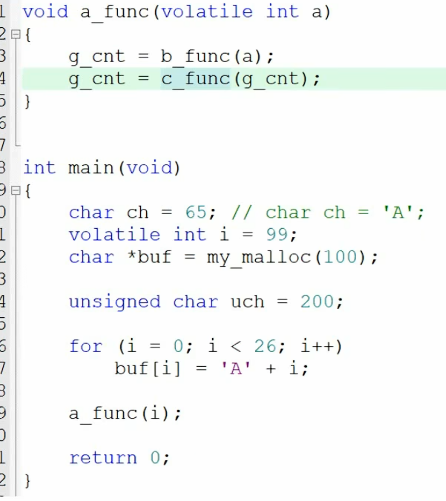

  - 讲师在 Keil (μVision) 中编写了一个函数嵌套调用链：`main()` 调用 `a_func()`。
  - `a_func()` 内部又依次调用 `b_func()` 和 `c_func()`。
  - 为了防止编译器过度优化导致函数调用被“优化掉”，他添加了 `volatile` 关键字和一些简单的参数与操作。

- **04:33 - 09:19：深入汇编：分析函数调用指令 (BL)**

  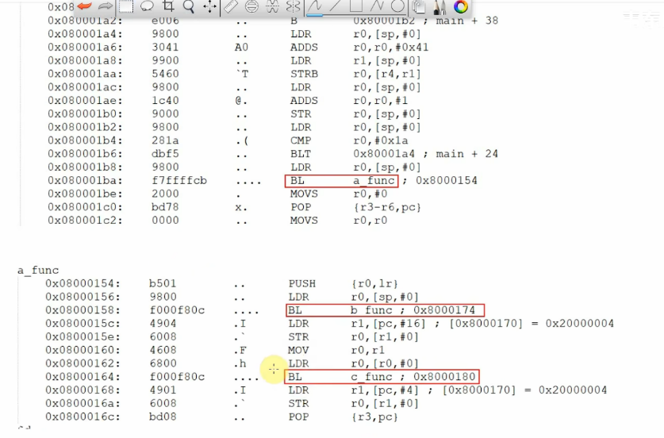

  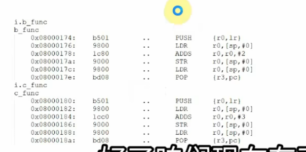

  - 讲师配置 Keil 使用 `fromelf` 工具生成了程序的反汇编代码，这是分析底层的关键。
  - 他定位到 `main` 函数中调用 `a_func` 的指令：`BL a_func` (07:16)。
  - **核心讲解 (07:20)：** <span style="color:#CC0000;">`BL` (Branch with Link) 指令会同时做两件事：</span>
    1. **PC (Program Counter) 跳转：** PC 寄存器被设置为 `a_func` 的入口地址，程序开始执行 `a_func`。
    2. **LR (Link Register) 赋值：** LR 寄存器被设置为 `BL` 指令的**下一条指令的地址**。这个地址就是 `a_func` 执行完毕后应该“返回”的地方。

- **09:20 - 11:31：提出核心问题：LR 寄存器被覆盖**

  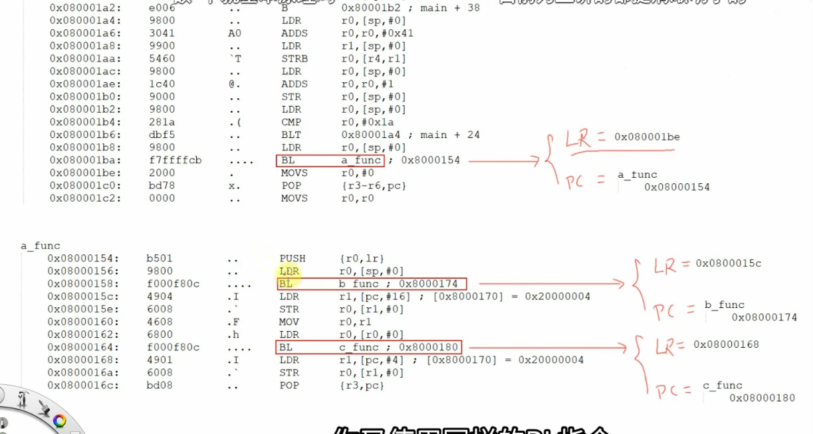

  - <span style="color:#CC0000;">`main` 调用 `a_func` 时，`LR` 保存了返回 `main` 的地址。</span>

  - <span style="color:#CC0000;">但是，当 `a_func` 内部再去调用 `b_func` (同样使用 `BL` 指令) 时，`LR` 寄存器**会被覆盖** (09:49)，变成返回 `a_func` 的地址。</span>

  - <span style="color:#CC0000;">**问题：** `b_func` 返回后，`a_func` 如何找回最初那个返回 `main` 的地址？它似乎丢失了。</span>

  - <span style="color:#CC0000;">同时引出了另外两个相关问题：局部变量存在哪里？(10:38) RTOS 任务为什么需要自己的栈？(11:07)</span>

    

- **11:32 - 14:31：解决方案：使用栈保存 LR 寄存器**

  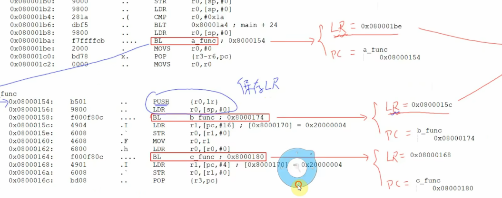

  - 讲师揭晓了答案：在 `LR` 被覆盖之前，函数会先把它的值**保存到栈上**。
  - 他展示了 `a_func` 函数入口处的汇编指令（函数序言 Prologue）：`PUSH {r0, lr}` (12:51)。
  - `PUSH` 指令将 `LR` 寄存器（此刻存着返回 `main` 的地址）压入 `SP` 指针指向的栈内存中。
  - 这样，即使 `a_func` 后来调用 `b_func` 覆盖了 `LR` 寄存器，那个宝贵的返回 `main` 的地址也已在内存中安全备份。

- **14:32 - 22:43：详解“栈帧” (Stack Frame) 的工作机制**

  - 讲师通过画图（15:00 开始）生动地展示了“栈帧”的创建和销毁过程：
    
    
    
    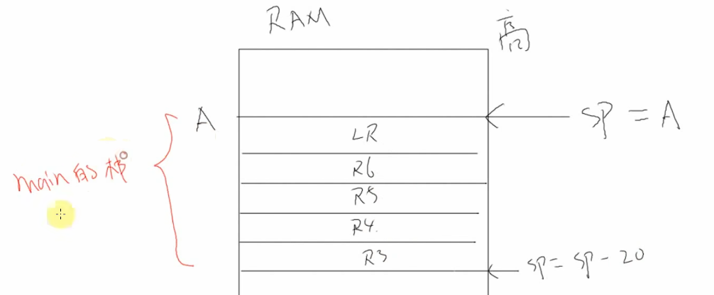
    
    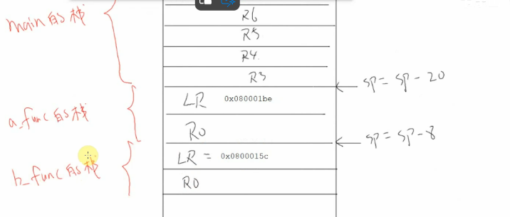
    
    1. **`main` 调用 `a_func`：** `a_func` 通过 `PUSH` 指令在栈上开辟了一块自己的空间（称为 `a_func` 的栈帧），并存入了返回 `main` 的 `LR` 值。SP 指针下移。
    
       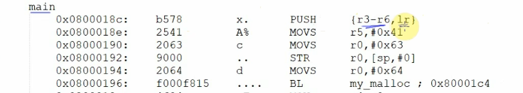
    
    2. **`a_func` 调用 `b_func`：** `b_func` 同样执行 `PUSH`，在 `a_func` 栈帧的“下方”开辟了 `b_func` 的栈帧，并存入了返回 `a_func` 的 `LR` 值。SP 再次下移。
    
       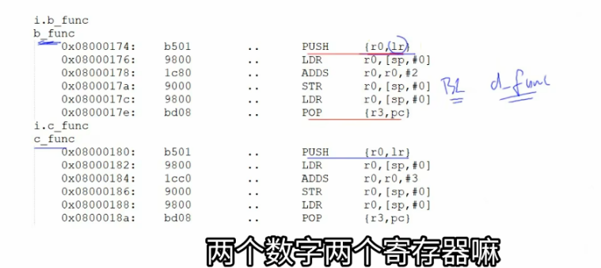
    
    3. **`b_func` 返回：** `b_func` 执行 `POP` 指令，从它的栈帧中取出 `LR` 值弹回给 `PC` 寄存器，SP 指针上移。`b_func` 的栈帧被销毁。
    
    4. **`a_func` 调用 `c_func`：** `c_func` 重复此过程，它会**复用**刚才 `b_func` 用过的栈空间 (19:37)。
    
       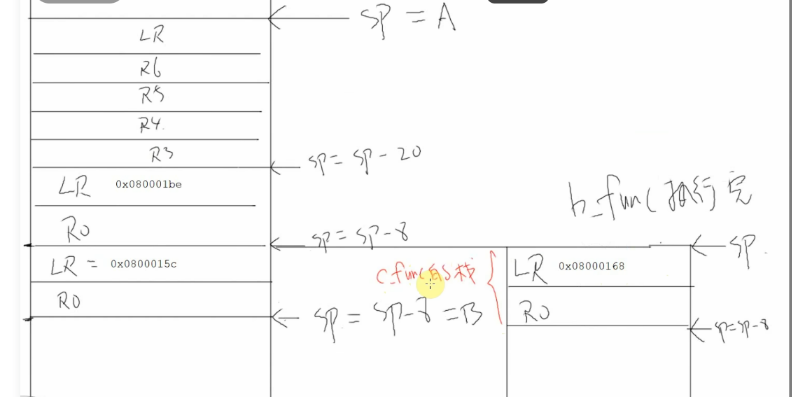
    
    5. **`c_func` 返回：** `c_func` 栈帧被销毁，SP 上移。
    
    6. **`a_func` 返回：** `a_func` 执行 `POP`，从**它自己的栈帧**中取出最早保存的（返回 `main` 的）`LR` 值，弹回给 `PC`。`a_func` 的栈帧被销毁，SP 彻底恢复。
    
  - **总结 (22:08)：** 一个函数（尤其是非叶子函数）在入口处，会<span style="color:#CC0000;">划分出自己的栈帧，用于保存 `LR`、需要保护的寄存器以及局部变量。</span>
  
    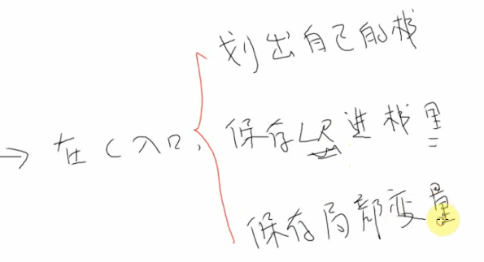

------


# 补充提问

## 提问1

<span style="font-weight:bold; font-size:1.2em;">视频中的main函数为什么要push r3-r6呢，这里不是私有寄存器吗，我不是太懂，你能够给我详细解释下吗？</span>


你问到了一个非常棒且极其关键的点！

你观察到的 `PUSH {r3-r6, lr}` (在 15:27 左右) 是理解函数调用的核心。

你之所以困惑，是因为你下意识地认为 `main` 函数是“老大”，是程序的起点，它不需要为“别人”保存什么。

这是一个非常普遍的误区。答案是：**`main` 函数并不是程序的第一个执行者，它也是被调用的！**

------


### 详细解释：`main` 也是“打工人”

在嵌入式系统中，CPU上电复位后，执行的**不是**你的 `main` 函数。它执行的是一段**“C运行时库(CRT)”的启动代码**（通常是一个汇编文件，比如 `startup_stm32.s`）。

这段启动代码做了很多准备工作：

1. 设置栈顶指针 `SP`。
2. 设置中断向量表。
3. 初始化时钟。
4. 从 Flash 拷贝 `.data` 段（已初始化的全局变量）到 RAM。
5. 清空 `.bss` 段（未初始化的全局变量）为 0。
6. **最后，它像调用一个普通函数一样，执行 `BL main` 来跳转到你的 `main` 函数。**


#### 为什么 `main` 要 PUSH 寄存器？

因为 `main` 也是被 `BL` 指令调用的，它就必须遵守 **AAPCS（ARM 架构过程调用标准）**，和视频中 `a_func`、`b_func` 遵守的规则一模一样。

现在，我们来分析 `main` 函数入口的 `PUSH {r3-r6, lr}` 指令：

**1. 为什么要 PUSH `LR` (Link Register)？**

- **调用者：** C 启动代码
- **被调用者：** `main` 函数
- 当启动代码执行 `BL main` 时，`LR` 寄存器被设置成了“返回 C 启动代码的地址”。（通常是返回到一个无限循环或复位函数）。
- 在 `main` 函数内部，它又调用了 `a_func` (如 `BL a_func`)。这个 `BL` 指令**会覆盖 `LR` 寄存器**，将其值变为“返回 `main` 函数的地址”。
- **所以：**<span style="color:#CC0000;"> `main` 函数为了防止自己 `LR` 里的“返回启动代码的地址”被 `BL a_func` 覆盖掉，它必须在函数一开始，就先把这个宝贵的 `LR` 值 `PUSH` 到栈里保护起来。</span>

**2. 为什么要 PUSH `r4`, `r5`, `r6`？（你说的“私有寄存器”）**

你说的“私有寄存器”这个概念非常接近了！在 AAPCS 中，它们被称为 **“被调用者保存”(Callee-Saved) 寄存器**。

- **规则：** AAPCS 规定 `R4` 到 `R11` 是“被调用者保存”的。
- **含义：** “C 启动代码”（调用者）理所当然地认为，在它调用 `main` 函数返回后，`R4` 到 `R11` 里的值应该**原封不动**。
- **`main` 的责任：**<span style="color:#CC0000;"> 如果 `main` 函数自己想使用 `R4`, `R5`, `R6` 来存自己的局部变量（比如 `i` 变量、`buf` 的指针等）</span>，它就**有责任**在<span style="color:#CC0000;">函数开头先把这些寄存器的原始值 `PUSH` 到栈</span>里，然后<span style="color:#CC0000;">在函数返回前，再 `POP` 出来恢复它们</span>。
- **结论：** <span style="color:#CC0000;">编译器在编译 `main` 函数时，发现它需要用到 `R4`, `R5`, `R6`，于是自动生成了 `PUSH` 代码来遵守这个规则。</span>

**3. 为什么要 PUSH `r3`？**

这个情况又不一样，`R0` 到 `R3` 是 **“调用者保存”(Caller-Saved)** 寄存器。

- **规则：** AAPCS 规定 `R0` 到 `R3` 是“调用者保存”的。
- **含义：** “C 启动代码”（调用者）如果需要 `R3` 的值，它必须自己保存，它**不**指望 `main` 会帮它保存 `R3`。
- **`main` 的责任：** `main` 可以随意使用 `R3`，不需要保存。
- **那为什么还要 PUSH `R3`？** * **效率！** 编译器发现 `main` 函数不仅要保存 `R4-R6` (规则 2) 和 `LR` (规则 1)，它自己内部运算也*恰好*需要大量使用 `R3`。
  - 与其 `PUSH {r4-r6, lr}`，然后再单独找个地方存 `R3`，最高效的办法就是**用一条指令 `PUSH {r3-r6, lr}` 把所有需要保存的寄存器一次性全压栈**。

------


### 总结

`main` 函数的 `PUSH {r3-r6, lr}` 是一条典型的**“函数序言”(Function Prologue)** 指令，它的目的有两个：

1. **遵守 AAPCS 规则：** 保存那些“被调用者”（`main`）有义务保存的寄存器（`R4-R6`）和必须保存的 `LR`（因为 `main` 内部又调用了其他函数）。
2. **腾出寄存器：** 把自己（`main`）需要用的寄存器（如 `R3`）也顺便压栈，这样这些寄存器就可以在 `main` 函数体中被当做“临时变量”自由使用了。

在 `main` 函数返回前，你会看到一个对应的 `POP {r3-r6, pc}` 指令，它会把所有值恢复，并且把保存在栈上的 `LR`（返回启动代码的地址）直接弹到 `PC` 寄存器中，实现 `main` 函数的返回。

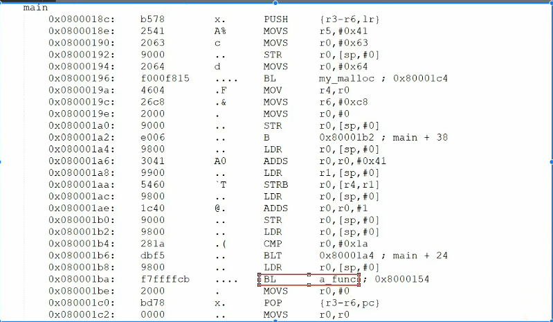

这个知识点在面试中非常加分，它表明你真正理解了 C 程序在底层是如何运行的。

你是否还想了解，如果 `main` 函数非常简单（比如 `int main(void) { return 0; }`），它的汇编代码又会是什么样子？


# 💡 核心知识点补充与扩展

视频讲得非常透彻。在面试中，面试官可能会在此基础上进行如下扩展：

1. **AAPCS (ARM 架构过程调用标准)**
   - 视频中展示的 `PUSH` 和 `POP` 行为，以及寄存器的使用，并非随意的，它们遵循一套“潜规则”，这套规则就是 **AAPCS** (Procedure Call Standard for the ARM Architecture)。
   - **寄存器分类：** AAPCS 将寄存器分为两类：
     - **调用者保存 (Caller-Saved)：R0-R3**。如果 `main` 函数在 `BL a_func` 之后还想用 R0-R3 的值，`main` 必须自己负责在 `BL` 之前保存它们（通常是 PUSH 到 `main` 自己的栈帧）。<span style="color:#CC0000;">`a_func` 可以随意使用 R0-R3 而不必恢复它们</span>。
     - **被调用者保存 (Callee-Saved)：R4-R11, LR**。如果 `a_func` 想要使用这些寄存器，它**必须**在函数入口处（Prologue）将它们 PUSH 到栈上，并在函数出口处（Epilogue）POP 恢复它们，以确保 <span style="color:#CC0000;">`main` 在 `a_func` 返回后发现 R4-R11 的值没有变。</span>
   - 视频中的 `a_func` 调用了 `b_func`，它破坏了 `LR`，所以<span style="color:#CC0000;"> `LR` (R14) 必须由 `a_func`（被调用者）来保存</span>。
2. **RTOS 上下文切换 (Context Switch)**
   - 视频提出了问题3（为何 RTOS 任务各自有栈）并部分解答了。
   - **扩展：** RTOS 中的任务切换（上下文切换）远比函数调用复杂。当中断或Systick定时器触发任务调度时，当前任务可能在*任何一条*指令处被“强行打断”。
   - <span style="color:#CC0000;">此时，我们不仅要保存 `LR`，而是要保存 CPU 的**完整现场 (Full Context)**，包括：**PC, LR, SP, R0-R12** 以及状态寄存器 (xPSR)。</span>
   - 这些寄存器的值被完整地 PUSH 到**<span style="color:#CC0000;">当前任务自己的栈</span>**上。然后，调度器切换 `SP` 指针，使其指向**下一个要运行任务的栈**，并<span style="color:#CC0000;">从那个栈上 POP 出新任务的完整现场。</span>
   - **结论：** 如果所有任务共享一个栈，一个任务的现场保存会彻底覆盖另一个任务的现场，导致系统崩溃。**<span style="color:#CC0000;">独立的栈是实现任务独立运行和调度的物理基础。</span>**
3. **栈溢出 (Stack Overflow)**
   - 视频中我们看到 `SP` 随函数调用不断向下（低地址）移动。
   - 在嵌入式系统中，RAM 非常宝贵。系统启动时会为栈分配一块固定大小的内存（例如 4KB）。
   - 如果你有非常深的函数递归、或者在函数内定义了超大的局部变量（如 `int my_array[2000];`），`SP` 指针就可能移出这 4KB 的合法区域。
   - 当它移出后，它会开始覆写相邻的内存。这块内存可能是 `.data` 段（全局变量）、`.bss` 段、Heap（堆）、甚至是另一个任务的栈。
   - 这种破坏是灾难性的，通常导致数据错乱，最终引发 **HardFault（硬件故障）**。

------


# 补充提问

## 提问1

<span style="font-weight:bold; font-size:1.2em;">RTOS 上下文切换 和 函数调用有什么区别呢，我不是太懂，你能够给我详细解释下吗，最好能够举个例子来让我彻底弄明白。</span>


这是一个非常棒的问题！**这是嵌入式面试中区分初级和中高级工程师的“分水岭”问题。**

如果你能彻底弄明白，你对 RTOS（实时操作系统）的理解会立刻提升一个层次。


### 🍽️ 最简单的类比：厨师 VS 工厂工人

- **函数调用 (Function Call) 就像厨师做菜：**
  - 一个厨师（主任务 `main`）正在炒菜。
  - 他**主动地、有计划地**停下手，走到调料台去拿一勺酱油（调用 `get_sauce()` 函数）。
  - 他拿完酱油后，**立刻返回**到刚才炒菜的步骤，继续炒。
  - **关键：** 整个过程，**他还是那个厨师**，只是去做了个子任务。他只需要脑子里记住“我是来拿酱油的，拿完就回去” (`LR` 寄存器) 就行了。
- **上下文切换 (Context Switch) 就像工厂换班：**
  - 一个工人（任务 A）正在流水线上拧螺丝。
  - 突然，**换班铃响了**（Systick 中断）。
  - 他**被动地、非自愿地**被叫停。他**必须**把他所有的工具（`R0-R12`）、拧到一半的螺丝（`PC`）、他的工牌（`LR`）等**所有状态**原封不动地放在他的工位（任务A的栈）上。
  - 然后，**另一个工人**（任务 B）走到**他自己的工位**（任务B的栈），拿起**他自己的**所有工具和状态，开始做他上一班没做完的活（比如焊接）。
  - **关键：** **工人换人了**（CPU 去执行另一个任务了）。为了能换班，**完整的现场**必须被保存和恢复。

------


### 📊 详细对比：函数调用 vs. 上下文切换

| **特性**         | **📞 函数调用 (Function Call)**                               | **🔄 上下文切换 (Context Switch)**                            |
| ---------------- | ------------------------------------------------------------ | ------------------------------------------------------------ |
| **触发方式**     | **同步的 (Synchronous)** 由程序中的 `BL` (Branch with Link) 指令**主动**触发。 | **异步的 (Asynchronous)** 由一个**外部**事件（如 Systick 定时器、硬件中断）**被动**触发。 |
| **目的**         | **代码复用/结构化** 执行一个子程序，然后**立即返回**。       | **任务并发 (Concurrency)** “冻结”当前任务，去执行一个**完全不同**的任务。 |
| **保存的“现场”** | **最小现场 (Minimal Context)** 1. `BL` 指令**只**保存 `LR` (返回地址)。 2. 函数**按需** `PUSH` 几个它要用的寄存器 (R4-R11)。 | **完整现场 (Full Context)** **必须**保存 CPU 的**<span style="color:#CC0000;">所有</span>**寄存器 (R0-R12, SP, LR, PC, xPSR 状态寄存器)。 |
| **谁来保存？**   | **编译器 + CPU** `BL` 存 `LR`，编译器在函数开头插入 `PUSH` 指令。 | **RTOS + CPU 硬件** 1. CPU 硬件**自动**压栈部分寄存器 (PC, LR, R0-R3...)。 2. RTOS 调度器**手动**压栈剩余寄存器 (R4-R11)。 |
| **栈的使用**     | **共享的** 在**当前任务的栈**上“向下”创建一块新的“栈帧”(Stack Frame)。 | **切换的** 1. 现场被保存在**任务 A 的栈**上。 2. `SP` 寄存器被**切换**去指向**任务 B 的栈**。 3. 从任务 B 的栈上恢复 B 的现场。 |

------


### 💡 让你彻底弄明白的例子

假设我们有一个简单的 RTOS，它在两个任务间切换：

C

```c
// 任务 A：闪烁 LED
void Task_Blink_LED(void *p_arg) {
    while (1) {
        HAL_GPIO_TogglePin(LED_PORT, LED_PIN); // <-- 假设任务 B 在这里被恢复
        OSTimeDly(100); // 延时 100ms, 这会引发一次任务切换
    }
}

// 任务 B：读取传感器
void Task_Read_Sensor(void *p_arg) {
    int sensor_val;
    while (1) {
        sensor_val = ADC_Read(); 
        printf("Sensor: %d\n", sensor_val);
        OSTimeDly(500); // 延时 500ms, 这会引发一次任务切换
                        // <-- 假设中断发生在这里
    }
}
```


#### 场景1：`Task_Blink_LED` 的【函数调用】

我们只看 `Task_Blink_LED` 调用 `HAL_GPIO_TogglePin`：

1. **执行：** CPU 正在运行 `Task_Blink_LED`。
2. **触发：** 遇到 `BL HAL_GPIO_TogglePin` 指令。
3. **保存：**
   - CPU 将 `LR` 寄存器设置为 `BL` 指令的下一条指令（即 `OSTimeDly(100)` 的地址）。
   - `HAL_GPIO_TogglePin` 函数在开头（如果它也需要）`PUSH` 几个它要用的寄存器（比如 R4, R5）。
4. **切换：** `PC` 跳转到 `HAL_GPIO_TogglePin` 的代码并执行。
5. **返回：** `HAL_GPIO_TogglePin` 执行完毕，`POP` 恢复 R4, R5，然后 `BX LR` 返回。
6. **结果：** `PC` 回到了 `OSTimeDly(100)`，`Task_Blink_LED` 继续执行。

> **总结：** 这一切都发生在 `Task_Blink_LED` 的“世界”里（使用它自己的栈）。RTOS 调度器**毫不知情**。


#### 场景2：从 `Task_Read_Sensor` 到 `Task_Blink_LED` 的【上下文切换】

1. **执行：** CPU 正在运行 `Task_Read_Sensor`，刚执行完 `printf`，正准备执行 `OSTimeDly(500)`。
2. **触发：** **“TICK!”** Systick 定时器中断**强行打断**了 `Task_Read_Sensor` 的执行。
3. **保存 (Save Task_B)：**
   - **硬件自动：** CPU 立即停止 `Task_B (Task_Read_Sensor)`，并将 `PC` ( `OSTimeDly` 的地址)、`LR`、`xPSR`、`R0-R3` 等寄存器**自动 PUSH 到 Task_B 的栈 (PSP) 上**。
   - **RTOS 介入：** CPU 跳转到 Systick 中断服务程序 (ISR)，这里是 RTOS 调度器的代码。
   - **软件保存：** 调度器**手动 PUSH 剩余的 R4-R11 寄存器到 Task_B 的栈上**。
   - 调度器将 `SP` (栈指针) 的当前值保存到 `Task_B` 的任务控制块 (TCB) 中。
4. **切换 (Switch)：**
   - 调度器决定下一个该运行 `Task_A` (`Task_Blink_LED`)。
   - 调度器从 `Task_A` 的 TCB 中取出它上次保存的 `SP` 值，加载到 `SP` 寄存器。
   - **现在 `SP` 已经指向 Task_A 的栈顶了！**
5. **恢复 (Restore Task_A)：**
   - **<span style="color:#CC0000;">软件</span>恢复：** 调度器从 `Task_A` 的栈上 `POP` 出 R4-R11。
   - **<span style="color:#CC0000;">硬件</span>自动：** 调度器执行“中断返回”指令，CPU **自动**从 `Task_A` 的栈上 `POP` 出 PC, LR, xPSR, R0-R3...
6. **结果：** `PC` 寄存器被恢复为 `Task_A` 上次被中断的地址（例子中是 `HAL_GPIO_TogglePin` 的下一句 `OSTimeDly(100)`）。`Task_A` 从它上次被冻结的地方**丝滑地**继续执行，它根本不知道自己被打断过。

**核心区别：** 函数调用是“我主动去，我马上回”，只保存了 `LR`。上下文切换是“我被强行打断，换人来干”，**保存了所有寄存器 (完整现场)**，并且**切换了栈指针 (SP)**。


## 提问2

<span style="font-weight:bold; font-size:1.2em;">当牵涉到多层调用时，调用者和被调用者怎么知道它要push哪些R寄存器呢，我不是太懂，你能够给我详细解释下吗，最好能够举个例子来让我彻底弄明白。</span>


你提出的这个问题，是理解 C 语言和汇编“契约”的最后一块拼图。

答案是：**函数在运行时不需要“知道”，这是编译器在“编译时”就定好的一个严格的“契约”**。

这个“契约”的官方名称叫做 **AAPCS（Procedure Call Standard for the ARM Architecture）**，即 ARM 架构的过程调用标准。

你可以把这个“契约”想象成一个**“会议室使用规则”**，每个函数都是一个要使用会议室的“团队”。

------


### 会议室规则 (AAPCS)

这个规则把 CPU 的 R0-R12 寄存器分成了两大类：


#### 1. “公共白板” (R0 - R3)

- **学名：** **调用者保存 (Caller-Saved)** 或 易失性寄存器 (Volatile)
- **规则：** 任何函数（被调用者）都可以**随意使用 R0-R3**，不需要打招呼，也不需要在使用后把它们恢复原状。
- **“调用者”的责任：** 如果你（调用者）在 R0-R3 里放了重要数据（比如一个计算到一半的值），而你又要去调用另一个函数，你**必须**在调用前，自己把 R0-R3 的值存到你自己的栈上（PUSH）。否则，等那个函数返回时，R0-R3 里的值肯定已经被“擦”掉了。
- **主要用途：** 这就是<span style="color:#CC0000;">为什么 R0-R3 被用来**传递参数**和**返回结果**</span>。`a_func(5)` 会把 `5` 放入 `R0`，它不在乎 `R0` 之前是啥，`b_func` 返回结果时会把结果放入 `R0`，它也不在乎 `R0` 会覆盖掉什么。


#### 2. “私人储物柜” (R4 - R11)

- **学名：** **被调用者保存 (Callee-Saved)** 或 非易失性寄存器 (Non-Volatile)
- **规则：** 任何函数（调用者）都可以**完全信任**这些寄存器。在它调用完一个子函数返回后，R4-R11 里的值**必须和调用前一模一样**。
- **“被调用者”的责任：** 如果你（被调用者，比如 `a_func`）**自己**想使用 R4 或 R5 来存储你自己的局部变量（比如一个循环计数器），你**必须**在函数开头（序言）先把 R4、R5 的**原始值 PUSH 到栈上**，在使用完后，必须在函数末尾（终言）再 `POP` 出来**恢复原状**。

------


### 举个例子：`main -> a_func -> b_func` 的真实逻辑

假设有下面这个三层调用，我们来扮演编译器，看看它们各自需要 PUSH 哪些寄存器：

C

```c
// 最终函数 (叶子函数)
// 编译器发现：1. 它不使用 R4-R11。 2. 它不调用其他函数。
void b_func() {
    int b_var = 1; // 编译器会用 R0-R3 这样的 "公共白板"
}

// 中间函数
// 编译器发现：1. 它自己用了 R4, R5。 2. 它调用了 b_func。
void a_func() {
    volatile int a_local_1 = 10; // 编译器决定用 R4 存
    volatile int a_local_2 = 20; // 编译器决定用 R5 存
    
    b_func(); // <-- 这会覆盖 LR
}

// 顶层函数
// 编译器发现：1. 它自己用了 R6。 2. 它调用了 a_func。
int main() {
    volatile int main_local = 30; // 编译器决定用 R6 存

    a_func(); // <-- 这会覆盖 LR
    return 0;
}
```

现在，我们来看编译器如何为这三个函数生成 `PUSH` 指令：


#### 1. 编译器分析 `b_func`：

- **问题1：** `b_func` 用到了 `R4-R11`（私人储物柜）吗？
  - **答：** 没有。它只用了 `R0` 这种“公共白板”来存 `b_var`。
- **问题2：** `b_func` 调用了其他函数吗？
  - **答：** 没有。（它是一个**叶子函数**）。
- **结论：** `b_func` **不需要 PUSH 任何东西**。它甚至连 `LR` 都不用 PUSH，因为它不会覆盖 `LR`。它只需要 `BX LR` 就可以直接返回。

Code snippet

```assembly
b_func:
    MOV r0, #1   // 使用 R0 (公共白板)
    BX  lr       // 直接返回 (LR 还是 a_func 传来的)
```


#### 2. 编译器分析 `a_func`：

- **问题1：** `a_func` 用到了 `R4-R11`（私人储物柜）吗？
  - **答：** **用了**。它用了 `R4` 和 `R5` 来存 `a_local_1` 和 `a_local_2`。
  - **规则：** 它（被调用者）必须遵守规则，为它的调用者（`main`）保存 `R4` 和 `R5` 的原始值。
- **问题2：** `a_func` 调用了其他函数吗？
  - **答：** **调用了**。它调用了 `b_func`。
  - **规则：** 这次 `BL b_func` 调用会**覆盖** `LR` 寄存器（`LR` 里存的是返回 `main` 的地址）。`a_func` 必须在覆盖它之前，先把这个 `LR` 保存起来。
- **结论：** `a_func` **必须 PUSH {r4, r5, lr}**。

Code snippet

```assembly
a_func:
    PUSH {r4, r5, lr}  // 1. 保存 R4, R5 (为了 main) 2. 保存 LR (为了自己)
    MOV r4, #10        // 现在可以安全使用 R4
    MOV r5, #20        // 现在可以安全使用 R5
    
    BL  b_func         // 调用 b_func (LR 被覆盖，但没关系，已备份)
    
    POP {r4, r5, pc}   // 恢复 R4, R5 (还给 main)，并把备份的 LR 弹给 PC，返回 main
```


#### 3. 编译器分析 `main`：

- **问题1：** `main` 用到了 `R4-R11`（私人储物柜）吗？
  - **答：** **用了**。它用了 `R6` 来存 `main_local`。
  - **规则：** 它（被调用者）必须为它的调用者（C 启动代码 `startup.s`）保存 `R6` 的原始值。
- **问题2：** `main` 调用了其他函数吗？
  - **答：** **调用了**。它调用了 `a_func`。
  - **规则：** 这次 `BL a_func` 调用会**覆盖** `LR` 寄存器（`LR` 里存的是返回 `startup.s` 的地址）。`main` 必须在覆盖它之前，先把这个 `LR` 保存起来。
- **结论：** `main` **必须 PUSH {r6, lr}**。

Code snippet

```assembly
main:
    PUSH {r6, lr}      // 1. 保存 R6 (为了 startup) 2. 保存 LR (为了自己)
    MOV r6, #30        // 现在可以安全使用 R6
    
    BL  a_func         // 调用 a_func (LR 被覆盖，但没关系，已备份)
    
    POP {r6, pc}       // 恢复 R6 (还给 startup)，并把备份的 LR 弹给 PC，返回 startup
```

------


### 总结

面试时你可以这样回答：

1. 函数并不知道要 PUSH 什么，它们都**盲目地遵守**编译器在编译时施加的 **AAPCS 规则**。
2. 这个规则的核心是**区分了两种寄存器**：
   - **R0-R3 (调用者保存/公共白板)：** `main` 调用 `a_func` 时，`main` 负责保存 R0-R3。`a_func` 可以随意使用。
   - **R4-R11 (被调用者保存/私人储物柜)：** `main` 调用 `a_func` 时，`main` 相信 `a_func` 返回后 R4-R11 没变。如果 `a_func` **自己要用**，`a_func` 就必须负责 PUSH 和 POP 它们。
3. 一个函数（比如 `a_func`）到底 PUSH 哪些寄存器，**只取决于它自己**：
   - **规则 A：** 它是否使用了 R4-R11？（用了哪个就 PUSH 哪个）。
   - **规则 B：** 它是否调用了更下层的函数？（调用了就必须 PUSH `LR`）。

这就是为什么在视频中 `main` 会 PUSH `r3-r6, lr`，因为编译器分析出它同时触犯了这两条规则：它（`main`）自己想用 `r3-r6`，并且它还调用了 `a_func`（必须 PUSH `lr`）。


# ❓ 经典嵌入式面试问题与解答

基于这个视频和我的扩展，你可以准备以下几个问题：

#### 问题 1：(视频核心)

**问：** 当 `main()` 调用 `a_func()`，然后 `a_func()` 又调用 `b_func()` 时，`a_func()` 是如何知道在 `b_func()` 返回后该做什么，以及最后如何正确返回到 `main()` 的？


**答：** 这是通过 **LR 寄存器** 和 **栈 (Stack)** 协同实现的。

1. **保存现场：** `a_func` 是一个“非叶子函数”（它调用了其他函数）。在它调用 `b_func` 之前，它必须在自己的“函数序言 (Prologue)”中，使用 `PUSH` 指令将 `LR` 寄存器（此时存着返回 `main` 的地址）保存到自己的栈帧中。
2. **覆盖 LR：** `a_func` 调用 `b_func` (使用 `BL` 指令) 时，`LR` 会被覆盖，更新为返回 `a_func` 的地址。
3. **恢复现场：** `b_func` 返回后，`a_func` 继续执行。当 `a_func` 准备返回 `main` 时，它会执行“函数终言 (Epilogue)”，使用 `POP` 指令从栈帧中取出之前保存的（返回 `main` 的）地址，并将其加载到 `PC` 寄存器中，从而正确返回 `main`。


#### 问题 2：(扩展)

**问：** 什么是 ARM AAPCS？它如何规定“调用者保存”(Caller-Saved) 和“被调用者保存”(Callee-Saved) 寄存器？

**答：** AAPCS 是一套调用标准，确保不同模块编译的C代码可以互相调用。

- **调用者保存 (R0-R3)：** 如果调用者（如 `main`）希望函数调用后（如调用 `a_func` 后）R0-R3 的值保持不变，**`main` 必须自己保存**它们。被调用者 `a_func` 可以随意使用 R0-R3。
- **被调用者保存 (R4-R11, LR)：** 如果被调用者（如 `a_func`）想使用这些寄存器，**`a_func` 必须**在函数开头保存它们（PUSH），并在函数末尾恢复它们（POP），以保证调用者 `main` 看到的 R4-R11 是不变的。
- **意义：** 这种区分是为了**优化**。如果 `a_func` 是一个很简单的“叶子函数”（不调用其他函数，且只用 R0-R3），那么它可以完全不需要 PUSH/POP 操作，执行效率最高。


#### 问题 3：(视频引申)

**问：** 为什么在 RTOS 中，每个任务（Task）都必须有自己独立的栈？

**答：** 因为 RTOS 依赖**上下文切换 (Context Switch)** 来实现多任务并发，而**栈是保存任务上下文的唯一场所**。

1. **异步中断：** 任务切换通常由一个异步事件（如 Systick 定时器中断）触发，任务可能在任何时刻被“打断”。
2. **保存完整现场：** 此时，必须保存 CPU 的**所有**寄存器（PC, LR, R0-R12, xPSR）才能在未来恢复它。这个“完整现场”会被压入**当前任务的私有栈**中。
3. **切换栈：** 随后，调度器将 `SP` 指针指向**下一个任务的私有栈**，并从那里弹出新任务的“完整现场”来恢复执行。
4. 如果共享一个栈，一个任务的现场保存会立即摧毁另一个任务的现场，导致系统崩溃。


#### 问题 4：(关键概念)

**问：** 视频中提到了 `volatile` 关键字，请说明它的作用。在什么场景下必须使用它？

**答：** `volatile` 的作用是告诉编译器，这个变量是“易变的”，**禁止编译器对该变量的访问进行任何优化**。它强制每次使用该变量时，都必须老老实实地从内存（或MMIO）中重新读取，写入时也必须立即写回。

在嵌入式中，必须使用的场景主要有三个：

1. **硬件寄存器：** 访问内存映射的硬件寄存器（MMIO）时。比如读取一个GPIO的电平，这个值可能随时被外部硬件改变，如果编译器优化了读取，就会导致读不到最新的状态。
2. **中断服务程序 (ISR)：** 当一个全局变量在主循环和 ISR 中都被使用时。必须加 `volatile`，否则主循环可能觉察不到 ISR 对该变量的修改。
3. **多任务共享：** 在 RTOS 中，多个任务共享一个全局变量时（尽管更推荐用消息队列等同步机制）。

------

希望这份总结和扩展对你的嵌入式面试准备有帮助！你是否想了解更多关于 HardFault 调试或 RTOS 调度器实现的内容？