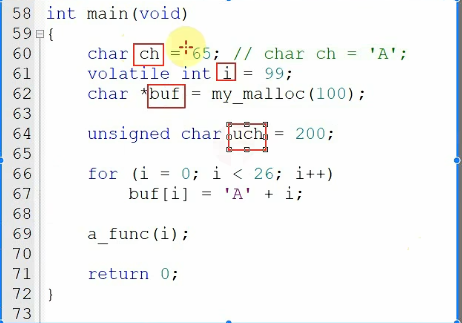
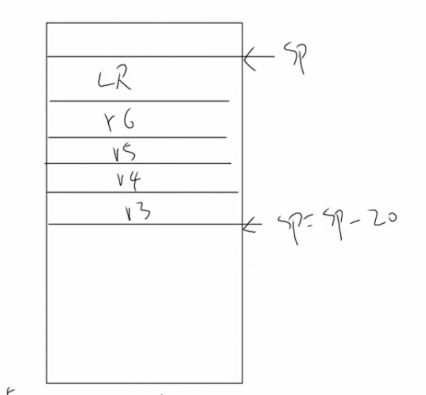
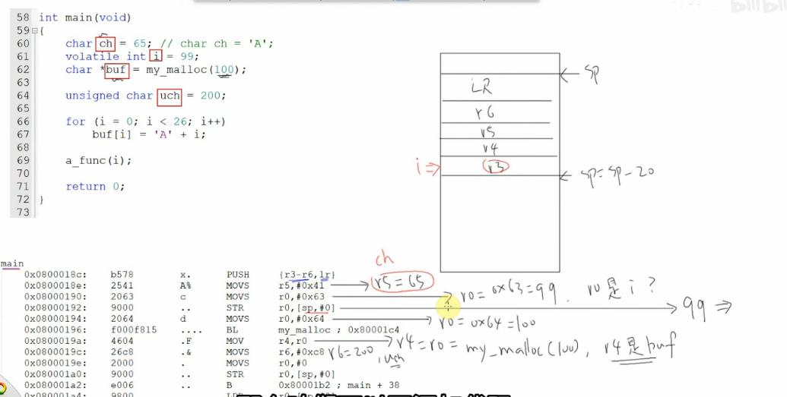
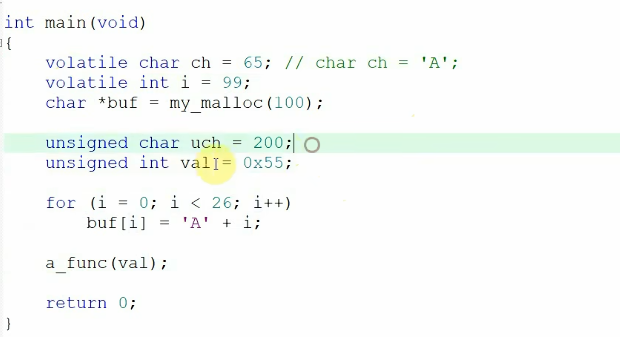
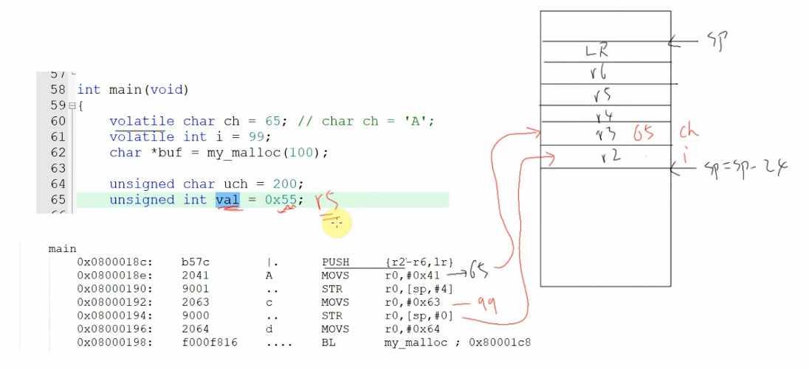
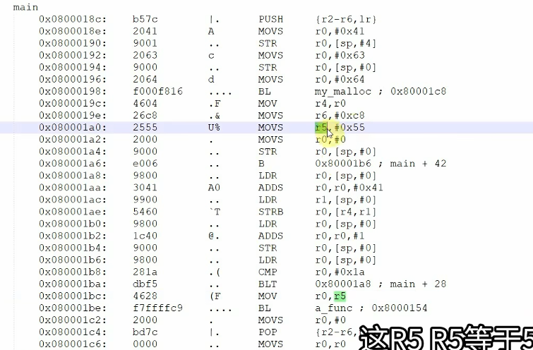

这是一个非常核心的嵌入式C语言与底层汇编的面试高频主题。这个视频通过一个实验很好地展示了**编译器优化**、**`volatile`关键字的作用**以及**函数栈帧**的真实情况。

我将为你详细分解视频内容、进行扩展，并提供一套针对性的面试问题。

------


# 💻 视频内容摘要（带时间点）

这个视频的核心是对比C语言代码和它编译后的ARM汇编代码，来<span style="color:#CC0000;">观察局部变量到底是如何存储</span>的。

- **(00:06) 引入主题：** 开始讲解栈 (Stack) 中的局部变量。

- **(00:29) 实验设置：** 展示一个`main`函数，包含`ch`、`i`、`buf`、`uch`四个局部变量，并通过并排查看C代码、汇编代码和栈帧示意图来进行分析。

  

- **(00:47) 关键概念 - 函数栈帧：** 函数（如`main`）在被调用时，会先执行一段“函数序言 (Prologue)”代码。这包括将多个寄存器（如 R3-R6）和返回地址（LR, Link Register）**压入堆栈**。这块为函数分配的栈空间就称为“栈帧” (Stack Frame)。

  

<span style="font-weight:bold; font-size:1.1em; color:#CC0000;">注意：函数内部局部变量可能用寄存器来表示，不一定会保存在内存里，加上一个volitate的话，就会保存在内存里，或者寄存器不够用的时候，它也会保存在内存里。</span>

- **(01:16) 关键发现 1 - 编译器优化：**

  

  - 分析 `char ch = 65;` 时，发现汇编代码是 `MOVS R5, #65`。
  - **结论：** <span style="color:#CC0000;">编译器并没有为`ch`在栈上分配内存，而是直接将其优化到了一个**CPU寄存器 (R5)** 中。这对提高速度至关重要。</span>

- **(01:51) 关键发现 2 - `volatile` 的作用：**

  - 分析 `volatile int i = 99;` 时，发现汇编代码是 `MOVS R0, #0x63` (99)，紧接着是 `STR R0, [sp, #0]`。
  - **结论：** `STR` (Store) 指令明确地将`i`的值（99）存储到了**栈内存**中（地址为 `sp+0`）。`volatile` 关键字**阻止了编译器的优化**，**强制**要求编译器为`i`变量分配内存空间（而不是放在寄存器里）。

- **(03:25) 关键发现 3 - 更多优化：**

  - 分析 `char *buf = my_malloc(100);` 和 `unsigned char uch = 200;`。
  - **结论：** 编译器再次进行了优化。<span style="color:#CC0000;">指针变量 `buf` 被存放在了寄存器 `R4` 中，而 `uch` 被存放在了寄存器 `R6` 中。它们都没有占用栈内存。</span>

- **(05:32) 实验验证：**

  - 讲师为 `char ch` 添加了 `volatile` 关键字，并添加了新变量 `unsigned int val = 0x55;`，然后重新编译。

    

- **(07:58) 实验结果：**

  

  - `volatile char ch`：汇编中出现了 `STR R0, [sp, #4]`，证明 `ch` 变量现在被**强制存储在栈上**（地址 `sp+4`）。
  - `unsigned int val`：汇编中是 `MOVS R5, #0x55`，这个新变量**依然被优化到了寄存器 R5** 中。

- **(09:20) 最终总结：** 编译器为了追求最高效率，会尽可能将局部变量存储在CPU寄存器中。只有当**寄存器不够用**、**变量被取地址**、或**变量被 `volatile` 修饰**时，才会被“溢出”到栈上分配内存。

------

# 补充提问

## 提问1



<span style="font-weight:bold; font-size:1.2em;">你能够结合者这个图给我详细解释下栈中的局部变量是如何分配的吗，这里val不是用寄存器r5来保存的吗，为什么还要把r5压栈呢，这里压栈的寄存器为什么是r2-r6呢，我不是太懂，你能够给我详细解释下吗？</span>


这是一个非常棒的问题，你已经触及到了嵌入式C语言编译后的核心——**EABI（嵌入式应用二进制接口）**和 **编译器优化**。

你之所以会困惑，是因为你看到了两个看似矛盾的行为：

1. 一个变量（如 `val`）被存入寄存器（如 `r5`）。
2. 这个寄存器（`r5`）在函数开头又被 `PUSH` 压入堆栈。

这看起来很多余，但其实这是两个**<span style="color:#CC0000;">完全不同目的</span>**的操作。

我会为你彻底拆解这个过程，回答你的所有问题。

------


### 🧰 核心解答：寄存器的“保存”与“使用”

你问题的关键是混淆了“保存寄存器的**旧值**”和“使用寄存器存**新值**”。

- **`PUSH {r2-r6, lr}`（<span style="color:#CC0000;">函数序言</span>）**
  - **目的：** 保存**调用者**的上下文。
  - **时间：** 函数刚开始执行时。
  - **动作：** 把 `r2` 到 `r6` 以及 `lr` 寄存器里**目前（旧）的**值，压入堆栈。`main` 函数并不知道这些寄存器里存着什么（可能是上一个函数的重要数据），所以它必须先“打扫房间”——把房间里原来的东西（旧值）存到储藏室（堆栈），以便之后恢复。
- **`MOVS r5, #0x55`（函数体中，这张图没截到但原理如此）**
  - **目的：** 执行C语言代码 `val = 0x55`。
  - **时间：** 在函数序言**之后**。
  - **动作：** `main` 函数现在“借用”了 `r5` 寄存器，把 `0x55` 这个**新值**放进去，作为 `val` 变量的“家”。

在函数**返回前（函数尾声）**，会有一个 `POP` 指令，把刚才存到堆栈里的**旧值**再弹回 `r2-r6` 和 `lr`，这样 `main` 函数就“把房间恢复了原样”。

**一句话总结：`PUSH` 是为了保存 `r5` 的旧值（给调用者一个交代），而 `MOVS` 是为了写入 `val` 的新值（供 `main` 自己使用）。**

------


### 🧠 你的具体问题详解

我们来详细回答你的每一个问题：



#### 1. “这里 `val` 不是用寄存器 `r5` 来保存的吗？”

**是的，你的猜测很可能是对的。**

编译器为了追求极致的速度，会**优先**把局部变量（如 `val`, `uch`, `buf`）存储在CPU寄存器中。访问寄存器（~1个时钟周期）比访问栈内存（~几十上百个时钟周期）快得多。

- `unsigned int val = 0x55;` 很有可能被优化为使用 `r5`。
- `unsigned char uch = 200;` 很有可能被优化为使用 `r6`。
- `char *buf = ...` 很有可能被优化为使用 `r4`。

**但是**，`volatile` 修饰的变量（如 `ch` 和 `i`）是个例外。`volatile` 关键字**强制**编译器为它们在**栈上分配内存**，并老老实实地从内存读写。

这就是为什么你在汇编中看到了 `STR`（Store）指令：

- `STR r0, [sp, #4]`：把 `ch` (65) 存入栈地址 `sp+4`。
- `STR r0, [sp, #0]`：把 `i` (99) 存入栈地址 `sp+0`。


#### 2. “为什么还要把 `r5` 压栈呢？”

**这是ARM EABI（调用规范）的规定。**

ARM的寄存器被分为两类：

1. **被调用者保存 (Callee-Saved) (r4-r11):**
   - `main` 函数就是“被调用者”。
   - 规范规定：<span style="color:#CC0000;">如果 `main` 函数想使用 `r4`, `r5`, `r6` 等寄存器（补充理解：显然main函数优化变成了 val  和 cah 分别使用了 r5 和 r6）</span>，它**必须**在开头`PUSH`保存它们的原始值，并在结尾`POP`恢复它们。
   - **所以：** 编译器知道它要用 `r5` 来存 `val`，所以它**有义务**在函数开头<span style="color:#CC0000;"> `PUSH r5` 来保存 `r5` 的旧值。</span>
2. **调用者保存 (Caller-Saved) (r0-r3):**
   - `main` 函数可以随意使用 `r0-r3` 而不必保存。
   - （`r0` 在这里被用作<span style="color:#CC0000;">临时中转站</span>来传递 `65` 和 `99`）。


#### 3. “这里压栈的寄存器为什么是 `r2-r6` 呢？”

**这是最精妙的部分，是编译器的高级优化！**

这次压栈 `PUSH {r2-r6, lr}` 有**三个目的**：

1. **保存LR：** `lr` (Link Register) 存着返回地址。`main` 函数中调用了 `my_malloc`，这个调用会覆盖 `lr`，所以必须提前 `PUSH lr` 保存它。**（必做）**
2. **保存“被调用者保存”的寄存器：** 如上所述，`main` 要用 `r4`, `r5`, `r6`，所以它必须 `PUSH` 它们。**（必做）**
3. **为 `volatile` 变量分配空间（最聪明的优化）：**
   - `main` 需要为 `volatile int i`（4字节）和 `volatile char ch`（1字节，但对齐为4字节）在栈上分配空间。总共需要 `4 + 4 = 8` 字节。
   - 编译器现在算总账：它需要保存 `lr` (4字节), `r6` (4字节), `r5` (4字节), `r4` (4字节)，还需要 `i` (4字节) 和 `ch` (4字节) 的空间。总共 `4 * 6 = 24` 字节。
   - `PUSH {r2-r6, lr}` 这条指令，**一次性就完成了 24 字节的栈空间分配**，并把 `r2-r6` 和 `lr` 存了进去。
   - <span style="color:#CC0000;">`r2` 和 `r3` 是“调用者保存”的，`main` 根本不关心它们的旧值。于是编译器说：“太好了！我可以直接**复用**刚刚为 `r2` 和 `r3` 分配的栈空间！”</span>
     - 它把 `i` 存到了 `[sp, #0]`（`r2` 刚刚保存的位置）。
     - 它把 `ch` 存到了 `[sp, #4]`（`r3` 刚刚保存的位置）。

------


### 📍 总结：局部变量是如何分配的？

结合你的图，现在我们有了清晰的答案：

1. **编译器会尽力将局部变量优化到寄存器中**（如 `val` -> `r5`, `uch` -> `r6`, `buf` -> `r4`）来提升速度。
2. 为了使用这些寄存器（`r4-r6`），`main` 函数必须遵守EABI规范，在函数开头的**序言** (Prologue) 中 `PUSH` 它们的**旧值**。
3. 如果局部变量被 `volatile` 修饰（如 `i` 和 `ch`），编译器被**强制**在**栈内存**中为它们分配空间，并通过 `STR` (Store) 指令写入。
4. 编译器非常聪明，它会<span style="color:#CC0000;">把“分配栈空间”和“保存寄存器”这两个操作合并</span>，用一条 `PUSH {r2-r6, lr}` 指令**一箭双雕**，高效地完成了所有工作。

你还有其他想要深入了解的汇编指令吗？比如 `BL` (Branch with Link) 是如何与 `LR` 配合工作的？


## 提问 1 - （1）

编译器非常聪明，它会<span style="color:#CC0000;">把“分配栈空间”和“保存寄存器”这两个操作合并</span>，用一条 `PUSH {r2-r6, lr}` 指令**一箭双雕**，高效地完成了所有工作。
<span style="font-weight:bold;">要如何理解上面这句话呢，当我们要分配的栈空间很多时候，此时如何用push操作呢，此时这两个操作应该就不会合并了吧，我不是太懂，你能够给我详细解释下吗？</span>


你提的这个问题非常非常关键，而且你的直觉是**完全正确的**！

你猜的没错：**<span style="color:#CC0000;">当需要分配的栈空间很多时，这两个操作（保存寄存器 vs 分配空间）就必须分离了。</span>**

我之前说的“一箭双雕”是编译器在**特定情景**（小型栈帧）下的一个“神优化”。我们来彻底讲清楚这两种情景：

------


### 1. 为什么在视频中可以“合并”？（小型栈帧）

首先，我们必须理解 `PUSH` 指令的**双重作用**：

1. **保存值：** 把寄存器（如 `r4`）里的值写入 `sp` 指向的内存。
2. **分配空间：** 把 `sp`（栈顶指针）向下移动 4 个字节。

在视频的那个例子里（`PUSH {r2-r6, lr}`），编译器算了一笔账：

1. **必须保存的寄存器 (EABI规定)：** `r4`, `r5`, `r6` (因为函数体要用它们存 `buf`, `val`, `uch`) 和 `lr` (因为调用了 `my_malloc`)。总共 **4 个**寄存器。
2. **必须分配的栈内存 (volatile 强制)：** `volatile int i` (4 字节) 和 `volatile char ch` (4 字节，因为要对齐)。总共 **8 字节**。

关键点来了：

编译器发现，它总共需要<span style="font-weight:bold;"> 4 (寄存器)  4 字节 + 8 字节 (变量) = 24 字节 的空间</span>。

它“灵机一动”，发现 `PUSH {r2-r6, lr}` 这条指令（<span style="color:#CC0000;">保存6个寄存器</span>）**恰好**也会分配 `6 * 4 = 24 字节` 的空间！

于是编译器执行了这个“一箭双雕”的操作：

- 它**<span style="color:#CC0000;">假装</span>**要保存 `r2, r3, r4, r5, r6, lr`。
- `r4, r5, r6, lr` 的值**<span style="color:#CC0000;">真的被保存了</span>**（这是目的1）。
- `r2` 和 `r3` 的值也被保存了（虽然它们是“调用者保存”寄存器，<span style="color:#FF0000;">保存它们的值没啥意义</span>），但**更重要的是**，`PUSH r2` 和 `PUSH r3` 这个动作**<span style="color:#FF0000;">腾出了 8 字节的栈空间</span>**。
- 编译器后续就开心地用 `STR` 指令，把 `i` 和 `ch` 存入到了 `sp+0` 和 `sp+4`（也<span style="color:#CC0000;">就是 `r2` 和 `r3` 刚刚保存的位置</span>）。

**结论：** 这种<span style="color:#CC0000;">“合并”是编译器的一种优化</span>，仅适用于<span style="color:#CC0000;">所需总空间（保存的寄存器 + 局部变量）较小</span>，且能用 `PUSH` 指令“凑齐”的场景。

------


### 2. 当需要“很多”栈空间时：操作就会分离（大型栈帧）

现在来看你提的“分配很多栈空间”的情况。假设你的 `main` 函数改成了这样：

C

```c
int main(void) {
    // 需要一个 1000 字节的大数组
    char big_array[1000];
    
    // 依然要用 r4, r5, lr
    char *buf = my_malloc(100); 
    unsigned int val = 0x55;
    
    // ...
}
```

编译器总不能 `PUSH` 250 个寄存器（`1000 / 4`）来凑齐这 1000 字节吧？（CPU也根本没有那么多寄存器）。

**此时，编译器会采用标准、可扩展的方法：将操作分离。**

这时的函数序言 (Prologue) 会变成这个样子：

ARM assembler

```assembly
main:
    // -----------------------------------------------------
    // 步骤 1: 保存寄存器
    // "我需要用 r4, r5 和 lr，所以我只保存它们"
    // -----------------------------------------------------
    PUSH    {r4, r5, lr}      
    // @ 此时 sp 向下移动了 3 * 4 = 12 字节
    // @ r4, r5, lr 的旧值被安全保存


    // -----------------------------------------------------
    // 步骤 2: 为局部变量分配“大块”空间
    // "我需要 1000 字节给 big_array，用 SUB 指令最高效"
    // -----------------------------------------------------
    SUB     sp, sp, #1000     
    // @ 直接、高效地将 sp 再次向下移动 1000 字节
    // @ (可能还会再减一点用于对齐，但原理如此)

    
    // ... 函数体 ...
    // 此时 big_array[0] 的地址就是 [sp, #0]
    // buf (r4), val (r5) 在寄存器中
    // r4, r5, lr 的旧值被安全地存在 [sp, #1000] 之后的位置
    
    // ... 函数尾声 (Epilogue) ...
    
    // 步骤 3: 释放“大块”空间
    ADD     sp, sp, #1000     // @ SUB 的逆操作
    
    // 步骤 4: 恢复寄存器并返回
    POP     {r4, r5, pc}      
    // @ PUSH 的逆操作, 注意 POP {..., pc} 是高效返回的技巧
```

------


### 总结对比

为了让你看得更清晰，这里是两种情况的对比：

| **特性 (Feature)** | **场景1：小型栈帧 (视频中)**                      | **场景2：大型栈帧 (你的疑问)**          |
| ------------------ | ------------------------------------------------- | --------------------------------------- |
| **分配方式**       | **`PUSH {reg_list}`**                             | **`SUB sp, sp, #N`**                    |
| **操作合并**       | **是** (“保存寄存器”和“分配空间”被合并到一条指令) | **否** (两个操作**分离**执行)           |
| **主要目的**       | 优化代码密度和速度                                | 灵活性，分配任意大小的空间              |
| **汇编示例**       | `PUSH {r2-r6, lr}`                                | `PUSH {r4, r5, lr}` `SUB sp, sp, #1000` |

**所以，你的理解是完全正确的。** “合并”只是编译器在特定（小型）情景下的一种“偷懒”优化。而你假设的“分离”（`PUSH` + `SUB`）才是绝大多数函数（尤其是需要大数组或大量局部变量时）真正使用的**标准、可扩展**的栈帧分配方式。

这下是不是彻底明白了？要不要我们再看看函数**返回**时，`POP` 是如何配合 `ADD` 来恢复堆栈的？


## 提问 1 - （1）- （1）

<span style="font-weight:bold; font-size:1.2em;">我想要看看函数**返回**时，`POP` 是如何配合 `ADD` 来恢复堆栈的？</span>

没问题！我们接着上一个话题，函数尾声 (Epilogue) 的目的就是**完美地逆转**函数序言 (Prologue) 所做的一切。

函数序言做两件事：

1. **保存寄存器**（`PUSH`）
2. **分配栈空间**（`SUB` 或 `PUSH` 本身）

因此，函数尾声也必须做两件相反的事：

1. **释放栈空间**（`ADD`）
2. **恢复寄存器**（`POP`）

------


### 1. 标准情况：`ADD` 配合 `POP` (用于大型栈帧)

这是最标准、最通用的情况，**完美对应你“分配很多栈空间”的那个例子**。


#### **回顾：函数序言 (Prologue)**


假设我们用了 `SUB` 来分配一个大空间：

ARM assembler

```assembly
main:
    // 1. 保存寄存器 (sp 向下移动 12 字节)
    PUSH    {r4, r5, lr}      
    
    // 2. 为局部变量分配 1000 字节的大空间 (sp 再向下移动 1000 字节)
    SUB     sp, sp, #1000     
    
    // ... 函数体 ...
    // ... 使用 [sp+0] 到 [sp+999] 作为 big_array
    // ... 使用 r4, r5
```


#### **详解：函数尾声 (Epilogue)**

现在，函数执行完毕，准备 `return`。它必须<span style="color:#CC0000;">**严格按照相反的顺序**</span>“撤销”序言中的操作：

ARM assembler

```assembly
    // ... 函数体结束 ...

    // 1. 释放局部变量空间 (SUB 的逆操作)
    // 直接把 sp 向上移 1000 字节，这块内存的数据就被“丢弃”了
    ADD     sp, sp, #1000

    // 2. 恢复寄存器 (PUSH 的逆操作)
    // sp 再向上移动 12 字节，并把内存中的旧值装回寄存器
    POP     {r4, r5, lr}

    // 3. 返回
    // lr (Link Register) 中存的是函数调用前的返回地址
    // BX lr (Branch and Exchange) 指令就是“跳转”回那个地址
    BX      lr              
```

**所以，`ADD` 和 `POP` 是如何配合的？**

- **`ADD sp, sp, #N`** 专门用于释放由 **`SUB sp, sp, #N`** 分配的大块局部变量空间。
- **`POP {reg_list}`** 专门用于释放和恢复由 **`PUSH {reg_list}`** 保存的寄存器。
- 它们**<span style="color:#CC0000;">顺序不能错</span>**：必须先 `ADD` 释放局部变量空间，让 `sp` 指针回到 `PUSH` 之前的位置，然后才能用 `POP` 正确地弹出之前保存的寄存器。

------


### 2. 优化情况：只有 `POP` (用于小型栈帧)

现在我们再回头看视频中的那个“一箭双雕”的例子。


#### **回顾：函数序言 (Prologue)**

ARM assembler

```assembly
main:
    // 1. "一箭双雕"：
    //    - 保存 r2-r6, lr (虽然 r2,r3 没用)
    //    - 同时分配了 6 * 4 = 24 字节空间
    PUSH    {r2-r6, lr}       
    
    // ... 函数体 ...
    // ... 使用 [sp+0] (i) 和 [sp+4] (ch)
```


#### **详解：函数尾声 (Epilogue)**

这里**根本没有 `SUB` 指令**，所以它的逆操作**也就不需要 `ADD` 指令**！

整个栈帧的分配和保存**只用了一条 `PUSH` 完成**，因此，它的<span style="color:#CC0000;">逆操作</span>也**只用一条 `POP` 就能全部完成**：

ARM assembler

```assembly
    // ... 函数体结束 ...

    // 1. "一箭双雕"的逆操作：
    //    - 恢复 r2-r6, lr (把栈上的值弹回寄存器)
    //    - 同时释放 6 * 4 = 24 字节空间 (sp 向上移动 24 字节)
    POP     {r2-r6, lr}

    // 2. 返回
    BX      lr
```

------


### 🚀 终极优化：`POP` 直接实现返回

在上面的两个例子中，最后一步都是 `BX lr`。编译器其实还有一个更快的技巧。

`lr` 是在 `PUSH` 的时候被压入栈的，它在栈上等待被 `POP`。而 `pc` (Program Counter) 是程序计数器，它指向下一条要执行的指令。

**如果我们 `POP` 的目标寄存器包含 `pc`，CPU 就会在 `POP` 完成后，自动跳转到 `pc` 被赋予的新地址！**

所以，编译器会把 `POP {..., lr}` 和 `BX lr` 这两步<span style="color:#CC0000;">**合并为一步**：</span>

- **标准情况的尾声 (更优)：**

  ARM assembler

  ```assembly
  ADD     sp, sp, #1000
  // 把 r4, r5 恢复
  // 把之前保存的 lr 值，直接弹入 pc，实现“恢复+返回”
  POP     {r4, r5, pc}      
  ```

- **小型情况的尾声 (更优)：**

  ARM assembler

  ```assembly
  // 把 r2-r6 恢复
  // 把之前保存的 lr 值，直接弹入 pc，实现“恢复+返回”
  POP     {r2-r6, pc}
  ```


### 总结

| **栈帧类型**                  | **序言 (Prologue)**                                      | **尾声 (Epilogue)**                                          |
| ----------------------------- | -------------------------------------------------------- | ------------------------------------------------------------ |
| **大型栈帧** (分配与保存分离) | 1. `PUSH {r4, lr}` (保存)  2. `SUB sp, sp, #1000` (分配) | 1. `ADD sp, sp, #1000` (释放)  2. `POP {r4, pc}` (恢复并返回) |
| **小型栈帧** (分配与保存合并) | 1. `PUSH {r2-r6, lr}` (保存+分配)                        | 1. `POP {r2-r6, pc}` (恢复+释放+返回)                        |

**你的问题的最终答案：** `ADD` 是 `SUB` 的逆操作。只有在函数序言中**使用了 `SUB` 来分配大空间**时，函数尾声才**必须使用 `ADD` 来释放**。如果序言只用了 `PUSH`，尾声就也只用 `POP`。


# 🚀 内容补充与扩展

视频中的知识点是嵌入式开发的基础。在面试中，面试官希望你不仅知道“是什么”，更知道“为什么”和“在什么情况下”。


#### 1. 为什么编译器倾向于使用寄存器？

- **速度差异：** CPU访问寄存器（如R4, R5）通常只需要1个时钟周期。而访问栈（存储在RAM中）需要通过数据总线，可能需要几十甚至上百个时钟周期。
- **性能优先：** 编译器的默认优化等级（如 `-O2` 或 `-Os`）的首要目标就是提升代码执行速度或减小体积。因此，只要有可能，它就会避免不必要的内存读写。


#### 2. `volatile` 的真正战场（面试核心）

视频中只展示了 `volatile` 的一个效果（防止优化到寄存器）。在嵌入式面试中，你必须知道它最重要的三个应用场景：

1. **访问内存映射的硬件寄存器 (MMIO)：**

   - **场景：** 比如你要读取一个UART（串口）的状态寄存器，看它是否接收到了数据。这个寄存器的值是由**硬件**改变的，而不是你的C代码。

   - **风险：** 如果不加 `volatile`，<span style="color:#CC0000;">编译器看到你在一个循环里反复读取一个“变量”</span>：

     C

     ```c
     while (UART_STATUS_REG == 0) { /* wait */ }
     ```

     编译器<span style="color:#CC0000;">会认为 `UART_STATUS_REG` 的值永远不变，从而“优化”这个循环</span>，将其变成 `if (UART_STATUS_REG == 0) { while(1) { /* dead loop */ } }`，导致程序卡死。

   - **解决：** `volatile uint32_t* UART_STATUS_REG` 告诉编译器：“这个地址的内容随时可能从外部改变，你每次循环都必须老老实实地去内存（或总线）重新读取它。”

2. **在中断服务程序 (ISR) 中修改的全局变量：**

   - **场景：** 你在主循环 `main()` 中检查一个全局标志 `g_flag`，而这个 `g_flag` 是在某个中断（如定时器中断）中被设置为 `true` 的。
   - **风险：** `main` 循环因为优化，可能<span style="color:#CC0000;">把 `g_flag` 的值（`false`）缓存在了某个CPU寄存器</span>中。当中断发生并修改了内存中的 `g_flag` 时，`main` 循环（在寄存器里）的“副本”还是 `false`，导致它永远无法跳出循环。
   - **解决：** `volatile bool g_flag;` 强制 `main` 循环每次都从内存中读取 `g_flag` 的最新值。

3. **多线程/RTOS 环境下的共享变量：**

   - **场景：** 两个任务（Task A 和 Task B）共享一个变量。
   - **风险：** 同上。Task A 对变量的修改可能被缓存在寄存器中，Task B 无法立即看到。
   - **(注意：`volatile` 在多线程中只解决了“可见性”问题，没有解决“原子性”问题，通常需要配合互斥锁 (Mutex) 使用。)**

------


# 🧠 嵌入式面试经典问题

以下是基于此视频内容，为你准备的“有深刻见解”的面试题及简洁答案。


#### Q1：局部变量一定存放在栈上吗？

> 简洁回复：
>
> 不一定。现代编译器优化后，<span style="color:#CC0000;">会优先将局部变量存储在 CPU 寄存器中</span>，因为这比访问栈（内存）快几个数量级。
>
> 只有当（1）**寄存器不够用**时（变量太多），（2）变量被**`volatile`**修饰时，或（3）程序需要**获取该变量的地址**时（如 `&my_var`），编译器才会将其“溢出”到栈上分配内存。


#### Q2：`volatile` 关键字的核心作用是什么？

> 简洁回复：
>
> volatile 的核心作用是防止编译器进行不当的优化。它告诉编译器，这个变量的值可能在任何时候被程序“外部”的因素（如硬件、中断、其他线程）所改变。
>
> 因此，编译器每次访问该变量时，都必须**强制从其内存地址重新读取**，或者**强制将其值写回内存**，而不能使用CPU寄存器中的缓存副本。


#### Q3：`volatile` 变量是线程安全的吗？它能保证原子操作吗？

> 简洁回复：
>
> 不安全，也不能。
>
> 1. **非原子性：** `volatile` 只保证“可见性”（不被优化），不保证“原子性”。一个 `volatile_var++` 操作，在汇编层面依然是“读-改-写”三步，这个过程随时可能被中断打断，导致数据出错。
> 2. **非线程安全：** 正因为它非原子，所以它不是线程安全的。在RTOS中，保护共享资源需要使用互斥锁 (Mutex) 或信号量 (Semaphore)。


#### Q4：视频中函数开头 `PUSH {R3-R6, LR}` 这个操作叫什么？为什么需要它？

> 简洁回复：
>
> 这叫函数序言 (Function Prologue)。它有两个目的：
>
> 1. **保存返回地址：** `LR` (Link Register) 存储了函数执行完毕后应跳回的地址，必须将其压栈保存，否则如果这个函数又调用了其他函数（`BL`指令），LR 的值就会被覆盖。
> 2. **保存上下文：** R3-R6 这些属于“被调用者保存 (Callee-Saved)”的寄存器。ARM 的 EABI（应用二进制接口规范）规定，如果当前函数（被调用者）要使用这些寄存器，它就必须负责在用之前将其压栈保存，在函数返回前（函数尾声）再将其弹栈恢复。这样才能保证调用这个函数的“调用者”的寄存器状态不被破坏。


#### Q5：[情景题] 我在调试时，通过J-Link在内存窗口看到硬件寄存器的值已经变为 1 了，但我的程序 `while(HW_REG == 0)` 却依然卡死在循环里，这是为什么？

> 简洁回复：
>
> 这几乎可以肯定是编译器优化导致的。
>
> 因为 `HW_REG` 变量**没有被声明为 `volatile`**，编译器认为它在循环中不会改变，就将其值（0）缓存到了一个CPU寄存器中。你的 `while` 循环一直在检查那个CPU寄存器（值是0），而没有重新去内存（MMIO）地址读取硬件已经更新的真实值（1）。
>
> **解决方法：** 将 `HW_REG` 的定义声明为 `volatile`。

希望这份详细的分析和准备对你的嵌入式面试有帮助！你希望我再深入讲解一下关于函数调用EABI规范（比如参数是如何通过R0-R3传递的）吗？