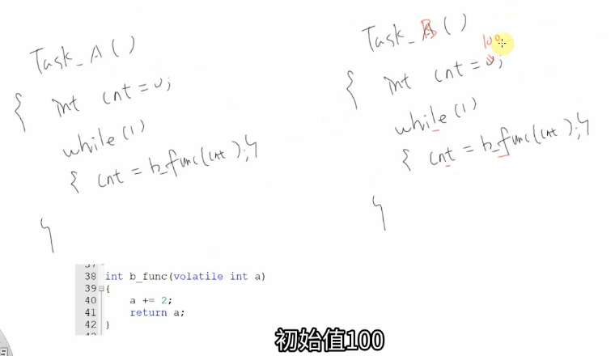
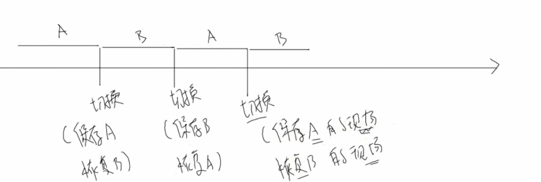
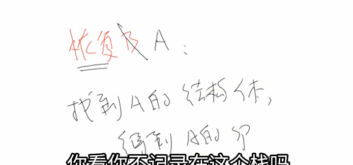
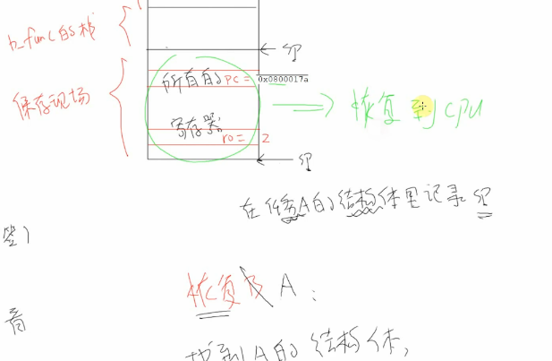
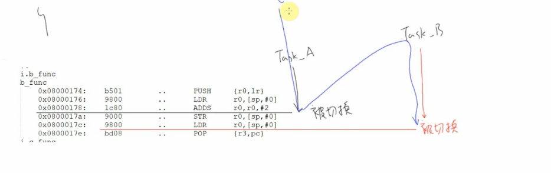
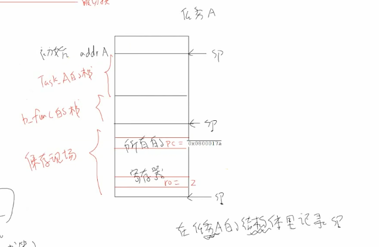

这门课程非常经典，它用一个巧妙的例子清晰地解释了RTOS（实时操作系统）中最核心的概念之一：**任务栈**。

这对准备嵌入式面试至关重要。以下是对视频内容的总结、扩展补充以及一套为你准备的面试问答。


# 💻 视频核心内容总结（带时间点）

视频的核心是回答这个问题：“<span style="color:#CC0000;">为什么每个RTOS任务（或线程）都必须有自己独立的栈？</span>”

- **(00:15 - 01:30) 设定问题场景：**

  

  - 假设有两个任务 `Task_A` 和 `Task_B`。
  - `Task_A` 有一个局部变量 `cnt = 0`，并在循环中调用 `cnt = b_func(cnt)`。
  - `Task_B` 几乎一样，但它的局部变量 `cnt = 100`，也在循环中调用 `cnt = b_func(cnt)`。
  - 两个任务共用同一个 `b_func` 函数（代码是共享的）。

- **(01:30 - 04:00) 演示并发执行的问题：**

  - 在RTOS中，任务是**并发**（并发）且**被抢占**（Preemptive）的。系统可能在任何时刻（例如，由时钟中断触发）暂停 `Task_A`，转而去执行 `Task_B`。

  - **关键问题 (02:47, 06:40)：** 假设 `Task_A` 正在执行 `b_func`，它刚把 `cnt` (值为0) 加2，得到结果2并存入了CPU的 **R0寄存器** 中。就在<span style="color:#CC0000;">它准备把 R0 的值返回给 `cnt` 变量（补充理解：cnt是传递的参数，对应接收的是 volatile int a。由于使用了volatile，故此时cnt变量对应的是a，对应的应该是栈上一篇空间，对应的汇编操作是下面的 “ STR r0,[sp,  #0]”,即将r0的值存回到内存中a对应的那片空间）</span> **之前**，一个中断发生，系统切换到 `Task_B`。

    

- **(04:00 - 06:14) “保存现场”与“恢复现场”的概念：**

  

  - `Task_B` 开始执行，它也会调用 `b_func`，它会**覆盖** CPU 的 R0 寄存器（例如，用100+2=102）。
  - 如果 `Task_A` 恢复运行时，R0 寄存器的值是102（被B污染了），那么 `Task_A` 的 `cnt` 变量就会被错误地赋值为102，而不是正确的2。
  - **解决方案：** 任务切换时，必须 **“保存现场” (Save Context)**。
  - **类比 (04:53)：** 就像一个人在读两本书（语文和数学）。当他不想读语文（`Task_A`）时，他必须在当前页（Page 100）**夹个书签**（保存现场）。然后他去看数学（`Task_B`）。当他想切回语文时，他通过书签**找到第100页**（恢复现场），然后继续阅读。

- **(06:14 - 10:24) 栈的作用 (1)：保存上下文（现场）：**

  

  - 这个“书签”在RTOS里就是**保存在任务栈里的上下文（Context）**。
  - 当 `Task_A` 被中断抢占时，OS会立即把 `Task_A` 运行到一半的<span style="color:#CC0000;">所有CPU寄存器（R0, R1... R12, PC, LR等</span>）全部**压入（Push）到 `Task_A` 自己的栈中**。
  - 这个被保存的PC（程序计数器）指向 `Task_A` **即将要执行的下一条指令**。

- **(10:24 - 12:46) 恢复上下文（恢复现场）： **

  

  

  - OS随后切换到 `Task_B`（恢复 `Task_B` 的寄存器）。`Task_B` 运行时会随意使用R0等寄存器。
  - 当 `Task_B` 也被抢占，系统决定切回 `Task_A` 时，OS会找到 `Task_A` 的栈，把之前保存的<span style="color:#CC0000;">所有寄存器值**弹出（Pop）回CPU**。</span>
  - `Task_A` 的 <span style="color:#CC0000;">R0 寄存器</span>被恢复为 `2`，<span style="color:#CC0000;">PC寄存器</span>也被恢复。
  - `Task_A` 于是<span style="color:#CC0000;">从它被中断的下一条指令</span>继续执行，此时它拿到的 R0 里的值（`2`）是完全正确的。

- **(13:25 - 15:56) 总结：为什么需要独立栈？**

  

  - **1. 存储函数调用信息 (13:35)：** 每个任务有自己独立的函数调用链。`Task_A` 的 `cnt`（值为0）和 `Task_B` 的 `cnt`（值为100）作为**局部变量**，分别存储在**各自的栈**上。它们物理上是隔离的。
  - **2. 存储上下文 (14:36)：** 在任务被抢占时，用作“保存现场”的缓冲区，确保任务恢复时所有CPU寄存器的状态和它被暂停时完全一致，让任务“毫不知情”地继续运行。

------


# 补充提问

## 提问1



<span style="font-weight:bold; font-size:1.2em;">你能够给我解释下这个函数 b_func() 的汇编代码指令吗，我有点看不太懂。</span>

好的，我来帮你逐条解释这段 `b_func` 的汇编代码。

这是基于ARM架构（具体来说是Thumb指令集，在嵌入式Cortex-M处理器上非常常见）的汇编。

**先回顾一下C语言源代码（来自视频）：**

C

```c
int b_func(volatile int a) {
  a += 2;
  return a;
}
```

**再回顾一下ARM函数调用的基本规则 (AAPCS)：**

- **参数传递：** 第一个参数（这里的 `a`）通过寄存器 `r0` 传入函数。
- **返回值：** 函数的返回值（`return a` 的结果）通过寄存器 `r0` 传出函数。
- **`sp` 寄存器：** 栈指针 (Stack Pointer)，指向栈顶。
- **`lr` 寄存器：** 链接寄存器 (Link Register)，保存了函数调用完毕后应该返回的地址。
- **`pc` 寄存器：** 程序计数器 (Program Counter)，指向*下一条*要执行的指令地址。

------


### 🔍 汇编代码逐行详解

| **地址**      | **指令** | **助记符** | **操作数**     | **C语言对应**         | **详细解释**                                                 |
| ------------- | -------- | ---------- | -------------- | --------------------- | ------------------------------------------------------------ |
| `0x080000174` | `b501`   | `PUSH`     | `{r0, lr}`     | 函数入口              | **函数“开场白”（Prologue）**。这条指令做了两件事：  1. **保存 `lr`：** 把 `lr`（返回地址）压入栈中。这样函数才知道执行完后跳回哪里去。  2. **保存 `r0`：** 把 `r0`（参数 `a`）也压入栈中。这相当于在栈上创建了一个局部变量 `a` 的“副本”。 |
| `0x080000176` | `9800`   | `LDR`      | `r0, [sp, #0]` | `a += 2;` (读取 `a`)  | **加载（Load）**。`[sp, #0]` 指的是栈顶（偏移量为0）的内存地址。这条指令从栈顶把刚刚存进去的 `a` 的值，**重新加载**回 `r0` 寄存器。 |
| `0x080000178` | `1c80`   | `ADDS`     | `r0, r0, #2`   | `a + 2`               | **加法（Add）**。这是核心计算。它把 `r0` 寄存器里的值（即 `a`）加上立即数 `2`，然后把 **结果（`a+2`）存回 `r0` 寄存器**。 |
| `0x08000017a` | `9000`   | `STR`      | `r0, [sp, #0]` | `a = ...;` (写入 `a`) | 存储（Store）。把 `r0` 寄存器里的新值（`a+2`）存储回栈上的局部变量 `a` 的内存地址 `[sp, #0]`。 |
| `0x08000017c` | `9800`   | `LDR`      | `r0, [sp, #0]` | `return a;`           | 准备返回值。再次从栈 `[sp, #0]` 中 **加载** `a` 的值（现在是 `a+2`）到 `r0` 寄存器。根据调用规则，`r0` 必须存放返回值，所以这条指令是必需的。 |
| `0x08000017e` | `bd08`   | `POP`      | `{r3, pc}`     | 函数出口              | **函数“收尾”（Epilogue）**。这条指令也做了两件事：  1. **出栈到 `r3`：** PUSH压入了2个寄存器，POP也必须弹出2个来平衡栈。它先把栈顶的值（`a+2`）弹出到 `r3`（<span style="color:#CC0000;">这个值没用，只是为了让`sp`指针上移</span>）。  2. **出栈到 `pc`：** 接着把栈顶的值（也就是最开始存的 `lr` 返回地址）**直接弹出到 `pc` 寄存器**。CPU的 `pc` 一被赋值，就会立即跳转到那个新地址，从而实现函数返回。 |

------


### 💡 总结与面试关键点

**把这些指令连起来看：**

1. **开场：** 把参数 `a` 和返回地址 `lr` 存到栈上。
2. **执行：** 从栈上加载 `a` 到 `r0`，执行 `r0 = r0 + 2`，再把 `r0` 的结果存回栈上的 `a`。
3. **返回：** 从栈上加载 `a` 的最终结果到 `r0`（作为返回值）。
4. **收尾：** 把栈上的 `lr` 弹回到 `pc`，实现函数跳转返回。

**视频中的核心（面试关键点）：**

- 视频中展示的 **“抢占切换”** 发生在 `0x080000178`（ADDS）和 `0x08000017a`（STR）之间。
- **这意味着什么？** 意味着 `Task_A` 已经算出了 `a+2` 并把结果放在了 **`r0` 寄存器** 中，但**还没来得及**把它存回*栈上的局部变量 `a`* (`STR`)。
- 如果此时 `Task_B` 介入，它也会调用 `b_func` 并**使用 `r0` 寄存器**，`Task_A` 算出的那个 `a+2` 就会被**覆盖**。
- **这就是为什么需要栈**：在抢占发生时，RTOS会把 `Task_A` **所有的**寄存器（包括这个 `r0`）都**打包保存**到 `Task_A` **自己的栈**里。当 `Task_A` 恢复运行时，再从它自己的栈里把 `r0` 恢复回来，这样计算结果就不会丢失了。


## 提问 1 - （1）

<span style="font-weight:bold; font-size:1.2em;">这里汇编这里第1个LDR是不是多余了感觉，此时R0里面不是已经是a的值了吗，还有下面的STR和LDR感觉也是多余了，我有点不是太理解，你能够给我详细解释下吗？</span>

你观察得非常仔细！你说得没错，**从纯粹的“计算”角度来看，这些指令确实是多余的。**

一个高度优化的编译器（比如 `gcc -O2`）可能会把这个函数简化到只有两三条指令。

但你看到的这个汇编代码，是两个因素共同作用的结果：**1. `volatile` 关键字** 和 **2. 未优化的编译（Debug模式）**。

我来为你一步步拆解：


### 1. `volatile` 关键字的“强制命令”

我们先看C代码：

int b_func(volatile int a)

这个 `volatile` 是一个**强制命令**，它告诉编译器：

> “听着，这个变量 `a` 对应的**内存地址**上的值，随时可能被我（代码）之外的东西修改（比如硬件、中断服务程序、另一个任务）。所以，你**绝对不准**自作聪明地搞优化。
>
> 1. <span style="color:#CC0000;">**每次**我在代码里“读取”`a`，</span>你都必须老老实实地去**内存**里（而不是寄存器里）重新把它**加载（LDR）** 出来。
> 2. <span style="color:#CC0000;">**每次**我在代码里“写入”`a`</span>，你都必须老老实实地把它**写回（STR）** 到**内存**里去。”

------


### 2. 编译器如何“笨拙”地翻译代码

现在，我们假装自己是一个“未优化”（-O0, Debug模式）的编译器，来翻译 `b_func`：

**C代码分为三步：**

1. `int b_func(...) {` —— 函数开场
2. `a += 2;` —— 核心逻辑
3. `return a;` —— 返回
4. `}` —— 函数收尾

------


#### 第1步：函数开场

- **指令：`PUSH {r0, lr}`**
- **目的：** 建立栈帧。
- **解释：** `r0` 里装着传入的参数 `a`，`lr` 装着返回地址。编译器决定把参数 `a` 当作一个**局部变量**，并为它在栈上分配空间。`PUSH {r0, ...}` 就是把 `a` 的初始值存到它在栈上的“家”（内存地址 `[sp, #0]`）。

------


#### 第2步：翻译 `a += 2;`

编译器把 `a += 2;` 拆解为“读-改-写”三部曲：

1. **读 `a`**：
   - **指令：`0x...176: LDR r0, [sp, #0]`**
   - **你的问题：** 为什么这里要LDR？`r0` 里不就是 `a` 吗？
   - **解答（未优化）：** 这是**未优化编译**的典型特征。编译器严格遵守规则：`PUSH` 之后，`a` 的“官方住址”就在栈 `[sp, #0]` 上了。现在要执行 `a += 2`，第一步就是“读取 `a`”，所以它**老老实实地**从 `a` 的“官方住址” `[sp, #0]` 处LDR，**尽管 `r0` 恰好还存着那个值**。这就是<span style="color:#CC0000;">debug模式</span>的“笨拙”之处，它<span style="color:#CC0000;">保证了每一步都清晰可调试</span>。
2. **改 `a`**：
   - **指令：`0x...178: ADDS r0, r0, #2`**
   - **解释：** 这一步很直接，把 `r0` 里的值（刚LDR上来的 `a`）加2。现在 `r0` 存着 `a+2` 的**结果**。
3. **写 `a`**：
   - **指令：`0x...17a: STR r0, [sp, #0]`**
   - **你的问题：** 为什么刚算出来又要STR存回去？
   - **解答（`volatile` 的威力）：** 因为 `a` 是 `volatile`！C代码 `a += 2;` 是一个**赋值语句**（一个完整的C语句），它**必须**在此时刻把 `a+2` 的结果**写回 `a` 的内存中**。<span style="color:#CC0000;">编译器**不允许**把这个写操作（STR）优化掉。</span>

------


#### 第3步：翻译 `return a;`

现在编译器开始翻译下一句C代码 `return a;`：

- **指令：`0x...17c: LDR r0, [sp, #0]`**
- **你的问题：** 为什么又LDR？刚刚才STR啊！
- **解答（`volatile` 的威力 x2）：**
  1. `return a;` 是一个**新的C语句**，它<span style="color:#CC0000;">包含了一次“读取 `a`”的操作</span>。
  2. 因为 `a` 是 `volatile`，编译器**必须假设**：在 `STR` (上一条语句) 和这条 `LDR` (本条语句) 之间，`a` 在内存 `[sp, #0]` 上的值**可能又被某个中断给改掉了！**
  3. 所以，为了保证 `return` 的值绝对是 `a` 在内存中的最新值，编译器**必须**重新执行一次 `LDR`，把 `[sp, #0]` 的值加载到 `r0` 作为返回值。

------


### 总结

你指出的3个“多余”指令，原因各不相同：

1. **第一个 `LDR` (0x176)**：是**未优化编译**（Debug模式）的产物。编译器严格按部就班，没有复用 `r0` 里的旧值。
2. **`STR` (0x17a)**：是 **`volatile` 关键字** 要求的。它强制编译器在 `a += 2;` 语句结束时，必须把结果写回内存。
3. **第二个 `LDR` (0x17c)**：也是 **`volatile` 关键字** 要求的。它强制编译器在 `return a;` 语句开始时，必须从内存重新读取 `a` 的值，以防它在两条C语句之间被外部修改。

这个例子完美地展示了 `volatile` 是如何禁止编译器优化，并强制其“按规矩办事”的。


## 提问2

<span style="font-weight:bold; font-size:1.2em;">函数调用返回和中断返回应该是不同的吧，函数调用返回好像是通过lr寄存器实现的，而中断返回是通过PC实现的，我的这个理解对吗，你还有什么需要补充的吗。</span>


你的理解**对了一半**，区分了函数返回和中断返回，这是非常正确的！

- **对的在哪？** 你敏锐地意识到**函数调用返回确实主要依赖 `lr` 寄存器**。
- **混淆在哪？** “中断返回是通过PC实现的”这个说法不准确。`PC` 只是一个“目标”，它始终指向下一条要执行的指令。**它本身不是一个“机制”**。

这两种返回机制的**本质区别**在于：一个是**软件流程**，一个是**硬件流程**。这在嵌入式面试中是绝对的核心知识点。

我来给你详细补充一下（以ARM Cortex-M为例，这和你上一张汇编图一致）：

------


### 🚀 1. 函数调用返回 (BL / BX) - 软件流程

这是你在C语言里写一个函数 `foo()` 并调用它时发生的事情。

- **调用 (`BL`)：**

  1. CPU执行 `BL func_b` (Branch with Link) 指令。
  2. **`lr` (Link Register)**：CPU **自动**把 `BL` 指令的**下一条**指令的地址（即“返回地址”）存入 `lr` 寄存器。
  3. **`pc` (Program Counter)**：CPU 把 `func_b` 的入口地址（`0x080000174`）加载到 `pc`，于是开始执行 `func_b`。

- **返回 (`BX` 或 `POP`)：**

  1. `func_b` 执行到最后，比如上一张图的 `POP {r3, pc}`。
  2. `POP {r3, pc}` 是一个**软件指令**，它从栈上弹出两个值。
  3. 第一个值给 `r3`（用来平衡堆栈，值被丢弃）。
  4. 第二个值（也就是函数开头 `PUSH {r0, lr}` 时存入的 `lr` 值）被**直接弹入 `pc` 寄存器**。
  5. `pc` 的值被更新为“返回地址”，CPU下一拍就自动跳转回 `main` 函数继续执行了。

  - **（注：如果函数简单，没有 PUSH lr，它会用 `BX lr` 指令返回，意思是 "Branch and Exchange to `lr`"，效果一样是把 `lr` 里的值复制给 `pc`。）**

**总结：** <span style="color:#CC0000;">函数返回</span>是一个**<span style="color:#CC0000;">软件行为</span>**，由编译器生成的 `BX` 或 `POP` 指令主动发起，核心是<span style="color:#CC0000;">**“把 `lr` 寄存器的值（返回地址）想办法送回给 `pc`”**。</span>

------


### ⚡ 2. 中断返回 (Exception Return) - 硬件流程

当中断（比如一个定时器）发生时，流程完全不同，它是由**CPU硬件**主导的。

- **进入中断（硬件自动完成）：**
  1. CPU 正在执行 `Task_A` 的代码。突然，一个定时器中断信号来了。
  2. CPU **<span style="color:#CC0000;">硬件</span>**立刻暂停 `Task_A`，并**<span style="color:#CC0000;">自动</span>**将 8 个寄存器<span style="color:#CC0000;">**压入 `Task_A` 当前的堆栈**：</span>
     - `r0`, `r1`, `r2`, `r3`, `r12`
     - `lr`（`Task_A` 的 `lr`，不是返回地址）
     - `xPSR`（状态寄存器）
     - **`pc`（`Task_A` 被打断的地址）**
  3. **注意！** `pc`（返回地址）被**<span style="color:#CC0000;">存到了栈上</span>**。
  4. **`lr` 的新角色：** CPU硬件会往 `lr` 寄存器里写入一个**特殊的值**，称为 `EXC_RETURN`（比如 `0xFFFFFFF9`）。<span style="color:#CC0000;">这个值不是一个地址，而是一个**“暗号”**，告诉CPU：“我现在在中断里！”</span>
  5. **`pc` 的新角色：** CPU从<span style="color:#CC0000;">“中断向量表”中查到这个定时器中断处理函数（ISR）的地址，把它加载到 `pc`。CPU开始执行ISR。</span>
- **退出中断（硬件自动完成）：**
  1. ISR 执行完毕，它<span style="color:#CC0000;">会执行一条 `BX lr` 指令（或者 `POP {..., pc}`）</span>。
  2. CPU 准备跳转，它一看 `lr` 里的值，发现是 `0xFFFFFFF9`。
  3. CPU 硬件**<span style="color:#CC0000;">识别</span>**出这个“暗号”，它**并不会跳转**到 `0xFFFFFFF9`，而是触发一个**<span style="color:#CC0000;">特殊的硬件返回机制</span>**：
  4. 硬件**自动**从堆栈上把那 8 个寄存器（`r0-r3, r12, lr, pc, xPSR`）**全部弹出来**，恢复到CPU中。
  5. 当 `pc` 被从**栈上**恢复时，`Task_A` 就无缝地从它被中断的地方继续执行了。

------


### 🎯 核心区别总结（面试版）

| **特性**           | **函数调用返回 (Function Call)**                             | **中断返回 (Exception Return)**                              |
| ------------------ | ------------------------------------------------------------ | ------------------------------------------------------------ |
| **触发方式**       | **软件指令** (`BL`)                                          | **异步硬件事件** (e.g., Timer)                               |
| **保存内容**       | **软件**保存：`BL` 自动存 `lr`，函数代码(编译器) `PUSH` R4-R11等。 | **硬件**自动保存：`r0-r3, r12, lr, pc, xPSR` 共8个寄存器被压栈。 |
| **`lr` 的作用**    | 存储**返回地址**                                             | 存储**`EXC_RETURN`** (一个特殊的"中断返回"标志)              |
| **`pc`（返回点）** | 存储在 **`lr` 寄存器**中                                     | 存储在 **堆栈** 中                                           |
| **返回机制**       | **软件指令** (`BX lr` 或 `POP {pc}`)，将 `lr` 的值复制到 `pc` | **硬件机制**：`BX lr` 触发硬件检测 `EXC_RETURN`，自动从堆栈中恢复8个寄存器（包括 `pc`） |

**简洁地回答你的疑惑：**

你的混淆点在于：**<span style="color:#FF0000;">函数返回，是把 `lr` 里的值给 `pc</span>`</span>**。而<span style="color:#FF0000;">**中断返回**，是把**栈**里的值给 **`pc`**</span>。这个`PC`本身不是“实现”返回的工具，它只是在两种机制下被不同地恢复了。


## 提问3



<span style="font-weight:bold; font-size:1.2em;">你能够结合着这个图给我讲解下，这个任务A的栈和任务A的TCB（任务A的结构体就是TCB吧），任务A的TCB存放在哪里呢，里面都是有些什么呢，任务A和任务A的TCB在内存中时如何存放的呢，还有这里是如何在任务A的结构体里面记录SP的呢。我不是太懂，你能够给我详细解释下吗。</span>


你问了一个非常棒且直击RTOS核心的问题！

你对TCB的理解是**完全正确**的。“任务A的结构体”就是 **TCB (Task Control Block)**。

TCB 和任务栈是两个**独立但又紧密关联**的东西。<span style="color:#FF0000;">TCB就像是任务的“**身份证**”，栈就像是任务的“**随身背包**”。</span>

我来为你详细解释这张图、TCB、栈以及它们的关系。

------


### 1. TCB 和 栈 分别是什么，存放在哪里？

#### 📇 任务A的TCB (身份证)

- **它是什么？** TCB是一个C语言**结构体**。操作系统 (OS) 是“管理员”，它为系统中的**每一个任务**都创建一个TCB结构体实例，用来管理这个任务。
- **它存放在哪里？** TCB本身通常存放在 **RAM** 中，一般是通过 `xTaskCreate` 这样的函数从<span style="color:#FF0000;">**堆 (Heap)** 中</span>动态分配的。（也可以是静态全局变量，但动态分配更常见）。
- **里面有什么？** 就像你的身份证上有姓名、住址、ID号，TCB里存储的是任务的“管理信息”，主要包括：
  - **任务名字** (e.g., "Task A")：用于调试。
  - **任务优先级** (Priority)：用于调度器判断该先运行谁。
  - **任务状态** (State)：比如 `Ready` (就绪), `Running` (运行), `Blocked` (阻塞)。
  - **事件列表项**：如果任务在等待某个队列或信号量，TCB会挂在那个事件的等待列表上。
  - **`pxTopOfStack` (栈顶指针)**：**这是TCB里最重要的成员！** 它的作用我们马上讲。

**TCB就像是OS的“花名册”上的条目，OS通过TCB来“认识”和“管理”所有任务。**


#### 🎒 任务A的栈 (随身背包)

- **它是什么？** 栈是任务<span style="color:#FF0000;">**专属**的一块**连续内存 (RAM)**</span>。
- **它存放在哪里？** 和TCB一样，它通常也是在 `xTaskCreate` 时从**<span style="color:#FF0000;">堆 (Heap)</span>** 中动态分配的，你<span style="color:#FF0000;">创建任务时必须指定它的大小（比如 1KB, 4KB...）。</span>
- **里面有什么？** 你的图上画得非常清楚，它用来存放：
  1. **函数调用信息**：局部变量 (`Task A的栈`、`b_func的栈`)、函数返回地址等。
  2. **“保存现场” (Context)**：当任务被切换出去时，它所有的CPU寄存器（PC, r0, r1...）被完整地“打包”保存在这里。

------


### 2. TCB 和 栈 在内存中的关系

TCB 和 栈 是在 RAM 中**<span style="color:#FF0000;">两块独立的内存</span>**。TCB很小（几十个字节），栈很大（几千个字节）。

**<span style="color:#FF0000;">它们是如何关联的呢？</span>** 答案就在TCB的那个关键成员 `pxTopOfStack`。

> <span style="color:#FF00FF;">TCB（身份证）上有一个字段叫“我的背包在哪里”，这个字段里存的就是 任务栈（背包）的地址</span>。

**内存布局示意图：**

```c
          RAM 内存
      +------------------+
0x20004000  |                  |
      |   任务A的栈 (1KB)  | <---.
      |                  |     |
0x20003C00  +------------------+     | (指针)
      |                  |     |
      |   任务B的TCB       |     |
      +------------------+     |
      |                  |     |
      |   任务B的栈 (1KB)  |     |
      +------------------+     |
      |   任务A的TCB       | ----'
      |   {              |
      |     优先级: 5    |
      |     状态: Ready  |
      |     pxTopOfStack: |  (这个值会指向栈)
      |     ...          |
      |   }              |
0x20000000  +------------------+
```

------


### 3. 核心解惑：SP是如何在TCB里记录的？(结合你的图)

这是整个上下文切换（Context Switch）的核心机制，我用一个故事来描述这个过程：

**场景：`Task A` 正在快乐地运行...**

1. `Task A` 调用了 `b_func`。
2. `b_func` 正在执行，刚算出了 `r0 = 2`。
3. `SP` (CPU的栈指针寄存器) 此刻指向 `b_func的栈` 的栈顶（你图上的第二个 `SP` 箭头处）。
4. **!!! 嘀嗒 !!!** 一声，**时钟中断**发生了！

**切换开始（OS接管）：**

1. **硬件自动压栈 (保存现场)**：CPU**硬件**检测到中断，立刻暂停 `Task A`。它**自动**把 `PC`（`0x08000017a`）、`r0`（`2`）、`r1-r3`, `r12`, `lr`, `xPSR` 这8个寄存器，**压入** `Task A` 当前的栈顶。

2. **`SP` 移动**：每压入一个寄存器，CPU的 `SP` 寄存器就会向下移动。当8个寄存器都压完后，`SP` 就指向了你图中 "保存现场" 区域的底部（即你图中的**最下面那个 `SP` 箭头**）。

3. **<span style="color:#FF0000;">软件继续压栈 (可选)</span>**：(在FreeRTOS中) 中断处理函数会**手动**把 `r4` 到 `r11` 也压入栈中，`SP` 会继续下移一点点。现在，`Task A` 完整的“现场”都被保存在了它的栈上。

4. **关键一步 (记录SP)**：<span style="color:#CC0000;">OS的调度器（在 `PendSV_Handler` 中）现在开始工作</span>。它知道当前是 `Task A` 被换出，于是执行了一条类似这样的伪代码：

   C

   ```c
   // TCB_A 是指向任务A的TCB的指针
   // SP 是CPU的SP寄存器
   TCB_A->pxTopOfStack = SP;
   ```

   **看！** OS把CPU**<span style="color:#CC0000;">当前 `SP` 寄存器的值</span>**（也就是你图中最下面那个 `SP` 箭头的地址），**复制**并**保存**到了 `Task A` 的 **TCB** 结构体中。

**切换完成：**

1. OS决定下一个运行 `Task B`。
2. OS找到 `Task B` 的TCB，执行伪代码：`SP = TCB_B->pxTopOfStack;`
3. OS把 <span style="color:#FF0000;">`Task B` 之前保存的 `r4-r11` </span>和 <span style="color:#FF0000;">硬件保存的8个寄存器 </span>**弹出** 回CPU。
4. `Task B` 恢复运行。

------


### 总结（看图说话）

- **你的图**：展示了 `Task A` 在被中断的那一刻，它**<span style="color:#FF0000;">自己的栈</span>**里存放的所有内容。
- **从上到下**：
  1. `Task A` 函数的局部变量。
  2. `b_func` 函数的局部变量。
  3. 中断时被OS**自动和手动压入**的所有CPU寄存器（即“保存现场”）。
- **最下面的 `SP` 箭头**：它指向 `Task A` 被**完整保存**后的栈顶。
- **"在任务A的结构体里记录SP"**：OS就是把**这个 `SP` 箭头的地址值**，存入 `Task A` 的 TCB 里的 `pxTopOfStack` 字段。这个TCB本身**存放在RAM的其它地方**。

TCB是OS的“**索引卡**”，`pxTopOfStack` 是索引卡上的“**书签地址**”，OS通过这个地址就能找到任务A的“背包”，并从中恢复它上次读到的地方（恢复现场）。

这个机制是RTOS能实现多任务并发的核心，你理解了这个，就理解了RTOS的灵魂。


## 提问4

<span style="font-weight:bold; font-size:1.2em;">恢复现场时如何工作的呢，我不是太懂，你能够给我详细解释下吗？</span>


你问到了最关键的“另一半”！我们上一个话题讲了“保存现场”，现在来讲“恢复现场”。

这是一个**极其精妙**的过程，它**几乎完全是“保存现场”的逆向操作**。

我还是用一个故事来讲解，这个故事的主角是 **OS调度器（Scheduler）** 和一个特殊的**“上下文切换”专用中断 `PendSV`**。


### 故事的“前情提要”

- **`Task A` 的状态：** 已经被“保存现场”了。
- **`Task A` 的TCB：** `TCB_A->pxTopOfStack` 字段里，**已经记录**了你图中“最下面那个SP箭头”的地址。
- **`Task A` 的栈：** 栈顶（低地址）完整地保存着 `Task A` 的所有寄存器（r0=2, pc=0x...17a 等）。
- **当前状态：** `Task B` 正在CPU上运行...

------


### “恢复现场”的完整步骤

这个过程的触发，通常有两种情况：

- **情况1 (自愿)：** `Task B` 自己调用了 `vTaskDelay()` 或 `xQueueReceive()`，主动放弃了CPU。
- **情况2 (抢占)：** **“嘀嗒！”**（SysTick）时钟中断来了，OS发现 `Task A` 的优先级更高（或轮到 `Task A` 运行了）。

我们就以**情况2（抢占）** 为例，这是最完整的流程：


#### 第1步：中断 `Task B`，OS决定切换

1. `Task B` 正在运行...
2. **“嘀嗒！”** 时钟中断发生。
3. CPU **硬件**自动“保存 `Task B` 的*部分*现场”（r0-r3, r12, pc, lr, xPSR）到 `Task B` 的栈上。
4. OS的 `SysTick_Handler` 开始运行。
5. `SysTick_Handler` 查看任务列表，**做出决定**：“`Task B` 的时间片用完了，现在轮到 `Task A` 运行了！”
6. `SysTick_Handler` **不会**立即执行切换（在中断里做这个太复杂）。它会**触发**一个**最低优先级的、专门用于切换**的中断，名为 `PendSV`。
7. `SysTick_Handler` 退出。


#### 第2步：`PendSV` 中断 - “上下文切换”的核心

CPU在退出 `SysTick` 后，立刻<span style="color:#FF0000;">检测到 `PendSV` 中断</span>，于是跳转到 `PendSV_Handler`。<span style="color:#FF0000;">**“恢复现场”的真正表演在这里开始**：</span>

1. **保存“旧任务” (Task B)：**
   - `PendSV_Handler` 首先**<span style="color:#FF0000;">手动</span>** `PUSH` 剩余的寄存器（r4-r11）到 `Task B` 的栈上。
   - 现在 `Task B` 的现场也**完整保存**了。
   - `PendSV_Handler` 执行 `TCB_B->pxTopOfStack = SP;`，把 `Task B` 现在的栈顶地址**记录**在 `Task B` 的TCB里。
2. **切换到“新任务” (Task A)：**
   - `PendSV_Handler` 把 OS 的一个**<span style="color:#FF0000;">全局指针</span>** `pxCurrentTCB` 指向 `Task A` 的TCB。
3. **恢复“新任务” (Task A) —— 你的问题在这里！**
   - **关键指令 (1)：** `PendSV_Handler` 执行 **`SP = TCB_A->pxTopOfStack;`**
   - **发生了什么？** 调度器从 `Task A` 的TCB（身份证）里，取出了那个**之前保存好的地址**（你图中“最下面那个SP箭头”的地址），然后**强行**把它<span style="color:#FF0000;">**塞进** CPU 的 **`SP` 寄存器**</span>。
   - **瞬间，<span style="color:#FF0000;">CPU的 `SP` 寄存器就从指向 `Task B` 的栈，“瞬间转移” 到了 `Task A` 的栈顶！</span>**
4. **反向弹出 (1)：**
   - `PendSV_Handler` 接着<span style="color:#FF0000;">**手动** </span>`POP` 之前存入的 `r4-r11`。
   - **发生了什么？** CPU 按照 `SP`（现在指向 `Task A` 的栈）的地址，把 `Task A` 的 `r4-r11` 的值<span style="color:#FF0000;">从栈上**弹回**到 `r4-r11` 寄存器中。</span>
5. **反向弹出 (2)：**
   - `PendSV_Handler` 执行完毕，**中断返回**。
   - CPU **硬件**检测到中断返回，开始**自动**从 `SP` 指向的位置（仍然是 `Task A` 的栈）弹出那 8 个寄存器。
   - `Task A` 的 `xPSR` 被弹回...
   - `Task A` 的 `lr` 被弹回...
   - `Task A` 的 `r12` 被弹回...
   - `Task A` 的 `r0` (值是2), `r1`, `r2`, `r3` 被**依次弹回** CPU 寄存器。
6. **最后一步：恢复 PC**
   - CPU **硬件**从栈上弹出 `Task A` 保存的 `PC`（值是 `0x08000017a`），把它**直接塞进** CPU 的 **`PC` 寄存器**。


#### 第3步：`Task A` 恢复运行

- 中断返回机制**彻底完成**。
- CPU 下一拍要执行的指令，就是 `PC` 寄存器里的地址：`0x08000017a` (即 `STR r0, [sp, #0]`)。
- `Task A` 从它上次被中断的地方**一模一样**地继续执行。它**完全不知道**自己被“暂停”过，因为它的所有寄存器（`r0=2`）和它上次被中断时**完全一致**。

------


### 总结（看图说话）

“恢复现场”就是：

1. OS 调度器（`PendSV_Handler`）从 `Task A` 的TCB（身份证）里，**读取** `pxTopOfStack` 这个地址。
2. OS **强行** 把 CPU 的 `SP` 寄存器设置为这个地址（`SP = TCB_A->pxTopOfStack`）。
3. OS（以及CPU硬件）开始从这个 `SP` 地址**疯狂 `POP`（弹出）**，把保存在栈上的值（`r0=2`, `pc=...17a` 等）**一个个塞回** CPU 对应的寄存器里。
4. 最后 `PC` 寄存器被恢复，任务就自动从那个地址继续运行了。


# 🚀 针对面试的扩展与补充

视频讲了“为什么”，面试官还会问“怎么做”和“出了问题怎么办”。

1. **TCB (任务控制块) 的角色**
   - 视频中在 (10:33) 提到了一个“任务A的结构体”。这个在RTOS中通常被称为 **TCB (Task Control Block)**。
   - TCB 就像是每个任务的“身份证”。它存储了任务的优先级、状态（运行、就绪、阻塞）等。
   - **关键点：** 当任务A被换出时，它完整的上下文被保存在 **任务A的栈上**，而OS会把 **任务A栈顶指针（SP）的最终值** 登记在 **任务A的TCB** 里。
   - 当OS要切回A时，它先找到A的TCB，从TCB里读出SP的值，加载到CPU的SP寄存器，然后再从这个地址开始恢复（Pop）上下文。TCB就是OS找到任务栈的“地图”。
2. **栈溢出 (Stack Overflow)**
   - 这是嵌入式面试中关于“栈”的**必考题**。
   - 视频中，<span style="color:#FF0000;">栈</span>是用来存<span style="color:#FF0000;">局部变量</span>和<span style="color:#FF0000;">上下文</span>的。如果你的函数调用层级太深，或者局部变量（尤其是数组）太大，或者中断嵌套太复杂，导致压栈的数据超出了你给这个任务分配的栈空间，就会发生“栈溢出”。
   - 栈溢出会**破坏相邻的内存**。<span style="color:#CC0000;">如果 `Task_A` 的栈溢出了，它可能会破坏 `Task_B` 的TCB、`Task_B` 的栈数据，或者全局变量</span>。
   - **为什么是灾难性的？** 因为它引起的Bug是**非确定性**的。它不会在溢出的瞬间崩溃，而是在未来的某个时刻，当那个被破坏的内存（比如 `Task_B` 的一个关键变量）被使用时，系统才会以一种“莫名其妙”的方式崩溃（HardFault），极难调试。
3. **如何监控栈使用：栈水印 (Stack Watermarking)**
   - 既然栈溢出这么危险，我们如何知道给一个任务分配的栈是太大了（浪费内存）还是太小了（有溢出风险）？
   - **栈水印技术：** 在任务创建时，OS会用一个特殊的“魔法值”（例如 `0xA5A5A5A5`）填满整个任务栈。在系统运行时，OS或调试器可以检查这个栈，从栈底往上，看看那个“魔法值”在哪里**第一次被覆盖了**。
   - 这个“被覆盖的边界”就是栈使用量的“高水位线”（High Water Mark）。这能让你精确地知道这个任务在历史上最多使用了多少栈空间，从而进行优化。
4. **如何防止栈溢出：MPU (内存保护单元)**
   - 对于像Cortex-M这样带有MPU的CPU，我们可以配置MPU来**硬件级**地防止栈溢出。
   - 你可以在每个任务栈的末尾设置一个小的“哨兵区域”（Guard Band），并配置MPU，告诉它“这块内存是禁止写入的”。
   - 当任务发生栈溢出，试图写入这个“哨兵区域”时，MPU会**立即触发一个硬件异常**（Memory Management Fault）。这会立刻让系统停在出错的源头，使调试变得非常容易。

------


# ❓ 经典面试问题与简洁回复

以下是基于视频内容和上述扩展为你准备的面试题：

**Q1：为什么在RTOS中，每个任务都必须有自己独立的栈？**

> **简洁回复：** 主要有两个作用：
>
> 1. **函数调用：** 独立存储各自的局部变量、函数参数和函数返回地址。这保证了 `Task_A` 的局部变量 `cnt` 和 `Task_B` 的 `cnt` 即使同名，也因为在各自的栈上而互不干扰。
> 2. **上下文切换：** 在任务被抢占时，用来“保存现场”（即保存所有CPU寄存器，如PC、R0-R12等），以便将来能“恢复现场”，从上次中断的地方继续正确执行。

**Q2：视频中提到“保存现场”，这个“现场”（Context）具体指什么？它保存在哪里？**

> **简洁回复：** “现场”就是任务被中断瞬间的CPU状态，主要是**所有CPU寄存器**的值（包括通用寄存器R0-R12、程序计数器PC、链接寄存器LR和程序状态寄存器PSR）。它被保存在**当前任务自己的栈顶**。

**Q3：既然上下文保存在任务A的栈上，当系统切换到任务B时，OS是如何在未来找到任务A的栈并恢复它的？**

> **简洁回复：** 靠**<span style="color:#CC0000;">TCB（任务控制块）</span>**。当任务A被换出时，OS会把A的**栈顶指针（SP）**的最终值保存到任务A的TCB中。当OS要切回A时，它会从A的TCB中取出这个保存的SP值，将其加载回CPU的SP寄存器，然后从该地址开始弹出（恢复）所有寄存器。

**Q4：什么是“栈溢出”（Stack Overflow）？它在嵌入式系统中为什么是灾难性的？**

> **简洁回复：** 栈溢出是指任务的栈空间使用超出了为其分配的内存区域，**侵犯并破坏了相邻的内存**。这可能是另一个任务的栈、全局变量区或堆。它的灾难性在于，它**不会立即导致崩溃**，而是在未来的某个不确定时刻，当被破坏的数据被使用时才导致系统异常，这使得Bug极难复现和定位。

**Q5：你在项目中是如何监控和防止栈溢出的？（高频考察点）**

> **简洁回复：** 我会使用两种方法：
>
> 1. **监控（栈水印）：** 大多数RTOS（如FreeRTOS）都支持栈水印。在任务创建时用一个特殊值填满栈，运行时通过API检查这个值被覆盖的“高水位线”，来评估栈的峰值使用量。
> 2. **防止（MPU）：** 在有MPU的硬件上，我会配置MPU，在任务栈的末尾设置一个禁止写入的“哨兵区域”（Guard Band）。一旦发生溢出写入该区域，会立即触发硬件异常，从而在问题发生的第一时间就抓住它。

希望这些对你的面试有帮助！需要我为你模拟一下这些问题的追问吗？