这门课程是百问网的 FreeRTOS 教程，讲师讲解非常细致。这是一个很好的入门视频，它没有深入讲解某个函数的具体实现，而是从宏观上（“概述”）为你梳理了代码的结构，告诉你“什么在哪里”以及“为什么在那里”。

这对于准备面试**至关重要**，因为面试官很喜欢问关于“可移植性”和“代码结构”的问题，而这正是这个视频的核心。

以下是您要求的视频内容摘要、补充扩展和面试题。

------


# 💻 视频内容摘要 (带时间点)

- **(00:00 - 00:40)** **主题介绍**

  - 视频目标：概述 FreeRTOS 源码，并介绍如何通过百问网 (100ask.net) 的在线文档辅助学习。

- **(00:41 - 01:44)** **源码目录结构 (核心部分)**

  - 演示了如何使用 STM32CubeMX 生成 FreeRTOS 工程。

  - 指出 FreeRTOS 源码位于 `Middlewares/Third_Party/FreeRTOS/Source` 目录下。

    

  - `Source` 目录下的 `.c` 文件（如 `tasks.c`, `queue.c`, `list.c`, `timers.c`）是 FreeRTOS 的**核心功能代码**。

    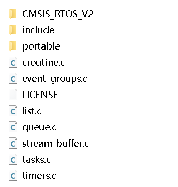

  <span style="color:#FF0000; font-weight:bold;">注意：文件夹下面的文件都是核心文件。</span>

- **(01:45 - 03:52)** **源码目录结构 (可移植层)**

  - **`portable` 目录 (01:45)：** 这是 FreeRTOS 的“可移植层”，用于存放所有<span style="color:#CC0000;">与特定 CPU 架构和编译器相关的代码</span>。
  - **为何需要 (01:49)：** 讲师解释，不同的 CPU 架构（如 ARM, RISC-V）和不同的编译器（如 MDK/RVDS, GCC）在处理任务切换、寄存器操作和汇编指令时方式都不同。`portable` 目录就是为了隔离这些差异。
  - **`port.c` 文件 (02:23)：** 打开 `port.c`，指出里面包含了与架构相关的汇编代码，这是实现任务上下文切换的关键。
  - **`MemMang` 目录 (03:18)：** 位于 `portable` 目录下，存放内存管理方案（如 `heap_1.c` 至 `heap_5.c`）。
  - **为何在此 (03:30)：** 讲师解释，内存管理策略与具体应用紧密相关，FreeRTOS 允许用户提供自己的实现（例如使用外部 RAM），因此它也被归类为“可移植”的部分。

- **(03:53 - 04:14)** **源码目录结构 (头文件)**

  - `Source/include` 目录存放所有核心组件的 API 头文件（如 `tasks.h`, `queue.h`）。

- **(04:15 - 05:10)** **配置文件 `FreeRTOSConfig.h`**

  - 演示在 CubeMX 中配置的选项（如是否使用抢占、堆大小）。
  - 这些配置最终会生成到 `Core/Inc/FreeRTOSConfig.h` 文件中。这个文件<span style="color:#CC0000;">通过宏定义来“裁剪”FreeRTOS 的功能。</span>

- **(05:11 - 06:12)** **如何开始阅读源码 (入口点)**

  - 讲师建议从“入口函数”开始阅读。
  - 在 `main.c` 中，入口点是 <span style="color:#CC0000;">`MX_FREERTOS_Init()` (05:28)，它调用 `osThreadNew` (即 `xTaskCreate`) 来创建第一个任务</span>。
  - 随后，<span style="color:#CC0000;">`main()` 函数调用 `osKernelStart()` (即 `vTaskStartScheduler`) (06:05) 来启动调度器。</span>

- **(06:13 - 11:15)** **FreeRTOS 编码规范**

  - **数据类型 (06:24)：**
    - `TickType_t`：系统节拍（Tick）的类型。视频追溯到 `portmacro.h`，显示它在 ARM Cortex-M 上是 `uint32_t`。
    - `BaseType_t` (07:31)：定义为 CPU **最高效的整数类型**。在32位CPU上是 `int32_t`，在16位CPU上是 `int16_t`。
    
  - <span style="color:#CC0000;">**变量命名 (08:03)：** 匈牙利命名法。</span>

    - `c`：char

    - `s`：short

    - `x`：`BaseType_t` 或结构体

    - `p`：指针 (pointer)

    - `u`：unsigned

      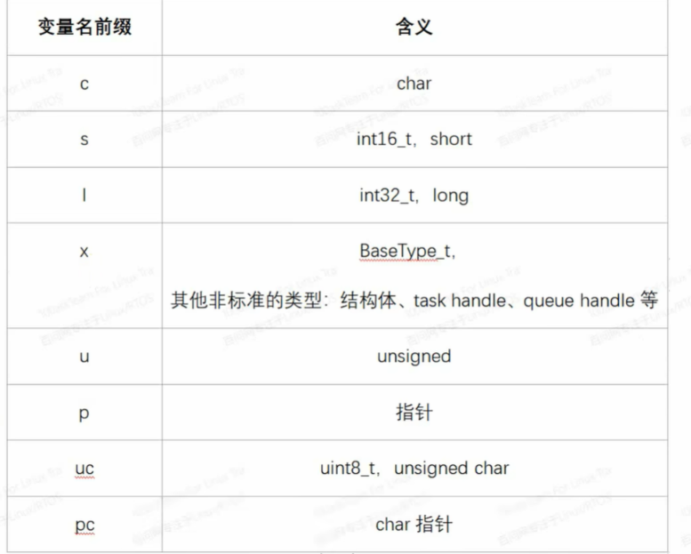

  - <span style="color:#CC0000;">**函数命名 (09:41)：**</span>
    
    - `v`：返回 `void` (例如 `vTaskPrioritySet`)
    
    - `x`：返回 `BaseType_t` (例如 `xQueueReceive`)
    
    - `prv`：私有函数 (`static`) (例如 `prvAddNewTaskToReadyList`)
    
    - 函数名中的 `task...`, `queue...` (10:15) 表示该函数定义在 `task.c` 或 `queue.c` 中。
    
      
    
  - <span style="color:#CC0000;">**宏命名 (10:33)：**</span>
    
    - `port...`：定义在 `portmacro.h` (可移植层宏)
    
    - `config...`：定义在 `FreeRTOSConfig.h` (配置宏)
    
      

- **(11:16 - 11:36)** **总结**

  - 回顾本节所讲的目录结构和编码规范，它们是阅读源码的基础。

------


# 补充提问

## 提问1


<span style="font-weight:bold; font-size:1.2em;">视频中提到的下面的核心文件都是干什么用的呢，我不是太懂，你能够给我详细解释下吗？</span>


这张图片展示的是 FreeRTOS 最核心的“心脏”部位。对于准备面试的你来说，理解这些文件的作用至关重要，因为面试官经常会问：<span style="color:#FF0000;">“FreeRTOS 的调度器在哪里实现的？”或者“信号量是在哪个文件里定义的？</span>”

为了让你彻底明白，我把这些文件分为 **“绝对核心（必须懂）”**、**“通信与同步（常用）”** 和 **“外围/辅助（了解即可）”** 三类来讲解。

------


### 第一类：绝对核心（操作系统的基石）

这<span style="color:#FF0000;">三个文件</span>是 <span style="color:#FF0000;">FreeRTOS 能跑起来的最小集</span>。没有它们，系统就瘫痪了。


#### 1. `tasks.c` (任务管理 - 大管家)

- **它是干什么的：** 这是 FreeRTOS 最重要、最复杂的文件。它负责**“决定谁来运行”**。
- **详细解释：**
  - 它实现了**调度器 (Scheduler)**。
  - 它管理任务的状态（运行、就绪、阻塞、挂起）。
  - 它负责创建任务（`xTaskCreate`）、删除任务、挂起任务。
  - 它负责在系统心跳（Tick）到来时检查是否有更高优先级的任务需要运行。
- **生活类比：**
  - 就像公司的**部门经理**。他手里拿着一张员工名单，每一分钟都抬头看看，决定下一分钟让“小张”干活还是让“小李”干活。他不仅管派活，还管招人（创建任务）和开除人（删除任务）。
- **面试考点：** 任务切换的逻辑、空闲任务（Idle Task）是谁创建的？（答案都在这里面）。


#### 2. `list.c` (链表 - 核心数据结构)

- **它是干什么的：** 它是 FreeRTOS 内部用的“记账本”。
- **详细解释：**
  - FreeRTOS 内部不使用数组来管理任务，而是用**双向链表**。
  - `tasks.c` 用它来管理“就绪列表”（Ready List）、“延时列表”（Delayed List）。
  - `queue.c` 用它来记录哪些任务在排队等待数据。
- **生活类比：**
  - 就像经理手里的**记事本**或**Excel表格**。`tasks.c` 是经理，但经理记性不好，需要把员工的名字写在纸上。`list.c` 就是那张纸的格式（比如：一行写一个名字，可以随意插入和撕掉）。
- **面试考点：** FreeRTOS 查找最高优先级任务的时间复杂度是多少？（通常是 O(1)，因为它用了特殊的位图和链表结构）。


#### 3. `queue.c` (队列 - 通信管道)

- **它是干什么的：** 它是任务之间传递数据的**唯一**原生底层机制。**注意：信号量 (Semaphore) 和互斥锁 (Mutex) 的代码也在这里！**
- **详细解释：**
  - 它实现了一个“先进先出”（FIFO）的缓冲区。
  - 任务 A 可以往里面塞数据，任务 B 可以从里面取数据。
  - **关键点：** 为什么信号量也在这里？因为在 FreeRTOS 看来，信号量就是一个“不存数据、只存计数值”的特殊队列。
- **生活类比：**
  - 就像工厂里的**传送带**。工人 A（任务 A）把零件放到传送带上，工人 B（任务 B）在末端拿走。如果传送带空了，工人 B 就睡觉（阻塞）；如果传送带满了，工人 A 就等待。
- **面试考点：** 信号量和队列有什么区别？互斥锁是在哪个文件实现的？（答：都在 `queue.c`，本质都是队列）。

------


### 第二类：通信与同步（增强功能）

这些文件提供了除了队列之外的其他沟通方式。

#### 4. `timers.c` (软件定时器)

- **它是干什么的：** 提供“闹钟”服务，不需要占用硬件定时器资源。
- **详细解释：**
  - 它允许你创建一个软件定时器，比如“5秒后执行某个函数”或者“每隔1秒执行一次”。
  - **注意：** 这些定时器的回调函数是在一个专门的“定时器服务任务”（Daemon Task）里执行的，而不是在中断里。
- **生活类比：**
  - 就像你雇了一个**专门负责看表的小秘书**。你告诉他：“5分钟后叫我”。他会自己盯着表，时间到了就拍拍你。这不需要你自己一直盯着表（节省你的精力）。


#### 5. `event_groups.c` (事件组)

- **它是干什么的：** 就像一个**多功能的红绿灯**或者**打卡表**。
- **详细解释：**
  - 队列一次只能传一个数据，但有时候我们需要等待“多个条件同时满足”。
  - 比如：任务 A 需要等待“WiFi 连接成功” **并且** “服务器连接成功” 这两个事件都发生后，才能开始工作。事件组就是用这就几个 bit 位来表示这些状态。
- **生活类比：**
  - 就像赛跑比赛的**发令员**。他手里拿着旗子（Flag）。只有当“所有运动员就位” **且** “跑道清空”时，他才挥旗子（设置事件位），比赛才开始。


#### 6. `stream_buffer.c` (流缓冲区)

- **它是干什么的：** 一种针对“一个写、一个读”场景优化的**高速**管道。
- **详细解释：**
  - 它是 FreeRTOS 比较新的功能（v10 以后引入）。
  - 比队列（Queue）更轻量级，适合传输大量的字节流（比如串口接收的一串数据）。
- **生活类比：**
  - **队列**像是一盒一盒的快递（一次传一个包）；**流缓冲区**像是一根**水管**（水流源源不断地流过去，没有明显的边界）。

------


### 第三类：外围与兼容（了解结构）

#### 7. `croutine.c` (协程 - 老古董)

- **解释：** 这是“Co-routine”（协程）的实现。
- **现状：** **你可以完全忽略它。** 这是一个非常古老的功能，用于资源极度匮乏的 8 位单片机。在 STM32 这种 32 位单片机上，几乎没人用它。现在都在用 `tasks.c`。


#### 8. `portable` (文件夹 - 移植层)

- **解释：** 就像上一节视频里讲的，这里面放的是跟**硬件芯片**（ARM M3/M4/M7）相关的代码。`tasks.c` 如果想要把 CPU 寄存器保存起来，必须调用这里的代码。


#### 9. `CMSIS_RTOS_V2` (文件夹 - 封装层)

- **解释：** 这不是 FreeRTOS 原生的东西，是 **ARM 公司**定义的一套标准接口（API）。
- **为什么会有它：** ARM 公司想：“市面上有 FreeRTOS, RTX, uCOS 这么多系统，每家的函数名都不一样，太麻烦了。” 于是 ARM 定义了一套标准函数名（如 `osThreadNew`）。
- **作用：** 这个文件夹里的代码，就是把 ARM 的标准函数名，**翻译**成 FreeRTOS 的原生函数名（把 `osThreadNew` 翻译成 `xTaskCreate`）。CubeMX 默认生成的代码经常用这套封装。

------


### 🚀 总结：一张表看懂

| **文件名**          | **角色** | **核心功能 (面试关键词)**            | **必读程度**     |
| ------------------- | -------- | ------------------------------------ | ---------------- |
| **tasks.c**         | **大脑** | 调度器、任务创建、上下文切换逻辑     | ⭐⭐⭐⭐⭐ (最高)     |
| **queue.c**         | **血管** | 队列、**信号量**、**互斥锁**         | ⭐⭐⭐⭐⭐ (最高)     |
| **list.c**          | **骨架** | 链表数据结构 (供 Task 和 Queue 使用) | ⭐⭐⭐ (懂原理即可) |
| **timers.c**        | 闹钟     | 软件定时器、Daemon 任务              | ⭐⭐⭐              |
| **event_groups.c**  | 信号旗   | 多事件同步、位操作                   | ⭐⭐               |
| **stream_buffer.c** | 水管     | 字节流传输、轻量级                   | ⭐⭐               |
| **croutine.c**      | 化石     | 协程 (现代开发基本不用)              | ❌ (不用看)       |

面试准备建议：

重点把精力放在 tasks.c (怎么调度的？) 和 queue.c (怎么通信的？) 上。这两个搞懂了，FreeRTOS 你就懂了 80%。


## 提问2

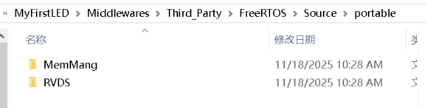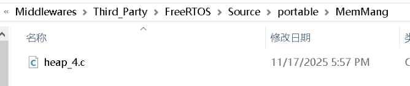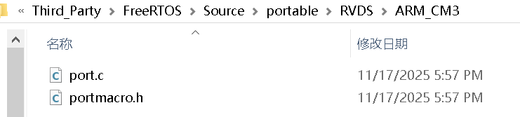


<span style="font-weight:bold; font-size:1.2em;">这里portable文件夹里面的各个文件目录里面的文件都是用来干什么用的呢，我不是太懂，你能够给我详细解释下吗，最好能够举个例子来让我彻底弄明白。</span>

这组图片展示的是 FreeRTOS **最底层、最硬核**的部分——**移植层 (Portable Layer)**。

如果说 `tasks.c` 是公司的“总经理”（负责发号施令），那么 `portable` 文件夹里的代码就是“**车间主任**”（<span style="color:#CC0000;">负责直接操作机器</span>）。

因为 FreeRTOS 要跑在成百上千种不同的芯片（STM32, ESP32, RISC-V...）和不同的编译器（Keil, IAR, GCC）上，**`Source` 目录下的通用代码（tasks.c 等）是不能包含任何特定硬件指令的**。

所有**脏活、累活、跟硬件直接打交道的活**，全都被隔离在了 `portable` 文件夹里。

我们结合你的截图，逐个击破：

------


### 1. `MemMang` 文件夹与 `heap_4.c`

**（截图 1 & 2）**

- **全称：** Memory Management（内存管理）。

- **它是干什么的：** 实现了 FreeRTOS 版本的 `malloc`（申请内存）和 `free`（释放内存）。在 FreeRTOS 里，它们叫 `pvPortMalloc` 和 `vPortFree`。

- **为什么需要它？**

  - 标准的 C 语言 `malloc` 有两个大问题：**不确定性**（不知道要执行多久）和**非线程安全**（多个任务同时调用会打架）。
  - 嵌入式系统的 RAM 资源非常宝贵，且分布不同（有的在片内，有的在外部 SDRAM）。

- **`heap_4.c` 是什么？（面试重点）**

  - FreeRTOS 提供了 5 种内存管理方案 (`heap_1` 到 `heap_5`)。
  - **`heap_4.c` 是目前最常用、最推荐的方案。**
  - **核心特点：** 它支持**内存碎片合并**。

- **举个例子（彻底弄懂）：**

  > 想象你有一条长长的**法棍面包**（总堆内存）。
  >
  > 1. 任务 A 来了，切走 10cm。
  > 2. 任务 B 来了，切走 20cm。
  > 3. 任务 A 吃完把 10cm 还回来了（Free）。
  > 4. 任务 B 吃完把 20cm 还回来了（Free）。
  >
  > 如果是笨一点的算法（比如 `heap_2`），它会把这两块当成独立的 10cm 和 20cm 放在那。如果你接下来想要一个 25cm 的面包，它会告诉你“没有”，尽管总空闲是 30cm。
  >
  > **`heap_4` 的聪明之处：** 当 B 归还面包时，它会发现旁边 A 归还的那块也是空的，于是它把这俩**重新捏合**成一整块 30cm 的面包。这样下次你要 25cm 就能满足了。

------


### 2. `RVDS` 文件夹

**（截图 2）**

- **它是干什么的：** 这个名字代表**编译器**类型。
- **详细解释：**
  - **RVDS** (RealView Debugger Suite) 其实就是 **Keil MDK** 使用的编译器底层技术。
  - 如果你用的是 GCC 编译器（比如 STM32CubeIDE），这里对应的文件夹名字就会叫 `GCC`。
  - 如果你用的是 IAR 编译器，名字叫 `IAR`。
- **为什么分这么细？** 因为不同的编译器，写**内联汇编**（在 C 代码里嵌汇编）的语法是不一样的。FreeRTOS 必须为每种编译器准备一套翻译代码。

------


### 3. `ARM_CM3` 文件夹

**（截图 3 的路径中）**

- **它是干什么的：** 这个名字代表**芯片架构**。
- **详细解释：**
  - **ARM_CM3** = ARM Cortex-M3 内核（例如 STM32F103）。
  - 如果是 STM32F4，这里可能是 `ARM_CM4F`（F代表带浮点单元）。
- **面试考点：** `portable` 的路径结构通常是 `[编译器]/[架构]`，或者是 `[架构]/[编译器]`。这体现了软件工程中的**解耦**思想。

------


### 4. `port.c` —— 真正的幕后英雄

**（截图 3）**

这是整个移植层里**最重要、最难写**的文件。

- **它是干什么的：** 它负责**上下文切换 (Context Switch)**。也就是“保存当前任务的现场，恢复下一个任务的现场”。

- **它里面有什么？**

  - **`xPortStartScheduler`：** 启动调度器，配置 SysTick 定时器（心跳）。
  - **`vPortSVCHandler`：** 启动第一个任务时调用的中断。
  - **`xPortPendSVHandler`：** （**绝对考点**）这是任务切换真正发生的地方。它全是汇编代码，负责把 R0-R15 寄存器保存到栈里。

- **举个例子（彻底弄懂）：**

  > **场景：** 你正在写作业（任务 A），突然妈妈让你去倒垃圾（任务 B）。
  >
  > **`port.c` 的工作：**
  >
  > 1. 它大喊一声“停！”（触发 PendSV 中断）。
  > 2. 它拿相机把你现在的姿势拍下来：左手拿着笔，右手按着本子，眼睛看着第3行（**保存 CPU 寄存器到任务 A 的栈**）。
  > 3. 它把你推开，把妈妈拉过来。
  > 4. 它拿出妈妈上次倒垃圾的照片，帮妈妈摆好姿势：左手提垃圾袋，右手开门（**从任务 B 的栈恢复寄存器**）。
  > 5. 大喊一声“继续！”。
  >
  > 如果没有 `port.c`，CPU 根本不知道怎么从写作业瞬间切换到倒垃圾还不出错。

------


### 5. `portmacro.h` —— 翻译字典

**（截图 3）**

- **它是干什么的：** 它是通用代码和硬件之间的“字典”。
- **详细解释：**
  - `tasks.c` 里写代码时，从来不直接写 `int` 或 `long`，而是写 `BaseType_t`。
  - 那 `BaseType_t` 到底是多少位？32位还是16位？
  - **`portmacro.h` 说了算：** 在 ARM_CM3 里，它定义 `typedef long BaseType_t;`（即32位）。
  - 它还定义了如何**开关中断** (`portENTER_CRITICAL`)，这也是跟硬件指令息息相关的。
- **作用：** 保证了上层代码（Source 目录）不需要修改哪怕一个字，就能通过更换这个头文件，适配到 8 位、16 位或 64 位的 CPU 上。

------


### 总结：一张图理解关系

当你在 `main.c` 里调用 `vTaskDelay(100)` 时，发生了什么？

1. **上层 (Source/tasks.c):** 逻辑判断，决定当前任务该睡觉了，找到下一个该运行的任务。
2. **中介 (portable/portmacro.h):** 提供数据类型定义，确保数据长度对齐。
3. **底层 (portable/RVDS/ARM_CM3/port.c):** **啪！** 触发软中断，执行汇编指令，把当前 CPU 里的数据搬运到内存（栈）里，把新任务的数据搬运进 CPU。
4. **辅助 (portable/MemMang/heap_4.c):** 如果任务需要创建，用它来从 RAM 堆里切一块蛋糕给任务做栈空间。


## 提问3

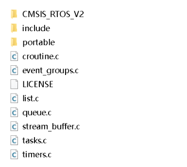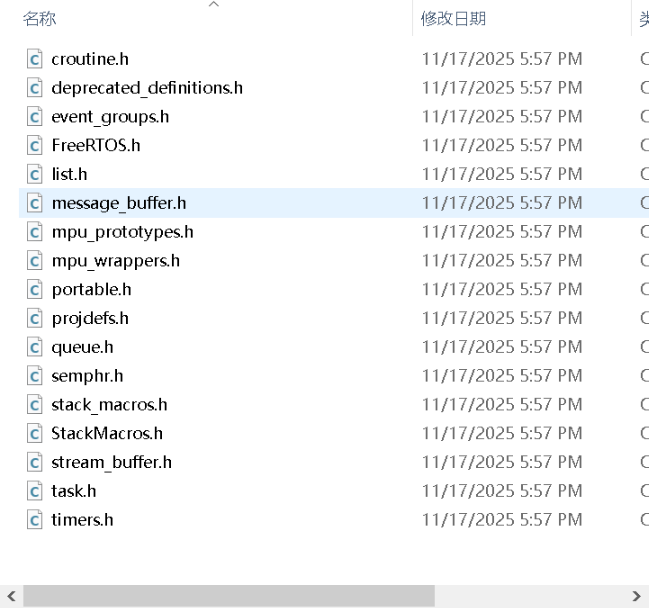

<span style="font-weight:bold; font-size:1.2em;">这个include文件夹是用来干什么用的呢，我不是太懂，你能够给我详细解释下吗？</span>


好的，我们现在来看 **`include` 文件夹**（对应你上传的截图）。

这个文件夹的作用可以用一句话概括：**它是 FreeRTOS 对外公布的“菜单”和“说明书”。**

在 C 语言项目中，`.c` 文件（源文件）是**厨房**，里面的代码负责做菜（实现功能）；而 `.h` 文件（头文件）就是**菜单**，它告诉外面的顾客（你的 `main.c` 或其他用户代码）：“我有这些菜（函数），你需要这样点（参数）”。

**`include` 文件夹里存放了 FreeRTOS 所有核心组件的 API 头文件。** 如果没有这个文件夹，你的代码就算包含了 `tasks.c`，编译器也不知道 `xTaskCreate` 是个啥，直接报错。

为了让你不仅懂，还能深刻理解，我把这些头文件分为 **“核心三巨头”**、**“常用工具”** 和 **“底层配置”** 三类来讲解。

------


### 第一类：核心三巨头（必须包含）

如果你写 FreeRTOS 程序，你的 `.c` 文件顶部 99% 会包含这几个头文件。


#### 1. `FreeRTOS.h` (总开关)

- **地位：** **老大**。
- **作用：** 它是 FreeRTOS 的总配置文件。
- **当你包含它时发生了什么：** 它会自动去寻找并包含 `FreeRTOSConfig.h`（你用 CubeMX 生成的那个配置文件），然后根据里面的宏定义，计算出系统需要多少堆栈、什么类型的数据结构等。
- **面试考点：** 它是所有 FreeRTOS 源文件必须**第一个**包含的头文件。


#### 2. `task.h` (任务菜单)

- **地位：** **调度员**。
- **作用：** <span style="color:#CC0000;">提供了操作任务的所有接口。</span>
- **常用函数：**
  - `xTaskCreate()`：创建任务。
  - `vTaskDelay()`：任务延时（睡觉）。
  - `vTaskStartScheduler()`：启动调度器。
  - `vTaskSuspend()` / `vTaskResume()`：挂起/恢复任务。


#### 3. `queue.h` (通信菜单)

- **地位：** **邮递员**。
- **作用：** <span style="color:#CC0000;">提供了队列、信号量、互斥锁的操作接口。</span>
- **常用函数：**
  - `xQueueCreate()`：创建队列。
  - `xQueueSend()` / `xQueueReceive()`：发送/接收数据。
  - `xSemaphoreTake()` / `xSemaphoreGive()`：获取/释放信号量（虽然名字叫 Semaphore，但其实定义在 queue.h 里）。

------


### 第二类：常用工具（按需点菜）

这些头文件对应我们在上一节讲过的 `.c` 文件。<span style="color:#CC0000;">你用到了什么功能，就包含什么头文件。</span>


#### 4. `timers.h` (软件定时器)

- **对应：** `timers.c`
- **作用：**<span style="color:#CC0000;"> 如果你想用软件定时器（不占硬件 Timer），就需要包含它。</span>
- **接口：** `xTimerCreate()`, `xTimerStart()`, `xTimerStop()`.


#### 5. `event_groups.h` (事件组)

- **对应：** `event_groups.c`
- **作用：** 如果你想等待多个事件位（比如“WiFi连上”且“按钮按下”），包含它。
- **接口：** `xEventGroupWaitBits()`, `xEventGroupSetBits()`.


#### 6. `semphr.h` (信号量专用)

- **这是个特例！** 并没有 `semphr.c` 文件。
- **真相：** 信号量底层是用队列 (`queue.c`) 实现的。`semphr.h` 其实就是把 `queue.h` 里的函数换了个名字（宏定义）。
  - 比如：`#define xSemaphoreCreateBinary() xQueueGenericCreate(...)`
- **为什么要有它？** 为了代码**可读性**。写 `xSemaphoreTake` 显然比写 `xQueueReceive` 更能让人明白你在用信号量。


#### 7. `stream_buffer.h` / `message_buffer.h`

- **对应：** `stream_buffer.c`
- **作用：** 用于大流量、不定长数据的传输接口。

------


### 第三类：底层与定义（幕后工作）

这些文件你通常不需要直接在你的代码里 `#include`，因为 `FreeRTOS.h` 或 `task.h` 会自动帮你包含它们。但面试官可能会问到里面的内容。


#### 8. `projdefs.h` (项目定义)

- **作用：** 定义了 FreeRTOS 通用的错误码和函数返回值。
- **比如：**
  - `pdTRUE` (1)
  - `pdFALSE` (0)
  - `pdPASS` (1)
  - `pdFAIL` (0)
  - `errQUEUE_FULL`
- **面试价值：** 知道这些宏定义在这里，你就知道为什么你的代码里可以直接写 `if (x == pdTRUE)` 了。


#### 9. `portable.h` (移植接口)

- **作用：** 它是 `Source/include` 连接 `Source/portable` 的桥梁。
- **内容：** 它声明了 `pvPortMalloc`, `vPortFree` 等与硬件相关的函数原型。


#### 10. `list.h` (链表接口)

- **作用：** 声明了链表操作函数。
- **注意：** 虽然这是内核用的，但 FreeRTOS 也允许用户代码使用这些链表函数（如果你觉得自己需要一个双向链表的话）。


#### 11. `StackMacros.h` / `mpu_wrappers.h`

- **作用：** 这些是高级功能（栈溢出检查宏、内存保护单元 MPU 包装器）。初学者一般不需要关注。

------


### 总结：面试怎么说？

如果面试官问你：“`Source/include` 文件夹里有哪些重要的文件？它们分别起什么作用？”

你可以这样**简洁有力**地回答：

> "`include` 文件夹包含了 FreeRTOS 的 API 声明和核心类型定义。
>
> 1. **`FreeRTOS.h`** 是必须包含的核心头文件，它负责引入 `FreeRTOSConfig.h` 并完成系统的预处理配置。
> 2. **`task.h`** 提供了任务创建、延时、挂起等调度器接口。
> 3. **`queue.h`** 和 **`semphr.h`** 提供了队列、信号量和互斥锁的通信接口。
> 4. 还有 **`projdefs.h`** 定义了通用的返回值（如 `pdTRUE`），以及 **`portable.h`** 声明了与移植层交互的内存管理和硬件接口。"

这样的回答既全面又有深度，展示了你对 FreeRTOS 架构的清晰理解。


## 提问3

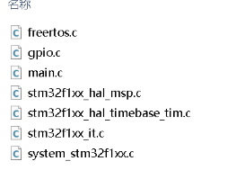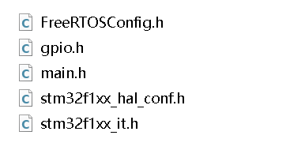

<span style="font-weight:bold; font-size:1.2em;">在core目录里面分别有Ins和Src这两个文件夹，这两个文件夹里面有两个与freeRTOS相关的文件，分别为FreeRTOSConfig.h和freertos.s，这两个文件的作用是什么呢，我不是太懂，你能够给我详细解释下吗，最好能够举个例子来让我彻底弄明白。</span>


这两个文件是 STM32CubeMX 生成的 FreeRTOS 工程中**最关键的用户层文件**。

如果把 FreeRTOS 看作一套精密的**积木玩具**：

- **`FreeRTOSConfig.h`** 是**“订货单”**（决定你要买哪些积木，不要哪些）。
- **`freertos.c`** 是**“搭建说明书”**（决定先把哪块积木搭起来，谁先运行）。

需要注意的是，你在问题中提到的是 `freertos.s`，但看截图应该是 **`freertos.c`**（`.c` 是 C 语言源文件，`.s` 通常是汇编文件）。我们以 `freertos.c` 为准进行讲解。

------


### 1. `Core/Inc/FreeRTOSConfig.h` —— 系统的“订货单”

它的身份： 配置文件（头文件）。

它的作用： 通过一系列的宏定义（#define），来裁剪和定制 FreeRTOS 的内核。

为什么需要它？

嵌入式资源（Flash 和 RAM）非常宝贵。FreeRTOS 有很多功能（比如互斥锁、软件定时器、堆栈溢出检测），如果全部开启，代码会很大，运行也会变慢。

<span style="color:#CC0000;">这个文件就是让你告诉编译器：“我只要这几个功能，其他的别编译进去！”</span>

**举个例子（面试必考）：**

假设你在 CubeMX 的配置界面里做了一些改动，这个文件就会发生变化：

- **例子 A：抢占模式 (Preemption)**

  - **你的需求：** 你想要高优先级的任务能打断低优先级任务。

  - **文件中的代码：**

    C

    ```c
    #define configUSE_PREEMPTION  1  // 1=开启抢占，0=合作式调度
    ```

  - **后果：** 如果你改成 0，整个系统就变成“轮流发言”模式，高优先级任务必须等低优先级任务主动让出 CPU 才能运行。

- **例子 B：堆大小 (Heap Size)**

  - **你的需求：** 你的芯片 RAM 很大，你想多创建几个任务。

  - **文件中的代码：**

    C

    ```c
    #define configTOTAL_HEAP_SIZE  ((size_t)3072) // 定义堆内存为 3KB
    ```

  - **后果：** FreeRTOS 会在系统启动时，圈出一块 3072 字节的内存专门给自己用。如果你创建的任务太多，超过了这个数，程序就会报错（返回 NULL）。

- **例子 C：心跳频率 (Tick Rate)**

  - **文件中的代码：**

    C

    ```c
    #define configTICK_RATE_HZ   ((TickType_t)1000) // 1ms 一次心跳
    ```

  - **后果：** 系统每 1ms 醒来一次检查任务状态。如果你把它改成 100，系统就 10ms 才醒一次，CPU 负担轻了，但定时的精度就变差了。

------


### 2. `Core/Src/freertos.c` —— 系统的“搭建说明书”

它的身份： 应用层接口文件（源文件）。

它的作用： 它是 CubeMX 帮你生成的初始化代码合集。它负责在系统正式运行前，把你在 CubeMX 图形界面里添加的任务、队列、信号量真正地创建出来。

**它里面有什么？**

1. MX_FREERTOS_Init() 函数：

   这是这个文件的核心。main.c 会调用这个函数。

   - 它不负责启动调度器（调度器在 `main` 函数最后启动）。

   - 它负责**<span style="color:#CC0000;">Create（创建）</span>**。

     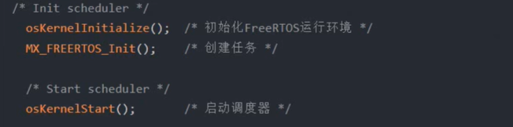

2. 任务函数的实体：

   如果你在 CubeMX 里添加了一个叫 MyTask 的任务，CubeMX 会在这里自动生成一个 void StartMyTask(void *argument) 的空函数，让你在里面写代码。

**举个例子（彻底明白流程）：**

假设你在 CubeMX 里添加了一个任务，名字叫 `LedBlinkTask`，优先级为 `Normal`。

**在 `freertos.c` 中，你会看到这样的代码逻辑：**

C

```c
/* 1. 定义任务句柄（相当于任务的身份证） */
osThreadId_t LedBlinkTaskHandle;

/* 2. 定义任务属性（名字、栈大小、优先级） */
const osThreadAttr_t LedBlinkTask_attributes = {
  .name = "LedBlinkTask",
  .stack_size = 128 * 4,
  .priority = (osPriority_t) osPriorityNormal,
};

/* 3. 初始化函数（main.c 会调用它） */
void MX_FREERTOS_Init(void) {
  /* 这里真正创建任务！告诉系统：有一个任务，入口函数是 StartLedBlinkTask */
  LedBlinkTaskHandle = osThreadNew(StartLedBlinkTask, NULL, &LedBlinkTask_attributes);
}

/* 4. 任务的具体干活代码（你需要在这里写逻辑） */
void StartLedBlinkTask(void *argument)
{
  for(;;)
  {
    HAL_GPIO_TogglePin(GPIOA, GPIO_PIN_5); // 闪灯
    osDelay(1000); // 休息 1秒
  }
}
```

**注意：** 这里使用了 `osThreadNew` 这种以 `os` 开头的函数，这是 **CMSIS-RTOS V2** 接口（ARM 定义的标准接口），它底层其实还是调用了 FreeRTOS 原生的 `xTaskCreate`。CubeMX 默认喜欢用这套封装层。

------


### 总结与面试话术

如果面试官问你：“**STM32CubeMX 生成的 FreeRTOS 工程中，`FreeRTOSConfig.h` 和 `freertos.c` 分别是干嘛的？**”

你可以这样回答：

> "**`FreeRTOSConfig.h` 是<span style="color:#CC0000;">用来裁剪内核</span>的**。它<span style="color:#CC0000;">通过宏定义来配置系统的核心参数</span>，比如<span style="color:#CC0000;">是否开启抢占、堆内存大小、系统时钟节拍率</span>等。它决定了 FreeRTOS 编译后的功能集。
>
> **`freertos.c` 是用<span style="color:#CC0000;">来初始化应用资源</span>的**。它包<span style="color:#CC0000;">含了 `MX_FREERTOS_Init` 函数，负责在调度器启动前，根据我在 CubeMX 中的配置，创建具体的任务、队列、信号量等对象</span>。同时，如果我使用了 CMSIS-RTOS 接口，生成的任务入口函数代码通常也放在这个文件里。"

这样回答，逻辑清晰，直击重点！


## 提问4

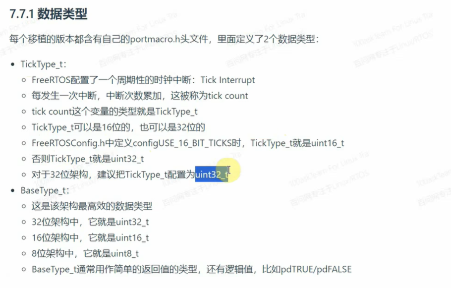

<span style="font-weight:bold; font-size:1.2em;">这个 TickType_t 和 BaseType_t 是用来干什么的呢，我在哪里可以找到它的定义呢。</span>


这两个类型是 FreeRTOS 实现“**可移植性**”和“**高效性**”的基石。

在嵌入式面试中，如果你能解释清楚这两个类型，面试官会认为你懂底层，而不仅仅是会调库。

------


### 1. `TickType_t`：系统的“时间刻度”

#### 它是干什么的？

它是用来记录时间的变量类型。

<span style="color:#CC0000;">FreeRTOS 有一个系统心跳（Tick），每过 1ms（假设配置为 1000Hz），系统就会产生一个中断，让一个全局变量 xTickCount 加 1。TickType_t 就是这个 xTickCount 的数据类型。</span>


#### 为什么要专门定义它？

因为不同的项目对“能运行多久”的要求不一样，对 RAM 的节省程度也不一样。

- **16位模式 (`uint16_t`)：**
  - **最大值：** 65,535。
  - **能记多久？** 如果 1ms 一次心跳，大概 **65秒** 就会溢出（归零）。
  - **场景：** 极度缺 RAM 的 8 位或 16 位单片机。
- **32位模式 (`uint32_t`)：**
  - **最大值：** 4,294,967,295。
  - **能记多久？** 如果 1ms 一次心跳，大概 **49.7 天** 才会溢出。
  - **场景：** STM32、ESP32 等 32 位单片机（绝大多数情况都选这个）。


#### 怎么配置？

在 `FreeRTOSConfig.h` 中：

- `#define configUSE_16_BIT_TICKS 1`  ->  它是 16 位。
- `#define configUSE_16_BIT_TICKS 0`  ->  它是 32 位（**STM32 默认选这个**）。

------


### 2. `BaseType_t`：CPU 的“本命类型”

#### 它是干什么的？

它是当前 CPU 处理起来最快、最高效的数据类型。

它通常被用作函数的返回值（比如 pdTRUE / pdFALSE）、循环计数器、或者任务状态字。


#### 为什么要专门定义它？

为了**效率**和**兼容性**。

- **在 32 位 CPU (如 STM32) 上：**
  - CPU 的寄存器、数据总线都是 32 位的。
  - 处理一个 `int32_t` 只需要 1 条指令。
  - 如果你非要用 `int8_t`（char），CPU 读出来后可能还需要额外的指令去“清除高位”或“符号扩展”，反而变慢了。
  - **所以：** 在 STM32 上，`BaseType_t` 就是 `long` (32位)。
- **在 8 位 CPU (如 Arduino/AVR) 上：**
  - CPU 处理 8 位数据最快。处理 32 位数据需要把它拆成 4 次 8 位操作，慢得要死。
  - **所以：** 在 AVR 上，`BaseType_t` 就是 `char` (8位)。

**结论：** FreeRTOS 内核里大量使用 `BaseType_t`，保证了同一套代码，在 32 位机上跑得快，在 8 位机上也跑得快。

------


### 3. 我在哪里可以找到它们的定义？

这是面试官可能会让你现场找文件的问题。

它们的定义都在 portmacro.h 文件里。

但是！portmacro.h 不只一个。

因为这两个类型跟硬件紧密相关，所以它们位于 **`portable` (移植)** 目录下。

路径逻辑（以 STM32F103 + Keil 为例）：

FreeRTOS -> Source -> portable -> RVDS (编译器) -> ARM_CM3 (架构) -> portmacro.h

**打开 `portmacro.h`，你会看到类似这样的代码：**

C

```c
/* 针对 32 位 ARM Cortex-M3 的定义 */

/* BaseType_t 定义为 long，因为 ARM 是 32 位的 */
typedef long BaseType_t;
typedef unsigned long UBaseType_t;

/* TickType_t 的定义，依赖于用户配置 */
#if( configUSE_16_BIT_TICKS == 1 )
    typedef uint16_t TickType_t;
    #define portMAX_DELAY ( TickType_t ) 0xffff
#else
    typedef uint32_t TickType_t;
    #define portMAX_DELAY ( TickType_t ) 0xffffffffUL
#endif
```


### 🚀 总结一下（面试小抄）

- **TickType_t**：
  - **作用**：记录系统运行了多少个 tick。
  - **关注点**：由 `configUSE_16_BIT_TICKS` 决定。STM32 上通常是 32 位，防止快速溢出（大约 50 天溢出一次）。
- **BaseType_t**：
  - **作用**：CPU 的“自然字长”，处理最快的数据类型。
  - **关注点**：STM32 上是 32 位，8 位机上是 8 位。用于布尔返回值 (`pdTRUE`) 和通用逻辑计算。
- **定义位置**：`portable/.../portmacro.h`，因为它们是硬件相关的。


## 提问 4 - （1）

为什么要专门定义它？

因为不同的项目对“能运行多久”的要求不一样，对 RAM 的节省程度也不一样。

16位模式 (uint16_t)：

最大值： 65,535。

能记多久？ 如果 1ms 一次心跳，大概 65秒 就会溢出（归零）。

场景： 极度缺 RAM 的 8 位或 16 位单片机。

32位模式 (uint32_t)：

最大值： 4,294,967,295。

能记多久？ 如果 1ms 一次心跳，大概 49.7 天 才会溢出。

场景： STM32、ESP32 等 32 位单片机（绝大多数情况都选这个）。

<span style="font-weight:bold; font-size:1.2em;">这里为什么要专门定义它我还是不太懂，你能够再给我详细解释下吗，你这里指出的场景是什么意思呢？ </span>


这是一个关于**“软件架构设计”**和**“硬件资源限制”**之间平衡的绝佳问题。

之所以让你感到困惑，是因为在 STM32（32位处理器）这种资源相对丰富的环境里，你几乎感觉不到这两者的区别。

为了让你彻底明白“为什么要专门定义一个 `TickType_t`，而不是直接写死 `uint32_t`”，我们需要把视角切换到两种极端的环境里。

我们可以把 `TickType_t` 看作是一个 **“别名”** 或者 **“占位符”**。

------


### 核心原因一：为了让同一套代码能跑在“贫民窟”也能跑在“大别墅”

<span style="color:#CC0000;">FreeRTOS 是一个通用的操作系统，它的目标是兼容市面上几乎所有的芯片。</span>


#### 场景 A：8位单片机（比如 Arduino UNO 用的 AVR 芯片，或者老式的 8051）—— 这里的环境是“贫民窟”

- **现状：**

  - **内存 (RAM)**：可能只有 **1KB** (1024字节)。
  - **CPU 能力**：它是 8 位的，一次只能搬运 8 位数据。

- **如果不定义 `TickType_t`，直接用 32 位 (`uint32_t`) 会发生什么？**

  1. **内存浪费**：定义一个 32 位变量需要 4 个字节。在 1KB 的内存里，每一字节都像金子一样珍贵。如果你有很多任务，每个任务都有自己的延时变量，这会浪费大量内存。
  2. **CPU 累死**：让一个 8 位的 CPU 去处理 32 位的加法（Tick++），它需要做 **4次** 8位加法，还需要处理进位。这就像让一个小孩子去搬原本需要成年人搬的砖头，效率极低，系统变慢。

- 解决方案：

  在这种场景下，开发者在配置文件里把 TickType_t 定义为 uint16_t。FreeRTOS 内核的所有计时变量瞬间变小，运算变快，完美适配“贫民窟”。


#### 场景 B：32位单片机（比如你的 STM32）—— 这里的环境是“大别墅”

- **现状：**
  - **内存 (RAM)**：几十 KB 到几百 KB，甚至几 MB。
  - **CPU 能力**：32 位的，一次就能搬运 32 位数据。
- **为什么选 32 位？**
  - 因为 CPU 本身就是 32 位的，处理 32 位数字和处理 16 位数字花费的时间是一样的（甚至处理 32 位更快，因为不需要额外的对齐操作）。
  - 既然不缺内存，也不缺速度，当然选个大的（32位），这样能记录的时间更长（49天），不用担心溢出。

------


### 核心原因二：为了“一键切换”的便携性

假设 FreeRTOS 的源码里没有 `TickType_t`，作者直接在代码里写了 `uint32_t`。

**代码可能是这样的（错误示范）：**

C

```c
// tasks.c
void vTaskDelay( uint32_t xTicksToDelay ) { ... }
uint32_t xTickCount = 0;
```

现在，你突然要把这套代码移植到一个极度缺内存的 8 位机上。

你会面临一场灾难：

你需要打开几万行代码的 FreeRTOS 源码，手动把成百上千个 uint32_t 查找替换成 uint16_t。这不仅工作量巨大，而且非常容易改错（有些 uint32_t 是真的需要 32 位，不能改）。

使用了 TickType_t 之后（正确做法）：

代码是这样的：

C

```c
// tasks.c
void vTaskDelay( TickType_t xTicksToDelay ) { ... }
TickType_t xTickCount = 0;
```

你只需要做一个动作：

打开 FreeRTOSConfig.h，修改一行宏定义：

- 想用 16 位？ `#define configUSE_16_BIT_TICKS 1`
- 想用 32 位？ `#define configUSE_16_BIT_TICKS 0`

编译器会自动把代码里所有的 `TickType_t` 替换成你想要的类型。**这就是“专门定义它”的核心价值——解耦（把策略和实现分开）。**

------


### 关于“溢出”和“场景”的详细解释

你可能对那个“65秒”和“49天”还有疑问。


#### 1. 16位模式 (65秒就溢出) —— 真的够用吗？

**场景：** 简单的传感器节点。

- 这种设备通常处于睡眠模式，醒来后采集个温度，发出去，然后继续睡。
- 或者它的任务很简单，从来不需要延时超过 1 分钟。
- 如果真的需要长时间计时，程序员会自己写个计数器来计算“溢出了多少次”，而不是依赖 OS 的 Tick。
- **重点：** 对于很多简单的嵌入式设备，系统连续全速运行 1 分钟以上的情况其实并不多。


#### 2. 32位模式 (49.7天溢出) —— STM32 为什么要选这个？

**场景：** 智能家居网关、工业控制器、机器人。

- 这些设备可能几个月都不关机。
- 如果用 16 位，每分钟 tick 归零一次，你的程序逻辑处理起来会非常麻烦（需要不断判断时间是不是这就回绕了）。
- 用 32 位，大概 50 天才回绕一次。而且 FreeRTOS 内部有处理溢出的机制（`xTaskCheckForTimeOut`），加上 50 天的缓冲期，让写代码变得非常轻松。


### 总结（面试满分回答）

如果面试官问：“为什么 FreeRTOS 要专门定义 `TickType_t`？”

**你可以这样回答：**

> “这主要是为了**<span style="color:#CC0000;">可移植性</span>**和**<span style="color:#CC0000;">适应不同的硬件资源</span>**。
>
> 1. **适配不同架构**：在 8 位或 16 位这种资源受限的单片机上，使用 16 位的 `TickType_t` 可以节省 RAM 并提高 CPU 运算效率；而在 STM32 这种 32 位 MCU 上，使用 32 位则是为了配合 CPU 原生字长，获得最佳性能。
> 2. **代码解耦**：通过定义 `TickType_t`，FreeRTOS 允许用户仅通过修改配置文件 (`FreeRTOSConfig.h`) 就能改变整个内核的时间数据类型，而不需要修改内核源码，极大地简化了移植工作。”


## 提问5

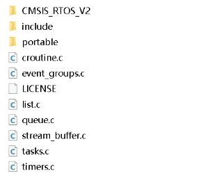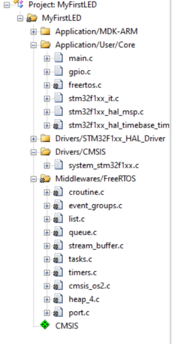

<span style="font-weight:bold; font-size:1.2em;">我有个问题，keil打开的工程的项目的目录结构和我的文件夹这里的目录结构好像有点区别，为什么会这样呢，我感觉有点困惑，你能够给我详细解释下吗。</span>


这是一个非常经典的问题，几乎所有刚开始使用 IDE（如 Keil, IAR, Eclipse）开发的工程师都会产生这个疑惑。

简单来说：**文件夹里的结构是“物理真实”，而 Keil 里的结构是“逻辑列表”。**

为了让你彻底明白，我用一个生活中的例子来打比方：**“电脑里的音乐库” vs “播放器里的歌单”**。

------


### 1. 文件夹目录 (图2) = 电脑硬盘里的“音乐库”

- **是什么：** 这是**物理存储**。文件实实在在地存放在这里。
- **特点：**
  - 这里存放了**所有**的东西：不仅有源代码（`.c`），还有头文件（`.h`）、说明书（`LICENSE`, `readme.txt`）、甚至有你不需要用的备选文件。
  - 结构是**层级化**的：文件夹套文件夹（比如 `portable` 里面还有 `MemMang`，里面还有 `heap_4.c`）。
  - **比如：** 你的 FreeRTOS 源码里其实有 `heap_1.c`, `heap_2.c` ... 一直到 `heap_5.c`，它们都在硬盘上躺着。


### 2. Keil 工程目录 (图1) = 播放器里的“自定义歌单”

- **是什么：** 这是**逻辑引用**。这只是一个“列表”，告诉编译器需要编译哪些文件。
- **特点：**
  - **分组是虚拟的：**<span style="color:#CC0000;"> Keil 左侧黄色的文件夹图标</span>（如 `Application/User/Core` 或 `Middlewares/FreeRTOS`），是 CubeMX 或者你自己为了分类方便而创建的<span style="color:#CC0000;">“虚拟组”</span>。它们在硬盘上**根本不存在**。
  - **只选需要的：**<span style="color:#CC0000;"> 这里**只包含**你需要编译的文件</span>。
  - **结构被“拍扁”了：** 无论文件在硬盘藏得有多深，在 Keil 里你可以把它直接拖到一个组里，看起来它们都在同一层。

------


### 💥 结合你的截图来实战分析


请仔细看你提供的两张图，我们来找茬：


#### 差异点 1：消失的 `portable` 文件夹

- **在文件夹里 (图2)：** 有一个 `portable` 文件夹，点进去还有 `MemMang`，再点进去才有 `heap_4.c`。路径很深。

- **在 Keil 里 (图1)：** 你看 `Middlewares/FreeRTOS` 组下面，直接就列出了 `heap_4.c` 和 `port.c`。

- 为什么？

  Keil 把深层路径的文件“提取”出来了。这就像你把深藏在硬盘某个角落的一首歌，拉到了桌面的播放列表里。这样做是为了方便你点击阅读代码，也是为了告诉编译器：“去那个深坑里把这个文件找出来编译了”。


#### 差异点 2：消失的兄弟姐妹 (关键面试点！)

- **在文件夹里：** `portable/MemMang` 下面其实有 `heap_1.c`, `heap_2.c` ... `heap_5.c` 五个文件。

- **在 Keil 里：** 只有 `heap_4.c`。

- 为什么？

  这是最重要的一点！C 语言项目中，如果把 heap_1.c 和 heap_4.c 同时加入 Keil 工程编译，编译器会报错：“重复定义函数 pvPortMalloc”。

  因为我们只需要一种内存管理方案，所以 CubeMX 帮你在 Keil 的“歌单”里只添加了 heap_4.c，而把其他 4 个留在了硬盘上但不去编译它们。


#### 差异点 3：`.h` 头文件去哪了？

- **在文件夹里 (图2)：** 有 `include` 文件夹，里面有很多 `.h` 文件。

- **在 Keil 里 (图1)：** 这一列全是 `.c` 文件，基本看不到 `.h` 文件。

- 为什么？

  <span style="color:#CC0000;">在 Keil（以及大多数 C 编译器）中，.c 文件是编译单元，必须添加到项目树里。而 .h 文件是通过代码里的 #include "tasks.h" 来引用的。只要你在 Keil 的 "C/C++ Include Paths" 设置里告诉了它头文件在哪里，它自己会去找，不需要显式地挂在项目树上（虽然挂上去方便打开查看，但不是编译必须的）。</span>

------


### 总结

- **文件夹视图**：是**仓库**。里面存着所有的零件，乱七八糟，什么都有。
- **Keil 视图**：是**装配清单**。我只从仓库里拿我需要的零件（比如只要 `heap_4.c`），并把它们按照我的习惯分好类（比如叫 `Middlewares` 组），方便干活。

💡 一个实用小技巧：

如果你在 Keil 里看到一个文件，想知道它在硬盘的哪个位置：

1. 在 Keil 左侧列表里，**右键点击**那个文件（比如 `tasks.c`）。
2. 选择 **"Open Container Folder"** (打开所在的文件夹)。
3. Windows 就会弹出来，带你到它真实的“家”。


## 提问6（变量命名举例 - 重点）


<span style="font-weight:bold; font-size:1.2em;">上面变量名你能够给我举些例子来让我彻底弄明白吗，我感觉不是特别直观。</span>

这张图展示的是 FreeRTOS 特有的**命名规范**（基于匈牙利命名法）。

它的核心逻辑是：**“<span style="color:#CC0000;">看到变量名，就立刻知道它的类型，甚至不需要去翻定义。</span>”** 这在嵌入式这种对内存和位宽非常敏感的开发中非常有用。

虽然表格看着干巴巴的，但我们只要把它们像“积木”一样组合起来，你就瞬间懂了。

我把它们分为 **“基础积木”**、**“核心积木(x)”** 和 **“组合技”** 三部分来举例。

------


### 1. 基础积木 (c, s, l)

这些是最简单的 C 语言标准类型。

- **`c` (char)**：字符型（通常 8 位）。
  - **例子**：`cMyChar`
  - **含义**：<span style="color:#CC0000;">这是一个字符变量。</span>
- **`s` (short)**：短整型（通常 16 位）。
  - **例子**：`sSensorValue`
  - **含义**：<span style="color:#CC0000;">这是一个 16 位的传感器数值。</span>
- **`l` (long)**：长整型（通常 32 位）。
  - **例子**：`lErrorCode`
  - **含义**：<span style="color:#CC0000;">这是一个 32 位的错误码。</span>

------


### 2. 核心积木：<span style="color:#CC0000;">最特殊的 `x` (BaseType_t)</span>

<span style="color:#CC0000;">这是 FreeRTOS 最标志性的前缀。你在源码里会看到满屏幕的 `x`。</span>

- **`x` (BaseType_t)**：
  - **定义**：它代表 CPU **最高效**的数据类型（STM32 上是 32 位，AVR 上是 8 位）。
  - **扩展**：FreeRTOS 也用它来表示**结构体对象**、**句柄 (Handle)** 或者**枚举**。
  - **例子 1**：`xTicksToWait`
    - **解读**：<span style="color:#CC0000;">这是一个 `BaseType_t` 类型的变量，用来存等待的时间。</span>
  - **例子 2**：`xTaskHandle`
    - **解读**：<span style="color:#CC0000;">这是一个非标准类型（句柄），代表一个任务的身份证。</span>
  - **例子 3（函数返回值）**：`xTaskCreate(...)`
    - **解读**：<span style="color:#CC0000;">这个函数名前面有个 `x`，说明它返回一个 `BaseType_t` 类型的值（通常是 `pdPASS` 或 `pdFAIL`）。</span>

------


### 3. 修饰积木：`u` (Unsigned) 和 `p` (Pointer)

<span style="color:#CC0000;">这两个通常不单独使用，而是跟别的积木**拼在一起**。</span>

- **`u` (Unsigned)**：无符号（非负数）。
- **`p` (Pointer)**：指针。

------


### 4. “组合技”：彻底看懂源码 (重点！)

FreeRTOS 的源码里，<span style="color:#CC0000;">90% 的变量名都是下面这些**组合**</span>。请仔细看这些例子，它们能让你“开天眼”：


#### 组合 A：`u` + `c` = `uc` (Unsigned Char) -> 字节

- **例子**：`ucPriority`
- **拆解**：`u`(无符号) + `c`(Char)
- **人话**：<span style="color:#CC0000;">这是一个 `uint8_t` 类型的变量。</span>
- **场景**：<span style="color:#CC0000;">任务优先级通常范围很小（0-31），用 8 位（byte）就够了，所以叫 `ucPriority`。</span>


#### 组合 B：`p` + `c` = `pc` (Pointer to Char) -> 字符串

- **例子**：`pcTaskName`
- **拆解**：`p`(指针) + `c`(Char)
- **人话**：<span style="color:#CC0000;">指向字符的指针（也就是**字符串**）。</span>
- **场景**：<span style="color:#CC0000;">给任务起名字，比如 "LED_Task"。</span>


#### 组合 C：`u` + `x` = `ux` (Unsigned BaseType) -> 最常用的计数器

- **例子**：`uxQueueLength`
- **拆解**：`u`(无符号) + `x`(`BaseType`)
- **人话**：<span style="color:#CC0000;">这是一个无符号的、CPU 处理最快的数据类型（STM32 上是 `uint32_t`）</span>。
- **场景**：<span style="color:#CC0000;">队列的长度肯定不能是负数，且需要高效处理，所以用 `ux`。</span>


#### 组合 D：`p` + `x` = `px` (Pointer to BaseType/Struct) -> 指向结构体的指针

- **例子**：`pxTCB`
- **拆解**：`p`(指针) + `x`(结构体/BaseType)
- **人话**：<span style="color:#CC0000;">这是一个指向 TCB（任务控制块结构体）的指针。</span>
- **实战价值**：<span style="color:#CC0000;">看到 `px` 开头，你就知道如果要访问里面的成员，必须用箭头 `->`，而不是点 `.`。</span>

------


### 5. 终极实战：读懂函数声明

我们<span style="color:#CC0000;">拿 `task.h` 里最著名的创建任务函数</span>来举例，看看能不能通过名字猜出参数类型：

C

```c
BaseType_t xTaskCreate(
    TaskFunction_t pvTaskCode,    // 1. pv
    const char * const pcName,    // 2. pc
    const uint16_t usStackDepth,  // 3. us
    void * const pvParameters,    // 4. pv
    UBaseType_t uxPriority,       // 5. ux
    TaskHandle_t * const pxCreatedTask // 6. px
);
```

**解码过程：**

1. **`xTaskCreate`**：`x` 开头 -> 这个函数返回 `BaseType_t` (成功/失败)。
2. **`pvTaskCode`**：`p` (指针) + `v` (void) -> 这是一个函数指针（FreeRTOS 习惯把函数指针也归为 void 指针或通用指针）。
3. **`pcName`**：`p` + `c` -> 字符串（任务名字）。
4. **`usStackDepth`**：`u` (无符号) + `s` (short) -> `uint16_t`。栈深度用 16 位表示。
5. **`pvParameters`**：`p` + `v` -> `void *` 指针。可以传递任何类型的参数。
6. **`uxPriority`**：`u` + `x` -> `UBaseType_t`（无符号基础类型）。优先级。
7. **`pxCreatedTask`**：`p` + `x` -> 指向 Handle（结构体）的指针。用来回传任务句柄。


### 总结

- **`c`, `s`, `l`**：对应<span style="color:#CC0000;"> C 语言标准类型的首字母。</span>
- **`x`**：FreeRTOS 的“本命”类型（BaseType 或 Struct），<span style="color:#CC0000;">32位机上就是 32 位。</span>
- **`u`**：无符号。
- **`p`**：指针。
- **看到组合词（如 `px`, `ux`, `pc`）不要慌，把它拆开读，意思立刻就出来了。**


## 提问 6 - （1）


<span style="font-weight:bold; font-size:1.2em;">这里x可以指其他非标准的类型：结构体、task handle、queue handle等，这里是什么意思呢，在stm32中当一个结构体前面带上x就是说明这个结构体的长度是32位吗，我不是太懂，你能够给我详细解释下吗，最好能够举个例子来让我彻底弄明白。</span>


这是一个非常关键的误解，必须纠正。

直接回答你：**不，结构体名字前面带 `x`，绝不代表这个结构体的大小是 32 位的。**

在 FreeRTOS 的命名规范里，<span style="color:#CC0000;">`x` 的含义其实有点像数学里的 $x$，代表**“未知数”**或者**“非标准类型”**。它是一个**万能前缀**。</span>

为了让你彻底弄明白，我们需要把 `x` 所有的用法拆解开来看。

------


### 1. 核心误解：`x` vs 大小

- **你的理解**：“`x` 代表它是 32 位的。” —— **❌ 错误**。
- **正确理解**：“`x` 代表它是一个**特殊的、FreeRTOS 定义的复杂类型**（比如结构体、枚举、或者 typedef 过的类型）。”

**举个极端的例子：**

假设我们在 FreeRTOS 里定义了一个巨大的结构体：

C

```c
typedef struct {
    char cBuffer[1000]; // 1000 个字节的数组
    int iCount;
} BigStruct_t;

// 根据规范，变量名可能会这样写：
BigStruct_t xMyBigData; 
```

在这个例子中：

1. 变量名叫 `xMyBigData`，前缀是 `x`。
2. 但是这个变量的大小至少有 **1004 个字节**！远远超过 32 位（4字节）。

**结论：** `x` 只是告诉程序员“嘿，这是一个复杂的自定义类型对象”，而不是告诉你它占多少内存。

------


### 2.<span style="color:#CC0000;"> 为什么会有这个误解？（因为 BaseType_t）</span>

之所以你会觉得 `x` 是 32 位的，是因为在 STM32 (32位单片机) 上，FreeRTOS 中出现频率最高的 `x` 类型的变量是 **`BaseType_t`**。

- **`BaseType_t`**：在 STM32 上被定义为 `long` (32位)。
- 所以当你看到 `BaseType_t xReturn;` 时，这个 `xReturn` 确实是 32 位的。

但这只是巧合，因为它是 `BaseType_t`。<span style="color:#CC0000;">如果 `x` 后面跟的是结构体，那就不是 32 位了。</span>

------


### 3. <span style="color:#CC0000;">`x` 的三种真实身份（举例说明）</span>

FreeRTOS 用 `x` 前缀主要涵盖以下三种情况，我们逐一举例：


#### 身份 A：BaseType_t (最高效的基础类型)

这是最常见的用法。

- **代码**：`BaseType_t xResult;`
- **含义**：<span style="color:#CC0000;">这是一个基础整数。</span>
- **大小**：<span style="color:#CC0000;">在 STM32 上是 **32位** (4字节)。</span>


#### 身份 B：结构体 (Struct)

这是你困惑的地方。

- **代码**：

  C

  ```c
  // 定义一个包含很多信息的列表项结构体
  ListItem_t xListEnd; 
  ```

- **含义**：<span style="color:#CC0000;">这是一个结构体**对象**（实体）。</span>

- **大小**：<span style="color:#CC0000;">`ListItem_t` 结构体里包含好几个指针和变量，它的大小可能是 **20 字节**或者更多。</span>

- **为什么用 x？**<span style="color:#CC0000;"> 因为它不是标准的 C 语言类型（不是 char, short, int），它是 FreeRTOS 自定义的复杂类型，所以用 `x` 标记。</span>


#### 身份 C：句柄 (Handle)

这是最“抽象”的用法。

- **代码**：`TaskHandle_t xLedTaskHandle;`
- **含义**：这是一个**句柄**（任务的身份证）。
- **本质**：在 C 语言底层，Handle 其实就是**指针** (`void *` 或结构体指针)。
- **大小**：<span style="color:#CC0000;">在 STM32 上，凡是指针永远是 **32位** (4字节)。</span>
- **为什么用 x 而不是 p？**
  - 如果用 `p`，意味着你可以对它进行 `*p` 取值操作。
  - 但 FreeRTOS 把它是作为“黑盒”给你的。官方希望你把它看作一个“对象”或“令牌”，而不是一个普通的指针，所以用 `x` 来表示它是一个特殊的 handle 类型。

------


### 4. 总结：一图看懂

| **变量名**    | **类型**                | **STM32上实际大小** | **x 的含义**         |
| ------------- | ----------------------- | ------------------- | -------------------- |
| `xTicks`      | `TickType_t` (uint32_t) | 4 字节 (32位)       | 自定义基础类型       |
| `xTaskHandle` | `TaskHandle_t` (指针)   | 4 字节 (32位)       | 句柄 (特殊对象)      |
| **`xList`**   | **`List_t` (结构体)**   | **约 20~40 字节**   | **自定义结构体对象** |

**面试/开发 避坑指南：**

当你看到代码里有一个变量以 `x` 开头（例如 `xQueue`），**千万不要默认它是一个整数**。

1. 它可能是一个**函数返回值**（状态码，32位整数）。
2. 它可能是一个**结构体实体**（占用很大一块内存）。
3. 它可能是一个**句柄**（本质是指针）。

怎么区分？

看它的类型定义。

- 如果是 `BaseType_t` -> 它是整数。
- 如果是 `...Handle_t` -> 它是句柄（指针）。
- 如果是 `..._t` (且没有 Handle 字样) -> 它通常是一个大的结构体。


## 提问7（函数命名）

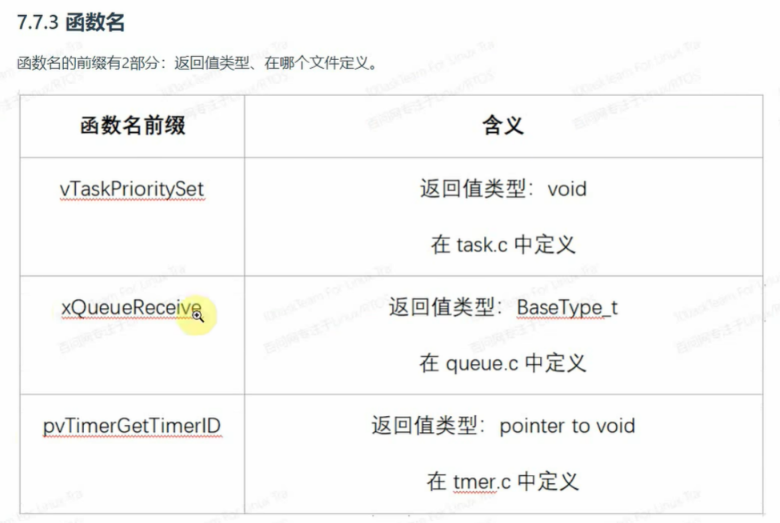

<span style="color:#CC0000; font-size:1.2em;">这里函数名给我解释下，并且给我举个例子来让我彻底弄明白。尤其是x好像也是可以指返回的是一个结构体吧，还有这里好像还有个prv私有函数好像是static函数，这个又是什么呢，给我解释下。</span>

这张图揭示了 FreeRTOS 函数命名的**核心密码**。一旦你掌握了这个规律，你甚至不用看文档，光看函数名就能猜出它的**返回值类型**和**它在哪个文件里定义的**。

针对你的疑问，特别是关于 `x` 和 `prv`，我们来深度拆解一下。

------


### 1. 函数名的通用公式

FreeRTOS 的函数名可以拆解为三部分：

> <span style="color:#CC0000;">**前缀 (返回值类型)** + **文件名/所属组件** + **具体功能**</span>

我们拿图中的 `vTaskPrioritySet` 来举例：

- **`v` (前缀)**：表示返回值是 **`void`** (无返回值)。
- **`Task` (组件)**：表示这个函数是在 **`tasks.c`** 文件中定义的，属于任务管理功能。
- **`PrioritySet` (功能)**：表示设置优先级。

------


### 2. 详解神秘的 `x` 前缀

你的理解有一半是对的，但需要更精确一点。

**`x` 的真正含义是：** 返回值是 **`BaseType_t`** (最基础的整数) **或者** <span style="color:#CC0000;">**非标准的自定义类型**。</span>

在 FreeRTOS 中，`x` 是一个万能前缀，它涵盖了除 `void` (`v`) 和标准指针 (`p`) 之外的几乎所有情况。


#### 情况 A：返回 `BaseType_t` (最常见，表示状态)

这是面试中最常遇到的。通常用于返回 **成功/失败** 或 **数据**。

- **函数**：`xQueueReceive(...)`
- **含义**：
  - `x`：返回 `BaseType_t`。在这里，它返回 `pdTRUE` (成功收到数据) 或 `pdFALSE` (没收到)。
  - `Queue`：定义在 `queue.c`。
  - `Receive`：接收数据。


#### 情况 B：返回“非标准类型” (结构体、句柄等)

这就是你问的 “返回一个结构体” 的情况。

在 FreeRTOS 中，句柄 (Handle) 也被视为一种非标准的“对象”，所以也用 x 开头。

- **例子**：`xTaskGetCurrentTaskHandle()`
- **分析**：
  - **返回值**：它返回的是 `TaskHandle_t`。虽然这本质上是一个指针，但在 FreeRTOS 的设计哲学里，它被视为一个“任务对象”，属于非标准类型，所以用 `x` 而不是 `p`。
- **例子**：`xTaskGetTickCount()`
- **分析**：
  - **返回值**：它返回的是 `TickType_t`。这也是一个非标准的自定义类型（虽然底层是 uint32），所以用 `x`。

**总结 `x`：** 只要函数返回的不是 `void`，也不是单纯的 `void *` 指针，那么大概率就是用 `x` 开头。

------


### 3. 详解 `prv` (私有函数)

这是一个非常有 C 语言特色的命名，也是面试官喜欢问的细节。


#### `prv` 是什么？

`prv` 是 **Private (私有)** 的缩写。


#### 它是干什么的？

它对应的 C 语言关键字是 static。

也就是说，<span style="color:#CC0000;">带有 prv 前缀的函数，只能在定义它的那个 .c 文件内部被调用，外面的 main.c 或者其他文件是看不到、也调用不了它的。</span>


#### 为什么要这样？

为了封装和安全。

FreeRTOS 内核里有很多“脏活累活”的辅助函数（比如整理内存碎片、把任务插入链表），这些操作如果让用户随便调用，系统可能会崩。所以作者把它们定义为 static，并加上 prv 前缀，明确告诉开发者：“这是我内部用的，你别动”。


#### 举个例子来彻底弄懂：

想象一家 **餐厅 (FreeRTOS)**：

1. **公开函数 (API)**：
   - `vTaskStartScheduler()`：就像 **“经理”**。
   - 你是顾客，你可以直接找经理说：“开始上菜（启动调度）”。这函数是对外公开的。
2. **私有函数 (`prv`)**：
   - `prvInsertBlockIntoFreeList()`：就像 **“后厨切菜工”**。
   - 这个函数是在 `heap_4.c` 内部定义的 `static` 函数。
   - **场景**：当内存释放时，`vPortFree`（公开的）会偷偷调用 `prvInsertBlockIntoFreeList`（私有的）来整理内存。
   - **限制**：作为顾客（用户代码），你绝不能直接冲进厨房命令切菜工干活。编译器会直接报错（`undefined reference`），因为它是 `private` 的。

------


### 4. 终极对照表 (面试/开发用)

| **前缀** | **对应 C 类型**            | **含义**                      | **典型例子**                                     |
| -------- | -------------------------- | ----------------------------- | ------------------------------------------------ |
| **v**    | `void`                     | 无返回值                      | `vTaskDelay` (只是去睡觉，啥也不回)              |
| **x**    | `BaseType_t` 或 自定义类型 | 返回状态、句柄、数值          | `xTaskCreate` (返回是否成功), `xQueueReceive`    |
| **pv**   | `void *`                   | 返回一个通用指针              | `pvPortMalloc` (返回分配到的内存地址)            |
| **prv**  | `static` 函数              | **私有函数** (仅限本文件使用) | `prvCheckTasksWaitingTermination` (内核自己用的) |

一句话总结：

看到 x，它通常返回一个结果（成功/失败）或者一个对象（句柄）；

看到 prv，说明这是内核的秘密行动，我们在写应用程序时永远不会调用它。


## 提问8（宏命名）

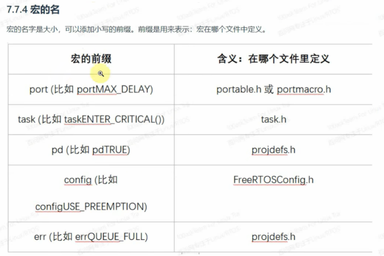

<span style="font-weight:bold; font-size:1.2em;">根据这张给我解释下宏的命名规范，最好能够举个例子来让我彻底弄明白。</span>


这张图展示了 FreeRTOS 非常严谨的 **宏定义命名规范**。

在 C 语言标准中，宏通常都是全大写的（比如 `MAX_BUFFER_SIZE`）。但 FreeRTOS 为了让你一眼看出**“这个宏是在哪个文件里定义的”**，特意在全大写的宏前面，加了一个**小写的前缀**。

这就好比人的名字：**<span style="color:#CC0000;">前缀是“姓”（来源家族），后面是“名”（具体含义）。</span>**

<span style="color:#CC0000;">掌握这个规律，你在阅读源码或调试时，不需要右键跳转定义，就能知道去哪里找它。</span>我们逐个来拆解：

------


### 1. `config` 前缀 —— 用户配置

- **来源**：`FreeRTOSConfig.h`
- **含义**：这是由**你（用户）**来决定的配置项。
- **例子**：`configUSE_PREEMPTION`
  - **解读**：
    - `config`：我去 `FreeRTOSConfig.h` 找。
    - `USE_PREEMPTION`：是否使用抢占式调度。
  - **场景**：你在代码里看到 `#if (configUSE_PREEMPTION == 1)`，你就知道这行代码是否执行，取决于你在 CubeMX 或者配置文件里是怎么勾选的。


### 2. `port` 前缀 —— 硬件移植

- **来源**：`portable.h` 或 `portmacro.h`
- **含义**：这是跟**硬件架构**（ARM M3/M4 等）强相关的宏。不同芯片这个值可能不一样。
- **例子**：`portMAX_DELAY`
  - **解读**：
    - `port`：<span style="color:#CC0000;">这是移植层定义的。</span>
    - `MAX_DELAY`：最大延时时间（死等）。
  - **为什么它在移植层？**
    - 因为“最大值”取决于你的芯片是 16 位还是 32 位。
    - 如果是 16 位机，它是 `0xFFFF`。
    - 如果是 32 位机（STM32），它是 `0xFFFFFFFF`。
    - 只有移植层知道芯片的位宽，所以它必须姓 `port`。


### 3. `task` 前缀 —— 任务相关

- **来源**：`task.h`
- **含义**：<span style="color:#CC0000;">这是专门用于任务管理功能的宏。</span>
- **例子**：`taskENTER_CRITICAL()`
  - **解读**：
    - `task`：定义在任务头文件中。
    - `ENTER_CRITICAL`：进入临界区（关中断）。
  - **场景**：当你要保护一段代码不被打断时，你调用这个宏。


### 4. `pd` 前缀 —— 项目通用定义 (Project Definitions)

- **来源**：`projdefs.h`

- **含义**：这是 FreeRTOS 通用的**状态返回值**（类似于英语里的 Yes/No, Pass/Fail）。

- **例子**：`pdTRUE` / `pdPASS`

  - **解读**：

    - `pd`：项目通用定义。
    - `TRUE` / `PASS`：表示成功或真 (数值通常为 1)。

  - **场景**：

    C

    ```c
    if ( xQueueReceive(...) == pdTRUE ) {
        // 成功收到数据
    }
    ```

  - **面试冷知识**：为什么不直接用 C 语言的 `true`？因为 FreeRTOS 诞生得很早，早期的 C 语言标准（C89）里没有 bool 类型和 true/false 关键字，为了兼容性，作者自己定义了一套。


### 5. `err` 前缀 —— 错误码

- **来源**：`projdefs.h`
- **含义**：明确表示错误的负数代码。
- **例子**：`errQUEUE_FULL`
  - **解读**：
    - `err`：错误。
    - `QUEUE_FULL`：队列满了。
  - **场景**：当你往队列发送数据失败时，函数可能会返回这个宏。

------


### ⚡️ 举个综合例子来彻底弄懂

假设你要写一段代码：往队列里发数据，如果队列满了就等待，且使用抢占式调度。

代码看起来是这样的（注意看宏的前缀）：

C

```c
// 1. 检查配置文件 (config 前缀)
#if ( configUSE_PREEMPTION == 1 ) 

    // 2. 调用函数，使用 port 前缀的宏来指定"一直等待"
    BaseType_t xStatus = xQueueSend( xQueue, &xData, portMAX_DELAY );

    // 3. 检查返回值，使用 pd 前缀的宏
    if ( xStatus == pdPASS ) 
    {
        // 发送成功
    }
    else if ( xStatus == errQUEUE_FULL ) // 4. 检查错误 (err 前缀)
    {
        // 队列满 (虽然用了死等一般不会到这，但逻辑上是这样)
    }

#endif
```


### 总结（面试技巧）

如果面试官问你 FreeRTOS 的代码规范，你可以自信地回答：

> "FreeRTOS 的宏命名非常有条理，它通过小写前缀来指示宏的定义位置和用途。
>
> 比如 config 前缀表示这是用户在 FreeRTOSConfig.h 里的配置；
>
> port 前缀表示这是跟硬件架构相关的定义；
>
> 而 pd 和 err 前缀则是系统通用的返回值和错误码定义。
>
> 这种设计让代码的可读性和可维护性非常高。"


# 🚀 针对视频内容的补充与扩展

视频中提到了几个关键点，但在面试中，面试官希望你不仅知道“是什么”，更知道“为什么”和“怎么做”。


#### 1. 深入理解“可移植层” (`portable`)

视频中提到了 `port.c` 包含汇编代码，这是面试的绝对高频考点。

- **它到底在做什么？** `portable` 层的核心是**实现任务上下文切换 (Context Switch)**。
- **上下文是什么？** 就是任务运行时 CPU 的所有寄存器（R0-R12, PC, LR, PSR 等）。
- **如何切换？**
  1. **保存 (Save)：** 当 FreeRTOS 决定切换任务时（例如在 `SysTick` 中断或 `PendSV` 中断中），`port.c` 中的代码会将当前任务的所有 CPU 寄存器值压入该任务的栈中。
  2. **切换 (Switch)：** 内核更新 TCB (任务控制块) 指针，使其指向下一个要运行的任务。
  3. **恢复 (Restore)：** `port.c` 从新任务的栈中，将它上次被换出时保存的寄存器值"弹"回到 CPU 寄存器中。
- **面试扩展点：** 在 ARM Cortex-M 架构上，这个操作通常在 `PendSV` 中断服务程序中完成，因为 `PendSV` 是一个可挂起的、低优先级的中断，专门用于执行上下文切换，而不会阻塞高优先级的实时中断。


#### 2. 深入理解“内存管理” (`MemMang`)

视频中提到了 `heap_1.c` 到 `heap_5.c`。面试官经常会问它们的区别和选型。

- **`heap_1.c` (只分配)：** 最简单。它只实现 `pvPortMalloc()`，不实现 `vPortFree()`。一旦分配，内存永不释放。适用于系统任务和资源在启动时一次性创建、永不删除的超高可靠性系统。
- **`heap_2.c` (分配和释放)：** 实现了 `vPortFree()`。但它**不合并**相邻的空闲内存块。这会导致**内存碎片化**。如果你频繁地申请和释放不同大小的内存，系统最终会因找不到足够大的连续内存块而崩溃。
- **`heap_3.c` (标准库包装)：** 它只是简单地调用 C 语言标准库的 `malloc()` 和 `free()`。**强烈不推荐**在实时系统中使用，因为标准库的 `malloc` 通常是**非确定性的**（执行时间不固定）且**非线程安全**的。
- **`heap_4.c` (带合并的分配)：** **最常用**的方案。它实现了 `vPortFree()`，并且会在释放内存时，自动检查相邻内存块是否也是空闲的，如果是，则将它们**合并**成一个更大的空闲块。这极大地减少了内存碎片问题。
- **`heap_5.c` (管理非连续内存)：** 功能与 `heap_4` 相同（带合并），但它允许你管理**多块非连续的 RAM**。例如，你的 MCU 既有内部 SRAM，也挂载了外部 SDRAM，`heap_5` 可以把这两块内存“池化”起来统一管理。


#### 3. 深入理解“编码规范”

视频中提到的 `BaseType_t` 和匈牙利命名法，不仅仅是为了好看，它们是嵌入式（尤其是安全关键）系统的基石。

- **`BaseType_t` 的意义：** 核心是为了**性能**和**可移植性**。在 32 位 CPU 上，处理 32 位数据（`int32_t`）比处理 8 位（`int8_t`）更快，因为 8 位操作可能需要额外的移位和掩码指令。通过使用 `BaseType_t`，FreeRTOS 保证了所有内部状态和标志（如 `True`/`False`）都使用 CPU 最高效的字长来处理。
- **匈牙利命名法的意义：** 核心是为了**代码的健壮性和可读性**。
  - 当你在一个几万行代码的 `task.c` 文件中看到一个变量叫 `pxReadyTasksLists`...
  - `p` 告诉你它是个指针。
  - `x` 告诉你它指向的是一个 `BaseType_t` 或结构体。
  - ... 你立刻就知道不能对它执行 `pxReadyTasksLists++` (指针运算)，而应该使用 `*pxReadyTasksLists` 或 `pxReadyTasksLists->...` 来操作。这在 C 语言中能规避大量的指针误用 Bug。
  - 这种风格也与 **MISRA C**（汽车软件可靠性协会 C 语言编码规范）的目标一致，即“让代码的意图尽可能明确，减少未定义行为”。


# ❓ 经典面试问题与解析

以下是根据**此视频内容**为您准备的高频面试题：

**问题 1：请描述一下 FreeRTOS 的源码目录结构，特别是核心代码和移植代码是如何组织的？**

> 简洁回复：
>
> FreeRTOS 的源码主要在 Source 目录中。
>
> - **核心代码**：直接位于 `Source` 目录下的 `.c` 文件（如 `tasks.c`, `queue.c`）和 `Source/include` 里的头文件。它们与硬件无关，实现了 RTOS 的核心逻辑。
> - **移植代码**：位于 `Source/portable` 目录。它包含了所有与特定 CPU 架构和编译器相关的代码，例如任务切换的汇编代码 (`port.c`) 和内存管理实现 (`MemMang` 目录)。

**问题 2：为什么 FreeRTOS 需要一个 `portable` (可移植) 层？它解决了什么关键问题？**

> 简洁回复：
>
> 它是为了将 FreeRTOS 的核心逻辑与底层硬件实现解耦。它主要解决了两个问题：
>
> 1. **CPU 架构差异：** 不同的 CPU（如 ARM, RISC-V）有不同的寄存器和指令集。`portable` 层（特别是 `port.c`）使用汇编代码来实现底层的任务上下文切换。
> 2. **编译器差异：** 不同的编译器（如 MDK, GCC）有不同的关键字或内联汇编语法。`portable` 层也负责适配这些差异。

**问题 3：视频中提到内存管理（`MemMang`）也在 `portable` 目录下，为什么？请简述 `heap_4.c` 的工作原理。**

> 简洁回复：
>
> 因为内存管理策略与具体应用（如是否使用外置 RAM、内存是否紧张）紧密相关，FreeRTOS 允许用户替换或提供自己的实现，所以它被视为“可移植”的一部分。
>
> heap_4.c 是最常用的方案，它实现了 pvPortMalloc() 和 vPortFree()。它的特点是带空闲块合并：当 vPortFree() 释放一块内存时，它会自动检查相邻的内存块是否也处于空闲状态，如果是，就将它们合并成一个更大的空闲块，有效减少内存碎片。

**问题 4：`FreeRTOSConfig.h` 文件有什么作用？在 STM32CubeMX 中修改配置后，它会发生什么变化？**

> 简洁回复：
>
> FreeRTOSConfig.h 是 FreeRTOS 的核心配置文件。它通过 C 语言的宏定义来开启、关闭或配置 RTOS 的各项功能，例如：
>
> - `configUSE_PREEMPTION` (是否使用抢占式调度)
>
> - `configTOTAL_HEAP_SIZE` (堆总大小)
>
> - configMAX_PRIORITIES (最大优先级数)
>
>   在 CubeMX 中修改配置并生成代码后，CubeMX 会自动重写这个文件，将图形化界面的配置转换为对应的宏定义。

**问题 5：如果我想阅读 FreeRTOS 的启动流程，我应该从哪里开始？**

> 简洁回复：
>
> 应从 main.c 开始。关键是两个函数：
>
> 1. `xTaskCreate()` (或 CubeMX 包装的 `osThreadNew`)：创建用户任务。
>
> 2. vTaskStartScheduler() (或 osKernelStart)：启动调度器。
>
>    当 vTaskStartScheduler() 被调用后，CPU 的控制权就正式移交给了 FreeRTOS，它会配置第一个任务的上下文并启动它，从此系统就在 FreeRTOS 的调度下运行了。

**问题 6：FreeRTOS 为什么定义 `BaseType_t` 和 `TickType_t`，而不是直接使用 `int` 或 `unsigned long`？**

> 简洁回复：
>
> 这是为了可移植性和性能。
>
> - **`BaseType_t`**：它被定义为目标 CPU 架构上**最高效的整数类型**。在 32 位 CPU 上它是 32 位，在 16 位 CPU 上它是 16 位。这确保了 RTOS 内核在进行状态判断和计算时始终使用最高效的字长。
> - **`TickType_t`**：它定义了系统节拍（Tick）的宽度。用户可以根据需要（例如担心 16 位溢出）在 `FreeRTOSConfig.h` 中将其配置为 16 位或 32 位，而内核源码无需改动。

**问题 7：FreeRTOS 的编码规范很严格，例如函数前缀 `v` 和 `x`，变量前缀 `p` 和 `ux`，它们分别代表什么？**

> 简洁回复：
>
> 这是匈牙利命名法，用于增强代码可读性和健壮性：
>
> - **函数：** `v` 开头表示 `void` 返回值；`x` 开头表示返回 `BaseType_t`（通常用于返回状态，如 `pdTRUE` 或 `errQUEUE_FULL`）。
> - **变量：** `p` 表示指针 (pointer)；`u` 表示无符号 (unsigned)；`x` 表示 `BaseType_t` 或结构体。例如 `uxPriority` 就表示一个无符号的 `BaseType_t` 类型的优先级变量。