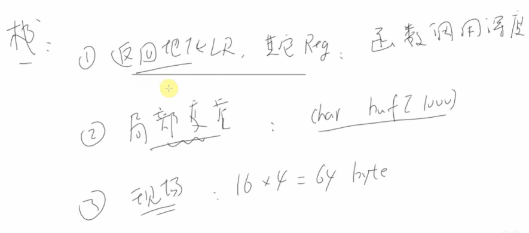
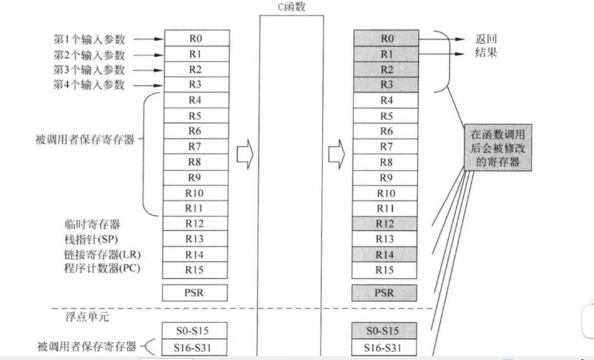
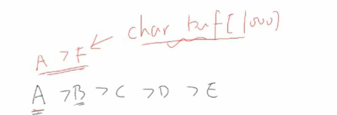
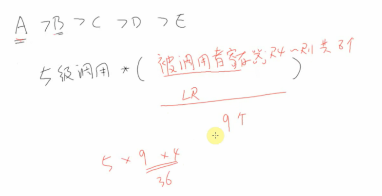
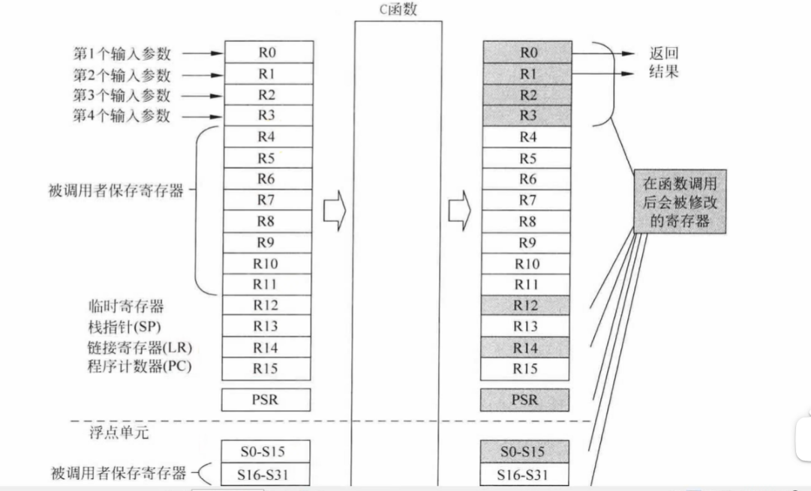
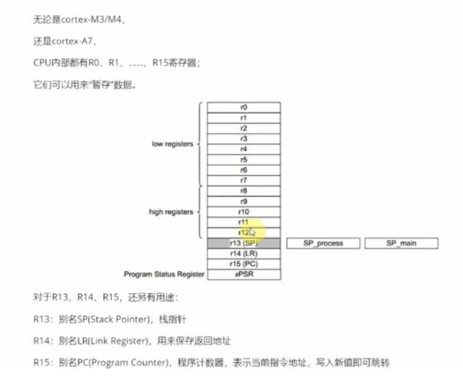
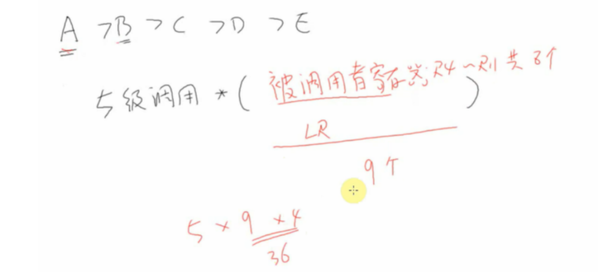
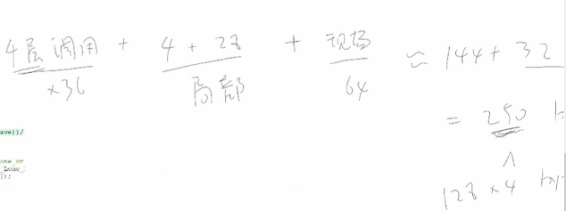
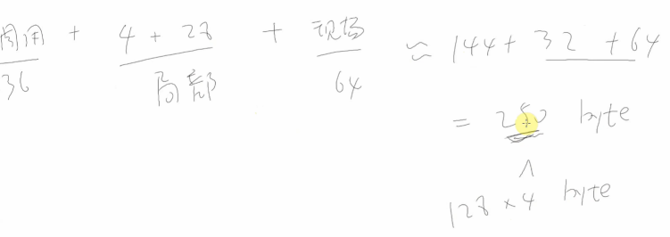

这份视频主要讲解了在嵌入式RTOS（以FreeRTOS为例，基于ARM架构）开发中，**如何通过代码分析粗略估算任务栈（Task Stack）的大小**，并解释了栈空间具体被用来存放什么数据。

以下是针对该视频的详细总结、知识扩展及面试准备材料。

------


# 一、 视频内容总结（带时间戳）

| **时间段**        | **核心内容**                     | **详细说明**                                                 |
| ----------------- | -------------------------------- | ------------------------------------------------------------ |
| **00:00 - 00:29** | **引言：任务栈大小的困惑**       | 创建FreeRTOS任务时，需要指定栈大小（`usStackDepth`）。如果使用动态分配，需要从堆中申请；如果使用静态分配，需要提供数组。核心问题是：<span style="color:#CC0000;">这个大小怎么定？</span> |
| **00:30 - 01:15** | **栈里到底存了什么？**           | 1. **函数调用关系/返回地址** (LR寄存器)。 2. **CPU寄存器备份**：R0-R12等。 3. **局部变量**：函数内部定义的变量。 4. **现场保存（Context Switch）**：任务切换时保存的寄存器组（ARM Cortex-M通常约为64字节）。 |
| **01:16 - 02:00** | **局部变量的影响**               | 重点强调：如果代码中有大数组（如 `char buf[1000]`），栈空间必须足够大，否则直接溢出。 |
| **02:01 - 04:30** | **函数调用深度的开销**           | 讲解 `A->B->C->D->E` 的调用链。每一层调用都需要保存： 1. **返回地址 (LR)**。 2. **被调用者保存寄存器 (Callee-saved)**：如R4-R11。视频估算每一层函数调用大约消耗 **36字节**（取决于编译器优化和代码复杂度）。 |
| **04:31 - 05:40** | **最大栈使用量并不一定在最深处** | 这是一个关键点：最大栈深取决于“调用深度”与“大局部变量”的叠加。可能路径A很深但变量少，路径B很浅但有一个巨大的Buffer，路径B可能更耗栈。 |
| **05:41 - 08:00** | **实战分析：PlayMusic任务**      | 老师带领阅读代码，追踪 `PlayMusic` -> `MUSIC_Analysis` -> `HAL_TIM_PWM_Stop` 这一调用链。查看每一层是否有局部大数组或结构体。 |
| **08:01 - 09:23** | **粗略估算公式**                 | 对该任务进行估算： 1. 调用深度约4层 × 36字节/层 = 144字节。 2. 局部变量（主要是一些结构体）≈ 32字节。 3. 中断/任务切换现场保存 ≈ 64字节。 **总计 ≈ 250字节**。 |
| **09:24 - 结尾**  | **结论验证与单位换算**           | FreeRTOS创建任务时参数单位通常是**Word (字)**，即4字节。代码中分配了128 Words = **512 Bytes**。因为 $512 > 250$，所以该任务栈大小是安全的。 |

------


# 补充提问

## 提问1






<span style="font-weight:bold; font-size:1.2em;">视频中关于这里函数调用链这里的讲解我有点看不太懂，你能够给我详细解释下吗。</span>


这段视频中关于**函数调用链**（Function Call Chain）和**栈空间估算**的讲解，涉及到了ARM架构的底层调用约定（AAPCS）。这确实是比较抽象的部分，但只要理解了“**借东西要还**”和“**留路标**”这两个概念，就很好理解了。

结合你提供的两张图片，我来详细拆解这段逻辑：

------


### 1. 场景设定：A $\rightarrow$ B $\rightarrow$ C $\rightarrow$ D $\rightarrow$ E

假设你的代码执行流程是：

- **A函数** 正在干活，突然需要 **调用B函数**；
- **B函数** 干了一会儿，又 **调用C函数**；
- ...一直调用到 **E函数**。

这就是所谓的**5级调用深度**。


### 2. 为什么要压栈？（两个核心原因）

在ARM CPU里，干活的工具是**寄存器**（R0-R15）。不管你是A函数还是B函数，大家共用这一套寄存器。



#### 原因一：保护现场（借东西要还）—— 对应 R4~R11

- **规则**：ARM规定，**R4 到 R11** 这8个寄存器是“被调用者保存”（Callee-saved）的。
- **通俗解释**：
  - A函数正在用 R4 存它的“私房钱”。
  - A调用B。B函数也要干活，B觉得 R4 这个寄存器很好用，想拿来算数。
  - 但是B不能直接把A存在 R4 里的“私房钱”覆盖掉，否则B运行完回到A时，A的钱就没了。
  - **解决办法**：B在使用 R4 之前，必须先把 R4 里的旧值（A的数据）**抄到栈里（压栈）**。等B干完活，再从栈里把值取出来还给 R4（出栈），然后才能返回A。


#### 原因二：留路标（怎么回家）—— 对应 LR (Link Register)

- **规则**：**LR (R14)** 寄存器专门用来存放“返回地址”。
- **问题**：
  - A调用B时，硬件会自动把“A的下一条指令地址”存在 LR 里。B运行完读 LR 就能回A。
  - **但是**，如果 B 又调用了 C 呢？
  - B调用C时，硬件会把“B的下一条指令地址”存入 LR，**瞬间覆盖了刚才 A 的返回地址**。
  - 如果不保存老的 LR，等 C 运行完回到 B，B 就再也找不到回 A 的路了（死循环或跑飞）。
  - **解决办法**：B在调用C之前，必须把**当前的 LR（即回A的路标）压入栈中**保存起来。

------


### 3. 详细解析视频中的公式

视频截图中的手写公式是：


$$5 \text{级调用} \times \frac{9 \text{个} \times 4}{36}$$

让我们逐个拆解这几个数字的来源：


#### (1) “9个” 是哪来的？

这是指**最坏情况下**，每一层函数调用需要保存的寄存器数量。

- **R4 ~ R11**：共 **8个** 寄存器。
  - 如果函数逻辑复杂，把这8个通用寄存器都用光了，它就得把这8个原有的值都保存到栈里。
- **LR (R14)**：**1个** 寄存器。
  - 只要函数里还有子函数调用（比如B调用C），B就必须保存LR。
- **合计**：$8 + 1 = 9$ 个寄存器。


#### (2) “4” 是什么？

- ARM Cortex-M 是32位处理器。
- 每一个寄存器（R0, R1, ... LR）的宽度都是 **32位**，也就是 **4字节（Bytes）**。


#### (3) “36” 是什么？

- $9 \text{个寄存器} \times 4 \text{字节/寄存器} = 36 \text{字节}$。
- 这意味着：**每一层函数调用，最多可能消耗 36 字节的栈空间用来保存环境。**


#### (4) “5级调用”

- 如果你的程序调用链是 A->B->C->D->E，这就是5层。
- **总消耗**：$5 \times 36 = 180 \text{字节}$。

------


### 4. 结合你的第二张图（ARM寄存器表）

看你发的第二张图：

- **右侧灰色部分**：显示了被压入栈的内容。
- **R4-R11**：图上标注了“被调用者保存寄存器”。这对应了我们上面算的 **8个**。
- **LR (R14)**：在“临时寄存器...”那一栏里。虽然它不属于R4-R11，但如前所述，为了能层层返回，它必须被压栈。


### 5. 总结与实际应用

视频里的这个算法是一个**“<span style="color:#CC0000;">最坏情况估算法”</span>**（Conservative Estimate）。

- **现实情况**：并不是每个函数都会用到 R4-R11 所有的寄存器。有的函数很简单，可能只用了 R4 和 LR，那它这一层只消耗 $2 \times 4 = 8$ 字节。
- **为什么要按36算？**：做嵌入式开发，为了防止**栈溢出（Stack Overflow）**导致死机，我们估算栈大小时通常要“往大了算”。假设每一层都把寄存器用光了，这样算出来的栈大小是最安全的。

简单的一句话解释：

为了保证函数 B 运行完能把 CPU 原封不动地还给函数 A，并且能找到回 A 的路，B 需要把借用的寄存器（R4-R11）和回家的路标（LR）先存到栈里。这大约每层调用需要 36 字节。


## 提问 1 - （1）


<span style="font-weight:bold; font-size:1.2em;">这里估算每一层函数调用的时候 R0~R3 不用考虑吗，还有 R12、R13、R15、PSR 这些好像都没有考虑，我有点不是太懂，你能够给我详细解释下吗。</span>


这个问题问得非常专业！能注意到 R0~R3、R12、PSR 这些寄存器去哪了，说明你对 ARM 架构的寄存器是有一定了解的。

之所以在估算**函数调用（普通C函数嵌套）**的栈消耗时，**不考虑** R0~R3、R12、PSR 等，是因为 ARM 的 **AAPCS（ARM架构过程调用标准）** 制定了一套“**责任分包制**”。

简单来说：**有些寄存器是“随便用的草稿纸”，有些是“必须还原的保险箱”。**

我们一个个来看为什么它们不需要被压入栈：

------


### 1. <span style="color:#CC0000;">R0 ~ R3 (参数与返回值)</span> —— “草稿纸”

- **角色**：它们被称为 **Caller-Saved (<span style="color:#CC0000;">调用者保存</span>)** 寄存器。
- **规则**：
  - 函数 A 调用 函数 B。
  - ARM 规定：**函数 B 有权任意修改 R0~R3**。
  - 函数 B 不需要对 A 负责。B 如果想用 R0 算个数，直接用就行，**不需要**先把 A 的数据压栈保存。
  - **后果**：既然 B 不需要保存它们，自然就不会产生压栈指令（PUSH），也就不会消耗栈空间。
  - **如果 A 还要用 R0 怎么办？**：那是 A 自己的事。A 在调用 B 之前，自己想办法把它存起来（通常编译器会自动处理），但这不属于 B 函数的栈消耗。


### 2. R12 (IP) 和 PSR (状态寄存器) —— “临时工”

- **角色**：同样是 **Caller-Saved**。
- **R12**：通常作为链接器的临时过渡寄存器。
- **PSR**：存放运算结果的状态（比如是否为0，是否进位）。
- **规则**：
  - 函数调用也是一个“重新开始”的过程。函数 A 算了一半产生的标志位（PSR），函数 B 根本不关心，也会在运行过程中产生新的标志位覆盖它。
  - 因此，函数 B 进入时，**完全不需要**保存 R12 和 PSR，直接覆盖使用即可。


### 3. R13 (SP, 堆栈指针) —— “游标”

- **角色**：它本身就是指向栈顶的指针。
- **为什么不保存？**：
  - SP 是随着压栈（PUSH）和出栈（POP）操作自动移动的。
  - 我们保存数据的目的，是为了恢复环境。当函数 B 执行 `POP {PC}` 返回时，硬件或指令逻辑会自动把 SP 指针加回去（退栈）。
  - 所以 SP 不需要作为“数据”保存在栈里，它是由指令的执行流程自动维护的。


### 4. R15 (PC, 程序计数器) —— “替身是 LR”

- **角色**：当前运行到哪条指令了。
- **为什么不直接保存 PC？**：
  - 我们前面说过，**LR (R14)** 保存的就是“返回地址”。
  - 当函数调用发生时，当前的 PC + 4（或+2）的值会被自动存入 **LR**。
  - 所以，保存了 **LR**，实际上就等同于保存了“原本的 PC 应该回到哪里”。
  - 在栈里，我们看到的是 LR 的值，而不是直接把 PC 寄存器压进去。

------


### 核心区别：函数调用 vs 中断 (ISR)

**你可能混淆了“函数调用”和“中断”的压栈机制，这是嵌入式面试的大坑！**


#### 情况 A：普通函数调用 (Function Call) —— 视频里讲的情况

也就是 A -> B -> C。

- **遵循软件协议 (AAPCS)**。
- **只保存**：需要长期使用的“私房钱”寄存器（**R4 ~ R11**）以及回家的路标（**LR**）。
- **不保存**：R0~R3, R12, PSR（因为协议规定这些可以随便改）。
- **结论**：所以视频估算只算 `(8个寄存器 + 1个LR) * 4字节`。


#### 情况 B：中断触发 (Interrupt / Exception) —— 硬件自动行为

当代码正在跑，突然来了一个定时器中断。

- **遵循硬件逻辑**。
- CPU 必须要保存**当前被打断瞬间的所有现场**，因为中断处理完必须像没发生过一样。
- **硬件自动压栈**：**xPSR, PC, LR, R12, R3, R2, R1, R0**（这是经典的 **8字帧**）。
- **结论**：如果是计算中断服务函数的栈消耗，你就必须把 R0~R3、PSR 等算进去！

------


### 总结

视频主要是在估算 **任务函数层层嵌套调用** 时的栈大小，属于**情况 A**：

1. **R0~R3, R12, PSR**：被视为“易失性”寄存器，子函数可以直接覆盖，**不需要压栈**，所以不占空间。
2. **R13, R15**：通过指令流和 LR 间接恢复，不需要当作数据压栈。
3. **R4~R11, LR**：属于“非易失性”寄存器，子函数必须保护好，**需要压栈**，所以这是栈消耗的主要来源。

面试加分项：

如果在面试中问到这个问题，你可以这样说：

> “如果是普通的 C 函数调用，遵循 AAPCS 标准，R0-R3 和 R12、PSR 是调用者保存的，被调用函数不需要压栈保存它们，只有 R4-R11 和 LR 需要压栈。<span style="color:#CC0000;">但如果是**中断**发生，硬件会自动把 R0-R3、R12、LR、PC、xPSR 压入栈中，这时候这 8 个寄存器是必须算在栈消耗里的。”</span>


## 提问 1 - （1）- （1）

<span style="font-weight:bold; font-size:1.2em;">我还是不太明白，这些寄存器中的数据不压栈保存的话数据不会丢失吗，你能够给我详细解释下，最好能够举个例子来让我彻底弄明白。</span>

这是一个非常棒的直觉！你的担心是有道理的：**如果不保存，数据确实会被覆盖（丢失）**。

但关键点在于：**这种“丢失”是计划之内的，是大家都商量好的。**

为了让你彻底弄明白，我们用一个**“老板与员工”**的例子来模拟 CPU 的寄存器使用规则（AAPCS）。

------


### 核心比喻：办公室的资源

想象 CPU 就是一个办公室，里面只有 **16 个格子（寄存器）** 用来放文件。

- **A 函数（老板，调用者 Caller）**
- **B 函数（员工，被调用者 Callee）**


#### 1. R0 ~ R3：公共办公桌（草稿纸/收发栏）

- **规则**：这是公共区域。谁拿到谁就能用，用完不用收拾，上面写的东西随时可能被别人擦掉。
- **用途**：用来传递任务参数，或者做临时计算。


#### 2. R4 ~ R11：私人保险柜

- **规则**：这是**不管谁用，必须原样归还**的区域。
- **用途**：用来存放需要长期保存的重要数据。

------


### 场景模拟：数据到底丢没丢？


#### 情况一：A（老板）觉得数据不重要（数据丢失也无所谓）

**代码逻辑**：

C

```c
void A_Boss() {
    int x = 10 + 20;  // A 把 30 放在 R0 (公共办公桌) 上
    B_Employee();     // A 叫 B 进来干活
    // A 干完活了，直接下班，不再需要 x 了
}

void B_Employee() {
    int y = 555;      // B 也要用 R0，于是把 555 放在 R0 上
    // B 干活...
}
```

**过程分析**：

1. **A** 算出了 30，放在 **R0** 上。
2. **A** 喊 **B** 进来。
3. **B** 进来后，也要算数。B 看到 **R0** 是公共桌子，按照规定，B **完全不需要**问 A 同不同意，直接把 **R0** 擦掉，写上了自己的 555。
4. **B** 干完活走了。此时 **R0** 上是 555。
5. **A** 继续执行。
6. **数据丢了吗？** 丢了（30 变成了 555）。
7. **A 介意吗？** 不介意！因为 A 在代码里写得很清楚，调用 B 之后，A 就不再使用 `x` 了。既然没人用，丢了就丢了。
8. **结论**：**不需要压栈，为了省事。**

------


#### 情况二：A（老板）觉得数据很重要（A 自己负责保护）

这是你最担心的场景：**如果 A 后面还要用这个数据怎么办？**

**代码逻辑**：

C

```c
void A_Boss() {
    int x = 100;      // x 在 R0 上
    B_Employee();     // 叫 B 进来干活
    int z = x + 1;    // 重点！B 走后，A 还要用 x ！
}
```

**过程分析（关键！！！）**：

1. **A** 把 100 放在 **R0** 上。
2. **A** 马上要叫 **B** 进来了。
3. **A 很清楚一件事**：根据规定（AAPCS），B 进屋后有权随意乱改 R0。
4. <span style="color:#CC0000;">**A 的自救行动**：在叫 B 之前，**A 自己** 必须先把 R0 里的 100 挪个窝。</span>
   - **方法 1**：A 把 100 挪到 **R4**（私人保险柜）里。（因为规定 B 必须保护 R4）。
   - **方法 2**：A 把 100 **压入自己的栈**里保存。
5. **A** 叫 **B** 进来。
6. **B** 进来把 **R0** 改得乱七八糟（比如改成 999），B 不需要保存 R0，改完 B 走了。
7. **A** 醒过来。
   - 如果是方法 1：A 从 **R4** 里拿出 100，继续算 `z = 100 + 1`。
   - 如果是方法 2：A 从**栈**里把 100 弹出来放到 R0，继续算。

**结论**：

- 数据没有丢，是因为 **A（调用者）** 在调用前自己做了备份。
- **B（被调用者）** 依然**不需要**把 R0 压栈。
- <span style="color:#CC0000;">**视频里讲的栈大小是针对 B 函数的**。A 保存数据消耗的是 A 的栈帧，或者是 A 占用的 R4-R11，**不计入 B 函数的栈消耗（36字节那个公式）**。</span>

------


### 彻底弄明白：为什么 R0~R3 不压栈？

这是一种**“效率妥协”**。

如果 CPU 规定：**“任何函数调用，必须把 R0~R15 所有 16 个寄存器全部保存到栈里”**，会发生什么？

1. **慢**：每次调用函数都要访问 16 次内存（压栈），回来又要读 16 次内存（出栈）。内存读写是很慢的。
2. **浪费**：大部分时候，R0~R3 里的数据只是临时用一下，用完就扔的。强制保存是浪费空间和时间。

所以 ARM 制定了**“责任分担制”**：

- **易失性寄存器（R0-R3, R12, PSR）**：
  - **谁负责？** 当前的主人（调用者 A）。
  - **潜台词**：A 对 B 说：“这几个寄存器里的数据我还没用完，但我知道你要用。为了不让你麻烦，**我自己先存起来**，你随便用。”
  - **B 的操作**：直接用，**不压栈**。
- **非易失性寄存器（R4-R11, LR）**：
  - **谁负责？** 闯入者（被调用者 B）。
  - **潜台词**：A 对 B 说：“这些寄存器里放着我的传家宝，但我没空搬走。你要是用的话，**你负责帮我存好**，走的时候必须还原。”
  - **B 的操作**：如果 B 要用 R4，B 就必须 **PUSH {R4}**。


### 总结

1. **数据会丢吗？** 会丢。R0~R3 的数据在函数调用后会被覆盖。
2. **会有问题吗？** 不会有。因为编译器知道规则：
   - 如果数据没用了，丢了就丢了。
   - 如果数据还有用，**调用者（上级函数）** 会在调用前自己先备份好，而不是指望 **被调用者（下级函数）** 去备份。
3. **视频里的估算**：视频是在算 **被调用函数（B）** 这一层必须承担的压栈代价。因为 R0~R3 主要是 A 负责备份（或者干脆扔掉），所以 **B 函数本身不需要为此消耗栈空间**。


## 提问 1 - （2）



<span style="font-weight:bold; font-size:1.2em;">这里，如果每一层调用都要用到R0~R3的话，那么每一层作为调用者不是还需要保存R0~R3吗，此时图片中的这种计算方式总感觉有点问题。</span>


你的直觉非常敏锐！你发现了一个**教科书理论**与**工程估算**之间的灰色地带。

简单直接回答你：**<span style="color:#CC0000;">你是对的。如果每一层函数在调用下一层之前，R0~R3 里的数据非常重要且后续还要用，而且连 R4~R11 都放不下了，那么调用者（Caller）确实必须把 R0~R3 压栈保存。</span>**

这种情况在计算机术语里叫 **<span style="color:#CC0000;">"Register Spilling"（寄存器溢出）</span>**。

但是，<span style="color:#CC0000;">为什么视频里的讲师（以及很多工程估算）敢“忽略”这部分呢？</span>因为编译器有一个聪明的<span style="color:#CC0000;">**“乾坤大挪移”**策略，使得大部分情况下 R0~R3 并不需要直接压栈。</span>

我们来拆解一下这个过程。

------


### 1. 编译器的“乾坤大挪移”策略（重点）

假设函数 A 要调用函数 B，且 A 在调用 B 之后还要用到 `x`（此时 `x` 存在 R0 里）。

**<span style="color:#CC0000;">编译器通常不会傻乎乎地直接把 R0 压栈（存入内存），因为内存读写太慢了</span>。** 它是这么做的：

- 第一步：找“替身”

  编译器会看一眼 R4~R11（私人保险柜）有没有空位。假设 R4 是空的。

- 第二步：转移资产

  在调用 B 之前，A 会先把 R0 里的值 挪到 R4 里 (MOV R4, R0)。

- 第三步：调用 B

  A 调用 B。

  - 注意：根据规则，B 必须保护 R4。如果 B也要用 R4，**B 会负责把 R4 压栈**。

- 第四步：B 返回

  B 返回时，B 负责把 R4 恢复原状。

- 第五步：继续运行

  A 继续运行，因为它之前把数据挪到了 R4，R4 的数据完好无损，A 可以直接用 R4 里的值，或者再挪回 R0。

**结果分析：**

- <span style="color:#CC0000;">在这个过程中，数据确实被保存到了栈里，**但不是由 A 压栈 R0，而是由 B 压栈 R4！**</span>
- **这就回到了视频里的公式**：B 压栈 R4，这已经被包含在那个“36字节（9个寄存器）”的计算里了（R4~R11 属于那 9 个之一）。

**结论：** <span style="color:#CC0000;">大部分时候，R0~R3 的保护工作，通过“挪移到 R4~R11”，被转化为了被调用者的压栈责任。所以公式依然成立。</span>

------


### 2. 什么时候你的担忧会成真？（寄存器溢出）

你的担忧在以下这种**极端复杂**的情况下会发生：

场景：

函数 A 特别复杂，局部变量巨多，逻辑巨长。

1. A 已经把 R0~R3 用满了。
2. A 为了保护中间变量，把 **R4~R11 全部占满**了。
3. 此时，A 还要调用 B。
4. 并且 A 在 B 返回后，还需要用到 R0 里的数据。

此时编译器两手一摊：

“R4~R11 也没空位了，没法挪移了！”

后果：

编译器只能生成指令，强制把 R0（以及其他需要保存的 Caller-Saved 寄存器）压入 A 的栈帧中。

**这种情况下：**

- A 的栈消耗 = `保存 R4-R11 的空间` + `保存 R0-R3 的空间 (Spilling)`。
- <span style="color:#CC0000;">此时，栈的使用量**确实会超过**视频里那个简单的公式。</span>

------


### 3. 为什么视频里的估算依然“可以用”？

虽然理论上 R0~R3 可能需要压栈，但在工程估算中，视频里的公式 `5 × 36` 依然是一个合格的**“经验上限”**，原因如下：

1. <span style="color:#CC0000;">概率问题：</span>

   <span style="color:#CC0000;">一个函数同时满足“调用深度深” + “每一层逻辑都极度复杂” + “每一层都把 R0~R12 耗尽”的概率极低。</span>通常只有原本就是大胖子的函数（栈消耗本来就大）才会这样。

2. <span style="color:#CC0000;">**平均法则**：</span>

   - 有的层可能只用了 R4，没用 R5-R11（只消耗 8 字节）。
   - 有的层可能发生了你说的“溢出”，保存了 R0（消耗 > 36 字节）。
   - **36 字节**（9个寄存器全保存）本身就是按照**“几乎用满所有通用寄存器”**这种比较坏的情况来设定的。用这个“偏大”的平均值去覆盖由于 R0~R3 溢出带来的额外开销，通常是兜得住的。


### 总结

你的质疑非常到位，**图片中的公式不是物理定律，只是工程上的“拇指法则”（Rule of Thumb）**。

- **严谨的真理**：如果寄存器压力大（Register Pressure High），调用者确实需要保存 R0~R3，导致栈使用量增加。
- **工程的现实**：编译器会优先把 R0~R3 的数据转移到 R4~R11 中，从而把“保存责任”转移给被调用者。
- **视频公式的逻辑**：它假设每一层函数把 R4~R11 全都用光了（这本身就是一种很坏情况的假设），这个余量通常足以覆盖偶尔发生的 R0~R3 溢出保存。

在面试中，如果你能说出：**“<span style="color:#CC0000;">这个公式是基于编译器会将 Caller-Saved 寄存器优化转移至 Callee-Saved 寄存器的假设；如果发生寄存器溢出（Register Spilling），实际栈可能会更大。</span>”** 面试官绝对会对你刮目相看！


## 提问 1 - （3）



<span style="font-weight:bold; font-size:1.2em;">视频中提到的图片中的这一部分你能够给我详细解释下吗，我有点不是太懂，最好能够举个例子来让我彻底弄明白。</span>


这张图片中的公式是**嵌入式 RTOS 开发中最经典的“栈空间估算公式”**。

它<span style="color:#CC0000;">把一个任务（Task）所需的总栈空间分成了**三个部分**来计算</span>。我们可以把它想象成你在打包行李箱（栈），这三个部分就是你必须装进去的三类东西。

公式如下：

<span style="color:#CC0000;">$\text{总栈大小} \approx (\text{函数调用深度的开销}) + (\text{局部变量的开销}) + (\text{中断/现场保护的开销})$</span>

对应图中的数字：

$$250 \approx (4 \times 36) + (4 + 28) + 64$$

下面我为你详细拆解这三个部分，并举一个具体的代码例子。

------


### 第一部分：函数调用开销 ($4 \text{层} \times 36$)

- **含义**：这是为了保证函数调用能层层返回，<span style="color:#CC0000;">每一层函数都需要保存“私房钱”和“回家的路”</span>。
- **来源**：
  - **4层**：指的是<span style="color:#CC0000;">代码中最深的调用链</span>。比如 A -> B -> C -> D。
  - **36字节**：我们之前分析过，每一层最坏情况下要保存 R4~R11（8个） + LR（1个） = 9个寄存器。$9 \times 4 \text{字节} = 36 \text{字节}$。
- **计算**：$4 \times 36 = 144 \text{字节}$。<span style="color:#CC0000;">这部分空间是为了让函数能正常跑完逻辑。</span>


### 第二部分：局部变量开销 ($4 + 28$)

- **含义**：函数内部定义的变量，如果寄存器放不下了，或者<span style="color:#CC0000;">变量是数组/结构体，就必须放在栈里</span>。
- **来源**（这是视频里具体代码的例子）：
  - **4**：可能是在某一层函数里定义了一个 `int count`（4字节）。
  - **28**：可能是在另一层函数里定义了一个结构体 `struct config`（28字节）。
- **计算**：$4 + 28 = 32 \text{字节}$。
  - <span style="color:#CC0000;">**注意：这里的 32 字节是把整个调用链上所有同时存在的局部变量加起来。**</span>


### 第三部分：现场保护/中断开销 ($64$) —— **最关键的一点！**

- **含义**：这是 RTOS 的特性。<span style="color:#CC0000;">任务随时可能被**中断**打断，或者被系统**强制切换**到别的任务。</span>

- 为什么是 64？

  当任务正在运行时，突然来了一个中断，<span style="color:#CC0000;">CPU 必须瞬间把当前任务的所有“家当”（寄存器）都锁进保险柜（栈），以便腾出 CPU 给中断用。</span>

  在 ARM Cortex-M 架构下，这个“全套家当”包括：

  1. **<span style="color:#FF0000;">硬件自动压栈（8个）</span>**：R0~R3, R12, LR, PC, xPSR。($8 \times 4 = 32 \text{字节}$)
  2. **<span style="color:#FF0000;">软件手动压栈（8个）</span>**：RTOS 为了切换任务，会把剩下的 R4~R11 也压进去。($8 \times 4 = 32 \text{字节}$)

  - **合计**：$32 + 32 = 64 \text{字节}$。

- **结论**：不管你的任务多简单，**这 64 字节是必须要预留的**，作为“保命钱”。

------


### 举个具体的例子来彻底弄明白

假设我们写了一个播放音乐的任务，代码如下：

C

```c
// 结构体大小：假设是 28 字节
typedef struct {
    char name[20];
    int id;
    int volume;
} MusicInfo_t; 

// Level 4: 最底层函数
void Hardware_Write(int val) {
    // 假设这里很简单，只用了寄存器，局部变量为 0
}

// Level 3: 
void Output_Data() {
    int temp = 0; // 【局部变量：4字节】
    Hardware_Write(temp); 
}

// Level 2: 
void Decode_Music() {
    MusicInfo_t info; // 【局部变量：28字节】
    // ...处理逻辑...
    Output_Data();
}

// Level 1: 任务入口
void Task_PlayMusic(void *param) {
    while(1) {
        Decode_Music();
    }
}
```


#### 现在我们来套用图片中的公式进行估算：

1. 此时发生了最深的调用：

链条是：Task -> Decode -> Output -> Hardware。

深度 = 4 层。

- **开销**：$4 \times 36 = 144 \text{字节}$（<span style="color:#FF0000;">用于保存每一层的 R4-R11 和 LR</span>）。

2. 此时栈里存了哪些局部变量？

<span style="color:#FF0000;">当程序运行到最底层的 Hardware_Write 时，上面的函数还没退出，所以它们的变量还在栈里占着坑：</span>

- `Decode_Music` 的 `info`：**28 字节**。
- `Output_Data` 的 `temp`：**4 字节**。
- **开销**：$28 + 4 = 32 \text{字节}$。

3. 突然！来了一个中断（比如系统滴答定时器）：

CPU 说：“停！我要去处理中断了。”

此时<span style="color:#FF0000;"> CPU 必须把当前所有的寄存器（R0~R15）全部压入当前任务的栈里保存现场。</span>

- **开销**：固定 **64 字节**。


#### **最终计算总和：**

$$\text{Total} = 144 \text{(调用链)} + 32 \text{(局部变量)} + 64 \text{(中断现场)} = 240 \text{字节}$$

这就和图片里的 **250** 非常接近了（图片里只是举例估算）。

------


### 图片右下角的补充说明

图片右下角写着：

$$128 \times 4 \text{ Byte}$$

- **意思**：你在代码里写 `xTaskCreate(..., 128, ...)` 创建任务时，填的数字是 **128**。
- **单位换算**：在 FreeRTOS (ARM架构) 中，这个单位是 **“字 (Word)”**，1 个字 = 4 字节。
- **实际分配**：$128 \times 4 = 512 \text{字节}$。

最终结论：

你需要的空间（估算值）是 250 字节。

你实际分配的空间是 512 字节。

$512 > 250$，所以你的栈分配是安全的，不会溢出。


# 二、 知识点补充与扩展（进阶内容）


视频中展示的是一种**静态手动估算**的方法，适合简单任务。在实际工程和面试中，你需要掌握更科学的方法和底层原理。


#### 1. 两种更科学的栈大小确定方法

- **静态分析工具（编译期）：**
  - **GCC `-fstack-usage` 标志**：在编译时加上这个flag，编译器会为每个函数生成一个 `.su` 文件，列出该函数的栈使用量（Static + Dynamic）。
  - **Call Graph工具**：配合Keil或IAR的Linker Map文件，可以查看最大调用树（Call Tree）的栈消耗。
- **动态检测方法（运行期）：**
  - **栈“涂油” (Stack Painting)**：在任务创建时，将栈空间全部填充为特定字符（如 `0xA5`）。运行一段时间后，检查栈末尾还有多少 `0xA5` 没被覆盖，从而推算出“历史最大使用量”（High Water Mark）。
  - **FreeRTOS API**：`uxTaskGetStackHighWaterMark(TaskHandle_t xTask)`，专门用来返回任务启动以来剩余的最小栈空间。


#### 2. ARM Cortex-M 的双堆栈机制 (MSP vs PSP)

- **PSP (Process Stack Pointer)**：RTOS的任务（线程）通常使用PSP。视频里讲的“任务栈”就是指PSP指向的空间。
- **MSP (Main Stack Pointer)**：中断服务函数（ISR）和OS内核代码通常使用MSP。
  - **扩展点**：很多初学者以为中断来了会压入当前任务的栈。在Cortex-M加RTOS环境下，中断处理通常会切换到MSP，**不会消耗任务栈（PSP）**（除了进入中断那一刻保存的硬件上下文Frame）。这意味着你不需要为每个任务栈都预留处理复杂中断的空间，只需保证MSP足够大即可。


#### 3. 栈溢出的后果与检测

- **后果**：覆盖TCB（任务控制块），导致任务无法切换；覆盖相邻任务的栈；覆盖全局变量。现象通常是程序跑飞、HardFault、或者数据莫名其妙被改写。
- **硬件检测**：现代ARM v8-M（如Cortex-M33）有**Stack Limit Registers (PSPLIM/MSPLIM)**，硬件级检测溢出，直接触发UsageFault，比软件检测更安全。

------


# 三、 嵌入式面试：经典问题与高分回答

针对视频内容和上述扩展，为你准备了以下面试题。**目标是展示你不仅会用，还懂底层。**


#### Q1: 在FreeRTOS中，你是如何确定一个任务需要分配多少栈空间的？

**参考回答（逻辑清晰）：**

> “我通常采用‘静态估算+动态验证’结合的方法。
>
> 1. **静态阶段**：先分析任务功能。如果有 `printf`（通常内部缓冲大）或大数组，我会给较大空间。如果是简单控制逻辑，我会根据函数调用深度（每层约40字节）加上中断上下文切换开销（ARM M4约64字节）进行预估。
> 2. **动态阶段**：在开发初期，我会给一个较大的安全值（比如2倍预估值），然后开启FreeRTOS的 `CHECK_STACK_OVERFLOW` 钩子函数。
> 3. **优化阶段**：利用 `uxTaskGetStackHighWaterMark` API在系统满负荷运行一段时间后查看剩余栈空间，然后将栈大小调整到‘最大使用量 + 20%~30%的安全余量’，以节省RAM。”


#### Q2: 视频中提到任务栈里保存了‘现场’，请问发生任务切换时，具体保存了哪些东西？保存在哪里？

**参考回答（点出硬件自动+软件手动）：**

> “在ARM Cortex-M架构下，任务切换分为两部分保存：
>
> 1. **硬件自动保存**：当Systick中断或PendSV触发时，硬件会自动将 `xPSR`, `PC`, `LR`, `R12`, `R3-R0` 这8个寄存器压入当前任务的栈（PSP）。
>
> 2. 软件手动保存：在FreeRTOS的 PendSV_Handler 底层汇编中，会手动将剩余的寄存器（R4-R11，如果是浮点单元开启还需要保存S16-S31）压入PSP。
>
>    所以，栈里保存的是完整的CPU寄存器组，这构成了任务的上下文（Context）。”


#### Q3: 如果发生栈溢出（Stack Overflow），会有什么现象？怎么调试？

**参考回答：**

> “现象：通常表现为随机的系统崩溃、HardFault，或者莫名其妙地修改了邻近的变量（因为栈是向下生长的，溢出往往会踩坏低地址的数据，比如TCB结构体）。
>
> 调试方法：
>
> 1. **开启RTOS监控**：在 `FreeRTOSConfig.h` 中定义 `configCHECK_FOR_STACK_OVERFLOW` 为2，这样在任务切换时RTOS会检查栈底的魔术字是否被覆盖。
> 2. **栈涂油（Canary）**：内存窗口查看栈区域，如果全是数据没有剩余的填充值（如0xA5），说明溢出了。
> 3. **Watchpoint**：如果复现率高，可以在栈底地址设置数据观察断点（Data Watchpoint），一旦有写入操作立即停机，抓住‘凶手’。”


#### Q4: 这里的栈大小单位是128，指的是字节还是字？为什么要注意这个问题？

**参考回答：**

> “这取决于具体的API。在FreeRTOS的标准API `xTaskCreate` 中，`usStackDepth` 的单位是**Stack Width（栈宽度）**。
>
> - 在32位ARM架构上，栈宽是4字节（uint32_t），所以填128代表 $128 \times 4 = 512$ 字节。
>
> - 但在CMSIS-RTOS封装的API（如STM32CubeMX生成的代码）中，有时参数定义会被改为字节，或者宏定义混淆。
>
>   注意点：必须查阅portmacro.h或官方文档。如果搞错单位（比如以为是字节结果填了128，实际只有128字节），对于稍复杂的任务非常容易造成立即溢出。”


#### Q5: 既然局部变量占用栈，那为什么不把所有变量都定义成全局变量或静态变量来节省栈空间？

**参考回答（考察C语言基础与OS重入性）：**

> “不能这么做，主要有两个原因：
>
> 1. **不可重入（Non-Reentrant）**：如果一个函数使用了静态/全局变量，当多个任务同时调用该函数时，数据会被相互覆盖，导致逻辑错误。局部变量保存在各自任务的栈中，互不干扰，是线程安全的。
> 2. **内存浪费**：全局变量在整个程序生命周期都占用RAM。而局部变量只在函数执行期间占用栈空间，函数退出即释放，栈空间可以被复用。对于RAM紧张的嵌入式系统，合理利用栈复用是节省内存的关键。”

------


### 下一步建议

**您是否希望我根据 `PlayMusic` 这个任务的场景，为您生成一段使用 `uxTaskGetStackHighWaterMark` 进行栈空间监控的代码示例？** 这样您可以直接用到面试的项目介绍中。