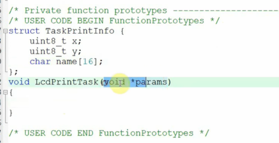
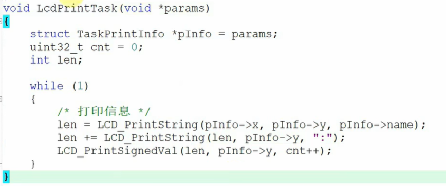
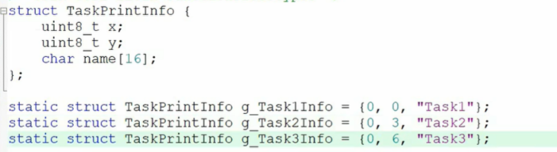
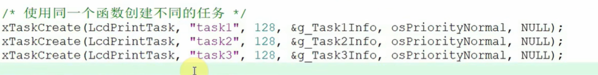
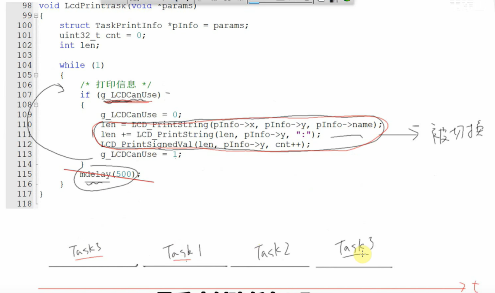
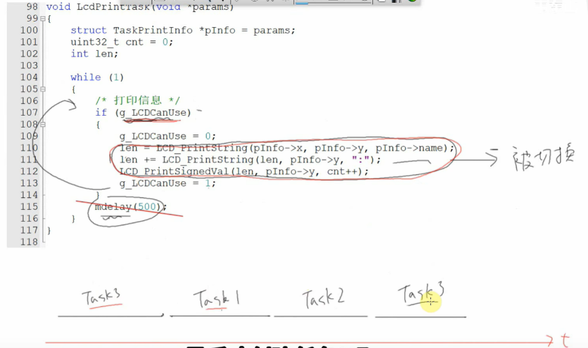
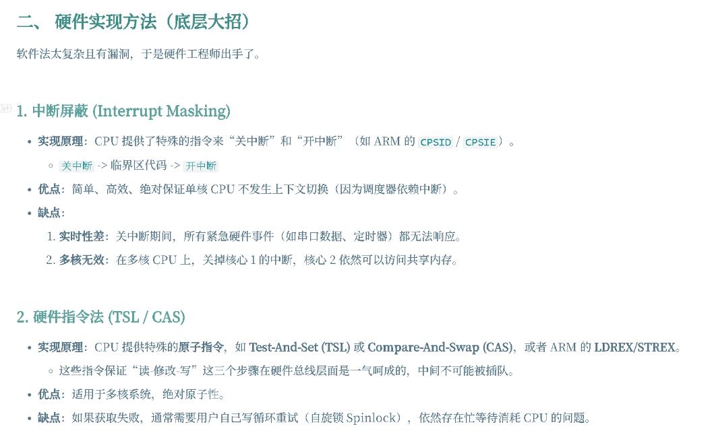

这是一个非常经典的RTOS（实时操作系统）入门教学视频，主要讲解了<span style="color:#CC0000;">如何利用**任务参数（Task Parameter）**来复用代码</span>，以及由此引出的<span style="color:#CC0000;">**多任务资源竞争（重入性）**问题</span>。

以下是针对该视频的详细分析、知识扩展以及面试准备资料。


# 一、 视频内容大纲与时间点总结

这个视频通过一个<span style="color:#CC0000;">在OLED屏幕上打印任务信息</span>的案例，由浅入深地演示了RTOS编程中的核心概念。

- **00:00 - 02:00 提出问题：**

  - 如果在RTOS中创建多个类似的任务（如Task1, Task2），为每个任务单独写一个函数（`Task1_Function`, `Task2_Function`）会导致代码大量重复和冗余。

- **02:00 - 05:00 设计解决方案：**

  - 提出使用**同一个函数**来创建不同的任务。

  - 分析<span style="color:#CC0000;">不同任务的区别在于数据（打印的位置x, y，打印的内容name）</span>。

  - **关键点**：<span style="color:#CC0000;">定义一个结构体 `struct TaskPrintInfo` 来封装这些差异化的数据（成员包括 `x`, `y`, `name`）</span>。

    

- **05:00 - 10:00 编写通用任务函数：**

  - 编写函数 `LcdPrintTask`。

  - 利用 `void *params` 指针接收参数。

  - **关键操作**：在<span style="color:#CC0000;">函数内部将 `void *` 强制类型转换为 `struct TaskPrintInfo *`，从而获取具体的坐标和名字。</span>

    

- **10:00 - 12:30 创建任务与初步运行：**

  - 定义<span style="color:#CC0000;">三个全局/静态的结构体变量</span>，分别<span style="color:#CC0000;">初始化为不同的坐标和名字</span>。

    

  - 调用 `xTaskCreate`，将这三个结构体的地址作为 `pvParameters` 传入。

    

  - **现象**：程序运行后，OLED屏幕上的字符显示错乱（Garbled text），甚至打印位置错误。

- **12:30 - 15:00 问题分析（核心）：**

  - 解释**重入性（Re-entrancy）**问题。OLED的驱动函数（底层通常是I2C或SPI时序模拟）不是“线程安全”的。
  - 当Task1正在发送I2C数据时，时间片用完，切换到Task2，Task2也去操作I2C引脚。导致时序波形被打断、混杂，从而显示乱码。

- **15:00 - 18:00 尝试“朴素”的解决方法：**

  - 试图使用一个全局变量 `g_LCDCanUse` 作为标志位（锁）。

  - 逻辑：先判断标志位是否为1，如果是则置0，打印，再置1。

    

- **18:00 - 21:00 方案失败与原因深度剖析：**

  - **现象**：<span style="color:#CC0000;">加上全局标志位后，依然会有乱码。</span>
  - **原因**：C语言中的 `if(g_LCDCanUse)` 和 `g_LCDCanUse = 0` 对应多条汇编指令，不是**原子操作（Atomic）**。
  - **竞态条件（Race Condition）**：<span style="color:#CC0000;">Task1判断通过但还没来得及修改标志位时被发生上下文切换，Task2进来判断也通过，导致两个任务都进入了临界区。</span>

- **21:00 - 结尾：**

  - 留下悬念：为什么全局变量锁不住？为什么Task3先运行？（这涉及到调度器的就绪列表插入策略）。

------


# 补充提问 1


## 提问1



<span style="font-weight:bold; font-size:1.2em;">视频中加入这个 mdelay(500) 以及 不加入这个 mdelay(500) 的现象分别是什么，为什么会产生这种现象呢。</span>


这是嵌入式面试中关于**多任务资源竞争（Race Condition）**和**竞态窗口（Race Window）**非常经典的一个实验对照。

这个实验的核心目的是：**证明使用普通的全局变量（非原子操作）做“锁”，是不可靠的。**

以下是针对视频中 `mdelay(500)` 加与不加的现象及深度原理解析：


### 1. 现象对比

#### **情况 A：加入 `mdelay(500)` （或者 `vTaskDelay`）**

- **现象**：
  - OLED 屏幕上的打印看起来**相对正常**，乱码很少出现，或者很久才出现一次。
  - 三个任务（Task1, Task2, Task3）似乎在有序地轮流运行。
- **表面假象**：你可能会误以为代码里的 `if (g_LCDCanUse)` 这种“朴素锁”起作用了。


#### **情况 B：不加 `mdelay(500)` （注释掉）**

- **现象**：
  - **严重乱码**：OLED 屏幕上的字会迅速错乱，显示出奇怪的字符或者位置跑偏。
  - **程序卡死或逻辑错误**：<span style="color:#CC0000;">可能出现某个任务一直打印，其他任务打印不出来；或者打印出的数值（`cnt`）跳变异常。</span>
  - **锁失效**：两个任务甚至多个任务同时进入了打印函数。

------


### 2. 为什么会产生这种现象？（面试核心）

这个问题的本质在于**<span style="color:#CC0000;">概率</span>**和<span style="color:#CC0000;">**指令执行密度**。</span>


#### **核心原理：非原子操作的“竞态窗口”**

代码中的锁逻辑是这样的：

C

```c
if (g_LCDCanUse) {      // 第一步：读内存，判断
    // <--- 极其危险的窗口期 --->
    g_LCDCanUse = 0;    // 第二步：写内存，上锁
    // ... 打印 ...
}
```

这两步在汇编层面是多条指令。<span style="color:#CC0000;">如果任务切换（Context Switch）恰好发生在**第一步之后、第二步之前**，锁就会失效。这个“恰好”的时间段，我们称为**竞态窗口**。</span>


#### **为什么加了延时就好用？（掩盖问题）**

- **稀释了冲突概率**：
  - 加上 `mdelay(500)` 后，<span style="color:#CC0000;">任务在绝大部分时间（比如 99.9% 的时间）都在“睡觉”或者空转等待。</span>
  - <span style="color:#CC0000;">真正执行那两行“危险代码”（检查锁、上锁）的时间占比极小。</span>
  - <span style="color:#CC0000;">调度器发生切换是按照时间片（如 1ms）来的，**恰好** 命中那几微秒“竞态窗口”的概率变得非常低</span>。
- **结果**：Bug 依然存在，只是很难复现（Heisenbug）。这对嵌入式系统来说是最危险的，<span style="color:#CC0000;">因为产品卖出去后偶尔会死机。</span>


#### **为什么去掉延时就崩溃？（暴露问题）**

- **放大了冲突概率**：
  - 去掉了延时，任务处理完一次打印，马上 `while(1)` 回去再次请求锁。
  - CPU 几乎 **100%** 的时间都在狂奔，高频地执行“检查锁-上锁”的操作。
  - 每秒钟可能执行几千次、几万次这个危险操作。
  - **只要基数够大，小概率事件必然发生**。调度器几乎必然会在某个时刻，卡在“判断为真”和“置为0”之间进行切换。
- **结果**：Task 1 刚判断门是开的（还没来得及关），时间片到了；Task 2 切进来，也看到门是开的，进去了；Task 1 恢复运行，也进去了。**OLED 资源彻底失控。**

------


### 3. 面试中的回答范例

如果面试官问你：“在这个视频的实验中，为什么去掉延时函数后，屏幕立马就乱码了？”

**你可以这样简洁回答：**

> “这是因为去掉延时后，极大地增加了**竞态条件（Race Condition）**触发的概率。
>
> 该程序使用普通的全局变量 `if(flag)` 做互斥锁，这在汇编层面上包含‘读取-比较-跳转-写入’多个步骤，**不是原子操作**。
>
> - **加延时时**：任务大部分时间在休眠，执行非原子操作锁的频率低，上下文切换恰好打断锁逻辑的概率极低，掩盖了 Bug。
> - **去延时时**：任务高频竞争 CPU，‘检查锁’和‘上锁’之间的指令间隙被频繁执行，任务切换必然会在这个间隙发生，导致多个任务同时认为自己持有了锁，从而同时操作 OLED 导致乱码。
>
> <span style="color:#CC0000;">这证明了在 RTOS 中，必须使用**互斥量（Mutex）或关中断**等原子操作机制来保护临界区，而不能依赖普通的全局变量判断。”</span>


## 提问2

<span style="font-weight:bold; font-size:1.2em;">实现临界区互斥有软件实现方法（单标志法、双标志先检查、双标志后检查、Peterson法），硬件实现方法（中断屏蔽、硬件指令），互斥锁，信号量，本视频中使用的全局标志法好像就是属于单标志法。你能够给我详细解释下这些方法都是在怎么实现的吗，优点和缺点分别都是什么呢，我们在freeRTOS中使用的实现互斥方法又是属于上面哪一种呢。</span>


这是一个非常棒的面试级问题！你将计算机操作系统的经典理论（软件/硬件法）与嵌入式实战（FreeRTOS、视频案例）结合在了一起。

首先纠正一个概念：**视频中使用的 `g_LCDCanUse` 这种方法，在操作系统理论中通常被称为“锁变量法”（Lock Variable），而不完全等同于“单标志法”。** 但它们都属于软件实现的尝试。

下面我为你详细拆解这些互斥实现方法，并揭秘 FreeRTOS 到底用了哪一招。

------


### 一、 软件实现方法（经典理论）

这些方法主要存在于早期的操作系统理论中，它们<span style="color:#CC0000;">**不依赖特殊的硬件指令**，仅靠代码逻辑实现</span>。


#### 1. 单标志法 (Single Flag / Strict Alternation)

- **实现原理**：设置一个公用整型变量 `turn`，用于指示**轮到谁了**。
  - Task A: `while(turn != 0);` -> 进入临界区 -> `turn = 1;`
  - Task B: `while(turn != 1);` -> 进入临界区 -> `turn = 0;`
- **优点**：<span style="color:#CC0000;">实现了“互斥”（同一时间只有一个能进）。</span>
- **缺点**：**强制轮流**。<span style="color:#CC0000;">如果 A 用完了一次，把 `turn` 改为 1，然后 A 又想再次使用，但 B 一直不使用（或者 B 挂了），A 就被永久堵死了。这违背了“空闲让进”原则。</span>
- **视频中的情况**：<span style="color:#CC0000;">视频里的方法其实是想做“谁抢到算谁的”，而不是“轮流做”，所以视频里的不算严格的单标志法。</span>


#### 2. 双标志法先检查 (Double Flag, Check First)

- **实现原理**：用一个数组 `flag[2]` 表示两个任务的意愿。
  - Task A: `while(flag[B]); flag[A]=true;` -> 临界区 -> `flag[A]=false;`
- **优点**：<span style="color:#CC0000;">不用轮流。</span>
- **缺点**：**原子性问题（视频中遇到的就是这类问题）**。A 检查 B 没进，准备进但还没设标志；此时切换到 B，B 检查 A 也没进。结果 AB 都进了。违反“忙则等待”。


#### 3. 双标志法后检查 (Double Flag, Check After)

- **实现原理**：先表达意愿，再检查对方。
  - Task A: `flag[A]=true; while(flag[B]);` -> 临界区
- **优点**：<span style="color:#CC0000;">解决了“两个同时进”的问题。</span>
- **缺点**：**<span style="color:#CC0000;">死锁（Deadlock）</span>**。A 设为 true，切到 B；B 设为 true。切回 A，A 发现 B 是 true，等待；切回 B，B 发现 A 是 true，等待。谁也进不去。


#### 4. Peterson 算法 (皮特森算法)

- **实现原理**：结合了单标志法（turn）和双标志法（flag）的优点。
  - Task A: `flag[A]=true; turn=B; while(flag[B] && turn==B);` -> 临界区
  - **口语解释**：我举手示意我要进（flag），但我先客气一下让给你（turn）。如果你也举手且确实轮到你了，我就等你；否则我就进。
- **优点**：<span style="color:#CC0000;">完美的软件算法，解决了互斥、前进、有限等待问题。</span>
- **缺点**：
  1. **忙等待（Busy Waiting）**：等待时一直在 `while` 空转，浪费 CPU。
  2. **指令重排**：现代 CPU 和编译器会优化指令顺序，如果硬件不提供内存屏障（Memory Barrier），这个算法在多核或乱序执行的 CPU 上会失效。

------


### 二、 硬件实现方法（底层大招）

软件法太复杂且有漏洞，于是硬件工程师出手了。


#### 1. 中断屏蔽 (Interrupt Masking)

- **实现原理**：CPU 提供了特殊的指令来“关中断”和“开中断”（如 ARM 的 `CPSID` / `CPSIE`）。
  - `关中断` -> 临界区代码 -> `开中断`
- **优点**：简单、高效、绝对保证单核 CPU 不发生上下文切换（因为调度器依赖中断）。
- **缺点**：
  1. **实时性差**：关中断期间，所有紧急硬件事件（如串口数据、定时器）都无法响应。
  2. **多核无效**：在多核 CPU 上，关掉核心 1 的中断，核心 2 依然可以访问共享内存。


#### 2. 硬件指令法 (TSL / CAS)

- **实现原理**：CPU 提供特殊的**原子指令**，如 **Test-And-Set (TSL)** 或 **Compare-And-Swap (CAS)**，或者 ARM 的 **LDREX/STREX**。
  - 这些指令保证“读-修改-写”这三个步骤在硬件总线层面是一气呵成的，中间不可能被插队。
- **优点**：适用于多核系统，绝对原子性。
- **缺点**：如果获取失败，通常需要用户自己写循环重试（自旋锁 Spinlock），依然存在忙等待消耗 CPU 的问题。

------


### 三、 操作系统原语（Mutex & Semaphore）

这是 OS 基于上述硬件方法封装给用户的高级工具。


#### 1. 信号量 (Semaphore)

- **原理**：一个整数计数器（P/V操作）。
- **特点**：
  - 计数器 > 0：通过，减 1。
  - 计数器 = 0：**阻塞（Block）**。注意是**睡觉**，不是忙等待。
- **用途**：主要用于**同步**（A 任务通知 B 任务）或**资源计数**（车位管理）。


#### 2. 互斥锁 (Mutex)

- **原理**：特殊的二值信号量。
- **特点**：
  - **拥有权（Ownership）**：谁上锁，必须由谁解锁。
  - **优先级继承（Priority Inheritance）**：这是 Mutex 相比信号量最大的优势。如果低优先级任务 A 拿着锁，高优先级任务 B 要锁，OS 会临时把 A 的优先级提得比 B 还高，让 A 赶紧干完活释放锁，防止“优先级反转”死锁。

------


### 四、 终极问题：FreeRTOS 使用的是哪一种？

<span style="color:#CC0000;">**结论：FreeRTOS 的互斥实现（Mutex/Semaphore）属于“操作系统原语”，但其底层实现依赖“关中断”来保护队列操作。**</span>

具体来说，FreeRTOS 的 `xSemaphoreTake`（获取锁）流程如下：

1. **进入临界区（底层实现是“关中断”）**：
   - 为了保证对“锁状态变量”和“等待任务列表”的操作安全，FreeRTOS 会先调用 `portENTER_CRITICAL()`（关中断）。
2. **检查锁状态**：
   - 如果有锁：扣除资源数，`portEXIT_CRITICAL()`（开中断），任务继续运行。
   - 如果没锁：
     - 修改任务状态，将任务放入**等待列表（Event List）**。
     - 发起任务调度（Context Switch）。
     - `portEXIT_CRITICAL()`（开中断）。
     - **当前任务去“睡觉”（阻塞），让出 CPU 给别的任务。**

**所以 FreeRTOS 的策略是：**

- **最底层**：用**硬件关中断**（单核）或**自旋锁**（多核 SMP）来保护内核的核心数据结构（链表、状态位）。
- **应用层**：表现为**阻塞式**的 Mutex/Semaphore。即任务拿不到锁时不空转（不忙等待），而是挂起，节省 CPU。

------


### 面试高分回答总结（你可以直接背这个逻辑）

如果面试官问：“FreeRTOS 的互斥锁底层是怎么实现的？和视频里的 `while` 循环有什么区别？”

**你的回答：**

> “视频里的方法类似于**软件双标志法**的变种，它的核心缺陷是‘检查’和‘上锁’不是原子的，且失败时会死循环（忙等待），浪费 CPU。
>
> **FreeRTOS 的实现机制属于操作系统原语（Mutex），它的底层结合了硬件中断屏蔽和任务调度：**
>
> 1. **原子性保证**：FreeRTOS 在操作锁的内部变量（如队列计数值）时，会短暂地**关中断**（`portENTER_CRITICAL`），确保这几行内核代码是原子的，不会被抢占。
> 2. **拒绝忙等待**：当任务发现锁被别人占用时，它不会像视频里那样 `while(1)` 空转，而是会将自己放入**阻塞队列**，触发调度器切换到其他任务。
> 3. **优先级继承**：如果是 Mutex，FreeRTOS 还会处理优先级继承，防止优先级反转问题。
>
> 所以，FreeRTOS 的方法既保证了**安全性**（原子操作），又保证了**效率**（阻塞挂起，不浪费CPU）。”


## 提问 2 - （1）

<span style="font-weight:bold; font-size:1.2em;">我有个问题，单标志法在发生进程切换时难道不会产生两个进程同时进入临界区（忙则等待）的等情况吗，我不是太懂，你能够给我详细解释下吗，最好能够举个例子来让我彻底弄明白。</span>


这是一个非常敏锐的问题！你产生这个疑惑，是因为混淆了“**单标志法（Strict Alternation）**”和我们在视频中看到的“**简单的全局锁变量（Lock Variable）**”。

简单直接的回答：**<span style="color:#CC0000;">单标志法（严格轮换法）在发生进程切换时，绝不会产生两个进程同时进入的情况。它的“互斥性”是完美的，哪怕切换一万次也不会失效。</span>**

它的问题不在于“同时进入”，而在于“必须轮流做，谁也别想连续做”。

我来用一个生活化的例子和代码推演，帮你彻底解开这个心结。

------


### 1. 什么是单标志法？（代码回顾）

单标志法的核心是一个公共变量 `turn`。

- <span style="color:#CC0000;">`turn = 0`：表示**只允许** P0 进。</span>
- <span style="color:#CC0000;">`turn = 1`：表示**只允许** P1 进。</span>

代码如下：

| **进程 P0 的逻辑**                                           | **进程 P1 的逻辑**                                           |
| ------------------------------------------------------------ | ------------------------------------------------------------ |
| `while (turn != 0);` // 只要不是0，我就死等 `// 进入临界区` `// 干活...` `turn = 1;` // 干完活，把权让给P1 | `while (turn != 1);` // 只要不是1，我就死等 `// 进入临界区` `// 干活...` `turn = 0;` // 干完活，把权让给P0 |


------


### 2. 场景模拟：为什么切换了也不会出事？

假设初始状态 `turn = 0`。这意味着现在的通行证在 P0 手里。


#### 第一阶段：P0 刚进门

1. **P0 运行**：检查 `while (turn != 0)`。因为 `turn` 是 0，条件不满足（不需要等待），P0 **进入临界区**。
2. **<span style="color:#CC0000;">发生中断/切换</span>**：P0 刚进去，还没干完活，也没来得及改 `turn` 的值。此时<span style="color:#CC0000;">操作系统强制把 CPU 切给 P1。</span>


#### 第二阶段：P1 试图闯入（关键点）

1. **P1 运行**：执行 `while (turn != 1)`。
2. **P1 检查**：读取内存中的 `turn`，发现值依然是 **0**（因为 P0 还没改）。
3. **P1 结果**：`0 != 1` 为真，P1 陷入 `while` 死循环。
4. **P1 忙等待**：只要 CPU 在 P1 手里，它就在不停地问“到我了吗？到我了吗？”，答案一直是“没到”。**P1 根本进不去临界区。**


#### 第三阶段：切回 P0

1. **切换**：P1 的时间片用完了，CPU 切回 P0。
2. **P0 继续**：P0 在临界区接着干刚才没干完的活。
3. **P0 退出**：P0 执行 `turn = 1`。这时候通行证才真正交给了 P1。


#### 第四阶段：P1 终于能进了

1. **切换**：CPU 再次切给 P1。
2. **P1 检查**：执行 `while (turn != 1)`。此时 `turn` 已经是 1 了。
3. **P1 进入**：跳出循环，进入临界区。

------


### 3. 你的疑惑点在哪里？

你可能把**单标志法**和视频里的**普通锁变量法**搞混了。


#### ❌ 视频里的普通锁变量（会出事）

C

```c
// 这是一个"抢"的逻辑
if (flag == 0) {  // 这一步读取
   // <--- 在这里切换，大家都读到0，于是大家都进去了
   flag = 1;      // 这一步修改
   // 进临界区
}
```

<span style="color:#990000;">**原因**：读取和修改分家了，中间有空隙。</span>


#### ✅ 单标志法（不会出事）

C

```c
// 这是一个"等"的逻辑
while (turn != 0); // 只是读取
// 进临界区
```

**原因**：P0 根本**不需要修改**变量就可以进去！

- P0 能进去，是因为 `turn` 已经是 0 了。
- 只要 P0 不改它，`turn` 就一直是 0。
- 只要 `turn` 是 0，P1 的代码逻辑 `while(turn != 1)` 就注定它进不去。

**即使在 P0 检查完 `turn` 后立马切换，P1 读到的 `turn` 还是限制 P1 进入的值。所以互斥性是绝对保证的。**

------


### 4. 那单标志法的缺点是啥？（为什么我们不用它）

既然它这么安全，为什么大家都不爱用？因为它太死板了。

**缺点：违背“空闲让进”原则。**

**例子**：

1. `turn = 0`。P0 进去了，出来把 `turn` 改成 1。
2. 现在轮到 P1 了。
3. 但是 **P1 很懒，它去睡觉了，或者它根本不想进临界区**。
4. 此时 P0 又想进临界区。
5. P0 检查 `while (turn != 0)`。发现 `turn` 是 1。
6. **P0 被堵在门外**。
7. **现状**：临界区明明是空的（没人用），P1 也不用，但 P0 就是进不去，必须等 P1 进去一次再出来把权交还给 P0。

这就是**单标志法**最大的问题：**必须严格轮流（A->B->A->B），不能 A->A。如果一个人不配合，另一个人就饿死了。**


### 总结

- **单标志法**：像是一把**双头钥匙**。要么在你手里，要么在我手里。如果你手里拿着钥匙但你不去开门，我也没法进，但我俩绝对不可能同时挤进门里（因为钥匙只有一把）。
- **结论**：<span style="color:#CC0000;">多进程并发切换**不会**导致单标志法失效，互斥是安全的。</span>


## 提问 2 - （1）- （1）

<span style="color:#CC0000; font-size:1.2em;">如果我有多个进程，turn的值可以为1,2,3,4 ，分别代表着4个进程允许进入临界区的权限，此时会出现什么问题吗，这种方法适用于什么情况呢。</span>


这是一个很好的推演！将单标志法（`turn` 变量）扩展到 N 个进程（如 1, 2, 3, 4）在逻辑上是完全可行的，**它的核心性质（互斥性）依然存在，但它的缺点会被指数级放大。**

这种方法通常被称为**<span style="color:#CC0000;">严格轮转法（Strict Alternation）</span>**。

我来为你详细分析这会带来什么问题，以及它到底能用在哪里。


### 一、 核心结论

1. <span style="color:#CC0000;">互斥性（安全性）：完美。</span>

   <span style="color:#CC0000;">绝对不会出现两个进程同时进入临界区的情况。因为 turn 在任一时刻只有一个值，只有对应 ID 的那个进程能打破 while 循环。</span>

2. 运行效率：极低。

   它将原本可以“<span style="color:#CC0000;">并发”的进程</span>，强行变成了<span style="color:#CC0000;">“串行”执行。</span>

3. **最大的问题：<span style="color:#CC0000;">一处卡死，全员陪葬。</span>**

------


### 二、 会出现什么具体问题？

假设你的规则是：P1 -> P2 -> P3 -> P4 -> P1 ... （这是一个死板的圆环）。


#### 1. “忙则等待”变成“闲也等待”（违背空闲让进）

- **场景**：现在 `turn = 2`（轮到 P2 了）。
- **现状**：
  - P2 正在睡大觉（sleep），或者在处理一些非临界区的耗时任务，暂时不想进临界区。
  - P3、P4、P1 非常急迫，想要进临界区。
- **结果**：
  - P3 必须等 P2 用完把 `turn` 改成 3。
  - P4 必须等 P3。
  - P1 必须等 P4。
  - **哪怕临界区现在空无一人，P3、P4、P1 全都进不去，只能在大门口干瞪眼。**


#### 2. “护航效应” (Convoy Effect) —— 被最慢的队友拖死

- **场景**：P2 是一个非常慢的进程（或者优先级很低，总是抢不到 CPU 时间片）。
- **结果**：整个系统的流转速度，取决于**最慢**的那个进程。
  - 就像 4 个人接力跑，哪怕 P1, P3, P4 都是博尔特，只要 P2 是个老奶奶，整个团队的速度就是老奶奶的速度。


#### 3. 脆弱性：单点故障导致系统死锁

- **场景**：`turn = 2`，轮到 P2 了。
- **意外**：P2 在临界区外面突然**崩溃（Crash）**了，或者被不知情的管理员杀掉了。
- **结果**：`turn` 永远停留在了 2。
  - P3 在等 2 变 3。
  - P4 在等 3 变 4。
  - P1 在等 4 变 1。
  - **所有进程全部永久死锁（Starvation/Deadlock）。**

------


### 三、 这种方法适用于什么情况？

虽然它听起来一无是处，<span style="color:#FF0000;">但在某些特定场景下，这种**严格顺序控制**反而是必须的。</span>


#### 1. 数据处理流水线（Pipeline）

如果你有 4 个进程，它们对数据的处理必须严格遵守顺序。

- **P1**: 采集数据
- **P2**: 滤波处理
- **P3**: 格式转换
- **P4**: 发送数据
- **P1**: 采集下一组数据...

<span style="color:#FF0000;">在这种场景下，P3 绝对不能在 P2 处理完之前抢先运行，否则数据就乱了。此时，使用 `turn = 1,2,3,4` 是最简单、最高效的同步方式。</span>


#### 2. 硬件设备的严格轮询

比如你有 4 个传感器，挂在同一条总线上，为了防止干扰，或者为了保证采样的时间间隔均匀，你可能希望严格按照 1号 -> 2号 -> 3号 -> 4号 的顺序去读取。


#### 3. 调试与教学

正如你现在正在做的，用于理解并发、同步和死锁的概念。

------


### 四、 对比：真正的解决方案

在通用的操作系统（如 FreeRTOS、Linux）中，我们处理多个进程抢占同一个资源（如 OLE D屏幕、打印机），通常不关心顺序，而是**谁先抢到谁先用（First Come First Served 或基于优先级）**。


#### 应该用的方法：互斥锁（Mutex）/ 信号量

- **逻辑**：资源旁边放一把钥匙（Mutex）。
- **P1**：看钥匙在吗？在就拿走，进屋。
- **P2**：看钥匙在吗？不在（被P1拿了），那我去睡觉（阻塞），等P1还钥匙的时候叫醒我。
- **P3**：看钥匙在吗？不在，我也去睡觉。

**对比 `turn` 法的优势**：

1. **谁抢到谁用**：不需要 P1 必须传给 P2。P1 用完还钥匙，P3 醒得快 P3 就可以拿去用。
2. **空闲让进**：只要没人用，谁都可以进。
3. **不怕队友慢**：P2 不想用，完全不影响 P1 和 P3 竞争资源。


### 总结

将 `turn` 扩展为 1, 2, 3, 4：

- **不会**出现“多人同时闯入”的安全事故。
- **会**出现“占着茅坑不拉屎”导致的**全员堵塞**。
- <span style="color:#CC0000;">**适用**：需要严格顺序执行的流水线任务。</span>
- **不适用**：普通的资源竞争（如抢占打印机、OLED）。


## 提问 2 - （2）

<span style="font-weight:bold; font-size:1.2em;">双标志先检查法是只会出现忙则等待问题吗，不会出现由于进程切换而导致的其他的一些问题吗，我不是太懂，你能够给我详细解释下吗，最好能够举个例子来让我彻底弄明白。</span>


这是一个非常关键的误区纠正！

直接回答你：**<span style="color:#CC0000;">双标志先检查法（Double Flag, Check First）最大的问题绝对不是“忙则等待”，而是更加严重的“不能保证互斥</span>”。**

也就是说，由于进程切换的存在，**会出现两个进程同时进入临界区**的灾难性后果。<span style="color:#CC0000;">这比“忙等待”（浪费CPU）或者“死锁”（都进不去）要严重得多，因为它直接让锁失效了。</span>

我来通过代码和生活案例带你彻底还原这个“事故现场”。

------


### 一、 什么是“双标志先检查”？

它的逻辑是：**<span style="color:#CC0000;">先看看别人进没进，如果别人没进，我再举手说我要进。</span>**

- `flag[0] = true`：<span style="color:#CC0000;">代表 P0 想进。</span>
- `flag[1] = true`：<span style="color:#CC0000;">代表 P1 想进。</span>

**代码逻辑：**

| **进程 P0**                                              | **进程 P1**                                              |
| -------------------------------------------------------- | -------------------------------------------------------- |
| `while(flag[1]);` // 1. 先检查：P1举手了吗？举了我就等。 | `while(flag[0]);` // 1. 先检查：P0举手了吗？举了我就等。 |
| `flag[0] = true;` // 2. 后举手：没人举手，那我举手。     | `flag[1] = true;` // 2. 后举手：没人举手，那我举手。     |
| `// 进入临界区`                                          | `// 进入临界区`                                          |
| `flag[0] = false;` // 3. 放下此时                        | `flag[1] = false;` // 3. 放下此时                        |

------


### 二、 事故是怎么发生的？（进程切换演示）

<span style="color:#CC0000;">问题的根源在于：**“检查对方”（第1步）和“自己举手”（第2步）这两行代码不是原子操作（中间是可以被打断的）。**</span>


#### 场景模拟：

假设初始状态：`flag[0] = false`, `flag[1] = false`（都没举手）。

1. **P0 运行**：执行 `while(flag[1])`。
   - 检查发现 `flag[1]` 是 `false`（P1没举手）。
   - **P0 心里想**：“太好了，没人跟我抢，我也还没举手，但我准备下一步就举手。”
2. **🔥 关键时刻：发生进程切换 🔥**
   - 就在 P0 **刚检查完**，但是**还没来得及执行** `flag[0] = true` 的时候，时间片到了！CPU 被强行切给了 P1。
3. **P1 运行**：执行 `while(flag[0])`。
   - P1 去看 P0 的标志。**注意！** 虽然 P0 刚才心里想进，但它还没来得及改写内存里的 `flag[0]`。
   - 所以 P1 读到的 `flag[0]` 依然是 `false`。
   - **P1 心里想**：“太好了，P0 没举手，那我要进！”
4. **P1 进门**：
   - P1 执行 `flag[1] = true;`（举手）。
   - P1 **大摇大摆进入了临界区**。
5. **切回 P0**：
   - CPU 切回 P0。P0 从断点处继续执行。
   - P0 刚才已经通过了 `while` 检查（它记得对方没举手），所以它不需要再检查了。
   - P0 执行 `flag[0] = true;`（补上举手动作）。
6. **P0 进门**：
   - P0 **也大摇大摆进入了临界区**。


#### 🔴 结果：

<span style="color:#CC0000;">**P1 在临界区里，P0 也在临界区里。互斥彻底失败！** 如果他们在操作同一个链表或全局变量，数据瞬间就崩溃了。</span>

------


### 三、 生活化例子：试衣间与挂牌子

想象有一个试衣间，门口有两个挂钩，分别属于小红（P0）和小明（P1）。规则是：**先看对方挂牌子没？没挂我就挂上牌子进去。**

1. **小红走到门口**，看了一眼小明的挂钩：**空的**。
   - 小红心想：“我要挂牌子进去了。”
2. **突然电话响了（进程切换）**，小红低头接电话，**手里的牌子还没挂上去**。
3. **小明走了过来**，看了一眼小红的挂钩：**空的**（因为小红还没挂）。
   - 小明心想：“没人用。”
   - 小明**把自己的牌子挂上，走进了试衣间**。
4. **小红打完电话**，她记得刚才看是空的。
   - 于是她**也把自己的牌子挂上，推门走进了试衣间**。
5. **尴尬现场**：两人在试衣间里面面相觑。

------


### 四、 总结与对比

为了帮你彻底理清，我们对比一下“双标志”的两种写法：

| **方法名称**     | **逻辑顺序**          | **发生切换后的后果**              | **评价**                     |
| ---------------- | --------------------- | --------------------------------- | ---------------------------- |
| **双标志先检查** | 1. 先查对方 2. 后举手 | **同时进入临界区** (违反互斥性)   | ❌ 极其危险，数据会坏。       |
| **双标志后检查** | 1. 先举手 2. 后查对方 | **两个人都进不去** (发生**死锁**) | ❌ 大家都卡死，谁也干不了活。 |

你的问题的答案：

双标志先检查法不仅仅是忙等待的问题（实际上如果互斥成功了才会忙等待），它更致命的问题<span style="color:#CC0000;">是由于检查和修改动作分离，导致多进程可能同时进入临界区。</span>这是绝对不可用的算法。


## 提问 2 - （2）- （1）

<span style="color:#CC0000; font-size:1.2em;">如果我有多个进程，双标志先检查法该怎么处理呢，此时对于双标志先检查法又会出现什么问题呢，此时的双标志先检查法适用什么情况呢。</span>


这是一个非常好的思维发散！将双标志法扩展到多进程（N个进程）在逻辑上很容易理解，但它<span style="color:#CC0000;">**不仅继承了双进程版本的所有缺点，而且把这些缺点放大了**。</span>

针对你的三个问题，我依次进行详细拆解。

------


### 一、 多进程下的“双标志先检查法”怎么处理？

如果有 $N$ 个进程（例如 P0, P1, ... Pn），我们需要一个大小为 $N$ 的布尔数组 `flag[N]`。

- `flag[i] = true` <span style="color:#CC0000;">表示第 $i$ 个进程**想要进入**（或者已经进入）临界区。</span>

**逻辑规则**：

1. **检查阶段**：<span style="color:#CC0000;">进程 $P_i$ 必须遍历整个数组，检查**除了自己以外的所有人**是否举手。</span>
2. **动作阶段**：<span style="color:#CC0000;">如果发现没人举手，自己举手（`flag[i] = true`），然后进入临界区。</span>

**伪代码实现**：

C

```c
// 进程 Pi 的逻辑
while (1) {
    // 1. 检查阶段：遍历检查有没有别人举手
    bool safe_to_enter = true;
    for (int j = 0; j < N; j++) {
        if (j != i && flag[j] == true) {
            safe_to_enter = false;
            break; // 只要有一个人举手，我就不能进
        }
    }

    // 如果检查发现有人举手，就重试（忙等待）
    if (!safe_to_enter) {
        continue; 
    }

    // 2. 动作阶段：举手
    flag[i] = true;

    // 3. 临界区
    // ... 操作共享资源 ...

    // 4. 离开
    flag[i] = false;
}
```

------


### 二、 会出现什么问题？（核心考点）

多进程版本不仅没有修复双进程的 Bug，反而让情况变得更糟。


#### 1. 互斥失效的概率指数级上升（致命伤）

<span style="color:#CC0000;">在双进程中，只要在“检查”和“举手”之间切换，就会出事。</span>

<span style="color:#CC0000;">在多进程中，检查的过程变长了（因为要循环遍历 N 个标志）。</span>

- **场景模拟**：OLED 屏幕资源，有 P1, P2, P3 三个进程。
  1. **P1 运行**：遍历检查 `flag[2]` 和 `flag[3]`，发现都是 `false`。P1 认为很安全。
  2. **🔥 切换 🔥**：在 P1 执行 `flag[1]=true` 之前，CPU 切到了 P2。
  3. **P2 运行**：遍历检查 `flag[1]` 和 `flag[3]`。注意，此时 P1 还没来得及改成 `true`，所以 P2 读到的全是 `false`。P2 也认为很安全。
  4. **P2 进门**：P2 执行 `flag[2]=true`，进入临界区开始打印。
  5. **🔥 切换回 P1 🔥**：P1 刚才已经检查通过了，于是继续执行 `flag[1]=true`，也进入临界区。
  6. **结果**：P1 和 P2 同时操作 OLED，屏幕乱码。

<span style="color:#CC0000;">**为什么说更严重？** 因为检查步骤从一条指令变成了一个循环，执行时间变长，**“竞态窗口”变大**，被中断打断的概率变得更高了。</span>


#### 2. 极其低效（O(N) 的忙等待）

如果现在 P1 在临界区里，P2 想进。

P2 不仅要空转（忙等待），而且每次空转都要遍历一遍数组。如果 N=100，P2 每一次无意义的尝试都要做 100 次判断，极大地浪费 CPU 资源和总线带宽。


#### 3. 饥饿现象（Starvation）

虽然不如“双标志后检查法”（死锁）那么绝对，但在高并发下，可能出现多个进程交替“看一眼 -> 被打断 -> 别人抢先”，导致某个倒霉的进程永远抢不到那是时间差，永远进不去。

------


### 三、 这种方法适用什么情况？

**结论：<span style="color:#CC0000;">在现代多任务操作系统（如 FreeRTOS, Linux, Windows）中，双标志先检查法（无论是 2 进程还是 N 进程）完全不适用，属于“错误设计”。</span>**

它唯一的适用场景非常边缘：

1. **<span style="color:#CC0000;">教学反面教材</span>**：用来解释为什么我们需要原子操作。
2. **非抢占式系统 + 禁止中断**：如果系统保证在“检查”和“举手”这两个步骤之间**绝对不会**发生任务切换（例如在单核裸机代码中，你手动关了中断做这件事），那它逻辑上是通的。<span style="color:#CC0000;">但既然都关中断了，直接用“关中断”法保护临界区更简单高效，何必搞个数组遍历呢？</span>

------


### 四、 扩展：真的想用软件解决 N 进程互斥怎么办？

如果你面试时被问到：“如果非要用软件方法（没有硬件原子指令）解决 N 个进程的互斥，应该用什么算法？”

你应该回答：**Lamport 面包店算法 (Lamport's Bakery Algorithm)**。

它模仿了面包店取号的逻辑：

1. **取号**：进店先取一个号（数字），通常选比当前所有人手里号都大的那个。
2. **叫号**：轮到最小的号进入。
3. **特点**：
   - 它纯软件实现，不需要硬件原子指令。
   - 它完美支持 N 个进程。
   - 它解决了互斥问题、死锁问题和饥饿问题（先来后到）。
   - **缺点**：依然是忙等待，且实现复杂。


### 总结（面试话术）

> “多进程下的**双标志先检查法**，需要遍历检查所有其他进程的标志位。
>
> 它面临的最大问题依然是**原子性破坏**：‘<span style="color:#CC0000;">遍历检查’和‘自己举手’之间存在巨大的时间窗口。进程越多，检查耗时越长，窗口越大，多进程同时闯入临界区的概率就越高。</span>
>
> 此外，它还有 $O(N)$ 复杂度的忙等待问题，效率极低。
>
> 因此，在 FreeRTOS 等系统中，我们绝不会使用这种方法，而是使用硬件指令支持的 **Mutex** 或 **关中断** 机制。”


## 提问 2 - （3） 

<span style="font-weight:bold; font-size:1.2em;">我有个问题，双标志后检查法在发生进程切换的时候是只会产生死锁问题，而不会产生空闲让进和忙则等待等问题吗，我不是太懂，你能够给我详细解释下吗，最好能够举个例子来让我彻底弄明白。</span>


这是一个理解操作系统并发控制非常深入的提问！你的直觉很准，但对几个概念的关联需要梳理一下。

直接回答你的问题：

<span style="color:#CC0000;">双标志后检查法在发生进程切换时，最大的核心问题确实是“死锁”（Deadlock）。</span>

但<span style="color:#CC0000;">正是因为发生了死锁，它实际上同时也违反了“空闲让进”准则</span>。

不过，好消息是：它<span style="color:#CC0000;">**完美解决了“忙则等待”（互斥性）**的问题，绝对不会出现两个人同时进去的情况。</span>

让我们把这几个概念拆开，用一个生活化的“绅士让路”例子来彻底搞懂。

------


### 一、 什么是“双标志后检查法”？

它的逻辑是：**<span style="color:#CC0000;">先举手示意我要进，然后再检查有没有别人举手</span>。**（先做动作，再观察）。

**代码逻辑：**

| **进程 P0**                                                  | **进程 P1**                                                  |
| ------------------------------------------------------------ | ------------------------------------------------------------ |
| `flag[0] = true;` // 1. **先举手**：我打算进！               | `flag[1] = true;` // 1. **先举手**：我也打算进！             |
| `while(flag[1]);` // 2. **后检查**：P1举手了吗？举了我就等。 | `while(flag[0]);` // 2. **后检查**：P0举手了吗？举了我就等。 |
| `// 临界区`                                                  | `// 临界区`                                                  |
| `flag[0] = false;`                                           | `flag[1] = false;`                                           |

------


### 二、 场景还原：死锁是如何发生的？

假设初始状态：`flag[0] = false`, `flag[1] = false`（都没举手）。

1. **P0 运行**：执行 `flag[0] = true;`。
   - P0 举起了手。它心里想：“我要进去了，让我看看 P1 有没有意见。”
2. **🔥 关键时刻：发生进程切换 🔥**
   - P0 **刚举完手**，但在执行 `while` 检查之前，时间片到了，CPU 切给了 P1。
3. **P1 运行**：执行 `flag[1] = true;`。
   - P1 也举起了手。它心里想：“我也要进去了，让我看看 P0 有没有意见。”
4. **P1 检查**：执行 `while(flag[0]);`。
   - P1 看到 P0 举着手（`flag[0]` 是 true）。
   - P1 很有礼貌：“哦，P0 想进，那我等等吧。” —— **P1 卡死在循环里**。
5. **切回 P0**：
   - CPU 切回 P0，P0 继续执行 `while(flag[1]);`。
   - P0 看到 P1 举着手（`flag[1]` 是 true）。
   - P0 也很礼貌：“哦，P1 想进，那我等等吧。” —— **P0 也卡死在循环里**。


#### 💀 结果：

- P0 在等 P1 放下手。
- P1 在等 P0 放下手。
- **临界区（屋子）里空无一人**。
- **门口站着两个人，大眼瞪小眼，谁也进不去，谁也退不回来。这就是“死锁”。**

------


### 三、 深度解析你的疑问

#### 1. 为什么说它违反了“空闲让进”？

<span style="color:#CC0000;">“空闲让进”的定义是：**如果临界区没有进程，且有进程想进入，则应该允许一个进程进入。**</span>

在上面的死锁案例中：

- 临界区有人吗？**没有**（是空闲的）。
- 有人想进吗？**有**（P0 和 P1 都想进）。
- 进去了吗？**谁都没进去**。

**结论**：既然屋子是空的却没人能进去，这就直接违反了“空闲让进”原则。**<span style="color:#CC0000;">死锁是现象，违反“空闲让进”是这个现象导致的后果。</span>**


#### 2. 为什么说它没有违反“忙则等待”（互斥性）？

<span style="color:#CC0000;">“忙则等待”（互斥性）的定义是：**如果已经有人在临界区了，其他人必须等待，绝不能两个人同时进去。**</span>

在“双标志后检查法”中，想进入临界区，必须满足两个条件：

1. 自己举手了。
2. 对方没举手。

<span style="color:#CC0000;">如果 P0 进去了，说明 flag[0] 一定是 true。</span>

此时 P1 如果想进，它第一步就把 flag[1] 设为 true，第二步检查 flag[0]。只要 P0 在里面，flag[0] 就是 true，P1 就绝对会被 while 拦住。

**结论**：不管怎么切换，**绝不可能**出现两个人同时冲进屋子的情况。<span style="color:#CC0000;">它太“安全”了，安全到把所有人都拦在了外面。</span>

------


### 四、 举个最好懂的生活例子：狭路相逢

想象一座**独木桥**（临界区），桥很窄，只能过一个人。

- **规则（后检查法）**：你想过桥，必须先踏上一只脚（举标志），然后看对面有没有人踏上来。如果有，你就缩着不动等对面退回去。

**事故现场：**

1. **张三（P0）**：左脚踏上桥头（`flag[0]=true`）。
2. **（切换视角）**
3. **李四（P1）**：右脚踏上桥头（`flag[1]=true`）。
4. **李四看对面**：哎哟，张三把脚踏上来了。李四心想：“我不动，我等你退回去。”
5. **张三看对面**：哎哟，李四把脚踏上来了。张三心想：“我不动，我等你退回去。”

结局：

两人都踏在桥头上僵持住了。桥中间（临界区）虽然是空闲的，但两人都过不去。


### 五、 总结

对于“双标志后检查法”，在发生进程切换时：

1. **是否会多人同时闯入？** ❌ **不会**。（互斥性/忙则等待 没问题）
2. **是否会死锁？** ✅ **会**。
3. **是否违反空闲让进？** ✅ **会**。（因为死锁导致资源空闲却无人能用）。
4. **是否是忙等待？** ✅ **是**。（都在 `while` 循环里空耗 CPU）。

所以，这个算法也是不可用的<span style="color:#CC0000;">，它和“先检查法”属于两个极端：一个是不安全（大家一起进），一个是太死板（大家都别进）。</span>


## 提问 2 - （3）- （1）

<span style="color:#CC0000; font-size:1.2em;">如果我有多个进程，双标志后检查法该怎么处理呢，此时对于双标志先检查法又会出现什么问题呢，此时的双标志先检查法适用什么情况呢。</span>


这是一个非常好的逻辑推演！<span style="color:#CC0000;">将“双标志后检查法”扩展到多进程（N个进程）时，**它不仅没有变好，反而把“死锁”变成了几乎必然发生的灾难**。</span>

注意：你的提问中后半部分提到了“双标志**先**检查法”，结合上下文，我推测你可能想问的是“此时对于**这种（后检查）方法会出现什么问题”。但我为了严谨，会把后检查**（本题重点）的后果讲透，并在最后简要对比一下先检查。

------


### 一、 多进程下的“双标志后检查法”怎么处理？

如果有 $N$ 个进程，逻辑依然是：**<span style="color:#CC0000;">我先举手（表明我想进），然后我检查有没有别人也举手。如果有，我就等。</span>**

伪代码实现：

我们需要一个 flag[N] 数组。

C

```c
// 进程 Pi 的逻辑
while (1) {
    // 1. 动作阶段：不管三七二十一，先举手
    flag[i] = true;

    // 2. 检查阶段：遍历检查有没有别人也举手了
    for (int j = 0; j < N; j++) {
        if (i == j) continue; // 不用检查自己
        
        // 只要发现还有任何一个人举手，我就死循环等待
        while (flag[j] == true) {
            // 在这里死等，或者稍微避让一下
        }
    }

    // 3. 临界区
    // ... 干活 ...

    // 4. 离开
    flag[i] = false;
}
```

------


### 二、 会出现什么问题？（灾难升级）

<span style="color:#CC0000;">在双进程中，死锁需要两个进程“恰好”同时举手。而在 $N$ 进程中，死锁的概率随着进程数量增加而**急剧飙升**。</span>


#### 1. “圆桌僵局” (The Dining Philosophers 风格的死锁)

想象一个圆桌会议，有 5 个人（P0 - P4）。

- **规则**：想发言先举手。举手后，如果发现桌上还有别人举手，就保持举手姿势等待，直到别人放下手。

**场景还原**：

1. **P0 举手**。
2. **（切换）P1 举手**。
3. **（切换）P2 举手** ... 直到 **P4 举手**。
4. **现状**：5 个人全部举着手。
5. **检查**：
   - P0 看到 P1 举手了 -> P0 等待。
   - P1 看到 P2 举手了 -> P1 等待。
   - ...
   - P4 看到 P0 举手了 -> P4 等待。

**结果**：所有人都在等别人放下手，但因为规则是“后检查”，在这个算法里没有“退让”机制（flag 设为 true 后，在进入临界区前不会变成 false）。**于是，整个系统彻底死锁，没有任何人能动弹。**


#### 2. <span style="color:#CC0000;">只要有 >= 2 个进程并发，就会死锁</span>

不需要所有人都举手。只要 P1 和 P2 同时举手了，哪怕 P3-P99 都在睡觉，P1 和 P2 也会互相卡死。这导致系统的**可用性（Liveness）**极其脆弱。

------


### 三、 此时（多进程下）适用什么情况？

**结论：<span style="color:#CC0000;">这种“纯粹的双标志后检查法”在多进程环境中没有任何实用价值，完全不适用。</span>**

因为它违反了操作系统最基本的**“有效性”**（Progress）原则——即如果临界区空闲，应该允许进程进入。这里的情况是：大家都在门口卡死了，屋里却是空的。

如果非要说它有什么用，那就是作为算法演进的中间步骤：

它告诉我们，想解决 $N$ 进程互斥，光有 flag（意愿）是不够的，必须引入一个**“打破平局”的机制**（Tie-breaker）。

- **改进版 1：Peterson 算法**（引入 `turn` 变量，解决双进程死锁）。
- **改进版 2：Lamport 面包店算法**（引入 `number` 排队号，解决 N 进程死锁）。
  - 面包店算法其实就是“后检查法”的超级进化版：大家先取号（举手），然后比大小。虽然大家都举手了，但**号码最小**的那个人可以进，其他人等。这就打破了僵局。

------


### 四、 补充：你提到的“双标志先检查法”在多进程下会怎样？

既然你问到了，我们再做一个极限对比，方便你记忆：

| **算法**         | **逻辑顺序** | **多进程并发后果**                                           | **评价**                        |
| ---------------- | ------------ | ------------------------------------------------------------ | ------------------------------- |
| **双标志先检查** | 查 -> 举     | **大乱斗**：所有人一看没人举手，全都举手冲进去了。N个人同时进入临界区。 | **极度不安全** (Safety Failure) |
| **双标志后检查** | 举 -> 查     | **大眼瞪小眼**：所有人举手后一看别人也举手了，全都吓得不敢动。N个人都在门口死锁。 | **极度死板** (Liveness Failure) |


### 总结

- **双标志后检查法（多进程）**：会出现**严重的死锁**。就像一群过于礼貌的绅士在过独木桥，每个人都踏上一步，然后看到对面有人，就都停下来等对面退后，结果没人退后，所有人站到天荒地老。
- <span style="color:#CC0000;">**适用性**：**无**</span>。必须配合“号码牌”（优先级）或“轮转变量”（turn）才能在实际中使用。


## 提问 2 - （4）

<span style="font-weight:bold; font-size:1.2em;">我有个问题， Peterson 算法 (皮特森算法)在发生进程切换的时候是只会产生忙等待问题吗（忙等待和忙则等待和死锁这3者应该不是一个东西吧），而不会产生空闲让进和忙则等待和死锁等问题吗，我不是太懂，你能够给我详细解释下吗，最好能够举个例子来让我彻底弄明白。</span>


这是一个非常棒、非常深入的概念辨析问题！你能把<span style="color:#CC0000;">**忙等待**、**忙则等待**、**死锁**</span>这三个概念拎出来对比，说明你正在试图构建完整的操作系统知识体系。

直接回答你的问题：

是的，<span style="color:#CC0000;">Peterson 算法在发生进程切换时，在逻辑正确性上是非常完美的。它只会产生“忙等待”（性能问题），而绝不会产生“死锁”（逻辑故障），同时也完美满足“空闲让进”和“忙则等待”（互斥性）。</span>

首先，我们需要把这三个长得很像、但含义完全不同的词彻底拆解清楚，这是理解 Peterson 算法之所以伟大的基础。

------


### 一、 概念大扫盲：这三个词不是一回事

1. **忙则等待 (Mutual Exclusion / Mutex Requirement)**
   - **定义**：这是一个**规则/目标**。意思是“如果临界区**忙**（有人在里面），其他人**则必须等待**，不能闯进去”。
   - **好坏**：这是**好**的，是我们想要达到的安全目标。如果做不到这一点，就是“互斥失败”（两个人同时进去了）。
   - **Peterson 算法做到了吗？** **做到了**。
2. **死锁 (Deadlock)**
   - **定义**：这是一个**严重的 Bug**。意思是“你想进，我也想进，结果咱俩互相卡住，谁也进不去，屋子空着也没人进”。
   - **好坏**：这是**坏**的。
   - **Peterson 算法会出现吗？** **不会**（这是它的核心贡献）。
3. **忙等待 (Busy Waiting)**
   - **定义**：这是一种**等待的方式/实现手段**。意思是“我在等待的时候，CPU 不去睡觉，而是在 `while` 循环里不停地空转，不停地问‘到了没？到了没？’”。
   - **好坏**：这是**效率低**的（浪费 CPU），但在多核或短时间内是允许的。
   - **Peterson 算法会出现吗？** **会**。这是它<span style="color:#CC0000;">唯一的缺点</span>（软件算法的通病）。

------


### 二、 Peterson 算法为什么这么神？（代码与原理）

Peterson 算法巧妙地结合了**双标志法**（意愿）和**单标志法**（谦让/轮转）。

**核心变量**：

- `flag[2]`：**意愿**。`flag[0]=true` 代表<span style="color:#CC0000;"> P0 想进。</span>
- `turn`：**谦让/客气**。`turn=1` 代表<span style="color:#CC0000;"> P0 说“P1 你先请”。</span>

**代码逻辑（以 P0 为例）：**

C

```c
// P0 进程
flag[0] = true; // 1. 举手：我想进
turn = 1;       // 2. 谦让：P1，如果咱俩都想进，那你先请（把机会让给对方）

// 3. 检查：只有当【P1也举手】且【确实轮到P1（我让给他了）】时，我才等待
while (flag[1] == true && turn == 1); 

// 临界区...
flag[0] = false; // 4. 放下手
```

------


### 三、 场景模拟：彻底搞懂为什么不会死锁

我们来模拟最极端的**进程切换**场景，看看 Peterson 是如何打破僵局的。


#### 场景：经典的“孔融让梨”僵局

P0 和 P1 都想吃梨（进临界区），几乎同时启动。（ <span style="color:#CC0000;">补充：flag[ 0 ] 和 flag[ 1 ] 的初始值一开始就都是true的</span> ）

1. **P0 运行**：
   - `flag[0] = true;` （P0 举手：我要吃！）
   - **🔥 发生切换**
2. **P1 运行**：
   - `flag[1] = true;` （P1 举手：我也要吃！）
   - `turn = 0;`       （P1 谦让：**P0，你先吃**。注意，此时 `turn` 被写成了 0）
   - P1 来到 `while` 检查：`while (flag[0] && turn == 0)`
   - **判断**：`flag[0]` 是 true（P0举手了），`turn` 是 0（P1 客气让给 P0 了）。
   - **结果**：条件成立，**P1 陷入等待（忙等待）**。
   - **🔥 发生切换**
3. **P0 恢复运行**：
   - 注意，P0 刚才只执行了第一句。现在继续。
   - `turn = 1;`       （P0 谦让：**P1，你先吃**。注意！**关键点来了！P0 这一步把 `turn` 从 0 改成了 1！**）
   - P0 来到 `while` 检查：`while (flag[1] && turn == 1)`
   - **判断**：`flag[1]` 是 true，`turn` 是 1。
   - **结果**：条件成立，P0 也开始等待？**看起来好像要死锁了？别急！**
   - **🔥 发生切换**
4. **P1 再次运行**：
   - P1 还在 `while` 循环里转圈圈。它再次检查条件：`flag[0] && turn == 0`。
   - **惊天逆转**：因为刚才 P0 把 `turn` 改成了 **1**。
   - 所以现在 `turn == 0` 是 **False**！
   - P1 的 `while` 循环条件**不满足了**！
   - **P1 跳出循环，进入临界区！**


#### 结论分析：

- <span style="color:#CC0000;">为什么没死锁？</span>

  <span style="color:#CC0000;">因为 turn 变量就像一个跷跷板。它不可能同时既等于 0 又等于 1。</span>

  - 如果是 0，P0 进。
  - 如果是 1，P1 进。
  - <span style="color:#CC0000;">**后修改 `turn` 的人（后客气的人），实际上是把机会“推”给了对方。**</span> 也就是谁最后客气，谁就去排队，对方就能进。这就在数学逻辑上保证了**必有一个人能打破循环**。

- 满足空闲让进吗？

  如果 P1 不想进（flag[1]=false），P0 检查 while(flag[1] && ...) 时，因为 flag[1] 是假，P0 直接就进去了。不需要等 P1。

- 满足忙则等待吗？

  如果 P1 在临界区里，flag[1] 肯定是 true，且 P1 进去前肯定把 turn 改成 0 并留在那了（或者 P0 后来改成 1 卡住了自己）。无论如何，P0 只要试图闯入，都会发现对方举手了，自己会被卡住。

------


### 四、 总结：Peterson 的唯一缺点

你问的问题里，Peterson 算法确实**只会**产生“忙等待”。

- 它解决了什么？

  <span style="color:#CC0000;">它在没有硬件原子指令支持的情况下，纯靠软件逻辑，完美解决了互斥（安全）和死锁（生存）的矛盾。这是算法史上的里程碑。</span>

- 它的代价是什么？

  忙等待（Busy Waiting）。

  在上面的例子中，当 P1 进入临界区干活时，P0 如果被调度运行，它会一直在 while 循环里空转，消耗 100% 的 CPU 时间片，直到时间片用完或者 P1 退出。

  - <span style="color:#CC0000;">**这就是为什么现代操作系统（如 FreeRTOS）不用它的原因**：我们希望等待的进程去“睡觉”（阻塞，Block），把 CPU 让给能干活的人，而不是占着茅坑不拉屎（忙等待）。</span>

一句话回答你的疑惑：

Peterson 算法是逻辑上的满分天才（不死锁、不冲突、空闲让进），但在工程效率上是个及格生（因为它使用忙等待浪费 CPU）。


## 提问 2 - （4）- （1）

<span style="color:#CC0000; font-size:1.2em;">如果我有多个进程， Peterson 算法 (皮特森算法)该怎么处理呢，此时对于 Peterson 算法 (皮特森算法)又会出现什么问题呢，此时的 Peterson 算法 (皮特森算法)适用什么情况呢。</span>


这是一个非常进阶的问题！标准的 Peterson 算法是为 **2 个进程**设计的。如果要将其扩展到 **N 个进程**（$N > 2$），我们需要对其进行逻辑上的升级。

<span style="color:#CC0000;">这个多进程版本的 Peterson 算法，在计算机科学中有一个专门的名字，叫做 **Filter Algorithm（过滤算法）**，或者叫 **Peterson 算法的 N 进程通用版**。</span>

我来为你详细拆解它的实现、问题以及适用场景。

------


### 一、 N 个进程该怎么处理？（Filter Algorithm）

#### 1. 核心思想：层层闯关

想象临界区是**皇宫的内殿**。

- 外面有 $N$ 个进程想进去。
- 为了防止拥挤，我们在大殿外修了 $N-1$ 道**门（关卡/层级）**。
- **规则**：每一层关卡至少要拦住一个人。如果你想进大殿，你必须通过所有的 $N-1$ 层关卡。


#### 2. 数据结构

我们需要扩展变量：

- `level[N]`：数组。`level[i]` 表示进程 $i$ 当前**闯到了第几关**。初始化为 -1（还没开始闯）。
- `victim[N]`：数组（或者叫 `last_to_enter`）。`victim[L]` 表示在第 $L$ 关，**最后一个进来的人**（即“受害者”，需要客气等待的人）。


#### 3. 逻辑推演（代码逻辑）

假设有进程 $i$，它想进入临界区：

C

```c
// 进程 i 的代码
for (int L = 0; L < N-1; L++) { // 必须依次闯过第 0 层 到 第 N-2 层
    
    // 1. 举手：我进入了第 L 层
    level[i] = L;
    
    // 2. 谦让：我是第 L 层最后一个进来的，我当“受害者”
    victim[L] = i;
    
    // 3. 检查（忙等待）：我必须在这里卡住，直到满足以下两个条件之一才能去下一层：
    //    条件A：这一层没有别人了（或者别人都在更低层），我是唯一的候选人。
    //    条件B：又有新的人来到了第 L 层，把 victim[L] 改成了别人的名字（有人来替我背锅了）。
    
    while ( (exists k != i, level[k] >= L) && victim[L] == i );
}

// --- 临界区 (Inner Chamber) ---
// 干活...

// --- 退出 ---
level[i] = -1; // 我彻底离开了
```


#### 4. 通俗解释

就像 **$N$ 个人玩“抢椅子”游戏，但每次只淘汰一个人**。

- 第 0 关：$N$ 个人进，留 1 个人在门口等，剩下 $N-1$ 个人进下一关。
- 第 1 关：$N-1$ 个人进，留 1 个人在门口等，剩下 $N-2$ 个人进下一关。
- ...
- 第 $N-2$ 关：2 个人进，留 1 个人在门口等，**最后 1 个人进入临界区**。

------


### 二、 会出现什么问题？

虽然 Filter Algorithm 在理论上完美解决了 N 进程互斥，但在工程实践中，它有非常严重的问题。


#### 1. 性能开销巨大（O(N) 的忙等待）

在代码的 while 循环中：

exists k != i, level[k] >= L

这意味着，每一次循环判断，进程都要遍历一遍所有其他 N-1 个进程的状态。

- 如果你有 100 个进程，每检查一次就要读 100 次内存。
- 而且这种检查是**忙等待**（死循环空转），对 CPU 的消耗是灾难性的。


#### 2. 缓存一致性风暴 (Cache Coherence)

在多核 CPU 上，victim 和 level 数组是全局共享变量。

N 个进程在不停地读取和修改这些变量，会导致 CPU 的缓存行（Cache Line）在不同核心之间疯狂颠簸（False Sharing），导致总线带宽被占满，系统整体变慢。


#### 3. 硬件指令重排（Out-of-Order Execution）

这是最致命的。现代 CPU 为了快，会打乱指令执行顺序。

- Peterson 算法依赖于：“先写 flag，再写 victim，再检查”。
- 如果 CPU 认为这几步没关系，把它优化成了“先检查，再写...”，**互斥性瞬间失效**，多个人会同时冲进去。
- **解决办法**：必须加**内存屏障（Memory Barrier）**指令。但既然都用了屏障指令，为什么不直接用更高级的硬件锁呢？


#### 4. 并非绝对公平

虽然它保证了不死锁（Liveness），但它不保证严格的先来后到（FIFO）。运气好的进程可能连续抢到资源，运气差的可能被卡在某一层很久（虽然最终能进去）。

------


### 三、 此时的 Peterson 算法适用什么情况？

说实话，在现代嵌入式和服务器开发中，**几乎没有任何场景会直接使用 N 进程的 Peterson 算法**。它更多存在于教科书和理论证明中。

它仅在以下**极度受限**的场景下才适用：

1. 没有硬件原子指令的处理器：

   如果你在一个非常古老、简陋的 CPU 上写代码，这个 CPU 不支持 Test-And-Set (TSL), Compare-And-Swap (CAS), 或者关中断指令，但你又必须实现多任务互斥。那么 Peterson 算法是你唯一的救命稻草。

   (注：现在的 ARM Cortex-M 系列连最低端的 M0 都有原子操作指令)。

2. 教学与算法竞赛：

   用来训练逻辑思维，理解并发编程的复杂性，以及证明软件算法也能实现互斥。

3. 跨越不同系统的进程同步：

   假设有两个完全不同的异构处理器（比如一个 DSP 和一个 ARM），它们共享一块内存，但没有共享的中断控制器或硬件锁总线。此时可以通过 Peterson 算法在共享内存中实现互斥。

------


### 四、 总结

| **维度**     | **2 进程 Peterson** | **N 进程 Peterson (Filter Algo)** | **现代 OS 用的锁 (Mutex)** |
| ------------ | ------------------- | --------------------------------- | -------------------------- |
| **原理**     | 互相谦让            | 层层淘汰                          | 硬件指令 + 队列挂起        |
| **互斥性**   | 完美                | 完美                              | 完美                       |
| **忙等待**   | **有** (浪费CPU)    | **极其严重** (O(N)扫描)           | **无** (休眠/阻塞)         |
| **硬件要求** | 无 (纯软件)         | 无 (纯软件)                       | **需要硬件原子指令**       |
| **实用性**   | 低                  | **极低**                          | **高**                     |

**一句话给面试官的回答：**

> “N 进程的 Peterson 算法叫做**过滤算法**，原理是设置 N-1 个层级，像晋级赛一样层层阻拦。
>
> 虽然它理论上可行，但存在**忙等待效率低**、**遍历检查耗时**以及**现代 CPU 指令重排导致失效**等严重问题。
>
> <span style="color:#CC0000;">在嵌入式开发（如 FreeRTOS）中，我们绝对不会用它，而是直接使用基于硬件原子指令（LDREX/STREX）实现的 **Mutex** 或 **信号量**，因为它们既安全又高效（支持阻塞挂起）。”</span>


##   提问 2 - （4）- （2）（ 重点-死锁与空闲让进 ）

<span style="font-weight:bold; font-size:1.2em;">我有个问题，违背了空闲让进就是产生了死锁吗，你能够再给我详细解释下这些问题的区别吗，我还是不太清楚。</span>

这是一个非常深刻且很容易混淆的逻辑问题！你能问出这个问题，说明你已经在思考规则背后的本质了。

直接回答你：**违背了“空闲让进”并不等于产生了“死锁”。**

- **包含关系**：<span style="color:#CC0000;">**死锁（Deadlock）** 肯定会导致 **违背“空闲让进”**。</span>
- **非等价关系**：但是，**违背“空闲让进”** 不一定是因为死锁，也可能是因为**规则设计太蠢**。

让我用最直白的语言和例子帮你彻底区分这两个概念。

------


### 一、 概念定义的本质区别

#### 1. 什么是“空闲让进”？（这是一个目标/愿景）

- **定义**：当临界区没人（空闲），且有进程想要进，系统必须让它进，不能拦着。
- **违背了会怎样**：**明明门开着，屋里没人，我想进却进不去。**


#### 2. 什么是“死锁”？（这是一种具体的故障状态）

- **定义**：两个或多个进程互相等待对方释放资源，形成了一个闭环，导致大家永远动不了。
- **状态**：P1 等 P2，P2 等 P1。

------


### 二、 举例说明：违背了“空闲让进”，但并没有死锁

最典型的例子就是我们之前讨论过的 **单标志法（强制轮转法，turn 变量）**。


#### 场景还原：

假设规则是：只能 P0 进完了 P1 进，P1 进完了 P0 进（`turn=0` -> `turn=1` -> `turn=0`）。

1. 现在 `turn = 0`。P0 进去了，出来把 `turn` 改成了 1。
2. 现在轮到 P1 了。
3. **但是！P1 去睡觉了，或者 P1 根本就不想进临界区。**
4. 此时 P0 又想进临界区。
5. P0 检查 `while(turn != 0)`。因为 `turn` 是 1，P0 被拦在门外。


#### 这里的状态是死锁吗？

- **不是死锁！**
  - <span style="color:#CC0000;">死锁要求<span style="font-weight:bold; font-size:1.2em;">“互相等待”</span></span>。<span style="color:#CC0000;">P0 在等 P1，但 **P1 并没有在等 P0**！P1 只是在玩儿，或者在做别的事，它没有被卡住。</span>
  - 如果 P1 什么时候心情好了，想进临界区，它是随时可以进去的，没有任何人拦着 P1。系统并没有“死”掉，P1 还是活的。


#### 这里违背了“空闲让进”吗？

- **是的，严重违背！**
  - 临界区有人吗？**没有**（P0 出来了，P1 没进）。
  - P0 想进吗？**想进**。
  - 让进了吗？**没让**。
  - **原因**：不是因为死锁（卡死），而是因为**规则太死板**（强制轮流）。

------


### 三、 举例说明：死锁导致的违背“空闲让进”

我们看 **双标志后检查法**。


#### 场景还原：

1. P0 举手，P1 举手。
2. P0 看 P1 举手了，P0 等待。
3. P1 看 P0 举手了，P1 等待。


#### 这里的状态是死锁吗？

- **是死锁！**
  - P0 动不了，P1 也动不了。<span style="color:#CC0000; font-size:1.2em;">互相牵制，谁也解不开。</span>


#### 这里违背了“空闲让进”吗？

- **是的，违背了。**
  - 临界区有人吗？**没有**（都在门口站着）。
  - 有人想进吗？**有**。
  - 让进了吗？**没让**。

------


### 四、 总结图表：彻底理清关系

| **状态**                        | **是否死锁？** | **是否违背空闲让进？** | **核心原因** | **生活比喻**                                                 |
| ------------------------------- | -------------- | ---------------------- | ------------ | ------------------------------------------------------------ |
| **正常运行**                    | 否             | 否                     | 机制完美     | 卫生间没人，我想去就去了。                                   |
| **单标志法 (P1占着茅坑不拉屎)** | **否**         | **是**                 | **规则缺陷** | 只有一把钥匙，钥匙在 P1 兜里，但 P1 去睡觉了。P0 想进进不去。P1 没死，也没等 P0，单纯是 P1 不配合。 |
| **双标志后检查 (僵局)**         | **是**         | **是**                 | **互相等待** | 两人在独木桥相遇，都等对方先退，结果谁也不退。桥是空的，但谁也过不去。 |


### 五、 一句话总结

- <span style="color:#CC0000;">**违背“空闲让进”** 是一个**大集合**，指的是“明明能进却进不去”的所有情况。</span>
- <span style="color:#CC0000;">**死锁** 是导致违背“空闲让进”的**其中一个原因**（大家卡死了）。</span>
- **另一个原因** 是**协议本身的不合理限制**（比如强制轮流，队友不来我就不能动）。

所以，**<span style="color:#CC0000;">死锁一定违背了空闲让进，但违背空闲让进不一定是死锁。</span>**


## 提问 2 - （4）- （3）（ 重点 - 死锁与忙则等待 ）

<span style="font-weight:bold; font-size:1.3em;">我有个问题，出现了忙则等待就是产生了死锁吗，你能够再给我详细解释下这些问题的区别吗，我还是不太清楚。</span>


这是一个非常容易混淆的概念陷阱，主要是因为中文里的“忙则等待”和“忙等待”听起来太像了，而“死锁”又是一种等待状态。

直接给你结论：**“<span style="color:#CC0000;">忙则等待”绝对不等于“死锁”。</span>**

- **“忙则等待”**：是**好事**，是**规则**，代表<span style="color:#CC0000;">互斥成功了（为了安全，你必须等）。</span>
- **“死锁”**：是**坏事**，是**故障**，代表<span style="color:#CC0000;">系统挂了（大家都等死了，谁也进不去）。</span>

为了让你彻底清晰，我们需要把这三个概念拆解开，分别看它们的本质。

------


### 1. 忙则等待 (Busy implies Waiting) —— 这是“交通规则”

这是一个操作系统设计互斥锁时必须遵守的**准则**。

- **定义**：如果临界区已经被别人占用了（忙），那么想进来的其他进程必须等待，不能强行闯入。
- **状态**：**正常**。
- **结果**：**迟早能进去**。等里面的人出来了，你就可以进去了。
- **生活例子**：
  - 你上厕所，发现门锁显示“红色（有人）”。
  - 你站在门口等。
  - <span style="color:#CC0000;">**这是死锁吗？当然不是。** 这是文明的表现。等里面的人出来，你就能进去了。</span>
  - **这就是“忙则等待”——因为忙，所以你等。**


### 2. 忙等待 (Busy Waiting) —— 这是“等待的姿势”

这是程序在执行“等待”这个动作时的一种**具体实现方式**。

- **定义**：CPU 不去睡觉（不释放控制权），而是在一个 `while` 循环里不停地空转，不停地检查锁打开了没。
- **状态**：**累，但有效**。
- **结果**：**迟早能进去**。虽然你就像个多动症一样不停地敲门，但只要里面的人出来，你立马就能进去。
- **生活例子**：
  - 还是上厕所，门锁了。
  - <span style="color:#CC0000;">你没有坐在椅子上玩手机等（阻塞等待），而是**每隔 0.1 秒就拉一下门把手，嘴里不停问“好了没？好了没？”**。</span>
  - <span style="color:#CC0000;">**这是死锁吗？不是。** 你只是比较烦人（浪费体力/CPU），但只要门开了，你马上就进去了。</span>


### 3. 死锁 (Deadlock) —— 这是“严重的事故”

这是一种<span style="color:#CC0000;">逻辑错误导致的**系统瘫痪**。</span>

- **定义**：<span style="color:#CC0000;">两个或多个进程，每个人手里都拿着对方想要的东西，同时又在等对方手里的东西，谁也不肯先放手。</span>
- **状态**：**彻底卡死**。
- **结果**：**永远进不去**。直到世界末日（或重启机器），你们都进不去。
- **生活例子**：
  - **场景**：进厕所需要两把钥匙：A钥匙和B钥匙。
  - **现状**：你手里攥着A钥匙，盯着B钥匙；你朋友手里攥着B钥匙，盯着A钥匙。
  - **僵局**：你想：“他先把B给我，我凑齐一对开了门，用完了一起还给他。”
  - 你朋友想：“他先把A给我，我凑齐一对开了门，用完了一起还给他。”
  - **结局**：你们俩站在厕所门口一万年，厕所里**空无一人**，但你们**谁也进不去**。
  - **这就是“死锁”。**

------


### 二、 深度对比表

| **概念**     | **英文**       | **性质**              | **有人进去吗？**              | **系统正常吗？**  | **此时 CPU 在干嘛？**              |
| ------------ | -------------- | --------------------- | ----------------------------- | ----------------- | ---------------------------------- |
| **忙则等待** | Requirement    | **安全规则** (Good)   | 有人正在临界区里干活          | ✅ 正常            | 别的进程在外面等（无论怎么等）     |
| **忙等待**   | Implementation | **等待方式** (Costly) | 有人正在临界区里干活          | ✅ 正常 (但效率低) | 等待者在 `while(1)` 里狂奔，浪费电 |
| **死锁**     | Failure        | **致命Bug** (Bad)     | **没人在临界区** (或者出不来) | ❌ **崩溃**        | 所有涉及的进程都卡住了，动不了     |

------


### 三、 为什么你会产生误解？

<span style="color:#CC0000;">你之所以会觉得“忙则等待 = 死锁”，可能是因为在**双标志后检查法**那个反面教材中，这两个现象同时发生了：</span>

1. P0 和 P1 都举手了。
2. P0 检查对方：哎呀，P1 举手了（忙），那我**等待**。 —— **这就叫“忙则等待”**（P0 遵守了规则，没闯进去）。
3. <span style="color:#CC0000;">但是因为算法太蠢，P1 也在等 P0。</span>
4. 结果就是：<span style="color:#CC0000;">**大家都在“忙则等待”，等成了“死锁”。**</span>

**关键点**：

- <span style="color:#CC0000;">“忙则等待”是导致P0停下来的原因（这是对的，不能闯）。</span>
- “死锁”是因为P1也不动，导致P0**永远**等不到“空闲”的那一刻。


### 四、 总结

1. **忙则等待**：是**交通红灯**。红灯亮了你必须停，这是规则。红灯变绿你就能走。
2. **死锁**：是**十字路口堵死**。四个方向的车都顶在路中心，谁也退不回去，谁也动不了，警察不来（重启）这路就废了。

所以，**<span style="color:#CC0000;">出现了“忙则等待”说明你的锁起作用了，是好事；只有当大家互相卡住导致永远等下去时，才是“死锁”。</span>**


# 补充提问 1 - 1

## 提问1



<span style="font-weight:bold; font-size:1.2em;">这里硬件实现方法这里我不是太懂，它和软件实现的方法又有什么不同呢，为什么可以这样实现呢，你能够给我详细解释下吗，最好能能够举个例子来让我彻底弄明白。</span>


这是一个非常棒的追问！理解“硬件方法”的核心，在于理解**操作系统的根基（中断）和CPU的微观行为（原子性）**。

软件方法（比如双标志法、Peterson算法）像是在搞“逻辑博弈”，试图通过复杂的规则让两个进程互相谦让。

而硬件方法则是**“降维打击”**，直接利用 CPU 提供的特权指令，从物理层面切断了冲突的可能性。

我来通过最通俗的比喻和底层逻辑，为你拆解这两种硬件方法。

------


### 一、 中断屏蔽 (Interrupt Masking) —— “时间暂停法”

#### 1. 它是怎么实现的？

要理解这个，你必须先明白<span style="color:#CC0000;">**操作系统（RTOS）是怎么切换任务的**。</span>

- **正常情况**：<span style="color:#CC0000;">CPU 正在跑 Task A。此时，硬件定时器（SysTick）到时间了，产生一个**中断**。CPU 暂停 Task A，进入中断服务程序（ISR），调度器在 ISR 里决定切换到 Task B。</span>
- **核心逻辑**<span style="color:#CC0000;">：**没有中断，就没有任务切换。**</span>

中断屏蔽的做法：

<span style="color:#CC0000;">Task A 想进临界区，它直接对 CPU 说：“把耳朵捂上，别听任何中断信号（关中断）！”</span>

C

```c
// 伪代码
__disable_irq(); // 关中断：此时调度器失效，世界只剩下 Task A
// ... 在临界区里为所欲为 ...
__enable_irq();  // 开中断：调度器恢复工作
```


#### <span style="color:#CC0000;">2. 为什么这样可以实现互斥？</span>

<span style="color:#CC0000;">因为单核 CPU 在同一时刻只能做一件事。</span>

<span style="color:#CC0000;">之所以会发生冲突，是因为 Task A 还没干完活，被中断打断了，切到了 Task B。</span>

现在 Task A 把中断关了，谁也没法打断它。它就像获得了“时间暂停”的超能力，直到它自己干完活打开中断，时间才继续流动。


#### 3. 生活例子：老师与下课铃

- **场景**：教室（CPU），学生（任务），下课铃（中断）。
- **正常**：老师正在讲课（Task A），铃声一响（中断），老师必须停下来，换下一节课的老师（Task B）进来。
- **中断屏蔽**：老师想把这个知识点讲完，不想被打断。于是老师**把下课铃的电源线拔了**（关中断）。
  - 哪怕时间到了，铃声也不响。
  - 下一个老师在门口等着，但不知道该进来了。
  - 当前老师讲爽了，把电源线插回去（开中断），铃声响了，才发生轮换。


#### 4. 缺点是什么？

- **太霸道（实时性差）**：你关中断期间，鼠标点击、键盘输入、网络数据包来了，CPU 通通听不见。这在实时系统中很危险（比如刹车信号来了没反应）。
- **多核没用**：对于双核 CPU，你拔了 1 号教室的铃声线，2 号教室的铃声照样响，2 号教室的学生依然可以跑去操场（共享内存）搞破坏。

------


### 二、 硬件指令法 (TSL / CAS) —— “原子机械臂”

<span style="color:#CC0000;">软件方法最大的痛点是：“读取”和“修改”是分两步走的，中间容易被插队。</span>

<span style="color:#CC0000;">硬件工程师说：“别搞那么麻烦的算法了，我直接给你做一个指令，一步到位！”</span>

这就是 <span style="color:#CC0000;">**原子指令**。</span>常见的有 <span style="color:#CC0000;">**TSL (Test and Set Lock)**。</span>


#### 1. 它是怎么实现的？

在硬件电路层面，CPU 执行这条指令时，会锁住内存总线（或者利用缓存一致性协议）。

TSL 指令的逻辑（硬件层面一气呵成）：

1. 读取内存地址 `lock` 的值。

2. 把这个地址的内容**设置为 1**（不管原来是啥，反正设为1）。

3. 返回旧值。

   这 3 步，在微观物理时间上是一个整体，绝对插不进任何其他操作。


#### 2. 为什么这样可以？

代码变得极其简单，不需要 flag 数组，不需要 turn：

C

```c
// 这是一个硬件指令封装的函数
// 返回 true 表示拿到锁（旧值是0），返回 false 表示没拿到（旧值已经是1）
boolean TSL(boolean *lock_addr); 

// 用户代码
while (TSL(&lock) == true); // 如果返回 true (即旧值是1，锁被占)，就在这死循环
// ... 进入临界区 ...
lock = 0; // 离开，设为0
```


#### 3. 生活例子：特殊的更衣室门把手

- **软件方法（普通门把手）**：

  1. 看一眼把手，是绿色的（没人）。
  2. （此时可能有人冲过来抢先了）。
  3. 把把手扳成红色（有人）。

  - *分了三步，有漏洞。*

- 硬件指令法（原子门把手）：

  这是一个特制的机械装置。当你去看颜色的同时，机械结构强制把颜色变成了红色。

  - 你伸手去摸把手（执行 TSL）。
  - **瞬间发生两件事**：你手里拿到了它**刚才**的颜色，同时它**现在**变成了红色。
  - 如果你手里拿到的是绿色：说明刚才没人，现在变红了，你是唯一进去的人。
  - 如果你手里拿到的是红色：说明刚才就有人，现在还是红的，你没抢到。
  - **关键点**：因为是机械联动，不可能出现“我看是绿的，但还没变红”的中间状态。


#### <span style="color:#CC0000;">4. 为什么说它适合多核？</span>

<span style="color:#CC0000;">即使是 8 核 CPU，它们都要通过**总线**访问内存。TSL 指令执行时，硬件会发出信号：“我要操作这个内存地址，其他核都别动！”。这是一种物理层面的霸权。</span>

------


### 三、 总结对比：为什么硬件法是“降维打击”？

| **维度**   | **软件方法 (Peterson等)**                                    | **硬件方法 (中断屏蔽/TSL)**                                  | **核心区别**     |
| ---------- | ------------------------------------------------------------ | ------------------------------------------------------------ | ---------------- |
| **原理**   | **逻辑博弈**：通过复杂的标志位和规则，利用逻辑推导来避免冲突。 | **物理压制**：直接控制 CPU 调度机制或内存总线。              | 讲道理 vs 动武力 |
| **原子性** | 每一行 C 代码可能对应多条汇编，**没有原子性**，容易被打断。  | 一条汇编指令完成所有动作，**硬件保证原子性**，无法打断。     | 散装 vs 整体     |
| **N进程**  | 极其复杂（Flag数组要遍历，效率低）。                         | **极其简单**。不管是 2 个还是 100 个进程，大家抢同一把锁就行。 | 复杂 vs 简单     |
| **适用性** | 理论研究、无原子指令的古老机器。                             | **现代操作系统的基石**（FreeRTOS 的互斥量底层就是靠它们实现的）。 | 理论 vs 实战     |


### 面试必杀技

如果面试官问：“硬件实现互斥的方法有什么特点？”

你可以这样回答：

> “硬件方法的特点是<span style="color:#CC0000;">**将复杂的软件逻辑原子化**。</span>
>
> 1. **中断屏蔽**：通过 `CPSID` 等指令关闭中断，直接禁止调度器切换任务，从而保证当前代码块独占 CPU。这简单粗暴，但影响实时性，且多核无效。
> 2. **原子指令 (TSL/LDREX)**：<span style="color:#CC0000;">通过硬件总线锁或缓存锁，保证‘读取-修改-写入’是一个不可分割的整体。这解决了软件法中‘检查’和‘上锁’分离导致的竞态问题，是现代 OS 实现 Mutex 的基础。”</span>


## 提问 1 - （1）

<span style="font-weight:bold; font-size:1.1em;">中断屏蔽是怎么实现的呢，我记得不是有一个时钟中断，每经过一个时间片就发生一次中断，中断屏蔽是有什么操作可以不使其发生吗，我不是太懂，你能够给我详细解释下吗，最好能够举个例子来让我彻底弄明白。另外给我返回一个使用中断屏蔽实现互斥的代码例子，我要学习下。</span>


这是一个非常核心的底层问题，触及到了计算机组成原理和操作系统的交界处。你对“时间片轮转”的理解是完全正确的，但你缺失的一环是：**<span style="color:#CC0000;">CPU 到底听谁的话？</span>**

我来通过原理讲解、生活比喻和代码示例，带你彻底打通这一关。

------


### 一、 中断屏蔽是怎么实现的？（原理篇）

#### 1. 必须要纠正的一个误区

你可能会以为“中断屏蔽”是让硬件定时器（System Tick Timer）停止计数，或者让它不产生信号。

错！ <span style="color:#CC0000;">硬件定时器是独立的电路，它就像你墙上的挂钟，一直在滴答滴答走，它根本不听 CPU 的指挥，它依然会到时间产生一个电信号。</span>

**真正的“屏蔽”发生在 CPU 的“耳朵”里。**


#### 2. <span style="color:#CC0000;">CPU 内部有一个“总开关”</span>

在 CPU（比如 ARM Cortex-M3/M4）内部，有一个<span style="color:#CC0000;">特殊的寄存器</span>，叫做 **PRIMASK**（或者在其他架构叫 **IF** 标志位）。你可以把它理解为 CPU 的<span style="color:#CC0000;">**“总中断开关”**。</span>

- **开关开着（Enable）**：外部硬件（定时器）发来中断信号 -> 能够通过门禁 -> CPU 暂停当前工作 ->以此去执行中断服务函数（ISR）。
- **开关关着（Disable/Mask）**：外部硬件发来中断信号 -> **被拦在门禁外面** -> CPU 假装没看见 -> 继续执行当前代码。


#### 3. 为什么能阻止时间片切换？

让我们看看**时间片切换**的完整链条：

1. **硬件层**：SysTick 定时器倒计时结束，产生中断信号。
2. **控制器层**：<span style="color:#CC0000;">中断信号到达 NVIC（中断控制器）。</span>
3. **CPU层（关键点）**：NVIC 告诉 CPU 核心：“嘿，有中断！”
4. **软件层**：<span style="color:#CC0000;">CPU 跳转到 `SysTick_Handler` 中断服务函数。</span>
5. **调度器**：在中断函数里，FreeRTOS 调用 `xPortSysTickHandler`，触发任务调度（Context Switch）。

中断屏蔽做了什么？

它在 第 3 步 把它切断了。

当你执行“关中断”指令后，虽然第 1、2 步依然发生了（定时器依然报警了，信号依然在排队），但是 CPU 拒绝响应。

既然 CPU 不响应，第 4 步（中断服务函数）就不会执行。

既然中断服务函数不执行，第 5 步（调度器）就不会运行。

调度器不运行，任务就不会被切换！

------


### 二、 生活案例：专注模式与闹钟

想象你在**做一张非常重要的试卷（临界区代码）**，你要求必须一口气做完，不能被打断。

- **你**：CPU。
- **闹钟**：SysTick 定时器（负责时间片）。
- **闹钟响**：产生中断信号。
- **你的耳朵**：中断控制器。
- **起身去休息**：任务切换。


#### 场景 A：正常情况（未屏蔽）

你正在做题。10分钟到了，闹钟“叮铃铃”大响。你的耳朵听到了，大脑处理了这个信号，你不得不放下笔，起身去休息（任务切换）。**试卷做了一半被打断了。**


#### 场景 B：中断屏蔽（带上降噪耳机）

你在做题前，先执行了操作：**戴上顶级工业级降噪耳机（关中断指令）**。

1. 你开始做题（进入临界区）。
2. 10分钟到了，闹钟依然准时“叮铃铃”狂响（硬件依然产生信号）。
3. **但是！你听不见！**（CPU 屏蔽了中断）。
4. 你继续做题，完全没感觉到闹钟在响。
5. 你做完了整张试卷（退出临界区）。
6. **你摘下耳机（开中断指令）**。
7. 这时候，你猛然听到还没停的闹钟声（或者是你看到闹钟在震动），你意识到刚才响铃了。
8. 于是你现在才补上休息（延迟处理中断，发生切换）。

**结论：** 只要带着耳机（关中断），你就获得了“无敌时间”，没人能把你从座位上拉走。

------


### 三、 代码实例（基于 ARM Cortex-M / STM32）

在嵌入式开发中，我们通常使用 CMSIS 标准库提供的接口，或者汇编指令来实现。


#### 1. 核心汇编指令（了解即可，面试加分）

ARM 提供了两条专门的汇编指令：

- `CPSID i` (Change Processor State - **I**nterrupt **D**isable)：关中断。
- `CPSIE i` (Change Processor State - **I**nterrupt **E**nable)：开中断。


#### 2. C语言代码实现（面试手写版）

这是一个在裸机（或简单OS底层）中保护全局变量的经典写法。

C

```c
#include "stm32f10x.h"  // 假设是STM32环境

// 一个全局变量（共享资源）
volatile int g_Count = 0;

// 假设这个函数会被多个地方调用，或者会被中断打断
void Safe_Count_Increment(void)
{
    /* ---------------------------------------------------
       1. 进入临界区之前：关中断
       使用 CMSIS 标准函数，本质是执行 CPSID i 指令
       此时，SysTick定时器中断被屏蔽，任务调度器失效。
       --------------------------------------------------- */
    __disable_irq(); 

    /* ---------------------------------------------------
       2. 临界区 (Critical Section)
       在这里，哪怕过了1万年，也不会发生任务切换。
       因为 CPU 成了“聋子”，听不到调度的哨声。
       --------------------------------------------------- */
    
    // 比如这个操作在汇编里分三步：读、改、写
    // 如果不关中断，可能读完就被切走了
    g_Count++; 
    
    // 模拟一些耗时操作，证明确实不会被切走
    // for(int i=0; i<1000; i++); 

    /* ---------------------------------------------------
       3. 退出临界区：开中断
       使用 CMSIS 标准函数，本质是执行 CPSIE i 指令
       此时，如果有刚才积压的 SysTick 中断，会立刻触发，
       CPU 马上跳转去执行调度。
       --------------------------------------------------- */
    __enable_irq();
}

int main(void)
{
    // 初始化系统时钟等...
    
    while(1)
    {
        Safe_Count_Increment();
    }
}
```


#### 3. 进阶：FreeRTOS 是怎么做的？

在 FreeRTOS 中，我们一般不直接写 `__disable_irq()`，而是用它封装好的宏，<span style="color:#CC0000;">因为它考虑了**嵌套调用**的情况（防止你在函数A里关了中断，调函数B，函数B里也关中断再开中断，导致回到函数A时中断被提前打开了）。</span>

C

```c
/* FreeRTOS 风格的临界区保护 */
void FreeRTOS_Safe_Function(void)
{
    // 1. 关中断，并记录嵌套深度
    taskENTER_CRITICAL(); 

    // 临界区代码...
    g_Count++;

    // 2. 减少嵌套深度，如果深度为0则开中断
    taskEXIT_CRITICAL(); 
}
```


### 总结

- **中断屏蔽实现原理**：不是停掉硬件定时器，而是修改 **CPU 的寄存器（如 PRIMASK）**，让 CPU **忽略** 所有中断请求。
- **为何能防切换**：任务切换依赖调度器，调度器依赖 SysTick 中断。**没有中断 = 没有调度 = 没有切换**。
- **副作用**：简单粗暴，但在你关中断期间，**所有的硬件事件（串口收数据、急停按钮）都不会被响应**。所以临界区代码必须**非常非常短**！


## 提问 1 - （1） -（1）

在 FreeRTOS 中，我们一般不直接写 `__disable_irq()`，而是用它封装好的宏，<span style="color:#CC0000;">因为它考虑了**嵌套调用**的情况（防止你在函数A里关了中断，调函数B，函数B里也关中断再开中断，导致回到函数A时中断被提前打开了）。</span>

<span style="font-weight:bold; font-size:1.2em;">上面这句话我不是太理解，你能够给我详细解释下吗，最好能够举个例子来让我彻底弄明白。还有，NVIC中断控制器应该也是CPU是两个完全独立的东西吧，NVIC 和 SysTick 定时器一样，也是不受CPU来控制的，即使是CPU内核里面的东西，大部分也都是一个独立的模块（硬件电路），它和CPU是的关系是独立的。</span>


这两个问题问得非常有水平！

第一个问题触及了**软件工程的健壮性设计**（嵌套保护），第二个问题触及了**计算机体系结构的硬件逻辑**（CPU与外设的关系）。

我来一个个为你详细拆解，保证让你豁然开朗。

------


### 第一部分：为什么需要处理“嵌套调用”？

你之前的困惑是：“为什么函数A关了中断，调函数B，B也关再开，回到A时中断就提前开了？”

这是因为**底层的汇编指令（如 `CPSIE` / `__enable_irq`）是“绝对”的，而不是“相对”的。**<span style="color:#CC0000;"> 它不管你之前关了几次，只要执行一次“开中断”，大门立刻就开了。</span>


#### 1. 事故现场还原（错误示范）

假设我们直接用底层的指令：

- `__disable_irq()`：关锁。
- `__enable_irq()`：开锁。

**场景**：

- **函数 A**：是一个很重要的函数，它要保护一段长代码。
- **函数 B**：是一个小的子功能函数，也被 A 调用，但它自己也需要保护自己。

C

```c
void Function_B() {
    __disable_irq();  //【步骤3】B关中断（此时已经是关的状态，这句没影响）
    // ... B的临界区代码 ...
    __enable_irq();   //【步骤4】B开中断（注意！这里直接把CPU的总开关打开了！）
}

void Function_A() {
    __disable_irq();  //【步骤1】A关中断（为了保护后面的代码）
    
    // ... A的一些操作 ...
    
    Function_B();     //【步骤2】A调用B
    
    // 【步骤5】从B返回了
    // 🚨 灾难发生了！🚨
    // A 原以为这里还是关中断状态，但实际上在【步骤4】里，B已经把中断打开了！
    // 这里不再受保护，SysTick中断可能随时进来切走任务，导致A的数据损坏。
    
    // ... A剩下的操作（此时在裸奔）...
    
    __enable_irq();   //【步骤6】A开中断（这时候才开已经晚了）
}
```

**问题核心**：`__enable_irq()` 这个指令太“老实”了。它不看前面是谁关的，只要你叫它开，它马上就开。


#### 2. FreeRTOS 的解决办法（计数器法）

<span style="color:#CC0000;">FreeRTOS 不直接用开关指令，而是搞了一个全局变量（假设叫 `CriticalNesting`）来记账。</span>

- `taskENTER_CRITICAL()`：关中断，并且 `计数器 + 1`。
- `taskEXIT_CRITICAL()`：`计数器 - 1`。**<span style="color:#CC0000;">只有当计数器减到 0 时，才真正执行开中断指令！</span>**

**正确流程（FreeRTOS版）**：

1. **A 调用 ENTER**：关硬件中断，计数器 = 1。
2. **A 调用 B**。
3. **B 调用 ENTER**：(硬件本就是关的)，计数器 = 2。
4. **B 调用 EXIT**：计数器 = 1。**因为计数器不是0，所以不执行硬件开中断。**（关键点！）
5. **B 返回 A**：此时硬件中断依然是关闭的，A 继续安全运行。
6. **A 调用 EXIT**：计数器 = 0。**终于减到0了，执行硬件指令 `__enable_irq()`**。

这就是**支持嵌套**的原理。

------


### 第二部分：CPU、NVIC、SysTick 的关系

你的直觉非常敏锐！**NVIC 和 SysTick 确实是独立的硬件模块**，它们和 CPU 内核（Core）虽然封在同一个芯片里，甚至关系很紧密，但它们在电路逻辑上是分开干活的。

我用一个**“公司管理层”**的比喻来帮你彻底厘清它们的关系。


#### 1. 角色分配

- **CPU 内核 (Core)**：**老板**。
  - 负责干活（执行指令）、做决策、计算数据。
  - 他有一个“耳塞”（`PRIMASK` 寄存器，即中断屏蔽开关）。
- **SysTick 定时器**：**闹钟**。
  - 它是一个纯机械装置，装在墙上。
  - 它的唯一工作就是倒计时，归零就响铃。<span style="color:#CC0000;">它**不受**老板情绪影响，只要通了电，它就一直走</span>。
- **NVIC (中断控制器)**：**秘书**。
  - 她坐在老板门口。
  - 所有的外部电话（串口中断）、闹钟响（SysTick中断）、有人敲门（GPIO中断）都先汇总到秘书这里。
  - <span style="color:#CC0000;">秘书负责判断：哪个事情更紧急？（优先级判断）。</span>


#### 2. 它们各自独立吗？

<span style="color:#CC0000;">**是的，它们在“运行”时是独立的硬件电路。**</span>

- **SysTick 独立吗？** 是的。哪怕 CPU 正在死循环（老板发呆），或者 CPU 执行了 `WFI` 指令去睡觉了（老板趴桌子上午休），墙上的闹钟（SysTick）依然在滴答滴答走，时间到了依然会响。
- **NVIC 独立吗？** 是的。哪怕 CPU 屏蔽了中断（老板带上了耳塞），<span style="color:#CC0000;">秘书（NVIC）依然在门口记录：“刚才闹钟响了一次，老板没理，我先记在本子上（Pending 状态），等老板摘了耳塞告诉他。”</span>


#### 3. CPU 既然控制不了它们，为什么叫“控制”？

CPU 虽然不能代替它们干活，但 CPU 拥有对它们的**配置权**（Config）。

这就是你困惑的地方。虽然模块是独立的，但模块的**控制寄存器**是映射在内存地址上的。

- **配置阶段**：
  - 老板（CPU）写一张纸条（写寄存器）贴在闹钟上：“每 1ms 响一次”。SysTick 就会照做。
  - 老板写一张纸条给秘书（NVIC）：“把闹钟声音调大点（优先级设高）”。
- **运行阶段**：
  - 一旦配置好，老板（CPU）就开始埋头干活（执行代码）。
  - 闹钟（SysTick）自己走字。
  - 秘书（NVIC）自己排队。
  - **中断屏蔽（关中断）**：老板戴上耳塞。此时，闹钟响 -> 秘书听到了 -> 秘书想拍老板肩膀 -> 老板不理。


#### 4. 总结图解

Plaintext

```c
+---------------------+
|  硬件定时器 (SysTick)|  <--- 独立电路，一直在走字 (Tick...Tick...)
+----------|----------+
           | (时间到了，发送脉冲信号)
           v
+---------------------+
| 中断控制器 (NVIC)    |  <--- 独立电路，负责接收信号、排队、比大小
+----------|----------+
           | (向CPU发起中断请求 IRQ)
           |
      [这里有一道门] <---- 这就是 PRIMASK (中断屏蔽位)
           |              CPU可以通过指令关上这道门
           v
+---------------------+
|     CPU 内核        |  <--- 执行指令的地方
+---------------------+
```


### 总结你的两个问题：

1. **关于嵌套**：
   - **不用宏**：里层函数开门，外层函数就“裸奔”了。
   - **用宏**：利用计数器，**谁最后走谁锁门**（反过来是**谁最后用完谁开门**），保证最外层结束前，门一直是关着的。
2. **关于硬件独立性**：
   - <span style="color:#CC0000;">**NVIC 和 SysTick 是独立的硬件模块**，不依赖 CPU 的指令流水线运行。</span>
   - <span style="color:#CC0000;">**中断屏蔽**不是让 SysTick 停止计数（闹钟不停），也不是让 NVIC 关机（秘书不走），而是**CPU 单方面切断了与 NVIC 的信号连接**（老板戴上了耳塞）。</span>


## 提问 1 - （1）- （2）

秘书（NVIC）依然在门口记录：“刚才闹钟响了一次，老板没理，我先记在本子上（Pending 状态），等老板摘了耳塞告诉他。”

<span style="color:#CC0000; font-size:1.2em;">上面这句话我不是太理解，CPU屏蔽了中断之后，等到开启中断之后还要执行原来屏蔽过的中断是吗，你能够给我详细解释下吗，最好能够举个例子来让我彻底弄明白。</span>


这是一个非常精准的追问！**<span style="color:#CC0000;">“Pending（挂起）”状态</span>**是中断控制器（NVIC）最核心的功能之一，也是<span style="color:#CC0000;">操作系统能够“延迟处理”硬件事件的物理基础。</span>

直接回答你的问题：

是的！<span style="color:#CC0000;">CPU 屏蔽中断期间，如果有中断发生，它不会消失，而是被“暂存”在 NVIC 里。一旦 CPU 开启中断，那个被暂存的中断会立刻、马上、瞬间被执行。</span>

但这有一个关键细节：**<span style="color:#CC0000;">如果你关中断太久，导致闹钟响了 10 次，CPU 恢复后通常只会处理 1 次（因为Pending位只有1位，存不下计数）。</span>**

我来用**“门铃与便利贴”**的例子，带你彻底还原这个过程。

------


### 一、 核心机制：Pending 标志位（便利贴）

在 NVIC（秘书）的硬件寄存器里，每一个中断源都有对应的一位（Bit），叫做 **Pending Bit**。

- `0`：没事发生。
- `1`：有事发生，还没处理（挂起状态）。

这个 Bit 就像是一个**自锁开关**：只要硬件信号来了一下，它就会变成 1，并且一直保持 1，直到 CPU 把它处理掉。

------


### 二、 场景还原：老板、秘书与外卖员

- **CPU（老板）**：正在办公室里闭关修炼（关中断）。
- **NVIC（秘书）**：坐在门口，桌子上贴着一张便利贴（Pending Bit），目前是空白的。
- **SysTick（外卖员）**：负责按门铃。


#### 阶段 1：闭关（关中断）

老板对秘书说：“我要处理最重要的文件，带上耳机了，谁敲门也别叫我。”

- **状态**：CPU 中断屏蔽开启（PRIMASK = 1）。


#### 阶段 2：事件发生（中断触发）

老板正在闭关时，外卖员（SysTick）到了，按响了门铃。

1. **秘书（NVIC）**听到了门铃声。
2. 秘书看了一眼老板，发现老板戴着耳机（屏蔽状态）。
3. 秘书**不能**去拍老板肩膀。
4. **关键动作**：秘书在桌子上的**便利贴（Pending Bit）**上画了一个钩（置为 1）。
   - **此时，外卖员走了，但便利贴上的钩留下了。**


#### 阶段 3：继续闭关（中断依然屏蔽）

老板继续干活，完全不知道刚才有人按门铃。

- *注意：如果这时候外卖员又按了一次门铃，秘书看便利贴上已经有钩了，就不会再画一个（这就是为什么响10次只算1次）。*


#### 阶段 4：出关（开中断）

老板干完活了，摘下耳机（执行 `__enable_irq()`）。

1. 老板刚摘下耳机，秘书（NVIC）**立刻**指着桌子上的便利贴说：“老板！刚才有人按门铃！（Pending = 1）”
2. 老板一看：“哟，有滞留的任务。”
3. **老板立刻放下手里的活，把外卖拿进来（执行中断服务函数 ISR）。**
4. 处理完后，秘书把便利贴擦掉（硬件自动清除 Pending 位，或者软件清除）。

------


### 三、 代码执行流程图解

让我们看看在代码层面，这个“补做”动作是发生在哪一行的。

C

```c
void Critical_Code(void)
{
    // 1. 关中断
    __disable_irq(); 

    // 2. 执行临界区代码（假设耗时 5ms）
    // 在这期间，SysTick（1ms一次）产生了一个中断信号。
    // NVIC 将 SysTick 的 Pending 位置 1。
    // 但 CPU 不跳转。
    Do_Something_Important(); 

    // 3. 开中断
    // 就在这一条指令执行完的瞬间！！！
    __enable_irq(); 
    
    // --- 这里的代码会被暂停 ---
    // CPU 在执行下一行代码之前，NVIC 会大喊：“有Pending！快去处理！”
    // CPU 此时直接跳转到 SysTick_Handler 去执行刚才被积压的中断。
    // 等中断处理完了，才会回来执行下面的 printf。
    
    printf("I am back!"); 
}
```


### 四、 两个必须要懂的“潜规则”

这个机制很强大，但有两个副作用，面试时经常问：


#### 1. 没法“积压”次数（1+1=1）

如果你的临界区代码特别长，关了 10ms 的中断，而 SysTick 是 1ms 响一次。

- 第 1ms：Pending 置 1。
- 第 2ms：SysTick 又响了，NVIC 试图置 1，发现已经是 1 了，**于是忽略**。
- ...
- 第 10ms：还是 1。
- **结果**：当你开中断时，CPU **只补做一次** SysTick 中断。
- **后果**：你的系统时间（OS Tick）这就**丢了 9ms**，系统时间变慢了。这就是为什么大家强调“临界区要越短越好”。


#### 2. 实时性抖动（Jitter）

原本 SysTick 应该在第 1ms 准时处理。但因为你关了中断，它被拖到了第 5ms 才处理。

这就产生了 4ms 的延迟。对于高精度控制（比如控制电机转速），这种延迟可能是致命的。


### 五、 总结

- **那句话的意思**：NVIC 里的 Pending 寄存器就像个**备忘录**。CPU 屏蔽中断时，NVIC 依然在工作，它把收到的中断信号记录在 Pending 位里（记账）。
- **开中断后的行为**：CPU 一旦取消屏蔽，NVIC 会立刻把账本递过去，CPU **必须**先还债（执行之前挂起的中断），还完债才能继续往下跑普通代码。


## 提问 1 - （2）

<span style="font-weight:bold; font-size:1.2em;">硬件指令法 (TSL）是怎么实现的呢，我不是太懂，你能够给我解释下吗，最好能够举个例子来让我彻底弄明白。</span>

这是一个直击计算机系统核心机制的好问题！

你之所以会困惑，是因为从软件代码（C语言）的角度看，“读”和“写”是两行代码，甚至是两个完全不同的汇编指令。你很难想象它们怎么能在“一瞬间”完成。

理解 TSL (Test and Set Lock) 的关键在于：**它不是软件魔术，而是硬件霸权。**

我来通过**“动作分解”**、**“硬件原理”**和**“生活比喻”**三步带你彻底搞懂。

------


### 一、 动作分解：它到底干了什么？

**TSL 指令**（在某些架构上也叫 `XCHG` 或 `SWAP`）在逻辑上完成了三件事，这三件事在**微观时间上是绝对不可分割的**：

1. **Read**：读取内存地址 `lock` 里的当前值（比如是 0）。
2. **Set**：把内存地址 `lock` 里的值**强行写成 1**（不管原来是啥）。
3. **Return**：把你刚才读到的**旧值**（0）返回给寄存器。

**软件写法（有漏洞）**：

C

```c
// 普通函数：中间会被打断
int TSL_Software(int *lock) {
    int old = *lock;    // 步骤1：读
    // <--- 此时发生中断，别然也来读，大家读到的都是0 --->
    *lock = 1;          // 步骤2：写
    return old;
}
```

<span style="color:#CC0000;">硬件写法（TSL指令）：</span>

<span style="color:#CC0000;">CPU 内部电路保证：“读”和“写”这两个动作是连在一起的电信号序列，中间绝对不会响应中断，也绝对不允许其他 CPU 插手。</span>

------


### 二、 硬件原理：它是怎么锁住总线的？

这就涉及到 CPU 和 内存 之间的物理连接了。

想象 CPU 和 内存 之间有一束电线，叫做**总线（Bus）**。<span style="color:#CC0000;">所有的读写数据都要经过这束电线。如果是多核 CPU，大家共享这束电线。</span>

<span style="color:#CC0000;">当 CPU 执行 TSL 指令时，硬件发生了如下操作：</span>

1. **发出封锁信号**：执行 TSL 的 CPU 核心会向总线发送一个特殊的电信号，叫做 **`LOCK#` 信号**。
2. **总线锁定**：这个信号一出，内存控制器就收到了命令：“现在这根总线被我征用了！<span style="color:#CC0000;">**在我的指令结束前，其他 CPU 核心谁也别想访问内存！**”</span>
3. **原子操作**：
   - CPU 快速从内存读出数据。
   - CPU 快速把 1 写入内存。
4. **解除封锁**：操作完成，CPU 撤销 `LOCK#` 信号，总线恢复正常，其他 CPU 才可以继续访问内存。

**结论**：<span style="color:#FF0000;">TSL 之所以能实现，是因为它在物理电路上**独占了沟通渠道**。</span>

------


### 三、 生活例子：特殊的“更衣室门把手”

为了让你彻底明白，我们把“检查锁”和“上锁”的过程具象化。


#### 1. 软件方法（普通门把手）

- **动作**：
  1. 眼睛看（Read）：把手是绿色的（没人）。
  2. 脑子想：好，我要进去了。
  3. **（这里可能被推开）**
  4. 手去扳（Write）：把把手扳成红色的（上锁）。
- **Bug**：你眼睛看到绿色的瞬间，并没有阻止别人也看到绿色。


#### 2. 硬件 TSL 方法（机械联动门把手）

这是一个特制的机关门把手，它有一个机械连杆结构。

- **动作**：**你伸手去摸把手的瞬间，无论原来是啥颜色，机械结构都会强制把它弹成红色。**
- **过程**：
  - 你伸手一摸（执行 TSL）。
  - **咔嚓！**（原子操作）。
  - 你的手心里拿到了一张纸条，写着**刚才**的颜色（返回旧值）。
  - 门把手现在**肯定**变成了红色（写1）。
- **结果推演**：
  - 如果你手里的纸条是“绿色”：说明你摸之前没人，因为机关联动，现在已经变红了，你是唯一进得去的人。
  - 如果你手里的纸条是“红色”：说明你摸之前就有人，虽然你也把它设成了红色（覆盖写），但你没抢到，只能在外面等。

**这种“摸一下就变红”的机械特性，就是 TSL 的硬件实现。**

------


### 四、 只有 TSL 够吗？（如何配合软件使用）

<span style="color:#CC0000;">TSL 指令本身只负责“原子交换”，要实现互斥，还需要软件配合写一个循环。这就是著名的 **自旋锁 (Spinlock)**。</span>

C

```c
// 锁变量：0代表空闲，1代表被占用
int lock_var = 0; 

void enter_critical_region()
{
    // 核心逻辑：
    // TSL(&lock_var) 做两件事：
    // 1. 把 lock_var 设为 1 (占用)
    // 2. 返回 lock_var 原来的值
    
    // 如果原来的值是 1，说明之前就被锁了，我在 while 里死循环（忙等待）
    // 如果原来的值是 0，说明之前是空的，现在被我设为 1 了，跳出循环，进入！
    
    while (TSL(&lock_var) == 1); 
}

void leave_critical_region()
{
    lock_var = 0; // 离开时，直接把锁改成 0（开锁）
}
```


### 五、 总结

1. **TSL 是什么**：一条 CPU 指令，能同时完成“读内存”和“写内存”。
2. **怎么实现的**：
   - **单核**：指令执行期间不响应中断。
   - **多核**：通过**锁住内存总线（Bus Locking）或缓存一致性协议（Cache Locking）**，在物理层面禁止其他核心干扰。
3. **核心特征**：它消除了“读”和“写”之间的时间差，消灭了竞态窗口。

所以，硬件指令法就是**“通过物理手段强行霸占通道，完成一系列动作后再放开”**。


## 提问 1 - （2）- （1）

<span style="font-weight:bold; font-size:1.2em;">为什么中断屏蔽不适合多核，而硬件指令的方式就适合多核呢，我不是太懂，你能够给我详细解释下吗。最好能够举个例子来让我彻底弄明白。</span>


这是一个直击多核处理器架构痛点的问题！

一句话总结核心原因：

<span style="color:#CC0000;">中断屏蔽只能管住“自己的时间”（防止自己分心），但管不住“别人的手”（防止别人乱动）。而硬件指令锁住的是“大家共用的东西”（内存），所以谁都动不了。</span>

我通过一个生动的**“两室一厅与冰箱”**的例子，帮你彻底弄明白这个逻辑。

------


### 一、 场景设定

- **多核系统**：这就好比**两室一厅**的房子。
- **Core A**：住在主卧的大哥。
- **Core B**：住在次卧的小弟。
- **共享内存（临界区）**：客厅里的**冰箱**。
- <span style="color:#CC0000;">**中断（调度器）**：每个人房间里的**闹钟**。闹钟一响，就要停下手里的活，回床上睡觉（任务切换）。</span>
- **目标**：大哥想往冰箱里放一瓶可乐，不能让小弟同时把手伸进来。

------


### 二、 为什么“中断屏蔽”在多核下失效？

<span style="color:#CC0000;">**中断屏蔽的本质是：拔掉自己的闹钟电源。**</span>


#### 1. 只有大哥（单核）的时候

大哥拔掉自己的闹钟（关中断），去开冰箱放可乐。

因为家里只有他一个人，只要闹钟不响，他就不去睡觉，就没人能打扰他。安全。


#### 2. 有大哥和小弟（多核）的时候

大哥想用冰箱。他执行了“中断屏蔽”：

1. **大哥动作**：大哥拔掉了**主卧**的闹钟电源（Core A `__disable_irq()`）。
2. **效果**：大哥现在进入了“无敌专注状态”，主卧的闹钟再也不会让他去睡觉了。
3. **大哥去开冰箱**。
4. **此时的小弟（Core B）**：小弟在次卧，**他的闹钟没被拔掉**（因为大哥只能管自己的寄存器），或者就算小弟也拔了闹钟，小弟依然醒着！
5. **冲突发生**：大哥正在往冰箱里放东西，小弟此时也走出了房间（Core B 正在运行另一个线程），他也伸手去开冰箱。
6. **结局**：大哥虽然没睡觉，但小弟**同时**也在操作冰箱。两只手撞在了一起，可乐碎了。

技术总结：

<span style="color:#CC0000; font-size:1.2em;">中断屏蔽指令（如 CPSID）修改的是 CPU 核心内部 的寄存器。Core A 的寄存器和 Core B 的寄存器是物理隔离的。Core A 关中断，关不了 Core B 的中断，更阻止不了 Core B 正在执行的代码指令。</span>

------


### 三、 为什么“硬件指令 (TSL)”在多核下有效？

**硬件指令（如 TSL/CAS）的本质是：<span style="color:#CC0000;">给冰箱门上了一把连着报警器的锁。</span>**

<span style="color:#CC0000;">这把锁不是锁在人的身上（CPU），而是锁在资源本身（内存/总线）上。</span>


#### 过程还原：

1. **大哥动作**：大哥走到冰箱面前，执行 **TSL 指令**。
2. **硬件霸权**：
   - 大哥的手抓住冰箱门把手。
   - **同时也触发了电路机关（总线锁/缓存一致性协议）**。
   - 这个机关会顺着电路传导到小弟的房间，告诉小弟：“冰箱被占用了！”
3. **小弟动作**：小弟同时也冲过来想开冰箱（执行 TSL 指令）。
4. **冲突解决**：
   - 因为大哥先摸到了把手（或者硬件仲裁大哥赢了）。
   - 小弟的手在接触把手的一瞬间，发现**打不开**（内存控制器拒绝了 Core B 的访问，或者 TSL 返回了“被占用”的信号）。
   - 小弟只能在冰箱门口等着（自旋等待）。
5. **结局**：不管大家有没有拔闹钟，只要冰箱门（内存地址）被物理锁定了，同一时间就只有一个人能操作。

技术总结：

<span style="color:#CC0000; font-size:1.2em;">TSL/CAS 指令操作的是所有 CPU 共享的物理组件（内存总线或三级缓存）。当 Core A 执行原子指令时，硬件会强行阻塞 Core B 对同一块内存地址的访问请求。这是一种跨核心的物理约束。</span>

------


### 四、 深度对比表

| **特性**         | **中断屏蔽 (Interrupt Masking)** | **硬件原子指令 (TSL / CAS)**              |
| ---------------- | -------------------------------- | ----------------------------------------- |
| **作用对象**     | **CPU 自己** (Local Core)        | **共享内存 / 总线** (Shared Memory / Bus) |
| **控制范围**     | 只能控制当前核心是否响应中断     | 控制所有核心对特定内存的访问权限          |
| **比喻**         | 戴上耳机（自己不听指挥）         | 锁上房门（别人进不来）                    |
| **单核效果**     | ✅ 有效（防止任务切换）           | ✅ 有效                                    |
| **多核效果**     | ❌ **失效**（管不住别的核运行）   | ✅ **有效**（物理层面的总线仲裁）          |
| **FreeRTOS应用** | 仅用于单核临界区保护             | 用于实现多核自旋锁（Spinlock）            |


### 五、 面试满分回答

如果面试官问：“为什么多核系统不能用关中断来实现互斥？”

你可以这样回答：

> “因为**关中断（Interrupt Masking）**的操作是**局部的**，它<span style="color:#CC0000;">修改的是当前 CPU 核心内部的寄存器（如 PRIMASK）</span>。
>
> 在多核系统中，Core A 关中断只能阻止 Core A 进行任务调度（上下文切换），但它**无法暂停 Core B 的运行**。Core B 依然可以并行地执行代码，访问同一个全局变量，从而导致资源竞争。
>
> 而**硬件原子指令（如 TSL/LDREX）**是通过 **锁住内存总线** 或利用 **缓存一致性协议（MESI）** 来实现的。它是针对**共享资源（内存）**的物理锁定，能跨核心生效，所以才适合多核系统。”


## 提问 1 - （3）（临界区 与 互斥锁）

<span style="font-weight:bold; font-size:1.2em;">临界区是什么，有哪些东西可以是临界区呢，我们好像是要互斥地进入临界区吧，那么在临界区中是不是可以发生中断呢，我不是太懂，你能够给我详细解释下吗。</span>


这是一个非常好的问题，触及到了并发编程中最核心、最容易产生误解的细节。你对“互斥”的理解是对的，但对“中断是否能发生”的疑惑非常普遍。

我把**临界区**的概念拆解开，用大白话和图解帮你彻底搞懂。

------


### 一、 什么是“临界区” (Critical Section)？

很多人以为“临界区”是指那个被共享的变量（比如全局变量 `a`），其实不对。

- **定义**：临界区是指<span style="color:#CC0000;">**访问和操作共享资源的那一段代码**。</span>
- **核心**：<span style="color:#CC0000;">它是一段**代码**，不是数据，也不是硬件。</span>


#### 举个例子：

C

```c
int g_balance = 100; // 共享资源：银行账户余额

void Task_A() {
    // ... 其它代码 ...
    
    /* --- 临界区 开始 --- */
    g_balance = g_balance + 10;  // 这一行代码就是临界区
    /* --- 临界区 结束 --- */
    
    // ... 其它代码 ...
}
```


### 二、 哪些东西是共享资源（需要临界区保护）？

凡是“多个人（任务/中断）”都想去摸一下、改一下的东西，都是共享资源。

1. **全局变量**：如 `g_Count`，链表，队列。
2. **硬件外设**：
   - **OLED/LCD屏幕**：<span style="color:#CC0000;">像视频里那样，I2C时序发一半被打断，就乱码。</span>
   - **串口 (UART)**：正在打印 "Hello"，被切走了，别人插进来打印 "World"，结果屏幕显示 "HelWorldlo"。
   - **Flash 写入**：写 Flash 通常需要特定的时序序列，打断了就写废了。
3. **内存堆 (Heap)**：<span style="color:#CC0000;">调用 `malloc` 和 `free` 的时候，如果被打断，内存管理表可能会错乱，导致系统崩溃。</span>

------


### 三、 必须互斥进入吗？

<span style="color:#CC0000;">是的，必须互斥。</span>

这就是“忙则等待”原则。如果 Task A 正在执行临界区的那几行代码，Task B 绝对不能同时执行这几行代码（或者操作同一资源的其他代码）。

------


### 四、 终极问题：在临界区里，能发生中断吗？

这个问题的答案取决于**你用什么手段来保护临界区**。答案是：**<span style="color:#CC0000;">可能发生，也可能不发生。</span>**


#### 情况 1：<span style="color:#CC0000;">如果你用“关中断”来保护临界区</span>

- **手段**：`taskENTER_CRITICAL()` / `__disable_irq()`。
- <span style="color:#CC0000;">**能不能发生中断？** **不能**。</span>
- **解释**：这是最霸道的方法。你把 CPU 的耳朵堵住了，硬件中断（如 SysTick、串口中断）来了 CPU 也不理。
- **状态**：只有你在运行，整个世界都为你停摆。


#### 情况 2：<span style="color:#CC0000;">如果你用“互斥锁 (Mutex)”来保护临界区（最常见）</span>

- **手段**：`xSemaphoreTake(mutex)`。
- <span style="color:#CC0000;">**能不能发生中断？** **能！完全可以！**</span>
- **解释**：Mutex 只是一个软件逻辑锁，它管不住硬件中断。

**让我们推演一下“Mutex保护下发生中断”的场景，你会发现它依然是安全的：**

1. **Task A** 拿到了锁，进入临界区，正在往 OLED 写数据（写了一半）。
2. **🔥 突然，串口中断发生了！**
3. CPU **立刻响应中断**，暂停 Task A，跳转去执行串口中断服务函数（ISR）。
   - **（看！中断确实发生了，Task A 停在了临界区中间）**
4. **ISR 干什么？**
   - 如果 ISR 只是把数据存到缓冲区，**完全没问题**。它干完活退出，CPU 回到 Task A 继续写 OLED。OLED 数据没坏。
   - **但是！如果 ISR 也想操作 OLED 呢？**
     - ISR 也要去拿锁（或者硬写）。
     - 因为 Task A 还没还锁，ISR 拿不到锁（或者 ISR 硬写会导致乱码）。
     - **结论**：中断可以发生，CPU 可以去处理别的事情，但**别的事情不能触碰当前被锁住的资源**。


#### 情况 3：如果中断触发了任务切换（高优先级抢占）？

- **场景**：Task A（低优先级）拿了 Mutex 在临界区。SysTick 中断来了，唤醒了 Task B（高优先级）。
- **过程**：
  1. 中断发生。
  2. 调度器发现 Task B 优先级高，切换到 Task B。
  3. Task B 运行。Task B 也想操作 OLED，于是去拿 Mutex。
  4. **关键点**：Mutex 此时在 Task A 手里。Task B **获取失败**，进入**阻塞（睡觉）**状态。
  5. 调度器切回 Task A。
  6. Task A 继续把临界区代码跑完，释放 Mutex。
  7. Task B 被唤醒，拿到 Mutex，进入临界区。

------


### 五、 总结与生活比喻

想象**临界区**就是**飞机上的厕所**。

1. **关中断法（Interrupt Masking）**：
   - 你进去上厕所，并且**把飞机引擎关了，把机长和空姐都定住**。
   - **结果**：绝对没人打扰你，但飞机可能会掉下来（实时性极差）。在里面绝不会发生任何插曲。
2. **互斥锁法（Mutex）**：
   - 你进去上厕所，**锁上了门**。
   - **中断发生**：机长广播说“遇到气流颠簸”（中断来了）。你能听到吗？**能**。你会受影响吗？**会**（你可能要抓紧扶手）。
   - **任务切换**：空姐（高优先级）来敲门说“我要进去”。门锁着，她进不来，她只能在门口等（阻塞）。
   - **结果**：虽然外面发生了各种事（中断、别人敲门），但**只要门锁没开，你是安全的，也没人能冲进来和你一起上厕所**。


### 最后的结论

**在临界区中：**

- 如果用**关中断**保护：**没有任何中断能发生**。
- 如果用**锁**保护：<span style="color:#CC0000;">**硬件中断可以发生，高优先级任务也可以抢占 CPU 运行（只要它不操作同一个被锁的资源）**。</span>

<span style="color:#CC0000;">**互斥的真谛**：不是说我进去了，整个 CPU 就全是我的了；而是说**我进去了，这块资源就是我的了，别人（包括中断和其他任务）可以干别的，但别碰我手里的这块资源。**</span>


## 提问 1 - （3）- （1）

<span style="font-weight:bold; font-size:1.2em;">我有一个问题，既然使用互斥锁可以在临界区发生中断，如果两个中断同时对同一个资源进行操作，比如对同一个全局变量进行操作，此时不会产生混乱吗，这种情况是怎么处理的呢，我不是太懂，你能够给我详细解释下吗，最好能够举个例子来让我彻底弄明白。</span>


这是一个极其犀利且直击嵌入式系统痛点的问题！你发现了<span style="color:#FF0000;">**互斥锁（Mutex）的一个巨大盲区**。</span>

直接给你结论：

1. **<span style="color:#CC0000;">互斥锁（Mutex）无法保护“中断”与“中断”之间，或者“任务”与“中断”之间的资源共享。</span>**
2. 如果两个中断（或者一个任务和一个中断）同时操作同一个全局变量，**一定会产生混乱**。
3. <span style="color:#CC0000;">这种情况的处理方法只有一种：**关中断（屏蔽中断）**，也就是我们常说的**临界区（Critical Section）**。</span>

让我用最直白的方式，拆解为什么 Mutex 在这里会失效，以及这时候该怎么办。

------


### 一、 为什么互斥锁（Mutex）在中断里没用？

首先要纠正一个概念：**<span style="color:#CC0000;">中断服务函数（ISR）是不能使用互斥锁的。</span>**


#### 1. Mutex 的机制是“睡觉”

- **Mutex 的逻辑**：如果我拿不到锁，我就去**睡觉（阻塞/Blocked）**，把 CPU 让给别人，等锁有了再叫醒我。
- **中断的特性**：中断必须**快进快出**，它没有“线程控制块（TCB）”，它不归调度器管。**<span style="color:#CC0000;">中断是不能睡觉的！</span>** <span style="color:#CC0000;">如果你在中断里调用 `Mutex_Take` 并且试图睡觉，系统立刻就会崩溃（Hard Fault）。</span>


#### 2. Mutex 只能防君子（任务），不能防小人（中断）

- **场景**：Task A 拿到了 Mutex，正在改全局变量 `g_Data`。
- **突发**：来了一个中断。因为 Mutex **不屏蔽中断**，所以中断立刻打断 Task A。
- **灾难**：中断函数里也直接去改 `g_Data`（注意：中断不需要拿锁，或者它根本拿不了锁，它直接操作内存）。
- **结果**：Task A 改了一半的数据，被中断强行篡改了。Task A 恢复后继续写，数据彻底乱了。

------


### 二、 <span style="color:#CC0000;">两个中断同时操作同一个变量，会发生什么？（场景演示）</span>

假设我们是一个单核 CPU（如 STM32），支持**中断嵌套**（高优先级中断可以打断低优先级中断）。

资源：全局变量 int g_Count = 0;

操作：g_Count++（这不是原子操作，分为：读、改、写三步）。


#### 场景还原：

1. **中断 A（低优先级）** 来了：
   - 它想执行 `g_Count++`。
   - **Step 1（读）**：它把 `g_Count` (0) 读入寄存器 R0。
   - **Step 2（改）**：它把 R0 的值加 1，现在 R0 = 1。
2. **🔥 此时，中断 B（高优先级）来了！**
   - 中断 A 被强行打断（抢占），现场（R0=1）被压入堆栈保存。
   - 中断 B 开始执行。
   - 中断 B 也执行 `g_Count++`。
   - **B Step 1（读）**：内存里的 `g_Count` 还是 0（因为 A 还没来得及写回）。
   - **B Step 2（改）**：B 把 0 加 1，变成 1。
   - **B Step 3（写）**：B 把 1 写回内存。`g_Count` 变成了 1。
   - 中断 B 结束退出。
3. **回到中断 A**：
   - CPU 从堆栈恢复 A 的现场。A 的寄存器 R0 依然是 1。
   - **A Step 3（写）**：A 继续执行最后一步，把 R0 (1) 写回内存。
   - `g_Count` 被再次写入 1。


#### 结果：

<span style="color:#CC0000;">中断 A 加了一次，中断 B 加了一次，理论上 g_Count 应该是 2。</span>

<span style="color:#CC0000;">但实际上结果是 1。</span>

<span style="color:#CC0000;">数据丢了！这就是并发混乱。</span>

------


### 三、 这种情况怎么处理？

<span style="color:#CC0000;">既然 Mutex 用不了，我们必须使用更底层的手段：**中断屏蔽（关中断）**。</span>


#### 1. 核心原则

<span style="color:#CC0000; font-size:1.2em;">凡是**“中断和中断共享”**，或者**“任务和中断共享”**的资源，在访问它的时候，**必须关闭中断**。</span>


#### 2. 这里的“关中断”有讲究

你不需要关掉所有的中断，只需要关掉**那些可能会抢占你的**中断。

- **<span style="color:#CC0000;">如果是任务 vs 中断</span>**：任务在操作共享变量前，必须关中断（或者关掉那个特定的中断源）。
- <span style="color:#CC0000;">**如果是 低优中断 vs 高优中断**：</span>低优先级中断在操作变量前，必须把优先级调高（或者屏蔽高优中断），操作完再恢复。

------


### 四、 FreeRTOS 中的标准解法

FreeRTOS 专门提供了在中断里使用的临界区保护机制。


#### 代码示例：

假设 `ISR_Low`（低优中断）和 `ISR_High`（高优中断）都要操作 `g_Count`。

高优先级中断（ISR_High）的代码：

它不需要保护，因为它优先级最高，没人能打断它（除非有更高优先级的）。

C

```c
void EXTI0_IRQHandler(void) // 高优先级
{
    g_Count++; // 直接改，因为此时低优先级中断不可能运行
}
```

低优先级中断（ISR_Low）的代码：

它必须保护自己，防止被高优先级打断。

C

```c
void TIM2_IRQHandler(void) // 低优先级
{
    // 定义一个变量保存中断状态
    UBaseType_t uxSavedInterruptStatus;

    // 1. 进入临界区（关中断，或者屏蔽一定优先级以上的中断）
    // 这会把当前中断优先级提升到最高，或者是屏蔽所有中断
    uxSavedInterruptStatus = taskENTER_CRITICAL_FROM_ISR();

    /* --- 安全地带 --- */
    // 在这里，即使 EXTI0 发生了，CPU 也不会响应，
    // 直到这里执行完。
    g_Count++; 
    /* ---------------- */

    // 2. 退出临界区（恢复之前的中断状态）
    taskEXIT_CRITICAL_FROM_ISR(uxSavedInterruptStatus);
}
```


### 五、 总结：决策流程图

在嵌入式开发中，判断用什么锁，看这张图就够了：

1. <span style="color:#CC0000;">**这就是纯粹的任务之间（Task vs Task）共享资源吗？**</span>
   - **是** -> 使用 **互斥锁 (Mutex)**。（因为可以睡觉，效率高）。
2. <span style="color:#CC0000;">**涉及到了中断吗（Task vs ISR，或者 ISR vs ISR）？**</span>
   - **是** -> **绝对不能用 Mutex**。
   - **必须使用 临界区（关中断/屏蔽中断）**。
   - <span style="color:#CC0000;">如果是 FreeRTOS，任务里用 `taskENTER_CRITICAL()`，中断里用 `taskENTER_CRITICAL_FROM_ISR()`。</span>

一句话回答你的疑惑：

<span style="color:#CC0000;">Mutex 确实允许中断发生，所以 Mutex 保护不了 被中断修改的全局变量（补充：其只能够保护被任务修改的全局变量，因为每个任务在操纵这个变量前要先获得同一个互斥锁）。如果中断也要改这个变量，你唯一的选择就是在操作这个变量时，把中断关掉。</span>


## 提问 1 - （3）- （2）

<span style="font-size:1.2em; font-weight:bold;">互斥锁在底层是如何实现的呢，你能够给我详细解释下吗，最好能够举个例子来让我彻底弄明白。 </span>


这是一个能够帮你打通操作系统“任督二脉”的问题！

你现在已经知道了硬件原子指令（TSL/CAS），也知道了操作系统调度（阻塞/唤醒）。**互<span style="color:#CC0000;">斥锁（Mutex）的底层实现，其实就是把这两者完美结合起来的产物。</span>**

用一句话概括：**<span style="color:#CC0000;">Mutex = 硬件原子指令（负责抢） + 操作系统内核（负责排队和睡觉）</span>。**

我用一个**“前台拿号办理业务”**的例子，配合伪代码，带你一步步看清它的内脏。

------


### 一、 核心数据结构

在操作系统内核里，一个 Mutex 长得大概是这样的（简化版）：

C

```c
typedef struct {
    int value;           // 1. 锁的状态：1=占用，0=空闲
    List_t waiting_list; // 2. 等待列表：拿不到锁的任务都在这里排队
    Task_t *owner;       // 3. 拥有者：谁拿着锁（用于优先级继承）
} Mutex;
```

------


### 二、 上锁过程：`mutex_lock()` 是怎么实现的？

这是 Mutex 最核心的逻辑。它分为两步：**“快路径（Fast Path）”和“慢路径（Slow Path）”**。


#### 1. 快路径：尝试抢锁（硬件层面）

<span style="color:#CC0000;">任务 A 进来，先不管三七二十一，直接用硬件原子指令（比如 CAS - Compare And Swap）尝试把 `value` 从 0 改成 1。</span>

- **CAS指令逻辑**：如果是 0，就改成 1，返回成功；否则返回失败。
- **结果**：如果成功，说明锁是空的，Task A **直接拿到锁**，欢天喜地去干活了。
  - **(这步耗时极短，几条指令搞定，不涉及操作系统调度)**


#### 2. 慢路径：抢不到怎么办？（内核层面）

<span style="color:#CC0000;">假设 Task A 拿走了锁，现在 Task B 来了。</span>

<span style="color:#CC0000;">Task B 执行 CAS 指令，发现 value 已经是 1 了，抢锁失败。</span>

这时候，**Mutex 和 自旋锁（Spinlock）的分水岭** 出现了：

- **自旋锁**：<span style="color:#CC0000;">Task B 会死皮赖脸地一直在 `while` 循环里重试 CAS，直到成功（忙等待）。</span>
- **互斥锁（Mutex）**：<span style="color:#CC0000;">Task B 发现拿不到，它会叹口气，**主动呼叫操作系统（Kernel）**。</span>

<span style="color:#CC0000;">Task B 对内核说**：“大哥，锁被占了。我不空转浪费电了，**你把我弄去睡觉（阻塞）吧**。等锁空出来了，你再叫醒我。”</span>

<span style="color:#CC0000;">**内核的操作**：</span>

1. 把 Task B 的状态从 **Ready（就绪）** 改为 **Blocked（阻塞）**。
2. 把 Task B 的名字记在 Mutex 的 **`waiting_list`（等待列表）** 里。
3. 触发**任务调度**，切换到别的任务（比如 Task C）去运行。

------


### 三、 解锁过程：`mutex_unlock()` 是怎么实现的？

<span style="color:#CC0000;">Task A 干完活了，来还锁。</span>

1. **原子操作**：Task A 尝试把 `value` 改回 0。
2. **检查等待列表**：Task A 看了一眼 `waiting_list`，发现 Task B 正躺在里面睡觉。
3. **唤醒服务**：
   - Task A（或者内核）把 Task B 从列表里拉出来。
   - 把 Task B 的状态从 **Blocked（阻塞）** 改为 **Ready（就绪）**。
   - **(可选)** 如果 Task B 优先级高，立刻触发调度，让 Task B 运行。

------


### 四、 完整生活案例：唯一的会议室

- **Mutex**：会议室的门卡。
- **value**：门把手上挂的牌子（0=无人，1=有人）。
- **waiting_list**：门口的一排椅子。
- **CAS**：冲上去看牌子并试图翻牌子的动作。


#### 场景还原：

1. **Task A 来了（快路径）**
   - 冲到门口，执行 CAS。牌子是“无人”，瞬间翻成“有人”。
   - Task A 进屋开会。**（无系统开销，极快）**
2. **Task B 来了（抢锁失败）**
   - 冲到门口，执行 CAS。牌子是“有人”。
   - Task B 没法进。
   - Task B 不会站在门口敲门（不忙等待）。
   - Task B 坐在门口的**椅子（等待队列）上，带上眼罩睡觉（阻塞）**。
   - CPU 去忙别的事了。
3. **Task A 出来了（解锁与唤醒）**
   - Task A 出门。
   - Task A 把牌子翻回“无人”（或者直接给下一个人）。
   - Task A 看到椅子上睡着 Task B。
   - Task A 拍醒 Task B：“嘿，醒醒，轮到你了！”
   - Task B 醒来（变为就绪态），拿卡进屋。

------


### 五、 伪代码实现（结合 FreeRTOS 逻辑）

这是简化的 Mutex 伪代码，让你看清逻辑流：

C

```c
void mutex_lock(Mutex *lock) {
    // 1. 【硬件层】尝试原子操作抢锁 (Fast Path)
    // 如果 lock->value 是 0，设置为 1，返回 true
    if (atomic_compare_and_swap(&lock->value, 0, 1) == true) {
        lock->owner = current_task;
        return; // 抢到了，直接返回，继续执行临界区代码
    }

    // 2. 【内核层】抢不到，进入慢路径 (Slow Path)
    // 关中断保护内核链表操作
    disable_interrupts();
    
    // 把自己(当前任务)加入到锁的等待队列
    add_to_list(&lock->waiting_list, current_task);
    
    // 把自己标记为“阻塞状态”
    current_task->state = BLOCKED;
    
    // 3. 【调度层】发起调度，让出 CPU
    schedule(); // CPU 切走，去跑别的任务了...
    // ... 
    // ... 很久以后，被唤醒，代码从这里继续执行 ...
    
    // 被唤醒意味着锁归我了（或者我有资格抢了）
    lock->owner = current_task;
    enable_interrupts();
}

void mutex_unlock(Mutex *lock) {
    disable_interrupts();

    // 1. 检查有没有人在等
    if (is_list_empty(&lock->waiting_list)) {
        // 没人等，直接把锁值设回 0
        atomic_set(&lock->value, 0);
    } else {
        // 2. 有人等，唤醒排头的一个任务 (Task B)
        Task_t *task_b = remove_head(&lock->waiting_list);
        
        // 把 Task B 设为“就绪状态”，放入就绪队列
        task_b->state = READY;
        
        // 3. 触发检查：如果 Task B 优先级比我高，我也许要立刻让路
        check_preemption();
    }

    enable_interrupts();
}
```


### 六、 总结

<span style="color:#CC0000;">互斥锁底层的奥义在于：**“如果不成，绝不纠缠”。**</span>

1. **先礼（硬件）**：用原子指令（CAS/TSL）礼貌地尝试一下。如果拿到了，皆大欢喜，性能极高。
2. **后兵（OS）**：如果拿不到，立马调用操作系统内核，把自己挂起（阻塞），把 CPU 资源让给其他能干活的人。

这就是为什么在长临界区保护中，Mutex 远比<span style="color:#CC0000;">自旋锁（死循环）</span>高效的原因。


## 提问 1 - 3 - （3）

<span style="font-weight:bold; font-size:1.2em;">互斥锁里面的的硬件原子指令是如何实现的呢，我不是太懂，我们在代码里面究竟该如何区分这个指令是不是原子指令呢，你能够给我详细解释下吗，最好给我弄个使用互斥锁的互斥访问资源的例子来让我彻底弄明白。</span>


这是一个非常硬核的底层问题，也是区分“码农”和“系统工程师”的分水岭。

为了回答你，我们需要再次潜入 CPU 的微观世界。


### 一、 硬件原子指令到底是怎么实现的？

在 C 语言里，你写 `int a = 1;` 是一行代码，但在硬件电路眼里，这是一连串复杂的电信号。所谓的“原子指令”，本质上是**硬件设计者给软件开发者开的一个“后门”**，通过物理手段强行保证操作的完整性。

主要有两种实现流派（针对多核 CPU）：


#### 1. 简单粗暴派：总线锁 (Bus Locking) —— x86 早期的做法

想象 CPU 和内存之间只有一座独木桥（总线）。

- **普通指令**：CPU A 上桥拿数据，CPU B 也上桥拿数据。大家挤在一起。
- **原子指令（如 `LOCK` 前缀指令）**：
  1. CPU A 执行指令时，向总线发出一个 **`#LOCK` 电信号**。
  2. 内存控制器收到信号，立马在这个独木桥前放下栏杆。
  3. **<span style="color:#CC0000;">这时候，CPU B、CPU C 全部被堵在桥头，完全不能访问内存，哪怕它们访问的是不同的地址。</span>**
  4. CPU A 慢悠悠地走过去，改完数据，回来，撤销 `#LOCK` 信号。
  5. **缺点**：性能极差，一人过河，全家堵车。


#### 2. 现代精细派：缓存锁定 (Cache Locking) —— 现代 x86 和 ARM

利用 **MESI 协议（缓存一致性协议）**。

- **原理**：既然现在的 CPU 都有自己的 L1/L2 缓存，我为什么要去锁总线呢？我只要锁住我自己缓存里的这一行数据（Cache Line），然后通知其他 CPU：“这行数据我要改，你们手里的备份全部作废！”
- **实现**：
  1. CPU A 想要原子修改变量 X。
  2. CPU A 发现 X 在自己的缓存里，状态改为 **Exclusive（独占）** 或 **Modified（修改）**。
  3. 如果 CPU B 也想改 X，硬件电路会自动侦测到，强制让 CPU B 等待，直到 CPU A 改完并同步。
  4. **优点**：粒度极细，只锁这一小块内存，不影响其他 CPU 访问其他数据。


#### 3. ARM 特有的实现：独占访问 (LL/SC)

ARM 使用 `LDREX` (Load-Exclusive) 和 `STREX` (Store-Exclusive) 指令对。这是一种**“乐观锁”**机制。

- **`LDREX`**：读取数据，并在硬件里放一个**“监视器”**盯着这个地址。
- **`STREX`**：尝试写入数据。写入时问监视器：“刚才有人动过这里吗？”
  - **没动过**：写入成功，监视器消除。
  - **被动过（被中断或别的核改了）**：写入失败，返回错误码。
- **软件逻辑**：如果失败，就用 `do...while` 循环重试，直到成功。

------


### 二、 在代码中如何区分原子指令？

这是面试常考的陷阱题。

**结论：<span style="color:#CC0000;">你无法仅仅通过看 C 语言代码来判断它是不是原子的。必须看汇编。</span>**


#### 1. 典型的非原子操作：`i++`

我们在代码里写 `g_Count++;`，看起来是一行。但编译器翻译成汇编（以 ARM 为例）通常是三行：

Code snippet

```c
LDR r0, [addr]  ; 1. 从内存读到寄存器
ADD r0, r0, #1  ; 2. 寄存器加 1
STR r0, [addr]  ; 3. 写回内存
```

**判别方法**：只要涉及 **“读 -> 改 -> 写”** 三个步骤的，在没有特殊修饰的情况下，**绝对不是原子操作**。中间随时会被中断打断。


#### 2. 能够保证原子的写法

在 C 代码中，要使用原子指令，通常有三种方式：

- 方式 A：内嵌汇编（直接写指令）

  你直接在 C 代码里写 __asm("LDREX ...")。这是最硬核的，但不可移植。

- 方式 B：使用编译器内置函数 (Intrinsics)

  编译器提供了一些“假函数”，编译时会直接替换成原子指令。

  C

  ```c
  // ARM 编译器提供的原子加法
  __sync_fetch_and_add(&g_Count, 1); 
  ```

- **方式 C：使用 C11 标准库 `<stdatomic.h>`**

  C

  ```c
  #include <stdatomic.h>
  atomic_int g_Count;
  g_Count++; // 编译器会自动生成原子指令来处理这一行
  ```

**一句话判别：** 如果是普通的 C 运算符号（`+`, `-`, `++`），它不是原子的。如果是调用了带 `atomic`、`sync`、`lock` 字眼<span style="color:#CC0000;">的特殊函数，或者是 OS 提供的锁，它底层才是原子的。</span>

------


### 三、 彻底弄懂：使用互斥锁的实战例子

我们来模拟一个最经典的场景：**两个任务抢着使用同一个串口（UART）打印信息**。

如果不加锁，打印出来的可能是乱码："HelWorldlo"。

加了锁，就是完整的："Hello" 和 "World"。


#### 1. 定义资源和锁

C

```c
/* 引入 FreeRTOS 头文件 */
#include "FreeRTOS.h"
#include "semphr.h"

/* 1. 定义一个互斥锁句柄 (遥控器) */
SemaphoreHandle_t xUartMutex;

/* 2. 模拟的串口发送函数 (临界区资源) */
void UART_SendString(char *str)
{
    // 模拟逐个字符发送，故意搞得很慢，增加被打断的概率
    while(*str != '\0') {
        send_char(*str); // 发送一个字符
        for(int i=0; i<1000; i++); // 模拟硬件延时
        str++;
    }
}
```


#### 2. 任务代码 (核心逻辑)

C

```c
/* 任务 A：想打印 "Task A is Running..." */
void TaskA(void *pvParameters)
{
    while(1)
    {
        // --- 准备进入临界区 ---
        // 尝试拿锁。如果拿不到，愿意等(portMAX_DELAY = 死等)
        // 底层会执行原子指令尝试抢锁，失败则让出CPU睡觉
        if (xSemaphoreTake(xUartMutex, portMAX_DELAY) == pdTRUE)
        {
            /* --- 进来了！临界区 --- */
            // 现在整个串口归我，没人能打断我的打印流
            UART_SendString("Task A is Running...\r\n");
            
            /* --- 完事了！离开 --- */
            // 归还锁。如果 Task B 正在睡觉等锁，它会被唤醒
            xSemaphoreGive(xUartMutex);
        }
        
        // 模拟做点别的事
        vTaskDelay(1000);
    }
}

/* 任务 B：想打印 "Task B is Running..." */
void TaskB(void *pvParameters)
{
    while(1)
    {
        // 逻辑同上：先拿锁，再干活，再还锁
        if (xSemaphoreTake(xUartMutex, portMAX_DELAY) == pdTRUE)
        {
            UART_SendString("Task B is Running...\r\n");
            xSemaphoreGive(xUartMutex);
        }
        vTaskDelay(1000);
    }
}
```


#### 3. 主函数初始化

C

```c
int main(void)
{
    // ... 硬件初始化 ...

    /* 1. 创建互斥锁 (必须先创建再用！) */
    xUartMutex = xSemaphoreCreateMutex();

    if (xUartMutex != NULL)
    {
        /* 2. 创建两个任务 */
        xTaskCreate(TaskA, "TaskA", 128, NULL, 1, NULL);
        xTaskCreate(TaskB, "TaskB", 128, NULL, 1, NULL);

        /* 3. 启动调度器 */
        vTaskStartScheduler();
    }

    while(1);
}
```


### 四、 过程复盘：从代码到硬件

当你执行 `xSemaphoreTake(xUartMutex, ...)` 时，发生了什么？

1. **软件层**：函数调用。
2. **硬件层（原子操作）**：
   - FreeRTOS 内部会执行 `LDREX/STREX` (ARM) 或 `LOCK` (x86)。
   - <span style="border:1px solid #CC0000;">它尝试把 `xUartMutex` 结构体里的 `counter` 变量从 1 减到 0。</span>
   - <span style="border:1px solid #CC0000;">**这一步是瞬间完成的，绝对不会被中断打断。**</span>
3. **分支判断**：
   - <span style="border:1px solid #CC0000;">**成功**：`counter` 变成 0，函数返回 `pdTRUE`，Task A 进入 `if` 内部开始打印。</span>
   - <span style="border:1px solid #CC0000;">**失败**（说明已经被 Task B 减成 0 了）：硬件指令返回 failure，FreeRTOS 看到失败，把 Task A 放入阻塞列表，Task A 睡觉。</span>


### 总结

1. **硬件原子指令实现**：靠**总线锁**（霸道，全停）或**缓存锁**（MESI，精准），或者 ARM 的**独占访问监视器**（LDREX/STREX）。
2. **如何区分**：普通 C 代码 `i++` **不是**原子指令。只有内嵌汇编、编译器 Intrinsic 函数、或 `<stdatomic.h>` 才是。
3. **互斥锁用法**：`Take` (抢原子锁/睡觉) -> `Critical Code` (干活) -> `Give` (改回原子锁/唤醒别人)。


## 提问 1 - （4）（信号量）

<span style="font-weight:bold; font-size:1.2em;">互斥锁和信号量是一个东西吗，它们之间有什么不同呢，还有它们和软件实现方法以及硬件实现的互斥进入临界区的方法有什么不同呢，我不是太懂，你能够给我详细解释下吗。</span>


这是一个非常经典且至关重要的面试题！很<span style="color:#CC0000;">多初学者甚至有经验的工程师都会把互斥锁（Mutex）和二值信号量（Binary Semaphore）混为一谈。</span>

直接回答你：**<span style="color:#CC0000;">互斥锁和信号量绝不是同一个东西，尽管它们看起来很像（尤其是二值信号量）</span>。**

它们在**用途**、**所有权**以及**系统层面的特性**上有本质区别。同时，它们作为**操作系统提供的工具**，与底层的硬件/软件实现方法有着明显的层级差异。

我来为你详细拆解。

------


### 一、 互斥锁 vs 信号量：本质区别

#### 1. 互斥锁 (Mutex - Mutual Exclusion)

- **本质**：<span style="color:#CC0000;">一把**“所有权”**明确的钥匙。</span>
- **核心规则**：**解铃还须系铃人**。
  - <span style="color:#CC0000;">Task A 拿了锁，**必须**由 Task A 来归还。</span>
  - Task B 如果想替 Task A 还锁，操作系统会报错（或者操作无效）。
- **用途**：专门用于**保护资源**（临界区互斥）。
- **特异功能**：<span style="color:#CC0000;">**优先级继承 (Priority Inheritance)**。</span>
  - *场景*：低优先级任务 A 拿着锁，高优先级任务 B 想要锁。
  - *问题*：如果没有机制，A 被中优先级的 C 抢占，导致 B 等很久（优先级反转）。
  - *解决*：操作系统会瞬间把 A 的优先级提得和 B 一样高，让 A 赶紧干完活还锁，别磨叽。**<span style="color:#CC0000;">这是信号量做不到的。</span>**


#### 2. 信号量 (Semaphore)

- **本质**：<span style="color:#CC0000;">一个**“计数器”**（非负整数）。</span>
- **核心规则**：**不讲究所有权**，只讲究计数。
  - Task A 可以“给”信号（V操作/Give），Task B 可以“拿”信号（P操作/Take）。
  - 它们可以完全解耦。
- **分类**：
  - **二值信号量**：计数只有 0 和 1。用于**同步**（A 通知 B 干活）。
  - **计数信号量**：计数可以是 N。用于**资源管理**（如停车场剩余车位）。
- **特异功能**<span style="color:#CC0000;">：**任务同步 (Synchronization)**。</span>
  - 中断里发信号，任务里收信号，配合得天衣无缝。

------


### 二、 形象的生活比喻

为了彻底搞懂，我们用**“厕所”**和**“接力赛”**来比喻。


#### 1. 互斥锁 = 飞机厕所的门

- **场景**：你进厕所，把门锁上了（Take Mutex）。
- **所有权**：此时，这个厕所的所有权暂时归你。
- **规则**：**只有你自己能开锁出来**。外面的空姐（其他任务）不能帮你开锁，除非你死在里面了。
- **目的**：<span style="color:#CC0000;">**互斥**。保证同一时间只有一个人在用马桶。</span>


#### 2. 信号量 = 4x100米接力赛的接力棒

- **场景**：第一棒选手（Task A）跑完，把棒子递给第二棒（Task B）。
- **所有权**：没有固定的主人。棒子是用来传递的。
- **规则**：A 生产一个棒子（Give），B 等到棒子（Take）才能跑。
- **目的**：<span style="color:#CC0000;">**同步**。B 必须等 A 跑完才能跑，这是顺序控制。</span>


#### 3. 计数信号量 = 停车场的剩余车位牌

- **场景**：门口显示屏写着“剩余车位：5”。
- **规则**：进一辆车减1（Take），出一辆车加1（Give）。
- **特点**：**进车的（Take）和出车的（Give）通常不是同一辆车**。
- **目的**：<span style="color:#CC0000;">**资源计数**。</span>

------


### 三、 它们与“硬件/软件实现方法”的区别

这是你问题中非常关键的第二部分。我们需要把**“手段”**和**“工具”**分层。

- **底层手段**：软件算法（Peterson）、硬件方法（关中断、TSL指令）。
- **上层工具**：操作系统原语（Mutex、Semaphore）。

**它们的关系是：<span style="color:#CC0000;">操作系统利用“底层手段”构建了“上层工具”给你用。</span>**


#### 1. 行为模式不同：忙等待 vs 睡眠（阻塞）

| **维度**       | **硬件/软件底层方法 (TSL/关中断)**                           | **操作系统工具 (Mutex/信号量)**                              |
| -------------- | ------------------------------------------------------------ | ------------------------------------------------------------ |
| **拿不到锁时** | **死循环空转 (Spinning/Busy Wait)**。就像你不停拉厕所门把手，很累，浪费体力（CPU）。 | **睡觉 (Blocking/Yield)**。发现锁被占了，操作系统把你移出运行队列，你去睡觉，等锁好了叫你。**省电，不浪费CPU**。 |
| **适用场景**   | 极短的临界区、内核底层实现、多核自旋锁。                     | 所有的业务逻辑临界区，长时间的资源占用。                     |
| **实现复杂度** | 简单粗暴（一句话关中断）。                                   | 复杂（涉及链表操作、任务调度、优先级调整）。                 |


#### 2. 保护范围不同

- **关中断**：**全屏攻击**。整个 CPU 停止响应任何事件，所有任务都停摆。
- **Mutex/信号量**：**精准打击**。只锁住特定的那个变量或设备（如 OLED）。Task A 锁了 OLED，Task B 依然可以正常运行去计算数据，只要 Task B 不碰 OLED 就行。

------


### 四、 总结：为什么 FreeRTOS 里要用 Mutex？

你现在的疑惑可能在于：*既然底层 TSL 就能锁，为什么还要搞个 Mutex 这么麻烦？*

举个例子：

假设 Task A 要通过 I2C 打印一长串日志到 OLED，需要耗时 100ms。

1. **如果用 TSL / 软件死循环法**：
   - Task A 在打印。
   - Task B（高优先级）想打印，发现被锁。
   - Task B 在 `while(TSL)` 里**空转了 100ms**。
   - **后果**：这 100ms 的 CPU 算力完全被浪费了，系统发热，而且低优先级的 Task C 也没法运行（被 Task B 的死循环占着）。
2. **如果用 Mutex**：
   - Task A 在打印。
   - Task B 想打印，发现被锁。
   - **OS 介入**：Task B 进入**阻塞态（Blocked）**，让出 CPU。
   - **Task C 获得 CPU 运行**。
   - 等 Task A 打印完还锁，OS 唤醒 Task B。
   - **后果**：**CPU 没有任何浪费**，大家都有光明的未来。


### 五、 面试标准回答

如果面试官问：“互斥锁和信号量有什么区别？它们和关中断有什么区别？”

**你可以这样回答：**

> “第一，互斥锁和信号量不同。
>
> <span style="color:#CC0000;">互斥锁强调所有权，谁上锁必须谁解锁，且具有优先级继承机制，专门用于解决互斥问题和防止优先级反转。</span>
>
> <span style="color:#CC0000;">信号量强调计数和同步，不讲究所有权，主要用于任务间的同步通知（二值）或资源计数（计数型）。</span>
>
> 第二，它们与底层方法的区别在于‘等待方式’。
>
> <span style="color:#CC0000;">关中断或 TSL 指令属于底层实现</span>，拿不到资源时通常会导致忙等待（自旋）或完全停止调度，效率低且影响实时性，适合极短的内核操作。
>
> 而<span style="color:#FF0000;"> Mutex 和信号量是 OS 提供的机制，它们拿不到资源时会让任务进入阻塞（睡眠）状态，让出 CPU 给其他任务，这是应用层最标准的互斥方式。”</span>


## 提问 1 - （4）- （1）

- **特异功能**：<span style="color:#CC0000;">**优先级继承 (Priority Inheritance)**。</span>
  - *场景*：低优先级任务 A 拿着锁，高优先级任务 B 想要锁。
  - *问题*：如果没有机制，A 被中优先级的 C 抢占，导致 B 等很久（优先级反转）。
  - *解决*：操作系统会瞬间把 A 的优先级提得和 B 一样高，让 A 赶紧干完活还锁，别磨叽。**<span style="color:#CC0000;">这是信号量做不到的。</span>**

<span style="color:#CC0000; font-weight:bold; font-size:1.2em;">这里我有点看不太懂，你能够给我详细解释下吗，最好能够举个例子来让我彻底弄明白。</span>


这是一个嵌入式实时系统（RTOS）中最经典、最精彩的场景之一。你感到困惑是很正常的，因为它涉及到了三个角色的“爱恨情仇”。

为了让你彻底明白，我们不用枯燥的 A、B、C，我们用一个职场故事来比喻。


### 一、 角色介绍

想象一个公司，有三个员工，他们的职位（优先级）由低到高：

1. **实习生（Task A - 低优先级）**：干活慢，平时谁都能欺负他（抢占他）。
2. **经理（Task C - 中优先级）**：比实习生大，可以随时打断实习生说话。
3. **CEO（Task B - 高优先级）**：公司老大，最重要，谁都不能耽误他的时间。

**共享资源（锁）**：公司唯一的一间**VIP会议室**（Mutex）。

------


### 二、 没有“优先级继承”时的灾难（优先级反转）

我们看看如果没有“特异功能”，会发生什么倒霉事。这就是著名的**“优先级反转（Priority Inversion）”**现象。


#### 第一幕：实习生进屋

1. **实习生（低）** 先到了，发现会议室空着，拿着钥匙进去了，关上门开始整理文件（持有锁）。
2. 这时候，**CEO（高）** 来了。


#### 第二幕：CEO 被堵

1. **CEO** 也要用会议室，推门发现锁了。
2. 虽然 CEO 权力最大，但他必须遵守规则（互斥锁），只能在门口等着实习生出来。（<span style="color:#CC0000; font-size:1.2em;">补充：优先级指的是针对任务的，即CPU这个资源的（即任务执行），而互斥锁是针对其他资源的，不被优先级锁限制</span>）
   - *注意：到目前为止是正常的“忙则等待”，CEO 等实习生是天经地义的。*


#### 第三幕：程咬金杀出（关键！）

1. 就在实习生在屋里干活，想赶紧弄完给 CEO 腾地儿的时候……
2. **经理（中）** 突然来了！经理并不需要会议室，但他要把实习生叫去跑腿买咖啡（<span style="color:#CC0000;">补充：实习生代表一个进程，其执行不同的函数代表执行不同的操作，如执行整理文件的函数，执行跑腿麦咖啡的函数</span>）。
3. **操作系统一看**：经理的职位（中） > 实习生的职位（低）。
4. **发生抢占**：操作系统强行暂停了实习生的工作（把他从 CPU 上赶下来），让经理先运行。


#### 第四幕：灾难现场

1. **现状**：
   - **经理** 在快乐地运行（他不知道 CEO 在等）。
   - **实习生** 被暂停了，手里攥着会议室钥匙，但他动不了（没 CPU 时间），没法干完活，也就**没法还钥匙**。
   - **CEO** 在门口苦苦等待。

结果：

CEO（高）竟然在等 经理（中）！

明明 CEO 优先级比经理高，但因为实习生卡在中间，导致 CEO 被迫等待一个比自己级别低的人。如果经理废话特别多，CEO 可能要等很久很久。

这就是**优先级反转**：<span style="color:#CC0000;">逻辑乱套了，高优先级的任务被低优先级的任务（间接）拖死了。</span>

------


### 三、 救世主：“优先级继承”机制

为了解决上面的灾难，互斥锁（Mutex）引入了**优先级继承**。这就是操作系统的“特异功能”。

我们重演一遍，看看有了这个功能会怎样：


#### 第一幕：实习生进屋

1. **实习生（低）** 拿着钥匙进了会议室。


#### 第二幕：CEO 来了（触发特异功能！）

1. **CEO（高）** 来了，发现门锁着。
2. **操作系统（OS）发现**：坏了，CEO 被实习生挡住了。
3. **OS 瞬间出手**：**“实习生，我赐予你 CEO 的尚方宝剑！你的优先级临时提升到和 CEO 一样高！”**
   - 此时：实习生的优先级变成了 **高**。


#### 第三幕：经理来了

1. **经理（中）** 又来了，想让实习生去买咖啡。
2. **OS 介入**：经理（中） vs 实习生（临时高）。
3. **结果**：实习生现在级别比经理高！**经理无法抢占实习生**，经理只能在旁边等着。


#### 第四幕：危机解除

1. **实习生** 因为有高优先级加持，没人敢打扰，飞快地在会议室干完活。
2. **实习生出来还钥匙**。
3. **OS 收回尚方宝剑**：实习生瞬间变回“低优先级”。
4. **CEO** 拿到钥匙，进屋开会。
5. 等 CEO 忙完了，经理才有机会去运行。

**结果**：CEO 只等了实习生干活的那一小会儿，没有被经理插队。**秩序恢复了。**

------


### 四、 为什么信号量（Semaphore）做不到？

你可能会问：“为什么这是 Mutex 的特权，信号量不行吗？”

还记得我在上一个问题里说的**“所有权”**吗？

- **Mutex（互斥锁）**：
  - 它上面写着名字：**“现在这把锁归 Task A 所有”**。
  - 当 CEO（Task B）想要锁时，操作系统查一下锁的记录，发现主人是 Task A。
  - 于是操作系统知道：**“我们要提拔的人是 Task A！”**（目标明确）。
- **信号量（Semaphore）**：
  - 它只是一个放在地上的篮子，里面有令牌。
  - Task A 拿走了一个令牌，篮子空了。
  - CEO（Task B）跑过来一看，篮子空了。
  - **关键问题来了**：操作系统**不知道是谁拿走了令牌**！
  - 因为信号量没有“所有者”的概念，任何人都可能拿走了，也可能任何人都没拿（只是初始值为0）。
  - 操作系统心里想：“我想提拔那个挡路的人，但我不知道那个挡路的人是谁啊！”

结论：

因为信号量不知道“谁拿着锁”，所以它无法定向提升某个任务的优先级。只有记录了“所有者”的互斥锁，才能实现优先级继承。


### 五、 总结

1. **问题（优先级反转）**：**中优先级**的任务抢占了**低优先级**任务的 CPU，导致低优先级任务没法还锁，最终导致**高优先级**任务被无限期卡死。
2. **解决（优先级继承）**：谁拿着锁挡了 VIP 的路，谁就**临时**变成 VIP，防止被中间的小鬼（中优先级）骚扰，赶紧干完活把路让开。
3. **条件**：必须使用**互斥锁（Mutex）**，因为只有它知道谁是那个“挡路的人”。


## 提问 1 - （4）- （2）（区分 优先级 - 资源 - 互斥锁）

<span style="font-weight:bold; font-size:1.2em;">我有一个问题，就是优先级应该是针对任务的，而不是针对某个资源的吧，某个资源是由互斥锁来控制的。另外一个任务完成不同的工作应该是通过执行不同的函数来实现的吧，还有就是一个任务可以控制另外一个任务来帮它完成一些事情吗，我不是太懂，你能够给我详细解释下吗，最好能够举个例子来让我彻底弄明白。</span>


你的直觉非常准！这三个问题问得都非常切中要害，触及到了操作系统设计架构的核心。

我把这三个问题拆解开，用最直白的大白话和生活场景（比如**“餐厅后厨”**）来给你彻底解释清楚。

------


### 问题一：优先级是针对任务的，而不是针对资源的？

**回答：完全正确！**


#### 1. 概念辨析

- **优先级（Priority）**：是贴在**任务（Task）脑门上的标签。它代表了“身份地位”**。CPU 是势利的，谁地位高，CPU 就帮谁干活。
- **资源（Resource）**：是**物体**（比如 OLED、串口、全局变量）。<span style="color:#CC0000;">物体本身是没有等级的。</span>
- **互斥锁（Mutex）**：<span style="color:#CC0000;">是保护资源的**锁**。</span>


#### 2. 但是，为什么之前会提到“优先级继承”？

虽然资源本身没有优先级，但是<span style="color:#CC0000;">**当一个任务拿到了这个资源的锁**，这个资源就和这个任务的优先级发生了**“临时绑定”**</span>。

- **常态**：OLED 只是一个屏幕，它没有等级。
- **特殊情况**：如果**实习生（低优先级）拿到了 OLED 的锁（<span style="color:#CC0000;">补充：在互斥锁内部的临界区访问OELD的这段代码是可以发生任务切换的中断切换到其他任务的</span>），为了防止经理（中优先级）捣乱，操作系统会临时把实习生的等级提拔成CEO（高优先级）**。
  - *注意*：这里改变的依然是**“实习生这个任务”**的优先级，而不是“OLED这个资源”的优先级。


#### 3. 总结

- **优先级** = 人的军衔。
- **资源** = 公用的厕所。
- **互斥锁** = 厕所门上的锁。
  - *厕所没有军衔，但进厕所的人有军衔。*

------


### 问题二：一个任务完成不同的工作，是通过执行不同的函数来实现的？

<span style="color:#CC0000;">**回答：是的，非常准确！**</span>


#### 1. 任务的本质

在代码里，<span style="color:#CC0000;">一个任务通常就是一个**死循环（Whole Loop）**。在这个循环里，你可以写任何 C 语言代码，当然也可以调用各种函数。</span>


#### 2. 代码样子

C

```c
void Task_Worker(void *param) {
    // 初始化工作
    setup();

    while(1) {
        // 1. 干工作 A：去搬砖
        MoveBrick();  // 调用搬砖函数

        // 2. 干工作 B：去和水泥
        MixCement();  // 调用和水泥函数

        // 3. 休息一下
        vTaskDelay(1000);
    }
}
```


#### 3. 进阶：如何让它灵活地干活？

通常我们会在循环里加**判断逻辑（if/switch）**，根据状态来决定调用哪个函数。

C

```c
void Task_Smart(void *param) {
    while(1) {
        // 看看现在几点了
        int time = GetTime();

        if (time < 12) {
            CookBreakfast(); // 上午做早饭函数
        } else {
            CookDinner();    // 下午做晚饭函数
        }
        vTaskDelay(1000);
    }
}
```

**总结**：<span style="color:#CC0000;">任务就像一个**工人**，函数就像他掌握的**技能**。工人在他的工位上（`while(1)`），根据指令使出不同的技能（调用函数）</span>。

------


### 问题三：一个任务可以控制另一个任务帮它做事情吗？

**回答：<span style="color:#CC0000;">可以！但不能“直接手把手”控制，而是通过“发消息/下命令”的方式。</span>**

这也是嵌入式系统最核心的设计模式：**生产者-消费者模型**。


#### 1. 为什么不能“直接”控制？

Task A 不能直接去运行 Task B 的函数，因为 Task B 有自己的栈空间，有自己的运行节奏。Task A 不能直接冲进 Task B 的大脑里去指挥。


#### 2. 怎么控制？（IPC - 进程间通信）

Task A 通过**中间媒介**（<span style="color:#CC0000;">如队列 Queue、信号量 Semaphore、事件标志组 EventGroup</span>）发号施令，Task B 只要一直盯着这个媒介看就行了。

- **手段**：**队列 (Queue)** 是最常用的。


#### 3. 举个例子：点餐系统（彻底弄明白）

**场景**：

- **Task A（服务员）**：负责接待客人，此时优先级高。
- **Task B（厨师）**：负责炒菜，平时没事就睡觉（阻塞）。
- **队列（菜单夹）**：用来传递指令。

**过程还原**：

1. **客人来了**：Task A 接待，客人点了“宫保鸡丁”。
2. **Task A 下令**：Task A 写一张纸条“做一份宫保鸡丁”，塞进**队列（菜单夹）**里。
   - *Task A 继续去接待下一个客人，它不管厨师什么时候做。*
3. **Task B 响应**：
   - Task B 原本在睡觉（`xQueueReceive` 阻塞中）。
   - 突然发现队列里有了纸条。
   - Task B **被唤醒**，拿出纸条一看：“哦，要做宫保鸡丁”。
4. **Task B 执行**：Task B 调用 `Cook_KungPaoChicken()` 函数去炒菜。

**代码大概长这样**：

**Task A (控制者/服务员)**：

C

```c
void Task_Waiter(void *param) {
    while(1) {
        if (Key_Scan() == PRESSED) { // 按键按下，模拟客人点菜
            int command = 1; // 1代表做饭
            // 【下命令】往队列里发数据
            xQueueSend(xOrderQueue, &command, 0);
        }
        vTaskDelay(100);
    }
}
```

**Task B (被控制者/厨师)**：

C

```c
void Task_Chef(void *param) {
    int received_cmd;
    while(1) {
        // 【等命令】一直在这里死等，直到队列里有数据
        // 只要没命令，我就睡觉，不占CPU
        xQueueReceive(xOrderQueue, &received_cmd, portMAX_DELAY);

        // 收到命令了，开始干活
        if (received_cmd == 1) {
            DoCooking(); // 执行做饭函数
        } else if (received_cmd == 2) {
            DoCleaning(); // 执行打扫函数
        }
    }
}
```


### 终极总结

1. **优先级**：是**任务**的“军衔”。资源没有军衔，但互斥锁会让拿锁的任务“暂时升官”（优先级继承）。
2. <span style="color:#CC0000;">**任务内容**：任务就是一个**死循环容器**，里面装着各种**函数调用**。</span>
3. <span style="color:#CC0000;">**任务控制**：</span>
   - <span style="color:#CC0000;">不能像提线木偶一样直接控制。</span>
   - <span style="color:#CC0000;">而是像**发微信**一样：Task A 发消息（写队列），Task B 收消息（读队列）并根据消息内容去执行对应的函数。这叫**“任务间通信”**。</span>


## 提问 1 - （4）- （3）（重点-操作系统本质）

<span style="font-weight:bold; font-size:1.2em;">优先级应该是某个任务的吧，而中断时属于操作系统内核来执行的吧，操作系统本身也可以看成是一个任务吧，这个任务专门用来执行中断函数（除了中断函数操作系统也可以执行其他函数，即其他功能吗），并且操作系统这个任务的优先级应该是最高的吧，并且操作系统这个任务是不能够使用互斥锁或者信号量等一些东西的吧。我的这个理解对吗，还有没有什么需要补充的吗。</span>


这是一个非常有深度的理解过程！你的直觉很敏锐，触及到了操作系统（OS）最核心的架构设计。你的理解大概 **60% 是正确的**，但剩下的 **40% 存在几个关键的概念偏差**。

如果把这些偏差纠正过来，你对嵌入式系统的理解将从“入门”跨越到“精通”。

我来逐条分析你的理解，并进行修正和补充。

------


### 一、 你的理解 vs. 真实情况

#### 1. “优先级应该是某个任务的吧？”

- **你的理解**：✅ **正确**。
- **补充**：任务优先级（Task Priority）是操作系统软件层面定义的（比如 FreeRTOS 的 0~31）。用来决定在**没有任何中断发生时**，CPU 归谁用。


#### 2. “中断是属于操作系统内核来执行的吧？”

- **你的理解**：❌ **不完全准确**。
- **修正**：中断属于**硬件和 CPU 架构**的机制。
  - <span style="color:#CC0000;">即便没有操作系统（裸机代码），中断照样会发生，照样会执行中断服务函数（ISR）。</span>
  - 操作系统只是接管了中断的管理（比如 SysTick 中断用来作为调度的节拍），或者提供了一些 API 让中断能和任务通信。
  - **关键点**：中断发生时，CPU 会自动跳转到“中断向量表”指向的代码去执行，这一过程是硬件自动完成的，不是 OS “调度”过去的。


#### 3. “操作系统本身也可以看成是一个任务吧？”（这是最大的误区！）

- **你的理解**：❌ **错误**。这是一个非常常见的误解。
- **修正**：**操作系统（内核）不是一个任务，它是管理所有任务的“上帝”或“规则”。**
  - **任务（Task）**：是**参与者**，它们轮流使用 CPU。
  - **操作系统（OS）**：是**裁判**和**场地**。
  - **裁判不是球员**。裁判不会上场踢球，他只负责吹哨子（SysTick 中断），让球员换人（上下文切换）。
  - **OS 的代码在哪里运行？**
    - <span style="color:#CC0000;">当任务调用 OS 的 API（如 `xQueueSend`）时，CPU 就在运行 OS 的代码（此时还是在任务的上下文）。</span>
    - <span style="color:#CC0000;">当发生 SysTick 中断时，CPU 就在运行 OS 的调度器代码（此时在中断上下文）。</span>


#### 4. “操作系统这个任务的优先级应该是最高的吧？”

- **你的理解**：⚠️ **概念混淆**。
- **修正**：既然 OS 不是任务，它就没有“任务优先级”。但是，**硬件中断的优先级 永远高于 任何软件任务的优先级**。
  - 哪怕是最低优先级的硬件中断，也能瞬间打断最高优先级的任务。
  - **层级关系**：硬件中断 > 操作系统内核调度代码 > 软件任务。


#### 5. “操作系统这个任务是不能够使用互斥锁或者信号量的吧？”

- **你的理解**：✅ **部分正确（结论对了，理由偏了）**。
- **修正**：
  - **<span style="color:#CC0000;">中断服务函数（ISR）</span>** 里确实不能使用**互斥锁（Mutex）**，也不能使用**阻塞式的信号量**。
  - **原因**：不是因为“它是操作系统任务”，而是因为**中断不能睡觉（不能阻塞）**。互斥锁拿不到要去睡觉，中断如果睡觉了，现场就没人保护了，系统就崩了。

------


### 二、 彻底搞懂：任务 vs 中断 vs 操作系统

为了让你彻底弄明白，我们用一场**足球赛**来比喻整个系统。

- **CPU**：**足球场**（资源）。
- **任务（Task）**：**球员**。
  - 高优先级任务 = 明星球员（C罗）。
  - 低优先级任务 = 替补球员。
- **操作系统（内核）**：**裁判**。
- **中断（ISR）**：**突发事件**（比如球迷裸奔冲进球场、突然下暴雨）。


#### 1. 裁判（OS）是任务吗？

<span style="color:#CC0000;">不是。裁判不踢球。裁判只负责在特定的时间（SysTick 哨声）吹哨，说：“C罗累了，换替补上场。”</span>

<span style="color:#CC0000;">裁判的代码是穿插在比赛间隙执行的。</span>


#### 2. 突发事件（中断）的优先级

假如现在是明星球员（高优先级任务）在带球。

突然，天空下起了冰雹（<span style="color:#CC0000;">硬件中断</span>）。

- 不管这球员多大牌，比赛必须**立刻暂停**。
- <span style="color:#CC0000;">所有人（包括裁判）都要停下来，先处理冰雹的问题（执行中断服务函数）。</span>
- **结论**：<span style="color:#CC0000;">中断的优先级 > 任何球员（任务）。</span>


#### 3. 为什么中断里不能用互斥锁？

假设处理冰雹的流程（中断函数）是：去仓库拿一把伞。

- **互斥锁逻辑**：如果伞被别人拿走了，我就**坐在仓库门口睡大觉**，等到伞还回来再醒。
- **场景**：现在还在下冰雹（在中断里），整个球场都暂停了。你去拿伞，发现没伞。
- **后果**：如果你选择“睡觉等待”，你是想让**谁**来把伞还回来？
  - 球场已经暂停了（CPU 被中断占用了）。
  - 拿着伞的那个球员也被定住了（因为中断打断了他）。
  - **死局**：你在等他，他在等你结束中断好恢复行动。系统彻底死机。

------


### 三、 总结你的核心疑问

你需要把大脑里的模型更新一下：

1. <span style="color:#CC0000;">**双层世界模型**：</span>
   - **上层（线程模式）**：住着各种**任务**。它们有高低贵贱（优先级 0-31）。它们归操作系统调度。
   - **下层（处理模式）**：住着各种**中断**（SysTick, UART, DMA）。它们的优先级（NVIC 0-15）**碾压**上层的所有人。
2. **<span style="color:#CC0000;">操作系统的本质</span>**：
   - <span style="color:#CC0000;">它是一堆代码库（API）。</span>
   - <span style="color:#CC0000;">它寄生在**上层**（任务调用 API 时）和**下层**（SysTick 触发调度时）。</span>
   - <span style="color:#CC0000;">它不是一个独立的、和 User Task 并列的“超级任务”。</span>
3. **关于功能**：
   - **中断函数**：只做最紧急、最快的事（清标志位、拷数据）。
   - <span style="color:#CC0000;">**OS 其他功能**：如内存管理（malloc）、队列管理，是在**任务调用它们的时候**执行的。比如 Task A 调用 `malloc`，此时 CPU 执行的是 OS 的代码，但身份依然是 Task A。</span>


### 下一步建议

你的理解已经很接近本质了，只差这最后一张窗户纸：**区分 Context（上下文）**。

- **Task Context**：可以睡觉，用 Mutex。
- **Interrupt Context**：绝对不能睡觉，不能用 Mutex，只能用 `FromISR` 结尾的专用 API。

现在，你对这个架构清晰了吗？


## 提问 1 - 5（操作系统 - 双层世界模型）

1. <span style="color:#CC0000;">**双层世界模型**：</span>
   - **上层（线程模式）**：住着各种**任务**。它们有高低贵贱（优先级 0-31）。它们归操作系统调度。
   - **下层（处理模式）**：住着各种**中断**（SysTick, UART, DMA）。它们的优先级（NVIC 0-15）**碾压**上层的所有人。
2. **<span style="color:#CC0000;">操作系统的本质</span>**：
   - <span style="color:#CC0000;">它是一堆代码库（API）。</span>
   - <span style="color:#CC0000;">它寄生在**上层**（任务调用 API 时）和**下层**（SysTick 触发调度时）。</span>
   - <span style="color:#CC0000;">它不是一个独立的、和 User Task 并列的“超级任务”。</span>
3. **关于功能**：
   - **中断函数**：只做最紧急、最快的事（清标志位、拷数据）。
   - <span style="color:#CC0000;">**OS 其他功能**：如内存管理（malloc）、队列管理，是在**任务调用它们的时候**执行的。比如 Task A 调用 `malloc`，此时 CPU 执行的是 OS 的代码，但身份依然是 Task A。</span>


<span style="font-weight:bold; font-size:1.2em;">上面这里你能够再给我详细解释下吗，这里各种中断是被动触发的，对应的中断函数里面执行的内容属于操作系统，这里任务主动调用的函数如malloc属于操作系统的api，是不需要中断触发的，我的理解对吗，最好能够举个例子来让我彻底弄明白。</span>


你的理解非常到位，可以说已经掌握了嵌入式操作系统的**灵魂**！你对于“主动 vs 被动”以及“OS 寄生本质”的理解是完全正确的。

为了帮你把最后那 1% 的细节补全，不仅让你“懂”，还要让你能“看到”它们运行的样子，我用一个**“银行柜台办理业务”**的例子来彻底拆解这套逻辑。

------


### 1. 核心确认：你的理解对吗？

- **中断是被动触发的？** —— ✅ **完全正确**。是<span style="color:#CC0000;">硬件（闹钟、网卡、按键）拿鞭子抽 CPU，CPU 被迫响应。</span>
- **任务调用 `malloc` 是主动的，<span style="color:#CC0000;">不需要中断</span>？** —— ✅ **完全正确**。这是<span style="color:#CC0000;">普通的函数调用，只是代码是 OS 写的。</span>
- **ISR 里的内容属于操作系统？** —— ⚠️ <span style="color:#CC0000;">**部分正确，有一点小区别**（下面详细说）。</span>

------


### 2. 深度图解：OS 的两种存在形式

想象CPU 就是一个银行柜员（<span style="color:#CC0000;">唯一的干活资源</span>）。

操作系统（OS） 是一本**《员工操作手册》**（<span style="color:#CC0000;">代码库</span>）。


#### 第一种情况：任务主动调用 OS API（<span style="color:#CC0000;">上层世界</span>）

- **场景**：**客户A（任务A）** 坐在柜台前，正在办理业务。
- **动作**：客户A 说：“我要存 100 块钱。”（Task A 代码调用了 `OS_QueueSend()` 或 `malloc()`）。
- **发生了什么？**
  1. **身份**：此时坐在柜台前的依然是 **客户A**。
  2. **执行**：柜员（CPU）拿出了《员工操作手册》（OS 代码），翻到“存款”那一页，按流程操作。
  3. **本质**：<span style="color:#CC0000;">虽然执行的是 OS 写的代码，但**消耗的是 客户A 的时间**。此时 CPU 依然属于 Task A。</span>
  4. **这叫<span style="color:#CC0000;">“系统调用”</span>**：<span style="color:#CC0000;">不需要任何硬件中断，就是普通的函数跳转（Jump）。</span>


#### 第二种情况：中断被动触发（<span style="color:#CC0000;">下层世界</span>）

- **场景**：客户A 还在办业务，或者柜员正在发呆。
- **动作**：**火警铃响了（SysTick 中断 / 串口中断）**。
- **发生了什么？**
  1. **强制打断**：柜员（CPU）立刻把客户A 推开，哪怕钱数到一半。
  2. **切换模式**：柜员立刻进入“应急模式”（Handler Mode）。
  3. **执行 ISR**：柜员拿出《消防手册》（ISR 代码）开始灭火或疏散。
  4. **OS 介入**：如果是 SysTick（滴答定时器），《消防手册》里写着：“时间到了，换人！”于是柜员把客户A 的资料收起来，把 **客户B** 叫到了柜台前。
  5. **本质**：这是<span style="color:#CC0000;">硬件强迫 CPU 去执行的。</span>

------


### 3. 举个最通透的例子：快递员（Task）与电话（中断）

假设你写了一个任务：**Task_Log**，负责把数据保存到内存里。


#### 场景 A：主动调用 `malloc` (OS API)

C

```c
void Task_Log(void *param) {
    // 1. 任务自己在运行（用户代码）
    int data = 100; 
    
    // 2. 主动调用 OS API
    // 此时 CPU 跳转到 heap_4.c 去执行 malloc 的代码
    // 但此时，CPU 还是认为 "我现在代表 Task_Log 在干活"
    char *buffer = pvPortMalloc(128); 
    
    // 3. 函数返回，继续跑任务代码
    strcpy(buffer, "Log Data...");
}
```

- **分析**：这里<span style="color:#CC0000;">没有任何中断发生</span>。<span style="color:#CC0000;">`pvPortMalloc` 只是一个复杂的 C 函数。就像你自己写了个 `add(a, b)` 一样，只是这个函数是 FreeRTOS 提供的。</span>


#### 场景 B：被动触发 ISR (硬件中断)

假设你有一个 **串口中断**，用于接收数据。

C

```c
// 这是硬件自动调用的，不是任务调用的！
void USART_IRQHandler(void) {
    // 1. 硬件把数据塞到了寄存器，触发了中断，CPU 被强行拉到这里
    char c = USART->DR; 
    
    // 2. 在这里，我们通常会调用 OS 的 API 来通知任务
    // 注意：必须用 FromISR 结尾的 API
    xQueueSendFromISR(xQueue, &c, &xHigherPriorityTaskWoken);
    
    // 3. 如果需要，触发一次调度（让 OS 换人）
    portYIELD_FROM_ISR(xHigherPriorityTaskWoken);
}
```

- **分析**：
  - <span style="color:#CC0000;">你的任务（Task_Log）完全不知道什么时候会发生这件事。</span>
  - <span style="color:#CC0000;">这里的 `USART_IRQHandler` 虽然是你写的，但它**利用了 OS 提供的通信机制**（`xQueueSendFromISR`）把数据传给上层。</span>
  - **SysTick 同理**：SysTick 的中断函数是 OS 写的（`xPortSysTickHandler`），它唯一的作用就是**被动**地每 1ms 醒来一次，看看是不是该换个任务跑了。

------


### 4. 修正一个小细节

你提到：“中断函数里面执行的内容属于操作系统”。

- **修正**：
  - **SysTick 中断、PendSV 中断**：这些里面的代码**100% 属于操作系统内核**（负责调度、时间片统计）。
  - **外设中断（串口、GPIO、定时器）**：这些中断函数通常是<span style="color:#CC0000;">**你自己（用户）写的**，或者驱动库写的</span>。
    - 操作系统**只提供 API**（如信号量发送），让你在中断里调用，以便你能和上层任务说话。
    - 操作系统**不负责**写你的串口接收逻辑，它只负责提供机制。


### 5. 终极总结表

| **特性**      | **任务调用 API (如 malloc, xQueueSend)**   | **中断触发 (如 SysTick, USART_IRQ)**                 |
| ------------- | ------------------------------------------ | ---------------------------------------------------- |
| **触发方式**  | **主动**（代码写在那，跑到那自然调用）     | **被动**（硬件电信号来了，强行跳转）                 |
| **CPU 模式**  | 线程模式 (Thread Mode)                     | 处理模式 (Handler Mode)                              |
| **打断能力**  | 不能打断别人，只能被别人打断               | 可以打断任何任务                                     |
| **能否睡觉**  | **能**（拿不到锁就阻塞睡觉）               | **绝对不能**（必须快进快出）                         |
| **OS 的角色** | 此时 OS 像是一个**工具箱**，任务拿工具干活 | 此时 OS（在SysTick里）像是一个**指挥官**，决定谁上场 |

一句话点睛：

操作系统不是一个躲在后台的幽灵，它平时是<span style="color:#CC0000;">任务手中的工具（API）</span>，<span style="color:#CC0000;">关键时刻（中断）是控制生杀大权的裁判</span>。


## 提问 1 -  5 - （1）（重点 - 中断里面内容是否属于操作系统）

你提到：“中断函数里面执行的内容属于操作系统”。

- **修正**：
  - **SysTick 中断、PendSV 中断**：这些里面的代码**100% 属于操作系统内核**（负责调度、时间片统计）。
  - **外设中断（串口、GPIO、定时器）**：这些中断函数通常是<span style="color:#CC0000;">**你自己（用户）写的**，或者驱动库写的</span>。
    - 操作系统**只提供 API**（如信号量发送），让你在中断里调用，以便你能和上层任务说话。
    - 操作系统**不负责**写你的串口接收逻辑，它只负责提供机制。

<span style="font-weight:bold;">上面这个修正这里我有点看不太懂，是外设中断里面的内容不属于操作系统吗，我不是太懂，你能够给我详细解释下吗，如果是的话能够我分类总结下哪些中断里面内容属于操作系统，哪些不是，该如何区分呢。</span>


这是一个非常好的切入点！你现在的困惑在于**“代码归属权”**和**“逻辑责任”**的界限。

简单来说，<span style="color:#CC0000;">区分一段代码属于“操作系统”还是“用户应用”，最直观的标准就是：**如果没有你（开发者），这段代码还存不存在？**</span>

- **操作系统代码**：无论你做什么产品（无人机、智能手环、空调），这部分代码永远是一样的，是 FreeRTOS 官方写好的。
- **用户/外设代码**：根据你的产品功能不同，这部分代码完全不同，是你（或者芯片厂商驱动）写的。

我来为你详细分类并解释，带你彻底划清这条界限。

------


### 一、 核心分类：中断里的代码属于谁？

我们可以把嵌入式系统中的中断分为两类：**“管家做的（系统中断）”** 和 **“工人做的（外设中断）”**。


#### 1. 第一类：系统内核中断 (System Interrupts)

- **归属**：✅ **属于操作系统内核**（100% OS 代码）。
- **谁写的**：FreeRTOS 的作者（或者移植层 `port.c` 的作者）。
- **能不能改**：**绝对不能动**。动了系统就崩了。
- **典型代表**：
  - **SysTick (滴答定时器)**：这是 OS 的心脏。代码逻辑是：`时间片++`，`检查有没有任务超时`，`触发调度`。不管你做什么产品，这逻辑永恒不变。
  - **PendSV (可挂起的系统调用)**：这是 OS 的换人动作。代码逻辑是：`保存上一个任务现场`，`恢复下一个任务现场`。这是<span style="color:#CC0000;">汇编写的</span>，完全通用。
  - **SVC (系统服务调用)**：用于从用户态切到内核态（在某些架构下），也是 OS 核心机制。


#### 2. 第二类：外设/用户中断 (Peripheral Interrupts)

- **归属**：✅ **属于用户/驱动**（<span style="color:#CC0000;">业务逻辑</span>）。
- **谁写的**：**你**（或者 ST/TI 等芯片厂商提供的 HAL 库）。
- **能改吗**：**必须改**。因为 OS 不知道你想用串口干嘛。
- **典型代表**：
  - **USART_IRQHandler (串口中断)**：
    - OS 不知道你接的是 GPS 还是 蓝牙。
    - **你写逻辑**：读取数据寄存器 -> 判断包头包尾 -> 存入数组。
  - **EXTI_IRQHandler (按键/外部中断)**：
    - OS 不知道这个引脚接的是急停按钮还是门铃。
    - **你写逻辑**：消抖 -> 检测下降沿 -> 设置标志位。
  - **TIM_IRQHandler (硬件定时器中断)**：
    - OS 不知道你要用它来控制电机还是闪烁 LED。
    - **你写逻辑**：翻转 IO 口电平 -> 计算 PWM 占空比。

------


### 二、<span style="color:#CC0000;"> 为什么说外设中断“不属于操作系统”？</span>

为了让你彻底弄明白，我们来看一个**“快递站”**的例子。

- **操作系统 (FreeRTOS)** = **快递公司总部的管理系统**。
- **你 (开发者)** = **某个具体小区的快递员**。
- **串口中断** = **客户打电话叫你取件**。


#### 场景分析：

当客户打电话（触发串口中断）时：

1. 谁接电话？

   是你（用户代码）接电话。FreeRTOS 总部（OS）根本不知道这个客户是谁，也不知道他要寄什么，总部没有能力处理这个电话。所以，接电话、记录地址、打包，这些逻辑全是你写的。

2. 那一刻，你和总部的关系是什么？

   虽然是你自己在处理电话（用户逻辑），但当你需要把包裹录入系统时，你必须使用总部提供的扫码枪（OS API）。

   - 你接电话：“喂，你好。” —— **这是用户代码**。
   - 你打包：“地址是xxx。” —— **这是用户代码**。
   - 你录入：“滴！扫描入库。” —— **这是调用 `xQueueSendFromISR` (OS API)**。

结论：

整个处理流程是你定义的（属于用户），但你手里拿的工具是 OS 给的。你不能说“因为我用了扫码枪，所以我整个人就是扫码枪”。

------


### 三、 如何区分？（实战判别法）

在实际工程（比如 Keil/IAR + STM32）中，怎么一眼看出这个中断是谁的？


#### 方法 1：<span style="color:#CC0000;">看文件名</span>

- **OS 中断**：通常在 `port.c` 或 `FreeRTOS_ARM.c` 这种文件里。
  - 函数名长这样：`xPortSysTickHandler`，`xPortPendSVHandler`。
- **用户中断**：通常在 `stm32f1xx_it.c` 或者 `main.c` 里。
  - 函数名长这样：`USART1_IRQHandler`，`DMA1_Channel1_IRQHandler`。


#### 方法 2：<span style="color:#CC0000;">看“是否涉及具体硬件业务”</span>

- **如果代码里出现了**：`SPI->DR`（读数据），`GPIO_Pin_Set`（操作引脚），`if (data == 0xFF)`（解析协议）。
  - **判定**：这是**用户中断**。OS 根本不关心具体硬件数据是啥。
- **如果代码里全是**：`PSP`（堆栈指针），`TCB`（任务控制块），`SwitchContext`（切换上下文）。
  - **判定**：这是**OS 内核中断**。

------


### 四、 总结

| **中断类型**  | **代码归属** | **功能描述**                            | **例子**              | **谁来写代码？** |
| ------------- | ------------ | --------------------------------------- | --------------------- | ---------------- |
| **SysTick**   | **OS 内核**  | 负责计时代、触发调度，像心脏一样跳动。  | `xPortSysTickHandler` | FreeRTOS 官方    |
| **PendSV**    | **OS 内核**  | 负责真正的上下文切换（保存/恢复现场）。 | `xPortPendSVHandler`  | FreeRTOS 官方    |
| **SVC**       | **OS 内核**  | 启动调度器，从用户态切入内核态。        | `vPortSVCHandler`     | FreeRTOS 官方    |
| **串口/UART** | **用户应用** | 接收外部数据，如传感器读数、指令。      | `USART1_IRQHandler`   | **你**           |
| **GPIO/EXTI** | **用户应用** | 响应外部事件，如按键按下、红外触发。    | `EXTI0_IRQHandler`    | **你**           |
| **DMA**       | **用户应用** | 搬运大数据块完成。                      | `DMA1_Stream0_IRQ`    | **你**           |

**最后再修正一下你的理解：**

> “外设中断里面的内容不属于操作系统吗？”

回答：

<span style="color:#CC0000;">是的，外设中断里的业务逻辑（接收数据、控制硬件）完全属于用户应用层。</span>

但是，<span style="color:#CC0000;">外设中断为了要把数据传给上层任务，通常会借用操作系统的通信机制（API）。</span>

**就像你在公司（OS环境）里，你上厕所（处理中断）是你自己的私人行为（用户逻辑），但你用的纸（API）是公司提供的资源。你不能说你上厕所这个行为属于公司业务。**


## 提问 1 - 5 - （2）

<span style="font-weight:bold; font-size:1.2em;">上层世界和下层世界应该对应的是不同的程序员吧，操作系统是个中间部分，下层世界对应的应该是驱动开发，那么上层世界对应的是什么开发吗，你能够将这二者的区别给我详细说明下吗，我不是太懂。 </span>


这是一个非常精准的行业视角！你把技术架构和职业分工对应起来了。

没错，**下层世界**对应的是**<span style="color:#CC0000;">驱动开发</span>（Driver Dev / BSP Dev）**，而**上层世界**对应的就是**<span style="color:#CC0000;">应用开发</span>（Application Dev / Business Logic Dev）**。

而在嵌入式领域（特别是像 STM32+FreeRTOS 这种 MCU 开发），**操作系统（OS）** 其实更像是驱动开发工程师配置好的一套**基础设施**，供应用开发工程师使用。

我用一个**“智能汽车”**的例子，帮你彻底厘清这两个角色的区别、职责以及他们是如何协作的。

------


### 一、 角色揭秘：你是造车的，还是开车的？

#### 1. 下层世界：驱动开发工程师 (BSP / Driver Developer)

- **角色定位**：**造车的人（机械师/底层架构师）**。
- **核心任务**：**屏蔽硬件差异，提供稳定的接口**。
- **他在想什么**：
  - “这块芯片的寄存器怎么配置？”
  - “串口波特率是不是准的？”
  - “中断会不会把系统卡死？”
  - “DMA 数据搬运有没有出错？”
- **他的产出**：`usart.c`, `gpio.c`, `stm32fxxx_it.c`（中断服务函数），以及 FreeRTOS 的移植代码（`port.c`）。
- **工作区域**：**处理模式（Handler Mode）、中断服务函数、硬件寄存器**。


#### 2. 上层世界：应用开发工程师 (Application Developer)

- **角色定位**：**开车的人（司机/业务逻辑实现者）**。
- **核心任务**：**利用现有的设备，实现产品功能**。
- **他在想什么**：
  - “用户按下按钮后，我是先亮红灯还是先响蜂鸣器？”
  - “采集到的温度数据如果超过 50度，我要发什么报警信息？”
  - “这个界面显示的动画流不流畅？”
  - “怎么把数据打包发给服务器？”
- **他的产出**：`task_ui.c`（界面任务）, `task_network.c`（网络任务）, `business_logic.c`。
- **工作区域**：**线程模式（Thread Mode）、任务（Task）、队列/信号量**。

------


### 二、 深度对比：二者的区别

| **维度**         | **下层世界 (驱动/BSP开发)**                                  | **上层世界 (应用/业务开发)**                                 |
| ---------------- | ------------------------------------------------------------ | ------------------------------------------------------------ |
| **关注点**       | **硬件 (Hardware)**                                          | **业务 (Business)**                                          |
| **必须懂的知识** | 芯片手册、时序图、汇编、中断优先级、内存地址、示波器使用。   | 状态机、数据结构、算法、通信协议(JSON/MQTT)、UI交互逻辑。    |
| **最怕遇到的事** | **时序不对**、硬件不稳定、中断冲突、死机。                   | **逻辑漏洞**、数据解析错误、需求频繁变更。                   |
| **代码风格**     | 追求极致的**效率**和**稳定性**，代码量通常较少，但很晦涩。   | 追求**可读性**和**可维护性**，代码量巨大，逻辑复杂。         |
| **对OS的态度**   | **移植OS**。我要保证 OS 的心跳（SysTick）正常，上下文切换（PendSV）不崩。 | **使用OS**。我调用 `xTaskCreate` 创建任务，调用 `xQueueSend` 发消息。 |
| **能否睡觉**     | **绝对不能**。我在中断里，必须快进快出。                     | **可以**。没事干我就 `vTaskDelay` 睡觉，让出 CPU。           |

------


### 三、 他们是如何协作的？（中间的操作系统起什么作用）

操作系统（FreeRTOS）和驱动程序（HAL库）一起，构成了**“中间件”**。

**场景：应用想要通过串口发送 "Hello" 给电脑。**

1. **上层（应用开发写代码）**：
   - 他根本不关心串口寄存器是 0x40013800 还是多少。
   - 他只写了一句：`UART_Send_Task("Hello");`
   - 或者调用 OS API：`xQueueSend(UartQueue, "Hello", ...);`
2. **中间层（操作系统/接口层）**：
   - OS 发现队列里有数据了，唤醒了负责串口发送的**守护任务**（如果设计了的话）。
   - 或者直接调用驱动层的函数 `HAL_UART_Transmit(...)`。
3. **下层（驱动开发写代码）**：
   - 驱动代码操作硬件寄存器，把 'H' 塞进去。
   - **硬件触发中断**：“发完了！”
   - **驱动写的中断函数 (`USART_IRQHandler`)** 运行：清除标志位，把下一个字符 'e' 塞进去。

**总结**：

- **驱动开发**负责铺路（写好 `USART_Write` 函数，配好中断）。
- **应用开发**负责开车（在任务里决定什么时候调用 `USART_Write`，发什么内容）。

------


### 四、 行业现状（这一段对找工作很重要）

虽然理论上分得很清楚，但在嵌入式行业（特别是单片机/MCU方向）：

1. **在小公司 / 中小项目**：
   - **全栈开发**。驱动是你，应用也是你。你需要自己配中断，自己写任务逻辑。
   - **你既要造车，又要开车。**
2. **在大公司 / 复杂系统（如 Linux 嵌入式）**：
   - 分工非常明确。
   - **BSP 工程师**：整天盯着电路图和 Linux 内核裁剪，可能写了一年代码，连个界面都没画过。
   - **应用工程师**：整天写 C++ Qt 界面或者业务逻辑，可能连这个板子用什么 CPU 都不知道，只知道调用 `/dev/ttyS0` 就能发串口。

对于你现在学习的 FreeRTOS + STM32 阶段：

你通常是**“全栈”**的。你需要先扮演“驱动开发”的角色，把 LED、串口、屏幕的中断和底层函数配好；然后切换身份，扮演“应用开发”的角色，去创建任务，利用刚才配好的东西来实现功能。

理解了这个，你就知道为什么我们要学<span style="color:#CC0000;">**互斥锁**（给应用开发用的）和**中断屏蔽**（给驱动开发用的）</span>了——因为你两个都要用！


## 提问 1 - 5 - （3）（区分驱动开发与应用开发）

<span style="font-weight:bold; font-size:1.2em;">HAL库和标准库中代码的书写是属于驱动开发还是应用开发，我还是有点不太清楚二者的界限 </span>


这是一个非常棒的问题，直接切中了嵌入式软件架构中最模糊的地带！

简单直接的回答：

<span style="color:#CC0000;">HAL库和标准库（StdPeriph Lib）本质上是“驱动开发的工具”。</span>

但是，你在写代码的时候，根据你**“怎么用”**它们，你的角色会在驱动开发和应用开发之间切换。

在单片机（MCU）开发中，界限往往没有 Linux 那么泾渭分明。为了让你彻底搞清楚，我们引入一个**“三层汉堡模型”**。

------


### 一、 三层汉堡模型

想象一个典型的 STM32 工程，它的代码结构通常是这样的：


#### 1. 最底层：芯片原厂（ST）

- **内容**：HAL 库源码、标准库源码、CMSIS 头文件。
- **谁写的**：ST 公司的工程师。
- **性质**：这是**原材料**（面粉、生肉）。你一般不改动它。


#### 2. 中间层：板级支持包 (BSP / Board Driver) —— 【这就是驱动开发】

- **内容**：`bsp_led.c`（LED驱动）、`bsp_uart.c`（串口封装）、`oled.c`（屏幕驱动）。
- **谁写的**：**你**（作为驱动工程师）。
- **代码特征**：**大量调用 HAL 库 / 标准库**。
  - 比如在 `oled.c` 里调用 `HAL_I2C_Master_Transmit(...)`。
  - 比如在 `bsp_led.c` 里调用 `GPIO_SetBits(...)`。
- **目的**：<span style="color:#CC0000;">把复杂的 HAL 库函数，封装成简单的函数（如 `OLED_ShowString`, `LED_On`），给上面的人用。</span>


#### 3. 最上层：业务逻辑 (Application) —— 【这就是应用开发】

- **内容**：`main.c` 中的逻辑、FreeRTOS 的 `Task_UI`、`Task_Network`。
- **谁写的**：**你**（作为应用工程师）。
- **代码特征**：**调用中间层的函数**。
  - 比如：`if (temp > 30) { LED_On(); }`。
- **目的**：<span style="color:#CC0000;">实现产品功能。</span>

------


### 二、 为什么你会感到困惑？

你感到困惑是因为在实际的单片机开发（尤其是初学者或小项目）中，大家经常**“跨层操作”**，把驱动代码和应用代码混在了一起。

#### 情况 A：规范的开发（大公司/复杂项目）

- **驱动开发阶段**：你写了一个 `bsp_uart.c`，里面初始化了串口，用 HAL 库配好了中断。然后你提供了一个接口 `UART_SendString()`。
- **应用开发阶段**：你在任务里调用 `UART_SendString("Hello")`。
- **界限**：
  - <span style="color:#CC0000;">写 `bsp_uart.c` 时，你在做**驱动开发**（使用 HAL 库）。</span>
  - <span style="color:#CC0000;">写 `main.c` 时，你在做**应用开发**（使用自定义接口）。</span>


#### 情况 B：不规范/简单的开发（教程/小Demo）

- **混合双打**：你在 `main.c` 的 `while(1)` 循环里（应用层），直接写了一句 `HAL_GPIO_TogglePin(...)`。
- **分析**：
  - 你是在写业务逻辑（让灯闪烁），这是**应用**的目标。
  - 但你直接使用了底层工具（HAL库），这是**驱动**的手段。
  - **结论**：这叫**“在应用层裸写驱动逻辑”**。这在简单的裸机开发中很常见，但在复杂的 OS 架构中是不推荐的。

------


### 三、 怎么区分“我在做驱动”还是“我在做应用”？

判断依据不是“你有没有写 HAL 库代码”，而是**“你的代码目的是什么”**。


#### 1. 属于“驱动开发”的行为：

- **初始化硬件**：你在 `main()` 开头写的 `MX_GPIO_Init()`, `MX_USART1_UART_Init()`。
- **配置中断**：你在 `stm32f1xx_it.c` 里写 `HAL_UART_IRQHandler`。
- **封装功能**：你写了一个文件 `motor.c`，里面根据 HAL 库的 PWM 函数封装出了 `Motor_SetSpeed(int speed)`。
- **核心心态**：<span style="color:#CC0000;">“我要让这个硬件动起来，不管它是用来干嘛的。”</span>


#### 2. 属于“应用开发”的行为：

- **业务决策**：如果收到短信，就让电机转动。
- **任务调度**：创建 Task A 和 Task B。
- **核心心态**：<span style="color:#CC0000;">“我要实现产品的功能，我不管电机寄存器是怎么配的，我只想调用 `Motor_SetSpeed`。”</span>

------


### 四、 举个例子：做一道“西红柿炒鸡蛋”

- **HAL库/标准库** = **菜刀、锅铲、燃气灶**（工具）。
- **驱动开发** = **切西红柿、打鸡蛋、热锅**（基础操作）。
  - 你用菜刀（HAL库）把西红柿处理好，备用。
  - *产出*：一碗切好的西红柿（封装好的 `bsp_tomato.c`）。
- **应用开发** = **炒菜、调味、装盘**（业务逻辑）。
  - 你把切好的西红柿（调用 `bsp`）倒进锅里，加盐。
  - *产出*：一道可口的菜（最终产品）。

你的困惑在于：

有时候你懒得先把西红柿切好放在碗里（封装驱动），而是直接拿着菜刀在锅上方切西红柿直接掉进锅里（在应用代码里直接调用 HAL 库）。虽然也能做成菜，但动作不规范。


### 五、 总结

1. **HAL库/标准库** 是**驱动开发**的主要工具。
2. 当你使用 HAL 库去配置寄存器、初始化外设、处理中断、封装硬件功能时，你就在做**驱动开发（下层世界）**。
3. 当你利用已经配好的硬件，去实现“如果...就...”的逻辑时，你就在做**应用开发（上层世界）**。
4. **初学者现状**：通常是一个人干两个人的活（全栈），所以经常会在业务逻辑里直接穿插 HAL 库代码，这是正常的，但要心里有数：**“我现在是在应用层直接操作底层了”。**


## 提问 1 - 5 - （4）（中断屏蔽与互斥锁）

为什么我们要学互斥锁（给应用开发用的）和中断屏蔽（给驱动开发用的）了

<span style="font-weight:bold; font-size:1.2em;">这里我不是太理解，你能够给我详细解释下二者的区别吗</span>


这是一个非常深刻的问题，直击嵌入式知识体系的**“任督二脉”**。

为什么要学两套东西？因为在嵌入式系统中，**任务（Task）**和**中断（Interrupt）**不仅运行环境不同，它们的**“时间观念”**和**“行为准则”**也完全不同。

互斥锁和中断屏蔽，分别是给这两种不同“物种”设计的生存工具。

我用一个最直观的**“睡觉 vs 憋气”**的比喻，帮你彻底讲透为什么要学这两样东西。

------


### 一、 核心区别：面对冲突，你是选择“睡觉”还是“憋气”？

#### 1. 互斥锁（Mutex）—— 给应用开发用的

- **适用场景**：**长耗时**操作（比如读写SD卡、LCD显示一整屏文字）。
- **行为模式**：**“排队睡觉”**。
- **原理**：
  - 当任务 A 拿到了锁，任务 B 想拿却拿不到时，任务 B 会告诉操作系统：“既然现在没空，那**我去睡会儿（阻塞）**，等锁空出来了你叫醒我。”
  - **优点**：任务 B 睡觉时，CPU 可以去运行任务 C、D、E。**不浪费 CPU 资源**。
- **为什么给应用开发用？**
  - 应用层的逻辑通常比较复杂、耗时。如果任务 B 不睡觉而在那里傻等（忙等待），整个系统就卡死了。


#### 2. 中断屏蔽（Critical Section）—— 给驱动开发用的

- **适用场景**：**极短耗时**操作（比如 `count++`，或者操作一下硬件寄存器）。
- **行为模式**：**“全场憋气”**。
- **原理**：
  - <span style="color:#CC0000;">当你关中断时，相当于按下了**“时间暂停键”**。哪怕外面天塌下来（硬件中断），CPU 也不理会，必须先把你这一两行代码跑完。</span>
  - **缺点**：如果你憋气太久（关中断时间长），系统会“缺氧”而死（丢数据、系统卡顿）。
- **为什么给驱动开发用？**
  - 因为驱动经常要和**中断**打交道。**中断是不能睡觉的！** 如果你在中断里用 Mutex 试图睡觉，系统直接崩溃。所以驱动层只能用“憋气”这种霸道的方法来防止冲突。

------


### 二、 场景推演：为什么不能互换？

为了让你彻底死心，我们试着**“张冠李戴”**一下，看看会发生什么灾难。


#### 场景 A：<span style="color:#CC0000;">在应用层（长耗时）强行用“中断屏蔽”</span>

任务：你需要往 LCD 屏幕上打印一篇 1000 字的文章（耗时 50ms）。

错误做法：你为了防止打断，在打印前关了中断。

- **后果**：
  1. 在这 50ms 里，**CPU 是聋子**。
  2. **SysTick 停了**：<span style="color:#CC0000;">操作系统无法调度，其他紧急任务（如火灾报警）无法运行。</span>
  3. **数据丢了**：<span style="color:#CC0000;">这期间串口发来了数据，网卡收到了包，因为 CPU 不响应中断，这些数据全部丢失。</span>
- **结论**：应用层做长耗时操作，**绝对不能**用中断屏蔽，必须用 Mutex（让出 CPU）。


#### 场景 B：在驱动层（中断里）强行用“互斥锁”

任务：串口中断（ISR）接收到了一个字符，想把它存入一个全局缓冲区。

错误做法：你在中断里调用 xSemaphoreTake(Mutex)。

- **后果**：
  1. 假设 Mutex 此时正好被某个任务占用了。
  2. `xSemaphoreTake` 发现锁被占，试图让当前执行者（中断）**进入睡眠（阻塞）状态**。
  3. **崩盘**：<span style="color:#CC0000;">中断没有“灵魂”（TCB），它不是任务，它无法被挂起。OS 无法处理这种情况，通常会触发 **HardFault（硬件错误）**，系统直接死机</span>。
- **结论**：中断里**绝对不能**用 Mutex，只能用中断屏蔽（或者自旋锁）。

------


### 三、 为什么你（作为全栈）两个都要学？

因为在 STM32 + FreeRTOS 开发中，你往往需要在两个世界之间穿梭。


#### 1. 当你在写 `main.c` 或 `task.c` 时（应用开发）

你在写业务逻辑，比如多个任务都要操作同一个 LCD 屏幕。

- **你的选择**：**互斥锁 (Mutex)**。
- **理由**：LCD 慢，大家轮流用，谁没抢到谁睡觉，别占着 CPU。


#### 2. 当你在写 `stm32_it.c` 或驱动库时（驱动开发）

你在写串口接收中断，或者你在写一个会被中断打断的全局变量自增函数。

- **你的选择**：**中断屏蔽 (taskENTER_CRITICAL)**。
- **理由**：
  - 你要防止中断打断任务（Task vs ISR）。
  - 或者防止高优先级中断打断低优先级中断（ISR vs ISR）。
  - 而且你的操作非常快（几微秒），短暂关一下中断是可以接受的。

------


### 四、 总结一张表

| **维度**           | **互斥锁 (Mutex)**               | **中断屏蔽 (Critical Section)** |
| ------------------ | -------------------------------- | ------------------------------- |
| **使用者**         | **应用开发** (App Dev)           | **驱动开发** (Driver Dev)       |
| **冲突对象**       | 任务 vs 任务                     | 任务 vs 中断，或 中断 vs 中断   |
| **处理方式**       | **“我要睡觉”** (阻塞/上下文切换) | **“全场暂停”** (禁止调度与响应) |
| **耗时要求**       | 可以长耗时 (ms级别)              | 必须极短 (us级别)               |
| **能不能在中断用** | ❌ **绝对不行** (死机)            | ✅ **必须用它**                  |
| **副作用**         | 开销大 (OS介入)，但系统流畅      | 开销极小，但影响实时性 (丢中断) |

**一句话总结：**

- **互斥锁**是**文明人**的排队方式（拿号、休息、等叫号），用于**任务之间**。
- **中断屏蔽**是**外科医生**的止血钳（夹住血管、迅速缝合、松开），用于**任务与硬件之间**。

你既是文明人，又是外科医生，所以你两个都得会！


# 补充提问2

## 提问1

<span style="font-weight:bold; font-size:1.1em;">你能够帮我回答下视频中最后提到的那几个问题吗</span>


视频最后留下的悬念非常经典，这其实是**FreeRTOS 内核机制**与**C语言编译原理**的结合。

以下是针对视频末尾提出的核心问题的详细解答，这不仅是实验结论，更是嵌入式面试中的高频考点。

------


### 问题 1：为什么使用全局变量 `g_LCDCanUse` 做开关，还是会乱码（锁不住）？

现象：

即使加了 if (g_LCDCanUse) 判断，OLED 屏幕上的字符依然会错乱，说明两个任务同时进入了临界区。

**核心原因：C 语言语句不是“原子操作”**

我们在 C 语言中写的一行代码，在 CPU 眼里可能是好几步：

1. **代码逻辑**：

   C

   ```
   if (g_LCDCanUse == 1) {  // 步骤 A：检查
       g_LCDCanUse = 0;     // 步骤 B：上锁
       // ...
   }
   ```

2. **汇编层面的灾难**：

   - **Task 1** 运行，执行**步骤 A**。它读取内存中的 `g_LCDCanUse`，发现是 `1`（可以用）。
   - **🔥 就在这一瞬间，时间片到了（SysTick中断），发生任务切换！**
   - **Task 2** 开始运行。它也执行**步骤 A**。因为 Task 1 还没来得及执行步骤 B（修改值），所以内存里的 `g_LCDCanUse` 依然是 `1`。
   - **Task 2** 认为没人用，于是执行 **步骤 B**（设为0），**进入临界区**开始打印。
   - **Task 1** 恢复运行。它记得自己刚才检查的结果是“可用”（寄存器里存着状态），于是它直接执行 **步骤 B**（设为0），**也进入临界区**开始打印。

结论：

因为“检查”和“上锁”中间有时间缝隙（竞态窗口），只要任务切换恰好发生在这里，锁就会失效。

------


### 问题 2：为什么三个任务优先级相同，却是 Task 3 最先运行？

现象：

代码里创建任务的顺序是 Task 1 -> Task 2 -> Task 3。但程序一跑起来，你会发现 Task 3 是第一个打印数据的。

**核心原因：FreeRTOS 的 `pxCurrentTCB` 更新策略**

这涉及到 FreeRTOS 启动调度器之前的行为：

1. **创建 Task 1**：
   - 系统会把全局指针 `pxCurrentTCB`（当前任务控制块）指向 Task 1。
2. **创建 Task 2**：
   - Task 2 和 Task 1 优先级**相同**。
   - 在 FreeRTOS 的 `xTaskCreate` 逻辑中，如果新创建的任务优先级 **大于或等于** 当前任务的优先级，系统通常会把 `pxCurrentTCB` 更新为这个新任务。
   - 所以，`pxCurrentTCB` 指向了 Task 2。
3. **创建 Task 3**：
   - 同理，优先级相同，`pxCurrentTCB` 更新为指向 Task 3。
4. **启动调度器 (`vTaskStartScheduler`)**：
   - 调度器启动时，它做的第一件事就是“恢复 `pxCurrentTCB` 指向的任务的上下文”。
   - 因为刚才最后指向了 Task 3，所以 **Task 3 抢到了第一口 CPU 的饭**。

结论：

在优先级相同的情况下，FreeRTOS（默认配置）往往会让最后创建的任务最先运行。这属于内核实现细节。

------


### 问题 3：为什么加上 `mdelay(500)` 看起来就正常，去掉了就立刻乱码？

现象：

视频演示中，加上延时函数后，乱码现象好像消失了（或者很难出现）；一旦注释掉延时，屏幕瞬间花掉。

**核心原因：概率与统计学**

1. **加了延时 (mdelay)**：
   - 任务 99% 的时间都在睡觉（Blocked/Delay）。
   - 真正执行那两行“危险代码”（检查锁、上锁）的时间极短（比如 1微秒）。
   - SysTick 中断（比如 1ms 一次）**恰好** 击中这 1微秒的概率非常低（就像买彩票）。
   - **假象**：Bug 依然存在，只是很难复现。
2. **去掉延时**：
   - 任务变成了 **CPU 密集型**。
   - 它打印完立刻回去 `while(1)` 再次请求锁。
   - CPU 几乎 100% 的时间都在运行这些代码。
   - **必然性**：SysTick 中断必然会打断正在运行的代码。因为大家都在高频抢锁，中断“恰好”打断在危险位置的概率从“买彩票”变成了“高频必然事件”。

结论：

延时函数掩盖了竞争问题，而去除了延时则暴露了竞争的本质。

------


### 总结（面试话术）

如果面试官问你这些问题，你可以这样回答：

1. 关于全局锁失效：

   “因为 C 语言的‘读-判断-写’操作不是原子的。在‘判断通过’但‘还没修改变量’的瞬间如果发生任务切换，会导致多个任务同时进入临界区。解决办法是使用关中断（简单粗暴）或 互斥锁 Mutex（操作系统原语）。”

2. 关于 Task 3 先运行：

   “这是 FreeRTOS 的内核行为。在调度器启动前，创建优先级相同的任务时，pxCurrentTCB 指针通常会更新指向最新创建的任务。所以启动调度时，最后创建的任务会第一个获得 CPU。”


# 完整实验代码

这是一个基于视频内容的完整代码复现。

为了方便你直接在 STM32 (使用 STM32CubeMX 生成的 FreeRTOS 工程) 中运行和理解，我将代码整理为一个完整的 `main.c` 逻辑片段。

**注意**：视频中的 `LCD_PrintString` 等函数属于硬件驱动层，不同厂商的屏幕驱动代码不同。为了让你能编译通过并理解逻辑，我在代码最上方提供了**模拟驱动函数**（你可以替换成你自己板子的真实 OLED 驱动）。


### 核心实验代码 (main.c)

C

```c
/* Includes ------------------------------------------------------------------*/
#include "main.h"
#include "cmsis_os.h"
#include "FreeRTOS.h"
#include "task.h"
#include <stdio.h>
#include <string.h>

/* ============================================================
 * 1. 定义结构体 (用于封装不同任务的差异化参数)
 * 视频时间点：05:00 左右
 * ============================================================ */
struct TaskPrintInfo {
    uint8_t x;          // x坐标
    uint8_t y;          // y坐标
    char name[16];      // 任务名称，用于打印
};

/* ============================================================
 * 2. 全局变量定义
 * ============================================================ */
// 视频中尝试使用的“朴素锁”（错误的互斥方法）
// 视频时间点：15:00 - 18:00
volatile int g_LCDCanUse = 1; 

// 定义三个结构体实例，分别对应三个任务的参数
// 使用 static 确保生命周期覆盖整个程序运行期间
static struct TaskPrintInfo g_Task1Info = {0, 0, "Task1"};
static struct TaskPrintInfo g_Task2Info = {0, 3, "Task2"};
static struct TaskPrintInfo g_Task3Info = {0, 6, "Task3"};

// 任务句柄
TaskHandle_t xTask1Handle;
TaskHandle_t xTask2Handle;
TaskHandle_t xTask3Handle;

/* ============================================================
 * 3. 模拟 OLED 驱动函数 (请替换为你实际的硬件驱动)
 * ============================================================ */
void LCD_PrintString(uint8_t x, uint8_t y, char *str) {
    // 模拟耗时操作，正是这个耗时导致了竞态条件
    // 在真实硬件上，这里是 I2C/SPI 发送数据的过程
    for (int i = 0; i < strlen(str); i++) {
        // 假设这里调用了底层硬件发送字符
        // OLED_ShowChar(x + i*8, y, str[i]); 
        
        // 故意加入微小延时，模拟I2C通讯时间，增加被打断的概率
        for(int k=0; k<1000; k++) { __NOP(); } 
    }
}

void LCD_PrintSignedVal(int len, int y, int cnt) {
    // 模拟打印计数值
}

/* ============================================================
 * 4. 通用任务函数 (核心逻辑)
 * 视频时间点：05:30 - 10:00
 * ============================================================ */
void LcdPrintTask(void *params) {
    // 关键步骤：将 void* 强制转换回结构体指针
    struct TaskPrintInfo *pInfo = (struct TaskPrintInfo *)params;
    
    uint32_t cnt = 0;
    int len;

    while (1) {
        /* * 实验现象重现区：
         * 视频演示了加了全局变量判断依然会乱码。
         */
        
        // 尝试获取锁 (这是视频演示的错误做法！)
        if (g_LCDCanUse == 1) {
            g_LCDCanUse = 0; // 关锁
            
            /* 临界区开始 (Critical Section) */
            
            // 打印任务名称
            LCD_PrintString(pInfo->x, pInfo->y, pInfo->name);
            
            // 打印冒号等符号 (为了延长执行时间，增加冲突概率)
            // len = LCD_PrintString(..., ":");
            
            // 打印计数值
            // LCD_PrintSignedVal(..., cnt++);
            
            /* 临界区结束 */
            
            g_LCDCanUse = 1; // 开锁
        }
        
        // 模拟延时，让出CPU控制权
        vTaskDelay(pdMS_TO_TICKS(500)); 
    }
}

/* ============================================================
 * 5. 主函数与任务创建
 * 视频时间点：10:00 - 12:00
 * ============================================================ */
// 注意：在STM32CubeMX生成的代码中，这段代码通常位于 main() 或 StartDefaultTask() 中
void My_App_Init(void) {
    
    // 硬件初始化
    // LCD_Init();
    // LCD_Clear();

    /* 创建任务1 */
    // 参数说明：
    // 1. 函数指针: LcdPrintTask (三个任务共用一个函数)
    // 2. 任务名: "Task1"
    // 3. 栈大小: 128
    // 4. 传递参数: &g_Task1Info (传入结构体指针)
    // 5. 优先级: osPriorityNormal (这里假设都相等)
    // 6. 句柄
    xTaskCreate(LcdPrintTask, "Task1", 128, &g_Task1Info, osPriorityNormal, &xTask1Handle);

    /* 创建任务2 */
    xTaskCreate(LcdPrintTask, "Task2", 128, &g_Task2Info, osPriorityNormal, &xTask2Handle);

    /* 创建任务3 */
    xTaskCreate(LcdPrintTask, "Task3", 128, &g_Task3Info, osPriorityNormal, &xTask3Handle);
    
    // 启动调度器 (如果是在 main 中)
    // vTaskStartScheduler();
}
```

------


### 代码关键点解析 (配合面试准备)

#### 1. 泛型指针传参

C

```c
void LcdPrintTask(void *params) {
    struct TaskPrintInfo *pInfo = (struct TaskPrintInfo *)params;
    // ...
}
```

- **面试考点**：<span style="color:#CC0000;">如何实现代码复用？</span>
- **解析**：利用 `void *` 指针的通用性。在创建任务时，`xTaskCreate` 的第4个参数 `pvParameters` 允许传入任意类型的指针。在任务内部强转回来。这体现了 <span style="color:#CC0000;">C 语言的多态思想。</span>


#### 2. 错误的互斥锁 (Race Condition)

C

```c
if (g_LCDCanUse == 1) {  // Step A: 读 & 比较
    g_LCDCanUse = 0;     // Step B: 写
    // ...
}
```

- **面试考点**：<span style="color:#CC0000;">为什么这行不通？</span>
- **解析**：<span style="color:#CC0000;">这一段代码**不是原子操作**。</span>
  - 假设 Task1 执行完 Step A (发现是1)，还没来得及执行 Step B。
  - 此时发生**系统调度 (Context Switch)**，切到 Task2。
  - Task2 执行 Step A，因为它还没被置为0，所以 Task2 也认为那是1。
  - Task2 进入临界区开始打印。
  - 时间片转回 Task1，Task1 从 Step B 继续执行，也进入临界区。
  - **结果**：<span style="color:#CC0000;">两个任务同时操作 OLED，波形打架，屏幕乱码。</span>


#### 3. 结构体的生命周期

C

```c
static struct TaskPrintInfo g_Task1Info = ...;
```

- **面试考点**：<span style="color:#CC0000;">如果把这个变量定义在 `main` 函数的局部变量里行不行？</span>
- **解析**：
  - <span style="color:#CC0000;">在 FreeRTOS 中，`main` 函数通常在启动调度器后就不会返回（或者变成空闲任务的一部分），栈空间可能会被回收或挪作他用。</span>
  - 如果是局部变量，创建任务时传递的是**栈地址**。当任务真正运行起来时，那个栈地址里的数据可能已经被覆盖了（野指针/脏数据）。
  - **结论**：<span style="color:#CC0000;">传递给任务的参数，必须是**全局变量**、**静态变量 (static)** 或者 **动态分配 (malloc)** 的内存。</span>


### 如何使用这段代码进行实验？

1. **环境准备**：需要一个 STM32 开发板，一个 OLED 屏幕（或串口模拟）。

2. **移植**：将 `My_App_Init` 中的 `xTaskCreate` 代码复制到你的 `main.c` 的 `USER CODE BEGIN` 区域。

3. **观察乱码**：

   - 保持 `g_LCDCanUse` 逻辑。
   - 运行程序，你会看到 OLED 上显示的字可能会缺胳膊少腿，或者位置乱跳。

4. **尝试修复 (面试加分项)**：

   - 将 `g_LCDCanUse` 替换为 FreeRTOS 的 **Mutex (互斥量)**。
   - 代码修改如下：

   C

   ```c
   // 全局定义
   SemaphoreHandle_t xLcdMutex;
   
   // 初始化
   xLcdMutex = xSemaphoreCreateMutex();
   
   // 任务内
   void LcdPrintTask(void *params) {
       // ...
       while(1) {
           // 获取锁 (无限等待)
           if (xSemaphoreTake(xLcdMutex, portMAX_DELAY) == pdTRUE) {
               LCD_PrintString(pInfo->x, pInfo->y, pInfo->name);
               // 释放锁
               xSemaphoreGive(xLcdMutex);
           }
           vTaskDelay(500);
       }
   }
   ```


# 二、 针对视频内容的补充扩展（技术深挖）

为了在面试中脱颖而出，你需要掌握视频中“没讲透”的底层原理：


#### 1. `void *` 指针的艺术

- **视频体现**：`xTaskCreate` 的参数是 `void *pvParameters`。
- **扩展**：这是C语言实现“泛型编程”的手段。因为RTOS内核不知道用户想传什么数据（int, char*, struct*），所以用万能指针 `void*`。
- **注意**：传递的参数生命周期必须比任务长。视频中使用了 `static` 修饰结构体变量是正确的。如果传递的是栈变量（局部变量）的地址，一旦创建任务的函数返回，该地址就非法了，会导致野指针崩溃。


#### 2. 为什么全局变量锁无效？（原子性详解）

视频中 `if (flag == 1)` 这种检查-执行模式（Check-Then-Act）在汇编层面是分开的：

1. **LOAD** r0, [flag_addr]  (读取内存到寄存器)

2. **CMP** r0, #1            (比较)

3. **BNE** label             (跳转)

4. **MOV** r1, #0            (修改值)

5. STORE r1, [flag_addr] (写回内存)

   中断或任务切换可能发生在第2步和第3步之间。真正的锁需要硬件指令支持，如ARM架构的 LDREX 和 STREX 指令，或者关中断。


#### 3. 正确的互斥方案

视频演示了错误的方案，你应该知道正确的方案：

- **关中断 (Critical Section)**：`taskENTER_CRITICAL()`。简单粗暴，禁止一切切换，但会影响系统的实时响应性（中断都不响应了）。
- **关调度器 (Suspend Scheduler)**：`vTaskSuspendAll()`。只禁止任务切换，不禁止中断。
- **互斥量 (Mutex)**：`xSemaphoreTake()`。这是标准做法。它支持**优先级继承**，可以解决优先级反转问题。
- **守护任务 (Gatekeeper Task)**：创建一个专门负责打印的任务，其他任务通过**队列 (Queue)** 将数据发给它。这是最优雅的方案，彻底将OLED资源串行化。

------


# 三、 嵌入式面试经典问题与回答（针对本视频）

以下问题按照难度递增排列，非常适合你在面试中展示对该视频知识点的掌握。


#### Q1: 基础题 - 如何向FreeRTOS的任务传递参数？

- **问题**：如果在创建任务时需要传入不同的配置（如端口号、ID），应该怎么做？

- 简洁回答：

  我们可以通过 xTaskCreate 函数的 pvParameters 参数传递。通常我<span style="color:#CC0000;">会定义一个结构体包含所有配置信息，然后将该结构体的指针（强制转换为 void*）传进去。在任务函数内部，再将 void* 强转回结构体指针来访问数据。</span>

  补充亮点：<span style="color:#CC0000;">必须确保传入的结构体变量是全局的或静态的，或者是动态分配堆内存的，绝不能传栈上的局部变量地址，否则任务运行时数据可能已被销毁。</span>


#### Q2: 核心题 - 什么是不可重入函数？视频中的OLED打印为什么会乱码？

- **问题**：视频演示了多个任务调用同一个LCD打印函数导致乱码，这是什么现象？为什么？

- 简洁回答：

  这是函数不可重入（Non-reentrant）现象。原因在于OLED的底层驱动（如I2C/SPI模拟时序）操作了共享的硬件寄存器或全局变量。

  当Task A正在设置I2C时钟线电平时，被调度器打断，Task B切进来也修改了同样的引脚电平。等切回Task A时，电平状态已经变了，导致数据传输错误。这被称为竞态条件。


#### Q3: 进阶题 - 为什么使用全局变量做标志位无法实现互斥？

- **问题**：如果我定义一个全局变量 `flag=1`，进入函数前检查 `if(flag==1)` 然后 `flag=0`，退出时 `flag=1`，能解决乱码吗？

- 简洁回答：

  不能，这是不可靠的。因为C语言的“读取-判断-写入”在汇编层面不是原子操作（Atomic）。

  任务可能在“判断为真”之后、“将flag置为0”之前被抢占。此时第二个任务进来，判断flag依然为真，从而两个任务同时进入临界区。

  解决方案：必须使用RTOS提供的互斥量（Mutex）或二值信号量，或者使用硬件原子指令。


#### Q4: 场景题 - 针对视频中的OLED冲突，你有哪些解决方案？哪种最好？

- **问题**：你会如何解决多任务打印冲突的问题？

- 简洁回答：

  有三种常见方案：

  1. **关调度器**：打印前挂起调度器，打印完恢复。缺点是打印期间高优先级任务无法运行。

  2. **互斥量（Mutex）**：打印前 `Take` 锁，打印后 `Give` 锁。优点是简单，且有优先级继承机制防止优先级反转。

  3. 守护任务（Gatekeeper）+ 队列（Queue）：创建一个专门的显示任务，其他任务把要打印的数据写入队列，显示任务从队列读数据打印。

     评价：方案3最好。因为它将对慢速外设（OLED）的访问完全串行化，且发送队列是非阻塞或短阻塞的，不会影响业务逻辑任务的运行效率。


#### Q5: 细节题 - 为什么视频最后提到Task3先运行？（FreeRTOS机制）

- **问题**：如果三个任务优先级相同，创建顺序是1->2->3，为什么往往是Task3先运行？

- 简洁回答：

  这取决于FreeRTOS内核的实现细节。在某些版本的xTaskCreate实现中，新创建的任务会被插入到就绪列表（Ready List）的头部或者尾部。

  如果插入策略是“总是插入到头部（Add to Front）”，那么最后创建的Task3就会在就绪链表的第一个，调度器启动时自然最先取到它。这属于内核行为，编写应用层代码时不应依赖这种顺序，而应通过优先级或同步机制控制顺序。


### 四、 下一步建议

- **动手实践**：不要只看，去修改那个代码，把全局变量锁改成 `xSemaphoreCreateMutex`，亲眼看到乱码消失。
- **进阶思考**：如果Task 1优先级很高，Task 2优先级很低（持有锁），Task 3优先级中等，会发生什么？（去搜索“优先级反转”和“优先级继承”）。

祝你面试顺利！
