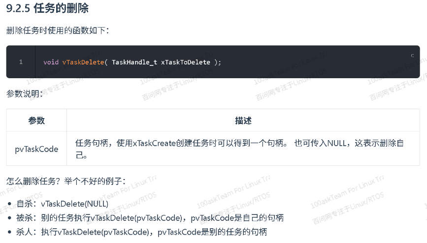

这是一个非常经典的FreeRTOS实战案例，涉及到任务管理的核心机制以及嵌入式开发中常见的“坑”。为了帮你准备嵌入式面试，我将从视频内容总结、知识点扩展、以及高频面试题三个维度进行整理。


# 一、 视频内容大纲与时间点总结

这个视频主要演示了如何使用红外遥控器来控制音乐播放任务的**创建（Create）** 与 **删除（Delete）**，并重点分析了在此过程中遇到的资源回收和内存碎片问题。

- **00:00 - 01:20：演示与需求分析**

  - 展示效果：按遥控器“播放”键，蜂鸣器播放音乐；按“电源”键，音乐停止。
  - 技术实现思路：<span style="color:#CC0000;">通过创建任务来播放，通过删除任务来停止。</span>

- **01:21 - 04:00：API与红外逻辑引入**

  - <span style="color:#CC0000;">讲解 `vTaskDelete()` 函数的使用（传 `NULL` 删除自己，传 `Handle` 删除指定任务）</span>。

    

  - 引入红外接收代码，解析按键值（播放键 `0xA8`，电源键 `0xA2`）。

- **04:01 - 08:50：核心逻辑编写与Handle管理**

  - 编写代码：<span style="color:#CC0000;">检测到播放键 -> `xTaskCreate`；检测到电源键 -> `vTaskDelete`。</span>
  - **<span style="color:#CC0000;">关键点</span>**：引入 `xSoundTaskHandle` 句柄。创建前判断句柄是否为 `NULL`（防止重复创建）；删除前判断句柄是否非空，删除后必须将句柄**手动置为 `NULL`**（防止野指针/重复删除）。

- **08:51 - 11:20：Bug复现——外设状态残留**

  - 现象：任务虽然被删除了，但蜂鸣器保持在最后的一个音调长鸣，没有静音。
  - 原因：<span style="color:#CC0000;">`vTaskDelete` 只是从操作系统层面移除了任务，回收了栈空间，但**不会自动复位该任务正在使用的硬件外设（GPIO/定时器状态）**。</span>

- **11:21 - 13:10：Bug修复——手动资源释放**

  - 解决：在调用 `vTaskDelete` 之前，必须显式调用 `PassiveBuzzer_Control(0)` 关闭蜂鸣器。

- **13:11 - 14:02：核心总结——内存碎片风险**

  - **深刻见解**：频繁创建和删除任务会进行动态内存分配与释放，容易导致**堆内存碎片（Heap Fragmentation）**。
  - 建议：实际工程中，对于频繁启停的功能，建议使用任务挂起/恢复（Suspend/Resume）或事件标志位，而不是反复创建删除。

------


# 完整实验代码

基于视频（特别是 **06:00 - 13:50** 这一段核心调试修改过程），我为你还原了完整的实验代码。

这段代码展示了如何在 **FreeRTOS** 中安全地创建和删除任务，并修复了视频中出现的“蜂鸣器关不掉”以及“句柄未置空”的 BUG。


### 核心逻辑代码 (主要在 `freertos.c` 或 `main.c` 中)

C

```c
/* 包含必要的头文件 */
#include "FreeRTOS.h"
#include "task.h"
#include "driver_lcd.h"
#include "driver_ir.h"
#include "driver_passive_buzzer.h"

/* 全局变量定义 */
// 音乐播放任务的句柄，初始化为NULL非常重要
TaskHandle_t xSoundTaskHandle = NULL; 

/* 外部函数声明 (假设音乐播放逻辑在另一个文件中) */
extern void PlayMusic(void *params);

/* * 默认主任务 (StartDefaultTask)
 * 功能：负责读取红外遥控器，并调度音乐任务
 */
void StartDefaultTask(void *argument)
{
    /* 1. 局部变量定义 */
    uint8_t dev, data; // dev: 设备ID, data: 按键键值
    int len;

    /* 2. 硬件初始化 */
    LCD_Init();
    LCD_Clear();
    IRReceiver_Init();

    /* 3. 初始提示信息 */
    LCD_PrintString(0, 0, "Waiting control");

    /* 4. 任务主循环 */
    for(;;)
    {
        /* 读取红外遥控器数据 */
        /* IRReceiver_Read 返回0表示读取成功 */
        if (IRReceiver_Read(&dev, &data) == 0)
        {
            /* ============================================================
             * 情况 A: 按下了播放键 (键值 0xA8) -> 创建任务
             * ============================================================ */
            if (data == 0xa8) 
            {
                /* 关键判断：防止重复创建 */
                /* 只有当任务句柄为NULL（任务不存在）时，才创建新任务 */
                if (xSoundTaskHandle == NULL)
                {
                    LCD_CleanLine(0); // 清除LCD第一行
                    LCD_PrintString(0, 0, "Create Task");
                    
                    /* 创建音乐播放任务 */
                    /* 参数说明：
                       1. PlayMusic: 任务函数指针
                       2. "SoundTask": 任务名称
                       3. 128: 堆栈大小
                       4. NULL: 传递给任务的参数
                       5. osPriorityNormal: 优先级 (CMSIS宏，通常对应FreeRTOS数值)
                       6. &xSoundTaskHandle: 接收任务句柄的地址
                    */
                    xTaskCreate(PlayMusic, "SoundTask", 128, NULL, osPriorityNormal, &xSoundTaskHandle);
                }
            }
            /* ============================================================
             * 情况 B: 按下了电源/停止键 (键值 0xA2) -> 删除任务
             * ============================================================ */
            else if (data == 0xa2) 
            {
                /* 关键判断：防止删除不存在的任务 */
                /* 只有当任务句柄不为NULL（任务存在）时，才执行删除 */
                if (xSoundTaskHandle != NULL)
                {
                    LCD_CleanLine(0); // 清除LCD第一行
                    LCD_PrintString(0, 0, "Delete Task");

                    /* ---------------------------------------------------
                     * 修复视频中BUG的核心步骤 1：硬件复位
                     * ---------------------------------------------------
                     * 删除任务前，必须手动关闭蜂鸣器。
                     * 因为 vTaskDelete 只回收内存，不负责关闭外设。
                     * 如果不加这行，蜂鸣器会卡在最后一声长鸣。
                     */
                    PassiveBuzzer_Control(0); 

                    /* 删除音乐任务 */
                    vTaskDelete(xSoundTaskHandle);

                    /* ---------------------------------------------------
                     * 修复视频中BUG的核心步骤 2：句柄置空
                     * ---------------------------------------------------
                     * 任务被删除后，xSoundTaskHandle 变量里依然存着旧的内存地址（野指针）。
                     * 必须手动设为 NULL，否则下次按播放键时，
                     * 上面的 if (xSoundTaskHandle == NULL) 判断会失效，导致无法创建新任务。
                     */
                    xSoundTaskHandle = NULL;
                }
            }
        }
        
        /* 延时一下，让出CPU控制权，防止看门狗复位或独占CPU (视频中隐含逻辑) */
        osDelay(1); 
    }
}
```

------


### 补充：被调用的音乐任务逻辑 (参考)

虽然视频主要在讲调度，但为了让你理解完整流程，这里补充 `PlayMusic` 的逻辑，这也是面试中可能会让你手写的简单逻辑。

C

```c
/* 音乐播放任务函数 */
void PlayMusic(void *params)
{
    int i = 0;
    // 假设这里有一个乐谱数组
    // MusicNote notes[] = { ... }; 
    
    while(1)
    {
        // 模拟播放逻辑
        // PassiveBuzzer_Control(1); // 响
        // PassiveBuzzer_Set_Freq(notes[i].freq); // 设置频率
        // vTaskDelay(notes[i].duration); // 延时（控制节拍）
        
        /* * 注意：这个任务是一个死循环。
         * 当我们在 StartDefaultTask 中调用 vTaskDelete 时，
         * 这个循环会被强制打断，代码执行会立即停止在当前行，
         * 这就是为什么需要外部手动关闭蜂鸣器的原因。
         */
    }
}
```


### 面试复习重点（代码中的“坑”）

在看这份代码时，请重点关注这三行，这是面试官最喜欢问的 **“嵌入式RTOS编程规范”**：

1. **`if (xSoundTaskHandle == NULL)`**：
   - **面试题**：如果不加这个判断直接 Create 会怎么样？
   - **答**：会导致内存泄漏（Memory Leak）。之前的任务句柄被覆盖，无法再被删除，而新任务又申请了一块堆内存。多次按下播放键会耗尽堆内存导致系统崩溃。
2. **`PassiveBuzzer_Control(0);`**：
   - **面试题**：为什么删除了任务，蜂鸣器还在响？
   - **答**：操作系统只管理 CPU 时间片和栈内存。硬件外设（寄存器状态）是持久的，除非显式重置，否则它会保持任务被杀那一刻的状态。此所谓“资源清理”。
3. **`xSoundTaskHandle = NULL;`**：
   - **面试题**：`vTaskDelete` 后句柄会自动变空吗？
   - **答**：不会。句柄只是一个指针变量。删除任务只是释放了指针指向的内存，但指针变量本身的值没变（变成了悬空指针）。必须手动置 NULL，作为“任务已销毁”的标志位。


# 二、 针对视频内容的补充与扩展（面试加分项）

视频中提到了两个非常核心的嵌入式概念，面试官非常喜欢深挖，你需要掌握得更深一点：


#### 1. 任务删除后的“资源回收”到底回收了什么？

视频中只提到了蜂鸣器没关。但在面试中，你需要回答得更全面：

- **Kernel回收的：** <span style="color:#CC0000;">任务控制块（TCB）和该任务分配的栈空间（Stack）。</span>
  - **注意：** <span style="color:#CC0000;">如果任务是**自己删除自己**（`vTaskDelete(NULL)`），内存回收是由**空闲任务（Idle Task）**完成的。如果空闲任务得不到执行（比如高优先级任务死循环），内存就会泄漏。</span>
- <span style="color:#FF0000; font-size:1.2em;">**Kernel不回收的（需要程序员负责）：**</span>
  - **硬件状态：** 如视频中的蜂鸣器、LED亮灭、打开的串口、开启的DMA等。
  - **任务内部申请的动态内存：** 如果任务里用了 `malloc` 或 `pvPortMalloc` 申请了缓冲区，删除任务前必须 `free`，否则永久泄漏。
  - **同步原语：** 任务持有的互斥锁（Mutex）如果没释放就删除了任务，会导致死锁或阻塞其他任务。


#### 2. 堆内存碎片（Heap Fragmentation）详解

视频最后提到了这个问题。

- **原理：** 假设总内存10KB。你申请了3块2KB的内存（A, B, C）。如果你释放了中间的B，此时剩余内存是4KB，但如果来了一个需要3KB连续空间的操作，可能会失败，因为剩下的4KB被切成了两段不连续的2KB。
- **FreeRTOS的对策：** 面试时可以提一下 FreeRTOS 的 **Heap_4.c**。它采用了**“内存合并算法”**，在释放内存时，会自动检测相邻的空闲块并将其合并成一个大块，从而有效减少碎片。而 **Heap_1.c** 根本不支持释放，**Heap_2.c** 支持释放但不合并（最容易产生碎片）。


#### 3. 替代方案：除了“创建/删除”，还有什么？

- **挂起/恢复 (Suspend/Resume)：** 任务依然占用内存，只是不参与调度。优点是响应快，无碎片风险；缺点是费RAM。
- **事件驱动 (Event/Semaphore)：** 任务进入阻塞态等待信号。这是最高效的做法。任务一直存在，平时 `xSemaphoreTake` 阻塞（不耗CPU），有按键时给信号唤醒。

------


# 补充提问

## 提问1

- **Kernel回收的：** <span style="color:#CC0000;">任务控制块（TCB）和该任务分配的栈空间（Stack）。</span>
  - **注意：** <span style="color:#CC0000;">如果任务是**自己删除自己**（`vTaskDelete(NULL)`），内存回收是由**空闲任务（Idle Task）**完成的。如果空闲任务得不到执行（比如高优先级任务死循环），内存就会泄漏。</span>
- <span style="color:#FF0000; font-size:1.2em;">**Kernel不回收的（需要程序员负责）：**</span>
  - **硬件状态：** 如视频中的蜂鸣器、LED亮灭、打开的串口、开启的DMA等。
  - **任务内部申请的动态内存：** 如果任务里用了 `malloc` 或 `pvPortMalloc` 申请了缓冲区，删除任务前必须 `free`，否则永久泄漏。
  - **同步原语：** 任务持有的互斥锁（Mutex）如果没释放就删除了任务，会导致死锁或阻塞其他任务。

<span style="font-weight:bold; font-size:1.2em;">如果我这里给创建任务时采用的是动态分配，那么当删除这个任务的时候Kernel是会回收这片malloc申请的动态内存的吧，上面说的Kernel不回收的是任务内部申请的动态内存，这与任务TCB和分配的栈是相互独立的。这样理解对吗。</span>


**你的理解非常精准，完全正确。**

你清晰地划分了 **“<span style="color:#FF0000;">操作系统负责的内存（Infrastructure）</span>”** 和 **“<span style="color:#FF0000;">业务逻辑负责的内存（User Data）</span>”** 的界限。这是一个非常关键的嵌入式操作系统概念。

为了让你在面试中回答得更专业，我将你的理解拆解为以下三个层面的详细确认：


### 1. 确认点：TCB 和 Stack 的生命周期管理

- **你的理解：** 当你使用 `xTaskCreate()`（动态创建）时，FreeRTOS 内核会自动调用 `pvPortMalloc()` 来申请两块内存：
  1. **TCB (Task Control Block)**：用于存放任务的状态、优先级、栈顶指针等。
  2. **Stack (任务栈)**：用于存放任务内的局部变量、函数调用上下文。
- **事实：** 当调用 `vTaskDelete()` 时，内核（Kernel）**确实会负责**回收这两块内存。内核知道这两个指针在哪里，所以它能通过 `vPortFree()` 把它们还给堆（Heap）。
- **结论：**<span style="color:#CC0000;"> 是的，这部分是自动的，你不需要手动去 free 任务的栈和 TCB。</span>


### 2. 确认点：任务内部申请内存的独立性

- **你的理解：** “任务内部申请的动态内存”与“TCB/Stack”是相互独立的。
- **事实：**<span style="color:#CC0000;"> 绝对独立。</span>
  - 在任务函数内部写 `char *buf = pvPortMalloc(100);` 时，这个<span style="color:#CC0000;"> `buf` 指针只是存放在任务的 **栈（Stack）** 上</span>（或者寄存器里）。
  - 当 `vTaskDelete()` 发生时，内核虽然回收了 **栈空间**，但它**并不检查**栈里面的数据是什么。
  - 这就好比：房东（Kernel）收回了房子（Stack/TCB），但他不会去检查房子里的保险箱（你的指针变量）里是否还存着一张健身房的会员卡（指向堆内存的引用）。房子收走了，那张会员卡对应的服务（堆内存）如果没有退订，就永远没人能找到了（内存泄漏）。


### 3. 必须补充的“面试陷阱”：空闲任务（Idle Task）的角色

虽然你的理解是对的，但在面试中，针对 **“Kernel 会回收 TCB 和 Stack”** 这一点，必须补上一个**极其重要**的限定条件（视频里也提到了）：

> 只有当任务是“被别人删除”时，回收才是立即发生的。
>
> 如果任务是“自己删除自己”（vTaskDelete(NULL)），回收是滞后的。

为什么？

当任务自己在运行的时候，它正在使用自己的栈（Stack）。它不能在自己还活着的时候就把自己脚底下的栈给释放掉，否则代码执行到一半就崩溃了。

**流程如下（高频考点）：**

1. 任务 A 调用 `vTaskDelete(NULL)`。
2. 内核把任务 A 放入“待删除列表”，并触发任务调度。
3. **必须等到空闲任务（Idle Task）运行**。
4. 空闲任务会检查“待删除列表”，发现任务 A 死了，**这时候空闲任务才去调用 `vPortFree` 释放任务 A 的 TCB 和 Stack。**

**总结给面试官的话术：**

> “对于使用 xTaskCreate 动态创建的任务，vTaskDelete 确实会回收 TCB 和栈空间。
>
> 但需要注意，如果是任务自删除，内存回收是委托给空闲任务完成的。因此，如果系统负载过高，导致空闲任务一直得不到调度，这部分内存就无法释放，表现得像内存泄漏一样。
>
> 至于任务内部业务逻辑申请的 malloc，内核无法感知，必须由程序员在删除任务前手动释放。”

这样回答，滴水不漏。


## 提问1 - （1）

在任务函数内部写 `char *buf = pvPortMalloc(100);` 时，这个<span style="color:#CC0000;"> `buf` 指针只是存放在任务的 **栈（Stack）** 上</span>（或者寄存器里）。
<span style="font-weight:bold; font-size:1.2em;">这里任务自己内部使用malloc分配的是自己任务栈上的空间吗，不应该是整个系统堆空间申请一部分吗，我不是太懂，你能够给我详细解释下吗。</span>


你的直觉非常敏锐！**<span style="color:#CC0000;">你的理解是对的：`pvPortMalloc` 申请的那 100 字节确实是在“系统堆（System Heap）”里，而不是在“任务栈”里。</span>**

你困惑的地方在于<span style="color:#CC0000;">**“指针变量本身”**和**“指针指向的内存”**</span>这两个概念的区别。

让我用一张图和一个比喻，彻底帮你理清这个关系。

------


### 1. 核心区别：指针 vs 内存实体

代码：`char *buf = pvPortMalloc(100);`

这行代码其实做了**三件事**，涉及了**两个完全不同的内存区域**：


#### 第一部分：`char *buf` （指针变量）

- **是什么？** 这是一个**局部变量**。它的作用是用来存放一个地址。
- **在哪里？** 因为它是函数内部定义的局部变量，所以它存放在**当前任务的栈（Task Stack）**上。
- **占多大？** 在 32 位单片机（如 STM32）上，它只占用 **4个字节**。


#### 第二部分：`pvPortMalloc(100)` （内存实体）

- **是什么？** 这是真正用来存数据的房间。
- **在哪里？** 它是从 **FreeRTOS 的全局堆（System Heap）** 中切分出来的。<span style="color:#CC0000;">这个堆是所有任务共享的大池子</span>（通常定义在 `FreeRTOSConfig.h` 中的 `configTOTAL_HEAP_SIZE`）。
- **占多大？** 占用 **100个字节**（加上少量的头部管理开销）。


#### 第三部分：`=` （赋值/关联）

- **发生了什么？** 这就是把“堆”上那 100 字节的**首地址**，抄写到“栈”上的 `buf` 变量里。

------


### 2. 图解：栈与堆的分离

假设整个单片机的内存（RAM）如下分布：

Plaintext

```c
+----------------------+
|   FreeRTOS 全局堆     |  <-- pvPortMalloc(100) 在这里划地盘
|   (System Heap)      |     (这是那 100 字节真正所在的地方)
|                      |
|  [ 100字节的数据区 ]  |  <-----\
+----------------------+        |
                                |
................................|.......
                                |
+----------------------+        |
|    任务 A 的栈        |        |
|   (Task A Stack)     |        |
|                      |        |
|  局部变量: int i      |        |
|  局部变量: char *buf  |  [ 0x20001234 ]  (buf 存着上面那个地址)
+----------------------+
```

**详细解释：**

1. **`buf`** 只是任务栈里的一个小格子（4字节）。
2. **`pvPortMalloc`** 跑去大仓库（堆）里占了 100 字节。
3. **`=`** 号让栈里的 `buf` 指向了堆里的那块地。

------


### 3. 为什么要强调这一点？（回到任务删除的问题）

回到我们之前讨论的 `vTaskDelete()` 造成的内存泄漏问题，这下你就明白为什么会泄漏了：

1. **当任务运行时**：栈上的 `buf` 指向堆里的内存，一切正常。
2. **当你调用 `vTaskDelete()` 时**：
   - 内核负责回收**任务栈**。
   - 于是，栈上的局部变量 `buf`（那 4 个字节的指针）被销毁了，或者说这块栈空间被标记为可覆盖了。
   - **但是！** 堆上的那 100 字节（数据区）是独立的。内核只回收了栈，并没有顺藤摸瓜去把 `buf` 指向的堆内存也回收掉。
3. **后果**：
   - 存放地址的 `buf` 没了（钥匙丢了）。
   - 那 100 字节的房间（房子）还在堆里锁着，显示“已占用”。
   - 因为钥匙没了，你再也找不到这个房间，也没办法去 `free` 它。这就是**内存泄漏**。


### 4. 经典比喻

- **任务栈（Stack）** = 你的**口袋**。
- **系统堆（Heap）** = 火车站的**储物柜区**。
- **`char \*buf`** = 一张**纸条**，放在你的口袋里。
- **`pvPortMalloc(100)`** = 你租了一个**储物柜**。

过程：

你在纸条上写下储物柜的编号（比如 A12），然后把纸条放进口袋。

任务删除（vTaskDelete）：

相当于把你的裤子（口袋）给烧了。

- **结果：** 纸条（指针 `buf`）烧没了。
- **泄漏：** 储物柜 A12（堆内存）依然是被你租用的状态，而且柜门锁着。但因为纸条烧了，你已经忘记了柜子编号，管理员（系统）认为柜子还在用，别人也用不了，你也还不了。


### 总结

- **`buf` (变量本身)**：在**任务栈**上。
- **`pvPortMalloc` 分配的内容**：在**系统堆**上。
- **你的理解修正**：任务自己内部使用 `malloc` 分配的**不是**自己任务栈上的空间，而是**系统堆**的空间。只是用来通过**栈上的指针**去管理这块空间。

这下是否清晰了？这个概念在 C 语言指针部分是非常核心的。


## 提问2

- **Kernel回收的：** <span style="color:#CC0000;">任务控制块（TCB）和该任务分配的栈空间（Stack）。</span>
  - **注意：** <span style="color:#CC0000;">如果任务是**自己删除自己**（`vTaskDelete(NULL)`），内存回收是由**空闲任务（Idle Task）**完成的。如果空闲任务得不到执行（比如高优先级任务死循环），内存就会泄漏。</span>
- <span style="color:#FF0000; font-size:1.2em;">**Kernel不回收的（需要程序员负责）：**</span>
  - **硬件状态：** 如视频中的蜂鸣器、LED亮灭、打开的串口、开启的DMA等。
  - **任务内部申请的动态内存：** 如果任务里用了 `malloc` 或 `pvPortMalloc` 申请了缓冲区，删除任务前必须 `free`，否则永久泄漏。
  - **同步原语：** 任务持有的互斥锁（Mutex）如果没释放就删除了任务，会导致死锁或阻塞其他任务。

<span style="font-weight:bold; font-size:1.2em;">这里Kernel不回收的硬件状态这里我有点不同，我们要如何来手动关闭这些硬件呢，对应的代码分分别是什么呢，你能够给我详细解释下吗。</span>


这是一个非常棒的问题，直击嵌入式系统软硬件交互的痛点。

你的理解完全正确：**操作系统的内核（Kernel）和硬件驱动（Driver）是两层完全不同的东西。**

FreeRTOS 内核只认识 **CPU 寄存器、RAM、堆栈指针**。对于内核来说，打开一个串口、点亮一个 LED，仅仅是往某个物理内存地址写了一个值而已。<span style="color:#CC0000;">内核根本不知道那个地址代表“蜂鸣器”，也不知道“高电平”代表“响”。所以，当你删除任务时，内核无法帮你把电平拉低。</span>

我们<span style="color:#CC0000;">要手动关闭这些硬件，通常有 **“直接复位”** 和 **“优雅退出”**</span> 两种层面的做法。下面我针对常见的硬件外设，给出详细的代码示例（以 STM32 HAL 库为例，这是面试中最常见的环境）。


### 一、 常见硬件的手动复位代码

#### 1. GPIO 类（蜂鸣器、LED、继电器）

这是最容易出问题的。<span style="color:#CC0000;">如果任务被删除时引脚是高电平，它会永远保持高电平。</span>

- **场景**：任务里点亮了 LED 或开启了蜂鸣器。
- <span style="color:#CC0000;">**清理代码**：在删除任务前，强制写低电平（或无效电平）。</span>

C

```c
// 假设这是你的控制任务句柄
extern TaskHandle_t xLedTaskHandle;

void DeleteLedTask(void)
{
    if (xLedTaskHandle != NULL)
    {
        // 【第一步：手动清理】
        // 必须明确知道该任务操作了哪些引脚，并将其复位
        HAL_GPIO_WritePin(GPIOA, GPIO_PIN_5, GPIO_PIN_RESET); // 熄灭LED
        
        // 【第二步：删除任务】
        vTaskDelete(xLedTaskHandle);
        xLedTaskHandle = NULL;
    }
}
```


#### 2. 定时器/PWM 类（电机控制、呼吸灯）

PWM 如果不关，删除任务后，定时器外设依然在硬件层面上自动计数，引脚依然会输出波形，电机就会一直转，这非常危险。

- **场景**：任务开启了 TIM3 通道 1 输出 PWM 控制电机。
- <span style="color:#CC0000;">**清理代码**：停止 PWM 输出。</span>

C

```c
void DeleteMotorTask(void)
{
    // 【第一步：手动清理】
    // 停止 PWM 波形生成
    HAL_TIM_PWM_Stop(&htim3, TIM_CHANNEL_1);
    
    // 为了保险，有时还需要将引脚设为安全电平（防止刹车/惯性逻辑）
    // HAL_GPIO_WritePin(..., ...); 

    // 【第二步：删除任务】
    vTaskDelete(xMotorTaskHandle);
}
```


#### 3. 通信接口 类（UART、SPI、I2C）+ DMA

如果你正在通过 DMA 发送大量数据，中途突然把任务删了，DMA 控制器并不会停，它会继续搬运数据，可能会导致总线冲突或内存破坏。

- **场景**：任务正在进行串口 DMA 发送。
- **清理代码**：中止传输，关闭中断。

C

```c
void DeleteUartTask(void)
{
    // 【第一步：手动清理】
    // 1. 停止当前的 DMA 或 中断 传输
    HAL_UART_Abort(&huart1); 
    // 或者 HAL_UART_Abort_IT(&huart1);
    
    // 2. (可选) 如果该串口不再使用了，可以彻底反初始化，释放硬件资源
    // HAL_UART_DeInit(&huart1);

    // 【第二步：删除任务】
    vTaskDelete(xUartTaskHandle);
}
```

------


### 二、 面试高阶技巧：如何“优雅”地管理这些关闭操作？

在面试中，如果你只回答上面的代码，只能得 80 分。因为在外部（比如主任务里）去帮子任务擦屁股（清理资源）是非常**不安全**且**高耦合**的。

**满分回答是<span style="color:#CC0000;">：采用“请求删除 + 任务自清理”模式。</span>**

**核心思想**：不要在外部强制 `vTaskDelete` 别人（相当于直接拔网线），而是通知任务“请你退出”，<span style="color:#CC0000;">让任务自己收拾好东西，然后自己 `vTaskDelete(NULL)`（相当于点击关机按钮）。</span>


#### 示例代码：

C

```c
/* 定义一个标志位，或者使用 任务通知(TaskNotify) */
volatile uint8_t g_StopMusicFlag = 0;

/* 音乐任务：包含自清理逻辑 */
void SoundTask(void *argument)
{
    // 1. 初始化硬件
    PassiveBuzzer_Init();
    
    for(;;)
    {
        // 2. 业务逻辑
        Play_Note();
        
        // 3. 检查退出标志 (Check Point)
        if (g_StopMusicFlag == 1)
        {
            break; // 跳出死循环
        }
        
        osDelay(10);
    }
    
    /* =========================================
       这里是“临终关怀区” (Cleanup Section)
       代码运行到这里，说明接到了退出指令
       ========================================= */
       
    // 1. 关闭硬件 (只有任务自己最清楚自己开了什么)
    PassiveBuzzer_Control(0); 
    HAL_TIM_PWM_Stop(&htim1, TIM_CHANNEL_1);
    
    // 2. 释放动态内存 (如果有)
    // vPortFree(buffer);
    
    // 3. 释放互斥锁 (如果有)
    // xSemaphoreGive(xMutex);
    
    // 4. 最后，光荣自杀
    // 此时再置空外部的句柄，防止野指针
    xSoundTaskHandle = NULL; 
    g_StopMusicFlag = 0; // 复位标志
    
    vTaskDelete(NULL); // 删除自己
}

/* 主任务：只是发送请求 */
void DefaultTask(void *arg)
{
    // ... 检测到按键 ...
    
    // 不直接删除，而是请求停止
    if (xSoundTaskHandle != NULL)
    {
        g_StopMusicFlag = 1; 
        // 此时 StartDefaultTask 并不直接调用 vTaskDelete
    }
}
```


### 三、 总结

针对你的提问：

1. **怎么关？** 查阅芯片厂商提供的库函数（HAL库、标准库），找到对应的 `Stop`、`DeInit`、`WritePin(Low)` 函数。
2. **在哪里关？**
   - **下策**：在删除任务前，由外部任务调用这些函数（容易漏、耦合度高）。
   - **上策**：在任务内部写好“清理代码段”，外部只负责发送停止信号，让任务自己执行清理代码后自杀。

**面试话术建议：**

> “关于硬件状态的回收，因为内核不感知外设，所以必须手动关闭。
>
> 最直接的方法是在调用 vTaskDelete 前使用 HAL 库关闭 PWM 或复位 GPIO。
>
> 但在实际工程中，为了安全，我通常会设计任务自清理流程：设置一个标志位通知任务退出，任务跳出主循环后，先关闭外设、释放 malloc 的内存，最后再调用 vTaskDelete(NULL) 删除自己。这样能确保资源回收的完整性，避免外部强制删除可能导致的逻辑截断风险。”


# 三、 经典面试题与简洁回复

针对这个视频的知识点，我为你准备了5个层层递进的面试题。


#### Q1: 在FreeRTOS中，调用 `vTaskDelete()` 删除一个任务后，该任务占用的内存是立即释放的吗？

> 回复：
>
> 不一定。
>
> 1. 如果是**删除其他任务**（传入Handle），内存会立即被释放。
> 2. 如果是**任务自杀**（传入NULL），其TCB和栈内存的释放是由**空闲任务（Idle Task）**在后续执行时完成的。因此，必须确保空闲任务有机会得到调度，否则会导致内存耗尽。


#### Q2: 视频中提到删除任务后蜂鸣器还在响，这说明了什么系统设计原则？

> 回复：
>
> 说明了操作系统（OS）只管理软件资源（如线程、栈、信号量），而不管理硬件状态。
>
> 原则： 谁申请/开启，谁负责释放/关闭。在删除任务前，必须手动执行**“清理工作”**（Cleanup），包括关闭外设、释放互斥锁、释放任务内动态申请的堆内存，防止资源泄漏或状态异常。


#### Q3: 为什么在嵌入式系统中，不推荐频繁地使用 `xTaskCreate` 和 `vTaskDelete` 来控制功能开关？

> 回复：
>
> 主要有两个原因：
>
> 1. **性能开销：** 创建和删除任务涉及繁重的内核操作（内存分配、TCB初始化、链表操作），由于耗时较长，不仅影响实时性，还增加CPU负载。
> 2. **内存碎片：** 反复的 `malloc/free` 容易造成堆内存碎片，导致系统运行一段时间后，明明有剩余总内存，却无法分配出足够大的连续块，导致系统崩溃。


#### Q4: 既然删除任务有风险，你如何设计一个“音乐播放器”任务，既能随时停止又能随时播放，且不删除任务？

> 回复：
>
> 我会采用**“事件驱动”**的设计模式：
>
> 1. 在系统初始化时只创建一次音乐任务。
>
> 2. 任务内部是一个死循环，通过 `xQueueReceive` 或 `xTaskNotifyWait` 进入阻塞状态等待指令。
>
> 3. <span style="color:#CC0000;">当按下播放键，发送指令/信号唤醒任务播放；按下停止键，发送停止指令，任务停止输出PWM并重新进入阻塞状态等待。</span>
>
>    <span style="color:#CC0000;">这样既避免了内存碎片，响应速度也最快。</span>


#### Q5: 代码中 `vTaskDelete(xSoundTaskHandle)` 后，为什么要加一句 `xSoundTaskHandle = NULL`？

> 回复：
>
> 为了防止**悬空指针（Dangling Pointer）**或野句柄。
>
> 任务被删除后，原本的 Handle 变量依然保存着已经被释放的内存地址。如果不置空，后续逻辑若判断 if(Handle != NULL) 就会误以为任务还存在，进而尝试操作一个不存在的任务，导致严重的 HardFault（硬件错误）或系统崩溃。

------

下一步建议：

你可以尝试不看视频代码，自己用 “任务挂起/恢复” 或者 “信号量阻塞” 的方式重写这个红外控制音乐的程序。如果你能写出来，这个面试知识点你就完全拿下了。需要我提供这种替代方案的代码逻辑框架吗？