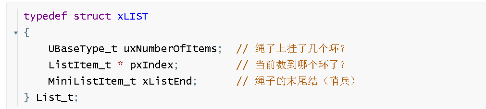

这份视频是韦东山老师关于 FreeRTOS 中 **“优先级（Priority）”** 与 **“阻塞延时（Blocking Delay）”** 的实战演示。它非常直观地展示了在实时操作系统（RTOS）中，单纯提高优先级可能导致的“任务饥饿”问题，以及如何通过阻塞机制来解决这一问题。

以下是针对该视频的详细总结、扩展知识点以及针对嵌入式面试的精选问题。

------


# 1. 视频内容总结与时间点


这个视频通过一个具体的实验（音乐播放+LED闪烁+LCD显示），展示了多任务系统中 CPU 资源分配的两种极端情况。

- **00:00 - 00:50** **背景回顾**：回顾之前的程序，音乐播放效果卡顿（因为有 LED、LCD 等其他任务抢占资源）。如果注释掉其他任务，音乐就流畅了，但这不符合多任务系统的要求。
- **00:51 - 01:40** **方案尝试：提高优先级**：将代码复制到新工程 `08_task_priority`。<span style="color:#CC0000;">为了让音乐不卡顿，将音乐播放任务的优先级从 `osPriorityNormal` 提升一级（`+1`），使其高于 LED 和 LCD 任务。</span>
- **01:41 - 02:20** **演示“死循环”后果**：<span style="color:#CC0000;">烧录程序后，音乐确实流畅了，**但是** LED 不再闪烁，LCD 不更新，甚至按键（用于停止音乐）也完全没反应。系统看起来像“死机”了一样，只有音乐在响。</span>
- **02:21 - 03:00** **原理分析（CPU 独占）**：解释原因。<span style="color:#CC0000;">音乐任务不仅优先级高，而且内部使用的是 `mdelay`（忙等待/死循环延时）</span>。这意味着音乐任务一直在 CPU 上空转，从未释放 CPU 控制权。低优先级的任务（LED、按键检测）永远得不到运行机会，这被称为**任务饥饿（Starvation）**。
- **03:01 - 03:25** **解决方案：引入阻塞延时**：<span style="color:#CC0000;">将音乐任务中的忙等待函数 `mdelay` 替换为 FreeRTOS 的阻塞延时函数 `vTaskDelay`</span>（代码中体现为 `osDelay` 或直接调用 API）。
- **03:26 - 04:00** **最终效果演示**：重新烧录。现在，音乐播放流畅（因为优先级高，需要运行时立即运行），同时 LED 正常闪烁，按键也能控制音乐停止。
- **04:01 - 结尾** **总结**：<span style="color:#FF0000;">通过结合“高优先级”和“阻塞延时”，实现了高优先级任务在需要时抢占 CPU，在不需要时（延时期间）主动让出 CPU 给低优先级任务。</span>

------

# 补充提问

## 提问1

<span style="font-weight:bold; font-size:1.2em;">为什么将音乐播放任务的优先级从 `osPriorityNormal` 提升一级（`+1`），烧录程序后，音乐确实流畅了，**但是** LED 不再闪烁，LCD 不更新，甚至按键（用于停止音乐）也完全没反应。系统看起来像“死机”了一样，只有音乐在响。你能够从代码层面给我详细解释下吗，我不太懂。</span>


这是一个非常经典且极其重要的 RTOS（实时操作系统）概念问题。很多初学者都会在这里“踩坑”。

系统看起来像“死机”，其实 CPU 并没有死，它反而在**非常努力地工作**——只不过它**100% 的时间**都花在了那个高优先级的音乐任务里“空转”数数，完全没有空闲时间分给 LED 或按键任务。

我将从**代码逻辑**和**调度器原理**两个层面，把这件事掰开揉碎讲给你听。


### 1. 核心原因：<span style="color:#FF0000;">抢占式调度 + 忙等待 (Busy Wait)</span>


FreeRTOS 的调度器有一个**铁律**：

> <span style="color:#FF0000;">**“永远只运行处于‘就绪态（Ready）’且优先级最高的任务。”**</span>

只有当高优先级的任务**主动放弃** CPU（进入阻塞态 Blocked）或者**被挂起**（Suspended）时，低优先级的任务才有可能获得运行机会。


#### 让我们看看“死机”时的代码逻辑

在视频演示的那个“失败”案例中，音乐任务的代码逻辑大致是这样的（使用了 `mdelay` 或类似 `HAL_Delay`）：

C

```c
// 音乐任务 (优先级：高)
void MusicTask(void *argument) {
    while(1) {
        // 1. 设置蜂鸣器发声
        Buzzer_On(); 

        // 2. 延时一段时间保持发声 (问题的根源！)
        // 这里使用的是“忙等待”延时
        mdelay(500); 
        
        // 3. 关闭蜂鸣器
        Buzzer_Off();
    }
}

// LED 任务 (优先级：低)
void LEDTask(void *argument) {
    while(1) {
        LED_Toggle();
        vTaskDelay(100);
    }
}
```


### 2. 代码层面的“案发过程”详解

让我们深入到那个 `mdelay(500)` 内部看看 CPU 在干什么。


#### A. 什么是 `mdelay` (忙等待)？

它的底层实现通常是一个死循环，让 CPU 傻傻地数数：

C

```c
void mdelay(int ms) {
    // 假设 CPU 很快，数到 10000 需要 1ms
    long count = ms * 10000; 
    while(count > 0) {
        count--; // CPU 在这里疯狂运算减法
    }
}
```

**重点：** 在执行 `while(count > 0)` 时，CPU 是一直在**运算**的。<span style="color:#FF0000;">在调度器眼里，**这个任务正在“运行”，并没有“休息”**。</span>


#### B. 调度器的心理活动

现在，音乐任务优先级是 **2**（高），LED 任务优先级是 **1**（低）。

1. **T=0ms**：系统启动。
2. **调度器检查**：音乐任务（优先级2）是就绪的吗？是的。LED任务（优先级1）是就绪的吗？是的。
   - **决定**：<span style="color:#FF0000;">运行优先级最高的 -> **运行音乐任务**。</span>
3. **T=1ms**：音乐任务执行到了 `mdelay` 里面，正在做减法 `count--`。
   - <span style="color:#FF0000;">此时系统滴答定时器（SysTick）中断来了，告诉调度器：“1毫秒到了，要不要换个任务跑跑？”</span>
   - **调度器再次检查**：
     - 音乐任务状态？**Ready/Running**（因为它在做减法，它没说要睡觉）。
     - LED 任务状态？**Ready**。
   - **决定**：<span style="color:#FF0000;">根据铁律，必须运行优先级最高的。音乐任务优先级(2) > LED任务优先级(1)。**继续运行音乐任务**。</span>
4. **T=2ms ... T=500ms**：
   - 这 500ms 里，每次调度器想切任务，一看音乐任务还在那里“干活”（做减法），且优先级最高，就只能让它继续跑。
5. **T=500.1ms**：`mdelay` 结束了，代码紧接着执行 `Buzzer_Off()`，然后又是 `while(1)` 循环回到开头，再次调用 `mdelay`。

**结论**：音乐任务就像一个霸道的 VIP 客户，坐在银行柜台前（占用 CPU），他的业务是“数完一亿颗大米”（执行死循环延时）。虽然他在数大米的时候并没有真正产生价值，但他**没有离开柜台**。因此，后面排队的普通客户（LED、按键）永远轮不到办理业务。


### 3. 为什么叫“死机”？

这就是所谓的<span style="color:#CC0000;">**任务饥饿 (Starvation)**。</span>

- **LED 不闪**：LED 任务一行代码都跑不到。
- **按键没反应**：<span style="color:#CC0000;">检测按键的代码通常也在一个低优先级任务里，或者是在主循环里，根本轮不到执行。</span>
- **音乐流畅**：<span style="color:#CC0000;">因为 CPU 100% 的资源都给它了，当然流畅。</span>


### 4. 正确的做法：vTaskDelay (阻塞延时)

视频后半段，<span style="color:#CC0000;">将 `mdelay` 换成了 `vTaskDelay`（或 `osDelay`）</span>，代码变成了这样：

C

```c
// 音乐任务 (优先级：高)
void MusicTask(void *argument) {
    while(1) {
        Buzzer_On(); 
        
        // 关键修改：使用 RTOS 的阻塞延时
        vTaskDelay(500); 
        
        Buzzer_Off();
    }
}
```


#### `vTaskDelay` 的底层逻辑：

1. **T=0ms**：运行音乐任务。
2. **T=1ms**：执行到 `vTaskDelay(500)`。
   - 这句话的意思是：**<span style="color:#CC0000;">“调度器你好，我要去睡觉（Blocked）了，请在 500个 Tick 之后叫醒我。现在这把椅子（CPU）我让出来了。”</span>**
   - <span style="color:#CC0000;">音乐任务状态：**Running -> Blocked**。</span>
3. **调度器检查**：
   - 音乐任务？**Blocked**（不可运行）。
   - LED 任务？**Ready**（优先级1）。
   - **决定**：<span style="color:#CC0000;">虽然 LED 优先级低，但它是目前**唯一/最高**能跑的任务。-> **切换到 LED 任务**。</span>
4. **T=2ms ... T=499ms**：音乐任务在睡大觉，CPU 全力运行 LED 任务和按键检测。
5. <span style="color:#CC0000;">**T=500ms**：闹钟响了。</span>
   - 音乐任务状态：<span style="color:#CC0000;">**Blocked -> Ready**。</span>
   - **调度器检查**：音乐任务（优先级2）醒了！LED 任务（优先级1）正在跑。
   - **决定**：<span style="color:#CC0000;">抢占！暂停 LED 任务，**切回音乐任务**。</span>


### 总结

- **死机原因**：<span style="color:#CC0000;">高优先级任务使用了**死循环延时（忙等待）**，导致它在延时期间依然霸占着 CPU 使用权（状态为 Ready/Running）。根据 RTOS 规则，低优先级任务无法抢占，从而被“饿死”。</span>
- **解决办法**：<span style="color:#CC0000;">高优先级任务必须使用**阻塞延时（vTaskDelay）**。在不需要干活的时候（延时期间），主动交出 CPU 权，进入 Blocked 状态，让低优先级任务有机会运行。</span>


## 提问2

<span style="font-weight:bold; font-size:1.2em;"> vTaskDelay(500) 这个函数是如何实现的呢，我不是太懂，你能够给我详细解释下吗？</span>

这是一个非常硬核且底层的问题！问到点子上了。

理解 `vTaskDelay` 的实现原理，就是理解实时操作系统（RTOS）**“任务管理”**和**“链表操作”**的核心。

为了让你听懂，我把复杂的 C 代码逻辑拆解成一个**“酒店叫醒服务”**的故事，然后再对应到底层的**链表（List）操作**。

------


### 1. 通俗理解：酒店叫醒服务

想象 FreeRTOS 的调度器是一个**酒店前台经理**，CPU 是唯一的**工作台**，任务（Task）是**工人**。

1. **当前状态**：你是“音乐播放工人”，你正在工作台（CPU）上干活。
2. **调用 `vTaskDelay(500)`**：你觉得累了，走到前台对经理说：“我要睡 500 毫秒，时间到了再叫我，把工作台让给别人吧。”
3. **经理的操作（关键步骤）**：
   - **看表**：现在的系统时间是 1000。算出你的唤醒时间 = 1000 + 500 = **1500**。
   - **移出名单**：经理把你的名字从**“正在干活（Ready List）”**的小黑板上擦掉。
   - **写入名单**：经理把你的名字写到**“等待叫醒（Delayed List）”**的小本子上，并备注“1500 时唤醒”。
   - **换人**：经理大喊：“下一个优先级的工人（LED 任务），你去工作台干活！”
4. **你的状态**：你离开了工作台，去睡觉了（Blocked）。此时你完全不占用工作台。

------


### 2.<span style="color:#CC0000;"> 底层实现：三个核心步骤</span>

在代码层面，`vTaskDelay` 主要做了三件事：**算时间**、**挪链表**、**切任务**。

FreeRTOS 维护了两个重要的“名单”（链表）：

- **`pxReadyTasksLists` (就绪列表)**：这里面的任务随时准备抢占 CPU。
- **`pxDelayedTaskList` (延时列表)**：这里面的任务正在睡觉，调度器完全不管它们。


#### 第一步：计算“闹钟”时间

当你在代码里执行 vTaskDelay(500) 时，<span style="color:#CC0000;">内核首先获取当前系统滴答计数（xTickCount）。</span>

假设当前 xTickCount = 1000。

内核计算：xTimeToWake = 1000 + 500 = 1500。

<span style="color:#CC0000;">这个 1500 就是你的任务由于被唤醒的目标时间点。</span>


#### 第二步：挪动任务（从 Ready 到 Delayed）—— 最核心的一步

FreeRTOS 也是用结构体（TCB - 任务控制块）来代表一个任务。

- <span style="color:#CC0000;">内核将当前任务（`pxCurrentTCB`）从 **就绪列表** 中**移除**。</span>
  - **后果：下次调度器找人干活时，根本看不到你，因为你不在就绪名单里了。**
- <span style="color:#CC0000;">内核根据计算出的 `xTimeToWake` (1500)，将该任务**插入**到 **延时列表** 中。</span>
  - <span style="color:#CC0000;">延时列表是按“唤醒时间”排序的。唤醒时间早的排前面。</span>


#### 第三步：<span style="color:#CC0000;">任务切换（让出 CPU）</span>

<span style="color:#CC0000;">任务把自己“关进”延时列表后，必须手动触发一次**任务调度**（Context Switch）。</span>

- 在 ARM 架构中，通常是触发 `PendSV` 中断或调用 `portYIELD()`。
- **<span style="color:#CC0000;">保存现场</span>**：CPU 把你当前运行到了哪一行代码、寄存器里的值都保存到你的栈里。
- **<span style="color:#CC0000;">加载新任务</span>**：CPU 从就绪列表中找到优先级最高的另一个任务（比如 LED 任务），恢复它的现场。
- **<span style="color:#CC0000;">执行</span>**：CPU 跳转到 LED 任务的代码去执行。
- **注意：对于你的音乐任务来说，代码就停在 `vTaskDelay` 这一行，不再往下走了，直到被唤醒。**

------


### 3. 怎么醒过来？（SysTick 的作用）

你可能会问：“我睡着了，谁来负责盯着时间看是不是到 1500 了？”

答案是：**SysTick 中断（系统滴答定时器）**。

<span style="color:#CC0000;">这是一个硬件定时器，每隔 1ms（假设 Tick 是 1ms）就会打断 CPU 一次，执行中断服务函数 `xPortSysTickHandler`。</span>

**<span style="color:#CC0000;">每 1ms 发生的事情</span>：**

1. **<span style="color:#CC0000;">计数增加</span>**：全局变量 `xTickCount` 加 1。
2. **<span style="color:#CC0000;">检查延时列表</span>**：调度器会去查看 `pxDelayedTaskList` 里的**第一个任务**（最快要醒的那个）。
   - 问：你的唤醒时间 (`xTimeToWake`) 是多少？
   - 答：我是 1500。
   - 问：现在的 `xTickCount` 是多少？
   - 答：现在才 1001。
   - 结论：时间没到，继续睡，退出中断，继续跑 LED 任务。
3. **时间到了（T=1500）**：
   - 当 `xTickCount` 变成 1500 时，再次检查。
   - 发现当前任务的唤醒时间也是 1500。**时间到！**
   - **挪回名单**：把该任务从 **延时列表** 移除，重新加入 **就绪列表**。
   - **触发抢占**：如果刚醒来的这个任务（音乐）优先级比当前跑的任务（LED）高，立刻触发任务切换。

------


### 4. 总结：为什么 `vTaskDelay` 高效？

对比一下：

- **忙等待 (`mdelay`) 实现**：

  C

  ```c
  // CPU: 我在一刻不停地做减法，累死我了，还没空理别人。
  while(count > 0) count--; 
  ```

- **阻塞延时 (`vTaskDelay`) 实现**：

  C

  ```c
  // 任务: 把我从就绪名单删掉，加到延时名单。
  // 任务: 换别人来用 CPU。
  // (CPU 去跑别的任务了，当前任务完全不消耗 CPU 资源)
  // ... 等待 SysTick 中断把任务挪回来 ...
  ```

面试加分项（One More Thing）：

如果你在面试中能提到 “<span style="color:#CC0000;">列表溢出（List Overflow）</span>”，面试官会觉得你很强。

- **问题**：`xTickCount` 是一个 `uint32_t`，一直在加，总有一天会溢出变成 0，对吧？那如果我现在是 `0xFFFFFFFE`，延时 5ms，目标时间就是 `3`。但这会导致逻辑错乱（3 < 0xFFFFFFFE）。
- **解决**：FreeRTOS 实际上有<span style="color:#CC0000;">两个延时列表</span>：`pxDelayedTaskList` 和 `pxOverflowDelayedTaskList`。<span style="color:#CC0000;">如果计算出的唤醒时间溢出了，就把任务放到“溢出列表”里。当系统时间也溢出（归零）时，交换这两个列表的指针。这叫**“列表交换机制”**。</span>

希望这个解释能帮你彻底搞懂 `vTaskDelay`！它是 RTOS 灵魂所在。


## 提问 2 - （1） 

<span style="font-size:1.2em; font-weight:bold;"><span style="color:#CC0000;">延时列表是按“唤醒时间”排序的。唤醒时间早的排前面。</span>这里我不是太懂，在代码层面是怎么实现的呢，你能够给我详细解释下吗。</span>


这是一个非常深入的**数据结构与算法**问题，在嵌入式面试中，如果你能把这个底层机制讲清楚，面试官会对你的印象非常好。

FreeRTOS 之所以高效，秘密就在于：**它宁愿在“安排任务（入队）”时多花点时间排序，也要保证在“系统中断（Tick）”时能以最快速度检查任务。**

下面我从**数据结构**、**排序算法**和**中断检查**三个层面详细解释代码层面的实现。

------


### 1. 核心数据结构：`xItemValue`

在 FreeRTOS 中，每一个任务（TCB）都有一个叫 `xStateListItem` 的结构体成员，用来把任务挂到各种列表（就绪、阻塞等）上。

这个结构体里有一个至关重要的成员变量：**`xItemValue`**。

C

```c
struct xLIST_ITEM
{
    configLIST_VOLATILE TickType_t xItemValue; // <--- 关键变量：列表项的值
    struct xLIST_ITEM * configLIST_VOLATILE pxNext; // 指向下一个列表项
    struct xLIST_ITEM * configLIST_VOLATILE pxPrevious; // 指向上一个
    // ... 其他指针指向 TCB
};
```

- **<span style="color:#CC0000;">在就绪列表中</span>**：`xItemValue` 存的是任务的**<span style="color:#CC0000;">优先级</span>**（优先级高的排前面/后面，视配置而定）。
- **<span style="color:#CC0000;">在延时列表中</span>**：`xItemValue` 存的是任务的**<span style="color:#CC0000;">唤醒时间点</span>（Wake Time）**。

**结论**：所谓的“排序”，本质上就是比较 `xItemValue` 的大小。

------


### 2. 插入时的排序逻辑：`vListInsert`

当你调用 `vTaskDelay(500)` 时，内<span style="color:#CC0000;">核算出了你的唤醒时间（例如 `1500`）。然后，它调用了一个通用链表插入函数：**`vListInsert`**。</span>

这个函数**不是**简单地把任务扔到链表尾部，而是**一边遍历一边找位置**。


#### 模拟代码层面的插入过程：

假设现在的 **Delayed List** 里已经有了两个任务在睡觉：

- **Task A**: 唤醒时间 1200
- **Task B**: 唤醒时间 1800

现在，你的 **Task C**（唤醒时间 1500）要插入。

**`vListInsert` 的执行步骤：**

1. **获取目标值**：拿到 Task C 的 `xItemValue` = **1500**。
2. **开始遍历**：从列表头部开始看。
3. **比对 Task A**：
   - Task A 的值是 1200。
   - 1500 > 1200 吗？**是**。说明 Task C 醒得比 Task A 晚，应该排在它后面。
   - **继续往后找**。
4. **比对 Task B**：
   - Task B 的值是 1800。
   - 1500 > 1800 吗？**否**。说明 Task C 醒得比 Task B 早。
   - **停止寻找**。
5. **插入动作**：
   - 就在 Task A 和 Task B 之间停下。
   - 修改指针：Task A 的 `Next` 指向 Task C；Task C 的 `Next` 指向 Task B。

<span style="color:#CC0000;">**最终链表顺序**：1200 -> **1500** -> 1800。</span>

<span style="color:#CC0000;">这就保证了列表永远是**升序排列**的。</span>

------


### 3. 为什么这么做？（面试核心考点：时间复杂度）

你可能会问：**“插入的时候还要遍历链表，这不慢吗？”**

是的，插入操作的时间复杂度是 O(N)（N是已经在睡觉的任务数量）。

但是，这样做是为了换取 SysTick 中断 的极致速度 O(1)。

请想象一下系统中断（Tick Interrupt）每 1 毫秒发生一次，如果列表是乱序的：

- **乱序情况**：Tick 中断来了，内核必须**遍历整个列表**，挨个问：“你是 1500 吗？你是 1500 吗？”如果列表里有 100 个任务在睡觉，中断处理时间就会很长，系统就卡了。
- **排序情况（FreeRTOS 的做法）**：<span style="color:#CC0000;">Tick 中断来了，内核**只看第一个任务**。</span>
  - 当前时间 1400。
  - 看列表头（Task A，1200）：醒了！移走。
  - 看新的列表头（Task C，1500）：时间没到。
  - **直接退出中断**。<span style="color:#CC0000;">因为列表是升序的，既然第一个都没到时间，后面的一定都没到时间，根本不用看。</span>

**总结**：FreeRTOS 采用了<span style="color:#CC0000;"> **“插入时多干活，中断时少干活”** 的策略，保证了系统的实时性。</span>

------


### 4. 补充：代码片段解析

这是 FreeRTOS 源码中 `list.c` 里 `vListInsert` 函数的简化逻辑，你可以看到那个 <span style="color:#CC0000;">`for` 循环就是核心：</span>

C

```c
void vListInsert( List_t * const pxList, ListItem_t * const pxNewListItem )
{
    const TickType_t xValueOfInsertion = pxNewListItem->xItemValue; // 获取你的唤醒时间
    ListItem_t *pxIterator;

    // ... 省略部分检查代码 ...

    // 核心排序循环：找到合适的插入位置
    // 只要 当前节点的下一个节点的值 <= 你的值，就继续往后找
    for( pxIterator = ( ListItem_t * ) &( pxList->xListEnd ); 
         pxIterator->pxNext->xItemValue <= xValueOfInsertion; 
         pxIterator = pxIterator->pxNext )
    {
        // 这里什么都不做，只是为了移动 pxIterator 指针
    }

    // 循环结束时，pxIterator 指向的就是比你小的那个任务（Task A）
    // 你的位置就在 pxIterator 后面
    pxNewListItem->pxNext = pxIterator->pxNext;
    pxNewListItem->pxPrevious = pxIterator;
    pxIterator->pxNext->pxPrevious = pxNewListItem;
    pxIterator->pxNext = pxNewListItem;
}
```


### 简单总结

1. <span style="color:#CC0000;">**xItemValue**：每个任务带着一个数字，在延时列表里，这个数字就是“几点钟醒来”。</span>
2. **插入排序**：<span style="color:#CC0000;">当你调用 `vTaskDelay` 时，内核通过 `for` 循环比对这个数字，把你插到比你小和比你大的任务中间。</span>
3. **目的**：<span style="color:#CC0000;">为了让 Tick 中断处理极其迅速。中断只需要检查链表的**第一个元素**，如果第一个元素时间没到，整个链表都不用看了。</span>


## 提问 2 - （3）

<span style="color:#CC0000; font-weight:bold; font-size:1.2em;">就绪列表和阻塞列表是一个独立于任务TCB的全局变量吗，这个就绪列表和阻塞列表的应该是个结构体，这个结构体在代码层面是怎么实现的呢。 </span>


这也是一个非常关键的底层问题，触及了 FreeRTOS **数据结构设计**的核心。搞懂这个，你就看懂了 FreeRTOS 源码骨架的一半。

直接回答你的问题：

1. <span style="color:#CC0000;">是全局变量吗？</span>

   是的。就绪列表和阻塞列表都是<span style="color:#CC0000;">定义在 tasks.c 文件中的静态全局变量</span>。它们<span style="color:#CC0000;">独立于具体的任务存在，相当于系统的“基础设施”。</span>

2. <span style="color:#CC0000;">是结构体吗？</span>

   是的。它们使用的是 <span style="color:#CC0000;">FreeRTOS 定义的 List_t 结构体。</span>

3. <span style="color:#CC0000;">独立于 TCB 吗？</span>

   <span style="color:#CC0000;">逻辑上独立，物理上耦合。列表（容器）是独立的，但任务（TCB）想挂在列表上，必须自带一个“挂钩”（ListItem_t）。</span>

下面我从代码层面为你详细拆解。

------


### 1. 代码层面的“容器”：`List_t`

就绪列表和阻塞列表，本质上都是下面这个结构体。它定义在 `list.h` 中：

C

```c
/* 定义列表结构体 (容器) */
typedef struct xLIST
{
    /* 1. 计数器：记录列表里挂了多少个任务 */
    volatile UBaseType_t uxNumberOfItems;

    /* 2. 索引指针：用于遍历列表 (例如时间片轮转时指向当前运行的任务) */
    ListItem_t * configLIST_VOLATILE pxIndex;

    /* 3. 尾节点：这是一个迷你节点，作为列表的结束标记 (哨兵) */
    MiniListItem_t xListEnd; 

} List_t;
```

- **形象比喻**：你可以把 `List_t` 想象成一个**晾衣架**。
  - `uxNumberOfItems`：记录上面挂了几件衣服。
  - `xListEnd`：晾衣架的铁杆两端的堵头，防止衣服滑出去。

------


### 2. 全局变量的定义 (在 `tasks.c` 中)

在 FreeRTOS 的源码 `tasks.c` 的顶部，你会看到这两个关键的全局变量定义：


#### A. 就绪列表 (Ready List) —— <span style="color:#CC0000;">它是数组！</span>

**面试爆点**：<span style="color:#CC0000;">就绪列表不是**一个**列表，而是一个**列表数组**。</span>

C

```c
/* 定义在 tasks.c */
PRIVILEGED_DATA static List_t pxReadyTasksLists[ configMAX_PRIORITIES ];
```

- **解释**：这是一个数组，大小由 `configMAX_PRIORITIES` 决定（比如 32）。
- `pxReadyTasksLists[0]`：<span style="color:#CC0000;">专门挂优先级为 0 的任务。</span>
- `pxReadyTasksLists[1]`：<span style="color:#CC0000;">专门挂优先级为 1 的任务。</span>
- ...
- **为什么这么设计？**<span style="color:#CC0000;"> 为了速度！当调度器要找最高优先级的任务时，它只需要从高下标往下扫描，找到第一个非空的列表即可</span>。


#### B. 阻塞列表 (Delayed List) —— <span style="color:#CC0000;">它是指针！</span>

C

```c
/* 定义在 tasks.c */
PRIVILEGED_DATA static List_t * volatile pxDelayedTaskList;        // 当前使用的阻塞列表
PRIVILEGED_DATA static List_t * volatile pxOverflowDelayedTaskList; // 溢出列表
```

- **解释**：这里定义的是指针。正如上一个问题提到的，<span style="color:#CC0000;">FreeRTOS 有两个阻塞列表（正常和溢出），系统会用指针在它们之间切换。</span>

------


### 3. 任务（TCB）如何挂到列表上？

这是最精妙的地方。列表（`List_t`）本身不存任务的数据，它只存“节点”。

<span style="color:#CC0000;">任务控制块（TCB）里有一个成员变量，专门用来把自己挂到列表上。</span>

C

```c
/* 任务控制块 TCB 定义 (简化版) */
typedef struct tskTaskControlBlock
{
    // 指向栈顶的指针
    volatile StackType_t *pxTopOfStack;

    // 【关键】状态列表项：这个就是任务身上的“挂钩”
    // 任务通过这个变量挂到 ReadyList 或 DelayedList 上
    ListItem_t xStateListItem; 

    // 事件列表项：用于信号量、队列等等待
    ListItem_t xEventListItem; 

    // 任务优先级
    UBaseType_t uxPriority;
    
    // ... 其他成员
} tskTCB;
```

**链接原理**：

1. **`List_t` (全局变量)**：是一个双向链表的头。
2. **`TCB` (任务)**：<span style="color:#CC0000;">内部包含一个 `ListItem_t`（挂钩）。</span>
3. <span style="color:#CC0000;">当任务就绪时，内核把 `TCB.xStateListItem` 插入到 `pxReadyTasksLists[priority]` 中。</span>
4. <span style="color:#CC0000;">当任务阻塞时，内核把 `TCB.xStateListItem` 从就绪列表移出，插入到 `pxDelayedTaskList` 中。</span>

------


### 4. <span style="color:#CC0000;">`ListItem_t`：连接两者的桥梁</span>

最后，我们看看这个“挂钩” `ListItem_t` 长什么样：

C

```c
struct xLIST_ITEM
{
    /* 排序值：在阻塞列表中是“唤醒时间”，在就绪列表中是“优先级” */
    configLIST_VOLATILE TickType_t xItemValue;

    /* 指向链表中下一个挂钩 */
    struct xLIST_ITEM * configLIST_VOLATILE pxNext;

    /* 指向链表中上一个挂钩 */
    struct xLIST_ITEM * configLIST_VOLATILE pxPrevious;

    /* 【核心】持有者指针：指向包含这个挂钩的 TCB */
    /* 列表通过这个指针，就能找到这个挂钩属于哪个任务 */
    void * pvOwner; 

    /* 指向它挂在哪个容器(List)上 */
    struct xLIST * configLIST_VOLATILE pxContainer;
};
```


### 总结：它们的关系图谱

1. **全局变量**：`pxReadyTasksLists` 和 `pxDelayedTaskList` 确实是全局存在的“晾衣架”。
2. **独立性**：晾衣架（全局列表）一直放在那里，不管有没有挂衣服（任务）。
3. **连接方式**：
   - 每个衣服（**TCB**）上都缝了一个挂钩（**xStateListItem**）。
   - <span style="color:#CC0000;">挂钩上写着衣服主人的名字（**pvOwner 指针**）。</span>
   - 当我们说“把任务放入阻塞列表”时，实际上是把 **TCB 里的 xStateListItem** 链接到了全局变量 **pxDelayedTaskList** 的链条里。

**面试回答模板**：

> “就绪列表和阻塞列表是定义在 `tasks.c` 中的全局静态变量，类型是 `List_t` 结构体。
>
> 其中，就绪列表是一个**数组**（`List_t pxReadyTasksLists[]`），根据优先级将任务分开存放，以便调度器快速查找最高优先级任务。
>
> 它们独立于 TCB 存在。<span style="color:#CC0000;">TCB 内部包含一个 `ListItem_t` 类型的成员变量（状态列表项）。通过这个列表项，任务可以将自己‘挂’到这些全局列表中。`ListItem_t` 内部有一个 `pvOwner` 指针回指 TCB，这样调度器遍历列表时就能找到对应的任务。”</span>


## 提问 2 - 3 - （1）

<span style="font-weight:bold; font-size:1.2em;">我还是不太懂这个ListItem_t 和 这个List_t 的关系，你能够从代码层面再给我详细解释下吗，最好能够举个例子来让我彻底弄明白。</span>


没关系，这两个结构体的关系确实是 FreeRTOS（以及 Linux 内核）中最“绕”但也最精彩的设计之一。它叫**“侵入式链表” (Intrusive Linked List)**。

为了让你彻底弄懂，我们把复杂的代码抛在一边，先用一个**“幼儿园小朋友排队”**的例子来打比方，然后再看代码。

------


### 1. 形象比喻：小朋友与手环

想象一个幼儿园班级：

- **小朋友** = **任务 (TCB)**。
- **老师手里的绳子** = **列表 (List_t)**（比如“吃饭队伍”的绳子）。

现在老师要把小朋友串成一队去吃饭。

普通链表（非侵入式）的做法：

老师拿一个个篮子，把小朋友装进篮子里，然后把篮子用绳子连起来。

- 缺点：太占地方，还要找篮子。

<span style="color:#CC0000;">FreeRTOS（侵入式）的做法：</span>

<span style="color:#CC0000;">每个小朋友进幼儿园时，衣服背后都缝了一个塑料圆环。</span>

<span style="color:#CC0000;">老师不需要篮子，直接拿绳子穿过小朋友背后的圆环，就把大家连起来了。</span>

这里：

- **`TCB` (任务)**：就是**小朋友**（包含身高、体重、名字等数据）。
- **`ListItem_t`**：就是小朋友背后的**那个圆环**。<span style="color:#CC0000;">**它是小朋友身体（结构体）的一部分**。</span>
- **`List_t`**：就是老师手里的**绳子头**（记录了队伍里有几个人，队伍头是谁）。

------


### 2. 代码层面的详细拆解

现在我们将比喻对应回代码。


#### 第一步：定义结构体

1. 列表 (List_t) —— 绳子头

它是一个容器，它不知道挂的是什么，它只管维护连接关系。

C

```c
typedef struct xLIST
{
    UBaseType_t uxNumberOfItems;  // 绳子上挂了几个环？
    ListItem_t * pxIndex;         // 当前数到哪个环了？
    MiniListItem_t xListEnd;      // 绳子的末尾结（哨兵）
} List_t;
```

2. 列表项 (ListItem_t) —— 圆环

这个结构体有两个核心功能：

1. **<span style="color:#CC0000;">连接别人</span>**：`pxNext`, `pxPrevious`。
2. **<span style="color:#CC0000;">认领主人</span>**：`pvOwner`（重点！）。

C

```c
struct xLIST_ITEM
{
    TickType_t xItemValue;           // 排序用的值（比如优先级）
    struct xLIST_ITEM * pxNext;      // 下一个圆环
    struct xLIST_ITEM * pxPrevious;  // 上一个圆环
    
    void * pvOwner;                  // 【关键】指向这个圆环属于哪个小朋友(TCB)
    struct xLIST * pxContainer;      // 指向这个圆环挂在哪根绳子(List)上
};
```

3. 任务控制块 (TCB) —— 小朋友

注意看，<span style="color:#CC0000;">ListItem_t 是直接定义在 TCB 里面的！</span>

C

```c
typedef struct tskTaskControlBlock
{
    volatile StackType_t *pxTopOfStack; // 栈顶
    char pcTaskName[12];                // 名字
    
    /* 【核心】这个就是背后的圆环！ */
    /* 它不是指针，而是实实在在的结构体变量 */
    ListItem_t xStateListItem;          
    
} tskTCB;
```

------


### 3. 举个代码例子：<span style="color:#CC0000;">如何把任务放入就绪列表？</span>

为了让你彻底明白，我模拟一段 C 代码，展示它们是如何“发生关系”的。

假设我们要把一个任务 `TaskA` 放入就绪列表 `ReadyList`。

C

```c
// 1. 定义全局变量
List_t ReadyList;     // 定义一根绳子
tskTCB TaskA;         // 定义一个小朋友 TaskA

// 2. 初始化（模拟系统启动）
void Init_System() {
    // 初始化列表（绳子）
    vListInitialise(&ReadyList); 
    
    // 初始化任务（小朋友）
    // 重点：把圆环上的 pvOwner 指针指向小朋友自己！
    // 意思是：这个圆环是 TaskA 的。
    TaskA.xStateListItem.pvOwner = (void *) &TaskA; 
}

// 3. 插入操作（把任务放入就绪列表）
void Add_Task_To_Ready() {
    // 调用 FreeRTOS 的插入函数
    // 注意：我们要挂的不是 TaskA，而是 TaskA 背后的圆环！
    vListInsert(&ReadyList, &TaskA.xStateListItem);
}
```


#### 此时内存里发生了什么？（最关键的图解）

当执行完 `vListInsert` 后，内存里的指针指变成了这样：

1. 绳子找圆环：

   ReadyList.xListEnd.pxNext  ----> 指向 ----> TaskA.xStateListItem

2. 圆环找绳子：

   TaskA.xStateListItem.pxContainer ----> 指向 ----> ReadyList

3. **【最神奇的一步】通过圆环找小朋友（调度器如何找到任务？）**

   想象一下，调度器拿着 ReadyList 这根绳子，它只能摸到绳子上的圆环（ListItem_t）。

   但是，调度器需要运行任务，它需要知道任务的栈在哪里（pxTopOfStack），名字叫什么。

   它是怎么从 **圆环** 找到 **小朋友全身** 的呢？

   **靠的就是 `pvOwner` 指针！**

   C

   ```c
   /* 调度器的视角 */
   
   // 1. 拿到绳子上的第一个圆环
   ListItem_t * pItem = ReadyList.xListEnd.pxNext;
   
   // 2. 通过圆环的 pvOwner 找到拥有这个圆环的任务 TCB
   // 这就是为什么 ListItem_t 里必须有一个 pvOwner 指针
   tskTCB * pTask = (tskTCB *) pItem->pvOwner;
   
   // 3. 现在拿到了 TCB，就可以恢复上下文，运行任务了！
   RestoreContext(pTask->pxTopOfStack);
   ```

------


### 4. 总结：它们的关系

1. **<span style="color:#CC0000;">物理包含</span>**：`ListItem_t` 是 `TCB` 结构体内部的一个**成员变量**。（圆环缝在衣服上）。
2. **<span style="color:#CC0000;">逻辑连接</span>**：`List_t` 通过指针连接各个 `ListItem_t`。（绳子串起圆环）。
3. **<span style="color:#CC0000;">反向寻址</span>**：`ListItem_t` 通过 `pvOwner` 指针指回 `TCB`。（<span style="color:#CC0000;">看到圆环就知道是谁的衣服</span>）。

**这种设计的好处（面试加分项）：**

- **省内存**：不需要为节点额外分配内存（malloc）。
- **通用性**：`List_t` 代码写好后，不管你挂的是任务 TCB，还是定时器 Timer，只要你的结构体里有个 `ListItem_t`，我就能串起来，逻辑完全复用。

希望这个“小朋友、圆环、绳子”的例子能让你彻底打通这个知识点！


## 提问 2 - （3）- （2）

```c
struct xLIST_ITEM
{

  TickType_t xItemValue;      // 排序用的值（比如优先级）

  struct xLIST_ITEM * pxNext;   // 下一个圆环

  struct xLIST_ITEM * pxPrevious; // 上一个圆环

  void * pvOwner;         // 【关键】指向这个圆环属于哪个小朋友(TCB)

  struct xLIST * pxContainer;   // 指向这个圆环挂在哪根绳子(List)上

};
```

<span style="font-weight:bold; font-size:1.2em;">这里不应该定义成 ListItem_t 类型吗，这里是不是定义错了啊，还有那个pvOwner不应该定义成 TCB * 类型，不应该定义成 void *类型吗，我不是太懂，你能够给我详细解释下吗</span>


这是一个非常敏锐且专业的 C 语言问题！你观察得很仔细。

这两处**都不是写错了**，而是 C 语言底层开发中非常标准的“高阶写法”。这涉及到 **C 语言的语法规则** 和 **软件架构的解耦设计**。

我来分别解释这两个点。

------


### 疑问 1：为什么内部指针写 `struct xLIST_ITEM *` 而不是 `ListItem_t *`？

这就好比：你出生的时候，必须先有“大名”（身份证名），上学后大家才叫你的“昵称”。


#### 1. C 语言的“鸡生蛋”问题

<span style="color:#CC0000;">在 C 语言中，`typedef` 是用来起“别名”（昵称）的。</span>

C

```c
typedef struct xLIST_ITEM ListItem_t; // 把 struct xLIST_ITEM 起个昵称叫 ListItem_t
```

但是，<span style="color:#CC0000;">当编译器在解析 `struct xLIST_ITEM` 的**内部**时，这个结构体还没有定义完成，“ListItem_t” 这个昵称通常还不能在结构体**内部**直接使用</span>（取决于具体的标准和写法，但使用原始结构体名是最兼容、最标准的做法）。

也就是：

<span style="color:#CC0000;">在定义 pxNext 的那一瞬间，编译器心里想的是：“我现在正在通过 struct xLIST_ITEM 制造一个模型，但我还没造完呢，我不认识什么 ListItem_t，我只知道我现在叫 struct xLIST_ITEM。”</span>

所以，<span style="color:#CC0000;">**指向自身的指针**（自引用指针），必须使用**结构体的原始标签名**。</span>

C

```c
struct xLIST_ITEM
{
    ...
    /* 正确：指向另一个同类型的结构体 */
    struct xLIST_ITEM * pxNext; 
    
    /* 错误（在某些旧编译器或严格标准下）：此时 ListItem_t 可能还未生效 */
    ListItem_t * pxNext; 
    ...
};
/* 结构体定义完了，现在正式给它挂牌叫 ListItem_t */
typedef struct xLIST_ITEM ListItem_t;
```

------


### 疑问 2：为什么 `pvOwner` 是 `void *` 而不是 `TCB *`？

这就好比<span style="color:#CC0000;">：**挂钩（List_Item）必须是通用的，不能只挂衣服。**</span>

如果把 `pvOwner` 定义成 `TCB *`，那这个列表就**废了**，<span style="color:#CC0000;">它只能用来挂“任务”。</span>

<span style="color:#CC0000;">但在 FreeRTOS 中，列表（List）是一个**基础数据结构工具库**，它不仅用来挂任务，还用来挂别的东西！</span>


#### 1. 通用性（泛型编程）

FreeRTOS 的列表被用在很多地方：

- <span style="color:#CC0000;">**挂任务**</span>：`pvOwner` 指向 `TCB`。
- <span style="color:#CC0000;">**挂定时器**</span>：`pvOwner` 指向 `Timer_t`（软件定时器结构体）。
- <span style="color:#CC0000;">**挂协程**</span>：`pvOwner` 指向 `CRCB`（协程控制块）。

如果定义死为 `TCB *`，那定时器想用列表时，编译器就会报错：“类型不匹配！我这是定时器，不是任务！”

<span style="color:#CC0000;">`void *` 在 C 语言中被称为 **“万能指针”**。它表示：“我指向一块内存，至于这块内存里存的是任务、定时器还是别的什么，我不在乎，用的人自己知道就行。”</span>


#### 2. 解耦（避免死循环依赖）

这是一个架构设计问题。

- **List.c (列表库)**：是底层的工具，像锤子。
- **Task.c (任务管理)**：是上层的应用，像工人。

**工人（Task）需要依赖锤子（List），但锤子（List）不应该依赖工人（Task）。**

如果在 List 的结构体里写了 TCB *，那么 List.h 就必须包含 Task.h 才能认识 TCB 是什么。

而 Task.h 里面又肯定包含了 List.h（因为 TCB 里有 ListItem_t）。

这就导致了 **“循环包含”**（Circular Dependency）：A 包含 B，B 又包含 A，编译器会直接疯掉，报错报到停不下来。


#### 3. 代码演示

使用 `void *` 后，我们在使用时只需要**强制类型转换**一下：

C

```c
// 1. 在列表库里 (不知道 owner 是谁)
void * owner = pItem->pvOwner;

// 2. 在任务调度器里 (我知道它是任务)
// 把它强转回 TCB 指针
tskTCB * pTask = (tskTCB *) owner; 
pTask->pxTopOfStack ... // 现在可以访问任务的成员了

// 3. 在定时器模块里 (我知道它是定时器)
// 把它强转回 Timer 指针
Timer_t * pTimer = (Timer_t *) owner;
```


### 总结

1. **`struct xLIST_ITEM *`**：这是 C 语言处理**自引用结构体**的标准语法，为了保证编译器在结构体没定义完之前也能识别指针类型。
2. **`void * pvOwner`**：这是为了**通用性**和**解耦**。列表（List）是通用的“晾衣绳”，它通过万能指针，既能挂任务（衣服），也能挂定时器（裤子），还能挂协程（袜子），而不需要为每种东西都重新写一套列表代码。


## 提问 2 - 3 - （3）



<span style="font-weight:bold; font-size:1.2em;">这里 xListEnd 不应该是 ListItem_t 类型吗，它不应该是指向绳子的最后一个圆环吗，这个xListEnd是干什么用的呢，我不是太懂，你能够给我详细解释下吗。</span>


这是一个非常敏锐的问题！你注意到了 <span style="color:#CC0000;">FreeRTOS 为了节省内存（RAM）而做的一个极简优化设计。</span>

这里有两个核心点需要纠正和理解：

1. **它不是指针**：请注意<span style="color:#CC0000;">代码中它没有 `*` 号，`xListEnd` 是一个**结构体变量**，而不是指针。它实实在在地占据了一小块内存空间。</span>
2. **它是“哨兵”（Sentinel）**：它不是用来“指向”最后一个圆环的，它<span style="color:#CC0000;">**自己就是**那个用来标记结束的“特殊圆环”。</span>

我来为你详细拆解 `MiniListItem_t` 的奥秘。

------


### 1. <span style="color:#CC0000;">为什么要用 `MiniListItem_t` 而不是 `ListItem_t`？</span>

**答案是：<span style="color:#CC0000;">为了省内存（抠门）。</span>**

让我们看看这两个结构体的对比：

- **标准圆环 (`ListItem_t`)**：
  - `xItemValue`: 值（排序用）
  - `pxNext`: 指针
  - `pxPrevious`: 指针
  - `pvOwner`: **主人是谁？（比如属于哪个任务）**
  - `pxContainer`: **挂在哪个绳子上？**
  - **大小：假设 32 位系统，大约 20 字节。**
- **迷你圆环 (`MiniListItem_t`)**：
  - `xItemValue`: 值
  - `pxNext`: 指针
  - `pxPrevious`: 指针
  - **（没有 pvOwner！）**
  - **（没有 pxContainer！）**
  - **大小：假设 32 位系统，大约 12 字节。**

<span style="color:#CC0000;">为什么要砍掉这两个成员？</span>

<span style="color:#CC0000;">xListEnd 是列表（List_t）自带的一个结束标记。</span>

1. **不需要主人 (`pvOwner`)**：<span style="color:#CC0000;">`xListEnd` 属于列表结构体本身</span>，它不属于任何任务（TCB），也不属于定时器。所以不需要 `pvOwner` 指针。
2. **不需要容器指针 (`pxContainer`)**：<span style="color:#CC0000;">它就长在 `List_t` 结构体里面，它永远不会被移到别的列表去，所以也不需要记录它在哪。</span>

<span style="color:#CC0000;">省这点内存有意义吗？</span>

非常有意义！<span style="color:#CC0000;">FreeRTOS 系统中可能有很多个列表（每个优先级一个就绪列表，还有延时列表等）。每一个列表就能省下 8 个字节。在 RAM 只有几 KB 的单片机上，积少成多就是巨大的优化。</span>

------


### 2. `xListEnd` 到底是干什么用的？（核心机制：双向循环链表）

FreeRTOS 的列表是**双向循环链表**。这意味着列表首尾相连，没有绝对的“尽头”。

但是，遍历列表时总得有个“停车标志”吧？`xListEnd` 就是这个**“停车标志”**（术语叫**哨兵节点 Sentinel**）。


#### 形象的比喻：一串项链

想象一串珍珠项链，上面串了很多珍珠（任务）。

- **珍珠**：是 `ListItem_t`。
- **项链的搭扣**：就是 `xListEnd`。

<span style="color:#CC0000;">这个**搭扣**本身也是圆环结构，但它不是珍珠。</span>

1. 空列表时：

   搭扣的左手（pxPrevious）拉着自己的右手（pxNext）。

   - `xListEnd.pxNext` 指向 `xListEnd`
   - `xListEnd.pxPrevious` 指向 `xListEnd`

2. 插入任务后：

   搭扣断开，串入任务。

   - `xListEnd.pxNext` 指向 **第一个任务**。
   - `xListEnd.pxPrevious` 指向 **最后一个任务**。
   - 最后一个任务的 `pxNext` 指回 `xListEnd`。


#### 它的作用总结：

1. **标记结束**：当遍历链表时，如果 `current->pxNext == &xListEnd`，说明已经转了一圈，回到起点了，遍历结束。
2. **始终排在最后**：`xListEnd.xItemValue` 被初始化为**最大值**（`0xFFFFFFFF`）。因为 FreeRTOS 列表是升序排列的，所以无论怎么插入任务，这个“哨兵”永远会被挤到列表的最末尾（逻辑上的末尾）。
3. **简化代码**：因为有了这个永远存在的“哨兵”，链表永远不为 `NULL`。插入和删除算法就不需要专门判断“链表为空”的特殊情况，代码执行效率更高。

------


### 3. 回答你的疑问：“它不应该指向绳子的最后一个圆环吗？”

它**确实**指向了最后一个圆环，但不是通过它的**类型**，而是通过它的**成员指针**。

请看 <span style="color:#CC0000;">`MiniListItem_t` 的定义：</span>

C

```c
struct xMINI_LIST_ITEM
{
    TickType_t xItemValue;
    struct xLIST_ITEM * pxNext;     // 指向头（第一个任务）
    struct xLIST_ITEM * pxPrevious; // 指向尾（最后一个任务）
};
```

- 如果你想找列表的**<span style="color:#CC0000;">最后一个任务</span>**：你访问 `xListEnd.pxPrevious`。
- 如果你想找列表的**<span style="color:#CC0000;">第一个任务</span>**：你访问 `xListEnd.pxNext`。
- <span style="color:#CC0000;">而 `xListEnd` 本身，就像是操场跑道上的**终点线/起跑线**，它静静地待在那里，连接着头和尾。</span>


### 总结

1. **类型不同 (`MiniListItem_t`)**：是因为它不需要 `pvOwner` 等冗余信息，为了**节省内存**。
2. **不是指针**：它是实体的结构体变量，它是链表圆环中的**一员**。
3. **作用**：它是循环链表的**结合点（哨兵）**。它的 `pxNext` 指向表头，`pxPrevious` 指向表尾。当遍历遇到它时，意味着“到站了”。


## 提问 2 - （4）

它的作用总结：

标记结束：当遍历链表时，如果 current->pxNext == &xListEnd，说明已经转了一圈，回到起点了，遍历结束。

始终排在最后：xListEnd.xItemValue 被初始化为最大值（0xFFFFFFFF）。因为 FreeRTOS 列表是升序排列的，所以无论怎么插入任务，这个“哨兵”永远会被挤到列表的最末尾（逻辑上的末尾）。

简化代码：因为有了这个永远存在的“哨兵”，链表永远不为 NULL。插入和删除算法就不需要专门判断“链表为空”的特殊情况，代码执行效率更高。

<span style="font-weight:bold; font-size:1.2em;">这里我不太理解，你能够从代码层面给我详细解释下吗，还有这里current->pxNext == &xListEnd是不是有些问题啊，pxNext不应该是ListItem_t 吗，而 xListEnd 不是MiniListItem_t吗，pxNext应该不可以指向xListEnd的吧。</span>


这是一个非常硬核、非常敏锐的问题！你发现了 C 语言在底层系统编程中的一个**“内存布局技巧”**（或者说是合法的“作弊”手段）。

你问到了两个核心点：

1. **类型不匹配问题**：`pxNext` 是 `ListItem_t*`，怎么能指向 `MiniListItem_t` 类型的 `xListEnd`？
2. **代码简化问题**：有了哨兵，代码具体怎么变简单了？

我来一一为你揭秘。

------


### 1. 揭秘：<span style="color:#CC0000;">为什么 `pxNext` 可以指向 `xListEnd`？</span>

你是对的，从严格的 C 语言类型检查来看，ListItem_t * 和 MiniListItem_t * 是不同的类型。

但是，FreeRTOS 玩了一个**“内存对齐（Struct Layout）”**的魔术。

请看这两个结构体的**内存布局**对比：

#### 结构体 A：`ListItem_t` (普通节点)

C

```c
struct xLIST_ITEM
{
    /* 偏移量 0 */  TickType_t xItemValue;
    /* 偏移量 4 */  struct xLIST_ITEM * pxNext;
    /* 偏移量 8 */  struct xLIST_ITEM * pxPrevious;
    /* 偏移量 12 */ void * pvOwner;      // <--- 多出来的
    /* 偏移量 16 */ void * pxContainer;  // <--- 多出来的
};
```


#### 结构体 B：`MiniListItem_t` (xListEnd 哨兵)

C

```c
struct xMINI_LIST_ITEM
{
    /* 偏移量 0 */  TickType_t xItemValue;
    /* 偏移量 4 */  struct xLIST_ITEM * pxNext;
    /* 偏移量 8 */  struct xLIST_ITEM * pxPrevious;
    // 后面没有了！节省内存
};
```


#### 这里的魔法是：

**这两个结构体的前 3 个成员（Value, Next, Previous），在内存里的位置、顺序、类型是完全一模一样的！**

<span style="color:#CC0000;">当 `current` 指向 `xListEnd` 时，虽然 `current` 认为它指向的是一个完整的 `ListItem_t`，但只要代码**只访问前 3 个成员**（Next, Previous, Value），就不会出问题。</span>

- 如果代码试图访问 `current->pvOwner`，而在 `xListEnd` 上访问，那就会发生**越界访问**（访问了非法内存），因为 `MiniListItem_t` 后面没有那些数据。
- **但是！** <span style="color:#CC0000;">FreeRTOS 的逻辑保证了：**永远不会去读取哨兵节点的 Owner**。系统只要判断出 `current == &xListEnd`，就会立即停止操作，绝不往下读 `pvOwner`。</span>

所以在 C 语言底层：

<span style="color:#CC0000;">指针本质上就是一个地址。只要两个结构体头部一样，把 MiniListItem_t 的地址强转成 ListItem_t * 指针来使用是完全可行的（虽然有点像“欺骗”编译器）。</span>

------


### 2. 为什么说它“简化了代码”？（对比演示）

这里的“简化”，主要体现在**插入**和**删除**操作时，不需要处理 `NULL`（空链表）的特殊情况。

让我们通过伪代码对比一下：


#### 场景：你要往链表尾部插入一个新任务 `NewItem`

#### A. 没有哨兵（普通链表）的写法

你必须时刻小心链表是不是空的（NULL）。

C

```c
void Insert(Item * newItem) {
    // 情况1：如果链表是空的
    if (Head == NULL) {
        Head = newItem;        // 头指针指向新节点
        newItem->Next = NULL;  // 后面没了
        newItem->Prev = NULL;  // 前面没了
    } 
    // 情况2：如果链表不是空的
    else {
        // 还要跑去找到最后一个节点 tail
        Item * tail = Head;
        while(tail->Next != NULL) {
            tail = tail->Next;
        }
        // 然后拼接
        tail->Next = newItem;
        newItem->Prev = tail;
    }
}
```

**痛点：代码里全是 `if-else`，逻辑分叉，容易写出 Bug。**


#### B. 有哨兵（FreeRTOS）的写法

<span style="color:#CC0000;">链表**永远不为空**，因为它起码有一个 `xListEnd`。插入逻辑只有一套，不需要 `if-else`。</span>

C（<span style="font-weight:bold; font-size:1.2em; color:#CC0000;">补充：先看下面初始化指针指向，初始化状态为哨兵 的 pxNext 和 pxPrevious 都指向 强制类型转化ListItem_t后的自己，全局链表的pxIndex 也指向强制类型转化ListItem_t后的哨兵</span>）

```c
void vListInsertEnd( List_t * pxList, ListItem_t * pxNewListItem )
{
    // 1. 这里的 pxIndex 就是 xListEnd（哨兵）
    ListItem_t * const pxIndex = pxList->pxIndex; 

    // 2. 不管链表里有几个人，逻辑永远是把新节点插到“哨兵”的屁股后面（也就是前一个）
    // 核心：不需要判断 if (list == NULL)
    
    pxNewListItem->pxNext = pxIndex;                 // 新人的右手拉住哨兵
    pxNewListItem->pxPrevious = pxIndex->pxPrevious; // 新人的左手拉住原本的最后一个人
    
    pxIndex->pxPrevious->pxNext = pxNewListItem;     // 原本最后一个人拉住新人
    pxIndex->pxPrevious = pxNewListItem;             // 哨兵回头拉住新人
}
```

**优势：无论链表里是 0 个任务还是 100 个任务，代码走的路径完全一样，全是**O(1)**的指针操作，非常稳定、极快。**

------


### 3. 代码实证：初始化时的指针指向

为了彻底打消你的疑虑，我们看看 `List_t` 初始化时发生了什么。这是最能说明指针指向的地方。

代码位于 `list.c` 的 `vListInitialise` 函数：

C

```c
void vListInitialise( List_t * const pxList )
{
    /* 1. 哨兵的 Value 设为最大值 (0xFFFFFFFF) */
    /* 这样它永远排在排序列表的最后面 */
    pxList->xListEnd.xItemValue = portMAX_DELAY;

    /* 2. 【关键】让哨兵的 Next 和 Previous 都指向它自己！ */
    /* 这里发生了隐式的指针类型转换 */
    /* xListEnd 是 Mini 类型，但被赋值给了 ListItem_t* 类型的指针 */
    
    pxList->xListEnd.pxNext = ( ListItem_t * ) &( pxList->xListEnd );
    pxList->xListEnd.pxPrevious = ( ListItem_t * ) &( pxList->xListEnd );

    /* 3. 计数器清零 */
    pxList->uxNumberOfItems = ( UBaseType_t ) 0U;
    
    /* 4. 遍历指针指向哨兵 */
    pxList->pxIndex = ( ListItem_t * ) &( pxList->xListEnd );
}
```

看到代码里那个 ( ListItem_t * ) 强制类型转换了吗？

这就是 FreeRTOS 告诉编译器：“我知道它们类型不一样，但请你闭嘴，把这个地址当成 ListItem_t 的地址给我用，我知道它们内存头部是一样的。”


### 总结

1. **关于 `pxNext` 指向 `xListEnd`**：虽然类型不同（`Mini` vs `Standard`），但因为它们**前三个成员内存布局完全一致**，且代码逻辑保证了只访问前三个成员，所以通过**强制类型转换**，指针互指是完全安全且合法的 C 语言技巧。
2. **关于简化代码**：因为 `xListEnd` 像一个永久存在的“桩子”，链表永远不会变成 `NULL`。这就消灭了所有针对“空链表”的 `if (Head == NULL)` 判断逻辑，让插入、删除算法变成了统一的、无分支的纯指针操作，效率极高。


## 提问 2 - （5）

- **问题**：`xTickCount` 是一个 `uint32_t`，一直在加，总有一天会溢出变成 0，对吧？那如果我现在是 `0xFFFFFFFE`，延时 5ms，目标时间就是 `3`。但这会导致逻辑错乱（3 < 0xFFFFFFFE）。
- **解决**：FreeRTOS 实际上有<span style="color:#CC0000;">两个延时列表</span>：`pxDelayedTaskList` 和 `pxOverflowDelayedTaskList`。<span style="color:#CC0000;">如果计算出的唤醒时间溢出了，就把任务放到“溢出列表”里。当系统时间也溢出（归零）时，交换这两个列表的指针。这叫**“列表交换机制”**。</span>

<span style="font-weight:bold; font-size:1.2em;">这里我不是太懂，你能够给我详细解释下吗。</span>


这是一个非常经典的**“时间轮盘”**问题。

要弄懂这个机制，你首先得把线性的时间轴想象成一个**“圆形的钟表”**。

我将通过一个**通俗的比喻**，结合**代码逻辑**，带你一步步看清 FreeRTOS 是如何处理这个“时空穿越”难题的。

------


### 1. 核心难题：昨天的 23点 vs 明天的 1点

想象一个只有 24 小时刻度的时钟（没有日期）。

- **现在时间**：23:00 (`xTickCount` 很大)。
- **你要睡**：3 个小时。
- **闹钟设置在**：02:00 (`xItemValue` 很小，因为溢出了)。

如果你只用一个列表，并且规则是 **“当 当前时间 >= 闹钟时间 时叫醒”**：

- 系统一看：当前 23:00 >= 闹钟 02:00。
- 系统判断：**“哎呀，时间已经过了！醒醒！”**
- **结果**：<span style="color:#CC0000;">你刚睡下就被叫醒了</span>。这完全错了！你应该是在**“下一圈”**的 02:00 醒来。

这<span style="color:#CC0000;">就是为什么一个列表搞不定溢出。我们需要把“这一圈的任务”和“下一圈的任务”分开。</span>

------


### 2. 解决方案：两个桶（列表）

FreeRTOS 准备了<span style="border:1px solid #CC0000;">两个全局指针变量（即两个桶）</span>：

1. **`pxDelayedTaskList` (当前延时列表)**：
   - 存放**本圈**就会到时间的任务。
   - 比如：现在 10:00，延时到 11:00。11 > 10，没溢出，放这里。
2. **`pxOverflowDelayedTaskList` (溢出延时列表)**：
   - <span style="color:#CC0000;">存放**下一圈**才会到时间的任务。</span>
   - 比如：现在 23:00，延时到 02:00。02 < 23，溢出了，放这里。

------


### 3. 详细演练：从入睡到苏醒

让我们回到你的数据案例：

- `uint32_t` 最大值假设是 `100` (为了方便理解，不用 42亿了)。
- 当前时间 `xTickCount = 98`。
- 你要延时 `5ms`。


#### 第一步：计算闹钟与分类（入队）

当你调用 `vTaskDelay(5)`：

1. **计算目标时间**：`98 + 5 = 103`。
2. **发生溢出**：因为最大值是 100，所以 `103 % 100 = 3`。目标时间是 **3**。
3. **判断去哪个列表**：
   - 目标时间 (3) < 当前时间 (98)。**显然溢出了**。
   - 系统说：“这个任务属于下一圈（Next Loop），把它扔进 **`pxOverflowDelayedTaskList`**。”

**此时的状态：**

- `xTickCount`: 98
- `pxDelayedTaskList`: [空] (或者是其他还在 99, 100 醒来的任务)
- `pxOverflowDelayedTaskList`: **[你的任务 (唤醒时间=3)]**


#### 第二步：时间的流逝（Tick 中断）

- **T=99**：检查 `pxDelayedTaskList`，没你的事。
- **T=100 (溢出瞬间)**：
  - `xTickCount` 变成 0。
  - 这意味着**“旧的一圈”结束了，新的一圈开始了**。


#### 第三步：乾坤大挪移（指针交换）

<span style="color:#CC0000;">在 `xTickCount` 溢出归零的那一刻（在 `xTaskIncrementTick` 函数里），FreeRTOS 做了一个极其关键的操作：**交换列表指针**。</span>

C

```c
/* 伪代码模拟交换过程 */
if ( xTickCount == 0 ) // 刚才溢出了
{
    // 1. 定义一个临时指针
    List_t * pxTemp;

    // 2. 交换两个指针
    pxTemp = pxDelayedTaskList;
    pxDelayedTaskList = pxOverflowDelayedTaskList;
    pxOverflowDelayedTaskList = pxTemp;
}
```

**交换后的状态：**

- `xTickCount`: 0
- `pxDelayedTaskList`: **[你的任务 (唤醒时间=3)]** <-- 注意！你现在变成了“当前列表”
- `pxOverflowDelayedTaskList`: [原来的旧列表，现在是空的]


#### 第四步：正常的唤醒

现在逻辑回归正常了：

- **T=1**：检查 `pxDelayedTaskList`。当前(1) < 目标(3)，继续睡。
- **T=2**：检查 `pxDelayedTaskList`。当前(2) < 目标(3)，继续睡。
- **T=3**：检查 `pxDelayedTaskList`。当前(3) >= 目标(3)。**醒来！**

------


### 4. 代码层面的实现

这段逻辑在 `tasks.c` 的 `xTaskIncrementTick(void)` 函数中。这是 FreeRTOS 的心跳函数。

C

```c
BaseType_t xTaskIncrementTick( void )
{
    /* 1. 系统时间加 1 */
    const TickType_t xConstTickCount = xTickCount + 1;
    xTickCount = xConstTickCount;

    /* 2. 判断是否溢出为 0 */
    if( xConstTickCount == ( TickType_t ) 0U )
    {
        /* 【核心时刻】发生了溢出！ */
        
        /* 3. 交换两个列表的指针 */
        /* 也就是把 "溢出列表" 变成了 "当前列表" */
        taskSWITCH_DELAYED_LISTS(); 
    }

    /* 4. 检查 "当前列表" 里有没有人该醒了 */
    /* 注意：由于刚才交换了，现在检查的就是原来那个溢出列表里的任务 */
    if( xConstTickCount >= xNextTaskUnblockTime )
    {
        // ... 唤醒任务的代码 ...
    }
    
    // ...
}
```

而那个 `taskSWITCH_DELAYED_LISTS()` 宏定义极其简单高效：

C

```c
#define taskSWITCH_DELAYED_LISTS()                                \
{                                                                   \
    List_t * pxTemp;                                                \
    /* 交换指针，仅仅是交换地址，不是拷贝内存，速度极快 O(1) */     \
    pxTemp = pxDelayedTaskList;                                     \
    pxDelayedTaskList = pxOverflowDelayedTaskList;                  \
    pxOverflowDelayedTaskList = pxTemp;                             \
    /* 更新一下下次唤醒的时间基准 */                                \
    xNumOfOverflows++;                                              \
    prvResetNextTaskUnblockTime();                                  \
}
```


### 总结

1. **问题根源**：环形时间轴上，如果目标时间跨过了终点线（溢出），数值上会变小，导致简单的比较逻辑失效。
2. **解决策略**：建立**“当前圈”**和**“下一圈”**两个概念。
3. **实现手段**：
   - **入队时**：算一下日子，如果日子在下一圈，就进“溢出列表”。
   - **过年时（溢出时）**：把“溢出列表”的牌子摘下来，换上“当前列表”的牌子。
4. **结果**：对于 CPU 来说，它永远只需要盯着“当前列表”看，无需处理复杂的溢出比较逻辑。这是一个非常聪明且高效的设计。


# 完整代码

基于视频内容，我为你重构了实验的核心代码。由于我无法获取百问网开发板的具体硬件驱动文件（如 `driver_passive_buzzer.c` 或 `lcd_driver.c`），我将代码写成了**通用 STM32 FreeRTOS 模板**。

这段代码完整复现了视频中 **“高优先级 + 阻塞延时”** 的逻辑，你可以直接参考结构填入你的硬件控制函数。


### 核心逻辑代码 (main.c / freertos.c)

这里主要包含两个任务：

1. **`PlayMusicTask` (音乐任务)**：优先级高，使用 `vTaskDelay` (阻塞) 来释放 CPU。
2. **`DefaultTask` (LED/干扰任务)**：优先级低，用来验证在音乐播放间隙，低优先级任务是否能存活。

C

```c
/* 包含必要的头文件 */
#include "FreeRTOS.h"
#include "task.h"
#include "main.h"
#include "cmsis_os.h"

/* ================= 1. 定义音乐数据 ================= */
// 模拟视频中的乐谱数据：{频率(Hz), 持续时间(ms)}
// 0 表示休止符或结束
const uint16_t Music_Score[][2] = {
    {262, 200}, {294, 200}, {330, 200}, {349, 200}, // Do Re Mi Fa
    {392, 200}, {440, 200}, {494, 200}, {523, 400}, // So La Si Do
    {0, 0} // 结束标记
};

/* ================= 2. 任务句柄定义 ================= */
osThreadId_t defaultTaskHandle;
osThreadId_t musicTaskHandle; // 音乐任务句柄

/* ================= 3. 硬件控制模拟函数 ================= */
// 你需要根据你的硬件替换这些函数
void Buzzer_SetFreq(uint16_t freq) {
    if (freq == 0) {
        // 关闭蜂鸣器 PWM
        // __HAL_TIM_SET_COMPARE(&htimx, channel, 0);
    } else {
        // 设置定时器 PWM 频率
        // __HAL_TIM_SET_AUTORELOAD(...)
        // __HAL_TIM_SET_COMPARE(...)
    }
}

void LED_Toggle(void) {
    // 翻转 LED 电平
    HAL_GPIO_TogglePin(GPIOC, GPIO_PIN_13); 
}

/* ================= 4. 核心任务实现 ================= */

/**
  * @brief  音乐播放任务 (高优先级)
  * @note   视频核心优化点：使用 vTaskDelay 代替 HAL_Delay/mdelay
  */
void PlayMusicTask(void *argument)
{
    int i = 0;
    
    for(;;)
    {
        /* 遍历乐谱 */
        i = 0;
        while (Music_Score[i][1] != 0) 
        {
            // 1. 设置蜂鸣器频率
            Buzzer_SetFreq(Music_Score[i][0]);

            // 2. 【关键点】延时播放 (阻塞延时)
            // 视频 03:22 处修改的代码。
            // 这里的 osDelay (封装了 vTaskDelay) 会让出 CPU 权限
            // 使得低优先级的 LED 任务得以运行。
            osDelay(Music_Score[i][1]); 

            // 3. 音符间的短暂停顿 (让声音清晰)
            Buzzer_SetFreq(0);
            osDelay(10); // 同样使用阻塞延时

            i++;
        }
        
        // 播放完一遍后，休息 1 秒
        osDelay(1000);
    }
}

/**
  * @brief  默认任务 (低优先级 - 模拟 LED 或 LCD 刷新)
  * @note   如果音乐任务是死循环(忙等待)，这个任务将永远无法运行(饿死)。
  */
void DefaultTask(void *argument)
{
    for(;;)
    {
        // 这里的代码能运行，证明高优先级的音乐任务释放了 CPU
        LED_Toggle();
        
        // 模拟 LCD 刷新或其他工作
        // LCD_PrintString("System Alive");
        
        osDelay(100); // LED 闪烁间隔
    }
}

/* ================= 5. 任务创建 (在 main 函数中) ================= */
void MX_FREERTOS_Init(void) {

    /* 创建默认任务 (LED) - 优先级：Normal */
    const osThreadAttr_t defaultTask_attributes = {
        .name = "DefaultTask",
        .stack_size = 128 * 4,
        .priority = (osPriority_t) osPriorityNormal, // 优先级 24
    };
    defaultTaskHandle = osThreadNew(DefaultTask, NULL, &defaultTask_attributes);

    /* 创建音乐任务 - 优先级：High (高于 Normal) */
    // 视频 01:31 处的操作：osPriorityNormal + 1
    const osThreadAttr_t musicTask_attributes = {
        .name = "MusicTask",
        .stack_size = 128 * 4,
        .priority = (osPriority_t) osPriorityAboveNormal, // 优先级高于默认任务
    };
    musicTaskHandle = osThreadNew(PlayMusicTask, NULL, &musicTask_attributes);
}
```

------


### 代码关键点解析 (对应视频原理)

1. **优先级的设置 (`MX_FREERTOS_Init` 部分)**：
   - `DefaultTask` 使用 `osPriorityNormal`。
   - `MusicTask` 使用 `osPriorityAboveNormal` (或者 `Normal + 1`)。
   - **效果**：只要 `MusicTask` 想运行（处于 Ready 态），RTOS 就会立刻暂停 `DefaultTask`，把 CPU 给音乐。这就保证了**音乐播放不卡顿**。
2. **阻塞延时的使用 (`PlayMusicTask` 部分)**：
   - **错误做法 (视频前段)**：使用 `HAL_Delay(500)` 或 `while(count--)`。这会导致 CPU 在这 500ms 内一直在空转。因为音乐任务优先级高，它不退让，`DefaultTask` 就永远没机会运行（LED 不亮，按键没反应）。
   - **正确做法 (视频 03:22)**：使用 `osDelay(500)` 或 `vTaskDelay(500)`。
   - **机制**：当执行 `osDelay` 时，音乐任务告诉调度器：“我完成了，500ms 后再叫我”。任务进入 **Blocked** 状态。此时调度器发现 CPU 空闲，就会去运行次高优先级的 `DefaultTask`。


### 如何移植到你的板子？

1. **复制任务代码**：将 `PlayMusicTask` 复制到你的 `freertos.c` 或 `main.c`。
2. **替换硬件操作**：
   - 把 `Buzzer_SetFreq` 里的内容换成你的 PWM 占空比/频率调节函数（通常涉及 `__HAL_TIM_SET_AUTORELOAD`）。
   - 把 `LED_Toggle` 换成你的 `HAL_GPIO_TogglePin`。
3. **修改乐谱**：把 `Music_Score` 换成你喜欢的歌曲数组。
4. **调整优先级**：在 CubeMX 中或代码中，确保音乐任务的 Priority 至少比 LED 任务高 1 级。


# 补充提问

## 提问1

<span style="font-weight:bold; font-size:1.1em;">osThreadNew任务创建函数 和 动态创建任务函数 和 静态创建任务的函数有什么区别，我们已经有了动态创建任务和静态创建任务的函数了，为什么这里又有一个新的osThreadNew任务创建函数呢，这个是有什么特别之处吗，你能够给我详细解释下吗。</span>


这是一个非常棒的问题，也是很多刚接触 STM32 + FreeRTOS（特别是使用 CubeMX 生成代码）的开发者最容易混淆的地方。

简单来说：**`osThreadNew` 并不是“第三种”创建方式，它只是一个“中间人”或者“外壳（Wrapper）”。**

<span style="color:#CC0000;">它本质上是 **CMSIS-OS V2 标准接口**，而在它的内部，依然是去调用 FreeRTOS 原生的 `xTaskCreate`（动态）或 `xTaskCreateStatic`（静态）。</span>

为了让你在面试中能清晰地回答这个问题，我把它们的关系拆解如下：

------


### 1. 三者的身份地位

你可以把它们想象成公司里的层级关系：

1. **`xTaskCreate` (原生动态)**：
   - **身份**：FreeRTOS 的**底层核心员工**。
   - **技能**：直接从系统堆（Heap）里自动申请内存来创建任务。
   - **特点**：省事，但不知道内存具体在哪。
2. **`xTaskCreateStatic` (原生静态)**：
   - **身份**：FreeRTOS 的**底层核心员工**。
   - **技能**：使用你提前准备好的静态数组（内存）来创建任务。
   - **特点**：安全、可控，但你得自己管理内存数组。
3. **`osThreadNew` (CMSIS-OS2 接口)**：
   - **身份**：**项目经理（中间层 / 接口层）**。
   - **技能**：它不直接干活。它根据你给它的“需求单”（参数配置），<span style="color:#CC0000;">转头去命令 `xTaskCreate` 或者 `xTaskCreateStatic` 去干活。</span>
   - **来源**：它不属于 FreeRTOS 本身，而是属于 ARM 公司的 **CMSIS-OS2 标准库**。

------


### 2. 为什么需要 `osThreadNew`？（它特别在哪里？）

既然有了底层员工，为什么还要个经理？这里有三个核心原因（面试加分项）：


#### A. <span style="color:#CC0000;">统一标准（可移植性）</span>

ARM 公司希望所有的 RTOS（FreeRTOS, RT-Thread, ThreadX, RTX 等）都能用同一套代码控制。

- 如果你用 `osThreadNew` 写代码，哪天你想把底层系统从 **FreeRTOS** 换成 **RT-Thread**，你的业务代码（main.c）几乎不用改，只需要换一下底层的库文件。
- 如果你直接用 `xTaskCreate`，换系统时你就得把全代码里的函数名都改一遍。


#### B. 智能判断（动态/静态二合一）

`osThreadNew` 实际上是一个**万能入口**。它通过你传入的参数 `osThreadAttr_t`（任务属性结构体）来自动判断该怎么做。

- 情况 1：你想用动态内存

  你传入的属性里，stack_mem 和 cb_mem（控制块内存）都是 NULL。

  osThreadNew 一看：“哦，老板没给内存，那我就调 xTaskCreate 去堆里申请吧。”

- 情况 2：你想用静态内存

  你传入的属性里，填好了你自己定义的数组地址。

  osThreadNew 一看：“哦，老板自带了干粮（内存），那我就调 xTaskCreateStatic。”


#### C. STM32CubeMX 的默认选择

ST 公司为了让自家的生态更统一，CubeMX 生成的代码默认都使用 CMSIS-OS2 接口（即 `osThreadNew`）。

------


### 3. 代码层面的真相

口说无凭，我们来看一下 `osThreadNew` 的**伪代码实现**（简化版，帮助理解）：

C

```c
/* 这就是 osThreadNew 内部大概的样子 */
osThreadId_t osThreadNew(osThreadFunc_t func, void *argument, const osThreadAttr_t *attr)
{
    // 检查你是否提供了内存地址
    if ((attr->cb_mem != NULL) && (attr->stack_mem != NULL)) 
    {
        // 如果你提供了内存，它就调用静态创建函数
        return xTaskCreateStatic( func, 
                                  attr->name, 
                                  attr->stack_size, 
                                  argument, 
                                  attr->priority, 
                                  attr->stack_mem, // 你提供的栈
                                  attr->cb_mem     // 你提供的控制块
                                );
    }
    else 
    {
        // 如果你没提供内存（默认情况），它就调用动态创建函数
        return xTaskCreate( func, 
                            attr->name, 
                            attr->stack_size, 
                            argument, 
                            attr->priority, 
                            &handle 
                          );
    }
}
```


### 4. 面试应对策略

如果面试官问：**“这三个函数有什么区别？为什么要用 osThreadNew？”**

你可以这样回答：

1. **本质区别**：`xTaskCreate` 和 `xTaskCreateStatic` 是 FreeRTOS 的**原生内核 API**，分别对应动态（堆内存）和静态（预分配内存）创建方式。而 `osThreadNew` 是 **CMSIS-OS2 标准的封装接口**。
2. **主要作用**：<span style="color:#CC0000;">`osThreadNew` 并不直接管理内存，而是根据传入的 `attr` 结构体参数，**自动决定**是调用底层的动态函数还是静态函数。</span>
3. **使用场景**：
   - 如果项目追求**跨平台移植性**（比如未来可能换 RTOS 内核），或者使用 **STM32CubeMX** 生成代码，应该使用 `osThreadNew`。
   - 如果项目深度依赖 FreeRTOS 的**特有功能**（CMSIS 标准不支持的功能），或者为了减少封装带来的微小性能损耗，可以直接使用原生 API。


### 总结

- **xTaskCreate**: 它是干活的（动态）。
- **xTaskCreateStatic**: 它是干活的（静态）。
- **osThreadNew**: 它是包工头。你给它发指令，它根据情况派上面两个人中的一个去干活。它存在的意义是为了**统一接口**和**兼容性**。


## 提问2

<span style="font-weight:bold; font-size:1.2em;">在STM32CubeMX自动生成freeRTOS 的代码时候好像 会自动在main()函数里面生成一个 MX_FREERTOS_Init ( )函数，这个函数是用来干什么的呢，我不太懂，你能够给我详细解释下吗。</span>


 这是一个非常基础且极其重要的问题！搞清楚这个函数，你就搞清楚了 **STM32CubeMX 是如何帮你把 FreeRTOS 跑起来的**。

一句话总结：**`MX_FREERTOS_Init()` 是 FreeRTOS 资源的“备料车间”和“后台化妆间”。**

<span style="color:#CC0000;">在调度器正式开启（大幕拉开）之前，所有的演员（任务）、道具（队列、信号量）、舞台机关（定时器）都必须在这个函数里提前准备好。</span>

下面我分三个层次为你详细解释。

------


### 1. 它的位置：在“大爆炸”之前

在 `main.c` 的 `main()` 函数中，代码执行流程通常是这样的：

C

```c
int main(void)
{
  /* 1. 硬件初始化 (地基) */
  HAL_Init();
  SystemClock_Config();
  MX_GPIO_Init();
  MX_USART1_UART_Init(); // 初始化硬件外设

  /* 2. FreeRTOS 资源初始化 (本问题的核心) */
  // 此时硬件好了，但操作系统还没跑起来
  MX_FREERTOS_Init();  

  /* 3. 启动内核 (大爆炸/开幕) */
  // 这一句之后，CPU 控制权移交给 FreeRTOS，main 函数实际上结束了
  osKernelStart(); 

  /* 4. 死循环 (永远不会执行到这里) */
  while (1) {}
}
```

为什么在这里？

因为 FreeRTOS 是一个操作系统。一旦调用了 osKernelStart()，调度器就会接管 CPU，强制跳转到优先级最高的任务去执行。

<span style="color:#CC0000;">如果在这个之前没有创建好任务，调度器启动后就不知道该运行谁了。所以，MX_FREERTOS_Init 必须在 osKernelStart 之前执行。</span>

------


### 2. 它的内容：它具体干了什么？

`MX_FREERTOS_Init()` 的内容完全取决于你在 **STM32CubeMX 软件界面（Middleware -> FREERTOS）** 里配置了什么。

它通常包含以下几类工作：


#### A. <span style="color:#CC0000;">创建任务 (Tasks) —— 最核心的功能</span>

<span style="color:#CC0000;">你在 CubeMX 的 "Tasks and Queues" 选项卡里添加的每一个任务，都会在这里被转化成代码。</span>

它会调用我们刚才讨论过的 osThreadNew（或 xTaskCreate）。

C

```c
void MX_FREERTOS_Init(void) {
  /* ... 省略初始化代码 ... */

  /* 创建默认任务 */
  defaultTaskHandle = osThreadNew(StartDefaultTask, NULL, &defaultTask_attributes);

  /* 创建你自己添加的任务，比如音乐播放任务 */
  myMusicTaskHandle = osThreadNew(MusicTask, NULL, &musicTask_attributes);
  
  /* 创建 LED 任务 */
  myLedTaskHandle = osThreadNew(LedTask, NULL, &ledTask_attributes);
}
```


#### B. 创建通信机制 (IPC Objects)

<span style="color:#CC0000;">如果你在 CubeMX 里配置了：</span>

- **队列 (Queues)**：用于任务间传数据。
- **信号量 (Semaphores)**：用于同步或计数。
- **互斥量 (Mutexes)**：用于保护共享资源（防止两个任务同时用同一个串口）。

<span style="color:#CC0000;">它们也全部是在这里通过 `osMessageQueueNew`、`osSemaphoreNew`、`osMutexNew` 等函数被创建出来的。</span>


#### C. 创建软件定时器 (Timers)

如果你配置了 FreeRTOS 的软件定时器，也会在这里初始化。

------


### 3. 面试要点：两个关于它的误区

很多初学者对这个函数有误解，面试时如果能避开这些坑，会很加分：


#### 误区一：以为任务是在这里“开始运行”的

纠正：<span style="color:#CC0000;">在 MX_FREERTOS_Init() 执行完的那一刻，任务并没有运行，它们只是被创建了，挂到了“就绪列表”上，处于 Ready 状态。</span>

<span style="color:#CC0000;">真正让任务开始跑的，是 main() 函数后面的那一句 osKernelStart()。</span>


#### 误区二：<span style="color:#CC0000;">以为所有任务都必须在这里创建</span>

纠正：MX_FREERTOS_Init 只是存放了系统启动时必须有的静态配置任务。

<span style="color:#CC0000;">实际上，你可以在任务运行过程中（比如在 StartDefaultTask 函数里），动态地调用 osThreadNew 创建新任务。</span>

<span style="color:#CC0000;">只不过 CubeMX 它可以帮你生成初始代码，所以为了方便，大家习惯把所有任务都配置在 CubeMX 里，于是它们就都出现在了这个函数中。</span>


### 总结

**`MX_FREERTOS_Init()` 就是你的“开局配置加载器”。**

当你按下单片机的复位键：

1. 先初始化硬件（GPIO, UART）。
2. <span style="color:#CC0000;">然后执行 `MX_FREERTOS_Init()`：系统默默地向内存申请空间，把任务控制块（TCB）、堆栈、队列都建好，把演员（任务）推到幕后等待。</span>
3. 最后执行 `osKernelStart()`：导演喊“Action！”，调度器根据优先级，挑出第一个任务开始运行。


# 2. 知识扩展与深入解析 (针对嵌入式面试)

视频中展示的是 RTOS 调度机制的核心。为了面试，你需要深入理解以下概念：


#### A. 忙等待 (Busy Wait) vs 阻塞延时 (Blocking Delay)

- **忙等待 (`mdelay`, `HAL_Delay`)**: CPU 在一个 `while` 循环里不断查询计数器，除了“空耗时间”什么都不做。此时 CPU 占用率为 100%，且无法运行低优先级任务。
- **阻塞延时 (`vTaskDelay`)**: 任务告诉调度器：“我要睡 100ms，这段时间别叫我”。任务会从 **Running（运行态）** 进入 **Blocked（阻塞态）**。调度器会立即切换到下一个就绪的最高优先级任务运行。这极大提高了 CPU 利用率。


#### B. 任务状态机 (Task State Machine)

视频演示了任务在不同状态间的切换：

- **Running**: 正在占用 CPU（演示中一直在响的音乐任务）。
- **Ready**: 准备好了，随时可以跑，但有个优先级更高的任务在跑（演示中卡住的 LED 任务）。
- **Blocked**: 在等待时间或事件（修改后的音乐任务在延时期间）。


#### C. 抢占式调度 (Preemptive Scheduling)

FreeRTOS 默认是抢占式的。这意味着：**只要有一个优先级更高的任务进入了 Ready 状态，当前正在运行的低优先级任务会被立即打断（挂起）**。视频中音乐任务优先级高，所以它不主动让出（Block），低优先级任务永远没机会。

------


# 3. 经典嵌入式/RTOS 面试题 (基于本视频)

以下问题在嵌入式软件工程师（MCU/BSP/RTOS方向）面试中非常常见，请结合视频内容理解回复。


#### Q1: 在 FreeRTOS 中，`HAL_Delay()` 和 `vTaskDelay()` 有什么本质区别？如果在任务中大量使用 `HAL_Delay` 会有什么后果？

- **参考回复**：
  - **区别**：`HAL_Delay` 是基于 SysTick 的**忙等待（Busy Wait）**，在延时期间 CPU 一直在空转，任务保持在 Running 状态；而 `vTaskDelay` 会引发**系统调度**，将当前任务挂起（放入 Blocked 列表），CPU 权移交给低优先级的就绪任务。
  - **后果**：如果在高优先级任务中使用 `HAL_Delay`，会导致**低优先级任务无法运行（饥饿）**，系统并发性丧失，甚至导致看门狗超时（Watchdog Timeout）复位。


#### Q2: 什么是“任务饥饿（Starvation）”？你是如何在这个视频的案例中看到它的？

- **参考回复**：
  - **定义**：任务饥饿是指低优先级的任务由于长时间得不到 CPU 资源而无法执行的现象。
  - **案例结合**：在视频中，当音乐任务优先级设为最高且使用 `mdelay` 时，LED 任务和按键检测任务完全停止工作。这就是典型的饥饿现象，因为高优先级任务独占了 CPU 且不释放。


#### Q3: FreeRTOS 的调度策略是什么？如果有两个优先级相同的任务会怎么运行？

- **参考回复**：
  - **策略**：FreeRTOS 默认采用**“基于优先级的抢占式调度”**。总是运行处于 Ready 状态且优先级最高的任务。
  - **同优先级**：如果开启了时间片轮转（Time Slicing，通常默认开启），同优先级的任务会轮流占用 CPU，每个任务运行一个系统节拍（Tick）的时间。


#### Q4: 既然 `vTaskDelay` 这么好，为什么我们有时候在驱动里（比如读取 I2C 或 SPI）还是会用微秒级的忙等待？

- **参考回复**：
  - 因为 RTOS 的调度是有开销的（上下文切换需要时间）。
  - `vTaskDelay` 的最小单位通常是 1ms（一个 Tick）。如果你只需要延时几微秒（us）来等待硬件电平稳定，使用阻塞延时会导致**过长的等待**和不必要的**上下文切换开销**，此时短暂的忙等待（Busy Wait）效率反而更高。


#### Q5: 视频中提到的 `vTaskDelay(n)`，它是怎么知道 n 毫秒后醒来的？（底层原理）

- **参考回复**：
  - 这依赖于硬件定时器（通常是 SysTick）产生的周期性中断（Tick Interrupt）。
  - 每次 Tick 中断发生时，内核的 Tick 计数器会加 1 (`xTickCount`)。
  - 调度器会检查“延时列表（Delayed List）”，看是否有任务的唤醒时间点已经到达。如果到达，就将其从阻塞态移回就绪态（Ready）。

------


### 💡 建议下一步

你可以尝试回答上面的 Q4，特别是关于“微秒延时”的部分。如果不确定，我可以为你详细解释上下文切换（Context Switch）的代价，这对理解嵌入式底层性能至关重要。