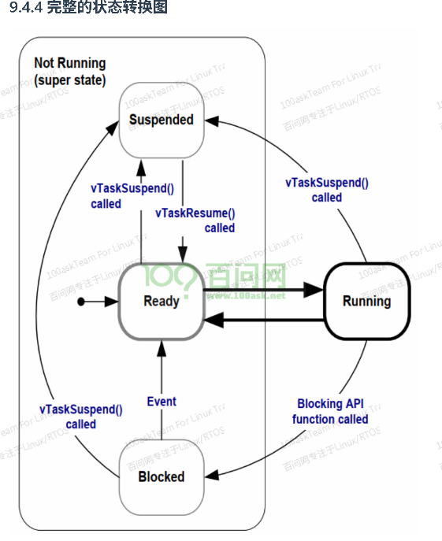

这是一个关于 **FreeRTOS 任务状态管理** 的实战教学视频。视频通过<span style="color:#CC0000;">改进一个音乐播放器的控制逻辑（从单纯的播放/停止，升级为支持播放、暂停、恢复、停止）</span>，深入浅出地讲解了操作系统的核心概念：<span style="color:#CC0000;">**任务状态转换**。</span>

以下是针对该视频内容的详细整理、深度扩展以及针对嵌入式面试的精选问答。

------


# 1. 视频内容时间轴总结

| **时间段**        | **主要内容**               | **关键知识点**                                               |
| ----------------- | -------------------------- | ------------------------------------------------------------ |
| **00:00 - 01:26** | **演示与目标**             | 展示改进后的效果：<span style="color:#CC0000;">音乐可以暂停并在原位置恢复播放</span>。对比旧版本（只能重头播放）的差异。 |
| **01:27 - 04:10** | **理论：任务状态类比**     | 使用“妈妈喂饭（Running）”、“等待同事消息（Blocked）”、“休息/暂停（Suspended）”的生动例子，引出<span style="color:#CC0000;"> FreeRTOS 的四种基本状态</span>：**Running, Ready, Blocked, Suspended**。 |
| **04:11 - 08:26** | **理论：状态转换图解**     | 结合代码分析<span style="color:#CC0000;"> `vTaskDelay` 如何让任务进入 **Blocked** 状态（等待时间到达）</span>；介绍<span style="color:#CC0000;"> `vTaskSuspend` 和 `vTaskResume` 这一对函数如何让任务进入和退出 **Suspended** 状态</span>。 |
| **08:27 - 13:23** | **实战：代码编写**         | 修改 `StartDefaultTask`（遥控器扫描任务）。引入 `bRunning` 标志位。编写逻辑：<span style="color:#CC0000;">按下 Play 键时，根据当前状态决定是 `xTaskCreate`（创建）还是 `vTaskResume`（恢复）。按下 Pause 键调用 `vTaskSuspend`。</span> |
| **13:24 - 15:16** | **Bug 修复：硬件状态残留** | **关键点**：发现暂停时蜂鸣器维持长鸣。原因：任务挂起时，CPU 停止执行该任务代码，但外设寄存器（PWM/GPIO）保持最后状态。解决方法：在 Suspend 前手动关闭蜂鸣器。 |
| **15:17 - 结尾**  | **总结与验证**             | 再次梳理代码逻辑，验证播放、暂停、恢复功能的完整状态流转。   |

------


# 补充提问

## 提问1


<span style="font-weight:bold; font-size:1.2em;">这张图里面的Blocking API fuction都可以是哪些呢，你能够给我分类总结下吗，我要学习下？</span>

这张图非常经典，清晰地展示了 FreeRTOS 任务状态流转的核心逻辑。

图中右下角的 **`Blocking API function called`**（<span style="color:#CC0000;">调用阻塞 API 函数</span>）是<span style="color:#CC0000;">将任务从 **Running（运行态）** 推向 **Blocked（阻塞态）** 的关键动作。</span>

这在嵌入式面试中是一个高频考点。简单来说，<span style="color:#CC0000;">**任何带有“超时等待时间”参数（`TickType_t xTicksToWait`）且该参数不为 0 的函数**，都有可能成为 Blocking API。</span>

我将这些 API 分为 **5 大类** 帮你总结，方便记忆和备考：

------


### 1. 延时类 (Time Delay)

这是最直接的阻塞方式，任务告诉调度器：<span style="color:#CC0000;">“我累了，先睡一会儿，X 毫秒后再叫醒我”。</span>

- **`vTaskDelay( xTicksToDelay )`**
  - **作用**：相对延时。从调用这一刻开始，往后延时多少个 Tick。
  - <span style="color:#CC0000;">**阻塞原因**：单纯等待时间流逝。</span>
- **`vTaskDelayUntil( pxPreviousWakeTime, xTimeIncrement )`**
  - **作用**：绝对延时（周期性执行）。
  - **面试考点**：它俩的区别？`vTaskDelay` 容易受任务执行时间影响导致周期漂移；`vTaskDelayUntil` 保证严格的周期性（比如每 10ms 采样一次），适合控制回路。


### 2. 队列类 (Queues)

<span style="color:#CC0000;">任务为了“读数据”或“写数据”而等待。</span>

- **读队列：`xQueueReceive( ..., xTicksToWait )`**
  - **阻塞原因**：<span style="color:#CC0000;">队列是**空**的。任务会进入阻塞态，直到队列里有数据了，或者超时时间到了。</span>
- **写队列：`xQueueSend( ..., xTicksToWait )`**
  - **阻塞原因**：<span style="color:#CC0000;">队列是**满**的。任务会进入阻塞态，直到队列有空位了，或者超时时间到了。</span>


### 3. 信号量与互斥量类 (Semaphores & Mutexes)

这是为了同步或保护资源。

- **`xSemaphoreTake( ..., xTicksToWait )`**
  - **涵盖**：二值信号量、计数信号量、互斥量（Mutex）。
  - **阻塞原因**：
    - **信号量**：<span style="color:#CC0000;">当前计数值为 0，没“票”了，必须等别人 `Give` 释放票。</span>
    - **Mutex**：<span style="color:#CC0000;">锁被别人拿走了，必须等别人还锁。</span>
  - **面试考点**：如果 `xTicksToWait` 设置为 `portMAX_DELAY`，任务会死等吗？是的，会一直死等直到获取成功（除非配置修改）。


### 4. 任务通知类 (Task Notifications)

FreeRTOS 独有的轻量级机制，速度比信号量快。

- **`ulTaskNotifyTake( ..., xTicksToWait )`**
- **`xTaskNotifyWait( ..., xTicksToWait )`**
  - **阻塞原因**：<span style="color:#CC0000;">等待其他任务给自己发通知。如果没有通知（Notify Value 为 0 或未更新），就阻塞等待。</span>


### 5. 事件组类 (Event Groups)

<span style="color:#CC0000;">等待多个信号的组合（比如：Wi-Fi 连接成功 **且** MQTT 登录成功）。</span>

- **`xEventGroupWaitBits( ..., xTicksToWait )`**
  - **阻塞原因**：<span style="color:#CC0000;">指定的那个（或那些）标志位还没有被置 1。</span>

------


### ⚠️ 核心概念：关于 `xTicksToWait` 参数

在面试中，如果你能解释清楚这个参数，面试官会觉得你很专业。

所有的 Blocking API 都有一个类似的参数（通常是最后一个），决定了阻塞的行为：

1. **`xTicksToWait = 0`**：
   - **非阻塞调用**。看一眼，行就行，不行拉倒，立即返回。任务**不会**进入 Blocked 状态，还是 Running（或 Ready）。
2. **`0 < xTicksToWait < portMAX_DELAY`**：
   - **超时阻塞**。任务进入 Blocked 状态。如果事件发生了，马上醒来（Ready）；如果时间到了事件还没发生，也醒来（Ready），但在函数返回值里告诉你“超时了/失败了”。
3. **`xTicksToWait = portMAX_DELAY`**：
   - **死等（永久阻塞）**。任务进入 Blocked 状态，一直睡，直到海枯石烂或者事件发生。这种情况下任务不需要唤醒去检查超时。

------


### 📝 针对面试的总结表格

| **类别**   | **典型 API**       | **阻塞条件**  | **恢复条件**                         |
| ---------- | ------------------ | ------------- | ------------------------------------ |
| **延时**   | `vTaskDelay`       | 主动要求休息  | 时间到                               |
| **队列**   | `xQueueReceive`    | 队列**空**    | 别人写入了数据 或 超时               |
| **队列**   | `xQueueSend`       | 队列**满**    | 别人读走了数据（腾出空间） 或 超时   |
| **信号量** | `xSemaphoreTake`   | 没拿到锁/信号 | 别人释放了锁 (`Give`) 或 超时        |
| **通知**   | `ulTaskNotifyTake` | 通知值为 0    | 别人发了通知 (`Give/Notify`) 或 超时 |


### 🔥 面试高频陷阱题

**问：<span style="color:#CC0000;">这些 Blocking API 可以在中断服务函数（ISR）里调用吗？</span>**

**答**：**绝对不行！**

- **原因**：<span style="color:#CC0000;">中断不能阻塞，中断必须快进快出。如果在中断里阻塞，整个系统（包括低优先级的任务）都会卡死。</span>
- **正确做法**：在 ISR 里必须使用带 `FromISR` 后缀的函数（如 `xQueueSendFromISR`），而且这些 `FromISR` 函数通常**没有**阻塞时间参数，它们是非阻塞的。


### 下一步建议

你想不想针对 **“在 `xSemaphoreTake` 造成死锁（Deadlock）”** 这个场景进行深入分析？这是操作系统面试中最能体现深度的部分。


## 提问2


<span style="font-weight:bold; font-size:1.2em;">结合着上面这个图给我解释下这些状态的切换都是什么样的呢，即什么状态可以由什么状态得到，从某个状态又可以切换到什么状态呢。</span>


这张图非常清晰地展示了 FreeRTOS 任务调度的核心逻辑。我将结合这张图，以**“一个任务的生命周期”**为视角，为你梳理每一个状态切换的**方向**、**原因**以及**涉及的函数**。

我们可以把这张图看作三个部分的组合：

1. **核心循环**（Running 和 Ready 的切换）
2. **休息区**（Blocked 阻塞）
3. **冷冻库**（Suspended 挂起）

------


### 1. <span style="color:#CC0000;">核心循环：Ready (就绪) ⇋ Running (运行)</span>

这是 RTOS 能够让多个任务看起来像是在“同时运行”的根本原因。

- **Ready $\rightarrow$ Running**
  - **含义**：任务获得了 CPU 的使用权，开始执行代码。
  - **触发条件**：**调度器（Scheduler）选择了它**。
  - **原因**：<span style="color:#CC0000;">当前任务是所有“Ready”任务中**优先级最高**的。如果优先级相同，则通过时间片轮转（Time Slicing）轮到了它。</span>
  - **注意**：<span style="color:#CC0000;">这不需要用户写代码控制，是系统自动完成的。</span>
- **Running $\rightarrow$ Ready**
  - **含义**：任务被迫交出 CPU，退回到等待队列。
  - **触发条件**：**被抢占（Preemption）**。
  - **原因**：
    1. <span style="color:#CC0000;">有一个**更高优先级**的任务刚刚醒来（比如中断发生，唤醒了高优先级任务），抢走了 CPU。</span>
    2. <span style="color:#CC0000;">同优先级的任务时间片用完了（Round Robin）。</span>
    3. <span style="color:#CC0000;">任务主动调用了 `taskYIELD()`（主动让出 CPU）。</span>

------


### 2. 休息区：<span style="color:#CC0000;">Running $\rightarrow$ Blocked $\rightarrow$ Ready</span>

这是<span style="color:#CC0000;">嵌入式开发中最常用的路径，也是 RTOS 高效的原因（不干活时不占用 CPU）。</span>

- **Running $\rightarrow$ Blocked**
  - **含义**：任务主动要求“等待”。
  - **触发条件**：<span style="color:#CC0000;">任务调用了**Blocking API**（上一条回答中总结的那些函数）。</span>
  - **原因**：
    1. **<span style="color:#CC0000;">等时间</span>**：`vTaskDelay(100)` —— "我要睡 100ms"。
    2. **<span style="color:#CC0000;">等事件</span>**：`xQueueReceive(...)` —— "队列空了，我等有数据再叫我"。
  - **关键点**：<span style="color:#CC0000;">进入 Blocked 后，任务**移出**运行队列，**不再消耗任何 CPU 资源**。</span>
- **Blocked $\rightarrow$ Ready**
  - **含义**：等待结束，重新排队。
  - **触发条件**：<span style="color:#FF0000;">**事件发生** 或 **超时**。</span>
  - **原因**：
    1. **<span style="color:#CC0000;">时间到了</span>**：延时时间结束。
    2. **<span style="color:#CC0000;">事件来了</span>**：别的任务或中断往队列写了数据、释放了信号量。
  - **面试陷阱**<span style="color:#CC0000;">：**Blocked 状态永远不能直接变回 Running**。它必须先回到 Ready 排队，如果它优先级够高，调度器会马上让它 Running。</span>

------


### 3. 冷冻库：<span style="color:#FF0000;">任意状态 $\rightarrow$ Suspended ⇋ Ready</span>

Suspended 是一个特殊的“被动”状态，任务被完全“踢出”调度系统，直到被“解救”。

- <span style="color:#CC0000;">**Running / Ready / Blocked $\rightarrow$ Suspended**</span>
  - **含义**：任务被强制挂起（冷冻）。
  - **触发条件**：<span style="color:#CC0000;">调用了 **`vTaskSuspend()`**。</span>
  - **路径分析**：
    - **<span style="color:#CC0000;">Running $\rightarrow$ Suspended</span>**：<span style="color:#CC0000;">任务自己挂起自己 `vTaskSuspend(NULL)`</span>，或者被正在运行的其他任务挂起（<span style="color:#CC0000;">补充：这里被其他正在运行的任务挂起可能牵涉到多核</span>）。
    - **Ready $\rightarrow$ Suspended**：<span style="color:#CC0000;">被其他正在运行的任务挂起。</span>
    - **Blocked $\rightarrow$ Suspended**：<span style="color:#CC0000;">任务正在等信号量，结果还没等到就被别人挂起了。</span>
- **Suspended $\rightarrow$ Ready**
  - **含义**：解冻，恢复排队。
  - **触发条件**：别<span style="color:#CC0000;">的任务调用了 **`vTaskResume()`** (或中断中调用 `xTaskResumeFromISR`)。</span>
  - **注意**：<span style="color:#CC0000;">解冻后，任务也是先回到 **Ready** 态，等待调度器分配 CPU。</span>

------


### 📝 总结：状态切换矩阵

为了方便记忆，我为你整理了这个“谁能去哪”的矩阵：

| **当前状态**  | **能去 Running 吗?**                                  | **能去 Ready 吗?**                                    | **能去 Blocked 吗?**   | **能去 Suspended 吗?**                                 |
| ------------- | ----------------------------------------------------- | ----------------------------------------------------- | ---------------------- | ------------------------------------------------------ |
| **Running**   | -                                                     | ✅ (被抢占)                                            | ✅ (调用延时/等待函数)  | ✅ (<span style="color:#CC0000;">调用 Suspend</span>)   |
| **Ready**     | ✅ (调度器选中)                                        | -                                                     | ❌ (没运行怎么调用API?) | ✅ (<span style="color:#CC0000;">被别人 Suspend</span>) |
| **Blocked**   | ❌ (<span style="color:#CC0000;">必须先去Ready</span>) | ✅ (<span style="color:#CC0000;">时间到/事件来</span>) | -                      | ✅ (<span style="color:#CC0000;">被别人 Suspend</span>) |
| **Suspended** | ❌ (<span style="color:#CC0000;">必须先去Ready</span>) | ✅ (<span style="color:#CC0000;">被别人 Resume</span>) | ❌                      | -                                                      |


### 🔥 嵌入式面试考点提炼

1. **Blocked 和 Suspended 的区别？**
   - **Blocked** 是<span style="color:#CC0000;">**自动**恢复</span>的（时间到了或事件来了）。
   - **Suspended** 是<span style="color:#CC0000;">**人工**恢复</span>的（必须有人调用 `Resume`），否则永远不执行。
2. **为什么 Blocked 不能直接变 Running？**
   - 因为 RTOS 必须保证**最高优先级**的任务优先运行。一个任务解除阻塞时，可能当前 CPU 正在跑一个优先级比它还高的任务，所以它只能先去 Ready 排队，等高优先级任务忙完了再轮到它。
3. **怎么让一个任务“自杀”（删除自己）？**
   - 图中没有画出的状态是 **Deleted**。任务可以调用 `vTaskDelete(NULL)` 删除自己。被删除的任务所占用的堆栈内存会在 Idle（空闲）任务运行时被回收。


## 提问3

<span style="font-weight:bold; font-size:1.2em;">任务处于各个状态时，其在内存中的布局是什么样的呢，其tcb和对应的任务栈又是存放在那里呢，你能够给我详细解释下吗。</span>


这是一个非常硬核且能体现你对 RTOS 底层理解深度的问题。

针对这个问题的核心结论是：

<span style="color:#CC0000;">无论任务处于什么状态（Ready, Blocked, Suspended），它的 TCB 和任务栈在物理内存（RAM）中的位置是固定不动的！</span>

所谓的<span style="color:#CC0000;">“状态切换”</span>，<span style="color:#CC0000;">本质上只是**RTOS 将指向该 TCB 的指针，从一个链表（List）移动到了另一个链表**。</span>

下面我为你详细拆解内存布局和底层管理机制：

------


### 1. 物理布局：TCB 与 栈 在哪里？

当你调用 `xTaskCreate()` 创建一个任务时，FreeRTOS 会在 **堆（Heap）** 中申请两块内存（如果是 `xTaskCreateStatic`，则是用户手动在 BSS/Data 段定义的数组）：

1. **TCB (Task Control Block)**: 任务控制块。这是任务的“身份证”，结构体叫 `tskTCB`。里面记录了任务的所有元数据。
2. **Stack (任务栈)**: 一块连续的内存空间。用于存放该任务的局部变量、函数调用链以及**上下文（Context）**。


#### 内存指向关系图

TCB 中最重要的成员是**栈顶指针 (`pxTopOfStack`)**，它把 TCB 和 Stack 联系在了一起。

Plaintext

```c
      [ RAM (Heap) ]

+----------------------+ <--- pxCurrentTCB (如果任务正在运行)
|  TCB (结构体)        |
|----------------------|
| pxTopOfStack      ---|-------+  (记录当前栈用到哪了)
| uxPriority           |       |
| pcTaskName           |       |
| xStateListItem       |       |
| xEventListItem       |       |
+----------------------+       |
                               |
                               v
+----------------------+ <--- Stack High Address (栈底)
|                      |
|   (Stack Data)       |
|   局部变量/函数调用    |
|                      |
|----------------------| <--- Stack Pointer (SP) 指向的位置
|   R0, R1, ... R15    |      (如果是 Blocked 状态，现场保存在这里)
|   xPSR               |
|----------------------|
|                      |
|   (Free Space)       |
+----------------------+ <--- Stack Low Address (栈顶限制)
```

------


### 2. 状态切换背后的“链表搬运”

FreeRTOS 维护了<span style="color:#CC0000;">多个**链表（List）**来管理不同状态的任</span>务。<span style="color:#CC0000;">任务的状态改变，其实就是 `xStateListItem` 节点在不同链表间的插拔。</span>


#### A. 就绪态 (Ready)

- **存放位置**: `pxReadyTasksLists[ configMAX_PRIORITIES ]` 数组中。
- **机制**: <span style="color:#CC0000;">这是一个数组，每一级优先级都有一个独立的链表。</span>
- **场景**: <span style="color:#CC0000;">任务准备好运行了，它的 TCB 指针就被挂在对应优先级的链表尾部。</span>


#### B. 阻塞态 (Blocked) - <span style="color:#FF0000;">时间相关</span>

- **存放位置**: `xDelayedTaskList1` 或 `xDelayedTaskList2` (双缓冲列表)。
- **机制**: 当调用 `vTaskDelay(100)` 时：
  1. 系统计算唤醒时间 `xTimeToWake = xConstTickCount + 100`。
  2. 将 TCB 从 `pxReadyTasksLists` 移除。
  3. 将 TCB 根据唤醒时间排序，插入到 `xDelayedTaskList` 中。


#### C. 阻塞态 (Blocked) - <span style="color:#FF0000;">事件相关</span>

- <span style="color:#FF0000;">**存放位置**: **事件对象本身的等待列表**。</span>
- **例子**: 等待一个队列 `xQueue`。
  - Queue 的结构体里有一个列表 `xTasksWaitingToReceive`。
  - 当任务读取空队列时，TCB 从 `pxReadyTasksLists` 移除，挂载到这个 Queue 结构体里的列表上。
  - **注意**: <span style="color:#FF0000;">此时 TCB 同时也会挂在 `xDelayedTaskList` 上（如果设置了超时时间），以便超时唤醒。</span>


#### D. 挂起态 (Suspended)

- **存放位置**: <span style="color:#FF0000;">`xSuspendedTaskList`。</span>
- **机制**: 调用 `vTaskSuspend()` 后，TCB 被扔到这个列表里。调度器永远不会去检查这个列表，除非有人显式地把它移出来。

------


### 3. 关键细节：CPU 上下文保存在哪里？

这是面试中最容易搞混的地方。

- **当任务 Running 时**:
  - 任务的栈被 CPU 的 **SP (Stack Pointer) 寄存器** 指向。
  - 任务的数据（R0-R15 寄存器）都在 CPU 内部的**物理寄存器**里活跃。
- **当任务 被切出 (变为 Ready/Blocked/Suspended) 时**:
  - **保存现场**: CPU 会自动（或通过汇编代码）把当前的寄存器值（R0-R15, xPSR 等）压入**该任务自己的栈**中。
  - **记录栈顶**: 压栈完成后，最新的栈顶地址会被更新到 **TCB 的 `pxTopOfStack`** 成员变量中。
  - **切走**: CPU 转而去加载下一个任务的 TCB，读取那个任务的 `pxTopOfStack`，恢复那个任务的寄存器。

------


### 4. 面试模拟：高分回答逻辑

如果面试官问：“任务阻塞时，它的内存去哪了？”

你可以这样回答：

> <span style="color:#CC0000;">“任务的内存（TCB和栈）在物理上**原地不动**，依然在堆中。</span>
>
> 1. **逻辑上**：FreeRTOS 将该任务 TCB 的节点从**就绪列表**移除，移动到了**延时列表**或**事件等待列表**（如队列的等待列表）中，导致调度器遍历就绪列表时看不到它，从而不再分配 CPU 时间。
> 2. **数据上**：在切换发生的那一刻，该任务运行时的 CPU 寄存器（上下文）被保存在了**任务自己的栈**里，最后更新 TCB 中的栈顶指针 `pxTopOfStack`。等到任务下次恢复运行时，CPU 会根据 TCB 里的这个指针，去栈里把寄存器数值弹出来，完美恢复现场。”

------


### 💡 扩展思考（坑点）

1. **栈溢出 (Stack Overflow)**:
   - 既然上下文保存在栈里，如果栈剩下的空间不够存这十几个寄存器怎么办？
   - **结果**: 系统崩溃，数据踩踏。FreeRTOS 提供了 `vApplicationStackOverflowHook` 来检测这种情况。
2. **任务删除**:
   - 如果调用 `vTaskDelete()`，TCB 和 Stack 占用的内存何时释放？
   - **答案**: 任务无法释放自己的内存（因为它正在运行）。内存回收是由 **Idle Task (空闲任务)** 在后台完成的。所以删除任务后，必须保证空闲任务有机会运行，否则内存会泄漏。


### 下一步建议

现在你已经理解了内存和状态的关系，**你想不想看一段简化的代码（伪代码），模拟一下 `vTaskDelay` 内部是如何把 TCB 从“就绪列表”搬运到“延时列表”的？** 这能让你对链表操作有具象的认识。


## 提问4

阻塞态 (Blocked) - <span style="color:#FF0000;">事件相关</span>

<span style="font-weight:bold; font-size:1.2em;">这里阻塞态 事件相关，这里的事件具体指的是是什么呢，给我从代码层面总结分析下。</span>


在 FreeRTOS 的代码层面，所谓的“<span style="color:#CC0000;">事件（Event）</span>”并不是一个虚无缥缈的概念，它对应着**<span style="color:#CC0000;">内核对象（Kernel Object）结构体中维护的一个“链表（List）”</span>**。

当<span style="color:#CC0000;">任务因为“事件”而阻塞时</span>，本质上是<span style="color:#CC0000;">把该任务的 **TCB（任务控制块）** 挂载到了**这个内核对象的等待列表**上</span>。

我将从代码数据结构的角度，为你总结和分析 3 类最核心的“事件阻塞”。

------


### 核心原理：<span style="color:#CC0000;">事件 = 内核对象里的链表</span>

在 FreeRTOS 中，无论是<span style="color:#CC0000;">队列、信号量还是互斥量</span>，<span style="color:#CC0000;">底层都复用了同一个结构体</span>：`QueueDefinition`（在 `queue.c` 中定义）。

在这个结构体中，有两个至关重要的链表成员：

C

```c
typedef struct QueueDefinition
{
    // ... 前面是数据存储区指针等 ...

    List_t xTasksWaitingToSend;    // 【等待发送列表】
                                   // 当队列满时，想写的任务会挂在这里

    List_t xTasksWaitingToReceive; // 【等待接收列表】
                                   // 当队列空时，想读的任务会挂在这里

    // ... 后面是锁和其他状态 ...
} xQUEUE;
```

<span style="color:#CC0000;">所谓的“等待事件”，就是任务把自己的 TCB 里的 `xEventListItem` 节点，插入到上面这两个链表中的某一个里。</span>

------


### 1.<span style="color:#CC0000;"> 队列事件 (Queue Events) - 读空与写满</span>

这是最基础的事件模型。


#### A. 读数据阻塞 (`xQueueReceive`)

- **事件定义**：队列中有数据可用（非空）。
- **代码行为**：
  1. 任务调用 `xQueueReceive()`。
  2. 内核检查 `uxMessagesWaiting == 0`（当前消息数为0）。
  3. **挂载**：内核将当前任务 TCB 插入到该队列对象的 **`xTasksWaitingToReceive`** 链表中。
  4. **切出**：触发任务调度，CPU 去运行别的任务。
- **唤醒时刻**：当另一个任务调用 `xQueueSend()` 写入数据成功后，内核会检查 `xTasksWaitingToReceive` 列表，如果有任务在等，就把优先级最高的那个移回 **Ready List**。


#### B. 写数据阻塞 (`xQueueSend`)

- **事件定义**：队列中有空间可用（不满）。
- **代码行为**：
  1. 任务调用 `xQueueSend()`。
  2. 内核检查 `uxMessagesWaiting == uxLength`（已满）。
  3. **挂载**：内核将当前任务 TCB 插入到该队列对象的 **`xTasksWaitingToSend`** 链表中。
- **唤醒时刻**：当有人调用 `xQueueReceive()` 取走数据腾出空间时，内核会唤醒 `xTasksWaitingToSend` 里的任务。

------


### 2. <span style="color:#CC0000;">信号量/互斥量事件</span> (Semaphore/Mutex Events)

在 FreeRTOS 中，**<span style="color:#CC0000;">信号量本质上是一个特殊的队列</span>**（没有数据区，只关注计数值 `uxMessagesWaiting`）。


#### A. 获取信号量阻塞 (`xSemaphoreTake`)

这<span style="color:#CC0000; font-size:1.2em;">等同于“读队列”。</span>

- **事件定义**：有人释放了信号量（Give）。
- **代码行为**：
  - 如果这是一个**互斥量 (Mutex)**，任务在试图拿锁时发现锁被占用了。
  - 它<span style="color:#CC0000;">会把 TCB 挂在互斥量对象的 **`xTasksWaitingToReceive`** 列表上。</span>
- <span style="color:#CC0000;">**特殊机制 (优先级继承)**：如果是 Mutex，这里还涉及到一个核心代码逻辑——**优先级继承**。如果持有锁的任务优先级低，正在阻塞的高优先级任务会临时把那个持有锁的任务的优先级“提”上来。</span>

------


### 3. <span style="color:#CC0000;">事件组事件</span> (Event Group Events)

<span style="color:#CC0000;">事件组（Event Group）的结构体不同于队列，它专门用于处理“多位标志”。</span>

C

```c
typedef struct EventGroupDef_t
{
    EventBits_t uxEventBits;        // 32位的标志位变量
    List_t xTasksWaitingForBits;    // 【等待位列表】
                                    // 所有在等这个事件组的任务都挂在这里
} EventGroup_t;
```


#### A. 等待特定位 (`xEventGroupWaitBits`)

- **事件定义**：<span style="color:#CC0000;">指定的 Bit 组合（如 Bit0 和 Bit2）被置 1。</span>
- **代码行为**：
  1. 任务调用 `xEventGroupWaitBits(..., BIT_0 | BIT_2, ...)`。
  2. 内核检查 `uxEventBits`，发现条件不满足。
  3. **挂载**：将 TCB 挂入 **`xTasksWaitingForBits`** 列表。
  4. **特殊处理**：<span style="color:#CC0000;">因为每个任务等的 Bit 不一样，TCB 里的 `ulContent` 字段会被用来记录“我在等哪些位”，方便内核唤醒时判断。</span>

------


### 🚀 深度面试题：既有超时，又有事件，TCB 在哪？

这是代码层面最精妙的设计。

**场景**：你调用了 `xQueueReceive(xQueue, &buf, 100);` （等待数据，最多等 100 tick）。此时队列是空的，<span style="border:1px solid #CC0000;">任务进入 Blocked。</span>

<span style="border:1px solid #CC0000; color:#CC0000;">**问：此时这个任务的 TCB 到底在哪？**</span>

**答：它同时在两个列表里！**

1. **<span style="color:#CC0000;">事件列表 </span>(`xTasksWaitingToReceive`)**：<span style="color:#CC0000;">TCB 的 `xEventListItem` 节点被挂在队列的等待链表上。</span>
   - *作用*：如果数据提前来了（比如第 10 tick），可以通过这个链表找到任务并唤醒它。
2. **<span style="color:#CC0000;">延时列表</span> (`xDelayedTaskList`)**：TCB 的 `xStateListItem` <span style="color:#CC0000;">节点被挂在系统的延时链表上。</span>
   - *作用*：如果数据一直没来，到了第 100 tick，系统滴答中断扫描延时列表，发现它超时了，强制把它唤醒，并返回“超时错误”。

代码验证逻辑：

<span style="color:#CC0000;">当事件发生（数据来了）时，内核代码逻辑是：</span>

1. 从 `xTasksWaitingToReceive` <span style="color:#CC0000;">移除任务</span>。
2. **关键点**：<span style="color:#CC0000;">检查该任务是否还在 `xDelayedTaskList` 上，如果在，也把它移除（取消超时计时）。</span>
3. <span style="color:#CC0000;">放入</span> `Ready List`。


### 💡 总结

所谓“<span style="color:#CC0000;">事件阻塞”</span>，在代码内存层面就是：

<span style="color:#CC0000;">任务把自己挂到了那个【具体对象（队列/信号量/事件组）】的【专用链表】上，静候佳音。</span>

- 等数据 $\rightarrow$ 挂在 `xTasksWaitingToReceive`
- 等空间 $\rightarrow$ 挂在 `xTasksWaitingToSend`
- 等标志位 $\rightarrow$ 挂在 `xTasksWaitingForBits`


## 提问 4 - （1）

```c
/* 任务控制块 TCB 定义 (简化版) */
typedef struct tskTaskControlBlock
{
    // 指向栈顶的指针
    volatile StackType_t *pxTopOfStack;

    // 【关键】状态列表项：这个就是任务身上的“挂钩”
    // 任务通过这个变量挂到 ReadyList 或 DelayedList 上
    ListItem_t xStateListItem; 
    
    // 事件列表项：用于信号量、队列等等待
    ListItem_t xEventListItem; 
    
    // 任务优先级
    UBaseType_t uxPriority;
    
    // ... 其他成员

} tskTCB;
```

<span style="font-weight:bold; font-size:1.1em;">系统的就绪列表，阻塞列表，挂起列表，应该是 和 队列，互斥量/信号量，事件组 的等待列表是不一样的吧，后者是和某个资源绑定在一起的吧。你能够结合上面的TCB给我详细解释下吗。 </span>


你的理解**非常精准**！这正是 FreeRTOS 任务管理中最精妙的设计之一。

简单总结你的结论：

1. **系统列表**（就绪/阻塞/挂起）确实是<span style="color:#CC0000;">全局的</span>，归调度器管理。
2. **<span style="color:#CC0000;">资源列表</span>**（等待队列/互斥量）确实是<span style="color:#CC0000;">局部的</span>，和<span style="color:#CC0000;">具体的内核对象绑定</span>。
3. **TCB 设计**：正是为了同时应对这两类列表，<span style="color:#CC0000;">TCB 里才特意设计了**两个**</span> `ListItem_t`（也就是两个“挂钩”）。

下面我结合你提供的 TCB 结构体，详细解释这两个挂钩是如何协作的。

------


### 1. 形象比喻：两个“挂钩”的作用

想象每个任务（TCB）是一个登山者，他腰带上有两个不同的挂钩（List Item）：

- **挂钩 A (`xStateListItem`)**：这是**“状态钩”**。
  - **用途**：用来决定“我在哪休息”或者“是否轮到我干活”。
  - **挂载点**：只能挂在**系统级**的墙上，比如“就绪墙（Ready List）”、“延时墙（Delayed List）”或者“冷冻墙（Suspended List）”。
  - **必须挂吗？**：必须！任务只要存在，这个钩子必须挂在某一个系统列表上。
- **挂钩 B (`xEventListItem`)**：这是**“事件钩”**。
  - **用途**：用来排队买票。
  - **挂载点**：挂在<span style="color:#CC0000;">**某个具体资源**（如队列、互斥量）的“等待窗口”上</span>。
  - **必须挂吗？**：不一定。只有当你去争夺某个资源且需要排队时，才会把这个钩子挂上去。一旦拿到资源或超时离开，这个钩子就悬空了。

------


### 2. 深度拆解：从代码看内存操作

#### A. 第一类：系统列表 (System Lists) & `xStateListItem` 

这个变量主要处理**“调度”**和**“时间”**。

- **关联列表**：
  - `pxReadyTasksLists[]` (就绪列表)
  - `xDelayedTaskList` (延时阻塞列表)
  - `xSuspendedTaskList` (挂
- **排序依据 (`xItemValue`)**：<span style="color:#CC0000;">（补充：xItemValue 是 结构体 ListItem_t xStateListItem 中的一个数据成员）</span>
  - 当在 **就绪列表** 时：该值通常是任务优先级（用于快速查找）。
  - 当在 **延时列表** 时：该值是 **唤醒时间点 (Wake Time)**。调度器通过这个值从小到大排序，很容易知道下一个该唤醒谁。


#### B. 第二类：资源列表 (Resource Lists) & `xEventListItem`

这个变量主要处理**“排队顺序”**。

- **关联列表**：
  - `xQueue->xTasksWaitingToReceive` (队列的等待接收列表)
  - `xSemaphore->xTasksWaitingToReceive` (信号量的等待列表)
  - `xEventGroup->xTasksWaitingForBits` (事件组等待列表)
- **排序依据 (`xItemValue`)**：<span style="color:#CC0000;">（补充：xItemValue 是 结构体 ListItem_t xEventListItem 中的一个数据成员）</span>
  - **关键点**：这里的值被设置为**任务的优先级**！
  - **原因**：当资源（比如互斥量）释放时，内核查看这个资源的等待列表。因为<span style="color:#CC0000;">列表是按优先级（`xItemValue`）排序的</span>，内核可以<span style="color:#CC0000;">迅速找到**优先级最高的等待者**</span>，把锁给它。这<span style="color:#CC0000;">保证了高优先级任务优先获得资源。</span>

------


### 3. 最经典的场景：双钩同挂 (Timeout Blocking)

这是面试中最能体现你理解深度的场景：

场景：任务调用 xQueueReceive(QueueHandle, &buf, 100); (等待队列数据，超时时间 100ms)。

<span style="color:#CC0000;">**此时，<span style="font-size:1.2em;">TCB 的两个挂钩</span>分别挂在哪里？**</span>

1. **`xStateListItem` (<span style="color:#CC0000; font-size:1.2em;">状态钩</span>)** $\rightarrow$ **挂在 `xDelayedTaskList` (系统延时列表)**
   - **目的**：计时。如果 100ms 到了，系统通过这个钩子把你拉回 Ready 态，并告诉你“超时了”。
   - *排序值*：`CurrentTick + 100`。
2. **`xEventListItem` (<span style="color:#CC0000; font-size:1.2em;">事件钩</span>)** $\rightarrow$ **挂在 `Queue->xTasksWaitingToReceive` (队列资源列表)**
   - **目的**：占位排队。如果 100ms 内有人发数据了，队列通过这个钩子找到你，把你拉回 Ready 态，并给你数据。
   - *排序值*：`TaskPriority` (优先级)。

**<span style="color:#CC0000;">结局 A</span>：数据来了 (Happy Path)**

1. 别的任务调用 `xQueueSend`。
2. 内核检查队列的 `xTasksWaitingToReceive`，通过 **`xEventListItem`** 找到了该任务 TCB。
3. 内核顺藤摸瓜，把该任务的 **`xStateListItem`** 从系统延时列表中移除（不用再计时了）。
4. 把 **`xStateListItem`** 挂到系统就绪列表（Ready List）。
5. 任务醒来，拿走数据。

**<span style="color:#CC0000;">结局 B</span>：超时了 (Timeout Path)**

1. 系统滴答中断（SysTick）发现时间到了。
2. 内核通过系统的延时列表，利用 **`xStateListItem`** 找到 TCB。
3. 内核顺藤摸瓜，发现该任务还挂在队列上呢，于是<span style="color:#CC0000;">把 **`xEventListItem`** 从队列等待列表中强制移除（不排队了，走了）</span>。
4. 把 **`xStateListItem`** 挂到系统就绪列表。
5. 任务醒来，收到返回值 `errQUEUE_EMPTY`。

------


### 4. 总结对比表

| **特性**     | **xStateListItem**              | **xEventListItem**                    |
| ------------ | ------------------------------- | ------------------------------------- |
| **中文名**   | 状态列表项                      | 事件列表项                            |
| **归属方**   | 操作系统调度器 (Scheduler)      | 具体内核对象 (Queue/Mutex/EventGroup) |
| **生命周期** | **始终挂载** (除非任务正在运行) | **临时挂载** (仅在等待资源时)         |
| **挂载位置** | Ready, Delayed, Suspended 列表  | 某队列/信号量的 Waiting 列表          |
| **排序依据** | 唤醒时间 (在延时列表时)         | 任务优先级 (为了让高优先级先拿到锁)   |
| **核心作用** | 决定任务是否获得 CPU            | 决定任务在资源争夺队伍中的位置        |

所以，你的理解完全正确：**`xEventListItem` 就是专门用来和“某个资源”绑定在一起的挂钩。**


## 提问 4 - （2）

<span style="font-weight:bold; font-size:1.2em;">这里的队列事件是用来进行任务间通信使用的吗，这里的互斥和信号量事件应该是可以与某个资源绑定的吧，如访问OELD等事件啥的，使用串口通信啥的，使用互斥量来访问这些资源，信号量还可以进行同步吧。我不是太懂，你能够给我详细解释下吗，这里队列事件和互斥量/信号量事件究竟该怎么使用吗，最好能够举个例子来让我彻底弄明白。</span>


你的直觉非常敏锐！完全就是这么回事。

为了让你彻底弄明白，我们把这三个东西（队列、互斥量、信号量）想象成一家繁忙的**物流快递公司**的运作场景。

- **队列 (Queue)** = **传送带**（搬运货物/数据）。
- **互斥量 (Mutex)** = **厕所/会议室的钥匙**（抢占资源，防止冲突）。
- **信号量 (Semaphore)** = **发令枪/信号灯**（通知协调，我不给你东西，只告诉你“好了”）。

下面我用**代码逻辑 + 生活案例**，针对你提到的 OLED、串口、任务通信，一个个拆解给你看。

------


### 1. 队列 (Queue)：<span style="color:#CC0000;">任务间通信 (传递数据)</span>

**核心用途**：左手交右手。要把一个具体的<span style="color:#CC0000;">**数据**（变量、结构体、指针）</span>从一个任务发给另一个任务。

场景案例：

你有<span style="color:#CC0000;">一个温度采集任务（每秒读一次传感器）</span>，还有<span style="color:#CC0000;">一个处理任务（负责计算平均值并判断是否报警）</span>。

- <span style="color:#CC0000;">**为什么要用队列？**</span>
  - <span style="color:#CC0000;">如果采集任务用全局变量 `float global_temp`，处理任务去读，万一读的时候正好在写，数据就错了。</span>
  - 用队列，不仅安全，还能<span style="color:#CC0000;">起到“缓冲”作用。采集快了，处理慢了，数据先堆在队列里，不会丢。</span>

**代码逻辑**：

C

```c
// 1. 定义一个结构体（包裹）
typedef struct {
    float temperature;
    float humidity;
} SensorData_t;

// --- 采集任务 (Sender) ---
void Task_Sensor(void *param) {
    SensorData_t data;
    while(1) {
        data.temperature = Read_HW_Sensor(); // 读取硬件
        
        // 【发快递】：把数据塞进队列
        // 这里的事件是：队列不满，我就能塞进去
        xQueueSend(xQueueHandle, &data, 100); 
        
        vTaskDelay(1000);
    }
}

// --- 处理任务 (Receiver) ---
void Task_Process(void *param) {
    SensorData_t recv_data;
    while(1) {
        // 【收快递】：死等队列里有数据
        // 这里的事件是：队列有数据了，我就醒来
        if (xQueueReceive(xQueueHandle, &recv_data, portMAX_DELAY) == pdTRUE) {
            // 醒来后，recv_data 里面就是刚才发过来的温度值
            printf("Temp: %.2f\n", recv_data.temperature);
        }
    }
}
```

------


### 2. 互斥量 (Mutex)：<span style="color:#CC0000;">资源保护 (互斥访问)</span>

**核心用途**：防冲突。就像你说的 **OLED 显示屏** 或 **串口**。<span style="color:#CC0000;">这些硬件在同一时刻只能由一个人操作，否则时序会乱，显示会花屏。</span>

场景案例：

你有两个任务：A任务<span style="color:#CC0000;">想在 OLED 上显示“System OK”</span>，B任务<span style="color:#CC0000;">想在 OLED 上显示“Error 404”</span>。

<span style="color:#CC0000;">如果不用互斥量，A 刚发了“Sys...”，切到 B 发“Err...”，OLED 上显示的就是“SysErr...”，乱套了。</span>

**代码逻辑**：

C

```c
// 定义一个互斥量句柄
SemaphoreHandle_t xOLEDMutex;

// --- 封装一个线程安全的打印函数 ---
void Safe_OLED_Print(char *str) {
    // 1. 【拿锁】 (Take)
    // 如果锁被别人拿了，我就在这里 Blocked (睡觉等待)
    // 这里的事件是：锁被释放了 (Give)
    xSemaphoreTake(xOLEDMutex, portMAX_DELAY);
    
    // 2. 【干活】 (Critical Section)
    // 此时我是独占 OLED 的，没人能打断我的发送时序
    OLED_SetCursor(0,0);
    OLED_WriteString(str);
    
    // 3. 【还锁】 (Give)
    // 用完了赶紧还回去，让排队的别人用
    xSemaphoreGive(xOLEDMutex);
}

// 任务 A 和 任务 B 都调用这个函数，就不会打架了
```

- **关键点**：互斥量有**<span style="color:#CC0000;">“谁拿锁，谁还锁”</span>**的原则。必须归还！

------


### 3. 二值信号量 (Binary Semaphore)：任务同步 (协调步伐)

**核心用途**：发信号。就像发令枪。通常用于 **中断 (ISR)** 告诉 **任务 (Task)**：“事情发生了，你快去处理！”

场景案例：

串口接收。数据来的时候会触发中断。

- **错误做法**：在中断里直接处理数据（耗时太长，系统卡死）。
- **正确做法**：中断里只收一个字节，然后打一枪（Give 信号量）。任务平时在睡觉（Take 信号量），听到枪响（拿到信号量）立马醒来处理数据。

**代码逻辑**：

C

```c
// 定义一个二值信号量
SemaphoreHandle_t xUartSem;

// --- 串口中断服务函数 (ISR) ---
void USART_IRQHandler(void) {
    if (USART_GetFlagStatus(...)) {
        // 1. 硬件上收到了数据
        RX_Buffer[i] = USART_ReceiveData(...);
        
        // 2. 【打枪】 (Give from ISR)
        // 告诉后台任务：有数据到了！
        BaseType_t xHigherPriorityTaskWoken = pdFALSE;
        xSemaphoreGiveFromISR(xUartSem, &xHigherPriorityTaskWoken);
        
        // 如果唤醒的任务优先级很高，立马切换过去
        portYIELD_FROM_ISR(xHigherPriorityTaskWoken);
    }
}

// --- 数据解析任务 (Task) ---
void Task_Parser(void *param) {
    while(1) {
        // 1. 【等枪响】 (Take)
        // 平时没数据，我就在这里 Blocked，不占 CPU
        // 这里的事件是：有人给我发了信号量
        xSemaphoreTake(xUartSem, portMAX_DELAY);
        
        // 2. 醒来了！说明中断发生了，数据来了
        Process_RX_Buffer(); // 慢慢处理，不着急
    }
}
```

- **关键点**：这里**不需要传递数据本身**（数据在 Buffer 里），信号量只起到**通知（Notification）**的作用。

------


### 总结：三者对比表

| **机制**               | **别名**  | **核心作用** | **传递内容**                 | **典型场景**                        |
| ---------------------- | --------- | ------------ | ---------------------------- | ----------------------------------- |
| **队列 (Queue)**       | 传送带    | **通信**     | **实际的数据** (int, struct) | 传感器采集 $\rightarrow$ 算法处理   |
| **互斥量 (Mutex)**     | 锁 / 令牌 | **保护**     | **无** (只有锁的状态)        | 多任务抢着用 OLED、I2C、Flash       |
| **信号量 (Semaphore)** | 信号弹    | **同步**     | **无** (只有信号)            | 中断告诉任务：“数据好了/按键按下了” |


### 面试怎么说？

如果面试官问：“互斥量和信号量有什么区别？”

你可以这样回答（结合我们刚才聊的）：

1. **用途不同**：互斥量用于**保护资源**（必须我拿锁、我还锁）；信号量用于**任务同步**（通常是中断给信号，任务拿信号）。
2. **内容不同**：互斥量有**优先级继承**机制（防止高优先级任务被低优先级卡死），而信号量没有。
3. **场景不同**：我要访问 OLED，用互斥量；串口收到数据要通知任务处理，用信号量。

这样解释，既有理论又有实战，非常稳！


## 提问 5

```c
// 1. 定义一个结构体（包裹）
typedef struct {
    float temperature;
    float humidity;
} SensorData_t;

// --- 采集任务 (Sender) ---
void Task_Sensor(void *param) {
    SensorData_t data;
    while(1) {
        data.temperature = Read_HW_Sensor(); // 读取硬件
        
        // 【发快递】：把数据塞进队列
        // 这里的事件是：队列不满，我就能塞进去
        xQueueSend(xQueueHandle, &data, 100); 
        
        vTaskDelay(1000);
    }
}

// --- 处理任务 (Receiver) ---
void Task_Process(void *param) {
    SensorData_t recv_data;
    while(1) {
        // 【收快递】：死等队列里有数据
        // 这里的事件是：队列有数据了，我就醒来
        if (xQueueReceive(xQueueHandle, &recv_data, portMAX_DELAY) == pdTRUE) {
            // 醒来后，recv_data 里面就是刚才发过来的温度值
            printf("Temp: %.2f\n", recv_data.temperature);
        }
    }
}
```

<span style="font-weight:bold; font-size:1.2em;">xQueueSend(xQueueHandle, &data, 100) 和 xQueueReceive(xQueueHandle, &recv_data, portMAX_DELAY) 在代码层面是怎么实现的呢，你能够给我详细解释下吗，还有这里xQueueHandle这个队列的定义是如何实现的呢。</span>


这是 FreeRTOS 源码中最核心、最精彩的部分。不要被代码吓到，本质上它们就是在玩**指针**、**内存拷贝 (`memcpy`)** 和 **链表移动**。

我将分三步为你拆解：

1. **`xQueueHandle` 到底是什么？**（内存结构）
2. **`xQueueSend` 怎么实现的？**（入队逻辑）
3. **`xQueueReceive` 怎么实现的？**（出队逻辑）

------


### 1. `xQueueHandle` 的真面目

在代码中，你看到的 `QueueHandle_t` 其实就是一个**指针**。

C

```c
// queue.h
typedef void * QueueHandle_t; // 对外是 void*，为了隐藏内部细节
```

但在内核内部（`queue.c`），它指向的是一个巨大的结构体 **`QueueDefinition`** (也就是 `xQUEUE`)。


#### 核心结构体定义 (简化版)

这就是队列在内存中的样子，是一个**环形缓冲区 (Ring Buffer)** 加上 **两个等待链表**。

C

```c
typedef struct QueueDefinition
{
    // ============ 1. 数据存储区 (仓库) ============
    int8_t *pcHead;             // 指向存储区域的起始地址
    int8_t *pcWriteTo;          // 指向下一个要“写”的位置 (Write Pointer)
    
    union
    {
        int8_t *pcReadFrom;     // 指向下一个要“读”的位置 (Read Pointer)
        // ...
    } u;

    // ============ 2. 计数器 (账本) ============
    UBaseType_t uxMessagesWaiting; // 当前队列里有几条消息
    UBaseType_t uxLength;          // 队列的总深度 (能存多少条)
    UBaseType_t uxItemSize;        // 每一条消息的大小 (字节数，用于 memcpy)

    // ============ 3. 阻塞链表 (排队大厅) ============
    // 【关键】想往里写，但满了，任务挂在这
    List_t xTasksWaitingToSend;    
    
    // 【关键】想从里读，但空了，任务挂在这
    List_t xTasksWaitingToReceive; 

} xQUEUE;
```

------


### 2. `xQueueSend` 的内部实现 (入队)

当你调用 `xQueueSend(xQueueHandle, &data, 100)` 时，内核实际调用的是 `xQueueGenericSend`。

**它的核心动作是：<span style="color:#CC0000;">复制数据 </span>+ <span style="color:#CC0000;">唤醒等待的接收者</span>。**


#### 步骤流程图解：

1. **进入临界区 (Critical Section)**
   - <span style="color:#CC0000;">关中断/暂停调度。保证此时没人能打断我操作内存。</span>
2. **检查：还有空间吗？**
   - 判断 `pxQueue->uxMessagesWaiting < pxQueue->uxLength` ?
3. **分支 A：有空间 (Happy Path)**
   - **拷贝数据**: 调用 `prvCopyDataToQueue()`。
     - 这里实际上是执行 `memcpy(目标地址, &data, uxItemSize)`。
     - FreeRTOS 队列是**值拷贝**，不是存指针！
   - **更新指针**: 把 `pcWriteTo` 往后移，如果到了末尾就绕回头部（环形缓冲）。
   - **计数增加**: `uxMessagesWaiting++`。
   - **查看有没有人在等数据**:
     - 检查 `xTasksWaitingToReceive` 链表。
     - 如果有任务在等（也就是之前读空被阻塞的任务），把那个任务的 TCB 从**事件列表**移回**就绪列表 (Ready List)**。
     - **触发调度**: 如果唤醒的任务优先级比当前高，立马切换上下文。
   - **退出临界区**，返回 `pdPASS`。
4. <span style="color:#CC0000;">**分支 B：没空间了 (Full)**</span>
   - **检查 `xTicksToWait`**:
     - 如果为 0：直接返回 `errQUEUE_FULL`。
     - 如果不为 0（比如 100）：
       1. 把当前任务 TCB 挂到 `xTasksWaitingToSend` (发送等待列表)。
       2. 同时把 TCB 挂到 `xDelayedTaskList` (延时列表，设为 100 ticks)。
       3. **发起任务调度 (yield)**：CPU 转去执行别的任务，当前任务进入 **Blocked** 状态。

------


### 3. `xQueueReceive` 的内部实现 (出队)

当你调用 `xQueueReceive(xQueueHandle, &recv_data, portMAX_DELAY)` 时。

**它的核心动作是：<span style="color:#CC0000;">复制数据</span> + <span style="color:#CC0000;">唤醒等待的发送者</span>。**


#### 步骤流程图解：

1. **进入临界区**
   - <span style="color:#CC0000;">关中断/暂停调度。</span>
2. **检查：有数据吗？**
   - 判断 `pxQueue->uxMessagesWaiting > 0` ?
3. **<span style="color:#CC0000;">分支 A：有数据 (Happy Path)</span>**
   - **拷贝数据**: 调用 `prvCopyDataFromQueue()`。
     - 执行 `memcpy(&recv_data, 源地址, uxItemSize)`。
     - 把<span style="color:#CC0000;">数据</span>从<span style="color:#CC0000;">队列内存</span>搬运<span style="color:#CC0000;">到你提供的变量</span>里。
   - **更新指针**: `pcReadFrom` 指针移动。
   - **计数减少**: `uxMessagesWaiting--`。
   - **查看有没有人在等空位**:
     - 检查 `xTasksWaitingToSend` 链表。
     - *场景*：<span style="color:#CC0000;">之前有个任务想发数据但队列满了，被阻塞了。现在我取走了一个数据，腾出了一个坑。</span>
     - <span style="color:#CC0000;">把那个等待发送的任务 TCB 从等待列表移回 **就绪列表**。</span>
     - **触发调度**: 看情况是否切换。
   - **退出临界区**，返回 `pdTRUE`。
4. <span style="color:#CC0000;">**分支 B：没数据 (Empty)**</span>
   - **检查 `xTicksToWait`**:
     - 如果为 `portMAX_DELAY` (死等)：
       1. 把当前任务 TCB 挂到 `xTasksWaitingToReceive` (接收等待列表)。
       2. 把 TCB 的状态项挂到 `xSuspendedTaskList` (或者一个无限延时的列表)，总之不设超时唤醒。
       3. **发起任务调度 (yield)**：当前任务进入 **Blocked** 状态，直到有人发数据来救它。

------


### 💡 深度总结与面试加分项

#### 1. 为什么用 `memcpy`？ (值拷贝 vs 指针拷贝)

- **代码行为**: `xQueueSend` 是把<span style="color:#CC0000;">你的变量内容**完整复制**一份到队列内部的缓存区。</span>
- **面试坑点**: <span style="color:#CC0000;">如果你的结构体很大（比如 1KB），用队列传输会非常慢且浪费内存。</span>
- **优化**: 这种情况下，应该传**指针**！
  - `xQueueSend(..., &pStruct, ...)`。队列里只存一个 4 字节的地址。<span style="color:#CC0000;">接收方收到地址后直接访问那块内存。</span>


#### 2. 环形缓冲区 (Ring Buffer)

FreeRTOS 不需要频繁地 `malloc` 和 `free` 内存。在 `xTaskCreate` 时，它一次性申请好整个队列的内存数组。

- `pcWriteTo` 和 `pcReadFrom` 在这个数组里转圈圈。
- 这保证了队列操作的时间复杂度是 **O(1)** (确定的时间)，这对于实时系统（RTOS）至关重要。


#### 3. 临界区保护

你可能会问：“<span style="color:#CC0000;">如果我在拷贝数据的过程中，中断来了怎么办？</span>”

- 所以<span style="color:#CC0000;">源码里用了 `taskENTER_CRITICAL()`。</span>
- 在拷贝数据、修改 `uxMessagesWaiting` 计数器、移动链表节点的一瞬间，<span style="color:#CC0000;">FreeRTOS 会**屏蔽中断**</span>，确保数据的一致性。


### 一句话概括

<span style="color:#CC0000;">**`xQueueHandle` 是仓库管理员（结构体指针），`Send` 是往仓库搬货并叫醒卡车司机（接收者），`Receive` 是从仓库取货并叫醒供货商（发送者），这一切都在关了灯（临界区）的情况下进行以防混乱。**</span>


## 提问 5 - （1）

<span style="color:#CC0000;">**分支 B：没数据 (Empty)**</span>

- **检查 `xTicksToWait`**:
  - 如果为 `portMAX_DELAY` (死等)：
    1. 把当前任务 TCB 挂到 `xTasksWaitingToReceive` (接收等待列表)。
    2. 把 TCB 的状态项挂到 `xSuspendedTaskList` (或者一个无限延时的列表)，总之不设超时唤醒。
    3. **发起任务调度 (yield)**：当前任务进入 **Blocked** 状态，直到有人发数据来救它。

<span style="font-weight:bold; font-size:1.2em;">这里应该是把TCB挂到阻塞列表，而不是挂起列表吧，我这里不是太懂为什么要挂到xSuspendedTaskList这里呢。</span>


这是一个非常硬核且精彩的问题！你现在的疑问证明你已经开始像一个内核开发者一样思考了。

简单回答你：**<span style="color:#CC0000;">在逻辑上</span>**，它是“<span style="color:#CC0000;">阻塞态（Blocked）</span>”；但**<span style="color:#CC0000;">在代码实现底层</span>**，为了极致的效率，FreeRTOS 确实把它挂到了 **`xSuspendedTaskList`（挂起列表）** 里。

这听起来很反直觉，对吧？“<span style="color:#CC0000;">明明是阻塞，为什么要挂到挂起列表？</span>”

让我为你揭开这个**“内核优化作弊”**的真相。

------


### 1. 核心原因：<span style="color:#CC0000;">不想让 SysTick 瞎忙活</span>

要理解这个设计，我们得看 **SysTick（系统滴答定时器）** 在做什么。

每隔 1ms（假设 Tick 是 1ms），SysTick 中断就会触发，内核会去扫描 **`xDelayedTaskList`（延时列表）**：

- “任务A的时间到了吗？” -> 没到。
- “任务B的时间到了吗？” -> 没到。
- ...

<span style="color:#CC0000;">如果你设置了 portMAX_DELAY（死等，无限等待）：</span>

这<span style="color:#CC0000;">意味着你永远不需要依靠“时间到了”来唤醒，你只依靠“事件发生”来唤醒。</span>

- **如果挂在延时列表**：SysTick 每次还要去检查它，甚至还要处理 Tick 计数溢出（Overflow）的问题，虽然它永远不会超时。这浪费了 CPU 算力。
- **如果挂在挂起列表**：<span style="color:#FF0000;">SysTick **从来不看**这个列表！</span>

结论：

<span style="color:#CC0000;">把“死等”的任务扔到 xSuspendedTaskList，相当于告诉系统定时器：“别管这个任务，它没有闹钟，只有电话（事件）能叫醒它”。这是为了省电和效率。</span>

------


### 2. <span style="color:#CC0000;">如何区分“真挂起”和“死等阻塞”？</span>

你可能会担心：如果都挂在 `xSuspendedTaskList` 里，系统怎么分得清谁是 `vTaskSuspend`（真挂起），谁是 `portMAX_DELAY`（死等）呢？

答案在于 **TCB 的另一个挂钩 (`xEventListItem`)**。

还记得我们刚才说的“双钩”理论吗？


#### 情况 A：<span style="color:#CC0000;">真挂起 (`vTaskSuspend`)</span>

- **状态钩 (`xStateListItem`)**：挂在 `xSuspendedTaskList`。
- **事件钩 (`xEventListItem`)**：**悬空**（哪里都不挂）。
- <span style="color:#CC0000;">*结果*：没人能救它，只能靠别的任务调用 `vTaskResume` 把它的状态钩移出来。</span>


#### 情况 B：<span style="color:#CC0000;">死等阻塞 (`portMAX_DELAY`)</span>

- **状态钩 (`xStateListItem`)**：挂在 `xSuspendedTaskList`（<span style="color:#CC0000;">为了避开 SysTick 检查</span>）。
- **事件钩 (`xEventListItem`)**：<span style="color:#CC0000;">**挂在队列/信号量的等待列表上**。</span>
- *结果*：当队列数据来了，内核通过**事件钩**找到它，<span style="color:#CC0000;">把它从挂起列表救出来，放回就绪列表。</span>

------


### 3. 代码证据 (Source Code Proof)

口说无凭，我们看 `tasks.c` 里的源码逻辑（函数 `vTaskPlaceOnEventList`）：

C

```c
void vTaskPlaceOnEventList( List_t * const pxEventList, const TickType_t xTicksToWait )
{
    // 1. 先把事件钩 (xEventListItem) 挂到队列的等待列表上
    vListInsert( pxEventList, &( pxCurrentTCB->xEventListItem ) );

    // 2. 处理状态钩 (xStateListItem)
    #if ( INCLUDE_vTaskSuspend == 1 )
    {
        // 如果是无限等待 (portMAX_DELAY)
        if( xTicksToWait == portMAX_DELAY )
        {
            // 【关键点】把它挂到挂起列表，不再受时间管理！
            vListInsertEnd( &xSuspendedTaskList, &( pxCurrentTCB->xStateListItem ) );
        }
        else
        {
            // 如果是有时间的等待 (比如 100ms)
            // 把它挂到延时列表
            prvAddCurrentTaskToDelayedList( xTicksToWait, pdTRUE );
        }
    }
    #else
    {
        // 如果没开启挂起功能，那就只能挂延时列表了
        prvAddCurrentTaskToDelayedList( xTicksToWait, pdTRUE );
    }
    #endif
}
```


### 4. 总结

你的质疑非常有道理，通常理解下确实应该叫“阻塞列表”。但在 FreeRTOS 的实现中：

1. **<span style="color:#CC0000;">有期限的阻塞</span>** $\rightarrow$ 去 `xDelayedTaskList`（需 SysTick 计时）。
2. **<span style="color:#CC0000;">无期限的阻塞</span>** $\rightarrow$ 去 `xSuspendedTaskList`（借宿一下，为了不打扰 SysTick）。

这就是为什么我说 FreeRTOS 的设计非常“抠门”（极致优化资源）。**<span style="color:#CC0000;">它复用了“挂起列表”作为“无限等待的停车场”。</span>**


## 提问 5 - （2）

1. <span style="color:#CC0000;">**分支 B：没空间了 (Full)**</span>
   - **检查 `xTicksToWait`**:
     - 如果为 0：直接返回 `errQUEUE_FULL`。
     - 如果不为 0（比如 100）：
       1. 把当前任务 TCB 挂到 `xTasksWaitingToSend` (发送等待列表)。
       2. 同时把 TCB 挂到 `xDelayedTaskList` (延时列表，设为 100 ticks)。
       3. **发起任务调度 (yield)**：CPU 转去执行别的任务，当前任务进入 **Blocked** 状态。

<span style="font-weight:bold; font-size:1.2em;">这里为什么不挂在挂起列表中，而是挂在了阻塞列表中呢，我不是太懂。</span>


这是一个非常关键的逻辑问题！你的困惑在于没有区分清楚 **<span style="color:#CC0000;">“有期限的等待”</span>** 和 **<span style="color:#CC0000;">“无期限的等待”</span>** 在底层机制上的根本区别。

一句话回答你：

<span style="color:#CC0000;">因为它需要“闹钟”叫醒它，而挂起列表（xSuspendedTaskList）里没有闹钟！</span>

如果把设置了 100 ticks 超时的任务挂到挂起列表，后果就是：**一旦队列一直不腾出空间，这个任务就永远醒不过来了（<span style="color:#CC0000;">超时机制</span>失效）**。

下面我用大白话 + 场景推演给你解释清楚。

------


### 1. 核心区别：谁负责叫醒？

#### A. 延时列表 (`xDelayedTaskList`) —— <span style="color:#CC0000;">有闹钟的房间</span>

- **管理员**：SysTick 中断（系统滴答定时器）。
- **机制**：SysTick 每 1ms 过来查房一次：“张三，你的时间到了吗？李四，你的时间到了吗？”
- **用途**：**<span style="color:#CC0000;">处理超时</span>**。只要你在这里，时间一到，就算没人理你，管理员也会强制把你叫醒。


#### B. 挂起列表 (`xSuspendedTaskList`) —— 被遗忘的角落

- **管理员**：没人管理（或者说是上帝/人工管理）。
- **机制**：<span style="color:#CC0000;">SysTick **完全无视**</span>这个列表，根本不会看它一眼。
- **用途**：**死等**。<span style="color:#CC0000;">除非有人显式地把你拉出去（比如 `vTaskResume` 或者事件发生）</span>，否则你在里面睡到天荒地老也没人管。

------


### 2. 场景推演：为什么要挂在延时列表？

假设你调用了 xQueueSend(..., 100)（等待 100ms）。

此时队列满了。

#### ❌ 错误做法：如果把它挂在“挂起列表”

1. 任务进入 `xSuspendedTaskList`。
2. **情况**：队列一直满着（别的任务死锁了，或者没人来读数据）。
3. **时间流逝**：10ms... 50ms... **100ms (超时时间到了)**。
4. **结果**：<span style="color:#CC0000;">SysTick 滴答滴答走，但它不检查挂起列表。系统**根本不知道**你这个任务只打算等 100ms。</span>
5. **后果**：1000ms 过去了，10000ms 过去了... 你的任务还在睡。
   - **Bug 产生**：你代码里写的“最多等 100ms”变成了“永久死等”。逻辑崩了！


#### ✅ 正确做法：把它挂在“延时列表”

1. 任务进入 `xDelayedTaskList`，并标记唤醒时间为 `CurrentTime + 100`。
2. **情况**：队列一直满着。
3. **时间流逝**：SysTick 每次中断都检查一下列表。
4. **100ms 到了**：SysTick 发现：“哎！这个任务的时间到了！”
5. **操作**：
   - SysTick 强制把该任务移回 **就绪列表 (Ready List)**。
   - 顺便把那个任务在队列等待列表里的“排队条”也撕掉（从 `xTasksWaitingToSend` 移除）。
6. **任务醒来**：检查发现“我是被闹钟叫醒的，不是因为队列有了空间”。
7. **返回**：函数返回 `errQUEUE_FULL`（超时错误）。
   - **结果**：符合预期！

------


### 3. 总结：一场“赛跑”

带有超时参数（如 100ms）的阻塞，本质上是一场**赛跑**：

- **选手 A（事件）**：队列有了空间。
- **选手 B（时间）**：100ms 倒计时结束。

任务同时在等这两个结果：

- 如果 **A 先到**（队列空了）：任务被队列唤醒，从延时列表移除（闹钟取消），操作成功。
- 如果 **B 先到**（时间到了）：任务被 SysTick 唤醒，从队列等待列表移除（不排队了），操作失败。

为了让 **选手 B (时间)** 能参与比赛，任务的 TCB **必须** 挂在 SysTick 能看得到的 **`xDelayedTaskList`** 里。


### 4. 那 `portMAX_DELAY` 为什么能挂挂起列表？

<span style="color:#CC0000;">因为 `portMAX_DELAY` 的意思就是：“我**只**等选手 A（事件），**不要**选手 B（时间）参与比赛”。</span>

<span style="color:#CC0000;">既然不需要计时，不需要闹钟，为了省事（省去 SysTick 每次检查它的开销），就把它扔到 SysTick 看不到的 **`xSuspendedTaskList`** 里去了。</span>

这就解释通了！


## 提问 5 - （3）

<span style="font-weight:bold; font-size:1.2em;">xQueueSend(xQueueHandle, &data, 100) 与 xQueueReceive(xQueueHandle, &recv_data, portMAX_DELAY) 应该是原子指令吧，也可以看成硬件指令吧，即这两个函数的执行都是一气呵成不能够被中断打断的是吗。</span>


你的直觉有一半是对的，但**概念上需要做一个极其重要的区分**。

直接回答你的问题：

1. **它们是“原子指令”吗？** $\rightarrow$ **绝对不是**。
   - 它们是 C 语言写的**软件函数**，编译后会变成成百上千条汇编指令，而不是 CPU 硬件层面的一条指令（如 `MOV` 或 ARM 的 `LDREX`）。
2. **它们是“一气呵成不能被打断”的吗？** $\rightarrow$ **分情况讨论**。
   - **操作数据的瞬间**：是的，这部分是“逻辑上原子”的，通过关中断实现，不能被打断。
   - **整个函数执行过程**：**不是**。特别是当需要等待（Block）时，它们会主动打断自己，把 CPU 让给别人。

我来为你详细拆解这里的玄机。

------


### 1. 为什么说它不是“硬件原子指令”？

硬件原子指令通常指 CPU 指令集里最底层的操作，比如“比较并交换 (CAS)”或者“原子加 1”。

而 `xQueueSend` 是一个复杂的<span style="color:#CC0000;">软件流程**：</span>

1. 检查参数。
2. 进入临界区。
3. 判断队列满不满。
4. **`memcpy` 拷贝数据**（这可能要花好几百个时钟周期）。
5. 调整指针。
6. 操作链表。
7. 触发任务调度。
8. 退出临界区。

这中间包含无数个 CPU 周期，绝对不是一条指令能干完的。

------


### 2. 它是如何保证“像原子一样安全”的？—— 临界区 (Critical Section)

虽然它由很多指令组成，但 FreeRTOS 必须保证：<span style="color:#CC0000;">**“我在搬运数据的时候，绝对不能有人来插手！”**</span>

为此，FreeRTOS 使用了 **临界区保护**。

在 `queue.c` 的源码里，你会看到这样的结构：

C

```c
BaseType_t xQueueGenericSend(...)
{
    // ... 前期准备 ...

    // 【1. 关门落锁】
    // 进入临界区：这里通常会直接“关闭中断”！
    taskENTER_CRITICAL(); 
    {
        // === 核心操作区 (绝对安全) ===
        if( 有空间 ) {
            // A. 复制数据 (memcpy)
            // B. 移动 pcWriteTo 指针
            // C. uxMessagesWaiting++
            // D. 唤醒等待任务
        }
        else {
            // 没空间的处理
        }
    }
    // 【2. 开门解锁】
    // 退出临界区：重新开启中断
    taskEXIT_CRITICAL();

    // ... 后续处理 (如果需要阻塞，就会在这里发生调度) ...
}
```


#### 这意味着什么？

在 `taskENTER_CRITICAL()` 和 `taskEXIT_CRITICAL()` 之间：

- **所有中断都被屏蔽了**（硬件中断都进不来）。
- <span style="color:#CC0000;">既然中断进不来，**任务调度器（依赖 SysTick 中断）也就瘫痪了**。</span>
- **结论**：<span style="color:#CC0000;">这几行核心代码执行时，CPU 是被当前任务**独占**的。外界看来，这几行代码就像是“一瞬间”完成的。</span>

------


### 3. 既然是“一气呵成”，为什么我说它会被打断？

你提到的 `xQueueReceive(..., portMAX_DELAY)` 就是最好的例子。

如果队列是**空**的，这个函数**绝不会**一气呵成地执行完并返回，而是会发生以下剧情：

1. **第一阶段（原子操作）**：
   - `taskENTER_CRITICAL()`：关中断。
   - 检查队列：空的！
   - 把自己 TCB 挂到等待列表。
   - `taskEXIT_CRITICAL()`：开中断。
2. **第二阶段（<span style="color:#CC0000;">主动中断自己</span>）**：
   - 调用 `portYIELD_WITHIN_API()`。
   - **这一刻，函数执行暂停！** 任务进入 Blocked 状态。
   - CPU 跑去执行别的任务了（可能过了几万年，CPU 才回来）。
3. **第三阶段（被唤醒后续传）**：
   - 有人发数据了，任务被唤醒。
   - 函数从刚才暂停的地方继续往下跑。
   - 再次 `taskENTER_CRITICAL()` 拿数据。
   - 返回 `pdTRUE`。

**所以：<span style="color:#CC0000;">整个函数</span>并不是一气呵成的，它中间可能睡了一大觉。<span style="color:#CC0000;">只有“操作数据结构”的那一小段代码是一气呵成的。**</span>

------


### 4. 形象的比喻：银行柜台

想象 `xQueueSend` 是你去银行存钱。

- **硬件指令**：相当于你眨了一下眼（极快，不可拆分）。
- **xQueueSend**：相当于你去柜台存钱的全过程。

**过程如下**：

1. **走到柜台窗口**（函数开始）。
2. **拉下防弹玻璃的铁栅栏，锁死门**（`taskENTER_CRITICAL`）。
   - 现在，哪怕外面火警响了（中断），哪怕行长来了（高优先级任务），也没人能把你赶走。
   - **你开始数钱、填表、柜员录入电脑**（内存拷贝、链表操作）。
   - **这期间是绝对安全的，没人能打断你。**
3. **拉开铁栅栏**（`taskEXIT_CRITICAL`）。
   - 现在，如果外面有更急的人，你可以让位了。

**针对 `xQueueReceive` (取钱) 的特殊情况**：

1. 你拉下栅栏，锁死门。
2. 发现**柜台里没现金了**（队列空）。
3. 你必须**拉开栅栏**，去旁边的**等候区椅子上睡觉**（Blocked，让出 CPU）。
4. 这期间，别人可以使用柜台。
5. 运钞车来了（数据到了），把你叫醒，你再回到柜台拉下栅栏取钱。


### 总结

1. **它们不是硬件指令**，是复杂的软件函数。
2. <span style="color:#CC0000;">**核心数据操作**（拷贝、改指针）是通过**关中断**保护的，这部分是**原子**的，不可打断。</span>
3. **等待逻辑**（Block）是**非原子**的，会主动放弃 CPU，导致函数执行流程被切断，直到被唤醒。


## 提问 5 - （4） 

**第二阶段（<span style="color:#CC0000;">主动中断自己</span>）**：

- 调用 `portYIELD_WITHIN_API()`。
- **这一刻，函数执行暂停！** 任务进入 Blocked 状态。
- CPU 跑去执行别的任务了（可能过了几万年，CPU 才回来）。

<span style="color:#CC0000; font-weight:bold; font-size:1.2em;">这里主动打断自己从代码层面给我详细解释下，这里应该不是调用vtaskDelay函数来完成自己阻塞自己的吧。</span>


你的直觉非常准确：**这里确实绝对没有调用 `vTaskDelay` 函数**。

虽然 `vTaskDelay` 和 `xQueueReceive` 的阻塞行为看起来很像（都是睡觉），但它们在代码层面上是**并列关系**，它们都调用了内核更底层的各种“链表操作函数”。

要理解<span style="color:#CC0000;">“主动打断自己”并进入阻塞的</span>本质，必须看清楚**在调用 `portYIELD_WITHIN_API()` 之前**，代码到底对 TCB 做了什么手脚。

如果只是单纯调用 `yield`，任务只会让出 CPU 一瞬间，下一轮调度可能马上又选中它。**真正让任务“彻底消失（阻塞）”的操作，发生在 `yield` 之前的那几行链表操作代码里。**

我为你深度拆解 `queue.c` 和 `tasks.c` 里的这段“自杀式”代码逻辑：

------


### 1. 核心步骤：把自己“除名”

<span style="color:#CC0000;">在 `xQueueReceive` 发现队列为空，且需要阻塞等待时，它执行了以下核心逻辑（简化版源码）：</span>

C

```c
/* xQueueReceive 内部逻辑 */

// 1. 关中断 (进入临界区)
taskENTER_CRITICAL(); 

// 2. 再次确认队列真的是空的 (防止刚才一瞬间有人发数据了)
if( uxMessagesWaiting == 0 )
{
    // 3. 【关键动作 A】：把自己挂到队列的“等待列表”上
    // 这样，将来有人发数据时，能通过队列找到我
    vListInsert( &( pxQueue->xTasksWaitingToReceive ), &( pxCurrentTCB->xEventListItem ) );

    // 4. 【关键动作 B】：把自己从“就绪列表”中移除！！！
    // 这行代码决定了你下一刻会“死”掉
    // vTaskPlaceOnEventList 函数内部会做这件事：
    if( uxListRemove( &( pxCurrentTCB->xStateListItem ) ) == 0 )
    {
        portRESET_READY_PRIORITY( pxCurrentTCB->uxPriority, uxTopReadyPriority );
    }

    // 5. 【关键动作 C】：把自己挂到“延时列表”或“挂起列表”
    // (根据 xTicksToWait 是否为 portMAX_DELAY 决定，就是我们上个问题讨论的)
    prvAddCurrentTaskToDelayedList( xTicksToWait, ... );

    // 6. 发起调度 (交出 CPU)
    portYIELD_WITHIN_API(); 
}
else
{
    // 哎呀有数据了，拿数据走人，不用阻塞了
    prvCopyDataFromQueue(...);
}

// 7. 开中断
taskEXIT_CRITICAL();
```

------


### 2. 为什么 `portYIELD` 之后 CPU 就不回来了？

请注意上面代码的 **第 4 步**。

<span style="color:#CC0000;">当代码执行到第 6 步 portYIELD_WITHIN_API() 时，触发了 PendSV 中断。</span>

CPU 跳转到 xPortPendSVHandler（中断服务函数），然后<span style="color:#CC0000;">调用 vTaskSwitchContext() 来寻找下一个要运行的任务。</span>

**调度器的寻找逻辑 (`vTaskSwitchContext`) 如下：**

1. 调度器去查 **`pxReadyTasksLists` (就绪列表)**。
2. 它会问：“优先级最高的就绪列表里，还有谁？”
3. **关键点来了**：因为在刚才的 **第 4 步** 中，当前任务的 TCB 已经被 **移出 (Remove)** 了就绪列表。
4. 所以，调度器在就绪列表里**根本找不到你**！
5. 调度器只能选择别的任务（比如空闲任务 Idle Task，或者其他优先级的任务）。
6. 上下文切换完成，CPU 跑去执行那个新选中的任务。

**你（当前任务）就被彻底晾在一边了。** 你的 TCB 此刻只存在于“队列等待列表”和“延时列表”中，唯独不在“就绪列表”中。

------


### 3. 什么时候能回来？

CPU 要想回到这个断点（`portYIELD` 的下一行），只有一种可能：**你的 TCB 被重新放回了 `pxReadyTasksLists` (就绪列表)。**

这就解释了为什么必须等“有人发数据”或者“超时”：

- **有人发数据 (`xQueueSend`)**：
  - 发送方发现等待列表里有你。
  - 发送方调用 `xTaskRemoveFromEventList()`。
  - 这个函数会把你的 TCB 从队列列表拿下来，**插回** 到就绪列表。
- **超时了 (SysTick)**：
  - SysTick 发现你超时了。
  - SysTick 把你的 TCB 从延时列表拿下来，**插回** 到就绪列表。

一旦你回到了就绪列表，调度器下次就能再次选中你，CPU 就能跳回 `portYIELD` 的后面继续执行。

------


### 4. 和 `vTaskDelay` 的区别

你问：*“这里不是调用 `vTaskDelay` 吧？”*

**答**：不是调用 `vTaskDelay`，但它们干的活是**“同源”**的。

我们对比一下源码逻辑：

- **`vTaskDelay(time)` 做的事**：
  1. 把 TCB 从就绪列表移除。
  2. 把 TCB 放入延时列表。
  3. `portYIELD`。
- **`xQueueReceive(..., time)` 做的事**：
  1. 把 TCB 从就绪列表移除。
  2. 把 TCB 放入延时列表。
  3. **多做了一步**：把 TCB 放入队列的事件列表。
  4. `portYIELD`。

所以，`xQueueReceive` 并没有调用 `vTaskDelay`，而是直接调用了内核底层的链表操作函数（如 `vTaskPlaceOnEventList`），这些底层函数和 `vTaskDelay` 内部调用的函数是高度复用的。


### 总结

所谓的“主动打断自己进入阻塞”，在代码层面的本质操作是：

**“在交出 CPU 权杖（Yield）之前，先把自己从【候选人名单（Ready List）】上划掉。”**

只要名字不在候选名单上，无论你交出权杖后 CPU 怎么轮转，都轮不到你，直到有人再次把你的名字写回名单上。


## 提问 5 - （5）

<span style="font-weight:bold;">  // 6. 发起调度 (交出 CPU)</span>
<span style="font-weight:bold; font-size:1.1em;">    portYIELD_WITHIN_API();  这个发起调度的时候不是还处于关中断中吗，怎么还会发生任务调度呢，我不是太懂，你能够给我详细解释下吗。</span>


这是一个**超级硬核**的问题！你能问出这个问题，说明你对中断和 CPU 的运行机制非常敏感。

你是对的：**如果在关中断（Critical Section）期间直接发生任务调度，系统就崩溃了（因为其他中断也会被堵死，且临界区资源会被锁死）！**

事实的真相是：**<span style="color:#CC0000;">调度并没有在第 6 步立即发生，而是“蓄力”到了第 7 步开锁的一瞬间才爆发。</span>**

这利用了 ARM Cortex-M 内核的一个极具智慧的特性——**PendSV 的“悬起（Pending）”机制**。

我来为你慢动作回放这精妙的“借刀杀人”过程：

------


### 1. 矛盾点在哪里？

我们回顾一下代码结构：

C

```c
taskENTER_CRITICAL();  // 【1. 关门】 屏蔽中断 (PRIMASK = 1)
{
    // ... 把自己放入等待列表 ...
    
    portYIELD_WITHIN_API(); // 【6. 请求调度】 这里触发 PendSV 中断
}
taskEXIT_CRITICAL();   // 【7. 开门】 开启中断 (PRIMASK = 0)
```

- **你的疑问**：第 1 步已经把中断关了，CPU 此时是“聋子”，听不到任何中断请求。<span style="color:#CC0000;">第 6 步 `portYIELD` 试图触发 PendSV 中断（调度），CPU 既然是聋子，怎么能响应呢？</span>


### 2. 核心揭秘：<span style="color:#CC0000;">由于“关中断”，调度请求被“挂起”了</span>

在 ARM 内核中，`taskENTER_CRITICAL()` 只是提高了 CPU 的中断屏蔽等级（Mask），而不是把中断控制器电源拔了。


#### 第 6 步发生时：`portYIELD_WITHIN_API()`

- **动作**：向 NVIC（中断控制器）的 `ICSR` 寄存器写 1，请求 PendSV 中断。
- **CPU 的反应**：CPU 看到了请求，但是它看了一眼当下的屏蔽等级（Critical Section 中），心里想：“现在是高优先级时刻，你这个 PendSV 中断优先级太低，**先在门口排队（Pending），别进来**。”
- **结果**：代码**不会**在这里跳转！**代码继续往下执行**。
  - *注意：这里就是“错觉”产生的地方。你以为它切走了，其实它还在跑。*


#### 第 7 步发生时：`taskEXIT_CRITICAL()`

- **动作**：CPU 执行汇编指令 `CPSIE I`（开中断），或者将 `BASEPRI/PRIMASK` 寄存器恢复为 0。
- **CPU 的反应**：屏蔽等级解除。CPU 立刻检查：“门口有没有排队的中断？”
- **爆发**：“哇！刚才有个 PendSV 中断在排队！”
- **结果**：就在 `taskEXIT_CRITICAL()` 执行完的那**一微秒**，PendSV 中断立即插队进来，执行中断服务函数 `xPortPendSVHandler`。
- **调度发生**：上下文切换现在才真正开始。

------


### 3. 图解“延迟引爆”

想象你在开一个**绝对不能被打断的机密会议**（临界区）：

1. **`taskENTER_CRITICAL()`**：你在会议室门口挂了个牌子 **“请勿打扰（DND）”**。
2. **`portYIELD_WITHIN_API()`**：你自己按了一下桌子上的 **“呼叫秘书（请求调度）”** 按钮。
   - 但是，因为门口挂着“请勿打扰”，秘书看到了灯亮，却**不敢进来**。
   - 秘书在门口焦急地等待（Pending 状态）。
   - 会议室里，你继续收拾文件，准备离开（代码继续执行）。
3. **`taskEXIT_CRITICAL()`**：你走到门口，把 **“请勿打扰”** 的牌子摘了下来。
4. **瞬间爆发**：牌子摘下的瞬间，秘书**立马**冲了进来，把你拉走（任务切换），换了下一个人进会议室。

------


### 4. 为什么任务醒来后不会出错？

这是一个非常烧脑的细节。

- **切出时**：任务 A 在执行完 `taskEXIT_CRITICAL` 的一瞬间被切走了。这意味着任务 A 的 PC 指针停在了 `taskEXIT_CRITICAL` **之后** 的那条指令上。
- **临界区状态**：此时，任务 A 已经完全退出了临界区（牌子已经摘了）。所以任务 A 并没有“带着锁睡觉”，这是安全的。
- <span style="color:#CC0000;">**切回时**：</span>
  1. 过了很久，有人发数据了，任务 A 被放回就绪列表。
  2. 调度器切回任务 A。
  3. 任务 A 从上次停下的地方继续跑，也就是 `taskEXIT_CRITICAL` 的后面。
  4. 此时中断是开着的，任务 A 顺利拿到了数据，继续干活。


### 5. 总结

**`portYIELD_WITHIN_API()` 在临界区内调用时，是一颗“定时炸弹”。**

它不会在调用的那一行立即爆炸，而是埋下了引信（Set Pending Bit）。炸弹会等到 `taskEXIT_CRITICAL()` 开锁的那一瞬间，才会立即引爆（触发中断进行调度）。

这就是为什么代码看起来像是“在临界区内调度”，但实际上是“出了临界区立马调度”，既保证了操作数据的原子性，又保证了任务不会带着锁去睡觉。


## 提问 5 - （5）

<span style="font-weight:bold; font-size:1.1em;">我有个问题，既然任务切换是一个函数，我们在读取空的空闲队列这里不可以自己手动调用任务切换函数来实现调度吗，这个任务切换函数是必须在systik中断的中断服务函数里面来调用吗。</span>


这是一个非常具有**颠覆性**的思考！你正在触碰操作系统设计的**“天条”**。

直接回答你：**<span style="color:#CC0000;">绝对不可以手动当做普通 C 函数调用</span>。** 必须通过中断（SysTick 或 PendSV）来实现。

如果我们在代码里直接调用 `vTaskSwitchContext()`（这是内核里实际干活的切换函数），而不是触发 PendSV 中断，会发生**三个致命的灾难**。

我为你推演一下，如果你“强行”手动调用会发生什么。

------


### 灾难一：<span style="color:#CC0000;">无限套娃，栈爆炸 (Stack Overflow)</span>

这是最直观的原因。


#### 1. 普通函数的本质

在 C 语言中，函数调用是有借有还的。

- **Call (调用)**：把“返回地址（LR）”压栈，跳转过去。
- **Return (返回)**：从栈里弹出“返回地址”，跳回来。


#### 2. 如果手动调用切换

假设任务 A 运行到一半，直接调用 `SwitchToTaskB()`：

1. **任务 A** 调用 `Switch()` $\rightarrow$ A 的栈里压入了一个返回地址。
2. CPU 跳到 **任务 B** 去执行。
3. 任务 B 跑了一会儿，也手动调用 `SwitchToTaskA()`。
4. **关键点来了**：此时 CPU **并没有**把 A 的栈清空，而是在 B 的栈里又压入了一个返回地址！
5. CPU 跳回 **任务 A**。
6. 任务 A 下次再切换...

结果：

栈永远只进不出！

A -> B -> A -> B -> A ...

<span style="color:#CC0000;">每一次切换，栈里就会多压一个“返回地址”。只要切换几百次，堆栈就会溢出（Stack Overflow），程序崩溃。</span>


#### 3. 中断的做法 (PendSV)

中断的妙处在于它是**“抢占”**，而不是“调用”。

- 中断发生时，硬件虽然也压栈，但中断结束（`BX LR`）时，硬件会自动把栈**弹回来**（恢复现场）。
- PendSV 的黑魔法在于：它进入时压的是 **A 的栈**，但返回时，它偷偷把栈指针换成了 **B 的栈**。
- 这样 CPU 以为它是从中断返回，其实是“穿越”到了 B 任务上次中断的地方。**栈是平衡的，不会无限增长。**

------


### 灾难二：特权级混乱 (Privilege Level)

在 ARM Cortex-M (如 STM32) 中，CPU 有两种模式：

1. **线程模式 (Thread Mode)**：运行普通用户代码（你的任务）。
2. **处理模式 (Handler Mode)**：运行中断服务函数。

- **手动调用**：你是在“线程模式”下跑的。
- **中断调用**：代码是在“处理模式”下跑的。

为什么这很重要？

因为 FreeRTOS 依赖硬件的一个特性：双堆栈机制 (MSP 和 PSP)。

- **任务** 用 PSP (进程栈指针)。
- **中断/内核** 用 MSP (主栈指针)。

如果你手动调用切换函数，你一直处于“线程模式”，CPU 可能会混淆该用哪个栈指针。**只有通过中断进入 Handler Mode，CPU 才会自动切换到 MSP 来处理内核逻辑，保证任务的栈（PSP）干净纯粹，只存任务自己的数据。**

------


### 灾难三：打断了急救电话 (优先级倒置)

这是 PendSV 存在的最大意义。

假设你手动调用切换函数，或者你在一个高优先级的串口中断里直接切换任务：

1. **场景**：一个**最高优先级**的串口中断正在运行，收到了重要数据。
2. **错误操作**：中断代码里调用了 `portYIELD()`，试图切换到处理任务。
3. **后果**：如果立即切换，CPU 跑去执行那个优先级较低的“处理任务”了。
4. **灾难**：原来的串口中断**没执行完**！中断标志位没清，甚至因为任务运行时间长，导致后续的串口数据全丢了。

**PendSV 的智慧**：

- PendSV 是系统中**优先级最低**的中断。
- 当你调用 `portYIELD()` 时，只是触发了 PendSV（挂起）。
- **如果当前有高优先级中断在跑**：CPU 会先跑完高优先级中断，等所有急事都处理完了，最后才轮到 PendSV。
- **安全切换**：这保证了任务切换永远不会打断其他硬件中断（如 ADC、UART、TIM）。

------


### 总结：为什么必须是中断？

任务切换不是简单的“函数跳转”，它是一次**“灵魂转移”**。

1. **为了栈平衡**：只有利用中断的“进入-退出”硬件机制，配合修改栈指针，才能实现无痕迹的跳转，避免栈溢出。
2. **为了硬件模式**：利用 Handler Mode 和 MSP/PSP 双堆栈隔离，防止内核搞乱任务的栈。
3. **为了系统稳定**：利用 PendSV 的低优先级特性，确保任务切换永远是“最后才做的事”，绝不影响硬件中断的实时性。

所以，你在代码里看到的 `taskYIELD()` 虽然长得像函数，但它实际上是**给 CPU 下了一道“待会儿自杀重生”的圣旨（触发中断）**，而不是自己动手。


## 提问6（互斥量问题）

```c
// 定义一个互斥量句柄
SemaphoreHandle_t xOLEDMutex;

// --- 封装一个线程安全的打印函数 ---
void Safe_OLED_Print(char *str) {
    // 1. 【拿锁】 (Take)
    // 如果锁被别人拿了，我就在这里 Blocked (睡觉等待)
    // 这里的事件是：锁被释放了 (Give)
    xSemaphoreTake(xOLEDMutex, portMAX_DELAY);
    
    // 2. 【干活】 (Critical Section)
    // 此时我是独占 OLED 的，没人能打断我的发送时序
    OLED_SetCursor(0,0);
    OLED_WriteString(str);
    
    // 3. 【还锁】 (Give)
    // 用完了赶紧还回去，让排队的别人用
    xSemaphoreGive(xOLEDMutex);
}

// 任务 A 和 任务 B 都调用这个函数，就不会打架了
```

<span style="font-weight:bold; font-size:1.2em;">xSemaphoreTake(xOLEDMutex, portMAX_DELAY) 和 xSemaphoreGive(xOLEDMutex) 在代码层面是怎么实现的呢，你能够给我详细解释下吗，还有这里SemaphoreHandle_t xOLEDMutex这个互斥量的定义是如何实现的呢，这个互斥量是不是定义错了，怎么使用信号量的数据结构来进行定义啊。</span>


你的观察力**非常敏锐**！这确实是 FreeRTOS 初学者（甚至很多老手）最容易困惑的地方。

直接回答你的疑问：**定义没有错。这正是 FreeRTOS 设计最“省事”但也最“巧妙”的地方。**

在 FreeRTOS 中，<span style="color:#CC0000;">**互斥量（Mutex）、信号量（Semaphore）和 队列（Queue）** </span>在底层竟然用的是**<span style="color:#CC0000;">完全同一个结构体</span>**！

我来帮你揭开这个“套娃”设计的真相。

------


### 1. 为什么 `SemaphoreHandle_t` 指向的是队列？

你看到的定义大概是这样的：

C

```c
// semphr.h
typedef QueueHandle_t SemaphoreHandle_t; // 没错，它就是给 QueueHandle_t 起了个别名！
```

而在 `queue.c` 里，创建互斥量的函数 `xSemaphoreCreateMutex` 内部实际调用的是：

C

```c
xQueueCreateMutex( const uint8_t ucQueueType )
{
    // 创建一个队列：长度为 1，每个 Item 大小为 0
    xQueueGenericCreate( 1, 0, ucQueueType ); 
}
```


#### 这种“复用”是如何实现的？

FreeRTOS 把所有通信机制都抽象成了“队列模型”，只是**用法**不同：

- **普通队列**：既有**计数器**（有多少数据），又有**仓库**（存放 `int`, `struct` 等数据）。
- **信号量**：只有**计数器**（0 或 N），**没有仓库**（Item Size = 0）。它不存数据，只存“状态”。
- **互斥量**：也<span style="color:#CC0000;">是一种特殊的信号量（长度为1）</span>。
  - 但它<span style="color:#CC0000;">多了一个功能：**它会记录“谁拿走了锁”**</span>（为了处理优先级继承）。

所以，`SemaphoreHandle_t xOLEDMutex` **定义完全正确**。它本质上就是一个指向 `QueueDefinition` 的指针，只不过这个队列不存数据，只用来当锁用。

------


### 2. `xSemaphoreTake` 代码实现 (拿锁)

对于互斥量，`xSemaphoreTake` 实际上是一个宏，它映射到了 `xQueueSemaphoreTake`。

它的核心逻辑比普通队列读取复杂一点，因为它涉及**互斥量的核心特性——优先级继承**。


#### 核心流程 (简化版代码逻辑)：

C

```c
BaseType_t xQueueSemaphoreTake( QueueHandle_t xQueue, TickType_t xTicksToWait )
{
    // 1. 尝试获取 (实际上是让队列计数器 -1)
    // 互斥量初始是 1 (满的)，Take 之后变为 0 (空的)
    
    if ( xQueue->uxMessagesWaiting > 0 ) 
    {
        // === 情况 A: 锁是闲置的，直接拿走 ===
        xQueue->uxMessagesWaiting--; 
        
        // 【关键】记录“主人”是谁
        // 互斥量必须知道是谁拿了锁，以便后续处理优先级继承
        xQueue->pxMutexHolder = pxCurrentTCB; 
        
        return pdPASS;
    }
    else
    {
        // === 情况 B: 锁被别人占用了 ===
        
        // 【核心考点：优先级继承】
        // 检查：占有锁的那个人(Holder)，优先级是不是比我(CurrentTCB)低？
        if ( pxQueue->pxMutexHolder->uxPriority < pxCurrentTCB->uxPriority )
        {
            // 把它“提拔”起来！
            // 将 Holder 的优先级临时提升到和我一样高。
            // 目的：让它赶紧干完活还锁，别被其他中等优先级的任务卡住，导致我也被卡住。
            vTaskPriorityInherit( pxQueue->pxMutexHolder );
        }3

        // 2. 挂起自己 (Blocked)
        // 把自己挂到 xTasksWaitingToReceive 列表上等待
        vTaskPlaceOnEventList( ... );
        
        // 3. 触发调度，切出 CPU
        portYIELD_WITHIN_API();
    }
}
```

**总结**：Take = “试图让计数减1” + “如果是 Mutex，记录我是主人” + “如果被占，提拔占有者的优先级”。

------


### 3. `xSemaphoreGive` 代码实现 (还锁)

同理，`xSemaphoreGive` 映射到了 `xQueueGenericSend`。

互斥量的归还逻辑包含了一个至关重要的步骤：**优先级恢复（Disinheritance）**。


#### 核心流程 (简化版代码逻辑)：

C

```c
BaseType_t xQueueGenericSend( QueueHandle_t xQueue, ... )
{
    // 1. 检查：你是锁的主人吗？
    // 互斥量有所有权概念，只有拿锁的人才能还锁！
    if ( xQueue->pxMutexHolder != pxCurrentTCB ) {
        return errQUEUE_YIELD; // 报错：你没资格还锁
    }

    // 2. 归还计数 (实际上是让队列计数器 +1)
    // 互斥量从 0 变回 1
    xQueue->uxMessagesWaiting++;

    // 3. 【核心考点：优先级恢复】
    // 检查：我之前是不是被“提拔”过？
    if ( pxCurrentTCB->uxPriority > pxCurrentTCB->uxBasePriority )
    {
        // 既然锁还了，就把我的优先级降回原来的水平
        vTaskPriorityDisinherit( pxCurrentTCB );
    }

    // 4. 清除主人标记
    xQueue->pxMutexHolder = NULL;

    // 5. 唤醒等待者
    // 检查 xTasksWaitingToReceive 列表，看有没有人在等锁
    if ( listLIST_IS_EMPTY( &( xQueue->xTasksWaitingToReceive ) ) == pdFALSE )
    {
        // 唤醒优先级最高的那个等待者 (把它移回 Ready List)
        xTaskRemoveFromEventList( &( xQueue->xTasksWaitingToReceive ) );
        
        // 如果唤醒的人比我优先级高，立马触发调度
        portYIELD_WITHIN_API();
    }
}
```

**总结**：Give = “计数加1” + “恢复我的真实优先级” + “唤醒排队的人”。

------


### 4. 全景图：为什么这么设计？

你可能会问，为什么不单独搞一个 `struct Mutex`，非要和 Queue 挤在一起？

1. **代码复用 (Code Size)**：嵌入式 Flash 空间宝贵。队列、信号量、互斥量 90% 的逻辑（阻塞、唤醒、链表操作、临界区保护）是一模一样的。复用代码可以极大地减小内核体积。
2. **统一接口**：对于上层用户，虽然 API 名字不同，但底层行为一致，维护起来方便。


#### 帮你梳理“数据结构”上的区别：

在 `xQUEUE` (也就是 `QueueDefinition`) 结构体中，联合体 (Union) 发挥了作用：

C

```c
typedef struct QueueDefinition
{
    // ... 通用部分 (链表、长度等) ...

    union
    {
        int8_t *pcReadFrom;        // 给【队列】用：指向读写缓冲区
        
        UBaseType_t uxRecursiveCallCount; // 给【互斥量】用：记录递归上锁次数
    } u;

    // ...
    
    struct tskTaskControlBlock *pxMutexHolder; // 专门给【互斥量】用：指向持有锁的任务
    
} xQUEUE;
```


### 💡 一句话总结

**`SemaphoreHandle_t` 就是一个阉割掉了数据存储区（ItemSize=0）、但增加了所有权标记（pxMutexHolder）的特殊队列句柄。**


## 提问 6 - （1）（重点-互斥量-信号量-队列复用结构体）

<span style="color:#CC0000;">**互斥量（Mutex）、信号量（Semaphore）和 队列（Queue）** </span>在底层竟然用的是**<span style="color:#CC0000;">完全同一个结构体</span>**！

<span style="font-weight:bold; font-size:1.2em;">这里你能够再给我从代码层面详细解释下吗，这里互斥量、信号量、队列 结构体是在代码层面是怎么定义的呢，以及它们的结构体定义有什么区别吗。我不是太懂，你能够给我详细解释下吗。</span>


这是一个非常棒的问题！你正在触及 C 语言这种**“底层复用”**的艺术。

在 FreeRTOS 中，<span style="color:#CC0000;">所有的通信机制（队列、二值信号量、计数信号量、互斥量、递归互斥量）</span>确实**<span style="color:#CC0000;">共用同一个结构体定义</span>**。它们<span style="color:#CC0000;">之所以表现不同</span>，全靠**<span style="color:#CC0000;">初始化时的参数配置</span>**以及**<span style="color:#CC0000;">结构体内部 `Union`（联合体）的巧妙运用</span>**。

这个结构体通常定义在 `queue.c` 文件内部，对外是隐藏的（<span style="color:#CC0000;">用户只能拿到 `QueueHandle_t` 这个指针</span>）。

我为你把源码扒开，深度剖析这个<span style="color:#CC0000;">“万能结构体” **`QueueDefinition`**。</span>

------


### 1. 真正的结构体代码定义

以下是去除宏定义干扰后，`queue.c` 中 `xQUEUE` 结构体的核心骨架。请仔细看我加的注释，<span style="color:#CC0000;">特别是 **Union** 和 **特有字段** 部分。</span>

C

```c
typedef struct QueueDefinition 
{
    // ============================================
    // Part 1: 数据仓库指针 (仅队列需要，信号量/互斥量不需要)
    // ============================================
    int8_t * pcHead;            // 指向分配的存储区域起始地址
    int8_t * pcWriteTo;         // 指向下一个写入位置
    
    // 【核心复用点 A】：联合体 Union
    // 这里利用了 C 语言联合体的特性：同一块内存，不同场景当不同变量用
    union
    {
        // 场景 1: 用于【普通队列】
        // 指向下一个读取位置
        int8_t * pcReadFrom; 

        // 场景 2: 用于【递归互斥量 (Recursive Mutex)】
        // 记录同一个任务拿了几次锁 (拿了 n 次必须还 n 次)
        UBaseType_t uxRecursiveCallCount; 
    } u;

    // ============================================
    // Part 2: 链表 (所有类型都需要)
    // ============================================
    List_t xTasksWaitingToSend;    // 发送等待列表 (写满阻塞)
    List_t xTasksWaitingToReceive; // 接收等待列表 (读空阻塞)

    // ============================================
    // Part 3: 计数器 (所有类型都需要)
    // ============================================
    // 队列：当前有多少个数据
    // 信号量：当前计数值
    // 互斥量：0=锁被拿了, 1=锁是空的
    volatile UBaseType_t uxMessagesWaiting; 

    // 队列：总深度
    // 信号量：最大计数值
    // 互斥量：固定为 1
    UBaseType_t uxLength;     

    // 队列：每个数据多大 (例如 4字节)
    // 信号量/互斥量：固定为 0 (不存数据)
    UBaseType_t uxItemSize;   

    // ============================================
    // Part 4: 互斥量特有字段 (通过宏控制编译)
    // ============================================
    #if ( configUSE_MUTEXES == 1 )
        // 【核心复用点 B】：锁的持有者
        // 只有互斥量需要记录“谁拿了锁”，为了实现优先级继承
        // 普通队列和信号量不使用这个字段 (或者为 NULL)
        struct tskTaskControlBlock * pxMutexHolder; 
        
        // 记录互斥量的类型 (普通互斥量还是递归互斥量)
        uint8_t ucQueueType;
    #endif

} xQUEUE;

// 对外暴露的句柄，本质上就是指向这个结构体的指针
typedef xQUEUE * QueueHandle_t;
```

------


### 2. 它们是怎么区分的？

既然<span style="color:#CC0000;">结构体一样</span>，那系统怎么知道<span style="color:#CC0000;">它是队列还是互斥量呢？</span>

答案在于<span style="color:#CC0000;"> 创建（Create）时的“出生证明”不一样。</span>

所有的创建函数（`xQueueCreate`, `xSemaphoreCreateBinary`, `xSemaphoreCreateMutex`）<span style="color:#CC0000;">最终都会调用同一个内部函数 </span>**`xQueueGenericCreate`**，只是传参不同。


#### A. 普通队列 (Queue) 的出生

C<span style="font-weight:bold; color:#CC0000;">（补充：把 pxQueue这个结构体和附属的一个连续存储空间看成是两个独立的东西，只有是队列的时候才需要这个连续的存储空间。当为互斥和信号量时这个结构体本身所占空间存储互斥量和信号量的东西，虽然可能会有冗余空间）</span>

```c
// 创建一个长度为 10，每个数据 4 字节的队列
xQueueCreate( 10, 4 ); 

// 内部初始化逻辑：
pxQueue->pcHead = malloc( 10 * 4 ); // 真的分配仓库内存！
pxQueue->uxItemSize = 4;            // 记录数据大小
pxQueue->uxLength = 10;
// pxMutexHolder = NULL;            // 不需要主人
```

- **特征**：<span style="color:#CC0000;">有 `pcHead` 指向的实际存储区，`uxItemSize > 0`。</span>


#### B. 信号量 (Semaphore) 的出生

C

```c
// 创建一个二值信号量
xSemaphoreCreateBinary();

// 内部初始化逻辑：
pxQueue->pcHead = NULL;  // 【关键】不分配仓库内存！省空间
pxQueue->uxItemSize = 0; // 【关键】大小为 0，因为不需要存数据
pxQueue->uxLength = 1;   // 最大计数值 1
// pxMutexHolder = NULL; // 信号量没有“所有权”概念，不需要主人
```

- **特征**：<span style="color:#CC0000;">`pcHead` 可能是无效的，`uxItemSize = 0`。它只用 `uxMessagesWaiting` 来计数。</span>


#### C. 互斥量 (Mutex) 的出生

C

```c
// 创建互斥量
xSemaphoreCreateMutex();

// 内部初始化逻辑：
pxQueue->pcHead = NULL;  // 也不需要存数据
pxQueue->uxItemSize = 0; 
pxQueue->uxLength = 1;
pxQueue->ucQueueType = queueQUEUE_TYPE_MUTEX; // 打个标签
pxQueue->pxMutexHolder = NULL; // 初始化时没人拿锁
```

- **特征**：启用 `pxMutexHolder` 字段。当 `xSemaphoreTake` 被调用时，这个字段会指向当前任务的 TCB。

------


### 3. `Union` 的妙用 (代码复用细节)

请注意结构体中的这一段：

C

```c
union
{
    int8_t * pcReadFrom; 
    UBaseType_t uxRecursiveCallCount; 
} u;
```

这是 C 语言节省内存的经典操作：

- <span style="color:#CC0000;">**如果是队列**</span>：我们<span style="color:#CC0000;">需要 `pcReadFrom` 指针来记录环形缓冲区读到哪了</span>。<span style="color:#CC0000;">此时不需要 `uxRecursiveCallCount`。</span>
- **如果是<span style="color:#CC0000;">递归互斥量</span>**：它<span style="color:#CC0000;">没有缓冲区，不需要 `pcReadFrom`</span>。但它<span style="color:#CC0000;">需要记录“同一个任务递归拿了几次锁”。</span>
- **结论**：<span style="color:#CC0000;">这两个变量永远不会同时出现。所以让他们**共用同一块 4 字节（32位系统）的内存空间**。</span>

------


### 4. 总结对比表

| **特性**                 | **普通队列 (Queue)** | **信号量 (Semaphore)** | **互斥量 (Mutex)**              |
| ------------------------ | -------------------- | ---------------------- | ------------------------------- |
| **结构体类型**           | `xQUEUE`             | `xQUEUE`               | `xQUEUE`                        |
| **Item Size**            | > 0 (用户定义)       | **0**                  | **0**                           |
| **存储区 (pcHead)**      | **有** (malloc分配)  | **无** (NULL)          | **无** (NULL)                   |
| **pcReadFrom**           | 使用中               | 未使用                 | 未使用                          |
| **uxRecursiveCallCount** | 未使用               | 未使用                 | 仅递归互斥量使用 (复用上面内存) |
| **pxMutexHolder**        | NULL                 | NULL                   | **指向当前持锁任务 TCB**        |
| **核心作用**             | 搬运数据             | 传递信号/计数          | 保护资源 (含优先级继承)         |


### 5. 为什么这么设计？

<span style="color:#CC0000;">如果我是 FreeRTOS 的作者，我也可以定义三个不同的结构体：`struct Queue`, `struct Sem`, `struct Mutex`。</span>

但他没有这么做，原因为：

1. **代码极度精简 (Code Size)**：嵌入式 Flash 很贵。
   - 无论是队列发送、信号量释放、互斥量归还，逻辑都是：`关中断 -> 检查列表 -> 唤醒任务 -> 开中断`。
   - 如果定义三个结构体，这套逻辑要写三遍（`xQueueSend`, `xSemGive`, `xMutexGive`）。
   - 共用结构体后，**一套代码 `xQueueGenericSend` 搞定所有**！
2. **维护方便**：修改了链表操作的 Bug，所有机制都受益。

这就是为什么你会在代码里看到 `SemaphoreHandle_t` 其实就是 `QueueHandle_t` 的别名，因为在底层，它们就是**同一个家族的不同“变装”**。


## 提问 6 - （2）

```c
typedef struct QueueDefinition 
{
    // ============================================
    // Part 1: 数据仓库指针 (仅队列需要，信号量/互斥量不需要)
    // ============================================
    int8_t * pcHead;            // 指向分配的存储区域起始地址
    int8_t * pcWriteTo;         // 指向下一个写入位置
    
// 【核心复用点 A】：联合体 Union
// 这里利用了 C 语言联合体的特性：同一块内存，不同场景当不同变量用
union
{
    // 场景 1: 用于【普通队列】
    // 指向下一个读取位置
    int8_t * pcReadFrom; 

    // 场景 2: 用于【递归互斥量 (Recursive Mutex)】
    // 记录同一个任务拿了几次锁 (拿了 n 次必须还 n 次)
    UBaseType_t uxRecursiveCallCount; 
} u;

// ============================================
// Part 2: 链表 (所有类型都需要)
// ============================================
List_t xTasksWaitingToSend;    // 发送等待列表 (写满阻塞)
List_t xTasksWaitingToReceive; // 接收等待列表 (读空阻塞)

// ============================================
// Part 3: 计数器 (所有类型都需要)
// ============================================
// 队列：当前有多少个数据
// 信号量：当前计数值
// 互斥量：0=锁被拿了, 1=锁是空的
volatile UBaseType_t uxMessagesWaiting; 

// 队列：总深度
// 信号量：最大计数值
// 互斥量：固定为 1
UBaseType_t uxLength;     

// 队列：每个数据多大 (例如 4字节)
// 信号量/互斥量：固定为 0 (不存数据)
UBaseType_t uxItemSize;   

// ============================================
// Part 4: 互斥量特有字段 (通过宏控制编译)
// ============================================
#if ( configUSE_MUTEXES == 1 )
    // 【核心复用点 B】：锁的持有者
    // 只有互斥量需要记录“谁拿了锁”，为了实现优先级继承
    // 普通队列和信号量不使用这个字段 (或者为 NULL)
    struct tskTaskControlBlock * pxMutexHolder; 
    
    // 记录互斥量的类型 (普通互斥量还是递归互斥量)
    uint8_t ucQueueType;
#endif
} xQUEUE;

// 对外暴露的句柄，本质上就是指向这个结构体的指针
typedef xQUEUE * QueueHandle_t;
```

<span style="font-weight:bold; font-size:1.2em;">上面这段代码中，pcReadFrom 和 uxRecursivecallCount 这个两个量应该是互斥的吧，还有什么是联合体，这里这个联合体要怎么使用呢？</span>


是的，你的理解完全正确！**`pcReadFrom` 和 `uxRecursiveCallCount` 这<span style="color:#CC0000;">两个变量是绝对互斥的，不能同时存在</span>。**

这正是<span style="color:#CC0000;"> **联合体 (Union)** 的核心特性。</span>

为了让你彻底弄懂，我分三个步骤来解释：<span style="color:#CC0000;">**什么是联合体**、**它在内存里长什么样**，以及**在 FreeRTOS 里怎么用**。</span>

------


### 1. 什么是联合体 (Union)？

在 C 语言中，<span style="color:#CC0000;">`struct`（结构体）</span>和 <span style="color:#CC0000;">`union`（联合体）</span>的定义语法很像，但<span style="color:#CC0000;">内存分配方式完全不同。</span>

- **结构体 (Struct) = “大豪宅”**
  - <span style="color:#CC0000;">每个成员都有自己的独立房间。</span>
  - 如果你定义了 3 个变量，内存里就真的占了 3 份空间。
  - **特点**：大家可以同时存在，互不干扰。
- **联合体 (Union) = “试衣间”**
  - <span style="color:#CC0000;">**所有成员共用同一块内存空间**（只有一个房间）。</span>
  - <span style="color:#CC0000;">这个房间的大小，取决于“最胖”的那个成员。</span>
  - **特点**：<span style="color:#CC0000;">同一时间只能给一个人用。如果你让 A 进去了，B 就进不去；如果 B 强行进去，A 就被覆盖（挤没）了。</span>


#### 简单的代码对比

C

```c
// 结构体
struct MyStruct {
    int a;    // 占 4 字节
    char b;   // 占 1 字节
}; 
// 总大小 >= 5 字节 (通常因对齐是 8 字节)
// a 和 b 可以同时存不同的值。

// 联合体
union MyUnion {
    int a;    // 占 4 字节
    char b;   // 占 1 字节
}; 
// 总大小 = 4 字节 (取最大的那个)
// a 和 b 共用这 4 字节。改了 a，b 也会变！
```

------


### 2. 在 FreeRTOS 代码中怎么体现？

我们看回 FreeRTOS 的这段代码：

C

```c
union
{
    int8_t * pcReadFrom;              // 指针 (32位系统下占4字节)
    UBaseType_t uxRecursiveCallCount; // 长整型 (32位系统下占4字节)
} u;
```


#### 内存布局图解

假设变量 `u` 在内存地址 `0x20000010`。

- <span style="color:#CC0000;">当你把这个对象当“普通队列”用时：</span>

  <span style="color:#CC0000;">系统认为地址 0x20000010 存放的是一个 指针 (pcReadFrom)，用来指向数据读到哪了。</span>

- <span style="color:#CC0000;">当你把这个对象当“递归互斥量”用时：</span>

  <span style="color:#CC0000;">系统认为地址 0x20000010 存放的是一个 计数器 (uxRecursiveCallCount)，用来记录锁被递归拿了几次。</span>

为什么能这么做？

<span style="color:#CC0000;">因为一个对象（QueueHandle_t）在创建的那一刻，它的身份就定死了：</span>

- 要么它是**队列**（需要读指针，不需要递归计数）。
- 要么它是**递归互斥量**（需要递归计数，不需要读指针，因为它没有数据区）。
- <span style="color:#CC0000;">**绝对不可能**既是队列又是递归互斥量。</span>

所以，FreeRTOS 的作者为了**节省这 4 个字节的 RAM**，让这两个变量共用一张床。在成千上万个设备的嵌入式系统中，这 4 字节可能就是生死之别。

------


### 3. 代码层面如何使用？

<span style="color:#CC0000;">在 C 语言中，使用联合体里的成员，用 `.` 操作符，语法是：`结构体变量.联合体变量.成员`。</span>


#### 场景 A：入队函数 (Queue Send)

内核知道这肯定是个队列，所以它只访问 `pcReadFrom`。

C

```c
// queue.c 内部伪代码
void prvCopyDataFromQueue( xQUEUE *pxQueue, ... )
{
    // 直接访问联合体 u 中的 pcReadFrom 成员
    // 此时内存里的数据被解释为“指针”
    pxQueue->u.pcReadFrom += pxQueue->uxItemSize; 
    
    // 如果我这时候去读 pxQueue->u.uxRecursiveCallCount，
    // 我读出来的就是一个毫无意义的指针地址数值。
}
```


#### 场景 B：递归上锁 (Recursive Mutex Take)

内核知道这是递归互斥量，所以它只访问 `uxRecursiveCallCount`。

C

```c
// queue.c 内部伪代码
BaseType_t xQueueTakeMutexRecursive( xQUEUE *pxMutex, ... )
{
    // 访问联合体 u 中的 uxRecursiveCallCount 成员
    // 此时内存里的数据被解释为“整数”
    pxMutex->u.uxRecursiveCallCount++; 
    
    // 如果我这时候去读 pxMutex->u.pcReadFrom，
    // 程序可能就会崩溃，因为这个整数大概率不是一个合法的内存地址。
}
```


### 总结

1. **互斥吗？** 是的。`pcReadFrom` 和 `uxRecursiveCallCount` 就像同一个试衣间里的两个人，不能同时存在。
2. **什么是联合体？** 就是一种“内存复用”技术，允许不同类型的变量轮流占用同一块物理内存。
3. **怎么用？**
   - 定义时：`union { TypeA a; TypeB b; } u;`
   - 使用时：`obj.u.a` 或者 `obj.u.b`。
   - **核心原则**：程序员（RTOS内核）必须清楚当前这个对象到底是谁，**千万不能存进去了 `a`，却尝试按 `b` 的格式读出来**，那样数据就乱了。

这就是为什么嵌入式代码虽然看起来“抠门”（连 4 字节都省），但却非常高效的原因。


## 提问 6 - （3）

```c
typedef struct QueueDefinition 
{
    // ============================================
    // Part 1: 数据仓库指针 (仅队列需要，信号量/互斥量不需要)
    // ============================================
    int8_t * pcHead;            // 指向分配的存储区域起始地址
    int8_t * pcWriteTo;         // 指向下一个写入位置
    
// 【核心复用点 A】：联合体 Union
// 这里利用了 C 语言联合体的特性：同一块内存，不同场景当不同变量用
union
{
    // 场景 1: 用于【普通队列】
    // 指向下一个读取位置
    int8_t * pcReadFrom; 

    // 场景 2: 用于【递归互斥量 (Recursive Mutex)】
    // 记录同一个任务拿了几次锁 (拿了 n 次必须还 n 次)
    UBaseType_t uxRecursiveCallCount; 
} u;

// ============================================
// Part 2: 链表 (所有类型都需要)
// ============================================
List_t xTasksWaitingToSend;    // 发送等待列表 (写满阻塞)
List_t xTasksWaitingToReceive; // 接收等待列表 (读空阻塞)

// ============================================
// Part 3: 计数器 (所有类型都需要)
// ============================================
// 队列：当前有多少个数据
// 信号量：当前计数值
// 互斥量：0=锁被拿了, 1=锁是空的
volatile UBaseType_t uxMessagesWaiting; 

// 队列：总深度
// 信号量：最大计数值
// 互斥量：固定为 1
UBaseType_t uxLength;     

// 队列：每个数据多大 (例如 4字节)
// 信号量/互斥量：固定为 0 (不存数据)
UBaseType_t uxItemSize;   

// ============================================
// Part 4: 互斥量特有字段 (通过宏控制编译)
// ============================================
#if ( configUSE_MUTEXES == 1 )
    // 【核心复用点 B】：锁的持有者
    // 只有互斥量需要记录“谁拿了锁”，为了实现优先级继承
    // 普通队列和信号量不使用这个字段 (或者为 NULL)
    struct tskTaskControlBlock * pxMutexHolder; 
    
    // 记录互斥量的类型 (普通互斥量还是递归互斥量)
    uint8_t ucQueueType;
#endif
} xQUEUE;

// 对外暴露的句柄，本质上就是指向这个结构体的指针
typedef xQUEUE * QueueHandle_t;
```

<span style="font-weight:bold;">上面这段代码中，如果定义的是为一个队列的话，那么这个结构体中的成员应该有 \*pcHead、*pcWriteTo、\*pcReadFrom、uxLength、uxItemSize、uxMessagewaiting、xTasksWaitingToSend、xTasksWaitingToReceive这些吧，其中\*pcHead、uxLength、uxItemSize 这3个是描述了整个队列的位置以及大小吧，其中 xTasksWaitingToSend、xTasksWaitingToReceive</span>

<span style="font-weight:bold;">这两个应该是进程同步（使用队列）用到的吧。我的上述理解对吗，有没有什么需要补充的呢。</span>


你的理解**非常准确，可以说已经抓住了队列（Queue）的核心骨架**！

这一块是 FreeRTOS 数据结构中最复杂的部分，你能把它拆解得这么清楚，说明你已经看懂了。

针对你的总结，我给一个**满分确认**，并为你**补充 2 个隐蔽但至关重要的细节**（这是从“会用”进阶到“精通内核”的关键）。

------


### ✅ 第一部分：你的理解确认（完全正确）

你可以把这个队列结构体想象成一个**智能仓库**：

1. <span style="color:#CC0000;">**仓库的物理参数（静态描述）**</span>
   - **`pcHead`**：仓库的**<span style="color:#CC0000;">地基</span>**（起始地址）。
   - **`uxLength`**：仓库能放**多少个**箱子（深度）。
   - **`uxItemSize`**：**每个**箱子有多大（字节数）。
   - *总结*：这三个量<span style="color:#CC0000;">决定了 `malloc` 分配内存的大小</span>（`uxLength * uxItemSize`），一旦创建好通常就不变了。
2. **<span style="color:#CC0000;">仓库的操作指针</span>（动态搬运）**
   - **`pcWriteTo`**：搬运工 A，记录**下一次**往哪里放货。
   - **`pcReadFrom`**（来自联合体）：搬运工 B，记录**上一次**从哪里取了货。
   - **`uxMessagesWaiting`**：<span style="color:#CC0000;">库存表，记录当前仓库里还有多少货。</span>
3. **仓库的等候区（<span style="color:#CC0000;">同步/阻塞</span>）**
   - **`xTasksWaitingToSend`**：供货商排队区。仓库**满**了，想存货的任务（TCB）就被挂在这里。
   - **`xTasksWaitingToReceive`**：取货员排队区。仓库**空**了，想取货的任务（TCB）就被挂在这里。
   - *总结*：这就是你说的“进程同步”（在 RTOS 里更准确叫“<span style="color:#CC0000;">任务同步</span>”）。

------


### 🚀 第二部分：我要给你补充的“隐蔽细节”

虽然你列出了核心成员，但在完整的 `xQUEUE` 结构体中，还有**两个经常被忽略、但对中断安全至关重要**的成员。

如果你看源码（`queue.c`），会在结构体末尾发现这两个家伙：

C

```c
typedef struct QueueDefinition 
{
    // ... 你刚才列出的所有成员 ...

    // 【补充 1】 队列锁 (Queue Locks)
    volatile int8_t cRxLock;  // 接收锁
    volatile int8_t cTxLock;  // 发送锁

    // ...
} xQUEUE;
```

这两把“锁”是做什么的？这是面试中的**杀手级问题**。


#### 补充点 1：队列锁 (`cRxLock` / `cTxLock`)

场景：

任务 A 正在操作队列（比如正在 memcpy 复制数据），它为了安全，调用了 vTaskSuspendAll()（挂起调度器）来保护自己，但没有关中断。

这时候，一个**中断（ISR）** 来了，中断里也调用了 `xQueueSendFromISR` 往队列里发数据。

**矛盾来了**：

- 中断发了数据，理论上应该去唤醒 `xTasksWaitingToReceive` 里的等待任务。
- **但是！** 调度器被挂起了，列表的操作可能处于不稳定状态，中断里**不能**直接去修改等待列表（不能把任务移到 Ready List）。

**解决办法（锁的作用）**：

- 当调度器被挂起时，队列会被**“上锁”**（`cRxLock` 设为 `queueLOCKED_UNMODIFIED`）。
- 中断来了，发现队列被锁住了，它就**不去动等待列表**，而是简单地把 **`cTxLock` 加 1**（记录：“刚才有个数据进来了，但我没法唤醒任务，先记个账”）。
- 等任务 A 干完活，调用 `xTaskResumeAll()` 恢复调度器时，它会检查这两个锁：
  - “咦？`cTxLock` 居然变了？说明刚才我干活时有中断来过。”
  - 于是任务 A 负责把中断没做完的事（唤醒等待任务）给补上。

**一句话总结**：这<span style="color:#CC0000;">俩锁是为了解决 **“调度器挂起期间，中断如何安全地操作队列”** 这个问题</span>。

------


#### 补充点 2：环形缓冲区 (Ring Buffer) 的回绕

关于 `pcWriteTo` 和 `pcReadFrom`，必须补充一个逻辑：**回绕（Wrap Around）**。

因为 `malloc` 分配的是一块线性的连续内存，但<span style="color:#CC0000;">队列逻辑上是圆的。</span>

- **逻辑**：当 `pcWriteTo` 指针移动到了内存的**最末尾**（`pcHead + uxLength * uxItemSize`）时。
- **操作**：下一次写，指针必须**瞬间跳回**到 `pcHead`（头部）。

在代码里是这样实现的：

C

```c
// 移动指针
pxQueue->pcWriteTo += pxQueue->uxItemSize;

// 检查是否越界
if( pxQueue->pcWriteTo >= pxQueue->pcTail ) 
{
    // 越界了，绕回头部
    pxQueue->pcWriteTo = pxQueue->pcHead;
}
```


### 📝 最终总结

你的理解已经达到了 **90%** 的深度。加上这两个补充，你的知识体系就完整了：

1. **静态区** (`Head`, `Length`, `ItemSize`)：决定房子盖在哪、有多大。
2. **动态区** (`Write`, `Read`, `Waiting`)：决定怎么存取、怎么转圈（环形）。
3. **同步区** (`ListSend`, `ListReceive`)：决定任务怎么排队。
4. **保护区** (`cRxLock`, `cTxLock`)：**（补充）** 决定在调度器关闭时，中断怎么“暂存”操作。


## 提问 6 - （4）（重点-互斥量理解）

<span style="font-weight:bold; font-size:1.1em;">上面这段代码中，如果定义的是为一个互斥量的话，那么这个结构体的成员应该有 uxRecursiveCallCount、xTasksWaitingToSend、xTasksWaitingToReceive、uxMessagesWaiting、uxLength、uxItemSize、*pxMutexHolder、ucQueueType这些吧。这些与互斥量相关的变量的作用都是什么呢，我不是太懂，你能够给我详细解释下吗，还有这里 \*pcHead、\*pcWriteTo没有用到，应该会有无效空间吧。除此之外你还有什么需要补充的吗。</span>


你的分析非常到位！你已经能够像“编译器”一样去看待这个结构体了。

对于互斥量（Mutex）来说，这个结构体的用法确实和队列大不相同。

我来逐一为你解释<span style="color:#CC0000;">这些变量在**互斥量模式**下的具体职责</span>，并回答你关于“无效空间”的疑问。

------


### 1. 互斥量模式下的成员大解密

想象互斥量是**“会议室的一把钥匙”**。


#### A. 核心状态类

- **`uxMessagesWaiting`** (**<span style="color:#CC0000;">锁的状态</span>**)
  - **作用**：表示钥匙在不在墙上。
  - **值含义**：
    - `1`：锁是开的（钥匙在墙上），没人用。
    - `0`：锁被锁上了（钥匙被人拿走了）。
  - *注：<span style="color:#CC0000;">这和二值信号量一样，用来标记资源可用性。</span>*
- **`uxLength`** (**固定为 1**)
  - **作用**：<span style="color:#CC0000;">互斥量本质上是一个长度为 1 的队列。</span>
  - **含义**：<span style="color:#CC0000;">只有一把钥匙</span>。
- **`uxItemSize`** (**固定为 0**)
  - **作用**：<span style="color:#CC0000;">不需要搬运数据。（补充：理解为长度为1的队列，这个队列每个元素占0字节空间）</span>
  - **含义**：拿钥匙就是拿钥匙，不需要像队列那样还要填表（拷贝数据）。


#### B. 核心功能类 (互斥量特有)

- **`pxMutexHolder`** (**锁的主人 - 也就是钥匙在谁兜里**)
  - **作用**：<span style="color:#CC0000;">指向当前持有锁的任务的 TCB（任务控制块）</span>。
  - **<span style="color:#CC0000;">为什么需要它？</span>**：**这是互斥量和二值信号量最大的区别！**
  - **核心用途**：<span style="color:#CC0000;">实现 **优先级继承 (Priority Inheritance)**</span>。
    - 如果一个高优先级任务 C 来拿锁，发现锁被低优先级任务 A 拿走了。
    - 内核通过 `pxMutexHolder` 找到任务 A。
    - <span style="color:#CC0000;">内核把 A 的优先级瞬间提拔到和 C 一样高（防止 A 被别人欺负，导致 C 等太久）。</span>
- **`ucQueueType`** (**身份铭牌**)
  - **作用**：标记这<span style="color:#CC0000;">个结构体</span>是 `queueQUEUE_TYPE_MUTEX` 还是 `queueQUEUE_TYPE_RECURSIVE_MUTEX`。
  - **用途**：防止乱用。比如<span style="color:#CC0000;">你不能对一个普通互斥量调用“递归获取”的函数，系统检查这个标签就会报错</span>。


#### C. 联合体成员 (Union)

这里<span style="color:#CC0000;">要区分是 **普通互斥量** 还是 **递归互斥量**：</span>

- **`u.uxRecursiveCallCount`** (**递归计数器**)
  - **仅用于 递归互斥量 (Recursive Mutex)**。
  - **作用**：记录同一个主人拿了几次锁。
  - **逻辑**：任务 A 拿了 1 次，计数=1；又拿 1 次，计数=2。任务 A 必须还 (Give) 2 次，计数变回 0，锁才真正释放。
  - <span style="color:#CC0000;">**普通互斥量**：这个变量（联合体内存）不被使用，或者说被当做 `pcReadFrom` 但数值无意义。</span>


#### D. 等待列表类

- **`xTasksWaitingToReceive`** (**等钥匙的人**)
  - **作用**：非常重要！
  - **场景**：<span style="color:#CC0000;">锁被 A 拿了，B 来拿，C 也来拿。B 和 C 就挂在这个列表里排队。</span>
  - **排序**：按**<span style="color:#CC0000;">优先级</span>**排队。一旦 A 还锁，这个列表里优先级最高的任务会先拿到锁。
- **`xTasksWaitingToSend`** (**???**)
  - **作用**：<span style="color:#CC0000;">在互斥量场景下，几乎**没用**。</span>
  - **原因**：这个列表是给“队列满了等待写入”用的。互斥量满了（被占了）我们是去“读/拿”（Receive），而不是去“写”（Send）。所以<span style="color:#CC0000;">这个列表通常是空的。</span>

------


### 2. 关于“无效空间”的疑问

> **你问**：*pcHead、*pcWriteTo 没有用到，应该会有无效空间吧？

**回答：是的，确实浪费了内存。**

- **浪费了多少？**

  - `pcHead` (指针) = 4 字节
  - `pcWriteTo` (指针) = 4 字节
  - `pcReadFrom` (联合体) = 4 字节（如果是互斥量，不需要读指针，也不一定需要递归计数）
  - **总计**：大约浪费了 **8~12 字节** 的 RAM（取决于具体是哪种互斥量）。

- **为什么允许浪费？**

  - 这是 **“空间换时间”** 和 **“Flash 换 RAM”** 的权衡。
  - 如果不浪费这 12 字节 RAM，我们就需要为互斥量单独写一套 `xMutexTake` 和 `xMutexGive` 的代码逻辑。这会增加几 KB 的 **Flash（代码存储）** 占用。
  - 在嵌入式里，维护一套通用逻辑（`xQueueGenericSend`）比省下那几个字节的 RAM 带来的工程价值更高。

- 注意：

  <span style="color:#CC0000;">虽然结构体里浪费了几个指针的内存，但它没有 malloc 那个巨大的存储区！（即 pcHead 是 NULL，没有申请后面的仓库内存）。所以相比于真正的队列，它已经很省了。</span>

------

<span style="color:#CC0000;"></span>

### 3. 补充：两个容易混淆的面试细节

针对互斥量，还有两个点经常坑到人，我补充给你：

#### 补充 A：初始状态不同

- **二值信号量**：<span style="color:#CC0000;">创建出来默认是 **0 (空的/不可用)**</span>。你必须先 `Give` 一次，别人才能用。
- **互斥量**：<span style="color:#CC0000;">创建出来默认是 **1 (满的/可用的)**</span>。因为锁造出来就是为了让人拿的，默认是开着的。


#### 补充 B：不可在中断中使用

- **队列/信号量**：可以在中断中调用 `FromISR` 版本。
- **互斥量**：**<span style="color:#CC0000;">绝对不可以在中断中使用！</span>**
  - **原因 1**：中断没有 TCB，没法成为 `pxMutexHolder`（无法拥有锁）。
  - **原因 2**：<span style="color:#CC0000;">中断不能阻塞等待锁。</span>
  - **原因 3**：<span style="color:#CC0000;">优先级继承逻辑依赖任务优先级，中断没有优先级的概念</span>（<span style="color:#CC0000;">中断优先级和任务优先级是两码事</span>）。


### 总结图解

Plaintext

```c
互斥量结构体 (xQUEUE)
-------------------------
[ pcHead ]      -> NULL (浪费)
[ pcWriteTo ]   -> NULL (浪费)
[ Union ]       -> uxRecursiveCallCount (递归锁用) / 或浪费
[ WaitingRecv ] -> 【核心】 等锁的任务排队在这里
[ WaitingSend ] -> 空 (基本不用)
[ Messages ]    -> 1=有锁, 0=没锁
[ Length ]      -> 1
[ ItemSize ]    -> 0
[ MutexHolder ] -> 【核心】 指向当前拿锁的大佬 (用于优先级继承)
-------------------------
```

你的理解已经非常深入了，能关注到“无效空间”说明你具有很强的系统优化意识！


## 提问 6 - （4）- （1）

<span style="font-weight:bold; font-size:1.2em;">上面中 普通互斥锁 和 递归互斥锁有什么区别吗，我不是太懂，还有结构体中 uxRecursiveCallCount 与 ucQueueType 这两个变量的用法我不是太懂，你能够给我详细解释下吗，最好能够举个例子来让我彻底弄明白。</span>


这是一个非常实战且核心的问题！很多初学者因为没分清这两个的区别，导致代码莫名其妙死锁。

简单来说：**<span style="color:#CC0000;">普通互斥量是“一次性”的</span>，<span style="color:#CC0000;">递归互斥量是“可计数”的</span>。**

我将通过**场景对比**、**代码示例**以及**底层变量解析**这三个层面，带你彻底搞懂它们。

------


### 1. 场景对比：普通 vs 递归

#### 场景 A：普通互斥量 (Normal Mutex) —— “死脑筋”

想象你手里拿着一把唯一的钥匙（互斥量）。

1. 你用钥匙打开了大门（**第一次 Take，成功**）。
2. 你走进屋里，发现还有一个内门，还是用这把锁锁着的。
3. 你手里明明攥着钥匙，但你脑子短路了，非要**“等待（Block）”**这把钥匙被归还。
4. **结果**：你自己在等自己还钥匙，但你不放手（Give）就还不了。**<span style="color:#CC0000;">你自己把自己锁死了（Deadlock）</span>！**


#### 场景 B：递归互斥量 (Recursive Mutex) —— “记账员”

同样的场景：

1. 你用钥匙打开了大门（**第一次 Take，成功**）。
2. 你发现内门也要用这把钥匙。
3. 你看了一眼手里的钥匙，确认：“哦，这就是我的钥匙嘛”。
4. 于是你在小本本上记了一笔：**“我用了 2 次”**。然后直接开门进去了（**第二次 Take，成功**）。
5. 出来时，你必须开两道锁，划掉两次帐，钥匙才算真正归还。

------


### 2. 核心变量深度解析

为了支持上述逻辑，结构体里的这两个变量发挥了关键作用。


#### 变量 1：`ucQueueType` (身份铭牌)

- **定义**：这是一个 `uint8_t` 类型的变量。
- **作用**：**防止乱用 API**。
  - <span style="color:#CC0000;">FreeRTOS 有两套 API</span>：
    - 普通：`xSemaphoreTake()`
    - 递归：`xSemaphoreTakeRecursive()`
  - <span style="color:#CC0000;">如果你创建了一个**普通**互斥量，却调用了 `xSemaphoreTakeRecursive()`，系统会检查 `ucQueueType`，发现类型对不上，直接报错（Assert）或返回失败。</span>
- **取值**：
  - `queueQUEUE_TYPE_MUTEX` (普通)
  - `queueQUEUE_TYPE_RECURSIVE_MUTEX` (递归)


#### 变量 2：`uxRecursiveCallCount` (记账本)

- **定义**：位于 `union` 联合体中（复用了 `pcReadFrom` 的位置）。
- **作用**：<span style="color:#CC0000;">**记录嵌套深度**。</span>
- **为什么只在递归锁里用？**
  - <span style="color:#990000;">普通锁只有 0 和 1 两个状态，用 `uxMessagesWaiting` 就够了。</span>
  - 递归锁需要知道“当前持有者进了几层门”，必须有个专门的计数器。

------


### 3. 实战代码演练 (让代码说话)

#### ❌ 错误示范：普通互斥量导致死锁

C

```c
// 创建一个普通互斥量
SemaphoreHandle_t xNormalMutex = xSemaphoreCreateMutex();

void Task_A(void *param)
{
    // 1. 第一次拿锁：成功！
    xSemaphoreTake(xNormalMutex, portMAX_DELAY); 
    printf("第 1 层门进了\n");

    // 2. 再次尝试拿同一把锁
    // 【死锁发生点】
    // 普通互斥量看到锁已经被占了（uxMessagesWaiting=0），
    // 它不管占有者是不是我自己，直接进入 Blocked 状态等待。
    // 结果：Task_A 在这里睡死了，永远没人来唤醒它。
    xSemaphoreTake(xNormalMutex, portMAX_DELAY); 
    
    printf("第 2 层门进了\n"); // 这句永远打印不出来
}
```


#### ✅ 正确示范：递归互斥量

C

```c
// 创建一个递归互斥量
SemaphoreHandle_t xRecursiveMutex = xSemaphoreCreateRecursiveMutex();

void Task_A(void *param)
{
    // 1. 第一次拿锁：成功！
    // 内部动作：uxRecursiveCallCount = 1; pxMutexHolder = Task_A;
    xSemaphoreTakeRecursive(xRecursiveMutex, portMAX_DELAY);
    printf("第 1 层门进了\n");

    // 2. 再次尝试拿同一把锁
    // 内部动作：
    //  a. 检查 pxMutexHolder 发现是 Task_A (哦，是我自己)
    //  b. uxRecursiveCallCount++ (变成 2)
    //  c. 直接返回成功，不阻塞！
    xSemaphoreTakeRecursive(xRecursiveMutex, portMAX_DELAY);
    printf("第 2 层门进了\n"); // 成功执行！

    // ... 干活 ...

    // 3. 第一次还锁
    // 内部动作：uxRecursiveCallCount-- (变成 1)
    // 注意：此时锁还没释放给别人，因为计数 > 0
    xSemaphoreGiveRecursive(xRecursiveMutex);

    // 4. 第二次还锁
    // 内部动作：uxRecursiveCallCount-- (变成 0)
    // 此时计数为 0，pxMutexHolder 清空，锁才真正释放，别人可以抢了。
    xSemaphoreGiveRecursive(xRecursiveMutex);
}
```

------


### 4. 什么时候用递归互斥量？

你可能会问：“既然递归锁这么好，为什么不全用它？”

通常在<span style="color:#990000;">**函数嵌套调用**且都需要保护同一个资源时使用</span>。

<span style="color:#CC0000;">**举个例子：**</span>

- 你有一个公用函数 `Func_A`，它操作 OLED，需要加锁。
- <span style="color:#CC0000;">你还有一个公用函数 `Func_B`，它也要操作 OLED，也加了锁。</span>
- **关键来了**：<span style="color:#CC0000;">`Func_B` 的代码逻辑里，调用了 `Func_A`。</span>

C

```c
void Func_A() {
    Mutex_Take(); // 加锁
    // 写 OLED
    Mutex_Give(); // 解锁
}

void Func_B() {
    Mutex_Take(); // 加锁
    // ... 做点别的 ...
    Func_A();     // 【这里嵌套了！】如果是普通锁，这里就死锁了。
    Mutex_Give(); // 解锁
}
```

在这种场景下，<span style="color:#CC0000;">必须使用 **递归互斥量**。</span>


### 5. 总结表

| **特性**                          | **普通互斥量 (Normal)** | **递归互斥量 (Recursive)** |
| --------------------------------- | ----------------------- | -------------------------- |
| **同一个任务能连续 Take 吗？**    | **不能** (会死锁)       | **能** (深度增加)          |
| **结构体 `ucQueueType`**          | `TYPE_MUTEX`            | `TYPE_RECURSIVE_MUTEX`     |
| **结构体 `uxRecursiveCallCount`** | 不使用 (无效)           | **使用** (记录嵌套次数)    |
| **释放条件**                      | Give 1 次即释放         | Take 几次，必须 Give 几次  |
| **适用场景**                      | 简单的资源保护          | 复杂的函数嵌套调用         |
| **效率**                          | 稍快 (逻辑简单)         | 稍慢 (由于计数逻辑)        |

现在，这两个变量的作用和递归锁的原理是不是一目了然了？


## 提问 6 - （4）- （2）

<span style="font-weight:bold; font-size:1.2em;">当两个任务同时获取递归互斥量的时候时另一个任务也会别阻塞吗，一个任务调用获取任意次递归互斥量都不会别阻塞吧，那万一这个任务还锁的时候少还了几次会发生什么情况呢。我不太懂，你能够给我详细解释下吗，最好能够举个例子来让我彻底弄明白。</span>


这个问题问到了递归互斥量（Recursive Mutex）最核心的机制。你的三个疑问非常典型，我来逐一解答，并用一个生动的例子让你彻底明白。

先给你三个直接的结论：

1. **当两个任务同时获取时：** **<span style="color:#CC0000;">是的，另一个任务会被阻塞！</span>** 递归互斥量只对“主人（持有者）”宽容，对“外人”依然是冷酷无情的。
2. **一个任务任意次获取：** **<span style="color:#CC0000;">是的，不会被阻塞。</span>** 只要你是主人，你想拿多少次都行（只要变量不溢出），只是计数器一直在增加。
3. **少还了几次会发生什么：**<span style="color:#CC0000;"> **灾难！** 锁永远不会真正释放，其他等待这个锁的任务将面临**永久死锁（Deadlock）**。</span>

下面我结合之前的结构体成员，为你详细拆解这三个场景。

------


### 场景一：Task A 和 Task B 争抢（外人免进）

递归互斥量依然是**“互斥量”**。它的核心原则是：**同一时刻，只能有一个任务持有锁。**

假设：Task A 优先级高，Task B 优先级低。

1. **Task A 先运行**：调用 `xSemaphoreTakeRecursive`。
   - 内核检查：锁是空的。
   - **动作**：
     - `pxMutexHolder` 指向 Task A。
     - `u.uxRecursiveCallCount` 变为 1。
   - Task A 顺利拿到锁。
2. **Task A 再次拿锁**（递归）：
   - 内核检查：锁被占了。但一看 `pxMutexHolder` 是 Task A（自己人）。
   - **动作**：
     - `u.uxRecursiveCallCount` 变为 2。
   - Task A 继续运行，不阻塞。
3. **Task B 登场**：试图调用 `xSemaphoreTakeRecursive`。
   - 内核检查：锁被占了。
   - <span style="color:#CC0000;">再看</span> `pxMutexHolder`：是 Task A（不是 Task B）。
   - **结论**：Task B 是“外人”。
   - **动作**：
     - Task B 进入 **Blocked** 状态。
     - Task B 挂到 `xTasksWaitingToReceive` 列表中排队。
   - <span style="color:#CC0000;">**即使 Task A 还没有还锁，或者 Task A 正在拿第 100 次锁，Task B 都必须在门外死等。**</span>

------


### 场景二：少还了锁（著名的“嵌套不匹配”灾难）

这是使用递归锁最容易出的 Bug。

设定：

Task A 调用了 3 次 Take，但是只调用了 2 次 Give，然后 Task A 就去干别的了（或者把自己删除了）。

**状态演变过程：**

1. **Take 1**: `Count = 1`, `Holder = Task A`.
2. **Take 2**: `Count = 2`, `Holder = Task A`.
3. **Take 3**: `Count = 3`, `Holder = Task A`.
4. **Give 1**: `Count = 2`, `Holder = Task A`. (锁没开，只是计数减了)
5. **Give 2**: `Count = 1`, `Holder = Task A`. (锁依然没开！)

结果分析：

此时，Task A 觉得我已经 Give 过了，开心走了。

但是！在 RTOS 内核眼里：

- **`uxMessagesWaiting` 依然是 0**（表示锁不可用）。
- **`pxMutexHolder` 依然指向 Task A**。

<span style="color:#CC0000;">对 Task B 的影响：</span>

Task B 还在傻傻地等。因为计数器没有归零，锁就没有真正释放。

Task B 会一直等到超时（Timeout），或者如果设置了死等（portMAX_DELAY），Task B 就永远醒不过来了。这就是死锁。

------


### 3. 生活化的例子：带密码锁的俄罗斯套娃房间

为了让你彻底弄懂，我们将递归互斥量想象成一个**“俄罗斯套娃房间”**。

- **资源**：房间里的保险柜。
- **Task A**：你。
- **Task B**：你的室友。
- **递归锁**：房间门上的锁（具备记忆功能）。


#### 正常流程（递归特性）

1. **进大门 (Take 1)**：你刷卡进去了。系统显示：“屋内有人：你。层数：1”。
2. **进卧室 (Take 2)**：你还是你，系统允许你进卧室。系统显示：“屋内有人：你。层数：2”。
3. **进衣帽间 (Take 3)**：你还是你，系统允许。系统显示：“屋内有人：你。层数：3”。

此时，**你的室友 (Task B)** 回来了，他在大门口刷卡。

- 系统提示：“滴！屋内有人（你），不管他在第几层，反正大门是锁着的。”
- **室友必须在大门口罚站（Blocked）**。


#### 异常流程（少还锁）

你办事办完了，准备出来：

1. **出衣帽间 (Give 1)**：系统显示：“层数：2”。
2. **出卧室 (Give 2)**：系统显示：“层数：1”。

此时，你突然接到个电话，**直接从窗户跳出去玩了**（代码逻辑错误，忘记调用第 3 次 Give）。

**现在的状态**：

- 房间里确实没人了（你人走了）。
- 但是电子系统依然显示：**“屋内有人：你。层数：1”**。
- 大门依然是锁死的。

后果：

你的室友在门口等到海枯石烂，也进不去。

------


### 4. 代码层面的判断逻辑

FreeRTOS 内部是这样写 `Give` 函数的（伪代码）：

C

```c
BaseType_t xQueueGiveMutexRecursive( QueueHandle_t xMutex )
{
    // 1. 检查：还锁的人是不是当前持有者？
    if( pxMutex->pxMutexHolder != pxCurrentTCB )
    {
        return fail; // 你没资格还锁
    }

    // 2. 计数减 1
    ( pxMutex->u.uxRecursiveCallCount )--;

    // 3. 【关键判断】减完之后是不是 0 ？
    if( pxMutex->u.uxRecursiveCallCount == 0 )
    {
        // 只有真的减到 0 了，才真正释放锁！
        
        // a. 归还资源 (让 uxMessagesWaiting + 1)
        xQueueGenericSend( xMutex, ... ); 
        
        // b. 清空持有者
        pxMutex->pxMutexHolder = NULL;
        
        return pdPASS;
    }
    else
    {
        // 只是减少了嵌套层数，锁依然被你占着
        return pdPASS;
    }
}
```


### 总结

1. **递归锁不是“无敌锁”**：它只能让**同一个任务**多次进入，其他任务依然会被挡在外面。
2. **成对原则**：`Take` 了 N 次，必须 `Give` N 次。少一次，锁就永远锁死了；多一次，通常会报错。
3. **使用建议**：除非真的有复杂的函数嵌套调用（A调B，B调C，ABC都要锁同一个资源），否则**尽量使用普通互斥量**，这样更容易发现逻辑错误。


## 提问 6 - 4 - （3）

<span style="font-weight:bold; font-size:1.1em;">  xSemaphoreTakeRecursive(xRecursiveMutex, portMAX_DELAY); 这里函数的第2个参数protMAX_DELAY是个什么东西呢，是干什么用的呢。</span>

这是一个 FreeRTOS 中非常常用，但也容易被误解的宏定义。

简单直接的回答：**`portMAX_DELAY` 的意思就是<span style="color:#CC0000;">“死等”</span>或者“不见不散”。**

它是 `xTicksToWait`（等待时间）这个参数的一个特殊值。当你在 `xSemaphoreTake`（或递归版）使用它时，你是在告诉操作系统：**“<span style="color:#CC0000;">如果锁被别人拿了，我就一直睡在这里等，哪怕等到海枯石烂，只要拿不到锁，我绝不醒来。</span>”**

下面我从**数值含义**、**配置依赖**和**使用场景**三个方面为你详细解释。

------


### 1. 数值层面的含义

- **它的本质**：它通常被定义为 `TickType_t` 类型的最大值。
  - 如果你的 Tick 是 32 位的（大多数 32 位单片机如 STM32），它就是 `0xFFFFFFFF` (约 42 亿)。
  - 如果你的 Tick 是 16 位的，它就是 `0xFFFF` (65535)。
- **它的作用**：它填入的是函数的第二个参数 `xTicksToWait`。
  - 这个参数通常代表：“如果没有资源，我最多等你多少个 Tick”。
  - 当你填入最大值时，内核会把它当做一个**特殊暗号**。

------


### 2. 内核处理逻辑（配置依赖）

这里的处理逻辑有一个**前提条件**，非常重要！

你必须在 `FreeRTOSConfig.h` 文件中，把 **`INCLUDE_vTaskSuspend` 定义为 1**。


#### 情况 A：`INCLUDE_vTaskSuspend == 1` (推荐配置)

当你传入 `portMAX_DELAY` 时，内核会立马明白你的意图：

1. **无限等待**：内核**不会**开启针对这个任务的超时倒计时。
2. **移入挂起列表**：还记得我们之前讨论的吗？<span style="color:#CC0000;">内核会把这个任务的 TCB 直接扔到 **`xSuspendedTaskList`**（挂起列表）里。</span>
3. **后果**：<span style="color:#CC0000;">SysTick 中断（系统滴答）再也不会去检查这个任务是否超时。</span>
4. **结果**：只有当持有锁的任务调用 `Give` 释放锁时，这个任务才会被唤醒。它**永远不会**因为“时间到了”而返回失败。


#### 情况 B：`INCLUDE_vTaskSuspend == 0` (不推荐)

此时 `portMAX_DELAY` 就失去魔力了，它变成了一个**普通的数字**（比如 4294967295）。

1. **有限等待**：内核会把它当成一个“非常非常长”的延时。
2. **移入延时列表**：任务被放在 `xDelayedTaskList` 里。
3. **后果**：虽然 42 亿个 Tick 很久（假设 1ms 一个 Tick，大概能等 49 天），但**时间一到，它还是会超时醒来**，并返回失败。
4. 这就不是真正的“死等”了。

------


### 3. 三种等待方式的对比

为了让你彻底明白，我们对比一下第二个参数的三种填法：

| **参数写法**        | **含义**     | **行为描述**                                                 | **返回值**                        |
| ------------------- | ------------ | ------------------------------------------------------------ | --------------------------------- |
| **`0`**             | **不等待**   | 看一眼锁在不在。在就拿走；不在？我也**不排队**，立马扭头就走。 | 成功(`pdTRUE`) 或 失败(`pdFALSE`) |
| **`100`**           | **有限等待** | 锁不在？我排队等 **100个 Tick**。如果这期间锁空出来了，我拿走；如果时间到了还没空出来，我骂骂咧咧地离开。 | 成功(`pdTRUE`) 或 超时(`pdFALSE`) |
| **`portMAX_DELAY`** | **死等**     | 锁不在？我就在门口打地铺睡下了。**不设闹钟**。你不给锁，我就不起来。 | **通常只返回 成功(`pdTRUE`)**     |

------


### 4. 为什么要用它？（使用场景）

在获取 **递归互斥量** 或 **互斥量** 时，使用 `portMAX_DELAY` 是非常常见的做法。

理由：

互斥量通常用于保护“关键资源”（比如写 OLED、操作 Flash、读取 I2C 传感器）。

- **逻辑上**：这些操作是必须完成的。比如你要在屏幕上显示一行字，如果因为这会儿屏幕忙你就放弃不显示了，那界面就花了。
- **决策困难**：如果设置 `xTicksToWait = 100`，万一超时返回了 `pdFALSE`，你的代码咋办？重试？报错？死机？通常很难处理。
- **省心**：<span style="font-family:serif;">直接用 `portMAX_DELAY`，代码里假设“我一定能拿到锁，只是早晚的问题”。这样代码逻辑最简单。</span>

**代码示例**：

C

```c
void PrintTask(void *param)
{
    // 我要打印东西，这事必须干成！
    // 我不愿意处理超时失败的情况，所以我就死等。
    xSemaphoreTakeRecursive(xRecursiveMutex, portMAX_DELAY);
    
    // 只要代码能跑到这行，说明锁肯定是我的了！
    // 不需要判断 if (result == pdTRUE) ...
    
    printf("Hello World\n");
    
    xSemaphoreGiveRecursive(xRecursiveMutex);
}
```


### 总结

- **`portMAX_DELAY`** = **不见不散**。
- 它告诉内核：别给我倒计时，直到拿到资源再叫醒我。
- **前提**：确保你的工程里 `INCLUDE_vTaskSuspend` 是 `1`。


## 提问 6 - （5）（重点-信号量理解）

```c
typedef struct QueueDefinition 
{
    // ============================================
    // Part 1: 数据仓库指针 (仅队列需要，信号量/互斥量不需要)
    // ============================================
    int8_t * pcHead;            // 指向分配的存储区域起始地址
    int8_t * pcWriteTo;         // 指向下一个写入位置
    
// 【核心复用点 A】：联合体 Union
// 这里利用了 C 语言联合体的特性：同一块内存，不同场景当不同变量用
union
{
    // 场景 1: 用于【普通队列】
    // 指向下一个读取位置
    int8_t * pcReadFrom; 

    // 场景 2: 用于【递归互斥量 (Recursive Mutex)】
    // 记录同一个任务拿了几次锁 (拿了 n 次必须还 n 次)
    UBaseType_t uxRecursiveCallCount; 
} u;

// ============================================
// Part 2: 链表 (所有类型都需要)
// ============================================
List_t xTasksWaitingToSend;    // 发送等待列表 (写满阻塞)
List_t xTasksWaitingToReceive; // 接收等待列表 (读空阻塞)

// ============================================
// Part 3: 计数器 (所有类型都需要)
// ============================================
// 队列：当前有多少个数据
// 信号量：当前计数值
// 互斥量：0=锁被拿了, 1=锁是空的
volatile UBaseType_t uxMessagesWaiting; 

// 队列：总深度
// 信号量：最大计数值
// 互斥量：固定为 1
UBaseType_t uxLength;     

// 队列：每个数据多大 (例如 4字节)
// 信号量/互斥量：固定为 0 (不存数据)
UBaseType_t uxItemSize;   

// ============================================
// Part 4: 互斥量特有字段 (通过宏控制编译)
// ============================================
#if ( configUSE_MUTEXES == 1 )
    // 【核心复用点 B】：锁的持有者
    // 只有互斥量需要记录“谁拿了锁”，为了实现优先级继承
    // 普通队列和信号量不使用这个字段 (或者为 NULL)
    struct tskTaskControlBlock * pxMutexHolder; 
    
    // 记录互斥量的类型 (普通互斥量还是递归互斥量)
    uint8_t ucQueueType;
#endif
} xQUEUE;

// 对外暴露的句柄，本质上就是指向这个结构体的指针
typedef xQUEUE * QueueHandle_t;
```


<span style="font-weight:bold; font-size:1.1em;">上面这段代码中，如果定义的是一个信号量的话，那么这个结构体的成员中与信号量相关的成员都是有哪些呢，这些成员的作用都是什么呢，我不是太懂，你能够给我详细解释下吗。信号量应该也是会有无效空间的吧，哪些是无效空间呢。</span>


你现在的思路已经非常清晰了！你正在像一个 FreeRTOS 内核设计师一样思考问题。

关于**信号量（Semaphore）**，无论是<span style="color:#CC0000;">二值信号量</span>还是<span style="color:#CC0000;">计数信号量</span>，它们在 `xQUEUE` 结构体中的表现形式确实非常独特。它是<span style="color:#CC0000;">“最纯粹”的计数器</span>，比互斥量更简单，但比队列更“空虚”。

我为你拆解信号量模式下，这个结构体的**有效成员**和**无效空间（浪费掉的内存）**。

------


### 1. 信号量的核心：有效成员 (Used Members)

想象信号量是一个**“发号机”**或者**<span style="color:#CC0000;">“停车场的剩余车位计数牌”</span>**。它不存具体的车（数据），只记录数字。


#### A. 核心计数类

- **`uxMessagesWaiting`** (**当前计数值**)
  - **作用**：这是<span style="color:#CC0000;">信号量的灵魂。</span>
  - **含义**：
    - **二值信号量**：0 或 1。
    - **计数信号量**：0 到 N（N 是最大值）。
  - **逻辑**：<span style="color:#CC0000;">`Give` 就 +1，`Take` 就 -1。如果减到 0，就不能再减了（阻塞）。</span>
- **`uxLength`** (**<span style="color:#CC0000;">最大计数值</span>**)
  - **作用**：决定了计数的上限。
  - **含义**：
    - **二值信号量**：固定为 1。
    - **计数信号量**：创建时由用户指定（比如 10）。
- **`uxItemSize`** (**固定为 0**)
  - **作用**：这是<span style="color:#CC0000;">区分“队列”和“信号量”的关键标志。</span>
  - **含义**：告诉内核：“<span style="color:#CC0000;">我这里没有数据仓库</span>，搬运数据时不要调用 `memcpy`，直接改计数器就行。”


#### B. 等待列表类 (同步机制)

- **`xTasksWaitingToReceive`** (**等信号的任务**)
  - **作用**：最常用的列表。
  - **场景**：<span style="color:#CC0000;">计数值为 0 时，任务 A 想 `Take`，就在这里排队。</span>
  - **例子**：任务等中断发信号，或者消费者等生产者。
- **`xTasksWaitingToSend`** (**发信号受阻的任务**)
  - **作用**：相对少用，但在**计数信号量**中有用。
  - **场景**：<span style="color:#CC0000;">计数值已达上限（比如 10/10）时，任务 B 想 `Give`，就在这里排队。</span>
  - **逻辑**：直到有人取走一个信号（变为 9），任务 B 才能成功放入信号。

------


### 2. 信号量的“无效空间” (Wasted Space)

和互斥量类似，信号量复用了队列结构体，但它根本不需要存储数据，所以<span style="color:#CC0000;">**与“存储区”相关的指针全部作废**。</span>

以下是具体的浪费清单：


#### A. 存储区指针 (绝对浪费)

- **`pcHead`** (**仓库起始地址**)
  - **状态**：初始化为 `NULL`。
  - **浪费**：4 字节 (32位系统)。
- **`pcWriteTo`** (**写指针**)
  - **状态**：初始化为 `NULL` 或无意义值。
  - **浪费**：4 字节。
- **`u.pcReadFrom`** (**读指针 - 联合体**)
  - **状态**：无意义。因为 `uxItemSize` 是 0，内核根本不会去移动这个指针。
  - **浪费**：4 字节。


#### B. 互斥量特有字段 (<span style="color:#CC0000;">在信号量里是多余的</span>)

- **`pxMutexHolder`** (**持有者指针**)
  - **状态**：`NULL`。
  - **原因**：**这是<span style="color:#CC0000;">信号量和互斥量最大的区别</span>！**
    - 信号量<span style="color:#CC0000;">没有“所有权”概念</span>。<span style="color:#CC0000;">A 任务 Give 的信号，B 任务可以 Take；甚至中断也可以 Give。</span>
    - 因为它不知道谁是主人，所以**<span style="color:#CC0000;">信号量没有优先级继承机制</span>**。
  - **浪费**：4 字节。（前提是 `configUSE_MUTEXES` 宏开启了）。
- **`u.uxRecursiveCallCount`** (**递归计数**)
  - **状态**：无意义。信号量不支持递归获取。
  - **注意**：它和 `pcReadFrom` 共用内存，所以和上面的读指针算作同一笔浪费。

------


### 3. 总结对比：到底谁更浪费？

为了让你直观感受，我们对比一下三种形态：

| **结构体成员**      | **队列 (Queue)**      | **互斥量 (Mutex)** | **信号量 (Semaphore)** |
| ------------------- | --------------------- | ------------------ | ---------------------- |
| `uxItemSize`        | **用户设定 (>0)**     | **0**              | **0**                  |
| `pcHead`            | **有效** (指向Buffer) | 无效 (NULL)        | **无效 (NULL)**        |
| `pcWriteTo`         | **有效**              | 无效               | **无效**               |
| `u.pcReadFrom`      | **有效**              | 无效               | **无效**               |
| `pxMutexHolder`     | 无效 (NULL)           | **有效** (指向TCB) | **无效 (NULL)**        |
| `uxMessagesWaiting` | 数据个数              | 锁状态 (0/1)       | **计数值 (0~N)**       |
| **内存利用率**      | **最高**              | 中等               | **最低 (最浪费)**      |


### 4. 为什么 FreeRTOS 允许信号量这么“浪费”？

你可能会觉得：信号量只需要一个整数（计数）和一个列表就够了，用这么大个结构体，浪费了十几个字节，心疼吗？

**设计哲学：**

1. **统一性压倒一切**：如果为信号量单独定义结构体，那么 `xQueueGenericSend` 这个超级复杂的函数（包含关中断、列表操作、调度触发）就没法复用了。
2. **代码体积优化**：浪费 12 字节的 RAM（变量），换来的是省下几百字节的 Flash（因为不需要写重复的代码逻辑）。在嵌入式系统中，有时候 Flash 空间比 RAM 更紧张。
3. **调试方便**：所有通信对象都是 `QueueDefinition`，调试器查看时非常统一。


### 总结

对于信号量：

- **有效关注点**：`uxMessagesWaiting` (计数), `uxLength` (上限), `Waiting` 列表。
- **无效关注点**：所有指针 (`Head`, `Write`, `Read`, `Holder`) 都是摆设。

你的理解正在层层递进，现在你已经完全掌握了 FreeRTOS 核心结构体在三种不同形态下的“变身”逻辑了！


## 提问 6 -（5）- （1）

**`xTasksWaitingToSend`** (**发信号受阻的任务**)

- **作用**：相对少用，但在**计数信号量**中有用。
- **场景**：<span style="color:#CC0000;">计数值已达上限（比如 10/10）时，任务 B 想 `Give`，就在这里排队。</span>
- **逻辑**：直到有人取走一个信号（变为 9），任务 B 才能成功放入信号。

<span style="font-weight:bold; font-size:1.1em;">上面这里 计数最大值uxLength一般就是资源个数吧，应该不会存在Give的数值大于uxLength的情况吧，即这个xTasksWaitingToSend 应该也就没有什么用了吧。还有既然中断里面不能够被阻塞的话，那么中断里面是不是就不能够使用读队列中数据，向队列中写数据，获取互斥量，获取信号量这些操作呢，因为这些操作都是可能会导致在中断中被阻塞的，但是可以执行释放互斥量和释放信号量的操作。我的理解对吗，还有没有什么需要补充的呢。</span>


你的理解非常深入，逻辑也非常严密！

针对你的两个疑问，我给你做一个**“90% 正确 + 10% 关键修正”**的深度解答。

------


### 第一部分：`xTasksWaitingToSend` 在计数信号量中真的没用吗？

> **你的观点**：`uxLength` 是资源上限，`Give` 不应该大于这个值，所以任务不需要排队等待发送吧？

**修正：它非常有用！主要用于“生产者-消费者”模型中的流量控制。**

虽然在简单的“释放资源”场景下（比如用完归还），我们确实不应该在一个满的信号量上继续 `Give`（这通常意味着逻辑 bug）。

但是，在**生产场景**下，情况完全不同。


#### 场景模拟：面包店模型

- **计数信号量 (`uxLength` = 10)**：代表货架上最多放 10 个面包。
- **任务 A (面包师傅 - 生产者)**：负责做面包，然后 `Give` 信号量（把面包放上架）。
- **任务 B (顾客 - 消费者)**：负责买面包，然后 `Take` 信号量（把面包拿走）。

**如果师傅做得太快怎么办？**

1. 师傅做完第 10 个面包，`Give`，此时信号量计数值 = 10（满）。
2. 顾客还没来得及买。
3. 师傅又做好了第 11 个面包，试图调用 `xSemaphoreGive(..., 100)` (等待 100ms)。
4. **关键点**：<span style="color:#CC0000;">此时货架满了，师傅**不能扔掉面包**，他必须**停手等待（阻塞）**，直到有顾客买走一个面包（腾出空位）。</span>

**这时，<span style="color:#CC0000;">师傅的任务 TCB 就会挂在 `xTasksWaitingToSend` 列表上！</span>**

总结：

这个列表是给**“生产者”**用的。<span style="color:#CC0000;">当生产速度 > 消费速度，且缓冲区（计数值）已满时，生产者必须阻塞，这就用到了这个列表。</span>

------


### 第二部分：中断 (ISR) 里到底能做什么？

> **你的观点**：中断里不能阻塞，所以不能读写队列、获取信号量/互斥量？但可以释放？

**修正：<span style="color:#CC0000;">中断里虽然不能阻塞，但依然可以读写队列、获取信号量，前提是必须使用专用的 `FromISR` 后缀函数！</span>**

FreeRTOS 为所有通信机制都提供了两套 API：

1. **Task API**（如 `xQueueSend`）：带 `xTicksToWait` 参数，**可以阻塞**。
2. **ISR API**（如 `xQueueSendFromISR`）：**没有** `xTicksToWait` 参数，**绝不阻塞**。

我们逐一分析你在中断里的操作：


#### 1. 向队列写数据 / 读数据

- **能否操作？** **能！**
- **怎么做？** 使用 `xQueueSendFromISR` / `xQueueReceiveFromISR`。
- **如果队列满了/空了怎么办？**
  - 普通函数会阻塞等待。
  - `FromISR` 函数会**立即返回错误代码** (`errQUEUE_FULL` 或 `pdFALSE`)。
  - **逻辑**：中断看一眼，满了？那就不发了，或者丢弃数据，或者置个标志位，反正**绝对不睡觉**。


#### 2. 获取信号量 (Take)

- **能否操作？** **能！**
- **怎么做？** 使用 `xSemaphoreTakeFromISR`。
- <span style="color:#CC0000;">**场景**：</span>比如<span style="color:#CC0000;">中断想判断某个资源是否可用。</span>
- **行为**：如果有信号，拿走；如果没有，**立即返回失败**，不等待。


#### 3. 释放信号量 (Give)

- **能否操作？** **能！**（这是最常用的）
- **怎么做？** 使用 `xSemaphoreGiveFromISR`。
- **场景**：按键中断发生了，释放一个信号量通知任务。


#### 4. 互斥量 (Mutex) 的特殊禁忌

这里需要特别纠正：**<span style="color:#CC0000;">中断里既不应该获取，也不应该释放互斥量！</span>**

- **为什么不能获取 (Take)？**
  - 中断没有 TCB，无法成为互斥量的“持有者 (`pxMutexHolder`)”。
  - 中断不能处理优先级继承。
- **为什么不能释放 (Give)？**
  - 互斥量有“谁拿谁放”的原则。<span style="color:#CC0000;">中断既然拿不到，自然也没资格放。</span>
  - 虽然技术上调用 `xSemaphoreGiveFromISR` 也许能跑通（如果你把它当二值信号量用），但这破坏了互斥量的语义，容易导致优先级逻辑崩溃。
- **结论**：在中断里，**只用二值信号量，别用互斥量**。

------


### 🚀 必须补充的关键点：上下文切换 (`Yield`)

你在中断里使用了 `FromISR` 函数（比如发了队列、给了信号量），这往往意味着有一个高优先级的任务刚刚被你唤醒了。

**问题来了**：中断结束后，是回到刚才被打断的那个低优先级任务，还是直接跳到刚唤醒的高优先级任务？

**答案**：FreeRTOS 把选择权交给了你。

你会在中断代码的最后看到这样一种固定写法：

C

```c
void UART_IRQHandler(void)
{
    BaseType_t xHigherPriorityTaskWoken = pdFALSE;

    // 1. 往队列发数据，如果有高优先级任务因此解除了阻塞
    //    内核会把 xHigherPriorityTaskWoken 置为 pdTRUE
    xQueueSendFromISR(xQueue, &data, &xHigherPriorityTaskWoken);

    // 2. 【核心补充】手动触发任务切换
    // 如果标志位是 TRUE，说明应该立马切换，不要回原来的任务了
    portYIELD_FROM_ISR(xHigherPriorityTaskWoken);
}
```

补充总结：

<span style="color:#CC0000;">中断里不能阻塞，所以不能使用普通 API。但可以使用 非阻塞的 FromISR API 来完成读写操作。如果操作导致了任务唤醒，记得在中断末尾调用 portYIELD_FROM_ISR 进行切换。</span>


## 提问 6 - （5）- （2）

<span style="font-weight:bold; font-size:1.2em;">二值信号量和互斥量的区别是什么呢，它们分别适用什么情况呢，我不是太懂，你能够给我详细解释下吗，最好能够举个例子来让我彻底弄明白。</span>


这是一个非常经典且至关重要的问题！

很多初学者觉得：“二值信号量是 0 和 1，互斥量也是 0 和 1，那它俩不是一回事吗？”

答案是：**外表一样（都是长度为 1 的队列），但灵魂（用途和机制）完全不同。**

我用两个核心概念——**“所有权”** 和 **“优先级继承”**，配合两个生动的例子，带你彻底厘清它们的区别。

------


### 1. 核心区别一：<span style="color:#CC0000;">所有权 (Ownership)</span>

这是最根本的区别。

- **互斥量 (Mutex) = 厕所钥匙**
  - **原则**：**<span style="color:#CC0000;">谁拿锁，必须谁来还！</span>**
  - **逻辑**：任务 A 拿走了互斥量（上锁），只有任务 A 才有资格释放互斥量（开锁）。任务 B 想去释放？门都没有，内核会报错。
  - **适用**：**保护资源**（防止两个人同时用同一个东西）。
- **二值信号量 (Binary Semaphore) = 发令枪/接力棒**
  - **原则**：<span style="color:#CC0000;">**没名没姓，谁都能捡，谁都能扔。**</span>
  - **逻辑**：任务 A（或者中断）释放了一个信号量，任务 B 可以去拿。任务 B 拿完处理完，甚至都不需要还。
  - **适用**：**任务同步**（A 告诉 B：“嘿，事儿办完了，你继续”）。

------


### 2. 核心区别二：优先级继承 (Priority Inheritance)

这是互斥量的“特异功能”，也是二值信号量没有的。

场景：

你有三个任务：高优先级 (High)、中优先级 (Medium)、低优先级 (Low)。

资源：一个共享的串口 (UART)。


#### 如果使用二值信号量（由于没有优先级继承，会发生“优先级翻转”灾难）：

1. **Low** 正在打印，拿到了信号量。
2. **High** 醒了，也要打印，但发现信号量没了，只能**阻塞等待** Low。
3. **灾难发生**：此时 **Medium** 醒了。因为 Medium 比 Low 优先级高，**它抢占了 Low 的 CPU！**
4. **结果**：
   - High 在等 Low。
   - Low 被 Medium 压着不让运行。
   - **结论：High 竟然在等 Medium！** (明明 High 优先级最高，却被中优先级的插队了)。这就是**优先级翻转**。


#### 如果使用互斥量（有优先级继承，完美解决）：

1. **Low** 正在打印，拿到了互斥量。
2. **High** 醒了，要打印，发现被 Low 占了。
3. **互斥量发威**：内核发现 Low 拿着锁挡住了 High，于是**瞬间把 Low 的优先级提拔到和 High 一样高！**
4. **Medium** 醒了。因为它优先级现在比 Low（临时高）低，**它抢不过 Low**。
5. **结局**：Low 快速运行完，释放互斥量（同时优先级恢复原状），High 立马拿到锁运行。**Medium 全程无法捣乱。**

------


### 3. 实战举例：彻底弄明白

#### 场景 A：<span style="color:#CC0000;">必须用【二值信号量】的情况</span>

**任务同步（中断通知任务）**

**例子**：你按下一个按键，触发 GPIO 中断，你<span style="color:#CC0000;">想让一个任务去处理按键逻辑。</span>

- **能不能用互斥量？** **绝对不能！**
  1. 中断里不能等待（不能 Take）。
  2. 中断没有 TCB，拿不了锁的所有权。
  3. 中断里释放（Give）互斥量会导致逻辑崩溃（因为中断没拿过锁）。
- <span style="color:#CC0000;">**怎么用二值信号量？**</span>
  - 初始状态：`0` (空)。
  - **ISR (中断)**：检测到按键，调用 `xSemaphoreGiveFromISR` (变成 1)。“发令枪响了！”
  - **Task (任务)**：平时卡在 `xSemaphoreTake` 等待。一看到变成 1，立马醒来处理，处理完继续等。不需要还。

C

```c
// 中断负责 Give
void EXTI_IRQHandler(void) {
    xSemaphoreGiveFromISR(xBinarySem, ...);
}

// 任务负责 Take
void KeyTask(void *p) {
    while(1) {
        // 等枪响
        xSemaphoreTake(xBinarySem, portMAX_DELAY);
        printf("按键按下了！\n");
    }
}
```


#### 场景 B：<span style="color:#CC0000;">必须用【互斥量】的情况</span>

**资源保护（多任务抢占外设）**

**例子**：Task A 和 Task B 都要往 OLED 屏幕上写字。

- <span style="color:#CC0000;">**能不能用二值信号量？** **最好别用。**</span>
  - 如果 Task A 拿着信号量正在写屏，突然被一个无关的中优先级任务 Task C 抢占了，Task A 很久都没法运行。那 Task B（高优先级）也就一直等不到屏幕。这会造成系统卡顿（优先级翻转）。
- **怎么用互斥量？**
  - 初始状态：`1` (满/有锁)。
  - **Task A**：`Take` 锁 -> 写 OLED -> `Give` 锁。
  - **Task B**：`Take` 锁 -> 写 OLED -> `Give` 锁。
  - <span style="color:#CC0000;">内核会保证拿到锁的人哪怕优先级低，也会被临时提拔，防止被别人干扰，尽快干完活把锁还回来。</span>

C

```c
void Task_A() {
    xSemaphoreTake(xMutex, portMAX_DELAY); // 拿钥匙
    OLED_ShowString("Task A");             // 进厕所
    xSemaphoreGive(xMutex);                // 还钥匙
}

void Task_B() {
    xSemaphoreTake(xMutex, portMAX_DELAY);
    OLED_ShowString("Task B");
    xSemaphoreGive(xMutex);
}
```

------


### 4. 总结对比表

| **特性**       | **二值信号量 (Binary Semaphore)** | **互斥量 (Mutex)**      |
| -------------- | --------------------------------- | ----------------------- |
| **初始值**     | 通常是 **0** (不可用)             | 通常是 **1** (可用)     |
| **核心用途**   | **同步** (A 通知 B)               | **保护** (抢占资源)     |
| **所有权**     | **无** (A 给，B 拿，ISR 也能给)   | **有** (谁拿谁放)       |
| **优先级继承** | **无** (会发生优先级翻转)         | **有** (防止优先级翻转) |
| **中断使用**   | **可以** (GiveFromISR)            | **不可以** (绝对禁止)   |
| **比喻**       | 赛跑发令枪                        | 厕所钥匙                |


### 一句话记忆

- <span style="color:#CC0000;">**要让两个任务“排队”用同一个东西，选互斥量。**</span>
- <span style="color:#CC0000;">**要让中断通知任务“该干活了”，选二值信号量。**</span>


# 完整实验代码

基于之前对视频内容的深度解析，我为你重构了这份**完整的实验代码逻辑**。

由于我无法直接“复制”视频画面中的字符，这是基于视频中讲解的逻辑（特别是 **08:27 - 15:16** 片段）还原的标准 FreeRTOS 实现代码。

代码主要包含两个部分：

1. **`PlayMusicTask`**: 负责播放音乐的工作任务（被控制对象）。
2. **`StartDefaultTask`**: 负责扫描按键并控制音乐任务的主任务（控制者）。


### 🛠️ 核心代码实现 (C语言 / FreeRTOS)

C

```c
/* FreeRTOS 头文件 */
#include "FreeRTOS.h"
#include "task.h"
#include "queue.h"

/* 硬件驱动头文件 (模拟) */
#include "bsp_beep.h"  // 蜂鸣器驱动
#include "bsp_ir.h"    // 红外遥控驱动

/* ==========================================
 * 全局变量与句柄
 * ========================================== */
// 音乐任务的句柄，用于 Suspend/Resume/Delete
TaskHandle_t xMusicTaskHandle = NULL;

// 模拟一段音乐数据 (音符, 持续时间ms)
const uint16_t MusicData[][2] = {
    {400, 500}, {500, 500}, {600, 500}, {0, 0} // 0,0 代表结束
};

/* ==========================================
 * 任务 1: 音乐播放任务 (被控制的任务)
 * 状态流转: Running -> Blocked (Delay) -> Running
 * ========================================== */
void PlayMusicTask(void *argument)
{
    int i = 0;
    while(1)
    {
        // 循环播放音乐数组
        if (MusicData[i][0] == 0) {
            i = 0; // 播放完一遍，重头开始
        }

        // 1. 驱动蜂鸣器发声 (硬件操作)
        Buzzer_Start(MusicData[i][0]);

        // 2. 延时 (进入 Blocked 状态，交出 CPU)
        // 视频重点: 此时任务虽然 Blocked，但 PWM 硬件还在工作，蜂鸣器还在响
        vTaskDelay(pdMS_TO_TICKS(MusicData[i][1]));

        // 3. 停止发声 (为了制造音符间的间隔感，非必须，但在本逻辑中用于演示)
        // Buzzer_Stop(); 
        // vTaskDelay(pdMS_TO_TICKS(50));
        
        i++;
    }
}

/* ==========================================
 * 任务 2: 默认主任务 (遥控器扫描)
 * 逻辑: 负责创建、挂起、恢复、删除音乐任务
 * ========================================== */
void StartDefaultTask(void *argument)
{
    uint8_t key_code = 0;

    for(;;)
    {
        // 1. 扫描红外遥控键值 (非阻塞或短阻塞)
        key_code = IR_Scan();

        if (key_code != 0) 
        {
            switch (key_code)
            {
                /* -------------------------------------------------
                 * 按键: PLAY (播放 / 恢复)
                 * ------------------------------------------------- */
                case KEY_PLAY:
                    if (xMusicTaskHandle == NULL) 
                    {
                        // 情况 A: 任务不存在，创建新任务
                        // 状态: None -> Ready
                        xTaskCreate(PlayMusicTask, "Music", 128, NULL, 1, &xMusicTaskHandle);
                    } 
                    else 
                    {
                        // 情况 B: 任务处于 Suspended 状态，恢复它
                        // 状态: Suspended -> Ready
                        vTaskResume(xMusicTaskHandle);
                    }
                    break;

                /* -------------------------------------------------
                 * 按键: PAUSE (暂停)
                 * 视频核心考点 (13:24 - 15:16)
                 * ------------------------------------------------- */
                case KEY_PAUSE:
                    if (xMusicTaskHandle != NULL)
                    {
                        // 【关键步骤 1】: 先关掉硬件外设！
                        // 如果不写这行，Suspend 后 CPU 停了，但 PWM 寄存器保持输出，蜂鸣器会长鸣
                        Buzzer_Stop(); 

                        // 【关键步骤 2】: 挂起任务
                        // 状态: Running/Ready/Blocked -> Suspended
                        vTaskSuspend(xMusicTaskHandle);
                    }
                    break;

                /* -------------------------------------------------
                 * 按键: STOP (停止)
                 * ------------------------------------------------- */
                case KEY_STOP:
                    if (xMusicTaskHandle != NULL)
                    {
                        // 1. 删除任务
                        // 状态: Any -> Deleted
                        vTaskDelete(xMusicTaskHandle);
                        
                        // 2. 句柄置空 (防止野指针)
                        xMusicTaskHandle = NULL;

                        // 3. 确保硬件关闭 (清理现场)
                        Buzzer_Stop();
                    }
                    break;
            }
        }
        
        // 避免主任务死循环独占 CPU
        vTaskDelay(pdMS_TO_TICKS(10));
    }
}
```

------


### 🔍 代码逻辑深度解析 (配合面试点)

#### 1. `xMusicTaskHandle` 的作用

- **代码位置**: 全局变量。
- **面试点**: 这是一个指针，指向堆内存中该任务的 TCB。我们必须通过这个句柄才能控制特定的任务。
- **细节**: 在 `KEY_STOP` 中，`vTaskDelete` 之后必须手动写 `xMusicTaskHandle = NULL;`。<span style="color:#CC0000;">FreeRTOS 不会自动帮你把变量清空。如果不清空，下次按 PLAY 键进入 `if(xMusicTaskHandle == NULL)` 判断就会出错，导致无法重新创建任务</span>。


#### 2. Bug 修复现场 (`KEY_PAUSE`)

- **视频时间**: 13:24 左右。

- **代码**:

  C

  ```c
  Buzzer_Stop();  // 必须在 Suspend 前调用
  vTaskSuspend(xMusicTaskHandle);
  ```

- **原理**: `vTaskSuspend` 只是让调度器不再给 `PlayMusicTask` 分配 CPU 时间片。如果任务刚好运行到 `Buzzer_Start` 之后、`vTaskDelay` 之前被挂起，CPU 停止执行代码，但定时器外设（PWM）依然维持高电平或波形输出。**这是软件和硬件生命周期的不同步问题。**


#### 3. 状态转换总结

这段代码完整演示了我们在前几个回合讨论的状态流转：

- `xTaskCreate` $\rightarrow$ **Ready**
- `vTaskDelay` (在 MusicTask 内部) $\rightarrow$ **Blocked**
- `vTaskSuspend` $\rightarrow$ **Suspended**
- `vTaskResume` $\rightarrow$ **Ready** (然后等调度器让它 Running)


### 💡 动手实验建议

如果你有开发板（STM32 等），建议你把 `KEY_PAUSE` 中的 `Buzzer_Stop()` 注释掉，亲自复现一下“蜂鸣器长鸣”的 Bug，这种由实战得来的经验在面试中描述起来会非常自信、有画面感。


# 补充提问

## 提问1

  // 避免主任务死循环独占 CPU
        vTaskDelay(pdMS_TO_TICKS(10));

<span style="color:#CC0000; font-weight:bold; font-size:1.2em;">这段代码的作用是什么呢，我不是太懂，你能够给我详细解释下吗，最好能够举个例子来让我彻底弄明白，代码里面的pdMS_TO_TICKS(10)又是什么呢。</span>


这是一个非常实用的工程问题！这一行代码看似简单，却是 RTOS 多任务系统能正常运转的**基石**。

我把这行代码拆成两部分来给你详细解释：**为什么要加延时（作用）** 以及 **`pdMS_TO_TICKS` 到底是个啥（原理）**。

------


### 第一部分：为什么要加 `vTaskDelay`？

#### 1. 核心作用：让出 CPU（Yielding）

在 `StartDefaultTask`（主任务）的 `while(1)` 死循环里，如果没有这一行延时代码，这个任务就会变成一个**“霸道总裁”**。

- **没有延时的情况 (`while(1) { ... }`)**：
  - 任务处理完按键扫描后，马上又回到开头再次扫描。
  - 中间没有一丝一毫的停顿。
  - **结果**：<span style="color:#CC0000;">只要这个任务的优先级比别的任务高（或者相等），它就会**独占 CPU**。低优先级的任务（比如空闲任务 Idle Task）永远得不到运行机会。</span>
  - *后果*：<span style="color:#CC0000;">空闲任务负责回收删除任务的内存，如果它不运行，内存会泄漏；或者系统看门狗（Watchdog）得不到喂狗，系统重启。</span>
- **有延时的情况 (`vTaskDelay(...)`)**：
  - 任务说：“按键扫描完了，现在的状态我处理好了。<span style="color:#CC0000;">**我先睡 10ms，这期间 CPU 给别人用吧。**”</span>
  - **结果**：任务主动进入 **Blocked（阻塞态）**。
  - **受益者**：
    1. **低优先级任务**：终于有机会运行了。
    2. **空闲任务**：可以运行了（清理垃圾、系统休眠省电）。
    3. **同优先级任务**：可以通过时间片轮转运行。


#### 2. 生动例子：排队打饭

想象 CPU 是**食堂唯一的打饭窗口**，任务是**排队的学生**。

- **没有 `vTaskDelay` 的主任务**：
  - 学生 A（主任务）排到了窗口。
  - 他打了一份饭（扫描一次按键）。
  - **关键点**：他打完饭不走！他原地转个圈，马上又把饭盆伸进去：“阿姨，我还要打饭！”
  - 阿姨（CPU）只能一直服务他。
  - **后面排队的学生 B、C（其他任务）**：完全饿死，永远打不到饭。
- **有 `vTaskDelay(10)` 的主任务**：
  - 学生 A 打了一份饭。
  - 他说：“我吃完这些需要 10 分钟。”
  - 于是他**端着盘子离开了窗口**，去旁边的桌子吃饭去了（进入阻塞态）。
  - **窗口空出来了！** 学生 B、C 赶紧上去打饭（其他任务获得 CPU）。
  - 10 分钟后，学生 A 吃完了，他又回来重新排队。

------


### 第二部分：`pdMS_TO_TICKS(10)` 是什么？

#### 1. 为什么要转换？

- **人类的时间单位**：毫秒 (ms)、秒 (s)。我们习惯说“睡 10 毫秒”。
- **RTOS 的时间单位**：**Tick (心跳/滴答)**。
  - FreeRTOS 不懂“毫秒”，它只懂“滴答”。
  - 如果系统配置 `configTICK_RATE_HZ = 1000`，意味着 1 秒钟跳 1000 次，那么 **1 Tick = 1 ms**。
  - 如果系统配置 `configTICK_RATE_HZ = 100`，意味着 1 秒钟跳 100 次，那么 **1 Tick = 10 ms**。


#### 2. 宏的作用

pdMS_TO_TICKS(10) 就是一个翻译官。

它的全称是 Project Definition MilliSeconds TO TICKS。

- **输入**：你想要的毫秒数（比如 10）。
- **输出**：系统需要的 Tick 数。


#### 3. 数学原理

公式大致是这样的（简化版）：

$$\text{Ticks} = \frac{\text{毫秒时间} \times \text{configTICK\_RATE\_HZ}}{1000}$$

**举个例子：**

- **场景 A**：你的系统设置每秒跳 1000 次 (`1000Hz`)。
  - 1 Tick = 1ms。
  - `pdMS_TO_TICKS(10)` $\rightarrow$ 计算出 **10 Ticks**。
  - `vTaskDelay(10)` 等同于睡 10ms。
- **场景 B**：你的系统设置每秒跳 100 次 (`100Hz`) —— 很多为了省电的设备这么设。
  - 1 Tick = 10ms。
  - `pdMS_TO_TICKS(10)` $\rightarrow$ 计算出 **1 Tick**。
  - 如果你直接写 `vTaskDelay(10)`（不带转换），系统会以为你要睡 10 个 Tick（也就是 10 * 10ms = **100ms**）。**时间就错了！**

**所以，使用 `pdMS_TO_TICKS` 是为了代码的【可移植性】。不管系统时钟频率怎么变，我要的“10毫秒”永远是准的。**

------


### 总结

C

```c
vTaskDelay(pdMS_TO_TICKS(10));
```

这句话的完整含义是：

> **“系统啊，我现在没事干了，把我转换成阻塞状态吧。请根据当前的系统时钟频率，算出 10 毫秒对应多少个心跳，等过了那么多心跳之后，再把我叫醒。这期间，把 CPU 让给别的任务或者空闲任务去跑吧。”**

如果把这行删掉，你的按键扫描任务就会变成一个**“死循环恶霸”**，系统可能会卡顿、死机或者功能异常。


## 提问2

<span style="font-weight:bold; font-size:1.2em;">我怎么感觉调用阻塞函数也可以实现暂停音乐播放的功能呢？</span>


你的感觉**非常敏锐**，甚至可以说你触碰到了操作系统的“哲学本质”！

从**宏观表现**上看，你说的完全没毛病：**无论是调用阻塞函数（如 `vTaskDelay`），还是调用挂起函数（`vTaskSuspend`），结果都是让任务停止运行，交出 CPU。**

但是，在**控制逻辑**和**使用意图**上，这两种“暂停”有着天壤之别。

我们可以用**“等外卖”** vs **“被关禁闭”** 来比喻这两者的区别。

------


### 1. 核心区别：谁掌握“钥匙”？

这是最根本的区别。


#### A. 阻塞 (Blocked) —— “我在等风来”

- **场景**：你（任务）饿了，点了外卖。
- **动作**：你调用 `xQueueReceive`（等外卖）或 `vTaskDelay`（睡午觉）。
- **怎么醒来？**
  - **条件满足时自动醒**：外卖到了（队列有数据），或者闹钟响了（时间到了）。
  - **主动权**：某种程度上，唤醒条件是**你自己设定**的（你决定等什么事件，或者等多久）。
- **特点**：这是一种<span style="color:#CC0000;">**“有期限”或“有条件”**的暂停</span>。系统一直在帮你盯着：“嘿，他的外卖到了吗？到了赶紧叫他起来干活。”


#### B. 挂起 (Suspended) —— “由于不可抗力”

- **场景**：老板（其他任务）走过来，对你说：“你先停下手里的活，去墙角站着，什么时候回来听我通知。”
- **动作**：别人调用 `vTaskSuspend(你)`，或者你自己调用 `vTaskSuspend(NULL)`。
- **怎么醒来？**
  - **条件满足也没用**：就算外卖到了，就算闹钟响了，你都**不能动**！
  - **唯一直唤醒方式**：必须有人显式地调用 `vTaskResume(你)`。
- **特点**：这是一种**“无条件”且“被动”**的暂停。系统完全无视你的存在，直到有人把你“解救”出来。

------


### 2. 实战场景对比：为什么不能混用？

让我们回到那个 **音乐播放器** 的例子。


#### 场景一：缓冲区没数据了（必须用阻塞）

音乐播放任务跑得太快，把 SD 卡读出来的数据都播完了，下个数据还没读出来。

- **正确做法**：`xQueueReceive(..., portMAX_DELAY)`。
- **逻辑**：任务进入 **Blocked**。
- **结果**：只要数据一到（DMA把数据搬进队列），任务**瞬间自动醒来**继续播。这不需要人工干预，是自动的同步。


#### 场景二：用户按了“暂停键”（必须用挂起）

用户想去上厕所，按下了遥控器的 Pause 键。

- **如果用阻塞 (`vTaskDelay`) 能行吗？**
  - 你让任务 `vTaskDelay(1000)`？那 1 秒后它自己醒了继续唱，用户还在上厕所呢，这不吓人吗？
  - 你让任务 `xSemaphoreTake(..., portMAX_DELAY)`？这也能实现停住，但你需要专门为了“暂停功能”去创建一个信号量，这浪费资源，而且逻辑很怪（暂停不是一种“资源竞争”）。
- **正确做法**：`vTaskSuspend()`。
  - **逻辑**：任务直接“冻结”。
  - **结果**：除非用户回来按下 Play 键（调用 `vTaskResume`），否则它永远不动。这完全符合“用户控制”的逻辑。

------


### 3. 底层机制的微妙差异 (面试加分项)

如果你在面试中能答出这一点，面试官会很惊喜。

- **超时机制 (Time out)**
  - **阻塞**：绝大多数阻塞函数都有 `xTicksToWait` 参数。FreeRTOS 必须时刻维护一个**软件定时器**来倒计时，<span style="color:#CC0000;">这需要消耗少量的 CPU 算力（SysTick 中断需要检查延时列表）</span>。
  - **挂起**：**<span style="color:#CC0000;">完全没有时间概念</span>**。任务被扔进 `xSuspendedTaskList` 后，调度器就当这个任务“死了”，根本不会去给它倒计时。**<span style="color:#CC0000;">挂起状态对 CPU 的负担是 0。</span>**

------


### 4. 总结

虽然效果都是“停下来”，但请记住这个心法：

1. **阻塞 (Blocked)**：是任务**自己**因为**缺资源（数据/时间）**干不下去了，暂时休息，资源来了立马干。
2. **挂起 (Suspended)**：是**外部逻辑（业务需求）**强制要求任务停止，不管你缺不缺资源，都得停，直到命令解除。

回到你的感觉：

你是对的，如果在代码里写一个 while(Flag == 0) vTaskDelay(10);，确实也能实现“暂停”的效果（Flag 变 1 就醒）。但这叫**“轮询等待”**，虽然加了 Delay 不怎么占 CPU，但它的响应不够及时（最多有 10ms 延迟），且代码不够优雅。用 Suspend/Resume 是 RTOS 提供的最标准、最高效的“人工暂停”方案。


# 2. 知识点补充与扩展 (深度硬核版)

视频主要讲了应用层的使用，针对嵌入式面试，你需要了解底层的机制：


#### A. 深入理解 Blocked vs Suspended

- **Blocked (阻塞态)**: 这是一个**有期限**或**有条件**的等待。任务在等待两个东西之一：
  - **时间**: 比如 `vTaskDelay`。操作系统会把该任务放入“延时列表（Delayed List）”，每次系统滴答（Systick）中断都会检查是否到期。
  - **事件**: 比如等待信号量、队列消息。任务会挂载到该事件的“等待列表”上。
  - *底层机制*: 此时任务**不占用 CPU**，且操作系统知道何时该唤醒它。
- **Suspended (挂起态)**: 这是一个**无期限**的“冷冻”。
  - 除非有别的任务（或中断）显式地调用 `vTaskResume` 救它，否则它永远不会醒来。
  - **底层机制**: 任务从就绪列表或延时列表中移除，放入 `xSuspendedTaskList`。它对调度器完全不可见，**不占用任何 CPU 资源，也不参与时间片轮转**。


#### B. 状态转换的“抢占”细节 (Preemption)

视频中提到 `vTaskResume` 后任务变回 Ready，然后马上 Running。但在面试中要严谨：

- **Ready -> Running 不是自动的**: 只有当该任务的**优先级**高于当前正在运行的任务，或者同优先级下轮到它（时间片轮转）时，调度器（Scheduler）才会让它 Running。
- 如果恢复了一个低优先级任务，它只会进入 Ready 态，必须等待高优先级任务阻塞后才能运行。


#### C. 嵌入式系统的“状态清理” (Cleanup)

视频中展示的“蜂鸣器长鸣”Bug 是嵌入式开发中最经典的问题之一。

- <span style="color:#CC0000;">**软件挂起 != 硬件停止**: RTOS 的 Task Suspend 只是停止了 CPU 取指执行该任务的代码。</span>
- **<span style="color:#CC0000; font-size:1.2em;">外设是独立的</span>**: 定时器（Timer）、DMA、PWM 控制器一旦被启动，只要时钟源不断，它们就会一直工作。
- **扩展思考**: 如果你在通过 SPI 写 Flash 的过程中 Suspend 了任务，会发生什么？可能会导致 Flash 时序错乱，甚至总线锁死。**结论：在 Suspend 任务前，必须确保关键外设处于安全状态（Safe State）。**

------


# 3. 面试模拟：经典问题与回答

针对该视频内容，我为你准备了 5 个梯度递增的面试题。


#### Q1: 请简述 FreeRTOS 中任务的四种状态及其区别。

> 参考回答:
>
> 四种状态分别是 Running (运行态)、Ready (就绪态)、Blocked (阻塞态) 和 Suspended (挂起态)。
>
> - **Running**: 当前 CPU 正在执行的任务。
> - **Ready**: 任务准备好了，随时可以运行，只等调度器分配 CPU。
> - **Blocked**: 任务在等待某个事件（如信号量、队列）或时间延时，期间不消耗 CPU。
> - **Suspended**: 任务被显式挂起（“冷冻”），除非被显式恢复，否则永远不执行，不消耗 CPU，也不受超时影响。


#### Q2: `vTaskDelay(100)` 和 `while(i < 100000) {i++;}` 同样是延时，在 RTOS 中有什么本质区别？

> **参考回答**:
>
> - **`vTaskDelay` (阻塞延时)**: 调用时，任务进入 **Blocked** 状态，**交出 CPU 使用权**给其他低优先级任务或空闲任务。这是高效的 RTOS 编程方式。
> - **`while` 循环 (空转延时)**: 任务保持 **Running** 状态，CPU 在做无意义的运算。这会**独占 CPU**，导致比该任务优先级低的任务无法运行，且增加功耗。


#### Q3: 在视频案例中，为什么调用 `vTaskSuspend` 暂停音乐任务后，蜂鸣器还在响？如何解决？

> **参考回答**:
>
> - **原因**: `vTaskSuspend` 只是停止了 CPU 执行该任务的代码逻辑（即停止了翻转 IO 口或更新 PWM 占空比的代码），但控制蜂鸣器的硬件外设（如 PWM 定时器或 GPIO 寄存器状态）保持在被挂起那一刻的状态。如果那一刻是高电平，它就一直是高电平。
> - **解决**: 在调用 `vTaskSuspend` 之前，必须先执行“清理工作”，显式地调用代码关闭蜂鸣器或停止 PWM 输出，确保硬件处于静默的安全状态。


#### Q4: 如果我在中断服务函数 (ISR) 中按下了按键，想恢复音乐播放，能直接调用 `vTaskResume` 吗？

> 参考回答:
>
> 不能。在 FreeRTOS 中，中断服务函数里必须使用带有 FromISR 后缀的 API。
>
> 应该调用 xTaskResumeFromISR()。
>
> 补充（加分项）:<span style="color:#CC0000;"> 不过官方文档不建议在 ISR 中使用 Resume/Suspend 机制来同步任务，因为这可能导致逻辑混乱。更好的方式是 ISR 发送一个信号量 (Semaphore) 或 任务通知 (Task Notification)，任务处于 Blocked 状态等待这个信号，收到后立即执行。</span>


#### Q5: 当一个任务从 Blocked 状态（例如延时到了）醒来，它会立即执行吗？

> 参考回答:
>
> 不一定。
>
> 它会先从 Blocked 变为 Ready 状态。调度器会重新评估所有 Ready 列表中的任务。只有当该任务是当前所有就绪任务中优先级最高的，它才会发生上下文切换，进入 Running 状态。如果有一个更高优先级的任务正在运行，它必须等待。

------


### 💡 下一步建议

如果您想彻底掌握这部分内容，建议您做以下练习：

1. **改写代码**: 尝试不要用 `vTaskSuspend/Resume` 来做暂停功能，而是改用 **二进制信号量 (Binary Semaphore)**。按下暂停时，让任务试图获取信号量并阻塞；按下播放时，释放信号量。<span style="color:#CC0000;">这是更符合 RTOS 习惯的同步方式。</span>
2. **思考**: 如果音乐任务正在读取 SD 卡（文件系统操作）时被 Suspend 了，会发生什么？（提示：文件句柄可能未关闭，导致数据损坏）。


