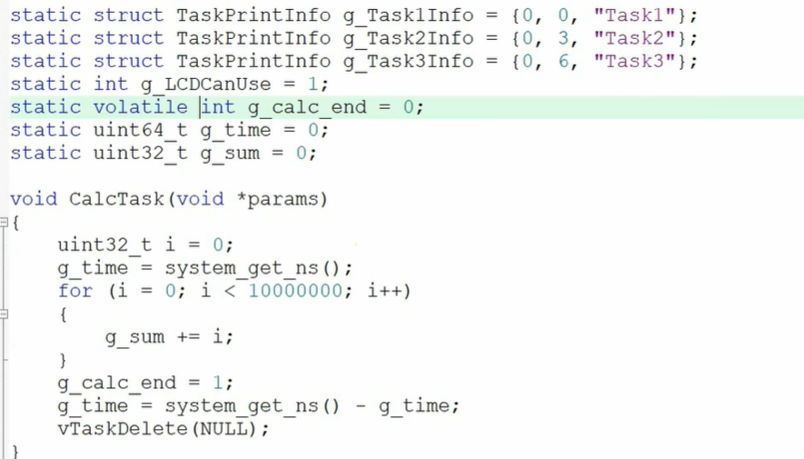
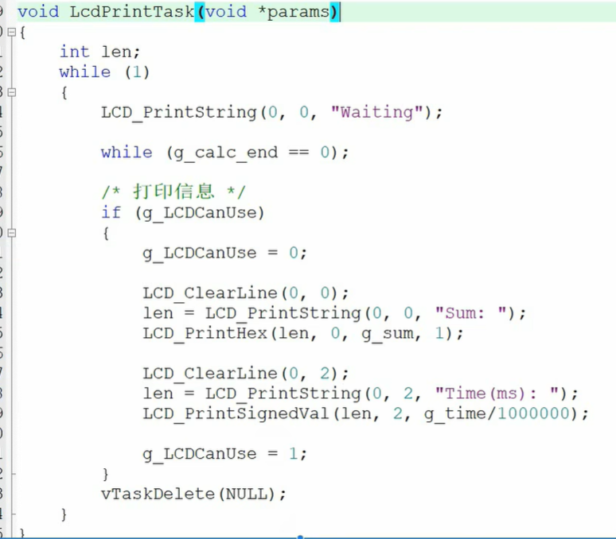

这是一个非常经典且通俗易懂的嵌入式操作系统（RTOS）入门视频片段，主要讲解了<span style="color:#CC0000;">**多任务系统**中最核心的两个概念</span>：**同步（Synchronization）与互斥（Mutual Exclusion）**。

以下是针对该视频的详细内容梳理、知识扩展以及针对嵌入式面试的精选问题。

------


# 1. 视频内容梳理（带时间点）

这个视频用生活中的例子（上厕所）生动地解释了枯燥的操作系统概念：

- **00:00 - 00:11** **开篇引入**：介绍本节主要讲解FreeRTOS（或通用RTOS）中的第10章内容——<span style="color:#CC0000;">同步</span>、<span style="color:#CC0000;">互斥</span>与<span style="color:#CC0000;">通信</span>。
- **00:12 - 00:20** **核心案例**：提出了一个“有味道”的例子用来一句话解释两个概念：<span style="color:#CC00CC;">“我等你用完厕所，我再用厕所。”</span>
- **00:21 - 00:25** **讲解<span style="color:#FF0000;">互斥</span>（Mutual Exclusion）**：
  - **定义**：厕所在同一时间只能被一个人使用。
  - **对应概念**：多任务环境下的共享资源独占（临界区）。
- **00:26 - 00:38** **讲解<span style="color:#FF0000;">同步</span>（Synchronization）**：
  - **定义**：为了实现互斥（不两个人同时进厕所），必须有一个“等待”和“通知”的过程。
  - **关键动作**：“我等你”——这是一个步调协同的操作。你用完出来（事件发生），我才能进去。
- **00:39 - 00:45** **总结**：<span style="color:#CC0000;">解释为什么这两个概念经常放在一起讲。因为很多时候，为了保护资源的互斥性（互斥），需要通过任务间的协作（同步）来实现。</span>

------


## 补充内容





<span style="color:#CC0000;">上面打印出来的第1个任务的运行时间大概是2.5s左右，在第2个任务的 while ( g_calc_end == 0 ) 前面加上一句 vtaskDelay(3000)之后，打印出来的第1个任务的运行时间就大概是1.2s左右了两个任务是同优先级。给我解释下为什么</span>


# 2. 知识补充与深度扩展（面试核心考点）

视频讲的是**概念模型**，但在嵌入式面试和实际开发（如STM32 + FreeRTOS）中，你需要掌握的是**技术实现**。


#### A. 互斥（Mutex）的深层含义

- **本质**：保护**临界资源**（全局变量、硬件外设如I2C/UART接口）。
- **令牌机制**：互斥量就像一把锁（或厕所钥匙）。持有锁的任务才能操作资源，操作完必须归还。
- **RTOS中的特性**：
  - **拥有权（Ownership）**：谁上锁，必须由谁解锁（解铃还须系铃人）。
  - **优先级继承（Priority Inheritance）**：这是互斥量区别于二值信号量的关键（防止优先级反转问题）。


#### B. 同步（Synchronization）的深层含义

- **本质**：任务间的**步调协调**或**事件通知**。
- **单向性**：通常是一个任务（或中断）通知另一个任务“某事已发生”。
- **机制**：
  - **信号量（Semaphore）**：不仅用于互斥，更多用于同步（如二值信号量、计数信号量）。
  - **事件组（Event Group）**：多对多同步（如：等待按键按下**并且**网络连接成功，任务才启动）。
  - **任务通知（Task Notification）**：FreeRTOS中效率最高的轻量级同步方式。


#### C. 视频标题中的“有缺陷”是指什么？

虽然视频只截取了前半部分，但标题提到“有缺陷的同步示例”。通常在裸机开发中，我们会用全局变量标志位（Global Flag）来做同步：

C

```c
// 缺陷示例（伪代码）
while(flag == 0); // 死等，浪费CPU资源
flag = 0;
do_something();
```

**缺陷在于**：

1. **效率低**：`while`循环是“忙等待”（Busy Waiting），CPU在空转，没法去处理低优先级的其他事。

2. 原子性问题：在读取和修改flag的瞬间，可能会被中断打断，导致逻辑错误。

   RTOS的优势：使用OS提供的机制（信号量/互斥量），当条件不满足时，任务会进入阻塞态（Block），让出CPU给其他任务，这是质的区别。

------


# 3. 经典嵌入式面试题（针对同步与互斥）

针对你准备嵌入式面试的需求，我整理了以下几个必考题，并附带了**简洁且有深度的回答范本**。


#### Q1: 互斥量（Mutex）和二值信号量（Binary Semaphore）有什么区别？

> **面试官意图**：考察你是否真的理解RTOS内核机制，而不仅仅是会调用API。

- 参考回答：

  虽然它们在表现上都很像“只有0和1的锁”，但主要区别有两点：

  1. **所有权（Ownership）**：互斥量具有所有权概念，**谁上锁必须由谁解锁**；而二值信号量没有，一个任务可以等待信号，另一个任务（或中断）发送信号（用于同步）。
  2. **优先级继承**：互斥量通常实现了**优先级继承机制**，可以解决**优先级反转**问题；而二值信号量没有此机制。因此，保护临界资源推荐用互斥量，任务同步推荐用信号量。


#### Q2: 什么是优先级反转（Priority Inversion）？如何解决？

> **面试官意图**：这是多任务系统中非常棘手的Bug，考察系统设计能力。

- **参考回答**：
  - **现象**：高优先级任务被低优先级任务阻塞（因为低优先级占用了互斥锁），而此时中优先级任务打断了低优先级任务，导致高优先级任务迟迟得不到运行，看起来像中优先级“反转”压制了高优先级。
  - **解决**：使用支持**优先级继承**的互斥量。当高优先级任务请求锁被阻塞时，OS会临时将持有锁的低优先级任务的优先级**提升**到和高优先级任务一样，防止它被中途打断，使其尽快释放锁。


#### Q3: 在中断服务函数（ISR）中，可以使用互斥量吗？为什么？

> **面试官意图**：考察对中断上下文（Interrupt Context）的理解。

- 参考回答：

  不能。

  1. **阻塞问题**：互斥量获取失败时会导致调用者进入阻塞状态（等待），而中断服务程序必须是快进快出的，**不能阻塞/休眠**，否则会导致系统崩溃或实时性丢失。
  2. **优先级问题**：中断通常不参与RTOS的任务调度优先级管理（中断优先级高于任务），互斥量的优先级继承机制在中断中无效。

  - *补充*：在中断中通常使用二值信号量或任务通知来“唤醒”一个任务去处理复杂逻辑（中断底半部处理）。


#### Q4: 生产者-消费者模型（Producer-Consumer）在RTOS中如何实现？

> **面试官意图**：考察同步与通信的综合应用。

- 参考回答：

  通常使用队列（Queue）或者计数信号量。

  - **生产者**：产生数据写入队列。如果队列满了，生产者阻塞。

  - 消费者：从队列读取数据。如果队列空了，消费者阻塞。

    队列自带了临界区保护（互斥）和阻塞唤醒机制（同步），是最完美的解决方案。

------


### 下一步建议

**Would you like me to...**

- 给你生成一段 **STM32 + FreeRTOS** 的代码示例，展示如何使用 **Mutex** 保护一个模拟的串口打印功能（防止打印字符乱序）？
- 或者，解释一下这章视频可能提到的“死锁（Deadlock）”现象及其避免方法？


# 下一步

## 提问1

<span style="font-weight:bold; font-size:1.1em;">生成一段 **STM32 + FreeRTOS** 的代码示例，展示如何使用 **Mutex** 保护一个模拟的串口打印功能（防止打印字符乱序）。</span>


这是一个非常实用的 **STM32 + FreeRTOS** 场景。在面试中，手写或详细阐述这段代码逻辑是展示你具备工程实践能力的绝佳方式。

### 场景背景

如果没有互斥锁，当 **任务A** 正在打印 "Hello" 时，时间片用完，系统切换到 **任务B**，任务B 打印 "World"。最终串口输出的可能是 "HelWorlold" 这种乱码。

我们需要使用 **Mutex（互斥量）** 来创建一个“临界区”，保证串口在同一时间只能被一个任务独占。


### 代码示例

C

```c
/* Includes ------------------------------------------------------------------*/
#include "main.h"
#include "cmsis_os.h"
#include "string.h"
#include "stdio.h"

/* Global Variables ----------------------------------------------------------*/
UART_HandleTypeDef huart1; // 假设使用串口1

// 1. 定义互斥量句柄
SemaphoreHandle_t xMutexUART = NULL; 

/* Function Prototypes -------------------------------------------------------*/
void SystemClock_Config(void);
static void MX_USART1_UART_Init(void);
void StartTask1(void *argument);
void StartTask2(void *argument);

// --- 核心部分：线程安全的打印函数 ---
// 封装一个函数，所有任务都必须调用这个函数来打印，严禁直接调用 HAL_UART_Transmit
void UART_Printf(const char* format, ...) {
    char buffer[128];
    
    // 格式化字符串处理 (类似printf)
    va_list args;
    va_start(args, format);
    vsnprintf(buffer, sizeof(buffer), format, args);
    va_end(args);

    // 2. 获取互斥量 (Take Mutex)
    // 参数1: 互斥量句柄
    // 参数2: 等待时间 (portMAX_DELAY 表示死等，直到拿到锁为止)
    if (xMutexUART != NULL) {
        if (xSemaphoreTake(xMutexUART, portMAX_DELAY) == pdTRUE) {
            
            // --- 进入临界区 (Critical Section) ---
            // 此时只有当前任务能运行这段代码，其他试图打印的任务会被阻塞
            HAL_UART_Transmit(&huart1, (uint8_t*)buffer, strlen(buffer), 1000);
            
            // --- 退出临界区 ---
            
            // 3. 释放互斥量 (Give Mutex)
            // 必须释放！否则其他任务将永远无法打印（造成死锁）
            xSemaphoreGive(xMutexUART);
        }
    }
}

/* Main Function -------------------------------------------------------------*/
int main(void) {
    HAL_Init();
    SystemClock_Config();
    MX_USART1_UART_Init();

    // 4. 创建互斥量
    // 这一步非常关键，必须在调度器启动前创建
    xMutexUART = xSemaphoreCreateMutex();

    if (xMutexUART == NULL) {
        // 创建失败处理 (比如内存不足)
        while(1); 
    }

    // 创建任务
    xTaskCreate(StartTask1, "Task1", 128, NULL, 1, NULL); // 优先级 1
    xTaskCreate(StartTask2, "Task2", 128, NULL, 2, NULL); // 优先级 2 (高)

    // 启动调度器
    vTaskStartScheduler();

    while (1) {}
}

/* Task Definitions ----------------------------------------------------------*/

// 任务1：模拟低优先级任务
void StartTask1(void *argument) {
    for(;;) {
        // 即使被高优先级任务打断，因为有Mutex，也不会出现字符穿插
        UART_Printf("Task 1 is running safe output...\r\n");
        HAL_Delay(500); // 模拟其他工作
    }
}

// 任务2：模拟高优先级任务
void StartTask2(void *argument) {
    for(;;) {
        UART_Printf("Task 2 [Important] is reporting!\r\n");
        HAL_Delay(500);
    }
}
```

------


### 面试加分点解析（代码背后的逻辑）

在面试中展示这段代码时，你可以主动强调以下几点，这会让面试官对你刮目相看：

#### 1. <span style="color:#CC0000;">为什么要封装成 `UART_Printf`？</span>

- **工程化思维**：<span style="color:#CC0000;">如果不封装，每个任务里都要写一遍 `xSemaphoreTake` 和 `xSemaphoreGive`。一旦某个开发人员忘了写 `Give`，整个系统的串口就死锁了。封装可以强制规范行为。</span>


#### 2. 为什么用 `xSemaphoreCreateMutex` 而不是 `CreateBinarySemaphore`？

- **优先级反转（重点！）**：
  - 假设 Task 1（低优先级）拿到了锁正在打印。
  - Task 2（高优先级）也要打印，但因为锁被 Task 1 拿着，Task 2 进入阻塞。
  - 此时 Task 3（中优先级，不打印）抢占了 CPU，导致 Task 1 迟迟不能运行完打印逻辑来释放锁。
  - **结果**：高优先级的 Task 2 被中优先级的 Task 3 间接堵死了。
  - **Mutex 的作用**：<span style="color:#CC0000;">RTOS 会暂时把 Task 1 的优先级提升到和 Task 2 一样高，让它赶紧干完活把锁交出来。**这是二值信号量做不到的。**</span>


#### 3. 关于 `portMAX_DELAY`

- 面试官可能会问：“如果获取锁超时了怎么办？”
- <span style="color:#CC0000;">在这个例子中，串口打印通常是必须完成的操作，所以用 `portMAX_DELAY`（无限等待）。但在实时性要求极高的控制循环中，应该设置一个具体的超时时间（例如 `10ms`），如果拿不到锁，就放弃打印，直接返回错误，避免卡死控制逻辑。</span>


#### 4. 递归互斥量 (Recursive Mutex)

- **进阶问题**：如果 `UART_Printf` 内部调用了另一个函数，那个函数也调用了 `UART_Printf`，会发生什么？
- **回答**：普通互斥量会导致**死锁**（自己等自己释放锁）。如果存在这种嵌套调用的可能，应该使用 **递归互斥量 (`xSemaphoreCreateRecursiveMutex`)**。


### 下一步建议

**Would you like me to...**

- 模拟一个**死锁（Deadlock）**的代码场景，展示如果不释放锁会发生什么？
- 讲解在 FreeRTOS 中如何使用 **队列（Queue）** 来替代 Mutex 实现串口打印（这是另一种更高级的“守护任务”模式）？
