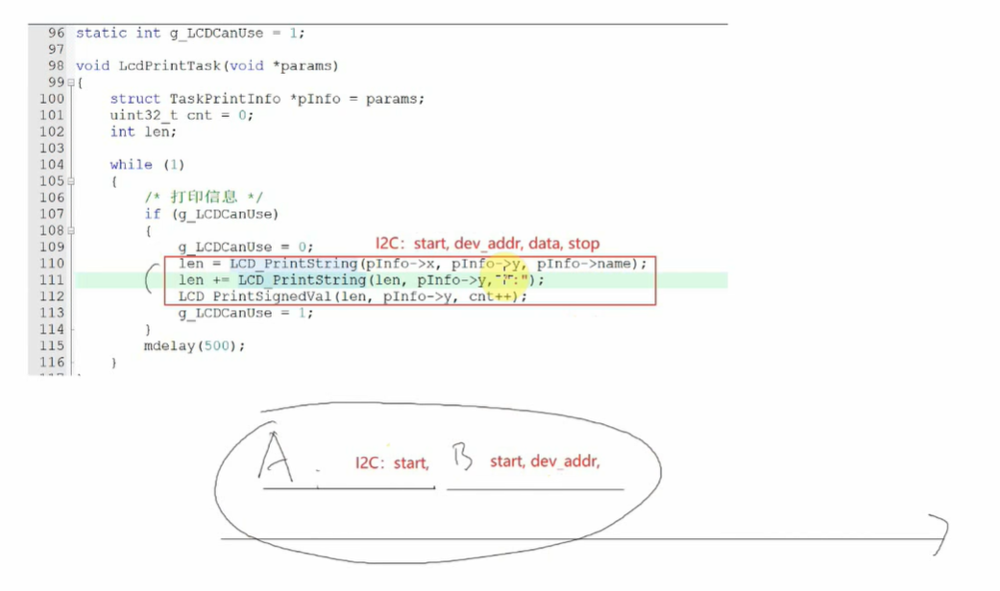
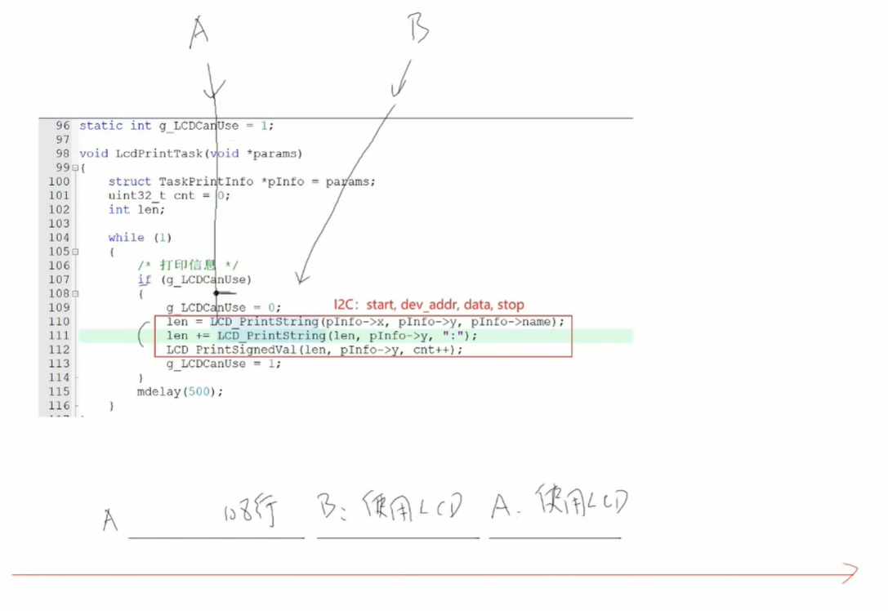
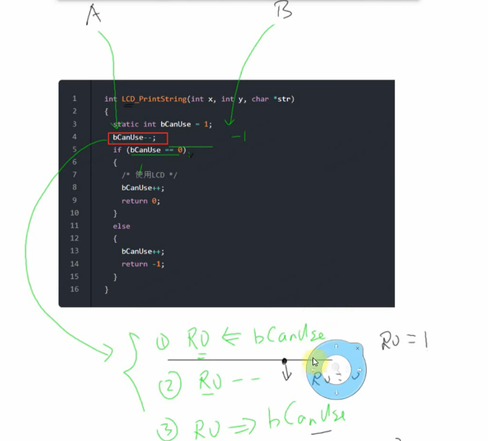
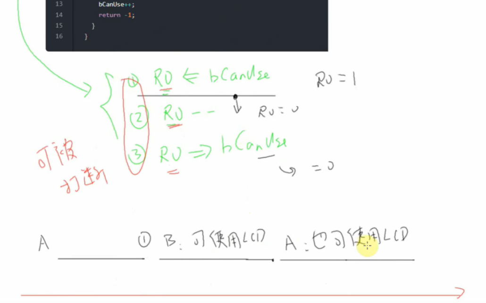
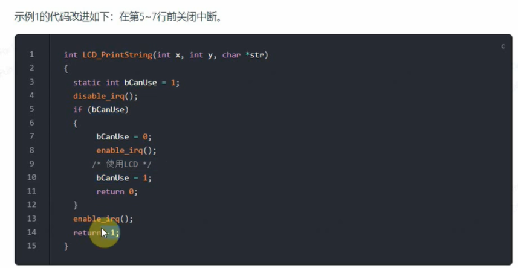
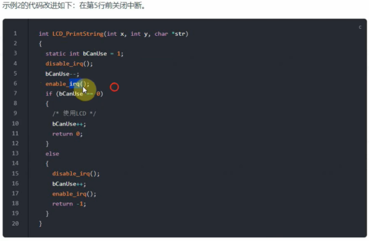
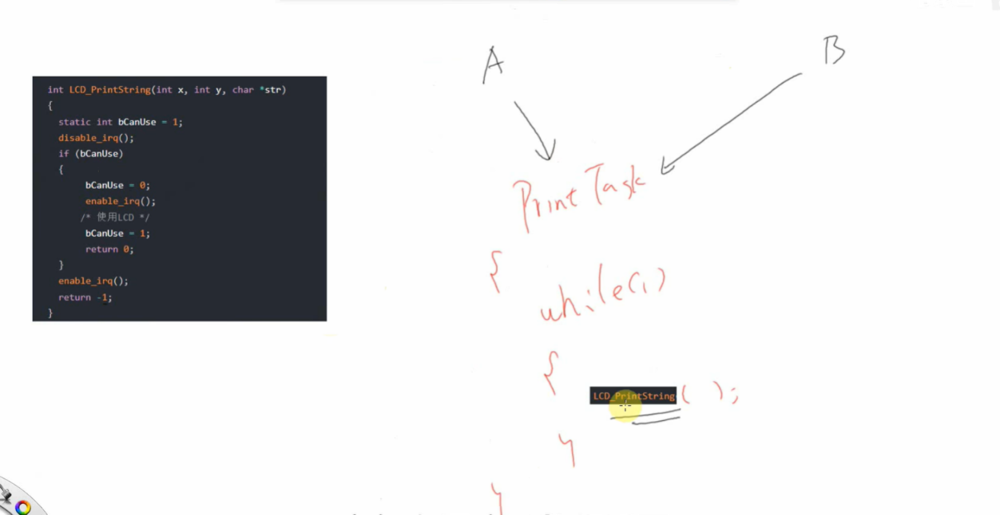
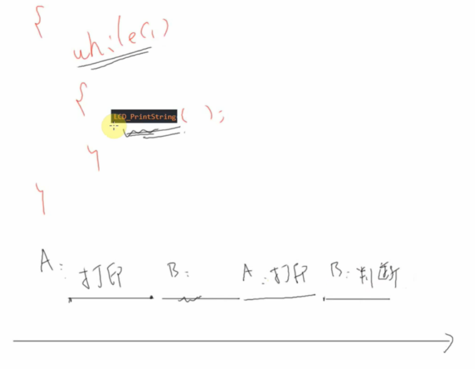
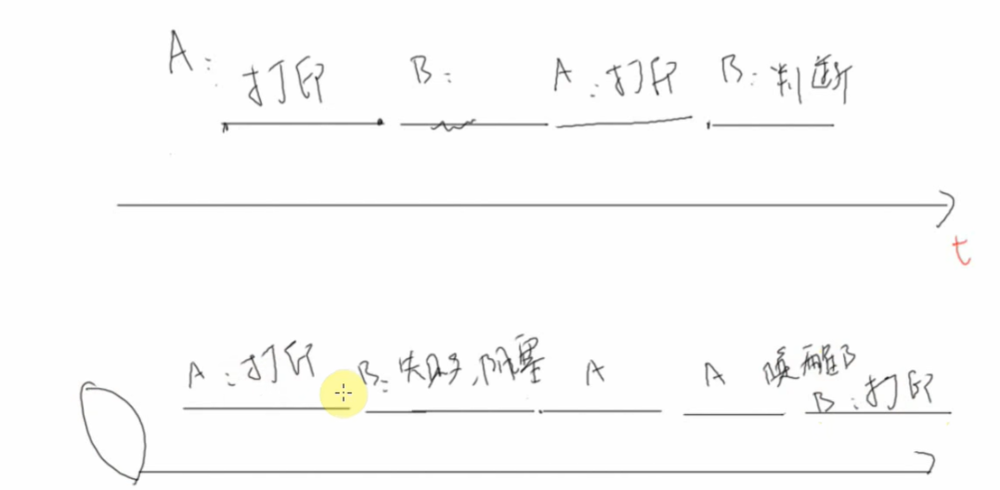

这份视频教程非常深入浅出地讲解了嵌入式实时操作系统（RTOS）中**并发（Concurrency）**和**竞态条件（Race Condition）**的核心问题。它通过一个经典的“LCD显示”案例，演示了为什么简单的全局变量无法实现可靠的资源互斥。

由于你正在准备嵌入式面试，这部分内容是**必考题**。以下是针对该视频的详细总结、知识扩展以及高频面试题。

# 一、 视频内容详细总结

| **时间点**        | **核心内容**                 | **详细解读**                                                 |
| ----------------- | ---------------------------- | ------------------------------------------------------------ |
| **00:00 - 02:11** | **问题引入：临界资源冲突**   | 介绍了三个任务调用同一个函数操作 LCD（I2C协议）。LCD 是**临界资源**（Critical Resource），I2C 操作（发送 Start、地址、数据、Stop）需要时间。如果任务 A 在发完start后被任务 B 抢占，I2C 时序就会被打乱，导致显示乱码。 |
| **02:12 - 05:00** | **朴素解法：全局变量标志位** | 尝试使用一个全局变量 `g_LCDCanUse` 作为“锁”。 逻辑是：`if (g_LCDCanUse) { g_LCDCanUse=0; 操作LCD; g_LCDCanUse=1; }`。 视频指出这种方法在逻辑上看似完美，但实际上有严重缺陷。 |
| **05:01 - 09:44** | **核心缺陷：非原子操作**     | **（重点）** 深入汇编层面分析。C 语言的一句 `if(g_LCDCanUse)` 或 `g_LCDCanUse--` 在汇编层对应三步：**读（Read）、改（Modify）、写（Write）**。 如果在“读”之后、“写”之前发生了**上下文切换（Context Switch）**，任务 A 和 B 都会认为自己拿到了锁，从而导致互斥失败。 |
| **09:45 - 11:41** | **临时方案：关中断**         | 既然问题出在被打断，那就通过 `disable_irq()` 关闭中断。关中断后，SysTick 无法产生中断，调度器无法进行任务切换，从而保证了操作的**原子性（Atomicity）**。 |
| **11:42 - 13:50** | **关中断的弊端：忙等待**     | 虽然关中断解决了互斥问题，但效率极低。如果 A 拿着锁，B 运行起来后会发现锁被占用，然后 B 会在一个 `while` 循环里空转（忙等待），白白浪费 CPU 资源，导致 CPU 利用率低。（补充：这里关中断与开中断的这段期间虽然不能任务调度，但是这段时间是肯定不会存在死循环的，很快就会出来） |
| **13:51 - 15:53** | **理想方案：休眠与唤醒**     | 引出 RTOS 的真正机制（信号量/互斥量）：当 B 发现 LCD 被占用时，应该**主动挂起（阻塞/休眠）**，让出 CPU 给 A。等 A 用完后，再**唤醒** B。这才是高效的互斥。 |

------

# 二、 针对面试的知识扩展

视频中虽然讲透了原理，但在面试中你需要用更专业的术语来描述。

#### 1. 为什么 C 语言的操作不是原子的？（RMW 操作）

面试中常问：“i++ 是线程安全的吗？” 答案是否定的。

视频中展示的 bCanUse-- 实际上是 Read-Modify-Write (RMW) 流程：

1. **LDR (Load):** 将变量从内存加载到 CPU 寄存器（R0）。

2. **SUB (Subtract):** 在 CPU 寄存器中执行减法操作。

3. STR (Store): 将寄存器中的新值写回内存。

   竞态条件就发生在步骤 1 和 3 之间。

#### 2. 视频中的“朴素解法”其实是自旋锁的雏形

视频中那个 `while` 循环不断检查变量的方法，在操作系统理论中称为 **自旋锁 (Spinlock)**。

- **特点：** 线程在等待锁时不会休眠，而是死循环检测。
- **适用场景：** 多核 CPU（一个核等另一个核），且临界区极短的情况。
- **单核 RTOS 这种写法是大忌：** 如果高优先级任务在自旋等待低优先级任务释放锁，而高优先级又不让出 CPU，系统就会死锁（除非有时间片轮转，但也非常浪费）。

#### 3. 关中断（Critical Region）的代价

视频提到了关中断可以保护临界区。在 FreeRTOS 中对应 `taskENTER_CRITICAL()` 和 `taskEXIT_CRITICAL()`。

- **面试雷区：** 千万不要说“为了数据安全，我就一直关中断”。
- **代价：** 关中断会增加**中断延迟 (Interrupt Latency)**。如果你关中断时间太长，可能导致串口丢数据、定时器不准、甚至系统看门狗复位。

#### 4. 互斥量 (Mutex) vs 二值信号量 (Binary Semaphore)

视频结尾引出了 RTOS 的解法。

- **二值信号量：** 类似视频里的标志位，主要用于**同步**。
- **互斥量：** 专门用于**互斥**。它具有**优先级继承 (Priority Inheritance)** 机制，可以解决“优先级反转”问题（这是嵌入式面试的高级题，虽然视频没讲，但一定要知道）。

------

### 三、 经典嵌入式面试题（附参考回复）

基于该视频内容，我为你设计了 4 个高频面试题。

#### Q1: 在单片机开发中，volatile 关键字能否解决多任务竞争全局变量的问题？

- **错误直觉：** 能，因为 volatile 告诉编译器不要优化。
- **参考回复：** **不能。**
  - `volatile` 只是告诉编译器该变量可能会被意外修改，强制每次从内存读取，防止编译器将其优化在寄存器中。
  - 它**无法保证操作的原子性**。如视频所示，`volatile int a; a++;` 依然会被编译成读、改、写三条指令，中间依然可能被中断或任务切换打断。
  - 解决竞争必须使用原子指令、关中断或互斥锁。

#### Q2: 既然关中断能解决资源冲突，为什么 RTOS 不推荐在任务中频繁使用它来做互斥？

- **参考回复：**
  - **实时性破坏：** 关中断会屏蔽所有硬件中断，导致系统无法响应紧急事件（如紧急停机信号、高速数据采集），增加了中断延迟。
  - **系统停滞：** 在单核 RTOS 中，关中断意味着调度器停止工作。如果临界区代码执行时间过长，会严重影响其他高优先级任务的运行。
  - **原则：** 关中断只能用于非常短小的临界区操作（如仅仅修改一个指针或标志位）。

#### Q3: 视频中提到的“忙等待”（Busy Waiting）和 RTOS 提供的“阻塞”（Blocking）有什么本质区别？

- **参考回复：**
  - **忙等待 (Spinning)：** 任务处于 `Running` 或 `Ready` 状态，CPU 一直在执行判断指令（空转），完全占用 CPU 资源，功耗高且效率低。
  - **阻塞 (Blocking)：** 任务进入 `Blocked` 状态，被移出就绪列表。调度器会立刻切换去运行其他任务。当资源可用时，RTOS 才会将该任务唤醒。这是 CPU 资源利用率最高的方式。

#### Q4: 请简述“优先级反转”现象，并说明互斥量是如何解决这个问题的？

*(注：这是视频未讲但面试必问的延伸点，因为视频提到了使用 RTOS 锁)*

- **参考回复：**
  - **现象：** 低优先级任务 A 拿了锁，高优先级任务 C 想拿锁被阻塞，中间优先级任务 B 抢占了 A。结果导致 C 等待 B（因为 B 抢占了 A，导致 A 无法运行去释放锁），看起来像是 B 的优先级比 C 还高。
  - **解决（互斥量）：** 互斥量支持**优先级继承**。当 C 被阻塞时，RTOS 会临时把 A 的优先级提升到和 C 一样高。这样 A 就能尽快运行完并释放锁，防止被 B 抢占。

### 下一步建议

你需要我针对**“优先级反转”**这个概念，或者**STM32中如何使用FreeRTOS的互斥量（Mutex）写代码**进行详细讲解吗？这对你接下来的面试准备至关重要。