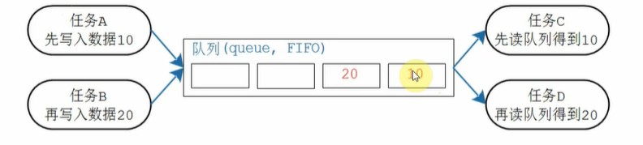
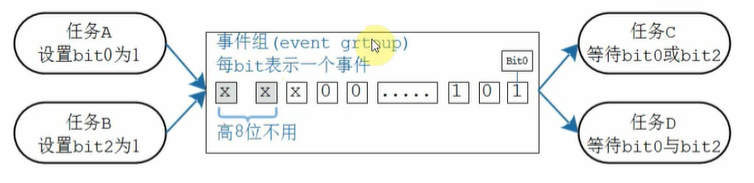
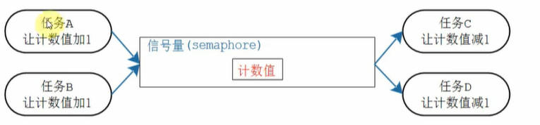
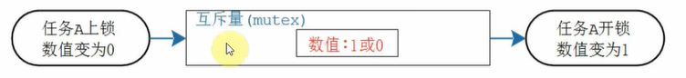
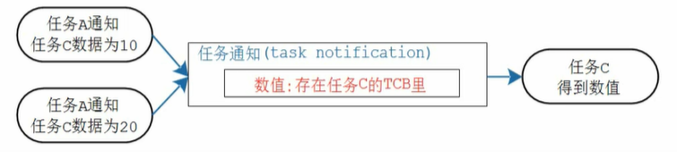

这是一份针对该视频内容的详细整理，以及针对嵌入式面试的深度扩展和模拟题库。这份资料不仅涵盖了视频的基础知识，还补充了面试中常考的底层原理和陷阱。

# 一、 视频内容概要（带时间点）

该视频主要概括了 FreeRTOS 中用于任务间**同步、互斥与通信**的几种核心机制。

- **00:00 - 00:46 全局变量通信的弊端**

  - 简单使用全局变量进行通信（如 Task A 写，Task B 读）缺乏保护。
  - **风险：** 数据非原子性操作导致的数据不一致（如写到一半被读走）。

- **00:47 - 01:30 同步与互斥的需求**

  - **互斥（Mutual Exclusion）：** 保证共享资源在同一时刻只能被一个任务访问。
  - **同步（Synchronization）：** 协调任务运行的先后顺序。
  - **效率：** 必须使用阻塞/唤醒机制，避免死等（忙等待）浪费 CPU。

- **01:31 - 02:02 队列 (Queue)**

  

  - **模型：** 传送带/流水线。
  - **特性：** 先进先出 (FIFO)。
  - **用途：** 主要用于**传递数据**（Data Transfer），生产产品放入队列，消费者取出。

- **02:03 - 02:37 事件组 (Event Group)**

  

  - **模型：** 一组比特位（Bit flags）。
  - **特性：** 多对多关系。每一位代表一个事件，任务可以等待某一位或某几位（AND/OR 逻辑）。
  - **用途：** 用于**事件通知**，而非数据传输。

- **02:38 - 03:07 信号量 (Semaphore)**

  

  - **模型：** 计数器/票据箱。
  - **特性：** 只有计数值，不传递具体数据。
  - **用途：** 用于**资源计数**（如仓库有多少货）或**任务同步**。

- **03:08 - 03:30 互斥量 (Mutex)**

  

  - **模型：** 特殊的二值信号量（令牌）。
  - **特性：** 具有**优先级继承**（Priority Inheritance）机制。
  - **用途：** 专门用于**保护临界资源**（如厕所门锁），解决优先级反转问题。

- **03:31 - 04:14 任务通知 (Task Notification)**

  

  - **模型：** 直接修改目标任务结构体 (TCB) 中的数值。
  - **特性：** 多对一关系（只能发给特定任务）。速度最快，内存占用最小。
  - **用途：** 轻量级的信号量、事件组或邮箱替代方案。

------

# 二、 针对面试的知识扩展与底层原理

视频讲的是“是什么”，面试通常问“为什么”和“怎么做”。以下是针对视频内容的深度补充：

#### 1. 队列的深层机制：拷贝（Copy）与引用

- **视频补充：** 视频说队列像传送带。
- **面试考点：** FreeRTOS 的队列默认是**值拷贝（Copy by Value）**。这意味着当你把一个变量压入队列，系统会把这个变量的内容完整复制一份。
  - **扩展：** 如果要传输大量数据（如 1KB 的 buffer），直接用队列传输数据会导致严重的 CPU 搬运开销。**正确做法**是传递数据的**指针（地址）**，而不是数据本身。

#### 2. 互斥量 vs 二值信号量：核心区别

- **视频补充：** 视频提到了互斥量有“优先级继承”。
- **面试考点：** 这是面试极其高频的问题。
  - **二值信号量**：主要用于**同步**（A 任务好了通知 B 任务）。
  - **互斥量**：主要用于**资源保护**。它拥有**所有权（Ownership）\**概念（谁上锁必须谁解锁）和\**优先级继承**机制（防止高优先级任务被中优先级任务长时间阻塞）。

#### 3. 任务通知的局限性

- **视频补充：** 视频提到它效率最高。
- **面试考点：** 既然它效率最高，为什么不全用它？
  - **限制 1：** 只能有一个接收者（One Receiver）。无法实现广播。
  - **限制 2：** 发送通知时，如果接收任务的通知处于 pending 状态（未处理），新的通知可能会覆盖旧值（取决于设置），不像队列那样有深度的 Buffer。

#### 4. 临界区保护的其他方法

除了视频中的方法，嵌入式系统中还有更底层的保护：

- **关中断（Disable Interrupts）：** 最强力的保护，但会影响系统实时性，只能短时间使用。
- **关调度（Suspend Scheduler）：** 允许中断响应，但禁止任务切换。

------

# 三、 经典嵌入式面试题（附简洁回复）

以下是针对该视频内容，在嵌入式大厂（如大疆、华为、汇川等）面试中常见的问题。

#### Q1: 请简述 FreeRTOS 中互斥量（Mutex）和二值信号量（Binary Semaphore）的区别？

> 参考回复：
>
> 主要区别有两点：
>
> 1. **用途不同：** 互斥量用于**资源保护**（互斥），二值信号量用于**任务同步**。
> 2. **优先级继承：** 互斥量具有**优先级继承**机制，可以解决优先级反转问题；而二值信号量没有。
> 3. **所有权：** 互斥量有所有权概念，即“解铃还须系铃人”（谁上锁谁解锁）；二值信号量则可以一个任务给出的信号，由另一个任务获取（用于同步）。

#### Q2: 什么是“优先级反转”（Priority Inversion）？它是如何产生的，怎么解决？

> **参考回复：**
>
> - **现象：** 高优先级任务被低优先级任务阻塞，导致中优先级任务抢占执行，从而使高优先级任务长时间得不到执行的现象。
> - **产生原因：** 低优先级任务持有了互斥资源（锁），高优先级任务等待该锁被阻塞；此时一个中优先级任务打断了低优先级任务，导致低优先级任务无法运行去释放锁，进而卡死了高优先级任务。
> - **解决方法：** 使用支持**优先级继承**的互斥量。当高优先级任务等待锁时，系统会临时将持有锁的低优先级任务的优先级提升到与高优先级任务相同，防止被中优先级任务打断。

#### Q3: 为什么在中断服务函数（ISR）中不能使用普通的互斥量或信号量获取函数？

> **参考回复：**
>
> 1. **不能阻塞：** 普通的 API（如 `xSemaphoreTake`）允许设置阻塞等待时间。中断必须快进快出，**绝对不允许阻塞**或挂起，否则会导致系统崩溃或实时性丢失。
> 2. **上下文不同：** ISR 运行在中断上下文，不是任务上下文，无法进行任务调度。
> 3. **解决方案：** 必须使用带 `FromISR` 后缀的专用 API（如 `xSemaphoreGiveFromISR`），它们是非阻塞的，并且会请求一次上下文切换而不是直接切换。

#### Q4: FreeRTOS 的队列（Queue）在传输大数据结构时应该注意什么？

> 参考回复：
>
> FreeRTOS 的队列采用的是拷贝传输（Copy by Value）。如果直接传输大的结构体或 buffer，会发生大量内存拷贝，消耗 CPU 且占用队列空间。
>
> 优化方案： 仅在队列中传输数据的指针（地址）。生产者申请内存填充数据后，将指针发给消费者，消费者处理完后释放内存。

#### Q5: 既然有了队列和信号量，为什么 FreeRTOS 后来又引入了“任务通知”？

> **参考回复：**
>
> 1. **性能：** 任务通知直接修改 TCB，不需要像队列那样通过复杂的结构体管理和列表遍历，速度快约 45%。
> 2. **内存：** 不需要像队列那样预分配 buffer，节省 RAM。
> 3. **场景：** 它是轻量级的，非常适合由中断向单个任务发送信号或计数的场景。

### 下一步建议

您似乎正在从原理层面深入学习 FreeRTOS。如果您需要，我可以为您生成一段**C语言伪代码**，演示**“如何使用二值信号量在中断和任务之间进行同步”**（这是最常见的面试手撕代码题之一）。需要吗？
