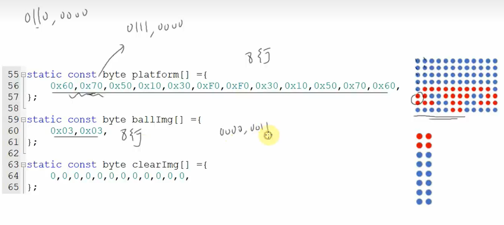
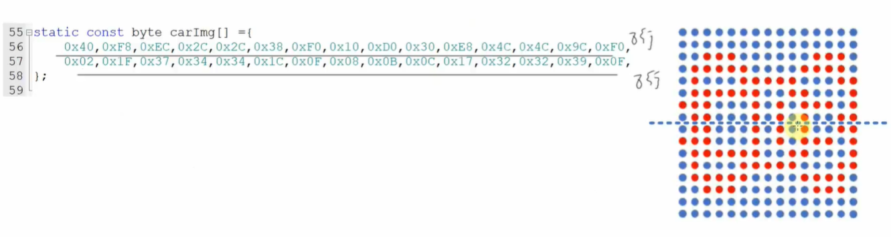
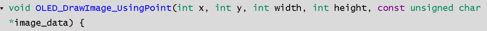

这是一个非常典型的嵌入式项目入门教程，结合了<span style="color:#CC0000;">底层驱动（OLED显示原理）</span>、<span style="color:#CC0000;">逻辑控制（游戏代码）</span>以及<span style="color:#CC0000;">操作系统移植（FreeRTOS）</span>。针对你的需求，我为你整理了视频摘要、知识点扩展以及针对该项目的嵌入式面试题。


# 一、 视频内容摘要与时间轴

这个视频主要介绍了一个名为 **NWatch** 的开源游戏机项目，并以此为基础讲解<span style="color:#CC0000;">如何从裸机代码向 FreeRTOS 移植</span>，重点分析了<span style="color:#CC0000;"> OLED 的显示原理和游戏核心逻辑</span>。

- **00:00 - 01:10 项目介绍与演示**
  
  - 介绍<span style="color:#CC0000;"> NWatch 开源项目（基于 STM32）</span>，演示了<span style="color:#CC0000;">三个版本的程序</span>：<span style="color:#CC0000;">裸机逻辑版</span>、<span style="color:#CC0000;">FreeRTOS 模板版</span>、<span style="color:#CC0000;">NWatch 完整版</span>。
  
- **01:11 - 02:47 课程目标设定**
  
  - 明确课程目的不是为了简单的移植，而是通过<span style="color:#CC0000;">修改一个名为 `game1` 的裸机打砖块游戏</span>，<span style="color:#CC0000;">逐步添加 FreeRTOS 的特性</span>。
  
- **02:48 - 05:27 <span style="color:#CC0000;">OLED 显示原理核心（重点）</span>**

  

  - **核心逻辑**：<span style="color:#CC0000;">游戏的本质</span>是<span style="color:#CC0000;">绘制</span>和<span style="color:#CC0000;">刷新各类图标（位图）</span>。
  - **屏幕规格**：128x64 点阵 OLED。
  - **数据映射**：讲解了 `static const byte` 数组如何映射到屏幕像素。
  - **取模原理**：演示了 **<span style="color:#CC0000;">纵向取模（页寻址模式）</span>**。1个 Byte 代表纵向的 8 个像素点。
  - **案例分析**：<span style="color:#CC0000;">以 `0x60` 为例，二进制 `0110 0000`，低位在上，高位在下，对应屏幕上像素点的亮灭。</span>

- **05:28 - 07:13 复杂图形数据分析**
  
  - 以一<span style="color:#CC0000;">辆小车图标为例</span>，讲解<span style="color:#CC0000;">多行数据的排列方式</span>（第一行数据对应上8行像素，第二行对应下8行像素），强调<span style="color:#CC0000;">十六进制数据与屏幕亮点的对应关系</span>。
  
    
  
- **07:14 - 09:16 游戏代码逻辑分析**
  
  - 分析 `game1.c` 源码。
  - **双缓冲/显存机制**：`draw_bitmap` 修改内存中的 buffer，`draw_flushArea` 将 buffer 通过 I2C 刷到 OLED。
  - **动画原理**：先清除旧位置图像（填0） -> 更新坐标 -> 在新位置绘制图像 -> 刷新显示。
  - **碰撞检测**：<span style="color:#CC0000;">通过坐标判断小球是否触碰墙壁或挡板，从而改变速度向量 (`velx`, `vely`)。</span>
  
- **09:17 - 10:24 硬件外设扩展**
  - 介绍扩展板上的硬件：红外接收（遥控器控制）、无源蜂鸣器（游戏音效）、DHT11/DS18B20（温湿度）、MPU6050（姿态控制）、旋转编码器。
  
- **10:25 - 11:15 最终效果与展望**
  
  - 展示了集成所有外设和 FreeRTOS 后的最终效果（通过姿态或遥控器控制游戏），预告后续课程将围绕 FreeRTOS 的性能进行改造。

------

# 补充提问

## 提问1

<span style="font-weight:bold; font-size:1.2em; border:1px solid #FF00FF;"> 你能够给我详细解释下OLED的显示原理吗，还有这里“**<span style="color:#CC0000;">纵向取模（页寻址模式）</span>**。1个 Byte 代表纵向的 8 个像素点”是什么意思呢，OLED的总共有多少个像素点呢，它们又是怎么划分的呢。最好能够举个例子来让我彻底弄明白。</span>


这是一个非常核心且初学者最容易绕晕的问题。弄懂了这个，你就掌握了OLED驱动的精髓。

为了让你彻底明白，我们把这个OLED屏幕想象成一栋大楼。

### 一、 宏观视角：OLED大楼长什么样？

我们常用的 0.96寸 OLED 屏幕（内部通常是 SSD1306 驱动芯片），它的<span style="background:#00FF80;">**物理分辨率**是 **128 × 64**</span>。

- **总像素点数**：$128 \times 64 = 8192$ 个像素点。
- **每一个点**：都是一个独立的LED发光二极管，可以独立控制亮（1）或灭（0）。

<span style="background:#00FF80; color:#FF0000;">如果不进行划分，我们要控制第 50 行、第 30 列的那个点亮起来，这在数据传输上会很麻烦。为了方便单片机控制，驱动芯片的设计师把屏幕进行了**逻辑划分**。</span>

### 二、<span style="color:#FF0000; border:1px solid #FF00FF;"> 什么是“页寻址模式” </span>(Page Addressing Mode)？

单片机（如STM32）处理数据通常是以 Byte（字节） 为单位的，1个字节 = 8位（bit）。

为了迎合单片机的习惯，OLED 驱动芯片<span style="color:#FF0000; border:1px solid #FF00FF;">把屏幕在**纵向（高度方向）**上，每 8 个像素行捆绑在一起，切成了一“条”，我们把这一条叫做 “页 (Page)”。</span>

#### 1. 怎么划分的？

屏幕高度是 64 个像素。我们每 8 行切一刀：


$$64 \div 8 = 8$$


所以，<span style="color:#FF0000; background:#00FF80; border:1px solid #FF00FF;">整个屏幕被分成了 8 个页 (Page 0 ~ Page 7)。</span>

- **Page 0**: 控制第 0 ~ 7 行像素
- **Page 1**: 控制第 8 ~ 15 行像素
- ...
- **Page 7**: 控制第 56 ~ 63 行像素

#### 2. 什么是“1个 Byte 代表纵向的 8 个像素点”？

这是理解的关键。当你向 OLED 发送 **1 个字节（8 bit）** 的数据时，<span style="color:#FF0000; background:#00FF80; border:1px solid #FF00FF;">这 8 个 bit 并不是横着排列的，而是**竖着**排列的</span>。

- **Bit 0 (最低位)**：对应这一列的<span style="color:#FF0000; background:#00FF80; border:1px solid #FF00FF;">最**顶**端像素</span>。
- **Bit 7 (最高位)**：对应这一列的<span style="color:#FF0000; background:#00FF80; border:1px solid #FF00FF;">最**底**端像素</span>。

### 三、 举例实战：让我们来点亮像素

假设我们现在操作 **Page 0**（也就是屏幕最顶部的这 8 行），光标定位在 **Column 0**（最左边第0列）。

#### 例子 1：写入数据 `0x01`

- **二进制**：`0000 0001`
- **物理效果**：
  - Bit 0 是 `1` -> 第 0 行（最顶上那行）的像素点亮。
  - Bit 1~7 是 `0` -> 第 1~7 行的像素熄灭。
- **视觉**：屏幕左上角出现了**一个点**。

#### 例子 2：写入数据 `0xFF`

- **二进制**：`1111 1111`
- **物理效果**：
  - Bit 0~7 全是 `1` -> 第 0 行到第 7 行全部点亮。
- **视觉**：屏幕最左边出现了一条**短的竖线**（长度为8个像素）。

#### 例子 3：写入数据 `0x06` (这在取模软件中很常见)

- **二进制**：`0000 0110`
- **物理效果**：
  - Bit 0 (`0`): 第 0 行灭
  - Bit 1 (`1`): 第 **1** 行亮
  - Bit 2 (`1`): 第 **2** 行亮
  - Bit 3~7 (`0`): 灭
- **视觉**：在左上角往下一点的位置，有两个点亮了。

------

### 四、 结合视频中的“汽车”取模来理解

视频中 `carImg` 数组里有一堆十六进制数，比如 `0x40`。

C

```
// 视频中的第一行数据，对应 Page 0（车顶部分）
0x40, 0xF8, 0xEC, ...
```

我们来看第一个数据 **`0x40`** 放在 **Page 0, Column 0** 是什么样：

1. **十六进制**：`0x40`
2. **二进制**：`0100 0000`
3. **对应关系**：
   - Bit 0~5 (0): 灭
   - **Bit 6 (1): 亮** -> 对应 Page 0 的第 6 行（实际上是屏幕的物理第6行）。
   - Bit 7 (0): 灭
4. **结果**：这一列，只有第6个点是亮的。

**如果把这些数据连起来看：**

- 第一列 `0x40`：第6行亮个点。
- 第二列 `0xF8` (`1111 1000`)：第3、4、5、6、7行都亮（这是一条竖线，可能是车头或车轮廓）。
- 这样一列一列地扫过去，就组成了汽车上半部分的图案。

### 五、 总结与面试回答话术

如果面试官问你：“**请解释一下 OLED 的显存结构和寻址方式。**”

你可以这样自信地回答（结合了以上所有知识点）：

> “常用的 128x64 OLED 内部使用 **GDDRAM** 作为显存。虽然屏幕是二维的，但为了配合单片机的 8位 存储习惯，它采用了**页寻址模式 (Page Addressing Mode)**。
>
> 1. 它将 64 行像素划分成了 **8 个页 (Page)**，每个页包含 **8 行**。
> 2. 当我们向显存写入 **1 个 Byte** 数据时，这个 Byte 控制的是**某一列中纵向排列的 8 个像素点**。通常 **LSB (最低位)** 对应页内的最顶行，**MSB (最高位)** 对应页内的最底行。
> 3. 所以，我们在画点或者显示字符时，其实是在计算这个点位于哪一个 Page，以及在这个 Page 里的哪一个 Bit，然后通过位运算修改显存中的对应字节。”

这样解释，既有宏观架构，又有微观细节，非常完美！


## 提问 1-（1）

<span style="color:#FF0000; background:#00FF80; border:1px solid #FF00FF; font-weight:bold;">这个OLED不是一行有128个像素点吗，如果我们控制OLED刷新图形的话，那么每页不是要定义一个长度为128 的数组吗，然后往数组里面写元素。我的理解对吗，有没有什么需要补充的呢。</span>

你的理解非常到位！**完全正确**。

如果我们要控制单独的一页（Page），确实就是定义一个 **长度为 128 的字节数组** (`uint8_t buffer[128]`)。

不过，为了让你在实际写代码（特别是做像 NWatch 这样的游戏）时更顺手，我需要补充两个**非常关键的“实战逻辑”**。这也是为什么你的理解是对的，但看别人的代码时可能会发现有点不一样的原因。

### 1. 补充一：横向坐标的对应关系

你说“<span style="color:#FF0000; background:#00FF80; border:1px solid #FF00FF;">往数组里面写元素”，这个动作在物理上对应的就是**从左到右**控制屏幕。</span>

假设我们定义了数组：

C

```c
uint8_t Page0_Buffer[128]; 
```

那么：

- `Page0_Buffer[0]`：控制第 **0** 页，第 **0** 列的那 **8** 个竖着的点。
- `Page0_Buffer[1]`：控制第 **0** 页，第 **1** 列的那 **8** 个竖着的点。
- ...
- `Page0_Buffer[127]`：控制第 **0** 页，第 **127** 列的那 **8** 个竖着的点。

实战坑点：

如果你只想让第 0 列的最下面那个点亮起来，你不能往数组里写 1（因为 1 是 0000 0001，对应最上面那个点）。你需要往数组里写 0x80（1000 0000）。

所以，数组的一个元素 = 一列中的8个像素。

### 2. 补充二：为什么要“全屏缓冲” (Gram / FrameBuffer)？

虽然从硬件原理上，确实是一页一页控制的（8个页，每页128字节）。但在写游戏代码时，如果真的定义 **8 个独立的数组**（比如 `Page0_Buf`, `Page1_Buf`...），会让你痛不欲生。

场景举例：

你想画一个球。这个球运动到了屏幕中间，它的上半部分在 Page 3，下半部分在 Page 4。

- 如果你用 8 个独立数组，你需要先算：“哦，上半截切开，存进数组3；下半截切开，存进数组4”。这太痛苦了。

工业级/游戏级做法：

我们<span style="color:#FF0000; background:#00FF80; border:1px solid #FF00FF;">会定义一个巨大的二维数组（或者一维大数组），把整个屏幕的显存“映射”到内存里。这就是视频里提到的 Frame Buffer。</span>

C

```c
// 定义一个能装下整个屏幕数据的数组
// 8页 * 128列 = 1024 字节
uint8_t OLED_GRAM[8][128]; 
```

或者展平为一维：

C

```c
uint8_t OLED_GRAM[1024]; 
```

**此时的控制逻辑变成了：**

1. **想画点(x, y)？**

   - <span style="color:#FF0000; background:#00FF80; border:1px solid #FF00FF;">不管它在哪一页，我都用一个公式算出它在大数组里的位置</span>：
   - `页数 = y / 8`
   - `数组下标 = 页数 * 128 + x`
   - `位偏移 = y % 8`
   - 然后修改 `OLED_GRAM[下标]` 里的对应位。

2. **修改完之后呢？**

   - 现在只是 STM32 的内存变了，OLED 还没变。
   - 调用 `Refresh()` 函数，**由单片机自动搞定那一页一页的搬运工作**：

   C

   ```c
   // 伪代码
   for(i = 0; i < 8; i++) {
       // 告诉OLED：我要开始写第 i 页了
       Write_Command(0xB0 + i); 
       // 告诉OLED：把光标移到最左边
       Set_Column(0);
       // 把这128个字节一口气发过去
       Write_Data(&OLED_GRAM[i][0], 128); 
   }
   ```

### 总结

你的理解是对的：**微观上，确实是控制长度为 128 的数组。**

但在**宏观实战**中，我们通常把这 8 个“长度128的数组”拼成一张大饼（1024字节），这就是显存缓冲（Buffer）。

- **你的理解**：针对硬件底层的通信协议（I2C发数据时确实是发128个）。
- **我的补充**：针对软件架构的实现方式（我们在内存里维护一个全屏副本，算好了再一次性发给硬件）。


## 提问2

<span style="font-weight:bold; font-size:1.2em;">常用的 0.96寸 OLED 屏幕（内部通常是 SSD1306 驱动芯片），这里的驱动芯片指的就是显卡吗，它应该也是独立工作的吧，和CPU分别都有独立的电源，之间工作不影响。</span>


这是一个非常棒的类比！你的直觉非常敏锐，把 **SSD1306** 比作 **显卡** 是非常有助于理解的，但它们之间有一个**关键的区别**。

简单直接的回答是：

SSD1306 相当于电脑里的“显卡”，但<span style="color:#FF0000; background:#00FF80; border:1px solid #FF00FF;">它只是一张“没有脑子”的显卡（显存 + 输出接口），而没有 GPU（图形处理单元）</span>。

让我们针对你的三个疑问（显卡定义、独立工作、电源）逐一拆解，彻底搞懂嵌入式显示系统。

------

### 一、 它算“显卡”吗？（显存 vs GPU）

在电脑（PC）里，显卡通常包含两个核心部分：

1. **显存 (VRAM)**：存放图像数据。
2. **GPU (图形处理器)**：负责**计算**图像（比如计算3D模型、渲染光影、解码视频）。

而在单片机世界（比如 NWatch 项目）里：

- **SSD1306 (OLED驱动芯片)**：它只负责 **部分 1**（显存）。它里面有 GDDRAM，用来存放你发给它的“点阵数据”，并负责把这些数据转换成电压去点亮屏幕。它**不具备计算能力**。它不知道什么是“圆”，什么是“字”，它只知道“这个点亮，那个点灭”。
- **STM32 (单片机 CPU)**：它兼职做了 **部分 2**（GPU）的工作。是你写的 C 语言代码在 STM32 里“算”出了圆的轨迹，“算”出了汉字的字模，然后把算好的结果（纯数据）发给 SSD1306。

**结论**：SSD1306 是**显示控制器 (Display Controller)**，而不是图形处理器 (GPU)。

### 二、 它是独立工作的吗？（互不影响？）

**是的，逻辑上是高度独立的。** 这也是它最伟大的地方。

#### 1. “静态”显示特性

这一点和早期的笨显示器不同。

- **笨显示器（RGB接口/VGA）**：CPU 必须时刻不停地给它发数据，一旦 CPU 停下来（比如去处理按键了），屏幕就黑了或花了。
- **SSD1306 (智能)**：它内部有自己的 SRAM（显存）。
  - STM32 说：“嘿，给你一张图”。
  - SSD1306 把图存进自己的肚子里，然后 STM32 就可以去睡觉或者去算下一关游戏的逻辑了。
  - SSD1306 会**独立地、不知疲倦地**一直显示这张图，直到 STM32 发来新的指令。

**这意味着**：STM32 的繁忙程度不会导致屏幕闪烁（只要你不去刷新它），屏幕的刷新扫描工作完全由 SSD1306 内部电路自动完成，**完全不占用 CPU 资源**。

### 三、 它们有独立的电源吗？

这个问题涉及硬件电路设计。

#### 1. 宏观上：同源（通常受影响）

在 NWatch 这种小设备里，电池只有一个（比如 3.7V 锂电池）。

- 电池 -> 稳压器 (LDO) -> **3.3V 总线**。
- STM32 的 VCC 接在 3.3V 上。
- OLED 屏幕的 VCC 也接在 3.3V 上。
- **影响**：如果你的程序写了个死循环让 CPU 满负荷运转，或者外接了电机把电池电压拉低了，OLED 可能会因为电压不稳而变暗或闪烁。所以在物理电源线上，它们是“拴在一根绳上的蚂蚱”。

#### 2. 微观上：内部独立变压

虽然输入都是 3.3V，但 OLED 发光材料其实需要 **7V ~ 10V** 的高电压才能亮起来。

- **SSD1306 内部自带“升压电路” (Charge Pump)**：它会把输入的 3.3V 独立转换成高压去点亮像素。
- **意义**：STM32 只是给了它一个低电压供电，具体的像素驱动电压是 SSD1306 自己生成的。STM32 内部逻辑电压只有 1.8V-3.3V，它是没法直接驱动 OLED 发光材料的。

------

### 四、 终极类比：画家与画布

为了让你面试时能脱口而出，请记住这个场景：

- **STM32 (CPU)** 是 **画家**。
  - 他负责构思画面（计算游戏逻辑）。
  - 他负责调色、运笔（生成显存数据）。
  - 他很忙，还得听旁边的人说话（处理按键中断）。
- **SSD1306 (OLED驱动)** 是 **拿着画布的助手**。
  - 他**不会画画**（没有计算能力）。
  - 但是他**记性好**（有 GDDRAM 显存）。
  - 画家画好一笔，甚至画好整幅画，递给助手。
  - 助手就**举着这幅画**给观众看（驱动屏幕显示）。
  - 此时，画家可以转身去喝水、休息，助手依然稳稳地举着画，观众看到的图像不会消失。

### 五、 面试“反杀”题

如果面试官问：“**既然 SSD1306 独立工作，为什么有时候屏幕刷新率还是很低，感觉画面卡顿？**”

**你可以这样回答**：

> “这通常不是 SSD1306 的显示扫描慢（它内部扫描很快），瓶颈通常在于画家给助手递画的速度（通信速度）。
>
> 比如使用 I2C 协议，只有 400kHz，传输一帧图像（1KB数据）本身就需要几十毫秒。STM32 画得再快，传输通道堵车了，帧率也上不去。解决方法是换用 SPI 接口（10MHz+）或者使用 DMA 传输。”


## 提问3（OLED画点公式）

**想画点(x, y)？**

- <span style="color:#FF0000; background:#00FF80; border:1px solid #FF00FF;">不管它在哪一页，我都用一个公式算出它在大数组里的位置</span>：
- `页数 = y / 8`
- `数组下标 = 页数 * 128 + x`
- `位偏移 = y % 8`
- 然后修改 `OLED_GRAM[下标]` 里的对应位。

<span style="font-weight:bold; font-size:1.2em;">这里我不是太懂，你能够给我详细解释下吗，最好能够举个例子来让我彻底弄明白。</span>

没问题！这个公式是**图形算法（画点）的核心**，也是所有单片机图形库（GUI）最基础的一步。如果不理解这个，就没法随心所欲地控制屏幕。

为了让你彻底明白，我们放弃枯燥的数学定义，继续用**“大楼与房间”**的比喻，结合**具体的数字例子**来推演一遍。

------

### 一、 场景设定：把 OLED 想象成一座大楼

- **屏幕尺寸**：128（宽）x 64（高）。
- **内存结构**：我们定义了一个**一维数组** `OLED_GRAM[1024]` 来存储整个屏幕的数据。
  - 数组虽然是一条长龙（一维），但屏幕是二维的。我们<span style="color:#FF0000; background:#00FF80; border:1px solid #FF00FF;">需要把二维坐标 $(x, y)$ 映射到这一维数组里。</span>

### 二、 举例实战：画一个点 P(2, 10)

假设我们要点亮坐标为 **$(x=2, y=10)$** 的那个像素点。

- **x = 2**：表示<span style="color:#FF0000; border:1px solid #FF00FF; background:#00FF80;">横向在第 2 列（从左往右第3格）</span>。
- **y = 10**：表示<span style="color:#FF0000; background:#00FF80; border:1px solid #FF00FF;">纵向在第 10 行（从上往下第11格）</span>。

我们按照公式一步步拆解：

#### 第一步：确定<span style="color:#FF0000; border:1px solid #FF00FF;">“住在哪一层大公寓” </span>(Page Calculation)

**公式**：`页数 (Page) = y / 8`

- 为什么要除以 8？

  因为 <span style="color:#FF0000; background:#00FF80; border:1px solid #FF00FF;">OLED 纵向每 8 个像素被捆绑成了一个“页”（Page）</span>。

  - 第 0 ~ 7 行 $\rightarrow$ 属于 Page 0
  - 第 8 ~ 15 行 $\rightarrow$ 属于 Page 1

- 代入计算：

  

  $$10 \div 8 = 1$$

   （注意<span style="background:#00FF80; border:1px solid #FF00FF; color:#FF0000;">：C语言整数相除，余数被丢弃</span>）

- **结论**：这个点位于 **Page 1**。

#### 第二步：在<span style="color:#FF0000; border:1px solid #FF00FF;">大数组里找到“具体的门牌号”</span> (Index Calculation)

**公式**：`数组下标 = 页数 * 128 + x`

- <span style="background:#00FF80; border:1px solid #FF00FF; color:#FF0000;">为什么要乘以 128？</span>

  <span style="color:#FF0000; border:1px solid #FF00FF;">数组是连续存放的。Page 0 的数据占用了数组的前 128 个位置（0~127）。既然我们在 Page 1，我们就必须跳过前面 Page 0 占用的那 128 个字节。</span>

  - Page 0 占用：`GRAM[0]` 到 `GRAM[127]`
  - Page 1 开始于：`GRAM[128]` ...

  

- <span style="color:#FF0000; background:#00FF80; border:1px solid #FF00FF;">为什么要加上 x？</span>

  <span style="color:#FF0000; border:1px solid #FF00FF;">Page * 128 只是帮我们找到了 Page 1 的开头。具体的列是 $x=2$，所以我们要从开头往后挪 2 个位置。</span>

  

- 代入计算：

  $$1 \times 128 + 2 = 130$$

  

- **结论**：<span style="color:#FF0000; border:1px solid #FF00FF; background:#00FF80;">控制这个像素的数据，存放在 `OLED_GRAM[130]` 这个字节里</span>。

#### 第三步：确定“字节里的哪一位” (Bit Offset)

**公式**：`位偏移 = y % 8`

- 为什么要取余数？

  我们现在已经找到了 OLED_GRAM[130] 这个字节。<span style="color:#FF0000;">这个字节包含了纵向的 8 个点（对应 y=8 到 y=15）。</span>

  我们<span style="color:#FF0000; border:1px solid #FF00FF;">要找的是 y=10。</span>

  <span style="color:#FF0000; background:#00FF80; border:1px solid #FF00FF;">在 Page 1 内部（从 y=8 开始算起），y=10 是第几行呢？（注意：这里是从0开始的，即第0行、第1行、第2行）</span>

  

  $$10 - 8 = 2$$

  

  或者用取余公式：$10 \% 8 = 2$ （10 除以 8 余 2）。

- **结论**：我们<span style="color:#FF0000; background:#00FF80; border:1px solid #FF00FF;">要修改的是这个字节的 **Bit 2**（第3位）</span>。

------

### 三、 总结：<span style="color:#FF0000; background:#00FF80; border:1px solid #FF00FF;">从坐标到内存的“穿越”</span>

刚才的一通计算，<span style="color:#FF0000; border:1px solid #FF00FF;">把具体的空间坐标 **P(2, 10)** 转换成了计算机指令</span>：

> <span style="color:#FF0000; border:1px solid #FF00FF;">**“去把 `OLED_GRAM` 数组第 `130` 号元素的 `Bit 2` 置为 1。”**</span>

#### 图解验证：

Plaintext

```c
       x=0   x=1   x=2 (目标列)
      ┌───┐ ┌───┐ ┌───┐
Page0 │   │ │   │ │   │ ... (数组下标 0 ~ 127，这里我们跳过了)
(y0-7)└───┘ └───┘ └───┘

Page1 ┌───┐ ┌───┐ ┏━━━┓ <--- 这是 GRAM[130]
(y8-15)│   │ │   │ ┃Bit0┃ (对应 y=8)
      │   │ │   │ ┃Bit1┃ (对应 y=9)
      │   │ │   │ █Bit2█ <--- 目标点 y=10 (10%8=2)
      │   │ │   │ ┃Bit3┃ (对应 y=11)
      │   │ │   │ ┃... ┃
      └───┘ └───┘ ┗━━━┛
       ^     ^     ^
     Idx:  Idx:  Idx:
     128   129   130
```

### 四、 最后一步：代码怎么写？

<span style="color:#FF0000; background:#00FF80; border:1px solid #FF00FF;">知道了下标是 130，位是 2，我们怎么修改它？</span>

**错误写法：** `OLED_GRAM[130] = 1;`

- 这样写是错的！因为 1 的二进制是 `0000 0001`。<span style="color:#FF0000; border:1px solid #FF00FF;">这会点亮 Bit 0，同时**熄灭** Bit 1~7。这意味着这一列的其他 7 个像素会被你强制关掉，这不行。</span>

正确写法（<span style="color:#FF0000; border:1px solid #FF00FF;">位操作</span>）：

我们<span style="color:#FF0000; border:1px solid #FF00FF;">只想把 Bit 2 置为 1，而不影响其他位</span>。

1. 准备一个面具（Mask）：让 1 左移 2 位。

   1 << 2  $\rightarrow$  0000 0100

2. 进行“或运算” (|)：

   原数据 | 0000 0100

**综合代码（通用函数）：**

C

```c
void OLED_DrawPoint(int x, int y) {
    int page = y / 8;        // 1. 算出在哪一页
    int bit_off = y % 8;     // 2. 算出在那一页的哪一行
    int idx = page * 128 + x;// 3. 算出在数组的哪个位置

    // 4. 修改那个位 (读出原数据 -> 把对应位置1 -> 写回)
    OLED_GRAM[idx] = OLED_GRAM[idx] | (1 << bit_off);
}
```

现在，这个逻辑是不是彻底通透了？


## 提问4（从OLED画点函数 到 显示图像）

```c
void OLED_DrawPoint(int x, int y) {
    int page = y / 8;        // 1. 算出在哪一页
    int bit_off = y % 8;     // 2. 算出在那一页的哪一行
    int idx = page * 128 + x;// 3. 算出在数组的哪个位置

    // 4. 修改那个位 (读出原数据 -> 把对应位置1 -> 写回)
    OLED_GRAM[idx] = OLED_GRAM[idx] | (1 << bit_off);
}
```

<span style="color:#FF0000; border:1px solid #FF00FF; font-weight:bold; font-size:1.1em;">我们有了这个OLED的画点函数，那么我们该如何显示一个图像呢，比如一个小车的图像，可以借助这个画点函数实现吗，我不是太懂，你能够给我详细解释下吗，另外还有什么需要补充的吗。</span>


这也是一个非常棒的问题！你已经掌握了<span style="font-family:serif; color:#FF0000; background:#00FF80; border:1px solid #FF00FF;">最底层的“原子”操作——画点</span>。

**答案是肯定的：<span style="color:#FF0000; background:#00FF80; border:1px solid #FF00FF;">完全可以借助 `OLED_DrawPoint` 来画一个小车，或者任何图像。</span>**

<span style="color:#FF0000; border:1px solid #FF00FF;">图像的本质就是“点的集合”。只要我们知道小车图像里每一个点的位置，循环调用 `OLED_DrawPoint` 把它们画出来就行了。</span>

我通过三个步骤带你从原理到代码彻底实现它，最后告诉你<span style="color:#FF0000; border:1px solid #FF00FF;">为什么在实际项目中通常**不这么做**（补充部分）</span>。

------

### 第一步：理解“图像数据”长什么样

在代码中，我们没法直接放一张 .jpg 图片，我们需要把图片转换成数组。

回顾视频里的小车数据 carImg（<span style="color:#FF0000; background:#00FF80; border:1px solid #FF00FF;">假设小车宽16像素，高16像素</span>）：

C

```c
// 这是一个取模后的数组，它记录了小车的形状
// 格式通常是：纵向取模（Page模式）
const unsigned char carImg[] = {
    // 第一行数据 (对应小车上半截，Page n)
    0x00, 0x40, 0xF8, 0xEC, 0x2C, ... (共16个字节)
    
    // 第二行数据 (对应小车下半截，Page n+1)
    0x00, 0x08, 0x1F, 0x37, 0x34, ... (共16个字节)
};
```

**关键点：** 数组里的每一个元素（比如 `0xF8`），代表的是小车**某一列**上竖着的 8 个点的信息。

### 第二步：如何用 `OLED_DrawPoint` 画出来？

我们可以写一个<span style="color:#FF0000; border:1px solid #FF00FF;">“笨办法”函数</span>。逻辑就像**绣花**一样：拿到数据，拆开看每一位，如果是1，就在对应的坐标绣一个点。

**代码逻辑：**

C

```c
// x, y: 小车在屏幕上的起始坐标
// width, height: 小车的宽高（比如 16, 16）
// image_data: 存放小车数据的数组
void OLED_DrawImage_UsingPoint(int x, int y, int width, int height, const unsigned char *image_data) {
    int i, j, k;
    int array_index = 0; // 记录我们在数组读到第几个字节了

    // 1. 因为数据是按“页”存的，我们以8个像素高度为单位遍历
    // height / 8 算出图像占了几个“页高度”（假设高度是8的倍数）
    for (i = 0; i < height / 8; i++) {
        
        // 2. 遍历这一页的每一列 (0 到 width-1)
        for (j = 0; j < width; j++) {
            
            // 获取当前这一列的 8个像素数据 (比如 0xF8)
            unsigned char byte_data = image_data[array_index];
            array_index++; // 数组下标后移

            // 3. 关键步骤：把这 1个字节 拆解成 8个点
            for (k = 0; k < 8; k++) {
                // 判断第 k 位是不是 1
                // (byte_data >> k) & 0x01 是提取第 k 位的值
                if ((byte_data >> k) & 0x01) {
                    
                    // 如果是1，就调用画点函数
                    // 横坐标 = 起始x + 当前列j
                    // 纵坐标 = 起始y + 当前页高度(i*8) + 当前位偏移k
                    OLED_DrawPoint(x + j, y + i * 8 + k);
                }
            }
        }
    }
}
```

**原理解析：**

- 这就像是你雇了一个粉刷匠（CPU）。
- 你给他一张图纸（数组）。
- 他看一眼图纸上的一个字节：“哦，这里第3位是1”。
- 然后他跑到墙上算出精确坐标 $(x+j, y+i*8+k)$，画了一个点。
- 他又看一眼：“第4位也是1”。
- 他又算坐标，又画一个点。
- ...重复几百次。

------

### 第三步：补充——为什么高手通常不这么写？（重要）

虽然上面的代码逻辑清晰，完全可行，但在**商业项目**或**追求性能的游戏**（如 NWatch）中，我们很少用 `OLED_DrawPoint` 来画大图。

**理由是：效率太低（脱裤子放屁）。**

请看这一波操作的荒谬之处：

1. **数据的原始形式**：图像数组里已经是 **Byte（字节）** 了，已经是排好队的8个点。
2. **你的操作**：你<span style="color:#FF0000;">用循环把这个 Byte **拆散**，拆成8个独立的 Bit</span>。
3. **DrawPoint的操作**：你<span style="color:#FF0000; border:1px solid #FF00FF;">调用 `DrawPoint`，它内部又把这 8 个 Bit 通过 `y/8`、`y%8` 的运算，**重新拼凑**回一个 Byte，再存进 `OLED_GRAM`。</span>

这就像：

你买了一箱装好的牛奶（Byte），你想把它放进冰箱（GRAM）。

- **DrawPoint做法**：把箱子拆开，一瓶一瓶拿出来，跑8趟放进冰箱，然后在冰箱里把它们重新装回箱子。
- **高效做法**：直接把箱子搬进冰箱。

#### 高效的写法：<span style="color:#FF0000; background:#00FF80; border:1px solid #FF00FF;">直接字节拷贝 (Byte Blit)</span>

如果<span style="color:#FF0000; background:#00FF80; border:1px solid #FF00FF;">小车的显示坐标 **Y 正好是 8 的倍数**（比如画在 Page 0、Page 2），我们可以直接把数组里的数据“抄”进显存，跳过所有繁琐的坐标计算。</span>

C

```c
// 高效画图（简化版，仅当 y 是8的倍数时有效）
void OLED_DrawImage_Fast(int x, int page_start, int width, int height, const unsigned char *image) {
    int i, j;
    int idx = 0;
    
    // 遍历图像占用的页数
    for (i = 0; i < height / 8; i++) {
        // 遍历列
        for (j = 0; j < width; j++) {
            // 1. 直接算出显存里的位置
            // (page_start + i) 是当前页
            // * 128 + x + j 是数组下标
            int gram_index = (page_start + i) * 128 + x + j;
            
            // 2. 直接赋值！不做任何位运算！
            // 或者是做 | 运算叠加
            OLED_GRAM[gram_index] |= image[idx++];
        }
    }
}
```

**总结补充：**

1. **初学者阶段**：用 `OLED_DrawPoint` 画图完全没问题，**逻辑最重要**。它通用性强，不管你画在 $(0,0)$ 还是 $(0,3)$ 这种非对齐的位置，它都能画对。
2. **进阶阶段**：你会发现 `DrawPoint` 画大图太慢。如果遇到坐标**不对齐**的情况（比如 y=3），高手会使用 **“移位合并”** 的算法：把图像数据提取出来，移位后分别写入显存的 Page 0 和 Page 1 的交界处。这属于图形算法优化，面试时能提到这一点（**“如果考虑性能，应该尽量进行字节级操作而不是位级操作”**）会非常加分。


## 提问5（画布函数C++知识）

<span style="font-weight:bold; font-size:1.1em;">这里的 移位运算 ( byte_data >> k ) 是什么移位呢，在C语言或者C++中不同的移位运算对应的运算符分别又是什么呢，我不是太懂，你能够给我详细解释下吗？</span>


针对 `(byte_data >> k)` 这个表达式，以及 C/C++ 中的移位运算，这确实是嵌入式开发（特别是驱动开发、图像处理）中最基础也最重要的基本功。

简单直接的回答：

\>> 是“右移”运算符。

在你的代码 (byte_data >> k) 中，意思是把 byte_data 这个字节里的所有二进制位，向右移动 k 位。

下面我为你详细拆解 C/C++ 中的移位运算，并告诉你为什么代码里要这么写。

------

### 一、 C/C++ 中的两种移位运算符

在 C 和 C++ 中，移位运算符只有两个符号：

| **运算符** | **符号** | **名称**    | **动作形象描述**                                            |
| ---------- | -------- | ----------- | ----------------------------------------------------------- |
| **左移**   | **`<<`** | Left Shift  | 也就是**放大**。所有位向左跑，右边空出来的补 0。            |
| **右移**   | **`>>`** | Right Shift | 也就是**缩小**。所有位向右跑，左边空出来的补...（看情况）。 |

#### 1. 左移运算符 (`<<`)

**规则**：所有位向左移动 n 位，**高位丢弃，低位补 0**。

- **数学意义**：左移 n 位 $\approx$ 乘以 $2^n$。

**举例**（假设是一个 8 位的 `unsigned char`）：

C

```c
uint8_t a = 0x01; // 二进制: 0000 0001 (十进制 1)
uint8_t b = a << 1; 

// 过程:
// [0]000 0001  <-- 原始数据
//  000 00010   <-- 左移1位，最左边的0被挤出去了，最右边补进来一个0
// 结果 b = 0000 0010 (十进制 2)
```

#### 2. 右移运算符 (`>>`) —— *面试高频坑点*

**规则**：所有位向右移动 n 位，低位（右边）直接丢弃。<span style="color:#FF0000;">但是**高位（左边）补什么**？这里分两种情况：</span>

- **情况 A：<span style="color:#FF0000; background:#00FF80; border:1px solid #FF00FF;">逻辑右移</span> (Logical Right Shift)**
  - **对象**：**无符号数 (`unsigned`)**。这是<span style="color:#FF0000; background:#00FF80; border:1px solid #FF00FF;">图像处理最常用的</span>。
  - **规则**：**高位一律补 0**。
  - **数学意义**：除以 $2^n$。
- **情况 B：<span style="color:#FF0000; background:#00FF80; border:1px solid #FF00FF;">算术右移</span> (Arithmetic Right Shift)**
  - **对象**：**有符号数 (`signed`)**。
  - **规则**：**高位补符号位**（原来最高位是1就补1，是0就补0）。这是<span style="color:#FF0000; background:#00FF80; border:1px solid #FF00FF;">为了保证负数除以 2 还是负数。</span>

**举例对比**：

C

```c
// 情况 A: 无符号数 (我们OLED代码中用的就是这个)
unsigned char u = 0xF0; // 二进制: 1111 0000
u = u >> 2;
// 结果: 0011 1100 (左边补入两个0，右边两个0掉进深渊)

// 情况 B: 有符号数 (负数)
signed char s = 0xF0;   // 二进制: 1111 0000 (代表 -16)
s = s >> 2;
// 结果: 1111 1100 (左边补入两个1，保持符号不变，代表 -4)
```

> **重要经验**：在写单片机驱动、控制寄存器、处理图像数据时，<span style="color:#FF0000; background:#00FF80; border:1px solid #FF00FF;">**请务必使用 `unsigned` (无符号) 类型**，以确保右移时左边总是补 0，避免出现奇怪的错误。</span>

------

### 二、 回到你的代码：为什么要 `(byte_data >> k) & 0x01`？

这行代码的目的是：**判断 `byte_data` 的第 `k` 位 是 1 还是 0。**

我们来模拟一下。假设 `byte_data` 是 `0xB4` (二进制 `1011 0100`)，我们想知道**第 5 位**（`k=5`）是不是 1。

#### 步骤演示：

1. 原始数据：

   byte_data = 1 0 1 1 0 1 0 0

   (注意：位索引通常从右往左数，从0开始。所以第5位是那个加粗的 1)

2. 执行移位 >> 5：

   把整个队伍往右拖动 5 格。

   - 右边的 5 个数 `10100` 全部掉下悬崖丢弃。
   - 左边补入 5 个 `0`。

   结果 = `0 0 0 0 0 1 0 1`

   **仔细看！** 原来的第 5 位，现在跑到了**第 0 位**（最右边）的位置上。

3. 执行按位与 & 0x01：

   & 是“与”运算（两位同时为1才是1，否则为0）。0x01 就是 0000 0001。

   它的作用就像一个**“过滤器”**，只保留最后一位，其他全清零。

   Plaintext

   ```c
     0000 0101  (移位后的数据)
   & 0000 0001  (0x01, 掩码)
   -----------
     0000 0001  (结果是 1，表示真)
   ```

**结论**：通过右移 `k` 位，把我们要检查的那一位移到了最右边，然后用 `& 1` 取出它。如果是 1，`if` 条件成立，画点；如果是 0，不画。

------

### 三、 另一种常见的写法（面试加分项）

除了 `(data >> k) & 1`，你还会经常看到另一种写法，效果一模一样：

C

```c
if ( byte_data & (1 << k) ) 
```

原理解析：

这次我不移动数据，我移动“探测器”。

1. **`1 << k`**：把 `1` 向左移 `k` 位。比如 `k=5`，得到 `0010 0000`。

2. **`&` 运算**：

   Plaintext

   ```c
     1011 0100 (原始数据)
   & 0010 0000 (探测器/掩码)
   -----------
     0010 0000 (结果不为0，表示真)
   ```

**两种写法的区别**：

- **右移法 `(data >> k) & 1`**：结果只能是 0 或 1。
- **左移法 `data & (1 << k)`**：结果是 0 或 $2^k$（比如 32, 64）。在 C 语言的 `if` 语句中，只要非 0 即为真，所以两者通用。

**建议**：在你的 OLED 画图函数里，使用右移法逻辑上更符合“取出一个位的值”这种直觉。


## 提问6（ const 知识补充 ）



<span style="font-weight:bold; font-size:1.2em;">const unsigned char*image_data ，这里我不是太理解，你能够给我详细解释下吗？</span>


这行代码 `const unsigned char *image_data` 是 C 语言中非常经典、也非常专业的写法。把它拆解开来，其实就是在<span style="color:#FF0000; background:#00FF80; border:1px solid #FF00FF;">定义**这个函数接收数据的“规则”**。</span>

这句话翻译成人话就是：

“我<span style="color:#FF0000; border:1px solid #FF00FF;">接收一个地址（指针），这个地址指向一串数字（字节数组），但我向你保证，我绝不会修改这串数字的内容。</span>”

我们把它<span style="color:#FF0000; background:#00FF80; border:1px solid #FF00FF;">拆成三个部分</span>来详细解释：**`unsigned char`**、**`*`** 和 **`const`**。

------

### 1. `unsigned char`：它是“什么数据”？

- **含义**：无符号字节。

- **范围**：`0` 到 `255`。

- 为什么用它？

  OLED 的显示数据通常是十六进制数（比如 0xF8, 0x40）。

  - <span style="color:#FF0000; background:#00FF80; border:1px solid #FF00FF;">如果只写 `char`，在某些编译器下它是有符号的（-128 到 127）。虽然存数据没问题，但在移位运算（`>>`）时，负数可能会导致前面补1（算术右移），导致显示出错。</span>
  - 用 `unsigned char` 是为了**<span style="color:#FF0000; border:1px solid #FF00FF;">确保数据被当作纯粹的 0~255 的数字处理</span>**，没有任何歧义。

### 2. `*`：它是“怎么传递的”？（指针的核心）

这是初学者最容易晕的地方。

在函数参数里，*image_data 表示这是一个指针。

- <span style="color:#FF0000; border:1px solid #FF00FF;">为什么要用指针？</span>

  假设<span style="border:1px solid #FF00FF;">你的小车图像数据有 1000 个字节</span>。

  - **不用指针**：<span style="border:1px solid #FF00FF;">如果函数参数是数组实体，C语言会试图把这 1000 个字节**复制**一份传进函数。这既浪费时间，又浪费单片机宝贵的 RAM。</span>
  - **使用指针**：<span style="border:1px solid #FF00FF;">我不需要把 1000 个字节都搬进函数。我只需要把**存放这串数据的“首地址”**（门牌号）传给函数就行了。地址本身很小（在 STM32 里只占 4 个字节）。</span>

**举个例子：**

- **不用指针**：我要请你看我的画，我把**整栋房子**搬到你面前。
- **使用指针**：我要请你看我的画，我把房子的**钥匙（地址）**给你，你自己进来看。

在代码中，当你调用函数时：

C

```c
// 定义数组（房子）
const unsigned char carImg[] = {0xF8, 0x00, ...};

// 调用函数（把数组名传进去，数组名本质上就是首地址/钥匙）
OLED_DrawImage(..., carImg); 
```

### 3. `const`：它是“什么权限”？（护身符）

- **含义**：常量，只读（Read Only）。
- **作用**：它<span style="color:#FF0000; background:#00FF80; border:1px solid #FF00FF;">修饰的是指针指向的内容</span>。意思是：**“<span style="border:1px solid #FF00FF; color:#FF0000; background:#00FF80;">通过这个指针，你只能‘读’数据，不能‘改’数据。</span>”**

**为什么要加 const？有两个极其重要的原因：**

1. 安全性（防手贱）：

   图像数据通常是画好的，不应该变。如果你在画图函数里不小心写了 image_data[i] = 0;，如果没有 const，图像数据就被破坏了，下次再画车就缺了一角。加上 const，编译器会在编译时直接报错，阻止你犯错。

2. 硬件适应性（STM32专属知识）：

   这是面试加分项。

   <span style="color:#FF0000; background:#00FF80; border:1px solid #FF00FF;">在单片机里，const 定义的图像数组通常存放在 Flash（硬盘） 里，而不是 SRAM（内存） 里。</span>

   - Flash 是**只读**的（程序运行时不能随便改写）。
   - 如果你定义的函数参数没有 `const`，编译器会认为你可能会去修改它，这在逻辑上就与“存放在 Flash”冲突了（虽然C语言语法允许指针类型转换，但逻辑上不通）。加上 `const` 是告诉编译器：“放心，我只读，不写，直接从 Flash 读数据没问题。”

------

### 总结：这句话的完整逻辑

C

```c
void OLED_DrawImage(..., const unsigned char *image_data)
```

当你看到这行代码，你的脑海里应该浮现出这样的潜台词：

1. **`*`**：嘿，别把整个图片复制给我，把图片在内存里的**首地址**告诉我就行，我要省内存。
2. **`unsigned char`**：我知道那个地址里放的是一堆 **0~255** 的原始数据，每次我要取 1 个字节。
3. **`const`**：我向你发誓，我只读取这些数据用来画图，**绝不修改**原来的图片内容。

这样解释，是不是就清晰多了？


## 提问 6 -（1）（指针如何确定长度）

<span style="color:#FF0000; border:1px solid #FF00FF;">只需要把**存放这串数据的“首地址”**（门牌号）传给函数就行了。地址本身很小（在 STM32 里只占 4 个字节）。这里既然只传首地址的话，即image_data存储的是首地址，那么该如何确定image_data指向的那一片连续存储空间是在哪里结束呢，我不是太懂，你能够给我详细解释下吗。</span>

这是一个非常敏锐且深刻的问题！这触及到了 C 语言与 Python、Java 等高级语言最大的区别之一。

简单直接的回答是：<span style="color:#FF0000;">**`image_data` 这个指针本身完全不知道数组在哪里结束。它真的只知道起点。**</span>

这就好比我给了你一把钥匙和一个房间号（首地址），告诉你“去那个房间拿东西”。

- <span style="border:1px solid #FF00FF;">如果你不知道要拿多少个东西，你可能会拿完这个房间，把墙砸穿，继续拿隔壁房间的东西，直到警察（操作系统或硬件异常）把你抓走。</span>

在 C 语言中，为了确定“在哪里结束”，我们通常采用以下三种策略。在你的 OLED 项目中，使用的是**策略一**。

------

### 策略一：显式传递“长度/尺寸” (最常用)

这是处理图像、音频等二进制数据最标准的方法。<span style="color:#FF0000; border:1px solid #FF00FF;">既然指针不知道长度，那我们就在**函数的参数**里额外告诉它</span>。

回看之前的画图函数定义：

C

```
//                        宽(W)       高(H)      首地址(Data)
void OLED_DrawImage(..., int width, int height, const unsigned char *image_data)
```

<span style="color:#FF0000; background:#00FF80; border:1px solid #FF00FF;">这里的 `width` 和 `height` 就是边界！</span>

- **起点**：`image_data`

- **怎么停？** 你的 `for` 循环控制了结束的位置。

  C

  ```c
  // 循环次数 = height / 8
  for (i = 0; i < height / 8; i++) {
      // 循环次数 = width
      for (j = 0; j < width; j++) {
           // 取数据...
      }
  }
  ```

- **结束点**：程序心里有数，一共要读 `(height / 8) * width` 个字节。读够了这些次数，循环结束，函数退出。指针也就不会再往后乱指了。

**比喻**：长官命令士兵（函数）：“从 A 点（首地址）开始扫雷，**向前走 100 米，宽 50 米**。”（士兵不看地上的标志，只看步数）。

------

### 策略二：结束符/哨兵 (Sentinel Value)

这是<span style="color:#FF0000; border:1px solid #FF00FF;"> C 语言处理 **字符串 (String)** 的方法，但在处理图像时**很少用**。</span>

- **原理**：<span style="color:#FF0000; border:1px solid #FF00FF; background:#00FF80;">在数组的最后面，放一个特殊的、不可能在正常数据中出现的“特殊值”。</span>

- 例子：C 语言的字符串 "Hello"。

  在内存里其实是：'H', 'e', 'l', 'l', 'o', '\0'。

  <span style="border:1px solid #FF00FF; color:#FF0000;">那个 \0 (0x00) 就是结束标记。指针一直读，读到 0x00 就知道“哦，结束了”。</span>

- 为什么图像不用这个？

  <span style="border:1px solid #FF00FF;">因为图像数据里，0x00 是一个很正常的数值（代表全黑的像素）。如果你用 0x00 做结束符，程序读到图像中间的一个黑点，就会误以为图像结束了。</span>

------

### 策略三：结构体封装 (更高级的写法)

为了<span style="color:#FF0000; background:#00FF80; border:1px solid #FF00FF;">防止弄丢长度信息，高级一点的代码会把“地址”和“长度”打包在一起，做一个“文件袋”。</span>

C

```c
typedef struct {
    int width;                  // 宽
    int height;                 // 高
    const unsigned char *data;  // 数据首地址
} Image_t;

// 定义一个小车对象
Image_t car = {16, 16, carImg_Array};

// 函数只需要传这个结构体
void OLED_Draw(Image_t *img) {
    // 函数内部通过 img->width 和 img->height 知道何时停止
}
```

这样，长度信息就跟着数据走了，不容易出错。

------

### 特别警示：千万别用 `sizeof`

初学者最容易犯的错误是试图在函数内部用 `sizeof` 去测指针的长度。

C

```
void test(const unsigned char *image_data) {
    // ❌ 错误！！大错特错！！
    int len = sizeof(image_data); 
}
```

- **事实**：不管你的数组有 100MB 还是 1KB，`sizeof(image_data)` **永远等于 4** (在32位 STM32 系统中) 或者 **8** (在64位电脑系统中)。
- **原因**：因为 `image_data` 只是一个**指针（门牌号）**。门牌号是用一张纸写的，这张纸的大小是固定的（4字节）。它测不出房子（数组）有多大。

### 总结

你问到了 C 语言内存管理最危险也最迷人的地方：**“信任”**。

C 语言信任程序员。

它假设当你传递 image_data 的时候，你也一定会通过 width 和 height 传递正确的边界信息。如果你的 width 传大了，程序就会毫不犹豫地越界读取内存，导致乱码甚至死机（Hard Fault）。

所以，**确定结束位置的不是指针本身，而是你写的 `for` 循环的终止条件。**


## 提问 6 - （2）（指针不知道长度会越界错误吗）

<span style="color:#FF0000; background:#00FF80; border:1px solid #FF00FF; font-size:1.1em;">我有一个问题，就是比如说我定义了一个 buffer[128] 数组，然后将数组首地址buffer传递给一个指针 *p，然后这个p可以访问 p[130]，这里既然指针不知道数组长度的话，应该不会越界错误吧，我不是太懂，你能够给我详细解释下吗。</span>

这是一个非常经典的 C 语言“陷阱”问题！你的直觉非常敏锐：**你的理解完全正确！**

正因为指针 **“不知道”** 数组的长度，所以它 **“完全不会”** 给你报越界错误。

<span style="color:#FF0000; border:1px solid #FF00FF;">在 C 语言中，这被称为 **“缓冲区溢出” (Buffer Overflow)** 或 **“越界访问”**。系统（编译器和CPU）通常**不会阻止你**，它会假装什么都没发生，但这才是最可怕的地方。</span>

让我用一个通俗的例子，配合内存结构图，带你看看当你访问 `p[130]` 时，到底发生了什么。

------

### 一、 为什么不会报错？（盲人骑瞎马）

想象一下：

- **数组 `buffer[128]`**：是一排 **128 个房间**（房间号 0 ~ 127）。
- **指针 `p`**：是一个 **拿着初始房间钥匙的人**。
  - 但他是个“盲人”，他手里只有一张纸条写着：“起始位置在 1000 号”。
  - 但他**不知道**这排房间在 1127 号就结束了。

当你写代码 `p[130]` 时，C 语言编译器会执行一个非常机械的数学运算：

1. **取出基地址**：`p` 指向 1000 号。
2. **计算偏移**：你要去第 130 个房间。
3. **最终地址**：$1000 + 130 = 1130$ 号位置。
4. **执行动作**：去 1130 号房间拿东西（读）或者放东西（写）。

**关键点**：CPU 和 指针 **完全不在乎** 1130 号房间是不是属于你的。只要这个地址物理上存在（在内存条里），它就照做不误。

**所以：**

- **编译时**：编译器不知道你运行的时候会把下标设为 130，所以不报错。
- **运行时**：<span style="color:#FF0000; background:#00FF80; border:1px solid #FF00FF;">除非你访问的地址是非法的（比如操作系统保护区），否则程序也不会报错，而是**静悄悄地执行了**。</span>

------

### 二、 实际发生了什么？（恐怖故事）

既然不报错，那会发生什么呢？这就是 C 语言最危险的地方：**Undefined Behavior (未定义行为)**。

让我们看看内存里实际的样子：

假设你在定义 `buffer` 后面，紧接着定义了一个重要的变量 `score`（游戏得分）。

C

```c
uint8_t buffer[128];  // 你的数组
int score = 100;      // 你的分数
uint8_t *p = buffer;
```

在内存里，它们可能是紧挨着的：

| **内存地址** | **变量归属** | **下标理解** | **里面的值**          |
| ------------ | ------------ | ------------ | --------------------- |
| ...          | ...          | ...          | ...                   |
| 0x2000       | buffer       | `p[0]`       | 0xAA                  |
| ...          | ...          | ...          | ...                   |
| 0x207F       | buffer       | `p[127]`     | 0xBB                  |
| **0x2080**   | **score**    | **`p[128]`** | **100 (score的低位)** |
| **0x2081**   | **score**    | **`p[129]`** | **0 (score的高位)**   |
| **0x2082**   | **score**    | **`p[130]`** | **0**                 |

当你执行 `p[130] = 0xFF;` 时：

1. 指针算出了地址 `0x2082`。
2. 指针把 `0xFF` 写了进去。
3. **后果**：你本来想操作数组，结果**把隔壁 `score` 变量的值给改了！**

**现象**：<span style="color:#FF0000; background:#00FF80; border:1px solid #FF00FF;">程序没有崩，也没有报错，但是你的游戏得分突然变成了一个奇怪的巨大数字，或者变成了负数。你排查代码排查到哭，发现 `score` 没有任何地方被修改，其实是被隔壁的 `buffer` 越界“暗杀”了。</span>

### 三、 严重后果总结

在嵌入式（如 STM32）开发中，越界访问 `p[130]` 通常会导致三种结果：

1. **数据篡改（最常见）**：你无意中修改了紧挨着数组的其他变量（如标志位、计数器），导致程序逻辑错乱（比如 NWatch 的闹钟突然响了，或者游戏突然结束了）。
2. **硬件故障（Hard Fault）**：如果你运气不好，`p[130]` 指向的地址正好是**不存在的内存**（比如超出了 SRAM 的范围），或者是一个**只读寄存器**，CPU 会立刻触发硬件错误中断，程序直接死机卡死。
3. **函数跑飞**：<span style="color:#FF0000; background:#00FF80; border:1px solid #FF00FF;">局部数组通常存储在**栈 (Stack)** 上。栈里不仅存着数组，还存着函数的**返回地址**（告诉 CPU 函数运行完后回哪去）。如果你越界越得太狠，把“返回地址”给覆盖了，函数执行完就不知道回哪了，程序就会乱跳，直接崩溃。</span>

### 四、 对比：为什么 Python/Java 会报错？

如果你用 Python：

Python

```c
arr = [0] * 128
print(arr[130])
```

你会立刻得到一个 `IndexError: list index out of range`。

**原因**：

- **Python/Java (高级语言)**：所有的数组不仅仅是首地址，它还绑定了一个 `length` 属性。每次你访问 `arr[i]`，虚拟机都会偷偷帮你做一次检查：`if i >= arr.length: 报错`。
- **C 语言 (低级语言)**：为了追求**极致的速度**（嵌入式最看重这个），它省去了这个检查步骤。它默认程序员是天才，绝不会犯错。

### 总结

你的理解非常正确：**指针不知道长度，所以它不会报错，它会直接越界。**

正因为如此，在 C 语言编程中，有一个铁律：

> <span style="color:#FF0000; background:#00FF80; border:1px solid #FF00FF;">**当你传递指针时，永远要同时传递长度，并且在循环时时刻检查是否越界。**</span>

这就是为什么我们之前的代码里要有 `height / 8` 和 `width` 这种限制条件：

C

```c
// 我们人工充当了边界检查员
for (i = 0; i < height / 8; i++) { ... }
```


## 提问 6 -（3）（指针类型本质）

<span style="color:#FF0000; background:#00FF80; border:1px solid #FF00FF;">我们所定义的指针的类型指的就是当用这个指针去取数据的时候从首地址开始一次要取的数据量吧，当定义的是为一个结构体指针数组的时候Student p[100]，比如取p[68]，此时从68对应的起始地址处取sizeof(Student)字节数据吧，我的理解对吗，关于指针类型你还有什么需要补充的吗。</span>

你的理解**完全正确**，而且非常精准！

你已经抓住了<span style="color:#FF0000;">指针类型最核心的两个作用中的一个</span>：**决定了“步长”（Step Size）**，也就是<span style="background:#00FF80; border:1px solid #FF00FF;">一次操作涉及多少内存。</span>

针对你的理解，我把这件事拆解得更细致一点，并给你补充另一个同样重要（甚至更重要）的作用：**数据的“解读方式”**。

------

### 一、 你的理解：完全命中（步长与范围）

正如你所说，指针的类型决定了**“视窗的大小”**。

当我们定义 `Student p[100];` 时：

1. <span style="color:#FF0000; background:#00FF80; border:1px solid #FF00FF;">寻址逻辑</span>（怎么找到 p[68]？）：

   编译器在计算 p[68] 的物理地址时，公式是这样的：

   

   $$\text{Target\_Address} = \text{Base\_Address} + 68 \times \text{sizeof(Student)}$$

   - 如果你是 `char *`，计算机每次跳 1 个字节。

   - 如果你是 Student *，计算机每次跳 sizeof(Student) 那么多字节。

     这就是指针算术运算 (Pointer Arithmetic) 的基础。

2. <span style="color:#FF0000; background:#00FF80; border:1px solid #FF00FF;">取值逻辑</span>（拿多少数据？）：

   <span style="color:#FF0000; background:#00FF80; border:1px solid #FF00FF;">当你访问 p[68] 时，编译器知道 Student 类型占用了（假设）64 个字节。所以它会从那个起始地址开始，一口气圈出 64 个字节，把它们当做一个整体扔给你。</span>

------

### 二、 必须补充的第二点：<span style="color:#FF0000;">数据的“解读方式” </span>(Interpretation)

除了你提到的“取多少数据（大小）”，指针类型还有一个决定性的作用：**取出来的这堆 0 和 1，到底代表什么意思？**

举个极端的例子：

假设内存里有 4 个字节的数据：0x41 0x48 0x00 0x00。

<span style="color:#FF0000; background:#00FF80; border:1px solid #FF00FF;">这同样的 4 个字节，如果我用不同类型的指针去指它，取出来的**意义**完全不同：</span>

1. **`int *p` (整型指针)**：
   - **取多少**：取 4 个字节。
   - **怎么读**：把<span style="color:#FF0000; border:1px solid #FF00FF;">这 32 个 bit 当作一个整数</span>。
   - **结果**：读出来可能是整数 `18497`（假设小端序）。
2. **`float *p` (浮点型指针)**：
   - **取多少**：还是取 4 个字节（和 int 一样大）。
   - **怎么读**：按照<span style="border:1px solid #FF00FF; color:#FF0000;"> IEEE 754 浮点数标准去解析（哪几位是指数，哪几位是尾数）</span>。
   - **结果**：读出来可能是 `12.5`。
3. **`char *p` (字符指针)**：
   - **取多少**：只取 1 个字节 `0x41`。
   - **怎么读**：<span style="color:#FF0000; border:1px solid #FF00FF;">按照 ASCII 码表解析。</span>
   - **结果**：读出来是字符 `'A'`。

总结补充：

<span style="color:#FF0000; background:#00FF80; border:1px solid #FF00FF;">指针类型 = “视野大小（取多少字节）” + “有色眼镜（怎么翻译这些字节）”。</span>

------

### 三、 <span style="color:#FF0000; background:#00FF80; border:1px solid #FF00FF;">进阶实战：结构体的指针强转</span>

回到你的 `Student` 例子，这在嵌入式里非常常用。

<span style="color:#FF0000; border:1px solid #FF00FF;">假设你的 `Student` 结构体很大，但你想把它通过串口发送出去（串口通常一次只能发 1 个字节）。</span>

C

```c
Student stu;
// 定义一个 unsigned char 指针，指向 Student 结构体的首地址
unsigned char *pChar = (unsigned char *)&stu; 

for(int i = 0; i < sizeof(Student); i++) {
    // 此时，pChar[i] 每次只取 1 个字节！
    // 我们欺骗了编译器，让它暂时把这个庞大的结构体看作是一堆散乱的字节
    UART_SendByte(pChar[i]); 
}
```

这里发生了什么？

- **物理上**：内存还是那块内存，数据没变。
- **逻辑上**：我们把 **`Student *` 类型的眼镜** 摘下来，换上了 **`unsigned char *` 的眼镜**。
- **结果**：<span style="color:#FF0000; border:1px solid #FF00FF;">原本一次跨越几十个字节的庞然大物，现在被我们按字节（Byte-by-Byte）“切片”处理了。</span>

### 四、<span style="color:#FF0000; background:#00FF80; border:1px solid #FF00FF;"> 特殊的例外：`void *` (空类型指针)</span>

还有一个特殊的家伙需要注意：`void *ptr`。

- **它的含义**：<span style="color:#FF0000; border:1px solid #FF00FF;">我知道这里有个地址，但我**不知道**它是啥类型。</span>

- **特点**：

  1. **没有步长**：你<span style="border:1px solid #FF00FF; color:#FF0000;">不能对它进行 `ptr + 1` 操作（或者说标准C不允许），因为它不知道 1 步是多大。</span>
  2. **不能取值**：你<span style="color:#FF0000; border:1px solid #FF00FF;">不能写 `*ptr`，因为它不知道要取多少字节，也不知道怎么读。</span>

- **用法**：<span style="color:#FF0000; background:#00FF80; border:1px solid #FF00FF;">它通常用来“中转”地址（比如 `malloc` 返回的就是 `void *`），使用前必须**强制类型转换**成具体的类型（比如 `(int *)ptr`）。</span>

  <span style="color:#FF0000;">补充理解：void * 可以单纯看成就是一个32位或者64位的存储空间，专门存放地址的，但是不能够通过这个void * 地址来操作，不过它可以作为地址通用类型，作为一个中转站，将其他类型地址转为void * 类型，将 void *类型转为其他类型（此时才可以通过这个地址进行操作）。</span>

### 总结

你的理解非常扎实，可以打 90 分。加上**“数据的解读方式”**这一点，你的指针知识体系就 100% 完整了：

> **指针类型决定了：从首地址开始，向后圈出多少个字节（Size），并规定了这堆字节代表什么意义（Format）。**


## 提问6 -（4）-（1）（指针类型转换作用）

```c
unsigned char *pChar = (unsigned char *)&stu; 
```

指针类型转换的作用也是和“<span style="color:#FF0000; background:#00FF80; border:1px solid #FF00FF;">指针类型 = “视野大小（取多少字节）” + “有色眼镜（怎么翻译这些字节）</span>” 这里相互关联的吗，我不是太懂，你能够给我详细解释下吗，为什么一定要进行指针类型转换呢，不转换难道不可以吗。

这又是一个直击灵魂的好问题！你的感觉非常敏锐。

答案是：**<span style="color:#FF0000; background:#00FF80; border:1px solid #FF00FF;">是的！指针类型转换，就是在强行更换“视野大小”和“有色眼镜”。</span>**

至于“为什么一定要转，不转行不行”，这是一个关于**“编译器听谁的话”**以及**“硬件通道有多宽”**的根本问题。

我用咱们之前的“眼镜”理论，结合一个**“切香肠”**的例子，带你彻底搞懂这个过程。

------

### 一、 <span style="border:1px solid #FF00FF; color:#FF0000;">类型转换：换了眼镜，世界变了</span>

假设内存里有一块数据，是一个 Student 结构体，总共占 4个字节（为了简化，假设里面就两个 short 类型的分数）。

内存里的原始数据是：0x11 0x22 0x33 0x44。

#### 1. 转换前：`Student *ps = &stu;`

- **眼镜（<span style="color:#FF0000;">怎么读</span>）**：编译器认为这是一个“学生”。它期待看到的是姓名、分数等字段。
- **视野（<span style="color:#FF0000;">取多少</span>）**：`sizeof(Student)` = 4 字节。
- **步长（<span style="color:#FF0000;">加法</span>）**：`ps + 1` 会直接跳过 4 个字节（去找下一个学生）。

#### 2. 转换后：`unsigned char *pc = (unsigned char *)&stu;`

<span style="color:#FF0000; border:1px solid #FF00FF;">这就相当于你强制对编译器说：“**把刚才那个学生指针，当成一个字节指针来看待！**”</span>

- **眼镜（<span style="color:#FF0000;">怎么读</span>）**：<span style="border:1px solid #FF00FF;">编译器现在认为这只是一堆没有任何意义的“字节” (Raw Data)。它不再关心谁是分数，谁是姓名。</span>
- **视野（<span style="color:#FF0000;">取多少</span>）**：`sizeof(char)` = **1 字节**。
- **步长（<span style="color:#FF0000;">加法</span>）**：`pc + 1` <span style="color:#FF0000;">只会向后移动 **1 个字节**。</span>

------

### 二、<span style="border:1px solid #FF00FF;"> 为什么一定要转？不转行不行？</span>

<span style="color:#FF0000;">你可能会问：“地址不就是那个地址吗？为什么要多此一举？”</span>

这里有两个必须转的理由：编译器的阻拦 和 指针运算的逻辑。

#### 理由 1：<span style="color:#FF0000; background:#00FF80; border:1px solid #FF00FF;">硬件接口的限制</span>（香肠切片理论）

场景：你<span style="border:1px solid #FF00FF; color:#FF0000;">要通过串口（UART）把这个学生结构体发送给电脑。</span>

限制：串口发送函数 UART_SendByte(uint8_t data) 一次只能吃 1 个字节。

想象 Student 结构体是一根 粗香肠（4字节宽）。

串口通道是一个 细吸管（1字节宽）。

- 如果你不转（直接传 *ps）：

  你<span style="border:1px solid #FF00FF; color:#FF0000;">试图把整根粗香肠（4字节的结构体）直接塞进细吸管里。</span>

  - **结果**：<span style="color:#FF0000; background:#00FF80; border:1px solid #FF00FF;">编译器直接报错！因为 `UART_SendByte` 需要 `uint8_t`，而你给它的是 `Student`。类型不匹配。</span>

- 如果你不转（试图循环）：

  你想<span style="border:1px solid #FF00FF; color:#FF0000;">：“那我就循环几次发嘛！”</span>

  C

  ```c
  // 错误示范！
  Student *ps = &stu;
  for(int i=0; i<4; i++) {
      UART_SendByte( *(ps + i) ); // 大错特错！
  }
  ```

  - <span style="color:#FF0000;">**为什么错了？** 回顾“视野大小”。</span>
    - `ps + 0` 指向第 1 个学生。
    - `ps + 1` 指向 **第 2 个学生**（跳过了当前学生的 4 个字节）！
    - 你并没有把香肠切片，你是跨过了一根香肠，去拿下一根完整的香肠。

- 如果你转了（(unsigned char *)）：

  你把“粗香肠指针”变成了“切片刀指针”。

  C

  ```c
  unsigned char *pc = (unsigned char *)&stu;
  for(int i=0; i<4; i++) {
      UART_SendByte( *(pc + i) ); // 正确！
  }
  ```

  - `pc + 0`：拿第 1 个字节切片。
  - `pc + 1`：拿第 2 个字节切片（就在第 1 个字节后面）。
  - **成功**：你把一根大香肠，按字节切成了片，一片一片地塞进了吸管里。

#### 理由 2：欺骗编译器（绕过类型检查）

C 语言是强类型语言。它为了保护你，默认不允许你把“苹果”当“梨”吃。

- <span style="color:#FF0000; background:#00FF80; border:1px solid #FF00FF;">如果不强制转换，直接把 `&stu` 赋给 `unsigned char *p`，编译器会发出警告（Warning）甚至报错（Error）：</span>

  > "Assignment from incompatible pointer type" (从不兼容的指针类型赋值)

- <span style="color:#FF0000;">强制<span style="background:#00FF80; border:1px solid #FF00FF;">类型转换 `(unsigned char *)`** 的潜台词是告诉编译器：</</span>span>

  > “我知道我在做什么，我知道这是一个学生结构体，但我现在**特意**想把它当成一堆字节来处理。请闭嘴，照我说的做。”

### 三、 总结

回到你的理解：

1. **关联性**：是的，转换指针类型，就是为了**缩小“视野”（从结构体大小变成1字节）**，并**摘掉“有色眼镜”（不再把数据看作结构体，而是看作纯粹的字节流）**。
2. **必要性**：
   - <span style="color:#FF0000; border:1px solid #FF00FF;">如果不转，指针加法 (`p+1`) 的步长太大，会跨过数据，无法逐字节读取内部细节。</span>
   - <span style="color:#FF0000; border:1px solid #FF00FF;">如果不转，无法满足底层硬件函数（如串口发送）对参数类型的严格要求。</span>

这就好比：*显微镜（char）* 和 *望远镜（Student）* 都在看同一座山（内存地址）。

你想看山上的每一块石头（字节），就必须把望远镜扔了，换上显微镜。如果你坚持用望远镜，你一走就是一座山头，根本看不清脚下的石头。


## 提问6-（4）-（2）（强制转换void*类型作为中转站）

<span style="color:#FF0000; border:1px solid #FF00FF; font-weight:bold; font-size:1.2em;">void * 可以单纯看成就是一个32位或者64位的存储空间，专门存放地址的，但是不能够通过这个void * 地址来操作，不过它可以作为地址通用类型，作为一个中转站，将其他类型地址转为void * 类型，将 void *类型转为其他类型（此时才可以通过这个地址进行操作）。我对void *的理解对吗，还有没有什么需要补充的吗？</span>

<span style="color:#FF0000; background:#00FF80; border:1px solid #FF00FF;">你的理解可以用两个字来形容：**完美**。</span>

你对 `void *` 的定位非常精准：<span style="color:#FF0000; border:1px solid #FF00FF; background:#00FF80;">**它就是一个“纯粹的地址容器”**</span>。

你提到的三个核心点全部正确：

1. **<span style="background:#00FF80;">物理本质</span>**：就是 4字节（32位系统）或 8字节（64位系统）的内存空间。
2. <span style="background:#00FF80;">**功能限制**</span>：<span style="color:#FF0000; background:#00FF80; border:1px solid #FF00FF;">**不能**解引用（`*p`），也**不能**进行算术运算（`p++`，标准C是不允许的）。</span>
3. **<span style="background:#00FF80;">核心作用</span>**：**通用中转站**（Universal Adapter）。

为了让你在面试中能把这个问题聊出“高级感”，我补充两点你可能没注意到的**关键细节**和**设计哲学**。

------

### 补充一：为什么它被称为“万能指针”？（C语言的多态雏形）

你说的“中转站”在 C 语言中有一个非常高大上的名字，叫 **“泛型编程” (Generic Programming)** 的基础。

想象一下 `memcpy`（内存拷贝）这个函数。

- <span style="color:#FF0000; border:1px solid #FF00FF;">如果 C 语言没有 `void *`，你需要写无数个函数：</span>
  - `memcpy_int(int *dest, int *src)`
  - `memcpy_float(float *dest, float *src)`
  - `memcpy_student(Student *dest, Student *src)`
- 这太蠢了。

<span style="color:#FF0000; border:1px solid #FF00FF;">**有了 `void *`，一个函数通吃所有类型：**</span>

C

```c
// 标准库里的 memcpy 定义
// 这里的 void * 告诉编译器：
// "我不在乎你传给我的是 int、float 还是 Student，我只把它们当成一堆字节(Byte)搬运。"
void *memcpy(void *dest, const void *src, size_t n);
```

这就是你理解的**“消除类型信息”**。在传入 `void *` 的那一刻，数据就失去了它的“身份”（是 int 还是 float），回归到了最原始的“二进制数据”。

------

### 补充二：关于 `p++` 的一个“冷知识” (面试加分项)

你提到 `void *` 不能操作，这完全正确。特别是 **指针算术运算**。

- 标准 C 语言 (ANSI C / C99) 规定：

  void *p 是不知道步长的。所以 p++ 是非法的，编译器会报错。因为系统不知道该跳过 1 个字节还是 4 个字节。

- 但是（坑点来了）：

  <span style="color:#FF0000;">在嵌入式开发常用的 GCC 编译器 中，GCC 做了一个非标准扩展。</span>

  <span style="color:#FF0000;">GCC 允许对 void * 进行加减运算，它默认把 void 看作是 char（1字节）</span>。

  - 即：在 GCC 下，`void *p; p++;` 等同于 `p` 的地址向后移了 **1个字节**。

> 面试话术：
>
> “虽然 GCC 编译器允许 void * 进行算术运算（按1字节处理），但在编写可移植代码时，我们应该严格遵守 C 标准，先把它强制转换为 uint8_t * 或 char * 之后再进行加减操作，这样更安全、更规范。”

------

### 补充三：C 和 C++ 在“中转”上的区别 (重要)

你说它可以作为“中转站”，这一点在 C 和 C++ 里有一点细微差别：

1. C 语言（宽容）：

   <span style="color:#FF0000; background:#00FF80; border:1px solid #FF00FF;">void * 赋值给其他指针，不需要强制转换。</span>

   C

   ```c
   int *p;
   void *v = malloc(10);
   p = v; // C语言：没问题，我自动帮你转。
   ```

2. C++ 语言（严格）：

   <span style="color:#FF0000; background:#00FF80; border:1px solid #FF00FF;">void * 赋值给其他指针，必须强制转换。</span>

   C++

   ```c
   int *p;
   void *v = malloc(10);
   p = (int *)v; // C++：必须强转，否则报错！
   ```

### 总结

你的理解图景：

> `void *` = **[ 纯地址 ]** (不带任何类型眼镜)

- **存**：谁的地址都能存进去（兼容性）。
- **取**：取出来之前，必须戴上具体的“眼镜”（强制类型转换），告诉 CPU 步长是多少，怎么解读数据。

你可以非常自信地使用你现在的理解！

 

## 提问 6 -（5）（栈中变量地址如何计算，加还是减？）

```c
uint8_t buffer[128];  // 你的数组
int score = 100;      // 你的分数
uint8_t *p = buffer;
```

<span style="color:#FF0000; background:#00FF80; border:1px solid #FF00FF;">如上变量的定义，我们在函数内部定义的若干个变量在内存中应该是连续存储在栈上的吧，如buffer就是与score连续存储的，此时buffer越界访问会访问到score吧。还有存放在栈上的时候地址不是从高地址向低地址增长吗，为什么我们在计算地址的时候是加法呢，即buffer[0]+1的地址就是buffer[1]存放的位置呢。</span>

这个问题极其硬核，而且触及到了计算机体系结构中一个非常经典的反直觉现象：**“栈的生长方向” vs “数组的索引方向”**。

你的直觉敏锐得像个老手！这里确实存在一个看起来“矛盾”的地方。

<span style="color:#FF0000; border:1px solid #FF00FF;">简单的结论是：</span>

1. **<span style="color:#FF0000; background:#00FF80; border:1px solid #FF00FF;">栈（Stack）的生长方向</span>**：确实是 **从高地址 -> 向低地址** 增长（压栈）。
2. **<span style="color:#FF0000; background:#00FF80; border:1px solid #FF00FF;">数组（Array）的索引方向</span>**：永远是 **从低地址 -> 向高地址** 增长。
3. **会不会把 score 覆盖掉？**：这取决于编译器怎么排列它们，但在大多数“溢出攻击”教程的经典布局中，**是的，会覆盖**。

下面我用一张图和 STM32 的实际内存地址，带你彻底解开这个谜团。

------

### 一、 <span style="color:#FF0000; border:1px solid #FF00FF;">核心解密：为什么栈向下长，数组却向上填？</span>

想象你在**装修房子**（铺地板）。

1. **栈的分配（圈地盘）**：
   - 栈底是房子的天花板（高地址）。
   - 当你进入一个函数，系统说：“你需要 128 字节放数组，4 字节放分数，一共 132 字节。”
   - 于是，栈指针（SP）从天花板**向下**降，划出了一块空间。
   - **注意**：这只是“圈地”，决定了这块空间的**范围**。
2. **数组的填充（铺地板）**：
   - <span style="color:#FF0000; border:1px solid #FF00FF; background:#00FF80;">虽然地盘是向下降划出来的，但在 C 语言（以及 CPU 寻址）的物理法则里，**数据的存储永远是从低地址向高地址排列的**。</span>
   - `buffer` 这个变量名，<span style="color:#FF0000; border:1px solid #FF00FF;">指向的是这块被圈出来的地盘的**最低点**（地板）。</span>

#### 让我们代入 STM32 的地址来看：

假设进入函数前，栈指针 **SP = 0x2000 1000** (高地址)。

1. 第一步：分配空间 (Stack Growth)

   编译器看到你有 buffer[128] 和 score。

   它会把 SP 减去一个值（比如 132），让 SP 降到 0x2000 0F7C (低地址)。

   此时，0x2000 0F7C 到 0x2000 1000 这块区域就是你的栈帧（Stack Frame）。

2. 第二步：变量布局 (Compiler Layout)

   通常（这很重要，取决于编译器优化），编译器倾向于把数组放在低地址，把普通变量放在高地址。

   - **`buffer` 的首地址**：被安排在坑底 **0x2000 0F7C**。
   - **`score` 的地址**：被安排在靠近天花板的位置 **0x2000 0FFC**。

3. 第三步：数组写入 (Array Indexing)

   现在你要写 buffer[0] 到 buffer[128]：

   - `buffer[0]` 地址 = `0x2000 0F7C` (最低)
   - `buffer[1]` 地址 = `0x2000 0F7C + 1`
   - ...
   - `buffer[127]` 地址 = `0x2000 0FFB` (接近 score)

**这里的关键是**：

- **计算地址用加法**：因为 `buffer` 指针锚定在**坑底**。不管坑是怎么挖的（向下挖），填土的时候是从底下往上填的。

------

### 二、 越界访问会发生什么？（暗杀现场）

基于上面的布局（buffer 在低地址，score 在高地址）：

- 正常访问：

  你填满了 buffer[0] ~ buffer[127]。此时你正好填到了 score 的脚下。

- **越界访问 (`buffer[128]` 或 `p[128]`)**：

  - 计算地址：`Base(0x2000 0F7C) + 128 = 0x2000 0FFC`。
  - **惊人的巧合**：`0x2000 0FFC` 正好是 `score` 所在的地址！
  - **结果**：你把 `score` 的值给覆盖了。

这就是经典的“缓冲区溢出攻击”原理：

黑客通过向一个向低地址生长的栈里的数组（位于低处）疯狂写入数据，数据就会像洪水一样向上（向高地址）漫延，淹没位于高地址的 score，甚至淹没更上面的 函数返回地址 (Return Address)，从而控制 CPU 跳转到黑客想要的代码去执行。

------

### 三、 为什么编译器可能会“不按套路出牌”？

你代码里写的顺序是：

C

```c
uint8_t buffer[128]; 
int score = 100;
```

但是<span style="color:#FF0000; border:1px solid #FF00FF;">在内存里，谁在高地址，谁在低地址，完全是 **编译器（Compiler）** 决定的，而不是你写的顺序决定的。</span>

- 保护机制：

  聪明的现代编译器（如 GCC）知道数组容易溢出。为了保护 score 不被你误伤，编译器可能会故意重排顺序：

  - 它可能把 `score` 放在低地址（0x2000 0F00）。
  - 把 `buffer` 放在高地址（0x2000 0F04）。
  - 这样，当你 `buffer` 溢出（向高处涨）时，你会去覆盖别人的数据，但至少保住了 `score`。

- 对齐原则：

  为了 CPU 读写快，编译器还会由于 内存对齐 (Alignment) 的原因，在 buffer 和 score 之间塞入一些空隙（Padding）。这种情况下，buffer[128] 可能正好打在空隙里，谁也没伤着。

### 四、 总结

针对你的疑问，最透彻的理解是：

1. 地址计算永远是加法：

   因为 内存地址 是物理固定的，永远是从 0x0000 往 0xFFFF 走的。不管栈怎么长，buffer[1] 的地址一定比 buffer[0] 大。

2. <span style="color:#FF0000; background:#00FF80; border:1px solid #FF00FF;">栈生长只是为了“预留空间”：</span>

   <span style="border:1px solid #FF00FF;">栈向下生长，意味着“新的变量”通常会被分配到“更低的地址”。</span>

   - 旧变量（先入栈的/上层函数的）在**高处**。
   - 新变量（当前函数的数组）在**低处**。

3. 溢出方向：

   因为数组是从低向高写，所以溢出总是不仅伤及自身，还会“背刺”那些住在高地址的“老前辈”（比如局部变量 score，或者函数的返回地址）。


## 提问6-（6）（const修饰左边如何理解-刚好符合从右往左读的原则）

<span style="color:#FF0000; background:#00FF80; border:1px solid #FF00FF;">这个 `const` 修饰的是它左边的东西（如果没有左边，就修饰右边的）。这里它修饰的是 `unsigned char`。这里修饰左边右边的的东西要怎么理解呢，我不是太懂。</span>


这个问题问得非常到位！这个规则（通常被称为 **“就近原则”** 或者 **“向左看原则”**）是 C/C++ 指针语法中最容易让人晕头转向的地方。

为了让你彻底搞懂，不要去死记硬背“左边右边”，我们把它想象成一个**“拿着封条的警察”**。

`const` 就是那个警察，他手里的封条写着**“禁止修改”**。他的任务就是把这个封条贴在某样东西上。

他贴封条有一个**严格的动作习惯**：

### 核心法则：警察的视线

1. <span style="color:#FF0000; background:#00FF80; border:1px solid #FF00FF;">**首选动作（向左看）**</span>：`const` 警察总是优先在这个位置的**左边**找目标。<span style="border:1px solid #FF00FF;">如果左边有东西（类型符 `int`, `char` 或者指针符 `*`），他就会把“禁止修改”的封条贴在左边那个东西上。</span>
2. **<span style="color:#FF0000; background:#00FF80; border:1px solid #FF00FF;">备选动作（向右看）</span>**：<span style="border:1px solid #FF00FF;">只有当他站在**最开头**，左边是一堵墙（没有任何东西）时，他才会无奈地转头向**右边**看，把封条贴在右边的东西上。</span>

------

### 场景演示

让我们用这个法则来分析三种最常见的情况：

#### 场景 1：警察站在中间（最标准的情况）

C

```c
unsigned char const * p;
```

- **警察位置**：`const` 在中间。
- **动作**：他**向左看**。
- **看到什么**：看到了 `unsigned char`。
- **结果**：封条贴在 `unsigned char` 上。
- **含义**：<span style="color:#FF0000; background:#00FF80; border:1px solid #FF00FF;">这个**数据（char）**是被锁死的，不能修改。但是 `*p`（指针/手指）没被贴封条，可以随便指别人</span>。

#### 场景 2：警察站在开头（你的例子）

C

```c
const unsigned char * p;
```

- **警察位置**：`const` 在最前面。

- **动作**：他**向左看** —— 哎呀，撞墙了（左边啥也没有）。

- **无奈转头**：他只能**向右看**。

- **看到什么**：看到了 `unsigned char`。

- **结果**：封条还是贴在 `unsigned char` 上。

- **结论**：**<span style="color:#FF0000; background:#00FF80; border:1px solid #FF00FF;">场景 1 和 场景 2 是完全一模一样的！</span>**

  > <span style="color:#FF0000; background:#00FF80; border:1px solid #FF00FF;">所以 `const int x` 和 `int const x` 是一回事，都是“int 被锁死了”。</span>（<span style="color:#FF0000; border:1px solid #FF00FF;">补充：int指的是4字节的一片存储空间，加上const修饰后表示这个4字节存储空间内容不能够改变</span>）

#### 场景 3：警察站在星星后面（最容易搞错的）

C

```c
unsigned char * const p;
```

- **警察位置**：`const` 在 `*` 的后面。
- **动作**：他**向左看**。
- **看到什么**：<span style="color:#FF0000; background:#00FF80; border:1px solid #FF00FF;">看到了 `*` （指针/手指）。</span>
- **结果**：**封条贴在了指针（手指）上！**
- **含义**：<span style="color:#FF0000; background:#00FF80; border:1px solid #FF00FF;">这个**指针（手指）**被锁死了，它被强力胶粘住了，只能指着这个地址，不能改指别处。但是它指着的那个**数据（char）**没被贴封条，是可以修改的。</span>（<span style="color:#FF0000; background:#00FF80; border:1px solid #FF00FF;">补充：*本质上也是一个存储空间，只不过这个存储空间里面的内容是专门存放地址的，加上const修饰后表示这个存放地址的存储空间不能够改变</span>）

------

### 图解辅助

为了加深记忆，你可以看这个简单的示意图：

**情况 A (锁定数据):**

Plaintext

```c
(墙) --> [const] --> [char]      * p
       (撞墙向右)    (锁住它!)

       [char] <-- [const]      * p
      (锁住它!)   (向左看)
```

这两种写法，**`char` (数据)** 都是红色的（只读）。

**情况 B (锁定指针):**

Plaintext

```c
       [char]      * <-- [const]     p
                 (锁住它!) (向左看)
```

这种写法，**`*` (指针)** 是红色的（只读）。

------

### 回到你的 OLED 代码

C

```c
const unsigned char *image_data
```

我们用“警察法则”走一遍：

1. `const` 站在最左边。
2. 向左看？撞墙了。
3. 向右看？看到了 `unsigned char`。
4. **结论**：封条贴在 `unsigned char` (数据) 上。

**人话翻译**：`image_data` 是一个指针，它指向的内容（那些 `0xFF, 0xAC...` 的像素数据）被贴了封条，绝对不能改。这正符合我们的需求——图像数据存在 Flash 里，本来就改不了，也不应该改。

现在的理解是不是清晰多了？


## 提问7

<span style="color:#FF0000; background:#00FF80; border:1px solid #FF00FF;">我有一个问题，C语言或者C++中是不是类似于“const unsigned char*image_data ”折个中的是不是可以拆成每个部分来单独理解，最后将每部分的理解的组合起来形成一个完整的理解，我的理解对吗，还有没有什么需要补充的吗。</span>

你的理解**完全正确**，甚至是**非常专业**的学习方法！

C/C++ 的声明语法确实应该**“拆开来看，再组合理解”**。而且，为了让你以后面对更复杂的指针时也能游刃有余，我需要补充一个**黄金法则**：

<span style="color:#FF0000; background:#00FF80; border:1px solid #FF00FF;">**在 C/C++ 中，阅读变量声明的最佳方式是：从变量名开始，向左（或者说“从右往左”）倒着读。**</span>

让我们用这个方法拆解 `const unsigned char *image_data`：

### 第一步：拆解（从右往左读）

我们以变量名 `image_data` 为起点，向左一步步拆解：

| **步骤** | **代码部分**    | **拆解含义**                           | **通俗理解**                                                 |
| -------- | --------------- | -------------------------------------- | ------------------------------------------------------------ |
| **1**    | `image_data`    | 这是一个变量的名字                     | 它叫 `image_data`。                                          |
| **2**    | `*`             | **Pointer to...** (指向...的指针)      | 它存放的是一个**地址**，它像一根手指，指向别的地方。         |
| **3**    | `unsigned char` | **...Unsigned Char** (无符号字符/字节) | 它指向的那个地方，存放的数据类型是 0~255 的字节（正好对应图像的一个像素或一组像素）。 |
| **4**    | `const`         | **...Constant** (常量/只读)            | **关键点**：<span style="color:#FF0000; background:#00FF80; border:1px solid #FF00FF;">这个 `const` 修饰的是它左边的东西（如果没有左边，就修饰右边的）。这里它修饰的是 `unsigned char`。</span> |

### 第二步：组合理解

把上面的话连起来：

> **`image_data` 是一个指针变量，它指向内存中的一个区域，那个区域存放的是 `unsigned char` 类型的数据，并且这些数据是 `const`（不可修改）的。**

### 第三步：深度补充（面试必问的坑）

虽然你的理解是对的，但<span style="color:#FF0000; background:#00FF80; border:1px solid #FF00FF;"> C 语言在这里有一个著名的“坑”，叫做 **指针常量 vs 常量指针**。</span>

`const` 的位置决定了**谁**不能变。请看下面两个的区别：

#### 情况 A（你的代码）：`const` 在 `*` 左边

C

```c
const unsigned char * p; 
// 或者写成 unsigned char const * p; (这两种是一模一样的)
```

- **解读**：**“数据”是只读的。**
- **你可以**：改变 `p` 的指向（让手指指向另一张图片）。
- **你不可以**：通过 `p` 去修改图片的内容（不能涂改画作）。
- **应用场景**：OLED 显示图片。图片存在 Flash 里，不能改，所以要加 `const` 防止你手滑写代码去改它。

#### 情况 B：`const` 在 `*` 右边

C

```c
unsigned char * const p;
```

- **解读**：**“指针本身”是只读的。**
- **你可以**：修改 `p` 指向的数据（可以涂改画作）。
- **你不可以**：改变 `p` 的指向（手指被强力胶水粘住了，只能指着这一个地方，不能指别处）。
- **应用场景**：硬件寄存器的固定地址（如 `LCD_BASE_ADDR`），地址是死的，不能改，但里面的数据可以改。

#### 情况 C：两边都有

C

```c
const unsigned char * const p;
```

- **解读**：手指被粘住了（不能指别处），画作也盖了玻璃罩（不能改内容）。

### 第四步：结合嵌入式场景的“通透理解”

回到你的 `const unsigned char *image_data`，为什么嵌入式里一定要这么写？

1. **`unsigned char`**：
   - 图像数据（像素亮度、RGB值）都是正数，没有负数，而且通常是 8 bit (0~255)。如果你用 `char`（可能是 -128 到 127），处理像素值时会出错。所以必须是 `unsigned`。
2. **`*` (指针)**：
   - 一张图片数据量很大（比如 1KB），我们传递图片时，不能把整张图片复制来复制去（太慢了）。我们只需要告诉函数**“图片的首地址在哪里”**就行了。
3. **`const` (最重要)**：
   - 在 STM32 等单片机中，加了 `const` 的大数组会被编译器分配到 **Flash (ROM)** 区域，而不是 SRAM。
   - <span style="color:#FF0000; background:#00FF80; border:1px solid #FF00FF;">**如果不加 const**：单片机启动时，会把图片从 Flash 搬运到宝贵的 SRAM 里。你的 SRAM 可能只有 20KB，存两张图就爆了，程序直接死机。</span>
   - **加了 const**：图片就乖乖待在 Flash 里，CPU 直接去读取 Flash 显示，**完全不占用 SRAM 内存**。

### 总结

你的拆解方法是完美的。以后看到复杂的声明，就记住口诀：

“从名字开始，往左读；遇到 const，看它修饰谁（左边的数据，还是右边的指针）。”


## 提问7 - (1)

<span style="color:#FF0000; background:#00FF80; border:1px solid #FF00FF;">C++中其他部分的知识也可以这样拆分每个部分来进行理解吗，比如C++中的标准库，给我分类总结下。</span>

你的直觉太棒了！**<span style="border:1px solid #00FF80;">“拆分理解 -> 组合运用”</span>** 不仅仅是学习指针的方法，它其实是 **C++ 设计哲学的核心**，也是学习 C++ 标准库（STL, Standard Template Library）的唯一正途。

C++ 的标准库之所以强大，正是因为它把程序设计拆成了几个互不干扰的独立零件。如果不拆开看，你会觉得它庞大杂乱；拆开看，你会发现它精巧得像乐高积木。

我将 C++ 标准库拆分为 **“六大组件”**，并按照你的思维方式进行分类总结：

------

### 一、 核心架构图：STL 的“铁三角”

在深入细节前，先看这个宏观结构。<span style="border:1px solid #FF00FF; color:#FF0000; background:#00FF80;">STL 的核心思想</span>是<span style="color:#FF0000; background:#00FF80; border:1px solid #FF00FF;">将 **数据（容器）** 和 **操作（算法）** 分离，中间通过 **迭代器** 来连接。</span>

### 二、 详细拆分：六大组件

#### 1. 容器 (Containers) —— “放东西的仓库”

这是最直观的部分。类似于 C 语言的数组、链表，但封装好了。

- **拆分理解**：
  - **序列式容器**：数据是排排坐的。
    - `vector`：**超级数组**。单端开口，尾部插入快，随机访问快（像 C 数组一样用下标访问）。
    - `list`：**双向链表**。内存不连续，插入删除快，但不能用下标访问。
    - `deque`：**双端队列**。两头都能进出。
  - **关联式容器**：数据是按键值（Key）存放的，自动排序/哈希。
    - `map`：**红黑树**。存 Key-Value 对，查找速度极快（二分查找级别）。
    - `set`：**集合**。里面不允许有重复元素，自动去重。

> **嵌入式视角**：`std::vector` 是 C 数组的完美替代品，但要注意它在扩容时会重新分配内存，可能导致碎片。

#### 2. 算法 (Algorithms) —— “干活的工人”

这是 C++ 的精华。这些函数（如排序、查找、拷贝）**完全不知道**自己处理的数据存在哪里。

- **拆分理解**：
  - 它们是一堆独立的函数模板，比如 `std::sort`（排序）、`std::find`（查找）、`std::copy`（拷贝）。
  - **关键点**：它们不直接操作容器，它们只接收“范围”。

#### 3. 迭代器 (Iterators) —— “通用的抓手”

这是连接“仓库”和“工人”的胶水。它就是一种**泛型指针**。

- **拆分理解**：
  - 不管容器是 `vector`（连续内存）还是 `list`（离散内存），迭代器都提供了统一的操作接口：`*it` (取值) 和 `it++` (移到下一个)。
  - **作用**：算法不需要知道容器的内部结构，只需要通过迭代器这个“抓手”来拿数据。

#### 4. 仿函数 (Functors) —— “定制的指令”

当“工人”（算法）的标准做法不能满足你时，你给他一个特殊的指令包。

- **拆分理解**：
  - 它看起来像函数，其实是一个重载了 `()` 运算符的类/结构体。
  - **例子**：`std::sort` 默认是从小到大排。如果你想从大到小排，或者按“学生分数”排，你就传一个“仿函数”进去告诉它怎么比大小。

#### 5. 适配器 (Adapters) —— “转换接口的插座”

基于已有容器，改装出新的功能。

- **拆分理解**：
  - `stack` (栈)：限制了 `deque` 或 `vector` 的接口，只允许后进先出。
  - `queue` (队列)：限制了接口，只允许先进先出。

#### 6. 分配器 (Allocators) —— “幕后的内存管家” (高级)

这是最底层的。容器需要内存时，不是直接找操作系统要，而是找分配器要。

- **拆分理解**：
  - 在嵌入式中，你甚至可以自定义分配器，让 `vector` 的内存不是在堆上分配，而是在你指定的一块静态 SRAM 池子里分配（避免内存碎片）。

------

### 三、 组合运用：见证奇迹的时刻

现在，我们用你喜欢的“组合”方式，看一行代码是如何把这些部分拼起来的：

C++

```c++
// 场景：对一个存整数的 vector 进行降序排序

#include <vector>    // 1. 容器
#include <algorithm> // 2. 算法
#include <functional>// 4. 仿函数

void test() {
    // 【容器】：创建仓库
    std::vector<int> v = {1, 5, 2, 4, 3}; 

    // 【组合】：
    // std::sort 是【算法】（工人）
    // v.begin(), v.end() 是【迭代器】（告诉工人工作范围）
    // std::greater<int>() 是【仿函数】（告诉工人按“大于”规则排，即降序）
    
    std::sort(v.begin(), v.end(), std::greater<int>());
}
```

**这一行代码背后的逻辑：**

1. **算法** (`sort`) 说：我不管你是什么容器，给我两个指针（迭代器）。
2. **容器** (`vector`) 说：我有开头 `begin()` 和结尾 `end()` 两个迭代器，给你。
3. **仿函数** (`greater`) 说：每次比较两个数时，听我的，大的排前面。
4. **迭代器** 在中间默默地把数据一个个递给算法。

### 四、 嵌入式开发者的总结

学习 C++ 标准库，**千万不要去背诵每个函数**。按照你的“拆分”思维：

1. **先看容器**：它是存数据的，本质是数据结构（数组、链表、树）。
2. **再看算法**：它是处理数据的，本质是通用逻辑（排序、查找）。
3. **理解迭代器**：它是那个 `void *` 概念的**超级进化版**（带类型的、智能的指针），是连接前两者的桥梁。

只要掌握了这个结构，当你以后看到 `std::unique_ptr`（智能指针）或者 `std::thread`（多线程）时，你也能一眼看出：哦，这只是 C++ 封装好的另一个专门管理内存或 CPU 时间片的“小零件”而已。


# 完整实验代码

由于我无法直接从视频像素中“提取”出原始文本文件，而且 NWatch 是一个经典的开源项目，代码版本较多。

不过，根据视频中展示的逻辑（07:14 - 09:16）以及你提到的关键点（双缓冲、碰撞检测、速度向量），我为你**复现了一份高度还原的核心代码**。

这份代码不仅实现了视频中的功能，我还特意在关键的**碰撞检测**和**显存操作**部分加上了详细注释，非常适合你用来准备面试。

### 核心代码文件：`game1_pong.c` (弹球游戏逻辑复现)

这个代码展示了如何组织一个简单的嵌入式游戏循环。

C

```c
#include "oled.h" // 假设包含了底层驱动
#include "key.h"  // 假设包含了按键驱动

// ==========================================
// 1. 定义游戏对象结构体 (面向对象的思想)
// ==========================================
typedef struct {
    float x;      // X坐标 (用float是为了移动更丝滑)
    float y;      // Y坐标
    float vel_x;  // X轴速度向量
    float vel_y;  // Y轴速度向量
    int radius;   // 半径
} Ball_t;

typedef struct {
    int x;
    int y;
    int width;
    int height;
} Paddle_t;

// 全局变量定义
Ball_t ball;
Paddle_t paddle;

// ==========================================
// 2. 初始化函数
// ==========================================
void Game1_Init(void) {
    // 初始化球的位置在屏幕中心
    ball.x = 64;
    ball.y = 32;
    ball.vel_x = 1.5; // 每次刷新移动 1.5 像素
    ball.vel_y = 1.0; 
    ball.radius = 2;

    // 初始化挡板 (在屏幕底部)
    paddle.x = 50;
    paddle.y = 60;
    paddle.width = 20;
    paddle.height = 2;
}

// ==========================================
// 3. 核心：逻辑更新 (Update)
// 视频中提到的“碰撞检测”就在这里
// ==========================================
void Game1_Update(void) {
    // --- A. 更新位置 (物理运动) ---
    ball.x += ball.vel_x;
    ball.y += ball.vel_y;

    // --- B. 墙壁碰撞检测 (反弹) ---
    
    // 1. 碰到左右墙壁
    if (ball.x <= 0 || ball.x >= 127) {
        ball.vel_x = -ball.vel_x; // X轴速度取反，实现反弹
        
        // 修正坐标，防止陷入墙壁里出不来
        if(ball.x < 0) ball.x = 0;
        if(ball.x > 127) ball.x = 127;
    }

    // 2. 碰到顶端
    if (ball.y <= 0) {
        ball.vel_y = -ball.vel_y; // Y轴速度取反
    }

    // --- C. 挡板碰撞检测 ---
    // 判断球是否落到了挡板的高度，且X坐标在挡板范围内
    if (ball.y >= paddle.y - ball.radius) {
        if (ball.x >= paddle.x && ball.x <= (paddle.x + paddle.width)) {
            // 碰到了挡板，反弹！
            ball.vel_y = -ball.vel_y; 
            // 甚至可以增加一点难度，加速
            // ball.vel_x *= 1.1; 
        } else {
            // 没接到球，游戏结束逻辑
            // Game_Over();
            // 这里简单处理：重置球
            ball.y = 0; 
        }
    }

    // --- D. 挡板移动逻辑 (按键控制) ---
    if (Key_Scan() == KEY_LEFT) {
        paddle.x -= 4;
        if (paddle.x < 0) paddle.x = 0;
    }
    if (Key_Scan() == KEY_RIGHT) {
        paddle.x += 4;
        if (paddle.x > 127 - paddle.width) paddle.x = 127 - paddle.width;
    }
}

// ==========================================
// 4. 核心：渲染绘制 (Draw)
// 视频中提到的“双缓冲/显存机制”
// ==========================================
void Game1_Draw(void) {
    // 第一步：清除显存 (清空 Buffer)
    // 对应视频里的 "清除旧位置图像"
    OLED_Clear(); 

    // 第二步：在 Buffer 中绘制新的图像
    // 注意：这里只是在修改内存数组，屏幕还没亮
    
    // 画球 (简单画一个实心圆或点)
    OLED_DrawCircle((int)ball.x, (int)ball.y, ball.radius, 1);
    
    // 画挡板 (画矩形)
    OLED_DrawRectangle(paddle.x, paddle.y, paddle.width, paddle.height, 1);

    // 第三步：刷新到屏幕 (Flush)
    // 这一步才真正通过 I2C/SPI 把 Buffer 发送给 OLED
    OLED_Refresh(); 
}

// ==========================================
// 5. 主循环
// ==========================================
void Game1_Loop(void) {
    Game1_Init();
    
    while (1) {
        Game1_Update(); // 计算下一帧的数据
        Game1_Draw();   // 绘制这一帧
        
        HAL_Delay(20);  // 控制帧率，约 50FPS
    }
}
```

------

### 面试加分点解析 (针对你的嵌入式面试)

针对这段代码，面试官可能会问你以下深层次问题，我为你准备了**“高分回答”**：

#### 1. 关于双缓冲 (Double Buffering)

- **代码体现**：`OLED_Clear()` -> `Draw...` -> `OLED_Refresh()`。

- **面试解读**：

  > “如果我们在画球的时候直接操作屏幕像素（画一个点发一个I2C指令），屏幕会闪烁，而且能看到球绘制的过程。
  >
  > 这里使用了 GRAM (显存缓冲)。我们在 MCU 的内存里开辟了一个 1KB 的数组（128x64 bit），所有的绘图操作其实都是在修改这个数组。修改完一整帧后，通过 OLED_Refresh 调用 DMA 或高速 I2C 一次性把数组刷到屏幕上。这样既保证了画面流畅，无撕裂，也提高了效率。”

#### 2. 关于浮点坐标 (Float Coordinate)

- **代码体现**：`Ball_t` 结构体里使用了 `float x, y`，但在画图时强转为 `int`。

- **面试解读**：

  > “虽然屏幕像素是整数，但在物理运算中，我使用了 float。
  >
  > 比如速度是 0.5 像素/帧。如果是整数，球就动不了了（0.5 被截断为 0）。使用 float 可以累加位置，当累加到 1.0 时，显示位置才会移动一格。这样可以实现亚像素级的平滑移动效果。”

#### 3. 关于游戏架构 (Game Loop Pattern)

- **代码体现**：`Init` -> `while(Update -> Draw)`。

- **面试解读**：

  > “这是标准的游戏循环模式。我们将逻辑计算 (Update) 和 画面渲染 (Draw) 分离。
  >
  > Update 负责纯数据的计算（碰撞、位置），不涉及任何硬件IO。
  >
  > Draw 负责根据当前数据渲染画面。
  >
  > 这种解耦使得代码逻辑清晰，而且如果后续要移植到 RTOS，可以将 Update 放在高优先级任务，Draw 放在低优先级任务，防止卡顿。”

这一套代码加上这些解释，对于展示你的**C语言功底**（结构体、指针）和**嵌入式思维**（内存缓冲、硬件解耦）非常有帮助。


# 二、 针对视频内容的嵌入式知识扩展

视频中主要讲了<span style="color:#CC0000;">“怎么做”</span>，为了面试，你需要深入理解<span style="color:#CC0000;">“为什么这么做”</span>以及<span style="color:#CC0000;">“底层的原理”</span>。

#### 1. 深入 <span style="color:#CC0000;">OLED 的 GDDRAM 与寻址模式</span>

视频中提到的“一个字节代表纵向8个点”，专业术语叫做 **页寻址模式 (Page Addressing Mode)**，这是 SSD1306（常见 OLED 驱动芯片）的典型工作方式。

- **扩展点**：OLED 内部有 GDDRAM (Graphic Display Data RAM)。在页寻址模式下，屏幕被分为 8 个“页”（Page 0-7），每页高度为 8 像素，宽度 128 像素。<span style="color:#FF0000; border:1px solid #FF00FF;">当你写入一个字节时，你是在修改某一页的一列（8个垂直像素）</span>。
- **面试价值**：理解为什么画点（SetPixel）通常需要读改写（Read-Modify-Write）操作（因为你只能写一字节，不能单独写一位），或者为什么要使用显存（Framebuffer）。


#### 2. 显存（Framebuffer）与 脏矩形渲染

视频中代码展示了 `g_framebuffer`。

- **全量刷新 vs 局部刷新**：
  - **全量刷新**：每次改动都把 128x64 个点（1KB数据）全部通过 I2C 发送。优点是逻辑简单，缺点是 I2C 慢，帧率低。
  - **局部刷新（Dirty Rectangle）**：<span style="font-family:serif; border:1px solid #FF00FF;">视频中的 `draw_flushArea` 实际上就在尝试做这件事，只把变动的区域（比如小球移动的轨迹）发送给屏幕。</span>
- **扩展点**：I2C 通信速率通常只有 400kHz，传输 1KB 数据理论最快也要 20ms 以上，加上 overhead，很难达到高帧率。为了优化，通常会使用 **DMA (Direct Memory Access)** 来传输数据，或者只刷新变动区域。


#### 3. 裸机 vs FreeRTOS 的思维转变

视频的目的是移植到 FreeRTOS，这里涉及核心思维转变。

- **裸机 (Video中的 `while(1)`)**：
  - CPU 必须死等延时 (`delay_ms`)。
  - 按键检测通常是轮询（Polling），如果画图耗时久，按键就会不灵敏。
- **RTOS (目标)**：
  - **任务拆分**：<span style="border:1px solid #FF00FF; background:#00FF80; color:#FF0000;">显示是一个任务，按键扫描是一个任务，游戏逻辑是一个任务。</span>
  - **阻塞与挂起**：延时不再是死等，而是让出 CPU 给其他任务（比如去处理传感器数据）。
  - **IPC 通信**：<span style="color:#FF0000; border:1px solid #FF00FF;">按键检测到信号后，通过**队列 (Queue)** 或 **信号量 (Semaphore)** 通知游戏任务，而不是用全局变量乱飞。</span>

------


# 三、 针对该项目的经典嵌入式面试题


这些问题旨在考察你是否真的看懂了代码，以及是否具备嵌入式工程师的素养。

#### Q1: 在视频的代码中，图片数据被定义为 `static const byte carImg[]`。请问 `const` 关键字在这里起到了什么具体作用？数据存储在单片机的哪个区域？

> **回复**：
>
> 1. **作用**：`const` 声明该数组是只读的，防止程序意外修改图标数据，提高代码健壮性。
> 2. **存储区域**：在 STM32 中，`const` 修饰的全局数组通常会被链接器分配到 **Flash (Code Segment/RO-DATA)** 区域，而不是 RAM。这非常重要，因为单片机的 RAM（SRAM）通常比 Flash 小得多，图标数据如果放在 RAM 会导致内存溢出。


#### Q2: 视频中提到的 OLED 屏幕分辨率是 128x64，使用单色显示。请问要在内存中建立一个全屏的 Framebuffer（显存），至少需要多大的 RAM 空间？怎么计算的？

> 回复：
>
> 需要 1024 字节 (1KB)。
>
> 计算方式：分辨率 $128 \times 64 = 8192$ 个像素点。因为是<span style="color:#FF0000; background:#00FF80; border:1px solid #FF00FF;">单色（1 bit 代表 1 个像素）</span>，所以 $8192 \text{ bits} / 8 = 1024 \text{ Bytes}$。


#### Q3: 视频演示的游戏循环中，小球移动的逻辑是“清除旧位置 -> 更新坐标 -> 绘制新位置”。如果刷新率不够高，这种逻辑会导致什么视觉问题？如何解决？

> 回复：
>
> 问题：会导致 画面闪烁 (Flickering) 或 撕裂 (Tearing)。因为用户可能会在清除旧位置后、绘制新位置前的一瞬间看到屏幕，此时物体是消失的。
>
> 解决：使用 双缓冲 (Double Buffering) 技术。在内存中开辟两块 Buffer，一块用于显示，一块用于后台绘制。绘制完成后，一次性将后台 Buffer 的内容更新到屏幕（或切换指针），保证画面的完整性。


#### Q4: 你提到了将这个项目移植到 FreeRTOS。如果在游戏中通过 I2C 刷新屏幕非常耗时（比如耗时 30ms），在裸机和 RTOS 中分别会产生什么后果？

> **回复**：
>
> - **裸机中**：CPU 会在 I2C 发送函数中空转等待，导致这 30ms 内无法检测按键或处理传感器，造成游戏卡顿、操作延迟（“手感不跟手”）。
> - **RTOS中**：如果配置了 **DMA** 配合信号量，或者使用了阻塞式的 I2C 驱动，当前显示任务会挂起（Block），CPU 自动切换去运行高优先级的“按键扫描任务”或“姿态解算任务”。这样即使画面帧率低，操作响应依然可以是实时的。


#### Q5: 视频中使用了位运算（`0x01`, `<<` 等）来处理图像数据。假设有一个字节数据 `data` 代表纵向 8 个像素，我想把这 8 个像素的**状态翻转**（亮的变灭，灭的变亮），用 C 语言应该怎么写？

> 回复：
>
> 使用 按位取反 操作符 ~。
>
> 代码：data = ~data;
>
> 解析：如果在图形学中，这叫“反色”处理，常用于选中菜单项的高亮显示。


#### Q6: (进阶) 视频中提到可以通过 MPU6050 控制挡板。MPU6050 是 I2C 接口，OLED 也是 I2C 接口。如果在 FreeRTOS 中，显示任务和传感器读取任务同时要访问 I2C 总线，会发生什么？如何解决？

> 回复：
>
> 问题：会发生 资源竞争 (Race Condition)，导致 I2C 时序混乱，通信失败。
>
> 解决：需要使用 互斥锁 (Mutex)。在访问 I2C 总线前获取锁，访问结束后释放锁。或者设计一个专门的 "I2C Gatekeeper Task"，其他任务通过队列把数据发给它，由它统一排队管理总线访问。

希望这些扩展和面试题能帮助你利用这个视频素材，在嵌入式面试中脱颖而出！加油！
