 好的，我们来深入解析这个关于SPI通信协议的视频，并为您准备嵌入式面试中可能遇到的问题。

### 视频核心内容总结

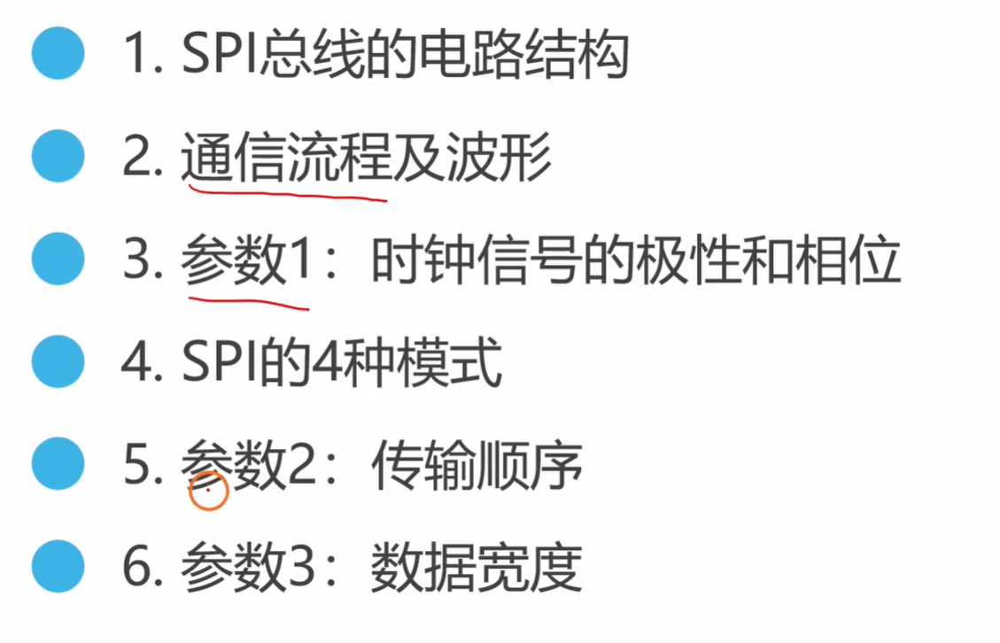

这个视频详细讲解了SPI（Serial Peripheral Interface，串行外设接口）总线的基础知识，内容涵盖了从物理连接到通信协议的各个方面，是嵌入式开发的基础和重点。

**核心知识点：**

1. **SPI总线结构**：

   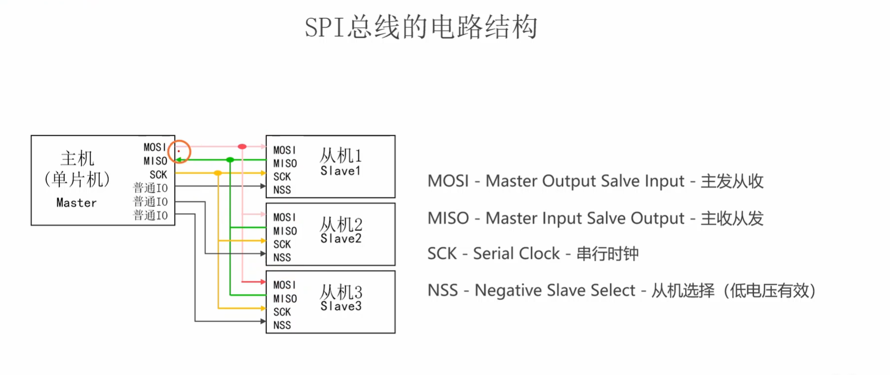

   - SPI是一种**全双工、同步**的通信总线，采用**主从模式**工作。

   - 它使用4根线进行通信：

     - `MOSI` (Master Out Slave In): 主设备输出，从设备输入，用于**主机向从机发送数据**。
     - `MISO` (Master In Slave Out): 主设备输入，从设备输出，用于**从机向主机发送数据**。
     - `SCK` (Serial Clock): 串行时钟，由**主机产生**，同步数据的传输。
     - `NSS` (Negative Slave Select): 从设备选择，**低电平有效**。主机通过拉低某个从机的NSS线来选中它并开始通信。

     注意：主机的MOSI引脚是个输出引脚，从机的MOSI引脚是个输入引脚，所以在实际接线的时候只需要把主机的MOSI和从机的MOSI连接在一起就可以了，这样主机可以向从机发送数据。同理，MISO对于主机是输入引脚，对于从机是输出引脚，故在接线的时候只需要把主机的MISO和所有从机的MISO连接在一起就可以了，这样从机就可以向主机发送数据。

2. **通信流程与时序波形**：

   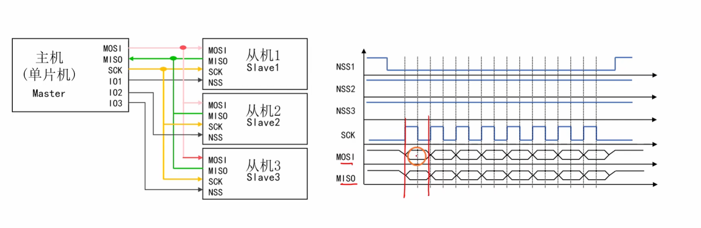

   - 通信由主机发起，首先拉低目标从机的NSS线。
   - 主机通过MOSI线发送数据的同时，通过SCK线产生时钟信号。
   - 从机在SCK时钟的驱动下，通过MISO线向主机发送数据。
   - 数据的发送和接收是**同时进行（即在一个时钟周期内 MOSI 和 MISO 上个对应有一个比特位）**的，视频中形象地比喻为两个设备内部的移位寄存器在进行数据交换。
   - 通信结束后，主机将NSS线拉高，释放从机。

3. **关键通信参数**：

   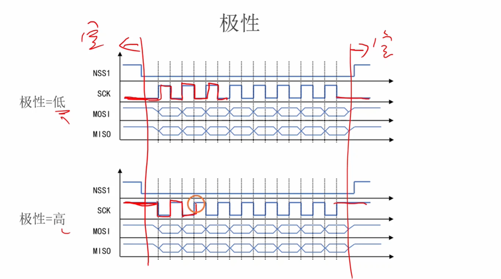

   - **时钟极性 (CPOL)**: 定义了SPI总线在空闲状态下SCK的电平状态。`CPOL=0`（0表示低极性）为空闲时低电平，`CPOL=1`（1表示高极性）为空闲时高电平。（可以看到通信的时候SCK的时钟周期内电压变化刚好是相反的，一个是高低电平，一个是低高电平）

   补充：判断SPI总线是否处于空闲状态，主要看两个关键信号：

   1. **NSS (片选) 信号线**：这是最直接的判断依据。当所有的NSS线都处于**高电平**时，表示没有从设备被选中，此时总线就是空闲的。
   2. **SCK (时钟) 信号线**：在空闲状态下，SCK线会保持在由**CPOL（时钟极性）** 定义的稳定电平（高电平或低电平），不会有时钟信号发出。

   在单片机内部，通常还可以查询SPI外设的**状态寄存器**，找到一个**“忙”标志位 (Busy Flag)**。如果该标志位为0，也表示SPI硬件当前处于空闲状态。

   ---

   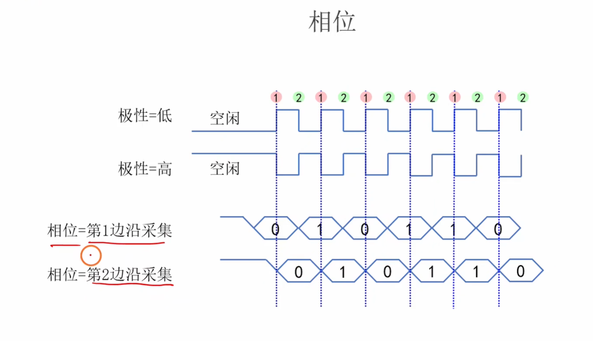

   - **时钟相位 (CPHA)**: 定义了数据采样的时钟边沿。`CPHA=0`表示在第1个时钟边沿采样，`CPHA=1`表示在第2个时钟边沿采样。（极性为低的时候，第1边沿为上升沿，第2边沿为下降沿；极性为高的时候，第1边沿为下降沿，第2边沿为上升沿）

     提问：我还是不太懂，这个采集和数据保持和改变之间的关系，简洁回复下，不要长篇大论？

     好的，我们用一个比喻来彻底弄懂它，保证简洁。

     把通信想象成：

     - **时钟** 是 **“上课铃”**
     - **数据线** 是 **“黑板”**
     - **发送方** 是 **“老师”** (在黑板上写字)
     - **接收方** 是 **“学生”** (抄黑板上的字)

     为了让学生能抄对，必须约定一个规则：**老师写字的时候，学生不能抄；学生抄的时候，老师不能擦写。**

     现在来看两种模式：

     

     **第一边沿采集 (CPHA=0)**

     这个模式的规则是 **“先抄后写”**。

     1. **采集 (学生抄)**: **第一个上课铃响**（第1个边沿），学生立刻把黑板上已有的字抄下来。
     2. **改变 (老师写)**: **下课铃响**（第2个边沿），老师擦掉旧字，写上新字，为下一节课做准备。

     **关系：** 在 **第一个边沿**，数据是**保持不变的**，所以可以**采集**。在**第二个边沿**，数据才开始**改变**。

     

     **第二边沿采集 (CPHA=1)**

     这个模式的规则是 **“先写后抄”**。

     1. **改变 (老师写)**: **第一个上课铃响**（第1个边沿），老师开始在黑板上写字。
     2. **采集 (学生抄)**: **下课铃响**（第2个边沿），老师的字已经写完了，学生在这时把字抄下来。

     **关系：** 在 **第一个边沿**，数据开始**改变**。在 **第二个边沿**，数据已经写完并**保持不变**，所以可以**采集**。

     

     ---

     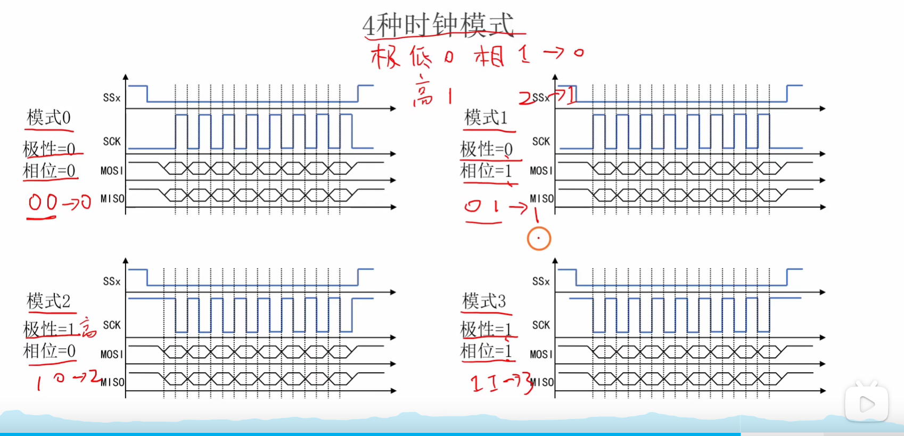

   - **SPI四种模式**: CPOL和CPHA的组合构成了SPI的4种工作模式（模式0、1、2、3），主从设备必须工作在相同的模式下才能正常通信。

     

   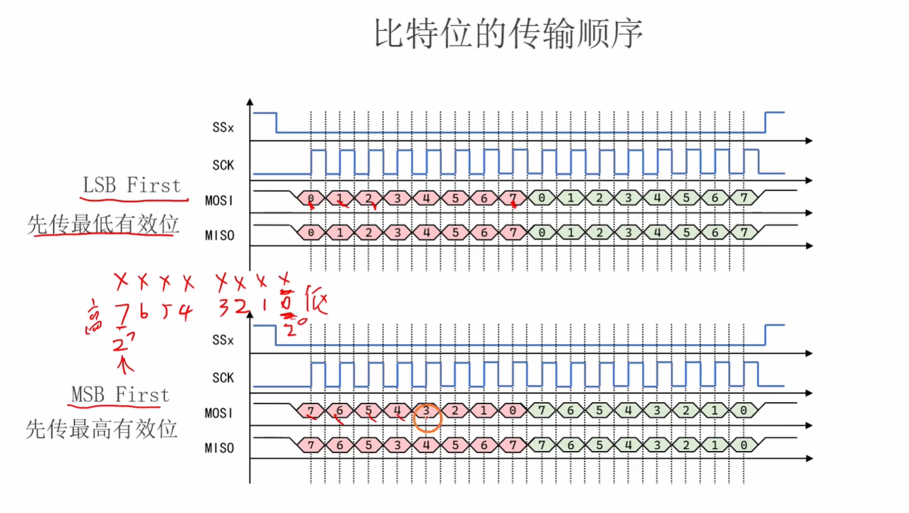

   - **传输顺序 (LSB/MSB First)**: 规定了在一个字节中，是先传输最低位（LSB）还是最高位（MSB）。

   补充：**LSB**：**L**east **S**ignificant **B**it                                                    **MSB**：**M**ost **S**ignificant **B**it

   

   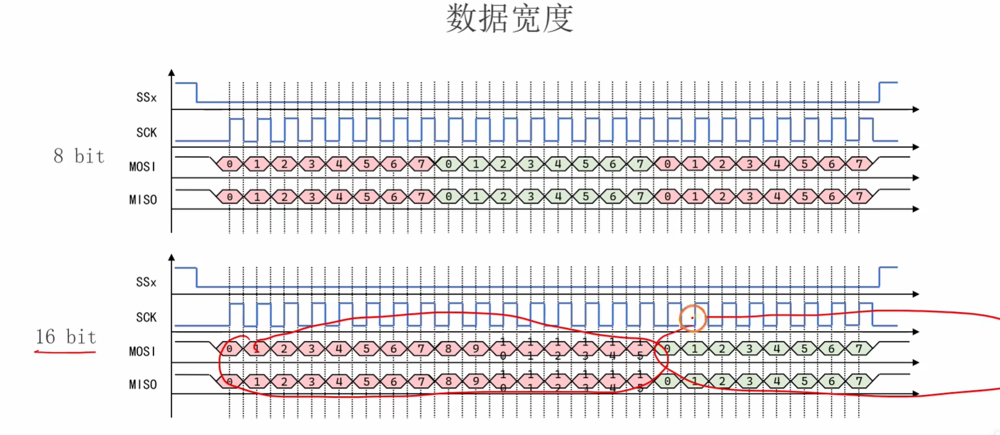

   - **数据宽度**: 定义了每次传输的数据位数，通常是8位或16位。

### 知识扩展与深化

- **SPI与I2C、UART的对比**：
  - **SPI**: 全双工，速度非常快（可达几十MHz），结构简单，没有应答机制，协议灵活但需要更多IO线（至少4根）。
  - **I2C**: 半双工，速度较慢（标准100KHz，快速400KHz），仅需2根线（SDA, SCL），有应答机制，协议相对复杂，支持多主多从。
  - **UART**: 全双工，异步通信（无时钟线），速度范围广，仅需2根线（TX, RX），主要用于点对点通信，协议简单但有额外开销（起始/停止位）。

提问：这里它们三者之间的对比我还是不太清楚，你能够帮我解释下吗，简洁回复下，不要长篇大论？

好的，我们用一个更生活化的比喻来解释这三者，彻底搞懂它们的区别。

想象一下你要和朋友们沟通信息：

**SPI：就像一条“电话专线”**

- **特点**：你和朋友之间拉了**两条电话线**，一条专门给你说，另一条专门给他听。还有一个**指挥员**（时钟线）喊口令“一、二、一、二”，你们俩严格按口令同步说和听。
- **优点**：因为是专线，没有干扰，而且能**同时说和听**（全双工），所以沟通**速度极快**。
- **缺点**：人一多就很麻烦，你每多一个朋友，就要多拉一根**“选人线”**（NSS），非常占地方（IO口多）。
- **总结**：**速度冠军**，适合点对点高速传输大量数据（如读写Flash芯片）。

**I2C：就像一个“对讲机频道”**

- **特点**：所有人都共用**一个对讲机频道**。每次说话前，你都得先喊：“张三张三，我是李四，听到请回答！” 张三听到后会回一句：“收到！” 然后你们才开始对话。
- **优点**：只用**一根线**就能通信（另一根是同步节拍的），非常**省地方**（IO口少），而且所有朋友都能挂在这个频道上。有“收到”这个回复（应答机制），能确保对方听到了。
- **缺点**：因为共用频道，同一时间只能有一个人说话（半双工），而且每次说话前都要先“喊名字”（寻址），所以**速度比较慢**。
- **总结**：**社交达人**，适合连接一大堆设备，进行管理和控制（如读取多个传感器的值）。

**UART：就像“写信交流”**

- **特点**：你和朋友约定好写信的速度（波特率），然后各自有自己的发信箱（TX）和收信箱（RX）。你们不需要指挥员，各写各的，各收各的。
- **优点**：非常简单，只需要**两根线**，就能**同时写信和收信**（全双工）。
- **缺点**：因为没有统一的指挥员（时钟），为了让对方知道信的开始和结束，你得在信的开头画个标记（起始位），结尾也画个标记（停止位），这会**浪费一些纸**（额外开销）。而且你们俩写信的速度必须事先约定好，不然就乱码了。
- **总结**：**简单可靠的点对点通信**，常用于设备之间远距离、稳定的数据传输（如GPS模块、蓝牙模块）。

---

- **NSS引脚的软件与硬件模式**：

  - **硬件NSS**：由SPI外设自动管理。在单主单从模式下，可以配置NSS为硬件模式，SPI启动时自动拉低，停止时自动拉高。
  - **软件NSS**：使用一个普通的GPIO引脚，通过软件编程手动控制其电平。这种方式在**一主多从**的系统中是**必须**的，因为它允许主机灵活地选择与哪个从机通信。

  

- SPI总线上的菊花链（Daisy Chain）连接：

  这是一种特殊的连接方式，用于节省主机的IO口。所有从机的SCK和NSS并联，但数据线是串联的：主机的MOSI连接到第一个从机的MOSI，第一个从机的MISO连接到第二个从机的MOSI，以此类推，最后一个从机的MISO连接回主机的MISO。所有数据像穿糖葫芦一样依次通过所有从机，适用于需要级联控制的场景，如LED点阵屏驱动。

### 面试高频问题与简洁回答

#### **问题1：请简述SPI通信协议的特点及其4条信号线的作用。**

简洁回答：

SPI是一种高速、全双工、同步的串行通信协议。它的主要特点是速度快、协议简单、可以同时收发数据。它通过4条信号线工作：

- **SCK (时钟)**: 由主机产生，用于同步数据传输。
- **MOSI (主出从入)**: 主机通过这条线向从机发送数据。
- **MISO (主入从出)**: 从机通过这条线向主机发送数据。
- **NSS (片选)**: 主机通过拉低这条线来选择与之通信的从机，低电平有效。

------

#### **问题2：什么是SPI的时钟极性(CPOL)和时钟相位(CPHA)？它们组合起来有什么作用？**

**简洁回答：**

- **时钟极性 (CPOL)** 决定了时钟信号(SCK)在总线空闲时的电平状态。CPOL=0是空闲低电平，CPOL=1是空闲高电平。
- **时钟相位 (CPHA)** 决定了数据在哪一个时钟边沿被采样。CPHA=0是在第一个边沿采样，CPHA=1是在第二个边沿采样。

这两个参数的组合构成了SPI的**四种工作模式**。为了保证通信成功，主机和从机的SPI模式配置必须完全一致。

提问0：区分数据 建立时间（准备时间）与 保持时间 与 数据改变时间？

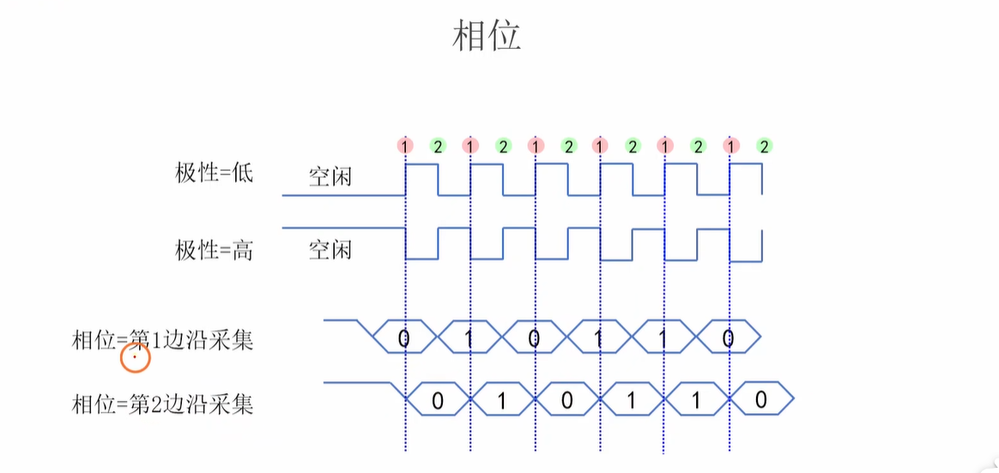

**数据的准备时间 和 采集时间**

- **准备时间 (对应图中的 TSU)**：就是“**建立时间 (Setup Time)**”。看图中 **SCK 的上升沿**（采集点）**之前**的那一小段时间，`MOSI/MISO` 的数据线电平必须**提前准备好并保持稳定**。这就是准备时间。
- **采集时间**：就是 **SCK 上升沿到来的那一瞬间**。在这一刻，接收方会“抓取”数据线上的电平。为了让这次抓取成功，数据线在上升沿**之后**的一小段时间（图中的 **TH**，即“**保持时间 Hold Time**”）内，还必须保持稳定。

**总结一下**：以SCK上升沿为中心，**前面**是**准备时间**，**后面**是**保持时间**，而**采集动作**就发生在**正中间**。

**数据改变时间**，就是发送方可以**安全地改变数据线电平**，为发送下一位做准备的时间。

- 在这张图中，数据的**采集**发生在 **SCK 的上升沿**。
- 为了保证采集成功，数据在上升沿前后（TSU 和 TH 期间）**必须保持稳定**。
- 那么，唯一可以安全改变数据的时间，就是在**采集完成之后**。

看图可知，采集动作在**上升沿**发生，之后时钟会变为**下降沿**。因此，**数据改变时间**就是从 **SCK 下降沿开始，直到下一次采集（下一个上升沿）的准备时间（TSU）之前**的这段时间。

**简单说**：在图中，SCK 下降沿**就是“发令枪”，命令发送方：“好了，上一个数据已经被拿走了，你可以开始准备下一个了！”

提问1：你能够从配置引脚的角度给我详细说明下吗“为了保证通信成功，主机和从机的SPI模式配置必须完全一致”，这也就是说他们的SPI通信相关配置要完全一样吗。简洁回复下，不要长篇大论

好的，我们从引脚配置的角度来精确解释这个问题。

**是的，主机和从机的核心通信协议配置必须完全一样，但这不等于所有参数都一样。**

需要**完全一致**的配置是那些定义**“通信语言规则”**的参数：

1. **SPI 模式 (CPOL 和 CPHA)**:
   - **CPOL (时钟极性)**: 决定了 `SCK` 引脚在不发时钟信号时的**默认电平**是高还是低。
   - **CPHA (时钟相位)**: 决定了数据是在 `SCK` 引脚的**第一个跳变沿**还是**第二个跳变沿**被读取。
   - **不一致的后果**: 如果主机 `CPHA=0`（在第一个边沿采样），而从机 `CPHA=1`（在第二个边沿采样），那么从机就会在错误的时间点去读取 `MOSI` 引脚上的数据，导致读到的数据完全错位。
2. **数据位顺序 (MSB/LSB First)**:
   - 是先发送一个字节的最高位 (MSB) 还是最低位 (LSB)。
   - **不一致的后果**: 如果主机按 `7->6..->0` 的顺序发送 `10000001`，而从机按 `0->1..->7` 的顺序接收，那么从机收到的将是 `10000001` 的反序，数据就错了。

而有些配置是**不需要（或不能）一样**的：

1. **主/从模式 (Master/Slave)**:
   - 这是最根本的区别。主机必须配置为 **Master**，负责产生时钟；从机必须配置为 **Slave**，负责接收时钟。
2. **时钟速度 (Baud Rate)**:
   - **只有主机需要配置**时钟速度。从机不需要配置，它完全根据主机 `SCK` 引脚上的时钟信号来同步收发数据，主机多快，它就多快（只要不超过它自己硬件的上限）。

总结：

你可以把主机和从机想象成两个正在通过硬件电路对话的人。SPI模式（4种，由极性和相位共同决定）、数据位顺序就是他们说的是同一种语言（例如都说中文，都从左往右读）。而主/从模式和语速则是对话的角色（一个人说是另一个人听，说的速度由主导方决定）。语言必须一样，但角色和语速显然是不同的。

提问2：我还有一个问题，就是这里SPI模式不是有4种吗，主机和从机的SPI模式要配置一样吗，主机和从机可以只要SPI模式中的时钟相位配置成为一样就可以吗，时钟极性不一样可以吗，简洁回复下，不要长篇大论？

不行，**时钟极性 (CPOL) 和时钟相位 (CPHA) 必须都完全一样**。只保证其中一个相同是无法正常通信的。

我们还是用“传送带”的比喻来解释：

- **时钟极性 (CPOL)** 决定了传送带在**休息时**是**停在起点（低电平）**还是 **停在终点（高电平）**。
- **时钟相位 (CPHA)** 决定了是在传送带**刚一启动**就拿东西，还是在它**快要停止**时才拿东西。

**如果你只把时钟相位(CPHA)设成一样（比如都设成“刚一启动就拿”），但时钟极性(CPOL)不一样：**

- **主机**的传送带休息时停在**起点 (CPOL=0)**。它认为的“启动”是从起点->终点。
- **从机**的传送带休息时停在**终点 (CPOL=1)**。它认为的“启动”是从终点->起点。

**结果就是：** 主机在传送带从起点走向终点时放下了物品，而从机却在等传送带从终点走向起点时才去拿。双方完全错过了对方的操作时间点，通信必然失败。

**总结：** CPOL 和 CPHA 是一个**整体**，共同定义了一套完整、精确的“时间约定”。两者必须完全一致，主从双方才能在同一个时间点上同步操作，确保数据被正确地发送和接收。

提问3：你能够结合这个图讲刚才的过程给我形象化描述举个例子吗，我还是不太懂，简洁回复下？

好的，我们结合这张图来形象地描述一下。

把图中的**主机**想象成你，**从机**想象成你的朋友，你们要通过图中的4根线传递一串数字 `1011`。

你们的“通信规则”（SPI模式）是：**空闲时时钟线(SCK)为低电平，在时钟的第一个边沿（上升沿）读取数据。**

**开始传递数字 `1` (最高位):**

1. **你 (主机) 的准备**:
   - 你想发送 `1`，于是你把 **`MOSI`** 线变成**高电平**。
   - 同时，你拉低 **`NSS`** 线，大喊一声：“朋友，准备接收！”
2. **传递过程**:
   - 你将 **`SCK`** 线从低电平变为**高电平**（产生一个**上升沿**）。
   - **就在这个瞬间**，你的朋友 (从机) 看到上升沿信号，立刻去看 **`MOSI`** 线，发现是高电平，于是他就记下了数字 `1`。
   - 与此同时，如果你的朋友也想给你传数据，他会把他那边的数据放到 **`MISO`** 线上，你同样在这个上升沿读取。
3. **一个位的结束**:
   - 你将 **`SCK`** 线变回**低电平**。完成了一个时钟周期，成功传递了1位数据。

接下来，你们会重复上面的第2、3步，依次传递剩下的 `0`、`1`、`1`。

传递结束后，你把 **`NSS`** 线拉回高电平，告诉朋友：“这次传递结束了。”

总结：

整过个程就像你一边喊着“一、二、一、二”的口号（SCK），一边在喊“一”的瞬间把写好数字的纸条（MOSI）递给朋友，朋友也严格地只在听到“一”的瞬间看纸条并记录。只要这个节奏和规则（SPI模式）双方都遵守，数据传递就不会出错。

提问4：你能够结合那个图给我描述下“如果你只把时钟相位(CPHA)设成一样（比如都设成“刚一启动就拿”），但时钟极性(CPOL)不一样”这种情况会怎么样吗，，我还是不太懂，最好能够举个列子，简洁回复下，不要长篇大论？

好的，我们结合这张图来形象化描述这个“规则冲突”的例子，保证简洁。

**设定的规则冲突：**

- **一致的规则 (CPHA=0)**：你 (主机) 和朋友 (从机) 都同意，在**时钟的第一个跳变沿**读取数据。

- **冲突的规则 (CPOL不一致)**：

  - **你 (主机, CPOL=0)**：认为时钟线 **SCK** 在休息时应该是**低电平**。所以，你认为的“第一个跳变”是 **上升沿** (从低到高)。

  - **朋友 (从机, CPOL=1)**：认为时钟线 **SCK** 在休息时应该是**高电平**。所以，他认为的“第一个跳变”是 **下降沿** (从高到低)。

    

**现在开始传递数字 `1`，看看会发生什么：**

1. **你的操作 (主机)**：
   - 你把数据 `1` 放在 **MOSI** 线上（变为高电平）。
   - 为了发出“读取”信号，你将 **SCK** 线从**低电平拉到高电平**（你认为的第一个跳变）。你心想：“好了，他现在应该已经读到`1`了。”
2. **朋友的视角 (从机)**：
   - 他看到 **SCK** 线从低变高了。
   - 但他心想：“不对啊，我们约定的‘第一个跳变’是从高到低，现在这个信号不是给我的，我得继续等。”

**灾难性的后果：**

你已经发送了信号，并且可能已经准备改变 **MOSI** 上的数据去发送下一位了。而你的朋友还在傻等一个永远不会按他预期到来的“下降沿”信号。

你们双方在时间上完全错开了，他永远无法在你准备好数据的时候去读取，通信彻底失败。

总结：

就像两个人约好在“开门”时交接物品，但一个人认为的“开门”是往里推，另一个人认为的“开门”是往外拉。结果就是，一个人推开门时，另一个人没反应，等他关上门，另一个人才去拉门，两人完美错过。

提问5：这4种模式下在一个时钟周期内，哪些部分是数据保持时间，哪些是改变数据的时间，你能够给我解释下吗，结合刚刚那个图，简洁回复下，不要长篇大论？

好的，我们用最简洁的方式，结合图中的时钟周期来解释这4种模式。

记住一个核心原则：**为了保证能读到稳定的数据，改变数据和读取数据必须在时钟的不同边沿进行。**

**CPHA = 0 的模式 (模式0 和 模式2)**

这个模式的规则是：**“先采样，后改变”**

- **数据保持时间 (采样)**: 在时钟的**第一个跳变沿**。接收方会在这半个周期读取数据，所以数据线上的电平必须保持稳定。
- **数据改变时间**: 在时钟的**第二个跳变沿**。发送方会在这半个周期改变数据线上的电平，为下一个位的发送做准备。

**举例 (参照您的图 - 模式0):**

- 时钟从低变高（**上升沿**），这是第一个边沿 -> **数据保持** (接收方读取MOSI上的数据)。
- 时钟从高变低（**下降沿**），这是第二个边沿 -> **数据改变** (发送方准备下一位数据)。

**CPHA = 1 的模式 (模式1 和 模式3)**

这个模式的规则是：**“先改变，后采样”**

- **数据改变时间**: 在时钟的**第一个跳变沿**。发送方会在这半个周期把当前位的数据放到数据线上。
- **数据保持时间 (采样)**: 在时钟的**第二个跳变沿**。此时数据已经稳定下来了，接收方在这半个周期进行读取。

**举例 (模式1):**

- 时钟从低变高（**上升沿**），这是第一个边沿 -> **数据改变** (发送方把数据放到MOSI上)。
- 时钟从高变低（**下降沿**），这是第二个边 anedge -> **数据保持** (接收方读取MOSI上的数据)。

提问6：数据保持时间 (采样): 在时钟的第一个跳变沿。接收方会在这半个周期读取数据，所以数据线上的电平必须保持稳定。  这里所说的应该两个高电平之间的低电平时间或者是两个低电平之间的高电平时间吧，就是在一个时钟周期内保持为低电平或者保持为高电平的时间，这段时间就是数据保持时间或者数据改变时间吧，我感觉上升沿和下降沿是一个瞬时时间。简洁回复下，不要长篇大论

您理解得非常对，而且已经抓住了关键点！上升沿和下降沿确实是瞬时的“信号”，而真正做事的时间，就是时钟保持在高电平或低电平的“半个周期”。

我们把这个关系说得更精确一点：

- **上升沿/下降沿** 是 **“发令枪”**。
- **数据保持/改变** 就是 **发令枪响后，在整个高电平或低电平期间（这半个周期）内，数据线必须完成的动作**。

现在我们再看这两种情况：

CPHA = 0 (先采样，后改变)

- **第一个边沿 (发令枪响)**: 命令“读取数据！”
  - **紧接着的半个周期 (例如高电平期间)**: 就是**数据保持时间**。在这段时间里，数据线必须像被“冻结”一样保持不变，确保接收方能稳定地读到正确的值。
- **第二个边沿 (发令枪响)**: 命令“准备下一位！”
  - **紧接着的半个周期 (例如低电平期间)**: 就是**数据改变时间**。在这段时间里，发送方可以随意改变数据线上的电平，把它设置为下一位要发送的值。

CPHA = 1 (先改变，后采样)

- **第一个边沿 (发令枪响)**: 命令“准备数据！”
  - **紧接着的半个周期 (例如高电平期间)**: 就是**数据改变时间**。发送方在这段时间里，把正确的数据电平设置到数据线上。
- **第二个边沿 (发令枪响)**: 命令“读取数据！”
  - **紧接着的半个周期 (例如低电平期间)**: 就是**数据保持时间**。此时数据已经稳定了，接收方在这段时间里把它读取下来。

**总结：** 您的理解是完全正确的。我们说“在某个边沿采样”，实际上是指**以这个边沿为信号，在它触发的、接下来持续的那个电平期间，完成采样这个动作**。

提问7：区分第1边沿与第2边沿。

在一个时钟周期里，时钟信号会完成一个完整的“来回”动作，这个动作中必然包含**两次电平跳变**。

把时钟的**空闲状态**（由CPOL决定）看作**起点**：

1. **第一个边沿**：指时钟从**起点**（空闲电平）出发的**第一次跳变**。
2. **第二个边沿**：指时钟从**半路**返回**起点**（空闲电平）的**第二次跳变**。

**举例说明：**

- **如果时钟空闲是低电平 (CPOL=0)**:

  - **第一个边沿**：就是**上升沿** (从低到高)。
  - **第二个边沿**：就是**下降沿** (从高回到低)。

- **如果时钟空闲是高电平 (CPOL=1)**:

  - **第一个边沿**：就是**下降沿** (从高到低)。
  - **第二个边沿**：就是**上升沿** (从低回到高)。

  

  补充：

  

  在一个时钟周期内部，中间的那个电平跳变就是该时钟周期的第1个边沿，之后的返回起点才是该时钟周期的第2个边沿（注意，不要把这里误认为是之前那个时钟周期的第1个边沿）。

  注意：要清楚地划分，不要模棱两可，时钟周期是离散的，某一个边沿（也是离散的）只属于一个时钟周期，不存在同属于两个时钟周期的某个边沿。

  注意：SCK保持为空闲的时候那个电平（如极性为低时的低电平）是属于第一个时钟周期的前半个周期的，因为最后终点要回到这个低点平。SCK产生的第一个跳变，也即是时钟周期中间的那个跳变就是第一个边沿。

  在图中，从 **上升沿** -> **下降沿**，是**高电平持续时间**。

  从 **下降沿** -> **下一个上升沿**，是**低电平持续时间**。

  这**一高一低**合起来，就是一个完整的时钟周期。

  

---

#### **问题3：SPI和I2C都是常见的串行总线，请比较一下它们的优缺点。**

**简洁回答：**

| 特性         | SPI                                                          | I2C                                                          |
| ------------ | ------------------------------------------------------------ | ------------------------------------------------------------ |
| **优点**     | 速度快（全双工），协议简单，无总线仲裁开销。                 | 连线少（只需2根），支持多主多从，有应答机制保证可靠性。      |
| **缺点**     | 占用IO口多（至少4根），没有应答机制，可靠性依赖软件。        | 速度相对较慢（半双工），协议比SPI复杂，有额外开销。          |
| **适用场景** | 高速数据传输，如Flash存储、ADC/DAC、显示屏驱动等。 | 低速、短距离的外设控制，如传感器、EEPROM、实时时钟等。 |

------

#### **问题4：在一个一主多从的SPI系统中，NSS（片选）信号线应该如何连接和控制？**

简洁回答：

在一个一主多从的系统中，通常使用软件NSS模式。主机的SCK、MOSI、MISO三条线并联到所有从机对应的引脚上，但每个从机的NSS引脚需要独立连接到主机的一个GPIO引脚。通信时，主机通过软件编程，先将目标从机对应的GPIO引脚拉低，选中该从机，然后进行数据传输，传输结束后再将该GPIO引脚拉高，释放从机。

------

#### **问题5：SPI通信中，数据的发送和接收是同时进行的，这在硬件层面是如何实现的？如果我只想发送数据，不关心接收到的数据，应该如何处理？**

简洁回答：

这在硬件上是通过移位寄存器实现的。当主机通过MOSI发送1个bit给从机时，从机也同时通过MISO发送1个bit给主机，本质上是主机和从机内部的两个移位寄存器在时钟驱动下进行了一次数据交换。

如果我只关心发送数据，那么在发送数据的同时，仍然需要执行**空读取**操作来接收从机发来的数据，即使这些数据是无意义的，只是为了完成SPI协议的数据交换过程。这些读取到的无效数据直接丢弃即可。

# 第2遍复习

# 问题1

根据高低极性时钟信号的形状是完全相反的这句话要怎么理解呢

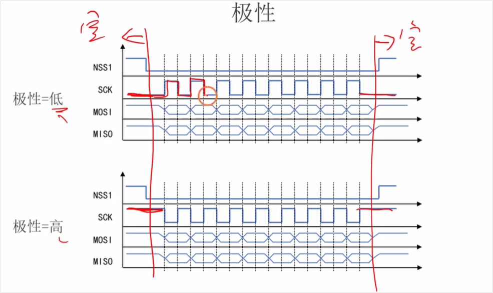

这句话是在描述 SPI 通信协议中**时钟极性（CPOL，Clock Polarity）**的概念。结合你屏幕截图中展示的波形图，可以这样直观地理解“形状完全相反”：

在 SPI 通信中，时钟信号（SCK）在没有数据传输的“空闲状态”下，保持的默认电平高度决定了它的极性。

### 1. 极性 = 低（图上半部分）

- **空闲状态：** 在通信开始前（红色竖线左侧）和结束后（红色竖线右侧），时钟信号线默认停留在**低电平（底部）**。
- **波形形状：** 当开始通信产生时钟脉冲时，信号必须**从低往高跳变**。因此，它的波形看起来像是一座座“凸起”的山峰，平时都在平地上。

### 2. 极性 = 高（图下半部分）

- **空闲状态：** 在通信开始前和结束后，时钟信号线默认悬停在**高电平（顶部）**。
- **波形形状：** 当开始通信时，信号必须**从高往低跳变**。因此，它的波形看起来像是一道道“凹下去”的山谷，平时都在高台上。

### 总结：“完全相反”的含义

如果你将截图中上下两个 SCK 波形对比来看，它们就像是**互为倒影（逻辑取反）**的关系：

- 一个是“平地起高楼”（平时低，脉冲向上）；
- 另一个是“高处挖深坑”（平时高，脉冲向下）。

正因为它们的起始电平（空闲状态）一个是 0、一个是 1，导致它们在打出相同的时钟节拍时，电平上下翻转的轨迹就像照镜子一样，所以说它们在视觉形状上是“完全相反”的。

# 一个注意点：第1边沿采集的时候首次数据变化SCK线为空闲状态

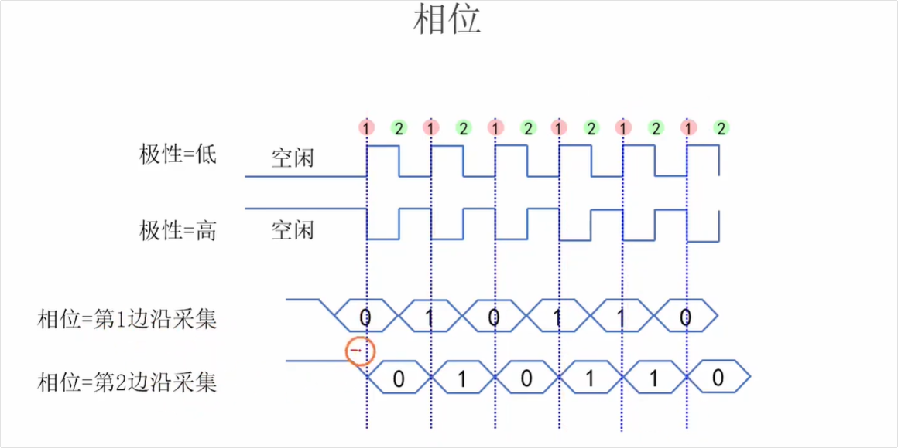

从左边图中可以看到，当是第一边沿采集的时候，刚开始有一段时间数据变化是位于SCK线位空闲的时候的。

你观察得非常敏锐，**完全正确！**

这正是**“第一边沿采集”（通常对应 SPI 相位配置 CPHA=0）**的一个核心特征。

我们可以这样来理解为什么会产生这种现象：

### 为什么数据会在 SCK 空闲时发生变化？

1. **提前准备（数据建立）：** 既然规定了要在**第一个时钟沿**（图中标有红色 `1` 的虚线）进行**“采集”（读取数据）**，那么为了保证在这个瞬间能读到稳定、正确的数据，发送方必须在这个时钟沿到来**之前**，就把数据摆在信号线上。
2. **发生时机：** 这个“之前”，也就是通信刚刚启动、但第一个时钟跳变还没发生的时候。此时 SCK 必然还处于**空闲状态**（不论是高还是低）。
3. **图中表现：** 所以你在“相位=第1边沿采集”的波形最左侧看到，在红线 `1` 到来之前，数据线就从未知状态提前跳变到了 `0`，这就是发送方在空闲期提前把第一个数据位（Bit）发出来了。

### 我们可以对比一下“第二边沿采集”来加深理解：

你看图中最下面那行**“相位=第2边沿采集”**的波形：

- 它的数据是在**第二个时钟沿**（绿色 `2` 的虚线）才被采集读取的。
- 因为不用在第一个沿读取，所以发送方**不需要**在空闲时提前准备数据。
- 相反，它正好利用了**第一个时钟沿**（红色 `1`）来作为触发信号，改变（移出）数据状态。因此你会看到，它的数据变化是精准对齐在红色虚线 `1` 上的。

**总结来说：**

- **第一边沿采集：** 通信一开始，趁着时钟还在空闲，**先出数据**，等第一个边沿来了再读。
- **第二边沿采集：** 等第一个边沿来了**才出数据**，等第二个边沿来了再读。

你直接抓住了读懂 SPI 时序图最关键的细节！

# STM32时钟线的两个名字SCL和SCK区别

在STM32中好像时钟线有两个名字，一个是SCL一个是SCK，这两个有什么区别呢，为什么不统一叫一个名字呢，我不是太理解。

这是一个非常经典的好问题！很多初学者在刚接触单片机时，都会被这些长得差不多的英文缩写弄晕。

简单来说：**SCK 和 SCL 并不是同一个东西的两个名字，而是属于两种完全不同的通信协议。** STM32 芯片内部同时集成了这两种协议的硬件控制器。

以下是它们的核心区别以及为什么不能统一叫一个名字的原因：

### 1. 它们分别是谁？（“爹”不一样）

- **SCK (Serial Clock)**：
  - 它是 **SPI 协议**（串行外设接口）的时钟线。也就是你截图中正在学习的这个协议。
  - SPI 协议最早是由 **摩托罗拉（Motorola）** 公司制定的。
  - 它的“兄弟姐妹”通常叫：MOSI（主出从入）、MISO（主入从出）、SS/CS（片选线）。
- **SCL (Serial Clock Line)**：
  - 它是 **I2C 协议**（内部集成电路）的时钟线。
  - I2C 协议是由 **飞利浦（Philips，现在的 NXP）** 公司发明的。
  - 它的“兄弟姐妹”只有一个，叫：SDA（串行数据线）。

### 2. 为什么不统一名字？（行业标准的限制）

既然都在 STM32 里面，为什么 STM32 的厂家（意法半导体）不把它们统称为 `CLK` 或者 `Clock` 呢？

- **尊重行业共识：** 芯片设计必须符合全球工程师的通用习惯。如果你在 STM32 的引脚图上看到 `SCL`，全世界的硬件工程师都会立刻秒懂：“哦，这个引脚是用来接 I2C 传感器的”；如果看到 `SCK`，大家就知道“这是用来接 SPI 屏幕或 Flash 芯片的”。
- **防呆设计：** 如果强行统一叫 `CLK`，工程师在画电路板连线时，极有可能会把 I2C 的设备错误地连到 SPI 的控制器上。保留原汁原味的名字，相当于给引脚贴了专属标签，大大降低了出错的概率。

### 3. 硬件特性的本质区别

虽然它们的作用都是“打节拍”同步数据，但底层的硬件工作原理也有很大区别：

- **SCK (SPI 的时钟)：** 一般是**推挽输出**。主机非常强势，单方面输出时钟信号，从机只能乖乖听话，不能干涉这条线。速度通常非常快（可以跑到几十 MHz）。
- **SCL (I2C 的时钟)：** 一般是**开漏输出**（必须外接上拉电阻）。它不仅主机能控制，从机在来不及处理数据时，也可以强行把 SCL 拉低，让主机“等一等”（这叫时钟拉伸 Clock Stretching）。速度相对较慢（通常是 100kHz 或 400kHz）。

**总结一下：**

你可以把 STM32 想象成一个大公司，SPI 是公司里的“物流部”，I2C 是公司里的“财务部”。**SCK** 就是物流部的打卡钟，**SCL** 就是财务部的打卡钟。虽然都是钟，但它们管的是两拨完全不同的人，遵守着不同的规章制度，所以牌子必须分开挂！

# UART的时钟线叫什么名字

这是一个非常有意思的“陷阱题”！答案是：**标准的 UART 没有时钟线。**

为什么呢？这要从它的名字说起。

### 1. “异步”通信的本质

UART 的全称是 Universal **Asynchronous** Receiver-Transmitter（通用**异步**收发传输器）。这里的核心词是**“异步” (Asynchronous)**。

- 前面咱们聊的 **SPI 和 I2C 都是“同步”通信**。它们就像是合唱团，必须有一个指挥家（时钟线 SCK/SCL）在前面挥舞着指挥棒“打节拍”，所有人看着这根指挥棒一起张嘴、闭嘴，这样数据才不会乱。
- 而 **UART 是“异步”通信**。它没有指挥家，也没有时钟线。它的通信只需要两根线：
  - **TX (Transmit)**：发送数据线
  - **RX (Receive)**：接收数据线

### 2. 没有时钟线，怎么保证节拍一致？

既然没有指挥家打节拍，接收方怎么知道什么时候该去读取电平呢？

靠的是**“提前对表”（波特率，Baud Rate）**。

在 UART 通信开始之前，通信双方必须先在代码里约定好一个固定的速度。比如大家都设置成 `115200`（每秒传输 115200 个位）。

- 只要双方的手表走得一样准（芯片内部的晶振提供精准的时间），发送方按照这个速度发，接收方也盲着按照这个速度去抓取。
- 为了防止时间久了误差变大，UART 每次最多只发 1 个字节（8位数据），并且要在前面加上“起始位”，后面加上“停止位”，每次发完就重新对齐一次。

------

### 💡 补充一个 STM32 里的“隐藏彩蛋”：USART 的 `CK` 线

你在看 STM32 的手册时，可能会注意到它不叫 UART，而是叫 **USART**。

多出来的这个 **“S”** 代表 **Synchronous（同步）**。

也就是说，STM32 内部的这个外设是一个“完全体”，它**既能**当异步的 UART 用，**也能**当同步的串口用。

如果（我说的是如果）你非要把 STM32 的 USART 配置为**同步模式**，那么它真的会吐出一根时钟线来！在 STM32 的引脚图上，这根同步串口的时钟线通常被命名为：

👉 **`CK`** （直接就是 Clock 的缩写，比如 `USART1_CK`）。

**但在实际的工程开发中：**

大家 99.9% 的情况下都只用它的“异步”模式（也就是当成纯 UART 来用，只接 TX、RX 和 GND），那根叫做 `CK` 的时钟线基本常年处于“吃灰”状态，你完全不需要管它。