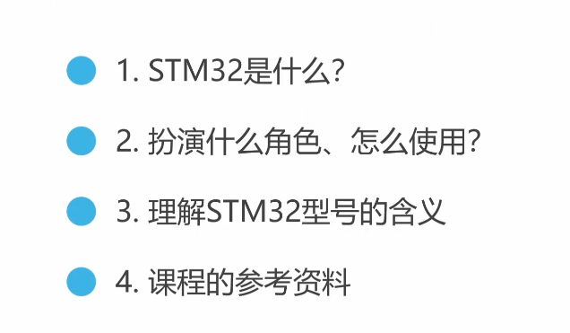
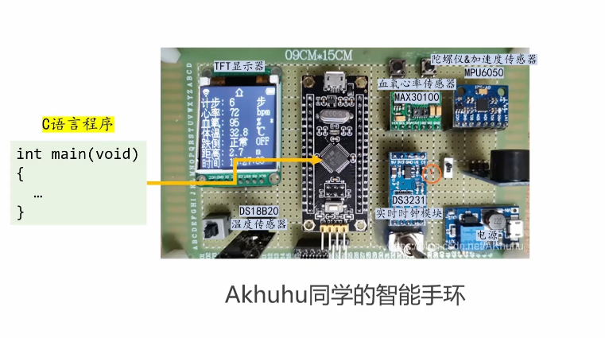
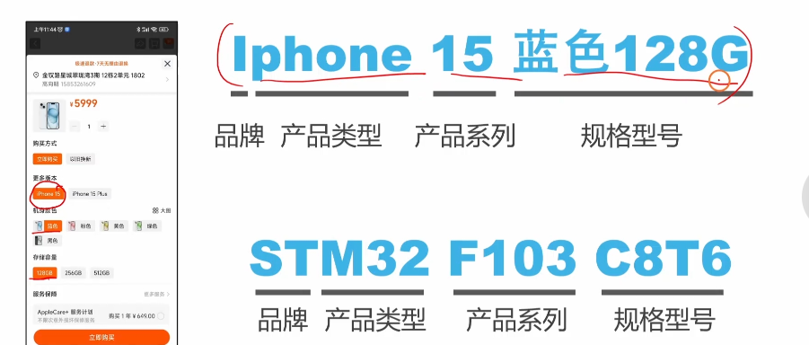
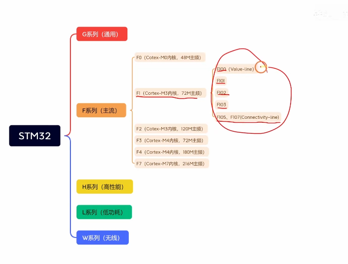
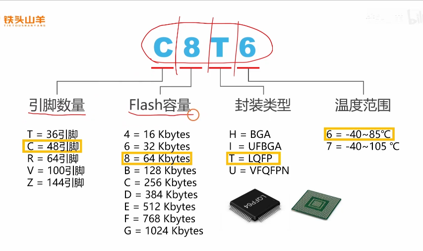
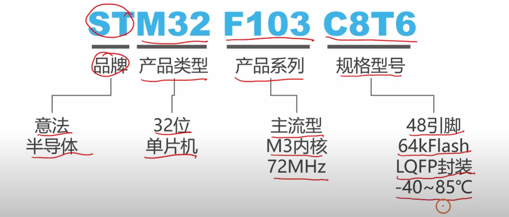
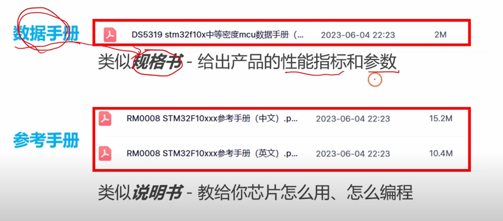

# 1.1 STM32的基本信息

## 第一个问题：STM32是什么？

想象一下你的大脑是如何控制你的身体的。当你想要走路时，大脑会协调你的腿部肌肉；当你感到饿时，大脑会处理来自胃部的信号。STM32就像是电子设备的"大脑"，它是一个微控制器（Microcontroller），专门设计来控制和管理各种电子系统。

STM32是意法半导体（STMicroelectronics 为 公司名字）公司生产的一个微控制器系列。这里的"32"指的是它内部处理器的数据位宽是32位，这意味着它一次可以处理32位的数据，就像一条32车道的高速公路可以同时通过更多车辆一样。相比8位或16位的微控制器，32位处理器具有更强的计算能力和更高的处理效率。

---

补充（视频）：M 表示 Micro Controller（单片机）；STM32 即 由意法半导体公司生产的32位单片机统称。

---

从技术角度来说，STM32内部集成了处理器核心（通常是ARM Cortex-M系列）、存储器（包括程序存储的Flash和数据存储的RAM）、以及各种外设接口（如GPIO、UART、SPI、I2C等）。这种集成设计使得STM32能够在一个小小的芯片中完成复杂的控制任务。

## 第二个问题：扮演什么角色、怎么使用？

STM32在电子系统中扮演着"指挥官"的角色。它就像交响乐团的指挥，协调着系统中的各个组件按照预定的程序工作。

在实际应用中，STM32的使用过程可以分为几个阶段。首先，你需要根据项目需求选择合适的STM32型号，就像选择合适尺寸的工具箱一样。然后，你编写控制程序（通常使用C语言），这个程序定义了STM32应该如何响应不同的输入信号，以及如何控制输出设备。接下来，你使用开发工具将程序烧录到STM32的Flash存储器中。最后，STM32开始执行你的程序，实时监控传感器输入，处理数据，并控制相应的输出设备。

举个具体例子，在智能温控系统中，STM32会读取温度传感器的数据，与设定温度进行比较，然后决定是否开启加热器或冷却风扇。整个过程都是自动进行的，体现了STM32作为"智能控制中心"的作用。

## 第三个问题：理解STM32型号的含义

STM32的型号命名就像汽车的车型编号一样，每个字母和数字都有特定的含义，帮助你了解这款芯片的特性和能力。

让我们以"STM32F103C8T6"这个常见型号为例来解析。开头的"STM32"表明这是意法半导体的32位微控制器系列。紧接着的"F"代表产品线，F系列是STM32的主流通用系列，还有其他系列如L系列（低功耗）、H系列（高性能）等。"103"是子系列号，不同的数字代表不同的性能等级和功能特性。

继续解析，"C"表示引脚数量，在这个命名体系中，C通常对应48个引脚。"8"指示Flash存储器的大小，这里表示64KB的Flash容量（类似于电脑里面硬盘）。"T"表示封装类型，T代表LQFP（低轮廓四方扁平封装）。最后的"6"表示工作温度范围，6通常对应-40°C到+85°C的工业级温度范围。

理解这个命名规则就像掌握了一门"密码语言"，能够帮助你快速判断某个STM32型号是否适合你的项目需求。

## 第四个问题：课程的参考资料

学习STM32需要多种类型的参考资料，就像学习一门外语需要教材、词典、练习册和实践环境一样。

最重要的官方资料包括数据手册（Datasheet）和参考手册（Reference Manual）。数据手册告诉你芯片的基本特性，如电气参数、引脚定义、封装信息等，就像产品的说明书。参考手册则详细描述了内部寄存器、外设功能、编程接口等技术细节，是深入学习的重要依据。

除了官方文档，ST公司还提供了丰富的应用笔记（Application Notes）和例程代码。这些资料就像是经验丰富的工程师分享的实战技巧，能够帮助你理解如何在实际项目中运用STM32的各种功能。

现代的STM32学习还会用到图形化配置工具如STM32CubeMX，以及集成开发环境如STM32CubeIDE。这些工具就像是学习的"脚手架"，降低了入门的技术门槛，让你能够更专注于理解核心概念而不是被复杂的配置细节所困扰。

# 第2遍复习

Cotex-M0、Cotex-M3、Cotex-M4、Cotex-M7 内核这些有什么不同呢，我不是太懂，还有这里内核是指的什么呢，我不是太懂，你能够给我详细解释下吗？

这个问题问得非常核心！刚接触单片机时，看到这些英文加数字的组合确实很容易让人头晕。

为了让你秒懂，我们可以用**“人类的身体”**或者**“汽车的构造”**来打比方。

------

### 1. 到底什么是“内核（Core）”？

你可以把 STM32 芯片想象成一个**“微型机器人”**。

- **内核（Core）：就是机器人的“大脑”。** 它负责思考、进行数学计算、执行你用 C 语言写的那一行行代码逻辑。
- **外设（Peripherals）：就是机器人的“手脚和感官”。** 比如之前视频里提到的定时器、串口、ADC 等，它们负责控制灯亮、测量温度、和外界通信。
- **存储器（Flash/RAM）：就是机器人的“记忆”。** 用来记住你写的程序和临时数据。

**一个有趣的行业内幕：**

生产 STM32 的 ST（意法半导体）公司，其实**并不自己设计大脑**。

设计这个大脑的公司叫 **ARM**。ARM 专门设计各种级别的“大脑图纸”，然后把图纸卖给各大芯片厂商。ST 买来了名为 “Cortex-M” 系列的大脑图纸，然后自己给它加上了“手脚（外设）”和“记忆（存储）”，最终封装成了一颗 STM32 芯片。

------

### 2. Cortex-M0、M3、M4、M7 有什么不同？

既然内核是“大脑”，那么 M0、M3、M4、M7 就是 ARM 公司设计的**智商和计算能力不同级别的大脑**。数字越大，能力越强，当然价格也越贵。

我们可以把它们比作不同学习阶段的学生：

- **Cortex-M0：小学生（入门级、主打省电和便宜）**
  - **特点：** 结构最简单，功耗极低，价格非常便宜。
  - **能力：** 就像刚学会基础加减乘除的小学生。处理简单的逻辑没问题（比如控制个智能开关、小家电），但算复杂的数学题就很吃力。
  - **对应系列：** 截图里的 STM32 F0 系列。
- **Cortex-M3：高中生（主流级、主打性价比）**
  - **特点：** 性能和价格达到了完美的平衡，是目前市场上应用最广泛的内核。
  - **能力：** 逻辑思维很强，能快速处理各种控制任务和稍微复杂的数据。
  - **对应系列：** 截图里的 STM32 F1 系列（也就是你这套教程正在学的 **STM32F103**）。对于初学者来说，这个“大脑”足够你做出各种炫酷的项目（比如讲师提到的平衡小车）了。
- **Cortex-M4：理科大学生（进阶级、主打数学计算）**
  - **特点：** 在 M3 的基础上，**额外增加了一个“高级科学计算器”**（专业术语叫 DSP 和 FPU 浮点运算单元）。
  - **能力：** 极其擅长算数，尤其是带小数点的复杂运算。非常适合用来做无人机飞控（需要算姿态解算）、音频处理或者电机精准控制。
  - **对应系列：** 截图里的 STM32 F3、F4 系列。
- **Cortex-M7：大学老教授（旗舰级、主打极致性能）**
  - **特点：** 架构做了全面大换血（引入了 Cache 缓存和超标量流水线），相当于拥有了“过目不忘”的本领和“一心多用”的能力。
  - **能力：** 运算速度极快，可以处理图形界面显示、复杂的 AI 算法或是高强度的实时数据处理。
  - **对应系列：** 截图里的 STM32 F7 系列。

------

**总结一下：**

你现在正在学的教程（第四版）使用的是 **STM32F103** 芯片，里面装的就是 **Cortex-M3** 这个“高中生大脑”。它完全能胜任你入门阶段的所有学习需求，不用去过分追求 M4 或 M7。

这下弄明白内核和这些代号的区别了吗？如果清楚了，需要我为你总结教程下一集**“04 准备STM32的引脚分布”**，看看这个“大脑”到底长出了哪些“手脚”吗？