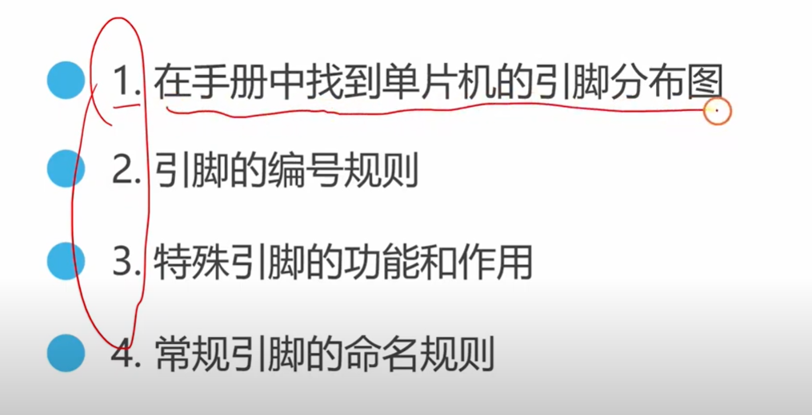
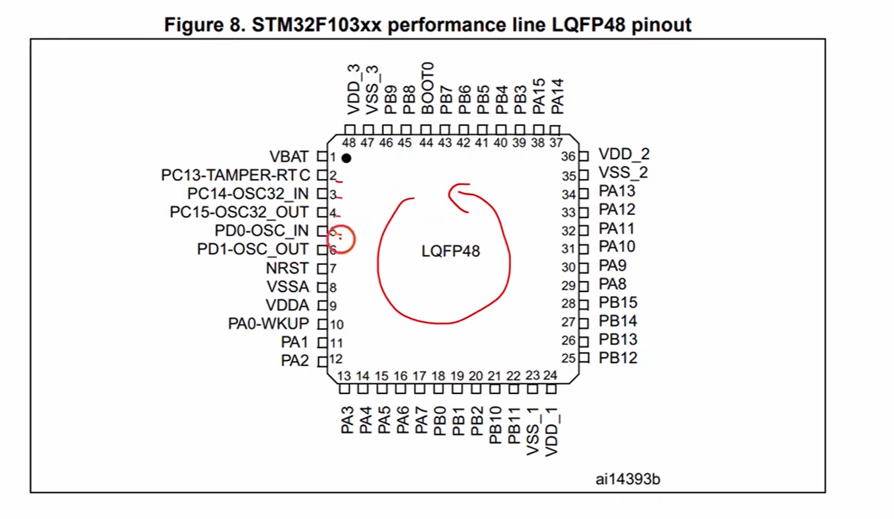
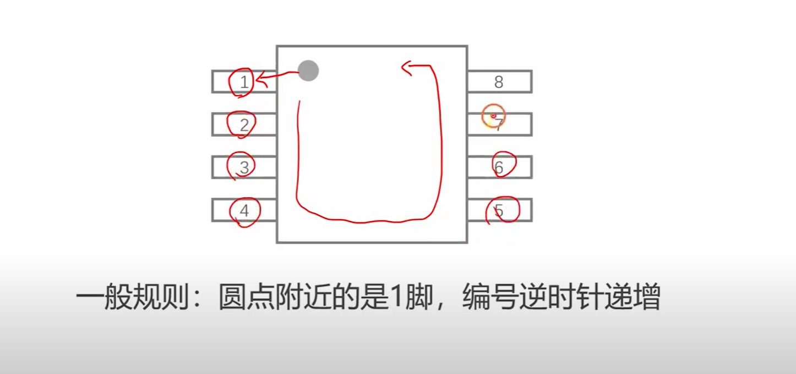
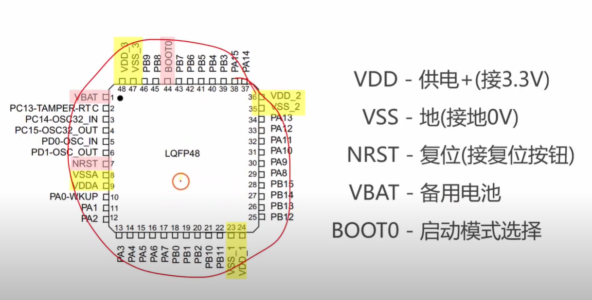
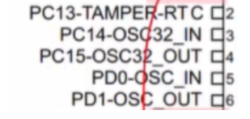
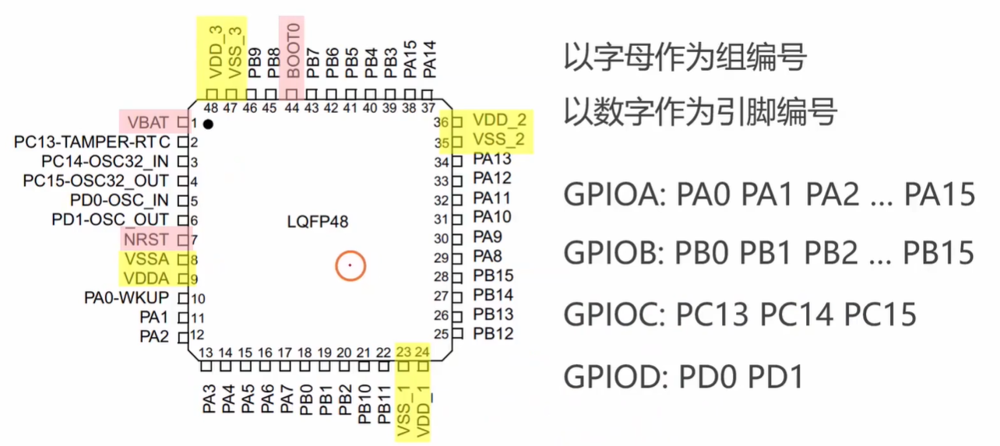
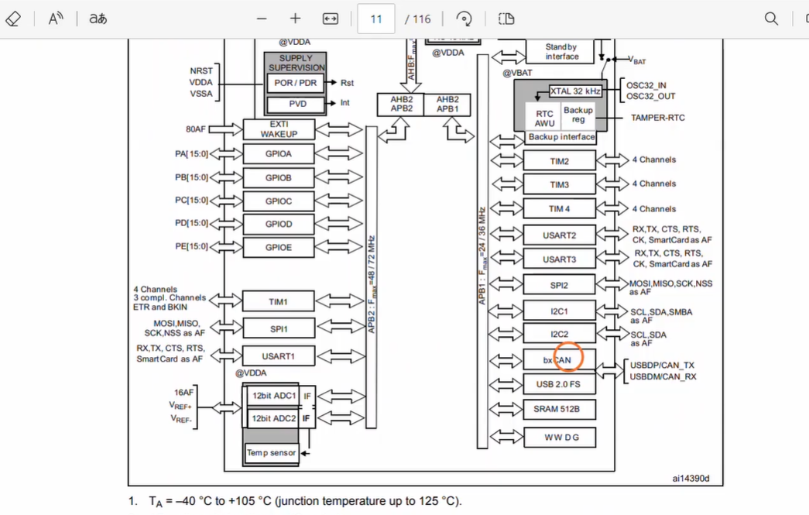

# 1.2 STM32 引脚分布

## 在手册中找到单片机的引脚分布图

## 引脚的编号规则

## 特殊引脚的功能和作用

视频补充：NRST复位引脚直接接了 最小系统板上的复位按钮；VBAT一般也接了备用电池，也不用管。

### gemini

好的，这张图片显示的是一个LQFP48封装的微控制器引脚定义图，并对其中一些重要的引脚名称进行了中文解释。下面我将为你详细解释这些引脚的功能和作用：

**首先，我们来看右侧的引脚解释：**

- **VDD - 供电+(接3.3V)**
  - **功能和作用：** VDD 是电源正极（正电压供电）引脚。它为微控制器内部的数字电路提供工作电压。通常情况下，微控制器的工作电压是3.3V，因此需要连接到3.3V的电源。
  - **重要性：** 缺少VCC（或VDD）供电，微控制器将无法工作。
- **VSS - 地(接地0V)**
  - **功能和作用：** VSS 是电源负极（地线）引脚。它提供电流的返回路径，并作为电路的参考电位（通常为0V）。
  - **重要性：** 必须正确接地，才能确保电路正常工作和稳定。
- **NRST - 复位(接复位按钮)**
  - **功能和作用：** NRST（或RST）是复位引脚。当该引脚接收到一个特定的信号（通常是低电平或复位脉冲）时，它会将微控制器内部的所有寄存器和外设重置到初始状态，程序会从头开始执行。
  - **重要性：** 用于在程序跑飞、死机或需要重新启动时，强制微控制器回到初始状态。常连接到一个复位按钮或复位电路。
- **VBAT - 备用电池**
  - **功能和作用：** VBAT 是备用电池供电引脚。当主电源（VDD）断开时，通过连接备用电池（如纽扣电池）向微控制器内部的一些低功耗外设（如实时时钟RTC、备份寄存器）供电，以保持其数据和时间的连续性。
  - **重要性：** 主要用于保持RTC的时钟和日历数据，以及少量备份SRAM的数据，即使主电源断电也不会丢失。

注意：区分开STM32这块板子和板子上的那一小块芯片，备用电池 和下面 为实时时钟（RTC）提供精确的时钟源低速外部晶振 以及 为微控制器主系统时钟提供时钟源的告诉外部晶振，这3个都是独立于这一小块芯片之外的，故这一小块芯片是需要这些引脚的。 （见下面补充理解1）

- **BOOT0 - 启动模式选择**
  - **功能和作用：** BOOT0 是启动模式选择引脚。微控制器在上电复位后，会根据BOOT0（有时还有BOOT1，但图中只显示BOOT0）引脚的电平状态来决定从哪个存储器区域（如闪存、系统存储器或SRAM）开始执行程序。
  - 重要性：
    - **从主闪存启动（正常工作模式）：** 程序烧录到片内闪存后，设置BOOT0为低电平（或根据芯片手册的具体要求），芯片会从用户程序的起始地址开始执行。
    - **从系统存储器启动（ISP模式）：** 通常用于通过串口（UART）等接口下载程序到芯片，也称为ISP（In-System Programming）模式。
    - **从SRAM启动（调试模式）：** 主要用于调试，程序会加载到SRAM中执行。

**接下来，我们结合左侧的引脚图，来看一下其他引脚的命名约定：**

微控制器引脚通常分为不同的端口组，如PA、PB、PC等，每个端口下的引脚都有一个数字后缀，表示该端口的第几个引脚。例如：

- PAx (如PA0, PA1, PA2, PA3, PA4, PA5, PA6, PA7, PA8, PA9, PA10, PA11, PA12, PA13, PA14, PA15)
  - 表示 Port A 的引脚。这些是通用的GPIO（General Purpose Input/Output）引脚，可以被配置为输入、输出、模拟输入、或作为各种外设（如UART、SPI、I2C、ADC、定时器等）的功能引脚。
- PBx (如PB0, PB1, PB2, PB3, PB4, PB5, PB6, PB7, PB8, PB9, PB10, PB11, PB12, PB13, PB14, PB15)
  - 表示 Port B 的引脚。功能与PA类似，也是GPIO引脚，可以复用为各种外设功能。
- PCx (如PC13, PC14, PC15)
  - 表示 Port C 的引脚。通常PC13、PC14、PC15在许多微控制器中是与低功耗功能或晶振连接相关的特殊引脚。

**图片中具体标注的几个引脚：**

- **PC13-TAMPER-RTC**
  - 这个引脚通常与实时时钟（RTC）功能和篡改检测（Tamper Detection）功能相关联。它可以用于连接一个按键或传感器，用于唤醒RTC，或者检测到非法入侵/篡改时触发一个事件。
- **PC14-OSC32_IN / PC15-OSC32_OUT**
  - 这两个引脚用于连接32.768 kHz的低速外部晶振（LSE）。这个晶振通常为实时时钟（RTC）提供精确的时钟源。
    - PC14-OSC32_IN：连接晶振的输入端。
    - PC15-OSC32_OUT：连接晶振的输出端。
- **PD0-OSC_IN / PD1-OSC_OUT**
  - 这两个引脚通常用于连接高速外部晶振（HSE）。HSE是微控制器主系统时钟的来源，通常频率较高（如8MHz、16MHz等），提供给CPU和主要外设。
    - PD0-OSC_IN：连接晶振的输入端。
    - PD1-OSC_OUT：连接晶振的输出端。
    - **注意：** 尽管在LQFP48封装中，PA0/PA1通常与HSE晶振引脚复用，但图中清晰地标注了PD0/PD1，这可能是特定型号或家族的微控制器有这样的分配。实际使用时需以芯片数据手册为准。
- **NRST (在引脚7)**
  - 前面已解释，是复位引脚。
- **VSSA (在引脚8) / VDDA (在引脚9)**
  - **功能和作用：** VSSA 是模拟地，VDDA 是模拟电源正极。这些引脚专门用于微控制器内部的模拟电路部分，如ADC（模数转换器）和DAC（数模转换器）。
  - **重要性：** 为了提高模拟信号的精度和抗干扰能力，模拟电源和数字电源通常是分开的（尽管最终可能接到相同的电源轨上，但PCB布线时会进行隔离或单独滤波）。建议通过独立的滤波电路接到电源轨。
- **PA0-WKUP (在引脚10)**
  - 这个引脚除了作为通用GPIO（PA0），通常还具有唤醒（WKUP）功能。当微控制器处于低功耗模式时，通过这个引脚上的外部事件（如按键按下）可以唤醒微控制器。

**总结一下：**

这些引脚共同构成了微控制器与外部世界的接口，使其能够接收电源、输入信号、输出信号，并根据预设的程序执行各种任务。理解每个引脚的功能对于正确设计硬件电路、编写固件程序以及调试微控制器系统至关重要。在实际开发中，务必参考微控制器的**官方数据手册（Datasheet）**，因为它会提供最准确、最详细的引脚定义和功能说明。

### claude 1

让我用一个生活化的比喻来帮你深入理解这些引脚，然后我们一步步建立起完整的知识框架。

#### 把STM32想象成一栋智能办公大楼

想象STM32就像一栋现代化的智能办公大楼，而这些引脚就是这栋大楼与外界连接的各种"生命线"和"通信线"。每一根引脚都有特定的用途，就像大楼的不同接口服务于不同的需求。

首先，让我们理解大楼的基础设施需求。任何建筑都需要电力供应和安全系统，STM32也是如此。VDD引脚就像大楼的主电力入口，它接收3.3V的电压，为整个"大楼"内的数字电路提供能量。想象一下如果停电，整栋大楼都会陷入黑暗，这就是为什么VDD如此关键的原因。

与VDD配对的VSS引脚则像是大楼的接地系统，它提供电流的回路，就像水管系统中的回水管道一样。电流从VDD进入，完成工作后必须通过VSS回到电源，形成完整的电路回路。没有良好的接地，就像没有回水管道的水管系统，根本无法正常工作。

#### 安全和应急系统

NRST引脚就像大楼的紧急重启按钮。当大楼内的系统出现故障或需要完全重新启动时，按下这个按钮会让所有系统回到初始状态，重新开始工作。在微控制器的世界里，这意味着所有的寄存器会被清零，程序会从头开始执行，就像电脑重启一样。

VBAT引脚则像是大楼的应急电源系统。当主电力供应中断时，应急电源会接管一些关键系统，比如安全监控和时钟系统。在STM32中，即使主电源断电，连接到VBAT的纽扣电池也能让实时时钟继续运行，保持时间的准确性，就像停电时应急灯依然亮着一样。

#### 启动和运行模式选择

BOOT0引脚就像大楼的启动选择开关，决定大楼在开机时从哪个系统启动。这个概念类似于电脑的启动选项，你可以选择从硬盘启动正常系统，或者从U盘启动进行系统维护。

当BOOT0设置为正常模式时，STM32会从内部Flash存储器启动，执行你烧录进去的程序，这就像从硬盘启动正常的操作系统。当BOOT0设置为特殊模式时，STM32会进入系统存储器模式，允许你通过串口等方式重新烧录程序，这就像进入BIOS设置或从U盘启动的维护模式。

#### 精密的时钟系统

让我们深入理解时钟引脚的重要性。PC14和PC15就像是大楼的精密时钟系统的核心组件。32.768 kHz的晶振就像一个超精确的节拍器，它的频率被特意选择为2的15次方，这样可以通过简单的除法得到1Hz的秒脉冲。想象一下如果一个音乐家没有节拍器，演奏就会乱套，时钟晶振对微控制器的作用也是如此。

PD0和PD1则连接高速晶振，通常是8MHz或16MHz，这就像大楼的主电机系统（区分主电力系统，这里主电机系统提供动力，主电力系统提供电力）。如果说32kHz晶振是精确的手表，那么高速晶振就是强劲的发动机，为CPU和主要外设提供高速的工作节拍。这两种晶振各司其职，低速晶振保证时间精度，高速晶振保证处理速度。

#### 模拟世界的接口

VDDA和VSSA这对引脚代表了微控制器与模拟世界的连接。想象微控制器内部有两个不同的社区，一个是数字社区，处理0和1的信息，另一个是模拟社区，处理连续变化的信号如温度、声音、光线强度等。

数字社区可以容忍一些电源噪声，就像城市居民对噪音有一定的容忍度。但模拟社区非常敏感，就像需要绝对安静环境的录音室。因此，VDDA和VSSA为模拟社区提供了独立的、更加纯净的电源，确保ADC能够精确地测量模拟信号，不受数字电路开关噪声的干扰。

#### GPIO引脚的多功能特性

PA、PB、PC开头的引脚就像大楼中的多功能房间。每个房间在设计时都预留了多种用途的可能性，可以根据需要配置为办公室、会议室、储藏室等不同功能。

以PA0-WKUP为例，这个引脚平时可以作为普通的输入输出口使用，但它还有一个特殊能力就是唤醒功能。想象这个引脚像是大楼的门铃，当大楼处于节能模式时，按下门铃可以唤醒整个系统。这种设计体现了现代微控制器的灵活性和效率。

#### 理解引脚编号的逻辑

引脚的命名遵循清晰的逻辑结构。字母代表端口组，数字代表该组内的具体引脚。这就像城市的地址系统，PA就像A街区，PA0到PA15就像A街区的0号到15号房子。这种编号方式帮助工程师快速定位和管理大量的引脚资源。

每个端口通常包含16个引脚，从0编号到15。这不是随意的设计，而是因为16正好对应计算机中一个字节的高位和低位，便于软件操作和硬件设计。

#### 记忆技巧和深度理解

要长久记住这些概念，我建议你建立一个完整的心理模型。每次看到STM32引脚图时，在脑海中重现这栋智能大楼的画面。电源引脚是生命线，时钟引脚是节拍器，复位引脚是重启按钮，GPIO引脚是多功能房间。

更重要的是理解每个引脚存在的原因。工程师设计这些引脚不是为了增加复杂性，而是为了解决实际问题。VDDA/VSSA的分离是为了信号精度，BOOT0是为了开发和维护的便利，VBAT是为了数据的持久性。

当你在实际项目中使用这些引脚时，这种理解会帮助你做出正确的连接决策。比如，当你需要精确的模拟测量时，你会记得为VDDA提供干净的电源；当你需要低功耗设计时，你会想到PA0的唤醒功能；当你需要调试程序时，你会知道如何正确设置BOOT0。

这种从原理到应用的理解路径，会让你的知识更加牢固和实用。你现在对这个"智能大楼"的结构有清晰的认识了吗？有哪个部分你想要进一步探讨？

## claude 2

目的：进一步理解这些引脚，包括从原英文名和功能的角度。

让我像拆解一个精密手表一样，帮你逐一理解这些特殊引脚的命名逻辑和功能区别。理解这些引脚的关键在于明白STM32内部有两套不同的时钟系统，以及一个安全监控系统。

### 首先理解引脚命名的结构逻辑

每个引脚的完整命名都遵循"基本引脚名-复用功能名"的格式。这就像一个人的姓名和职务的关系，比如"张三-工程师"，张三是这个人的基本身份，工程师是他的职业功能。

PC13的基本身份是Port C的第13号引脚，但它的特殊功能是TAMPER-RTC。PD0的基本身份是Port D的第0号引脚，但它的特殊功能是OSC_IN。理解了这个命名逻辑，我们就能更好地理解每个引脚的双重属性。

### 深度解析PC13-TAMPER-RTC

让我们从PC13开始，它的英文全称是"Port C 13 - Tamper（篡改） Detection and Real-Time Clock"。这个引脚承担着安全监控的重要职责。

想象你家里有一个智能安防系统，当有人试图撬锁或破坏门窗时，系统会立即检测到并记录这个事件。TAMPER功能就是这样一个电子"看门狗"。当有人试图物理入侵设备，比如撬开设备外壳或断开某些连接时，通过PC13连接的传感器可以检测到这种篡改行为。

更有趣的是，这个检测事件会被记录在RTC（Real-Time Clock）系统中，包括确切的时间戳。这就像银行的保险柜不仅能检测到有人试图撬锁，还能精确记录下这件事发生的时间。在一些对安全要求极高的应用中，比如智能电表、安防设备或金融终端，这个功能非常重要。

TAMPER的检测机制通常基于电平变化。你可以在PC13上连接一个开关或传感器，当外壳被打开或某个关键组件被移动时，开关状态改变，触发TAMPER事件。

### 理解32kHz低速晶振系统：PC14和PC15

现在让我们看PC14-OSC32_IN和PC15-OSC32_OUT这对孪生引脚。它们的英文全称是"32kHz Oscillator（振荡器） Input"和"32kHz Oscillator Output"。

想象时钟世界里有两种不同的时钟：一种是精确但缓慢的天文钟，另一种是快速但相对粗糙的工厂钟。32kHz晶振就是那个精确的天文钟，专门负责长期的时间测量。

为什么选择32768Hz这个看似奇怪的频率呢？这背后有深刻的数学原理。32768恰好等于2的15次方，这意味着通过15次二进制除法运算，就能将32768Hz精确地转换为1Hz。对于数字电路来说，这种基于2的幂次的除法运算非常高效且精确。

PC14是输入端（IN），连接晶振的一端，接收晶振产生的振荡信号。PC15是输出端（OUT），连接晶振的另一端，形成完整的振荡回路。这种设计类似于音叉的两个叉臂，需要两端配合才能产生稳定的振动。

这个32kHz晶振系统的最大优势是极低的功耗。即使在系统的其他部分都进入休眠状态时，RTC仍然可以依靠这个低速晶振继续工作，就像怀表在你睡觉时依然在轻柔地滴答作响。

### 解析高速主晶振系统：PD0和PD1

PD0-OSC_IN和PD1-OSC_OUT的英文全称是"High-Speed External Oscillator Input"和"High-Speed External Oscillator Output"。它们构成了STM32的主时钟系统，就像工厂里的主电机。

这里的OSC指的是Oscillator（振荡器），而前面的32表示特定的32kHz振荡器。PD0和PD1处理的通常是8MHz、16MHz或更高频率的晶振，为整个微控制器提供高速的工作节拍。

如果说32kHz晶振像是一个慢慢转动的大钟摆，那么主晶振就像是快速跳动的心脏。CPU的每个指令执行、每个数据传输、每个外设操作，都需要依赖这个高速时钟的节拍。

PD0作为输入端，接收外部晶振的信号，PD1作为输出端，与晶振形成反馈回路。这种配置类似于音响系统中的正反馈，确保振荡能够持续稳定地进行。

### 为什么需要两套独立的时钟系统

你可能会疑惑，为什么需要两套不同的时钟系统呢？这就像问为什么手表需要秒针、分针和时针一样，不同的功能需要不同的精度和速度。

高速晶振负责处理需要快速响应的任务，比如计算、通信、控制等。但高速意味着高功耗，如果让它24小时不停地工作，电池很快就会耗尽。

低速32kHz晶振虽然频率低，但极其省电，可以连续工作数年而几乎不消耗电池电量。它专门负责时间的长期测量，确保即使系统休眠，时间依然准确流逝。

这种设计哲学体现了现代电子设备的核心原则：在保证功能的前提下，尽可能地节约能源。就像人类在日常生活中，我们在需要专注工作时保持高度活跃，在休息时降低新陈代谢一样。

### 引脚分配的工程考量

你可能注意到，低速晶振使用的是PC14和PC15，而高速晶振使用的是PD0和PD1。这种分配不是随意的，而是基于电路板设计和信号完整性的考虑。

不同频率的信号对PCB布线有不同的要求。32kHz的低频信号相对容易处理，对走线长度和阻抗匹配的要求不那么严格。而高频信号需要更加精细的PCB设计，包括最短的走线路径、良好的地平面处理等。

通过将不同频率的晶振分配到不同的引脚组，设计师可以在PCB布局时更好地隔离不同的信号，避免相互干扰。这就像在音乐厅里，低音乐器和高音乐器要分开放置，避免相互影响音质。

### 实际应用中的思考

当你在设计自己的STM32电路时，理解这些引脚的本质会帮助你做出正确的选择。如果你的项目需要精确的时间测量，你会连接32kHz晶振到PC14和PC15。如果你需要高性能的计算能力，你会确保在PD0和PD1上连接合适的高速晶振。

如果你的项目有安全要求，你可能会在PC13上设计一个开关机制，当设备外壳被打开时触发安全警报。这些设计决策都源于对每个引脚功能的深入理解。

现在你能够区分这些引脚了吗？试着在脑海中构建这样一幅图景：STM32内部有一个精密的时钟塔，32kHz晶振是塔顶的长期时钟，高速晶振是塔底的快速节拍器，而TAMPER系统则是守护时钟塔的忠实卫兵。这种形象化的理解会帮助你更好地记忆和应用这些知识。

# 复习第2遍感悟

# 补充理解1（区分芯片 和 电路开发板）

你的理解**非常准确**！你敏锐地抓住了嵌入式硬件学习中一个非常核心的概念：**区分“芯片（IC）”和“电路板（PCB/开发板）”**。

很多初学者在刚接触单片机时，容易把整个开发板（或者最小系统板）当成单片机本身。你能清晰地意识到引脚是用来连接芯片内部世界和板子上的外部电子元器件，说明你的硬件逻辑已经非常清晰了。

为了让你的知识框架更加丰满，我在这里为你补充几个进阶的角度，解释一下**为什么**这些东西要放在芯片外面，以及芯片内部到底有没有替代品：

### 1. 为什么晶振和电池必须在芯片外面？

- **物理工艺的限制：** 芯片（MCU）是一块硅晶圆，里面集成了数百万个微小的晶体管。而你提到的**备用电池**是化学电源，**外部晶振（石英晶体振荡器）**是依靠石英材料发生机械共振来产生频率的物理器件。以目前的半导体制造工艺，很难将化学电池和产生高精度机械共振的石英直接“塞”进小小的硅芯片内部。
- **设计灵活性与成本控制：** 不是所有的产品都需要极其精确的时间，也不是所有产品都需要断电保存数据。如果 ST（意法半导体）强行把昂贵的超高精度晶振和电池封装在芯片里，会大大增加芯片的体积和成本。让它们作为外部元器件，硬件工程师就可以根据项目需求“丰俭由人”——需要高精度就外接好晶振，不需要就可以省下这笔钱和电路板空间。

### 2. 补充：芯片内部其实有“备胎”（内部时钟）

虽然精确的晶振在外面，但为了保证哪怕外部什么都不接，芯片也能勉强工作，STM32 芯片**内部其实自带了时钟源**：

- **HSI（高速内部时钟）：** 芯片内部有一个 RC 振荡器电路可以提供系统主时钟（通常是 8MHz）。
- **LSI（低速内部时钟）：** 芯片内部也有一个低速的 RC 振荡器（通常在 32kHz 左右或 40kHz），可以给独立看门狗或 RTC 提供时钟。

**既然内部有，为什么还要外接呢？**

因为芯片内部的 RC 振荡器**精度较差**，而且很容易受到环境温度变化的影响。如果你要做一个走时准确的电子表，或者需要进行高速、低误码率的串口/CAN通信，内部时钟的误差就会导致系统不稳定或时间变慢/变快。这时候，你就必须通过 **PD0/PD1** 和 **PC14/PC15** 这几个引脚，接上外部高精度的石英晶振（HSE 和 LSE）了。

### 总结你的高光笔记

你那段高亮笔记非常棒，建议保留！它可以提炼为一句话：**引脚是芯片（大脑）感知和利用外部元器件（外设器官，如电池、石英晶振）的桥梁。**

------

你想继续了解在软件写代码（或使用 STM32CubeMX）时，是如何告诉芯片“去使用外部晶振而不是内部时钟”的吗？

# 补充理解2

PC14-OSC32_IN / PC15-OSC32_OUT，PD0-OSC_IN / PD1-OSC_OUT 这些引脚是用来连接低速外部晶振和高速外部晶振的。既然这样的话，那么这个连接的晶振应该是不属于这个芯片的吧，我有点困惑，这个芯片指的就是最小系统板吗，芯片和CPU是什么关系呢，还有板子上的各种外设如GPIO、I2C、定时器、SPI等也是属于这个芯片的吗。左边图片应该是芯片、最小系统板、CPU中的哪个呢。你能够帮我区分一下吗。

你观察得非常仔细！你的困惑非常精准，这绝对是所有单片机初学者在最开始都会遇到的“终极灵魂拷问”。

你对晶振的直觉**完全正确**。为了帮你彻底把这几个概念的“套娃关系”理清楚，我们从小到大、由内而外地来拆解一下。

### 1. 左边图片里画的是什么？

左边图片里标着 `LQFP48` 以及一圈引脚（Pin）的图，代表的是**芯片（Chip）**。

它描绘的就是那个四四方方的黑色小方块，以及从方块边缘伸出来的 48 根金属针脚。

------

### 2. 核心概念大解密（“套娃”关系）

我们可以用**“一个人在一个办公室里工作”**来打比方：

#### 🧅 第一层（最核心）：CPU（内核）

- **它是什么：** 视频上一集提到的 Cortex-M3 内核。
- **它的角色：** 它是**“大脑”**。它只会做两件事：做数学计算，以及执行你写的 C 语言逻辑（比如判断 `if-else`）。它本身是个瞎子也是个聋子，无法直接控制外面的灯或读取外面的电压。

#### 🧅 第二层：外设（Peripherals）

- **它是什么：** 你提到的 **GPIO、I2C、定时器、SPI 等，它们全部都属于芯片内部！** 它们和 CPU 一起被刻在了同一块硅片上。
- **它的角色：** 它们是 CPU 的**“手脚和感官”**。
  - **GPIO** 像手，可以伸到芯片外面去通电点亮一盏灯。
  - **I2C/SPI** 像嘴巴和耳朵，负责用特定的规则和外面的屏幕、传感器交流。
  - **定时器** 像芯片内部的闹钟。

#### 🧅 第三层（整体）：芯片（Chip / MCU）

- **它是什么：** **芯片 = CPU（大脑） + 各种外设（手脚） + 存储器（记忆力 Flash/RAM）。**
- **它的角色：** 它们被一齐打包、密封在了一个黑色的树脂外壳里，伸出 48 根引脚与外界沟通。这就是**“一个完整的人”**（也就是你在图片里看到的那个图）。

#### 🧅 第四层（外部）：晶振（Crystal Oscillator）与引脚

- **晶振在哪里：** **你说得非常对，这个晶振不属于这个芯片内部！** 它是一个完全独立、长得像个小铁壳的电子元件。
- **为什么要连引脚：** 芯片（人）工作需要统一的节拍（心跳）。虽然芯片内部自带了一个粗糙的“心脏”，但为了精确计时，我们要在芯片**外面**放一个高精度的外部晶振（机械表），然后通过 `PC14/15` 或 `PD0/1` 这些专门的引脚，把精准的“滴答”节拍信号传进芯片内部，给 CPU 和外设听。

#### 🧅 第五层（最外层）：最小系统板（Minimum System Board）

- **它是什么：** 这是一块绿色的**印刷电路板（PCB）**。

- **它的角色：** 它是**“一间能让人活下去的办公室”**。如果你只拿一个黑方块芯片，它是没法工作的。你必须把它焊在一块电路板上，并且在这块板子上给它配齐**四大件**：

  1. **芯片本人**（主角）

  2. **供电电路**（给人提供一日三餐）

  3. **复位按键**（人死机了用来抢救的电击器）

  4. **外部晶振**（就是你刚才问的那个插在芯片外面的“机械表”）

     这块集齐了让芯片刚好能跑起来的基础元器件的绿色板子，就叫最小系统板。

------

### 总结一下你的问题：

1. **晶振属于芯片吗？** 不属于，晶振在芯片外部，通过引脚和芯片连接。
2. **各种外设（GPIO/SPI等）属于芯片吗？** 属于，它们和 CPU 一起封装在黑方块芯片内部。
3. **芯片和最小系统板是一回事吗？** 不是。芯片是最小系统板上的一个核心元件（黑方块）；最小系统板是承载芯片、晶振、电源等元件的绿色大板子。

希望这个比喻能帮你打通任督二脉！弄清楚芯片内部有什么、外部有什么，对你以后写代码非常重要。关于这张引脚图，你是否想了解为什么有些引脚（比如 `PA0-WKUP`）名字后面还带着字母，它们有什么特殊含义吗？

# 补充理解3

CPU与内核是什么关系，还有芯片与最小系统板等价吗，给我详细解释下，最好能够举个例子来让我彻底弄明白。

这两个问题可以说是每一个跨入硬件大门的初学者都会有的“灵魂拷问”！把这两个关系理顺了，你大脑里的硬件知识大厦就算是打好地基了。

我们用通俗易懂的生活例子，把这两个概念彻底拆解开：

### 1. CPU 与 内核（Core）是什么关系？

在单片机（比如 STM32）的世界里，**你可以直接把它们当成一回事**。

- **官方定义：** * **CPU（中央处理器）：** 是一套执行计算机指令的逻辑运算大系统。

  - **内核（Core）：** 是 CPU 最核心的运算执行单元。

- **通俗比喻（人类大脑）：**

  想象你（STM32单片机）是一个正在做数学卷子的学生。

  **CPU** 是你的整个“大脑”，而**内核（Core）** 就是大脑里专门负责集中注意力、进行逻辑思考和算数的那个“大脑皮层思考区”。

- **为什么经常混用？**

  在普通的 STM32 单片机里，通常只有一个“思考区”，所以说“Cortex-M3 内核”和“这块芯片的 CPU”指代的是同一个东西。

  *(注意：在你的电脑或手机里，一块 CPU 芯片里面可能塞了 8 个甚至 16 个内核，但在初学单片机时，一芯配一核是标配，所以可以直接画等号。)*

------

### 2. 芯片（Chip）与最小系统板等价吗？

**绝对不等价！它们是“包含与被包含”的关系，或者说是“主角与舞台”的关系。**

我们可以用**“汽车与发动机”**来打个完美的比方：

#### 🚗 芯片（Chip）：就像一台纯粹的“发动机”

我们在上一条回复中提到的那个黑色四方块，四周伸出 48 根引脚的元件，这就是芯片（比如 STM32F103C8T6）。

- 它是整个系统的灵魂，包含了 CPU（内核）、存储器和各种外设。
- **致命弱点：** 你如果只去华强北花十几块钱买这一颗孤零零的芯片放在桌子上，**它是完全没法工作的！** 就像你单独把一台 V8 发动机扔在地上，不给它油、不给它点火，它就是个铁疙瘩。

#### 🏎️ 最小系统板：就像一台能勉强开动的“骷髅车架”

为了让这颗“芯片发动机”能够转起来，我们需要把它焊在一块绿色的电路板（PCB）上，并且给它配齐最基础的**“四大续命法宝”**。这块集齐了最低限度生存装备的板子，就叫**最小系统板**。

一块合格的最小系统板，上面必须长着这些东西：

1. **主角（芯片）：** 发动机本人。
2. **供电电路（输血）：** 芯片非常娇贵，只能吃稳稳的 3.3V 直流电。最小系统板上会把 USB 传过来的 5V 电源，稳压成 3.3V 喂给芯片。这就是发动机的“油管”。
3. **晶振电路（心跳）：** 就是你之前问到的 PC14/15 连着的那个外部晶振。它给芯片提供精准的节拍，这就是发动机的“点火器”。
4. **复位电路（重生）：** 一个复位按钮和几个电阻电容。当程序跑飞死机了，按一下，芯片强行清醒重新开始。这就是发动机的“重启钥匙”。

------

### 总结归纳

- **内核 (Core) = CPU：** 负责思考和下达指令的大脑。
- **芯片 (Chip)：** 大脑 + 记忆 + 手脚的集合体，被封装在一个黑壳子里。
- **最小系统板：** 芯片 + 维持芯片活着的基础外围电路（电源、晶振、复位）。

刚才你截图里看到的是视频的第 4 集《准备 STM32 的引脚分布》，图中展示的就是**芯片（Chip）**的 48 根引脚定义。

需要我结合你截图里的画面，帮你讲解一下像 `PA0-WKUP` 这种特殊引脚的具体作用吗？

# 内核与ALU的关系

这里内核是不是就可以等价为CPU内部的ALU呢感觉？

这个直觉非常敏锐！你已经思考到了非常底层的硬件结构了。不过，**内核（Core）和 ALU（算术逻辑单元）并不能直接划等号。**

准确地说：**ALU 只是内核（CPU）里面的一个“核心干活部门”。** 它们是包含与被包含的关系：**内核 > ALU**。

为了让你更直观地理解，我们可以把**内核（Core）想象成一位“厨房里的主厨”**：

### 1. ALU（算术逻辑单元）：主厨的“手和菜刀”

- **它是什么：** ALU (Arithmetic Logic Unit) 是专门用来做数学计算（加减乘除）和逻辑运算（与、或、非）的电路。
- **它的角色：** 它就像主厨拿刀的手，只负责纯粹的“苦力干活”。如果你给它两个数字 1 和 2，并下达“加法”指令，它就会吐出 3。但是，**ALU 本身是个瞎子，它不知道自己为什么要算，也不知道下一步该算什么。**

### 2. 控制单元（CU）：主厨的“眼睛和大脑”

- **它是什么：** 控制单元 (Control Unit) 负责从存储器（Flash）里抓取你写的 C 语言代码，进行“解码翻译”，然后向 ALU 下达具体的指令。
- **它的角色：** 当你写了一句 `a = b + c` 时，控制单元会先“看”到这行指令，然后给 ALU 发信号：“嘿！准备做加法！”，同时把 `b` 和 `c` 的值递给 ALU。

### 3. 寄存器组（Registers）：主厨手边的“小案板”

- **它是什么：** 内核里速度最快的临时存储空间。
- **它的角色：** 去仓库（内存 RAM）拿食材太慢了。主厨（内核）会把马上要切的葱姜蒜（即将参与运算的数据）先放在手边的小案板（寄存器）上，ALU 算完的结果也会先暂存在这里。

------

### 总结一下：

**内核 (Core) = ALU (算数逻辑单元) + CU (控制单元) + 寄存器组 (Registers) + 内部总线。**

所以，拿视频里的 **Cortex-M3 内核** 来说，它不仅包含了一个强大的 ALU（能算加减乘除），还包含了一套非常聪明的控制逻辑（能高效翻译指令），以及专门用来管理突发事件的“神经中枢”（叫作 NVIC，嵌套向量中断控制器）。

这就是为什么我们说内核是完整的“大脑”，而 ALU 只是大脑里专门负责“心算”的那个脑区。

现在芯片内部的层级关系你已经完全通透了！需要我结合你截图里的画面，帮你讲解一下视频这节课重点讲的 **GPIO 引脚分布（比如 `PA0-WKUP` 这种带特殊后缀的引脚）** 吗？

# 对芯片包含外设的区分

这里芯片包含了各种外设，这里的外设具体有哪些呢，应该在最小系统板上有些外设应该不属于芯片吧。给我举个例子来让我彻底弄明白。

你的思路太清晰了！你已经触碰到了硬件开发中一个非常核心的专业词汇分界线：**“片内外设”**（芯片内部）与**“片外器件/外设”**（芯片外部的板子上）。

你说得完全正确，**最小系统板上的很多实体零件，都不属于芯片内部的外设**。

为了让你彻底弄明白，我们把单片机想象成一个**“不出门的超级宅男黑客（芯片）”**，他住在一个**“小开间（最小系统板）”**里。

------

### 一、 芯片内部的“外设”（片内外设）

这些东西和 CPU（内核）一起被封印在那个黑色的树脂壳子里。它们是 CPU 天生自带的**“器官和天赋技能”**。

在 STM32 芯片内部，具体有这些典型的外设：

1. **GPIO（通用输入输出端口）：** 相当于宅男的**“机械手”**。通过编程，这只手可以往外通电（输出高电平，通常是 3.3V），也可以感知外面有没有电传进来（输入读取）。
2. **定时器（Timer）：** 相当于宅男大脑里植入的**“精准秒表”**。CPU 算数太快容易忘却时间，定时器可以帮 CPU 精确计时（比如精确等待 1 秒钟）。
3. **USART/I2C/SPI（通信接口）：** 相当于宅男的**“翻译机/对讲机”**。CPU 只懂 0 和 1，如果要和外界复杂的屏幕、传感器交流，这些外设会自动把数据打包成标准的信号发出去。
4. **ADC（模数转换器）：** 相当于宅男自带的**“电压表”**。它可以测量外面传进来的电压到底是 1.5V 还是 2.2V。

------

### 二、 最小系统板上的“外设”（片外器件/外部设备）

这些是实实在在的、独立的**物理元器件**。它们被焊在绿色的电路板上，通过**引脚（也就是你截图里那些 PA0、PB1）\**和芯片连接。它们是宅男房间里可以通过机械手去操控的\**“家具和家电”**。

在最小系统板（或者扩展板）上，通常有这些外部设备：

1. **LED 灯：** 一个真实的发光二极管。**（不属于芯片）**
2. **按键（Button）：** 一个真实的、按下会导通的机械微动开关。**（不属于芯片）**
3. **OLED 屏幕：** 一块用来显示画面的物理小屏幕。**（不属于芯片）**
4. **蜂鸣器、各种传感器（比如温度计、陀螺仪）：** 都是独立的外部零件。**（不属于芯片）**

------

### 💡 举个终极例子：点亮一个按键控制的 LED 灯

为了完成“按一下按键，灯就亮”这个动作，内部外设和外部设备是这样打配合的（请想象引脚就是宅男房间的窗户）：

1. **外部设备（按键）：** 你用真实的手指，按下了最小系统板上的物理**按键**。
2. **内部外设（GPIO 输入）：** 芯片内部编号为 `PA0` 的 **GPIO（机械手）**，一直摸着窗户（引脚）。它感觉到了外面按键导通传进来的电流。
3. **内核（CPU 大脑）：** `PA0` 赶紧给 CPU 打报告：“老大，外面来电了！”。CPU 一想：“我写的 C 语言代码里说过，遇到这种情况要去开灯。”
4. **内部外设（GPIO 输出）：** CPU 立刻向编号为 `PC13` 的另一个 **GPIO（另一只机械手）** 下达死命令：“给我往窗户外面推 3.3V 的电压！”
5. **外部设备（LED 灯）：** 最小系统板上的物理 **LED 灯** 接收到了从 `PC13` 引脚传出来的 3.3V 电压，“唰”地一下发出了真实的亮光。

### 总结

- **芯片包含的（内部外设）：** 都是看不见摸不着的**数字逻辑电路模块**（比如 GPIO控制器、定时器、ADC）。
- **板子上包含的（外部设备）：** 都是肉眼可见的、能发光、能发声、能按动的**物理电子元件**（比如 LED、屏幕、按键）。

**引脚（Pin），就是连接芯片内部虚拟逻辑和板子上物理实体的唯一“桥梁”。** 你截图里正在看的这节课“引脚分布”，其实讲的就是：**芯片内部的这些器官（GPIO、I2C），分别对应连到了哪一根桥梁（PA0~PA15等）上**。

这样解释，芯片内部外设和板子上外部零件的区别，是不是就彻底清晰了？

# 黑框框 与 结构框图 与 最小系统板之间关系（重点）

这个问题问得太有水平了！如果你能把这三者的关系在大脑里连上线，你对硬件的理解就彻底“破圈”了。

简单来说，它们三者的关系是：**设计图纸 ➡️ 物理大厦 ➡️ 大厦所在的地基环境**。

我们用“建房子”的思路来把这三个概念彻底串起来：

### 1. 左边的“结构框图”：芯片内部的“X光透视图”或“户型图”

你现在视频截图中看到的这张图（出自数据手册），画的其实是那个“黑框框”**最最最内部的微观世界**。

- **它是什么：** 如果你把那个黑框框敲碎，拿显微镜放大几万倍，看到的那片极其微小的硅片（晶圆），它的电路布局就是按这张图来的。
- **图里都有啥：**
  - 图中间偏上那个标着 `ARM Cortex-M3` 的方块，就是我们之前聊过的**CPU内核（大脑）**。
  - 图两边那些标着 `GPIOA`、`USART1`、`TIM1`、`ADC` 的方块，就是被集成在硅片上的**内部外设（自带器官）**。
  - 中间那些带箭头的粗线（AHB、APB），叫作**总线（Bus）**，其实就是芯片内部的“高速公路”，负责把大脑和各种器官连接起来传输数据。

### 2. 那个“黑框框”：封装好的“独立大厦”（物理芯片）

- **它是什么：** 厂家把上面那张“结构框图”里所有的复杂电路，全部蚀刻在一块指甲盖大小的硅片上，然后为了保护它，用黑色的树脂把它死死地封起来，这就是你看到的“黑框框”。
- **它和框图的关系：** 结构框图就是“黑框框”的内在灵魂。你在黑框框外面啥也看不见，只能靠看这张图，才知道它肚子里到底装了多少宝贝。

### 3. 最小系统板：承载大厦的“带配套设施的地基”

- **它是什么：** 黑框框（大厦）虽然内部装修极其豪华（有框图里的那么多功能），但它自己是没法发电的。必须把它焊在一块绿色的电路板上，给它接上电源（供电）、接上外部晶振（给内部电路提供心脏跳动的节拍）、接上复位按键，它才能真正“活”过来。
- **整体关系：** 最小系统板不仅让“黑框框”能活下去，还把黑框框微小的针脚引出来，方便你用杜邦线去连接外部真实的 LED 灯或电机。

------

### 💡 终极打通：这三者是如何连通的？（请注意看图的边缘）

你可以仔细看一眼视频左边那张框图的最左侧边缘。

你是不是看到 `GPIOA` 旁边伸出了一条线，写着 **`PA[15:0]`**？`GPIOB` 旁边写着 **`PB[15:0]`**？

这其实就是打通这三者关系的**“唯一桥梁”**：

1. **在结构框图里：** 这些箭头表示内部逻辑电路的输入/输出信号。
2. **在黑框框实体上：** 这个虚无的“信号箭头”，在物理上就变成了黑框框边缘真实伸出来的**一根根金属引脚（Pins）**！`PA[15:0]` 就对应着真实的 PA0 到 PA15 这 16 根金属针脚。
3. **在最小系统板上：** 这 16 根金属针脚被焊锡固定在绿色的板子上，并且通过板子上的铜线，连接到了板子边缘那一排排黑色的插座（排针）上。

**总结一句话画面感：**

你看着这张**结构框图**，写下了一行代码。这行代码在**最小系统板**提供的电源和晶振驱动下，被送进了**黑框框**内部的 `ARM` 大脑里；大脑顺着框图里的“内部高速公路”把指令传给了 `GPIOA` 这个外设模块；`GPIOA` 模块随即产生了一个真实的电压，顺着框图最左侧的那个箭头，传到了黑框框外面的金属引脚上，最终点亮了你插在最小系统板上的 LED 灯！

现在，这三者的宏观与微观的关系，你是不是能在脑海里形成一部 3D 动画了？

# 最小系统板的作用（主要是用来进行供电）

最小系统板不仅让“黑框框”能活下去，还把黑框框微小的针脚引出来，方便你用杜邦线去连接外部真实的 LED 灯或电机。这个应该就是最小系统板的作用吧，主要是用来进行供电的。

你说对了一大半！“供电”和“把微小引脚引出来方便接线”确实是最小系统板非常核心的功能。

但如果说它**“主要是用来进行供电的”**，那就稍微有点把它的功劳说小了哦。

你可以把最小系统板理解为芯片的**“重症监护室（ICU）生命维持系统”**。要把那个傲娇的“黑框框”（芯片）伺候到能正常运行一行最简单的代码，光给它“喂饭”（供电）是不够的。

硬件工程师常说，一个单片机能跑起来，板子上必须得有**“四大生存要素”**。最小系统板的真正作用，就是一次性把这四样东西给你凑齐：

- **1. 供电电路（管饭）：** 也就是你提到的。芯片非常娇贵，直接插电脑的 5V 会烧毁，最小系统板负责把它稳压成芯片爱吃的 3.3V 纯净直流电。
- **2. 晶振电路（给心跳）：** 这是最容易被忽略的！就像你截图里视频用人体做比喻一样，芯片的大脑（CPU）虽然聪明，但它自己没有时间观念，必须靠板子上的那个小小的金属晶振，不断给它提供“滴答、滴答”的精准**时钟节拍（心跳）**，CPU 才能踩着这个节拍一步步执行代码。
- **3. 复位电路（急救按键）：** 芯片在刚上电时，或者跑代码不小心死机时，需要一个“一键清醒”的机制。板子上那个小小的复位按钮及配套电路，就是用来随时重启它的大脑的。
- **4. 接口引出（接手臂）：** 就是你说的，把密密麻麻、肉眼快看不清的微小针脚，转换成标准尺寸的黑色排针，方便你插杜邦线，真正去跟外界打交道。

**总结一下：**

最小系统板不是单纯的“供电电池盒”，而是**“电源 + 心跳起搏器 + 重启开关 + 扩展接口”**的完美结合体。少了前三样中的任何一个，“黑框框”都会变成一块毫无反应的死石头。

------

我看你目前正在看的这集视频是关于 **[GPIO4种输出模式](https://www.youtube.com/watch?v=cgJOryXULBE&list=PLen6JNT7Cx3BaIbxkUfWayXsMlbU3Yisj&index=5&pp=iAQB)**。既然现在“黑框框”已经靠着最小系统板活下来了，它的引脚也准备好了，**需要我帮你总结一下这集视频里，单片机是怎么通过这 4 种不同的“输出姿势”去控制外部的 LED 灯的吗？**
