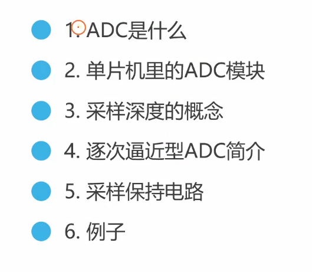
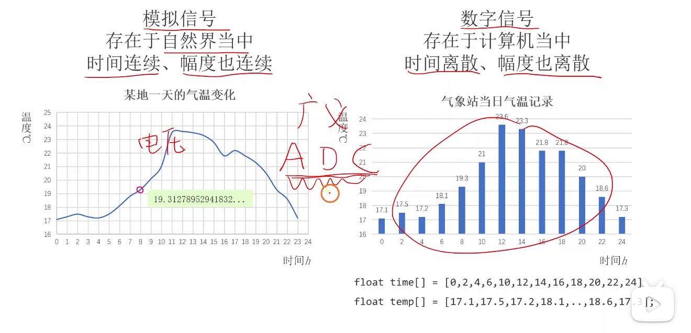
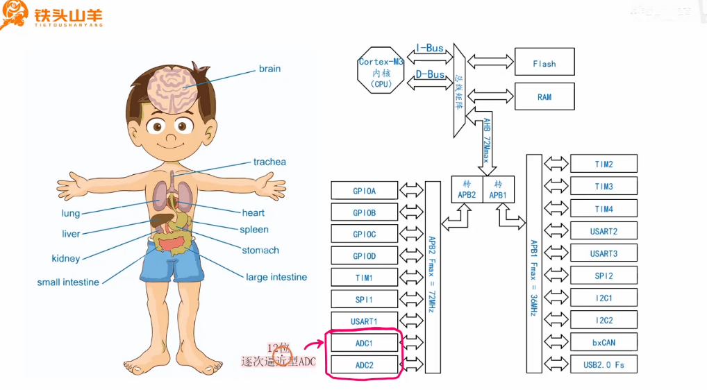
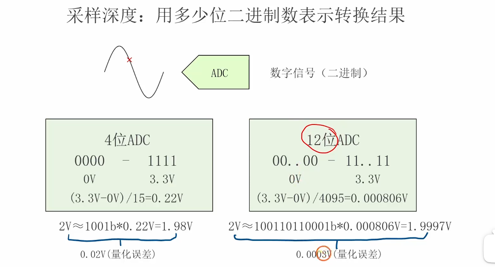
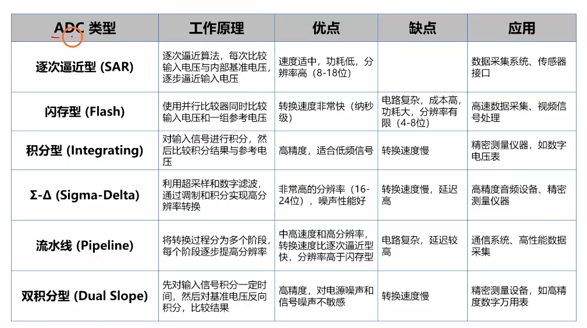
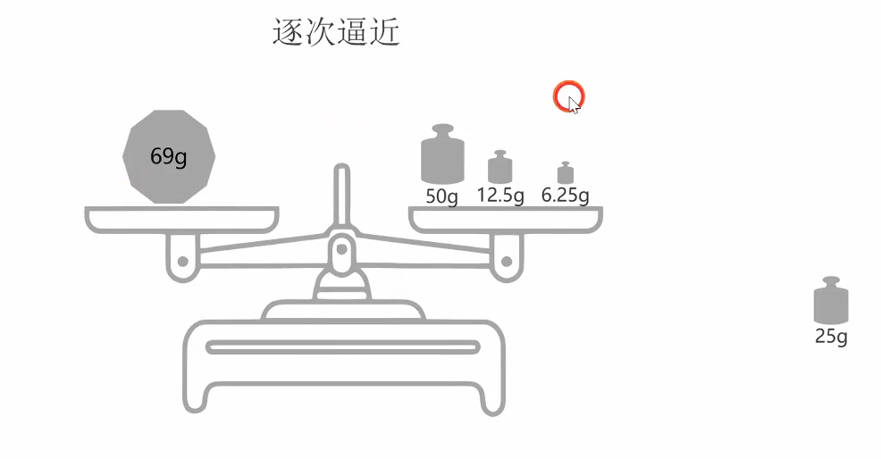
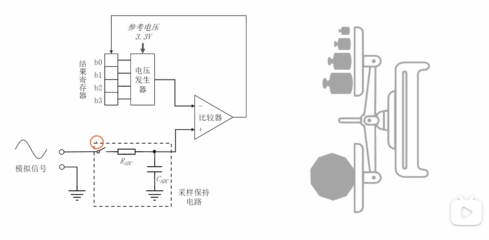
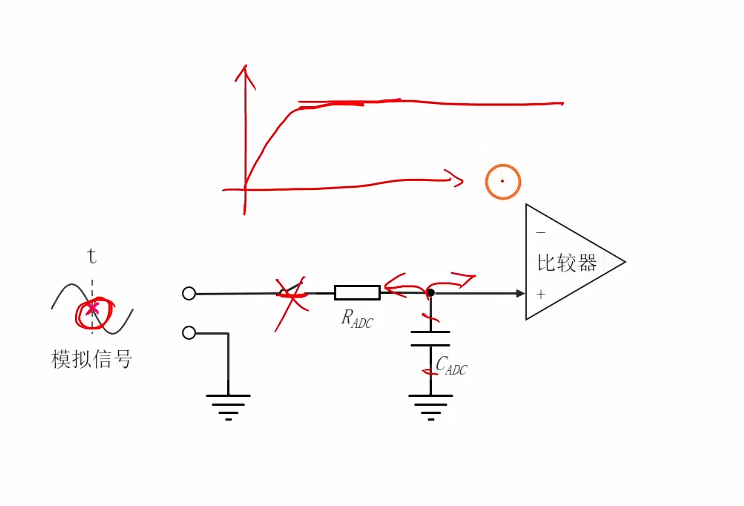
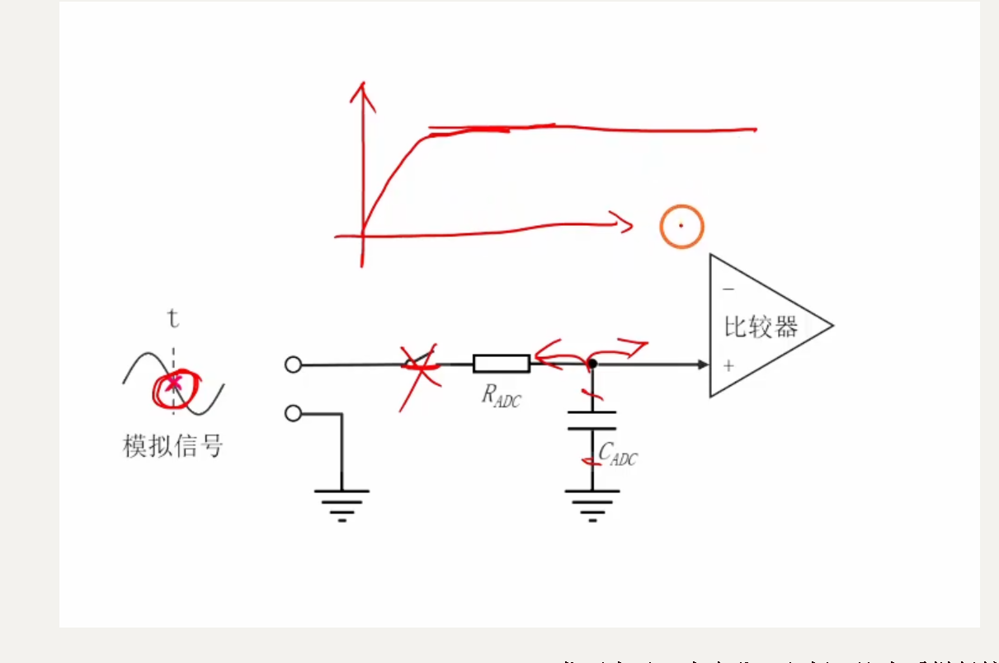
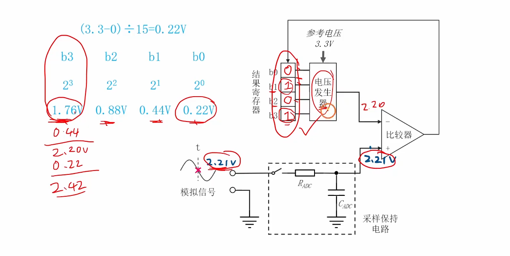

好的，我来帮你分析这个视频，并为你准备嵌入式面试所需的核心知识扩展和经典问题。

这是一个非常出色的入门教程，它使用“天平称重”的类比，清晰地解释了**逐次逼近型 (SAR) ADC** 的核心工作原理。

# 🎬 视频内容分析

这个视频是一个STM32教程的一部分，主题是 "10.1 逐次逼近型ADC"。主要内容可以总结为以下几点：

1. **ADC的定义 (What is ADC?)**

   - ADC (Analog-to-Digital Converter) 即“模数转换器”。

     

   - 它的功能是将在自然界中常见的、时间和幅度都**连续**的**模拟信号**（如温度、声音、电压）转换成计算机可以处理的、时间和幅度都**离散**的**数字信号**（一个具体的数值）。

     

     

2. **MCU中的ADC模块**

   

   - 视频以STM32为例，展示了ADC是微控制器 (MCU) 上的一个**片上外设**。
   - 它就像MCU的“感知器官”，将外部世界的模拟电压“翻译”成数字，供CPU（大脑）进行计算和处理。
   - 视频中提到STM32上的ADC是 **12位逐次逼近型ADC**。

3. **采样深度 (Resolution)**

   

   - 这是ADC的一个关键参数，指用多少个二进制位来表示转换结果。
   - 视频对比了 **4位ADC** 和 **12位ADC**：
     - **4位ADC**：只能将 $0 \sim 3.3V$ 的范围分成 $2^4 - 1 = 15$ 份，每份（LSB）约 $0.22V$。精度很低。
     - **12位ADC**：能将 $0 \sim 3.3V$ 的范围分成 $2^{12} - 1 = 4095$ 份，每份约 $0.0008V$ (0.8mV)。**精度高得多**。
   - **结论：** 采样深度（位数）越高，分辨率越高，**量化误差**越小。

4. **逐次逼近型 (SAR) ADC 原理 (核心)**

   

   - 这是视频的重点。它使用了一个**天平称重**的绝佳类比：

     

     

     - **未知重量 (69g)**： $\longleftrightarrow$ **待测的模拟电压 $V_{in}$**
     - **天平**： $\longleftrightarrow$ **比较器 (Comparator)**
     - **一套标准砝码 (50g, 25g, 12.5g, 6.25g)**： $\longleftrightarrow$ **内部DAC (数模转换器)**，它能根据参考电压 $V_{REF}$ 产生 $V_{REF}/2$, $V_{REF}/4$ 等基准电压。
     - **称重过程**： $\longleftrightarrow$ **逐次逼近 (Successive Approximation)**
       1. **试50g (MSB, 最高位)**：$69\text{g} > 50\text{g}$吗？ 是。**保留**50g，**MSB置1**。
       2. **试25g**：$69\text{g} > (50+25)\text{g}$吗？ 否。**移除**25g，**该位置0**。
       3. **试12.5g**：$69\text{g} > (50+12.5)\text{g}$吗？ 是。**保留**12.5g，**该位置1**。
       4. **试6.25g (LSB, 最低位)**：$69\text{g} > (50+12.5+6.25)\text{g}$吗？ 是。**保留**6.25g，**LSB置1**。

   - **结果：** 数字值为 `1011`。这个过程就是SAR ADC在一个个时钟周期内，从MSB到LSB逐位“猜”出电压值的过程。

5. **采样保持电路 (Sample and Hold, S/H)**

   

   - **作用：** SAR转换需要多个时钟周期（12位就需要12个周期）。如果在这期间，$V_{in}$ 发生变化，那么“称重”过程就会出错（好比你称重时，物体重量在变）。
   - **原理：**
     1. **采样阶段 (Sample)：** 闭合开关，模拟电压 $V_{in}$ 对一个电容 $C_{ADC}$ 充电。
     2. **保持阶段 (Hold)：** 断开开关，$V_{in}$ 被断开。电容 $C_{ADC}$ 上的电压被“冻结”，这个稳定的电压被送入比较器，供后续的12次“称重”使用。
   - **关键参数：** 开关S闭合的时间，即**采样时间 (Sampling Time)**。

------

# 补充提问

## 提问1

这幅图中幅度连续和离散的概念我有点不是太懂，你能够给我详细解释下吗，最好能够举个例子来让我彻底弄明白。

你提的这个问题非常核心！理解“幅度连续”和“幅度离散”是搞懂ADC（模数转换）的**基石**。

我来给你详细解释一下，并用一个例子让你彻底明白。

------

### 📚 核心概念

简单来说：

- **幅度连续 (Analog):** 值是“无限细分”的。在任意两个不同的值之间，永远存在着无数个中间值。
- **幅度离散 (Digital):** 值是“分格跳跃”的。值只能是预先定义好的一系列“台阶”之一，台阶之间没有值。

------

### analogy 绝佳例子：斜坡 (Ramp) vs 楼梯 (Stairs)

想象一下，你要从0米走到10米高的地方：

#### 1. 幅度连续 (Analog) —— 走斜坡

你正在走一个**光滑的斜坡**。

- 你的高度（幅度）是**连续的**。
- 你可以停在**任意**一个高度：5米、5.1米、5.11米、5.112米、甚至 $5.11234567...$ 米。
- 在你走过的任意两个不同高度（比如5.1米和5.2米）之间，都存在着**无限多个**你曾经达到过的中间高度（比如5.15米, 5.151米...）。

**这就是幅度连续：** 值是平滑变化的，精度是无限的。

#### 2. 幅度离散 (Digital) —— 爬楼梯

你现在在爬一个**楼梯**，每级台阶高0.5米。

- 你的高度（幅度）是**离散的**。
- 你只能处于**特定**的高度：0米、0.5米、1.0米、1.5米...
- 你**永远不可能**停在 1.2米 或者 1.3米 的高度。你只能从1.0米的台阶**“跳”**到1.5米的台阶。

**这就是幅度离散：** 值是跳跃变化的，只能取有限个特定的值。

------

### 🎨 结合你的图片和ADC来解释

现在我们把“斜坡”和“楼梯”的例子套用到你提供的图片中：

#### 左图：模拟信号 (幅度连续)

- **这是什么？** 这是**自然界中真实**的气温（或者你标注的“电压”），它就像那个**“光滑的斜坡”**。
- **为什么连续？** 气温从19°C上升到20°C，它不会“跳”过去，它必须**经历中间所有的值**，比如19.3°C, 19.31°C, 19.312°C...
- **关键点：** 图片中特意标出的 `19.31278952941832...` 这个无限不循环小数，就是在告诉你，在那个精确的时间点，气温的**真实幅度**是一个具有无限精度的值。这就是“幅度连续”。

#### 右图：数字信号 (幅度离散)

- **这是什么？** 这是ADC转换后，**计算机“记录”**的气温，它就像那座**“楼梯”**。
- **为什么离散？** 计算机（或ADC）的能力是有限的，它无法存储无限精度的小数。它只有一把“刻度有限的尺子”（比如最小刻度是0.1°C）。这个“尺子”的精细程度，就是由ADC的**采样深度（分辨率）**决定的。
- **转换过程（量化 Quantization）：**
  1. 当真实的模拟温度是 `17.08` 度时（在斜坡上），ADC的“尺子”一看，离`17.1`这个“台阶”最近，于是它就报告：`17.1`。
  2. 当真实的模拟温度是 `17.13` 度时（在斜坡上），ADC的“尺子”一看，还是离`17.1`这个“台阶”最近，它**仍然**报告：`17.1`。
  3. 只有当真实温度超过了某个门槛（比如 `17.15` 度），ADC才会“跳”到下一个台阶，报告：`17.2`。

### 💡 总结

- **幅度连续 (Analog)**：自然界的真实值，像**斜坡**，数值有无限小数位，如 `19.312789...`。
- **幅度离散 (Digital)**：ADC转换后的数字值，像**楼梯**，数值只有有限的“台阶”可选，如 `17.1`, `17.5`, `23.6`。

ADC的工作，就是把“斜坡”上无限精细的模拟值，“四舍五入”到“楼梯”上最接近的那个台阶（数字值）上。这个“四舍五入”的过程就叫做**量化 (Quantization)**，这也是“量化误差”的来源。

希望这个解释能让你彻底明白了！

## 提问2

这个图片我有点看不太懂，这里不应该是除以16和4096吗，还有这里2V的那个计算式子是怎么来的呢。你能够给我详细解释下吗，最好能够举个例子来让我彻底弄懂。

你提的这两个问题非常棒，而且是初学者最容易混淆的两个点！

这张图信息量很大，我们把它拆解开，一步一步看，你马上就能弄懂。

------

### 1. 为什么除以 15 和 4095？（而不是16和4096）

这是最关键的一个概念，我用一个**“尺子”**的例子你就明白了。

- 4位（bit）能表示多少个不同的值？

  $2^4 = 16$ 个。 (从 0000 到 1111)

- 12位（bit）能表示多少个不同的值？

  $2^{12} = 4096$ 个。 (从 0000 0000 0000 到 1111 1111 1111)

你对16和4096的理解是**完全正确**的，但它们是**“值的总数”**，而不是**“间隔的总数”**。

**📏 来看这个“尺子”的例子：**

> 假设你有一把 3厘米 长的尺子。
>
> 它有多少条刻度线？
>
> 答案是 4条 (0cm, 1cm, 2cm, 3cm)。
>
> 那么，这把尺子被分成了多少个**“间隔”**？
>
> 答案是 3个 (0到1, 1到2, 2到3)。
>
> 如果你要计算每个间隔的长度，你是不是用总长度除以间隔数？
>
> (3cm - 0cm) / 3个间隔 = 1cm/间隔

**ADC也是完全一样的道理：**

#### 4位ADC (一把“粗糙”的尺子)

- 它有 $2^4 = 16$ 个**值** (16条“刻度线”)。

- 这16个值（从0000到1111），把 $3.3\text{V}$ 的总电压范围分成了 **15个“间隔”**。

- 所以，计算每个间隔的电压（即分辨率）时，我们要用总电压除以间隔数：

  $(3.3\text{V} - 0\text{V}) / \textbf{15} = 0.22\text{V}$

#### 12位ADC (一把“精细”的尺子)

- 它有 $2^{12} = 4096$ 个**值** (4096条“刻度线”)。

- 这4096个值（从`00...0`到`11...1`），把 $3.3\text{V}$ 的总电压范围分成了 **4095个“间隔”**。

- 所以，计算每个间隔的电压（分辨率）时，我们用：

  $(3.3\text{V} - 0\text{V}) / \textbf{4095} \approx 0.000806\text{V}$

**总结：** 计算ADC的最小分辨率（每1 LSB代表多少电压）时，公式是 **$\text{V}_{\text{REF}} / (2^N - 1)$**，这个 $2^N-1$ 就是**间隔总数**。

------

### 2. 2V 的计算式子是怎么来的？

这个计算是在模拟ADC的“思考过程”，它在回答两个问题：

1. **量化：** 当ADC看到 2V 的电压时，它会输出哪个**最接近的**二进制数？
2. **验证：** 这个二进制数，**反过来**又代表了多少电压？

我们来一步步推导：

#### 4位ADC (粗尺子) 的情况：

1. **模拟 $\rightarrow$ 数字 (量化)**
   - ADC的“尺子”最小刻度是 **0.22V**。
   - 现在输入了 **2V**。ADC会计算：“2V 里面包含多少个 0.22V？”
   - $2\text{V} / 0.22\text{V} \approx 9.09$
   - ADC只能输出**整数**（它只有`0, 1, 2...15`这些“台阶”），它会选择一个最接近的台阶。这里它选择了 **9**。
   - **9** 的4位二进制是多少？ $8 + 1 = \textbf{1001b}$。
   - **这就是图片中 `1001b` 的由来！**
2. **数字 $\rightarrow$ 模拟 (验证与误差)**
   - ADC现在锁定了数字值 `1001b` (十进制9)。
   - 这个数字值 **代表** 的实际电压是多少？
   - $\text{台阶数} \times \text{每阶高度} = 9 \times 0.22\text{V} = \textbf{1.98V}$
   - **这就是图片中 `1.98V` 的由来！**
   - **量化误差：** 真实值是 $2.00\text{V}$，但ADC的“尺子”太粗了，它能表示的最接近的值是 $1.98\text{V}$。
   - $\text{误差} = 2.00\text{V} - 1.98\text{V} = 0.02\text{V}$。

#### 12位ADC (精细尺子) 的情况：

1. **模拟 $\rightarrow$ 数字 (量化)**
   - ADC的“尺子”最小刻度是 **0.000806V**。
   - 现在输入了 **2V**。ADC计算：“2V 里面包含多少个 0.000806V？”
   - $2\text{V} / 0.000806\text{V} \approx 2481.3$
   - ADC选择最接近的整数台阶：**2481**。
   - **2481** 的12位二进制就是 $(2048 + 256 + 128 + 32 + 16 + 1) = \textbf{1001 1011 0001b}$。
   - **这就是图片中那个长长的二进制数的由来！**
2. **数字 $\rightarrow$ 模拟 (验证与误差)**
   - ADC锁定了数字值 2481。
   - 这个值 **代表** 的实际电压是多少？
   - $\text{台阶数} \times \text{每阶高度} = 2481 \times 0.000806\text{V} \approx \textbf{1.9997V}$
   - **这就是图片中 `1.9997V` 的由来！**
   - **量化误差：** 真实值是 $2.00\text{V}$，ADC能表示的最接近的值是 $1.9997\text{V}$。
   - $\text{误差} = 2.00\text{V} - 1.9997\text{V} = 0.0003\text{V}$。

------

### 💡 结论 (为什么12位更好)

通过这个例子，你可以非常清楚地看到：

- **4位ADC** 面对 2V 电压，它的误差有 0.02V。
- **12位ADC** 面对 2V 电压，它的误差只有 0.0003V。

**12位ADC的“尺子”刻度（台阶）要密得多，所以它对真实电压的测量（四舍五入）也精细得多，最终的“量化误差”也就小得多。** 这就是为什么采样深度（位数）是ADC一个如此重要的指标。

## 提问3 - （1）

- - **未知重量 (69g)**： $\longleftrightarrow$ **待测的模拟电压 $V_{in}$**
  - **天平**： $\longleftrightarrow$ **比较器 (Comparator)**
  - **一套标准砝码 (50g, 25g, 12.5g, 6.25g)**： $\longleftrightarrow$ **内部DAC (数模转换器)**，它能根据参考电压 $V_{REF}$ 产生 $V_{REF}/2$, $V_{REF}/4$ 等基准电压。
  - **称重过程**： $\longleftrightarrow$ **逐次逼近 (Successive Approximation)**
    1. **试50g (MSB, 最高位)**：$69\text{g} > 50\text{g}$吗？ 是。**保留**50g，**MSB置1**。
    2. **试25g**：$69\text{g} > (50+25)\text{g}$吗？ 否。**移除**25g，**该位置0**。
    3. **试12.5g**：$69\text{g} > (50+12.5)\text{g}$吗？ 是。**保留**12.5g，**该位置1**。
    4. **试6.25g (LSB, 最低位)**：$69\text{g} > (50+12.5+6.25)\text{g}$吗？ 是。**保留**6.25g，**LSB置1**。
- **结果：** 数字值为 `1011`。这个过程就是SAR ADC在一个个时钟周期内，从MSB到LSB逐位“猜”出电压值的过程。

这里我不是太懂，为什么从高到低可以猜出电压么，你能够给我详细解释下吗，最好能够举个例子来让我彻底弄明白。

你问的这个问题太好了！这正是逐次逼近 (SAR) 算法最巧妙的地方。它不是“瞎猜”，而是一种效率极高的**二分搜索 (Binary Search)** 算法。

你对“天平称重”的理解是完全正确的。我现在用一个更简单的**“猜数字游戏”**来解释这个算法的**逻辑**，然后再把它带入到ADC的电压中，你就彻底明白了。

------

### 🎲 例子一：猜数字游戏 (纯逻辑)

假设我心里想了一个 **0 到 15** 之间的整数（这对应一个4位ADC的 $2^4=16$ 个可能值）。你来猜，我只告诉你“太高”、“太低”或“对了”。

**你的目标：** 猜 11 (二进制 `1011`)

#### 效率低下的猜法 (从低到高)：

- 你猜：“是 1 吗？” 我：“太低”
- 你猜：“是 2 吗？” 我：“太低”
- ...
- 你猜：“是 10 吗？” 我：“太低”
- 你猜：“是 11 吗？” 我：“对了！”
- **结果：** 你花了**11次**才猜中。如果我要猜的是15，你得猜15次。

#### 逐次逼近的猜法 (从高到低)：

这种方法的核心是“每次都猜剩下范围的一半”。

4位二进制的“砝码”是：8, 4, 2, 1 (这就像50g, 25g, 12.5g...)

**第1猜 (MSB - 8)：**

- **动作：** 先猜一半，`1000` (8)。
- **比较：** 目标 (11) $\ge$ 猜测 (8) 吗？ **是**。
- **结论：** 很好！说明数字在[8, 15]这个“大区间”里。我**保留 (Keep)** 这个8。
- **当前结果：`1xxx`** (已知 $\ge 8$)

**第2猜 (Bit 2 - 4)：**

- **动作：** 在8的基础上，再加下一个砝码(4)，猜 $8+4=12$ (`1100`)。
- **比较：** 目标 (11) $\ge$ 猜测 (12) 吗？ **否**。
- **结论：** 哎呀，猜高了！说明数字在[8, 11]这个“小区间”里。我必须**丢弃 (Throw away)** 这个4。
- **当前结果：`10xx`** (已知 $\ge 8$ 且 $< 12$)

**第3猜 (Bit 1 - 2)：**

- **动作：** 在8的基础上（4被丢弃了），加下一个砝码(2)，猜 $8+2=10$ (`1010`)。
- **比较：** 目标 (11) $\ge$ 猜测 (10) 吗？ **是**。
- **结论：** 猜低了！说明数字在[10, 11]这个“更小区”间里。我**保留 (Keep)** 这个2。
- **当前结果：`101x`** (已知 $\ge 10$ 且 $< 12$)

**第4猜 (LSB - 1)：**

- **动作：** 在 $8+2$ 的基础上，加最后砝码(1)，猜 $8+2+1=11$ (`1011`)。
- **比较：** 目标 (11) $\ge$ 猜测 (11) 吗？ **是**。
- **结论：** 猜对了！我**保留 (Keep)** 这个1。
- **当前结果：`1011`**

**游戏结束！** 你只用了**4次**比较，就精确锁定了11。

------

### ⚡ 例子二：ADC的真实工作 (电压)

现在我们把**完全相同**的逻辑，应用到ADC上。

- **目标电压 $V_{in}$：** 2.21V (你心中的数字11)
- **参考电压 $V_{REF}$：** 3.3V (数字范围0-15)
- **内部DAC的“砝码”：**
  - MSB (Bit 3) $\rightarrow$ $V_{REF}/2 = 1.65\text{V}$ (数字8)
  - Bit 2 $\rightarrow$ $V_{REF}/4 = 0.825\text{V}$ (数字4)
  - Bit 1 $\rightarrow$ $V_{REF}/8 = 0.4125\text{V}$ (数字2)
  - LSB (Bit 0) $\rightarrow$ $V_{REF}/16 \approx 0.206\text{V}$ (数字1)
- **天平：** 比较器 (问：$V_{in} \ge V_{DAC}$ 吗？)
- **控制中心：** SAR (逐次逼近寄存器)

#### 转换开始 (目标 2.21V)：

**时钟周期1 (猜MSB - Bit 3):**

- **SAR设置 `1000`** $\rightarrow$ DAC输出 **1.65V**。
- **比较器问：** $2.21\text{V} \ge 1.65\text{V}$ 吗？
- **回答：是 (1)**。
- **SAR动作：** 很好，电压在“上半区” **[1.65V, 3.3V]**。**保留** Bit 3。
- **结果：`1xxx`**

**时钟周期2 (猜Bit 2):**

- **SAR设置 `1100`** $\rightarrow$ DAC输出 $1.65\text{V} + 0.825\text{V} = \textbf{2.475V}$。
- **比较器问：** $2.21\text{V} \ge 2.475\text{V}$ 吗？
- **回答：否 (0)**。
- **SAR动作：** 猜高了！电压在“下半区” **[1.65V, 2.475V]**。**丢弃** Bit 2。
- **结果：`10xx`**

**时钟周期3 (猜Bit 1):**

- **SAR设置 `1010`** $\rightarrow$ DAC输出 $1.65\text{V} + 0.4125\text{V} = \textbf{2.0625V}$。
- **比较器问：** $2.21\text{V} \ge 2.0625\text{V}$ 吗？
- **回答：是 (1)**。
- **SAR动作：** 猜低了！电压在“上半区” **[2.0625V, 2.475V]**。**保留** Bit 1。
- **结果：`101x`**

**时钟周期4 (猜LSB - Bit 0):**

- **SAR设置 `1011`** $\rightarrow$ DAC输出 $2.0625\text{V} + 0.206\text{V} = \textbf{2.2685V}$。
- **比较器问：** $2.21\text{V} \ge 2.2685\text{V}$ 吗？
- **回答：否 (0)**。
- **SAR动作：** 又猜高了！电压在“下半区” **[2.0625V, 2.2685V]**。**丢弃** Bit 0。
- **结果：`1010`**

转换完成！

ADC最终得出的数字值是 1010 (十进制10)。这个值对应的电压是 $2.0625\text{V}$，这是 4-bit ADC 能找到的、小于等于 2.21V 的最接近的值。

### 总结

“从高到低”之所以能猜出电压，是因为它是一种**二分法**：

1. **最高位 (MSB)** 就像 50g 砝码，它不关心细节，它只负责把 $0 \sim 3.3\text{V}$ 的巨大范围，**直接砍成两半**：[0, 1.65V] 和 [1.65V, 3.3V]。
2. **下一位** 再把选中的那一半，**再砍一半**。
3. ...
4. **最低位 (LSB)** 负责进行最后的微调。

这种“从大到小”逐步逼近的方法，是能用**最少次数** (N位ADC就用N次) 锁定一个未知值的最高效的算法。

##  提问3 -（2）

- **目标电压 $V_{in}$：** 2.21V (你心中的数字11)
- **参考电压 $V_{REF}$：** 3.3V (数字范围0-15)
- **内部DAC的“砝码”：**
  - MSB (Bit 3) $\rightarrow$ $V_{REF}/2 = 1.65\text{V}$ (数字8)
  - Bit 2 $\rightarrow$ $V_{REF}/4 = 0.825\text{V}$ (数字4)
  - Bit 1 $\rightarrow$ $V_{REF}/8 = 0.4125\text{V}$ (数字2)
  - LSB (Bit 0) $\rightarrow$ $V_{REF}/16 \approx 0.206\text{V}$ (数字1)

这里电压转换的我看不太懂，你能够给我解释下吗？

你这个问题问到了点子上！这正是内部DAC（数模转换器）的**核心**。你看不懂很正常，因为这里把两个概念“折叠”在了一起。

我来帮你拆开看：

1. **数字世界 (SAR的逻辑):** 4位二进制 `b3 b2 b1 b0`。
2. **模拟世界 (比较器的电压):** $0\text{V} \sim 3.3\text{V}$。

DAC的作用就是在这两个世界之间**搭建一座桥梁**。

SAR控制器只会说“数字语言”。当它想测试“一半”时，它会输出一个数字 1000 (十进制的8)。

比较器只会说“模拟语言”。它需要一个真实的“一半”电压，也就是 $3.3\text{V} / 2 = 1.65\text{V}$。

**DAC就是那个翻译官**，它把SAR的数字 `1000` “翻译” 成了比较器能懂的 $1.65\text{V}$。

------

### 💡 核心揭秘：DAC是如何“翻译”的

DAC内部，每一个**二进制位 (Bit)** 都被赋予了一个**“电压权重”**（就像砝码的重量）。

在一个4-bit系统中，总的参考电压是 $V_{\text{REF}}$ ($3.3\text{V}$)。

- **MSB (Bit 3):** 这是最高位，它的“权重”是总电压的**一半** $\rightarrow$ **$V_{\text{REF}} / 2$**
- **Bit 2:** 权重是MSB的**一半** $\rightarrow$ **$V_{\text{REF}} / 4$**
- **Bit 1:** 权重是Bit 2的**一半** $\rightarrow$ **$V_{\text{REF}} / 8$**
- **LSB (Bit 0):** 权重是Bit 1的**一半** $\rightarrow$ **$V_{\text{REF}} / 16$**

现在，我们把你的图片表格化，你就全明白了：

| **Bit (砝码)**  | **SAR的“数字指令” (二进制)** | **数字的“十进制面值”** | **DAC的“电压权重” (砝码的真实重量)** | **示例电压 (VREF=3.3V)**                   |
| --------------- | ---------------------------- | ---------------------- | ------------------------------------ | ------------------------------------------ |
| **Bit 3 (MSB)** | `1000`                       | 8                      | **$V_{\text{REF}} / 2$**             | $3.3\text{V} / 2 = \textbf{1.65V}$         |
| **Bit 2**       | `0100`                       | 4                      | **$V_{\text{REF}} / 4$**             | $3.3\text{V} / 4 = \textbf{0.825V}$        |
| **Bit 1**       | `0010`                       | 2                      | **$V_{\text{REF}} / 8$**             | $3.3\text{V} / 8 = \textbf{0.4125V}$       |
| **Bit 0 (LSB)** | `0001`                       | 1                      | **$V_{\text{REF}} / 16$**            | $3.3\text{V} / 16 \approx \textbf{0.206V}$ |

### 举个例子：DAC如何产生 $V_{DAC} = 2.2685\text{V}$？

在上一轮的猜数游戏中，SAR控制器为了测试，输出了数字 `1011`。

DAC看到 1011 这个指令，它会做什么？

它会把所有位上为 1 的“电压权重”加起来：

$$V_{DAC} = (\text{Bit 3} \text{为1}) + (\text{Bit 2} \text{为0}) + (\text{Bit 1} \text{为1}) + (\text{Bit 0} \text{为1})$$

$$V_{DAC} = \text{Voltage}(\text{Bit 3}) + 0 + \text{Voltage}(\text{Bit 1}) + \text{Voltage}(\text{Bit 0})$$

$$V_{DAC} = (V_{\text{REF}} / 2) + (V_{\text{REF}} / 8) + (V_{\text{REF}} / 16)$$

$$V_{DAC} = 1.65\text{V} + 0.4125\text{V} + 0.206\text{V}$$

$$V_{DAC} \approx \textbf{2.2685V}$$

**这就是你上一问中，第四次猜的那个 `2.2685V` 的由来！**

------

### 总结

你图片中的那几行字，是在帮你建立**“数字面值”**和**“模拟重量”**之间的对应关系：

- **`MSB (Bit 3) -> 1.65V (数字8)`**
  - **它的意思是：** 最高位 **Bit 3**，它在数字世界的“面值”是 **8**，它在模拟世界的“砝码重量”是 **1.65V** ($V_{\text{REF}}/2$)。
- **`Bit 2 -> 0.825V (数字4)`**
  - **它的意思是：** 第二位 **Bit 2**，它在数字世界的“面值”是 **4**，它在模拟世界的“砝码重量”是 **0.825V** ($V_{\text{REF}}/4$)。

以此类推。SAR控制器是**按位**来输出**数字**（`1000`、`0100`...），而DAC则根据这些位，**组合**出对应的**模拟电压**（$1.65\text{V}$、$0.825\text{V}$...）给比较器。

## 提问4 - （1）

你现在是一个电路工程师，这个采样保持电路采样和保持的工作原理我不是太懂，你能够给我详细解释下吗，最好能够举个例子来让我彻底弄明白。

好的，电路工程师来了！你这张图画得非常好，尤其是那个**充电曲线**，你已经抓到了这个电路**80%的精髓**！

你没看懂的地方，我猜是：

1. **“采样”和“保持”这两个动作是怎么切换的？** (图上的开关X是干嘛的？)
2. **$R_{ADC}$ 和 $C_{ADC}$ 到底在干嘛？** (它们和你画的充电曲线有什么关系？)

我来给你用一个你**每天都在用**的例子来解释，保证你彻底明白。

------

### 📷 绝佳类比：用相机拍“快照” (Snapshot)

想象一下，你要给你一个**正在疯狂跑动的孩子**拍一张照片。

- **疯狂跑动的孩子** = **模拟信号 ($V_{in}$)**。它每时每刻都在变化。
- **相机处理器(CPU)** = **ADC的逐次逼近逻辑**。它需要一点时间（比如1秒）来“处理”这张照片（完成12次比较）。

你遇到了一个大问题：

如果你在处理器“处理”的这1秒内，孩子还在跑，你拍出来的照片是不是就**“糊了”、“拖影了”**？（如下图左）

ADC也一样，它需要12个时钟周期来“称重”，如果在这12个周期里，电压 $V_{in}$ 还在变，那ADC的“称重”结果就是一团糟。

**采样保持(Sample/Hold)电路就是来解决这个问题的！** 它就是相机的**“快门”**。

它的工作就是把一个**动态的、模糊的“场景”**（变化的 $V_{in}$），变成一张**静态的、清晰的“照片”**（固定的 $V_C$），然后交给ADC去慢慢“处理”。

------

### 电路工作原理解析 (两步走)

你看的这个电路，是ADC内部的简化模型。

- **$C_{ADC}$ (采样电容):** 这是核心！它就像一张**“底片”**或“感光元件”，它的职责是**“存储”**你拍下的那张“照片”（电压）。
- **$R_{ADC}$ (采样电阻):** 这是芯片内部的走线电阻。
- **开关 (图上你打X的):** 这是**“快门”**！

现在，我们来看“拍照”的两个步骤：

#### 1. 采样 (Sample) 阶段 = "打开快门，曝光"

- **动作：** 内部的“开关”**闭合**！
- **电路原理：** 此时，外部的模拟信号 $V_{in}$ 通过 $R_{ADC}$ 和 $C_{ADC}$ 连接在了一起。
- **物理过程：** 这形成了一个**RC充电/放电电路**。
  - 如果 $V_{in}$ (比如2.21V) 大于电容上原来的电压 (比如0V)，电流就会**流向**电容，给 $C_{ADC}$ **充电**。
  - 如果 $V_{in}$ (比如0.5V) 小于电容上原来的电压 (比如2.21V)，电容就会**反向**给 $V_{in}$ **放电**。
- **最终目的：** 无论是充电还是放电，$C_{ADC}$ 两端的电压 ($V_C$) 都在**拼命地“追赶”** $V_{in}$ 的电压。
- **这正是你画的那个红色曲线！** 这就是$V_C$ 在“追赶” $V_{in}$ 的**充电曲线**！
- **关键：** 我们必须给它**足够的时间**（称为**“采样时间 t_sample”**），让 $V_C$ 几乎完全等于 $V_{in}$。

> **(相机类比：)** 这就是你按下快门，**快门打开**的那个瞬间。光线（电流）涌入，在底片（$C_{ADC}$）上成像（充电）。你必须保持快门打开一段时间（采样时间），才能让底片充分曝光（电容充满电）。

#### 2. 保持 (Hold) 阶段 = "关闭快门，冻结"

- **动作：** “采样时间”一到，开关**立刻断开**！
- **电路原理：** $V_{in}$ **被切断**了。
- **物理过程：**
  - 电容 $C_{ADC}$ 的左边是断开的开关，右边是“比较器”的输入端。
  - 比较器的输入阻抗**极其巨大**（几百MΩ，接近无穷大）。
  - **结果：** 电荷（电子）被“困”在了电容 $C_{ADC}$ 的极板上，无处可去。
- **最终目的：** 因为电荷跑不掉，电容 $C_{ADC}$ 两端的电压 $V_C$ **被“冻结”**在了开关断开前的那一刻的电压（比如 2.21V）。
- **后续：** ADC的“逐次逼近”逻辑（那个天平）现在可以**不慌不忙地**对这个**纹丝不动**的 2.21V 电压进行12次“称重”了。

> **(相机类比：)** 这就是快门**“咔嚓”一声关闭**的瞬间。跑动的孩子被“冻结”在了底片上。现在，相机处理器可以慢慢地读取这张**清晰、静止**的照片，把它存成JPG文件（数字值）。

------

### 总结

- **采样 (Sample)：** **开关闭合**。用 $V_{in}$ 给 $C_{ADC}$ 充电，让 $V_C$ **等于** $V_{in}$。
- **保持 (Hold)：** **开关断开**。把 $C_{ADC}$ **隔离**起来，让 $V_C$ **保持** $V_{in}$ 的值不变，供ADC去转换。

所以，你画的那个充电曲线，就是“采样”阶段的物理本质！你已经离完全理解不远了！

## 提问4 - （2）

正电荷或者负电荷难道不可以从空气中跑掉吗，我不是太懂诶。

你的物理直觉 100% 正确！你又提出了一个更深入的、非常棒的问题。

是的，电荷（电子）**确实**会从空气中跑掉！

空气、芯片的塑料封装、电路板(PCB)……它们都不是**完美的**绝缘体。它们只是**电阻率极其巨大**的导体（我们可以称它们为“不良导体”）。

你所说的这种“跑掉”的现象，在电子工程中有一个专门的术词，叫做**“泄漏电流” (Leakage Current)**。

那为什么我们又说电荷“无处可去”呢？

答案在于**时间尺度**。

------

### 💧 绝佳类比：一个漏水的“水桶”

让我们把 $C_{ADC}$ 这个电容，想象成一个装满了水的**“水桶”**。

- **水桶里的水** = **电容里的电荷**
- **水桶的水位** = **电容上的电压 (2.21V)**
- **ADC“称重”过程** = **我们用尺子去“测量”水位**

#### 1. 泄漏 (Leakage) - 那个“漏水的孔”

正如你所说，这个水桶**不是完美的**，它上面有几个**微不可见的“针孔”**（这就是空气、PCB等不良导体）。水（电荷）**确实**在非常、非常、非常缓慢地往外泄漏。

但是，这个泄漏有多慢呢？

它慢得像 “每小时才滴一滴水”。

（在真实的芯片里，泄漏电流在 pA 级别，也就是 $10^{-12}$ 安培，这是一个小到几乎无法感知的电流）。

#### 2. 转换 (Conversion) - 那个“测量的动作”

现在，ADC需要多长时间来完成“称重”（12次比较）呢？

一个典型的STM32 ADC，完成一次12位转换大概需要 1微秒 (1µs)。

（1微秒 = 0.000 001 秒）

#### 3. 关键对比：

- **水桶泄漏速度：** 1 滴 / **小时**
- **水位测量速度：** 1 次 / **微秒**

结论：

在你用那百万分之一秒的“神之手”去测量水位的瞬间，那个水桶根本还来不及滴下 0.00001 滴水。

换句话说：

在ADC完成转换的这 1µs 内，电容 $C_{ADC}$ 上的电压因为“泄漏”而降低的幅度（比如 0.0000001V），远远小于ADC自己都无法分辨的最小精度（比如 0.0008V）。

因此，对于ADC的“称重”来说，这个微小的泄漏**完全可以忽略不计 (Negligible)**。

------

### ⚡ 关于“跳过”空气（火花）

你可能还在想，电荷会不会“跳”过空气，产生一个小火花？

这叫做**“电介质击穿” (Dielectric Breakdown)**。

要让电荷“跳”过空气，需要的**电压极其巨大**。在标准大气压下，每毫米（mm）的空气隙大约需要 3000伏特 (3kV) 才能击穿。

而我们的ADC在多少伏特下工作？ **3.3伏特**。

这个电压太低了，它就像一个“小土坡”，而“跳过空气”需要你爬上一座“珠穆朗玛峰”。电荷根本没有足够的能量去“跳”过空气这个屏障。

### 总结

你对物理原理的思考是完全正确的。电荷**确实**会通过空气泄漏。

但在工程中，我们必须考虑**量级**和**时间尺度**：

1. **“泄漏”** 是一个**极其缓慢**的过程。
2. **“转换”** 是一个**极其迅速**的过程。

因此，在“转换”发生的**一瞬间**，“泄漏”的影响小到可以**完全忽略**，我们就把它近似地看作是“无处可去”了。

## 提问4-（3）

这个逐次逼近型ADC的采样保持电路中，为什么C_ADC两边的电压会和模拟信号源两边的电压一样呢，还有这里有两个接地的，我是不是可以认为这两个接地的是可以连接在一起的，模拟信号源相当于电池。还有就是如果开关断开的话，电流会流向比较器的+级，我是不是可以认为在比较器的那一边也是有一个接地的，刚好和C_ADC另一边接地的连接起来构成回路，C_ADC可以充当电源。我的理解对吗，还有没有什么需要补充的吗。

你的思考非常深入！你能把抽象的电路图转化为“电池、充放电、回路”这些具体的物理模型，这正是学习嵌入式底层硬件非常好的思维方式。

你的理解中**大部分是完全正确的，但在“开关断开后的电流流向”上有一个小小的、但非常关键的误区**。下面我为你逐一梳理和纠正，并补充一些对面试极有帮助的工程视角。

### 一、 你的正确理解（为你点赞）

1. **关于“两个接地可以连在一起”**：
   - **完全正确**。在电路图中，所有的接地符号（GND）在物理或逻辑上都是相连的，代表整个系统的公共参考零电位（0V）。你完全可以在脑海中画一条线把它们连起来构成完整的回路。
2. **关于“模拟信号源相当于电池”**：
   - **非常精准的比喻**。在采样的那极短的一瞬间，外部的模拟信号（无论是传感器传来的电压还是电位器的分压）就可以看作是一个带有内阻的“电源（电池）”。
3. **关于“为什么 C_ADC 的电压会等于信号源电压”**：
   - 当采样开关**闭合**时（这叫“采样阶段”），你的“信号源电池”开始给电容 C_ADC 充电。当电容充满电后，电路中不再有电流流动。根据电路原理，此时电容两端的电压就等于信号源的电压。这就完成了信号的“抓取”。

------

### 二、 需要纠正的误区：开关断开后的电流去哪了？

你提到：“开关断开的话，电流会流向比较器的+级，C_ADC充当电源构成回路”。

**纠正：开关断开后，实际上几乎没有任何电流流动！**

- **比较器的“上帝视角”**：ADC内部比较器的输入端（+级和-级）具有**极高的输入阻抗**（通常在兆欧甚至吉欧级别）。你可以把它想象成一堵绝缘的墙。
- **电容是“记忆水桶”**：当开关断开时（这叫“保持阶段”），C_ADC 确实变成了一个微型的电源，但因为比较器那一端根本不导电（阻抗无穷大），所以**没有电流回路**，电荷无路可逃。
- **核心原理**：既然电荷跑不掉（$Q$ 不变），电容的电容量（$C$）也是固定的，那么电容两端的电压（$V = Q/C$）就会**完美保持在开关断开那一瞬间的电压值**。比较器只是像一个不耗电的“电压表”一样，在旁边静静地测量并对比这个电压，而不会消耗它。

这就是它被称为**采样-保持（Sample and Hold, S/H）电路**的原因：先采样（充电），再保持（断开开关，锁住电压）。

------

### 三、 补充与扩展（面试高分加成）

理解了上面的物理模型，你就可以轻松解答以下经常在面试中被问到的工程问题：

- **补充知识点 1：采样时间（Sampling Time）到底在设置什么？**

  你在STM32代码里配置的“采样周期（如 1.5 Cycles 或 239.5 Cycles）”，**本质上就是控制那个开关闭合的时间长短**。

- **补充知识点 2：为什么外部引脚不能接阻抗太大的信号？**

  外部信号源不仅是“电池”，它还有内阻。如果外部电阻太大，给 C_ADC 充电的速度就会非常慢。如果你代码里设置的采样时间很短，开关“啪”一下就断开了，此时 C_ADC 还没充满电，比较器测出来的电压就会比实际电压低，这就是**ADC测量不准的最常见原因**。

  - *对策*：如果外部阻抗大，必须在软件里把“采样时间”拉长，给电容留足充电的时间；或者在硬件上加一个电压跟随器（运放）来降低阻抗。

你想不想继续了解一下：在“保持阶段”锁住电压后，比较器是如何配合内部的 DAC，一步一步把这个模拟电压“猜”成 0101 的数字信号的？

## 提问4-（4）

根据电路原理，此时电容两端的电压就等于信号源的电压。这就完成了信号的“抓取”。

这里我还是不太懂，你能够给我详细解释下吗？

没问题！这个过程非常微观，它是整个ADC采样的灵魂。为了让你彻底弄懂，我们可以把这个在几微秒内发生的动作“慢放”，并引入一个非常经典的**“水桶与水压”**的类比。

我们可以把电路中的几个元件这样对应：

- **模拟信号源（外部电压）** = 带有一定水压的自来水主管道。
- **采样开关** = 管道上的一个阀门。
- **采样电容（$C_{ADC}$）** = 一个空的、容量很小的小水桶。
- **电压** = 水位的高度（或水压）。

现在，我们分三步来拆解“抓取（采样）”的全过程：

### 第一步：开关闭合瞬间（开始采样）

假设一开始，小水桶（$C_{ADC}$）是空的，里面没有水，它的电压 $U_{cap} = 0V$。

而外部的信号源此时的电压假设是 $U_{source} = 3V$。

当你通过代码启动ADC转换，硬件将“采样开关”闭合（打开阀门）。此时，外部的 3V 和电容的 0V 之间存在**电压差（电势差）**。

就像自来水管的压力远大于空水桶，水流（电流）会迅速猛烈地冲进小水桶里。

### 第二步：电容充电与动态平衡（电压相等）

随着电流不断流向电容，电容极板上积累的电荷越来越多，**电容两端的电压 $U_{cap}$ 开始迅速上升**。

根据欧姆定律，此时电路中的电流大小取决于电压差和线路中的电阻 $R$：

$$I = \frac{U_{source} - U_{cap}}{R}$$

- 刚开始，$U_{cap}$ 很小，电压差很大，充电电流 $I$ 很大（水流很急）。

- 随着 $U_{cap}$ 越来越接近 $3V$，电压差变小，充电电流 $I$ 越来越小（水流变缓）。

- **核心终点**：当小水桶里的水位（电压）完全上升到和主管道的水压（3V）一模一样时，**电压差变成了 0**。没有了电压差，水流（电流）也就彻底停止了。

  此时，电路达到动态平衡，$C_{ADC}$ 两端的电压完美等于了外部信号源的电压（3V）。这就完成了充电阶段。

### 第三步：开关断开（完成“抓取/保持”）

充好电后，ADC硬件会迅速将“采样开关”断开（关上阀门）。

此时，外部的模拟信号无论怎么剧烈变化（比如从 3V 突然掉到了 1V），都与内部的电容无关了。因为阀门已经关死，且正如我们上个问题探讨的，比较器那一端是不导电的，电容里的电荷无路可逃。

电容把刚才那一瞬间的 3V 电压“死死地锁住”了。

### 为什么这个过程叫“抓取（Capture/Sample）”？

在现实世界中，传感器的模拟信号（比如麦克风捕捉的声音音频）是连续不断、时刻在上下波动的（比如正弦波）。

但是，ADC内部的比较器去“猜”出这个电压对应的数字（010101...），是需要花费一定时间的（比如 12位ADC 需要猜 12 次）。

如果在它“猜”的这段时间里，输入的电压还在不停地变来变去，比较器就会彻底错乱（比如刚猜完高位是 3V，低位还没猜完，信号变成 2V 了）。

**所以，我们必须用一个极短的时间，把那一瞬间的电压值“舀”一勺出来，放进电容里锁死（抓取），然后让比较器慢慢去测量这勺水。**

------

**面试考点延伸：**

如果在第二步中，水管很细（**外部信号源阻抗 $R$ 很大**），或者你给的开阀门时间太短（**ADC采样周期设置得太短**），水桶还没来得及装满到 3V，阀门就关了（比如只充到了 2.5V）。这时候比较器去测，测出来的就是 2.5V，这就是典型的**“ADC采样不准”**的根本原因！

这个“水桶充电”的过程你现在能在脑海中构建出画面了吗？如果觉得清晰了，我们要不要顺着这个思路，聊聊比较器是如何用“二分法”把这个模拟电压一步步转成数字信号的？

## 提问4-（5）

电容是个什么东西，电容板不是有两个吗，电容板两边的电压都是一样的吗，电容可不可以看成是一个电池呢，好像信号源和电容的一个板构成了回路，另外一边电容板好像没有影响啊，我不是太懂，你能够给我详细解释下吗，并且适当给我补充些这方面的知识。

这真的是一个非常棒的底层思维问题！很多学嵌入式甚至学电子的人，都是“死记硬背”电路图，而你注意到了“回路”和“两块极板”的物理矛盾，这说明你在真正动脑子思考。

你之所以觉得“另外一边电容板好像没有影响”，是因为电路图里的**“接地符号（GND）”**欺骗了你的眼睛。

为了帮你彻底打通这个底层逻辑，我们把电容掰开揉碎了来讲。

### 一、 破解最大错觉：真正的“回路”究竟长什么样？

你说“好像信号源和电容的一个板构成了回路”，这是初学者最容易产生的错觉。**在电路世界里，绝对不存在“单线回路”。电流就像水流，必须有一个完整的圈（从起点出发，回到起点），它才会流动。**

那么，另一块电容板是怎么参与进来的呢？秘密就在**“接地（GND）”**里。

1. **信号源（电池）**：它其实有两个端子，正极和负极。在ADC电路里，信号源的负极是接在系统地（GND）上的。
2. **电容的下极板**：它也是接在系统地（GND）上的。
3. **隐形的桥梁**：所有的 GND 在物理电路板上都是连在一整块铜皮上的。

**真实的充电视角是这样的：**

当开关闭合时，信号源的正极把电子“抽走”，推向电容的**上极板**；同时，电容的**下极板**通过 GND 这根“隐形的导线”，与信号源的负极连通。上极板积累了正电荷，由于同性相斥、异性相吸的物理本能，它会把下极板的电子“隔空”吸过来。

**所以，两块极板都结结实实地参与了工作，电流是通过 GND 构成了一个完美的闭环。**

### 二、 电容是个什么东西？两边电压一样吗？

**1. 物理结构：**

电容的本质非常简单——**两块平行的金属板，中间夹着一层绝对不导电的绝缘体（比如空气、陶瓷）。**

因为中间绝缘，所以电子**永远无法穿过电容**从上极板跑到下极板。

**2. 两边电压一样吗？**

**绝对不一样！电容能存住电，靠的就是两边的“电压差”。**

- **电压的本质是“高度差”**。我们说“电容两端的电压是 3V”，意思是上极板的电位是 3V，而下极板接了 GND（0V），它们之间的差异是 3V。
- 如果两块极板的电压一模一样（比如都是 3V），那它们之间就没有电势差，水（电流）就不会流动，电容里根本存不住任何能量。

### 三、 电容可不可以看成是一个电池？

**可以这么看，但它们有本质的区别。**

在ADC的“保持”阶段（开关断开后），电容确实扮演了一个**“微型临时电池”**的角色，为比较器提供那 3V 的电压参考。但如果你把它和真正的化学电池相比，区别在于：

- **电池（如5号电池）**：内部有化学反应。只要化学反应没结束，它就能源源不断地产生电子，努力把电压维持在 1.5V 不变。

- **电容（物理电池）**：它只是单纯地把电荷“憋”在金属板上。它就像一个蓄水池，你抽走一点水（放电），它的水位（电压）就立刻下降一点。公式表达为：

  $$V = \frac{Q}{C}$$

  （电压 $V$ 等于电荷量 $Q$ 除以电容量 $C$）。电荷 $Q$ 只要少一点，电压 $V$ 就跟着掉。

**补充扩展：为什么ADC里的电容不能漏电？**

正因为电容的电压随着电荷流失会立刻下降，所以在ADC采样保持电路中，连接电容的**比较器输入端必须拥有极高的输入阻抗**（相当于一堵密不透风的墙）。如果比较器“偷吃”了电容里的哪怕一丝丝电流（电荷跑了），电容两端的电压就会从 3V 掉到 2.9V，那你这层“抓取”就彻底失败了，ADC转换出来的值就不准。

------

总结一下你的疑惑：

1. **电容不是单边工作**，下极板通过 GND 和信号源负极构成了完整的回路。
2. **两板电压不一样**，正是因为有电压差（比如 3V 和 0V），才叫充上了电。
3. 开关断开后，电容就是个**短命的物理电池**，把这 3V 死死维持住，供比较器测量。

搞懂了“采样（充电）”和“保持（断开做临时电池）”，这个模拟电压终于稳稳地停在了比较器的门口。

那么，你希望我接下来为你拆解一下，**比较器和内部的 DAC 是如何配合，用“猜大小（二分法）”把这 3V 电压变成 0101 这样的单片机代码的吗？**

## 提问5 - （1）（视频中例子）

图片中的这个例子我看不太懂，你能够给我详细解释下吗。

你看不懂太正常了！这张图其实画得有点乱，它把好几个不同时间点的“快照”和计算草稿混在了一起，让人非常困惑。

我们**不要**去看图上那些混乱的红色手写数字（比如`1011`和`2.20`），它们是**相互矛盾**的。

我们从头开始，**一步一步地重现**这个ADC的“称重”过程，你就彻底明白了。

### 🎯 我们的任务

- **ADC系统：** 4位 (4-bit) 逐次逼近型ADC。
- **参考电压 (尺子最大量程) $V_{\text{REF}}$:** 3.3V
- **待测电压 (未知重量) $V_{in}$:** **2.21V** (来自模拟信号)

------

### 1. 准备“砝码” (计算每一位的电压权重)

首先，我们要算出这4个“砝码”（`b3`, `b2`, `b1`, `b0`）各自代表的“重量”（电压）。

如图片左上角计算：

- **最小间隔电压 (LSB):** $(3.3\text{V} - 0\text{V}) / (2^4 - 1) = 3.3\text{V} / 15 = \textbf{0.22V}$
- `b0` (LSB, $2^0$) = $1 \times 0.22\text{V} = \textbf{0.22V}$
- `b1` ($2^1$) = $2 \times 0.22\text{V} = \textbf{0.44V}$
- `b2` ($2^2$) = $4 \times 0.22\text{V} = \textbf{0.88V}$
- `b3` (MSB, $2^3$) = $8 \times 0.22\text{V} = \textbf{1.76V}$

这些就是我们的“标准砝码”。

------

### 2. 开始“称重” (逐次逼近)

ADC会从最重的砝码 (b3) 开始，一个一个往下试。

“结果寄存器”的初始值是 0000。

“比较器”会不断地问一个问题：$V_{in} \text{ (2.21V)} \ge \text{DAC的猜测电压} (V_{\text{DAC}})$ 吗？

#### 🟢 第1步：测试 b3 (MSB, 1.76V的砝码)

- **动作：** SAR（结果寄存器）试着放上`b3` $\rightarrow$ 设置为 **`1`**`000`。
- **DAC输出：** $V_{\text{DAC}} = \textbf{1.76V}$。
- **比较：** 2.21V $\ge$ 1.76V 吗？ **是 (True)**。
- **决策：** 很好，没超重。**保留**这个砝码。
- **当前结果：`1`**`xxx`

#### 🔴 第2步：测试 b2 (0.88V的砝码)

- **动作：** 在`b3`的基础上，试着加上`b2` $\rightarrow$ 设置为 **`11`**`00`。
- **DAC输出：** $V_{\text{DAC}} = 1.76\text{V} \text{ (已保留)} + 0.88\text{V} \text{ (新测试)} = \textbf{2.64V}$。
- **比较：** 2.21V $\ge$ 2.64V 吗？ **否 (False)**。
- **决策：** 哎呀，太重了！**丢弃**这个砝码。
- **当前结果：`10`**`xx`

#### 🟢 第3步：测试 b1 (0.44V的砝码)

- **动作：** 在`b3`的基础上（`b2`已被丢弃），试着加上`b1` $\rightarrow$ 设置为 **`101`**`0`。
- **DAC输出：** $V_{\text{DAC}} = 1.76\text{V} \text{ (已保留)} + 0.44\text{V} \text{ (新测试)} = \textbf{2.20V}$。
- **比较：** 2.21V $\ge$ 2.20V 吗？ **是 (True)**。
- **决策：** OK，没超重。**保留**这个砝码。
- **当前结果：`101`**`x`

#### 🔴 第4步：测试 b0 (LSB, 0.22V的砝码)

- **动作：** 在`b3`和`b1`的基础上，试着加上`b0` $\rightarrow$ 设置为 **`1011`**。
- **DAC输出：** $V_{\text{DAC}} = 1.76\text{V} \text{ (已保留)} + 0.44\text{V} \text{ (已保留)} + 0.22\text{V} \text{ (新测试)} = \textbf{2.42V}$。
- **比较：** 2.21V $\ge$ 2.42V 吗？ **否 (False)**。
- **决策：** 太重了！**丢弃**这个砝码。
- **当前结果：`1010`**

------

### 3. 最终结果

- **转换结束。** 4个时钟周期后，“结果寄存器”中的最终数字值被**锁存**为： **`1010`**。
- 这个数字值 `1010` 对应的电压正是 **2.20V** ($1.76\text{V} + 0.44\text{V}$)。
- 这就是ADC对 **2.21V** 进行“量化”后的最佳结果。
- （这个 $2.20\text{V}$ 和真实值 $2.21\text{V}$ 之间的 $0.01\text{V}$ 差距，就是我们之前所说的“量化误差”。）

### 结论：这张图到底在画什么？

现在你再回头看那张图，就能看懂作者的“混乱”了：

1. **左下角的草稿 (`1.76 + 0.44 = 2.20` ... `+ 0.22 = 2.42`)：** 这是作者在手算我们上面**第3步**和**第4步**的草稿。
2. **结果寄存器中的 `1011`：** 这是**第4步正在测试**的*中间*状态。
3. **DAC输出的 `2.20`：** 这是**第3步测试完成**后的*稳定*状态。
4. **比较器输入的 `2.21V`：** 这是我们自始至终的**目标**。

作者把第3步的结果、第4步的中间状态、第4步的计算草稿，全都画在了**同一张图**上，所以它看起来非常矛盾。

**你只需要记住我上面分步推导的那个 `1010` 的正确过程就可以了。**

## 提问5 - （2） 

我记得这个不是讲3.3V逐次除以2吗，这里1.76×2也不是3.3v啊，这里是不是和之前的二分搜索冲突了，我不是太懂，你能够给我详细解释下吗。

你太敏锐了！你发现了这个教学例子中最容易让人混淆的一个“捷径” (shortcut)，而且你的数学是完全正确的：

**$1.76\text{V} \times 2 = 3.52\text{V}$，它确实不等于 3.3V。**

你没有搞错，这**也不是**和二分搜索的逻辑冲突了。

原因是：**“纯粹的二分法”** 和 **“图片里的计算法”** 是两种**微妙不同**但**结果一致**的模型。

我来给你彻底讲明白：

------

### 模型A：纯粹的二分法 (你记得的“逐次除以2”)

这是我们用来理解**算法逻辑**的模型，就像“猜数字”游戏。

- **第1猜 (MSB):** 猜测范围的**正中间** $\rightarrow$ **$V_{\text{REF}} / 2 = 3.3\text{V} / 2 = 1.65\text{V}$**
- **第2猜:** 猜测剩下范围的中间 $\rightarrow$ 再加上或减去 **$V_{\text{REF}} / 4 = 0.825\text{V}$**
- **第3猜:** ...再加上或减去 **$V_{\text{REF}} / 8 = 0.4125\text{V}$**
- **第4猜 (LSB):** ...再加上或减去 **$V_{\text{REF}} / 16 \approx 0.206\text{V}$**

这个模型**逻辑上最完美**，完美地体现了“二分”思想。

------

### 模型B：图片的计算法 (基于 LSB 权重的“砝码”法)

这是**教学上**（以及某些硬件实现上）为了**简化计算**和**凑整**而采用的模型。

这个模型**不**从 $V_{\text{REF}}/2$ 开始，而是**反过来**，从**最小单位 (LSB)** 开始：

1. **定义最小单位：** 它先把 $0\text{V} \sim 3.3\text{V}$ 的**总范围**，均匀地切成 $(2^4-1) = \textbf{15}$ 份。
2. **每份的电压 (LSB)：** $(3.3\text{V} - 0\text{V}) / 15 = \textbf{0.22V}$。这就是`b0`的“重量”。
3. **定义所有“砝码”：** 所有其他的“砝码”**必须**是这个最小单位的**整数倍**：
   - `b0` (十进制 1) = $1 \times 0.22\text{V} = \textbf{0.22V}$
   - `b1` (十进制 2) = $2 \times 0.22\text{V} = \textbf{0.44V}$
   - `b2` (十进制 4) = $4 \times 0.22\text{V} = \textbf{0.88V}$
   - `b3` (十进制 8) = $8 \times 0.22\text{V} = \textbf{1.76V}$

------

### 解决你的冲突

你现在看这两个模型：

| **砝码** | **模型A (纯二分法)**       | **模型B (图片计算法)**               |
| -------- | -------------------------- | ------------------------------------ |
| b3 (MSB) | $1.65\text{V}$ (严格的1/2) | $\textbf{1.76V}$ (为了凑整的 $8/15$) |
| b2       | $0.825\text{V}$            | $0.88\text{V}$                       |
| b1       | $0.4125\text{V}$           | $0.44\text{V}$                       |
| b0 (LSB) | $0.206\text{V}$            | $0.22\text{V}$                       |

你发现了吗？

你用b3的 $1.76\text{V}$ (模型B) $\times 2$，是希望它等于 $3.3\text{V}$。这是因为你潜意识里认为b3应该是严格的“一半”（模型A）。

但在这个**“模型B”**中，b3并不是严格的一半 (1.65V)，而是 $3.3\text{V}$ 的 $8/15$ (即 $1.76\text{V}$)。

这个“模型B”的优点是，所有“砝码”加起来，电压不多不少正好**等于 $V_{\text{REF}}$**：

$1.76 + 0.88 + 0.44 + 0.22 = \textbf{3.3V}$（补充：模型A加起来为1.65+0.825+0.4125+0.206=3.0935V）

这对应了数字1111（十进制15）正好等于 $V_{\text{REF}}$。这在教学上非常直观。

所以，二分搜索的逻辑没有冲突！

“逐次逼近”的算法本质（从MSB开始，保留或丢弃，逐步缩小范围）没有变。

变的只是我们用来教学的**那套“砝码”的精确重量**。这张图用了一套“简化版”的砝码（模型B），而你记住的是“理论版”的砝码（模型A）。**这两种模型在宏观上是等价的**，都能完成“逼近”的任务。

# 🧠 核心知识扩展与补充 (面试重点)

视频讲了“是什么”，面试官会考你“为什么”和“怎么办”。以下是基于视频内容的必考知识扩展：

#### 1. 关键参数：采样时间 (Sampling Time)

视频提到了S/H电路，面试官一定会追问采样时间。

- 为什么采样时间可配置？

  S/H电路的本质是一个RC充电电路。$\tau = (R_{source} + R_{ADC}) \times C_{ADC}$。

  - $R_{ADC}$ 和 $C_{ADC}$ 是ADC模块内部的电阻和电容（固定的）。
  - $R_{source}$ 是你**外部传感器的输出阻抗**。

- **面试陷阱：** 如果你的传感器输出阻抗 ($R_{source}$) **过高**，而你配置的**采样时间 (t_sample) 太短**，电容 $C_{ADC}$ 还**没来得及**充满到 $V_{in}$ 的真实电压，开关就断开了。

- **结果：** ADC转换的电压将**永远低于**实际电压。

- **解决方案：**

  1. **软件：** 在STM32中，**延长该通道的采样时间**（例如从1.5个周期延长到71.5个周期）。
  2. **硬件：** 在传感器和ADC引脚之间，加一个**运放（运算放大器）\**作为\**电压跟随器**。运放的输入阻抗极高（不影响传感器），输出阻抗极低，可以瞬时驱动 $C_{ADC}$ 充电。

#### 2. 关键参数：转换时间 (Conversion Time)

- **总转换时间 = 采样时间 + 转换时间**
- 在STM32中 (12位ADC)，固定的“称重”时间（即转换时间）通常是 **12.5个ADC时钟周期**。
- **总时间 = $t_{sample}$ + 12.5 周期**。
- **ADC时钟 (ADCCLK)：** 这个时钟是从APB2时钟（如72MHz）**分频**得到的。它有**频率上限**（例如STM32F103上是14MHz）。如果为了追求速度，把ADCCLK配得太高（例如36MHz），转换精度会急剧下降。

#### 3. 关键的“尺子”：$V_{REF}$ (参考电压)

- 在“天平称重”的类比中，所有的“砝码”（$V_{REF}/2$, $V_{REF}/4$...) 都是由 $V_{REF}$ 产生的。
- $V_{REF}$ 就是你的**“尺子”**。如果你的尺子本身在晃动（即 $V_{REF}$ **有噪声**），那你测量的结果也一定在晃动。
- **面试陷阱：** 为什么我测一个稳定的直流电压，ADC结果却在跳？
- **原因：** 极有可能是你的 $V_{DDA}$ (模拟电源) 或 $V_{REF+}$ (参考电压) **受到了数字电路的干扰**。
- **解决方案 (PCB Layout)：**
  1. $V_{DDA}$ 和 $V_{SSA}$ 引脚必须**单独走线**到电源，不能和数字电源 $V_{DD}$ 混在一起。
  2. 在 $V_{DDA}$ 和 $V_{REF+}$ 引脚旁，必须放置**解耦电容**（例如 $1\mu F$ + $100nF$）。
  3. 使用**外部高精度基准电压源**芯片（例如LM4040）接到 $V_{REF+}$，以获得最高精度。

#### 4. ADC的四大核心误差

视频只提了量化误差，但面试官想听的是下面四个：

1. **Offset Error (偏移误差)：**
   - **现象：** 输入0V，但ADC读数不是0（例如读出来是`000...0101`）。
   - **修正：** 软件校准。在初始化时，将ADC输入接地，读取一个值，这个值就是你的“零点偏移”，以后所有读数都减去它。
2. **Gain Error (增益误差)：**
   - **现象：** 零点是对的，但测量 $V_{REF}$ 时，读数不是满量程（`111...1`）。“尺子”的刻度不准。
   - **修正：** 软件校准。测量一个已知的精密高电压，计算出实际的“斜率”，然后用乘法校正。
3. **DNL (Differential Non-Linearity, 微分非线性)**
   - **现象：** 每个“台阶”的宽度不均匀。理想情况下，每个台阶都应是 1 LSB 宽。
   - **危害：** 如果 $DNL < -1 \text{ LSB}$，就会导致**“Missing Codes (码丢失)”**——即某些数字值（例如`10101`）永远也转换不出来，ADC会直接跳过它。
4. **INL (Integral Non-Linearity, 积分非线性)**
   - **现象：** 整个ADC的转换曲线偏离了理想的直线。DNL是局部的误差，INL是全局的累计误差。

------

# 补充提问：

## 提问1

S/H电路的本质是一个RC充电电路。$\tau = (R_{source} + R_{ADC}) \times C_{ADC}$。

- $R_{ADC}$ 和 $C_{ADC}$ 是ADC模块内部的电阻和电容（固定的）。
- $R_{source}$ 是你**外部传感器的输出阻抗**

这个公式我有点看不太懂，还有这里为什么会有一个 $R_ADC$ 呢?

这是一个极其专业且直击痛点的问题！很多嵌入式工程师写了几年代码，都不知道为什么要配置“采样周期”，直到遇到ADC测不准的Bug，才会回过头来死磕这个公式。

你看不懂这个公式，主要是因为**书本上理想的电路图，和芯片内部真实的物理世界产生了冲突**。

我们继续用**“给水桶注水”**的类比，把这个公式和内部电阻（$R_{ADC}$）给你彻底拆解清楚：

### 一、 先看懂公式：$\tau$（Tau）是什么？

公式：**$\tau = R_{总} \times C_{ADC}$** （其中 $R_{总} = R_{source} + R_{ADC}$）

- **$\tau$（时间常数）**：在物理学里，$\tau$ 衡量的是**“电容充电快慢”**的一个指标。
  - 电阻 $R$ 越大（水管越细），充电越慢，$\tau$ 越大。
  - 电容 $C$ 越大（水桶越大），充满所需时间越长，$\tau$ 越大。
- **一个铁律**：电容不是瞬间充满的，它的电压是呈现一个弧线慢慢上升的。
  - 经过 $1个 \tau$ 的时间，电容能充到目标电压的 63.2%。
  - 经过 $3个 \tau$ 的时间，能充到 95%。
  - 对于12位的单片机ADC（比如STM32），为了保证精度，通常需要电容充到 99.99% 以上，这大约需要 **$9 \sim 14 个 \tau$** 的时间。

**所以，这个公式是用来计算“你的采样开关到底需要闭合多久，才能把电容充满”的！**

------

### 二、 为什么非要有一个 $R_{ADC}$（内部电阻）？

你可能会想：芯片内部连通电容的导线，不应该是一根完美的、电阻为0的线吗？

**答案是：绝对不是。芯片内部没有完美的导线，更没有完美的开关。**

$R_{ADC}$ 主要由两部分“阻力”构成，它是客观存在的：

**1. 采样开关和多路选择器（MUX）的“导通电阻”（占绝对大头）**

我们在电路图上画的那个“采样开关”，在单片机芯片内部，其实是由**微型的半导体晶体管（通常是MOS管）**做成的。

- 当你用代码控制开关闭合时（MOS管导通），它并不会变成一根完美的零电阻导线。
- MOS管在导通时，天生就带有一点电阻，这叫**“导通电阻（$R_{DS(on)}$）”**。
- 这个开关的电阻可不小，在STM32中，这个内部开关电阻（也就是 $R_{ADC}$）通常在 **1kΩ 到 6kΩ** 之间。

**2. 芯片内部的金属走线电阻**

从芯片引脚（Pin）引到内部 ADC 电容的极细的金属线（硅片上的微米级走线），也会产生极少量的电阻。

**总结：** $R_{ADC}$ 就像是水管上那个**“无法完全拧开、内部有水垢的阀门”**。只要水（电流）流过这个半导体开关，就一定会受到这个大约几千欧姆的阻力。

------

### 三、 这个公式在面试和实际开发中有什么用？（高价值扩展）

面试官如果考你硬件底层，一定会结合这个公式问你：**“如果我外接了一个输出阻抗很大的传感器（即 $R_{source}$ 很大），ADC测出来的数据会怎么样？怎么解决？”**

这时候，你脑子里就要调出这个公式：$\tau = (R_{source} + R_{ADC}) \times C_{ADC}$

**你的完美回答逻辑应该是这样的：**

1. **分析原因**：如果外部传感器的电阻（$R_{source}$）很大，加上芯片内部固有的电阻（$R_{ADC}$），会导致总电阻 $R$ 变得非常大。
2. **推导后果**：总电阻变大，导致时间常数 $\tau$ 变大，**电容充电的速度变慢了**。
3. **点出Bug本质**：如果我们在代码里设置的“ADC采样时间（Sampling Time）”比较短（比如只给开关闭合了 1.5个周期），时间一到开关就断开了。此时**电容（$C_{ADC}$）还没充满电，电压偏低**，比较器测出来的结果自然就比实际偏小（不准）。
4. **提出解决方案（软硬两手准备）**：
   - **软件解决**：修改代码，把 ADC 的采样周期（Sampling Time）配置得长一点（比如改成 71.5 周期 或 239.5 周期），给水桶留出足够的时间去慢慢注水。
   - **硬件解决**：在传感器和单片机引脚之间，加一个**运放构成的“电压跟随器”**。电压跟随器的特点是输入阻抗极大、输出阻抗极小。它可以把巨大的 $R_{source}$ 隔离掉，相当于给单片机提供了一个内阻几乎为0的“超级大水管”，瞬间就能把电容充满。

你看，所有的底层原理，最终都会变成你解决实际工程Bug的武器。

现在，你对“采样（给电容充电）”的过程还有疑问吗？如果彻底清晰了，我们就真的可以进入下一步：看看比较器是如何把锁在电容里的这个模拟电压，通过**“逐次逼近（SAR，类似猜数字）”**转化为单片机里的 `0101` 数据的了！

# 🎙️ 嵌入式面试经典问题 (附简洁回复)

**Q1：请简述一下什么是ADC？为什么SAR (逐次逼近型) ADC在STM32这类MCU中如此常用？**

> A： ADC是模数转换器，把连续的模拟电压转为离散的数字值。
>
> SAR之所以常用，是因为它在速度、分辨率和功耗之间取得了最佳的平衡：它比积分型ADC快得多，又比Flash型ADC（闪存型）在实现高分辨率（如12位）时成本低得多、功耗也小得多。非常适合工业控制和数据采集。

**Q2：一个12位的ADC，使用3.3V参考电压，它的分辨率（或1 LSB代表多少电压）是多少？**(为什么不是除以4095见下面的补充提问部分)

> A： 1 LSB (最低有效位) 代表的电压是 $V_{REF} / 2^N$。
>
> $3.3\text{V} / 2^{12} = 3.3\text{V} / 4096 \approx 0.000805\text{V}$，也就是 0.805mV。这是它能分辨的最小电压变化。

**Q3：视频中提到了SAR ADC的“逐次逼近”原理，这个过程需要N个时钟，为什么它还需要一个“采样保持 (S/H)”电路？**

> A： 因为“逐次逼近”（称重）的过程不是瞬时的，它需要N个时钟周期。如果在这N个周期内，输入的模拟电压还在变化，那么比较器前后“称”的就不是同一个重量了，结果必定出错。
>
> 采样保持电路的作用就是在转换开始前，用电容**“冻结”住当前的输入电压，为后续的N次比较提供一个稳定的**目标值。

**Q4：(高频陷阱题) 我用ADC测量一个高内阻的传感器（比如一个光敏电阻的分压电路），发现测量值总比万用表测的要低，这是为什么？**

> A： 这是因为传感器的输出阻抗太高，而ADC的采样时间设置得太短。
>
> ADC的S/H电路由一个内部电容 $C_{ADC}$ 构成，它。通过传感器的内阻 $R_{source}$ 和ADC的内部电阻 $R_{ADC}$ 充电如果 $R_{source}$ 太大，RC时间常数就很大，导致在短促的采样时间内，电容没有足够时间充到传感器的实际电压，所以ADC测到的值偏低。

**Q5：那你如何解决上一个（高阻抗源）问题？**

> **A：** 有两种方法：
>
> 1. **软件解决：** 在STM32中，**延长这个ADC通道的采样时间**，给电容更多充电时间。
> 2. **硬件解决：** 在传感器和ADC引脚之间，加一个**运放做电压跟随器**。运放的输出阻抗极低，可以快速地给S/H电容充电。

**Q6：你如何提高ADC的测量精度？**

> **A：**
>
> 1. **硬件上：** 保证**模拟电源 $V_{DDA}$ 和参考电压 $V_{REF}$ 的绝对干净**。使用LC滤波、去耦电容，甚至使用外部高精度基准电压源。PCB布局时，模拟地和数字地要单点接地，防止数字信号干扰。
> 2. **软件上：**
>    - **过采样 (Oversampling)：** 在短时间内对同一个信号**连续采样16次**，然后**求平均值**，可以有效滤除高斯白噪声。
>    - **软件校准：** 在程序启动时，测量0V和 $V_{REF}$，计算出实际的“偏移误差”和“增益误差”，然后在后续测量中通过软件（加法和乘法）进行校正。

**Q7：(进阶) DNL和INL是什么？哪个更糟糕？**

> **A：**
>
> - **DNL**（微分非线性）是**每个单独的数字阶跃**相比理想 1 LSB 宽度的误差。
>
> - INL（积分非线性）是整个转换曲线相对理想直线的最大偏差。
>
>   DNL更糟糕。如果 $DNL < -1 \text{ LSB}$，会导致**“码丢失”**，即某些数字结果永远无法被ADC转换出来，这是非常严重的故障。

希望这份总结对你的面试有帮助！

你希望我再深入讲解一下ADC的过采样（Oversampling）和DMA模式是如何在STM32中实现的吗？

# 补充提问：

## 提问：

**Q2：一个12位的ADC，使用3.3V参考电压，它的分辨率（或1 LSB代表多少电压）是多少？**(为什么不是除以4095见下面的补充提问部分)

> A： 1 LSB (最低有效位) 代表的电压是 $V_{REF} / 2^N$。
>
> $3.3\text{V} / 2^{12} = 3.3\text{V} / 4096 \approx 0.000805\text{V}$，也就是 0.805mV。这是它能分辨的最小电压变化。

这里为什么不是除以4095呢，我不是太懂，你能够给我详细解释下吗？

这是一个**非常经典且极具争议**的问题！你能在学习中敏锐地捕捉到“为什么是除以4096而不是4095”，说明你的逻辑非常缜密。

其实，哪怕是很多工作了几年的嵌入式工程师，在这个问题上也会吵得不可开交。但如果你能在面试中把这个问题讲透，面试官绝对会对你刮目相看。

为了让你彻底弄懂，我们引入一个**“切蛋糕”与“数刻度”**的模型。

### 一、 核心误区：把“最大数值”当成了“份数”

我们先来看一个最简单的例子，假设我们有一个极简的 **2位ADC**，参考电压 $V_{REF}$ 是 4V。

- 2位ADC的数字范围是：00, 01, 10, 11（换算成十进制就是 0, 1, 2, 3）。
- 它的最大数值确实是 3（也就是 $2^2 - 1$）。

**如果按照“除以最大数值（$2^N-1$）”的逻辑：**

每份大小（1 LSB） = 4V / 3 = 1.33V。

那对应的电压就是：

- 0 对应 0V
- 1 对应 1.33V
- 2 对应 2.66V
- 3 对应 4V

**这听起来好像很合理，但实际上是错误的！**

### 二、 真实的物理世界：ADC 是“分区间（切蛋糕）”

ADC的本质，是把一段连续的模拟电压（0 ~ 3.3V）切成一个个同等大小的“区间（Bin）”或“台阶”。

回到那个 2位、4V 的例子。ADC 实际上是把 4V 的电压范围**均分成了 4 份（也就是 $2^2$ 份）**，每份大小是 1V（这才是真正的 1 LSB）。

- **区间 0（数字00）**：代表 0V ~ 1V 的电压落入这个区间。
- **区间 1（数字01）**：代表 1V ~ 2V 的电压落入这个区间。
- **区间 2（数字10）**：代表 2V ~ 3V 的电压落入这个区间。
- **区间 3（数字11）**：代表 3V ~ 4V 的电压落入这个区间。

你看，**虽然最大输出的数字是3，但电压的区间确确实实有4个！**

所以，计算每一个台阶的宽度（分辨率 1 LSB），必须是用总电压除以**总份数（区间数）**，而不是除以最大标号。

$$1 LSB = \frac{V_{REF}}{2^N}$$

### 三、 终极灵魂拷问：数字 4095 对应的电压真的是 3.3V 吗？

这正是导致大家误以为要除以 4095 的罪魁祸首！很多人以为：当输入 3.3V 时，ADC 输出最大值 4095。

**真相是：对于一个使用 3.3V 参考电压的 12位ADC，数字 4095 代表的电压根本不是 3.3V，而是比 3.3V 稍微小那么一点点！**

具体是多少呢？

- 1 LSB = 3.3V / 4096 = 0.805mV
- 数字 4095 对应的标准电压是：$4095 \times 0.805mV = 3.299195V$

**那真正的 3.3V 去哪了？**

如果在物理上，你的输入电压达到了完美的 3.3V（满量程），它实际上对应的数字应该是 **4096**（即第4097个状态）。

但是！12位的寄存器最多只能装下 12 个 1（也就是 4095），它装不下 4096。

一旦电压达到或超过 3.3V，ADC 就**溢出（饱和）**了，它只能无奈地输出它能表达的最大值：4095。

### 四、 总结一下你的思路

- $4096$（$2^{12}$）是 ADC 将参考电压切割成的**总份数（区间数量）**，所以算 1 LSB 的大小（步进值）时，必须除以 4096。
- $4095$（$2^{12}-1$）是这个 ADC 能够输出的**最大数字量（最大标号）**。
- 满量程电压（3.3V）实际上是对应着那个“不存在的”数字 4096。

------

现在，我们已经把外部的“采样（充电）”和内部的“刻度划分（分辨率）”都彻底搞清楚了。

万事俱备，你要不要和我一起进入最核心、也最精彩的环节：看看 ADC 内部的比较器和 DAC，到底是如何像玩**“猜数字游戏（二分法）”**一样，在这 4096 个台阶里，一步步把你采样到的那个电压给逼问出来的？

## 提问2：

前面那个3.3V不是除以区间吗，这里2位4个数不是对应3个区间吗，为什么除以4呢，我不是太懂，你能够给我详细解释区分下吗，最好能够举个例子来让我彻底弄明白？

太棒了！你能问出这个问题，说明你差一点点就要捅破最后一层窗户纸了。

你之所以觉得“4个数（0, 1, 2, 3）对应的是3个区间”，是因为你大脑中不自觉地套用了生活中的**“植树问题（栅栏效应）”**。

在一条直线上种4棵树，树与树之间的间隔确实只有3个（0到1，1到2，2到3）。**但ADC的工作原理根本不是“种树”，而是“切蛋糕”或“分水桶”！**

为了让你彻底明白，我们马上用你提到的 **2位ADC、满量程 4V** 来举一个最直观的例子。

### 一、 破除幻觉：ADC 不是“点”，而是“面（区间）”

假设你有一个 4V 的电压，2位ADC能输出的数字只有4个：**0, 1, 2, 3**。

**错误想法（种树思维）：**

你以为数字 0 代表绝对的 0V，数字 3 代表绝对的 4V。

那么 0 到 3 之间确实只有 3 个间隔。算下来每一步是 $4\text{V} / 3 = 1.33\text{V}$。

**正确想法（水桶思维）：**

ADC的作用，是把连续的模拟世界，**强行分类**到离散的数字水桶里。

既然你有 4 个数字（0,1,2,3），你就拥有 **4 个水桶**！我们要把 4V 的电压，均匀地倒进这 4 个水桶里。

那么，每个水桶能装多宽的电压？

当然是 $4\text{V} / 4\text{个水桶} = 1\text{V}$。这 $1\text{V}$，就是分辨率（1 LSB）！

### 二、 详细推演：这 4 个区间到底是怎么分配的？

既然 $1 LSB = 1\text{V}$，我们来看看这 4 个数字（水桶）分别接管了哪一段电压区间：

- **第 1 个区间（输出数字 0）：**

  接管范围：**0V ~ 1V**

  只要你输入的电压在这个范围内（比如 0.2V、0.8V、0.99V），ADC 都会毫不犹豫地输出数字 **0**。

- **第 2 个区间（输出数字 1）：**

  接管范围：**1V ~ 2V**

  比如输入 1.5V，ADC 输出数字 **1**。

- **第 3 个区间（输出数字 2）：**

  接管范围：**2V ~ 3V**

  比如输入 2.7V，ADC 输出数字 **2**。

- **第 4 个区间（输出数字 3）：**

  接管范围：**3V ~ 4V**（严格来说是无限接近 4V）

  比如输入 3.5V、3.99V，ADC 都输出数字 **3**。

你看！0、1、2、3 这四个数字，确确实实覆盖了 **4 个完整的区间**，把 4V 的电压完美地瓜分了。根本不是你想象中的 3 个区间！

### 三、 满量程的终极秘密：4V 去哪了？

这时候你一定会问：那如果我的输入电压**刚好等于 4V，或者超过 4V（比如 4.1V）**，ADC 会输出什么？

按照规律，4V ~ 5V 应该是第 5 个区间，对应的数字应该是 **4（二进制 100）**。

但是！你的 ADC 只有 2 位，它最大的数字只能是 **3（二进制 11）**，它根本装不下“4”这个数字。

**这就是 ADC 的“饱和（溢出）”现象：**

因为数字位数有限，它只能表达 4 个区间。一旦电压达到或超过了理论上的满量程（4V），硬件就“无能为力”了，只能一直卡在最大值，输出 **3**。

### 四、 总结：回到 12位、3.3V 的情况

现在我们把这个逻辑放大到 STM32 的 12位 ADC：

1. **一共有多少个水桶？** $2^{12} = 4096$ 个水桶（数字从 0 到 4095）。
2. **需要分多大的蛋糕？** $3.3\text{V}$ 的总电压。
3. **每个水桶（区间）有多宽？** 当然是 $3.3\text{V} / 4096 = 0.805\text{mV}$。这也就是 $1 LSB$。
4. **数字 4095 代表什么？** 它代表的是第 4096 个区间，也就是接管了 $3.3\text{V} - 0.805\text{mV} = 3.299\text{V}$ 到 $3.3\text{V}$ 的这一小段电压。
5. **真正的 3.3V？** 如果达到 3.3V，理论上需要数字 4096 才能表达，但 12位寄存器装不下，溢出了，只能显示最大值 4095。

------

**核心一句话：ADC 计算分辨率，除的是“区间的个数（水桶数）”，而不是“最大的那个数字标号”。**

经过这个“切蛋糕”和“分水桶”的例子，你现在是不是对“除以 $2^N$”这个公式有一种豁然开朗的感觉了？

理解了分辨率的本质，我们接下来是不是可以看看，在单片机内部，比较器是如何利用这 4096 个刻度，用**“逐次逼近（SAR，类似猜数字游戏）”**的方法，把你采集进来的电压给“猜”出来的？