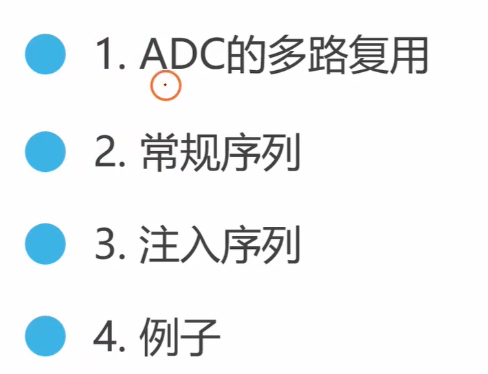
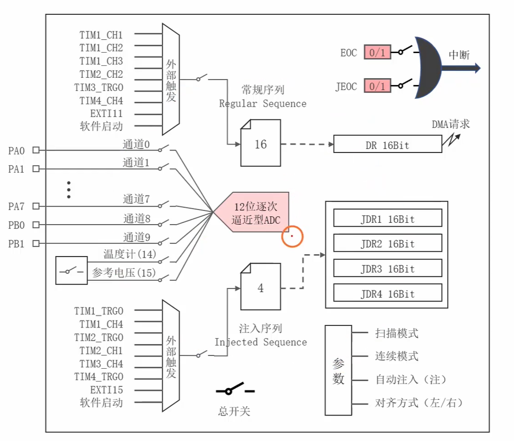
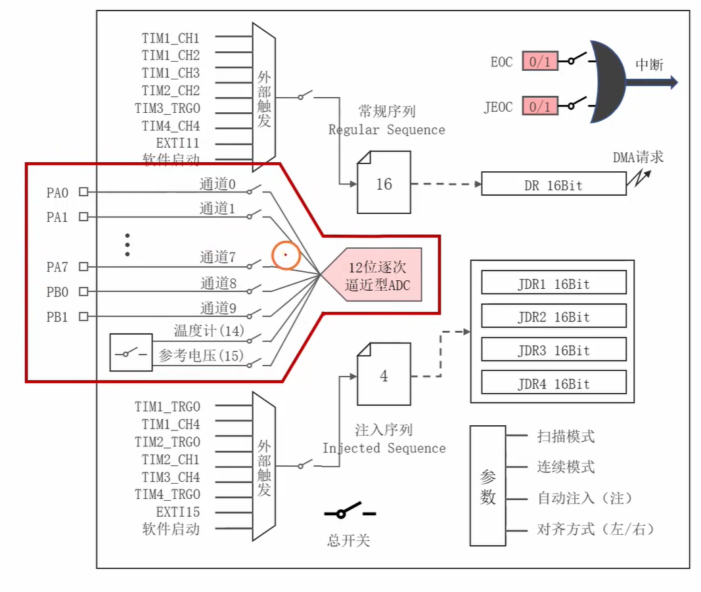
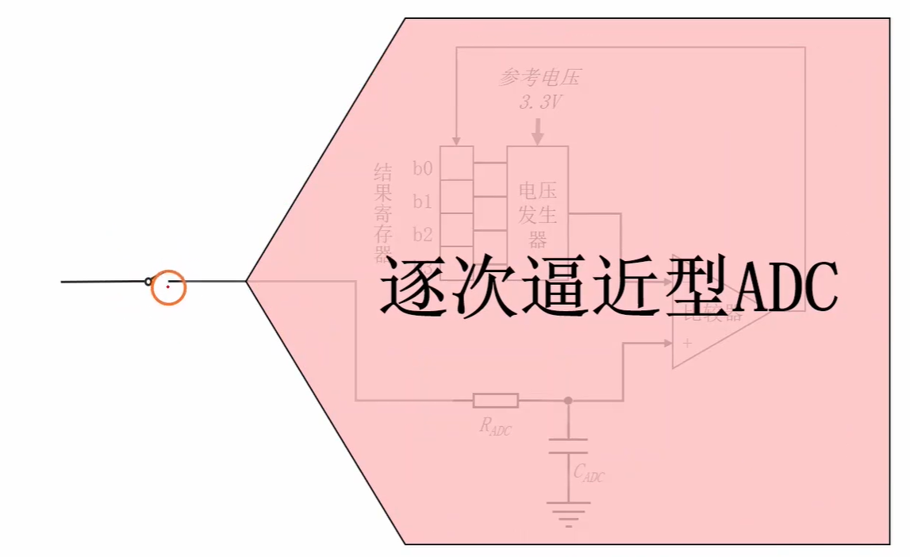
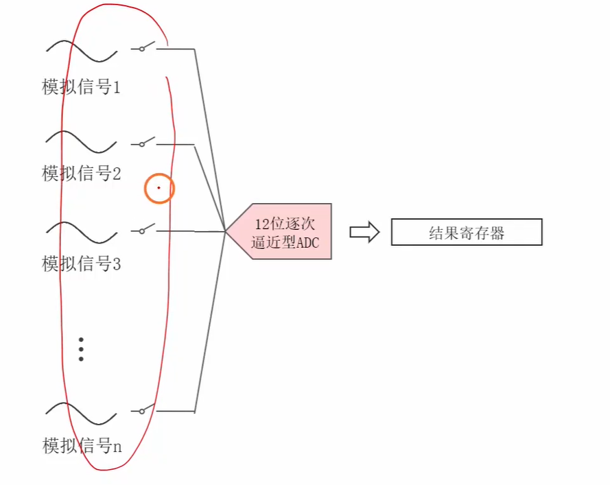

这个视频（时长约25分43秒）详细讲解了微控制器（通常以STM32为例）中**ADC（模数转换器）模块的内部结构框图和工作原理**。对于嵌入式开发来说，理解这个框图是掌握模拟信号采集的核心。

基于视频此时长和经典教学大纲，以下是视频核心内容的结构化总结（附带逻辑时间线）、相关的技术扩展，以及为你量身定制的嵌入式面试题。

### 一、 视频核心内容总结（ADC结构框图解析）

视频通常按照信号流向，将ADC结构框图拆解为以下几个关键部分：

- **[00:00 - 04:00] 引脚输入与多路选择器 (MUX)**

  

  

  

  - 讲解了外部输入通道（如ADCx_IN0 ~ IN15）和内部通道（如内部温度传感器、内部参考电压VREFINT）。
  - 模拟多路开关（MUX）的作用：像一个岔路口，通过程序配置，决定当前哪一个通道的模拟信号能够进入到后级的ADC转换器中。

- **[04:00 - 11:00] 规则组 (Regular Group) 与 注入组 (Injected Group)**

  - **核心重点**：视频详细对比了这两种通道组。
  - **规则组**：相当于“主程序”，最多可以配置16个通道按顺序转换。但它**只有一个16位的数据寄存器（DR）**。
  - **注入组**：相当于“中断程序”，最多4个通道，有**4个独立的数据寄存器（JDRx）**。它可以打断规则组的转换，优先执行。

- **[11:00 - 16:00] 触发源 (Trigger Sources)**

  - 讲解了如何启动ADC转换。除了软件手动触发（写入寄存器位）之外，重点介绍了**硬件触发**。
  - 硬件触发源通常包括定时器（Timer）的更新事件或CCx事件，以及外部中断（EXTI）。这在要求严格等时间间隔采样的场景（如电机控制、DSP信号处理）中极为重要。

- **[16:00 - 21:00] ADC时钟 (ADCCLK) 与 转换时间**

  - ADC内部的逐次逼近型（SAR）电路需要时钟驱动。通常ADCCLK由系统时钟（如APB2）分频而来（最大通常不超过14MHz）。
  - 讲解了转换时间的计算公式：`转换时间 = 采样时间 + 12.5个周期`。

- **[21:00 - 25:43] 数据寄存器、中断与DMA请求 (Data, Interrupt & DMA)**

  - **转换完成标志**：EOC（规则组转换完成）和JEOC（注入组转换完成），可用于触发中断。
  - **模拟看门狗（Analog Watchdog）**：可以设置电压的上下限阈值，如果采集电压越界，硬件会自动触发中断。
  - **DMA请求**：由于规则组只有一个寄存器，多通道扫描时数据容易被覆盖，因此强烈建议配合DMA（直接内存访问）将数据自动搬运到内存中。

------

### 二、 针对视频内容的补充与扩展（实战视角）

为了在面试和实际开发中脱颖而出，你还需要了解框图背后的**工程实践细节**：

1. **逐次逼近型（SAR）ADC的工作本质**
   - STM32的ADC是SAR架构。它的工作原理类似**“二分法猜数字”**。内部有一个比较器和一个DAC，从最高位到最低位依次猜测。12位的ADC需要比较12次，这就是为什么转换时间里固定有“12.5个周期”的原因。
2. **采样时间（Sampling Time）如何选择？**
   - 很多人认为采样时间越短越好（速度快），但在实际工程中，如果外部输入信号的阻抗较大，采样时间过短会导致ADC内部的采样保持电容充不满电，造成测量不准。**原则：信号变化慢、外部阻抗大的，尽量把采样周期设置长一点。**
3. **硬件滤波与软件滤波的结合**
   - ADC很容易受到板级噪声的干扰。除了在硬件上加RC低通滤波器，嵌入式软件工程师必须掌握软件滤波算法：
     - **中位值滤波**：连续采样10次，排序后去掉最大和最小值，取中间的平均（抗脉冲干扰极好）。
     - **一阶滞后滤波**：`本次结果 = a * 本次采样 + (1-a) * 上次结果`（适合平滑低频波动）。

------

### 三、 嵌入式经典面试题精选（带参考回答）

这些问题直接命中ADC的底层机制和工程痛点，建议在理解的基础上用自己的话复述。

**Q1：STM32中ADC的“规则组”和“注入组”有什么区别？**

> **回答**：它们类似于普通程序和中断程序的关系。规则组用于常规的信号采集，最多16个通道，但多个通道共用1个数据寄存器，如果不及时读出数据容易被覆盖；注入组用于突发或紧急的信号采集，最多4个通道，且拥有4个独立的寄存器，可以在规则组转换期间“插队”优先转换。

**Q2：在进行ADC多通道采集时，为什么通常必须配合DMA使用？**

> **回答**：因为STM32的ADC规则组只有一个16位的数据寄存器。在多通道扫描模式下，每转换完一个通道的数据都会存入这个寄存器，如果没有及时被CPU读走，就会被下一个通道转换产生的数据覆盖。使用DMA可以在每次产生EOC（转换完成）信号时，由硬件自动将寄存器中的数据搬运到SRAM数组中，完全不占用CPU资源且不丢数据。

**Q3：什么是ADC的“模拟看门狗”，它有什么实际应用场景？**

> **回答**：模拟看门狗是ADC模块内的一个硬件监控机制。我们可以给它设定一个电压的上限和下限阈值。当ADC采集到的模拟电压超出这个设定的范围时，它会自动触发看门狗中断。**应用场景**：比如电池管理系统（BMS）中的过压/过放保护，或者电机控制中的过流保护。它可以实现纯硬件级别的实时监控，不需要CPU一直在`while(1)`里轮询判断，大大提高了系统的安全性和响应速度。

**Q4：如果要求你实现一个严格间隔1ms的ADC电压采集，你会怎么设计？（高频面试题）**

> **回答**：不能使用软件`delay(1ms)`然后调用软件触发，因为这样会被系统中的中断打断，导致时间不准。正确的做法是：**使用定时器（Timer）作为ADC的硬件触发源**。配置定时器每1ms产生一次更新事件（Update Event）或比较事件（CCx），将该事件映射到ADC的触发通道上。ADC转换完成后触发DMA将数据搬运到内存。整个过程全硬件自动执行，采样时间极其精准。

**Q5：ADC的精度（分辨率）和准确度是一回事吗？如果你的12位ADC测出来的电压总是不准，可能是什么原因？**

> **回答**：不是一回事。精度（分辨率）由位数决定，12位代表把参考电压分成了4096份；准确度是指测量值与真实值的偏差。
>
> 如果测不准，可能的原因有：
>
> 1. **参考电压（VREF）不稳**：ADC的计算基于VDDA/VREF，如果电源纹波大，算出来的值肯定错。
> 2. **采样时间过短**：外部阻抗过大导致电容未充满，应增加采样周期（如从1.5周期增加到239.5周期）。
> 3. **未做校准**：ADC上电后必须先进行一次自校准（Calibration）消除内部电容偏差。
> 4. **缺乏滤波**：未对原始数据进行软件滤波处理。
