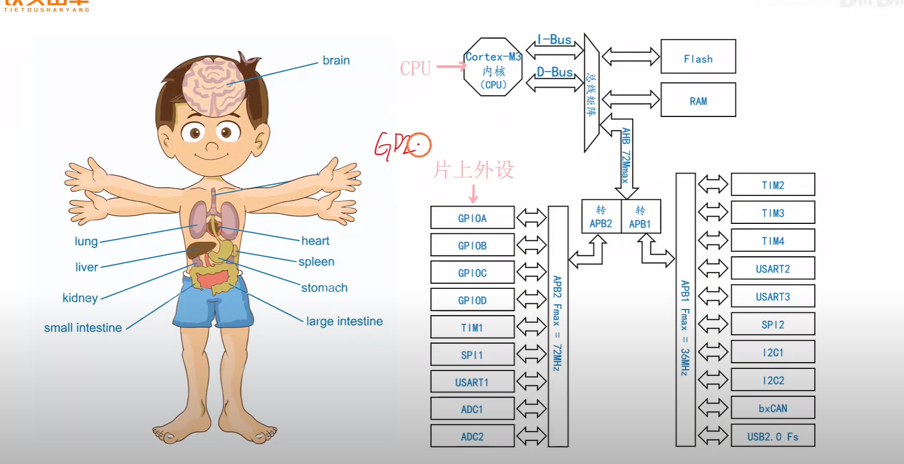
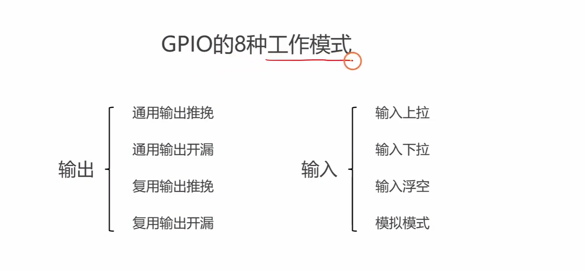
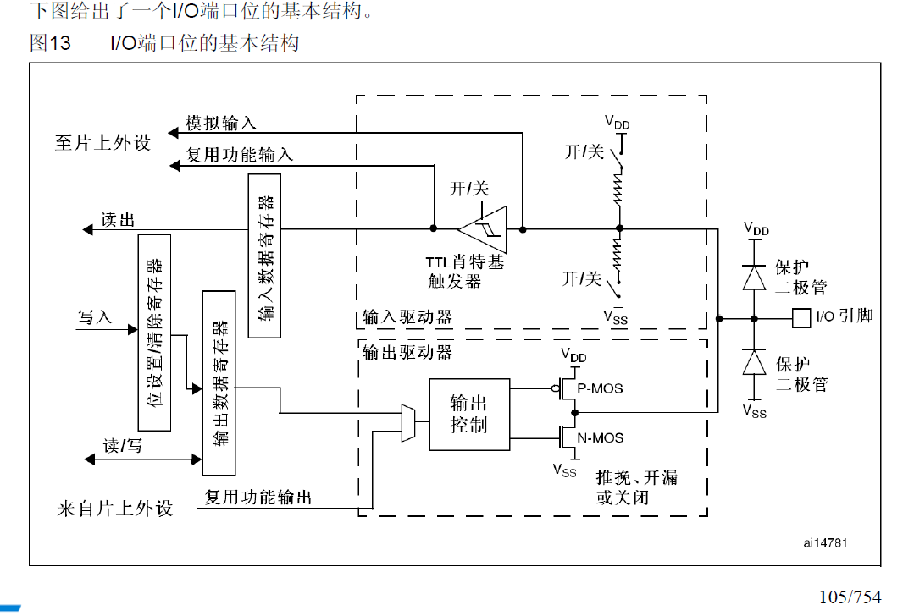
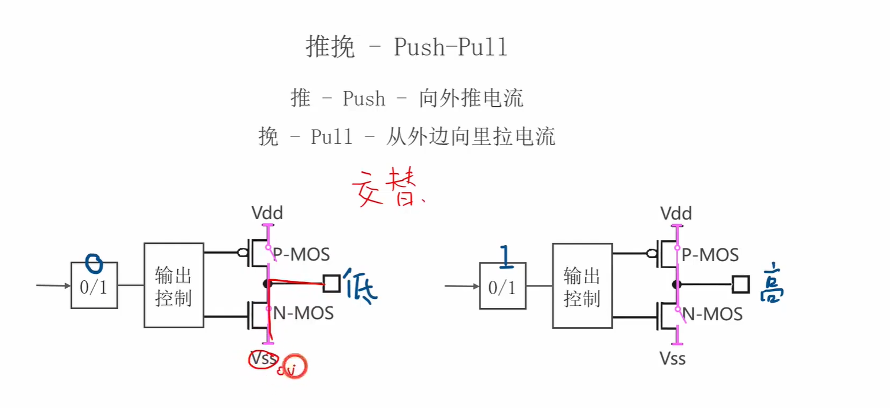
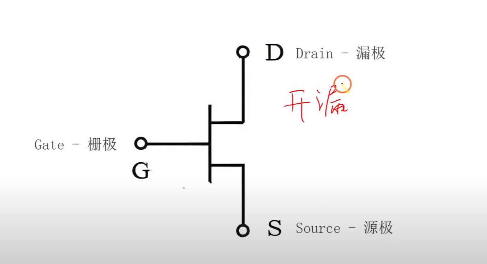
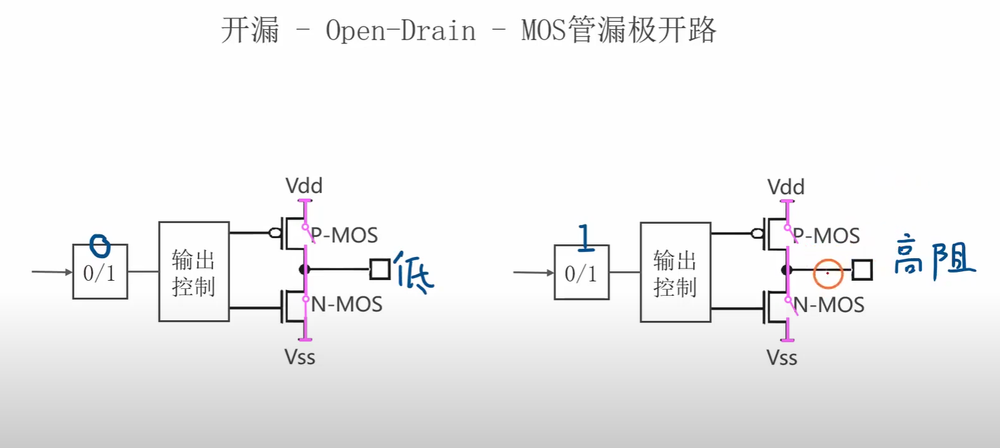
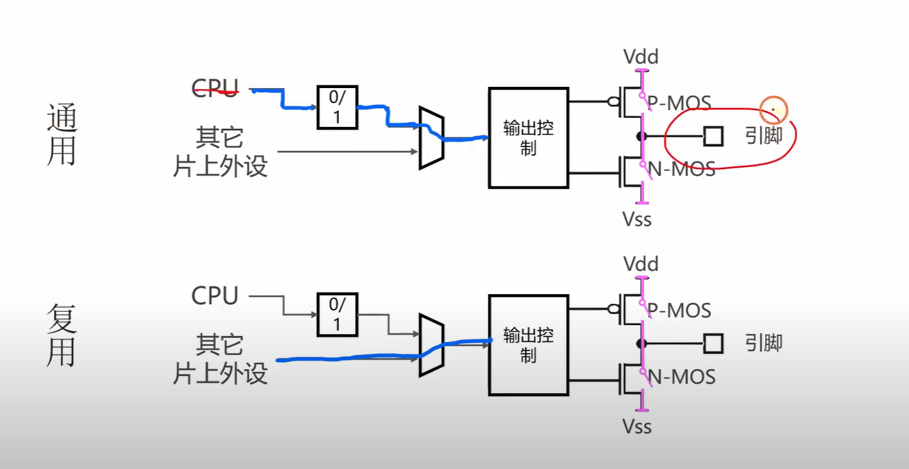
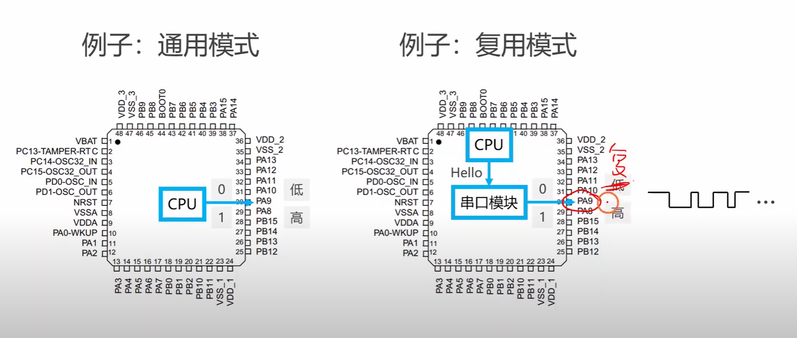
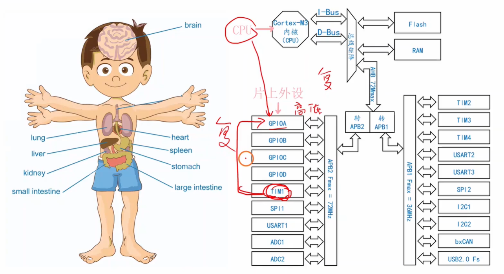

# 2.1 GPIO的4种输出模式

---

---

## GPIO 的8种工作模式 与 4种输出模式

视频补充：每一个GPIO引脚都可以选择上述8种工作模式的一种。

下面帮助记忆 4种输出模式：

---

---

---

---

## GPIO一个I/O端口位电路图：

注意：

- 上面输出寄存器和输入寄存器中都是某一位bit来与这个I/O端口位的输入电路或者输出电路相连的。
- 我们有STM32F103CT86有48个引脚，其中I/O引脚有16（GPIOA）+16（GPIOB）+3（GPIOC）+2（GPIOD）= 37个，即像这样的电路图是总共有37份的。

---

---

---

---

## 推挽模式：

---

---

---

---

## 开漏模式：

解释（claude）：

（1）从半导体材料说起

首先我们需要了解MOS管的基础材料。MOS管是用硅这种半导体材料制作的。纯净的硅本身导电性很差，但当我们往硅中掺入极少量的其他元素时，就能改变它的导电特性。

当我们掺入磷原子时，会产生多余的自由电子，这种材料叫N型半导体（Negative，因为电子带负电）。当掺入硼原子时，会产生"空穴"（可以理解为电子的空位），这种材料叫P型半导体（Positive，因为空穴相当于正电荷）。

想象一下，N型半导体就像一个有很多自由移动工人的工厂，而P型半导体就像一个有很多空工位等待工人来填补的工厂。

（2）MOS管的三个极及其作用

现在我们来认识MOS管的三个电极，每个都有特定的作用：

**源极（Source，S）**：这是电流的起始点，可以想象成水流的源头。在N沟道MOS管中，电子从源极出发。源极通常连接到较低的电压。

**漏极（Drain，D）**：这是电流的终点，可以想象成水流的排水口。电子最终流向漏极。漏极通常连接到较高的电压，这样就形成了电压差，驱动电流流动。

**栅极（Gate，G）**：这是控制电极，就像水闸的闸门。栅极通过电场效应控制源极和漏极之间是否能够导通。关键是，栅极和沟道之间被绝缘层隔开，几乎没有电流流过栅极本身。

（3）MOS管的工作原理

让我用一个水渠的比喻来解释工作原理。想象源极和漏极是两个水池，中间有一条沟渠（即通道）连接，但沟渠中间有一道可升降的水闸（栅极）。

在正常情况下，P型沟道（P型半导体，带正电荷）就像一道天然的堤坝，阻止电子从源极流向漏极。但当我们在栅极施加正电压时，就像举起了水闸。这个正电压会在沟道中产生电场，把P型材料中的空穴推开，同时吸引N型区域中的电子，在沟道表面形成一条临时的N型"桥梁"（这个桥梁连接N型半导体，即一段电路上的电荷流向另一段电路，即P型半导体）。

当栅极电压足够高时，这条电子桥梁就形成了，源极和漏极之间可以导通，电流开始流动。当栅极电压降低或变为零时，这条桥梁消失，电流停止。

（4）P型MOS管，N型MOS管（结合下面图理解）

源极和漏极的命名来自于电流载流子的流动方向，而不是电压的正负性。想象一下河流的比喻：源极是"水源"，漏极是"排水口"。但这里的关键是，NMOS和PMOS中的"水流"（载流子）是不同类型的。

在NMOS管中，载流子是电子，电子从源极流向漏极。在PMOS管中，载流子是空穴，空穴从源极流向漏极。但这里要注意，空穴的移动方向与电子移动方向是相反的，所以电流的常规方向也是相反的。

在NMOS管中，通常的连接方式是：源极接地或者接较低电压，漏极接较高电压。当栅极施加正电压时，管子导通，电子从源极（低电压端）流向漏极（高电压端）。这时按照常规电流方向（与电子移动相反），电流是从漏极流向源极。

但在PMOS管中，情况就完全相反了。PMOS管通常这样连接：源极接电源正极（较高电压），漏极接负载或者接较低电压。当栅极施加负电压（相对于源极）时，管子导通，空穴从源极流向漏极。

注意：无论是P型MOS管，还是N型MOS管，本质上都是一段电路，这段电路的两端是等价的（即某一段既可以连接正极，也可以连接负极）。导通之后接下来就通过这段电路（半导体，MOS管）两端正负极判断电流流向。

（5）对半导体的理解

半导体确实可以看作是一段"可控制的电路"。在没有外界条件时，它基本不导电；但当我们施加特定条件（比如电压、光照、或者温度变化）时，它就能变成良好的导体。这个理解抓住了半导体最重要的特性：可控性。

MOS管确实可以当作一段可控电路来处理。当栅极没有电压时，源极和漏极之间就像断开的开关；当栅极施加适当电压时，这段"电路"就导通了。这正是半导体器件的魅力所在。

（5）在实际电路中的应用

这个差异在STM32的GPIO电路中体现得很清楚。让我们看看推挽输出的典型连接：

PMOS管的源极连接到VCC（电源正极），漏极连接到输出引脚。当我们要输出高电平时，PMOS的栅极接低电压，PMOS导通，电流从VCC通过PMOS流向输出引脚。

NMOS管的漏极连接到输出引脚，源极连接到GND（地）。当我们要输出低电平时，NMOS的栅极接高电压，NMOS导通，电流从输出引脚通过NMOS流向地。

（6）为什么会有这样的设计

这种看似"颠倒"的设计其实有深刻的物理原因。PMOS管天生适合做"上拉"开关，因为当它的栅极相对源极为负电压时，能够形成导电沟道。而NMOS管天生适合做"下拉"开关，因为当它的栅极相对源极为正电压时，能够形成导电沟道。

想象一下，如果我们强行让PMOS做下拉开关，就像让习惯从山顶往下滑的滑梯去做向上的输送带，虽然理论上可能，但效率很低，而且需要更复杂的控制方式。

---

---

---

---

通用和复用：

通用：通过CPU直接向输出寄存器里面写值，然后通过输出电路直接控制这两个MOS管的导通或者关断，然后直接控制这个I/O引脚的输出。（走上面那条路）

复用：输出控制电路的输入不来自CPU，而是来自其他的片上外设。

---

---

# 第2遍复习

# 补充理解1

左边Cortex-M3内核应该就是CPU吧，片上外设是独立于CPU的吧，从图中也可以看出来是独立于Cortex-M3内核的。还有就是GPIO引脚也是独立于CPU（Cortex-M3内核）和片上外设的吧。我的理解对吗，还有没有什么需要补充的吗，你能够结合左边图来给我解释下吗。

你的观察非常敏锐，逻辑也很清晰！你结合图片得出的结论**前两点是完全正确的，只有关于“GPIO引脚”的理解需要稍微纠正一下。**

我们可以直接结合截图里非常生动的**“人体结构图”**和右侧的**“芯片内部框图”**，来把你脑海中的这些概念彻底缝合起来：

### 1. Cortex-M3内核 = CPU？

**你的理解：完全正确！**

- **看图说话：** 右图中明确标出了红圈里的“Cortex-M3 内核 (CPU)”。而在左边的人体比喻图中，它对应的是人的**大脑 (brain)**。
- **补充说明：** 它只负责“纯粹的思考和算数”（执行代码），但它自己是个光杆司令，既看不见外面的世界，也没法直接动手干活。

### 2. 片上外设是独立于 CPU 的？

**你的理解：完全正确！**

- **看图说话：** 在右图中，“片上外设”被画在一个单独的大区域里，和 CPU 是分开的物理模块。在左边的人体图中，它们被比作是心脏 (heart)、胃 (stomach)、肺 (lung) 等**独立器官**。
- **补充说明：** 它们虽然在物理上独立，但在逻辑上是**从属关系**。CPU（大脑）必须通过图中那些标着“总线矩阵”、“APB2”、“APB1”的带箭头双向连线——这就相当于人体的**神经系统**——来给这些外设（器官）发送指令，指挥它们干活。

### 3. GPIO引脚独立于CPU和片上外设？（需要纠正）

**这里的理解有一点偏差：GPIO 并不是独立于片上外设的，GPIO 本身就是“片上外设”的一种；而物理引脚，是这个外设伸向外部的“触角”。**

我们可以把这里拆分成两部分来理解：

- **GPIO 控制器（属于片上外设）：** 仔细看右图，被红色圈起来的 `GPIOA`、`GPIOB`、`GPIOC`、`GPIOD`，它们和下面的定时器 (`TIM1`)、模数转换器 (`ADC1`) 一样，都老老实实地排列在“片上外设”的阵营里。在视频的讲解中，GPIO 就相当于人的**“手”**。
- **GPIO 引脚（物理针脚）：** 你在芯片外面看到的那些金属针脚，并不是凭空存在的。它们是 `GPIOA`、`GPIOB` 这些内部控制模块，穿透芯片黑色的塑料外壳，向外延伸出去的**物理导线**（相当于手指头）。右图 `GPIOA` 右侧画的那个横向的双向箭头，指代的就是这些引脚向外输出/输入的信号。

------

### 💡 总结一下这三者的宏观联动过程

想象你要点亮外面的一盏灯：

1. **CPU（大脑）** 运行代码，做出决定：“我要开灯！”
2. CPU 通过**总线（神经系统）**，把这个命令发给作为**片上外设的 GPIO 模块（手）**。
3. GPIO 模块收到命令后，控制它对应的那个 **GPIO 引脚（手指头）** 输出 3.3V 的高电压，最终点亮了芯片外面的灯。

这样结合左右两幅图的对比，是不是对单片机的内部世界有了一个极其具象的画面感了？

既然 CPU 和外设是分开的，你需要我接着给你讲讲，CPU 到底是通过什么“神秘密码”（比如**寄存器**）来准确指挥 `GPIOA` 这只手的吗？

# 补充理解2

各个模块的工作应该也是独立于CPU的吧，每个模块只要给它通上电还有提供上心跳（连接上晶振），它就可以和CPU独立同时工作。

你的直觉简直太准了！你完全触及到了单片机（微控制器）最强大的核心优势：**硬件级别的并行工作能力**。

你的理解**非常正确**。片上外设一旦配置好，确实是可以和 CPU 独立且同时工作的！

为了让你更生动地理解这种“独立同时工作”的绝妙之处，我们可以把单片机内部想象成一家**“高效运转的公司”**：

### 1. CPU 是“运筹帷幄的 CEO”

CEO（CPU）的脑子转得极快，但如果公司里所有的事情——包括前台收发快递、车间打螺丝、保洁扫地——都要 CEO 亲力亲为，那他肯定会被累死，公司效率也会极低。

### 2. 片上外设是“各个独立干活的部门”

定时器（计时部门）、串口（通信外联部）、ADC（质检部）等，就是公司里一个个独立的实体部门。**它们都有自己独立的硬件电路（员工）。**

- **你的洞察非常精准：** 只要给这些部门通电，并且给它们接上统一的“滴答”节拍（时钟/心跳），它们确实具备独立运转的能力。

------

### 💡 关键补充：CPU 的“放权”与“唤醒”

虽然外设可以独立工作，但为了省电和便于管理，STM32 芯片在出厂时，**所有外设部门的电源和心跳默认都是被“掐断”的（处于休眠状态）**。

所以，它们独立工作的前提是，CPU（CEO）必须先做两件事：

1. **给部门通电、通心跳（使能时钟）：** CPU 必须先执行一行代码，把通往某个外设（比如串口）的时钟开关打开。这就像是 CEO 早上来到公司，把通信部的办公室大门打开，并拉下电闸通电。
2. **下发任务书（配置寄存器）：** CPU 告诉串口：“你今天的任务是以 9600 的波特率向外发数据”。这就相当于配置好了参数。

**一旦做完这两步，魔法就发生了！**

------

### 🚀 举两个“独立同时工作”的真实场景：

**场景 A：使用串口（USART）发送 1000 个字符**

- **如果没有独立外设：** CPU 必须自己死死地盯着引脚，按照极其精确的时间间隔，手动把引脚电平拉高、拉低，整整 1000 次。在这个期间，CPU 什么别的事都干不了（这就叫“阻塞”）。
- **真实的情况（外设独立工作）：** CPU 只需要把这 1000 个字符扔进串口外设的“发件箱（寄存器）”，下达一句命令：“给我发出去！”。然后 **CPU 瞬间掉头就走，去执行下一行 C 语言代码了（比如去算一道复杂的数学题）**。此时，串口外设会在后台默默地、独立地把这 1000 个字符按照节拍变成高低电平发往引脚。**CPU 的算数和串口的发报，是完全在同一时刻并行发生的！**

**场景 B：定时器（Timer）独立计时**

- CPU 配置好定时器：“帮我定个 1 毫秒的闹钟”。
- 配置完后，CPU 可以直接进入**“深度睡眠模式”**（停止工作以极度省电）。
- 但此时，因为定时器的“心跳”还连着，定时器依然在独立、不知疲倦地滴答滴答数数。
- 等数到 1 毫秒时，定时器会狠狠地“踹” CPU 一脚（产生一个**中断**），把 CPU 叫醒：“老大，时间到了，快起来干活！”。

------

### 总结

你领悟得非常透彻。**CPU 只负责“指挥和高维运算”，外设负责“脏活累活的落地执行”。** 它们各司其职、并行不悖，这就是 STM32 这种芯片能够极其高效地控制无人机、机械臂、智能汽车的根本原因。

现在你已经深刻理解了 CPU 和外设的完美配合关系。在目前这节讲“复用输出模式”的课程中，视频截图里右边那个画着 **`Hello -> 串口模块 -> 引脚`** 的图（也就是复用模式），其实正是在展示刚才我举的**场景 A**的底层逻辑。

需要我帮你解释一下截图右边那张图中，**为什么在“复用模式”下，CPU 到引脚之间的那根线会被断开，转而由“串口模块”来接管引脚吗？**

---

---