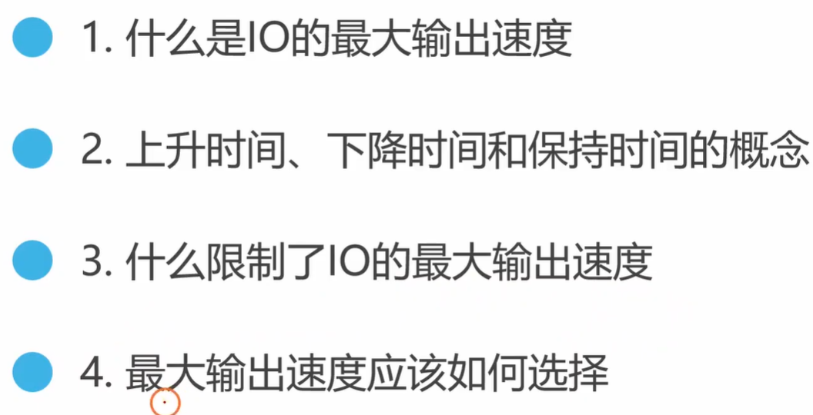
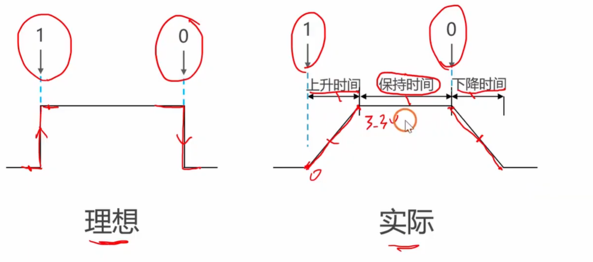
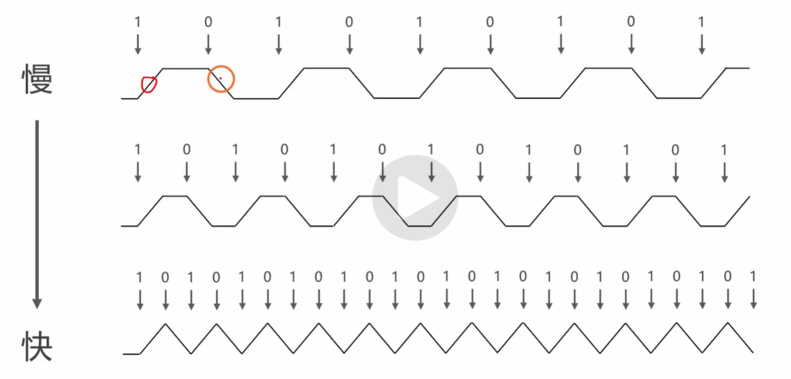
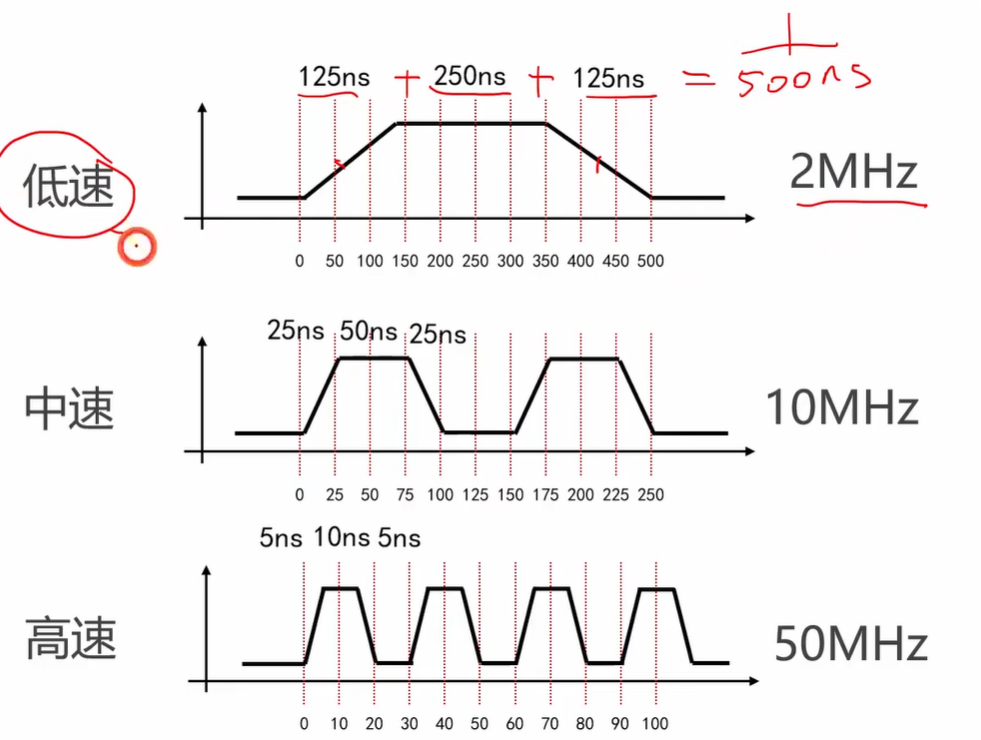
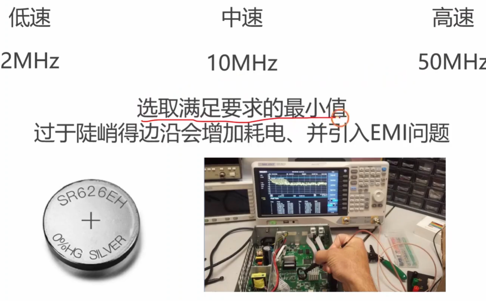

# 视频总结：[stm32 入门教程 第四版 06 GPIOIO的最大输出速度](https://www.youtube.com/watch?v=yWxpvSd7rgA)

在本节视频中，“铁头山羊”主要讲解了 STM32 中 GPIO 引脚的“最大输出速度”概念、底层原理，以及在实际编程中如何正确选择输出速度。

- **[00:54 Opens in a new window ](http://www.youtube.com/watch?v=yWxpvSd7rgA&t=54) 什么是 IO 的最大输出速度？**

  - 假设以推挽模式为例，单片机引脚交替输出高电平（1）和低电平（0）。当交替频率（即写0和写1的速度）不断加快，直到波形失真、无法正常输出有效电平时的那个临界频率，就是该引脚的**最大输出速度**。

    

- **[02:32 Opens in a new window ](http://www.youtube.com/watch?v=yWxpvSd7rgA&t=152) 上升时间、下降时间与保持时间的图解：**

  - **理想情况**：电平切换是瞬间完成的（从 0V 瞬间到 3.3V）。

  - **实际情况**：电压变化需要时间。

    - **上升时间**：从 0V 缓慢爬升到 3.3V 所需的时间（上升斜坡）。
    - **下降时间**：从 3.3V 缓慢降落到 0V 所需的时间（下降斜坡）。
    - **保持时间**：中间维持有效高/低电平的时间。

    

- **[03:47 Opens in a new window ](http://www.youtube.com/watch?v=yWxpvSd7rgA&t=227) 是什么限制了最大输出速度？**

  - 当输出频率加快时，上升沿和下降沿的斜坡距离会变短，导致“保持时间”越来越少。
  - 结论：**上升时间和下降时间的短长，决定了引脚最大输出速度的上限。** 想要输出更快的频率，就必须减小上升/下降时间，让波形的斜率变得更陡峭。

  

- **[05:54 Opens in a new window ](http://www.youtube.com/watch?v=yWxpvSd7rgA&t=354) 实际编程中如何选择最大输出速度？**

  - STM32 提供了 3 个输出速度档位：

    - **低速 (2MHz)**：上升/下降时间各 125ns。

    - **中速 (10MHz)**：上升/下降时间各 25ns。

    - **高速 (50MHz)**：上升/下降时间各 5ns。

      

  - **选择原则：选择“恰好满足需求”的最小值。**

    - 为什么不一律选最高速 (50MHz)？1. 速度越高功耗越大（对电池供电不利）；2. 速度过高（边沿太陡）会产生更强的电磁干扰 (EMI)，影响其他元器件。

    

- **[08:13 Opens in a new window ](http://www.youtube.com/watch?v=yWxpvSd7rgA&t=493) 场景举例分析：**

  1. **驱动 LED 灯**：人眼的闪烁临界频率仅约 45.8Hz，LED 闪烁通常不超过 100Hz，因此选择**低速 (2MHz)** 绰绰有余。
  2. **SPI 通信连接编码器**：某芯片要求 SPI 波特率为 8Mbps（约 8MHz），此时应选择**中速 (10MHz)**。
  3. **USB 2.0 全速接口**：通信波特率高达 12Mbps（约 12MHz），此时中速已无法满足，必须选择**高速 (50MHz)**。

------

总结来说，配置 GPIO 速度时“够用就好”，盲目追求最高速反而会带来功耗和干扰问题。接下来，你是否需要我为你播放下一集 **“[stm32 入门教程 第四版 07 GPIOLED闪灯实验](https://www.google.com/search?q=https://www.youtube.com/watch%3Fv%3D680OOfwE4YQ%26list%3DPLen6JNT7Cx3BaIbxkUfWayXsMlbU3Yisj%26index%3D7)”**，看看如何在代码里实际应用这些理论？

# 补充提问

## 提问1    **LED 驱动速度选择**（为什么选低速就够了）

**驱动 LED 灯**：人眼的闪烁临界频率仅约 45.8Hz，LED 闪烁通常不超过 100Hz，因此选择**低速 (2MHz)** 绰绰有余。这句话我不是太懂，你能够给我详细解释下吗，最好能够举个例子来让我彻底弄明白。

这句话非常经典，它完美地解释了工程学中一个很重要的原则：**“杀鸡焉用牛刀”（够用就好）**。

这句话其实包含了**生物学**和**电子学**两个层面的知识。我们把它拆解开，用生活中的例子来让你彻底弄明白。

### 1. 什么是“人眼的闪烁临界频率 (约 45.8Hz)”？

- **Hz (赫兹) 是什么：** 就是“每秒钟发生多少次”。
- **人眼的“bug” (视觉暂留)：** 我们的人眼是有极限的。如果一个灯在你面前一亮一灭，当它每秒钟闪烁超过大概 46 次（45.8Hz）时，你的大脑就反应不过来了。你的眼睛会把这些断断续续的光“融合”在一起，**你会觉得这盏灯是“一直亮着”的，根本看不出它在闪**。
- **💡 生活中的例子：** 电影院的电影其实是一张一张静止的图片，每秒钟播放 24 张（24Hz）。因为放得足够快，我们就看到了连续的画面。我们家里的日光灯，其实由于交流电的原因，每秒钟在闪烁 100 次（100Hz），但你肉眼看它就是一直亮着的。

### 2. 为什么说“LED 闪烁通常不超过 100Hz”？

在单片机开发中，我们控制 LED 灯通常只有两种目的：

1. **让它肉眼可见地闪烁：** 比如做个警车报警灯，或者指示灯，每秒钟闪个 1~5 次（1~5Hz）就足够让人看清了。
2. **让它变暗或变亮（呼吸灯）：** 这时我们会用到一种叫 PWM 的技术，就是让灯极快地闪烁来骗过人眼，从而产生“亮度变暗”的错觉。为了让人眼看不出闪烁，我们一般把闪烁频率设置在 100Hz 左右就完全足够了。

### 3. 什么是“低速 (2MHz) 绰绰有余”？

- **2MHz 有多快？** 1MHz（兆赫兹） = 1,000,000 Hz（一百万赫兹）。所以，2MHz = **每秒钟 2,000,000 次！**
- **对比一下数字：** 我们哪怕是做最复杂的呼吸灯，只需要每秒钟让引脚变化 **100 次**。而 STM32 芯片提供的“最低速”档位，能够保证引脚每秒钟稳定变化 **2,000,000 次**！

------

### 🚗 终极例子：用“送快递”来比喻

想象一下，你要去隔壁小区送一个快递（控制 LED 灯）：

- **你的需求：** 只要在 **1 小时**内送到就行了（100Hz，要求很低）。
- **STM32 提供的三种交通工具（输出速度）：**
  - **低速档 (2MHz)：** 骑电动车，只需 **1 分钟** 就能送到。
  - **中速档 (10MHz)：** 开法拉利跑车，只需 **10 秒** 就能送到。
  - **高速档 (50MHz)：** 坐火箭，只需 **1 秒** 就能送到。

既然你选“电动车（低速档）”都已经远远超出了你的需求（绰绰有余），为什么还要选“坐火箭（高速档）”呢？

如果选了火箭，不仅极度**费油（增加芯片功耗）**，而且火箭发射时的巨大噪音还会**吵到周围的邻居（产生电磁干扰 EMI，干扰电路板上的其他元件）**。

**总结：**

因为控制 LED 灯对速度的要求极低（最大 100 赫兹），而单片机哪怕是最慢的输出速度（200 万赫兹）也是它的两万倍。所以，为了省电和减少干扰，控制 LED 灯时无脑选择“低速档”就可以了。

这个解释有帮你解开疑惑吗？需要我为你播放这套教程的下一集，看看我们在写代码时，是**怎么具体去把某个引脚配置成“推挽输出 + 低速 2MHz”的**吗？

## 提问2     **SPI 通信速度选择**（为什么 8MHz 要选中速）

**SPI 通信连接编码器**：某芯片要求 SPI 波特率为 8Mbps（约 8MHz），此时应选择**中速 (10MHz)**。这句话我不是太懂，你能够给我详细解释下吗，最好能够举个例子来让我彻底弄明白。

这句话其实是在讲硬件通信中**“木桶效应”**和**“恰到好处”**的原则。

为了让你彻底弄明白，我们先要把这句话里的几个专业词汇“翻译”成大白话，然后再举一个生活中的例子。

### 1. 词汇大翻译

- **SPI 通信：** 它是单片机和外部芯片（比如这里的编码器）之间的一种“交流语言”。你可以把它想象成两个人在**打电报（发摩斯密码）**，完全靠引脚电压的“高（1）”和“低（0）”来传递信息。
- **波特率 8Mbps (约 8MHz)：** 这是打电报的**速度要求**。8Mbps 意味着外部的芯片要求单片机：**“你每秒钟必须给我发送 800 万个‘0’或‘1’！”** 也就是说，单片机的引脚电压每秒钟得上下翻转 800 万次。

### 2. 为什么一定要选中速 (10MHz)？

既然知道了需求是“每秒翻转 800 万次”，我们来看看 STM32 单片机提供的三个“速度档位”会发生什么：

- **如果选低速 (2MHz)：** 单片机引脚拼了老命，每秒最多也只能翻转 200 万次。
  - **后果：** 动作太慢，跟不上 800 万次的需求。原本应该是方方正正的高低电平波形，会因为引脚“升不上去、降不下来”而糊成一团。外部芯片根本认不出这是什么信号，**通信直接失败。**
- **如果选中速 (10MHz)：** 引脚每秒最多能翻转 1000 万次。
  - **结果：** 1000 万次的上限刚好大于 800 万次的需求，单片机表示：“没问题，我能轻松胜任。” **通信完美成功。**
- **如果选高速 (50MHz)：** 引脚每秒能翻转 5000 万次。
  - **后果：** 虽然也能完美通信，但属于**“杀鸡用牛刀”**。引脚翻转得太过猛烈（边缘极度陡峭），会在空气中散发出多余的电磁波（产生 EMI 干扰），可能会干扰到电路板旁边无辜的传感器，同时还会白白浪费更多的电量。

------

### 🚚 举个最直观的例子：工厂送货

假设单片机是一家**物流公司**，编码器是**客户**。

- **客户的需求（8MHz）：** 客户要求你**每小时必须送 8 趟货**，不能多也不能少。
- **你手里的交通工具（GPIO 输出速度）：**
  1. **拖拉机（低速 2MHz）：** 每小时最多只能送 2 趟。—— *跟不上客户要求，直接被投诉退单（通信失败）。*
  2. **小货车（中速 10MHz）：** 每小时最多能送 10 趟。—— *刚好能满足每小时 8 趟的需求，油耗合理，平稳安全（完美匹配）。*
  3. **F1赛车（高速 50MHz）：** 每小时能送 50 趟。—— *虽然也能送 8 趟，但是赛车极其费油（费电），而且在路上轰鸣声巨大，容易引发交通事故或者扰民（产生电磁干扰 EMI）。*

**总结一下：**

因为 8MHz 的速度需求超过了低速档（2MHz）的极限，所以我们必须升级档位；但为了避免不必要的干扰和耗电，我们不选最高档（50MHz），而是选择刚好能包容 8MHz 需求的**中速档（10MHz）**。

这就是硬件开发中最精髓的原则：**刚刚好，才是真的好。** 现在这句话的逻辑是不是完全打通了？

## 提问3    **时钟频率、波特率与 IO 速度的区别**（三大速度概念解析）

我记得好像还有个时钟频率，波特率，IO引脚最大输出速度，这3个东西有什么区别以及联系吗。我不是太懂，你能够给我详细解释下吗。

这个问题总结得太精辟了！在单片机开发中，这三个带“速度”和“频率”的概念最容易让人混淆。

如果把单片机往外发送数据比作**“一个工厂向外发货”**，这三个概念其实分别对应了工厂里**三个不同环节的速度**。我们用这个比喻来把它们彻底拆解开：

------

### 1. 时钟频率 (Clock Frequency) —— “工厂的内部心跳/引擎转速”

- **它是什么：** 它是整个单片机（或者某个内部外设）运转的最基础、最根本的节拍。就像是工厂里流水线的**主电机转速**。
- **它的角色：** 无论是 CPU 算数，还是串口准备发送数据，都必须踩着这个时钟节拍来。在 STM32F103 中，最高系统时钟频率是 **72MHz**（每秒滴答 7200 万次）。
- **类比：** 工厂的流水线每秒钟能咔嚓咔嚓运转 7200 万次。这是系统**内部**能达到的绝对速度上限。

### 2. 波特率 (Baud Rate) —— “和客户约定的发货速度”

- **它是什么：** 它是两个设备之间（比如单片机和传感器）进行**通信交流时的“语速”**。它规定了每秒钟实际在这根导线上发送多少个信号（比如每秒发送 9600 个，或者 800 万个）。
- **它的角色：** 波特率是**由内部的“时钟频率”分频（减速）得来的**。外设会根据内部时钟，按照一定的比例放慢，达到想要的波特率。
- **类比：** 虽然工厂流水线很快（72MHz），但客户（外部芯片）处理不了那么快。于是你和客户约定好：“我每秒钟只给你发 800 万个包裹（8MHz 波特率）”。

### 3. IO 引脚最大输出速度 —— “工厂大门的开关速度（物理极限）”

- **它是什么：** 就是刚刚视频里讲的，引脚**物理层面**上完成一次电压从 0V 升到 3.3V，再从 3.3V 降到 0V 的极限能力（由上升时间和下降时间决定）。
- **它的角色：** 这是物理硬件的最后一道关卡。无论你内部流水线多快，也无论你和客户约定得多快，最终包裹都得从这个物理大门送出去。
- **类比：** 工厂的电动大门打开和关上需要时间。
  - **低速 (2MHz)：** 大门比较笨重，每秒最多开合 200 万次。
  - **中速 (10MHz)：** 大门升级了，每秒最多开合 1000 万次。
  - **高速 (50MHz)：** 顶级大门，每秒开合 5000 万次。

------

### 💡 核心：这三者是如何产生“化学反应”（联系）的？

它们三者是一个**由内而外的“木桶效应”传输链**：

**时钟频率（发动力） ➡️ 决定 ➡️ 波特率（通信要求） ➡️ 依赖 ➡️ IO输出速度（物理大门）**

**如果发生冲突会怎样？（举个例子）**

假设单片机（内部时钟很强）要用 SPI 和编码器通信，客户要求的 **波特率是 8MHz**（每秒发 800 万个数据）：

1. **内部时钟必须够快：** 如果单片机内部主频只有 4MHz，那绝对跑不到 8MHz 的波特率（内部流水线转冒烟了也跟不上）。所以内部时钟必须大于波特率。
2. **大门必须能跟上（IO速度）：** 你和客户约定了每秒 800 万次发货（波特率 8MHz），但如果你把引脚配置成了 **低速 2MHz（笨重大门）**，结果就是：包裹在门口全挤成了肉饼（波形失真成一条直线），客户什么都收不到！
3. **正确做法：** 把 IO 引脚配置成 **中速 10MHz**。大门每秒能开合 1000 万次，完美包容 800 万次的波特率需求，同时又不会因为换成 50MHz 的大门而浪费电和产生噪音（电磁干扰）。

### 总结一句话：

**时钟频率**是单片机的“内部体力”，**波特率**是你用这份体力去“说话的语速”，而 **IO 速度**是你“嘴唇开合的物理极限”。嘴唇开合的极限必须能跟得上你说话的语速，别人才能听清！

把这三层关系打通，你在后续写代码时遇到各种时钟和速度配置，就能做到胸有成竹了。你想继续看看下一集 **“07 GPIO LED 闪灯实验”**，亲自感受一下这些代码是怎么写出来的吗？

## 提问4 **同步通信与异步通信的“波特率”**（是否有波特率之分）

波特率是针对于异步通信比如UART的吧，同步通信是不是也有个类似的波特率的概念呢？

你的理解非常精准！你已经抓住了串行通信的本质差异。

严格来说，**“波特率（Baud Rate）”确实主要是针对于异步通信（如 UART）的概念**。

而在同步通信（如 SPI、I2C）中，虽然也有衡量速度的概念，但我们通常不叫它波特率，而是叫它 **“时钟频率（Clock Frequency）”** 或 **“比特率（Bit Rate）”**。

让我为你详细拆解一下这两者背后的底层逻辑：

### 1. 异步通信（如 UART）：为什么必须有“波特率”？

- **痛点：没有统一的心跳（“盲发盲收”）。** 在 UART 通信中，发送方和接收方之间只有数据线（TX/RX），**没有时钟线**。
- **波特率的作用：提前对好暗号。** 因为没有一根线来实时告诉对方“我现在发了一个数据，你快读”，所以双方必须在通信前**强制约定好一个绝对的速度**（比如 9600 波特率）。
- **如何工作：** 接收方会自己准备一个极其精准的内部秒表，按照事先约定好的时间间隔（比如每隔 104 微秒），准时去数据线上“抓取”一次电平。如果两边约定的波特率有一点点误差，数据抓错位了，你屏幕上收到的就会全是乱码。

### 2. 同步通信（如 SPI、I2C）：它的“波特率”是什么？

- **特点：自带节拍器（时钟线）。** 同步通信除了数据线，必定还会拉一根专门的时钟线（比如 SPI 的 `SCK`，I2C 的 `SCL`）。这根线就像是交响乐团里的指挥棒。
- **替代概念：时钟频率（Clock Frequency）。**
- **为什么不需要波特率：** 因为有了这根时钟线，接收方根本不需要提前约定速度，也不用自己掐表计时。主机每次在数据线上放好一个数据，就会在时钟线上制造一个“跳变沿（电压起伏）”。从机**只需要死死盯着时钟线，时钟线“跳”一下，它就去数据线上读一位数据**。
- **速度谁说了算：** 同步通信的速度完全由主机在时钟线上发出的**频率**决定。主机发得快，从机就跟着快读；主机突然停下，从机就挂起等待。比如你之前提到的“SPI 某芯片要求波特率为 8Mbps”，更严谨的工程师术语其实是**“要求 SPI 的时钟频率为 8MHz”**（每秒提供 800 万个时钟节拍，对应传输 800 万个比特位）。

------

### 💡 一个容易混淆的行业黑话（波特率 vs 比特率）

在很多工程师的日常交流，甚至一些芯片厂商的数据手册里，你依然会看到“SPI 波特率设置”这样的字眼。这其实是一种**约定俗成的“混用”**。

- **比特率（Bit Rate）：** 每秒传输的二进制数（0或1）的数量。
- **波特率（Baud Rate）：** 每秒信号状态改变的次数（常用于调制解调器等模拟信号）。

但在我们普通的单片机数字通信（UART、SPI、I2C）里，每一次信号状态改变刚好就代表了 1 个二进制位（1 Baud = 1 Bit）。因为**它们在数值上是 1:1 绝对相等的**，所以大家为了图省事，经常把“SPI 每秒传多少比特的速率”随口叫成了“SPI 的波特率”。

**总结一下：**

你的硬件直觉非常准，异步通信靠**“事先约定波特率”**来盲猜节奏，同步通信靠**“实时发送时钟频率”**来手把手带节奏。

了解了这层关系，你在以后配置单片机时，看到 UART 找波特率寄存器，看到 SPI 找时钟分频寄存器，就会觉得非常顺理成章了。还需要我帮你解析一下视频最后提到的**“全速 USB（12Mbps）”**，它又属于哪一种通信机制吗？

## 提问5（**总线时钟与通信时钟的区别**（HCLK/PCLK 与外部时钟的关系））

同步通信中的时钟频率和总线时钟频率HCKL，PCKL那些是一样的吗，好像都叫做时钟频率。

这个问题问到了单片机时钟系统最核心的精髓！你之所以会感到困惑，是因为在中文语境下，我们把它们都翻译成了“时钟频率”，这可以说是硬件界的一个“命名撞车”。

简单直接地回答你：**它们绝对不是同一个东西，但它们是“父与子”的关系！**

为了让你彻底弄明白，我们可以用**“汽车的动力系统”**来打个比方：

------

### 1. HCLK、PCLK 等总线时钟 —— “汽车发动机的转速”

- **它是什么：** HCLK（AHB总线时钟）、PCLK1/PCLK2（APB外设总线时钟）是单片机**内部**供电和驱动数字电路运转的“主心跳”。
- **它在哪里：** 完全在单片机那个黑框框（芯片）的**内部**。你在芯片外面是摸不到、也量不到这根线的。
- **角色比喻：** 就像汽车**发动机的转速（RPM）**。比如 PCLK2 跑在 72MHz，就说明连接在 APB2 总线上的内部外设（比如 SPI1 控制器），它的内部齿轮每秒钟在咔嚓咔嚓转 7200 万次。

### 2. 同步通信的时钟频率（如 SPI 的 SCK） —— “汽车车轮的转速”

- **它是什么：** 这是单片机为了和外部的另一个芯片（如传感器、存储器）同步数据，而专门在**物理引脚**上对外发送的“指挥棒节拍”。
- **它在哪里：** 在单片机的**外部**实体引脚上（比如 PA5 引脚）。你可以用示波器实实在在地量出这个引脚电压每秒钟高低跳变了多少次。
- **角色比喻：** 就像**汽车车轮的转速**。它是最终对外输出的、实打实的速度。

------

### 💡 核心关联：它们是怎么联系在一起的？（分频器 / 变速箱）

既然一个是发动机转速（内部 PCLK），一个是车轮转速（外部通信时钟），那发动机是怎么驱动车轮的呢？

答案是：**靠“变速箱（分频器 Prescaler）”！**

**内部总线时钟（PCLK）永远是同步通信时钟（SCK）的“源头/爸爸”。**

我们来看一个 STM32 中最经典的真实工作场景（以 SPI1 为例）：

1. **查户口（确认内部转速）：** 在 STM32 内部，SPI1 这个外设部门挂载在 APB2 总线上。假设当前 APB2 的总线时钟 **PCLK2 = 72MHz**（发动机转速）。
2. **看需求（确认外部需求）：** 芯片外面接了一个编码器，编码器要求 SPI 通信的时钟频率是 **9MHz**（也就是要求车轮转速是 9MHz）。
3. **挂挡位（设置分频系数）：** 72MHz 太快了，直接输出去编码器会死机。于是，CPU 在 SPI 的配置寄存器里设置了 **“8分频”**（挂上了一个减速增扭的 8 挡位）。
4. **得出结果：** 内部的 72MHz 经过 8 分频后（72 ÷ 8 = 9），最终单片机的 SCK 引脚上，向外稳定输出了 **9MHz** 的同步通信时钟频率！

------

### 总结一张表

| **特性**     | **HCLK / PCLK (总线时钟)**       | **同步通信时钟 (如 SPI SCK)**      |
| ------------ | -------------------------------- | ---------------------------------- |
| **位置**     | 芯片**内部**的隐藏走线           | 芯片**外部**的物理引脚             |
| **作用**     | 决定芯片内部模块的运算和运转速度 | 决定单片机与外部芯片传输数据的速度 |
| **量级**     | 通常极快（如 36MHz、72MHz）      | 相对较慢（如 400KHz、8MHz、18MHz） |
| **相互关系** | **提供动力源 (父)**              | **经过分频后产生的输出 (子)**      |

现在，这两个“时钟频率”的区别和联系是不是彻底清晰了？

当前你截图中展示的是关于 GPIO 的最大输出速度（06集）。明白了这个内部时钟和外部分频的关系后，接下来你想让我帮你总结一下下一集 **“[07 GPIO LED 闪灯实验](https://www.google.com/search?q=https://www.youtube.com/watch%3Fv%3D680OOfwE4YQ%26list%3DPLen6JNT7Cx3BaIbxkUfWayXsMlbU3Yisj%26index%3D7)”** 的内容，看看代码里是怎么把内部时钟打开，并让引脚实际工作起来的吗？
