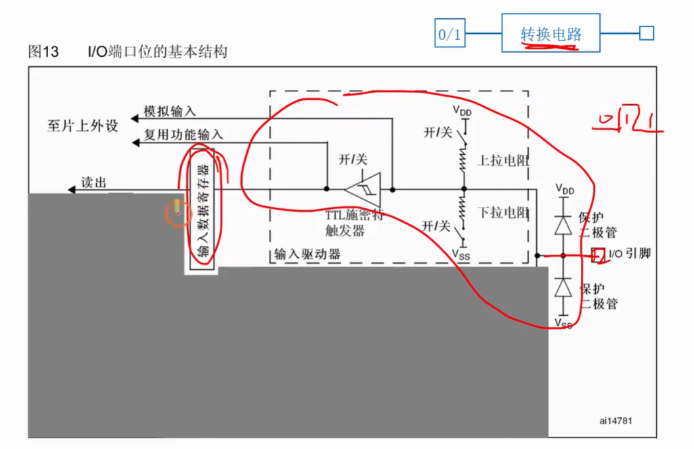
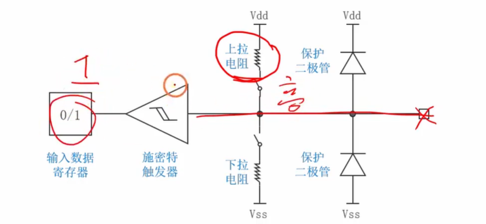
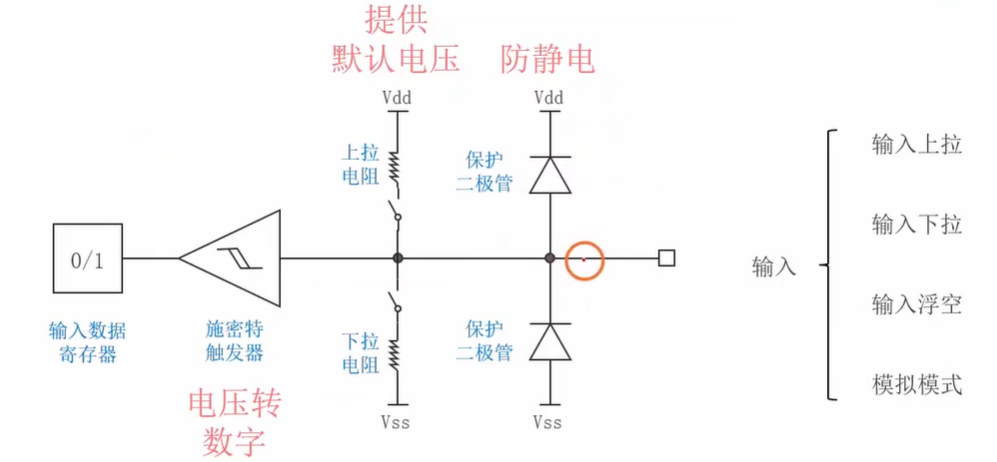
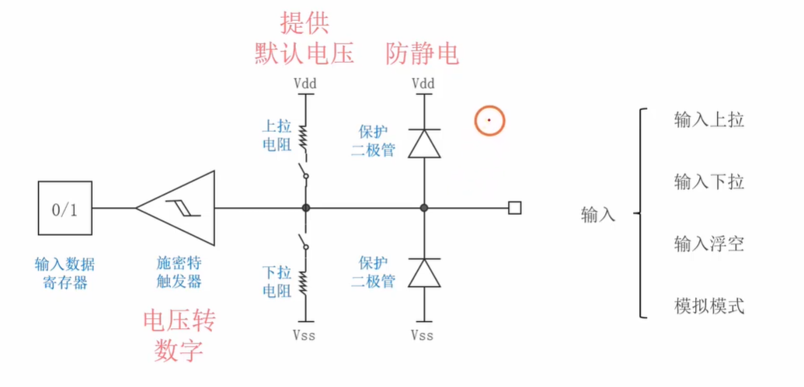

# **[stm32 入门教程 第四版 08 GPIO4种输入模式](https://www.google.com/search?q=-yNv0FZ_A64)** 

### 视频核心总结：GPIO 的 4 种输入模式

本节课“铁头山羊”将学习视线从之前的“输出”转向了“输入”，详细剖析了 STM32 中 GPIO 端口接收外部信号的底层电路原理，以及 4 种输入模式的工作机制。

#### 1. 输入模式的核心任务 ([00:35 Opens in a new window ](http://www.youtube.com/watch?v=-yNv0FZ_A64&t=35))

- **原理：** 外部设备（如按键、传感器）向单片机引脚输入高低变化的电压信号。单片机内部的**转换电路**会将这些物理电压信号翻译成数字 `0` 或 `1`，并存入**输入数据寄存器**中。
- **作用：** 程序员通过代码读取这个寄存器里的 `0` 或 `1`，就能知道外部当前输入的是低电平还是高电平。

#### 2. 输入电路原理图拆解 ([03:39 Opens in a new window ](http://www.youtube.com/watch?v=-yNv0FZ_A64&t=219))

结合数据手册中的内部结构图，输入电路主要由以下三大关键部分组成：

- **第一道防线：保护二极管 ([04:07 Opens in a new window ](http://www.youtube.com/watch?v=-yNv0FZ_A64&t=247))**

  

  - **作用：** 防静电。人体经常带有高达上万伏的静电，如果直接接触引脚会烧毁内部娇贵的芯片。
  - **原理：** 上下两个二极管分别连接 VDD (3.3V) 和 VSS (0V)。当输入异常高压（如正1万伏）时，上方二极管导通将电流泄放到电源；当输入异常负压时，下方二极管导通将电流泄放到地，从而完美保护后级电路。

- **第二道关卡：上拉 / 下拉电阻 ([06:22 Opens in a new window ](http://www.youtube.com/watch?v=-yNv0FZ_A64&t=382))**

  

  - **痛点 ([08:32 Opens in a new window ](http://www.youtube.com/watch?v=-yNv0FZ_A64&t=512))：** 如果引脚什么都不接（悬空状态），引脚会变成一根“天线”，吸收空气中的电磁波干扰，导致读取到的电压忽高忽低（0和1随机跳变）。
  - **作用：** 为了防止这种不稳定，内部加入了上拉电阻（接高电平）和下拉电阻（接低电平），用于给引脚提供一个**确定且稳定的默认电压**。
    - **上拉电阻使能：** 当引脚悬空时，默认读取为 `1`（高电平）。
    - **下拉电阻使能：** 当引脚悬空时，默认读取为 `0`（低电平）。
    - 注：如果引脚外部有确定的强电压输入（如明确接了3.3V或0V），内部的默认电压会被覆盖，不影响正确读取。

- 输入模式的总结 (06:46 Opens in a new window )

  - **作用：** 它是一个实现“模拟电压到数字信号”转换的核心器件。不管外部电压波形多不规则，经过它之后都会被干净利落地整形为绝对的 `0` 或 `1`，送入输入数据寄存器。

#### 3. 对应 4 种输入模式的总结 ([06:46 Opens in a new window ](http://www.youtube.com/watch?v=-yNv0FZ_A64&t=406))

基于内部的上拉/下拉电阻开关状态，GPIO 的输入模式分为以下几种：

1. **输入上拉模式：** 闭合内部上拉电阻开关（默认高电平，抗干扰）。
2. **输入下拉模式：** 闭合内部下拉电阻开关（默认低电平，抗干扰）。
3. **输入浮空模式：** 上下拉电阻全部断开（完全交给外部电路决定电平，如果外部悬空，状态将随机）。
4. **模拟输入模式 ([07:01 Opens in a new window ](http://www.youtube.com/watch?v=-yNv0FZ_A64&t=421))：** 信号不经过施密特触发器转换 0 或 1，而是直接将原始的模拟电压送给片内的 ADC（模数转换器）或 DAC 进行处理（此模式本节暂不深入）。

------

了解了引脚内部是如何抗静电、抗干扰并将电压转换为 0 和 1 的原理后，你是否需要我继续为你播放下一集，看看在实际写代码时，**如何读取按键的状态来控制 LED 灯的亮灭？**

# 补充提问

## 提问1   （内部上下拉电阻与外部信号的“强弱之争”）

注：如果引脚外部有确定的强电压输入（如明确接了3.3V或0V），内部的默认电压会被覆盖，不影响正确读取。 这里我不是太理解，如果接的是上拉电阻的话，外面输入0和1则内部读取到的都是0和1，但是如果接的是下拉电阻的话，外面输入0则内部读取到的确实0，但是外面输入1则内部读取到的是1吗。我不是太懂，给我解释下，另外给我的提问起个小标题，方便我快速索引。

### 🏷️ 快速索引标题：内部上下拉电阻与外部信号的“强弱之争”

这个问题问得非常深刻！很多初学者在刚接触上下拉电阻时，都会产生和你一模一样的疑问：“既然内部已经把它拉低（或拉高）了，外部信号还能改变它吗？”

直接回答你的疑问：**是的！在下拉电阻模式下，如果外部强行输入 1（3.3V），内部读取到的绝对是 1。**

为了让你彻底弄明白这个反直觉的现象，我们用一个**“拔河比赛”**的比喻来拆解一下单片机内部的物理原理：

### 1. 核心密码：电阻的“阻值大小”决定了力量的强弱

在 STM32 单片机内部，所谓的“上拉电阻”和“下拉电阻”，它们的阻值其实非常大（通常在 **40kΩ（4万欧姆）** 左右）。

在电路世界里，**电阻越大，这根线的“拉力”就越弱**。

- **内部上下拉电阻：** 就像是一个**力气很小的小孩**，拿着绳子的一头，轻轻地把绳子往 3.3V（上拉）或者 0V（下拉）的方向拽。
- **确定的外部强信号：** 比如你直接拿一根导线把引脚连到了 3.3V 或 GND，这根导线的电阻几乎为 **0Ω**。这就像是一个**力大无穷的职业举重运动员**！

### 2. 场景复盘：下拉电阻 vs 外部输入 1

现在，我们把你的疑问放到这场“拔河比赛”里来看看：

**【前提设置】引脚配置为：输入下拉模式。**

这意味着单片机内部派出了一个“力气很小的小孩”，轻轻地把引脚的电压往 **0V（地）** 的方向拽。

- **情况 A：外部什么都不接（引脚悬空）**
  - **拔河情况：** 外面没人抢绳子。
  - **结果：** 内部的小孩轻松地把绳子拉到了自己这边。引脚电压稳稳地停在 0V。
  - **单片机读取：0**。
- **情况 B：外部强行输入 0（外部接 GND）**
  - **拔河情况：** 外部的举重运动员也把绳子往 0V 拉。
  - **结果：** 两人力气往一处使，引脚电压依然是 0V。
  - **单片机读取：0**。
- **情况 C（你的疑问）：外部强行输入 1（外部接 3.3V）**
  - **拔河情况：** 冲突来了！内部的小孩（4万欧姆的弱下拉）拼命想把绳子拉在 0V；但是，外部的举重运动员（0欧姆的强输入）一把抓住绳子，毫不费力地把绳子猛拽到了 **3.3V** 的方向！
  - **物理本质：** 电流从外部的 3.3V 强行灌入引脚，流过那个 4 万欧姆的下拉电阻进入地。因为外部导线几乎没有电阻，所以引脚处的电压被死死地“钉”在了 3.3V。内部那个可怜的下拉电阻根本无力反抗。
  - **单片机读取：1**。

------

**总结一句话：**

内部的上下拉电阻只是一个**“备胎”**，它的作用仅仅是在外部没有信号（悬空）时，维持一个默认状态，防止引脚受到空气中的静电干扰而乱跳。**一旦外部有真实的、强有力的信号接进来，内部的上下拉电阻就会立刻“举手投降”，完全听从外部信号的指挥。**

这也就是视频中所说的“内部默认电压会被覆盖”的真正含义。

有了这个拔河的比喻，这个逻辑是不是就彻底通透了？教程的下一集 **[09 GPIO 按钮实验](https://www.youtube.com/watch?v=P8UB1R27KZI&list=PLen6JNT7Cx3BaIbxkUfWayXsMlbU3Yisj&index=9&pp=iAQB)** 刚好就是教你怎么在外面接一个真实的物理按键来输入 0 和 1。需要我为你总结一下，在真实的按键电路中，我们应该怎么配合内部的上下拉电阻来画电路图吗？

## 提问2（内部接Vss与接地的区别）

内部的下拉电阻应该不是接地的吧，我好像把接Vss和接地给搞混了，如果接地的话则外部输入没有影响了。你能够给我详细解释下内部接下拉电阻和接地的区别吗，最好能够举个例子来让我彻底弄明白。

### 🏷️ 快速索引标题：下拉电阻 vs 直接接地：为什么一定要有个“阻”字？

这个问题问得太有水平了！你的物理直觉极其敏锐，你那句**“如果接地的话则外部输入没有影响了”**简直一针见血，直接点出了电子电路中最可怕的现象——**短路**。

首先，帮你纠正一个名词上的小误区：在单片机的数字电路里，**`Vss` 和 `接地 (GND)` 其实是完全同一个东西**，都代表 0V（也就是我们之前比喻的“下水道”）。

你真正搞混的，其实不是“接哪里”，而是**“怎么接”**。核心区别在于：**是通过“电阻”接地，还是用导线“直接”接地？**

我们用一个**“给水池注水”**的绝佳例子，来把你脑海里的逻辑彻底理顺：

------

### 1. 致命的错误做法：引脚“直接接地”（没有电阻）

假设单片机内部没有下拉电阻，而是一根**纯铜导线（0Ω）**把引脚直接连到了地（Vss / GND）。

这就相当于你的水池（引脚）底部，**破了一个和水池一样大的超级大洞**，直接通向下水道。

- **外部悬空时：** 没问题，水池里没水，电压是 0V。
- **外部输入 0 时：** 没问题，外面不给水，水池还是 0V。
- **🚨 外部强行输入 1 (接 3.3V) 时：** 灾难发生了！外面拿来一根粗大的高压水管（3.3V 电源）往水池里疯狂注水。但是因为池底是个超级大洞（直接接地），**水刚注进去，瞬间就全部漏光了！** * **结果：** 水池的水位（电压）永远升不起来，确实像你说的**“外部输入没有影响了”**。
  - **更严重的后果：** 3.3V 的电源直接连到了 0V 的地线上，中间没有任何阻碍。这在电学里叫作**绝对短路**！瞬间产生的极速水流（超大电流）会当场把你的外部电源或者单片机直接烧毁冒烟！

------

### 2. 聪明的正确做法：引脚接“下拉电阻”（通常约 40kΩ）

现在的真实情况是，引脚确实接了地（Vss），但中间隔着一个巨大的下拉电阻。

这相当于水池底部完好无损，只是为了排水，工程师在池底**扎了一个像针眼一样微小的漏水孔**（40kΩ 的大电阻）。

- **外部悬空时：** 虽然漏水孔（电阻）极小，但只要给它一点点时间，它依然能把水池里残留的积水一滴滴漏干。最终水池彻底没水，单片机稳稳地读到 **0V（低电平）**。这就实现了“默认拉低”的抗干扰作用。
- **外部强行输入 1 (接 3.3V) 时：** 外面的高压水管（外部 3.3V）开始往水池注水。
  - **拔河开始：** 水池底部确实有个针眼在往外漏水，但这漏水的速度（微乎其微的电流，大约只有 0.08 毫安）跟上面疯狂注水的速度相比，简直不值一提。
  - **结果：** 水池瞬间就被注满了！引脚的水位（电压）稳稳地停留在 3.3V。单片机完美地读到了 **1（高电平）**。
  - **安全性：** 因为漏水孔极小（电阻很大），从 3.3V 流向 GND 的水流被死死限制住了，不会发生短路，芯片极其安全。

------

### 💡 终极总结

- **直接接地：** 引脚 = 0V 死胡同。外部输入 3.3V 会导致电源与地直接火拼（短路），引发物理毁灭。外部输入确实“无效”了。
- **下拉电阻：** 引脚 = 带有微小泄流孔的安全通道。没人管它时，它慢吞吞地把电压漏成 0V；外面有强势的 3.3V 进来时，它乖乖认怂，任由电压升到 3.3V，且绝不短路。

这就完美解释了为什么内部**必须、且一定**要用大阻值的“电阻”去接地，而绝对不能用一根导线直连。

你的思考深度非常棒，已经完全跳出了纯代码的范畴，进入了硬件底层设计的领域！既然“输入引脚”的防御机制你已经研究透了，需要我为你总结一下教程第 9 集的内容，看看在实际画电路板时，**外面的那个物理机械按键，到底该怎么跟这个带了“上下拉电阻”的引脚完美配合吗？**

## 提问3

我是不是可以这样理解呢，左边图片中的Vss就是GND，但是施密特触发器测量的是进入下拉电阻之前那一部分的电压。故那部分电压时是输入端的电压，因为没有经过下拉电阻导致电压下降。而上面那部分施密特触发器测量的则是Vdd经过下拉电阻降压之后的电压，也是和输入端电压一样。我的理解对吗，你能够给我详细解释下吗，最好能够举个例子来让我彻底弄明白。

你的前半句理解**完全正确**：在单片机里，`Vss` 就是 `GND`（接地，0V）。

但是，你对后半句“施密特触发器测量的是进入电阻之前/之后的电压，以及电压下降”的理解，在电路物理学上**有一点点小偏差**。

为了让你彻底破除这个迷思，我们需要引入电路学中最核心的两个概念：**“共用节点（十字路口）”** 和 **“没有电流就没有压降”**。

我们用一个非常直观的**“测水压”**的例子来把这个电路图彻底拆解开：

### 1. 核心纠错：大家都在同一个“十字路口”

请你仔细观察视频里的那张电路图。引脚（外部输入）、上拉电阻、下拉电阻、以及施密特触发器，它们四条线其实是**交汇在同一个点上**的。

在电路原理中，只要是用导线直接连在一起的地方（没有经过任何元器件），这整个区域就叫作**“同一个节点”**。

- **物理真相：** 施密特触发器并不是在电阻的“前面”或“后面”测电压，它就像是一个站在十字路口中心的**“电压表”**。十字路口此时是多少伏，它量到的就是多少伏。

### 2. 为什么没有“电压下降”？（欧姆定律揭秘）

你觉得“经过下拉电阻，电压会下降”，这个直觉很棒，因为电阻确实会消耗电压。但是，电阻消耗电压必须满足一个死条件：**必须有水流（电流）经过它！** 根据欧姆定律 `电压差 = 电流 × 电阻` (`U = I * R`)。如果电流是 0，那么无论电阻有多大，它两端的电压差就是 0（不消耗任何电压）。

而**施密特触发器**有一个超级特性：它的内部是一堵“死墙”（输入阻抗无穷大），**绝对不允许任何电流流进它的肚子里**。

------

### 🚀 举个例子：十字路口的拔河比赛

我们假设施密特触发器就是一个站在十字路口，只负责拿眼睛看“当前路口水压是多少”的裁判。他自己绝对不喝水（不吸电流）。

#### 🟢 场景 A：开启“下拉电阻”（接 Vss / 0V）

此时，十字路口连着一个通往下水道的微小漏水孔（下拉电阻）。

- **如果外部悬空（什么都不接）：** 十字路口没有外来的水。水池里的残留水通过下拉电阻慢慢漏干。因为裁判（施密特触发器）不喝水，电路里没有持续的电流，所以下拉电阻上没有“电压下降”。十字路口的水压稳定在 **0V**，裁判大喊：“读取到 0！”
- **如果外部强行输入 3.3V (写 1)：** 外部的高压水枪直接怼在十字路口疯狂注水！虽然下拉电阻这个漏水孔在漏水（产生了一点点微弱的电流流向地下），但是外面的高压水枪太强了，瞬间把整个十字路口的水压死死撑到了 **3.3V**。裁判一看，大喊：“读取到 1！”

#### 🔴 场景 B：开启“上拉电阻”（接 Vdd / 3.3V）

此时，十字路口连着一个通往高位水塔的微小注水管（上拉电阻）。

- **如果外部悬空：** 水塔通过上拉电阻把十字路口慢慢注满水。同样因为裁判不喝水，水注满后就不流动了（电流为0）。既然没电流，上拉电阻就不消耗电压，`3.3V - 0V降压 = 3.3V`。十字路口水压稳定在 **3.3V**，裁判大喊：“读取到 1！”
- **如果外部强行输入 0V (接 GND)：** 外部直接在十字路口砸开了一个超级大黑洞（直接接地）。虽然上面水塔（上拉电阻）还在努力往下滴水，但滴下来的水瞬间就被大黑洞吸走了！十字路口根本攒不起来水压，死死保持在 **0V**。裁判大喊：“读取到 0！”

------

### 总结

1. 施密特触发器是**并联**在路口的，它只负责“看”电压，不参与电流的流动，所以不存在“测电阻之前或之后”的说法。
2. 内部电阻存在的意义，仅仅是为了在外部没有信号（悬空）时，微弱地把路口的电压**“拉”**向 3.3V 或 0V，防止电压随风飘摇。
3. 一旦外部有真实的强信号进来，十字路口的电压**完全由外部强信号决定**，内部电阻立刻乖乖靠边站。

把这个“十字路口测水压”的逻辑带入到图里，是不是瞬间就通透了？

现在输入引脚的原理已经彻底清晰了，接下来你想让我为你总结下一集 [stm32 入门教程 第四版 09 GPIO按钮实验](https://www.youtube.com/watch?v=P8UB1R27KZI&list=PLen6JNT7Cx3BaIbxkUfWayXsMlbU3Yisj&index=9&pp=iAQB) 吗？看看在写代码时，如何用这个“裁判”来敏锐地捕捉我们手指按下按键的那一瞬间？
