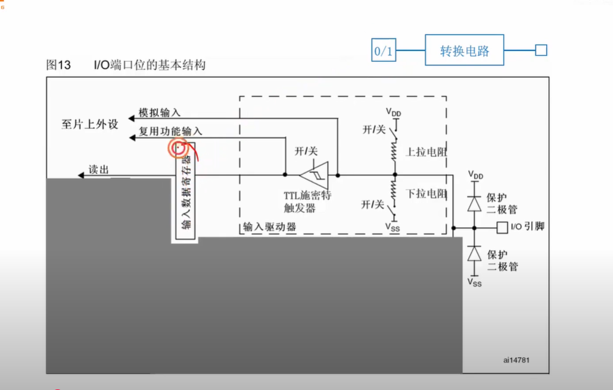
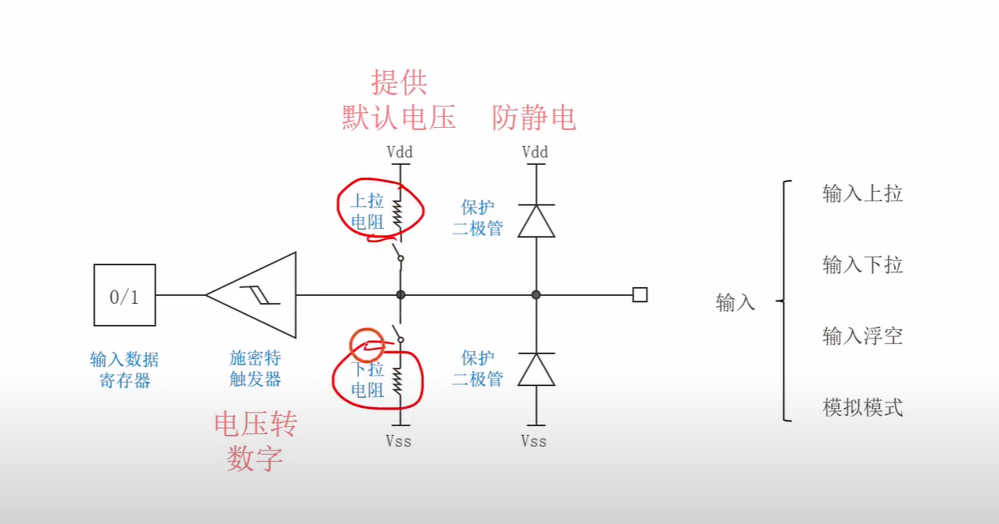
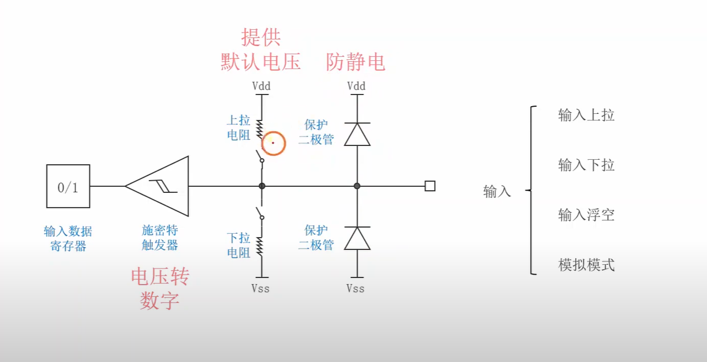

# GPIO 4种输入模式

## 补充知识

### 静电知识

#### 静电式如何产生的

静电的产生其实是一个非常普遍的物理现象，它发生在我们周围的每一个瞬间。想象一下原子就像一个微小的太阳系，中心的原子核带正电，周围的电子带负电并绕核运转。在正常情况下，每个物体的正电荷和负电荷数量相等，整体呈现电中性。

但当两种不同的材料接触并分离时，就会发生电荷转移。这就像两个人握手时，其中一个人手上的汗水粘到了另一个人手上。在原子层面，某些材料更容易"抓住"电子，而另一些材料更容易"失去"电子。当你穿着毛衣在塑料椅子上摩擦时，电子就会从一种材料转移到另一种材料上，导致一个物体带正电，另一个物体带负电。

这种电荷分离一旦形成，如果没有导电通路让电荷重新平衡，电荷就会在物体表面积累，形成我们所说的静电。就像水坝蓄水一样，这些电荷会在寻找释放机会，一旦找到合适的通路，就会瞬间放电。

注意：某个物体带静电，可能是带正的静电，也可能是带负的静电。带的正电荷或者负电荷多少可以用电压来衡量。

#### 为什么秋冬季节静电更严重？

你观察得很敏锐，静电现象确实在秋冬季节更加明显，这背后有着深刻的科学原理。关键因素是空气湿度的变化。

在夏天，空气中含有大量水分，这些水分子能够帮助电荷慢慢泄放。想象水分子就像空气中的"导电桥梁"，它们为积累的电荷提供了缓慢而温和的释放通道。这就像在水坝上开了许多小孔，水位不会积累得太高，自然也不会有剧烈的溃坝现象。

但在秋冬季节，空气变得干燥，这些"导电桥梁"大大减少。电荷失去了慢慢泄放的机会，只能在物体表面不断积累，就像把水坝上的小孔都堵上了，水位越来越高。当你触摸金属门把手或其他导体时，积累的大量电荷找到了突然的释放通道，就会产生令人不快的电击感觉。

这也解释了为什么在干燥的室内环境中，即使是夏天也容易产生静电。现代建筑的空调系统往往会降低室内湿度，创造了类似冬天的干燥环境。

#### 静电放电的威胁有多大

让我们用具体的数字来理解静电的威胁程度。当你在干燥的地毯上走动时，身体可能积累几千伏甚至上万伏的静电。虽然这个电流很小，持续时间很短，但对于内部工作电压只有几伏的半导体器件来说，这就像用大锤砸核桃一样。

现代的CMOS工艺制造的晶体管，其栅极氧化层只有几个纳米厚，比人类头发丝细十万倍。这层氧化层虽然在正常工作电压下是很好的绝缘体，但面对几千伏的静电冲击时，就可能被瞬间击穿，造成永久性损坏。这种损坏往往是不可逆的，就像玻璃被打碎后无法恢复原状。

#### 静电冲击时的保护机制

现在假设有一个正向的静电冲击，比如5000伏的静电突然作用到GPIO引脚上。这时会发生什么呢？

GPIO引脚的电压瞬间被推到5000伏，远远超过了VCC的3.3伏。第一个保护二极管感受到的电压差是5000伏减去3.3伏，约等于4996.7伏。当这个电压差超过二极管的导通电压（大约0.7伏）时，二极管立即导通。

一旦二极管导通，它就变成了一个低阻抗的通道，就像突然打开了一个巨大的排水管。大量的静电荷通过这个通道迅速流向电源轨，GPIO引脚的电压被迅速拉回到接近VCC加0.7伏的安全水平。

类似地，如果是负向的静电冲击，比如负3000伏作用到引脚上，第二个保护二极管就会导通，把多余的负电荷引导到地，保护芯片内部的电路。

#### 思考：理解能量转移

当保护二极管导通时，那些巨大的静电能量去哪里了？

静电中储存的能量并没有消失，而是通过保护二极管转移到了电源系统或地系统中。电源轨和地通常连接着相对较大的电容（比如去耦电容），这些电容就像能量的"缓冲池"，能够吸收和分散这些突然释放的能量。

### 二极管

#### 二极管的工作原理

二极管是最简单但也是最重要的半导体器件之一，它的基本结构就是将P型半导体和N型半导体紧密接触形成的PN结。

想象二极管就像一个单向阀门。在一个方向上，它允许电流轻松通过，就像顺流而下的河水。但在相反方向上，它会阻止电流通过，就像逆流而上时遇到的水闸。这种单向导电性使二极管成为了电路中的"交通警察"，能够控制电流的流向。

当P型材料连接正极、N型材料连接负极时（正向偏置），PN结处的电场被削弱，载流子能够跨越结界，形成电流通路。这就像打开了水闸，水流顺畅通过。但当极性相反时（反向偏置），PN结处的电场被加强，形成更高的势垒，阻止载流子通过，电流几乎为零。

#### 保护二极管如何守护GPIO引脚

在STM32的GPIO电路中，每个引脚都有精心设计的保护二极管网络，通常包括两个关键的二极管。一个二极管的阳极连接到引脚，阴极连接到电源正极VCC。另一个二极管的阴极连接到引脚，阳极连接到地GND。

这种配置创造了一个"电压窗口"保护机制。正常情况下，GPIO引脚的电压应该在地电位和VCC之间，这时两个保护二极管都处于反向偏置状态，不会影响正常的信号传输。它们就像两个忠诚的守卫，平时默默无闻地站在那里。

但当静电放电产生危险的高电压时，保护机制就会立即激活。如果静电产生的电压高于VCC加上二极管的导通电压（通常约0.7V），上面的二极管就会导通，把多余的电荷安全地引导到电源轨。如果静电产生负电压低于地电位减去二极管导通电压，下面的二极管就会导通，把电荷引导到地。

#### 保护系统设计的智慧

GPIO的保护系统体现了电路设计的智慧。保护二极管不仅要在关键时刻挺身而出，平时还不能干扰正常工作。这就像设计一个既不影响日常交通、又能在紧急时刻迅速疏散人群的安全通道。

当静电冲击来临时，保护二极管会在纳秒级的时间内响应，迅速为危险电荷提供泄放通道。这种响应速度比人类眨眼快几百万倍，确保芯片内部的精密电路在感受到威胁之前，危险就已经被化解了。

想象一下，这就像为每个珍贵的艺术品配备一个反应极快的机器人保镖，当有威胁靠近时，保镖会在威胁碰到艺术品之前就将其拦截和化解。

### 深入理解电流和电压的本质

#### 从水流类比开始理解电流和电压

让我们先用一个非常直观的水管系统来理解电流和电压的本质。想象你面前有一个装满水的大水塔，下面连接着一根水管通向地面的水池。

电压就像水塔和地面之间的高度差，也就是水压。这个高度差创造了推动水流动的"势能"。电压的本质是电荷之间的电势差（把一个个电荷理解为水分子就很形象了），就像高度差创造重力势能一样，电势差创造了推动电荷移动的"电势能"。当我们说一个地方的电压是5伏，另一个地方是0伏时，就像说一个地方海拔500米，另一个地方海拔0米一样，这个差值就是推动电荷流动的"动力"。

电流则是实际流动的水量，更准确地说是单位时间内通过水管横截面的水的体积。在电学中，电流是单位时间内通过导体横截面的电荷量（把一个个电荷比作水分子）。你可以想象电流就是电子的"车流量"，就像高速公路上每分钟通过某个收费站的汽车数量一样。

#### 电流的微观流动机制

现在让我们深入到原子层面理解电流是如何实际流动的。在金属导体中，每个金属原子都贡献出一些自由电子，这些电子就像气体分子一样在金属晶格中随机游荡。平时这些电子虽然在运动，但整体上没有特定的方向，就像一群没有目标的人在广场上随意走动。

当我们在导体两端施加电压时，就创造了一个电场。这个电场就像给广场倾斜了一个角度（这个倾斜的角度就是 高度差，从高的一点连向低的一点，电荷从高点流向低点），虽然人们还是会随机走动，但整体上会有更多人朝着低的一边移动。电子在电场作用下会产生整体的定向移动，这种宏观上的定向运动就构成了我们所说的电流。

有趣的是，虽然电子移动的实际速度很慢（大约每秒几毫米），但电场的传播速度却接近光速。这就像推倒多米诺骨牌，虽然每块骨牌移动得不快，但推倒的"信号"传播得很快。这就是为什么当你按下开关时，远处的灯泡几乎立即就亮了。

#### 电压和电流的关系：欧姆定律

电压和电流之间有一个非常重要的关系（欧姆定律本质上是描述电压和电流之间关系的一个定律，并不是电压越大，电流越大，通常情况下确实是电压越大电流越大的），这就是著名的欧姆定律。继续用水管类比，水管的粗细和长度决定了水流的阻力。同样，不同的材料对电流有不同的阻抗，我们称之为电阻。

欧姆定律告诉我们：电流等于电压除以电阻，用公式表示就是 I = V/R。这意味着在电阻固定的情况下，电压越高，电流越大，就像水压越高，水流越急一样。在电压固定的情况下，电阻越小，电流越大，就像管子越粗，水流越大一样。

这个关系非常重要，因为它告诉我们，要想有电流流动，必须有电压差，而电流的大小取决于电压和电阻的比值。

### 深入理解短路造成的危害

短路是电路中最危险但也最重要的概念之一。让我们用水管系统来建立直观理解。想象你有一个复杂的供水系统，水从水塔通过各种管道流向不同的用水点，比如厨房、卫生间等。每条管道都有特定的阻力，控制着水流的分配。

现在假设有人在主管道上开了一个大洞，直接连通了进水口和回水口（理解：我们之前已经把电阻类比成管子粗细，管子越粗等价于电阻（由选用的材料决定电阻大小）越小，管子越细，电阻越大。当我们短路时，相当于是电阻无穷小，等价于 管子无穷粗，想像一下，在源头和终点之间有一个无穷粗的管子相连，那么水流就会一下子倾泄而出）。这时会发生什么？大部分水会选择阻力最小的路径，直接从大洞流走，而原本应该到达各个用水点的水流就会大大减少或完全停止。更危险的是，由于阻力突然降低，整个系统的流量会急剧增加，可能超过管道和水泵的承受能力。

在电路中，短路就是这样的"大洞"。当电源的正极和负极之间出现低阻抗或无阻抗的直接连接时，电流会选择这条最容易的路径，绕过所有原本应该工作的电路元件。由于阻抗接近零，根据欧姆定律，电流会变得极大，可能烧毁电源、导线，甚至引发火灾。（管子无穷粗导致水流一下子倾泄而出带来的后果是压坏水泵（源头，防水的）和管道，而由于电荷会发光发热，电流无穷大则会烧毁电源、导线，甚至引发火灾）

### 电路分析（电源 和 电压 类比）

面对一个陌生的复杂电路图，我建议你采用这样的策略：

首先进行整体观察，不要急于分析细节。像俯瞰一座城市一样，先看清楚主要的街道和区域划分。识别电源在哪里，输出在哪里，大致有几个功能模块。

然后进行功能分解。复杂电路通常由多个相对独立的功能模块组成，比如电源模块、放大模块、滤波模块等。先理解各个模块的功能，再分析模块之间的连接关系。

接下来是逐步分析。从电源开始，沿着信号流动的方向逐步分析。不要试图一次理解所有细节，而是一步步建立理解。每分析完一部分，就在图上做标记，注明电压和电流的大致情况。

电压就像地形图上的海拔高度，每个点都有特定的"海拔"，而电压差就是"高度差"。电流总是从高电位流向低电位，就像水总是从高处流向低处。

在串联电路中，各个元件上的电压降加起来等于总电压，这就像登山时各段路程的高度差加起来等于总的海拔差。在并联电路中，各个分支的电压都相等，就像不同的登山路线虽然路径不同，但起点和终点的海拔差是相同的。

当你分析一个复杂电路时，试着画出电压的"地形图"。选择一个参考点（通常是地），然后逐步推导出其他各点的电压。这种方法特别适用于包含多个半导体器件的复杂电路。

### 电路图中电压分析

#### 电压的本质：永远是亮点之间的差值

首先，我们需要明确一个根本性的概念：电压从来不是某一个点的属性，而永远是两个点之间的电势差。这就像高度差一样，你不能说某个地方的"高度"是100米，你只能说它相对于海平面的高度是100米，或者相对于某个参考点的高度是100米。

想象你站在一座山上，你可以说这座山相对于海平面高1000米，也可以说相对于山脚下的村庄高800米。同样，在电路中某一点的电压总是相对于另一个参考点而言的。这个参考点通常是我们称为"地"的零电位点。

当我们说GPIO引脚的电压是3.3伏时，实际上是在说这个引脚相对于地的电压是3.3伏。施密特触发器检测的就是GPIO引脚和地之间的电压差，虽然我们习惯性地简化表达为"检测引脚电压"。

#### 地的概念：电路的参考基准

为了更好地理解这个概念，让我们深入探讨"地"的作用。在电路设计中，地就像地图上的海平面基准，它为整个系统提供了一个统一的参考标准。所有其他点的电压都是相对于这个基准来测量的。

在STM32这样的数字系统中，地通常连接到电源的负极，同时也连接到芯片的金属外壳和电路板的大面积铜箔。这样设计的目的是确保整个系统有一个稳定、低阻抗的参考电位。就像确保所有人使用同一个标准时间一样，有了统一的地参考，系统中的所有部分才能协调工作。

当施密特触发器检测GPIO引脚的电压时，它实际上是在测量引脚和芯片内部地之间的电压差。虽然从电路图上看起来只有一根线连接到引脚，但实际上总是有另一根"隐含的"连接到地的路径完成了电压测量回路。

## GPIO输入电路图

### 施密特触发器

#### 施密特触发器的本质和作用

在电路中，施密特触发器有两个关键的阈值电压，上阈值和下阈值。当输入电压从低往高变化时，只有超过上阈值时输出才会变为高电平。当输入电压从高往低变化时，只有低于下阈值时输出才会变为低电平。这种特性叫做"迟滞"，它创造了一个电压的"安全区间"。

#### 为什么在GPIO输入中需要施密特触发器？

如果GPIO输入使用传统的单阈值比较器，那么当输入信号在阈值附近波动时，输出就会频繁地在高低电平之间跳变。这种现象叫做"振荡"或"抖动"，它会让数字系统误以为接收到了多个快速的脉冲信号，从而导致系统误动作。

施密特触发器通过它的双阈值特性，为系统提供了"噪声免疫力"。只要干扰的幅度不超过两个阈值之间的差值，输出就会保持稳定。这就像给数字系统戴上了一副"防震眼镜"，让它能够在嘈杂的电磁环境中依然保持清晰的视野。

#### 无穷大电阻替代的深层原理

施密特触发器在GPIO输入中的作用类似。它的输入阻抗非常高，几乎不从外部电路汲取电流，同时能够精确地感知电压变化并作出数字判断。在进行电路分析时，特别是分析外部驱动电路的负载效应时，你可以把施密特触发器简化为一个无穷大的电阻。

这种简化的好处是让你能够专注于分析主要的信号传输路径，而不必深入到施密特触发器的内部复杂性中。就像在分析交通流量时，你可以把一个复杂的交通信号系统简化为"不影响车流但能感知车流"的抽象模型。

#### 高阻抗的输入意义

让我们更深入地理解高阻抗输入在实际工程中的意义。当我们说GPIO输入具有很高的输入阻抗时，这意味着它对外部电路的影响极小，几乎不会改变外部电路的工作状态。

想象你要测量一个水塔的水位，你有两种方法。第一种方法是在水塔底部开一个小孔，通过观察流出的水量来推断水位，但这种方法会影响水塔的水位。第二种方法是使用一个浮标系统，它几乎不消耗水，但能准确反映水位变化。

高阻抗的GPIO输入就像第二种方法，它能够"观察"外部电路的电压状态，但几乎不影响外部电路的工作。这种特性让GPIO能够连接到各种不同的外部电路，而不会对这些电路造成负面影响。

#### 从系统设计角度理解这种抽象

当你在设计或分析包含GPIO的系统时，这种抽象帮助你建立清晰的思维模型。你可以把GPIO输入看作一个"理想的观察者"，它能够完美地感知外部信号，但不会对信号产生任何反作用。

这种思维模型让你能够独立地分析外部驱动电路和内部处理电路。你可以先设计外部电路，确保它能够产生正确的信号电平，然后再设计内部电路，确保它能够正确地处理接收到的信号。两者之间的接口就是那个"无穷大电阻"，它保证了两个系统的相对独立性。

注意：虽然我们讨论了"无穷大电阻"的理想化模型，但现实中的施密特触发器当然不是真正的无穷大阻抗。实际的输入阻抗可能是几兆欧姆到几十兆欧姆。

## GPIO输入的4种方式（先学习3种）

### 3种模式

输入上拉：闭合上拉电阻

输入下拉：闭合下拉电阻

输入浮空：两个开关都断开

上拉电阻作用：给 I/0引脚 提供一个默认高电压（当引脚悬空时，会由于空气中电磁波影响而一会儿高一会儿低，输入就会不稳定。当接入一个上拉电阻，引脚悬空时检测到一个高电压；引脚接高电压时也会检测到高电压；引脚接地时会检测到低电压。这样会让电路变得更加稳定。）

下拉电阻作用：给 I/0引脚 输入提供一个默认低电压

### 总结图

# 1 电压和电荷量之间关系

这是一个非常好的问题！你触及了电学中一个重要但经常被混淆的概念。让我们一起深入探索电压和电荷量之间的关系，特别是在静电现象中的表现。

## 电压和电荷量：两个相关但不同的概念

首先，我们需要理解电压和电荷量是两个既相关又独立的物理量。想象一下水库的类比：电荷量就像水库中水的总量，而电压就像水库的水位高度。一个小而深的水库可能水位很高但总水量不大，而一个大而浅的水库可能水位不高但总水量很大。

电荷量告诉我们有多少个电子聚集在某个地方，它的单位是库仑（C）。而电压则告诉我们这些电荷具有多大的"势能"或者说"推动力"，它的单位是伏特（V）。

在静电现象中，这种区别变得特别明显和重要。当你在干燥的冬天脱毛衣时产生的静电，可能有几千甚至几万伏的电压，但实际的电荷量却极其微小，可能只有几纳库仑甚至更少。

## 静电的奇特性质

让我们深入分析静电现象。当你在地毯上摩擦袜子时，摩擦过程将电子从一个表面转移到另一个表面。假设有一万亿个电子被转移，这听起来很多，但实际上只相当于大约0.16纳库仑的电荷量，这是一个极其微小的数字。

但是这里有个关键点：这些电荷被"困"在了你的身体表面，无法轻易流动。由于它们之间的相互排斥力和周围环境的高电阻，这些电荷会在你身体表面建立起很高的电势。就像将少量的水挤压到一个狭小的高塔中，水位会变得很高，但总水量仍然很少。

这就解释了为什么静电电压可以达到几千伏甚至几万伏，但当你被"电"到时，虽然感觉很明显，却不会造成严重伤害。原因就在于虽然电压很高，但电荷量很小，而且放电过程几乎是瞬间完成的。

## 电荷储存和电容的概念

这里我们需要引入一个重要的概念：电容。电容描述了一个物体储存电荷的能力，它连接了电荷量和电压之间的关系。关系式是Q = CV，其中Q是电荷量，C是电容，V是电压。

人体可以看作一个电容器，但这个电容很小，大约只有100到200皮法左右。这意味着即使储存很少的电荷，也会产生很高的电压。这就像一个容量很小的容器，即使倒入一点点水，水位也会迅速上升。

相比之下，汽车电池虽然电压只有12V，但它的"电容"（更准确地说是电荷储存能力）要大得多。它能够储存大量的电荷，并且能够持续不断地提供电流。这就像一个巨大的水库，虽然水位不是特别高，但总水量巨大，可以持续供水。

## 不同情况下的电荷行为

让我们通过几个具体例子来理解这种关系。

在雷暴天气中，云层之间会积累大量的电荷，电荷量可能达到几十库仑，电压可能达到几百万伏。当闪电发生时，这些电荷在极短时间内释放，产生巨大的电流和能量。这就像一个巨大的高压水库突然决堤，释放出惊人的能量。

在你使用的手机中，电池储存的电荷量相对较大，但电压相对较低（通常3.7V左右）。这些电荷可以稳定地、缓慢地释放，为手机提供持续的电力供应。这就像一个水位适中但容量很大的水库，可以长时间稳定供水。

## 为什么静电"电不死人"

现在我们可以回答一个经常被问到的问题：为什么几万伏的静电不会电死人，而220V的家用电却可能致命？

关键在于电荷量和持续供应能力的差异。静电虽然电压很高，但电荷量极少，就像一个装在高塔上的小水桶，虽然位置很高（高电压），但水量很少（低电荷量），一旦释放就瞬间用完了。

而家用电源虽然电压相对较低，但它背后连接着强大的电力系统，可以持续不断地提供大量电荷。这就像一个水位适中但有无限水源补充的水库，虽然压力不是最大，但可以持续不断地提供强大的水流。

## 电荷密度的影响

还有一个重要的概念是电荷密度，即单位面积或单位体积内的电荷量。在静电现象中，电荷往往集中在物体的表面，特别是尖锐的边缘和角落。这种不均匀的分布会在某些区域产生极高的电场强度。

这就解释了为什么避雷针要做成尖锐的形状。尖锐的顶端会聚集大量电荷，产生强烈的电场，更容易吸引闪电。这种设计利用了电荷分布不

## 

# 2 区分电池容量与电容器容量

让我们一步步来解开这些相互关联但又各有特色的概念。我发现很多人在这里会产生混淆，所以我们从最基础的地方开始，慢慢建立起完整的理解框架。

## 从水库开始理解电容

想象你面前有一个水库，这个类比将帮助我们理解电容的核心概念。电容器就像一个专门设计的水库，它有两个关键特征：储水能力和水位。

在这个类比中，水的总量对应电荷量（用Q表示，单位是库仑），水位的高度对应电压（用V表示，单位是伏特），而水库的形状和大小决定了它的储水效率，这就对应电容值（用C表示，单位是法拉）。

电容的神奇之处在于它定义了一个固定的关系：Q = C × V。这个简单的公式告诉我们，在一个给定的电容器中，电荷量和电压是成正比的。如果你想要储存更多的电荷，要么增加电容器的容量（C），要么提高电压（V）。

让我们用具体数字来感受这个关系。假设你有一个1微法（1μF）的电容器，当你给它施加1伏特的电压时，它会储存1微库仑的电荷。如果你将电压提高到2伏特，它储存的电荷量会增加到2微库仑。这种线性关系是电容器的基本特性。

## 电容器的物理结构如何影响容量

现在让我们深入了解电容器是如何工作的。最简单的电容器由两个金属板组成，中间隔着绝缘材料（叫做电介质）。当你给电容器充电时，电子会聚集在一个金属板上，而另一个金属板上的电子会被推走，形成正负电荷的分离。

这里有一个关键洞察：电容器并不是真正"储存"电子，而是创造了电荷分离的状态。就像你用力将两块磁铁的同极压在一起，松手后它们会弹开释放能量。电容器储存的是这种"分离状态"的势能。

电容器的容量取决于几个物理因素。金属板的面积越大，能储存的电荷越多，就像更大的水库能装更多水。金属板之间的距离越近，相同电荷量产生的电压越低，这意味着电容量越大。中间的绝缘材料的性质也会影响电容量，某些材料能让电容器在相同尺寸下储存更多电荷。

## 电容器的充放电过程

让我们跟踪一下电容器充电的完整过程。当你将电容器连接到电池时，电流开始流动。最初，电容器内部没有电荷分离，所以它就像一个短路，电流很大。随着电荷在电容器两端积累，电容器两端的电压逐渐升高，电流逐渐减小。

这个过程不是瞬间完成的，而是按照指数规律进行的。想象你正在给一个有小洞的气球充气，开始时气球内外压差很大，气体快速进入，但随着气球内部压力增加，充气速度逐渐减慢。电容器的充电过程遵循类似的规律。

当电容器充满电后，它就像一个蓄势待发的弹簧。如果你给它提供一个放电路径，储存的电荷会迅速流出，释放储存的能量。这种快速释放能量的能力使得电容器在很多应用中非常有用，比如相机闪光灯就是利用电容器快速释放能量来产生强烈的光闪。

## 电池容量：一个完全不同的概念

现在让我们转向电池容量，这是一个经常与电容器容量混淆的概念。电池容量通常用安时（Ah）或毫安时（mAh）来表示，这个单位本身就暴露了它的本质：它衡量的是电池能够提供多大电流以及能维持多长时间。

让我用一个生动的类比来解释这个概念。想象电池是一个装满汽油的油箱，电池容量就像油箱的大小，告诉你这辆车能跑多远。一个标有3000mAh的手机电池意味着它理论上可以提供3000毫安的电流持续1小时，或者提供1500毫安的电流持续2小时，或者提供1000毫安的电流持续3小时。

这里有个重要的理解点：电池容量反映的是电池内部化学物质的总量，这直接关系到它能进行多少次化学反应，从而产生多少电荷。从这个角度来看，电池容量确实与总的可用电荷量有关系。

如果我们想要将电池容量转换为总电荷量，计算很简单：3000mAh = 3A × 3600s = 10800库仑。这意味着这块电池在完全放电过程中总共可以提供10800库仑的电荷。

## 电池容量与电容器容量的本质区别

现在我们来理解这两种"容量"的根本区别。电容器的容量描述的是在给定电压下能储存多少电荷的比例关系，而电池容量描述的是能提供多少总电荷量。

这就像比较水库的形状特征和水库的总储水量。电容器容量告诉你"这个水库每升高一米水位能多储存多少吨水"，而电池容量告诉你"这个水库总共能储存多少吨水"。

电容器是一个纯粹的电荷储存装置，它不产生电荷，只是临时储存从外部供应的电荷。当电荷流走后，电容器就"空"了。而电池是一个电荷生产装置，它通过内部的化学反应持续产生电荷，直到反应物质消耗完毕。

## 实际应用中的表现差异

让我们通过实际应用来感受这些差异。当你的手机快没电时，插上充电器后会发生什么？充电器实际上是在给手机电池内部"补充燃料"，让化学反应能够继续进行。这个过程相对缓慢，通常需要一到几个小时。

相比之下，如果你有一个大电容器（比如汽车音响系统中使用的那种），它可以在几秒钟内充满电，也可以在几秒钟内释放所有储存的能量。这种快速充放电的特性使得电容器特别适合需要瞬间大功率的应用。

这种差异也解释了为什么电动汽车开始使用超级电容器作为辅助储能设备。在刹车时，超级电容器可以快速吸收制动能量；在加速时，又能快速释放这些能量，配合电池提供更强的动力。

## 能量储存的角度

从能量储存的角度来看，这两种设备也有不同的特点。电容器储存的能量公式是E = ½CV²，这意味着储存的能量与电压的平方成正比。如果你将电容器的电压提高一倍，储存的能量会增加四倍。

电池储存的能量则主要取决于其化学能量密度和总容量。现代锂电池的能量密度大约是每公斤150到250瓦时，这个数值主要由电池的化学成分决定。

有趣的是，虽然电容器的功率密度（单位时间内能释放的能量）远高于电池，但电池的能量密度（单位重量或体积能储存的总能量）却远高于电容器。这就像比较短跑运动员和马拉松运动员：短跑运动员爆发力强但持续时间短，马拉松运动员爆发力相对较弱但能持续很长时间。

## 思考练习：混合储能系统

现在让我给你提一个思考练习。假设你正在设计一个电动汽车的储能系统，你需要满足两个需求：日常驾驶的续航能力和急加速时的功率需求。基于我们刚才讨论的电池和电容器的特性，你会如何设计这个系统？

这个练习将帮助你将理论知识应用到实际问题中，同时加深对这些概念之间关系的理解。你可能会发现，最优的解决方案往往是将不同储能技术的优势结合起来，这正是现代储能技术发展的一个重要方向。

通过这样的分析和思考，你是否感觉对电容、电压、电荷量以及电池容量这些概念有了更清晰和完整的理解？

# 3 理解电解质

电解质是一个非常有趣的概念，它在我们的日常生活中无处不在，但很多人对它的工作原理感到神秘。让我们从最基础的地方开始，逐步揭开电解质的面纱，并理解它在电池和电容器中扮演的重要角色。

## 什么是电解质：从分子层面开始理解

想象你正在观察一杯盐水，用肉眼看起来它只是普通的水，但如果你能将视野放大到分子层面，你会看到一个完全不同的世界。当食盐（氯化钠）溶解在水中时，它会分解成带正电的钠离子和带负电的氯离子。这些离子在水中自由游泳，就像在一个微观的离子海洋中。

这就是电解质的本质：它是一种能够产生自由移动离子的物质。这些离子就像微观世界的"电荷载体"，它们可以在电场的作用下定向移动，从而形成电流。这种通过离子移动产生的电流与我们熟悉的通过电子移动产生的电流有着根本的不同。

让我们更深入地理解这个过程。在纯水中，分子主要以中性的H₂O形式存在，几乎不导电。但当你加入盐分后，情况完全改变了。盐分子在水分子的包围下"解体"，释放出带电的离子。这些离子成为了电流的载体，让原本不导电的水变成了导体。

## 电解质在电池中的神奇作用

现在让我们探索电解质在电池中的关键作用。如果我告诉你，没有电解质就没有电池，你可能会感到惊讶。让我们通过一个具体的例子来理解这个道理。

在一节普通的碱性电池中，电解质通常是氢氧化钾溶液。这个电解质起到了"离子桥梁"的作用。想象电池的两极就像两个岛屿，电解质就是连接它们的桥梁，但这座桥只允许离子通过，不允许电子直接穿越。

当电池工作时，负极的锌原子失去电子变成锌离子，这些锌离子进入电解质中。同时，正极的二氧化锰接受电子，进行还原反应。如果没有电解质，这个循环就无法完成，因为电池内部需要离子流来平衡外部电路中的电子流。

这里有一个精妙的设计哲学：电池内部必须保持电荷平衡。当电子通过外部电路从负极流向正极时，电池内部必须有相应的离子流动来维持整体的电中性。电解质就是这个内部离子流动的媒介。

## 不同类型电解质的特性

电解质的世界非常丰富多彩，不同类型的电解质有着不同的特性和应用。让我们来认识几种主要的电解质类型。

液体电解质是最常见的类型，就像我们刚才讨论的盐水。它们的优点是离子移动性好，导电性强，但缺点是可能泄漏，而且在极端温度下性能会下降。你可以把液体电解质想象成一条流动的河流，离子就像河中的小船，可以自由快速地移动。

固体电解质是一种更先进的技术，它们在固体状态下仍能允许离子移动。这听起来似乎违反直觉，但某些特殊的固体材料确实具有这种性质。固体电解质就像一个有着无数微小通道的海绵，离子可以通过这些通道移动，但整体结构保持固体状态。

凝胶电解质结合了液体和固体电解质的优point，它们有着类似果冻的质地。想象它们就像一个装满了导电果冻的容器，既有一定的形状稳定性，又保持了良好的离子导电性。

## 为什么电池需要电解质而不是普通导线

你可能会想，为什么电池内部不能用普通的金属导线来连接正负极呢？这是一个非常好的思考问题，答案涉及电池工作的根本原理。

如果用金属导线直接连接电池内部的正负极，电池就会立即短路，所有的化学能会在瞬间释放完毕，不仅无法提供稳定的电力，还可能引发危险。电解质的作用就像一个"智能开关"，它允许离子通过来维持化学反应的进行，但阻止电子直接从负极跳到正极。

这种设计迫使电子必须通过外部电路才能到达正极，在这个过程中，电子携带的能量就可以被我们利用来做功。这就像设计一个水力发电站，你不会让水直接从高处流到低处，而是要让它通过发电机，在流动过程中将势能转换为电能。

## 电解质在电容器中的作用

现在让我们转向电解质在电容器中的应用，这里的情况有所不同但同样精彩。在电解电容器中，电解质起到了形成极薄介电层的作用。

想象你正在制作一个三明治，但这个三明治的"面包片"是金属箔，"夹心"是一层极薄的氧化物薄膜。这层氧化物薄膜就是通过电解质的化学作用形成的。当电压施加到电容器上时，电解质会在金属表面形成一层极薄但绝缘性极好的氧化层。

这种设计的巧妙之处在于，这层氧化膜可以做得极薄，有时只有几纳米厚。还记得我们之前讨论过的电容公式吗？电容量与极板间距离成反比，距离越小，电容量越大。通过电解质形成的这种超薄绝缘层，电解电容器可以在相对较小的体积内获得很大的电容量。

## 离子移动的微观世界

让我们深入微观世界，观察离子是如何在电解质中移动的。想象你站在一个拥挤的市场中，你想从一端走到另一端。你不能直线前进，而是要在人群中曲折穿行，有时快有时慢，偶尔还会被挡住去路。

离子在电解质中的移动就是这样的过程。它们不是沿着直线移动，而是在溶剂分子之间蜿蜒前进。离子的大小、电荷数、溶剂的粘度、温度等因素都会影响离子的移动速度。这就解释了为什么电池在低温下性能会下降，因为低温会增加电解质的粘度，让离子移动变得更加困难。

## 电解质的选择对性能的影响

不同的电解质会给电池和电容器带来截然不同的性能特征。这就像选择不同的交通工具会影响你的旅行体验一样。

对于追求高功率输出的应用，我们需要离子导电率很高的电解质，这样可以支持大电流的流动。对于追求长寿命的应用，我们需要化学稳定性好的电解质，它们不会随时间分解或与电极材料发生不利反应。对于在极端环境下工作的设备，我们需要在宽温度范围内都能稳定工作的电解质。

现代电池技术的进步很大程度上依赖于电解质技术的突破。比如，固态电池使用固体电解质替代传统的液体电解质，这不仅提高了安全性，还可能实现更高的能量密度和更长的使用寿命。

## 生活中的电解质应用

有趣的是，电解质的概念并不仅仅局限于电池和电容器。在我们的身体中，血液就是一种复杂的电解质溶液，含有钠离子、钾离子、氯离子等多种离子。这些离子对维持我们的生命活动至关重要，它们参与神经信号传导、肌肉收縮等过程。

当医生说你需要补充电解质时，实际上是要恢复体内离子的平衡。这与电池中电解质维持电荷平衡的作用在本质上是相似的。

## 未来电解质技术的发展方向

随着技术的发展，科学家们正在开发新一代的电解质材料。室温离子液体是一个令人兴奋的发展方向，这些材料完全由离子组成，没有传统的溶剂分子。想象一种"液体盐"，它在室温下就是液体状态，具有极高的离子导电性和化学稳定性。

另一个前沿领域是聚合物电解质，它们将聚合物的机械强度与电解质的离子导电性结合起来。这些材料可能为柔性电子设备和可穿戴设备开辟新的可能性。

## 思考练习：设计理想的电解质

现在让我给你提一个设计挑战。假设你要为火星探测器设计一种电池，这种电池需要在极低温度下工作，同时要求极高的可靠性和长寿命。基于我们刚才讨论的电解质特性，你认为这种电解质需要具备哪些特性？你会选择液体、固体还是凝胶电解质？为什么？

这个思考练习将帮助你将理论知识应用到实际问题中，同时加深对电解质在不同应用中作用的理解。你可能会发现，每种应用都需要在不同的性能参数之间找到最优的平衡点，这正是材料科学和电化学工程中最具挑战性和最有趣的方面。

通过这样深入的探索，你是否感觉对电解质这个看似神秘的概念有了更清晰和完整的理解？你能否在日常生活中识别出更多电解质应用的例子？
