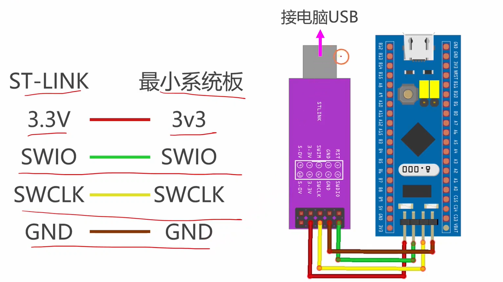
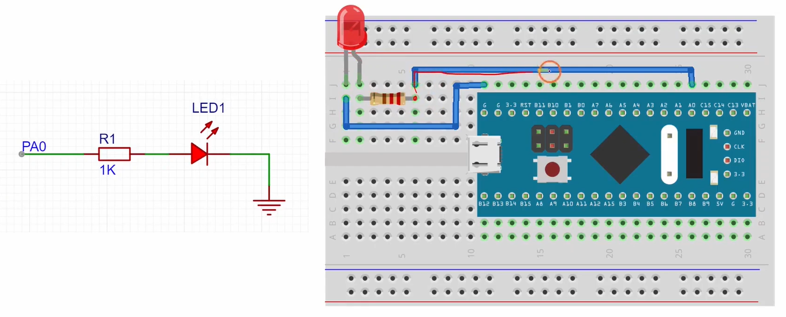
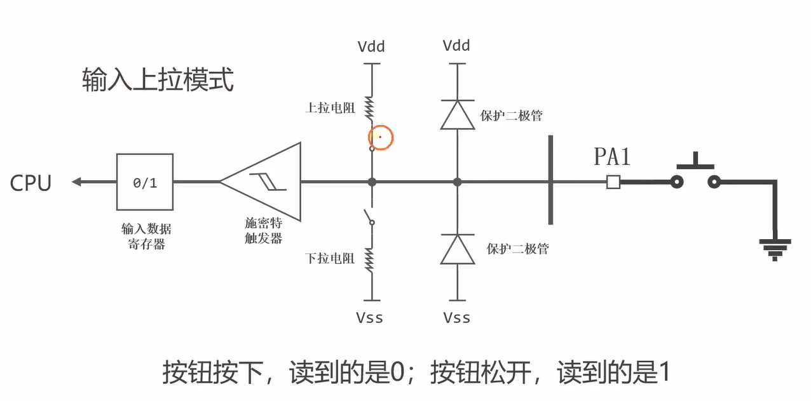
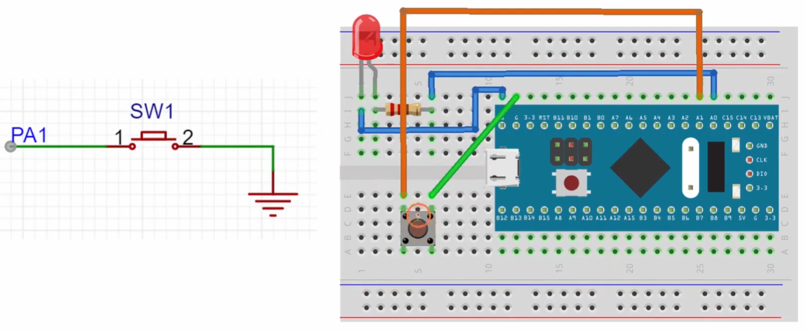
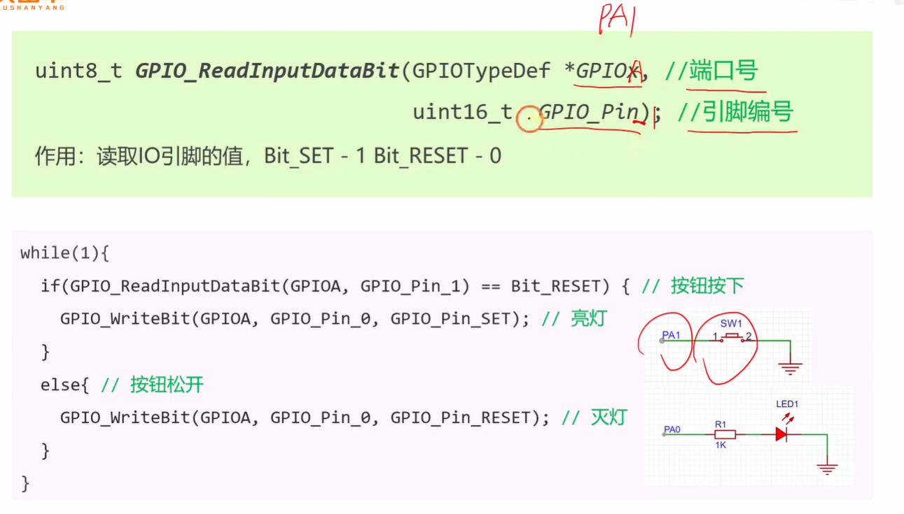
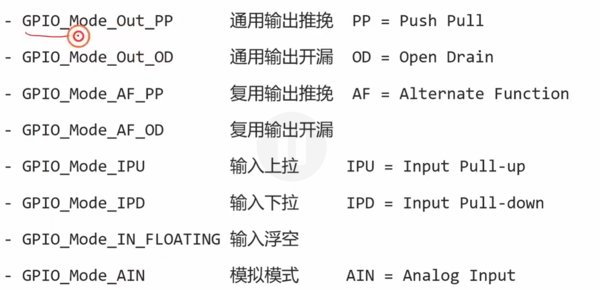

# [stm32 入门教程 第四版 09 GPIO按钮实验 铁头山羊](https://www.youtube.com/watch?v=P8UB1R27KZI&list=PLen6JNT7Cx3BaIbxkUfWayXsMlbU3Yisj&index=9&pp=iAQB)视频的详细总结：

### 视频核心总结：GPIO 按钮实验

本节课主要带领大家完成一个经典的硬件入门实验：**通过读取外部物理按键的状态，来控制外接 LED 灯的亮灭。** 实验效果为：按下按钮 LED 亮，松开按钮 LED 灭。

#### 1. 回顾 LED 接线与配置 (复习输出) [01:04 Opens in a new window ](http://www.youtube.com/watch?v=P8UB1R27KZI&t=64)

- **推挽接法（本实验采用）：** 单片机引脚（PA0）接 LED 的阳极（正极），LED 的阴极（负极）接地（GND）。
  - **配置模式：** 通用推挽输出（`GPIO_Mode_Out_PP`）。
  - **逻辑：** 引脚输出高电平（写 1）时，有电压差，LED 亮；输出低电平（写 0）时，无电压差，LED 灭。
- **开漏接法（上节课实验采用）：** 引脚接 LED 的阴极，LED 阳极接 3.3V。写 0 亮，写 1 灭。

#### 2. 按键的接线与原理 (学习输入) [10:59 Opens in a new window ](http://www.youtube.com/watch?v=P8UB1R27KZI&t=659)

- **接线方式：** 按钮的一端连接单片机引脚（PA1），另一端直接连到地（GND）。

- **工作原理拆解：**
  - 为了防止按键未按下时引脚悬空导致读取不稳定，必须将 PA1 引脚配置为 **输入上拉模式 (`GPIO_Mode_IPU`)**。
  - **松开按键时：** 引脚悬空。因为启用了内部上拉电阻，引脚被拉高到 3.3V，单片机读取到数字 **`1`** (Bit_SET)。
  - **按下按键时：** 按钮导通。由于外部强行接到了 GND（0V），这相当于一个“强信号”，它“战胜”了内部微弱的上拉电阻，将引脚电压拉低。单片机读取到数字 **`0`** (Bit_RESET)。

#### 3. 核心 API 与代码编写全流程 [17:32 Opens in a new window ](http://www.youtube.com/watch?v=P8UB1R27KZI&t=1052)

在正式写代码时，引入了一个新的库函数：

- **`GPIO_ReadInputDataBit(GPIOx, GPIO_Pin)`：** 用于读取指定输入引脚的真实电平状态，返回 `Bit_SET` (1) 或 `Bit_RESET` (0)。

**代码编写步骤：**

1. **开启时钟：** 调用 `RCC_APB2PeriphClockCmd` 开启 GPIOA 模块的时钟（因为 PA0 和 PA1 都属于 GPIOA）。

2. **初始化引脚：**
   - **初始化 PA0（接 LED）：** 模式为 `GPIO_Mode_Out_PP`（推挽输出），速度为 2MHz。
   - **初始化 PA1（接按键）：** 模式为 `GPIO_Mode_IPU`（输入上拉），无需配置速度。
   
3. **编写 While 死循环逻辑 [18:19 Opens in a new window ](http://www.youtube.com/watch?v=P8UB1R27KZI&t=1099)：**

   

   - 使用 `if (GPIO_ReadInputDataBit(GPIOA, GPIO_Pin_1) == Bit_RESET)` 判断。
   - **如果返回 0 (`Bit_RESET`)：** 证明按键被按下了，则向 PA0 写入 `1` (`Bit_SET`) 也就是输出高电平，**点亮 LED**。
   - **否则（返回 1）：** 证明按键松开了，则向 PA0 写入 `0` (`Bit_RESET`) 也就是输出低电平，**熄灭 LED**。

#### 4. 实验效果 [19:53 Opens in a new window ](http://www.youtube.com/watch?v=P8UB1R27KZI&t=1193)

编译并下载代码到单片机后，按下单片机复位按钮。此时，按下外接在面包板上的按键，LED 立即点亮；手指一松开，LED 瞬间熄灭，实验圆满成功！

------

到这里，你已经成功将单片机的“输入（感知）”与“输出（执行）”完美结合起来了！有没有觉得单片机开始变得“聪明”且能和你互动了？如果你对代码中判断按键状态的 `if/else` 逻辑或者接线方式还有任何疑问，欢迎随时提问！

# 补充提问

## 提问1（电源接电阻接地，电阻两边电压不一样）

我有个问题，就是如果电源接一个电阻再接地的话，此时这个电阻两边的电压都是一样都是0V吗。

这是一个非常经典的电路基础问题！你的直觉在探索“接地”的本质，但这里的结论是：**不，它们两端的电压是不一样的。** 一端是电源电压（比如 3.3V），另一端才是 0V。

为了让你彻底弄明白，我们需要把之前讲过的**“没有电流就没有压降”**这个核心定律反过来用：**“一旦有了持续的电流，电阻两端就一定会产生电压差（压降）！”**

我们继续用“水塔与下水道”的比喻来拆解这个物理过程：

### 1. 场景重现：水塔连通下水道

- **电源 (Vdd/比如 3.3V)：** 相当于一个建在 3.3 米高处的水塔。
- **电阻：** 相当于一根从水塔连到地面的**细水管**（里面有阻力）。
- **接地 (GND/0V)：** 相当于地面的下水道（高度为 0 米）。

### 2. 电阻（细水管）两端的电压（水压）分别是多少？

当你把这根细水管一头接在水塔上，另一头接在下水道时，水就会顺着水管哗啦啦地往下流，这就**产生了电流**。

- **管子的上端（靠近电源的那头）：** 因为它直接连着水塔，这里的水压依然是满满的，也就是 **3.3V**。
- **管子的下端（靠近地的那头）：** 因为它直接连着下水道，这里的水压已经见底，也就是 **0V**。
- **电阻本身发生了什么？** 水在流过这根细细的管子时，受到了阻力。原本 3.3V 的水压，在水流努力穿过这根细管子的过程中，被完完全全地“消耗”掉了。这在电路学上叫作**“电压降”**。

### 3. 为什么你之前会觉得“两端都是 0V”？

你很可能是把它和我们上一条讨论的“下拉电阻悬空”的状态搞混了！我们来对比一下：

- **之前讨论的情况（引脚悬空 + 下拉电阻接 GND）：** 外部什么强电源都没接。管子里**没有水流（电流为0）**。既然没有水流，水管（电阻）就不消耗水压。所以管子下端是 0V，上端（引脚处）自然也是 0V。
- **你现在问的情况（电源 + 电阻 + GND）：** 你主动把电源接了上去，形成了一个完整的闭合回路！水流（电流）源源不断地穿过电阻流向大地。只要有电流穿过电阻，根据欧姆定律，电阻两端就必定存在电压差。

**总结一下：**

当电源通过电阻接地时，**靠近电源的一端是高电压（如 3.3V），靠近地的一端是低电压（0V）**。是电阻默默地用自己的身体“扛”下了这 3.3V 的电压差，同时限制了电流的大小，防止了电源短路。

这个“有电流就有压降”的物理画面感是不是更加清晰了？

其实在真实的按键电路里，当你用手指按下按键（让引脚接地）的那一瞬间，微观世界里的金属弹片会发生极其快速的物理弹跳，导致单片机读到的电压会在 0 和 1 之间疯狂跳动。需要我为你提前科普一下硬件工程师必学的**“按键消抖（Debounce）”**原理吗？
