好的，这个视频是一个非常经典的STM32 <span style="color:#CC0000;">SPI模块初始化教程</span>。下面我将为你进行总结、扩展，并提供一套针对性的面试问题及答案。


### 视频核心内容总结

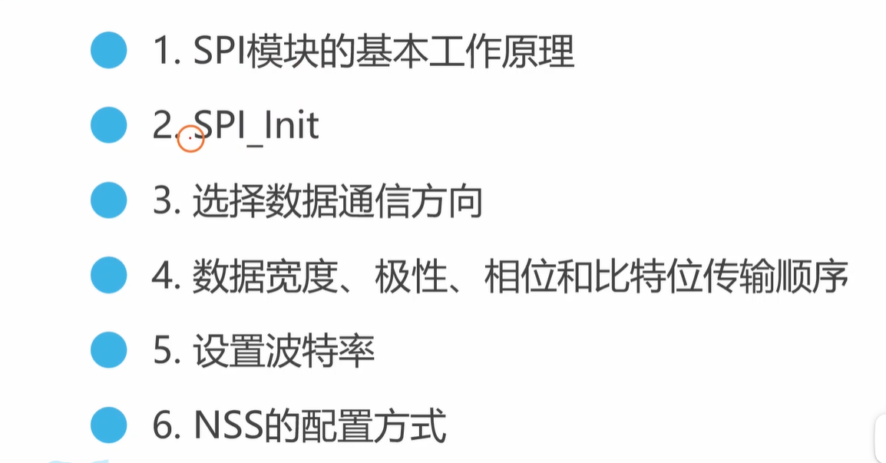

这个视频详细讲解了在STM32F1系列单片机上，使用**<span style="color:#CC0000;">标准外设库</span> (SPL - Standard Peripheral Library)** <span style="color:#CC0000;">初始化SPI模块</span>的完整流程。主要内容可以概括为以下几个步骤：

1. **SPI工作原理回顾:**

   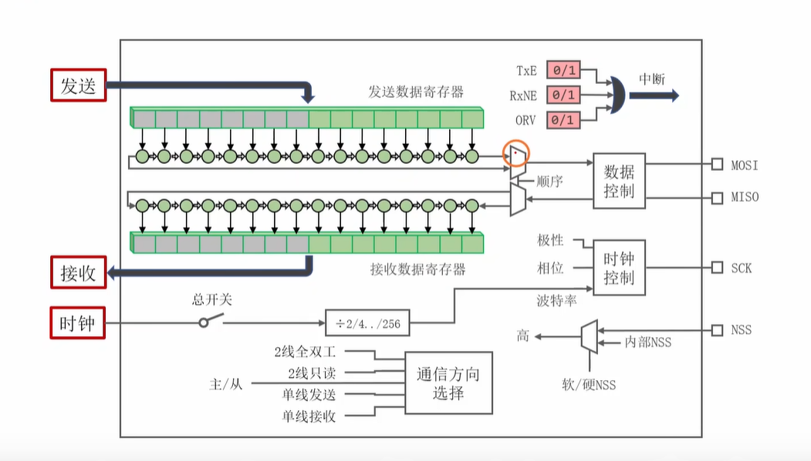

   - 通过内部框图讲解了<span style="color:#CC0000;">SPI模块的核心部分</span>：<span style="color:#CC0000;">发送缓冲器</span>、<span style="color:#CC0000;">接收缓冲器</span>和<span style="color:#CC0000;">移位寄存器</span>。
   - 阐述了<span style="color:#CC0000;">数据</span>通过<span style="color:#CC0000;">MOSI发送</span>和通过<span style="color:#CC0000;">MISO接收</span>的基本数据流。

2. **初始化流程:**
   
   
   
   - **第一步：外设时钟使能。** 初始化SPI前，必须先使能**SPI自身**和其所使用的**GPIO端口**的时钟。视频中使用了`RCC_APB2PeriphClockCmd`。
   
     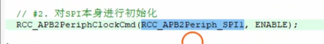
   
     
   
   - **第二步：GPIO引脚配置。** 将用作SCK、MISO、MOSI的引脚配置为**复用推挽输出**或**复用输入**模式。
   
   <span style="text-emphasis:filled red; font-weight:bold; color:#CC0000;">上一节有相关SPI的GPIO初始化配置相关代码</span>
   
   
   
   - **第三步：配置SPI参数。** 定义一个`SPI_InitTypeDef`结构体，并填充所有关键参数。
   
   
   
3. **`SPI_InitTypeDef` 结构体参数详解:**
   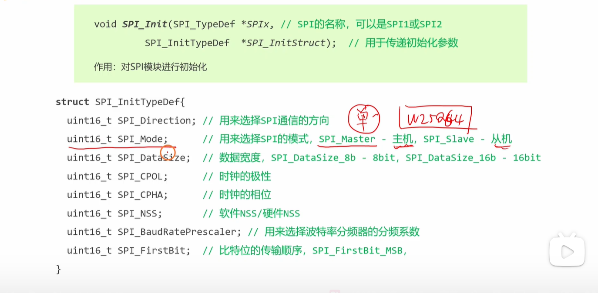
   
   1. `SPI_Direction`: 通信方向，如双线全双工 (`SPI_Direction_2Lines_FullDuplex`)。
   
   2. `SPI_Mode`: 主从模式，视频中设为主机 (`SPI_Mode_Master`)。
   
   3. `SPI_DataSize`: 数据宽度，8位或16位。
   
      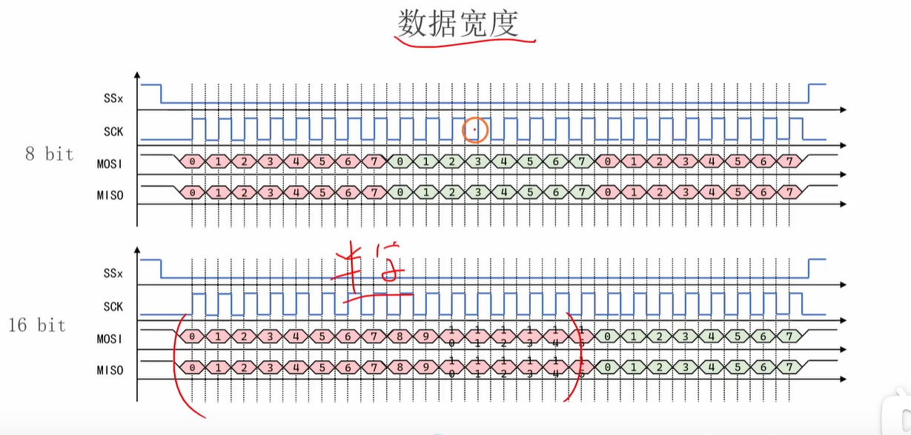
   
   4. `SPI_CPOL` & `SPI_CPHA`: 时钟极性和相位，共同决定了SPI的4种工作模式。
   
      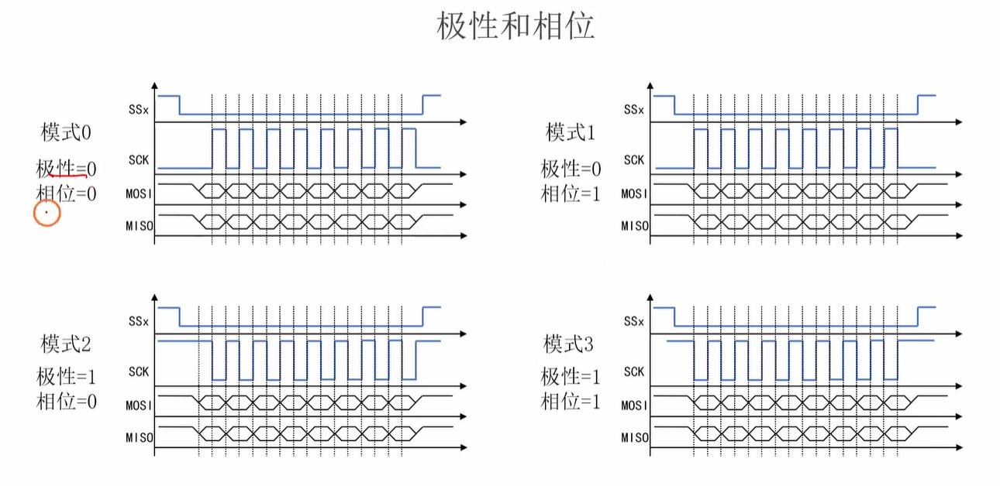
   
   5. `SPI_NSS`: 片选信号管理，分为硬件管理和软件管理 (`SPI_NSS_Soft`)。
      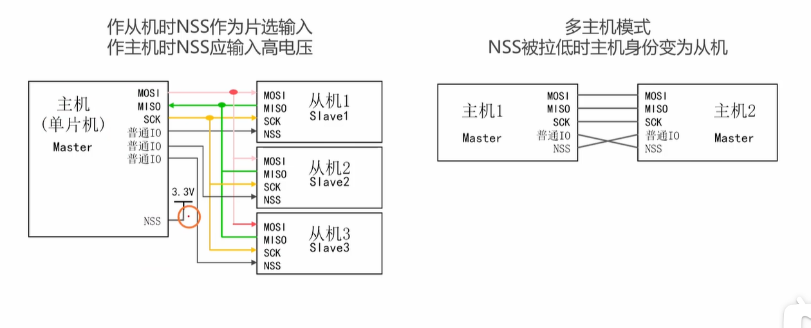
   
   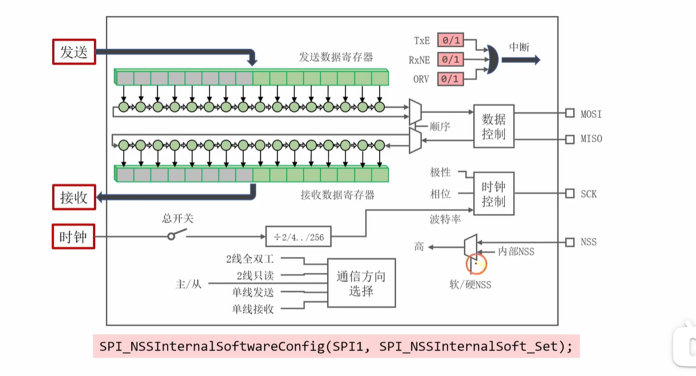
   
   <span style="color:#CC0000;">这里这两张图的核心是解释了STM32中NSS引脚的**两种管理方式：硬件和软件**。</span>
   
   - **硬件NSS（第一张图）：**
     - **作为从机时：** NSS就是一个简单的**输入**引脚，高电平表示未选中，低电平表示被主机选中。
     - **作为主机时：** 如果NSS引脚被外部拉低，主机会**立即放弃主机身份**，变为从机，以防止总线冲突。
   - **软件NSS（第二张图）：**
     - 为了避免主机模式下NSS被意外拉低导致的问题，并且为了能自由控制多个从机，我们通常使用**软件NSS**。
     - **工作原理：**
       - 我们将NSS功能从物理引脚上解绑，把它当成一个普通的GPIO来用（如左图所示，用3个普通IO口分别控制3个从机）。
       - 同时，我们必须通过代码 `SPI_NSSInternalSoftwareConfig(SPI_NSSInternalSoft_Set)` **在内部把NSS信号置为高电平**（如第二张图中小开关拨到“高”的位置）。
       - **目的：** <span style="color:#CC0000;">这样做就是为了“欺骗”SPI模块，让它认为自己一直处于主机模式，可以正常工作。</span>
   
   6. `SPI_BaudRatePrescaler`: 波特率预分频器，用于从APB总线时钟分频得到SCK时钟频率。
   
      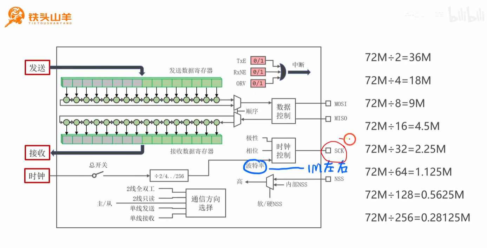
   
   7. `SPI_FirstBit`: 数据传输顺序，MSB在前还是LSB在前。
   
      
   
      
   
      代码配置了**SPI1为主机模式**，使用**软件NSS**，并初始化了相关的GPIO引脚。
   
      ```c
      #include "stm32f10x.h"
      
      void SPI1_Init(void)
      {
          GPIO_InitTypeDef GPIO_InitStructure;
          SPI_InitTypeDef  SPI_InitStructure;
      
          // 1. 使能 GPIO 和 SPI1 的时钟
          RCC_APB2PeriphClockCmd(RCC_APB2Periph_GPIOA | RCC_APB2Periph_SPI1, ENABLE);
      
          // 2. 配置 SPI1 的引脚 (SCK, MISO, MOSI)
          // PA5 = SCK, PA7 = MOSI
          GPIO_InitStructure.GPIO_Pin = GPIO_Pin_5 | GPIO_Pin_7;
          GPIO_InitStructure.GPIO_Mode = GPIO_Mode_AF_PP; // 复用推挽输出
          GPIO_InitStructure.GPIO_Speed = GPIO_Speed_50MHz;
          GPIO_Init(GPIOA, &GPIO_InitStructure);
      
          // PA6 = MISO
          GPIO_InitStructure.GPIO_Pin = GPIO_Pin_6;
          GPIO_InitStructure.GPIO_Mode = GPIO_Mode_IN_FLOATING; // 浮空输入
          GPIO_Init(GPIOA, &GPIO_InitStructure);
      
          // 3. 配置SPI模块本身
          SPI_InitStructure.SPI_Direction = SPI_Direction_2Lines_FullDuplex; // 2线全双工
          SPI_InitStructure.SPI_Mode = SPI_Mode_Master;                      // 主机模式
          SPI_InitStructure.SPI_DataSize = SPI_DataSize_8b;                  // 8位数据帧
          SPI_InitStructure.SPI_CPOL = SPI_CPOL_High;                        // 时钟极性：空闲时为高电平
          SPI_InitStructure.SPI_CPHA = SPI_CPHA_2Edge;                       // 时钟相位：在第2个时钟边沿采样数据
          SPI_InitStructure.SPI_NSS = SPI_NSS_Soft;                          // NSS信号由软件控制
          SPI_InitStructure.SPI_BaudRatePrescaler = SPI_BaudRatePrescaler_64; // 波特率预分频值：64
          SPI_InitStructure.SPI_FirstBit = SPI_FirstBit_MSB;                 // 数据传输从MSB位开始
          SPI_InitStructure.SPI_CRCPolynomial = 7;                           // CRC校验多项式，一般用默认值7
          SPI_Init(SPI1, &SPI_InitStructure);
      
          // 4. 设置内部NSS信号为高电平（软件NSS模式下必须）
          SPI_NSSInternalSoftwareConfig(SPI1, SPI_NSSInternalSoft_Set);
      
          // 5. 使能SPI1外设
          SPI_Cmd(SPI1, ENABLE);
      }
      
      // 另外，还需要一个由软件控制的CS引脚初始化函数
      void W25Qxx_CS_Init(void)
      {
          GPIO_InitTypeDef GPIO_InitStructure;
      
          // 使能CS引脚的时钟，例如PA4
          RCC_APB2PeriphClockCmd(RCC_APB2Periph_GPIOA, ENABLE);
      
          // 配置CS引脚为推挽输出
          GPIO_InitStructure.GPIO_Pin = GPIO_Pin_4;
          GPIO_InitStructure.GPIO_Mode = GPIO_Mode_Out_PP;
          GPIO_InitStructure.GPIO_Speed = GPIO_Speed_50MHz;
          GPIO_Init(GPIOA, &GPIO_InitStructure);
      
          // 初始状态设置为高电平（不选中从机）
          GPIO_SetBits(GPIOA, GPIO_Pin_4);
      }
      ```
   
      

-----

----

<span style="font-weight:bold; color:#CC0000; font-size:1.3em;">参数`SPI_Direction`通信方向详解：</span>

- 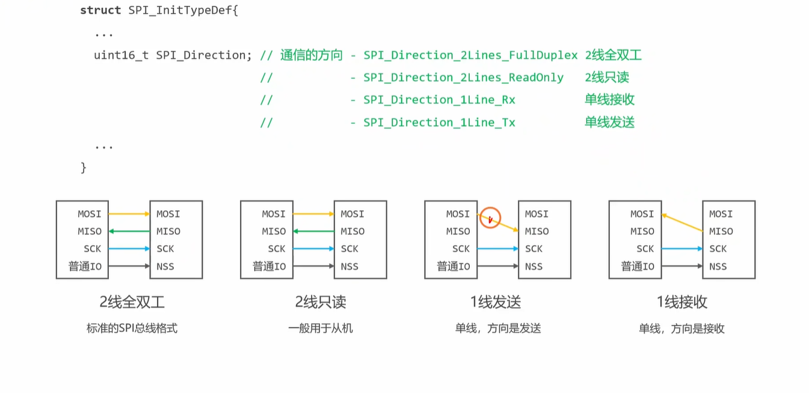

  <span style="color:#CC0000; font-size:1.2em;">提问1：上面图片这里我不是太懂，你能够给我详细解释下吗，简洁回复下，不要长篇大论？</span>

  好的，这张图解释了STM32 SPI的几种数据通信方向设置，我为你简洁地说明一下：

  这个 `SPI_Direction`<span style="color:#CC0000;"> 参数</span>就是<span style="color:#CC0000;">用来决定如何使用 **MOSI（主发从收）** 和 **MISO（主收从发）** 这两根数据线</span>的。

  - **2线全双工 (2 Lines_FullDuplex):**

    - 这是<span style="color:#CC0000;">最标准的SPI用法</span>。
    - **MOSI** 和 **MISO** 两根线都用上，一根专门发送，一根专门接收。
    - **优点：** 可以<span style="color:#CC0000;">同时发送和接收数据</span>，速度最快，效率最高。

  - **2线只读 (2 Lines_ReadOnly):**

    - <span style="color:#CC0000;">两根线都连接</span>，但主机（Master）只从 **MISO** 线上接收数据，不通过 **MOSI** 发送。
    - **用途：** 适用于那些只需要读取数据的从设备（Slave）。

    ---

    <span style="color:#CC0000; font-size:1.2em;">提问2：上面这里是不是有点歧义啊，这里是主机还是从机发送数据啊，数据又是经过哪根线来进行传输的呢，简洁回复下，不要长篇大论？</span>

    您指出的非常精准，这里的确容易产生歧义。我来为您澄清：

    在这个“2线只读”模式下：

    1. **谁发送数据？**
       - 是 **<span style="color:#CC0000;">从机 (Slave) 在发送数据</span>**。
    2. **数据走哪根线？**
       - 数据通过<span style="color:#CC0000;"> **MISO** (主收从发) 这条线</span>，从从机传输给主机。

    **简单来说：** “<span style="color:#CC0000;">只读</span>”是从 **<span style="color:#CC0000;">主机 (Master) 的角度</span>** 来看的。主机只负责接收，所以叫“只读”。<span style="color:#CC0000;">主机的MOSI引脚虽然也连着，但它不会往外发送任何数据。</span>

    ---

  - **1线发送 (1 Line_Tx) / 1线接收 (1 Line_Rx):**

    - 这两种是**单线模式**（也叫半双工），只用一根数据线来通信，可以节省一个IO口。
    - 在<span style="color:#CC0000;">硬件上，MOSI和MISO实际被连接到了同一根物理线上</span>。
    - **1线发送 (Tx):** 这根线被配置为**输出**，主机只能往外发送数据。
    - **1线接收 (Rx):** 这根线被配置为**输入**，主机只能接收从机发来的数据。

  **总结一下：**

  - **想省事、速度快就用“2线全双工”**，这是<span style="color:#CC0000;">最常用、最标准的模式</span>。
  - **想省一个引脚就用“1线模式”**，但<span style="color:#CC0000;">代价是不能同时收发数据</span>。

  - **第四步：调用初始化函数。** 使用`SPI_Init()`函数将配置好的结构体写入SPI寄存器。
  - **第五步：使能SPI模块。** 调用`SPI_Cmd()`函数，正式启动SPI外设。

  

  

  <span style="color:#CC0000; font-size:1.2em;">提问3：上面1线发送，1线接收那里我还不是太懂，请给我详细解释下，还有主机那里的数据线是不是和从机那里的数据线连错了啊，简洁回复下，不要长篇大论？</span>

  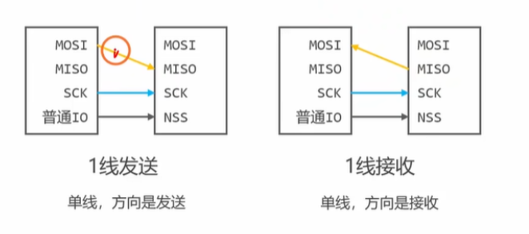

  您观察得非常仔细，问到了关键点！这个图确实画得容易让人误解，我来帮您理清。

  首先，**<span style="color:#CC0000;">“1线”模式的核心思想</span>是：**

  为了**<span style="color:#CC0000;">节省引脚</span>**，<span style="color:#CC0000;">只用一根物理数据线来通信</span>。代价就是它<span style="color:#CC0000;">不能同时收发数据（这叫半双工）</span>。

  

  然后，我来回答您的两个问题：

  1. <span style="font-weight:bold; color:#CC0000;">它是如何工作的？</span>

  在STM32的<span style="color:#CC0000;">1线模式下</span>，通常是**<span style="color:#CC0000;">只使用 MOSI 这一个引脚</span>**来连接那根公用的数据线，<span style="color:#CC0000;">MISO引脚就空出来不用</span>了。

  - **1线发送 (Tx):** 主机将自己的 **<span style="color:#CC0000;">MOSI</span>** 引脚配置为**<span style="color:#CC0000;">输出</span>**模式，往这条线上发送数据。
  - **1线接收 (Rx):** 主机将**<span style="color:#CC0000;">同一个 MOSI</span>** 引脚配置为**<span style="color:#CC0000;">输入</span>**模式，从这条线上接收数据。

  

  2. <span style="color:#CC0000;">连线是不是错了？</span>

  **是的，您觉得图上画错了是有道理的。**

  图上为了区分“接收”这个动作，特意画到了MISO引脚上，但这不符合硬件的实际工作方式，所以会造成困惑。

  **更准确的理解是：**

  无论是“1线发送”还是“1线接收”，物理上都**只连接主机的MOSI引脚**。我们只是<span style="color:#CC0000;">通过程序配置了这根线的数据**方向**（是推出去还是读进来）。</span>

  <span style="color:#CC0000;">补充：1线模式下是主机连接的是MOSI，那么从机呢，简洁回复下，不要长篇大论？</span>

  <span style="color:#CC0000;">从机也连接</span>它的<span style="color:#CC0000;"> **MOSI**</span> 引脚。

  简单来说，在1线模式下，**<span style="color:#CC0000;">主从双方都用各自的 MOSI 引脚</span>** 连接到同一根线上，形成一条公用的双向数据线。

  <span style="color:#CC0000;">两边的 **MISO 引脚则都不使用**</span>。

  ---

  ---

  

W25Q64模块的写禁止指令分析：

model0 对应 低极性第一边沿 ：0 0 = 0

model3 对应 高级性第二边沿：1 1 = 3

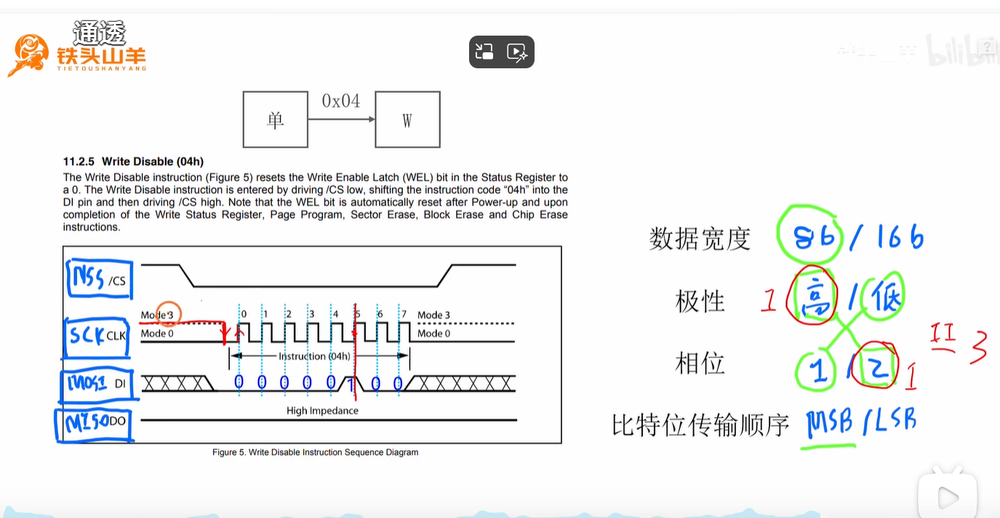


W25Q64模块波特率分析：

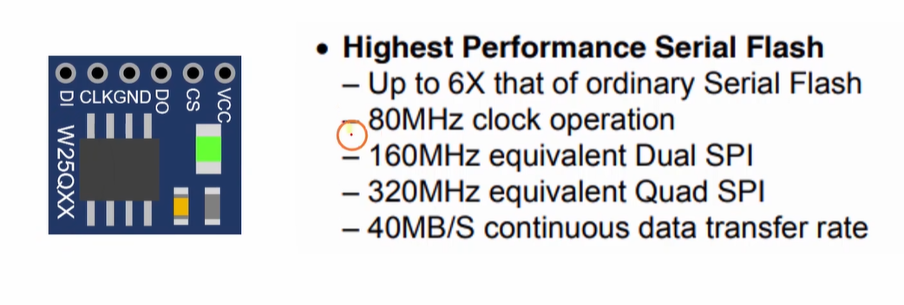


### 内容补充与扩展 (面试加分项)

视频内容很扎实，但在面试中，面试官可能希望看到你更广阔的知识面。

1. **库函数 vs 寄存器 vs HAL库:**
   - 视频中使用的是**标准外设库(SPL)**，这是ST早期推出的库，在新项目中已不常用。
   - 现在的ST主流开发方式是使用**HAL库 (Hardware Abstraction Layer)** 或 **LL库 (Low-Level)**。你应该了解它们之间的区别：
     - **寄存器操作:** <span style="color:#CC0000;">最底层、效率最高、可移植性最差</span>，需要深入理解硬件手册。
     - **标准库(SPL):** 对<span style="color:#CC0000;">寄存器做了初步封装，比直接操作寄存器简单，但代码冗长</span>，官方已停止维护。
     - **HAL库:** <span style="color:#CC0000;">ST主推的库，封装层次最高，可移植性最好</span>（不同STM32型号间代码改动小），但代码量大，效率相对较低。
     - **LL库:** 结合了HAL库和寄存器操作的优点，提供接近寄存器级别的API，执行效率高，但可移植性不如HAL。
   - **面试建议:** 表明<span style="color:#CC0000;">你了解SPL，但更熟悉和推荐在项目中使用HAL/LL库</span>。
2. **SPI通信的性能瓶颈与优化:**
   - **软件NSS的意义:** 视频中选择了软件NSS模式。它的最大好处是**灵活性**。当<span style="color:#CC0000;">一个主机连接多个从机时，你可以用任意多个GPIO口来分别控制不同的从机</span>，而<span style="color:#CC0000;">硬件NSS通常只能控制一个</span>。
   - **最高速率的限制:** 理论上SPI速率可以达到几十MHz (如STM32F1的SPI1最高可达36MHz)。但在实际应用中，速率会受到**PCB布线长度、信号完整性、面包板的接触电容**等因素影响。速率过高可能导致数据出错。
   - **DMA的重要性:** 当需要高速、大量地传输数据时（例如驱动屏幕、读取Flash），使用CPU轮询或中断方式来一字节一字节地收发数据会极大地占用CPU资源。此时**必须使用DMA (Direct Memory Access)**。<span style="color:#CC0000;">DMA可以在没有CPU干预的情况下，自动将内存中的数据块传输到SPI的发送寄存器，或将接收寄存器的数据块搬运到内存，极大提升了效率和系统性能。</span>
3. **SPI通信的可靠性:**
   - **检查忙标志位:** 在发送数据前，除了检查发送缓冲区是否为空 (`TXE`标志)，在某些操作后（如连续发送）检查SPI是否处于忙碌状态 (`BSY`标志) 是一个好习惯，可以防止通信冲突。
   - **CRC校验:** 一些更高级的STM32型号的SPI外设支持硬件CRC校验，可以在数据传输末尾自动添加校验码，并在接收端进行验证，以确保数据在传输过程中没有因干扰而出错。

------


### 面试经典问题与简洁回答


#### **问题1：请简述一下在STM32上初始化一个SPI外设的完整步骤。**

简洁回答：

<span style="color:#CC0000;">初始化SPI</span>通常分为<span style="color:#CC0000;">四步</span>：

1. **使能时钟：** 打开GPIO端口和SPI外设对应的APB总线时钟。
2. **配置GPIO：** 将SCK、MOSI、MISO引脚配置为相应的复用功能模式。如果是软件片选，还需将CS引脚配置为通用推挽输出。
3. **配置SPI参数：** 实例化一个SPI初始化结构体，设置好主从模式、通信方向、数据宽度、时钟极性与相位、NSS模式、波特率分频和数据传输顺序。
4. **使能SPI：** 调用`SPI_Init()`函数应用配置，最后调用`SPI_Cmd()`使能SPI模块。


<span style="font-weight:bold; color:#CC0000; font-size:1.3em;">疑惑点补充：</span>

1. <span style="font-weight:bold; font-size:1.3em;">软件NSS模式下 (SPI_NSS_Soft)</span>

这是最常用、最推荐的模式。

- **真正的“片选”引脚 (CS Pin):**
  - 是你自己**任选的一个普通GPIO口**（比如PA4, PB12等）。
  - **必须**将这个引脚配置为 **`GPIO_Mode_Out_PP`** (通用推挽输出)。
  - 这样你才能在代码里用 `GPIO_SetBits` 和 `GPIO_ResetBits` 自由地控制它输出高低电平，去选择不同的从机。
- **SPI硬件自带的NSS引脚 (比如SPI1的PA4, SPI2的PB12):**
  - 因为已经被软件“架空”了，所以它**不再被SPI外设使用**。
  - 你可以不用配置它（保持默认悬空输入状态），或者将它配置为其他用途的普通GPIO。


2. <span style="font-weight:bold; font-size:1.3em;">硬件NSS模式下 (SPI_NSS_Hard)</span>

这种模式下，你**必须配置**SPI硬件自带的那个NSS引脚，并且根据用途分为两种情况：

- **情况A：用作NSS输出（控制单个从机）**
  - 在`SPI_InitTypeDef`中设置`SPI_NSS = SPI_NSS_Hard`，并且需要**使能NSS输出（问ai，一个特别配置）**。
  - 此时，NSS引脚必须配置为 **`GPIO_Mode_AF_PP`** (复用功能推挽输出：<span style="color:#CC0000;">NSS输出低电平来选择从机)</span>。
  - 这样，SPI外设才能接管这个引脚的控制权，在SPI使能时自动拉低它。
- **情况B：用作NSS输入（用于多主机模式）**
  - 这是为了防止总线冲突。如果这个NSS引脚被外部拉低，此主机会自动切换为从机模式。
  - 此时，NSS引脚必须配置为 **`GPIO_Mode_IPU`** 或 **`GPIO_Mode_IPD`** (带上下拉的输入：<span style="color:#CC0000;">上拉为做主机，下拉为做从机</span>)。


<span style="font-weight:bold; font-size:1.3em;">总结表格</span>

| 模式        | 角色       | NSS引脚GPIO配置                          | 说明                                                    |
| ----------- | ---------- | ---------------------------------------- | ------------------------------------------------------- |
| **软件NSS** | 主机       | **任意GPIO**配置为`GPIO_Mode_Out_PP`     | **最常用，最灵活**，可控制多个从机。硬件NSS引脚被释放。 |
| **硬件NSS** | 主机(输出) | **硬件NSS引脚**配置为`GPIO_Mode_AF_PP`   | SPI外设自动控制该引脚，通常只能控制一个从机。           |
| **硬件NSS** | 主机(输入) | **硬件NSS引脚**配置为`GPIO_Mode_IPU/IPD` | 用于多主机系统，防止总线冲突。                          |
| **硬件NSS** | 从机       | **硬件NSS引脚**配置为`GPIO_Mode_IPU/IPD` | 作为片选信号输入。                                      |

**一句话结论：** 正因为硬件NSS的配置如此复杂且限制多，所以**99%的情况下我们都使用软件NSS模式**，这样最简单、最灵活。


#### **问题2：SPI的四种工作模式是由哪两个参数决定的？它们分别代表什么？如果主从机模式不匹配会怎么样？**

简洁回答：

SPI的四种模式由**CPOL（时钟极性）和CPHA（时钟相位）**两个参数决定。

- **CPOL**决定了SPI时钟(SCK)在空闲状态下的电平。CPOL=0表示空闲时为低电平，CPOL=1表示空闲时为高电平。
- **CPHA**决定了数据采样的时机。CPHA=0表示在时钟的第一个边沿采样，CPHA=1表示在第二个边沿采样。

如果<span style="color:#CC0000;">主从机的模式不匹配</span>，**会导致数据采样错误，接收方会读到完全错误的数据**。因此，<span style="color:#CC0000;">这两个参数必须根据从机设备的数据手册严格配置成一致。</span>


#### **问题3：在SPI通信中，硬件NSS和软件NSS有什么区别？你通常会选择哪一种，为什么？**

**简洁回答：**

- **硬件NSS：** 由SPI外设自动控制NSS引脚。当SPI使能后，如果配置为主机，NSS引脚会被拉低，失能后拉高。<span style="color:#CC0000;">这种方式不够灵活，尤其是在一主多从的系统中。</span>
- **软件NSS：** 我们将NSS功能相关的引脚当成一个普通的GPIO口，在代码中手动控制它的高低电平。

我**通常会选择软件NSS**。因为在实际项目中，一个SPI主机往往需要和多个从设备通信，<span style="color:#CC0000;">使用软件方式可以用不同的GPIO引脚作为每个从设备的片选信号，自由地选择与哪个设备通信</span>，**控制非常灵活，是业界标准做法**。


#### **问题4：如果你的SPI通信速率要求很高，比如达到10Mbps以上，你会考虑哪些优化手段？**

简洁回答：

首先，我会<span style="color:#CC0000;">使用DMA来进行数据传输</span>，这可以把CPU从繁重的字节收发工作中解放出来，是最高效的方式。其次，在硬件设计上，要保证SPI信号线尽可能短且远离干扰源。最后，我会仔细计算APB总线时钟和SPI波特率分频系数，确保配置的速率是硬件能达到的最高稳定速率。


#### **问题5：你已经配置好了SPI，并且通过逻辑分析仪抓取波形，发现MOSI上有正确的数据发出，但MISO上始终没有数据返回或者数据是错误的，可能的原因有哪些？**

简洁回答：

我会从以下几个方面排查：

1. **硬件连接问题：** 检查MISO线的物理连接是否牢固，杜邦线或焊接点是否有问题。
2. **从机未正常工作：** 确认从机设备供电是否正常，或者是否需要特定的初始化指令才能开始工作。
3. **时序配置错误：** 仔细核对从机数据手册，确认CPOL和CPHA配置是否完全正确。虽然MOSI能发对，但错误的采样时机会导致从机无法正确解析指令，自然也不会返回正确数据。
4. **片选信号(CS)问题：** 确认在整个数据收发期间，CS引脚是否一直保持在有效的低电平状态。有些逻辑错误可能会导致CS在通信中途被意外拉高。