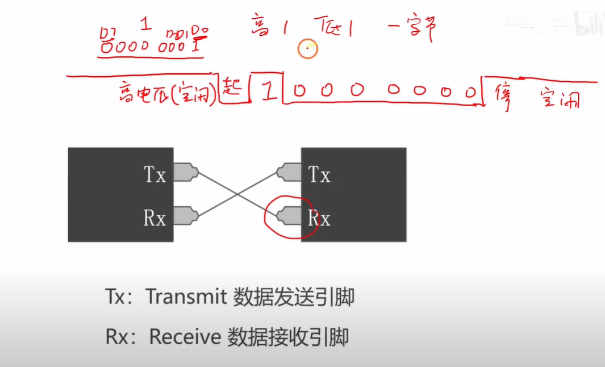
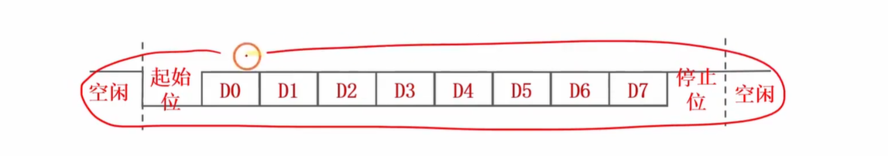
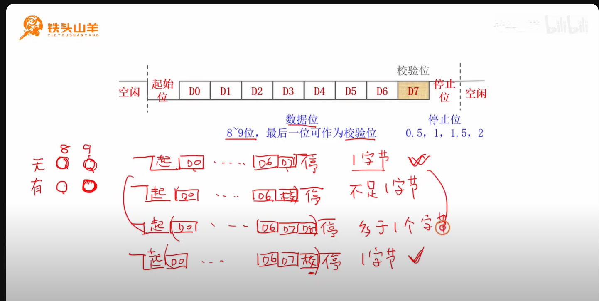
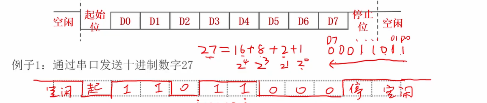
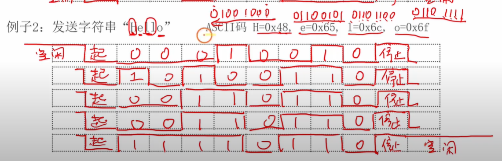

# STM32 串口通信协议

这份YouTube视频教程由“铁头山羊”主讲，**详细介绍了STM32微控制器中的串口通信协议**。视频首先解释了**串口作为数据传输接口的基本概念**，并通过示例展示了两个芯片之间如何通过串口传输数据。接着，教程深入探讨了**串口数据帧的特定格式**，包括起始位、数据位和停止位，并演示了如何传输十进制数和字符串。最后，视频还讨论了**串口数据帧的可配置参数**，如数据位长度、奇偶校验位的使用（奇校验和偶校验）以及停止位长度，并举例说明了校验位如何确保数据传输的准确性。

## STM32 串口通信协议学习指南

### 一、概述

本章主要讲解 STM32 单片机中一个重要的片上外设——串口（UART）通信协议。串口是一种常用的通信接口，用于在两个芯片之间传输数据。理解串口通信协议对于掌握 STM32 的数据传输功能至关重要。

### 二、核心概念

#### 1. 串口 (UART)

- **定义：** 一种通信接口，用于在芯片之间传输数据。
- **组成：** 通常由两个引脚组成，TX (Transmit，数据发送引脚) 和 RX (Receive，数据接收引脚)。
- **连接方式：** 发送方和接收方的 TX 和 RX 引脚需要交叉连接，以实现双向数据传输。例如，芯片 A 的 TX 连接芯片 B 的 RX，芯片 A 的 RX 连接芯片 B 的 TX。
- **数据传输方式：** 串口在导线上通过高低变化的电压来传输数据，高电压表示1，低电压表示0。

#### 2. 串口通信协议（本质上就是数据包）

- **定义：** 串口发送方和接收方之间必须遵循的数据传输格式，类似于人类交流中的共同语言。
- **重要性：** 只有采用相同的数据格式，发送方发出的数据才能被接收方正确接收。

#### 3. 串口数据帧格式

串口数据帧是串口通信的基本单位，它定义了数据传输的结构。一个完整的串口数据帧通常包括：

- **空闲状态 (Idle State)：** 串口不传输数据时，导线保持高电压。
- **起始位 (Start Bit)：** 发送方发送一个低电压，标志着数据传输的开始。接收方检测到空闲状态下的低电压时，就知道要开始接收数据。
- **数据位 (Data Bits)：** 紧随起始位之后是实际要传输的数据。高电压表示1，低电压表示0。数据位通常以字节为单位传输（即8个比特），从最低位（Bit 0）开始传输到最高位。
- **停止位 (Stop Bit)：** 数据位传输完成后，发送方发送一个高电压，标志着数据传输的结束。如果后续没有数据传输，串口将保持高电压进入空闲状态。

#### 4. 串口数据帧格式的可配置参数

串口数据帧的格式不是固定不变的，有以下几个可配置的参数：

- **数据位长度：8位数据位：** Bit 0 到 Bit 7，共8个比特位全部用于传输有效数据。每次传输一个字节。**9位数据位：** Bit 0 到 Bit 8，共9个比特位。如果禁用校验位，则全部用于传输有效数据。
- **校验位 (Parity Bit)：使能/禁止：** 可以选择是否启用校验位。
- **作用：** 用于检验数据传输过程中是否有错误。当使能校验位时，数据位的最后一个比特位（例如8位数据模式下的Bit 7，或9位数据模式下的Bit 8）将被用作校验位。
- **校验方式：奇校验 (Odd Parity)：** 要求数据位（不包括校验位）中“1”的个数为奇数。如果计算出的“1”的个数为偶数，校验位将被设置为1，使得总“1”的个数变为奇数。
- **偶校验 (Even Parity)：** 要求数据位（不包括校验位）中“1”的个数为偶数。如果计算出的“1”的个数为奇数，校验位将被设置为1，使得总“1”的个数变为偶数。
- **检验过程：** 接收方收到数据后，会计算数据位中“1”的个数，并结合校验位进行判断。如果与预期的奇偶性不符，则认为数据传输出错。
- **停止位长度：**通常为1位停止位。也可以设置为0.5位、1.5位或2位停止位，但1位停止位最为常用。

#### 5. 常用数据帧格式

在实际应用中，通常以字节为单位进行数据传输，因此最常用的两种格式是：

- **8位无校验：** 1位起始位 + 8位数据位 + 1位停止位。所有8位数据位都用于传输有效数据。
- **9位带校验：** 1位起始位 + 8位有效数据位 + 1位校验位 + 1位停止位。第九个比特位用作校验位，前八位用于传输有效数据。

### 三、数据传输示例

#### 1. 发送十进制数27

- **转换为二进制：** 十进制27 = 二进制00011011 (以8位表示)

1. **传输波形：空闲状态：** 高电压。
2. **起始位：** 低电压。

- **数据位（从Bit 0到Bit 7）：**Bit 0: 1 (高电压)
- Bit 1: 1 (高电压)
- Bit 2: 0 (低电压)
- Bit 3: 1 (高电压)
- Bit 4: 1 (高电压)
- Bit 5: 0 (低电压)
- Bit 6: 0 (低电压)
- Bit 7: 0 (低电压)

1. **停止位：** 高电压。
2. **空闲状态：** 高电压。

#### 2. 发送字符串"Hello"

- **原理：** 字符串由字符组成，每个字符对应一个 ASCII 码。串口每次发送一个字节（即一个字符的 ASCII 码）。
- **ASCII 码（以十六进制表示）：**
  - 'H': 0x48
  - 'e': 0x65
  - 'l': 0x6C
  - 'l': 0x6C
  - 'o': 0x6F
- **传输过程：** 每个字符（ASCII码）都会被转换为二进制，然后按照数据帧格式依次发送。在发送一个字符的停止位之后，紧接着是下一个字符的起始位。

### 四、校验位示例（以奇校验为例）

- **假设：** 使用9位数据位，使能奇校验。
- **传输十进制数85：**十进制85 = 二进制01010101 (8位数据)计算数据位中“1”的个数：有4个“1”（偶数）。
- **奇校验要求：** 校验位使得数据位中“1”的个数为奇数。由于目前是偶数，校验位需要补一个“1”。
- **发送数据：** 01010101（数据位）+ 1（校验位）
- **接收方检验：**接收方收到数据帧后，计算接收到的数据位（不包括校验位）中“1”的个数。
- 如果发现“1”的个数为奇数，则认为传输正确。
- 如果发现“1”的个数为偶数（例如传输过程中某个比特位发生翻转），则认为传输出错。

### 串口通信协议小测验

请用2-3句话简要回答以下问题：

1. STM32 串口（UART）是做什么用的？
2. 串口通信中，TX 和 RX 引脚的作用分别是什么？在两颗芯片之间连接时，这两个引脚应如何连接？
3. 什么是串口通信协议？为什么它在串口通信中很重要？
4. 串口数据帧在不传输数据时处于什么状态？如何标志数据传输的开始？
5. 在串口数据传输中，如何表示二进制的“0”和“1”？数据位通常以什么顺序传输？
6. 停止位在串口数据帧中的作用是什么？
7. 串口数据帧格式有哪些可配置的参数？请列举至少两个。
8. 校验位的作用是什么？奇校验和偶校验的区别是什么？
9. 假设串口数据帧采用8位无校验格式，传输一个十进制数10，其数据位（二进制）将如何排列？
10. 如果需要通过串口发送一个字符串“OK”，如何处理这个字符串以进行传输？

### 答案键

1. STM32 串口（UART）是一种片上外设，主要用于在两个芯片之间传输数据。它提供了一种标准的通信接口，使得不同设备能够进行数据交换。
2. TX (Transmit) 引脚负责发送数据，RX (Receive) 引脚负责接收数据。在两颗芯片之间连接时，芯片A的TX应连接到芯片B的RX，芯片A的RX应连接到芯片B的TX，实现交叉连接。
3. 串口通信协议是发送方和接收方之间必须遵循的数据传输格式。它之所以重要，是因为只有双方都采用相同的协议，接收方才能正确地解析和理解发送方传输的数据。
4. 串口数据帧在不传输数据时处于空闲状态，此时导线保持高电压。数据传输的开始由发送方发送一个低电压的“起始位”来标志。
5. 在串口数据传输中，高电压表示二进制的“1”，低电压表示二进制的“0”。数据位通常从最低位（Bit 0）开始，依次传输到最高位。
6. 停止位在串口数据帧中的作用是标志着一个数据帧的结束。它通常是一个高电压，告诉接收方当前数据帧的传输已经完成。
7. 串口数据帧格式的可配置参数包括数据位长度（例如8位或9位）、校验位的使能或禁止，以及停止位的长度（例如1位、0.5位、1.5位或2位）。
8. 校验位的作用是用于检验数据传输过程中是否有错误。奇校验要求数据位中“1”的个数为奇数，而偶校验要求数据位中“1”的个数为偶数，校验位会根据此规则进行设置。
9. 十进制数10转换为8位二进制是00001010。在8位无校验格式下，数据位将从Bit 0到Bit 7按顺序传输，即先传0（Bit 0），然后是1（Bit 1），0（Bit 2），1（Bit 3），0（Bit 4），0（Bit 5），0（Bit 6），0（Bit 7）。
10. 如果需要通过串口发送字符串“OK”，首先需要将字符串分解为单个字符。然后，查找每个字符对应的ASCII码，将ASCII码转换为二进制形式，并按照串口数据帧的格式（起始位、数据位、停止位）逐个字符发送。

### 建议的作文题目

1. 详细解释串口通信中的“数据帧”概念，包括其组成部分以及每个部分的作用。举例说明发送一个8位十进制数时，数据帧的波形变化。
2. 比较并对比串口数据帧中“8位无校验”和“9位带校验”两种常用格式。分析它们各自的优缺点以及适用场景。
3. 深入探讨校验位在串口通信中的作用。以奇校验为例，详细说明其工作原理、如何计算校验位，以及接收方如何利用校验位检测传输错误。
4. 假设你正在设计一个基于STM32的设备，需要通过串口与另一个设备进行通信。请讨论在选择串口通信协议参数（如数据位长度、校验位、停止位）时需要考虑的因素，并解释为什么最终会选择某种特定的配置。
5. 除了本文提及的串口通信协议，简要提及其他常见的串行通信协议（如SPI、I2C），并比较它们与串口在通信方式、复杂度、应用场景等方面的异同。

### 术语表

- **串口 (UART):** Universal Asynchronous Receiver/Transmitter 的缩写，一种通用的异步收发传输器，是 STM32 单片机中常用的片上外设，用于串行数据通信。
- **TX (Transmit):** 发送引脚，负责将数据从芯片发出。
- **RX (Receive):** 接收引脚，负责接收进入芯片的数据。
- **通信接口 (Communication Interface):** 用于设备之间传输数据和信号的物理或逻辑连接点。
- **片上外设 (On-chip Peripheral):** 集成在微控制器（如 STM32）芯片内部的功能模块，例如串口、定时器、ADC等。
- **数据格式 (Data Format):** 数据在传输或存储时遵循的特定结构和规则，确保数据能够被正确解析。
- **通信协议 (Communication Protocol):** 规定了数据在不同设备之间传输和交换时，所必须遵循的规则、格式和时序的集合。
- **空闲状态 (Idle State):** 串口在没有数据传输时所处的状态，通常表现为高电压。
- **起始位 (Start Bit):** 一个低电压的比特，标志着数据帧传输的开始。
- **数据位 (Data Bits):** 构成实际传输数据内容的比特位序列。
- **停止位 (Stop Bit):** 一个高电压的比特，标志着数据帧传输的结束。
- **字节 (Byte):** 计算机存储和传输数据的基本单位，通常由8个比特（Bit）组成。
- **比特 (Bit):** 计算机中最小的数据单位，代表二进制的0或1。
- **校验位 (Parity Bit):** 用于检测数据传输过程中是否发生错误的附加比特。
- **奇校验 (Odd Parity):** 一种校验方式，要求数据位（不含校验位）中“1”的个数加上校验位后，总“1”的个数为奇数。
- **偶校验 (Even Parity):** 一种校验方式，要求数据位（不含校验位）中“1”的个数加上校验位后，总“1”的个数为偶数。
- **ASCII 码 (ASCII Code):** 美国信息交换标准代码，一种基于拉丁字母的字符编码系统，用于表示文本字符。

## 8个问题

当然，这是一个关于您提供的STM32串口通信协议的8个问答形式的FAQ：

### 1. 什么是串口（UART）以及它在STM32微控制器中的作用？

串口（UART - Universal Asynchronous Receiver/Transmitter）是一种非常常用的片上外设，它是一种通信接口，主要用于在两个芯片之间传输数据。在STM32微控制器中，串口是实现设备间串行数据通信的关键组件，例如微控制器与电脑、传感器或其他微控制器之间的通信。它通过专用的发送（TX）和接收（RX）引脚进行数据传输。

### 2. 串口通信是如何通过导线传输数据的？

串口通信通过导线传输高低变化的电压来表示数据。在不传输数据时（空闲状态），导线保持高电压。当数据传输开始时，发送方会发送一个低电压，这被称为“起始位”，它标志着数据传输的开始。随后，高电压表示二进制“1”，低电压表示二进制“0”，按照特定的数据格式（协议）传输数据位。数据传输结束后，发送方会发送一个高电压，这被称为“停止位”，标志着数据传输的结束。

### 3. 串口通信中的TX和RX引脚有什么作用？它们是如何连接的？

串口通信由两个主要引脚组成：

- **TX (Transmit)**：数据发送引脚，用于发送数据。
- **RX (Receive)**：数据接收引脚，用于接收数据。

在连接两个设备进行串口通信时，需要将发送方的TX引脚连接到接收方的RX引脚，同时将接收方的TX引脚连接到发送方的RX引脚。这种交叉连接的方式允许实现双向数据传输。

### 4. 什么是串口通信协议，为什么它如此重要？

串口通信协议是发送方和接收方之间必须遵循的数据传输格式约定。它类似于人们交流时使用的共同语言。只有当发送方和接收方使用相同的通信协议时，发送出的数据才能被接收方正确理解。协议定义了数据的起始、数据位的排列、数据位的长度、停止位以及是否包含校验位等，确保数据传输的准确性和可靠性。

### 5. 串口数据帧的基本格式是怎样的？

典型的串口数据帧格式包括以下部分：

- **空闲状态 (Idle State)**：高电压，表示没有数据传输。
- **起始位 (Start Bit)**：一个低电压位，标志着数据传输的开始。
- **数据位 (Data Bits)**：实际传输的数据，通常为8位或9位。高电压表示“1”，低电压表示“0”。数据通常从最低位（LSB）开始发送。
- **停止位 (Stop Bit)**：一个高电压位，标志着数据传输的结束。
- **空闲状态 (Idle State)**：在停止位之后，如果不再传输数据，线路会恢复到高电压的空闲状态。

### 6. 串口数据帧有哪些可配置的参数？最常用的配置是哪几种？

串口数据帧的格式是可以设置的，主要有三个可配置的参数：

1. **数据位长度 (Data Bit Length)**：可以选择8位或9位数据。
2. **校验位 (Parity Bit)**：可以使能或禁用校验位。如果使能，校验位通常占用数据位中的一位（例如，8位数据时，第7位用作校验位；9位数据时，第8位用作校验位）。校验位用于检测数据传输过程中是否出错。
3. **停止位长度 (Stop Bit Length)**：可以选择0.5位、1位、1.5位或2位停止位。

最常用的配置通常是每次传输一个字节（8位）数据，包括两种主要格式：

- **8位无校验 (8-bit No Parity)**：由1位起始位 + 8位数据位 + 1位停止位组成。所有8位都用于传输有效数据。
- **9位带校验 (9-bit Parity)**：由1位起始位 + 9位数据位（其中8位用于有效数据，1位用于校验） + 1位停止位组成。虽然有9个数据位，但其中一位是校验位，因此仍然传输一个字节的有效数据。

### 7. 校验位的作用是什么？奇校验和偶校验有何区别？

校验位的作用是检验数据帧在传输过程中是否有错误。

- **奇校验 (Odd Parity)**：要求数据位（包括有效数据位和校验位）中“1”的数量为奇数。如果有效数据位中“1”的数量为偶数，校验位会设置为“1”以使总数为奇数；如果为奇数，校验位设置为“0”。
- **偶校验 (Even Parity)**：要求数据位（包括有效数据位和校验位）中“1”的数量为偶数。如果有效数据位中“1”的数量为偶数，校验位设置为“0”；如果为奇数，校验位设置为“1”。

接收方会重新计算接收到的数据位中“1”的数量，并与校验位进行比较。如果计算结果与校验方式不符（例如，奇校验时“1”的数量为偶数），则说明数据传输过程中可能发生了错误。

### 8. 串口如何发送字符和字符串？

串口本身只能发送二进制数据。要发送字符或字符串，需要将它们转换为对应的ASCII码。每个字符的ASCII码占用一个字节（8位）。因此，发送字符串时，会逐个字符地将其ASCII码转换为二进制数据，并按照串口数据帧的格式（起始位、数据位、停止位等）依次发送。接收方接收到二进制数据后，再将其转换回对应的ASCII码，从而还原出字符。例如，发送“Hello”字符串，就需要依次发送大写H、小写e、小写l、小写l、小写o的ASCII码的二进制表示。

# 第2遍复习

这里要有一个独立概念，就是实现串口通信的那两个引脚是独立的，和其他端口是没有任何影响的。接收方的RX引脚由于配置为输入上拉，接下来只需要这个RX引脚检测电压变化就行了，发送方的TX引脚上的电压变化也是独立的和其他引脚没有关系。我的理解对吗。

你的理解**非常完美！简直是满分回答！** 你已经完全领悟了单片机底层硬件设计的核心精髓——**“各司其职，互不干扰”**。

结合你现在正在看的这集关于**“串口通信协议”**的视频，以及你屏幕截图里显示的那个时序图，我来把你这个正确的理解再往深处推一步，帮你把之前学的知识全部串联起来：

### 1. 为什么它们是“绝对独立”的？（复用功能的魅力）

在之前的课程里你学过**“复用输出（AF_PP）”**。

当你把某个引脚（比如 PA9）配置为串口的 TX，把另一个引脚（比如 PA10）配置为串口的 RX 时，单片机内部发生的事情是：**CPU 把这两个引脚的控制权，直接交给了内部的“串口（USART）外设部门”。**

- 从这一刻起，这两个引脚就像是脱离了普通 GPIO 的大部队，开辟了专线。
- TX 引脚只听从串口发送寄存器的指挥，RX 引脚只负责把电压变化汇报给串口接收寄存器。它们疯狂地跳变，哪怕一秒钟跳变 115200 次（波特率），也**绝对不会**影响到旁边正在控制 LED 亮灭的普通 GPIO 引脚。

### 2. 为什么 RX 接收方配置为“输入上拉”是绝佳选择？

请看你屏幕截图里的那张红色的波形图：

- 你会发现，在没有任何数据传输的时候，最左边和最右边写着**“空闲”**，而且那根红线是**高高在上的（高电平 1）**。
- **这就是串口协议的铁律：空闲状态必定是高电平。**
- **结合你上节课学的“输入模式”：** 如果 RX 引脚悬空（比如杜邦线不小心掉了，或者对方还没开机），引脚电压会乱跳。如果读到了低电平（0），单片机会误以为对方发来了数据（因为截图里**“起始位”**就是电平被拉低）。
- **配置为“输入上拉”的绝妙之处：** 内部自带一个拉向 3.3V 的弱拉力。只要外面没人发信号，RX 引脚就稳稳地保持在“1（空闲）”的状态。一旦发送方的 TX 强行输出一个“0（起始位）”，RX 就会立刻察觉到电压下降，瞬间惊醒：“来活了，准备接收数据！”

### 3. 发送方 TX 的独立性

发送方的 TX 引脚配置为**复用推挽输出（AF_PP）**。当单片机想要发送字母 'A' 时，CPU 只需要把 'A' 扔给串口模块，串口模块就会独立地控制 TX 引脚，严格按照截图里 `起始位 -> D0到D7 -> 停止位` 的节奏，把电压忽高忽低地输送出去。这个过程全自动，完全不需要 CPU 去干预，更不会影响其他引脚。

------

**总结你的理解：**

是的，TX 和 RX 就是两根**完全独立、互不干涉的单向单车道**。TX 只管蒙头往外发电压，RX 只管盯着线上的电压变化。它们和其他引脚毫无瓜葛。

现在你屏幕上正展示着串口最核心的**“数据帧格式（起始位、数据位、停止位）”**。需要我为你把这个波形图代表的**串口通信协议规则**用最通俗的大白话总结一下吗？