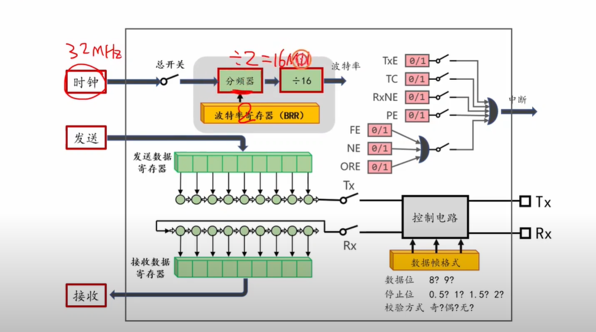
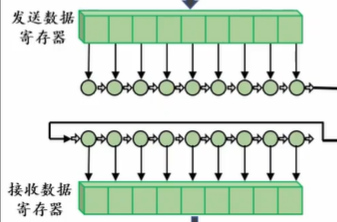
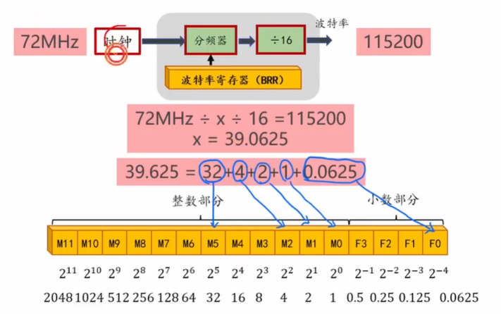
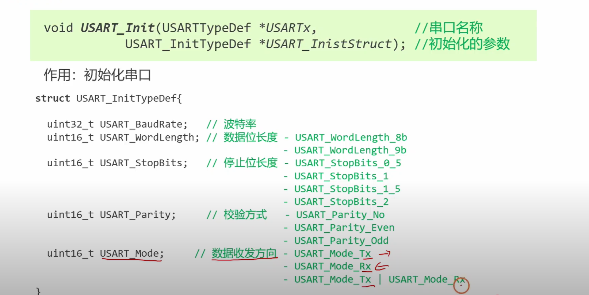
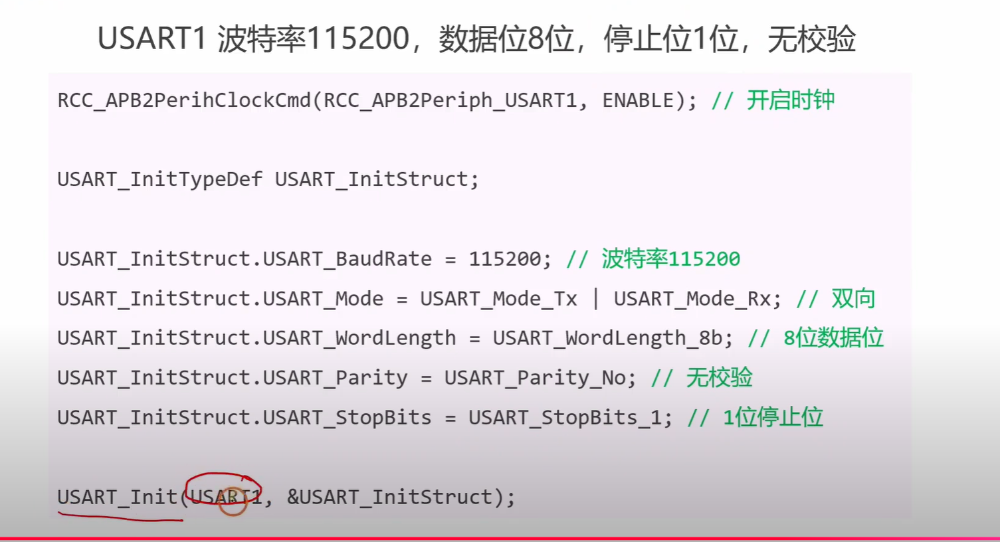
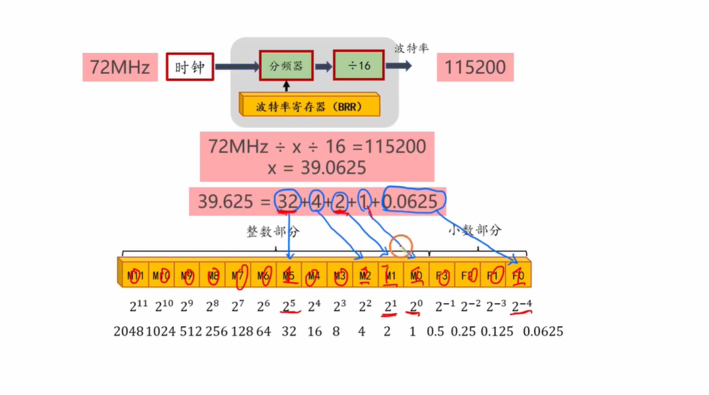
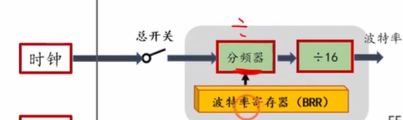
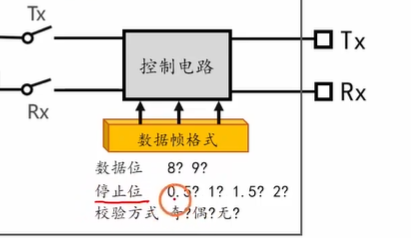

提问：https://youtu.be/HfY-bZGKBHQ?list=PLen6JNT7Cx3BaIbxkUfWayXsMlbU3Yisj  帮我分析总结下这个视频里面将的内容都是什么，并且针对这个视频给我提一些常会问到的问题并且附上答案，我要准备嵌入式的面试。

好的，这个视频是一个非常经典的嵌入式入门教程，内容讲解的是**STM32微控制器中的UART（通用异步收发器）模块**，这在嵌入式面试中是绝对的高频考点。我已经为您总结了视频的核心内容，并提炼了一系列面试中常会问到的问题及答案，助您做好充分准备。

------

## **视频核心内容总结**

这个视频从理论到实践，全面地介绍了UART的工作原理和使用方法：

1. **UART是什么？** [[00:29](http://www.youtube.com/watch?v=HfY-bZGKBHQ&t=29)]

   - 它本质上是微控制器内部的**串行通信端口**（Serial Port）。视频以一个STM32芯片为例，指出它拥有UART1, UART2, UART3三个独立的串口。
   - 可以形象地理解为芯片用于与外部世界进行文本数据交换的“嘴巴”（发送）和“耳朵”（接收）。

2. **UART如何工作？** [[01:42](http://www.youtube.com/watch?v=HfY-bZGKBHQ&t=102)]

   - **核心引脚**：**TX** (Transmit) 用于发送数据，**RX** (Receive) 用于接收数据。
   - **发送过程**：程序员只需将要发送的数据（如数字100）写入到**发送数据寄存器** [[02:27](http://www.youtube.com/watch?v=HfY-bZGKBHQ&t=147)]。UART硬件会自动将其转换为串行数据流（加上起始位、停止位等），并通过TX引脚一位一位地发送出去。
   - **接收过程**：外部设备通过RX引脚将串行数据流发送给芯片。UART硬件会自动解析这个数据流，将其重新组装成并行数据，并存入**接收数据寄存器** [[03:18](http://www.youtube.com/watch?v=HfY-bZGKBHQ&t=198)]。程序员只需从这个寄存器读取数据即可。

3. **核心硬件：移位寄存器** [[04:08](http://www.youtube.com/watch?v=HfY-bZGKBHQ&t=248)]

   

   - 视频深入浅出地解释了UART内部通过两个**移位寄存器**来完成“并串转换”（发送时）和“串并转换”（接收时）。这是理解UART工作原理的关键。

4. **关键参数配置**

   

   - **数据帧格式** [[09:30](http://www.youtube.com/watch?v=HfY-bZGKBHQ&t=570)]：可以配置数据位长度（8或9位）、奇偶校验位（用于检错）和停止位长度。通信双方的这些配置必须完全一致。

   

   

   - **波特率 (Baud Rate)** [[11:12](http://www.youtube.com/watch?v=HfY-bZGKBHQ&t=672)]：即每秒传输的比特数，决定了通信速度。视频详细讲解了如何通过设置**波特率寄存器**和一个分频器电路来得到期望的波特率（如9600, 115200）。

   

   

5. **软件编程与实践** [[14:56](http://www.youtube.com/watch?v=HfY-bZGKBHQ&t=896)]

   

   

   - 视频最后演示了如何使用STM32的库函数 `USART_Init` 来初始化和配置一个UART端口。这包括设置上述的所有参数（波特率、数据位等），以及使能UART模块的时钟。这是面试中考察动手能力的部分。

------

## **嵌入式面试高频问题及答案 (基于此视频)**

### **问题1：请解释一下什么是UART？它在嵌入式系统中的主要作用是什么？**

- **答案思路**: 首先解释其定义，然后说明其核心功能，最后举例说明其应用场景。

- 参考答案:

  UART，全称是“通用异步收发器”，是嵌入式系统中用于串行通信的一种非常常见的硬件模块。它的主要作用是实现微控制器（MCU）与外部设备之间的全双工或半双工数据交换。

  从硬件上讲，它通过两根信号线（TX发送和RX接收）实现通信。其内部核心是两个移位寄存器，负责将CPU内部的并行数据转换为串行数据流发送出去，同时将接收到的串行数据流转换回并行数据供CPU读取。

  在实际应用中，UART被广泛用于：

  1. **调试信息打印**：通过串口将程序的运行状态、变量值等log信息打印到电脑上，这是最常见的调试手段。
  2. **模块通信**：与GPS模块、蓝牙模块、Wi-Fi模块、各种传感器进行数据通信。
  3. **多机通信**：实现两个或多个微控制器之间的通信。

### **问题2：当我们要使用UART进行通信时，需要配置哪些基本参数？为什么这些参数很重要？**

- **答案思路**: 直接列举视频中提到的关键参数，并解释为何双方必须一致。

- 参考答案:

  要确保UART正常通信，通信双方必须配置完全相同的参数。主要包括：

  1. **波特率 (Baud Rate)**：定义了数据传输的速度（每秒多少比特）。如果双方波特率不同，接收方将无法正确地采样数据位，导致数据解析完全错误。这是最重要的参数。
  2. **数据位 (Data Bits)**：定义了每一帧数据中包含多少个有效数据位，通常是8位。
  3. **停止位 (Stop Bits)**：用于标记一帧数据的结束，通常是1位或2位。它保证了接收方有时间为下一帧数据做准备。
  4. **奇偶校验位 (Parity Bit)**：一种简单的错误检测机制。双方可以选择无校验、奇校验或偶校验。如果双方校验方式不同，或者传输中发生了一位错误，接收方会检测到校验错误。

  这些参数共同定义了串行通信的“协议”。任何一个参数不匹配，都会导致接收方无法正确地解析数据帧，从而产生乱码或通信失败。

### **问题3：视频中提到了波特率是通过一个寄存器和分频器来设置的。你能具体描述一下这个过程吗？**

- **答案思路**: 复述视频中关于波特率计算的讲解，展示你对底层硬件实现的理解。

- 参考答案:

  是的，波特率通常是通过一个专用的波特率寄存器和一个时钟分频器电路来实现的。其基本原理如下：

  1. **系统时钟源**：首先有一个高频率的系统时钟（比如视频中提到的72MHz）作为输入。
  2. **可编程分频器**：这个高频时钟会经过一个可编程的分频器，分频系数由我们写入到**波特率寄存器**的值来决定。
  3. **固定分频器**：在STM32中，经过可编程分频器后，通常还会再经过一个固定的16分频器。这样做的目的是为了实现过采样，即在一个比特的时间内采样16次，以找到最稳定的采样点，从而提高通信的可靠性。
  4. **计算公式**：因此，最终的波特率计算公式大致是：`BaudRate = APB_Clock / (16 * USARTDIV)`。其中 `USARTDIV` 就是我们要计算并写入波特率寄存器的值。视频中也提到，这个 `USARTDIV` 可能是一个小数，需要将其整数和小数部分分别写入寄存器的不同位域。

### **问题4：如果现在让你用C语言编写一个UART初始化的函数，你的思路是什么？**

- **答案思路**: 这在考察你的软件设计和库函数使用能力。你需要分步描述，逻辑清晰。

- 参考答案:

  我的思路会遵循“先配置硬件，再使能模块”的原则，主要分为以下几个步骤：

  1. **使能时钟**：首先，任何外设工作都需要时钟。我会调用时钟控制函数（如STM32库中的 `RCC_APB2PeriphClockCmd`），使能对应UART模块（如 `USART1`）和其所用到的GPIO引脚（TX/RX引脚）的时钟。
  2. **配置GPIO引脚**：将UART的TX引脚配置为推挽式复用输出模式，将RX引脚配置为浮空或上拉输入模式。
  3. **配置UART参数**：我会定义一个UART初始化结构体（如 `USART_InitTypeDef`），并填充之前提到的所有关键参数：波特率、字长、停止位、奇偶校验位以及模式（是只发送、只接收还是收发都用）。
  4. **初始化UART**：调用官方库提供的初始化函数（如 `USART_Init`），将配置好的结构体指针作为参数传入，完成对UART寄存器的配置。
  5. **使能UART**：最后，调用使能函数（如 `USART_Cmd`），正式启动UART模块，使其可以开始收发数据。
  6. **(可选)配置中断**：如果需要通过中断方式来接收数据（效率更高），还需要配置NVIC（嵌套向量中断控制器），设置中断优先级并使能UART的接收中断。

#### 上述答案2：配置GPIO引脚（进一步理解）

好的，这是一个非常深入且关键的嵌入式开发问题。对GPIO（通用输入/输出端口）引脚模式的正确配置是保证外设正常工作的第一步。我们来详细拆解这个配置，并着重解释您最关心的RX引脚部分。

##### **“复用”的含义：为什么不是普通I/O？**

首先，我们需要理解“**复用输出 (Alternate Function Output)**”和“**复用输入 (Alternate Function Input)**”中的“**复用**”是什么意思。

在现代微控制器（MCU）中，一个物理引脚通常有多种功能。它不仅仅是一个简单的、可以由程序控制输出高低电平的I/O口。为了节省引脚数量，芯片设计者会让一个引脚可以通过内部的“开关”（即复用器 Multiplexer）连接到不同的片上外设，比如UART、I2C、SPI、ADC等。

所以，当我们将一个引脚配置为“复用”模式时，我们实际上是在告诉MCU：“**请断开这个引脚与普通GPIO逻辑的连接，转而将它连接到内部指定的硬件外设（在这里就是UART模块）**”。

##### **TX引脚：推挽式复用输出 (Push-pull Alternate Function Output)**

我们来逐一分析TX引脚的配置：

- **Output (输出)**：这很明确，因为TX引脚的职责是向外**发送**数据。

- **Alternate Function (复用)**：如上所述，这意味着该引脚的控制权交给了UART的发送硬件。CPU把数据写入UART的发送数据寄存器后，UART硬件会自动控制这个引脚产生高低电平变化，形成串行数据流。

- **Push-pull (推挽)**：这是指引脚的输出驱动方式。

  - **推 (Push)**：当要输出高电平（逻辑'1'）时，引脚内部的上管（通常是PMOS）导通，将引脚电压主动地“推”到VCC（电源电压）。
  - **拉 (Pull)**：当要输出低电平（逻辑'0'）时，引脚内部的下管（通常是NMOS）导通，将引脚电压主动地“拉”到GND（地）。

  **为什么用推挽？** 因为它**驱动能力强，速度快**。无论输出高电平还是低电平，都有一个晶体管在主动工作，可以快速地拉高或拉低电压，确保在高速波特率下信号波形的陡峭和清晰，这对于保证通信质量至关重要。

##### **RX引脚：浮空或上拉输入 (Floating or Pull-up Input)**

现在我们来重点分析RX引脚的配置，特别是您关心的“为什么是浮空或上拉”。

- **Input (输入)**：这同样很明确，因为RX引脚的职责是从外部**接收**数据。
- **Alternate Function (复用)**：同理，这意味着该引脚接收到的电平变化会直接输入到UART的接收硬件，由硬件进行解析。

##### **核心问题：为什么要配置成“浮空”或“上拉”？**

要回答这个问题，我们必须先记住UART协议的一个**黄金法则**：

> **当总线空闲（没有数据传输）时，线路必须保持在高电平状态。**

数据的开始是以一个“起始位”（Start Bit）来标记的，而起始位正是一个从高电平到低电平的跳变（下降沿）。因此，维持空闲时的高电平对于正确识别数据帧的开始至关重要。

现在我们来看两种输入模式：

1. **浮空输入 (Floating Input)**
   - **是什么**：浮空模式意味着引脚在内部**既不连接到VCC，也不连接到GND**。它的电平状态完全由外部线路决定。
   - **风险在哪里**：如果外部设备没有连接，或者连接线断开，或者对方设备未上电，这个浮空的RX引脚就相当于一根“**天线**”。它极易受到空间中的电磁干扰（EMI），其电平会随机地、不受控制地在VCC和GND之间波动。
   - **致命后果**：一旦这种干扰导致RX引脚的电平从一个不确定的高电平跳变到一个低电平，UART的接收逻辑就会**错误地认为一个“起始位”到来了**，从而启动一次无效的数据接收。这会导致它接收到一堆无意义的“**鬼影数据 (Phantom Data)**”，并可能触发接收中断，严重干扰程序的正常运行。
   - **何时可用**：理论上，只有在你**100%能保证**外部设备始终连接并且在空闲时必定会输出一个稳定的高电平时，才可以选择浮空模式。但在实际工程中，这是一种非常脆弱和不可靠的设计。
2. **上拉输入 (Pull-up Input)**
   - **是什么**：上拉模式意味着在引脚内部，通过一个**阻值很大（通常在几十KΩ）的弱上拉电阻，将其连接到VCC**。
   - **为什么是最佳选择**：
     - **保证默认状态**：当总线空闲或外部设备未连接时，这个内部的上拉电阻会**确保RX引脚的电平被稳定地维持在高电平**。这就完美地符合了UART协议的空闲状态要求。它消除了因引脚悬空而产生“鬼影数据”的风险。
     - **增强抗干扰能力**：这个上拉电阻为引脚提供了一个确定的偏置电压，使得它对外部的微小噪声不那么敏感，提高了信号的稳定性。
     - **兼容外部信号**：当外部设备（TX端）要发送低电平时，其强大的“下拉”能力可以轻易地克服这个内部“弱上拉”电阻，将线路电压拉到低电平，从而不影响正常的数据传输。

##### **结论**

- 将RX引脚配置为**上拉输入模式**是**最标准、最稳健、也是最推荐**的做法。它通过硬件机制保证了UART协议的空闲状态，并极大地增强了系统的可靠性和抗干扰能力。
- 将RX引脚配置为**浮空输入模式**是一种**有风险且不推荐**的做法，它把维持总线空闲状态的责任完全推给了外部设备，使得系统在连接异常或外部干扰下非常脆弱。

因此，在面试中，当被问及时，您可以清晰地回答：**为了确保UART总线在空闲或断开连接时，接收引脚能稳定地保持在协议所要求的高电平状态，防止噪声干扰导致错误的起始位检测，我们必须将其配置为上拉输入模式。**

----

---

### **问题5：UART通信是异步的，“异步”体现在哪里？**

- **答案思路**: 关键在于与“同步”通信（如SPI, I2C）进行对比，突出“时钟线”的有无。

- 参考答案:

  “异步”是相对于“同步”通信而言的。同步通信（如SPI和I2C）除了数据线外，还有一根额外的时钟线（CLK）。发送方在发送每一位数据的同时，都会在时钟线上产生一个时钟脉冲，接收方完全根据这个时钟信号的节奏来读取数据，双方步调是严格一致的。

  而UART是**异步通信**，它**没有时钟线**。它依靠双方预先约定好的**波特率**和数据帧格式（起始位和停止位）来保证通信。

  - **“异步”的体现**：当总线空闲时，电平保持为高。发送方想发送数据时，会先拉低电平并维持一个比特的时间，这就是**起始位**。接收方检测到这个下降沿后，就知道“通信开始了”，然后它会启动自己的内部定时器，按照约定的波特率，在每个数据位的中间时刻去采样电平，直到接收到**停止位**（高电平），一帧数据结束。

  简单来说，同步通信靠的是“指挥官”（时钟线），而异步通信靠的是“约定”（波特率和数据帧格式）。

## 波特率寄存器（BRR）值 求解过程

好的，这张图片非常清晰地解释了在嵌入式系统（特别是像STM32这样的微控制器）中，**如何通过配置寄存器来精确地设置UART（串口）的波特率**。

我们可以分步来理解这张图：

### **第一步：理解波特率的生成原理（图片上半部分）**

- **输入时钟 (72MHz)**：微控制器有一个高速的系统时钟源，这里是72MHz，它为UART模块提供动力。
- **分频器 (Divider)**：UART模块内部有一个分频器电路。它接收72MHz的高速时钟，并将其频率降低。
- **波特率寄存器 (BRR)**：这个分频器具体要降频多少倍，是由一个名为“波特率寄存器”（Baud Rate Register, 简称BRR）的特殊寄存器控制的。程序员通过向这个寄存器写入一个特定的数值来设定分频系数。
- **固定÷16**：经过BRR控制的分频后，信号通常还会再经过一个固定的16倍分频。这样做是为了“过采样”，即在一个比特的时间内对信号采样16次，以找到最稳定的点来读取数据，从而提高通信的抗干扰能力和可靠性。
- **最终输出 (115200)**：经过这两级分频后，得到的最终时钟频率就是我们想要的波-特率，这里是115200 bps (bits per second)。

### **第二步：计算分频系数（图片中间部分）**

图片的核心在于展示如何计算出应该写入BRR寄存器的值。

- **公式**: `72MHz ÷ x ÷ 16 = 115200`
  - 这里的 `x` 就是我们需要计算的分频系数，也就是要写入BRR寄存器的值。
- **计算**: 通过解这个方程，得到 `x = 72,000,000 ÷ 16 ÷ 115200 = 39.0625`。
- **拆分**: 这个值`39.0625`包含整数部分`39`和小数部分`0.0625`。

### **第三步：将分频系数写入寄存器（图片下半部分）**

这是最关键的一步，展示了硬件寄存器的设计。

- **寄存器结构**：BRR寄存器被分为了两部分：
  - **整数部分 (M11 ~ M0)**：这12个比特位（从`M11`到`M0`）用来存放分频系数的整数部分。
  - **小数部分 (F3 ~ F0)**：这4个比特位（从`F3`到`F0`）用来存放小数部分。
- **写入整数部分 `39`**:
  - 要表示整数`39`，需要用二进制。`39`的二进制是`100111`。
  - 但是为了更清晰地展示，图片将其拆分为2的幂次方的和：`39 = 32 + 4 + 2 + 1`，也就是`2^5 + 2^2 + 2^1 + 2^0`。
  - 所以，在BRR寄存器的整数部分，`M5`、`M2`、`M1`和`M0`这几个比特位会被设置为`1`，其余的位（图中未标出但应为1的）设置为`0`。
- **写入小数部分 `0.0625`**:
  - 小数部分也是通过二进制来表示的，但是权重是`2`的负幂次方。
  - `F0`位的权重是`2^-4 = 1/16 = 0.0625`。
  - `F1`位的权重是`2^-3 = 1/8 = 0.125`。
  - `F2`位的权重是`2^-2 = 1/4 = 0.25`。
  - `F3`位的权重是`2^-1 = 1/2 = 0.5`。
  - 因为我们的小数部分恰好是`0.0625`，所以只需要将`F0`位设置为`1`即可。

### **总结**

这张图片生动地展示了一个典型的嵌入式硬件配置过程：

1. **需求驱动**：我们想要一个特定的波特率（115200）。
2. **公式计算**：根据硬件手册提供的公式和系统时钟，计算出实现该需求所需的配置值（39.0625）。
3. **寄存器写入**：将计算出的配置值，按照硬件寄存器的位域定义（整数部分和小数部分），精确地写入到对应的比特位上。

通过这个过程，程序员就完成了对UART硬件的底层配置，使其能够以准确的速率进行串行通信。在实际编程中，这些计算和位操作通常由官方提供的库函数（如`USART_Init`）封装好了，我们只需传入`115200`这个参数即可，但理解其背后的原理对于嵌入式开发和面试至关重要。

# 第2遍复习

## 补充理解1

如何通过设置**波特率寄存器**和一个分频器电路来得到期望的波特率（如9600, 115200）。 这里我记得UART是挂载在APB2总线上的是吗，stm32中不是又好几个UART吗，它们都是挂载在APB2总线上的是吗。这里的波特率寄存器和分频器是用来对PCLK2进行分频的吧，不是只有一个分频器就行了吗，为什么还要有一个波特率寄存器呢。我不是太懂，你能够给我详细解释下吗。

这个问题问得非常深入！你不仅关注了怎么用，还思考了底层的硬件逻辑。你提到的总线挂载、时钟分频以及波特率寄存器的关系，其实是很多人初学STM32串口时容易混淆的地方。

我们像剥洋葱一样，一层一层来解答你的疑惑。

### 1. 所有的UART都挂载在APB2总线上吗？

**答案是：不是的。** 在STM32（以你视频教程中常见的STM32F1系列为例）中，不同的串口为了合理分配资源，是挂载在不同总线上的：

- **USART1 挂载在 APB2 总线上。** APB2 是高速总线，时钟频率（PCLK2）通常可以达到 **72MHz**。
- **USART2、USART3、UART4、UART5 挂载在 APB1 总线上。** APB1 是低速总线，时钟频率（PCLK1）通常最高只能是 **36MHz**。

所以，在计算波特率时，首先要搞清楚你用的是哪个串口，它的源时钟（$f_{PCLK}$）到底是72MHz还是36MHz，这直接影响后续的分频计算。

------

### 2. 为什么既需要“分频器”，又需要“波特率寄存器”？

你提到“不是只有一个分频器就行了吗，为什么还要有一个波特率寄存器呢”，**这里其实是一个概念上的小误解。**

其实，它们并不是两个独立的处理步骤，而是**“控制与被控制”**的关系：

- **分频器（Divider 电路）**：是底层实际干活的硬件电路，负责把高频的时钟信号（比如72MHz）剁碎，变成我们需要的低频脉冲。
- **波特率寄存器（USART_BRR）**：是你（程序员）给底层硬件下达指令的**“操作面板”**。分频器本身不知道该分频多少，它只会傻傻地读取 **波特率寄存器** 里面的数值，然后按照这个数值去执行分频。

所以，你把分频系数写进波特率寄存器，分频器电路就会产生对应的波特率。

------

### 3. 波特率到底是怎么算出来的？

要得到像 9600 或 115200 这样的波特率，STM32 内部有一个核心公式：

$$BaudRate = \frac{f_{PCLK}}{16 \times USARTDIV}$$

- **$f_{PCLK}$**：就是前面说的所在总线的时钟频率（比如72MHz或36MHz）。
- **$16$**：为什么有个16？因为UART为了抗干扰，在接收数据时，会对每个数据位进行 **16次过采样**（Oversampling），以确保读到的高低电平是准确的。
- **$USARTDIV$**：**这个无量纲的数值，就是我们要填入波特率寄存器（USART_BRR）里的分频系数。**

------

### 4. 波特率寄存器（BRR）的精妙设计：支持小数！

如果 `USARTDIV` 只能是整数，那就麻烦了。比如算出来是 39.8，如果只能取整数 39 或 40，产生的实际波特率就会有很大的误差，导致乱码。

为了解决这个问题，STM32 的波特率寄存器（USART_BRR）被设计成了两部分：

- **整数部分（Mantissa）**：占 12 位。
- **小数部分（Fraction）**：占 4 位。

**我们来实战算一下 115200 的波特率：**

假设我们用 USART1（挂载在 APB2，$f_{PCLK} = 72MHz$），目标波特率是 **115200**。

1. **计算 $USARTDIV$：**

   $$USARTDIV = \frac{72,000,000}{16 \times 115200} = 39.0625$$

2. **拆分整数和小数：**

   - **整数部分** = 39 （十六进制为 0x27）
   - **小数部分** = $0.0625 \times 16 = 1$ （十六进制为 0x01）

3. **写入寄存器：**

   单片机会把整数 39 和小数 1 拼在一起，写入 `USART_BRR` 寄存器。正是因为这种**小数分频机制**，STM32 才能极其精准地生成 9600、115200 等标准波特率，将误差降到最低。

------

总结一下：分频器是干活的硬件，波特率寄存器是存放“分频说明书”的地方。通过公式算出带有小数的分频系数，填入寄存器，硬件就能精准地把总线时钟降频到你想要的波特率了。

在实际写代码（比如使用标准库或HAL库）时，你通常只需要传入 `115200` 这个数字，底层库函数会自动帮你完成上述的计算和寄存器配置。

**需要我为你展示一下，在代码层面是如何把这个算好的数字写进寄存器的吗？**

# 补充理解2（采样频率如何影响波特率）

这个采样次数16是如何印象波特率的呢，我不是太懂，你能够给我详细解释下吗，最好能够举个例子来让我彻底弄明白。

这是一个非常棒的问题！很多人在看公式时都会把这个“16”当成一个死记硬背的常数，但其实它背后隐藏着串口通信（异步通信）最核心的**抗干扰和对齐机制**。

为了彻底弄明白这个“16”是怎么影响波特率的，我们需要先明确一个概念：**分频器分出来的并不是“波特率”，而是“采样时钟”。**

下面我用一个通俗的例子和详细的图景来给你拆解。

### 1. 为什么需要 16 次采样？（问题的根源）

像 I2C 或 SPI 这样的通信协议，都有单独的“时钟线（SCL/SCK）”。发送方发一个数据，时钟线跳动一下，接收方就知道“哦，我现在该去读数据了”。这叫**同步通信**。

但 UART 是**异步通信**，**只有数据线（TX/RX），没有时钟线**！

当接收方（RX）看到引脚上的电平发生变化时，它心里没底：

- 这到底是一个真实的信号，还是外界的一个毛刺干扰？
- 我应该在什么时候去读取这个电平才是最准的（不早也不晚）？

为了解决这个问题，硬件工程师发明了**过采样（Oversampling）机制**。

STM32 规定：**对于接收到的每一个数据位（1 bit），我都去连续“拍照”（采样）16次。**

### 2. 这 16 次采样具体是怎么工作的？（硬核拆解）

假设我们规定好波特率是 9600，也就是一秒钟发送 9600 个数据位。那么每一个数据位的持续时间大约是 $104 \mu s$。

在这 $104 \mu s$ 的时间里，接收方会均匀地进行 16 次检测（滴答、滴答、滴答...16下）。

- **找准起点：** 串口平时是高电平。当接收方突然检测到电平被拉低（这是起始位），它不会立刻认为通信开始了（怕是干扰）。它会继续按那 16 次的节奏去测。如果连续测了几次都是低电平，它才确认：“好，对方真的开始发数据了！”
- **精准读取（最核心所在）：** 确认开始后，对于随后的每一个数据位，接收方也会采 16 次。但它不会随便取一个，它会**取最中间的那几次**（通常是第 8、9、10 次采样）。
- **少数服从多数：** 接收方会对比第 8、9、10 次采样的结果。如果这三次读取到的是 `1, 1, 1` 或者 `1, 1, 0`，它就认为这个数据位是 `1`。这种“少数服从多数”的投票机制，极大地过滤了线路上的噪声和毛刺！

------

### 3. “16” 是如何影响波特率计算的？（举例说明）

现在我们回到波特率和分频器。

**例子：目标波特率是 9600 bps**

这意味着我们要让两个设备以每秒 9600 个位的速度互传数据。

1. **计算硬件需要的心跳频率：**

   因为接收硬件为了保证准确率，**每一个位都需要采样 16 次**。

   所以，驱动这个“采样电路”的时钟频率，必须是波特率的 16 倍！

   $$\text{采样时钟频率} = 9600 \times 16 = 153,600 \text{ Hz}$$

2. **分频器的真正任务：**

   分频器（Divider）的输入是你单片机的总线频率（比如 APB2 的 $72MHz = 72,000,000 \text{ Hz}$）。

   分频器的任务，**不是**把 72MHz 降到 9600 Hz。

   分频器的任务，**是**把 72MHz 降到 **153,600 Hz**（也就是供那 16 次采样使用的时钟）！

3. **得出公式：**

   分频系数 $USARTDIV$ 到底该设多少呢？（采样的时钟频率和实际的波特率有一个16倍的关系，时钟频率经过分频器之后得到的是时钟频率，这个时钟频率除以16才是波特率）

   $$USARTDIV = \frac{\text{总线频率}}{\text{需要的采样时钟频率}}$$

   $$USARTDIV = \frac{72,000,000}{153,600} = 468.75$$

你看，这个公式换一种写法就是：

$$USARTDIV = \frac{72,000,000}{16 \times 9600}$$

这不就是手册上那个经典的波特率计算公式了吗！

------

### 总结

- **波特率**是指数据的传输速度（比如一秒 9600 个位）。
- **分频器**产生的频率，是用来给芯片内部的“采样相机”按快门的。
- 因为每个数据位需要按 **16 次**快门才能保证读取无误，所以分频器实际要输出的频率必须是**波特率的 16 倍**。这就是公式里那个 `16` 的由来。

这个过程是不是非常像我们在黑暗中为了看清一个快速移动的物体，必须用极高频的闪光灯连续闪烁才能捕捉到它的清晰轮廓？

**经过这样的拆解，你对这 16 次采样的机制以及公式的由来清晰些了吗？如果有哪里觉得还需要进一步探讨，随时告诉我！**

# 补充理解3

       

         

结合各个部分的图片来帮助理解要设置那些参数，如第2张图片中列出来数据帧的格式，有数据位、停止位、校验方式，刚好对应的USART_InitTypeDef中需要对这些进行设置。

注意：USART_Mode 设置的是数据收发方向本质上控制的TX和RX两个开关。USARTx的端口引脚是固定的，如果要设置TX引脚，那个GPIO端口设置的是复用发送端口（发送比接收要多设置一个GPIO端口的最大输出速度）。