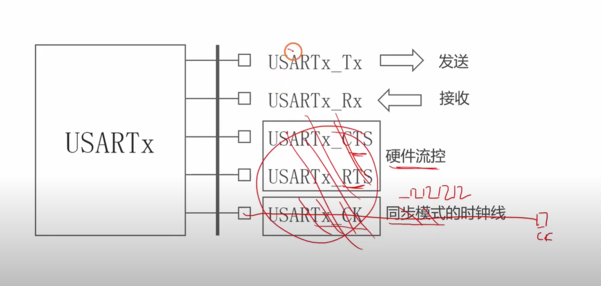
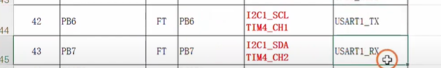
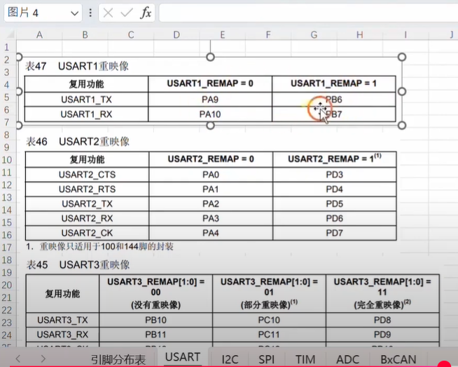
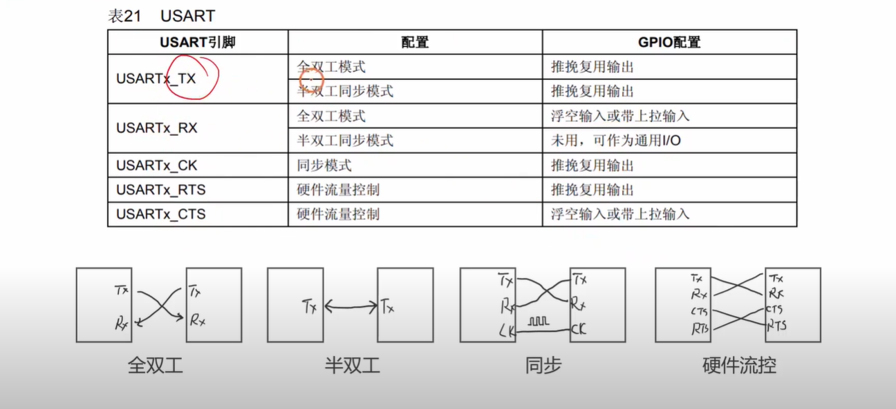
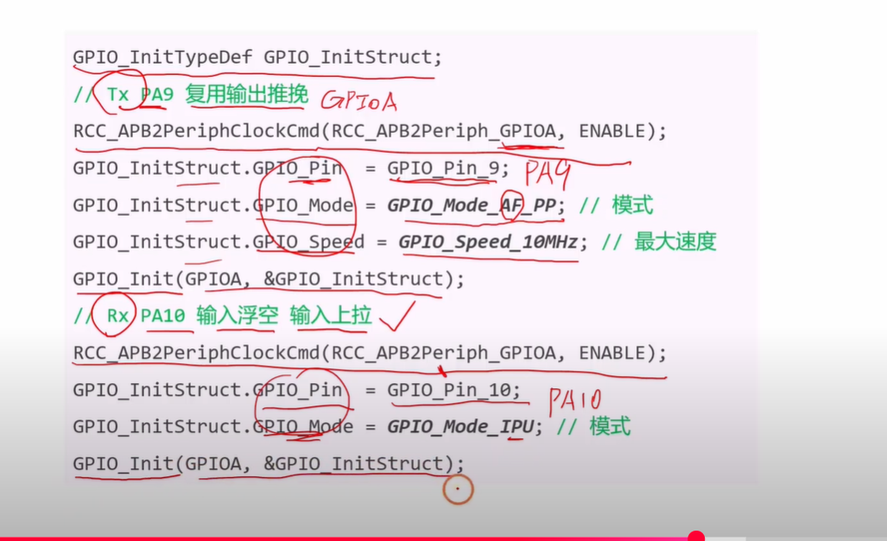
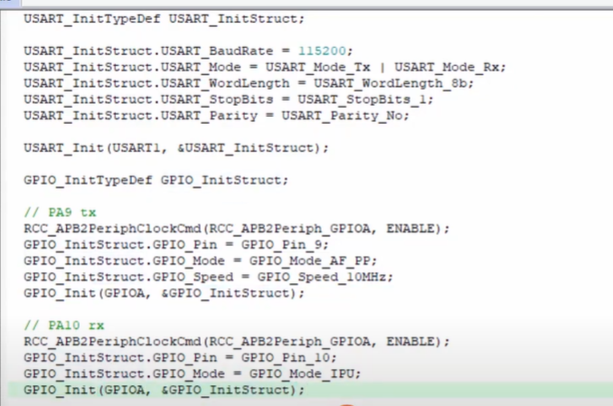
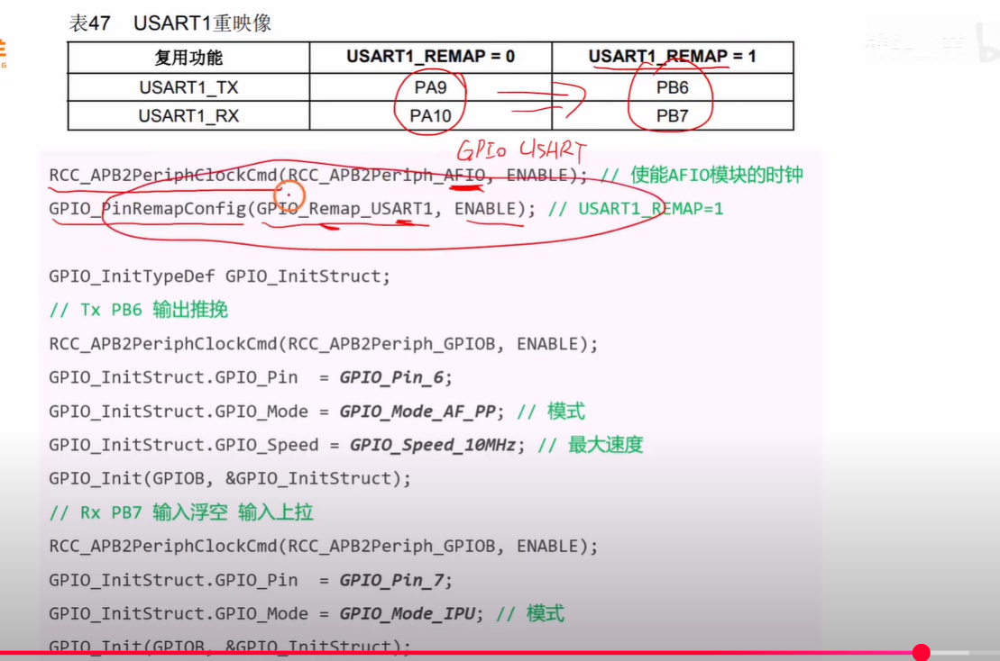

好的，我已经分析总结了该视频，并为您准备了针对嵌入式面试的常见且有深度的问题与答案。

# **视频内容总结**

这个视频是“STM32入门教程”的一部分，主要讲解了**如何为STM32的串口（UART）功能初始化其对应的I/O引脚**。视频的核心内容可以分为以下几个步骤：

1. **识别串口引脚**：视频首先介绍了<span style="color:#CC0000;">标准的串口通信至少需要两根线：TX（发送）和RX（接收）</span>。然后，通过查阅STM32的数据手册（Datasheet），演示了<span style="color:#CC0000;">如何找到特定型号芯片（如LQFP48封装）上UART1的默认引脚（PA9为TX，PA10为RX）。</span>
2. **<span style="color:#FF0000;">理解引脚重映射</span>（Pin Remapping）**：视频讲解了<span style="color:#CC0000;">STM32的引脚重映射功能</span>。如果默认引脚已被占用，可以<span style="color:#FF0000;">通过配置AFIO（Alternate Function I/O）寄存器</span>，<span style="color:#CC6600;">将UART1的功能映射到备用引脚上（如PB6为TX，PB7为RX）</span>。
3. **配置引脚模式**：这是最关键的一步。视频详细解释了需要<span style="color:#CC0000;">为TX和RX引脚设置正确的GPIO模式</span>：
   - **<span style="color:#FF0000;">TX</span> (发送引脚)**：必须配置为“**复用功能推挽输出 (Alternate Function Push-Pull Output)**”。这样，当UART模块要发送数据时，它可以接管这个引脚的控制权，并输出高低电平。
   - **<span style="color:#FF0000;">RX</span> (接收引脚)**：通常配置为“**上拉输入 (Input Pull-up)**”或“浮空输入 (Floating Input)”。视频<span style="color:#CC0000;">推荐使用“上拉输入”</span>，因为当没有数据传输时，引脚会被拉到高电平，可以增强抗干扰能力，<span style="color:#CC6600;">避免总线悬空时接收到不确定的噪声信号。</span>
4. **编写初始化代码**：最后，视频通过代码实例，展示了<span style="color:#CC0000;">如何使用STM32的标准库函数（Standard Peripheral Library）来完成上述配置</span>。这包括：
   - 使能GPIO端口和AFIO的时钟。
   - 定义一个`GPIO_InitTypeDef`结构体。
   - 为TX和RX引脚分别设置正确的`GPIO_Pin`、`GPIO_Mode`和`GPIO_Speed`。
   - 调用`GPIO_Init()`函数将配置写入寄存器。
   - 如果需要重映射，调用`GPIO_PinRemapConfig()`函数。


## USART模块有哪些引脚



好的，我们再次结合您提供的图片，对USART（通用同步/异步收发器）进行一次全面且深入的最终解析。本次讲解将力求清晰地阐明每个引脚的功能，并彻底解答您关于`CK`时钟引脚的核心疑问。


### 核心问题解析：为什么“异步通信”会有时钟引脚？

这个问题的答案隐藏在“USART”这个名称的完整含义中。

- **UART** = Universal **Asynchronous** Receiver/Transmitter (通用**异步**收发器)
- **USART** = Universal **Synchronous/Asynchronous** Receiver/Transmitter (通用**同步/异步**收发器)

从全称可以看出，您图示的<span style="color:#CC0000;">USART</span>是一个功能更强大的<span style="color:#CC0000;">“超集”</span>设备。它不仅能完成我们熟知的UART（普通串口）的所有异步通信任务，还额外支持**同步通信模式**。

**`CK`引脚正是专为<span style="color:#FF0000;">同步模式</span>而生。**

- 在**异步模式**下，<span style="color:#CC0000;">通信双方没有共享时钟</span>，<span style="color:#CC0000;">各自依靠内部时钟和预设的波特率进行数据收发</span>。此时，`CK`引脚**不被使用**。
- 在**同步模式**下，通信双方使用`CK`引脚上的<span style="color:#CC0000;">时钟信号</span>来精确同步数据的每一位。

因此，您的理解“USART是异步通信”是正确的，但这只是它功能的一部分。因为它同时具备同步通信的能力，所以才会配备一个在同步模式下才起作用的`CK`引脚。


### 各引脚功能详解

下面我们来详细拆解图中所示的每一个引脚的功能。

#### 1. `USARTx_Tx` (发送引脚)

- **功能**: **数据发送 (Transmit)**。
- **工作流程**: 当微控制器（MCU）需要发送数据时，它会将一个字节（8位并行数据）写入USART的发送数据寄存器。USART硬件会自动执行“并转串”操作：它会<span style="color:#CC0000;">按照预设的数据帧格式</span>（<span style="color:#CC0000;">添加起始位和停止位</span>），在<span style="color:#CC0000;">波特率的驱动下</span>，将这个字节的每一位（bit）依次“推”到`Tx`引脚上，形成一串高低电平的串行信号发送出去。


#### 2. `USARTx_Rx` (接收引脚)

- **功能**: **数据接收 (Receive)**。
- **工作流程**: `Rx`<span style="color:#CC0000;">引脚持续监听外部信号</span>。<span style="color:#FF0000;">当它检测到一个有效的起始位（通常是电平由高到低的跳变）时</span>，USART的<span style="color:#CC0000;">接收逻辑便开始工作</span>。它会<span style="color:#CC0000;">根据波特率，在每个数据位的中心点进行采样，将接收到的串行信号重新组装成并行字节，存入接收数据寄存器，等待MCU读取。</span>


#### 3. `USARTx_RTS` 与 `USARTx_CTS` (硬件流控引脚)

这两个引脚协同工作，实现**硬件流控 (Hardware Flow Control)**，如同数据传输的“交通警察”，<span style="color:#CC0000;">用于防止因接收方处理速度跟不上发送方而导致的数据丢失</span>。

- **`USARTx_RTS` (请求发送 - <span style="color:#FF0000;">Request to Send</span>)**
  - **方向**: **输出**。
  - **作用**: 用来<span style="color:#FF0000;">告诉</span>**对方**：“<span style="color:#CC0000;">我是否准备好接收你的数据？</span>”
  - **场景**: 当<span style="color:#CC0000;">本设备（作为接收方）的接收缓冲区快满时</span>，它会将`RTS`引脚置为无效状态（例如，拉高电平）。<span style="color:#CC00CC;">这相当于举起一个“暂停”的牌子，通知对方停止发送。</span><span style="color:#CC0000;">当缓冲区有空间后</span>，再将`RTA`置为有效（拉低电平），通知对方可以继续发送。
- **`USARTx_CTS` (清除发送 - <span style="color:#FF0000;">Clear to Send</span>)**
  - **方向**: **输入**。
  - **作用**: <span style="color:#CC0000;">接收</span>**对方**的指令，判断“<span style="color:#CC0000;">我是否可以向对方发送数据？</span>”
  - **场景**: 本设备（作为发送方）在发送数据前，<span style="color:#CC0000;">会检查`CTS`引脚的状态</span>。<span style="color:#FF0000;">只有当该引脚有效时</span>（<span style="color:#CC0000;">由对方的`RTS`控制</span>），才被“清除/允许”发送数据。如果`CTS`无效，则必须暂停发送。

**连接方式**: <span style="color:#CC0000;">使用硬件流控时</span>，<span style="color:#CC0000;">两台设备的引脚需要交叉连接</span>：`Device A_RTS` → `Device B_CTS`，`Device A_CTS` → `Device B_RTS`。


#### 4. `USARTx_CK` (同步时钟引脚)

- **功能**: **同步时钟 (Synchronous Clock)**。
- **工作模式**: **仅在<span style="color:#FF0000;">同步模式</span>下使用**。
- **作用**:
  - **作为主设备 (Master)**: `CK`引脚会**输出**一个时钟信号，<span style="color:#CC0000;">数据</span>在`Tx`引脚上<span style="color:#CC0000;">随着这个时钟信号的节拍发送出去</span>。
  - **作为从设备 (Slave)**: `CK`引脚会**输入**来自<span style="color:#CC0000;">主设备的同步时钟</span>，并<span style="color:#CC0000;">依据此时钟节拍</span>在`Rx`<span style="color:#CC0000;">引脚上采样数据</span>。

<span style="color:#CC0000;">同步模式下</span>，由于<span style="color:#CC0000;">有精确的时钟信号</span>，<span style="color:#CC0000;">不再需要起始位和停止位来进行字节同步，从而可以实现更高的数据传输效率</span>。


### 总结

| 引脚        | 功能概览 | 异步模式                                       | 同步模式                                         |
| ----------- | -------- | ---------------------------------------------- | ------------------------------------------------ |
| **Tx**      | 发送数据 | **使用**                                       | **使用**                                         |
| **Rx**      | 接收数据 | **使用**                                       | **使用**                                         |
| **RTS/CTS** | 硬件流控 | <span style="color:#FF0000;">可选使用</span>   | <span style="color:#FF0000;">可选使用</span>     |
| **CK**      | 同步时钟 | <span style="color:#FF0000;">**不使用**</span> | <span style="color:#FF0000;">**必须使用**</span> |

希望这次结合了核心疑问和引脚细分的解析，能让您对USART的工作原理有一个全面而透彻的理解。这个强大的外设通过不同的引脚组合与配置，能够灵活适应从简单的异步串口到高速同步通信的多种应用场景。


## 引脚分布表 与 重映射表








## IO配置表



好的，我们来详细解读您提供的第二张图片中的表格。这张表格非常关键，它展示了<span style="color:#CC0000;">在配置USART不同工作模式</span>时，其<span style="color:#CC0000;">对应的GPIO引脚应当如何进行正确的初始化</span>。

我将逐行解释表格中的“<span style="color:#CC0000;">配置</span>”和“<span style="color:#CC0000;">GPIO配置”</span>，并为您提供相应的**关键性代码**示例。代码仍然以主流的**STM32 标准库**为例。


### 表格内容逐行深度解析

#### 1. `USARTx_TX` (发送引脚)

- **配置**:

  - **全双工模式 (Full-duplex)**: 这是最常见的模式，数据可以<span style="color:#CC0000;">同时发送和接收</span>。`Tx`引脚专门负责发送。
  - **半双工同步模式 (Half-duplex Synchronous)**: 在这种模式下，<span style="color:#CC0000;">数据收发分时进行</span>，但<span style="color:#CC0000;">共用一根线</span>。`Tx`引脚<span style="color:#CC0000;">既要负责发送，也要在不发送时切换为高阻态以接收数据。</span>

- **GPIO配置**: **<span style="color:#CC0000;">推挽复用输出</span> (Push-pull Alternate Function Output)**

  - **解释**: 无论哪种模式，当`Tx`引脚<span style="color:#CC0000;">需要发送数据时</span>，它必须作为一个**输出**引脚。**“复用”**意味着<span style="color:#CC0000;">引脚的控制权从普通的GPIO模块交给了USART外设，这样USART才能直接控制引脚发送数据</span>。**“推挽”**确保了<span style="color:#CC0000;">引脚能强力地驱动高低电平，保证信号质量。</span>

- **关键代码 (<span style="color:#CC0000;">配置Tx引脚</span>，例如<span style="color:#CC0000;">PA9</span>为<span style="color:#CC0000;">USART1_TX</span>)**:

  ```c
  // 声明GPIO初始化结构体
  GPIO_InitTypeDef GPIO_InitStructure;
  
  /* 1. 使能所有相关时钟 */
  // 使能GPIOA端口时钟
  RCC_APB2PeriphClockCmd(RCC_APB2Periph_GPIOA, ENABLE);
  
  // 使能USART1外设时钟
  RCC_APB2PeriphClockCmd(RCC_APB2Periph_USART1, ENABLE);
  
  // **关键：标准库中使用复用功能(AF)必须使能AFIO时钟**
  RCC_APB2PeriphClockCmd(RCC_APB2Periph_AFIO, ENABLE);
  
  
  /* 2. 配置GPIO_InitStructure结构体 (配置PA9作为USART1_TX) */
  GPIO_InitStructure.GPIO_Pin = GPIO_Pin_9;             // 选择引脚9
  GPIO_InitStructure.GPIO_Speed = GPIO_Speed_50MHz;       // 设置引脚速度
  GPIO_InitStructure.GPIO_Mode = GPIO_Mode_AF_PP;       // **核心：设置为复用功能推挽输出**
  
  /* 3. 调用初始化函数，应用配置 */
  GPIO_Init(GPIOA, &GPIO_InitStructure);
  ```


#### 2. `USARTx_RX` (接收引脚)

- **配置**:

  - **全双工模式 (Full-duplex)**: `Rx`引脚专门负责接收数据。

- **GPIO配置**: **浮空输入或带上拉输入 (Floating Input or Input with Pull-up)**

  - **解释**: 作为接收引脚，它必须配置为**输入**模式。**“浮空”** (`GPIO_NOPULL`) 适用于<span style="color:#CC0000;">外部电路已经能保证总线电平稳定的情况</span>。**“<span style="color:#FF0000;">带上拉</span>”** (`GPIO_PULLUP`) 更为<span style="color:#990000;">常用</span>，它<span style="color:#CC0000;">能确保在总线没有被对方驱动时（空闲状态），`Rx`引脚能稳定地保持在高电平，防止因电平不定而误判为数据起始位。</span>

- **关键代码 (<span style="color:#CC0000;">配置Rx引脚</span>，例如<span style="color:#CC0000;">PA10</span>为<span style="color:#CC0000;">USART1_RX</span>)**:

  ```c
  // 声明GPIO初始化结构体
  GPIO_InitTypeDef GPIO_InitStructure;
  
  /* 1. 使能所有相关时钟 */
  // 使能GPIOA端口时钟
  RCC_APB2PeriphClockCmd(RCC_APB2Periph_GPIOA, ENABLE);
  
  // 使能USART1外设时钟 (即使只配置Rx，外设也需时钟)
  RCC_APB2PeriphClockCmd(RCC_APB2Periph_USART1, ENABLE);
  
  // 使能AFIO时钟，用于复用功能
  RCC_APB2PeriphClockCmd(RCC_APB2Periph_AFIO, ENABLE);
  
  
  /* 2. 配置GPIO_InitStructure结构体 (配置PA10作为USART1_RX) */
  GPIO_InitStructure.GPIO_Pin = GPIO_Pin_10; // 选择引脚10
  
  // **核心：将模式与上拉合并为“上拉输入”模式**
  GPIO_InitStructure.GPIO_Mode = GPIO_Mode_IPU; 
  
  // 注意：对于输入模式，GPIO_Speed成员是无效的，无需设置。
  
  /* 3. 调用初始化函数，应用配置 */
  GPIO_Init(GPIOA, &GPIO_InitStructure);
  ```

- **配置**:

  - **半双工同步模式 (Half-duplex Synchronous)**:

- **GPIO配置**: **未用, 可作为通用I/O (Unused, can be used as general I/O)**

  - **解释**: 在半双工模式下，<span style="color:#FF0000;">`Tx`引脚分时复用为发送和接收，因此专用的`Rx`引脚就空闲下来了</span>，可<span style="color:#CC0000;">以配置成其他任意的GPIO功能（如普通的输入或输出），或者保持未初始化状态。</span>


#### 3. `USARTx_CK` (时钟引脚)

- **配置**: **同步模式 (Synchronous Mode)**

- **GPIO配置**: **推挽复用输出 (Push-pull Alternate Function Output)**

  - **解释**: 在同步模式下，如果本设备是**主设备(Master)**，它需要向外**输出**时钟信号。因此，`CK`引脚必须配置为**复用功能推挽输出**，由USART外设驱动时钟信号。

- **关键代码 (<span style="color:#CC0000;">配置CK引脚</span>，例如<span style="color:#CC0000;">PA8</span>为<span style="color:#CC0000;">USART1_CK</span>)**:

  ```c
  // 声明GPIO初始化结构体
  GPIO_InitTypeDef GPIO_InitStructure;
  
  /* 1. 使能所有相关时钟 */
  // 使能GPIOA端口时钟
  RCC_APB2PeriphClockCmd(RCC_APB2Periph_GPIOA, ENABLE);
  
  // 使能USART1外设时钟
  RCC_APB2PeriphClockCmd(RCC_APB2Periph_USART1, ENABLE);
  
  // 使能AFIO时钟，用于复用功能
  RCC_APB2PeriphClockCmd(RCC_APB2Periph_AFIO, ENABLE);
  
  
  /* 2. 配置GPIO_InitStructure结构体 (配置PA8作为USART1_CK) */
  GPIO_InitStructure.GPIO_Pin = GPIO_Pin_8;             // 选择引脚8
  GPIO_InitStructure.GPIO_Speed = GPIO_Speed_50MHz;       // 设置引脚速度
  GPIO_InitStructure.GPIO_Mode = GPIO_Mode_AF_PP;       // **核心：设置为复用功能推挽输出**
  
  /* 3. 调用初始化函数，应用配置 */
  GPIO_Init(GPIOA, &GPIO_InitStructure);
  ```


#### 4. `USARTx_RTS` (请求发送引脚)

- **配置**: **硬件流量控制 (Hardware Flow Control)**

- **GPIO配置**: **推挽复用输出 (Push-pull Alternate Function Output)**

  - **解释**: `RTS`是本设备向外**输出**的控制信号，用于告知对方自己是否准备好接收。因此，它也必须配置为**复用功能推挽输出**。

- **关键代码 (配置RTS引脚，例如PA12为USART1_RTS)**:

  ```c
  // 声明GPIO初始化结构体
  GPIO_InitTypeDef GPIO_InitStructure;
  
  /* 1. 使能所有相关时钟 */
  // 使能GPIOA端口时钟
  RCC_APB2PeriphClockCmd(RCC_APB2Periph_GPIOA, ENABLE);
  
  // 使能USART1外设时钟
  RCC_APB2PeriphClockCmd(RCC_APB2Periph_USART1, ENABLE);
  
  // 使能AFIO时钟，用于复用功能
  RCC_APB2PeriphClockCmd(RCC_APB2Periph_AFIO, ENABLE);
  
  
  /* 2. 配置GPIO_InitStructure结构体 (配置PA12作为USART1_RTS) */
  GPIO_InitStructure.GPIO_Pin = GPIO_Pin_12;            // 选择引脚12
  GPIO_InitStructure.GPIO_Speed = GPIO_Speed_2MHz;        // 设置为较低的速度
  GPIO_InitStructure.GPIO_Mode = GPIO_Mode_AF_PP;       // **核心：设置为复用功能推挽输出**
  
  /* 3. 调用初始化函数，应用配置 */
  GPIO_Init(GPIOA, &GPIO_InitStructure);
  ```


#### 5. `USARTx_CTS` (清除发送引脚)

- **配置**: **硬件流量控制 (Hardware Flow Control)**

- **GPIO配置**: **浮空输入或带上拉输入 (Floating Input or Input with Pull-up)**

  - **解释**: `CTS`是本设备<span style="color:#CC0000;">用来接收对方状态的**输入**信号</span>。与`Rx`引脚类似，它<span style="color:#CC0000;">必须配置为**输入**模式</span>，同样推荐<span style="color:#CC0000;">**带上拉**以保证默认状态的稳定。</span>

- **关键代码 (配置<span style="color:#CC0000;">CTS引脚</span>，例如<span style="color:#CC0000;">PA11</span>为<span style="color:#CC0000;">USART1_CTS</span>)**:

  ```c
  // 声明GPIO初始化结构体
  GPIO_InitTypeDef GPIO_InitStructure;
  
  /* 1. 使能所有相关时钟 */
  // 使能GPIOA端口时钟
  RCC_APB2PeriphClockCmd(RCC_APB2Periph_GPIOA, ENABLE);
  
  // 使能USART1外设时钟
  RCC_APB2PeriphClockCmd(RCC_APB2Periph_USART1, ENABLE);
  
  // 使能AFIO时钟，用于复用功能
  RCC_APB2PeriphClockCmd(RCC_APB2Periph_AFIO, ENABLE);
  
  
  /* 2. 配置GPIO_InitStructure结构体 (配置PA11作为USART1_CTS) */
  GPIO_InitStructure.GPIO_Pin = GPIO_Pin_11; // 选择引脚11
  
  // **核心：设置为上拉输入模式**
  GPIO_InitStructure.GPIO_Mode = GPIO_Mode_IPU; 
  
  // 对于输入模式，GPIO_Speed成员是无效的，无需设置。
  
  /* 3. 调用初始化函数，应用配置 */
  GPIO_Init(GPIOA, &GPIO_InitStructure);
  ```

<span style="color:#FF0000; font-weight:bold; font-size:1.1em;"> 注意：对于输入模式，GPIO_Speed成员是无效的，无需设置。</span>

### 总结

这张表格的核心思想是：**要让一个通用的GPIO引脚为特定的片上外设（如USART）服务，就必须将该引脚配置为复用功能（Alternate Function）模式，并将控制权从GPIO模块移交给对应的外设。**

- 凡是需要由USART外设向外**输出**信号的引脚（Tx, CK Master, RTS），都应配置为 **`GPIO_MODE_AF_PP`**。
- 凡是需要由USART外设从外部**接收**信号的引脚（Rx, CTS），都应配置为**输入模式（建议带上拉）**，并指定其复用功能。


## 编写代码（默认PA9 PA10）

使用USART的默认引脚 PA9 和 PA10：







## 编写代码（重映射 PB6 PB7）




# 区分 USART模块 AFIO模块 GPIO模块

当然可以！您提出的这个问题非常棒，是嵌入式开发尤其是STM32入门时的一个核心且常见的困惑点。<span style="color:#CC0000;">分不清 **GPIO**、**AFIO** 和 **USART** 这三者的角色</span>，<span style="color:#CC00CC;">就像分不清“插座”、“总机/交换机”和“电话机”一样，会导致无法正确地让外设工作。</span>

下面，我将用一个生动的比喻来帮您彻底理清它们的区别，并给出各自的标准库（SPL）配置模板代码。


## 一个生动的比喻：公司里的电话系统

想象一下你的单片机（MCU）是一栋办公大楼：

- **GPIO (通用输入/输出) — 墙上的电话插座**
  - 它是大楼里最基础、最通用的**物理接口**。
  - 每个插座（引脚）默认功能很简单：要么你对着它喊话（**输入**），要么它向外播放声音（**输出**），或者干脆不通电（**模拟**）。
  - 它本身并不知道什么是“打电话”，只负责物理层面的电平输入和输出。
- **USART (及其他外设如I2C/SPI) — 公司的各个部门（如销售部、技术部）**
  - 它们是专门负责处理**特定业务**的**功能模块**。
  - <span style="color:#CC0000;">销售部（USART）有自己一套完整的工作流程和语言（协议），比如如何问候客户（起始位）、如何介绍产品（数据位）、如何说再见（停止位）(  <span style="color:#CC6600;">其他的部门，如 I2C 和 SPI 也都是有它们各自的一套完整的工作流程和语言（协议）</span>)</span>。
  - 这个部门是“业务大脑”，但它本身没有嘴巴和耳朵，它需要一个物理接口来和外界沟通。
- **AFIO (复用功能输入/输出) — 大楼的总机/交换机**
  - 它的工作是**<span style="color:#FF0000;">连接</span>**！它负<span style="color:#CC0000;">责把墙上的某个**电话插座(GPIO)**</span>，<span style="color:#CC0000;">接到指定的**部门(USART)**</span>。
  - 如果你不通过交换机（AFIO）进行接线，那么销售部（USART）就永远无法使用墙上的插座（GPIO引脚）来和外界通话。
  - 它<span style="color:#CC0000;">还有一个特殊功能</span>叫“**<span style="color:#FF0000;">重映射(Remap)</span>**”，比如<span style="color:#CC00CC;">销售部的默认电话插座A被占用了，交换机可以灵活地把销售部的电话线接到备用插座B上</span>。

**总结一下关系：**<span style="color:#FF0000;"> 你想让**销售部(USART)** 去打电话，就需要通过**交换机(AFIO)**，把它连接到大楼里某个**墙上的插座(GPIO)**上。这三者缺一不可，各司其职。</span>

------


## 各模块详解与标准库配置模板

#### 1. GPIO 模块

- **我是谁？** 我是<span style="color:#CC6600;">引脚的“物理属性”管理员</span>。

- **<span style="color:#FF0000;">我能做什么？</span>**

  - 配置一个引脚是输入还是输出。
  - 配置输出模式是强驱动的**推挽**，还是需要上拉电阻的**开漏**。
  - 配置输入模式是**浮空**，还是带**上拉**或**下拉**。
  - 配置引脚的最高翻转速度。
  - **最重要的一点**：将引<span style="color:#CC0000;">脚设置为 **`AF`（复用功能）模式**</span>，相当于告诉引脚：“<span style="color:#FF00FF;">你不再归我直接管了，准备好被AFIO连接到其他外设上吧！</span>”

- **配置模板代码 (SPL - 配置一个普通推挽输出引脚)**

  ```c
  /* 功能：将PA5配置为推挽输出，用于点亮LED灯 */
  
  // 1. 声明GPIO初始化结构体
  GPIO_InitTypeDef GPIO_InitStructure;
  
  // 2. 使能GPIOA端口的时钟
  RCC_APB2PeriphClockCmd(RCC_APB2Periph_GPIOA, ENABLE);
  
  // 3. 配置结构体成员
  GPIO_InitStructure.GPIO_Pin = GPIO_Pin_5;         // 选择引脚
  GPIO_InitStructure.GPIO_Mode = GPIO_Mode_Out_PP;  // 设置为推挽输出
  GPIO_InitStructure.GPIO_Speed = GPIO_Speed_50MHz;   // 设置速度
  
  // 4. 调用初始化函数
  GPIO_Init(GPIOA, &GPIO_InitStructure);
  
  // 5. 控制引脚
  GPIO_SetBits(GPIOA, GPIO_Pin_5); // 输出高电平
  ```


#### 2. AFIO 模块

- **我是谁？** 我是<span style="color:#CC6600;">GPIO引脚与片上外设之间的“连接器”和“调度员”</span>。

- <span style="color:#FF0000;">**我能做什么？**</span>

  - **开启时钟**：<span style="color:#CC0000;">任何复用功能</span>都必须<span style="color:#FF0000;">先使能AFIO的时钟</span>，<span style="color:#CC00CC;">相当于给交换机通电</span>。
  - **引脚重映射 (Pin Remapping)**：这是它的<span style="color:#CC0000;">核心功能</span>。当<span style="color:#CC0000;">默认的引脚不方便使用时</span>，可以<span style="color:#CC0000;">通过AFIO将外设的功能“移动”到另一组备用引脚上</span>。例如，<span style="color:#CC00CC;">将USART1从默认的(PA9/PA10)重映射到(PB6/PB7)</span>。

- **配置模板代码 (SPL - 将USART1重映射)**

  ```
  /* 功能：将USART1的默认引脚(PA9/PA10)重映射到备用引脚(PB6/PB7) */
  
  // 1. 使能AFIO的时钟 (这是使用任何AFIO功能的前提)
  RCC_APB2PeriphClockCmd(RCC_APB2Periph_AFIO, ENABLE);
  
  // 2. 调用重映射配置函数
  // 参数1：要重映射的外设
  // 参数2：ENABLE表示使能重映射，DISABLE表示使用默认引脚
  GPIO_PinRemapConfig(GPIO_Remap_USART1, ENABLE); 
  
  // 注意：调用此函数后，你就应该去初始化PB6和PB7，而不是PA9和PA10了。
  // 如果你使用默认引脚，则无需调用此函数，但AFIO时钟仍然建议开启。
  ```


#### 3. USART 模块

- **我是谁？** 我是“<span style="color:#CC0000;">串行通信协议”的专家。</span>

- **我能做什么？**

  - 设置通信的**波特率**。
  - 定义<span style="color:#CC0000;">数据帧的格式</span>：**数据位长度**（8位/9位）、**停止位**长度（1位/2位）、**奇偶校验**（无/奇/偶）。
  - 选择<span style="color:#CC0000;">工作模式</span>：**只发送**、**只接收**，或**收发全双工**。
  - 处理硬件流控逻辑。
  - 产生<span style="color:#CC0000;">中断信号</span>（如“接收到新数据”、“发送完成”等）。

- **配置模板代码 (SPL - 初始化USART1)**

  

  ```c
  /* 功能：初始化USART1，配置波特率等通信参数 */
  
  // 1. 声明USART初始化结构体
  USART_InitTypeDef USART_InitStructure;
  
  // 2. 使能USART1外设的时钟
  RCC_APB2PeriphClockCmd(RCC_APB2Periph_USART1, ENABLE);
  
  // 3. 配置结构体成员
  USART_InitStructure.USART_BaudRate = 9600;                                // 设置波特率
  USART_InitStructure.USART_WordLength = USART_WordLength_8b;               // 8位数据位
  USART_InitStructure.USART_StopBits = USART_StopBits_1;                    // 1位停止位
  USART_InitStructure.USART_Parity = USART_Parity_No;                       // 无奇偶校验
  USART_InitStructure.USART_HardwareFlowControl = USART_HardwareFlowControl_None; // 不使用硬件流控
  USART_InitStructure.USART_Mode = USART_Mode_Rx | USART_Mode_Tx;           // 使能接收和发送
  
  // 4. 调用初始化函数
  USART_Init(USART1, &USART_InitStructure);
  
  // 5. 使能USART1
  USART_Cmd(USART1, ENABLE);
  ```

------


## 三者的协同工作流程 (以配置PA9为USART1_TX为例)

现在，我们把这三个模块串起来，看看它们是如何协同工作的：

1. **目标**: <span style="color:#CC0000;">让PA9引脚能够发送USART1的数据。</span>
2. **第一步 (GPIO配置)**: 我们需要<span style="color:#CC0000;">改变PA9的“物理属性”</span>。它<span style="color:#CC0000;">不能再是一个普通的输入输出口</span>，而要成为一个<span style="color:#CC0000;">能被外设驱动的“复用功能输出口”</span>。
   - **操作**: 配置PA9为 `GPIO_Mode_AF_PP`。
   - **谁来做**: `GPIO_Init()`
   - **意义**: 告诉PA9：“准备好，你即将成为别人的嘴巴！”
3. **第二步 (AFIO配置)**: 我们需要<span style="color:#CC0000;">“接通”PA9和USART1之间的线路</span>。
   - **操作**: 使能`AFIO`的时钟。因为PA9是USART1_TX的**默认**引脚，所以我们**不需要**执行重映射操作。AFIO只需保证这条默认通路是畅通的即可。
   - **谁来做**: `RCC_APB2PeriphClockCmd(RCC_APB2Periph_AFIO, ENABLE)`
   - **意义**: “<span style="color:#CC00CC;">总机请注意，启用默认线路连接！</span>”
4. **第三步 (USART配置)**: 现在线路通了，我们需要<span style="color:#CC0000;">配置USART1</span>这个“业务大脑”本<span style="color:#CC0000;">身的工作参数</span>。
   - **操作**: 配置USART1的<span style="color:#CC0000;">波特率、数据位、停止位</span>等，最后<span style="color:#CC0000;">使能整个USART1模块。</span>
   - <span style="color:#FF0000;">**谁来做**</span>: `USART_Init()` 和 `USART_Cmd()`
   - **意义**: “销售部，现在开始用9600波特率打电话！”

<span style="color:#FF0000;">完成这三步后，当你调用`USART_SendData()`函数时，USART1模块就会将数据处理成串行比特流，通过AFIO连接的通路，最终由被配置为AF_PP模式的PA9引脚发送出去。</span>

希望这个详细的解释能帮助您彻底理清这三者之间的关系！


# **常见面试问题与答案**


以下是根据视频内容衍生出的，在嵌入式面试中常见且有深度的问题，可以帮助您检验和巩固知识。

### **问题 1：在STM32中，为什么我们在配置一个引脚用于串口发送（TX）时，需要将其设置为“复用功能推挽输出”模式？只设置为“通用推挽输出”可以吗？**


**答案：**

不可以。这个问题的核心在于理解**引脚控制权的交接**。

- **<span style="color:#CC0000;">通用</span>推挽输出 (General Purpose Push-Pull Output)**：在这种模式下，引脚的电平（高或低）是由<span style="color:#CC0000;">程序通过写GPIO的`ODR`</span>（Output Data Register）寄存器来直接控制的。<span style="color:#CC0000;">CPU是这个引脚的直接控制者。</span>
- **复用功能推挽输出 (Alternate Function Push-Pull Output)**：在这种模式下，<span style="color:#CC0000;">引脚的控制权</span>从GPIO外设“移交”给了芯片上其他的片上外设（Peripheral），比如本例中的UART模块。<span style="color:#CC0000;">设置后</span>，<span style="color:#CC6600;">CPU不再直接控制该引脚电平，而是由UART硬件模块根据其发送逻辑自动控制引脚输出高低电平，从而形成串行数据流。</span>

**深刻追问：** <span style="color:#CC0000;">如果设置为通用输出模式，并尝试在软件里通过循环和延时模拟UART的时序来发送数据，可行吗？这和硬件UART有什么优劣？</span>

**追问答案：**

- **可行性**：理论上是可行的，这就是所谓的“软件模拟UART”或“Bit-banging”。
- **优劣对比**：
  - **劣势**：
    1. **占用CPU资源**：在软件模拟发送/接收期间，CPU需要精确地控制时序，执行延时，这将大量占用CPU时间，导致无法高效地处理其他任务。
    2. **时序不精确**：软件延时的精确度会受到中断、系统负载等因素的影响，很难保证波特率的稳定，尤其是在高波特率下，容易出错。
    3. **编程复杂**：需要手动编写起始位、数据位、校验位、停止位的逻辑，非常繁琐。
  - **优势**：
    1. **灵活性**：<span style="color:#CC0000;">可以在任何一个通用I/O口上模拟出串口功能，不受芯片固定外设引脚的限制。</span>
  - **总结**：硬件UART通过专门的硬件逻辑单元完成时序控制，不占用CPU资源，稳定且高效，是实际项目中的首选。软件模拟只在资源极其受限或对灵活性要求极高的特殊场景下才会考虑。

#### 疑惑点：

<span style="color:#CC0000; font-size:1.3em; font-weight:bold;">提问：在这种模式下，引脚的控制权从GPIO外设“移交”给了芯片上其他的片上外设（Peripheral），这里是不是表述有误啊，不应该是由CPU移交给了片上外设吗？</span>

您提的非常对，这是一个非常好的问题，指出了我之前表述中不够精确的地方。您的理解更接近底层本质！让我们来精确地梳理一下这个控制权的“移交”过程。

我之前的表述“从GPIO外设移交”是为了强调**引脚的功能属性发生了变化**，但从**控制源头**的角度看，您的说法“由CPU移交给了片上外设”是更准确的描述。

下面是一个更严谨、更深入的解释：


##### **控制权的两个层面：指令源头 vs. 直接执行者**


我们可以把引脚的控制看作有两个层面：

1. **指令源头（Who gives the order?）**: 是哪个单元发起了控制指令。
2. **直接执行者（Who flips the switch?）**: 是<span style="color:#CC0000;">哪个硬件模块最终驱动了引脚的电平变化。</span>


###### **1. 在“通用推挽输出”模式下：**

- **指令源头**: **CPU**。<span style="color:#CC0000;">CPU执行代码</span>，比如 `GPIOA->ODR = 0x0001;`。这个<span style="color:#CC0000;">指令</span>是<span style="color:#CC0000;">控制的最初源头</span>。
- **直接执行者**: **GPIO外设**。<span style="color:#CC0000;">GPIO外设</span>接收到CPU写入其ODR（输出数据寄存器）的值，然后<span style="color:#CC0000;">驱动物理引脚输出对应的电平</span>。

在这个模式下，控制链条是： **<span style="color:#FF0000;">CPU -> GPIO外设 -> 物理引脚</span>**。<span style="color:#CC6600;">CPU需要不断地发出指令，才能让引脚的状态发生改变。</span>


###### **2. 在“复用功能推挽输出”模式下：**

- **指令源头**: **片上外设（例如UART）**。一旦配置完成，<span style="color:#CC0000;">UART硬件会根据自己的内部逻辑（比如它的发送时序状态机）来决定引脚在每一时刻应该是高电平还是低电平。</span>
- **直接执行者**: **仍然是GPIO外设**。<span style="color:#CC0000;">GPIO外设的物理驱动电路</span>依然是最终驱动引脚的那个部分。但是，它的**控制信号来源**被切换了。它<span style="color:#CC0000;">不再听从其ODR寄存器的指令，而是听从从内部总线传来的UART的信号。</span>

在这个模式下，控制链条变成了：<span style="color:#FF0000;">**UART外设 -> GPIO外设 -> 物理引脚**。</span>


###### **“移交”的真正含义**

所以，**“控制权移交”** 的完整描述应该是：

**CPU不再直接、实时地控制引脚的电平状态，而是将这项任务“委托”给了UART这样的自主外设。CPU从一个“手动操作员”（不断写入ODR）的角色，变成了一个“<span style="color:#FF0000;">任务指派者</span>”（<span style="color:#FF0000;">只需向UART的数据寄存器写入一个字节，然后就可以去做别的事情</span>）。**

**GPIO外设的角色**也从一个“<span style="color:#CC0000;">直接听命于CPU</span>”的执行者，变成了一个“<span style="color:#CC0000;">服务于其他外设</span>”的**物理端口**。它仍然<span style="color:#CC0000;">提供物理层的驱动能力</span>，但<span style="color:#CC0000;">驱动的数据信号源已经改变了</span>。

------

**总结一下：**

- 您说“由CPU移交给了片上外设”是完全正确的，因为它准确地描述了**任务控制权**的转移。
- 我之前说“从GPIO外设移交给了其他片上外设”虽然不精确，但试图表达的是**GPIO的功能**从“通用”切换到了“复用”，即它开始为其他外设服务。

感谢您提出这个深刻的问题，这有助于我们更清晰地理解嵌入式系统中硬件模块之间复杂的协同工作关系。在面试中能够如此清晰地辨析这些概念，绝对是您的一大亮点。


------


### **问题 2：视频中提到，将RX引脚配置为“上拉输入”模式。为什么“上拉输入”比“浮空输入”更好？在什么情况下我们可能会选择“浮空输入”？**


**答案：**

这个问题的关键在于理解**信号的稳定性**和**外部电路的连接**。

- **为什么“上拉输入”更好**：

  1. **抗干扰**：在串口总线空闲时（没有数据传输），逻辑电平为高。如果RX引脚配置为浮空输入，且此时外部没有连接任何设备（或连接的设备断电），该引脚就会处于悬空状态。悬空引脚极易受到空间电磁场的干扰，感应出不确定的电平，可能导致UART模块误判为数据的起始位，从而接收到一堆无意义的乱码，引发“帧错误（Framing Error）”。
  2. **提供默认电平**：配置为上拉输入后，即使外部没有连接，引脚内部的上拉电阻也会确保其在空闲时稳定地处于高电平，符合UART协议的定义，避免了误触发。

- 什么情况下选择“浮空输入”：

  当你可以百分之百确定外部电路已经为这条信号线提供了可靠的电平状态时，可以选择浮空输入。例如，与你通信的对端设备已经有了一个上拉电阻，或者总线是一个由多个设备共享的推挽输出结构（如I2C，但I2C是开漏输出，这里只是举例），此时STM32内部的上拉电阻就是多余的，甚至可能影响总线的电平特性。但在大多数简单的点对点UART通信中，为了设计的鲁棒性（Robustness），使用内部上拉是更安全的选择。

------


### **问题 3：视频中提到了“<span style="color:#FF0000;">引脚重映射</span>（Pin Remapping）”。请解释一下它的工作原理和在实际项目中的应用场景。**


**答案：**

- 工作原理：

  引脚重映射的<span style="color:#FF0000;">本质</span>是<span style="color:#CC6600;">在芯片内部提供一个</span>“<span style="color:#FF0000;">数据选择器</span>”（Multiplexer）。这个<span style="color:#CC0000;">选择器</span>允许我们<span style="color:#CC0000;">将一个片上外设（如UART1、I2C1、SPI1等）的功能信号</span>，<span style="color:#CC0000;">从其默认的GPIO引脚切换到一组备用的GPIO引脚上</span>。这个<span style="color:#FF0000;">切换操作</span>通常是<span style="color:#CC0000;">通过配置AFIO</span>（Alternate Function I/O）<span style="color:#CC0000;">模块的相关寄存器</span>来完成的。<span style="color:#FF0000;">AFIO模块</span>就像一个<span style="color:#FF0000;">交换机</span>，控制着<span style="color:#FF0000;">内部外设（拆分来理解：内部 + 外设，顾明思意就是芯片内部的外设）</span>和<span style="color:#FF0000;">外部引脚</span>之间的连接路径。

- 应用场景：

  引脚重映射在PCB（印制电路板）设计中非常重要，主要用于<span style="color:#CC0000;">解决布线冲突和优化布局。</span>

  - **场景一：引脚复用冲突**。假设你的设计中，<span style="color:#CC0000;">PA9引脚默认是UART1_TX</span>，但<span style="color:#CC0000;">同时它也是TIM1_CH2（定时器1的通道2）</span>，而<span style="color:#CC0000;">你的项目恰好需要同时使用UART1和TIM1_CH2</span>。这时，你<span style="color:#CC0000;">就可以通过重映射</span>，将<span style="color:#CC0000;">UART1_TX的功能移动到备用的PB6引脚上</span>，从而<span style="color:#CC0000;">让PA9可以专门用于TIM1</span>，<span style="color:#CC6600;">解决了功能冲突</span>。
  - **场景二：优化PCB布线**。假设与STM32通信的另一个芯片，其RX引脚正好靠近STM32的PB6引脚，而离PA9很远。如果强行使用PA9作为TX，那么PCB上的走线就需要跨越很长的距离，这会增加布线难度，并可能引入信号完整性问题。通过重映射，将STM32的TX功能切换到PB6，就可以让这两根通信线挨得很近，使布线更短、更直接、更整洁，信号质量也更好。

------


### **问题 4：在初始化GPIO时，代码中设置了`GPIO_Speed`。这个速度参数指的是什么？它和UART的波特率（Baud Rate）有什么关系？**


**答案：**

这是一个非常好的问题，因为它考察了对数字电路底层细节的理解。

- GPIO_Speed的含义：

  GPIO_Speed参数控制的是<span style="color:#CC0000;">GPIO引脚输出驱动电路的翻转速率</span>，即<span style="color:#CC0000;">从高电平切换到低电平（或反之）的最快速度</span>。它通常有几个档位，如10MHz, 2MHz, 50MHz。<span style="color:#CC0000;">这个速度不是指引脚能以多高的频率输出方波，而是指其响应速度</span>。更高的速度设置意味着驱动电路的内阻更小，充放电更快，能够驱动更大的负载电容，信号的上升沿和下降沿会更陡峭（更“快”）。

- 与波特率的关系：

  <span style="color:#FF0000;">GPIO_Speed</span>和<span style="color:#FF0000;">UART的波特率</span>没有直接的等同关系，但它们之间<span style="color:#CC0000;">存在一个约束关系</span>。<span style="color:#CC0000;">GPIO的翻转速率必须快于数据信号的变化速率。根据奈奎斯特定理，一个信号的最高频率分量决定了传输它所需要的带宽。对于一个波特率为B的方波信号，其基波频率为B/2，但为了保持方波的形状（即快速的上升/下降沿），需要更高的频率谐波，通常认为需要5B到10B的带宽。</span>

  **简单的工程原则是**：<span style="color:#CC6600;">`GPIO_Speed`的设置值应**远大于**UART的波特率。例如，如果你的波特率是115200 bps (约0.115 Mbps)，选择2MHz的GPIO速度就绰绰有余了。如果波特率高达几Mbps，那么就需要选择10MHz或50MHz的GPIO速度，以确保引脚的电平能够跟得上数据的快速变化，避免信号失真。</span>


#### 区分 GPIO_Speed 与 UART的波特率（疑惑点）

当然可以！您提供的这段答案解释得非常准确，但确实包含了一些数字电路和信号处理的专业概念，比如“翻转速率”、“奈奎斯特定理”和“谐波”。

我来为您用一个更通俗易懂的比喻和图解来彻底讲清楚这件事。


##### 一个生动的比喻：用毛笔写字

想象一下，你正在用毛笔在白板上写字。

- **UART的波特率 (Baud Rate)**：相当于**<span style="color:#CC0000;">你被要求写字的速度</span>**。比如，老板要求你<span style="color:#CC0000;">每秒钟必须写完2个汉字</span>。这就是你的“信息速率”。
- **GPIO_Speed**: 相当于**<span style="color:#CC0000;">你手腕的灵活度/力量</span>**。这不是你最终写了多快，而是<span style="color:#CC0000;">你的手从“提起”到“按下”这个动作本身能做到多快</span>。
  - **高速 (50MHz)**: 你的手腕非常灵活有力，提笔落笔**干净利落，瞬间完成**。写出来的字，每一笔的起笔和收笔都**清晰、锐利**。
  - **低速 (2MHz)**: 你的手腕有点“肉”，提笔落笔**拖泥带水，动作缓慢**。写出来的字，每一笔的起笔和收笔都**模糊、粘连，边缘是“糊”的**。

现在，我们把这两件事联系起来：

**【核心关系】**：<span style="color:#FF0000;">你手腕的灵活度（GPIO_Speed）必须远远超过老板要求你写字的速度（Baud Rate）</span>，你才能写出能被人看懂的字。

- **场景一（匹配）**: 老板要求你每秒写2个字（低波特率）。你手腕很快（高GPIO_Speed），所以你写出来的字笔画分明，非常清晰。老板很满意。
- **场景二（不匹配）**: 老板要求你每秒写20个字（高波特率）。但你的手腕还是很“肉”（低GPIO_Speed），提笔落笔需要很长时间。结<span style="color:#CC00CC;">果就是，你还没写完前一笔的收笔，下一笔的起笔就要开始了。最终写在白板上的就是一团模糊的墨迹，谁也看不懂。</span>

------


##### 从比喻到技术现实

现在我们把上面的概念对应到电信号上。

###### 1. 什么是GPIO_Speed？—— 信号的“清晰度”

数字信号是通过高电平(1)和低电平(0)来表示的。<span style="color:#CC0000;">理想情况下，电平的切换是瞬间完成的</span>，如下图的**理想方波**。

<span style="color:#CC0000;">但在物理世界，任何电平切换都需要时间</span>，这个时间被称为**<span style="color:#FF0000;">上升时间</span>**（<span style="color:#CC0000;">从低到高</span>）和**<span style="color:#FF0000;">下降时间</span>**（<span style="color:#CC0000;">从高到低</span>）。<span style="color:#FF0000;">`GPIO_Speed`控制的就是这个时间的长短</span>。

- **`GPIO_Speed_50MHz` (高速)**: 上升/下降时间非常短，<span style="color:#CC0000;">信号边沿非常“陡峭”</span>，接近理想方波。
- **`GPIO_Speed_2MHz` (低速)**: 上升/下降时间较长，<span style="color:#CC0000;">信号边沿比较“平缓”</span>，形状像鲨鱼鳍。


###### 2. 为什么要有不同的速度？—— 功耗与干扰的权衡

<span style="color:#CC0000;">既然高速这么好，为什么不全部用最高速呢？</span>

- **功耗 (Power Consumption)**: 驱动电路<span style="color:#CC0000;">切换得越快</span>，<span style="color:#CC0000;">瞬间电流就越大</span>，功<span style="color:#CC0000;">耗也越高</span>。就像你<span style="color:#CC00CC;">快速挥动手腕总比慢慢动要费力</span>。
- **电磁干扰 (EMI)**: 信号<span style="color:#CC0000;">边沿越陡峭</span>，<span style="color:#CC0000;">产生的高频谐波就越多，对周围其他电路的电磁干扰就越强</span>。<span style="color:#CC00CC;">就像你快速甩动毛笔，更容易溅出墨点弄脏周边。</span>

因此，设计的原则是：**<span style="color:#FF0000;">在保证信号质量的前提下，选用尽可能低的速度。</span>**


###### 3. GPIO_Speed与波特率的约束关系

现在我们来看最关键的部分。假设<span style="color:#CC0000;">UART波特率是115200 bps</span>。这意味着<span style="color:#CC0000;">每一“位”(bit)数据持续的时间</span>是：

Tbit=1152001≈8.7 微秒 (µs)

接收方会<span style="color:#CC0000;">在这个8.7µs的中间某个时刻对信号进行采样</span>，以<span style="color:#CC0000;">判断它是'1'还是'0'</span>。

- **<span style="color:#FF0000;">如果GPIO_Speed足够快</span>**: 信<span style="color:#FF0000;">号电平的切换（比如从0到1）可能只花了`0.1µs`。在剩下的`8.6µs`里，电平都稳定在高位，接收方可以非常准确地采样到'1'。</span>
- **<span style="color:#FF0000;">如果GPIO_Speed太慢</span>**: <span style="color:#FF0000;">信号电平的切换可能需要`5µs`。当接收方在中间时刻（比如`4.35µs`）来采样时，信号可能还在慢悠悠地“爬升”到一半，电压不高不低，接收方就可能判断错误，导致数据乱码。</span>

**【<span style="color:#FF0000;">核心工程原则</span>】**: <span style="color:#FF0000;">**GPIO的上升/下降时间，必须远小于一个数据位的持续时间**。</span>通常，只要GPIO_Speed设置的频率值（如2MHz = 2,000,000 Hz）比波特率（如115200 bps）大一个数量级以上，就基本可以确保信号质量。


#### 总结

| 参数           | 通俗理解       | 技术含义                                                   | 关系                                                         |
| -------------- | -------------- | ---------------------------------------------------------- | ------------------------------------------------------------ |
| **GPIO_Speed** | 手腕的灵活度   | 硬件引脚驱动电路的**翻转速率**，决定了信号边沿的陡峭程度。 | **物理基础**。它必须足够快，才能清晰地“画”出波特率所要求的信号波形。 |
| **Baud Rate**  | 写字的速度要求 | 软件定义的**数据传输速率**，决定了每秒传输多少个数据位。   | **信息需求**。它不能超过GPIO_Speed所能支撑的物理极限。       |

所以，当您配置一个`115200`波特率的串口时，选择`2MHz`的`GPIO_Speed`是完全足够且功耗和干扰都较低的理想选择。而如果您要使用高达`3,000,000` (3M) bps的串口，那么`2MHz`的速度就不够了，必须选择`10MHz`或`50MHz`的`GPIO_Speed`。


#### **深刻追问：** 如果`GPIO_Speed`设置得过高（比如在低波特率下也用50MHz），会有什么负面影响？

追问答案：

会有负面影响。虽然<span style="color:#FF0000;">功能上通常不会出错</span>，但会带来：

1. **功耗增加**：更快的翻转速度意味着<span style="color:#CC0000;">驱动电路在开关瞬间的瞬时电流更大</span>，从而增加了系统的整体功耗。

2. **电磁干扰（EMI）增加**：陡峭的信号边沿包含了更多的高频谐波成分，这些高频信号更容易通过引脚和走线向外辐射，形成电磁干扰，可能会影响到板上其他敏感的模拟电路或无线模块。

3. 信号过冲/振铃：在高速情况下，如果PCB走线设计不当（阻抗不匹配），过快的信号边沿可能会导致信号的过冲和振铃现象，反而影响信号质量。

   因此，最佳实践是选择一个满足需求且不过高的GPIO速度。

希望这些总结和问题能帮助您更好地准备嵌入式面试！祝您面试顺利！


# 疑惑点1

<span style="color:#FF0000;">问题：这里我有一个问题，就是AFIO的某个引脚不是可能会有多个复用功能吗，比如某个引脚既被配置成默认USART，也被配置成默认TIM，那么当使能AFIO的时候该怎么进行区分连通的是哪个外设与目标引脚之间的电路呢？</span>

这是一个非常好的问题，它触及了STM32引脚复用机制的核心！您观察到的现象完全正确：**一个引脚确实可以作为多个不同外设的默认功能引脚**。

您的困惑点在于，<span style="color:#FF0000;">既然有多条“默认”线路连到一个插座上，当给交换机（AFIO）通电时，它怎么知道该接通哪条线呢？</span>

答案是：**<span style="color:#FF0000;">AFIO通电本身并不会“选择”接通哪条线路。真正的选择权在于你最终“使能”了哪个外设。</span>**

我们可以把这个机制想象成一个“<span style="color:#CC0000;">二级开关”系统</span>。

------


### 两级开关决定最终功能

#### **第一级开关：GPIO模式配置**

- **动作**: 将GPIO引脚的模式配置为 `GPIO_Mode_AF_PP` (复用推挽输出)。
- **物理意义**: 这个动作相当于<span style="color:#CC0000;">按下了引脚上的一个**总开关**</span>。它<span style="color:#CC0000;">断开了</span>该<span style="color:#CC0000;">引脚与普通GPIO寄存器（你用来`SetBits`/`ResetBits`的那个）的连接</span>，转而<span style="color:#CC0000;">将其连接到一个“**复用功能选择器**”上</span>。
- **状态**: 此时，<span style="color:#CC0000;">引脚进入了“待命”状态</span>。它<span style="color:#CC0000;">已经准备好被某个外设驱动了，但还不知道具体是哪个外设</span>。<span style="color:#CC0000;">所有可能复用到这个引脚上的外设信号线（比如TIM1_CH1的信号线、MCO的信号线等）都已连接到这个选择器上，等待下一步指令</span>。


#### **第二级开关：<span style="color:#CC0000;">外设使能</span>**

- **动作**: <span style="color:#FF0000;">调用具体外设的使能函数</span>，例如 `TIM_Cmd(TIM1, ENABLE)` 或者 `USART_Cmd(USART1, ENABLE)`。
- **物理意义**: 这个动作才是**决定性**的一步！它<span style="color:#CC0000;">按下</span>了“<span style="color:#FF0000;">复用功能选择器</span>”上<span style="color:#FF0000;">对应于**特定外设**的**分开关**。</span>
- **结果**: 当你使能了 `TIM1`，那么 `TIM1_CH1` 的信号就会通过选择器，最终连接到你配置好的GPIO引脚上。此时，这个引脚就完全由 `TIM1` 外设接管。

**结论**：AFIO<span style="color:#CC6600;">只是提供了连接的“可能性”和管理的“能力”（如重映射）</span>，而**<span style="color:#FF0000;">最终是哪个外设被使能（`_Cmd(..., ENABLE)`），哪个外设就获得了这个引脚的控制权。</span>**

------


### 实例分析：PA8引脚的“多重身份”

在很多STM32F1系列的芯片中，`PA8`引脚身兼数职：

- **`TIM1_CH1`**: 定时器1的通道1输出。
- **`MCO`**: 微控制器时钟输出。
- **`USART1_CK`**: （重映射后）USART1的时钟引脚。

我们来看看如何精确控制它的功能：


#### 场景A: 我想让 PA8 作为 `TIM1_CH1` 输出PWM波

1. **<span style="color:#FF0000;">使能时钟</span>**:
   - `RCC_APB2PeriphClockCmd(RCC_APB2Periph_GPIOA, ENABLE);` // GPIOA时钟
   - `RCC_APB2PeriphClockCmd(RCC_APB2Periph_TIM1, ENABLE);`  // **TIM1时钟**
   - `RCC_APB2PeriphClockCmd(RCC_APB2Periph_AFIO, ENABLE);`  // AFIO时钟
2. **<span style="color:#FF0000;">配置GPIO (按下第一级开关)</span>**:
   - 配置 `PA8` 为 `GPIO_Mode_AF_PP`。
3. **<span style="color:#FF0000;">配置外设</span>**:
   - 初始化 `TIM1` 的时基 (`TIM_TimeBaseInit`)。
   - 初始化 `TIM1` 的通道1为PWM模式 (`TIM_OC1Init`)。
4. **<span style="color:#FF0000;">使能外设 (按下第二级开关)</span>**:
   - `TIM_Cmd(TIM1, ENABLE);`
   - `TIM_CtrlPWMOutputs(TIM1, ENABLE);` // 高级定时器需要额外使能主输出
   - **完成！** 此时，`PA8` 引脚上输出的就是 `TIM1` 的PWM波。`MCO` 或 `USART1` 的信号线虽然也连接到选择器，但它们的“分开关”是关闭的，所以不起作用。

<span style="color:#CC0000;">请注意，“使能外设时钟”与“使能外设”是两个不同层面、缺一不可的关键步骤。</span>

<span style="color:#CC0000;">**使能外设时钟**（如`RCC_...ClockCmd`），好比为一台精密的机器**接上总电源**，并让它的引擎（时钟）开始转动。这是让外设内部所有数字逻辑和状态机获得工作“能量”与“心跳”的物理前提。没有时钟，外设就是一块无法思考的“死”电路。</span>

<span style="color:#CC0000;">而**使能外设**（如`USART_Cmd`），则是按下这台通电机器上的**“运行”按钮**。这个动作会激活其核心功能，并通过内部的“数据选择器”开关，将外设的业务逻辑正式连接到已准备好的GPIO引脚上，使其开始处理真正的任务（如收发数据）。</span>

<span style="color:#CC0000;">一言以蔽之：**前者是让外设“活过来”，后者是让它“干起活”**。</span>

#### 场景B: 我想让 PA8 作为 `MCO` 输出系统时钟

1. **使能时钟**:
   - `RCC_APB2PeriphClockCmd(RCC_APB2Periph_GPIOA, ENABLE);` // GPIOA时钟
   - `RCC_APB2PeriphClockCmd(RCC_APB2Periph_AFIO, ENABLE);`  // AFIO时钟
2. **配置GPIO (按下第一级开关)**:
   - 配置 `PA8` 为 `GPIO_Mode_AF_PP`。
3. **配置并使能外设 (按下第二级开关)**:
   - `RCC_MCOConfig(RCC_MCO_SYSCLK);` // 选择MCO输出系统时钟
   - **完成！** 调用这个函数后，系统时钟信号就通过选择器连接到了 `PA8`。此时，`TIM1` 的信号线是断开的（因为我们没有使能TIM1）。

**特别注意**：你<span style="color:#CC0000;">绝对不应该同时使能两个都想占用同一个引脚的外设。例如，在上面的代码中同时调用 `TIM_Cmd(TIM1, ENABLE)` 和 `RCC_MCOConfig()`。这是一个逻辑错误，会导致不可预知的结果（通常是后使能的那个外设“抢赢”了控制权）。</span>


### 总结与模板代码回顾

现在我们可以用一张更清晰的表格来总结这三者的角色：

| 模块 (Module)           | 角色           | 关键动作                                                     |
| ----------------------- | -------------- | ------------------------------------------------------------ |
| **GPIO**                | **物理准备者** | `GPIO_Init()`，将引脚模式设为 `AF_PP`，让引脚做好被接管的准备。 |
| **AFIO**                | **线路管理者** | `RCC_APB2PeriphClockCmd(..., ENABLE)` 给自己通电；`GPIO_PinRemapConfig()` 执行线路重定向。 |
| **外设 (USART/TIM...)** | **最终决策者** | `USART_Cmd(..., ENABLE)` 或 `TIM_Cmd(..., ENABLE)`，最终决定谁来使用这个准备好的引脚。 |

所以，回到您的模板代码：

**GPIO配置模板**:

```
// 此代码负责“第一级开关”
GPIO_InitTypeDef GPIO_InitStructure;
RCC_APB2PeriphClockCmd(RCC_APB2Periph_GPIOA, ENABLE); // 使能物理接口
GPIO_InitStructure.GPIO_Pin = GPIO_Pin_8;
GPIO_InitStructure.GPIO_Mode = GPIO_Mode_AF_PP; // **按下总开关，准备复用**
GPIO_InitStructure.GPIO_Speed = GPIO_Speed_50MHz;
GPIO_Init(GPIOA, &GPIO_InitStructure);
```

**AFIO配置模板**:

```
// 此代码负责“管理线路”
RCC_APB2PeriphClockCmd(RCC_APB2Periph_AFIO, ENABLE); // 给交换机通电
// 如果需要，调用 GPIO_PinRemapConfig() 切换线路
```

**外设配置模板**:

```
// 此代码负责“第二级开关”
USART_InitTypeDef USART_InitStructure;
RCC_APB2PeriphClockCmd(RCC_APB2Periph_USART1, ENABLE); // 使能部门
// ... 配置USART参数 ...
USART_Init(USART1, &USART_InitStructure);
USART_Cmd(USART1, ENABLE); // **按下分开关，部门正式接管电话线！**
```

希望这个“<span style="color:#FF0000;">两级开关</span>”的比喻和实例能彻底解决您的困惑！


#  补充 ：标准库 (SPL) GPIO配置代码示例


#### 准备工作：包含头文件和定义结构体

在<span style="color:#CC0000;">使用标准库时</span>，你<span style="color:#CC0000;">需要包含对应的头文件</span>，例如 `stm32f10x.h`。配置GPIO同样需要一个初始化结构体。

```
#include "stm32f10x.h" // 假设使用STM32F1系列

GPIO_InitTypeDef GPIO_InitStructure; // SPL中通常命名为GPIO_InitStructure
```


#### 1. 推挽输出 (Output Push-Pull)

- **模式说明**: 标准数字信号输出，用于驱动LED等。
- **代码示例**:

```
// 1. 使能GPIOA的时钟 (在F1系列中，GPIO属于APB2总线)
RCC_APB2PeriphClockCmd(RCC_APB2Periph_GPIOA, ENABLE);

// 2. 配置GPIO_InitStructure结构体
GPIO_InitStructure.GPIO_Pin = GPIO_Pin_5;           // 选择引脚5
GPIO_InitStructure.GPIO_Speed = GPIO_Speed_50MHz;   // 设置最大速度
GPIO_InitStructure.GPIO_Mode = GPIO_Mode_Out_PP;    // **核心：设置为推挽输出模式**

// 3. 调用初始化函数
GPIO_Init(GPIOA, &GPIO_InitStructure);

// 4. 控制引脚电平
GPIO_SetBits(GPIOA, GPIO_Pin_5);      // 输出高电平
GPIO_ResetBits(GPIOA, GPIO_Pin_5);    // 输出低电平
```


#### 2. 开漏输出 (Output Open-Drain)

- **模式说明**: 用于<span style="color:#CC0000;">I2C或"线与"逻辑</span>，需<span style="color:#CC0000;">配合外部上拉电阻</span>。
- **代码示例**:

```
// 1. 使能GPIOA的时钟
RCC_APB2PeriphClockCmd(RCC_APB2Periph_GPIOA, ENABLE);

// 2. 配置结构体
GPIO_InitStructure.GPIO_Pin = GPIO_Pin_5;
GPIO_InitStructure.GPIO_Speed = GPIO_Speed_50MHz;
GPIO_InitStructure.GPIO_Mode = GPIO_Mode_Out_OD;    // **核心：设置为开漏输出模式**

// 3. 初始化
GPIO_Init(GPIOA, &GPIO_InitStructure);

// 4. 控制引脚电平
// 在开漏模式下，SetBits会使引脚变为高阻态，由外部上拉电阻拉高
GPIO_SetBits(GPIOA, GPIO_Pin_5);      // 引脚变为高阻态 (High-Z)
GPIO_ResetBits(GPIOA, GPIO_Pin_5);    // 输出低电平 (GND)
```


#### 3. 输入模式 (Input)

- **模式说明**: 读取外部数字信号。在标准库中，上拉/下拉是模式的一部分。
- **代码示例**:

```
// 1. 使能GPIOA的时钟
RCC_APB2PeriphClockCmd(RCC_APB2Periph_GPIOA, ENABLE);

// 2. 配置结构体 (以带上拉输入为例)
GPIO_InitStructure.GPIO_Pin = GPIO_Pin_5;
// **核心：模式直接决定了上下拉状态**
// GPIO_InitStructure.GPIO_Mode = GPIO_Mode_IPU;           // 带上拉输入 (Input Pull-up)
GPIO_InitStructure.GPIO_Mode = GPIO_Mode_IPD;           // 带下拉输入 (Input Pull-down)
// GPIO_InitStructure.GPIO_Mode = GPIO_Mode_IN_FLOATING; // 浮空输入 (Floating)

// 3. 初始化 (对于输入模式，Speed成员无意义，可以不设置)
GPIO_Init(GPIOA, &GPIO_InitStructure);

// 4. 读取引脚状态
uint8_t pin_status = GPIO_ReadInputDataBit(GPIOA, GPIO_Pin_5);
if (pin_status == Bit_RESET) {
    // 引脚为低电平
} else {
    // 引脚为高电平
}
```


#### 4.<span style="color:#CC0000;"> 复用功能</span> (Alternate Function) - **核心**

- **模式说明**: 将<span style="color:#CC0000;">引脚连接到USART等片上外设</span>。
- **代码示例 (配置USART1_Tx引脚，PA9)**:

```
// 1. 使能GPIOA和USART1的时钟 (在F1系列中，两者都属于APB2总线)
RCC_APB2PeriphClockCmd(RCC_APB2Periph_GPIOA, ENABLE);
RCC_APB2PeriphClockCmd(RCC_APB2Periph_USART1, ENABLE);

// 2. 配置结构体
GPIO_InitStructure.GPIO_Pin = GPIO_Pin_9;
GPIO_InitStructure.GPIO_Speed = GPIO_Speed_50MHz;
GPIO_InitStructure.GPIO_Mode = GPIO_Mode_AF_PP;     // **核心：设置为复用功能推挽输出**

// 3. 初始化
GPIO_Init(GPIOA, &GPIO_InitStructure);

// 此时，PA9引脚已由USART1接管。
// 你需要通过操作USART的寄存器或库函数（如 USART_SendData()）来发送数据。
```

**注意**: 与HAL库不同，STM32F1系列的标准库不需要为GPIO配置具体的复用功能编号（如`AF7`）。芯片的引脚复用功能是固定的，只要将引脚设置为`AF_PP`或`AF_OD`模式，硬件就会自动连接到其对应的默认外设上（例如PA9默认复用为USART1_TX）。


#### 5. 模拟模式 (Analog)

- **模式说明**: 用于ADC或DAC功能。
- **代码示例 (配置PA5为ADC输入)**:

```
// 1. 使能GPIOA和ADC1的时钟
RCC_APB2PeriphClockCmd(RCC_APB2Periph_GPIOA, ENABLE);
RCC_APB2PeriphClockCmd(RCC_APB2Periph_ADC1, ENABLE);

// 2. 配置结构体
GPIO_InitStructure.GPIO_Pin = GPIO_Pin_5;
GPIO_InitStructure.GPIO_Mode = GPIO_Mode_AIN;       // **核心：设置为模拟输入模式**

// 3. 初始化
GPIO_Init(GPIOA, &GPIO_InitStructure);

// 接下来，你需要配置并初始化ADC1外设，然后才能启动转换。
```

以上就是使用标准外设库（SPL）对GPIO各种模式进行配置的完整代码示例。您可以看到，其整体思路与HAL库相似，但在函数命名、枚举常量以及处理复用功能的方式上存在明显差异。


# 第2遍复习

## 补充理解1

<span style="color:#FF0000; background:#00FF80; border:1px solid #FF00FF;">我发现一个问题，GPIO输入模式好像只有那4种，没有复用通用这一说法，这里应该是GPIO输入寄存器对CPU和所有外设都是通用的，读取的时候不会产生冲突，所有外设都可以去读。而对于GPIO输出寄存器就是写的操作，此时不同外设或者CPU要区分出来谁写，故对于GPIO输出模式则有通用和复用一说。我的理解对吗。</span>

你的理解**非常准确，简直可以说是直击本质！** 你已经跳出了死记硬背单片机配置的阶段，真正触碰到了底层硬件的逻辑和数字电路设计的精髓。

你说的非常对，核心的区别就在于**“读（输入）”和“写（输出）”的物理冲突问题**。我们来把你的思路再系统地盘一下，这会让你对后续所有外设的引脚配置都豁然开朗。

### 1. 为什么输入没有“复用”？（大家一起“看”，互不干扰）

在数字电路中，一个信号输入进芯片后，就像是一个广播喇叭。

- 引脚上的高低电平经过施密特触发器后，变成标准的数字信号，接着这个信号在内部会**分叉成好几路**。
- 一路连到 GPIO 的**输入数据寄存器（IDR）**，供 CPU 随时去读取。
- 另一路（或者多路）直接连到各个**内部外设的接收端**（比如串口的 RX、定时器的捕获通道等）。

**结论正如你所说：** 读取操作是被动的。引脚上是高电平，大家读到的都是高；是低电平，大家读到的都是低。CPU 去读 IDR 寄存器，和串口硬件去读这个电平，**两者完全不会产生冲突**。因此，输入模式只需要管“以什么电气特性进来”（浮空、上拉、下拉、模拟），不需要管“谁来读”，因为大家都可以读。

------

### 2. 为什么输出必须分“通用”和“复用”？（只能有一个人“说话”）

输出则完全不同，输出是主动去**驱动**引脚的电平。

如果 CPU 想把引脚拉高，而串口硬件想把引脚拉低，这个时候如果两者都接在同一个引脚上，就会发生**硬件冲突（甚至短路）**，引脚电平就会混乱。

因此，为了解决“到底谁说了算”的问题，STM32 在输出通路上设计了一个**数据选择器（MUX / 电子开关）**：

- **通用输出（General Purpose）**：相当于开关打向了 CPU。此时引脚的电平由 CPU 写给 **输出数据寄存器（ODR）** 的值来决定。这个时候，外设是无法控制这个引脚的。
- **复用输出（Alternate Function）**：相当于开关打向了片上外设。此时 CPU 对 ODR 寄存器的写操作被旁路（断开）了，引脚的电平控制权完全交给了外设（比如交给了 USART 的 TX 发送逻辑，或者 PWM 的输出逻辑）。

------

### 3. 结合你刚才学的串口（UART）实战印证

你刚才看的教程（第12集：串口初始化IO引脚）里，铁头山羊老师在配置 UART 的引脚时，代码逻辑正是基于你领悟到的这个原理：

- **配置 RX（接收引脚）**：通常配置为 **浮空输入（Floating Input）** 或 **上拉输入（Pull-up Input）**。绝对没有“复用输入”这个选项卡，因为外设（串口接收器）和 CPU 都可以直接去“听”这个引脚上的信号。
- **配置 TX（发送引脚）**：**必须**配置为 **复用推挽输出（Alternate Function Push-Pull）**。如果你错配成了“通用推挽输出”，你会发现串口死活发不出数据，因为引脚的控制权还在 CPU 的 ODR 寄存器手里，没有交接给串口硬件！

你的硬件直觉非常好！顺着这个思路，以后无论学 I2C、SPI 还是 CAN，只要涉及到引脚配置，你都能一眼看穿为什么要那么设置。

**接下来，你想继续探讨一下 UART 接收数据时的中断机制，还是看看这几个总线（比如 I2C 和 SPI）在引脚复用上有什么不同之处？**


## 补充理解2

<span style="color:#FF0000; background:#00FF80; border:1px solid #FF00FF;">这里好像一个引脚只会复用给一个外设，比如UART的TX引脚和RX引脚是PA14、PA15的话，那么PA14和PA15就不可能再是其他外设的复用引脚了，如果是其他外设的比如SPI，那么此时就会产生复用冲突。我的理解对吗。</span>

你的逻辑推导能力非常强！你敏锐地察觉到了**“如果多个外设同时控制一个引脚，必定会发生物理冲突”**这个问题。

但是，在真实的芯片物理设计中，你的结论只对了一半。

真实的结论是：**为了节约极其宝贵的引脚资源，STM32 中的一个物理引脚，通常是可以分配给好几个不同外设来复用的（比如 PA9 既可以是 USART1_TX，也可以是 TIM1_CH2，还可以是 I2C3_SMBA）。**

那么，芯片硬件工程师是怎么解决你担心的“复用冲突”问题的呢？答案是：**<span style="color:#FF0000; background:#00FF80; border:1px solid #FF00FF;">加入了一个“多路选择开关”（复用选择器 MUX）。</span>**

我们来详细拆解一下这个精妙的机制：

### 1. 核心机制：引脚是单行道，但源头有“岔路口开关”

你可以把一个 GPIO 引脚想象成一条铁路主干线，而内部的 UART、SPI、定时器（TIM）等外设是不同的火车站。

为了让一条主干线能连接不同的火车站，硬件工程师在引脚和外设之间设计了一个**多路选择器（Multiplexer, 简称 MUX）**。

- **潜在的多重身份**：在查阅芯片数据手册（Datasheet）的引脚定义表时，你会发现像 PA9 后面跟着一长串复用功能（AF, Alternate Function）。这意味着它**有潜力**连接到这些外设。
- **唯一的工作状态**：虽然它有潜力连接多个外设，但在代码运行的任何一个特定时刻，**这个 MUX 开关只能打向其中一个外设**。

### 2. 这个开关由谁来控制？（程序员说了算）

既然存在多路开关，那么就必须有人去拨动它，这个人就是你（程序员）。STM32 家族在发展过程中，拨动这个开关的方式有两种：

**第一种：早期单片机（如视频教程中常见的 STM32F1 系列）的“默认与重映射（Remap）”**

在 F1 系列中，引脚分配相对死板：

- 外设有一个**“默认引脚”**。比如你一打开 USART1 的时钟，并且把 PA9 配置为复用推挽输出，硬件就默认把开关打向了 USART1_TX。
- 如果 PA9 被别的外设占用了怎么办？F1 提供了一个叫 **AFIO（复用IO）寄存器** 的东西。你可以通过代码执行一次**“重映射（Remap）”**操作，强制把 USART1_TX 的功能从 PA9 搬家到 PB6 去。

**第二种：现代单片机（如 STM32F4、G4、H7等系列）的“复用寄存器（AFR）”**

ST公司后来发现 F1 那种重映射太麻烦且不灵活了，于是改版了。在现代 STM32 中：

- 每个 GPIO 端口都增加了两个专门的 **复用功能寄存器（GPIOx_AFR）**。
- 官方为每一个外设编了号（比如 AF0 是系统功能，AF7 是串口，AF5 是 SPI）。
- 你想让 PA9 作为串口发送，你就直接在寄存器里往 PA9 对应的位置写个 `7`；想让它变成定时器，就写个 `1`。
- **这样就从物理电路上彻底切断了其他外设与该引脚的联系，绝对不会发生冲突。**

------

### 总结

你的担忧是非常正确的，**在同一时刻**，一个引脚绝对不能被配置为两个外设的复用输出，否则电平就会打架（芯片内部可能有优先级判定，或者直接导致不可预期的乱码）。

但芯片通过**“多路选择器”**的设计，允许一个引脚在**不同时刻或者不同项目中**扮演不同的角色，极大地提高了硬件的灵活性。

结合你正在看的教程《第12集 串口初始化IO引脚》，铁头山羊老师一定会在视频里提到查阅“引脚定义表”或者“重映射表”。**你想结合视频里的内容，我们具体来看看在 F1 系列代码中，是如何处理默认复用和重映射的吗？**