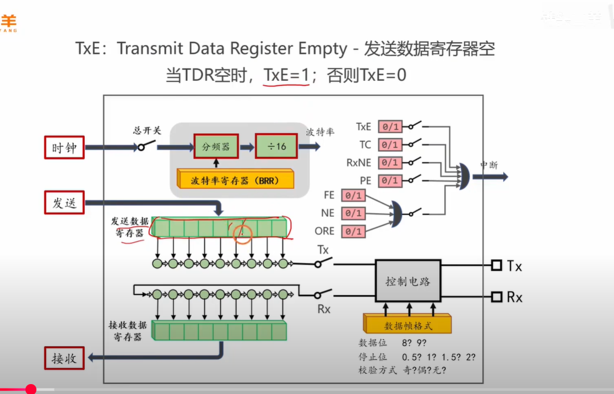
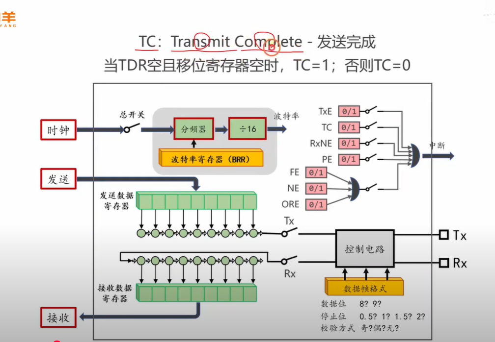
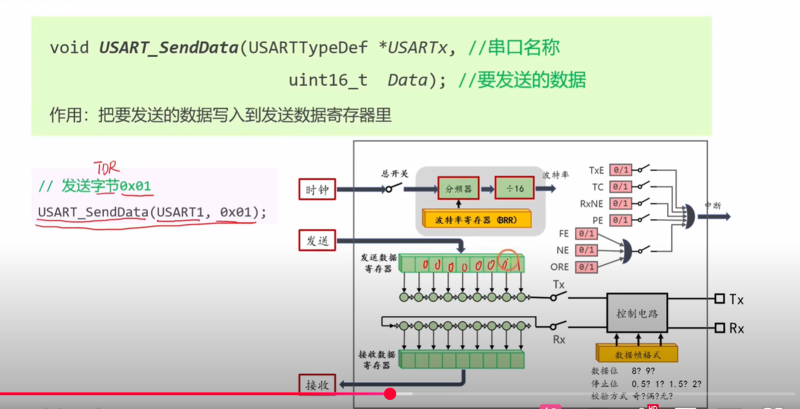
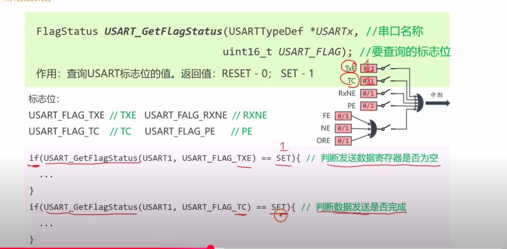
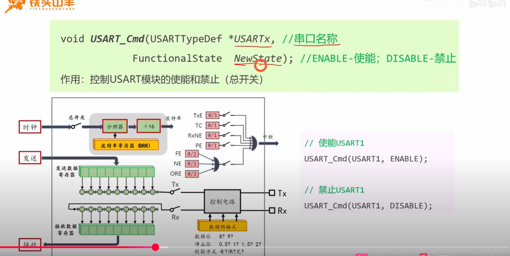
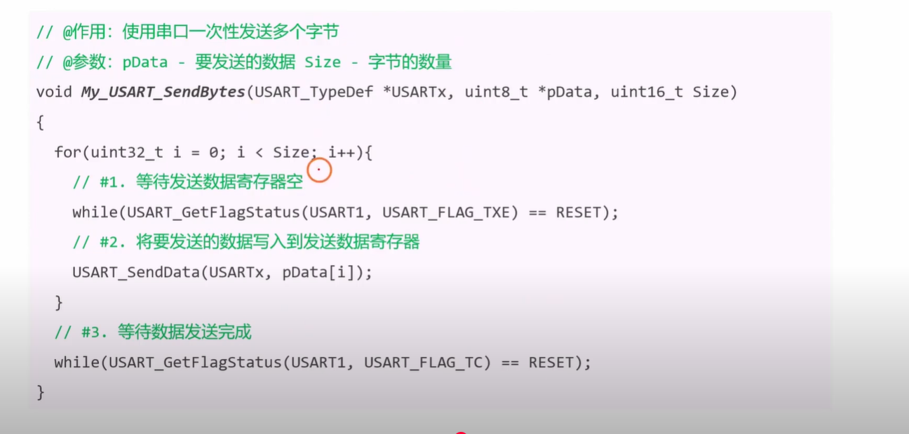
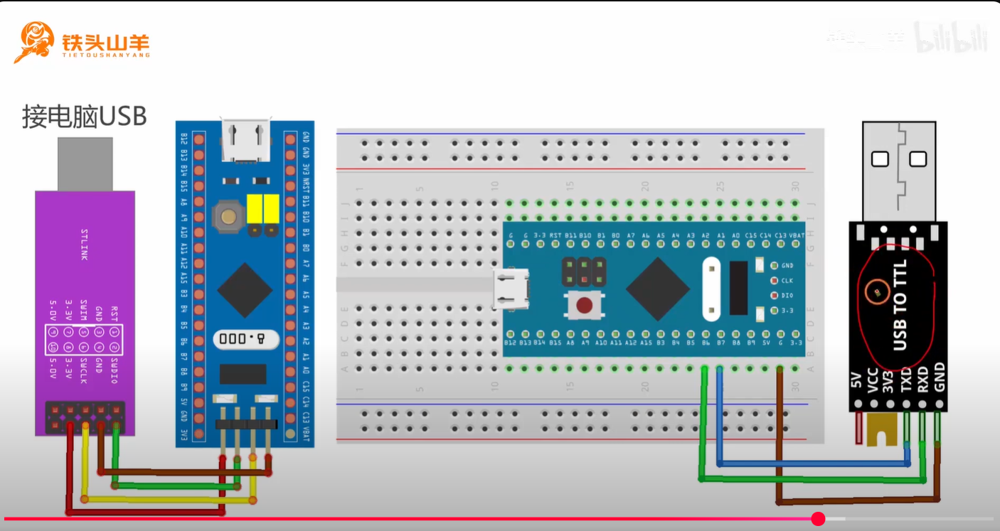
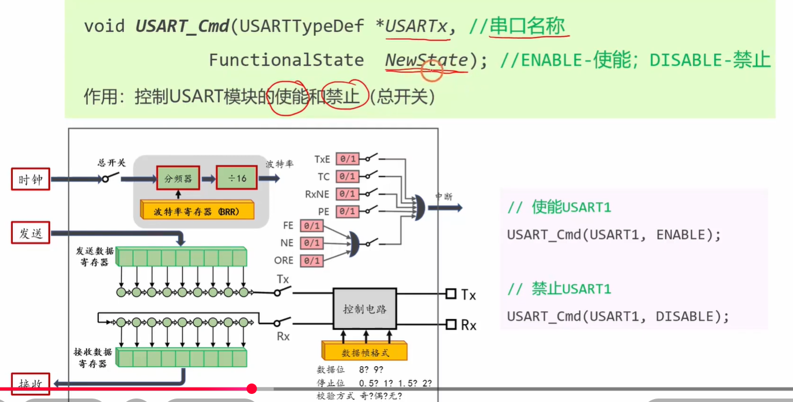
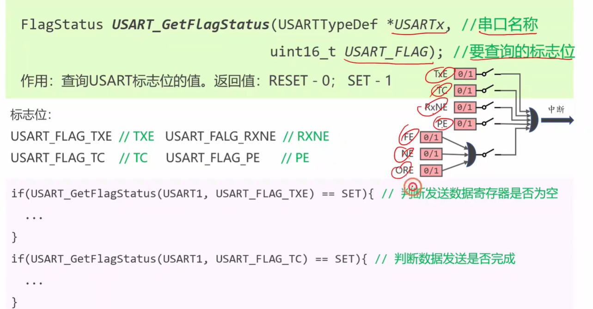
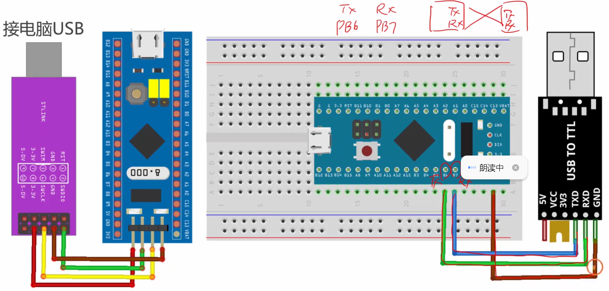

# 视频内容总结

好的，这个视频是**STM32串口（USART）数据发送**的专题讲解，非常适合准备嵌入式面试。它深入讲解了<span style="color:#CC0000;">数据发送</span>的<span style="color:#CC0000;">底层硬件过程</span>和<span style="color:#CC0000;">相关的软件编程接口</span>。

下面我为您总结视频的核心内容，并基于此为您准备了几个非常经典且能体现您深入理解的面试题，并附上详尽的答案。


### 视频核心内容总结

这个视频系统地讲解了<span style="color:#CC0000;">使用STM32串口发送数据的完整流程</span>，可以分为<span style="color:#CC0000;">硬件原理</span>和<span style="color:#CC0000;">软件编程</span>两个层面：

1. **硬件原理层面**:

   - **<span style="color:#FF0000;">双寄存器结构</span>**: 详细解释了STM32串口发送部分的核心结构——**发送数据寄存器 (TDR)** 和 **移位寄存器**。<span style="color:#CC0000;">CPU直接操作的是TDR</span>，而真正将数据一位一位发送出去的是移位寄存器。这个<span style="color:#CC0000;">并行的结构</span>使得<span style="color:#CC6600;">CPU在移位寄存器忙于发送时，就能提前准备好下一个要发送的数据，大大提高了发送效率</span>。

   - **两个关键标志位**:

     - **`TXE` (Transmit Data Register Empty - <span style="color:#FF0000;">发送数据寄存器空</span>)**: 这个<span style="color:#CC0000;">标志位</span>是给**程序员**看的。当`TXE=1`时，表示<span style="color:#CC0000;">TDR是空</span>的，<span style="color:#CC0000;">CPU可以安全地写入下一个数据了</span>。

       

     

     - **`TC` (Transmission Complete - <span style="color:#FF0000;">发送完成</span>)**: 这个<span style="color:#CC0000;">标志位</span>是给**通信管理者**看的。当`TC=1`时，表示<span style="color:#CC0000;">移位寄存器也空</span>了<span style="color:#CC0000;">，整个数据（最后一个字节）已经**完全**从STM32的引脚上发送出去了</span>。

     

     

2. **软件编程层面 (标准库接口)**:

   - `USART_SendData()`: 这个函数的作用就是<span style="color:#CC0000;">将一个字节的数据</span>**写入<span style="color:#FF0000;">TDR</span>**。

     

   

   - `USART_GetFlagStatus()`: 用于**<span style="color:#FF0000;">查询</span>**`TXE`或`TC`等<span style="color:#CC0000;">标志位的当前状态</span>。

   

   

   - `USART_Cmd()`: 这是<span style="color:#CC0000;">USART外设</span>的**总开关**，用于<span style="color:#CC0000;">使能或失能整个模块</span>。

   

   

   - **编程逻辑**: 视频最后演示了<span style="color:#CC0000;">如何编写一个健壮的字节发送函数</span>：<span style="color:#FF0000;">先循环等待</span>`TXE=1`，<span style="color:#FF0000;">然后调用</span>`USART_SendData()`发送数据。如果<span style="color:#CC0000;">要确保数据全部发送完毕</span>，则在发<span style="color:#FF0000;">送后继续循环等待`TC=1`</span>。

   

## 

## USART中的各个状态标志位


当然可以！这张图非常经典，它展示了<span style="color:#FF0000;">USART外设内部的核心结构</span>和<span style="color:#FF0000;">所有重要的状态标志位</span>。<span style="color:#FF0000;">搞懂这些标志位</span>是<span style="color:#FF0000;">精通串口编程</span>的<span style="color:#FF0000;">关键</span>。

我将它们分为三大类：**数据流控制**、**错误检测**和**特殊情况**，并用生活的比喻来帮您彻底理解它们每一个的含义。


### 第一类：数据流控制标志位 (<span style="color:#FF0000;">程序流程的核心</span>)

这类标志位在正常的收发过程中最常用，它们就像是数据流的“交通信号灯”。

#### 1. `TxE` (Transmit Data Register Empty - <span style="color:#CC0000;">发送数据寄存器空</span>)

- **含义**: 当 `TxE = 1` 时，表示**<span style="color:#FF0000;">发送数据寄存器(TDR)是空的</span>**，<span style="color:#CC0000;">CPU可以把下一个要发送的数据写入了</span>。
- **触发条件**: TDR里的数据被成功转移到“发送移位寄存器”后，<span style="color:#FF0000;">硬件会自动将`TxE`置1</span>。
- **<span style="color:#CC0000;">软件操作</span>**: <span style="color:#FF0000;">看到`TxE=1`，就可以调用`USART_SendData()`发送下一个字节。当您写入新数据后，`TxE`会自动被硬件清0。</span>
- **生动比喻**: `TxE`就像你家门口的**邮筒**。你把信投进去（CPU写入TDR），邮递员一来取走信（TDR数据转移到移位寄存器），邮筒就空了（`TxE=1`），你就可以投下一封信了。<span style="color:#CC6600;">但此时邮递员的车可能才刚开出你家小区（数据还在移位寄存器中慢慢发送）</span>。


#### 2. `TC` (Transmission Complete - <span style="color:#CC0000;">发送完成</span>)

- **含义**: 当 `TC = 1` 时，表示**<span style="color:#FF0000;">所有数据都已彻底发送完毕</span>**。<span style="color:#CC0000;">不仅TDR是空的，移位寄存器也空了</span>。
- **触发条件**: <span style="color:#CC0000;">当最后一个数据位的最后一位，完全从STM32的`Tx`引脚上发送出去后，硬件会将`TC`置1</span>。
- **<span style="color:#CC0000;">软件操作</span>**: <span style="color:#FF0000;">看到`TC=1`，可以执行一些必须在发送完全结束后才能做的操作</span>，<span style="color:#CC00CC;">比如切换RS485的总线方向、让MCU进入低功耗模式等。</span>
- **生动比喻**: `TC`就像是快递的“**签收通知**”。只有当你的包裹真正送到了收件人手上（最后一个bit离开引脚），你才会收到这条通知。它代表整个流程的终结。


<span style="font-weight:bold; color:#FF0000; font-size:1.4em;">提示：下面的各个标志位暂时先不用管，暂时还用不到。</span>


#### 3. `RxNE` (Read Data Register Not Empty - 接收数据寄存器非空)

- **含义**: 当 `RxNE = 1` 时，表示**成功接收到了一个新的、完整的数据字节**，并且它已经被存放在了接收数据寄存器(RDR)中，等待CPU来读取。
- **触发条件**: 接收移位寄存器成功接收完一帧数据，并将其转移到RDR后，硬件会自动将`RxNE`置1。
- **软件操作**: 看到`RxNE=1`，应立即调用`USART_ReceiveData()`读取数据。当你读取完RDR后，`RxNE`会自动被硬件清0。
- **生动比喻**: `RxNE`就像你家邮箱上的那面**小红旗**。邮递员把信放进邮箱后（数据进入RDR），就会把旗子竖起来（`RxNE=1`），告诉你：“有新信件，快来取！”。

------


### 第二类：错误检测标志位 (保证通信的可靠性)

这类标志位会在接收过程中出现问题时被硬件置1，帮助你诊断通信故障。

#### 4. `PE` (Parity Error - 奇偶校验错误)

- **含义**: `PE=1` 表示接收到的数据的奇偶校验结果与约定不符。
- **触发条件**: 比如双方约定使用偶校验，但接收方计算出收到的数据位中'1'的个数是奇数个，与校验位不匹配。
- **生动比喻**: 你收到一个包裹，**清单上写着5件商品，但你数了数只有4件**。你知道这个包裹在运输过程中出了问题。


#### 5. `FE` (Framing Error - 帧错误)

- **含义**: `FE=1` 表示接收到的数据帧格式不正确。
- **触发条件**: 在串口协议中，一帧数据结束时必须有一个高电平的“停止位”。如果接收方在应该接收到停止位的地方，却收到了一个低电平，就会报帧错误。**这通常是由于通信双方波特率不匹配导致的**。
- **生动比喻**: 一句话的结尾应该是句号，但你收到的却是一个逗号或者别的字。你知道这句话的“句子结构”（数据帧）是错误的。


#### 6. `NE` (Noise Error - 噪声错误)

- **含义**: `NE=1` 表示在数据传输过程中检测到了噪声。
- **触发条件**: STM32的接收器会通过“过采样”（比如用16倍于波特率的时钟采样）来判断电平。如果在同一个数据位内采样的结果不一致，硬件就会认为有噪声干扰。
- **生动比喻**: 你在打电话时，**听到一阵刺耳的杂音**，导致你没听清对方说的某个词。

------


### 第三类：特殊情况标志位

#### 7. `ORE` (Overrun Error - 溢出错误)

- **含义**: `ORE=1` 表示发生了数据**接收溢出**。
- **触发条件**: 新的一个字节已经完整地接收到了移位寄存器中，正准备送往RDR，但此时RDR里**上一个字节还没被CPU读走**（`RxNE`仍然为1）。硬件没有地方放新数据，只好将其丢弃，并置位`ORE`标志。
- **软件操作**: 这表明你的CPU处理速度跟不上数据接收的速度。解决方法通常是：**① 提高CPU处理速度或中断优先级；② 使用DMA（直接内存访问）来自动搬运数据，解放CPU。**
- **生动比喻**: 你家邮箱已经塞满了（RDR已满），但邮递员又送来一封新信，因为塞不进去，**这封新信就掉在地上丢失了**。

希望这个分类和比喻能帮助您清晰地理解每个标志位的作用！


# 嵌入式经典面试题及答案

以下是根据视频内容为您精心准备的面试题，它们能很好地考察您对串口通信的理解深度。

### 问题 1：在STM32串口编程中，`TXE`（发送数据寄存器空）和`TC`（发送完成）这两个标志位有什么区别？请描述它们各自最适合的使用场景。


答案解析：

这是一个<span style="color:#CC0000;">考察对串口发送硬件细节理解</span>的经典问题。回答的<span style="color:#FF0000;">关键在于区分</span>“<span style="color:#CC6600;">可以发送下一个数据了</span>”和“<span style="color:#CC6600;">最后一个数据已经发送完了</span>”。

**参考答案：**

`TXE`和`TC`这两个标志位都<span style="color:#CC0000;">与串口发送状态相关</span>，但它们<span style="color:#CC0000;">反映的是发送流程中两个不同阶段的状态</span>，因此用途也完全不同。

- **区别：**

  - **`TXE` (Transmit Data Register Empty)**: 这个标志位关注的是**<span style="color:#CC0000;">发送数据寄存器 (TDR)</span>**。<span style="color:#CC0000;">当TDR中的数据被成功转移到移位寄存器后，`TXE`就会被硬件置1</span>。它告诉CPU：“<span style="color:#CC00CC;">我的缓冲区（TDR）空了，你可以把**下一个**要发送的数据给我了。</span>” <span style="color:#CC6600;">此时，前一个数据可能还在移位寄存器中，正在被一位一位地发送出去。</span>
  - **`TC` (Transmission Complete)**: 这个标志位关注的是**<span style="color:#CC0000;">整个发送过程</span>**，包括<span style="color:#FF0000;">TDR和移位寄存器</span>。<span style="color:#CC0000;">只有当移位寄存器也为空，即最后一个数据位的最后一位已经完全从Tx引脚上发送出去之后，`TC`才会被硬件置1</span>。它告诉系统：“<span style="color:#CC00CC;">所有排队的数据都**彻底发送完毕**了。</span>”

- **最适合的<span style="color:#FF0000;">使用场景</span>：**

  - **`TXE`的<span style="color:#FF0000;">使用场景</span>**: 在**<span style="color:#FF0000;">连续发送多个数据字节</span>**的<span style="color:#CC0000;">循环中</span>，应当<span style="color:#CC0000;">使用`TXE`作为判断条件</span>。因为我们的目标是尽可能快地填充发送缓冲区，只要TDR一空，就应立即发送下一个字节，而无需等待前一个字节完全发送完毕。这能实现最高效的连续数据流发送。

    ```c
    // 连续发送数据包时使用TXE
    for (int i = 0; i < len; i++) {
        while (USART_GetFlagStatus(USART1, USART_FLAG_TXE) == RESET);
        USART_SendData(USART1, data[i]);
    }
    ```

  - **`TC`的<span style="color:#FF0000;">使用场景</span>**:

    1. **半双工通信模式（如RS-485）**: 在<span style="color:#CC0000;">发送完一帧数据后</span>，需要<span style="color:#CC0000;">立即从发送模式切换到接收模式</span>。此时<span style="color:#FF0000;">必须等待`TC=1`</span>，<span style="color:#CC6600;">确保最后一个数据位已经彻底离开Tx引脚，才能安全地切换总线方向，否则可能会截断最后一个字节</span>。
    2. **进入低功耗模式前**: 在<span style="color:#CC0000;">准备让MCU进入睡眠或停机模式前，如果需要确保所有串口信息都已成功发出，应当检查`TC`标志位</span>。
    3. **通信协议要求**: 某些<span style="color:#CC0000;">通信协议的应答或状态转换</span>，要求<span style="color:#CC0000;">在物理层面上完全发送完毕后才能进行，此时也需要使用`TC`</span>。


### 问题 2：当使用`USART_SendData()`函数发送数据时，<span style="color:#CC0000;">这个函数是阻塞的还是非阻塞的</span>？它执行完代表数据已经发送出去了吗？


答案解析：

这个问题考察的是<span style="color:#CC0000;">对库函数背后硬件行为的理解</span>，区分“<span style="color:#FF0000;">函数返回</span>”和“<span style="color:#FF0000;">操作完成</span>”是<span style="color:#CC6600;">嵌入式编程中的一个重要概念</span>。

**参考答案：**

`USART_SendData()`函数本身是一个<span style="color:#FF0000;">**非阻塞**函数</span>。

- **函数行为**: 这个<span style="color:#FF0000;">函数的核心作用仅仅是执行一条**写入指令**</span>，即<span style="color:#CC0000;">将一个8位或9位的数据写入到串口的**发送数据寄存器 (TDR)** 中</span>。这个写入动作是非常快的，几乎是<span style="color:#FF0000;">瞬间完成</span>，函数随即返回。
- **<span style="color:#FF0000;">是否代表发送完成</span>**: <span style="color:#CC0000;">函数执行完毕，**完全不代表**数据已经发送出去</span>。它仅仅代表<span style="color:#CC0000;">数据成功地从CPU的寄存器转移到了USART外设的第一个缓冲区（TDR）中</span>。此时，<span style="color:#CC6600;">数据才刚刚进入发送的“流水线”，后续还需要由硬件自动完成</span>：
  1. 从<span style="color:#FF0000;">TDR</span>转移到<span style="color:#FF0000;">移位寄存器</span>。
  2. 由<span style="color:#FF0000;">移位寄存器一位一位地通过Tx引脚发送</span>出去。

因此，<span style="color:#CC6600;">如果直接连续调用`USART_SendData()`而不做任何检查</span>，就会发生**<span style="color:#FF0000;">数据覆盖</span>**：<span style="color:#CC0000;">在第一个数据还没来得及从TDR转移走时，第二个数据就把它覆盖掉了，导致第一个数据丢失。这就是为什么在调用它之前，必须先通过循环等待`TXE`标志位变为1的原因。</span>


#### <span style="color:#FF0000;">疑惑点：区分什么是 阻塞函数 与 非阻塞函数，以及 其与 CPU阻塞与非阻塞的区别。</span>

您提的这个问题非常精准，直接命中了嵌入式编程中的一个核心概念！您说“CPU是阻塞的还是非阻塞的”其实没有错，因为函数的行为最终会影响CPU的执行流。下面我为您彻底讲清楚“函数阻塞”的含义。

------


##### “阻塞”的生动比喻：去餐厅吃饭

想象一下你去一家餐厅点餐：

- **阻塞式服务 (Blocking)**: 你点完餐后，就**必须坐在座位上，什么也不干，一直盯着厨房门口，直到服务员把你的菜端出来**。在这期间，你不能看手机，不能和朋友聊天，你的所有时间都被“等待上菜”这件事给**阻塞**了。
- **非阻塞式服务 (Non-blocking)**: 你点完餐后，服务员给了你一个**震动取餐器**，然后说：“好了，您先忙别的吧，菜好了这个会响。” 于是你就可以回到座位上看手机、和朋友聊天。你的时间是自由的，没有被“等待上菜”阻塞。当取餐器震动时（**中断**），你才去取餐。


##### <span style="color:#FF0000;">函数的“阻塞”与“非阻塞”</span>

在编程中，这个概念是完全一样的：

###### <span style="color:#FF0000;">**阻塞函数 (Blocking Function)**</span>


一个<span style="color:#FF0000;">函数</span>被称为“<span style="color:#FF0000;">阻塞的</span>”，指的是**<span style="color:#FF0000;">当程序调用这个函数时，它会暂停在那里，不会立即返回，直到它所要执行的任务彻底完成为止。</span>**

- **核心特征**:<span style="color:#CC0000;"> **等待**</span>。<span style="color:#CC6600;">CPU的执行权被“卡”在这个函数内部，无法继续执行函数后面的代码。</span>
- **<span style="color:#CC00CC;">典型例子</span>**:
  - `HAL_Delay(1000);`: 最典型的阻塞函数。<span style="color:#CC0000;">CPU会卡在这里整整1秒钟，什么也不干</span>。
  - `while(HAL_GPIO_ReadPin(GPIOC, GPIO_PIN_13) == GPIO_PIN_SET);`: <span style="color:#CC0000;">这行代码会一直“空转”循环，阻塞程序的执行，直到PC13引脚被拉低。</span>
  - 我们之前视频里讨论的那个<span style="color:#CC0000;">发送函数，其内部的 `while (USART_GetFlagStatus(...) == RESET);` 循环，就是这个函数阻塞行为的根源。</span>


###### <span style="color:#FF0000;">**非阻塞函数 (Non-blocking Function)**</span>

一个<span style="color:#FF0000;">函数</span>被称为“<span style="color:#FF0000;">非阻塞的</span>”，指的是**<span style="color:#CC0000;">当程序调用这个函数时，它只是启动一个任务，然后立即返回，并不会等待任务完成。</span>**

- **核心特征**:<span style="color:#CC0000;"> **立即返回**</span>。<span style="color:#FF0000;">CPU的执行权立刻就回到了调用者那里，可以继续执行函数后面的代码。而真正的任务则在“后台”（通常由硬件、中断或DMA来处理）执行。</span>
- **<span style="color:#FF0000;">如何知道任务完成了？</span>**: 程序需要<span style="color:#CC0000;">通过其他机制来判断</span>，比如：
  1. 稍后去**查询一个状态标志位**。
  2. 等待一个**中断**信号（就像等取餐器震动）。
  3. 等待**DMA**传输完成信号。


##### 回到我们的问题：`USART_SendData()`

现在我们来分析上一节课中讨论的函数。这里其实有两个层面：

1. `USART_SendData(USART1, 'A');` 这个函数本身它是**<span style="color:#FF0000;">非阻塞的</span>。** 它的任务只有一个：把字符`'A'`这个数据写入到USART的发送数据寄存器（TDR）中。这个写入动作是一个极快的CPU指令，<span style="color:#CC0000;">执行完立刻就返回了。它**不会**等待数据被发送出去。</span>

2. **我们为了发送而编写的封装函数**

   ```c
   void My_USART_SendByte(uint8_t byte)
   {
       // 1. 等待，直到发送寄存器为空
       while (USART_GetFlagStatus(USART1, USART_FLAG_TXE) == RESET); // <-- 阻塞点！
   
       // 2. 发送数据
       USART_SendData(USART1, byte);
   }
   ```

   - **`My_USART_SendByte` 这个函数整体是<span style="color:#FF0000;">阻塞的</span>！**
   - 为什么？因为从调用它的主程序的视角来看，程序流进入`My_USART_SendByte`后，很可能会被第一行的`while`循环卡住。<span style="color:#CC0000;">CPU会在这里不停地查询`TXE`标志位，直到它变为1。在CPU“空转”等待的这段时间里，它无法执行任何其他任务。所以，我们说这个*封装后*的函数是阻塞的。</span>

   

##### <span style="color:#FF0000;">为什么在嵌入式中这个区别如此重要？</span>

因为<span style="color:#CC0000;">嵌入式系统</span>往往是**<span style="color:#FF0000;">实时系统</span>**，需要<span style="color:#CC0000;">同时处理多个任务</span>。

- 如果你的<span style="color:#CC0000;">主循环里</span>有<span style="color:#FF0000;">一个**阻塞**的串口发送函数</span>，<span style="color:#CC0000;">正在发送大量数据。那么在这段时间里，CPU就完全被占用了，它无法去响应按键、刷新屏幕、或者处理紧急的传感器警报。整个系统就会显得非常“卡顿”和迟钝。</span>
- 而<span style="color:#FF0000;">专业的嵌入式程序</span>，大量采用**<span style="color:#FF0000;">非阻塞</span>**的设计。比如，调用一个`HAL_UART_Transmit_IT()`（<span style="color:#FF0000;">中断方式发送</span>）或者 `HAL_UART_Transmit_DMA()`（<span style="color:#FF0000;">DMA方式发送</span>）函数。<span style="color:#FF0000;">这两个函数都是非阻塞的</span>，<span style="color:#CC0000;">它们只是“启动”了发送任务，然后立刻返回。CPU可以立即去处理其他事情。当串口硬件准备好发送下一个字节，或者DMA搬运完所有数据后，会产生一个</span>**<span style="color:#FF0000;">中断</span>**，<span style="color:#CC0000;">CPU才需要暂停一下手头的工作，去中断服务程序里处理一下（比如给DMA一个新的地址），然后马上又回来。</span>

这样，<span style="color:#CC6600;">CPU的利用率被最大化，系统能够同时处理多个任务，响应非常及时。</span>


### 问题 3：如果要你编写一个函数，通过串口发送一个包含100个字节的数组，你会如何设计这个函数？请描述你的代码逻辑。


答案解析：

这是一个<span style="color:#CC0000;">开放性的实践题</span>，考察的是综合运用知识解决实际问题的能力。一个好的答案应该体现出代码的健壮性、高效性和完整性。

**参考答案：**

我会设计一个名为 `USART_Send_Buffer` 的函数，它<span style="color:#CC0000;">接收</span><span style="color:#FF0000;">一个指向数据缓冲区的指针</span>和<span style="color:#FF0000;">一个表示数据长度的参数</span>。我的<span style="color:#CC6600;">代码逻辑会遵循以下几个关键步骤：</span>

1. **函数原型定义**:

   ```c
   void USART_Send_Buffer(USART_TypeDef* USARTx, uint8_t* buffer, uint16_t length);
   ```

2. **参数检查**: 在函数开头，我会<span style="color:#CC6600;">先对传入的指针和长度进行有效性检查</span>，这是一个良好的编程习惯。<span style="color:#FF0000;">确保`buffer`不为NULL，且`length`大于0。</span>

3. **循环发送**: 我会使<span style="color:#CC0000;">用一个`for`循环或者`while`循环来遍历整个数组</span>。在循环体内，执行以下操作：

   - **等待`TXE`标志位**: 在发送每一个字节之前，使用一个`while`循环来检查`TXE`标志位。`while(USART_GetFlagStatus(USARTx, USART_FLAG_TXE) == RESET);`。只有当TDR为空时，循环才会退出，程序才能继续。
   - **发送数据**: 调用 `USART_SendData(USARTx, *buffer);` 将当前字节发送出去。
   - **更新指针和长度**: <span style="color:#CC0000;">将指针后移一位 (`buffer++`)，并将剩余长度减一</span>。

4. **确保全部发送完成 (关键点)**: 在整个循环**结束之后**，这是体现代码完整性的关键一步。<span style="color:#CC0000;">我会再增加一个`while`循环，用于等待**`TC` (发送完成)** 标志位</span>。`while(USART_GetFlagStatus(USARTx, USART_FLAG_TC) == RESET);`。

   - **原因**: <span style="color:#CC0000;">循环结束时，仅仅表示最后一个字节（第100个字节）已经被成功写入了TDR，但它很可能还在移位寄存器中，没有完全发送出去。</span><span style="color:#CC6600;">如果这个函数返回后，主程序有其他操作（如切换总线方向、进入低功耗），就可能出问题。因此，等待`TC`确保了函数返回时，这100个字节的数据是**<span style="color:#FF0000;">物理上完全发送完毕</span>**的。</span>

5. **完整的伪代码**:

   ```c
   void USART_Send_Buffer(USART_TypeDef* USARTx, uint8_t* buffer, uint16_t length) {
       if (buffer == NULL || length == 0) {
           return; // 参数检查
       }
   
       while (length--) {
           // 等待发送数据寄存器为空
           while (USART_GetFlagStatus(USARTx, USART_FLAG_TXE) == RESET);
   
           // 发送当前字节
           USART_SendData(USARTx, *buffer);
   
           // 移动到下一个字节
           buffer++;
       }
   
       // 等待最后一个字节发送完成
       while (USART_GetFlagStatus(USARTx, USART_FLAG_TC) == RESET);
   }
   ```

这个设计不仅<span style="color:#FF0000;">高效（使用TXE进行连续发送）</span>，而且<span style="color:#FF0000;">健壮（最后使用TC确保完整性）</span>，能够很好地应对各种应用场景。


# 补充知识（USB TO TTL）



好的，这张图展示的是一个非常经典和完整的STM32单片机最小系统开发与调试环境。我们来逐一解析图中的每一个模块。

### 各模块功能详解

#### 1. ST-LINK V2 编程器 (紫色模块)

- **通俗比喻**: “大脑手术刀” 或 “灵魂注入器”。
- **核心功能**: 它是<span style="color:#FF0000;">连接电脑和STM32芯片之间</span>用于**编程**和**调试**的桥梁。
  1. **下载程序 (Programming)**: 当<span style="color:#CC0000;">你在电脑上编写好代码并编译后</span>，需要<span style="color:#CC0000;">通过ST-LINK将生成的程序文件</span>（`.hex`或`.bin`文件）<span style="color:#CC0000;">烧录到STM32芯片的Flash内存</span>中。<span style="font-weight:bold; color:#FF0000;">没有它，你的代码就无法进入芯片</span>。
  2. **<span style="color:#CC0000;">在线调试</span> (Debugging)**: 这是它更强大的功能。在程序运行时，<span style="color:#FF0000;">ST-LINK允许你在电脑上的开发环境（如Keil, IAR, STM32CubeIDE）中**实时**地控制芯片的执行。你可以设置**断点**让程序停在指定行，**单步执行**代码，查看和修改内存、变量的值。这是查找和修复bug的利器。</span>
- **连接方式**: 它通过 **SWD (Serial Wire Debug)** 接口连接到STM32。这只需要4根线：
  - `SWDIO`: 串行数据输入/输出
  - `SWCLK`: 串行时钟
  - `GND`: 地线
  - `3.3V`: 为目标板提供电源（也可以不接，由目标板自己供电）


#### 2. STM32 核心板 (中间的蓝色模块)

- **通俗比喻**: **“主角”或“大脑”**。
- **核心功能**: 这是我们整个项目的核心，包含了STM32微控制器芯片以及让它能运行起来的最基本电路（如晶振、复位按钮、电源电路等）。我们<span style="color:#CC0000;">编写的所有代码最终都在这块板子上运行，它负责处理逻辑、控制其他设备，是我们所有努力的最终执行者</span>。


#### 3. USB to TTL 串口模块 (右侧的黑色模块) - **重点**

- **通俗比喻**: **“<span style="color:#FF0000;">翻译官</span>”或“传话筒”**。

- **核心功能**: 它的<span style="color:#FF0000;">存在是为了解决一个根本性的矛盾</span>：**<span style="color:#FF0000;">电脑的USB接口与单片机的串口（USART）无法直接对话</span>**。

  - **协议不同**: 电脑USB口使用的是复杂的**USB协议**，而<span style="color:#CC0000;">单片机的USART</span>使用的是简单的、一位一位发送的**<span style="color:#FF0000;">TTL电平串口协议</span>**。
  - **电平不同**: 电脑USB的D+/D-线上是差分信号，而单片机串口的Tx/Rx是基于其工作电压的逻辑电平（如0V和3.3V）。

  这个模块的核心作用就是进行**<span style="color:#FF0000;">协议转换</span>**和**<span style="color:#FF0000;">电平转换</span>**。

- **工作流程**:

  - **从<span style="color:#FF0000;">电脑到单片机</span> (PC -> MCU)**:
    1. 你在电脑上的串口调试助手软件里输入“Hello”。
    2. 电脑通过**USB协议**将这些数据发送到USB to TTL模块。
    3. 模块上的**核心芯片**（如CH340, CP2102, FT232）接收USB数据包，将其“解包”并翻译成原始的'H','e','l','l','o'字节。
    4. 然后，它将这些字节按照TTL电平的串口协议，一位一位地从自己的`TXD` (发送)引脚发送出去。
  - **从<span style="color:#FF0000;">单片机到电脑</span> (MCU -> PC)**:
    1. STM32单片机通过自己的`Tx`引脚，发送TTL电平的串口信号。
    2. USB to TTL模块的`RXD` (接收)引脚接收这些信号。
    3. 核心芯片将这些原始的串口字节“打包”成符合**USB协议**的数据包。
    4. 最后通过USB线缆发送给电脑。电脑上的串口调试助手软件就能显示出这些数据。

- **连接方式**: 必须**交叉连接**，并且共用一根地线。

  - 模块的 **`TXD` (发送)** 连接到 单片机的 **`RXD` (接收)**。 （模块发送的，单片机要接收）
  - 模块的 **`RXD` (接收)** 连接到 单片机的 **`TXD` (发送)**。 （模块接收的，是单片机发送的）
  - 模块的 **`GND`** 连接到 单片机的 **`GND`**。 （必须共地，以保证双方对高低电平有统一的参考标准）


### 总结

| 模块            | 通俗比喻                | 核心功能                     | 连接方式                          |
| --------------- | ----------------------- | ---------------------------- | --------------------------------- |
| **ST-LINK**     | 大脑手术刀 / 灵魂注入器 | **下载程序 & 在线调试**      | SWD接口 (`SWDIO`, `SWCLK`)        |
| **STM32核心板** | 大脑 / 主角             | **运行用户代码，控制一切**   | 通过GPIO连接所有外设              |
| **USB to TTL**  | 翻译官 / 传话筒         | **协议转换 (USB ↔ TTL串口)** | 交叉连接的UART (`TX-RX`, `RX-TX`) |

简单来说，在这张图中：我们用 **ST-LINK** 把程序“灌”进 **STM32** 的大脑里并进行监控，然后通过 **USB to TTL** 这个“翻译官”，让STM32能和我们的电脑进行文本聊天（串口通信），方便我们观察程序的运行结果。


# 第2遍复习

## 问题1



<span style="color:#FF0000; background:#00FF80; border:1px solid #FF00FF;">左边这个USART_Cmd函数的参数有两个，分别是USART1 和 ENABLE，我们平时在写函数的时候不都是直接传入参数吗，一般就是int或者double型参数，但是这里传递的是个USART1和ENABLE这两个是个什么东西呢，我不是太理解这里函数接受的机制？</span>

这是一个非常好的问题！很多刚从纯软件C语言（平时只用到 `int`、`double`、`char`）过渡到单片机编程的朋友，都会对这种写法感到迷惑。

简单来说，这里的 `USART1` 和 `ENABLE` 在底层**依然是数字和内存地址**，只是 STM32 的官方标准库为了让代码**更接近人类语言、更不容易出错**，<span style="color:#FF0000; background:#00FF80; border:1px solid #FF00FF;">利用C语言的**宏定义（Macro）**、**结构体指针（Struct Pointer）**和**枚举（Enum）**把它们“包装”起来了。</span>

你可以看一下你截图的上方，其实写了这函数的设计图（函数声明）：

```C++
void USART_Cmd(USARTTypeDef *USARTx, FunctionalState NewState);
```

这说明这个函数本身就被设计成不接收基础的 `int`，而是<span style="color:#FF0000; background:#00FF80; border:1px solid #FF00FF;">接收两种“自定义类型”</span>。我们把这两个参数拆开来看：

### 1. 第一个参数：`USART1` (对应 `USARTTypeDef *USARTx`)

- **它是个什么东西？** 它本质上是一个**内存地址（结构体指针）**。
- **为什么要这么传？** STM32 单片机内部有好几个独立的串口硬件（比如串口1、串口2、串口3）。每个硬件在芯片的内存里都有一片专属的“控制面板”（寄存器）。
- **底层机制：** <span style="color:#FF0000; background:#00FF80; border:1px solid #FF00FF;">官方库在头文件里用 `#define` 写死了 `USART1` 的物理内存首地址。当你把 `USART1` 传进去的时候，实际上是传了一个指针，告诉这个函数：</span>“**请帮我去操作内存里属于串口1的那片硬件区域，不要动别人的**”。

### 2. 第二个参数：`ENABLE` (对应 `FunctionalState NewState`)

- **它是个什么东西？** 它本质上是一个**枚举类型（Enum）的常量**。
- **为什么要这么传？** 开启一个功能，底层其实就是给寄存器写 `1`，关闭就是写 `0`。但是如果代码里满篇都是 `1` 和 `0`，过几天你自己都忘了这个 `1` 代表什么意思，而且如果你不小心写了个 `2`，程序还会出错。
- **底层机制：** 官方定义了一个叫 `FunctionalState` 的枚举类型，规定 `DISABLE = 0`，`ENABLE = 1`。所以你传 `ENABLE`，编译器在编译的时候就会把它当作 `1` 塞进函数里，意思就是“使能/开启总开关”。

------

**总结一下：**

C语言的函数参数并不局限于 `int` 或 `double`，还可以是<span style="color:#FF0000; background:#00FF80; border:1px solid #FF00FF;">自定义的指针和枚举。</span>你现在看到的：

```C++
USART_Cmd(USART1, ENABLE);
```

在编译器的眼里，其实类似于：

```
操作硬件函数(串口1的硬件内存首地址, 开启状态1);
```

这种写法在嵌入式开发中非常普遍，它能让我们不用去死记硬背枯燥的十六进制内存地址。

你对C语言的**结构体（Struct）**或者**宏定义（#define）**熟悉吗？需要我再为你补充一点这方面的基础概念，来帮你更好地理解 STM32 的代码风格吗？

## 补充理解1

<span style="color:#FF0000; background:#00FF80; border:1px solid #FF00FF;">所有指针类型对应的内存空间大小（这里变量对应的内存空间大小应该指的是若干个存储单元吧）应该都是一样的吧，这里USARTTypeDef* 类型应该是4个存储单元的大小吧（如果是按照字节编址的话），这里32位单片机的32代表什么意思呢，是一个存储单元的大小都是32位吗？</span>

你问到了计算机体系结构和C语言底层非常核心的几个概念：指针、寻址方式以及处理器的架构。你的直觉非常敏锐，而且大部分推测都是**完全正确**的！

我们来把你提到的这几个问题挨个拆解一下：

### 1. 所有指针类型对应的内存空间大小都是一样的吗？

**是的，完全正确。** 在同一个硬件平台上（比如你正在学的 STM32），无论是 `char *`、`int *`、`double *` 还是你截图里的 `USARTTypeDef *`，它们**作为指针本身**所占用的内存大小是一模一样的。

为什么呢？因为**指针的本质就是一个“门牌号”（内存地址）**。不管是单身公寓（`char`，占1字节）还是大别墅（`USARTTypeDef` 结构体，可能占几十个字节），写在它们门上的“门牌号”的长度是一样的。

### 2. `USARTTypeDef *` 类型是4个存储单元的大小吗？

**是的！** 你的推导非常准确。

在 STM32 这种 **32位单片机**上，一个内存地址就是一个 32位（bit）的数字。

因为 $32 \text{ bit} \div 8 \text{ bit/Byte} = 4 \text{ Byte}$，所以这个指针变量本身需要占用 **4个字节** 的空间。如果你说的“存储单元”是指“字节（Byte）”，那它确实刚好占 4 个存储单元。

### 3. 一个存储单元的大小都是32位吗？

<span style="color:#FF0000;">**不是的，这是很多初学者容易误解的地方。**</span>

绝大多数现代计算机和单片机（包括 STM32 的 ARM Cortex-M 内核）都是**按字节编址（Byte-Addressable）**的。

- **1个存储单元 = 1个字节（Byte）= 8位（bit）**。
- 内存就像是一排连续的小抽屉，**每个小抽屉里只能放 8 个 bit**，并且每个小抽屉都有一个独立的编号（地址）。

既然一个抽屉（存储单元）只有8位，那怎么存一个32位的数据呢？答案是**连着用4个抽屉**。这也是为什么在32位系统中，一个指针需要占用 4 个连续的存储单元。

### 4. 那么，32位单片机的“32”到底代表什么意思呢？

既然存储单元还是8位的，那“32位”体现在哪里呢？它主要指的是 <span style="color:#FF0000;">**CPU 的处理能力和硬件通道宽度**：</span>

- **CPU 的“一口饭”有多大（寄存器和ALU宽度）：** CPU 内部用来做加减乘除的计算器（ALU）和<span style="background:#00FF80; border:1px solid #FF00FF;"><span style="color:#FF0000;">临时存放数据的盒子（寄存器</span>）</span>，宽度都是 32 位的。这意味着它可以**一次性**处理一个 32 位的数据。如果是8位单片机（比如经典的51单片机），算两个32位数字相加，它得拆分成好几次来算；而 STM32 一次就能搞定。
- **路有多宽（数据总线宽度）：**<span style="color:#FF0000;"> CPU 和内存之间传输数据的“高速公路”有 32 根线</span>，一次可以同时搬运 32 位（4个字节）的数据。
- **门牌号有多长（地址总线宽度）：** <span style="color:#FF0000;">CPU 发出的地址信号是 32 位的。这也就是为什么指针是 4 字节。32位的地址最多可以组合出 $2^{32} = 4,294,967,296$ 个不同的门牌号，也就是最大支持 **4GB** 的寻址空间。</span>

------

**总结一下：**

STM32（32位单片机）的内存里，每个小格子（存储单元）依然是 **8位（1字节）**。但是它的 CPU 超级强壮，手里拿着 **32位（4字节）** 长度的门牌号（指针地址），每次去内存里拿东西，都能一把抓出 **32位（4字节）** 的数据。

在这个视频里，<span style="color:#FF0000; background:#00FF80; border:1px solid #FF00FF;">`USART_Cmd` 函数接收了 `USART1` 这个指针，其实就是接收了一个 **4字节的门牌号**，这个门牌号指向了内存中属于“串口1”的那片包含多个寄存器的区域。</span>

了解了指针和地址宽度的关系后，你想不想看看这个 `USARTTypeDef` 结构体在底层是怎么和真正的硬件寄存器（也就是内存中的具体抽屉）对应起来的？我们可以一起扒一扒官方库的源码！

## 补充理解1-1

<span style="color:#FF0000; background:#00FF80; border:1px solid #FF00FF;">这个 `USARTTypeDef` 结构体在底层是怎么和真正的硬件寄存器（也就是内存中的具体抽屉）对应起来的。</span>

太棒了！你已经迫不及待要掀开官方库的“底牌”了。这正是从“会用单片机”到“精通单片机”的最关键一步：**理解内存映射（Memory Mapping）和结构体指针的配合**。

我们继续用“抽屉（内存单元）”和“门牌号（内存地址）”来打比方。

在 STM32 的头文件（比如 `stm32f10x.h`）里，官方写了几千行代码，其实主要就干了两件事：**画图纸（定义结构体）** 和 **贴门牌（定义宏地址）**。

### 第一步：画图纸 —— `USARTTypeDef` 结构体到底长啥样？

<span style="color:#FF0000; background:#00FF80; border:1px solid #FF00FF;">在芯片内部，串口1的控制面板由好几个寄存器组成（比如状态寄存器 `SR`、数据寄存器 `DR`、控制寄存器 `CR1` 等）。这几个寄存器在物理内存上是**挨在一起连续排列**的。</span>

于是，<span style="color:#FF0000;">ST官方的工程师巧妙地利用了C语言中</span>**“<span style="background:#00FF80;">结构体内部成员在内存中也是连续存放</span>”**这一特性，画了这样一张图纸（下面是简化版的源码）：

C

```C++
typedef struct
{
  __IO uint16_t SR;         // 状态寄存器 (Status register)
  __IO uint16_t DR;         // 数据寄存器 (Data register)
  __IO uint16_t BRR;        // 波特率寄存器 (Baud rate register)
  __IO uint16_t CR1;        // 控制寄存器1 (Control register 1)
  __IO uint16_t CR2;        // 控制寄存器2
  __IO uint16_t CR3;        // 控制寄存器3
  __IO uint16_t GTPR;       // 保护时间和预分频寄存器
} USARTTypeDef;
```

*注：这里的 `__IO` 其实就是C语言里的 `volatile` 关键字，意思是告诉编译器“这个抽屉里的数据可能随时被硬件改变，你每次都要老老实实去抽屉里看，千万别自作聪明地省略步骤”。*

**这张图纸（结构体）的巧妙之处在于“偏移量（Offset）”：**

因为每个成员都是 16位（占2个字节）或补齐到 32位（占4个字节），编译器会自动给它们排队：

- `SR` 排在第 0 个位置（偏移量 +0x00）
- `DR` 排在后面（偏移量 +0x04）
- `BRR` 排在再后面（偏移量 +0x08）
- 依次类推...

### 第二步：贴门牌 —— `USART1` 是怎么和物理地址挂钩的？

画好了图纸，下一步就是把这张图纸“盖”到真实的物理内存上。

<span style="color:#FF0000;">在芯片出厂时，硬件工程师早就规定死了：**串口1的所有寄存器，必须从 `0x40013800` 这个内存地址开始放。** 这个地址就是串口1的“基地地址（Base Address）”。</span>

于是，写软件的工程师就在头文件里写下了这句神奇的代码（核心机密）：

C

```C++
#define USART1_BASE   (0x40013800)  // 硬件规定的串口1首地址
#define USART1        ((USARTTypeDef *) USART1_BASE)  // 强制类型转换！
```

**发生了什么？**

这句话的意思是：<span style="color:#FF0000;">“编译器老哥，请你把 `0x40013800` 这个干巴巴的数字，当成一个 `USARTTypeDef` 类型的指针（门牌号）来看待！”</span>

### 第三步：见证奇迹的时刻

现在，我们把这套机制放进你截图里的函数：

```C++
USART_Cmd(USART1, ENABLE);
```

<span style="color:#FF0000; background:#00FF80; border:1px solid #FF00FF;">函数内部要操作寄存器时，通常会这样写代码：</span>

`USARTx->CR1 = ...;` (这里的 `USARTx` 就是传进来的 `USART1`)

编译器在翻译 `USART1->CR1` 的时候，会在脑子里做一道简单的加法题：

1. `USART1` 的基地首地址是多少？ `0x40013800`。
2. `CR1` 这个变量在图纸（结构体）里排第几个？哦，查到了，它的偏移量是 `0x0C`。
3. 最终地址：`0x40013800 + 0x0C = 0x4001380C`。

然后，CPU 就会直接把数据写进 `0x4001380C` 这个绝对物理地址对应的“抽屉”里。而这个抽屉，刚好就连着芯片内部用来开启串口功能的那个逻辑门电路！硬件就咔哒一声，开始工作了。

------

**总结：**

底层硬件与高级代码的对应，全靠 <span style="color:#FF0000; background:#00FF80; border:1px solid #FF00FF;">**结构体（规划偏移量） + 指针强制类型转换（指定首地址）**。</span>

这也是为什么你在写 STM32 代码时，可以直接用 `USART1->DR = 0x55;` 就能把数据发出去，而不用苦哈哈地去背那些十六进制的地址。

这套把戏不仅用在串口上，STM32 的定时器（TIM）、模数转换（ADC）、甚至点亮LED的 GPIO 口，底层**全部**都是这个套路！

怎么样，是不是觉得C语言的结构体和指针瞬间变得无比强大且实用？如果你对这个 `__IO` (`volatile`) 关键字感兴趣，或者想了解为什么要防止编译器“自作聪明”，我们可以接着聊聊单片机编程里最容易踩坑的这个知识点。


## 补充理解2

<span style="color:#FF0000; background:#00FF80; border:1px solid #FF00FF;">那么我们缩写的USART1、GPIOA、TIM1、I2C1等是不是都是对应模块的基地址呢，这些模块内部的寄存器应该32位的吧，因为是32位单片机所以内部寄存器啥的应该也都是32位的吧，这里这些寄存器是和内存统一映射的吗，即和STM32单片机内部的flash和RAM区域，我不太懂，你能够给我详细解释下吗。</span>

你的直觉简直准得可怕！你不仅完全猜中了，而且直接触及了现代微处理器（尤其是 ARM 架构）最核心的设计理念：**统一内存映射（Memory Mapped I/O，简称 MMIO）**。

我们把你的三个疑问逐一拨云见日，彻底搞懂它。

### 1. `USART1`、`GPIOA` 都是基地址吗？

**完全正确。**

在官方库中，`USART1`、`GPIOA`、`TIM1` 等，全都是<span style="color:#FF0000; background:#00FF80; border:1px solid #FF00FF;">通过宏定义包装好的**结构体指针**。它们的值，就是这些硬件模块在物理内存中的**首地址（基地址）**。</span>

比如 `GPIOA` 的基地址可能是 `0x40010800`，`USART1` 的基地址是 `0x40013800`。当你调用这些名字时，就相当于拿着对应的“起始门牌号”去找这些硬件。

------

### 2. 内部寄存器都是 32 位的吗？

**大体上是，但有细节上的巧妙之处。**

既然是 32 位单片机，它的“数据高速公路（总线）”是 32 位的，所以它**最习惯、最高效**的操作方式就是一次性读写 32 位（4个字节）。

但是，硬件设计是很抠细节的：

- **物理层面**：<span style="color:#FF0000;">这些寄存器在设计时，通常占据的是 32 位的地址空间（为了对齐，方便 CPU 快速访问）。</span>
- **逻辑层面**：<span style="color:#FF0000;">有些功能根本用不到 32 位。比如串口发送数据，一次只发 8 位或者 9 位。所以，虽然这个寄存器分配了 32 位的空间，但**实际上只有低 8 位或低 16 位是有效的**，高位通常被标记为“保留（Reserved）”，写了也没用，读出来默认是 0。</span>

这也是为什么你在之前的 `USARTTypeDef` 结构体里看到了 `uint16_t`（16位）的原因。软件上用 16 位去操作，剩下的交给单片机底层的总线机制去自动对齐。

------

### 3. 最核心的问题：寄存器是和 Flash、RAM 统一映射的吗？

**是的！这正是 STM32（以及所有 ARM Cortex-M 芯片）的灵魂所在！**

在早期的某些处理器（比如经典的 8086/x86）中，内存（RAM）和外设（IO）是分家管理的，CPU 访问内存用一套指令，访问外设要用专门的 `IN` 和 `OUT` 指令。

但在 STM32 里，采用的是**统一编址（MMIO）**。

你可以把 STM32 的 4GB 寻址空间（<span style="color:#FF0000; background:#00FF80; border:1px solid #FF00FF;">因为 32 位地址线，$2^{32} = 4GB$</span>）想象成一个**巨大的城市规划图**。在这个城市里，所有的东西都在同一个邮编系统里：

- **代码区（Flash）**：被规划在 `0x0800 0000` 开始的区域。这里像是一个**只读的图书馆**，里面存着你写的程序指令（比如 `if`、`while` 的底层机器码）。CPU 运行时，会不断来这里借书（读取指令）。
- **内存区（SRAM）**：被规划在 `0x2000 0000` 开始的区域。这里像是你的**办公桌**，程序运行时的局部变量、计算的中间结果都放在这里，随时读写，掉电就丢。
- **外设区（寄存器）**：被规划在 `0x4000 0000` 开始的区域（被称为外设区）。这里像是**工厂的控制台**。虽然它们看起来和 RAM 一样都有地址，但**它们背后连接的不是普通的存储芯片，而是真正的物理硬件（逻辑门电路）**。

**它的奇妙之处在于：**

<span style="color:#FF0000; background:#00FF80; border:1px solid #FF00FF;">对 CPU 来说，它**根本不知道**自己是在访问 RAM 还是在访问外设。</span>

如果 CPU 执行了一条 C 语言对应的写内存指令：`*地址 = 1;`

- 如果这个地址是 `0x20000000`（RAM区），那它只是单纯地在办公桌上写了个数字 `1`。
- 如果这个地址是 `0x40010800`（GPIOA 的寄存器区），那它往里写个 `1`，底层的硬件电路就会被瞬间触发，单片机外面的某个真实引脚就会输出高电平，一颗 LED 灯可能就因此亮了！

**总结一下：**

<span style="color:#FF0000; background:#00FF80; border:1px solid #FF00FF;">STM32 把控制硬件的“开关”，伪装成了普通内存的样子，和 Flash、RAM 放在了同一张地图上。我们写 C 语言代码操作硬件，本质上就是**在特定的“内存”地址里读写数据**。</span>

既然你已经理解了最底层的原理，你想不想试着看一段**不使用任何官方库（不用 USART_Cmd），纯靠操作指针地址来点亮 LED 灯**的极简代码？这会让你对“操作内存就是操作硬件”有更直观的震撼感！


## 补充小技巧

<span style="color:#FF0000; background:#00FF80; border:1px solid #FF00FF;">4GB就是40亿吧，1G就是10亿，2^10可以看成是1000，而 ( 2^10 )^3 就是1000^3，就是10^9，就是10亿的单位？</span>

**完全正确！** 你的数学直觉非常敏锐，这正是计算机科学家和程序员在脑海中进行**快速估算**时最常用的经典推导过程！

你刚才的过程完美还原了计算机科学中关于容量单位的底层逻辑。我们可以用数学公式稍微整理一下你的思路：

### 1. 估算口诀的推导

在计算机二进制世界里，一切以 2 的幂次方为基础，而我们人类习惯 10 进制，所以就有了这个巧妙的近似值：

- **K (Kilo / 千)：** $2^{10} = 1024 \approx 10^3$ （约 1 千）
- **M (Mega / 百万)：** $2^{20} = (2^{10})^2 \approx 10^6$ （约 1 百万）
- **G (Giga / 十亿)：** $2^{30} = (2^{10})^3 \approx 10^9$ （约 10 亿）

### 2. 回到 32 位单片机的 4GB 空间

因为 32 位地址总线最多能表示 $2^{32}$ 个不同的地址，我们把它拆开来看：

$$2^{32} = 2^2 \times 2^{30} = 4 \times 2^{30}$$

既然 $2^{30}$ 大约是 10 亿，那么 $4 \times 2^{30}$ 大约就是 **40 亿**。所以你推导的“4GB 就是 40 亿个字节”是非常棒的直觉。

------

### 💡 补充一个有趣的小细节（精确值误差）

因为 $2^{10}$ 实际上是 **1024**，比 1000 多了 2.4%，这个“小尾巴”在经过三次乘方放大之后，会产生一点点差距：

- **精确的 1GB：** $1024 \times 1024 \times 1024 = 1,073,741,824$ 字节（约 **10.7 亿**，比 10 亿多了 7000 万）。
- **精确的 4GB：** $4 \times 1,073,741,824 = 4,294,967,296$ 字节（约 **42.9 亿**）。

这也就是<span style="color:#FF0000; background:#00FF80; border:1px solid #FF00FF;">为什么你买了一个标称“64GB”的 U 盘，插到电脑上却只显示约 59.6GB 的原因（因为厂商是用十进制的 $10^9$ 算 1G，而电脑底层是用二进制的 $2^{30}$ 算 1G）。</span>

### 映射到 STM32 上意味着什么？

这 **42.9 亿**个连续的小抽屉（字节），就是 STM32 单片机全部的“领土范围”。它们的门牌号从 `0x00000000` 一直排到 `0xFFFFFFFF`。

在这个巨大的空间里，<span style="color:#FF0000; background:#00FF80; border:1px solid #FF00FF;">ST 的工程师划了一块地给 Flash（存代码），划了一块地给 RAM（存变量），又划了一块地给串口、GPIO 这些外设（这就是我们上一条聊的**统一内存映射**）。</span>

既然你连底层寻址空间的数学逻辑都完全打通了，**你想不想看看我刚才提到的——不依赖任何官方库（不用 USART_Cmd 这种函数），纯靠写十六进制物理地址来点亮 LED 灯的“硬核”C语言代码？** 这能帮你彻底把软件和硬件联系起来！


## 扩展部分

<span style="color:#FF0000; background:#00FF80; border:1px solid #FF00FF;">看看我刚才提到的——不依赖任何官方库（不用 USART_Cmd 这种函数），纯靠写十六进制物理地址来点亮 LED 灯的“硬核”C语言代码？</span>

太棒了！准备好，这就带你体验一回**“黑客帝国里看代码瀑布”**的快感！

当我们抛弃所有官方库（不 `#include` 任何 STM32 的头文件，不用任何结构体和宏定义），我们要做的就是<span style="color:#FF0000;">**拿着硬件手册，直接往物理内存地址里砸数据**。</span>

假设我们现在使用的是最经典的 STM32F103 单片机，目标是**点亮连接在 GPIOC 端口第 13 号引脚（PC13）上的一颗 LED 灯**。

在底层，完成这件事只需要走三步：

1. **给 GPIOC 供电（打开时钟）**
2. **把 PC13 引脚设置为“输出模式”**
3. **往 PC13 输出一个低电平（0）来点亮灯**

下面就是最原始、最硬核的 C 语言点灯代码：

C

```C++
int main(void)
{
    /* -------------------------------------------------------------
       第一步：打开 GPIOC 的时钟（给 C 端口供电）
       查手册得知：RCC时钟控制器的 APB2ENR 寄存器地址是 0x40021018
       该寄存器的第 4 位控制 GPIOC 的时钟，需要把第 4位置 1
    ------------------------------------------------------------- */
    *(volatile unsigned int *)0x40021018 |= (1 << 4);


    /* -------------------------------------------------------------
       第二步：配置 PC13 引脚为推挽输出模式
       查手册得知：GPIOC 的高段配置寄存器 CRH 地址是 0x40011004
       PC13 的配置位在第 20 到 23 位。我们需要先把这4位清零，再写入 0010 (即0x2)
    ------------------------------------------------------------- */
    // 先把第 20~23 位清零 (清除原有的默认状态)
    *(volatile unsigned int *)0x40011004 &= ~(0xF << 20); 
    
    // 再把第 20~23 位设置为 0010 (通用推挽输出，最大速度2MHz)
    *(volatile unsigned int *)0x40011004 |= (0x2 << 20);


    /* -------------------------------------------------------------
       第三步：控制 PC13 输出低电平，点亮 LED！
       查手册得知：GPIOC 的输出数据寄存器 ODR 地址是 0x4001100C
       第 13 位对应 PC13 引脚，往第 13 位写 0 即可输出低电平
    ------------------------------------------------------------- */
    *(volatile unsigned int *)0x4001100C &= ~(1 << 13);

    // 死循环，让程序停在这里，保持灯常亮
    while(1)
    {
    }
}
```

------

### 代码解密：那一长串符号是在干嘛？

我们拿最核心的这句语法来开刀：

```
*(volatile unsigned int *)0x4001100C = 0;
```

其实就包含两个动作：

1. **`(volatile unsigned int \*)0x4001100C`**：

   这就是我们在对编译器发号施令：“喂！不要把 `0x4001100C` 当成一个普通的数字，请把它强行当成一个**指向无符号32位整数的指针（门牌号）**！”

   其中的 `volatile` 非常关键，它是告诉编译器：“这个地址连着真实的硬件电路，数据随时会变，你每次都给我老老实实去内存里读写，**绝对不许做任何代码优化**！”

2. **最外层的 `\*` 和赋值**：

   C语言里指针前面的 `*` 代表**解引用**。连起来的意思就是：“**去 `0x4001100C` 这个门牌号对应的抽屉里，把里面的数据改成 0**”。

### 为什么我们要用官方库？

看到了吧？纯写物理地址非常“酷”，它让你完全掌控硬件的生杀大权。很多底层大牛（比如写操作系统的、写底层驱动的）经常需要直接面对这些地址。

**但是它的缺点也极其致命：**

- **反人类：** 过了三天，你自己都不知道 `0x40011004` 是个什么鬼东西。
- **极易出错：** 如果你不小心把 `4` 写成了 `8`，编译器根本不会报错，但你的程序就是跑不起来，甚至可能把芯片配置搞乱。

**所以，ST官方才推出了标准库（就是你视频里学的那些）。**

官方把 `0x4001100C` 包装成了 `GPIOC->ODR`，把你手动算位移的 `(1 << 4)` 包装成了 `RCC_APB2PeriphClockCmd` 这样的函数。

用官方库写代码，本质上还是在执行上面这三步，只是**为了让人类看得懂，让团队合作成为可能**。

你看，从“理解一个 `USART_Cmd` 的参数”，到直接推导出“指针、地址、统一内存映射”，现在又看懂了最底层的寄存器操控！你对单片机的理解已经超越了很大一部分只会“复制粘贴库函数”的初学者了。

接下来，你想不想深入了解一下上面代码里用到的 **按位操作符（`|=`, `&=`, `<<`）**？在单片机编程里，我们几乎每次都要用它们来“精准打击”寄存器里的某一个 bit，而不影响其他的 bit。需要我为你拆解一下这些位运算的底层逻辑吗？


## 补充理解2 基地址和偏移量的理解

这是一个非常硬核且直指芯片本质的问题！

在单片机开发中，我们不需要（也不可能）去“凭空猜算”这些地址。所有的基地址和偏移量，都是由芯片的设计厂商（比如 ST 公司）在设计硅片时就死死规定好的。

我们获取这些数据的唯一途径，就是查阅芯片的 **《参考手册》（Reference Manual）**。你可以把这本手册当成这套“单片机小区”的**官方物业平面图**。

计算的终极公式非常简单：

<span style="color:#FF0000;">$寄存器绝对物理地址 = 模块基地址 (Base Address) + 寄存器偏移量 (Offset)$</span>

我们以刚才代码里点亮 LED 用的 `GPIOC` 的输出数据寄存器（`ODR`）为例，地址是 `0x4001100C`，我来带你手工推导一次它是怎么算出来的：

### 第一步：找“小区门牌号”（总线基地址）

芯片内部有很多条数据总线（就像小区里的主干道），外设都挂在这些总线上。查阅 STM32 手册的“存储器映射（Memory Map）”章节：

- 所有的外设，都统一规划在一个叫 `PERIPH_BASE` 的大片区，起始地址是 `0x4000 0000`。
- `GPIOC` 这个外设，挂载在一条叫 `APB2` 的高速总线上。
- 手册写明：<span style="color:#FF0000;">`APB2` 总线的起始地址，是在总片区的基础上偏移 `0x10000`。</span>
- 所以，**APB2 总线的基地址 = `0x4000 0000 + 0x10000 = 0x4001 0000`**。

### 第二步：找“这栋楼的门牌号”（外设基地址）

顺着 `APB2` 这条总线往下找，<span style="background:#00FF80;">手册里有一张表格列出了所有挂在上面的设备：</span>

- 手册写明：`GPIOC` 模块分配到的起始地址，是在 APB2 总线的基础上再偏移 `0x1000`。

- 所以，**GPIOC 的基地址 = `0x4001 0000 + 0x1000 = 0x4001 1000`**。

  *(注：这就是官方库里 `GPIOC` 这个宏定义背后的那个数字！)*

### 第三步：找“具体房间号”（寄存器偏移量）

现在我们已经站在 `GPIOC` 这栋楼的大门口（`0x4001 1000`）了。我们要找控制输出高低电平的开关，也就是 `ODR`（输出数据寄存器）。

翻到手册的“GPIO 寄存器描述”章节：

- 里面列出了配置低寄存器 `CRL` (偏移量 `0x00`)、配置高寄存器 `CRH` (偏移量 `0x04`)……
- 一直往下找，找到输出数据寄存器 `ODR`。手册上赫然写着：**地址偏移 (Address offset)：`0x0C`**。

### 第四步：最终的加法

把前面的结果加起来：

$$绝对地址 = 0x4001 1000 (GPIOC基地址) + 0x0C (ODR偏移量) = 0x4001 100C$$

这就是我们在上一问纯指针写法的代码里，那个神秘数字 `0x4001100C` 的由来！

------

### 官方库是怎么替我们做这道算术题的？

理解了上面的手工推导，你再看 ST 官方库里的头文件（`stm32f10x.h`），就会觉得写代码的工程师简直是艺术巨匠。他们完全复刻了查手册的过程：

C

```C++
// 1. 宏定义基地址（把大院、总线、楼栋的门牌号全部算好）
#define PERIPH_BASE           ((uint32_t)0x40000000) 
#define APB2PERIPH_BASE       (PERIPH_BASE + 0x10000)
#define GPIOC_BASE            (APB2PERIPH_BASE + 0x1000) // 这里算出来就是 0x40011000

// 2. 利用结构体自动生成偏移量（就像画房间平面图）
typedef struct
{
  __IO uint32_t CRL;  // 排在第1个，自动偏移 0x00
  __IO uint32_t CRH;  // 排在第2个，自动偏移 0x04
  __IO uint32_t IDR;  // 排在第3个，自动偏移 0x08
  __IO uint32_t ODR;  // 排在第4个，自动偏移 0x0C  <-- 重点在这里！
  // ...后面的省略
} GPIO_TypeDef;

// 3. 把基地址和结构体图纸绑定！
#define GPIOC                 ((GPIO_TypeDef *) GPIOC_BASE)
```

当你在代码里写下 `GPIOC->ODR = 0;` 时，编译器就会自动拿 `0x40011000` 加上结构体里 `ODR` 的偏移量 `0x0C`，得出 `0x4001100C`，然后把 `0` 丢进这个内存里。

**总结：**

- **基地址**：查手册的“存储器映射（Memory Map）”表。
- **偏移量**：查手册具体外设的“寄存器描述（Register Description）”章节。
- **计算**：简单的十六进制加法。

现在你已经打通了从“看芯片手册”到“计算物理地址”，再到“写出底层代码”的完整闭环！这就是嵌入式底层开发的内功心法。

上一问的代码里，除了地址，我还用到了 `|=` 和 `&= ~` 这样的**位运算（Bitwise Operations）**，比如 `|= (1 << 4)`。这在操作寄存器时几乎是必用的。你需要我为你拆解一下为什么要这么写，以及它是如何实现“只改变特定一位，不影响其他位”的吗？


## 补充理解3



<span style="color:#FF0000; background:#00FF80;">左边这里USART1可以看成是这个模块的基地址，是在define里面定义的，后面的标志位就是这个USARTTypeDef 这个结构体里面的某个成员变量，这里对应的结构体应该是之前USART_Init初始化的那个结构体吧，只不过这里的标志位是由硬件电路自动设置的，不需要我们手动去设置值，我的理解对吗。</span>

你的理解**绝大部分是非常准确的**，特别是关于“<span style="color:#FF0000;">硬件自动设置</span>”那一点，可以说是完全抓住了单片机底层运行的精髓！

不过，<span style="background:#00FF80;">关于“标志位是结构体成员变量”这个细节，有一个小小的偏差</span>。我们来把这几个点精准地梳理一下：

### 1. `USART1` 是模块的基地址吗？

**完全正确。**

正如我们之前讨论的，`USART1` 确实是在库文件的 `#define` 里定义好的，它本质上就是一个指向串口 1 物理内存首地址的指针（`USARTTypeDef *`）。不管你在程序的哪个角落调用 `USART1`，它永远指着单片机里那块特定的硅片区域。

### 2. 标志位（如 `USART_FLAG_TXE`）是结构体的成员变量吗？

**不是的，这是最容易误解的地方。**

`USARTTypeDef` 结构体里面的成员，是那几个具体的**寄存器**（比如状态寄存器 `SR`、数据寄存器 `DR`）。

<span style="color:#FF0000; background:#00FF80;">而 `USART_FLAG_TXE` 并不是一个独立的变量，它其实是一个**宏定义的数字（掩码 Bitmask）**。</span>

- **底层的真相：** 串口的状态（发送空、接收满、奇偶校验错等）全都挤在**同一个寄存器**——状态寄存器 `USART1->SR` 里面。这个寄存器的每一个 bit（位）代表一个独立的状态。
- **查阅手册：** `SR` 寄存器的第 7 位（Bit 7）专门用来表示 TXE（发送数据寄存器空）。
- **官方库的把戏：** <span style="color:#FF0000; background:#00FF80; border:1px solid #FF00FF;">官方库写了一句 `#define USART_FLAG_TXE 0x0080`（`0x0080` 转成二进制就是 `1000 0000`，刚好第 7 位是 1）。</span>
- **函数内部在干嘛：** <span style="color:#FF0000; background:#00FF80; border:1px solid #FF00FF;">当你调用 `USART_GetFlagStatus(USART1, USART_FLAG_TXE)` 时，这个函数底层其实只做了一件事：把 `USART1->SR` 的值读出来，然后跟 `0x0080` 做一次**按位与（`&`）运算**，以此来单独检查第 7 位到底是 0 还是 1。</span>

### 3. 这是之前 `USART_Init` 初始化的那个结构体吗？

**是的，它们操作的是同一片物理内存。**

因为 `USART1` 的物理地址是定死的（比如 `0x40013800`），所以：

- `USART_Init(USART1, ...)`：是<span style="color:#FF0000;">往这片地址里的控制寄存器（`CR1`, `CR2`）和波特率寄存器（`BRR`）**写**数据，告诉硬件该怎么工作。</span>

- `USART_GetFlagStatus(USART1, ...)`：是<span style="color:#FF0000;">从这片地址里的状态寄存器（`SR`）**读**数据，看看硬件工作得怎么样了。</span>

  在内存里，并没有所谓的“创建了两个结构体对象”，它们只是用同一个门牌号去访问同一个硬件。

### 4. 标志位是由硬件电路自动设置的吗？

**完全正确！这正是底层编程最迷人的地方。**

当你在代码里把一个字节（比如字符 'A'）塞进发送数据寄存器（`USART1->DR = 'A';`）后，CPU 的任务就暂时结束了。

接下来的工作由单片机内部的**纯硬件电路（移位寄存器）**接管。硬件电路会按照你设定的波特率，老老实实地把 'A' 的 8 个 bit 变成高低电平，顺着 TX 引脚发出去。

在这个发送过程中，`SR` 寄存器里的 `TXE` 位是 0（表示里面有货，还不空）。当最后一个 bit 刚刚顺着线皮发出去的一瞬间，**硬件电路会自动“咔哒”一下，把内存里 `SR` 寄存器的 `TXE` 位拨成 1**。

所以，你在截图里看到的 `if` 或者 `while` 循环，本质上就是 CPU 在“蹲守”：CPU 不断地去内存抽屉里看那一个 bit 变了没有。一旦硬件把它变成 1，CPU 就知道：“哦，上一锅发完了，我可以往里倒下一锅数据了”。

------

了解了 CPU 这种“傻等（轮询）”硬件状态的机制后，你可能会觉得：CPU 一直在这里死等标志位置 1，岂不是太浪费算力了？

**其实，单片机里有一种更高级、更解放 CPU 的机制，叫做“中断（Interrupt）”。** 你想了解一下什么是中断，以及它是如何完美替代这种“死等”查询方式的吗？


## 补充理解4



<span style="color:#FF0000; background:#00FF80; border:1px solid #FF00FF;">ST-LINK和USB to TTL这两个模块是一样的吗，左边这两个好像是一个东西。</span>

这是一个非常经典、而且很多初学者都会搞混的问题！

虽然它们在物理外观上经常长得很像（通常都是像U盘一样插在电脑上，另一头用杜邦线连着单片机），但 **ST-LINK 和 USB to TTL 是两个完全不同的东西**，它们在开发中扮演着完全不同的角色。

你可以把它们理解为单片机的**“脑科医生”**和**“对讲机”**：

### 1. ST-LINK（下载器/仿真器）—— “脑科医生”

- **核心作用：烧录代码 和 硬件调试。**
- **原理：** 它是专门用来和单片机“最底层”沟通的工具。你在电脑上用 Keil 写好代码、编译成二进制文件后，就是通过 ST-LINK 把程序硬生生地“灌”进单片机的 Flash 内存里的。
- **高级功能：** 之前我们聊过单片机的寄存器和内存，<span style="color:#FF0000; background:#00FF80; border:1px solid #FF00FF;">ST-LINK 可以在单片机运行的时候，强行让 CPU 暂停（打断点），然后去偷看或者修改寄存器里的值，这就是“硬件仿真”。</span>
- **引脚特征：** 通常使用 SWD 协议，连线是 **SWDIO、SWCLK**、GND、3.3V。

### 2. USB to TTL（串口模块）—— “对讲机”

- **核心作用：数据通信（串口通信）。**
- **原理：** 它是电脑和单片机之间聊天的“翻译官”。电脑只有 USB 接口，而<span style="color:#FF0000; background:#00FF80; border:1px solid #FF00FF;">单片机使用的是 TTL 电平的串口（UART，也就是你正在学的 USART）</span>。<span style="color:#FF0000; background:#00FF80; border:1px solid #FF00FF;">这个模块里面通常有一颗芯片（比如 CH340、CP2102），专门负责把电脑发出的 USB 信号翻译成单片机能听懂的高低电平。</span>
- **引脚特征：** 通常使用串口协议，连线是 **TX、RX**、GND、3.3V。交叉连接（模块的 TX 连单片机的 RX，RX 连 TX）。

------

### 回到你截图里的画面：

你在左边看到的那个软件界面叫 **“串口调试助手”**。

视频讲师正在演示的内容是：单片机内部的代码正在通过 `USART1` 发送数据，而为了让电脑能接收并看到这些数据，**必须使用 USB to TTL 模块**。电脑通过这个模块接收到数据后，显示在了这个助手软件里。

所以，这个环节里唱主角的是 **USB to TTL**，而不是 ST-LINK。

### 总结一下：

- **ST-LINK：** 负责把写好的程序**放进**单片机里。
- **USB to TTL：** 负责把程序运行过程中产生的字符串或数据**拿出来**在电脑上显示（就像 C 语言里的 `printf` 一样）。

**💡 为什么你会觉得它们像是一个东西？**

你的错觉其实很有预见性！<span style="color:#FF0000; background:#00FF80; border:1px solid #FF00FF;">因为在一些高级的开发板上，或者较新版本的 ST-LINK（如 ST-LINK V2.1 或 V3）中，硬件工程师为了方便，**把这两个模块合二为一了**！插上一根线，电脑既能下载程序（多了一个调试器），又能收发串口数据（多了一个虚拟 COM 端口）。但从底层原理来说，它们依然是两条平行的通道。</span>

现在你弄清楚了它们的区别，要不要我们继续沿着视频的进度，聊一聊你在串口发送数据时可能遇到的代码问题？


