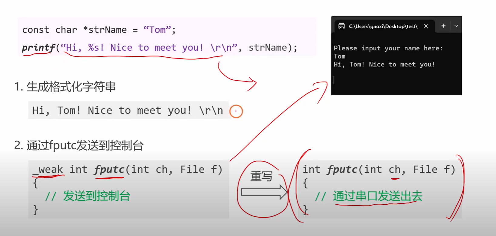
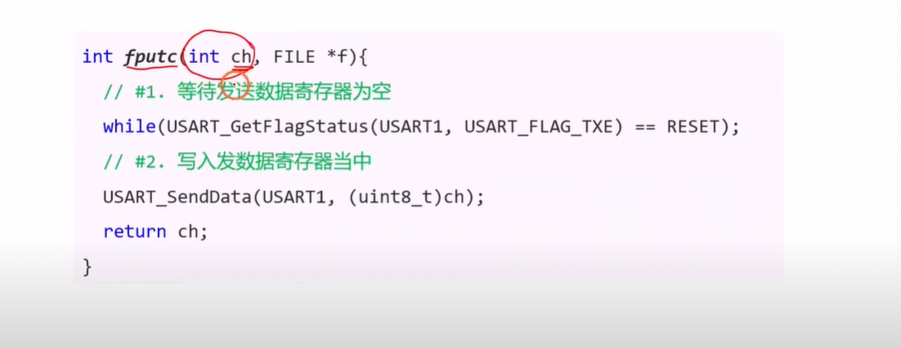
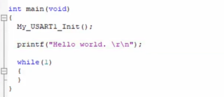
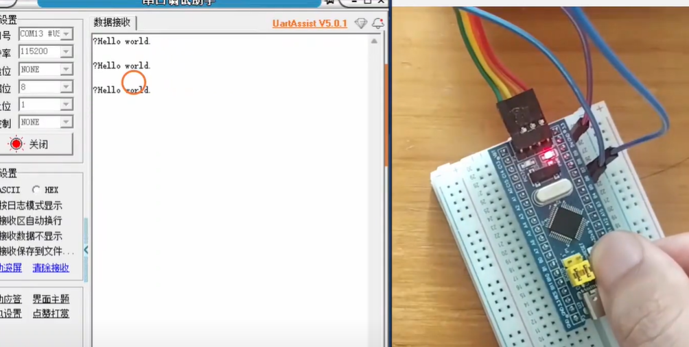
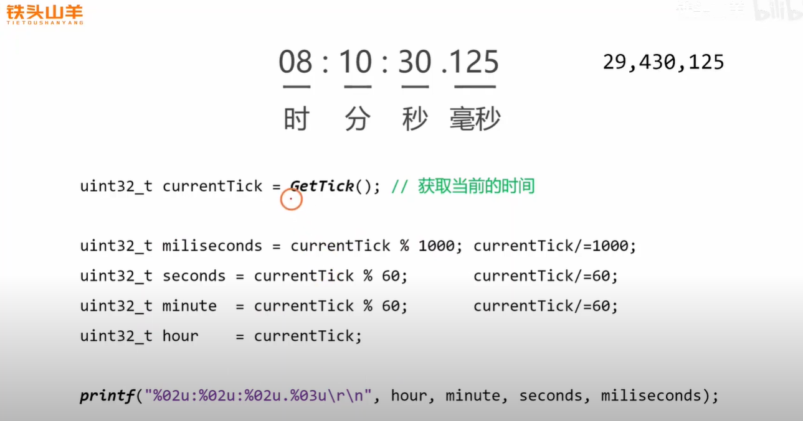
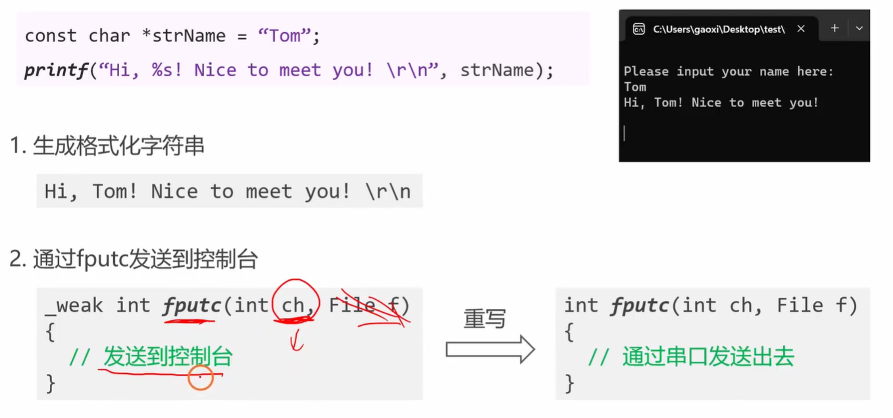
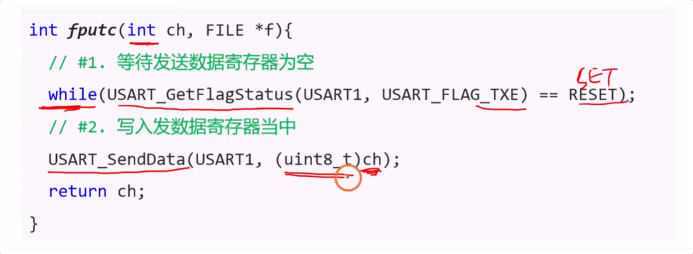

好的，这个视频是**STM32串口`printf`重定向**的专题讲解，这是嵌入式开发中非常实用和常见的技巧，也是面试中的高频考点。它考察的是开发者对标准C库函数底层工作原理的理解以及在嵌入式环境下的移植能力。

下面我为您总结视频的核心内容，并基于此为您准备了几个非常经典且能体现您深入理解的面试题，并附上详尽的答案。


# 视频核心内容总结

这个<span style="color:#CC0000;">视频的核心思想</span>是<span style="color:#FF0000;">**“劫持”C语言标准库中的`printf`函数，使其输出目标从默认的电脑屏幕（控制台）改变为STM32的物理串口**。</span>整个过程分为以下几个关键步骤：

1. **代码封装与规范化**: 视频首先演示了良好的编程习惯，比如将串口初始化代码封装成独立的函数 `my_usart_init()`，并为函数添加清晰的注释。这体现了代码的模块化和可读性。

2. **`printf`函数工作原理揭秘**:
   
   - `printf`本身是一个复杂的**<span style="color:#FF0000;">格式化字符串生成器</span>**。它的主要工作是<span style="color:#CC0000;">在内存中根据你提供的格式（如`%d`, `%s`）和参数，将它们组合成一个最终的字符串。</span>
   - `printf`生成字符串后，并**<span style="color:#FF0000;">不直接负责</span>**<span style="color:#CC0000;">“显示”或“发送”</span>。它<span style="color:#CC0000;">会逐个字符地调用一个底层的、更基础的字符输出函数，这个函数就是 `fputc()`。</span>
   
   
   
3. **`fputc`函数重定向 (<span style="color:#FF0000;">核心</span>)**:
   
   - 在标准的PC开发环境中（如Visual Studio），<span style="color:#CC6600;">C库中的`fputc`函数</span><span style="color:#CC0000;">默认会将字符输出到电脑的控制台（黑框框）</span>。
   - 在<span style="color:#CC0000;">嵌入式开发环境（如Keil MDK）中</span>，为了让`printf`能通过串口工作，<span style="color:#CC6600;">编译器提供了一个机制</span>：<span style="color:#FF0000;">允许开发者**自己重新实现（重写）`fputc`函数**</span>。
   - 视频中的<span style="color:#FF0000;">核心操作</span>就<span style="color:#FF0000;">是重写了`fputc`函数</span>。在这个<span style="color:#CC0000;">新的`fputc`函数内部</span>，<span style="color:#FF0000;">不再</span>是<span style="color:#FF0000;">输出到屏幕</span>，而是<span style="color:#FF0000;">调用上一节课学过的`USART_SendData()`</span>，<span style="color:#FF0000;">将字符通过串口发送出去</span>。
   
4. **实现与测试**:
   
   - 重写`fputc`函数的<span style="color:#FF0000;">具体实现</span>是：<span style="color:#CC0000;">循环等待`TXE`标志位，然后调用`USART_SendData()`。</span>
   
   
   
   - <span style="color:#CC0000;">完成重写后</span>，你<span style="color:#FF0000;">在`main`函数中就可以像在PC上编程一样</span>，<span style="color:#FF0000;">直接使用`printf("Hello, world! Value is %d\n", value);`，这些内容就会自动通过串口发送出来。</span>
   
   
   
   
   
   
   
   注意：前面那个0xff是在单片机启动的时候会有一个0xff输出出来
   
   - 视频<span style="color:#FF0000;">最后通过一个打印动态时间的例子，展示了`printf`格式化输出的强大能力。</span>
   
   
   
   ## 疑问点1：上述计算 ÷60 省去小数部分 是否导致计算出错
   
   <span style="color:#CC0000; font-weight:bold; font-size:1.3em;">提问：这里÷60的时候把小数部分给省略掉了不会导致打印的时间出现错误吗？</span>
   
   你好！你提出了一个非常好的问题。关于代码中 `÷60` (在C语言中是 `/= 60`) 省略掉小数部分是否会导致时间计算错误，答案是：**不会导致错误，这正是这段代码能够正确工作的关键。**
   
   让我们来分析一下这段代码的逻辑：
   
   
   
   ### 核心概念：<span style="color:#CC0000;">整型除法和取模运算</span>
   
   在C语言（以及许多其他编程语言）中，当两个整数（比如 `uint32_t` 类型）相除时，执行的是**整型除法**。这意味着结果的小数部分会被直接丢弃，只保留整数部分。
   
   - **整型除法 (`/`)**: `100 / 60` 的结果是 `1`，而不是 `1.666...`。
   - **取模运算 (`%`)**: `100 % 60` 的结果是除法操作的余数，也就是 `40`。
   
   这段代码巧妙地结合了<span style="color:#CC0000;">这两种运算来逐级分离时间单位</span>。
   
   
   
   ### 代码执行步骤分析
   
   我们以来图中的 `currentTick = 29,430,125` 为例，一步一步看代码是如何执行的：
   
   1. **获取总毫秒数**
      - `uint32_t currentTick = 29430125;`
   2. **计算毫秒 (miliseconds)**
      - `miliseconds = currentTick % 1000;`
        - `29430125 % 1000 = 125`
      - `currentTick /= 1000;` (这里是关键的整型除法)
        - `currentTick = 29430125 / 1000 = 29430` (小数部分 `.125` 被丢弃)
      - **结果**: `miliseconds` 变量得到了 `125`。`currentTick` 现在代表**<span style="color:#FF0000;">总秒数</span>**。
   3. **计算秒 (seconds)**
      - `seconds = currentTick % 60;`
        - `29430 % 60 = 30`
      - `currentTick /= 60;`
        - `currentTick = 29430 / 60 = 490` (小数部分 `.5` 被丢弃)
      - **结果**: `seconds` 变量得到了 `30`。`currentTick` 现在代表**<span style="color:#FF0000;">总分钟数</span>**。
   4. **计算分钟 (minute)**
      - `minute = currentTick % 60;`
        - `490 % 60 = 10`
      - `currentTick /= 60;`
        - `currentTick = 490 / 60 = 8` (小数部分 `.166...` 被丢弃)
      - **结果**: `minute` 变量得到了 `10`。`currentTick` 现在代表**<span style="color:#FF0000;">总小时数</span>**。
   5. **计算小时 (hour)**
      - `hour = currentTick;`
      - **结果**: `hour` 变量得到了 `8`。
   
   
   
   ### 结论
   
   最终，各个变量的值为：
   
   - `hour = 8`
   - `minute = 10`
   - `seconds = 30`
   - `miliseconds = 125`
   
   `printf` 函数将它们格式化输出，就得到了图片上显示的 `08:10:30.125`。
   
   可以看到，正是<span style="color:#FF0000;">因为每次用 `/=` 进行整型除法时都“舍弃”了小数部分，我们才得以将已经计算过的单位（如毫秒、秒）从总数中剥离，让 `currentTick` 的值降级到下一个更大的时间单位（总秒数 -> 总分钟数 -> 总小时数）进行计算。如果除法保留了小数，整个计算逻辑就无法成立了。</span>
   
   所以，这种处理方式不仅不是错误，反而是实现该功能的正确且标准的方法。

------


# 嵌入式经典面试题及答案


以下是根据视频内容为您精心准备的面试题，它们能很好地考察您对`printf`重定向原理和实践的理解。


### 问题 1：请简述在STM32等嵌入式系统中，实现`printf`函数通过串口输出的原理是什么？关键步骤有哪些？


答案解析：

这是一个宏观原理题，考察你是否理解整个重定向的“脉络”。回答的<span style="color:#CC0000;">关键</span>在于 <span style="color:#FF0000;"> 点出 printf 与 fputc 的关系</span>，以及<span style="color:#FF0000;">“重写 fputc”这个核心动作</span>。

**参考答案：**

在嵌入式系统中<span style="color:#CC0000;">实现`printf`通过串口输出</span>，其核心原理是**<span style="color:#FF0000;">重定向C语言标准输出流</span>**。这利用了标准C库函数在设计上的分层思想。

<span style="color:#CC0000;">`printf`函数本身</span>主要负责<span style="color:#FF0000;">在内存中进行复杂的**格式化字符串处理**</span>，但它<span style="color:#CC0000;">不直接负责最终的物理输出</span>。当字符串格式化完成后，<span style="color:#CC0000;">`printf`会以字符为单位，循环调用一个底层的字符输出函数，在绝大多数嵌入式工具链（如Keil MDK, IAR）中，这个底层函数就是`fputc()`。</span>

因此，关键步骤如下：

1. **初始化串口硬件**: 首先，必须按照要求<span style="color:#CC0000;">配置好USART外设</span>，包括<span style="color:#CC0000;">GPIO引脚的复用、波特率、数据位、停止位等，并使能串口模块</span>。
2. **重写`fputc`函数**: 这是<span style="color:#CC0000;">最核心的一步</span>。我们<span style="color:#CC0000;">需要自己编写一个`fputc`函数</span>，来覆盖C库中默认的弱实现。在这个我们自己的`fputc`函数里，执行以下操作：
   - <span style="color:#CC0000;">接收`printf`传入的单个字符</span>。
   - <span style="color:#CC0000;">调用串口发送函数（如`USART_SendData()`）将这个字符通过指定的串口发送出去。</span>
   - 为了<span style="color:#CC0000;">保证发送的可靠性</span>，通常<span style="color:#CC0000;">在发送前会循环等待`TXE`（发送数据寄存器空）标志位。</span>
3. **包含必要的头文件**: 在代码中<span style="color:#CC0000;">包含`<stdio.h>`头文件，以便能够调用`printf`</span>。
4. **（对于Keil MDK）勾选Use MicroLIB选项**: 在Keil的项目配置中，通常需要勾选“Use MicroLIB”，这是一个为嵌入式系统优化的、轻量级的C库，它能更好地支持`fputc`的重定向。

完成以上步骤后，我们<span style="color:#CC0000;">在代码中任何地方调用`printf`，其输出都会自动流经我们重写的`fputc`函数，最终通过物理串口发送出来。</span>


### 问题 2：在重写`fputc`函数时，为什么通常要在发送前等待`TXE`标志位，而不是`TC`标志位？如果换成`TC`会有什么后果？


答案解析：

这个问题深入到了性能和效率层面，考察你是否真正理解了TXE和TC的区别及其对程序执行流的影响。

**参考答案：**

在重写`fputc`时，等待`TXE`而不是`TC`，是出于**性能和效率**的考虑。

- **为什么用`TXE`**: `printf`在处理一个长字符串时，是**逐个字符**调用`fputc`的。我们的<span style="color:#FF0000;">目标是尽快将所有字符送入发送“流水线”。</span>`TXE=1`表示发送数据寄存器(TDR)空了，可以接收下一个字符了，而此时前一个字符可能还在移位寄存器中慢慢发送。<span style="color:#CC0000;">在这种情况下立即发送下一个字符，可以实现CPU填充数据和硬件发送数据的并行操作，大大提高了整体吞吐率。</span>

- **如果换成`TC`的后果**: `TC=1`表示<span style="color:#CC6600;">上一个字符已经**完全**从物理引脚上发送出去了</span>。<span style="color:#FF0000;">如果`fputc`每次都等待`TC`，那么发送流程就会变成：</span>

  1. 发送第一个字符'A'。
  2. CPU**阻塞**等待，直到'A'的最后一个bit都发送完毕。
  3. 发送第二个字符'B'。
  4. CPU再次**阻塞**等待，直到'B'完全发送完毕。
  5. ...

  这种方式<span style="color:#CC0000;">将原本可以并行的操作</span>变成了**<span style="color:#FF0000;">严格的串行等待</span>**，<span style="color:#CC0000;">CPU的大部分时间都在空转等待，导致发送同样长度的字符串，总耗时会**急剧增加**，大大降低了发送效率</span>。这就好比你寄一箱信，每投一封都要等到邮局确认上一封信已经送到收件人手里才投下一封，效率极低。

因此，<span style="color:#CC0000;">只有在需要确保物理层面上数据已完全发出的特殊场景（如RS-485方向切换）才会使用`TC`</span>，而在`printf`这种流式输出的场景下，使用`TXE`是标准且高效的做法。


#### 疑问点：目标是尽快将所有字符送入发送“流水线”，这里的将目标尽管送入发送流水线指的是什意思，这里的流水线指的是什么？

您提的这个问题非常精准，这是理解串口乃至许多其他外设（如SPI、I2C）高效工作原理的核心！“流水线”这个词在这里用得非常形象。

我们来彻底拆解一下。


##### <span style="color:#FF0000;">这里的“流水线”指的是什么？</span>

在STM32的USART发送模块中，所谓的“**发送流水线**” (Transmit Pipeline) 是一个由**两个关键硬件寄存器**组成的、分工明确的<span style="color:#CC0000;">二级处理流程。</span>

1. **第一级：发送数据寄存器 (TDR - Transmit Data Register)**
   - **角色**: **“等待区”或“缓冲区”**。
   - **特点**: 它与CPU直接相连，CPU可以非常快地将一个完整的字节（并行数据）写入到这里。
2. **第二级：发送移位寄存器 (Transmit Shift Register)**
   - **角色**: **“工作台”或“发射台”**。
   - **特点**: 它的工作是把从TDR接收到的那个完整字节，根据波特率定时，**一位一位地**（串行数据）发送到`Tx`物理引脚上。这个过程相对较慢。

所以，这个<span style="color:#FF0000;">“流水线”的完整流程</span>是：

<span style="color:#FF0000;">CPU → 发送数据寄存器 (TDR) → 发送移位寄存器 → Tx物理引脚</span>


##### <span style="color:#FF0000;">“尽快将所有字符送入发送流水线”是什么意思？</span>

这句话的意思是，**为了达到最高的发送效率，CPU应该采取的最高效策略。**

这个策略的<span style="color:#FF0000;">核心在于充分利用上述两级流水线的**并行工作能力**</span>。<span style="color:#FF0000;">TDR（等待区）</span>和<span style="color:#FF0000;">移位寄存器（工作台）</span>是可以<span style="color:#FF0000;">**同时**进行</span>不同工作的！

我们来模拟一下发送字符串 "AB" 的过程，看看高效策略是如何工作的：

1. **时刻1**: CPU检查到`TxE`标志位为1（表示TDR“等待区”是空的）。
2. **时刻2**: CPU**立即**将字符 `'A'` 写入TDR。这个动作极快，`TxE`标志位立刻变为0。
3. **时刻3**: USART硬件检测到TDR有新数据，**立刻**将字符`'A'`从TDR搬运到“发送移位寄存器”。
   - **关键点来了！** 在`'A'`被搬走的一瞬间，TDR（等待区）又变空了，所以硬件**立刻**将`TxE`标志位重新置为1！
   - 与此同时，移位寄存器（工作台）开始慢悠悠地把`'A'`的8个比特位发送出去。这个过程可能需要几十微秒。
4. **时刻4**: CPU在完成了时刻2的操作后，并**不会等待**`'A'`发送完毕。它会立刻回头继续执行程序，比如准备发送字符`'B'`。当它再次检查`TxE`标志位时，发现它**已经是1了**（因为`'A'`已经被取走去“加工”了）。
5. **时刻5**: CPU**立即**将字符`'B'`写入TDR。

**看！这就是并行的魔力！**

在“移位寄存器”这个慢速的工作台还在处理字符`'A'`的时候，CPU已经把字符`'B'`送到了“等待区”TDR。CPU完全不用理会移位寄存器的死活，它的唯一任务就是：**只要TDR（等待区）一有空位（`TxE=1`），就以最快的速度把下一个字符扔进去。**

**所以，“尽快将所有字符送入发送流水线”这句话翻译过来就是：**

> **我们编程的目标，是让CPU专注于“填满”TDR这个缓冲区，而不是等待数据真正发送完成。只要TDR一空，就送入下一个数据，以保证移位寄存器能够源源不断地获得数据，从而实现无间断的、最高效的数据流发送。**

这也就是为什么在`printf`重定向或者连续发送数据的循环里，我们总是等待`TxE`标志位，而不是`TC`（发送完成）标志位的原因。等待`TC`就相当于放弃了流水线的并行优势，强行把流程变成了“阻塞”模式。


#### 疑问点2：那么此时CPU装填第2个字符时迅速装入的，装填第3个字符时要等待第1个字符发送完毕，那么这样CPU装填这两个字符的时间感觉有点不太一样，这会有影响吗？

您观察得极其敏锐和准确！这确实是STM32串口硬件工作时的一个真实时序细节，能思考到这一层，说明您已经非常接近彻底理解其工作原理了。

我们来把这个过程剖析得更清晰一些。

**是的，CPU在装填不同字符前的等待时间确实不一样。但这对于最终的通信结果，完全没有影响。**

下面我们来详细解释为什么。


##### CPU的“等待-写入”节律

我们以发送字符串`"ABC"`为例，看看CPU的视角：

1. **发送 'A'**:
   - 假设开始时串口完全空闲，`TxE`标志位为1。
   - CPU**零等待**，立即调用 `USART_SendData('A')` 将'A'写入TDR。
2. **发送 'B'**:
   - 硬件检测到TDR有新数据，**立刻**将'A'从TDR搬运到“发送移位寄存器”。
   - TDR一空，硬件**立刻**将`TxE`重新置为1。这个过程非常快，只花费几个时钟周期。
   - CPU几乎在写入'A'之后，马上就发现`TxE`又为1了，于是它**几乎零等待**，立即调用 `USART_SendData('B')` 将'B'写入TDR。
   - **当前状态**: 移位寄存器正在慢悠悠地发送'A'，而TDR这个“等待区”里已经放好了'B'。流水线已满。
3. **发送 'C'**:
   - 现在CPU想发送'C'，它检查`TxE`，发现是0（因为TDR里有'B'）。
   - CPU**必须等待**。等到什么时候呢？
   - 它要一直等到**移位寄存器把'A'的8个bit全部发送完毕**。
   - 'A'发送完毕后，移位寄存器变空，硬件**立刻**将TDR里的'B'搬运到移位寄存器中。
   - TDR再次变空，硬件**立刻**将`TxE`置为1。
   - CPU终于等到`TxE`为1，立即调用 `USART_SendData('C')` 将'C'写入TDR。

总结一下CPU的体验：

<span style="color:#FF0000;">写'A' → 几乎不等待 → 写'B' → 等待一个字符的发送时间 → 写'C' → 等待一个字符的发送时间 → ...</span>

您完全正确，<span style="color:#CC0000;">CPU装填这两个字符（B和C）的“准备时间”是完全不同的</span>。


##### 为什么这个“不一样的等待”没有影响？

关键在于：**接收方关心的是物理线路上信号的节律，而不是你CPU的准备节律。**

让我们切换到**接收方**的视角，看看它在`Rx`引脚上看到了什么：

1. **移位寄存器**是数据离开STM32的**唯一出口**。它的工作节律是**绝对恒定**的，完全由**波特率**决定。
2. 在我们的例子中，当移位寄存器刚发送完'A'的最后一个bit，它一变为空闲，TDR里的'B'就**无缝衔接**地被送了进来，然后立即开始以恒定的波特率发送'B'的第一个bit。
3. 同理，'B'发送完，'C'也早已在TDR中等候，同样被无缝送入移位寄存器。

**结果就是：** 在物理线路`Tx`上，数据流是**连续不断、等间隔**的。字符'A'、'B'、'C'之间没有任何额外的延迟。


##### 再次回到我们的比喻：超市收银

- **你 (CPU)**: 你的任务是往传送带上放商品。
- **传送带前半段 (TDR)**: 只能放一个商品。
- **收银员 (移位寄存器)**: 负责扫描商品。

1. **放商品A**: 传送带是空的，你直接放上A。
2. **放商品B**: 收银员刚拿起A，传送带空了，你**立刻**把B放上去。
3. **放商品C**: 现在传送带上有B，收银员在扫描A。你**必须等待**，直到收银员扫描完A，再拿起B，传送带才会空出来，你才能放上C。

你的放货节律是：`放A -> 马上放B -> 等待(A被扫完) -> 放C -> 等待(B被扫完) -> ...`

但是，对于排在你后面的人（**接收方**）来看，他们只关心收银员扫描商品的速度。收银员的动作是连续的：**扫描完A，立刻拿起B扫描，扫描完B，立刻拿起C扫描**。整个过程是流畅且恒定的。

结论

TDR这个缓冲区的核心价值，就是**解耦（decouple）**了CPU的“不规律”写入和串口硬件的“规律”发送。它像一个“减震器”，吸收了CPU侧的时序抖动，从而为外部世界提供了一个平滑、稳定的串行数据流。

所以，您的观察非常正确，但这种时序上的“不均匀”是硬件设计的正常现象，并且被巧妙地设计成了对外部通信**完全没有负面影响**。


### 问题 3：除了重定向`printf`，<span style="color:#FF0000;">你还知道哪些在嵌入式系统中进行调试信息输出的方法？它们各有什么优缺点？</span>


答案解析：

这是一个<span style="color:#CC0000;">开放性的问题</span>，考察你的知识广度和对不同技术方案的权衡能力。能回答出多种方法并分析其优劣，会给面试官留下很好的印象。

**参考答案：**

除了重定向<span style="color:#FF0000;">`printf`通过物理串口输出调试</span>（<span style="color:#CC0000;">这里调试指的就是不断单片机的代码，运行尝试看看是否得到自己满意结果</span>）<span style="color:#FF0000;">信息</span>外，还有多种其他常用的方法，它们各有优缺点，适用于不同的调试阶段和场景。

1. **硬件仿真器/调试器 (如J-Link, ST-LINK)**:
   - **方法**: 利用调试器的**SWO (Serial Wire Output)\**引脚。它可以将调试信息高速输出到PC端的特定查看器（如Keil的Debug Viewer, J-Link RTT Viewer），而\**不占用任何物理串口**。
   - **优点**: 速度极快，不影响目标系统的正常串口通信，可以输出非常丰富的信息。
   - **缺点**: 需要硬件调试器支持，配置相对复杂一些。
2. **RTT (Real-Time Transfer)**:
   - **方法**: 这是SEGGER公司（J-Link的制造商）提出的一种技术。它通过在MCU的内存中开辟一块缓冲区，调试器直接高速读写这块内存来交换信息，速度比SWO更快。
   - **优点**: 性能极高，几乎不影响MCU的实时性能，非常适合需要大量、高速打印日志的场合。
   - **缺点**: 强依赖于J-Link调试器。
3. **LED闪烁/蜂鸣器**:
   - **方法**: 这是最原始但非常有效的方法。通过控制一个或多个LED的亮灭、闪烁频率，或者蜂鸣器的响声模式来指示程序运行到了哪个状态，或者某个条件是否满足。
   - **优点**: 实现极其简单，几乎不占用CPU资源，在没有串口和调试器的极端情况下也能用。
   - **缺点**: 只能表示有限的几种状态，无法输出具体的数据值。
4. **LCD/OLED显示屏**:
   - **方法**: <span style="color:#CC0000;">如果项目本身就带有显示屏，可以直接将调试信息打印到屏幕上。</span>
   - **优点**: 直观，可以显示丰富的信息。
   - **缺点**: 占用屏幕空间，影响UI；驱动显示屏本身会消耗较多资源。

**总结对比**:

| 方法               | 优点                 | 缺点                         | 适用场景                               |
| ------------------ | -------------------- | ---------------------------- | -------------------------------------- |
| **`printf`重定向** | 通用，直观，易于实现 | 占用一个物理串口，影响实时性 | 常规功能调试，打印状态和变量值         |
| **SWO/RTT**        | 性能高，不占串口     | 依赖硬件调试器               | 对实时性要求高的系统，需要大量日志输出 |
| **LED/蜂鸣器**     | 极简，资源消耗极低   | 信息量少，不直观             | 判断程序流程、硬件初始化检查           |
| **显示屏**         | 信息丰富，直观       | 占用UI，资源消耗大           | 带显示屏的项目，调试UI逻辑或相关数据   |
|                    |                      |                              |                                        |


# 第2遍复习

## 问题1



<span style="color:#FF0000; background:#00FF80; border:1px solid #FF00FF;">我有一个问题，就是左边不是有一个字符串“Tom”，这个字符串不应该是有一个结束符吗，为什么生成格式化字符串的时候没有这个\0呢？</span>

这是一个非常敏锐且基础非常扎实的问题！你说得完全正确：在 C 语言中，字符串 `"Tom"` 在内存里**一定**会自带一个不可见的结束符 `\0`（<span style="color:#FF0000;">它实际上占用了 4 个字节</span>：`'T'`, `'o'`, `'m'`, `'\0'`）。

但为什么我们在做串口格式化打印、或者发送给电脑时，这个 `\0` 好像凭空消失了呢？这要从**“内存存储”**和**“数据传输”**的区别来说起：

### 1. `\0` 只是 C 语言内部的“停止路标”

<span style="color:#FF0000;">C 语言本身并没有真正的“字符串”数据类型，它实际上用的是**字符数组**。既然是数组，单片机怎么知道这个句子多长呢？于是 C 语言规定：用 `\0`（也就是数字 0）作为字符串结束的标志。</span>

它的作用仅仅是给单片机内部的 CPU 和函数看的，告诉它们：**“读到这里就可以了，后面是别的内存数据，不要乱读了。”**

### 2. 打印/发送函数的工作原理（拦截了 `\0`）

当你调用 `printf`、`sprintf` 或者视频讲师自己封装的串口发送字符串函数时，这些函数的底层逻辑通常是一个简单的 `while` 循环。你可以把它想象成这样：

C

```C++
void Serial_SendString(char *str) 
{
    // 只要当前指着的字符不是结束符 '\0'，就一直循环
    while(*str != '\0') 
    {
        USART_SendData(USART1, *str); // 把当前字符发给串口
        str++;                        // 指针往后挪一格，看下一个字符
    }
    // 循环结束，函数退出（根本没发 '\0'）
}
```

看懂这个逻辑了吗？

函数把 `\0` 当作了**“停车信号”**。当指针读完 `'m'`，指向下一个字符 `\0` 的时候，`while(*str != '\0')` 这个条件就不成立了，循环直接结束。所以，**`\0` 尽职尽责地完成了让程序停下来的任务，但它自己并没有被放进发送寄存器里。**

### 3. 接收端（电脑）的期望

其实，就算你强行把 `\0` 发过去，也没有什么好结果。

串口调试助手（电脑端）是为了给“人”显示信息的。`\0` 对应的 ASCII 码是 `0`，它是一个**不可见的控制字符**（Null 字符）。

如果你真的把 `\0` 通过串口发给了电脑，在串口助手的文本模式下，它要么什么都不显示，要么可能会显示成一个奇怪的乱码方块；如果在十六进制（Hex）模式下，你会看到后面多了一个幽灵般的 `00`。为了通信的干净整洁，我们通常只发送有效的可见字符（ payload ）。

------

**总结一下：**

`\0` 并没有消失，它一直都在单片机的内存里。它就像一个幕后英雄，告诉格式化函数“我的数据到此为止”，然后深藏功与名，绝对不会登上去往电脑的串口“列车”。

在视频这一集中，讲师其实是在讲如何把 `printf` 这种强大的格式化函数“重定向”到单片机的串口上。你想不想了解一下，**底层到底是怎么把原本应该显示在黑框框里的 `printf`，巧妙地接到 USART1 的 TX 引脚上的？** 这可是 STM32 开发里极其好用的一招！


## 问题2

<span style="background:#00FF80; color:#FF0000;">在电脑中printf函数与fputc函数之间的机理是什么样的呢，还有fputc函数的在电脑中的实现又是什么样的呢？</span>

这个问题问得非常有深度！你已经从“怎么用代码”跨越到了“计算机底层系统架构”的层面。

在单片机（裸机环境）和电脑（拥有操作系统的环境）里，`printf` 和 `fputc` 的关系以及实现机制，既有相似之处，又有极其巨大的差异。

我们可以把 `printf` 比作**“排版编辑部”**，把 `fputc` 比作**“快递派送员”**。我们来把这套机制从上到下彻底扒开：

### 一、 `printf` 与 `fputc` 之间的机理：编辑与派送

无论是在电脑还是单片机上，`printf` 的核心工作其实只有一件：**字符串格式化（排版）**。

1. **解析与翻译：** 当你调用 `printf("Age: %d\n", 20);` 时，`printf` 内部的代码会去逐个扫描这个字符串。
2. **替换：** 当它遇到普通字符 `'A'`、`'g'`、`'e'` 时，它原样保留；当它遇到 `%d` 时，它会去读取后面的参数 `20`，并且通过除法和取余算法，<span style="color:#FF0000; background:#00FF80; border:1px solid #FF00FF;">把数字 `20` 转换成字符 `'2'` 和 `'0'`。</span>
3. **交付输出：** 排版完成后，`printf` 手里就拿到了一长串纯字符（`"Age: 20\n"`）。接着，它需要把这些字符发出去。
   - 在**单片机（如 STM32）**的 C 库中，`printf` 通常会通过循环，**逐个字符地去调用 `fputc`**。你重写了 `fputc`（把它接到了串口寄存器），`printf` 也就自然而然地从串口输出了。
   - 在**电脑（如 Windows/Linux）的 C 库（如 glibc）中，为了极高的效率，`printf` 一般不会傻乎乎地去调用成百上千次单字符的 `fputc`，而是调用底层的\**块写入函数**（直接输出一整串）。但从逻辑层级上来说，`printf` 依然是上层排版，底层依赖像 `fputc` 这样的基础输出接口。

------

### 二、 电脑中 `fputc` 的底层实现机理

这正是电脑和 STM32 最核心的区别！

在 STM32 里，你写 `fputc` 是直接操作物理地址：`USART1->DR = ch;`。但在电脑上，**用户程序是绝对没有权限直接操作硬件（比如显示器、显卡内存）的！** 电脑上的 `fputc('A', stdout)` 经历了极其复杂的四个接力阶段 ：

#### 第一站：C 标准库的“缓冲区”（User Space Buffer）

当你调用 `fputc` 时，字符 `'A'` 并没有立刻飞向屏幕。C 语言标准库（比如 Windows 的 MSVCRT 或 Linux 的 glibc）在内存里维护了一个**“暂存箱”（Buffer）**。

`fputc` 只是把 `'A'` 丢进这个暂存箱里，然后立刻返回。

- **为什么？** 因为跨越系统权限去呼叫硬件非常耗时，攒够了一箱子再发才高效。如果遇到换行符 `\n`，或者箱子满了，才会触发下一步。

#### 第二站：系统调用（System Call）—— 跨越雷池

当缓冲区需要清空（Flush）时，C 库会向操作系统内核发出请求。

- 在 Linux 下，这叫 `write()` 系统调用。

- 在 Windows 下，这叫 `WriteFile()` API。

  这一步是**“用户态”向“内核态”的切换**。CPU 会引发一个软中断（类似单片机的中断），把控制权从你的 C 程序交接给庞大且权限极高的**操作系统内核（OS Kernel）**。

#### 第三站：操作系统的虚拟文件系统（VFS / IO Manager）

进入操作系统内核后，内核会看你发来的目标是谁。

电脑世界里有一句名言：**“一切皆文件”**。屏幕（终端/控制台）在操作系统眼里，也是一个特殊的文件（通常叫 `stdout`，标准输出，文件描述符是 `1`）。

内核看到你要往 `1` 号文件写数据，就会把这个任务派发给专门管理终端显示的子系统。

#### 第四站：设备驱动与硬件（Device Driver & Hardware）

最后，操作系统的显卡驱动或者终端控制台驱动接管数据。

驱动程序负责把字符 `'A'` 的 ASCII 码，转换成屏幕上的像素点阵指令，然后通过电脑的主板总线发送给显卡的显存（GPU Memory）。显示器一刷新，你就看到黑框框里弹出了一个字符。

------

### 总结对比

- **单片机 STM32 的输出：** `printf` -> 重写的 `fputc` -> **直接往硬件寄存器写数据** -> 串口线发出去。

  *(简单、粗暴、没有中间商赚差价)*

- **电脑 PC 的输出：** `printf` -> C 库的 `fputc` -> **C 库缓冲区** -> **操作系统系统调用 (write)** -> **内核文件系统** -> **显卡/终端驱动** -> 屏幕。

  *(层层审批、层层隔离，为了安全和多任务管理)*

这也是为什么在电脑上学 C 语言时，如果不加 `\n`，有时候 `printf` 的内容会卡住死活不显示出来——因为数据还憋在“第一站”的缓冲区里，没有触发操作系统的系统调用！

了解了 `printf` 其实就是一个“带变参解析的排版工厂”后，你对它是如何处理不确定数量的参数（比如有时候传2个参数，有时候传5个参数）感兴趣吗？需要我带你看看 C 语言里的**“可变参数（va_list）”**魔法是怎么实现的吗？


## 问题3

<span style="color:#FF0000; background:#00FF80; border:1px solid #FF00FF;">电脑中的printf函数对应的fputc函数里面的代码是while(*pt != "\0")这个吗，如果我们重写的话。</span>

这是一个<span style="color:#FF0000; background:#00FF80; border:1px solid #FF00FF;">非常关键的误区！你把 `printf` 的工作和 `fputc` 的工作搞混了。</span>

简单来说：**`while(\*pt != '\0')` 这个循环是存在于 `printf` 函数内部的，而 `fputc` 每次只负责发送“单个字符”，它里面没有字符串循环。**

我们可以用一个生动的比喻来区分它们：

- **`printf` 是“车间主任”**：他手里拿着一整句话（字符串），负责排版，并且他知道这句话要在遇到 `\0` 的时候结束。
- **`fputc` 是“搬运工”**：他非常笨，每次只能搬运 **1 个字符**。他根本不知道什么是字符串，也不知道什么是 `\0`。

### 1. 如果我们重写 `fputc`，代码长什么样？

在 STM32 的开发中（比如你正在看的铁头山羊的视频），我们重写 `fputc` 就是<span style="color:#FF0000; background:#00FF80; border:1px solid #FF00FF;">为了把“搬运工”的目标地点从电脑屏幕改成单片机的串口。</span>

标准的重写代码长这样<span style="color:#FF0000; background:#00FF80; border:1px solid #FF00FF;">（注意看，**没有遍历字符串的 while 循环**</span>）：

C



```C++
// fputc 的标准格式，接收一个字符 ch 和一个文件指针 f
int fputc(int ch, FILE *f)
{
    // 第1步：把这【单个字符】塞进串口的发送数据寄存器 (DR)
    USART_SendData(USART1, (uint8_t)ch);
    
    // 第2步：死等（轮询），直到这一个字符的硬件发送完成标志位置 1
    // (注意：这里的 while 是等硬件状态，不是遍历字符串！)
    while (USART_GetFlagStatus(USART1, USART_FLAG_TXE) == RESET)
    {
    }
    
    // 第3步：返回发送出去的字符，完成任务
    return ch;
}
```

你看，<span style="color:#FF0000; background:#00FF80; border:1px solid #FF00FF;">重写的 `fputc` 里面仅仅只做了“发送一个字符”的动作。</span>

### 2. 那 `while(*pt != '\0')` 到底在哪里？

它<span style="color:#FF0000; background:#00FF80; border:1px solid #FF00FF;">藏在 **`printf`** 的底层源码里！</span>

当你在代码里调用 `printf("Tom");` 的时候，C 标准库里的 `printf` 函数大概是这样工作的（这是极度简化的逻辑模型）：

C

```C++
int printf(const char *format, ...)
{
    char *pt = format; // pt 指向字符串 "Tom" 的开头 'T'
    
    // 车间主任的循环在这里！
    while (*pt != '\0') 
    {
        // 每遇到一个普通字符，就叫搬运工 (fputc) 搬一次
        fputc(*pt, stdout); 
        
        // 指针挪到下一个字符
        pt++; 
    }
    return 0;
}
```

### 总结整个连贯的机理：

1. 你调用 `printf("Tom");`。
2. `printf` 内部启动 `while(*pt != '\0')` 循环。
3. 第一次循环：拿到 `'T'`，调用 `fputc('T')` -> 串口发出 `'T'`。
4. 第二次循环：拿到 `'o'`，调用 `fputc('o')` -> 串口发出 `'o'`。
5. 第三次循环：拿到 `'m'`，调用 `fputc('m')` -> 串口发出 `'m'`。
6. 第四次循环：拿到 `'\0'`，`while` 循环条件不成立，`printf` 结束运行。**`\0` 根本没有被传给 `fputc`，所以串口也不会发 `\0`。**

这就是为什么我们在单片机里，<span style="color:#FF0000; background:#00FF80; border:1px solid #FF00FF;">**只需要重写底层发单个字符的 `fputc`**，上层那个强大且复杂的 `printf`（带各种 `%d`、`%f`、字符串循环解析）就能自动通过串口把一段完美排版的话发给电脑了！这是 C 语言标准库极其优雅的设计。</span>

你现在是不是对 C 语言底层函数的“分层设计”有了更清晰的认识？如果你好奇 `printf` 是怎么把一个整数变量 `int a = 256;` 拆变成 `'2'`、`'5'`、`'6'` 这三个字符再交给 `fputc` 的，我们可以继续探讨这个有趣的算法！