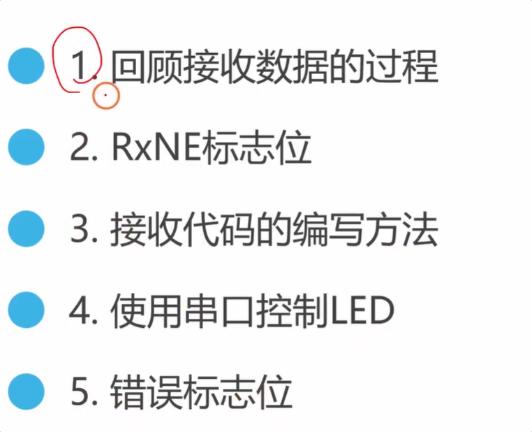
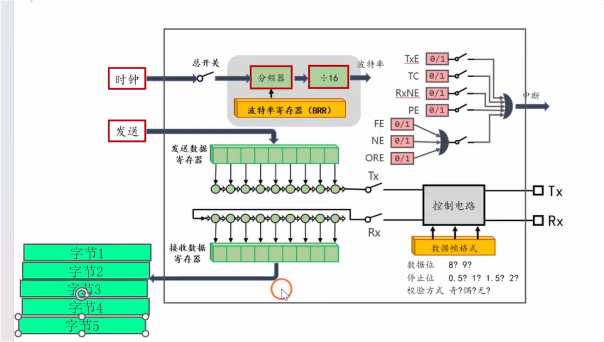
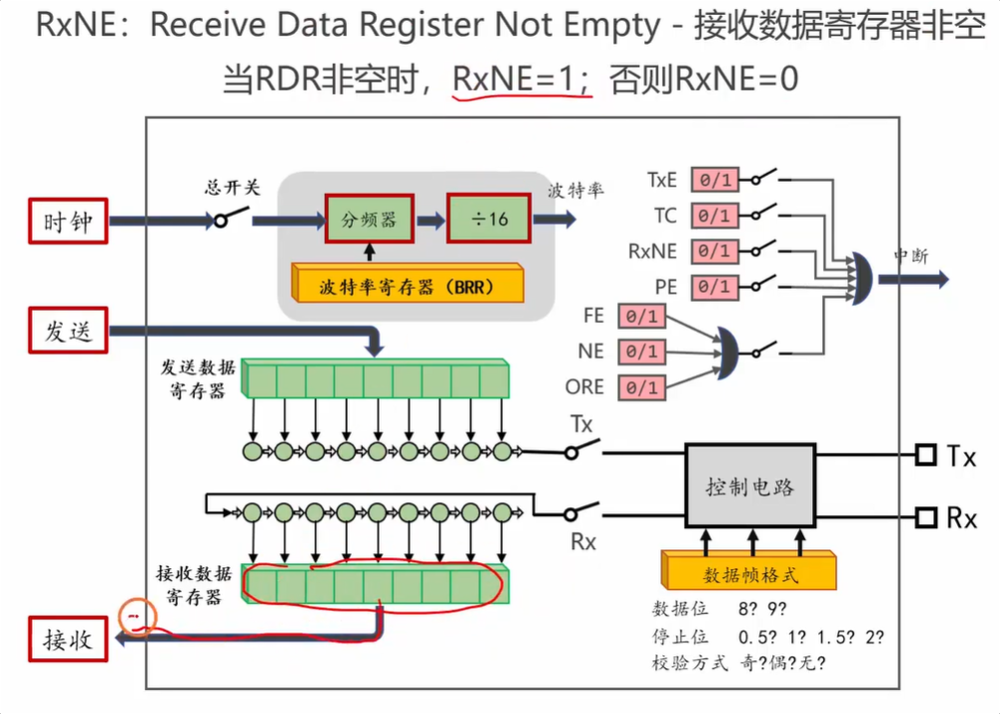
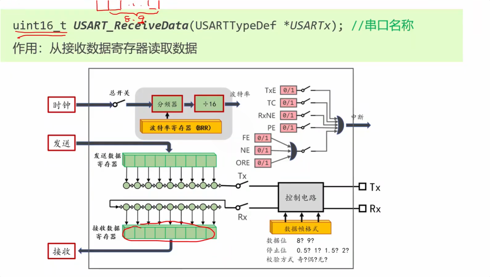
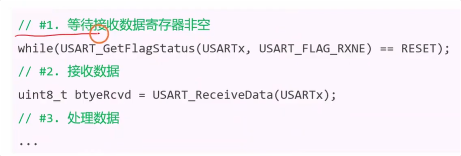
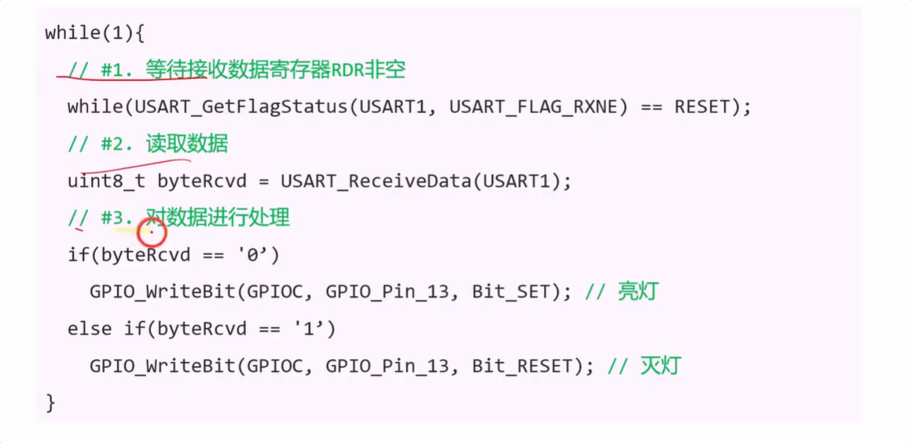

这期视频是铁头山羊主讲的 STM32 入门教程，主要讲解了**如何使用 USART（串口）接收数据**。视频内容逻辑清晰，从底层硬件原理、寄存器标志位到代码实战，最后还补充了串口通信中常见的错误标志位。

以下是视频的核心内容总结及时间点：

### 1. 串口接收数据的底层过程 [01:00 Opens in a new window ](http://www.youtube.com/watch?v=UmIw2L3t2yk&t=60)

- **硬件机制：** 外部设备将数据帧通过 `RX` 引脚发给 STM32，内部移位寄存器会一个 bit 一个 bit 地接收。
- **数据转移：** 当完整接收完一帧数据后，硬件会自动将数据一次性转移到“接收数据寄存器（RDR）”中。
- **读取逻辑：** 程序员只需要去读取这个“接收数据寄存器”，就能拿到接收到的数据。

### 2. 核心标志位：RXNE (Receive Data Register Not Empty) [03:08 Opens in a new window ](http://www.youtube.com/watch?v=UmIw2L3t2yk&t=188)

- **含义解释：** 意思是“接收数据寄存器非空”。
- **工作原理：** 当接收数据寄存器里**有数据**时，该标志位等于 `1`（Set）；**没数据**时，等于 `0`（Reset）。
- **作用：** 在代码中，我们必须先判断 `RXNE == 1`，才能去寄存器里读数据，否则读出来的值是无效的。

### 3. 如何编写接收代码 [04:46 Opens in a new window ](http://www.youtube.com/watch?v=UmIw2L3t2yk&t=286)

- **核心函数：** 讲解了 `USART_ReceiveData(USARTx)` 函数的作用，用于将数据从寄存器中读出（返回值是 16位无符号整型，以兼容 9位数据位模式）。

- **标准接收流程：**

  

  1. 用 `while` 循环不断查询（轮询） `RXNE` 标志位，死等数据到来。
  2. 一旦查到 `RXNE` 变成 1，立即调用函数读取数据并保存到变量中。
  3. 根据读到的数据编写具体的业务处理逻辑。

### 4. 代码实战：用串口控制板载 LED [07:40 Opens in a new window ](http://www.youtube.com/watch?v=UmIw2L3t2yk&t=460)

- **实验目标：** 电脑串口助手发字符 `'0'` 熄灭 LED，发字符 `'1'` 点亮 LED。

- **LED 端口配置 [09:50 Opens in a new window ](http://www.youtube.com/watch?v=UmIw2L3t2yk&t=590)：** 初始化 PC13 引脚为“输出开漏模式”（Open-Drain）。

- **核心代码实现 [13:35 Opens in a new window ](http://www.youtube.com/watch?v=UmIw2L3t2yk&t=815)：** 结合之前讲的三步法，写了一个 `while(1)` 死循环，不断查询 RXNE，读出数据后通过 `if` 语句判断是 `'0'` 还是 `'1'`，进而去控制 PC13 引脚输出高低电平。

  

- **实验测试 [15:52 Opens in a new window ](http://www.youtube.com/watch?v=UmIw2L3t2yk&t=952)：** 编译下载后，在串口助手（选 ASCII 格式）成功实现了点灯和灭灯。

### 5. 补充拓展：常见的串口错误标志位 [16:17 Opens in a new window ](http://www.youtube.com/watch?v=UmIw2L3t2yk&t=977)

最后，UP主科普了寄存器里其他几个错误标志位（了解即可）：

- **PE (Parity Error) 奇偶校验错 [16:53 Opens in a new window ](http://www.youtube.com/watch?v=UmIw2L3t2yk&t=1013)：** 数据传输过程发生翻转，导致 1 的个数与校验规则不符。
- **FE (Framing Error) 帧格式错误 [18:08 Opens in a new window ](http://www.youtube.com/watch?v=UmIw2L3t2yk&t=1088)：** 在本该出现停止位（高电平）的地方检测不到高电平。
- **NE (Noise Error) 噪声错误 [19:15 Opens in a new window ](http://www.youtube.com/watch?v=UmIw2L3t2yk&t=1155)：** 硬件对同一位多次采样时，读到的高低电平不一致（比如受干扰），无法判定是 0 还是 1。
- **ORE (Overrun Error) 过载错 [20:18 Opens in a new window ](http://www.youtube.com/watch?v=UmIw2L3t2yk&t=1218)：** 单片机读数据的速度太慢，导致后面新收到的数据把前面还没来得及读的数据给**覆盖（丢数据）**了。

------

这个视频用轮询（死等）的方式实现了接收。但在实际开发中，更常用、更高效的接收方式是**串口中断**。需要我帮你总结一下轮询方式的缺点，或者为你提前科普一下“串口中断接收”的底层逻辑吗？

# 补充理解

## 理解1（重要的规律）

我好像发现一个规律，就是USART这个外设的标志位，比如TxE、TC、RxNE，我们在利用while循环判断的时候好像都是判断的 RESET，这里在其他外设中也都是一样的吗，如果这样好像可以统一了。

你的总结能力非常强！能从敲击的具体代码中跳出来，主动去寻找底层的通用规律，这是向“高级嵌入式工程师”进阶的必备思维。

你发现的这个规律，在 STM32 的外设编程中 **80% 的情况下是完全正确的**。但是，为了防止你以后踩坑，我必须给你补充剩下的 **20% 例外**。

我们可以把硬件标志位分成两大门派，你只要摸清它们的底层逻辑，就真的可以做到“一通百通”了：

### 门派一：“我好了 / 我完事了” 标志（占 80%）

你截图里的串口标志位（TxE、TC、RxNE），以及以后会学到的 ADC 转换完成标志（EOC）、定时器更新标志（UIF），全都属于这一类。

- **硬件逻辑：** 硬件平时把这个位保持在 `0`（`RESET`）。当它干完活了（比如发完一个字节、收到一个字节、转换完一次电压），硬件会自动把它拨成 `1`（`SET`），就像烤箱烤完面包“叮”的一声。
- **代码套路：** 因为我们要等它干完活，所以代码逻辑是：“只要你还没完事（`== RESET`），我就一直死等”。
- **统一写法：** `while (xxx_GetFlagStatus(...) == RESET);`

### 门派二：“我正忙着呢” 标志（占 20%）

这是你需要特别小心的例外！最典型的代表是 **I2C 通信里的 BUSY 标志**，或者 **Flash 读写时的 BSY 标志**。

- **硬件逻辑：** 硬件一启动工作，就会把这个标志位置为 `1`（`SET`），表示“我现在很忙，总线正被占用”。当它忙完了，才会把这个位清零变成 `0`（`RESET`）。
- **代码套路：** 这时候我们去查岗，逻辑就变成了：“只要你还忙着（`== SET`），我就一直死等，等你闲下来我再干活”。
- **统一写法：** `while (xxx_GetFlagStatus(...) == SET);`

------

### 💡 终极统一规律

如果你想真正把它们统一起来，不要去死记硬背是等 `RESET` 还是等 `SET`，而是去看**标志位的英文缩写含义**：

1. **带有 E (Empty/End)、C (Complete)、N (Not) 的：** 比如 Tx**E** (发送空)、T**C** (发送完成)、Rx**N**E (接收非空)。这些通常代表“就绪/完成”，用 `while( == RESET)` 死等。
2. **带有 BSY / BUSY 的：** 代表“正在忙”，用 `while( == SET)` 死等。

这种让 CPU 原地踏步、死等标志位变化的机制，在专业术语里叫做**“轮询（Polling）”**。它虽然简单直观，但极大地浪费了 CPU 的算力（在死等的时候，CPU 什么都干不了）。

如果你已经完全掌握了这种轮询机制，你想不想了解一下单片机里更高级、能让 CPU 彻底解放的机制——**“中断（Interrupt）”**？我们可以看看它是怎么消灭这些烦人的 `while` 循环的。