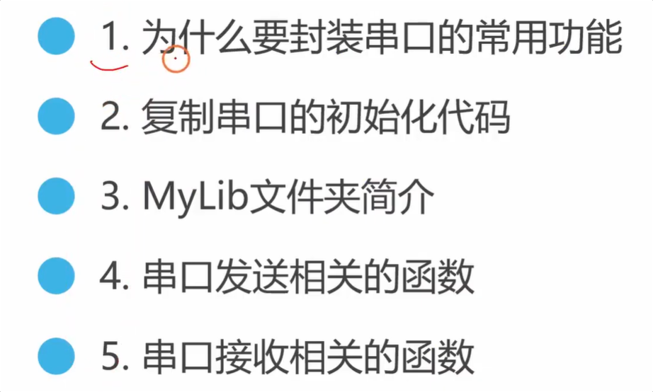
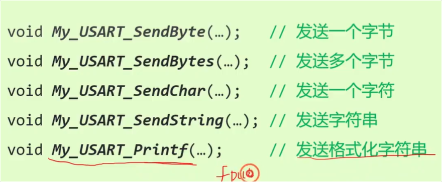
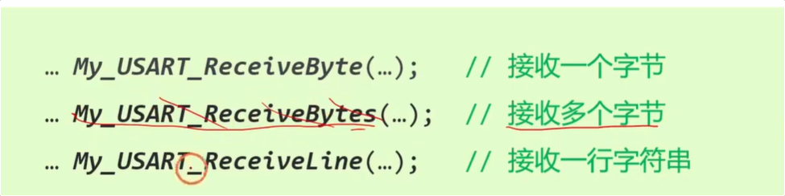

这期视频是铁头山羊主讲的 [STM32 入门教程 第四版 16 串口封装常用功能 铁头山羊](http://www.youtube.com/watch?v=ZkJ6BZgqau4)，主要讲解了**如何将繁琐的串口（USART）数据收发代码封装成易于调用的库函数**。通过代码封装，可以极大地简化后续的开发工作，避免在每次通信时都去重复配置底层寄存器。

以下是视频的核心内容分析与总结：

### 1. 为什么要封装代码？ [00:18 Opens in a new window ](http://www.youtube.com/watch?v=ZkJ6BZgqau4&t=18)

- **痛点：** 之前使用串口发送或接收数据时，每次都需要使用 `while` 循环去查寄存器标志位（如 TXE、RXNE），如果想用 `printf` 还要重写 `fputc`，过程非常繁琐且代码重复率高。
- **解决方案：** 将这些底层的重复操作打包封装成一个个独立的 C 语言函数，存放在自定义的库文件夹中。以后开发时，只需引入头文件并调用对应函数即可。

### 2. 准备新工程与移植底层代码 [01:52 Opens in a new window ](http://www.youtube.com/watch?v=ZkJ6BZgqau4&t=112)

- UP主演示了如何从资料包下载模板工程，并将其重命名为 `usart_lib_test`。
- 接着，将上节课写好的串口初始化代码（`myUSART_Init`）直接复制、粘贴到新工程的 `main.c` 中，并在 `main` 函数开头调用，快速完成底层硬件的配置。

### 3. 自定义库文件 (`mylib`) 介绍 [03:51 Opens in a new window ](http://www.youtube.com/watch?v=ZkJ6BZgqau4&t=231)

- 介绍了工程目录下的 `mylib` 文件夹，里面包含了预先封装好的 `usart.h` 和 `usart.c` 文件。
- 只要在代码中写上 `#include "usart.h"`，就可以直接解锁里面封装好的多种强大的串口收发 API。

### 4. 串口发送功能 API 测试 [05:23 Opens in a new window ](http://www.youtube.com/watch?v=ZkJ6BZgqau4&t=323)

UP主逐一演示了5个常用的发送函数，极大提升了开发效率：

- **发送单字节 (`myUSART_SendByte`) [07:14 Opens in a new window ](http://www.youtube.com/watch?v=ZkJ6BZgqau4&t=434)：** 演示通过串口发送一个十六进制数据 `0x5A`。
- **发送多字节 (`myUSART_SendBytes`) [10:12 Opens in a new window ](http://www.youtube.com/watch?v=ZkJ6BZgqau4&t=612)：** 将一个包含多个数据（如 12, 34, 5 等）的数组一次性发送出去。
- **发送单字符 (`myUSART_SendChar`) [12:03 Opens in a new window ](http://www.youtube.com/watch?v=ZkJ6BZgqau4&t=723)：** 演示向电脑串口助手发送小写英文字母 `'a'`。
- **发送字符串 (`myUSART_SendString`) [12:58 Opens in a new window ](http://www.youtube.com/watch?v=ZkJ6BZgqau4&t=778)：** 轻松发送一整段文本，如 `"hello world\r\n"`。
- **格式化发送 (`myUSART_Printf`) [13:46 Opens in a new window ](http://www.youtube.com/watch?v=ZkJ6BZgqau4&t=826)：** 完美替代自带的 `printf`。可以直接传入变量并使用 `%s`、`%d` 等占位符，且不需要再手动重写底层的 `fputc` 函数。

### 5. 串口接收功能 API 测试 [15:22 Opens in a new window ](http://www.youtube.com/watch?v=ZkJ6BZgqau4&t=922)

UP主重点演示了两个非常实用的接收函数：

- **接收单字节 (`myUSART_ReceiveByte`) [15:54 Opens in a new window ](http://www.youtube.com/watch?v=ZkJ6BZgqau4&t=954)：** 结合前几期的知识写了一个控制逻辑：接收到字符 `'0'` 时调用 GPIO 函数熄灭板载 LED，接收到 `'1'` 时点亮 LED。
- **接收一行字符串 (`myUSART_ReceiveLine`) [19:12 Opens in a new window ](http://www.youtube.com/watch?v=ZkJ6BZgqau4&t=1152)：** 这是一个高级接口。它可以一直读取串口数据存入缓冲区，直到遇到指定的行分隔符（如 `\r\n`）或读取超时为止。UP主利用它写了一个“回显”小程序：单片机接收到完整字符串后，原封不动地发回给电脑。

------

将底层代码封装成 API 库是嵌入式开发中从“学底层原理”走向“做实际工程”的关键一步。你想深入了解一下其中那个 **接收一行字符串 (`myUSART_ReceiveLine`)** 的底层逻辑，或者是它是如何处理“超时（Timeout）”以防止单片机死机的吗？
