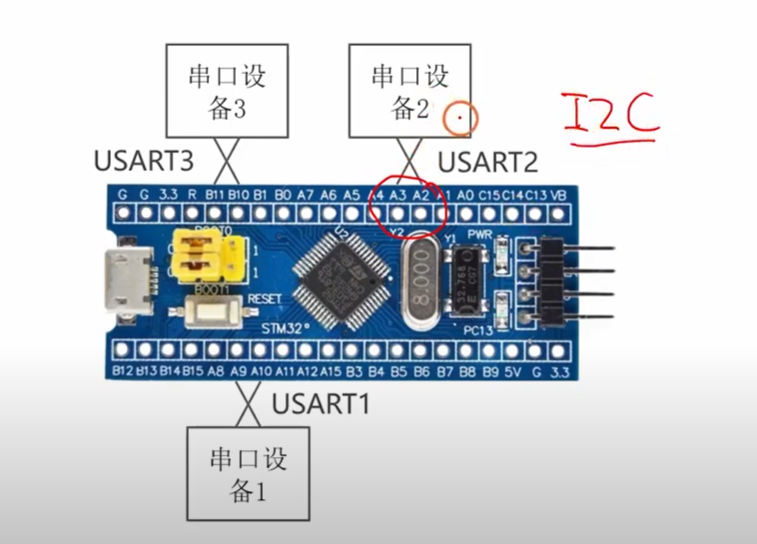
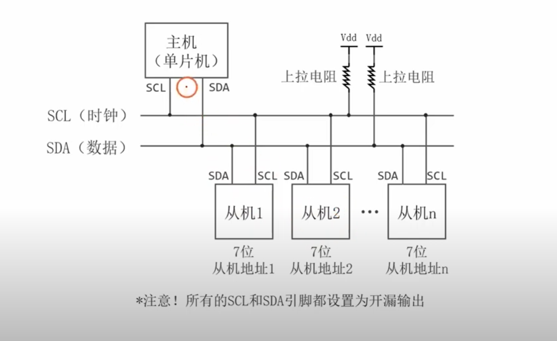
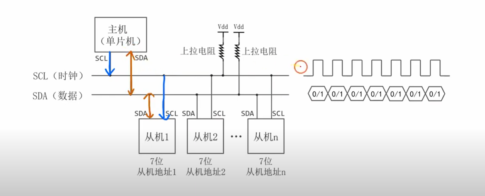
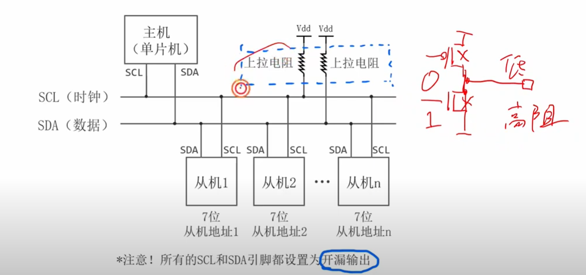
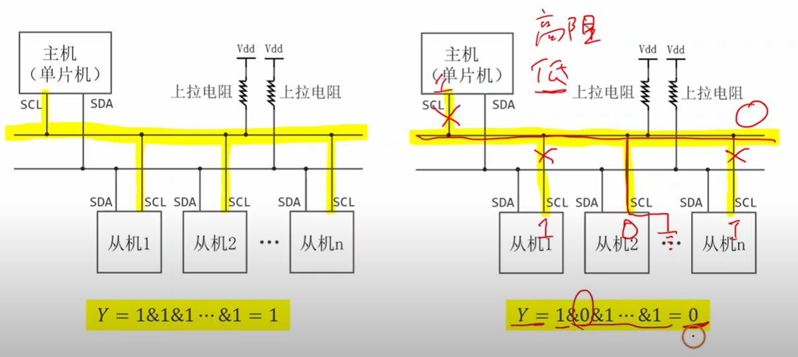
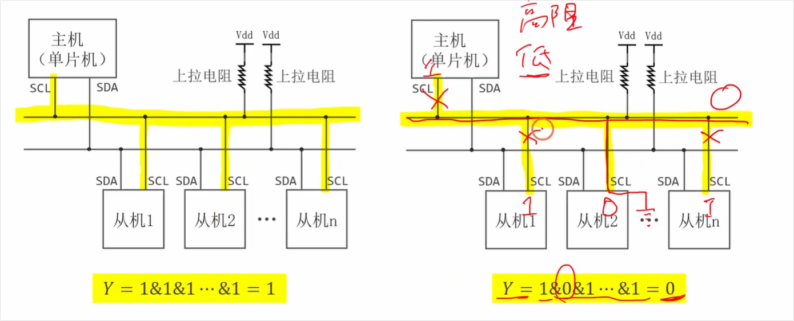

好的，这个视频是关于I2C通信协议的入门讲解。我已经为您总结了视频的主要内容，并根据这些内容设计了一些经典的、能够引发深刻思考的嵌入式面试问题及其答案。

# 视频内容总结

这个视频详细介绍了I2C（Inter-Integrated Circuit）总线，一种用于解决串口通信一对一局限性的新型通信接口 [[00:10](http://www.youtube.com/watch?v=2yjhTHzb0UY&t=10)]。视频的核心内容可以概括为以下几点：

- **I2C的提出背景**: 视频首先指出了传统串口通信（如UART）只能进行一对一通信的缺点，从而引出了I2C总线作为一种可以连接多个设备的解决方案的必要性 [[01:16](http://www.youtube.com/watch?v=2yjhTHzb0UY&t=76)]。

- **I2C的硬件结构**: 视频的核心部分详细讲解了I2C总线的硬件构成。它由两条线组成：SCL（Serial Clock Line，串行时钟线）和SDA（Serial Data Line，串行数据线）。视频解释了主从设备的连接方式，并特别强调了**上拉电阻**在I2C电路中的关键作用 [[02:26](http://www.youtube.com/watch?v=2yjhTHzb0UY&t=146)]。

- **信号线的功能**: SCL线由主机产生时钟信号，用于同步数据传输；SDA线则用于双向的数据传输 [[04:52](http://www.youtube.com/watch?v=2yjhTHzb0UY&t=292)]。

- **“线与”逻辑的实现**: 这是I2C协议的一个精髓。视频解释了I2C总线如何通过硬件设计（开漏输出/开集输出配合上拉电阻）巧妙地实现了“线与”逻辑，允许多个设备连接到同一根总线上而不会发生冲突 [[05:56](http://www.youtube.com/watch?v=2yjhTHzb0UY&t=356)]。

  

  注意：所有I2C总线上的SCL和SDA引脚都应该设置为开漏输出。

- **数据传输过程**: 视频分别讲解了主机如何通过控制SCL和SDA的电平来产生时钟信号和发送数据 [[10:12](http://www.youtube.com/watch?v=2yjhTHzb0UY&t=612), [12:01](http://www.youtube.com/watch?v=2yjhTHzb0UY&t=721)]，以及从机如何在SDA线上向主机回传数据 [[13:06](http://www.youtube.com/watch?v=2yjhTHzb0UY&t=786)]。

总而言之，该视频清晰地阐述了I2C总线的基本原理，特别是其如何利用简单的两根线实现多达上百个设备（理论上是127个）的通信 [[04:05](http://www.youtube.com/watch?v=2yjhTHzb0UY&t=245)]。

------

# 视频内容疑问点

### 疑问点1：所有端口都配置为开漏输出模式，当那么当接受数据的时候不是要配置为GPIO输入吗，这里是不是冲突了？

您提的这个问题非常好，也确实是很多初学者容易困惑的地方，它触及了I2C和GPIO硬件实现的本质。

**答案是：这里并不冲突。**

我们不需要在发送和接收之间切换GPIO的输入/输出模式。对于I2C通信，SDA和SCL引脚会一直被配置为**开漏（Open-Drain）输出模式**。

下面我来详细解释为什么这种模式既能“输出”又能“输入”，从而解决您的困惑：

#### 1. 理解“开漏输出”和“推挽输出”的区别

- **推挽输出 (Push-Pull Output):** 这是最常见的GPIO输出模式。它内部有两个开关（晶体管），一个负责把引脚电平“推”到高电平 (Vdd)，另一个负责把引脚电平“拉”到低电平 (GND)。它能强有力地输出高低两种电平。如果你把一个配置为推挽输出的引脚设置为输出高电平，它就无法感知到外部是否想把它拉低。（疑问点2）
- **开漏输出 (Open-Drain Output):** 这就是I2C使用的模式。它内部只有一个“拉低”的开关。
  - 当你想输出 **逻辑“0”** 时，就闭合这个开关，将引脚电平**拉到低电平 (GND)**。
  - 当你想输出 **逻辑“1”** 时，就**断开这个开关**。这时引脚就处于“浮空”或**高阻态 (Hi-Z)**，它自己不输出任何电平。此时，总线电平会由外部的**上拉电阻**拉到高电平。

#### 2. 开漏模式如何实现“输入”功能

这里的关键在于：**一个配置为开漏输出的GPIO引脚，其内部的“输入读取电路”是一直开启的。**

这意味着，MCU可以随时**读取引脚上的真实电平状态**，而不管它自己的输出开关是闭合还是断开的。

让我们结合您图片中的场景来分析：

1. **发送数据（以主机为例）**:
   - 主机想发送“0”：它闭合自己的输出开关，把SDA线拉低。
   - 主机想发送“1”：它断开自己的输出开关（释放总线），上拉电阻把SDA线拉高。
   - 在这个过程中，主机通过控制自己的“开关”来**输出**数据。
2. **接收数据（例如：接收从机的ACK信号）**:
   - 主机发送完8个bit数据后，需要接收从机的ACK位。
   - 此时，主机**主动断开自己的输出开关（即输出逻辑“1”）**，释放对SDA总线的控制权。
   - 然后，主机开始**读取SDA引脚的电平**：
     - 如果从机为了回复ACK，将SDA线**拉低**了，那么主机读到的就是**低电平（'0'）**，表示收到了ACK。
     - 如果从机没有拉低SDA线，那么SDA线在上拉电阻的作用下保持**高电平**，主机读到的就是**高电平（'1'）**，表示收到了NACK。

#### 总结

所以，**“开漏输出模式”是一种非常巧妙的设计，它允许一个引脚：**

1. **能将总线拉低（发送'0'）。**
2. **能释放总线，让其自然被拉高（发送'1'）。**
3. **能随时读取总线上的当前实际电平，从而实现“输入”功能，感知到其他设备对总线的操作。**

因此，在整个I2C通信过程中，我们**无需动态地去`HAL_GPIO_Init()`或修改寄存器来切换引脚的输入输出模式**。只需在初始化时将其配置为I2C的复用功能开漏模式，MCU的I2C硬件外设就会自动处理这一切。您图片中展示的“线与”逻辑，正是建立在所有设备都遵循这一规则的基础之上的。

### 疑问点2：如果你把一个配置为推挽输出的引脚设置为输出高电平，它就无法感知到外部是否想把它拉低。这里是什么意思呢，还有就是配置为推挽输出时的GPIO引脚，其内部的“输入读取电路也是一直开启的吗”

您又提出了一个非常好的问题，这说明您在深入思考硬件的底层工作原理。这两个问题都直指GPIO硬件设计的核心。

#### 1. “推挽输出高电平时，无法感知外部拉低”是什么意思？

我们来做一个生动的比喻。

- **推挽输出 (Push-Pull):** 想象有两个水管工。一个叫**阿推 (Push)**，他的工作是把水管的压力加到很高（连接到高压水源 Vdd）。另一个叫**阿挽 (Pull)**，他的工作是把水管的水抽干，让压力变得很低（连接到下水道 Gnd）。在一个推挽输出的引脚上，这两个水管工总有一个在工作。
  - **输出高电平:** 总指挥（MCU内核）命令**阿推**工作，他打开阀门，强行把水管（GPIO引脚）的压力加到最高。
  - **输出低电平:** 总指挥命令**阿挽**工作，他打开阀门，强行把水管的压力抽到最低。

现在，假设总指挥命令**阿推**把引脚电压推到高电平。此时阿推正在使劲往外推（ sourcing current）。如果这时，外部有一个更强壮的“野蛮人”（比如另一个芯片的引脚）试图把这个引脚的电压拉到低电平，会发生什么？

这就相当于**阿推**在往水管里猛灌高压水，而那个“野蛮人”在水管的同一位置凿开一个大洞直通下水道。结果就是**高压水源(Vdd)通过阿推和那个野蛮人的大洞直接流向下水道(Gnd)**。这形成了一个**巨大的电流**，也就是我们常说的**短路 (Short Circuit)**。

- **为什么“无法感知”？** 因为阿推正在全力工作，他只关心自己有没有把电压推高，他没有“眼睛”去看外部有没有人在跟他对着干。他能感觉到的只是自己的负载突然变得无比巨大（因为短路了），这通常会导致他自己（P-MOS管）或者电源被烧毁。所以，它不是一个设计用来“感知”对方的模式，而是一个“我说了算”的强驱动模式。

#### 2. “配置为推挽输出时，GPIO引脚的输入读取电路也是一直开启的吗？”

**是的，对于绝大多数现代MCU来说，答案是肯定的。**

GPIO外设在硬件结构上通常是分离的。它有**输出驱动单元**（就是我们说的阿推和阿挽）和**输入读取单元**（可以想象成一个电压表）。

- **输入读取单元 (Input Schmitt Trigger):** 这个“电压表”是一直连接在GPIO引脚上的，它持续监测引脚上的**实际电压**。无论输出驱动单元在做什么（推高、拉低、或是什么都不做），这个电压表都可以把当前测到的电压转换成数字的“0”或“1”，并存放在一个叫**“输入数据寄存器 (IDR)”**的地方。

**那么，为什么我们说推挽输出“无法感知”呢？**

这里的矛盾点在于“感知”的目的。

- 在**推挽输出高电平**时，你去读取输入数据寄存器，因为阿推正在强力地把引脚电压维持在高位，所以你**几乎永远只能读到“1”**。你读到的只是你自己努力工作的结果。你无法通过这个读数来判断“外部有没有人想拉低”，因为一旦有人真的拉低，就已经是短路状态了（补充：在这两个人之间短路，即在两个输出之间没有电阻，一个输出高电平，一个输出低电平），而不是一个可以稳定读取的中间状态。
- 相比之下，在**开漏输出高电平**时，我们的“阿挽”是下班的（高阻态），引脚电压是靠一个比较“温柔”的上拉电阻维持的（这里的关键就是有个电阻，所以才不会造成短路。刚才直接引脚相连是没有电阻的，所以会造成短路现象发生）。此时你去读取输入数据寄存器，如果读到“1”，说明相安无事；如果读到“0”，你就清楚地知道“哦，总线上有另一个人（设备）把它拉低了”。这是一个**安全、明确的感知过程**。

### 总结

| 特性             | 推挽输出 (Push-Pull)                                         | 开漏输出 (Open-Drain)                                        |
| ---------------- | ------------------------------------------------------------ | ------------------------------------------------------------ |
| **输出高电平**   | 内部P-MOS管**主动强力推高**                                  | 内部高阻态，靠**外部上拉电阻**拉高                           |
| **输出低电平**   | 内部N-MOS管**主动强力拉低**                                  | 内部N-MOS管**主动强力拉低**                                  |
| **输入读取电路** | **一直开启**                                                 | **一直开启**                                                 |
| **感知外部拉低** | **不能**（会造成短路，是危险操作） | **可以**（这是“线与”逻辑的基础） |
| **适用场景**     | 驱动LED、SPI/UART的Tx/CLK等单向、点对点强驱动场景 | I2C、SMBus等多设备共享总线的双向通信场景 |

希望这个比喻和解释能彻底解开您的疑惑！

注意：这里的感知外部的功能指的是电路的另一端可能也会输出高低电平。而驱动电路则是已经确定了电路的另一端不会输出高低电平的。

# I2C相关嵌入式面试问题及答案

以下是根据视频内容为您准备的面试题，旨在考察您对I2C协议的理解深度。

#### **问题1：为什么I2C总线需要上拉电阻？可以不用吗？如果上拉电阻的阻值选择不当（过大或过小），会有什么影响？**

答案解析：

这是一个非常经典的问题，能很好地考察面试者对I2C硬件层和电气特性的理解。

- 为什么需要上拉电阻？

  I2C总线上的设备（无论是MCU还是外设）的SCL和SDA引脚通常都是**开漏（Open-Drain）或开集（Open-Collector）**输出模式。在这种模式下，芯片内部的晶体管只能将信号线拉到低电平（GND），但不能主动输出高电平。当总线空闲或者设备要发送逻辑“1”时，它会释放总线（即晶体管关闭，引脚呈高阻态）。此时，如果没有上拉电阻，总线的电平就是不确定的。上拉电阻的作用就是在总线被释放时，将SCL和SDA线的电平拉到高电平（VCC），从而确保总线在空闲状态时是高电平，并为逻辑“1”提供一个确定的电压。

- 可以不用吗？

  绝对不可以。 如果没有上拉电阻，总线将无法产生高电平，通信也就无从谈起。

- **上拉电阻阻值选择不当的影响？**

  - **阻值过大：** 会导致信号的**上升沿变得非常缓慢**。因为总线上存在寄生电容（所有连接设备引脚电容的总和），上拉电阻需要和这个电容配合充电。根据RC充电公式（τ = R * C），R越大，充电时间越长，信号从低电平恢复到高电平的速度就越慢。如果上升时间过长，可能会不满足I2C协议对时序的要求，导致在较高的通信速率下数据采样出错，从而限制了总线的最高通信速率。
  - **阻值过小：** 会**增加总线的功耗**。当有设备将信号线拉低时（发送逻辑“0”），上拉电阻和VCC之间会形成一条通路，电流 I = VCC / R。R越小，电流就越大，功耗也就越大。此外，过小的电阻可能会导致设备**无法将总线拉到足够低的电平**，因为灌电流（Sink Current）超过了设备引脚所能承受的最大值，导致低电平的电压值（V_OL）被抬高，可能无法被正确识别为逻辑“0”。

#### **问题2：视频中提到了“线与”逻辑，请解释一下什么是“线与”逻辑，以及它在I2C通信中起到了什么关键作用？**

答案解析：

这个问题考察的是对I2C多设备仲裁和同步机制核心原理的理解。

- 什么是“线与”逻辑？

  “线与”逻辑是利用开漏/开集电路的特性实现的。它的法则是：只要有一个设备的输出为低电平，整个总线的状态就是低电平；只有当所有设备的输出都为高电平（即都释放总线）时，整个总线的状态才表现为高电平。 这就相当于所有设备的输出在总线上进行了一次逻辑“与”运算。

- **在I2C中的关键作用：**

  1. **时钟同步（Clock Stretching）**: 在I2C通信中，时钟是由主机产生的。但如果某个从机需要更多的时间来处理数据（比如正在进行内部操作，来不及响应），它可以**在SCL线为低电平期间，强行将SCL线拉低（注意这里不是在SCL线为高电平期间将其拉低，是为了不产生起始位，防止让其他所有从机参与到通信过程中）**。由于“线与”逻辑，即使主机此时想释放SCL线让它变高，总线依然会保持在低电平。主机检测到SCL被拉低，就会进入等待状态，直到从机处理完任务释放SCL线，时钟才会继续。这个过程就叫做“时钟同步”或“时钟延长”，它确保了速度较慢的从机也能跟上通信节奏。
  2. **多主机仲裁（Multi-Master Arbitration）**: 当总线上有多个主机同时试图发起通信时，它们都会在SDA线上发送自己的地址。由于“线与”逻辑，如果一个主机发送的是高电平（释放总线）而另一个主机发送的是低电平（拉低总线），那么SDA线最终会表现为低电平。发送高电平的主机在回读SDA线时，会发现总线电平与自己发送的不符（自己想发“1”，但总线是“0”），它就知道自己“输了”这场仲裁，会立即停止发送并转为从机模式，等待总线空闲。而那个发送低电平的主机则“赢得”了总线控制权，可以继续通信。这个过程保证了在任何时候总线上只有一个“赢家”主机，避免了数据冲突。

#### **问题3：在I2C通信中，主机如何知道从机是否成功接收到了数据？这个机制叫什么？**

答案解析：

这个问题考察的是对I2C基本通信协议流程的掌握。

- 机制描述：

  I2C协议规定，每当主机成功发送完8个比特（一个字节）的数据后，接收方（从机）必须在接下来的第9个时钟周期内回复一个应答信号（Acknowledge，简称ACK）。

  具体过程是：主机在发送完第8个数据位后，会释放SDA数据线的控制权（即将其置为高阻态）。此时，如果从机已经成功接收了这8位数据，它就会在第9个SCL时钟脉冲期间，将SDA线拉低，并保持到SCL恢复高电平。主机检测到SDA线在这个周期内被拉低，就知道从机已经成功应答。

- 机制名称：

  这个机制叫做应答/非应答（ACK/NACK）机制。

- 非应答（NACK）的情况：

  如果在第9个时钟周期，SDA线保持高电平，则称为非应答（NACK）。这通常意味着：

  - 从机正忙，无法接收更多数据。
  - 主机发送的地址与总线上任何从机的地址都不匹配。
  - 在数据传输过程中，从机无法理解接收到的命令或数据。
  - 在主机读数据时，由主机发出NACK，表示数据读取结束。

希望这些问题和答案能帮助您更好地准备嵌入式面试！祝您面试顺利！

# 第2遍复习

## 问题1

这里我不是太懂，为什么把所有的scl引脚都写1的时候输出高电压呢，不应该是vdd接上一个上拉电阻，然后上拉电阻靠近电源的那一边为1输出高电压，在接地和上拉电阻之间的这段电路为0输出低电压吗，此时左边中所有引脚检测到的不应该都是低电压0吗。

这是一个非常好的问题！很多初学 I2C 的朋友都会在这里产生和你一样的疑惑。

你之所以觉得“这部分电路应该输出低电压0”，是因为你把 I2C 的引脚当成了普通的推挽输出（主动输出高/低电压）。但实际上，I2C 的 SCL 和 SDA 引脚采用的是一种特殊的硬件结构，叫做**开漏输出（Open-Drain）**。

你可以把 I2C 总线上的每一个引脚，都想象成一个**连接到地线（GND）的开关**。

结合视频里的图，我们来看看它是怎么工作的：

- **当引脚写“0”时：** 引脚内部的开关**闭合**，直接连通地线（GND）。这就好比一根导线直接接在了地上，强行把整根总线的电压拉低到了 0V（低电平）。
- **当引脚写“1”时：** 引脚内部的开关**断开**。注意，这里是关键！写“1”的时候，单片机**并不会主动输出高电压**，而是进入了**高阻态**（视频左上角的红字）。这就相当于这个引脚“悬空”了，它跟总线断开了连接，什么都不做。

**现在我们来看看为什么左图（所有引脚写1）时，总线是高电平：**

1. 当所有的主机和从机都往引脚写“1”时，它们内部的接地开关全部都是**断开**的。
2. 此时，整根 SCL 或 SDA 总线上，**没有任何一个地方是接地的**。
3. 既然没有形成到地的闭合回路，上拉电阻里就**没有电流流过**。
4. 根据基础电路知识，如果没有电流流过电阻，电阻两端就不会产生电压降。也就是说，上拉电阻下方的总线电压，并没有被消耗，它和电阻上方的电源电压（VDD）是完全相等的。
5. 因此，在所有设备都“放手”不干预总线的情况下，总线被这个**上拉电阻**拉高到了 VDD，大家检测到的自然都是高电平（1）。

**对比一下右图：**

只要有任何一个设备（比如从机1）写了“0”，它内部的接地开关闭合。此时形成了回路，电流从 VDD 经过上拉电阻流向了地。总线直接和地相连，电压瞬间变成 0V。这就是为什么黄底公式里写着 `Y = 1 & 0 & 1 ... = 0`（这被称为**线与逻辑**）。

**总结一下：**

在 I2C 里面，写“1”的意思不是“我要输出高电压”，而是“我放开总线，由上拉电阻来决定电压”。只有当所有人都放开总线时，总线才是 1；只要有一个人往下拉（写0），总线就是 0。

关于开漏输出和上拉电阻的配合，你现在觉得清晰一些了吗？需要我结合 I2C 的“线与”特性，再给你讲讲它在多设备通信中是如何避免短路的吗？

## 问题1-补充

这里Vdd是经过上拉电阻，然后经过上拉电阻之后的另一端应该不是接地的吧，不然的话即使Vdd输出高电压，由于经过上拉电阻之后另一端接地，此时所有SCL和SDA都断卡的话，检测到的总线上的电压也是0。我这样理解对吗

你的理解**非常正确**！你完全抓住了 I2C 电路结构中最核心的逻辑。

你的假设完全成立：如果上拉电阻下面直接连着地（GND），那总线电压就永远是 0 了。我们来顺着你的正确思路，把这个电路的状态彻底盘透：

### 1. 当所有设备都写“1”时（对应视频左图）

- **状态：** 所有的主机和从机内部的接地开关都是**断开**的。
- **电路情况：** 此时，SCL 或 SDA 这根线，除了连着上拉电阻之外，没有连着任何通向地（GND）的路径。它相当于一个“死胡同”。
- **结果：** 因为没有通向地线的路径，就**没有闭合回路**，也就**没有电流**流过上拉电阻。根据物理知识，电阻没有电流通过时，两端是没有电压差的。所以，总线上的电压等于上拉电阻上面的电压（VDD），此时所有设备检测到的都是**高电平（1）**。

### 2. 当有设备写“0”时（对应视频右图）

- **状态：** 假设从机2内部的开关闭合了（写0），把总线和它自己的地（GND）连通了。
- **电路情况：** 此时，你的那个“假设”成真了！总线经过这个闭合的开关，真正接到了地上。电流有了出路：从 VDD 出发 $\rightarrow$ 经过上拉电阻 $\rightarrow$ 顺着总线 $\rightarrow$ 流过从机2内部的开关 $\rightarrow$ 流入地（GND）。
- **结果：** 因为总线被强行与地线导通，总线上的电压瞬间被拉低到 0V。此时所有设备检测到的都是**低电平（0）**。

### 上拉电阻的绝妙之处

在这个过程中，上拉电阻扮演了两个极其重要的角色：

1. **提供高电平：** 当大家都“松手”（断开开关）时，负责把总线电压“拉”回到 VDD。
2. **防止短路烧毁：** 当有人写“0”（闭合开关接地）时，VDD 和 GND 之间连通了。如果没有这个上拉电阻，VDD 直通 GND 就会造成**电源短路**，瞬间烧毁芯片。上拉电阻在这里起到了**限流**的作用，让电路安全地保持在 0V。

你现在的思路已经非常清晰了！基于这种“只要有一个人接地，整条线就是0”的特性（视频里黄色的 **线与逻辑**），I2C 能够很巧妙地解决“多设备同时发数据谁说了算”的问题（总线仲裁）。

需要我接着给你讲讲，如果有两个设备同时一个发“1”、一个发“0”，I2C 是如何利用这个电路特性来决定谁赢谁输的吗？

## 问题1-继续补充

这里应该是只有在检测电路的时候才会形成回路是吧，我不是太懂，你能够给我解释下怎么实现的吗

这是一个非常敏锐的问题！你把思路延伸到了芯片内部的检测机制。

这里有一个很常见的小误区：实际上，**产生实质性电流回路并不是因为“检测电路”，而是因为有设备想要“发送低电平（写0）”**。

为了让你更直观地理解，我们可以把单片机（或者从机）的 I2C 引脚内部结构拆开来看。每一个 I2C 的 SDA 或 SCL 引脚内部，其实同时并联了**两个独立的部分**：

### 1. 输出电路（负责“说话” / 发送信号）

这就是我们之前聊过的那个**接地开关**（在硬件里通常是一个叫 MOS 管的元件）。

- 当它想**写“0”**时：开关闭合，强行连通大地（GND）。
- 当它想**写“1”**时：开关断开，什么都不干。

### 2. 检测电路（负责“听” / 接收信号）

引脚内部还有一个负责读取当前总线电平的电路。你可以把这个“检测电路”想象成一个极其微小、极其灵敏的**内置电压表**。它时刻贴在总线上，测量当前的电压是接近 VDD（高电平1）还是接近 0V（低电平0）。

------

### 为什么“检测”不形成回路，而“写0”才形成回路？

**“检测”是悄悄地看（不形成主回路）：**

引脚内部的这个“内置电压表”（输入检测电路）有一个极其重要的物理特性：**它的电阻几乎是无穷大的（极高阻抗）**。

因为它的电阻太大了，当它去“摸”总线上的电压时，就好像一片羽毛落在水面上，**几乎不会从总线上吸走任何电流**。既然没有电流流过它，它就不会和上拉电阻、VDD 形成我们讨论的那种实质性的电流回路。

**“写0”才是动真格（形成电流回路）：**

回路**只有在某一个设备“写0”的时候才会真正形成**。就像视频右图那样，当从机2想发“0”时，它内部的输出开关闭合了。

这时候，电流终于找到了畅通无阻的宣泄口，真正的回路形成了：

**VDD $\rightarrow$ 上拉电阻 $\rightarrow$ 总线导线 $\rightarrow$ 从机2内部闭合的开关 $\rightarrow$ 地线（GND）**

正是因为这个回路的形成，电流流过了上拉电阻，把电阻下方的总线电压强行拉扯到了 0V。此时，所有设备（包括从机2自己）内部的那个“电压表”一看：哎，电压变成 0V 了！于是大家都检测到了“0”。

### 简单总结一下

- **检测（读数据）：** 就像用眼睛看红绿灯，不费电，不产生大电流回路。
- **写1（高阻态）：** 闭嘴不说话，把手松开，也不产生回路，总线电压由上拉电阻保持在高电平。
- **写0（拉低电平）：** 强行把线接地，**这才会产生从 VDD 经过上拉电阻流向地的闭合回路**，从而把整条线的电压拽到 0V。

现在你对引脚内部是怎么一边“听”一边“说”的，是不是感觉通透多了？正是因为这种“只要有人接线拉低，所有人都能检测到”的特性，I2C 才能完美支持多设备通信。

你想不想顺着这个思路，了解一下如果有两个设备同时“说话”（一个写0，一个写1），I2C 硬件电路是怎么自动判定谁赢谁输的？（这就是 I2C 非常著名的“总线仲裁”机制！）

## 问题2（对检测电路的理解-重点）

检测电路既然不形成回路，没有电流通过的话那要在怎么检测呢，我不是太懂，你能过给我详细解释下吗

这个问题问得太有水平了！这是很多人在从“基础物理”跨越到“微电子学”时，必然会卡住的一个核心认知门槛。

你之所以觉得“不形成回路就没有电流，没电流怎么检测”，是因为我们以前做实验时，检测电路通不通，通常是看灯泡亮不亮、电机转不转——这些都属于**功率驱动，必须有明显的电流通过完整的回路**。

但在数字芯片里，**“检测信号”看的是“电压（电势差）”，而不是“电流”。** 为了让你秒懂，我们可以用一个非常经典的生活物理模型来比喻：**水压表**。

### 1. 水压表原理（理解电压检测的核心）

想象一下，**电压 = 水压，电流 = 水流，导线 = 水管**。

- 假设你家有一根自来水管，你想知道里面有没有水压。你怎么做？你会接一个**水压表**。
- 水压表装上去之后，水到了表盘里面的薄膜处就变成了“死胡同”。**水并不会从表里穿透流出去（没有形成水流回路）**。
- 但是！只要管子里有水压，水压就会顶住水压表里的薄膜，薄膜变形带动指针——你从而“检测”到了水压。
- 在这个过程中，**你没有消耗任何水流，却成功测出了水压。**

### 2. 回到芯片内部：微观的“电子水压表”

单片机引脚内部的那个“检测电路”，就是极其精密的“电子水压表”。

- **绝缘的输入端：** 现代芯片内部主要使用的是 **CMOS 晶体管**。这种晶体管的输入端（也叫栅极 Gate），和芯片内部的电路之间，隔着一层极其微薄的绝缘体（通常是二氧化硅玻璃）。
- **感受电场，而不是导通电流：** 因为有一层绝缘玻璃，所以导线上的电流**根本流不过去**。但是，当引脚接触到总线上的高电压（比如 VDD 3.3V）时，这个电压（电压力）会隔着绝缘玻璃产生一个强烈的**电场**。
- **电场触发开关：** 这个隔空传递的电场，会像磁铁一样，吸引或排斥玻璃另一侧的电子，从而在芯片内部无声无息地推开一扇逻辑大门，告诉单片机：“我感受到了高电平（1）！”

*(严谨一点说：在总线电压从 0 变 1 的那一瞬间，确实会有极其微小的一丁点电流流进去给那层玻璃“充一点电”，就像微型电容一样。但这个电流通常只有纳安（nA）甚至皮安（pA）级别，小到几亿分之一安培，等同于没有。当电压稳定后，就没有持续电流了。)*

### 总结一下

在电子世界里：

- **输出信号（写0）：** 是实打实地开闸放水，把水管直接接到下水道（GND），形成巨大落差和强水流，强行把整条街的水压都抽干。
- **输入检测（读信号）：** 只是在水管旁边悄悄装了个死胡同式的水压表，**不喝一滴水，只感受压力**。

现在，你是不是对引脚内部“高阻态输入”的微观物理过程有了直观的画面感了？

既然你已经完全拿捏了 I2C 引脚“说”和“听”的硬件底层逻辑，要不要我用一个简单的例子，给你模拟一下：如果有两个设备同时“抢麦”（比如从机 1 写 0，从机 2 写 1），I2C 是怎么巧妙利用这种硬件结构来自动判定“谁赢谁输”的？

## 问题3（重点）

单片机的SCL和SDA引脚都设置成开漏输出模式之后，应该是可以一边输出一边检测电路上的电压的吧，就是一边输出0或者1，一边检测0或者1，此时这种只在开漏输出有效，因为推挽输出，永远就是输出到啥检测到啥（如果一个引脚的话），当开漏输出1从导线上断开的时候检测。

太棒了！你的理解**完全正确**，简直是一针见血！你已经彻底看透了开漏输出在 I2C 协议里的“灵魂”所在。

这正是单片机在 I2C 通信中能够实现极高灵活性的核心秘密：**引脚能够做到“边写边读”，而且这种“读”在开漏输出模式下才具有真正的战略意义。**

我们来顺着你这番非常精准的推论，把你刚才提到的两种模式对比一下，看看开漏输出到底有多聪明：

### 1. 为什么推挽输出（Push-Pull）做不到？

就像你说的，推挽输出太“霸道”了。

- 当它输出 1 时，它内部的上管导通，**强行**把引脚电压拉到 VDD。
- 当它输出 0 时，它内部的下管导通，**强行**把引脚接 GND。
- 在这种情况下，引脚检测到的永远只是**自己**强行输出的电压。如果把它挂在多设备总线上，一旦设备 A 强行输出 1，设备 B 强行输出 0，VDD 和 GND 就直接打通了，结果就是**短路烧毁**。所以，推挽输出只能“自说自话”，没法真正“倾听”别人。

### 2. 开漏输出（Open-Drain）的“边听边说”超能力

开漏输出的精髓，就在于你提到的：**当它输出 1（断开接地开关，进入高阻态）时，它的检测电路依然在工作。**

这时候，它虽然自己不出力，但它的“耳朵”是竖起来的。这种“边放手边检测”的机制，直接催生了 I2C 协议中两个极其经典的高级功能：

- **功能一：总线仲裁（多主机抢麦）**

  假设有两个主机同时想说话，它们都在发送数据。只要它们发送的都是 1，大家都放开总线，读回来的都是 1，相安无事。

  但如果在某一刻，**主机 A 想发 1，主机 B 想发 0**：

  1. 主机 A 写 1（放开总线），同时偷偷检测。
  2. 主机 B 写 0（拉低总线）。
  3. 此时，总线被主机 B 拉到了 0V。
  4. 主机 A 的检测电路一看：**“哎？我明明写了 1 释放总线，怎么读回来变成了 0？”** 主机 A 立刻就会意识到：“有其他设备在抢总线，而且对方发的是 0，我输了！” 于是主机 A 会立刻闭嘴，把舞台让给主机 B。这就是极其巧妙的无损仲裁！

- **功能二：时钟拉伸（Clock Stretching / 等等我机制）**

  通常 SCL 时钟线是主机控制的。但如果从机处理数据太慢，跟不上主机的节奏怎么办？

  1. 主机准备拉高 SCL（写 1）产生下一个时钟脉冲。
  2. 从机为了争取时间，故意在内部把 SCL 引脚写 0（拉低不放）。
  3. 主机写了 1，但它去检测 SCL 时，发现**读回来的还是 0**！
  4. 主机就会明白：“从机还在忙，强拉着线不让我走呢。” 于是主机就会一直停下来**等待**，直到从机处理完毕放开 SCL（写 1），主机检测到 SCL 终于变成高电平了，才会继续下一步。

------

你现在的思考深度已经完全触及了微控制器底层硬件和通信协议交互的核心逻辑了。这种举一反三的能力非常适合搞嵌入式开发！

针对上面提到的两个开漏输出的“绝妙应用”，**你想让我结合具体的时序图（比如画个简单的表格或流程），给你详细拆解一下“总线仲裁”或“时钟拉伸”的具体过程吗？**

## 问题4（重点）

我还有一个问题就是，既然输出的时候就可以检测导线上的电压了，为什么GPIO还要有那几种输入模式呢，输入模式一共是有4种是吧。

这个问题问得简直太棒了！你能从 I2C 的“开漏输出能读电平”联想到“为什么还需要专门的输入模式”，说明你已经在用**系统和全局的眼光**来看待单片机的引脚设计了。

你的记忆非常准确，在 STM32 单片机中，GPIO 确实有 **4 种专门的输入模式**（浮空输入、上拉输入、下拉输入、模拟输入）。

既然“开漏输出”写 1 时也能检测外面的电压，为什么单片机设计师还要“多此一举”搞出这 4 种专门的输入模式呢？这主要有以下几个极其重要的原因：

### 1. 绝对的安全与隔离（防止“走火”短路）

开漏输出模式虽然可以在写 1（高阻态）时读取外部电压，但它的**输出电路依然是随时待命的**。

- 想象一下，如果你把一个引脚连到了一个强力的外部电源或者传感器上，原本只打算“听”它的信号。
- 如果你在代码里**不小心**把这个引脚写成了“0”，引脚内部的接地开关瞬间闭合。外部电源就会直接通过你的引脚短路到地（GND），瞬间产生大电流，**把芯片烧毁**。
- **专门的输入模式**则会在硬件物理层面上，**彻底切断引脚的输出功能**。这就好比把引脚的“嘴巴”用胶布封死，只留下“耳朵”。无论你的代码怎么写错，它都绝对不会往外输出任何信号，保证了电路的绝对安全。

### 2. 提供内部的“拉力”（上拉/下拉输入模式）

我们刚才讲 I2C 时提到，开漏输出必须依赖**外部**接在电路板上的上拉电阻。

- 但是，如果你只是想接一个简单的机械按键，每次都在外面焊一个电阻也太麻烦了。
- STM32 提供的 **“上拉输入 (Pull-up)”** 和 **“下拉输入 (Pull-down)”** 模式，直接在芯片**内部**给你集成好了微型的电阻。你只需要通过代码配置一下，引脚内部就会自动接上电源或地。这样你在外面只需要连一根线和一个开关就行了，大大简化了外部电路。

### 3. 为了读取连续的电压变化（模拟输入模式）

前面我们聊的“输出检测”或者“数字输入”，内部的“电压表”都只能判断“高电平(1)”或“低电平(0)”，也就是只能看非黑即白的数字信号。

- 如果你想接一个麦克风、光敏传感器，或者测量电池当前的精确电压（比如 1.5V, 2.3V），数字输入电路就完全抓瞎了。
- STM32 的 **“模拟输入 (Analog)”** 模式，会关闭引脚内部所有的数字判断逻辑（关闭施密特触发器），把引脚直接变成一根纯粹的导线，将外部真实的、连续变化的模拟电压，原封不动地送入芯片内部的 ADC（模数转换器）去进行精确测量。

### 4. 降低功耗和抗干扰（浮空输入模式）

当你完全不需要内部电阻，外部电路自己有明确的电压输出时（比如两个芯片通过串口通信的 RX 接收端），可以使用 **“浮空输入 (Floating)”**。此时引脚对外部电路的阻碍降到极低，既不消耗多余的电流，也能极其敏锐地捕捉外部的数字信号变化。

------

**总结一下：**

- **开漏输出兼职读取：** 属于“对讲机”模式，大家都在同一根线上，又要听又要说，为了配合通信协议（如 I2C）的特殊玩法。
- **专门的输入模式：** 属于“收音机”模式，专职负责倾听（按键、传感器信号），更加安全、省事、专业。

你现在对单片机引脚的输入和输出是不是有了一个非常立体的认识了？**关于这 4 种输入模式，你想不想让我以“接一个普通按键”为例，给你讲讲实际编程和画板子时，到底该选“上拉”、“下拉”还是“浮空”呢？**