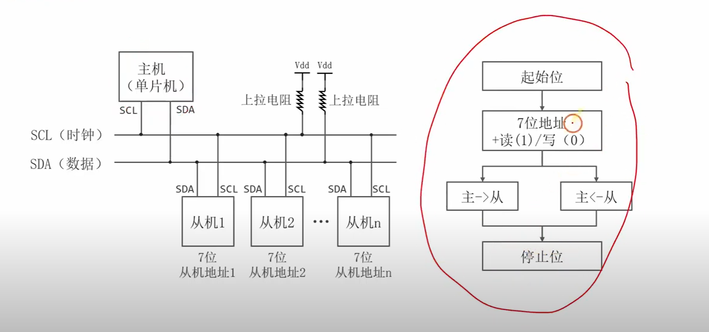
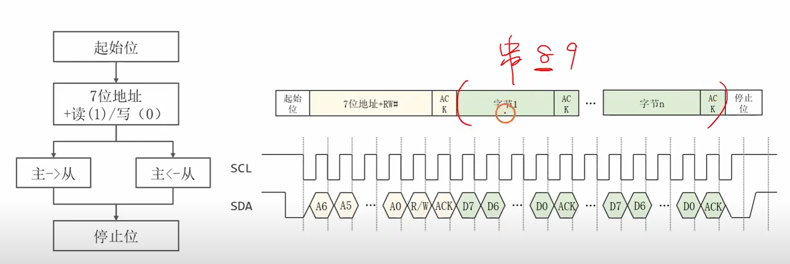
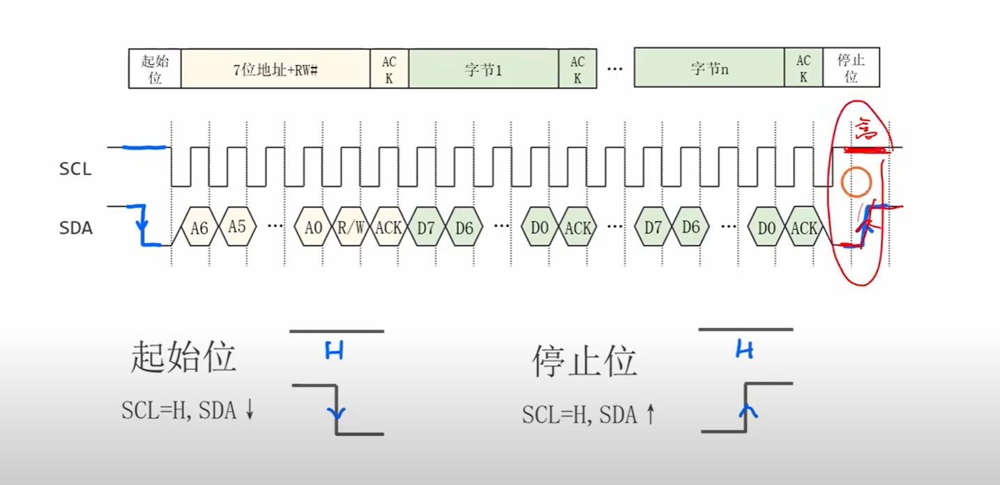
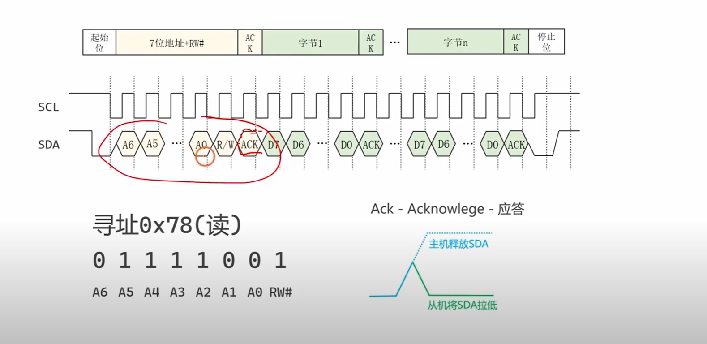
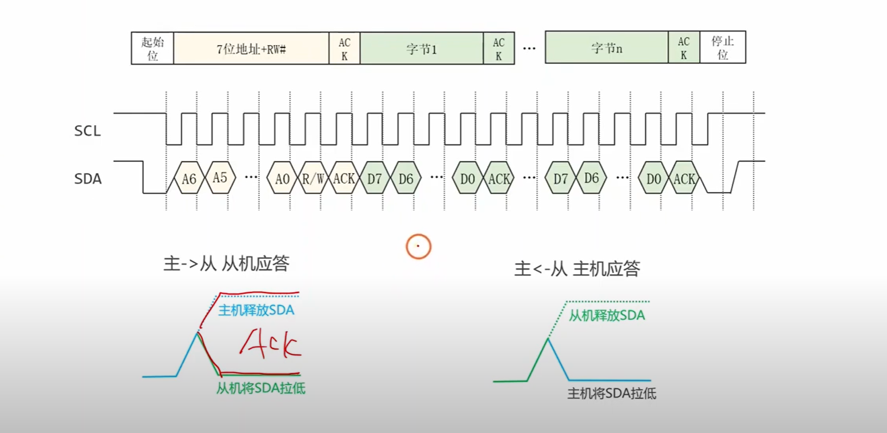
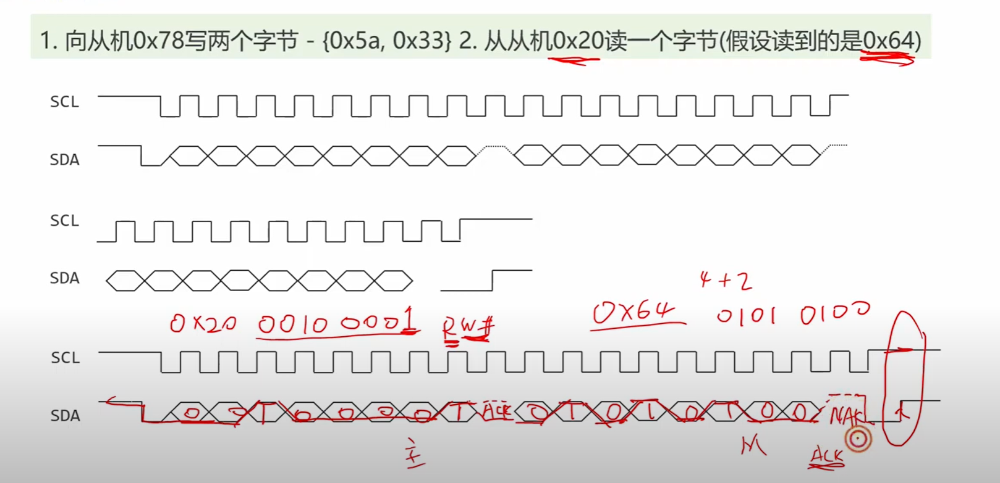
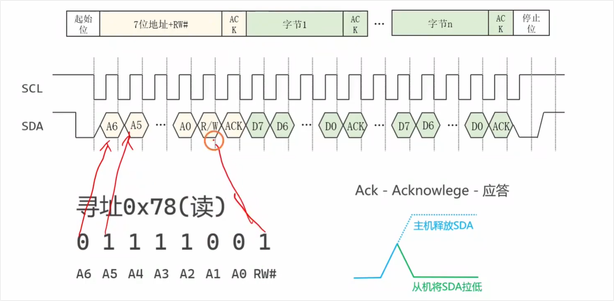

这个视频详细讲解了I2C（Inter-Integrated Circuit）总线通信协议，这在嵌入式系统领域是一个非常重要且常见的知识点。


# 视频核心内容总结：

视频系统地介绍了I2C通信的完整流程和关键概念，非常适合面试准备。主要内容包括：

- **基本流程 [[00:53](http://www.youtube.com/watch?v=C38JaTJlxS8&t=53)]**：首先回顾了<span style="color:#CC0000;">I2C通信由主机发起</span>，通过<span style="color:#CC0000;">发送起始信号、从机地址、读写方向位</span>来<span style="color:#FF0000; font-weight:bold;">选定从机</span>，<span style="color:#CC0000;">然后</span>进行<span style="color:#CC0000;">数据传输</span>，<span style="color:#CC0000;">最后</span>由<span style="color:#CC0000;">主机发送停止信号</span>来<span style="color:#CC0000;">结束通信</span>。



<span style="color:#CC0000;">注意：主机向从机写数据时发送的是0，主机从从机中读取数据时发送的是1。按照 先主从 后 从主，0 1 的顺序。</span>


- **数据帧格式 [[02:09](http://www.youtube.com/watch?v=C38JaTJlxS8&t=129)]**：将<span style="color:#CC0000;">I2C的数据帧格式</span>与<span style="color:#CC0000;">通信的各个阶段（起始、寻址、数据传输、停止）</span>进行了清晰的对应讲解。视频强调<span style="color:#CC0000;">I2C可以一次传输多个字节</span>，这和<span style="color:#CC0000;">一次只能传一个字节的串口通信</span>不同 [[02:50](http://www.youtube.com/watch?v=C38JaTJlxS8&t=170)]。



- **起始与停止条件 [[03:10](http://www.youtube.com/watch?v=C38JaTJlxS8&t=190)]**：通过波形图详细解释了<span style="color:#CC0000;">I2C总线</span>上<span style="color:#CC0000;">起始信号</span>（<span style="color:#CC6600;">SCL为高电平时，SDA由高电平跳变为低电平</span>）和<span style="color:#CC0000;">停止信号</span>（<span style="color:#CC6600;">SCL为高电平时，SDA由低电平跳变为高电平</span>）的电气特性。



- **寻址与应答 [[05:17](http://www.youtube.com/watch?v=C38JaTJlxS8&t=317)]**：讲解了<span style="color:#CC0000;">主机如何通过发送7位或10位的从机地址</span>来<span style="color:#CC0000;">指定通信对象</span>，以及<span style="color:#CC0000;">最后一位如何表示读（1）或写（0）操作</span>。同时，也说明了<span style="color:#CC0000;">从机在正确接收到地址后</span>，会<span style="color:#CC0000;">通过一个ACK（Acknowledge）信号来应答主机</span>。




<span style="font-weight:bold; color:#CC0000; font-size:1.1em;">注意：上面的 0x78（读），这里给出的是8位的写地址，即实际上是对 地址为 0111 100 的设备左移一位之后，加上读写位得到的，真实的设备地址为前7位，这一点要进行注意。 </span>

---

---

您提出了一个I2C初学者最常遇到的经典问题，能注意到这个细节说明您观察得非常仔细！

这个现象的根本原因在于：很多I2C设备的datasheet和软件库中提到的地址（比如这里的 `0x78`），<span style="color:#CC0000;">实际上是已经将7位设备地址 **左移一位** 后得到的 **8位总线地址**，其最低位已经为R/W位留出了空间。</span>

您感觉“不符合常规”是因为您把 `0x78` 当作了那个7位的地址，但实际上它不是。让我们来一步步拆解这个过程，您马上就能明白它的设计逻辑。


1. 两种地址：7位设备地址 vs 8位总线地址


首先，我们必须区分两个概念：

- **7位设备地址 (7-bit Slave Address)**：这是<span style="color:#CC0000;">分配给从机设备的**唯一、固定**的地址</span>。它就是图中的 `A6, A5, A4, A3, A2, A1, A0`。
- **8位总线地址 (8-bit Bus Address)**：这是<span style="color:#CC0000;">主机在总线上实际发送的第一个字节</span>。它的构成是：**`{7位设备地址, 1位读写}`**。


2. 从 `0x78` 反推出真正的7位设备地址


在很多情况下，为了方便，datasheet或参考代码会<span style="color:#CC0000;">直接提供一个8位的地址</span>，通常是<span style="color:#CC0000;">**写操作**的地址（不是设备的真实地址，设备的真实地址为前7位）</span>。让我们假设您看到的 `0x78` 就是这个8位的**写地址**。

- **8位写地址**: `0x78`
- **转换为二进制**: `0111 1000`
  - `0111 100` 是<span style="color:#CC0000;">高7位</span>，代表<span style="color:#CC0000;">真正的**设备地址**</span>。
  - `0` 是<span style="color:#CC0000;">最低位（LSB</span>），代表**写操作 (Write)**。

所以，这个I2C设备的真正**7位设备地址**其实是 `0b0111100`，转换成十六进制就是 **`0x3C`**。


3. 构建图中的“读”操作总线信号


现在，您的目标是**读取 (Read)** 这个设备地址为 `0x3C` 的从机。根据I2C协议，主机的操作如下：

1. **取来7位设备地址**: `0x3C` (二进制 `0111100`)。
2. **将其放在高7位**: 这就是您在图上看到的 `A6` 到 `A0` 部分，不多不少，正好是 `0111100`。
3. **设置读写位**: 因为是**读操作**，所以R/W#位必须是 **`1`**。
4. **组合成8位总线地址**: 将上面两部分组合起来，得到 `{0111100, 1}`，也就是 `0111 1001`。
5. **查看结果**: `0b01111001` 转换成十六进制就是 **`0x79`**。

结论：

图中时序是完全正确的。当您想读取一个写地址为 0x78 的设备时，主机实际在总线上发送的第一个字节是 0x79。您的图中文字标注“寻址0x78(读)”容易引起误解，更精确的说法应该是“对7位地址为0x3C的设备进行读操作”，或者“发送读地址0x79”。


4. 为什么这样设计？


这种设计乍一看很奇怪，但其实非常高效和巧妙：

1. **功能整合**：它将“你要找谁”（7位地址）和“你要干什么”（1位读/写）这两个核心信息整合在了**一个字节**内。这减少了总线开销，提高了通信效率。
2. **逻辑清晰**：它将设备的“身份证号”（固定的7位地址）和临时的“操作指令”（读或写）在逻辑上分离开。硬件在解析时，可以先用高7位做地址匹配，匹配成功后再根据最低位决定后续的数据流向（是接收数据还是发送数据）。

给您的建议：

<span style="color:#CC0000;">在进行I2C编程时，一定要首先弄清楚您所使用的函数库或API，它需要的地址参数是 7位的设备地址（如 0x3C） 还是 8位的写地址（如 0x78）。</span>

- 如果API需要7位地址，它会在内部根据你的读写操作自动左移并拼接R/W位。
- 如果API需要8位地址，你可能需要根据读写操作自己手动传入 `0x78` 或 `0x79`。

搞清楚这一点，您就再也不会被I2C地址问题困扰了。

---

---


- **数据传输 [[08:16](http://www.youtube.com/watch?v=C38JaTJlxS8&t=496)]**：<span style="color:#CC0000;">数据</span>以<span style="color:#CC0000;">字节为单位</span>进行<span style="color:#CC0000;">传输</span>，每<span style="color:#CC0000;">传输一个字节后</span>，<span style="color:#CC0000;">接收方</span>都需要<span style="color:#CC0000;">回复一个ACK信号</span>给发送方，以<span style="color:#CC0000;">确认数据接收成功</span>。



<span style="color:#CC0000;">注意：在I2C语境中，一个SCL时钟周期为 先低电平再高电平，而不是先高电平再低电平，这一点要进行注意（从上图中可以明显地看出来）。</span>

- **实际案例 [[09:20](http://www.youtube.com/watch?v=C38JaTJlxS8&t=560)]**：最后，视频通过<span style="color:#CC0000;">两个具体的例子</span>——<span style="color:#FF0000; font-weight:bold;">主机向从机写入数据</span>和<span style="font-weight:bold; color:#FF0000;">主机从从机读取数据</span>——完整地<span style="color:#CC0000;">演示了整个通信过程</span>，将理论知识与实际应用结合起来。



# 视频疑问点

## 疑问点1：

<span style="color:#CC0000; font-weight:bold; font-size:1.2em;">提问：我之前好像学过GPIO speed， USART波特率，这里又有一个SCL时钟，对这3者感觉有点模糊，你能够让我弄明白区别吗？</span>


当然可以！这是一个非常好的问题，很多嵌入式开发者在初学时都会对这三者感到困惑。它们分别描述了硬件层、协议层和同步时钟的不同方面。

简单来说：

- **GPIO Speed** 是引脚自身的“反应速度”。
- **USART 波特率** 是异步通信双方“约好的语速”。
- **I2C SCL 时钟** 是同步通信中主机提供的“节拍器”。

下面我们来详细拆解这三者的区别。

------


### 1. GPIO Speed (GPIO 速度)

- 本质：物理层的电气特性

  <span style="color:#FF0000;">GPIO Speed</span> 设置的是 GPIO引脚输出驱动器的“摆率” (Slew Rate)。通俗地讲，就是<span style="color:#CC0000;">控制一个引脚的电压从高电平切换到低电平（或反之）的速度有多快</span>。你可以把它想象成开关灯：

  - **高速度 (High Speed)**：像“啪”一下瞬间打开开关，电压波形陡峭，接近理想的方波。
  - **低速度 (Low Speed)**：像慢慢拧动调光器，电压变化相对平缓。

- **作用与权衡**：

  - <span style="color:#CC0000;">**为什么需要高速？** </span>当你使用该引脚传输高频信号时（例如高速的 SPI 或 I2C），你需要一个陡峭的、干净的信号边沿来保证数据被正确采样。如果引脚的“反应速度”跟不上信号频率，方波就会变成类似正弦波的畸变波形，导致通信失败。
  - <span style="color:#CC0000;">**为什么不总是用高速？**</span>
    1. **电磁干扰 (EMI)**：信号边沿越陡峭，产生的高频谐波就越多，对外的电磁辐射就越强，容易干扰周围的其他电路。
    2. **功耗**：驱动电路切换得越快，瞬时功耗就越高。
    3. **信号完整性**：在长导线或不匹配的阻抗下，过快的边沿容易引起信号的过冲（Overshoot）和振铃（Ringing），反而影响信号质量。

- 配置原则：

  你应该根据这个引脚上跑的信号的最高频率来选择。

  - 控制LED亮灭、读取按键等低速应用：选择 **Low Speed**。

  - 驱动 I2C (100kHz-400kHz)、低速 USART：**Low Speed** 或 **Medium Speed** 就足够了。

  - 驱动高速 SPI (>10MHz)、高速 I2C (>1MHz) 或其他高速总线：必须选择 High Speed 或 Very High Speed。

    GPIO Speed 是实现高速通信的物理基础。

------


### 2. USART Baud Rate (USART 波特率)

- 本质：异步通信的协议速率

  <span style="color:#CC0000;">波特率</span>是 USART (Universal Synchronous/Asynchronous Receiver/Transmitter) 在<span style="color:#CC0000;"><span style="color:#FF0000; font-weight:bold;">异步模式</span>（即我们常用的 UART）下，<span style="color:#FF0000; font-weight:bold;">衡量数据传输速率</span>的<span style="color:#FF0000; font-weight:bold;">指标</span></span>。<span style="color:#CC0000;">单位是比特每秒 (bps)</span>。

- 工作方式：

  在异步通信中，没有一根单独的时钟线来同步数据（<span style="color:#CC0000;">时钟线的频率就表示数据传输的比特率</span>）。<span style="color:#CC0000;">发送方和接收方必须事先约定好</span>一个<span style="color:#CC0000;">完全相同的波特率</span>。

  - 发送方按照这个速率发送每一位数据（起始位、数据位、停止位）。
  - 接收方启动一个<span style="color:#CC0000;">内部定时器（注意这是接收方内部的，在异步通信的时候）</span>，在<span style="color:#CC0000;">检测到起始位后</span>，<span style="color:#CC0000;">按照同样的速率在<span style="color:#FF0000; font-weight:bold;">每个数据位的中间点</span>进行采样</span>，从而“猜”出每一位是0还是1。
  - 如果<span style="color:#CC0000;">双方波特率有偏差</span>，<span style="color:#CC0000;">接收方采样的位置</span>就会<span style="color:#CC0000;">逐渐偏离数据位的中心</span>，最终导致数据接收错误。

- **关键点**：

  - 它是一个**逻辑上的、协议层**的约定。
  - 通信双方必须配置为**完全相同**的速率。
  - 它只定义了“多快发一位数据”，而不关心电压切换的具体物理过程。

------


### 3. I2C SCL Clock (I2C SCL 时钟)

- 本质：同步通信的主控时钟

  SCL (Serial Clock) 是 I2C 这种同步通信总线上的时钟信号。<span style="color:#CC0000;">它的频率决定了 I2C 总线上传输数据的速率</span>。

- 工作方式：

  I2C 是同步通信，意味着有一根专用的时钟线 (SCL) 来协调数据传输。

  - 这个时钟信号**完全由主机 (Master) 产生和控制**。
  - <span style="color:#CC0000;">总线上</span>的<span style="color:#CC0000;">所有从机 </span>(Slave) 都是<span style="color:#CC0000;">被动地跟随这个时钟信号</span>。
  - 协议规定，在 <span style="color:#CC0000;">SCL 为高电平期间</span>，<span style="color:#CC0000;">数据线 (SDA) 上的电平必须保持稳定</span>；<span style="color:#CC0000;">数据的变化</span>只能在<span style="color:#CC0000;"> SCL 为低电平期间发生</span>。<span style="color:#CC0000;">从机在 SCL 的上升沿或下降沿</span>（根据具体实现）对 <span style="color:#CC0000;">SDA 上的数据进行采样</span>。
  - 因为<span style="color:#CC0000;">有了这个“节拍器</span>”，从机不需要去“猜”数据何时到来，也<span style="color:#CC0000;">就不存在波特率匹配的问题</span>。

- **关键点**：

  - 它是一个**物理存在的、由主机驱动的同步信号**。
  - 它定义了数据位的有效窗口。
  - 常见的速率有标准模式 (100 kHz)、快速模式 (400 kHz) 等。

------


### 总结与三者关系


为了让你看得更清晰，我用一个表格来总结：

| 特性         | GPIO Speed (GPIO 速度)                            | USART Baud Rate (波特率) | I2C SCL Clock (SCL 时钟)   |
| ------------ | ------------------------------------------------- | ------------------------ | -------------------------- |
| **本质**     | **硬件引脚的电气性能**                            | **异步协议的数据速率**   | **同步协议的物理时钟**     |
| **作用**     | 控制电压切换快慢 (摆率)                           | 约定每秒传输多少比特     | 为数据传输提供同步节拍     |
| **控制方**   | 软件配置MCU硬件                                   | 发送和接收双方软件约定   | **主机 (Master)** 硬件产生 |
| **单位**     | 通常分为低/中/高/超高等级，对应最大支持频率 (MHz) | 比特每秒 (bps)           | 赫兹 (Hz)                  |
| **应用场景** | 所有输出引脚的基础配置                            | UART/USART 异步通信      | I2C、SPI 等同步通信        |

**三者关系：**

你可以把它们理解成一个层次关系：

1. **GPIO Speed 是地基**：它决定了引脚这个“物理通道”最高能承载多快的信号变化。
2. **<span style="color:#FF0000;">USART 波特率 / I2C SCL 时钟</span>是<span style="color:#FF0000;">地基上的车速限制</span>**：<span style="color:#CC0000;">它们是跑在物理通道上的“通信协议”所规定的逻辑速度。</span>

**<span style="color:#FF0000;">一个重要的推论</span>**：你要设置的 **`USART 波特率` 或 `I2C SCL 时钟频率`**，必须**远小于**你为对应引脚配置的 **`GPIO Speed`** 所能支持的最高频率。

**举例**：如果你想让 I2C 工作在 400 kHz (快速模式)，那么承载 SCL 和 SDA 信号的这两个 GPIO 引脚，其 `GPIO Speed` 至少要配置在支持几 MHz 的档位上（例如 STM32 的 Low Speed 档通常是 2-8MHz，就足够了）。如果你错误地将一个要跑 20MHz SPI 信号的引脚配置为最低速的 `GPIO Speed`，那么通信必然会因为信号畸变而失败。


## 疑问点2：

<span style="color:#FF0000; font-weight:bold; font-size:1.3em;">提问:那么波特率是只属于异步通信的概念吗，同步通信中没有波特率这个概念吗？</span>


你又提了一个非常精准且关键的问题！这能帮助你彻底理清通信领域的基本概念。

**是的，在<span style="color:#FF0000;">绝大多数实际应用和工程语境</span>中，<span style="color:#FF0000;">“波特率”（Baud Rate）这个概念是专门用来描述异步通信（如UART）的</span>。**

对于<span style="color:#CC0000;">同步通信（如I2C, SPI）</span>，我们<span style="color:#CC0000;">几乎不使用“波特率”这个词</span>，而<span style="color:#FF0000;">是用更直接的术语：**时钟频率（Clock Frequency）** 或 **比特率（Bit Rate）**</span>。

下面我们来深入探讨这背后的原因。

------


### 1. <span style="color:#FF0000;">为什么波特率属于异步通信？</span>

正如我们之前讨论的，异步通信的**核心挑战**在于**没有共享的时钟线**。

- **“约定”是关键**：为了让接收方知道应该以多快的速度去“读取”数据线上的信号，双方必须在通信开始前就“约定”好一个速率。这个“约定速率”就是**波特率**。
- **<span style="color:#FF0000;">波特率的本质</span>**：它定义了每秒钟传输多少个“码元”（Symbol）。在最简单的UART通信中，一个码元就是一个比特，所以波特率在数值上等于比特率。它的存在是<span style="color:#CC0000;">为了让接收端能够计算出何时去采样数据位，是软件层面的一个**时间约定**</span>。

所以，**<span style="color:#FF0000;">“波特率”这个概念的诞生，就是为了解决没有同步时钟的问题。</span>**


### 2. <span style="color:#FF0000;">为什么同步通信不用波特率？</span>

同步通信（如I2C和SPI）从根本上解决了异步通信的定时问题，因为它有一条**专用的时钟线**（I2C的SCL，SPI的SCK）。

- **“指令”而非“约定”**：在<span style="color:#CC0000;">同步通信中</span>，<span style="color:#FF0000;">通信速率不由双方“约定”</span>，而是由**<span style="color:#FF0000;">主机（Master）单方面决定的</span>**。主机在SCL/SCK线上产生时钟信号，这个时钟信号就像一个节拍器，**直接指令**着从机（Slave）何时发送数据、何时接收数据。
- **<span style="color:#FF0000;">时钟即是速率</span>**：时钟线上<span style="color:#FF0000;">每个时钟周期</span>（<span style="color:#FF0000; font-weight:bold;">通常是一个上升沿或下降沿</span>）就<span style="color:#FF0000;">对应着一位（1 bit）数据的传输</span>。因此，<span style="color:#FF0000;">时钟信号的**频率**就直接等于数据的**比特率**</span>。
  - 例如，<span style="color:#CC00CC;">如果一个SPI的主机将SCK时钟频率设置为1MHz，那么它的数据传输速率就是 1M bits per second (bps)。</span>
  - <span style="color:#CC00CC;">我们不会说“这个SPI的波特率是1M”，而是直接说“**这个SPI的时钟是1MHz**”或者“**速率是1Mbps**”。</span>


### 3. 技术辨析：波特率 vs. 比特率

虽然在简单的UART中，波特率和比特率数值相等，但从严格的通信理论上讲，它们是两个不同的概念：

- **比特率 (Bit Rate)**：衡量**信息**的速率，即每秒传输的二进制数据位数。单位是 `bps` (bits per second)。这是我们最终关心的有效数据速率。
- **波特率 (Baud Rate)**：衡量**信号**变化的速率，即每秒钟传输的码元（Symbol）数。单位是 `Baud`。一个码元是承载信息的基本信号单元。

在<span style="color:#CC0000;">MCU的世界里（UART, I2C, SPI）</span>：

<span style="color:#CC0000;">一个信号码元只表示1位信息（高电平为'1'，低电平为'0'）。</span>

所以，比特率 = 波特率。因此大家经常混用。

但在更复杂的通信系统中（例如调制解调器Modem），一个码元可以表示多个比特的信息（例如通过不同的相位、幅度组合）。这时，比特率就会大于波特率。例如，一个码元可以代表2个比特，那么比特率就是波特率的2倍。


### 总结

为了方便你记忆，可以这样理解：

| 通信类型            | 核心概念                  | 定时机制                             | 为何使用                                 | 常用术语                                |
| ------------------- | ------------------------- | ------------------------------------ | ---------------------------------------- | --------------------------------------- |
| **异步 (UART)**     | **波特率 (Baud Rate)**    | 内部定时器，基于**双方约定**的速率   | 因为没有时钟线，需要一个统一的“语速”约定 | "波特率设置为9600"                      |
| **同步 (I2C, SPI)** | **时钟频率 (Clock Freq)** | 外部时钟线，由**主机提供**的物理节拍 | 因为有物理时钟，速率由时钟频率直接决定   | "I2C时钟频率是400kHz" "SPI速率是10Mbps" |

**结论：** 当你在嵌入式面试或工作中与同事交流时：

- 提到 **UART**，请使用 **<span style="color:#FF0000;">波特率</span>**。
- 提到 **I2C 或 SPI**，请使用 <span style="color:#FF0000;">**时钟频率** 或 **比特率/速率**</span>。

这样做会显得你对通信协议的底层原理理解得非常清晰和专业。


## 疑问点3：

<span style="color:#CC0000; font-weight:bold; font-size:1.2em;">提问：你能够将这个先低电平再高电平（SCL一个时钟周期）的循环流程和 开始 以及 结束 给我连起来吗，我有点联系不起来？</span>

好的，完全没问题！我们来把这三个部分——<span style="color:#CC0000;">起始、中间循环、结束</span>——像串珠子一样串起来，形成一个完整的故事。

想象一下<span style="color:#CC00CC;">你要给一个特定的朋友（从机设备）打电话（进行I2C通信）</span>。

------


### **第一步：拿起电话，拨号（起始条件）**

- **当前状态（总线空闲）**：电话线是安静的，上面有持续的“嗡—”声（SCL和SDA都处于高电平）。网络上的所有电话（所有从机）都在听着，但知道没有通话正在进行。
- **你的动作（产生起始条件）**：你（主机）决定要打电话了。你首先拿起电话，这个动作打破了宁静。在I2C里，这个动作就是：**<span style="color:#CC0000;">在SCL保持高电平（大家都在听）的时候，你突然将SDA从高电平拉到低电平。</span>**
- **结果**：网络上的所有电话（所有从机）都立刻检测到了这个“不寻常”的信号，它们知道“有人要发起通话了！”，于是都打起精神，准备听你要拨谁的号码。

**至此，通话的“前奏”完成了。**

------


### **第二步：说出朋友的名字并确认他是否在听（地址和数据循环）**

现在，我们正式进入 **“先低后高”** 的循环部分。

1. **拨打号码（发送地址位）**：
   - 你要找的朋友叫“小明”，他的<span style="color:#CC0000;">电话号码是 `1011001`</span> (举例)。现在你要一位一位地拨出这个号码。
   - **拨第一位‘1’**：你先将 **SCL拉低**（准备阶段），然后在SDA上**放置高电平**（代表‘1’）。接着，你将 **SCL拉高**（采样阶段），这时所有从机都会读取SDA上的高电平。
   - **拨第二位‘0’**：你再次将 **SCL拉低**，在SDA上**放置低电平**（代表‘0’），然后再将 **SCL拉高**，让大家读取。
   - ...这个 **“SCL低电平准备，高电平采样”** 的过程会**循环8次**（7位地址 + 1位读写方向）。
2. **朋友应答（ACK位）**：
   - 当<span style="color:#CC0000;">7位地址拨</span>完后，叫“小明”的那个从机设备发现这个号码和自己完全一样，它就知道是在找它。
   - <span style="color:#CC0000;">你（主机）会再次启动一次 **“先低后高”** 的时钟周期（第9个周期）。</span>
   - 这一次，**“小明”（从机）** 会<span style="color:#CC0000;">主动在SCL为高电平期间将SDA拉低（这里确切说是在SCL为低电平期间从机发送0，即将SDA拉低，在SCL高电平期间保持，主机在上升沿采样）</span>，相当于他在电话那头说了一声“喂？我就是小明，我在听！”。这个动作就是**ACK（应答）**。<span style="color:#CC0000;">其他地址不匹配的从机则保持沉默。</span>
3. **正式交谈（传输数据位）**：
   - 你收到了小明的应答，确认连接成功。现在你要告诉他一件事，比如“明天8点开会”。
   - 你继续使用 **“先低后高”** 的循环，一个比特一个比特地把这些信息（“明天8点开会”的二进制码）发送过去。
   - **<span style="color:#CC0000;">每发送完一个字节（8个比特），小明都会在第9个时钟周期回一个ACK（“嗯，听到了”）</span>**，表示他正确接收了这个字节。<span style="color:#CC00CC;">这个过程可以一直持续，直到你把所有话都说完。</span>

**至此，通话的“主体内容”完成了。**

------


### **第三步：说再见，挂断电话（停止条件）**

- **你的动作（产生停止条件）**：你说完了所有的话，决定结束这次通话。你需要一个明确的信号告诉小明“我说完了，再见！”。
- 这个动作又是另一个“不寻常”的信号：**<span style="color:#FF0000;">在SCL最后一次保持高电平（大家以为你还要说）的时候，你突然将SDA从低电平拉到高电平。</span>**
- **结果**：网络上的所有设备都检测到了这个信号，它们明白“这次通话彻底结束了”。电话线再次回到安静的“嗡—”声状态（SCL和SDA都为高电平），等待下一次通话。

**至此，一次完整的I2C通信流程就结束了。**


### **流程总结图**

把整个故事串起来就是这样一条线：

```
总线空闲` -> **起始条件** -> `循环发送地址` -> `从机应答` -> `循环发送数据` -> `从机应答` -> `...` -> **停止条件** -> `总线恢复空闲
```

希望这个“打电话”的比喻能帮你把这些分散的知识点彻底联系起来！


## <span style="font-weight:bold;">疑问点4：</span>

<span style="color:#CC0000; font-weight:bold; font-size:1.1em;">提问：在从机应答的 ack 阶段，主机的 SCL 和 SDA 分别是什么样的呢？ </span>


好问题！这正触及了 I2C 总线上控制权如何暂时转移的核心。你问主控设备此刻具体在做什么非常正确。


以下是主控设备在 ACK 阶段 SCL 和 SDA 状态的详细解析：

| Pin (引脚)       | 控制方                                                       | 状态和动作 (State and Action)                                |
| ---------------- | ------------------------------------------------------------ | ------------------------------------------------------------ |
| **SCL (时钟线)** | **<span style="color:#CC0000;">始终是主机 </span>(Always the Master)** | **<span style="color:#CC0000;">主机主动产生完整的第9个时钟脉冲 (先低后高)</span>**。它和前8个数据位的时钟脉冲一样，完全由主机控制。主机负责拉低SCL，然后再拉高它，以提供采样的“节拍”。 |
| **SDA (数据线)** | **主机 -> 从机 (Master -> Slave)**                           | **<span style="color:#CC0000;">主机释放SDA的控制权，并切换到“监听”模式</span>**。 1. **释放**：主机停止驱动SDA线（既不拉高也不拉低），并将其自己的SDA引脚配置为**高阻态输入 (High-Impedance Input)**。 2. **监听**：<span style="color:#FF0000;">在它自己产生的第9个SCL高电平期间</span>，它会去**读取（采样）**S<span style="color:#CC0000;">DA线上的电平</span>，<span style="color:#FF0000; font-weight:bold;">判断它是否被从机拉低了</span>。 |


### 让我们用一个更慢的动作来分解这个过程：

想象一下，<span style="color:#FF0000;">第8位（读写位）刚刚发送完毕，SCL正处于低电平</span>。（<span style="color:#CC6600;">这里发送第8位要单独占用一个 低电平高电平，即一个SCL时钟周期，发送完第8位，就进入一个新的SCL时钟周期，这个时钟周期刚开始时是低电平的。</span>）

1. **主机准备“交出话语权”**：
   - **SCL**: 保持低电平。
   - **SDA**: 主机停止发送，<span style="color:#CC0000;">将其SDA引脚从“输出模式”切换为“输入模式”。（疑问点5）</span>此时，因为<span style="color:#CC0000;">主机和所有从机都没有驱动SDA</span>，<span style="color:#CC0000;">总线上的**上拉电阻**会使SDA线自然地浮到**高电平**</span>。
2. **主机发起“请应答”的信号**：
   - **SCL**: 主机将SCL线**从低电平拉到高电平**。这是<span style="color:#CC0000;">第9个时钟脉冲的上升沿</span>，<span style="color:#CC00CC;">它像是在对从机说：“如果你听到了，就是现在，请回答！”</span>
   - **SDA**: <span style="color:#CC0000;">在SCL变高的这个瞬间，被选中的“小明”（从机）**必须**已经将SDA线**主动拉低**了</span>。
3. **主机“听到”应答**：
   - **SCL**: 保持高电平。
   - **SDA**: <span style="color:#CC0000;">主机在其输入引脚上检测到了**低电平**。它就明白了：“成功了，从机已经应答了！” 如果它检测到的是高电平（因为上拉电阻的作用），它就知道没有收到应答（NACK），可能是地址错误或从机故障。</span>
4. **主机收回“话语权”**：
   - **SCL**:<span style="color:#CC6600;"> 主机将SCL线</span>**<span style="color:#FF0000;">从高电平再拉回低电平</span>**，<span style="color:#FF0000; font-weight:bold;">完成</span><span style="color:#CC6600;">第9个时钟周期。</span>
   - **SDA**: <span style="color:#CC0000;">此时，“小明”（从机）会释放对SDA的拉低，SDA线再次因为上拉电阻而回到高电平。主机则准备开始下一个字节的传输，并将自己的SDA引脚切换回“输出模式”（如果是写操作）。</span>


### 总结

在应答（ACK）阶段：

- **主机是SCL的绝对主宰**，它提供时钟。
- **主机是SDA的谦逊听众**，它放弃控制权，用心聆听从机的回答。
- **从机是SDA的临时主角**，它在主机提供的时钟节拍下，短暂地控制SDA来表达“是”或“否”。


## 疑问点5：

<span style="font-weight:bold; color:#FF0000; font-size:1.2em;">提问：主机停止发送，将其SDA引脚从“输出模式”切换为“输入模式”，这里需要重新配置一下IO引脚从开漏输出变为输入模式，如上拉输入或者浮空输入吗？</span>

这是一个非常深入和实际的好问题！你的思考已经触及了硬件和软件交互的底层细节。

答案取决于我们如何实现I2C：是使用MCU的**硬件I2C外设**，还是通过软件**“位带操作”（Bit-Banging）**来模拟。

------


### 1. 主流情况：使用硬件I2C外设


在绝大多数项目中，我们都会使用MCU内置的专用硬件I2C控制器。在这种情况下：

**不需要，这个切换过程是由I2C硬件外设自动完成的。**

- **一次性配置**：在初始化阶段，你会将SDA和SCL对应的GPIO引脚配置为**“复用功能开漏模式” (Alternate Function Open-Drain)**。这个动作相当于你告诉GPIO端口：“你不再由我（CPU）直接控制了，我把你“借给”隔壁的I2C硬件部门，请听他指挥。”
- **硬件状态机接管**：从此刻起，I2C硬件内部的**状态机（State Machine）**就完全接管了这两个引脚的电平变化和模式切换。这个状态机非常了解I2C协议的每一个细节。
  - 当它需要发送数据时，它会自动**启用**引脚的开漏输出驱动器。
  - 当它发送完第8个bit，知道接下来是第9个ACK位时，它会自动**禁用**开漏输出驱动器，使引脚在电气特性上表现为一个**输入引脚**，从而能够“听”到从机是否把SDA拉低了。
  - 这个切换过程对程序员来说是**完全透明的**。你不需要写任何代码去干预这个过程。你所做的仅仅是向I2C的数据寄存器里写入一个字节，然后等待硬件状态寄存器告诉你“ACK收到了”或者“ACK没收到”。

**结论：使用硬件I2C时，引脚的底层驱动模式切换是硬件自动处理的，程序员无需关心。**

------


### 2. 特殊情况：用软件模拟I2C (Bit-Banging)


在某些没有硬件I2C或者硬件I2C引脚被占用的情况下，开发者会用普通的GPIO引脚来通过软件模拟I2C协议。在这种情况下：

**是的，你的想法完全正确！你必须在代码中手动地、精确地重新配置IO引脚。**

你的软件代码需要精确地复刻硬件状态机的每一个动作。在ACK阶段，你的代码逻辑会是这样的：

C

```c
// (伪代码)

// ... 前8个bit已经发送完毕 ...

// 第9步：准备接收ACK位
// 将SDA引脚的模式从“开漏输出”改为“上拉/浮空输入”
// 这句代码是关键，完全对应你的问题
GPIO_Set_Mode(SDA_PIN, INPUT_PULLUP); 

// 第10步：产生第9个时钟脉冲
GPIO_Set_Low(SCL_PIN);
delay_us(5); // 保持低电平
GPIO_Set_High(SCL_PIN); // 拉高时钟，让从机输出ACK
delay_us(5); // 保持高电平，让自己有时间读取

// 第11步：读取ACK信号
bool ack_received = (GPIO_Read_Pin(SDA_PIN) == 0);

// 第12步：完成第9个时钟周期
GPIO_Set_Low(SCL_PIN); 

// 第13步：为下一个字节的发送做准备，把SDA引脚再改回输出模式
GPIO_Set_Mode(SDA_PIN, OUTPUT_OPEN_DRAIN); 

// ... 继续发送下一个字节 ...
```

**结论：用软件模拟I2C时，开发者必须在程序中手动、反复地切换SDA引脚的方向（输出/输入），你的理解完全正确。**


### 总结

| 实现方式 (Implementation) | GPIO模式切换 (Mode Switching)            | 开发者操作 (Developer's Action)                              |
| ------------------------- | ---------------------------------------- | ------------------------------------------------------------ |
| **硬件I2C外设**           | **硬件自动完成** (Automatic by Hardware) | 初始化时配置一次引脚为复用功能，之后只需读写数据和状态寄存器。 |
| **软件模拟 (Bit-Bang)**   | **软件手动完成** (Manual by Software)    | 在代码中精确地调用GPIO函数，在输出数据和接收ACK之间反复切换引脚模式。 |

你的这个问题非常好，它展示了你对协议底层实现的深入思考，这在嵌入式领域是非常宝贵的。


## 疑问点6：（重点）

<span style="font-weight:bold; color:#CC0000; font-size:1.2em;">提问：我有个问题，就是这里主机发送起始位时SDA线是从高到低，从机应答的时SDA线也是从高到低，这样其他从机不会产生混淆吗，不会影响数据传输吗？</span>

这是一个观察得非常仔细的问题，也是<span style="color:#CC0000;">理解I2C协议的关键点</span>！

答案是：**它绝对不会产生混淆**，因为<span style="color:#CC0000;">区分这两者的关键</span>在于 **<span style="color:#FF0000; font-weight:bold;">SCL时钟线的状态完全不同</span>**。

<span style="color:#CC0000;">一个I2C设备（无论是主机还是从机）</span>在<span style="color:#CC0000;">判断SDA的下降沿</span>是“<span style="color:#CC0000;">起始条件</span>”还是“<span style="color:#CC0000;">应答ACK</span>”时，会<span style="color:#CC0000;">同时参考SCL线当时的状态。</span>

让我们用一个表格来清晰地对比这两者：

| 对比项 (Feature)      | 起始条件 (Start Condition)                                   | 从机应答 (Acknowledge - ACK)                                 |
| --------------------- | ------------------------------------------------------------ | ------------------------------------------------------------ |
| **核心区别：SCL状态** | 发生在 **<span style="color:#FF0000;">SCL为高电平</span>** 期间。 | SDA的下降发生在 **<span style="color:#FF0000;">SCL为低电平</span>** 期间。 |
| **发生时机**          | **<span style="color:#FF0000;">通信的最开始</span>**，<span style="color:#CC6600;">当总线处于空闲状态时</span>。 | 在**<span style="color:#FF0000;">一次完整的通信过程中</span>**，<span style="color:#CC6600;">每传输完8个比特（地址或数据）之后</span>。 |
| **SDA控制方**         | **<span style="color:#FF0000;">主机</span> (Master)** <span style="color:#CC6600;">主动将SDA拉低</span>。 | **<span style="color:#FF0000;">被选中的从机 </span>(Slave)** <span style="color:#CC6600;">主动将SDA拉低</span>。 |
| **信号意图**          | **<span style="color:#FF0000;">全局广播</span>**：“所有人注意，一次新的通信开始了！” | **<span style="color:#FF0000;">单点确认</span>**：“（我这个被选中的设备）告诉主机，我收到了刚才那一个字节。” |

------


### 详细解释“核心区别”


#### 1. 起始条件：在安静的房间里突然敲锣

- **场景**：总线空闲，SCL和SDA都保持在高电平。这相当于一个非常安静的房间，所有人都没在说话。
- **动作**：主机**在SCL保持为高（房间很安静）的时候**，突然把SDA拉低。
- **效果**：这个“在安静时突然发出的声音”是一个非常特殊的、全局性的信号。总线上所有的设备都将此解释为“起始条件”，立刻打起精神准备接收地址。这是一个**“不合常规”**的控制信号。

#### 2. 从机应答(ACK)：在对话的正常停顿中点头

- **场景**：主机和某个从机正在通信中。主机刚刚发送完第8个数据位，然后它会**将SCL拉到低电平**，这相当于说话过程中的一个正常停顿。
- **动作**：<span style="color:#CC6600;">在SCL处于低电平的“准备阶段”期间，被选中的从机如果正确收到了数据</span>，它就会**把SDA拉低**。<span style="color:#CC6600;">然后主机再把SCL拉高，在SCL高电平期间，它看到SDA是低电平，就知道收到了ACK。</span>
- **效果**：对于<span style="color:#FF0000;">总线上的其他从机</span>来说，它们<span style="color:#CC0000;">看到的</span>是：<span style="color:#CC0000;">SCL先变低</span>，然后<span style="color:#CC0000;">SDA才可能变低</span>。这<span style="color:#FF8000; font-weight:bold;">完全符合</span>“<span style="color:#CC0000;">数据位的变化必须在SCL低电平期间发生</span>”的**常规规则**。它们会<span style="color:#CC0000;">将这个信号</span><span style="color:#CC6600;">识别为一次正常的传输（只不过是第9位的ACK信号），而绝不会把它误解为一个新的“起始条件”。</span>


### 总结与类比

可以这样想：

- **起始条件** = **敲门**。你只会在刚到别人家门口（总线空闲）时敲门，而且这个声音很大，屋里所有人都能听见。
- **从机应答(ACK)** = **点头**。你只会在和某个人面对面交谈时（通信已建立），为了回应他的某句话而点头。屋里其他人看到你点头，只会认为你们在正常交流，而不会认为又有新客人敲门了。

因此，正是因为有SCL这条“上下文参考线”，SDA上相似的电平变化才被赋予了完全不同的含义，整个协议也因此能够精准无误地运行。


## 疑问点7：

<span style="color:#CC0000; font-weight:bold; font-size:1.1em;">提问：其他从机的SCL和SDA对这个ack阶段都是怎么反映的呢，和它们对主机发送的起始位时候的SCL和SDA有什么不同呢？</span>


好的，这个问题问得非常棒，它让我们能更<span style="color:#CC0000;">深入地理解I2C总线上多个设备是如何协同工作的</span>。

我们来分别描述一下**其他未被选中的从机**（<span style="color:#CC00CC;">比如你例子中的“小红”和“小刚”，而主机找的是“小明”</span>）在这两个关键时刻的反应，以及其中的区别。

------


### 场景一：对主机发送的“起始条件”的反应


当主机产生起始条件（SCL为高时，SDA从高变低）时，这个信号对总线上的**所有设备**（包括主机、小明、小红、小刚）来说，意义是完全相同的。

- **SCL/SDA状态**：
  - **SCL**: 高电平
  - **SDA**: 从高电平跳变为低电平
- **“小红”和“小刚”的反应**：
  1. **引脚状态 (Pins State)**：它们的<span style="color:#CC6600; font-weight:bold;">SCL和SDA引脚始终处于</span>**<span style="color:#FF0000;">高阻输入模式</span> (High-Impedance Input)**。<span style="color:#CC00CC;">它们是纯粹的“听众”，<span style="color:#FF0000;">绝不会主动驱动总线</span>。</span>
  2. **内部逻辑 (Internal Logic)**：它们的I2C硬件模块检测到这个“不合常规”的信号。这个信号就像一个**全局警报或唤醒**。它们的内部状态机（<span style="color:#FF0000;">疑问点1</span>）会立刻被激活，进入“等待接收地址”的状态。
- **总结**：在<span style="color:#CC6600;">“起始条件”这个阶段</span>，**没有“其他从机”这个概念**。所有从机都是平等的，它们都被唤醒了，并且都在聚精会神地准备接收接下来的地址信息，想看看主机到底是在呼叫谁。

**比喻：** 就像教室里的老师突然大喊一声“上课！”。**所有学生**都会立刻坐好，准备听讲。

------


#### <span style="font-weight:bold; color:#FF0000;">疑问点1：对状态机的理解</span>（重点）

<span style="color:#CC6600;">自己对状态机的理解：SCL和SDA可以组和成4种状态，按照SCL是0还是1分为两类，SCL为0时专门负责发送数据，此时发送的数据就是SDA，SDA为1时发送1，SDA为0时发送0；SCL为1时专门负责检测起始还是终止状态，SDA为0为起始，SDA为1位终止。这里可以使用逻辑电路实现这个状态机。</span>

<span style="color:#FF0000;">提问：上面是我对状态机的理解，你觉得我对状态机的理解对吗，如果不对，请给我修正一下？</span>

您好，您这个总结非常棒，已经抓住了I2C信号解析的核心——**SCL的状态决定了SDA上信号的意义**。您的思路大方向是正确的，这确实可以用逻辑电路（状态机）来实现。

但是，您的模型为了简洁，省略了一些关键的细节，导致了一些不准确的地方。我们来一起把它完善一下，让它变得无懈可击。


##### 您的理解中正确的部分：

- **核心思想正确**：您正确地<span style="color:#FF0000;">将SCL的两种电平（0和1）作为分类讨论的基础。</span>
- **状态机概念正确**：这套逻辑规则确实是由一个硬件状态机来实现的。


##### 需要修正和补充的细节：

您的模型里有**三个关键点**需要修正，以便更精确地描述协议：

**<span style="color:#FF0000;">修正点1</span>：<span style="color:#CC0000;">SCL</span>为<span style="color:#CC0000;">0</span>时，是“<span style="color:#CC0000;">准备数据</span>”，而不是“发送数据”**

您说：“SCL为0时专门负责发送数据”。

一个更精确的说法是：SCL为0的期间是数据准备阶段（Data Change Phase）。在这个时间窗口内，发送方被允许去改变SDA线上的电平，即把要发送的下一位数据放到SDA线上。真正的“发送”并被对方“接收”的时刻，发生在SCL变为高电平之后。

**<span style="color:#FF0000;">修正点2</span>：<span style="color:#CC0000;">SCL</span>为<span style="color:#CC0000;">1</span>时的首要任务是“<span style="color:#CC0000;">稳定和采样数据</span>”**

您说：“SCL为1时专门负责检测起始还是终止状态”。

这只说出了它的一部分特殊功能。<span style="color:#CC0000;">SCL为1</span>时的<span style="color:#CC0000;">首要和常规任务</span>是<span style="color:#CC0000;">作为数据有效阶段</span>（Data Valid Phase）。在此期间，SDA上的电平必须保持稳定不变，<span style="color:#CC0000;">接收方</span>会在此刻<span style="color:#CC0000;">对SDA的电平进行采样</span>，来<span style="color:#CC0000;">读取这一位是0还是1</span>。

**<span style="color:#FF0000;">修正点3</span>：起始和终止是“跳变”，而不是“状态”**

您说：“SDA为0为起始，SDA为1为终止”。

这是<span style="color:#FF0000;">最需要修正的一点</span>。<span style="color:#CC6600;">起始和终止条件</span><span style="color:#FF0000;">不是由SDA的某个电平状态决定</span>的，而是<span style="color:#FF0000;">由它的**电平跳变（Transition）**决定</span>的。

- **<span style="color:#FF0000;">起始条件</span>**：SCL为高时，SDA出现一次**从高到低的跳变（下降沿）**。
- **<span style="color:#FF0000;">停止条件</span>**：SCL为高时，SDA出现一次**从低到高的跳变（上升沿）**。

如果<span style="color:#CC0000;">仅仅是SCL为高时，SDA也为高</span>，这<span style="color:#CC0000;">代表的只是一个稳定传输的数据位‘1’而已，并不是停止条件。</span>


##### <span style="color:#FF0000;">完善后的I2C状态机逻辑</span>

我们可以用下面这个更精确的表格来描述这4种核心情况：

| SCL 状态 (SCL State) | SDA 状态/行为 (SDA State/Action)  | 代表的意义 (Meaning)                            | 角色 (Role)  |
| -------------------- | --------------------------------- | ----------------------------------------------- | ------------ |
| **低电平 (LOW)**     | **允许变化** (高->低 或 低->高)   | **数据准备阶段** (Data Change Phase)            | **常规操作** |
| **高电平 (HIGH)**    | **保持稳定** (Stable High or Low) | **数据有效/采样阶段** (Data Valid/Sample Phase) | **常规操作** |
| **高电平 (HIGH)**    | **从高到低跳变** (Falling Edge)   | **起始条件 (Start Condition)**                  | **特殊命令** |
| **高电平 (HIGH)**    | **从低到高跳变** (Rising Edge)    | **停止条件 (Stop Condition)**                   | **特殊命令** |


##### 总结一下您修改后的理解：

I2C协议的精髓，就是用SCL的电平来划分“时间窗口”：

1. **SCL低电平窗口**：这是**“数据更换时间”**。发送方可以安全地在SDA线上改变电平，为下一位数据做准备。
2. **SCL高电平窗口**：这是**“数据稳定时间”**。SDA线上的电平必须保持不变，接收方会在此期间进行采样，读取数据。
3. **“稳定时间”内的“意外”**：如果在本该稳定的SCL高电平窗口，SDA的电平**竟然发生了跳变**，那么这一定不是常规数据，而是更高优先级的特殊命令——**下降沿代表“起始”，上升沿代表“停止”**。

您的思考已经非常接近协议的本质了，补上这些细节后，您的理解就非常完整和专业了！


#### <span style="font-weight:bold; color:#FF0000;">疑问点2：</span>

<span style="color:#CC0000;">提问：这里两根线SCL和SDA不是只能够表示4种状态00、01、10、11吗，为什么上述中的电平跳变也可以当成一个状态呢，它在逻辑电路中是怎么实现的，你能够给我详细解释下吗？</span>

您这个问题问得非常精彩，直接点出了**<span style="color:#FF0000;">组合逻辑</span>（Combinational Logic）**和**<span style="color:#FF0000;">时序逻辑</span>（Sequential Logic）**的根本区别！

您的第一句话是完全正确的：在<span style="color:#FF0000;">任何一个**静止的、孤立的瞬间**</span>，SCL和SDA两根线确实只能构成 `2*2=4` 种<span style="color:#FF0000;">电平组合状态（00, 01, 10, 11）</span>。

那么，<span style="color:#FF0000;">硬件是如何“看到”并理解“跳变”这个**过程**的呢？</span>

答案是：要检测“跳变”，我们需要引入一个至关重要的维度——**时间**，或者说**记忆**。<span style="color:#CC6600;">能够记住“上一刻”状态的电路</span>，就是**<span style="color:#CC0000;">时序逻辑电路</span>**。<span style="color:#FF0000;">实现这种记忆功能的核心元件，就是**触发器（Flip-Flop）**</span>。

------


##### 逻辑电路的实现：一个简化的“起始条件”检测器

让我们来一步步构建一个能检测到“起始条件”的简化逻辑电路，您马上就能明白它的原理。

**目标**：当且仅当“SCL为高电平，且SDA出现下降沿”时，输出一个高电平信号 `START_DETECTED`。

**需要的元件**：

1. 输入信号：`SCL` 和 `SDA`。
2. 一个极快的**采样时钟（System Clock）**：这是MCU内部的高速时钟（比如几十MHz），比I2C时钟快得多。它像一个高速相机，不断地对SCL和SDA线进行“拍照”。
3. 一个**D触发器（D-Type Flip-Flop）**：我们的“记忆”元件。
4. 几个**逻辑门**：与门（AND）、非门（NOT）。

**电路工作流程：**

**第一步：拥有“记忆”—— 记住SDA上一刻的状态**

我们把当前的`SDA`信号连接到D触发器的输入端`D`。<span style="color:#CC0000;">D触发器的特性是，在每个**采样时钟**的上升沿</span>，它<span style="color:#CC0000;">会把输入端`D`的电平值“锁存”并输出到它的输出端`Q`，直到下一个时钟沿到来。</span>

- 这样，我们<span style="color:#CC0000;">就同时拥有了两个信号：</span>
  - **`SDA_current`**: 当前时刻SDA线上的实时电平。
  - **`SDA_previous`**: 在上一个采样时钟周期时，SDA线的电平（由触发器的`Q`端输出）。

**第二步：判断“跳变”—— 比较现在和过去**

现在我们如何判断SDA上是否发生了“下降沿”？非常简单：

**如果上一刻是高电平（`SDA_previous` == 1），并且这一刻是低电平（`SDA_current` == 0），那就说明发生了一次下降沿。**

<span style="color:#FF0000;">用逻辑表达式来写就是</span>： Falling_Edge = SDA_previous AND (NOT SDA_current)。

<span style="color:#CC0000;">这个逻辑可以用一个与门和一个非门轻松实现。</span>

**第三步：加入“上下文”—— SCL必须为高**

<span style="color:#FF0000;">根据I2C协议，这个下降沿必须发生在SCL为高电平的时候才算起始条件。所以我们要把`SCL`的状态也作为判断条件加进来。</span>

<span style="color:#FF0000;">最终的逻辑表达式就变成了：</span>

```
START_DETECTED = (SCL == 1) AND (SDA_previous == 1) AND (SDA_current == 0)
```

这个`START_DETECTED`信号的输出端，会连接到I2C硬件状态机的“唤醒”或“复位”引脚。平时它一直是0<span style="color:#FF0000;">，只有在起始条件发生的那一个极短的采样时钟周期内，它会输出一个高电平脉冲，从而触发整个状态机开始工作。</span>

------


##### 一个生动的比喻：体育比赛的“即时回放”

您可以把这个过程想象成裁判看即时回放：

- **SCL和SDA的实时电平**：是球场上正在发生的**实时动作**。
- **触发器（记忆元件）**：是录像机，它录下了**1秒钟之前**的画面。
- **逻辑门（判断电路）**：是裁判的大脑。

裁判为了判断一个球员是否“假摔”（一个状态的跳变），不能只看他现在躺在地上的样子（`SDA_current` = 0）。他必须调出**1秒钟之前的录像**（`SDA_previous` = 1），看到他那时还是站着的，**通过对比“过去”和“现在”**，才能做出“他摔倒了”（发生下降沿）的判断。

同时，裁判还需要考虑**上下文**（SCL == 1），比如这个摔倒是不是发生在比赛有效时间内。综合所有信息，最终才能吹哨（`START_DETECTED` = 1）。


##### 总结

您<span style="color:#CC0000;">关于4种静态状态的理解是**组合逻辑**的范畴</span>。而<span style="color:#CC0000;">检测“跳变”则进入了**时序逻辑**的领域。</span>

“跳变”之所以能成为一种可识别的“状态”，是因为硬件电路通过**触发器（记忆）和高速采样时钟（时间）**，将一个时间上的**过程**，转换成了一个空间上的**逻辑判断**。<span style="color:#FF0000;">它比较的不再是`SCL`和`SDA`两个信号，而是`SCL_current`、`SDA_current`和`SDA_previous`这三个信号，从而能够识别出静态电平之外更丰富的协议信息。</span>


### 场景二：<span style="color:#FF0000;">对“小明”发送的“ACK应答”的反应</span>

现在，情况发生了根本性的变化。主机已经发送了8个比特（7位地址 + 1位读写），并且这个地址与“小明”匹配，但与“小红”和“小刚”不匹配。

- **SCL/SDA状态**：
  - **SCL**: 主机产生第9个时钟脉冲（先低后高）。
  - **SDA**: 在SCL为低时，“小明”将SDA拉低；在SCL为高时，“小明”保持SDA为低电平。
- <span style="color:#CC0000;">**“小红”和“小刚”的反应**：</span>
  1. **引脚状态 (Pins State)**：<span style="color:#CC0000;">它们的SCL和SDA引脚**依然保持高阻输入模式**。它们仍然是纯粹的“听众”，绝不干涉总线。</span>
  2. **内部逻辑 (Internal Logic)**：这是关键区别！因为它们在接收完前8个比特后，将接收到的地址和自己的设备地址进行了比较，发现**不匹配**。从地址不匹配的那一刻起，它们的内部状态机就已经进入了**“忽略模式”**。它们知道这次通信与自己无关。
  3. **具体动作**：它们会完全**忽略**SDA线上发生的一切，<span style="color:#FF0000;">直到它们检测到一个**“停止条件”**</span>。<span style="color:#CC00CC;">无论“小明”是发送ACK（拉低SDA）还是NACK（不拉低），也无论后面主机和“小明”之间传输多少数据，“小红”和“小刚”都视而不见，听而不闻。它们在静静地等待“停止条件”这个全局信号，来告诉它们这次通信结束了，可以准备下一次唤醒了。</span>
- **总结**：在ACK阶段，其他从机因为**地址不匹配**这个先决条件，已经变成了“局外人”。它们虽然在物理上连接着总线，但在逻辑上已经“掉线”了。

**比喻：** 老师点名：“请小明同学回答问题！”。“小红”和“小刚”听到不是自己的名字，就立刻放松下来，开始“开小差”了。之后无论老师和小明之间进行了多么精彩的问答（数据传输和ACK），“小红”和“小刚”都不会去听，直到老师喊“下课！”（停止条件），他们才会再次集中注意力。


### 核心区别总结

| 对比项       | 对起始条件的反应                   | 对另一从机ACK的反应                                |
| ------------ | ---------------------------------- | -------------------------------------------------- |
| **引脚状态** | 高阻输入（被动监听）               | 高阻输入（被动监听）                               |
| **内部逻辑** | **被唤醒**，进入“准备接收地址”状态 | **已忽略**，因为地址不匹配，进入“等待停止条件”状态 |
| **后续动作** | 开始解析接下来的地址位             | **无任何动作**，完全忽略总线活动                   |
| **信号性质** | **全局广播**，对所有设备有效       | **局部事件**，只与主机和被选中的从机相关           |


## 疑问点8：

<span style="font-weight:bold; color:#CC0000; font-size:1.2em;">提问1：这个停止位是发生在哪个时钟周期呢，以主机发送为例，是主机收到NCK或者NACK之后又单独发送的一个SCL时钟周期内发生的吗，在这个SCL时钟周期的低电平先将SDA线变为低电平，然后在SCL保持高电平期间，将SDA线拉低吗。这样做不会导致从机多读取一位吗？</span>


你提的这个问题极其关键，因为它正指出了一个非常容易混淆的点！你的担忧——“这样做不会导致从机多读取一位吗”——是完全合乎逻辑的，而I2C协议的设计正是巧妙地避免了这个问题。

首先，我来直接纠正你假设中的一个核心错误点：

**停止条件不是在一个“单独发送的SCL时钟周期”内发生的。它根本就不占用一个完整的时钟周期。**

它是一个独立的、特殊的信号序列，其目的就是为了和标准的时钟周期区分开。

------


### 停止条件的正确发生流程

让我们从主机刚刚收到ACK/NACK的那个时间点开始，一步一步地分解动作。

**前提状态：** 第9个ACK/NACK位刚刚结束。此刻，<span style="color:#CC0000;">**SCL线正处于低电平**（因为一个时钟周期的结束总是SCL回到低电平），而SDA线也大概率是低电平（因为从机回复了ACK）。</span>

现在，主机决定要发送停止条件了，它的动作如下：

1. **第一步：准备SDA**
   - 主机首先要确保SDA线是**低电平**。由于上一步的ACK正好使SDA为低，主机只需保持或接管这个低电平状态即可。
   - 此时：SCL = **低**，SDA = **低**。
2. **第二步：拉高SCL**
   - 接下来，主机将SCL线**从低电平拉到高电平**。
   - 此时：SCL = **高**，SDA = **低**。
   - （请注意，<span style="color:#CC0000;">到这一步为止，这个状态看起来很像正在传输一个数据位‘0’</span>，这是让你产生困惑的关键点。）
3. **第三步：产生停止条件（“不合常规”的动作）**
   - 这是<span style="color:#CC0000;">最关键的一步</span>。主机**在保持SCL为高电平不变的情况下**，<span style="color:#CC0000;">释放对SDA线的拉低。</span>
   - 由于总线上有上拉电阻，SDA线会立刻**从低电平跳变到高电平**。
   - <span style="color:#CC0000;">**这个在SCL为高时的SDA上升沿，就是停止条件的明确信号！**</span>
   - 此时：<span style="color:#CC0000;">SCL = **高**，SDA = **高**。总线进入空闲状态。</span>

------


### 为什么从机不会多读取一位？

现在我们来解答你最核心的担忧。为什么从机在看到第2步中“SCL变高，SDA为低”的状态时，不会误认为这是一个需要读取的数据位‘0’呢？

答案是：**<span style="color:#FF0000;">因为一个完整的“读取”动作需要一个完整的时钟周期，而停止条件破坏了这个周期。</span>**

1. **从机的期望**：<span style="color:#CC0000;">当从机在一个SCL上升沿检测到数据后，它会期望接下来能看到一个**SCL的下降沿**，来标志着这个时钟周期的结束。只有“一升一降”完整出现，才算一个比特的传输。</span>
2. **停止条件的现实**：在停止条件的序列中，从机看到了SCL的上升沿，但它**永远等不到那个对应的下降沿**了。<span style="color:#CC0000;">取而代之的是</span>，<span style="color:#CC0000;">它看到了一个“在SCL高电平期间SDA上升”的“犯规”动作。</span>
3. **从机的逻辑判断**：I2C从机的内部逻辑被设计为：
   - **规则A**：<span style="color:#CC0000;">如果我看到了“SCL上升沿 -> SCL下降沿”的完整脉冲，我就记录一个数据位。</span>
   - **规则B（优先级更高）**：<span style="color:#CC0000;">如果我在任何时候检测到“SCL为高时，SDA上升”，我必须立即放弃所有其他操作，将这个信号解释为**停止条件**，并重置我自己的状态机，回到空闲状态。</span>

所以，当第3步发生时，从机的“规则B”被触发了。它不会去完成对那一位的“读取”，而是直接执行“停止并重置”的命令。它知道通信已经结束了，自然也就不会去等待那个永远不会到来的SCL下降沿。

总结：

<span style="color:#FF0000;">停止条件巧妙地利用了SCL上升沿之后的“半个周期”，通过一个“犯规”的SDA上升沿来中断了从机的正常读取期望。从机被设计为能够识别这个“中断信号”，并优先处理它，因此避免了多读一位数据的问题。</span>


<span style="font-weight:bold; color:#CC0000; font-size:1.2em;">提问2：那么这里怎么感觉和我们之前讨论过的从机在SCL的上升沿读取数据感觉冲突了呢，我有点疑惑？</span>

您能提出这个疑惑，说明您真的在把所有细节联系起来思考，这是非常棒的！这确实是I2C协议中最精妙，也最容易让人困惑的地方。

它们看似冲突，但实际上是<span style="color:#CC0000;">两种**不同优先级规则**</span>的协同工作，完全不矛盾。

我们可以用一个简单的比喻来理解：**交通规则**。

- **规则A（常规规则）**：红灯停，绿灯行。
- **规则B（特殊优先规则）**：当听到救护车、消防车的警报声时，所有车辆必须立即靠边停车让行，**无论当前信号灯是红是绿**。

在I2C协议中：

- **“从机在SCL上升沿读取数据”** 就相当于 **规则A：“绿灯行”**。这是<span style="color:#CC0000;">正常、常规的数据传输方式。</span>
- **“SCL为高时，SDA的电平变化代表起始或停止”** 就相当于 **规则B：“听到警报声必须让行”**。这是一个<span style="color:#CC0000;">更高优先级的、用于控制整个框架的特殊命令。</span>

------


### 两条规则如何协同工作而不冲突

让我们回到您感到困惑的那个瞬间：**主机产生停止条件的过程**。

1. **SCL从低变高（上升沿出现）**：
   - 此时SDA是低电平。
   - 从机的逻辑电路看到了这个上升沿，就像司机看到了“绿灯”，它的第一反应是：“好的，这是一个‘绿灯’，我准备按照常规规则读取数据‘0’。”
2. <span style="color:#CC0000;">**SCL保持高，SDA从低变高（“警报声”响起）**：</span>
   - <span style="color:#CC0000;">就在从机准备“读取”这个‘0’的同一时刻，甚至是在它完成“读取”这个动作之前，SDA线上突然出现了从低到高的变化。</span>
   - 从机的逻辑电路中，检测“特殊规则”（起始/停止条件）的优先级是**高于**检测“常规规则”（数据位）的。
   - 这个“SCL为高时，SDA上升”的事件，就像是突然响起的“救护车警报”。
   - <span style="color:#FF0000;">从机的逻辑电路会立刻做出判断：“警报！这不是数据位，这是一个停止命令！”</span>
3. **从机的最终动作**：
   - <span style="color:#CC6600;">它会**立即放弃并抛弃**刚才想要读取那个‘0’的打算（就像司机立即放弃“绿灯行”的念头）。</span>
   - <span style="color:#CC0000;">取而代之，它会执行“特殊规则B”所要求的动作：将这个信号识别为**停止条件**，然后重置自己的内部状态机，回到空闲状态。</span>


### 从硬件时序角度看

在更底层的硬件设计中，<span style="color:#CC0000;">一个有效的数据位被锁存</span>（Latch），不仅<span style="color:#CC0000;">需要一个时钟上升沿</span>，还需要<span style="color:#CC0000;">数据在上升沿前后保持一段极短的稳定时间</span>，即**建立时间（Setup Time）**和 **保持时间（Hold Time）**。

停止条件的产生，**故意破坏了**本应是数据位‘0’的**保持时间**。从机的硬件被精确地设计成能够识别这种特定的“时序违规”，并将其解释为一个合法的、高优先级的“停止”命令，而不是一个“坏掉的数据位”。


### 总结

所以，这里完全没有冲突，而是一个**优先级的裁决**：

- 从机**永远**在监听着那两个最高优先级的“特殊信号”——起始和停止条件。
- **只有在没有检测到任何特殊信号的情况下**，它才会启用“常规规则”，在SCL的上升沿去安稳地读取数据位。
- 一旦“特殊信号”出现，它会**立即中断**常规的数据读取流程，转而执行特殊命令所对应的操作。

这个设计确保了无论通信进行到哪一步，主机都能通过这两个“拥有最高优先级的信号”来可靠地控制整个通信的启停。


## 疑问点9：

<span style="font-weight:bold; color:#CC0000; font-size:1.2em;">提问：ACK 和 NACK 都是干什么用的呢？</span>

当然可以。ACK (Acknowledge/应答) 和 NACK (Not-Acknowledge/非应答) 是I2C通信协议中的**核心握手和反馈机制**。

您可以把它们想象成一次严谨的对话或快递签收流程，它们的作用是确保通信的**可靠性**和**流程控制**。

------


### **一个核心概念**

在I2C中，每当传输完一个字节（8个比特，无论是地址还是数据）后，紧接着的第9个时钟周期就是专门留给“接收方”进行反馈的。

- **ACK**：接收方说“**收到了，没问题，请继续**”。
- **NACK**：接收方说“**有问题/不用了/我没空**”，或者干脆没人应答。

------


### **ACK (Acknowledge / 应答) 的作用**

ACK是一个**积极的、肯定的**信号。

- **电气定义**：在第9个SCL时钟周期，**接收方**将SDA数据线**拉低**。
- **核心用途**：
  1. **确认设备存在且就绪**：当主机发送一个设备地址后，如果对应的从机在总线上存在、已上电且功能正常，它**必须**回复一个ACK。这等于在说：“报告主机，我就是你要找的设备，我已就位！” 如果主机没收到这个ACK，就知道目标设备要么不存在，要么出故障了。
  2. **确认数据接收成功**：当主机向从机写入数据时，每发送一个字节，从机都会回复一个ACK。这等于在说：“你刚才发的那个字节我收到了，数据完好，你可以发下一个了。” 这提供了一种基本的**数据流控制**，确保从机能跟得上主机的发送速度。

**简单来说，<span style="color:#FF0000;">ACK就是“OK”信号</span>，表示一切顺利，通信可以继续进行。**

------


### **NACK (Not-Acknowledge / 非应答) 的作用**

NACK是一个**消极的、否定的或表示结束的**信号。它的含义比ACK要丰富，取决于发生的场景。

- **电气定义**：在第9个SCL时钟周期，**接收方**保持SDA数据线为**高电平**（<span style="color:#FF0000;">即不拉低，让上拉电阻生效</span>）。
- **核心用途**：
  1. **从机表示“正忙”或“出错”**：如果主机发送数据给从机，<span style="color:#CC0000;">但从机内部正忙（例如，正在将数据写入非易失性存储器，需要时间），无法接收新的数据，它就可以回复一个NACK。这等于在说：“等一下，我正忙，现在处理不了你的数据！” 主机收到后，通常会停止或重试本次通信。</span>
  2. **表示“设备不存在”**：如果主机发送一个地址，但总线上没有任何设备匹配该地址，也就没有设备会去拉低SDA线。因此SDA会自然保持高电平，<span style="color:#CC0000;">主机就会检测到一个NACK。这等于“喊了半天没人应答”，主机就知道目标设备不在。</span>
  3. **主机用来“主动结束读取”**：这是**<span style="color:#CC0000;">主机发送NACK的最重要、最常见的用途</span>**。当主机从从机读取数据时，由主机来决定何时结束。在主机成功接收到它需要的**最后一个字节**后，它会发送一个**NACK**而不是ACK。这个NACK等于在告诉从机：“谢谢，数据我收够了，你不用再发了！” 从机收到这个NACK后，就知道自己应该释放SDA总线，停止发送数据。紧接着，主机就会发送一个停止条件。

------


### **总结表**

| 信号     | 电气定义                  | 主要发送方                      | 核心含义                                                     | 典型场景                                                     |
| -------- | ------------------------- | ------------------------------- | ------------------------------------------------------------ | ------------------------------------------------------------ |
| **ACK**  | **接收方**将SDA拉低       | 从机 或 主机 (当它作为接收方时) | “我已成功收到” / “好的，请继续”                              | 1. 从机确认收到了正确的地址。 2. 从机确认收到了一个数据字节。 |
| **NACK** | **接收方**让SDA保持高电平 | 从机 或 主机 (当它作为接收方时) | 1. “我正忙/出错了” 2. “没收到/没这个人” 3. “我收够了，不用再发了” | 1. 从机忙碌，无法接收数据。 2. 主机寻址的设备不存在。 3. **主机结束一次读操作。** |

通过ACK和NACK这套机制，I2C协议从一个简单的单向广播，变成了一个可靠的、有来有回的“对话”系统。


## 疑问点10：

<span style="color:#CC0000; font-weight:bold; font-size:1.1em;">提问：那这里主机正忙或出错的时候给从机传送什么呢，传送NACK不会造成冲突吗？</span>

您提出了一个非常深刻的问题，它触及了I2C协议最核心的**主从架构本质**！

要回答这个问题，我们首先要明确一个关键点：在I2C协议中，**<span style="color:#CC0000;">主机（Master）永远是控制者，它掌握着一切时序，因此不存在“主机正忙，无法处理数据”这个概念。</span>**

让我们来详细解释这其中的不对等关系：

------


### 1. 角色的根本不对等：指挥家 vs. 演奏家


- **主机 (Master)**：如同一个乐队的**指挥家**。它决定了整个“乐曲”（通信）的开始（Start）、结束（Stop）以及**演奏的节奏**（SCL时钟频率）。所有事情都必须按照它的节拍来进行。
- **从机 (Slave)**：如同一个乐队的**演奏家**。它只能被动地跟随指挥家的节拍，在指定的时间（SCL高电平）演奏或聆听。它不能自己决定节奏。


### 2. “正忙”时，两者的处理方式完全不同


现在，我们来看“正忙”这个问题：


#### 如果是从机正忙：


正如我们之前讨论的，如果一个从机正在执行一个耗时操作（比如往Flash里写数据），此时主机突然给它发数据，它来不及处理。因为从机**不能控制SCL时钟**让主机等一下，所以协议给了它唯一的反制手段：在第9个时钟周期回复一个 **NACK**。这等于演奏家举起手告诉指挥家：“等一下，我乐器出问题了，请先停一下！”


#### 如果是主机正忙：


现在，反过来想，如果主机正忙，会发生什么？比如主机正在从从机读取数据，但它的接收缓冲区满了，需要一点时间去处理数据。

此时，主机**绝对不会发送NACK**来告诉从机“我正忙”。为什么呢？

因为主机是**指挥家**！它有更直接、更强大的方法来控制节奏：<span style="color:#FF0000;">**时钟拉伸 (Clock Stretching)**。</span>

- <span style="color:#FF0000;">什么是时钟拉伸？</span>

  <span style="color:#CC0000;">主机可以通过将SCL时钟线强制保持在低电平任意长的时间，来暂停整个通信。当SCL为低电平时，协议规定总线处于“准备阶段”，通信是暂停的。</span>

- 如何操作？

  主机在接收完一个字节后，如果发现自己内部处理不过来了，它只需要不急着发起下一个SCL高电平脉冲，让SCL一直保持在低电平。在这期间，它可以从容地去处理自己的数据。从机检测到SCL一直是低电平，就会乖乖地在原地等待，直到主机处理完自己的事情，再次把SCL拉高，通信才会继续。

**所以，<span style="color:#FF0000;">主机通过控制SCL时钟的节奏，完美地解决了自己“正忙”的问题。它不需要NACK这个工具。</span>**

------


### 3. 回答您的第二个问题：“传送NACK不会造成冲突吗”


基于上面的解释，<span style="color:#CC0000;">主机为了表示“自己忙”而发送NACK的情况**根本不存在**。</span>

主机**只会在一种情况下**向从机发送NACK：**在读操作中，作为接收方，告诉从机“我数据收够了，请结束发送”**。

- **这会冲突吗？** 完全不会。因为在这个时刻，时序和角色都非常明确：
  1. 这是在第9个时钟周期。
  2. 主机的角色是**接收方**。
  3. 根据协议，接收方有权在第9周期回复ACK或NACK。
  4. 主机通过不拉低SDA线（即发送NACK），明确地执行了它作为接收方的权力，这是一个合法的、被协议完美定义的流程。


### 总结

| 角色              | “我正忙，请等一下”的表达方式                                 | NACK的用途                                         |
| ----------------- | ------------------------------------------------------------ | -------------------------------------------------- |
| **主机 (Master)** | **时钟拉伸 (Clock Stretching)**：自己控制SCL时钟，想停就停，掌握绝对节奏。 | **仅用于**在读取数据时，通知从机“已读完，请停止”。 |
| **从机 (Slave)**  | **发送NACK**：在主机给定的第9拍反馈窗口中，发出“暂停请求”。  | 1. 表示自己忙，无法接收。 2. 表示地址/数据有误。   |

简而言之，I2C的主从关系是**不对等**的。主机是“老板”，用控制时钟的方式来调节自己的工作负荷。从机是“员工”，只能在固定的反馈时机（ACK/NACK）里提出自己的状态。


# <span style="font-weight:bold;">例子演示</span>（重点）


<span style="color:#CC0000; font-weight:bold;">提问：你能够按照图片中的这两个例子给我详细描述下主机向从机发送数据，以及主机从从机中读取数据的详细流程吗，包括从机发送的应答，从信号变化的角度来叙述？</span>

好的，我们来结合您图片中的两个例子，从最底层的信号变化角度，详细地走一遍主机写入和读取的完整流程。

------


### 例1：主机向从机0x78写入两个字节 {0x5a, 0x33}

在这个过程中，**主机（Master）** 始终是“话语”的主导者，它<span style="color:#CC0000;">控制着SCL和SDA（除了ACK阶段）</span>。

**1. 起始条件 (Start)**

- **动作**: 总线空闲时SCL和SDA都为高电平。**主机**在保持SCL为**高电平**的同时，将SDA**从高拉到低**。
- **信号意义**: 一个<span style="color:#CC0000;">全局广播，通知所有从机通信开始。</span>

**2. 发送地址帧 (0x78, 写操作)**

- **目标**: <span style="color:#CC0000;">`0x78` 是8位写地址，二进制为 `0111 1000`。其中 `0111100` 是设备地址 `0x3C`，`0` 是写操作位。</span>
- **动作**:
  - **主机**开始<span style="color:#CC0000;">产生8个SCL时钟脉冲（先低后高）</span>。
  - 在每个SCL**低电平**期间，**主机**将SDA设置为对应比特的值（依次为0, 1, 1, 1, 1, 0, 0, 0）。
  - 在每个SCL**高电平**期间，SDA保持稳定，供从机读取。

**3. 从机应答 #1 (ACK for Address)**

- **动作**:
  - <span style="color:#CC0000;">**主机**产生第9个SCL时钟脉冲</span>，并在此时<span style="color:#CC0000;">**释放对SDA的控制**（将其SDA引脚置为高阻输入模式）</span>。
  - 地址为`0x3C`的从机此时识别出是自己被呼叫，于是在SCL为**高电平**期间，**主动将SDA拉低**（这里起始在SCL为低电平时就已经准备好数据了，即将SDA拉低了，为了不产生矛盾）。
- **信号意义**: 从机告诉主机：“地址正确，我已收到，准备好接收数据了。”

**4. 发送第一个数据字节 (0x5a)**

- **目标**: `0x5a` 的二进制为 `0101 1010`。
- **动作**: **主机**重新接管SDA的控制，并像第2步一样，通过8个SCL时钟周期，将 `0101 1010` 发送出去。

**5. 从机应答 #2 (ACK for 0x5a)**

- **动作**: 与第3步完全相同。**主机**释放SDA，**从机**在第9个SCL高电平期间将SDA拉低。
- **信号意义**: 从机告诉主机：“我成功收到了第一个数据字节`0x5a`。”

**6. 发送第二个数据字节 (0x33)**

- **目标**: `0x33` 的二进制为 `0011 0011`。
- **动作**: **主机**再次控制SDA，通过8个SCL时钟周期，将 `0011 0011` 发送出去。

**7. 从机应答 #3 (ACK for 0x33)**

- **动作**: 再次重复第3步。**从机**应答，确认收到第二个数据字节。

**8. 停止条件 (Stop)**

- **动作**: 数据全部发送完毕。**主机**在保持SCL为**高电平**的同时，将SDA**从低拉到高**。
- **信号意义**: 全局广播，通知所有设备本次通信结束，总线恢复空闲。

------


### 例2：主机从从机0x20读取一个字节 (假设读到0x64)

这个过程的精髓在于**SDA控制权的转移**。

**1. 起始条件 (Start)**

- **动作**: 与写入时相同。**主机**在SCL为高时，将SDA从高拉到低。

**2. 发送地址帧 (0x20, 读操作)**

- **目标**: 您的图注中，7位设备地址是 `0x20` (二进制`0100000`)，R/W位是`1`(读)。所以总线上发送的8位是 `0100 0001`。
- **动作**: **主机**通过8个SCL时钟周期，将 `0100 0001` 发送出去。

**3. 从机应答 (ACK for Address)**

- **动作**:
  - **主机**产生第9个SCL脉冲并释放SDA。
  - 地址为`0x20`的从机识别出是自己，**主动将SDA拉低**。
- **信号意义**: 从机告诉主机：“地址正确，我收到了，准备好向你发送数据了。”

**4. 读取数据字节 (从机发送0x64)**

- **核心变化**: **SDA的控制权从主机转移到了从机！**
- **目标**: 从机要发送的数据是 `0x64` (二进制 `0110 0100`)。
- **动作**:
  - <span style="color:#CC0000;">**主机**继续产生8个SCL时钟脉冲，但它**持续释放SDA的控制权**（保持输入模式），当一个“听众”。</span>
  - <span style="color:#CC0000;">在每个SCL**低电平**期间，**从机**将SDA设置为对应比特的值（依次为0, 1, 1, 0, 0, 1, 0, 0）。</span>
  - <span style="color:#CC0000;">在每个SCL**高电平**期间，SDA保持稳定，供**主机**读取。</span>

**5. 主机非应答 (NACK)**

- **核心变化**: <span style="color:#CC0000;">**为了结束读取，主机必须发送NACK**。</span>
- **动作**:
  - **主机**产生第9个SCL时钟脉冲。
  - 在这次，**主机不再保持沉默**，而是**主动保持SDA为高电平**（或者说，不将其拉低，让上拉电阻生效）。
- **信号意义**: 主机告诉从机：“我已成功收到你发的字节，并且我不需要更多数据了，你可以停止发送了。”

**6. 停止条件 (Stop)**

- **动作**: 在NACK之后，**主机**立即产生停止条件：保持SCL为**高电平**，将SDA**从低拉到高**。
- **信号意义**: 通信正式结束。

这两个例子清晰地展示了I2C通信中读和写的动态过程，特别是ACK/NACK机制以及SDA控制权的转移，是理解协议的关键。


# <span style="font-weight:bold; color:#CC0000;">扩展补充启发点：</span>

1、SCL上的时钟脉冲发出者始终是主机（无论是主机向从机发送数据，还是主机从从机中读取数据，还是主机或从机发送ack时）。

2、主机向从机发送数据：主机发送7位设备地址 + W位，主机发送一个字节的数据，从机回个ACK。（发送数据的一位与回ack过程一样，都是 SCL低电平期间准备数据，SCL上升沿读取，SCL高电平区间保持。只不过两者发送方不一样，即SDA数据线的发送方不一样）

3、主机从从机中读取数据：主机发送7位设备地址 + R位，从机发送一个字节的数据，主机回个ACK。

4、当主机或从机发送ACK或NACK时（此时发送的两个数据位0和1表示接收方的两种状态），发送数据位0就表示ACK（接收方收到这个字节数据，可以开始发送下一个字节的数据了） ；发送数据位1就表示NACK（主机与从机发送NACK表示的含义不同，详细见上面疑问点9）。

5、刚开始主机发送起始信号时（在SCL为高电平时拉低SDA），由于SCL脉冲是在不断变化的，只需要在不断变化的SCL脉冲中某个为高电平的期间拉低SDA，此时就代表着数据传输的开始。

6、由于SCL脉冲是连续变化的，不要割裂地来看待SCL脉冲，由于我们是将SCL脉冲的一个时钟周期当成是 先低电平后高电平，故发送起始位（SCL脉冲为高电平期间拉低的SDA），紧接着的是进入的就是一个完成的SCL时钟周期（进入的是第1个SCL时钟周期的低电平），在这里发送 7为设备地址+R/W位。


# 为你准备的经典面试问题及答案：


以下是根据视频内容和嵌入式面试的常见要求，为你准备的几个有深度的问题：

## **问题1：请描述I2C总线的起始（START）和停止（STOP）条件是什么？为什么需要它们？它们在电气特性上是如何实现的？**

答案解析：

这个问题考察的是对I2C最基本、但也是最核心的物理层信号的理解。

- **是什么**：

  - **起始条件**：当时钟线SCL保持高电平时，数据线SDA从高电平跳变为低电平 [[03:10](http://www.youtube.com/watch?v=C38JaTJlxS8&t=190)]。
  - **停止条件**：当时钟线SCL保持高电平时，数据线SDA从低电平跳变为高电平 [[03:10](http://www.youtube.com/watch?v=C38JaTJlxS8&t=190)]。

- **为什么需要**：

  - 起始和停止条件是I2C总线上所有通信的边界。起始条件标志着一次通信的开始，它会通知总线上的所有从设备，有一次新的数据传输即将发生，所有从机都需要准备好接收地址。停止条件则标志着本次通信的结束，释放总线，让其他主机（如果是多主模式）可以使用总线。它们是确保总线在空闲和忙碌状态之间正确切换的关键。

- **如何实现**：

  - 这些条件是由总线上的主机（Master）设备通过控制SDA和SCL线的电平状态来产生的。在数据传输过程中，数据的变化必须在SCL为低电平时发生，以保证数据的稳定性。而起始和停止条件则特意利用了SCL为高电平时的SDA电平变化，这种“不符合常规”的信号被定义为特殊的控制命令，用于区分数据和控制信号。

  ### 疑问点：

  当然可以！这句话是理解I2C协议精髓的关键，很高兴你能注意到并提出来。我们把它拆解成两部分来彻底搞明白：“常规”部分和“不常规”部分。

  想象一下老师在教室里给学生们听写单词的场景，这个场景能完美地类比I2C的数据传输。

  - **SCL (时钟线)** 就像是老师的口令。
  - **SDA (数据线)** 就像是黑板。
  - **Master (主机)** 是在黑板上写字的设备。
  - **Slave (从机)** 是看黑板抄笔记的学生。

  ------

  

  #### 第一部分：“常规”的数据传输规则

  > **“在数据传输过程中，数据的变化必须在SCL为低电平时发生，以保证数据的稳定性。”**

  这是I2C通信的**黄金法则**。

  **规则内容**：

  1. **SCL为<span style="color:#CC0000;">低电平</span>期间**：这是“<span style="color:#CC0000;">准备时间</span>”。<span style="color:#CC0000;">主机可以改变SDA线上的数据（在SDA线连接的端口对应输出位写1断开由外部电阻拉高输出1，或者 在SDA线连接的端口对应输出位写0接地输出0）</span>，即把黑板上的旧数据擦掉，写上新的数据（0或1）。
  2. **SCL为<span style="color:#CC0000;">高电平</span>期间**：这是“<span style="color:#CC0000;">读取时间</span>”。<span style="color:#CC0000;">SDA线上的数据**必须保持稳定不变**</span>。所有从机（学生）会在此时“睁开眼睛”，读取SDA线上的电平，把黑板上的这个比特抄到自己的笔记本里。

  <span style="color:#CC0000;">为什么必须这样？</span>

  想象一下，如果老师喊“抄！”（SCL变高）的同时，写字的人还在黑板上涂改（SDA在变化），学生们会看到什么？可能有的学生看到了改之前的内容，有的看到了改之后的内容，有的则看到了一团模糊的笔画，结果就是所有人都抄错了。

  在电子世界里也是一样。<span style="color:#FF0000;">从机在SCL的上升沿（或高电平期间）对SDA进行采样（<span style="font-weight:bold;">总线空闲时SCL和SDA保持高电平，数据帧由一个起始条件开启。随后，发送方在每个SCL低电平期间准备好数据，而在紧接着的SCL高电平期间，接收方会采样SDA线上稳定对应的电平信号来读取一位数据。这个“低电平准备、高电平采样”的过程会为每个比特循环往复。一个SCL时钟周期为 先低电平再高电平，而不是先高电平再低电平，这一点要进行注意。</span>）</span>。<span style="color:#CC6600;">为了保证它能准确无误地读到0或1</span>，<span style="color:#FF0000;">SDA的电平信号</span><span style="color:#FF0000; font-weight:bold;">必须在采样时刻到来之前就准备好，并且在整个采样期间保持稳定。这个稳定的时间窗口就是**SCL为高电平的期间**。</span>

  所以，这条“常规”保证了每一位数据的传输都是可靠的、无歧义的。

  **用时序图看“常规”：**

  ```
  SCL:   /----\   /----\   /----\   /----\
        /      \ /      \ /      \ /      \
  ---- /        \        \        \        \--------
       |  稳定  |  稳定  |  稳定  |  稳定  |
  SDA: |========|========|========|========|
       \________/ \______/ \______/ \______/
         可变化   可变化   可变化   可变化
  ```

  在上图中，你可以看到，SDA线的电平只在SCL为低谷的“可变化”区域改变，在SCL为高峰的“稳定”区域，SDA的线是平的。

  ------

  

  #### 第二部分：“不常规”的控制信号

  > **“而起始和停止条件则<span style="color:#FF0000; font-weight:bold;">特意利用了SCL为高电平时的SDA电平变化</span>，这种‘不符合常规’的信号被定义为<span style="color:#FF0000;">特殊的控制命令</span>...”**（<span style="color:#FF0000; font-weight:bold;">简单点说就是，本来正常情况下SCL为高电平时应该是对SDA的采样期间，这段期间SDA不允许电平变化。我们可以通过 SCL为高电平期间变化SDA 来标志两种状态，这两种状态就是数据传输的起始和终止，即数据传输的起始就是 SCL为高电平期间，SDA由高变低的那一时刻；数据传输的终止就是SCL为高电平期间，SCL由低边高的那一时刻</span>）

  现在问题来了：既然<span style="color:#CC0000;">SCL高电平期间SDA不能变，那我们如何告诉从机“通信要开始了”或者“通信结束了”呢？</span>如果用普通的数据位（比如传输一个特殊字节0xFF）来做标记，万一正常数据里就包含0xFF怎么办？

  I<span style="color:#CC6600;">2C的设计者想出了一个绝妙的办法</span>：**<span style="color:#FF0000;">故意违反我们刚刚定下的黄金法则！</span>**

  这个“犯规”动作，因为在正常数据传输中绝不会发生，所以它就成了一个独一无二、不会被误解的特殊信号。

  **1. <span style="color:#FF0000;">起始条件</span> (START Condition):**

  - **动作**：在SCL保持**高电平**时，SDA线突然从高电平跳变为**低电平**。
  - **含义**：这就像老师在全班安静（SCL和SDA都为高电平）的时候，突然敲了一下黑板。所有学生（从机）立刻都警觉起来，知道“要开始听写了！”，纷纷准备好接收地址。

  **2. <span style="color:#FF0000;">停止条件</span> (STOP Condition):**

  - **动作**：在SCL保持**高电平**时，SDA线突然从低电平跳变为**高电平**。
  - **含义**：这就像老师在听写完最后一个单词后，又敲了一下黑板，然后说“下课！”。所有学生都知道“本次通信结束了”，可以放松下来，总线也被释放了。

  **用时序图看“不常规”：**

  ```
       <-- START -->             <-- STOP -->
  
  SCL:  /------------\            /------------\
       /              \          /              \
  ----/                \--------/                \----
  
  SDA:  ----------\
                  |
                  \____________________________/
                                               |
                                               /----------
  ```

  注意看，START和STOP信号的SDA电平变化，都发生在SCL处于高电平的区间，这完美地违反了数据传输的“黄金法则”。

  

  #### 总结

  - **常规（数据位）** = 遵守规则 = SCL为高时，SDA绝对稳定。
  - **不常规（控制命令）** = 故意犯规 = SCL为高时，SDA发生跳变。

  <span style="color:#CC6600;">这种设计是I2C协议的精髓所在。</span>它用一种极其巧妙且高效的方式，在<span style="color:#FF0000;">仅仅两根线上实现了数据和控制命令的区分</span>，而不需要额外的控制引脚。理解了这一点，你就掌握了<span style="color:#CC0000;">I2C通信最核心的原理。</span>

  

  

## **问题2：I2C通信中的ACK（应答）和NACK（非应答）机制是如何工作的？请分别描述在“主机写”和“主机读”两种场景下，ACK/NACK由谁产生，代表什么意义？**

答案解析：

这个问题考察的是对I2C数据传输可靠性机制的理解，以及在不同通信方向下的角色转换。

- **工作机制**：<span style="color:#CC0000;">在I2C通信中，每当成功传输完一个字节（无论是地址还是数据）后，接收方必须在第9个时钟周期将SDA线拉低，以产生一个ACK信号，告诉发送方“我已成功接收到数据”。如果接收方没有拉低SDA线，使其保持高电平，则构成NACK信号</span> [[05:17](http://www.youtube.com/watch?v=C38JaTJlxS8&t=317)], [[08:16](http://www.youtube.com/watch?v=C38JaTJlxS8&t=496)]。

- **场景分析**：

  - **主机写数据**：主机作为发送方，从机作为接收方。每当主机发送完一个字节的地址或数据后，**从机**会产生ACK信号以示确认。如果从机因为某些原因（如正忙）无法接收，它会回复NACK。
  - **主机读数据**：从机作为发送方，主机作为接收方。每当从机发送完一个字节的数据后，**主机**会产生ACK信号，通知从机“请继续发送下一个字节”。<span style="color:#CC0000;">当主机想要结束数据读取时，它会在最后一个字节之后发送一个**NACK**信号，告诉从机“我不需要更多数据了”，然后主机会紧接着发送一个停止条件来结束通信。</span>

  

## **问题3：如果I2C总线上挂载了多个从设备，主机如何确保只与其中一个特定的设备通信？如果两个从设备的地址相同，会发生什么情况？**

答案解析：

这个问题考察的是I2C的寻址机制以及在实际应用中可能遇到的总线冲突问题。

- **如何选择设备**：主机在发送起始信号后，会立刻在总线上<span style="color:#CC0000;">广播</span>一个7位或10位的从机地址，后面跟着一位读写控制位 [[05:17](http://www.youtube.com/watch?v=C38JaTJlxS8&t=317)]。总线上所有的从设备都会接收并比较这个地址。只有地址与自身匹配的那个从设备才会认为自己被选中，并发送ACK信号进行应答。其他地址不匹配的设备则会忽略这次通信，直到下一次起始信号的出现。
- **地址冲突**：如果总线上存在两个地址完全相同的从设备，当主机广播这个地址时，这两个设备会**同时**认为自己被选中，并**同时**尝试在第9个时钟周期将SDA线拉低以发送ACK。由于<span style="color:#CC0000;">I2C的线“与”逻辑（开漏输出）</span>，这并不会在电气上造成损坏。然而，当后续进行数据传输时，<span style="color:#CC0000;">如果主机是读取数据，这两个从机可能会同时尝试向总线发送数据，这会导致数据混乱和总线冲突，使得通信失败</span>。<span style="color:#CC0000;">在设计系统时，必须保证同一I2C总线上的每个从设备地址都是唯一的。</span>


## **问题4：I2C总线的SCL和SDA为什么通常需要接上拉电阻？这个电阻的大小对通信有什么影响？**

答案解析：

这是一个非常经典的硬件相关问题，考察的是对I2C物理层电气特性的深入理解。

- **为什么需要上拉电阻**：I2C总线的设备引脚通常是**开漏（Open-Drain）**或**集电极开路（Open-Collector）**结构。这意味着设备内部的晶体管只能将信号线拉到低电平（GND），但不能主动输出高电平。为了让信号线在空闲时能恢复到高电平状态，必须在SCL和SDA线上各接一个上拉电阻到电源（VCC）。这样，当没有设备主动拉低线路时，电阻会将线路电平“拉”到高电平。

- **电阻大小的影响**：

  - **电阻太大**：会导致信号上升沿变得非常缓慢。因为线路电平的上升是靠电阻和总线电容（所有连接设备引脚电容和导线寄生电容的总和）进行充电实现的。根据RC充电原理，电阻R越大，充电时间越长，信号从低到高的过程就越慢。如果上升时间过长，可能会不满足I2C协议对时序的要求，导致在高时钟频率下数据采样错误。
  - **电阻太小**：会增加总线的功耗。当有设备将线路拉低时，电流会从VCC经过这个小电阻流向GND，根据欧姆定律 I = VCC / R，电阻R越小，电流就越大，功耗也越大。同时，过小的电阻可能会导致设备没有足够的能力将线路电平完全拉低到逻辑“0”的阈值以下。

  因此，选择合适的上拉电阻是在**保证信号质量（足够陡峭的上升沿）\**和\**控制功耗**之间做出的权衡，通常需要根据总线速度、总线电容和工作电压来计算和选择。

希望这些总结和问题能帮助你更好地准备嵌入式面试！祝你面试顺利！


# 第2遍复习

## 问题1



<span style="color:#FF0000; background:#00FF80; border:1px solid #FF00FF;">左边这个寻址0x78，这里的0x78是从机的地址吗，为什么不是0111 1000呢，这个读写位是怎么处理的呢，我不是太懂，你能够给我详细解释下吗？</span>

这是一个非常经典的坑！很多初学者在刚接触 I2C 时，都会在“7位地址”和“8位数据”的转换上被绕进去。你观察得非常仔细！

你说的没错，`0x78` 的二进制确实是 `0111 1000`。但视频里画的二进制却是 `0111 1001`。

之所以会有这种差异，是<span style="color:#FF0000;">因为 I2C 协议中有一个**“7位地址 + 1位读写位”**的特殊拼接机制。</span>我们来一步步拆解这张图上的逻辑：

### 1. 寻址字节的“拼图”规则

I2C 总线每次发送数据都是按 **8个 bit（1个字节）** 发送的。

但是在发送第一个“寻址字节”时，这 8 个 bit 并不能全用来表示地址，它被分成了两部分：

- **高 7 位（Bit 7 ~ Bit 1）：** 这是从机真正的身份地址（纯地址）。
- **最低 1 位（Bit 0）：** 这是读写方向位（R/W#）。
  - 规定：**0 代表写（Write），1 代表读（Read）**。

### 2. 揭开 0x78 的真面目

很多时候（比如在 OLED 屏幕的数据手册里），厂家给出的所谓“从机地址”是 `0x78`。

我们把 `0x78` 也就是 `0111 1000` 按照上面的规则拆开来看看：

- 高 7 位（纯地址）：`011 1100`（<span style="background:#00FF80;">换算成十六进制是 **0x3C**</span>）
- 最低 1 位（读写位）：`0`（代表**写**）

**结论：** 这个从机（大概率是块 OLED 屏幕）<span style="background:#00FF80;">**真正的 7 位专属地址其实是 `0x3C`**。</span>

<span style="background:#00FF80;">而所谓的 `0x78`，其实是把地址左移了一位，并默认加上了“写操作（0）”组合而成的**8位写控制字**。</span>因为大家写代码时用“写”操作最多，久而久之就习惯性地叫它“地址0x78”了。

### 3. 为什么图里是 0111 1001？

注意看视频里 `0x78` 后面跟着一个括号：**（读）**。

这意味着，<span style="background:#00FF80;">主机现在想要向这个地址为 `0x3C` 的设备索要数据，进行**读操作**。</span>

既然是读操作，最低的那个读写位（RW#）就必须变成 `1`。我们重新拼装一下这 8 个 bit：

1. 拿出 7 位纯地址：`011 1100`
2. 加上读操作标志位：`1`
3. 拼在一起就是：`0111 1001`

你看视频里 `A6~A0` 对应的不正是 `011 1100`，而最后的 `RW#` 对应的不正是 `1` 吗？

如果把这个二进制 `0111 1001` 换算成十六进制，其实它是 **`0x79`**。

------

**简单总结一下这三者的关系：**

- **真正的 7 位物理地址：** `0x3C`
- **通知从机“我要写数据”发送的字节：** `0x78` (`0111 1000`)
- **通知从机“我要读数据”发送的字节：** `0x79` (`0111 1001`) $\leftarrow$ *这就是视频里画的情况*

弄懂了这个底层逻辑，以后无论看什么芯片的手册都不会迷糊了。<span style="background:#00FF80;">在实际使用 STM32 写代码（比如用 HAL 库）的时候，传参到底是传 7 位地址 `0x3C` 还是 8 位地址 `0x78` 也是有讲究的。</span>

需要我给你讲讲在 STM32 的代码库中，一般是怎么处理这个传入地址参数的吗？


## 问题2

<span style="color:#FF0000; background:#00FF80; border:1px solid #FF00FF;">I2C通信过程中的起始位，停止位，ACK和NACK有什么区别呢，我不是太动，你能够给我详细解释下吗？</span>

你问到了 I2C 协议最核心的**“语言规则”**！

前面我们讨论了硬件上怎么做到“既能听又能说”，现在我们来看看，主机和从机在总线上到底是怎么交流的。

为了让你秒懂，我们可以把 I2C 通信想象成**“老板（主机）给员工（从机）打电话布置任务”**的过程。

在 I2C 中，有一个非常重要的基础规则（前提）：<span style="border:1px solid #00FF80; background:#00FF80;">**只有当 SCL（时钟线）是低电平时，SDA（数据线）才允许改变状态（准备数据）；当 SCL 是高电平时，SDA 必须保持稳定（读取数据）。**</span>

如果打破了这个规则（在 SCL 为高电平时，SDA 发生了变化），那就是极其特殊的**控制信号**，也就是我们说的**起始位**和**停止位**。

下面我们逐一拆解这四个关键信号：

### 1. 起始位 (Start Condition) —— “喂？大家静一静，我要点名了！”

- **物理表现：** 当 SCL 保持**高电平**时，SDA 由**高电平跳变到低电平**。
- **它的含义：** 这是通信的开始。<span style="background:#00FF80; border:1px solid #FF00FF;">平时总线空闲时，SCL 和 SDA 都被上拉电阻拉高（都是 1）。主机如果想发起通信，它就会强行把 SDA 拉低。</span>
- **作用：** 总线上所有的从机看到这个“特殊动作”，就会立刻竖起耳朵，知道主机要开始讲话了，准备接收接下来的地址信息。这就好比老板在会议室里拍了拍桌子说：“开会了！”此时总线进入**忙碌状态**。

### 2. 停止位 (Stop Condition) —— “好了，今天就讲到这，散会！”

- **物理表现：** 当 SCL 保持**高电平**时，SDA 由**低电平跳变到高电平**。
- **它的含义：** 这是通信的结束。<span style="background:#00FF80; border:1px solid #FF00FF;">主机在发完所有数据后，会先拉低 SDA，然后释放 SCL（变高），最后再释放 SDA（变高）。</span>
- **作用：** 所有的从机看到这个信号，就知道这次通信彻底结束了，大家可以洗洗睡了。总线重新回到**空闲状态**。

------

接下来是 ACK 和 NACK。这里要用到你刚才彻底弄懂的**开漏输出**和**线与逻辑**的知识了！

I2C 规定，每发送完一个字节（8个 bit）的数据，接收方必须在第 **9 个时钟周期** 给出一个回应。

### 3. ACK (Acknowledge / 应答) —— “收到，请继续！”

- **物理表现：** 在第 9 个时钟脉冲期间，**SDA 被拉低（为 0）**。
- **怎么产生的（重点结合之前的知识）：**
  1. 发送方（比如主机）发完 8 位数据后，在第 9 个周期会**主动释放 SDA（把引脚写 1，进入高阻态）**。
  2. 此时，如果接收方（从机）成功收到了数据，它就会在其内部**闭合接地开关（往 SDA 写 0）**。
  3. 主机去检测 SDA，发现被拉低了（读到了 0），就知道：“哦，从机成功收到了，并且它还活着！”
- **作用：** 告诉发送方数据接收无误，可以接着发下一个字节。

### 4. NACK (Not Acknowledge / 非应答) —— “没收到” 或者 “我不要了，停下吧”

- **物理表现：** 在第 9 个时钟脉冲期间，**SDA 保持高电平（为 1）**。
- **怎么产生的：**
  1. 发送方发完 8 位数据，在第 9 个周期主动释放 SDA（写 1）。
  2. 如果此时接收方**没有**拉低 SDA（可能它出故障了、地址不对根本没理你，或者它故意不拉低），总线就会被上拉电阻保持在**高电平（1）**。
  3. 主机检测到 SDA 是 1，就知道出现了 NACK。
- **作用：**
  - **情况一（异常）：** 主机呼叫一个不存在的地址，没人拉低 SDA，主机收到 NACK，知道寻址失败，就会直接发送“停止位”放弃通信。
  - **情况二（正常）：** 当主机去**读取**从机的数据时，如果主机觉得读够了（不想再要下一个字节了），主机自己就会在第 9 个周期不拉低 SDA（发出 NACK）。从机一看老板发了 NACK，就知道“老板不要数据了”，从机就会乖乖闭嘴，释放总线，等待老板发送“停止位”。

------

**总结一下：**

- **Start / Stop：** 只有主机能发，是改变通信状态的**特殊手势**（打破了 SCL 高电平 SDA 不许动的规则）。
- **ACK / NACK：** 是每次传完 8 位数据后的**签收回执**。拉低（0）就是签收成功（ACK），没拉低（1）就是没签收或拒收（NACK）。

结合你之前对硬件底层的透彻理解，现在看这四个协议信号是不是觉得一切都顺理成章了？

你想不想试着把这些信号串起来，让我给你模拟一次**“主机往设备里写入一个字节”**的完整通信流程？


