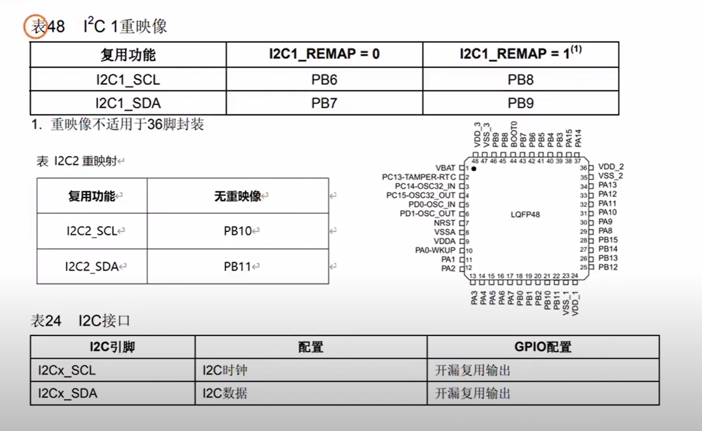
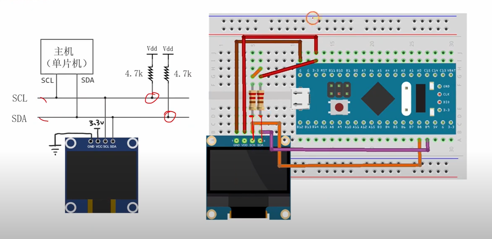
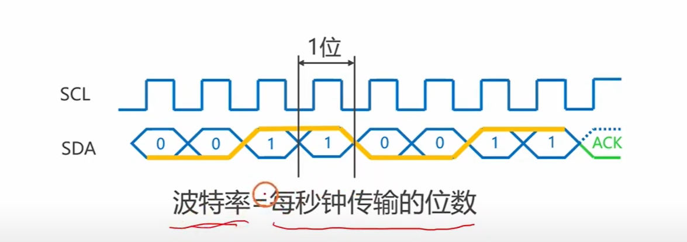
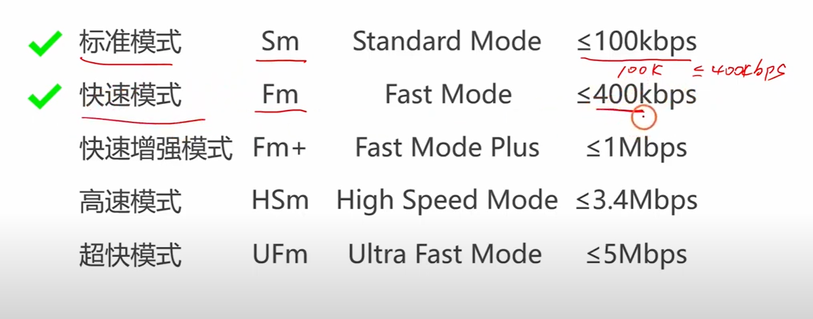
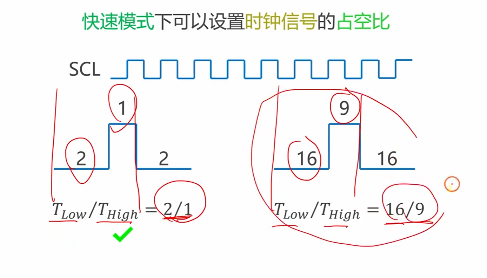
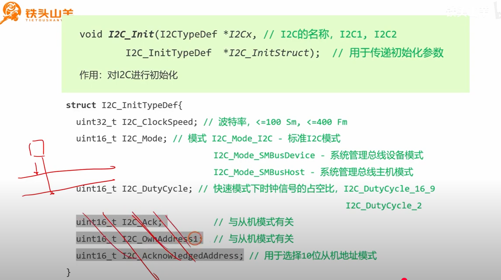
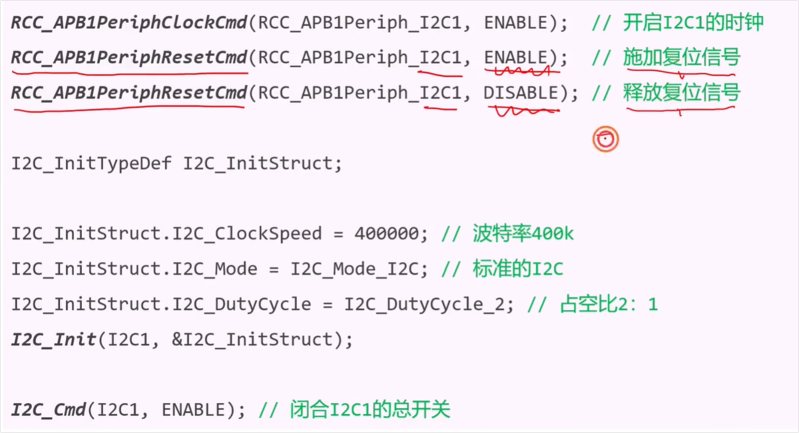

好的，这个视频非常适合作为嵌入式面试的准备材料，因为它涵盖了从理论到实践的I2C模块配置。

# 视频核心内容总结：

这个视频系统地讲解了<span style="color:#CC0000;">如何在STM32微控制器上配置和使用硬件I2C外设</span>，以<span style="color:#CC0000;">驱动一个OLED屏幕</span>为例。主要内容可以概括为以下几点：

1. **硬件基础** [[00:28](http://www.youtube.com/watch?v=wmlDV6cKM6c&t=28)]：介绍了I2C是STM32上的一个片上外设，通常有I2C1和I2C2两个模块，负责处理I2C协议的硬件逻辑。

   

2. **GPIO引脚配置** [[01:36](http://www.youtube.com/watch?v=wmlDV6cKM6c&t=96)]：这是关键一步。视频详细演示了<span style="color:#CC0000;">如何通过查阅数据手册来确定I2C的SCL和SDA引脚</span>，包括<span style="color:#CC0000;">默认引脚</span>和<span style="color:#CC0000;">**重映射（Remap）**后的引脚</span>。最重要的是，强调了<span style="color:#CC0000;">I2C引脚</span>必须<span style="color:#CC0000;">配置为**复用开漏输出（Alternate Function Open-Drain）**模式</span>。

   

3. **电路连接** [[10:02](http://www.youtube.com/watch?v=wmlDV6cKM6c&t=602)]：展示了MCU与OLED模块的实际接线，并特别强调了**上拉电阻**的必要性及其在电路中的接法。

   

   <span style="color:#CC0000;">注意：单片机上 I2C1 重映射之后的 SCL引脚为 PB8，重映射之后的 SDA引脚 为 PB9。</span>

4. **速度与模式** [[13:35](http://www.youtube.com/watch?v=wmlDV6cKM6c&t=815)]：讲解了I2C的多种速度模式，并指出STM32的硬件I2C主要支持**标准模式（100kbps）\**和\**快速模式（400kbps）**。

   

   

   <span style="color:#CC0000;">注意：上面4中模式是I2C支持的几种速度模式，后面的为波特率（传输数据的速率）。而我们的单片机只支持上面的两种模式，即标准模式和快速模式。</span>

5. **占空比** [[15:22](http://www.youtube.com/watch?v=wmlDV6cKM6c&t=922)]：解释了在快速模式下，SCL时钟的占空比可以配置为2:1或16:9两种，通常选择2:1即可。

   

   注意：只有在快速模式下才能设置时钟信号的占空比。

6. **软件初始化流程** [[17:07](http://www.youtube.com/watch?v=wmlDV6cKM6c&t=1027)]：演示了使用STM32库函数进行I2C初始化的完整代码流程，包括：**开启时钟 -> 配置GPIO -> 配置I2C参数（模式、速度、占空比等）-> 使能I2C模块**。




------


# 完整的初始化代码

```c
void My_I2C_Init(void)
{
	// #1. IO引脚初始化

	// 对I2C1进行重映射，需要开启AFIO时钟
	RCC_APB2PeriphClockCmd(RCC_APB2Periph_AFIO, ENABLE);
	GPIO_PinRemapConfig(GPIO_Remap_I2C1, ENABLE);

	// 对PB8(SCL)和PB9(SDA)进行初始化
	// 开启GPIOB时钟
	RCC_APB2PeriphClockCmd(RCC_APB2Periph_GPIOB, ENABLE);
	
	// 配置GPIO结构体
	GPIO_InitTypeDef GPIO_InitStruct;
	GPIO_InitStruct.GPIO_Pin = GPIO_Pin_8 | GPIO_Pin_9;
	GPIO_InitStruct.GPIO_Mode = GPIO_Mode_AF_OD; // 复用开漏输出
	GPIO_InitStruct.GPIO_Speed = GPIO_Speed_50MHz; // 速度选择（视频中常用50MHz）
	GPIO_Init(GPIOB, &GPIO_InitStruct);


	// #2. 初始化I2C1模块

	// 开启I2C1时钟
	RCC_APB1PeriphClockCmd(RCC_APB1Periph_I2C1, ENABLE);

	// 对I2C1进行复位，以解决某些总线挂死问题
	RCC_APB1PeriphResetCmd(RCC_APB1Periph_I2C1, ENABLE); // 施加复位信号
	RCC_APB1PeriphResetCmd(RCC_APB1Periph_I2C1, DISABLE); // 释放复位信号

	// 配置I2C结构体
	I2C_InitTypeDef I2C_InitStruct;
	I2C_InitStruct.I2C_ClockSpeed = 400000;       // 通信速率：400kHz (快速模式)
	I2C_InitStruct.I2C_Mode = I2C_Mode_I2C;         // 模式：I2C模式
	I2C_InitStruct.I2C_DutyCycle = I2C_DutyCycle_2; // 占空比：T_high/T_low = 2

	I2C_Init(I2C1, &I2C_InitStruct);

	// 使能I2C1模块
	I2C_Cmd(I2C1, ENABLE);
}
```


<span style="color:#CC0000; font-weight:bold; font-size:1.1em;">提问：</span>

<span style="color:#CC0000; font-weight:bold; font-size:1.1em;">// 对I2C1进行复位，以解决某些总线挂死问题 </span>

<span style="color:#CC0000; font-weight:bold; font-size:1.1em;"> 	RCC_APB1PeriphResetCmd(RCC_APB1Periph_I2C1, ENABLE); // 施加复位信号 </span>

<span style="color:#CC0000; font-weight:bold; font-size:1.1em;"> 	RCC_APB1PeriphResetCmd(RCC_APB1Periph_I2C1, DISABLE); // 释放复位信号 </span>

<span style="color:#CC0000; font-weight:bold; font-size:1.1em;"> 这里为什么要施加复位信号之后又释放复位信号呢，我不是太懂，如果没有的话有没有影响呢。我记得UART串口通信的时候好型没有这个复位的设置</span><span style="font-size:1.1em;"></span>

您好，这个问题提得非常深入，直接关系到嵌入式系统开发的**健壮性（Robustness）**，而不仅仅是“让功能跑起来”。

您的观察很敏锐，很多外设（比如UART）的初始化流程中确实没有这两行复位代码。但在I2C的初始化中加入它，是一个非常有用的、**防御性**的编程技巧。

------


#### 1. 这两行代码在做什么？—— “按一下硬件复位键”

首先，我们来理解这两行代码的字面意思：

- RCC_APB1PeriphResetCmd(RCC_APB1Periph_I2C1, ENABLE);

  这行代码的作用是：通过RCC（时钟控制中心）对I2C1这个外设模块施加一个复位信号。您可以把它想象成，在芯片内部，有一根复位线连接到了I2C1模块，这行代码就是把这条线置为有效，相当于按住I2C1模块专属的硬件“复位键”。<span style="color:#CC0000;">当复位信号有效时，I2C1模块内部所有的寄存器、状态机、逻辑电路都会瞬间恢复到它们上电时的初始默认状态。</span>

- RCC_APB1PeriphResetCmd(RCC_APB1Periph_I2C1, DISABLE);

  这行代码的作用是：释放刚才施加的复位信号。这相当于松开那个“复位键”。一旦复位信号被释放，I2C1模块就脱离了复位状态，可以开始正常工作了。

所以，这两行代码连在一起，完成了一次对I2C模块的**“软复位”**或**“脉冲复位”**——按住，然后立刻松开。

------


#### 2. 为什么I2C需要它？—— 解决“总线挂死”问题

现在到了最核心的问题：为什么要这么做？

这主要是为了解决I2C总线一个非常常见的问题——**总线挂死（Bus Hang）**。

**想象一个经典的“挂死”场景：**

1. 主机（你的STM32）正在和某个从机通信。
2. 通信进行到一半，比如从机正在发送一个数据字节`0x00`，此时它会将SDA线拉低。
3. 就在这个瞬间，你的STM32因为某种原因**突然复位**了（比如看门狗超时、电源 glitch、或者你用调试器重新烧写了程序）。
4. 从机并不知道主机已经复位了。从它的角度看，它只是把SDA拉低了，正在等待主机给它下一个SCL时钟信号。所以它会**一直保持SDA为低电平**。
5. 你的STM32重启完成后，开始执行`main`函数里的初始化代码。当它准备发起新的I2C通信时，它会去检查总线状态。根据I2C协议，SDA为低电平意味着**总线正忙**。
6. **问题出现了**：主机看到总线是忙的，它就无法产生一个新的“起始条件”（起始条件要求SCL和SDA都为高），于是它会一直等待，直到总线变为空闲。而从机又在一直等待主机的时钟信号。双方陷入了**“死锁”**，总线就“挂死”了。

**这两行复位代码如何提供帮助？**

虽然这个复位不能解决从机拉低SDA的问题（这个问题通常需要更复杂的总线恢复机制），但它可以确保**主机自身的I2C外设状态是干净的**。

在没有这两行代码的情况下，STM32复位后，其I2C外设可能会处于一个不确定的中间状态。当它看到SDA被拉低时，可能会认为上一次的通信还没结束，从而拒绝发起新的起始信号。

而加上了这两行代码后，我们强制将主机内部的I2C模块恢复到了“出厂设置”。无论它之前处于什么混乱的状态，现在它都变得焕然一新。这使得它在后续处理总线挂死问题时，能从一个已知的、干净的状态出发，增加了系统恢复的成功率。

如果没有这两行代码，有没有影响？

在理想情况下（每次都正常开关机，从不发生意外复位），可能完全没有影响。但是，一个商业级或工业级的嵌入式产品必须考虑各种异常情况。因此，在初始化时加入外设复位是一个良好且专业的编程习惯，它能显著提高系统的稳定性和自恢复能力。

------


#### 3. 为什么UART通信没有这个设置？

你的比较非常到位！UART之所以通常不需要这个操作，是因为它的协议性质完全不同：

- **I2C是“有状态”的总线协议**：总线有“空闲”、“忙碌”等明确的状态。总线的状态会影响到新的通信能否发起。
- **UART是“无状态”的点对点协议**：UART的TX和RX线之间没有复杂的总线状态。它的空闲状态是高电平，而低电平只代表“起始位”的开始。一个设备随时可以通过拉低TX线来发起一次新的传输，它不需要去“检查总线是否正忙”。因此，UART不存在I2C那种“总线挂死”的问题，自然也就不那么需要复位操作来解决这个问题了。


# 为你准备的经典面试问题及答案：

以下是根据视频内容和嵌入式面试的常见考点，为你准备的几个有深度的问题：

### **问题1：在STM32上配置I2C通信时，为什么必须将SCL和SDA引脚配置为“复用开漏输出（Alternate Function Open-Drain）”模式？可以配置为“推挽输出”吗？为什么？**

答案解析：

这个问题直接考察了你对I2C物理层和STM32 GPIO配置的根本理解。

- 第一部分：<span style="color:#CC0000;">为什么要配置为“复用功能（Alternate Function）”？</span>

  很简单，<span style="color:#CC6600;">因为我们要使用的不是这个引脚的普通GPIO输入输出功能，而是要把它“借给”片上的I2C硬件外设来控制。</span>配置为“复用功能”后，引脚的控制权就从GPIO数据寄存器转移到了I2C模块，<span style="color:#CC0000;">I2C硬件的状态机可以直接驱动这个引脚产生符合协议的时序。</span>

- 第二部分：<span style="color:#CC0000;">为什么要配置为“开漏输出（Open-Drain）”？</span>

  这是I2C协议的核心物理要求，主要基于以下两点：

  1. **实现“线与”逻辑，避免总线冲突**：I2C是多主多从的总线，允许多个设备挂在同一根线上。<span style="color:#CC0000;">开漏输出的特点是只能输出低电平（将线拉到地），不能主动输出高电平。高电平需要靠外部的上拉电阻来实现。</span>这样，当多个设备同时想说话时，只要有一个设备输出低电平，整条线就会被拉低。这种“一票否决”的特性就是“线与”逻辑，它完美地解决了总线仲裁问题，避免了推挽输出中一个输出高电平、一个输出低电平导致的电源对地短路风险。
  2. **实现ACK/NACK机制**：<span style="color:#CC0000;">在第9个时钟周期，主机需要释放SDA总线，让从机来应答。开漏结构使得主机可以轻易地通过停止驱动（进入高阻态）来释放总线，让从机有机会将SDA拉低以示应答。</span>

- 第三部分：<span style="color:#CC0000;">为什么不能用“推挽输出（Push-Pull）”？</span>

  绝对不能。推挽输出可以强力地驱动高电平和低电平。<span style="color:#CC0000;">如果总线上一个设备用推挽输出高电平，而另一个设备用推挽输出低电平，就会在两个芯片的输出级之间形成一个从VCC到GND的低阻抗通路，产生巨大的瞬时电流，极有可能烧毁芯片的IO端口。</span>


### **问题2：视频中提到了I2C的速度模式，STM32支持标准模式（100kbps）和快速模式（400kbps）<span style="color:#CC0000;">。如果我想让I2C工作在400kbps，除了在I2C初始化函数中设置时钟频率外，还需要注意哪些硬件和软件上的配合？</span>**

答案解析：

这个问题考察的是你是否能将软件配置与硬件限制和系统性能联系起来，体现了你的综合分析能力。

- **1. 硬件上：上拉电阻的选择至关重要。**
  - 总线速度越快，信号的上升沿就需要越陡峭。<span style="color:#CC0000;">信号的上升</span>是由<span style="color:#CC0000;">上拉电阻</span>和<span style="color:#FF0000;">总线寄生电容（所有连接设备的引脚电容+导线电容）RC充电</span>决定的。
  - <span style="color:#CC0000;">为了获得更快的上升速度（即更小的RC时间常数），我们需要使用**阻值更小**的上拉电阻。</span>比如，在100kbps下用10kΩ可能没问题，但在400kbps下，可能就需要换成2.2kΩ或4.7kΩ。
  - **面试加分项**：<span style="color:#CC0000;">但上拉电阻也不能太小，否则当引脚输出低电平时，流过电阻的灌电流会增大，增加功耗，甚至可能超过引脚的灌电流能力，导致低电平无法被拉得足够低。</span>因此，选择合适的上拉电阻是在**信号质量**和**功耗/驱动能力**之间的权衡。
- **2. 软件上：GPIO的翻转速度（Slew Rate）需要匹配。**
  - 在配置I2C引脚时，GPIO端口本身也有一个速度设置（如STM32的`GPIO_Speed_50MHz`）。这个速度代表了IO口驱动电路的最高响应频率。
  - 你必须确保GPIO的配置速度**远大于**I2C的通信速度。比如，要跑400kbps的I2C，将GPIO速度设置为2MHz或10MHz就足够了。如果GPIO速度设置得太低，引脚本身的“反应速度”跟不上I2C时钟的节拍，即使I2C模块配置对了，输出的波形也会畸变，导致通信失败。
- **3. （可选）软件上：中断处理的效率。**
  - 在高速通信中，如果使用中断方式处理数据收发，中断服务函数（ISR）的执行效率就变得很重要。如果ISR代码过于臃肿，执行时间过长，可能会来不及处理下一个字节，导致数据丢失或总线挂起。在400kbps下，一个字节的传输时间只有22.5微秒，对中断响应时间提出了更高要求。


#### 疑问点：

当然可以！您提的这个问题是嵌入式实时系统中一个非常核心且普遍的挑战。我们来把这个“22.5微秒的deadline”彻底讲清楚。


##### 1. 为什么是22.5微秒？—— 我们先来算一笔账

这个数字是这次“生死时速”的基础，理解了它，就理解了问题的紧迫性。

- **I2C速度**: 400 kbps (kilobits per second) = 400,000 bits/s
- **传输1个比特需要的时间**: 1 / 400,000 秒 = 0.0000025 秒 = **2.5 微秒 (µs)**
- **传输1个字节的数据**: I2C传输一个字节，不仅仅是8个数据位，还必须包含1个ACK/NACK的应答位。所以，一个完整的字节传输周期实际上涉及 **9个比特**。
- **传输1个字节所需的总时间**: 9 bits * 2.5 µs/bit = **22.5 µs**

这个22.5µs就是我们的**硬性截止时间（Hard Deadline）**。它代表了I2C总线上，从一个字节传输完成到下一个字节传输完成之间的时间间隔。**I2C硬件外设是不会等你的CPU的**，它会以这个固定的速率持续不断地收发数据。


##### 2. 中断处理的赛跑：一个字节的“惊险旅程”

现在，我们用一个“主机接收数据”的例子，来走一遍中断处理的全过程，看看这场“赛跑”有多激烈。

**前提**：主机正在通过I2C从从机连续读取数据。

**第0微秒：字节N到达**

- I2C硬件模块成功接收完第N个字节的全部8位，并收到了从机的ACK。
- 硬件立刻做两件事：
  1. 将接收到的数据字节N放入**数据寄存器（I2C->DR）**。
  2. 在状态寄存器中**置位一个标志**（比如`RXNE` - Receive Buffer Not Empty），并向CPU的**中断控制器（NVIC）**发出一个中断请求。
- **赛跑开始！** 与此同时，总线上的时钟并没有停，主机和从机已经开始传输**下一个字节（字节N+1）**了。

**第0~5微秒（举例）：中断延迟（Interrupt Latency）**

- CPU此时可能正在执行`main`循环里的其他代码。
- 它需要花时间来响应中断：
  1. 完成当前正在执行的指令。
  2. 将当前的重要寄存器（PC指针、状态寄存器等）**压入堆栈**。这需要好几个时钟周期。
  3. 通过中断向量表查询到中断服务函数（ISR）的地址，并**跳转**过去。
- 这个过程不是瞬时的，它会消耗宝贵的几微秒。

**第5~20微秒（举例）：中断服务函数（ISR）执行**

- 现在CPU终于开始执行你写的`I2C1_IRQHandler()`函数了。
- 在这段代码里，你**必须**做以下最核心的事情：
  1. **读取数据**：从I2C数据寄存器（`I2C->DR`）中把字节N读出来。
  2. **存入缓冲区**：将读出的数据存放到内存的一个数组（buffer）里。
  3. **清除中断标志位**：向状态寄存器写入一个值，告诉I2C硬件：“这个中断我已经处理完了，你可以放心了。”
  4. **可能还有**：更新一下数组的索引，检查是否接收完毕等。

**第20微秒之后：中断返回**

- ISR执行完毕，CPU开始将之前压入堆栈的寄存器恢复，返回到`main`循环被打断的地方继续执行。


##### 3. 如果ISR太慢会发生什么？—— 灾难场景

假设你的ISR因为代码写得太“臃肿”（比如在里面做了复杂的计算、打印，甚至延时），执行时间超过了剩下的 `22.5 - 5 = 17.5µs`，会发生什么？

- 在你的ISR还在慢悠悠地处理**字节N**的时候，I2C硬件模块已经在**第22.5微秒**的时刻，**完整地接收到了字节N+1**。
- 硬件会试图将这个新的字节N+1也放入数据寄存器（`I2C->DR`）。
- **灾难发生**：由于你还没来得及从`I2C->DR`中取走旧的字节N，它会被新的字节N+1**无情地覆盖掉**！
- **结果**：你**永久地丢失了字节N**。这种情况在硬件层面被称为**“接收溢出错误”（Overrun Error）**。


##### 4. 什么是“臃肿”的ISR？

为了保证ISR的执行效率，以下操作在中断服务函数中是**严格禁止**的：

- **任何形式的延时**：如 `HAL_Delay()` 或 `for` 循环延时。中断必须快进快出。
- **打印函数**：如 `printf()`。它的执行时间非常长且不确定。
- **复杂的数学运算**：特别是浮点数运算。
- **对其他外设的大量操作**。

**正确的ISR设计原则**：**只做最核心、最紧急的事**。通常就是“从硬件寄存器搬运数据到内存缓冲区，并更新指针/标志位”。所有对数据的处理和分析，都应该在主循环（`main`里的`while(1)`）中完成。

总结：

“22.5微秒”是硬件设定的、不可更改的铁律。中断服务函数（ISR）就像是在和硬件进行一场不能输的赛跑。为了赢得这场比赛，你的ISR必须足够“轻量”和“敏捷”，只做最关键的数据搬运工作，将所有耗时的任务都留给没有严格时间限制的主循环去处理。这就是嵌入式实时系统中处理高速通信的核心思想。


**问题3：视频中演示了I2C初始化的代码流程。请你描述一下，如果调用`I2C_Init()`函数并使能I2C后，你用示波器去观察SCL和SDA引脚，会看到什么样的波形？为什么？**

答案解析：

这个问题非常巧妙，它不问你通信时的波形，而是<span style="color:#CC0000;">问初始化刚完成、尚未通信时的状态，考察你对协议“空闲状态”的理解。</span>

- **预期波形**：你<span style="color:#CC0000;">会看到SCL和SDA两条线都稳定地保持在**高电平**。</span>
- **原因分析**：
  1. **I2C协议定义**：I2C协议明确规定，总线的**空闲状态（Idle State）**就是SCL和SDA都为高电平。<span style="color:#990000;">任何通信都必须从这个状态开始（通过起始条件），并最终回到这个状态（通过停止条件）。</span>
  2. **硬件实现**：我们<span style="color:#CC0000;">已经将SCL和SDA引脚配置为了**开漏输出**模式</span>。这意味着<span style="color:#CC0000;">I2C模块本身只能将它们拉低。当I2C模块被使能但没有发起任何通信时，它不会去驱动这两条线。</span>
  3. **上拉电阻的作用**：此时，<span style="color:#CC0000;">真正起作用的是我们外接的**上拉电阻**。这两个电阻会将SCL和SDA线各自“拉”到VCC的电平。</span>
  4. **结论**：因此，`I2C_Init()`和`I2C_Cmd()`成功执行后，I2C模块进入了待命状态，它释放了对总线的控制，由上拉电阻将总线维持在协议规定的空闲状态——即<span style="color:#CC0000;">双高电平</span>。<span style="color:#CC0000;">只有当主机调用发送函数，发起一个起始条件时，SDA的电平才会被首先拉低，波形才会开始变化。</span>

希望这些深度剖析能帮助你更自信地面对面试！祝你成功！


# 第2遍复习

## 问题1



<span style="color:#FF0000; background:#00FF80; border:1px solid #FF00FF;">左边这里为什么要对I2C1施加和释放复位信号呢，我不是太懂，你能够给我详细解释下吗？</span>

这是一个非常细节且极其重要的问题！你在看视频时注意到了这看似“多此一举”的两行代码，说明你学得非常仔细。

在 STM32 的外设初始化中，开启时钟后紧接着对该外设进行**“施加复位” (ENABLE)** 然后立刻 **“释放复位” (DISABLE)**，其实就相当于<span style="background:#00FF80;">对 I2C1 这个硬件模块执行了一次**“重启”**（也就是我们常说的“拔插头再插上”或者“按重启键”）。</span>

这样做主要有两个极其关键的原因，特别是对于 I2C 这种脾气比较“古怪”的通信协议来说，这几乎是保命的绝招：

### 1. 确保一个<span style="background:#00FF80; color:#FF0000;">绝对干净的初始状态 (防止寄存器残留)</span>

当你给单片机下载新代码，或者按下了板子上的复位按键时（这叫热启动），单片机内部的电源并没有真正断开。

- 很多时候，<span style="background:#00FF80;">外设（比如 I2C）内部的寄存器可能还保留着上一次运行时的“残余数据”或者“错误标志”。</span>
- 如果不先复位直接去配置它，这些残留的数据可能会和你的新配置发生冲突，导致各种莫名其妙的 BUG。
- **通过软件复位（先 ENABLE 压住复位键，再 DISABLE 松开复位键）**，可以强制把 I2C1 内部的所有寄存器全部清零，让它恢复到出厂默认的、最纯净的状态。然后你再去配置（填入波特率、模式等），就能保证 100% 按照你的设定来运行。

### 2. 专治 I2C 的“总线死锁”和“状态机卡死”（核心重点）

这是 I2C 协议在实际工程中最常遇到的恶心问题。

想象一下这种情况：

- 你的主机（STM32）正在和从机（比如 OLED 屏幕）愉快地通信，正好进行到一半，主机正准备读取数据。
- 此时，你突然按下了板子的复位键（或者程序崩溃重启了）。
- **结果：** 主机 STM32 是重启了，但外部的**从机并没有重启**！从机可能还傻傻地停留在刚才的阶段，甚至把 SDA 数据线死死地拉低（写 0），等着主机给它发时钟信号呢。
- 等你的 STM32 重启完毕，再次初始化 I2C 时，STM32 内部的 I2C 硬件状态机一旦检测到外部 SDA 一直是低电平，它就会觉得“总线正忙（Busy）”，从而直接卡死，再也发不出任何信号。

代码里的这两句复位命令，就是为了在初始化之前，**一锤子敲醒 STM32 内部的 I2C 状态机**，强行清除它内部一切可能卡死的异常状态，让它“忘掉过去，重新做人”。

------

### 代码动作拆解

这就好比你在操作一台死机的电脑：

- `RCC_APB1PeriphResetCmd(..., ENABLE);`  $\rightarrow$ **长按电脑机箱上的重启键不松手**。此时 I2C 模块被强行按在地上摩擦，内部所有逻辑清零。
- `RCC_APB1PeriphResetCmd(..., DISABLE);` $\rightarrow$ **松开重启键**。此时 I2C 模块如同获得了新生，干干净净地等待下面 `I2C_Init` 函数给它下达新的配置指令。

这就是为什么铁头山羊老师要在视频里特意把这两句标红的原因，<span style="background:#00FF80;">在实际开发中，加上这两句能帮你省去无数个熬夜调试“I2C死机”的夜晚。</span>

关于 I2C 初始化或者这段代码里的其他参数（比如波特率、占空比），你需要我继续为你拆解吗？

