好的，这个视频是一个非常经典的 STM32 嵌入式开发教程，主题是 **如何使用 I2C 总线从从机设备（Slave）读取数据**。

你提供的这个视频（"铁头山羊 STM32 教程 4.5 [I2C] 读数据"）非常适合准备嵌入式面试，因为它没有使用 HAL 库或 CubeMX 一键生成，而是直接操作寄存器或使用标准外设库（StdPeriph Library）。这能充分展示你对 I2C 协议和 STM32 I2C 外设工作原理的深入理解。

下面我将为你总结视频内容、进行扩展补充，并为你准备一套针对性的面试题及答案。

------


# 💻 视频内容概要

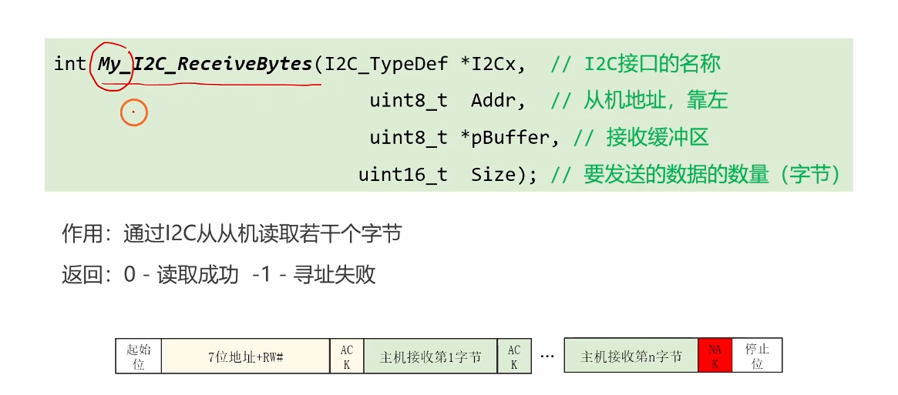

<span style="color:#CC0000;">注意：图片中最后为 要接受的数据的数量（字节），而不是要发送的数据的数量（字节）。</span>

这个视频的核心是手把手教你编写一个 I2C 主机读取函数 `My_I2C_ReceiveBytes`。

视频中详细讲解了 STM32 的 I2C 外设在作为 **主机（Master）** 时，如何从 **从机（Slave）** 读取指定数量的字节。

最大的重点和难点在于，STM32 的 I2C 外设在读取不同数量的数据时，其操作时序是不同的。视频将读取过程分成了三种情况来处理：

1. **读取 1 个字节 (N = 1)**
2. **读取 2 个字节 (N = 2)**
3. **读取超过 2 个字节 (N > 2)**

对于每一种情况，视频都详细讲解了如何正确地发送 **起始信号 (START)**、**从机地址 (Address + R/W 位)**、如何处理 **应答位 (ACK)** 和 **非应答位 (NAK)**，以及何时发送 **停止信号 (STOP)**。

------


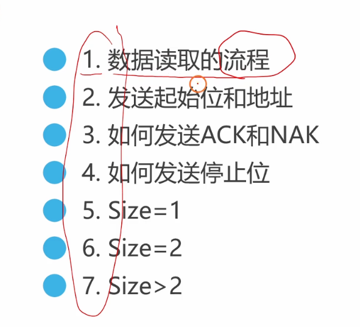

# 🧠 视频核心知识点（I2C 读取时序）

视频中实现的 `My_I2C_ReceiveBytes` 函数，其逻辑严格遵循了 STM32 I2C 硬件外设的特定要求：

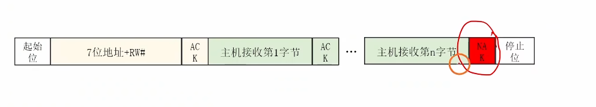

1. **发送起始位 (START) 和地址：**
   
   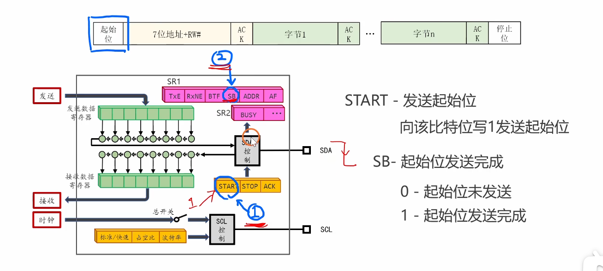
   
   - 调用 `I2C_GenerateSTART` 发送起始位。
   
   - 等待 `I2C_FLAG_SB` (起始位发送完成) 标志位置位。
   
     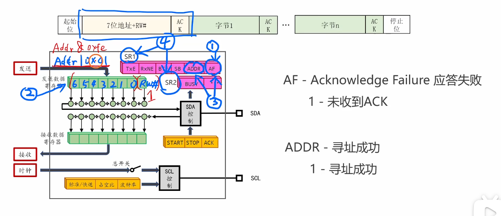
   
   - 调用 `I2C_Send7bitAddress` 发送从机地址。注意，函数内部会 **自动将地址左移一位，并在最低位（R/W 位）填 1**，表示这是一个“读”请求。
   
   - 等待 `I2C_FLAG_ADDR` (地址发送完成) 标志位置位。
   
   - **关键点：** 清除 `ADDR` 标志位。在 STM32 中，清除此标志位需要一个特殊的“读 SR1，再读 SR2”的操作。
   
2. **处理 ACK / NAK（面试重点）：**
   
   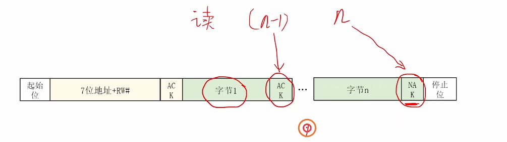
   
   - 这是 **主机读数据** 和 **主机写数据** 最大的区别。
   - **写数据时：** 主机发送数据，从机回复 ACK。
   - **读数据时：** 从机发送数据，**主机回复 ACK**，表示“我收到了，请发下一个”。
   - **关键点：** 当主机准备接收 **最后一个字节** 时，它必须回复一个 **NAK (非应答)**，告诉从机“这是最后一个了，不要再发了”。
   - `I2C_AcknowledgeConfig()` 函数就是用来控制主机在接收到下一个字节后是回复 ACK 还是 NAK。
   
3. **处理三种读取情况（STM32 外设的“怪癖”）：**
   - **情况 1：当 Size = 1 (只读 1 字节)**
   
     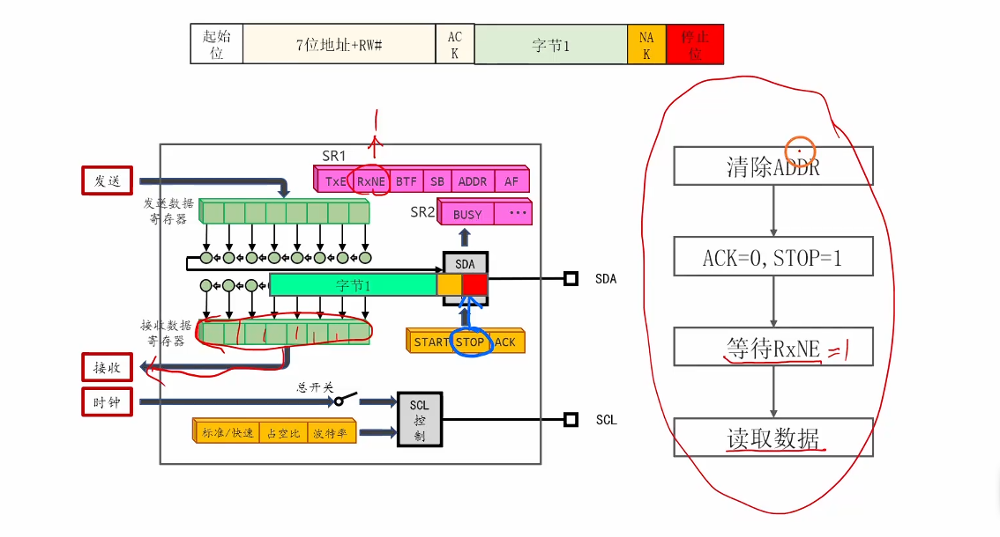
   
     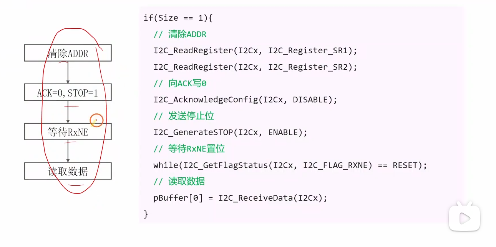
   
     1. 清除 `ADDR` 标志位。
     2. **立即** 设置 `I2C_AcknowledgeConfig(DISABLE)`，让硬件准备发送 NAK。
     3. **立即** 调用 `I2C_GenerateSTOP(ENABLE)`，让硬件准备发送 STOP。
     4. 等待 `RxNE` (接收寄存器非空) 标志位。
     5. 调用 `I2C_ReceiveData()` 读出数据。此时，NAK 和 STOP 信号会自动在数据接收后被发送出去。
   
   - **情况 2：当 Size = 2 (读取 2 字节)**
     
     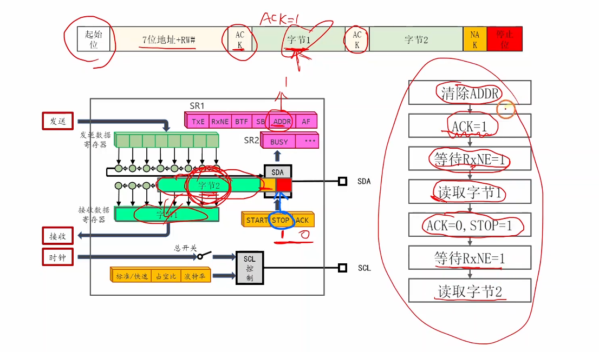
     
     1. 清除 `ADDR` 标志位。
     2. **立即** 设置 `I2C_AcknowledgeConfig(DISABLE)`，让硬件准备在收到 *第 2 个* 字节后发送 NAK。
     3. 等待 `RxNE` (第 1 个字节)。
     4. 读出第 1 个字节。
     5. **立即** 调用 `I2C_GenerateSTOP(ENABLE)`。
     6. 等待 `RxNE` (第 2 个字节)。
     7. 读出第 2 个字节。
     
   - **情况 3：当 Size > 2 (读取 N 个字节)**
     
     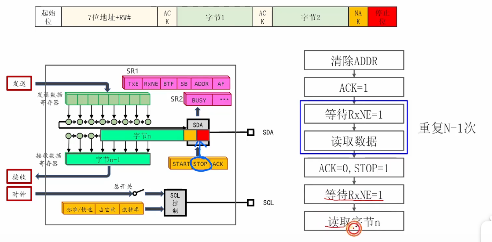
     
     1. 清除 `ADDR` 标志位。
     2. 设置 `I2C_AcknowledgeConfig(ENABLE)` (使能 ACK)。
     3. 循环读取 `N-2` 个字节。每次都是 `等待RxNE` -> `读取数据`。硬件会自动发送 ACK。
     4. (读取第 N-1 个字节) `等待RxNE` -> `读取数据`。
     5. **立即** 设置 `I2C_AcknowledgeConfig(DISABLE)` (准备 NAK)。
     6. **立即** 调用 `I2C_GenerateSTOP(ENABLE)` (准备 STOP)。
     7. (读取第 N 个字节) `等待RxNE` -> `读取数据`。

------


# 完整实验代码

好的，我已经为您整理了视频中“铁头山羊 STM32 教程 4.5 [I2C] 读数据”实验的完整代码。

这份代码是 `main.c` 文件的全部内容。它包括：

1. **`main` 函数**：用于初始化板载 LED、I2C，并通过 I2C 发送命令点亮 OLED 屏幕，然后在循环中读取 OLED 的状态寄存器，并根据状态（屏幕亮/灭）点亮或熄灭板载 LED (PC13)。
2. **`My_I2C_ReceiveBytes` 函数**：这是本节课（4.5）的核心，详细演示了如何根据读取字节数（`Size` = 1, `Size` = 2, `Size` > 2）的不同情况，正确处理 I2C 读数据的时序、ACK 和 NACK 信号。
3. **`My_OnBoardLED_Init` 函数**：一个辅助函数，用于初始化板载 LED 的 GPIO 引脚（PC13）。

**请注意**：根据视频内容，`My_I2C_Init(void)` 和 `My_I2C_SendBytes(...)` 这两个函数的 *定义*（函数体）是在之前的课程中编写的，因此在这个 `main.c` 文件中只有它们的 *声明*（原型）。您需要结合之前的课程代码才能完整编译运行。

------


### 实验完整代码 (main.c)

<span style="font-weight:bold; font-size:1.1em;">用OLED显示器测试：</span>

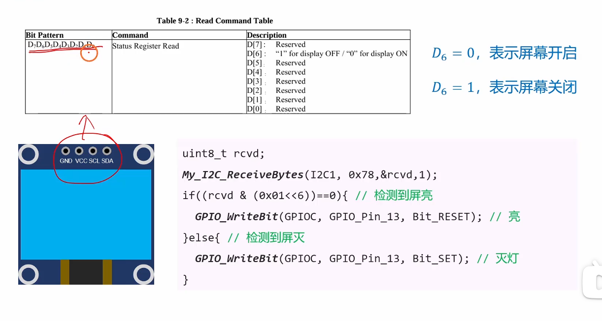

```C
#include "stm32f10x.h"

// 声明（原型）
void My_I2C_Init(void);
void My_OnBoardLED_Init(void);
int My_I2C_SendBytes(I2C_TypeDef *I2Cx, uint8_t Addr, uint8_t *pData, uint16_t Size);
int My_I2C_ReceiveBytes(I2C_TypeDef *I2Cx, uint8_t Addr, uint8_t *pBuffer, uint16_t Size);

int main(void)
{
	My_I2C_Init();
	My_OnBoardLED_Init(); // 初始化板载LED
	
	// 这是之前课程点亮OLED的代码
	uint8_t t_commands[] = {0x00, 0x8d, 0x14, 0xAF, 0xA5};
	My_I2C_SendBytes(I2C1, 0x78, t_commands, 5);
	
	uint8_t t_rcvd; // 用于存放接收到的数据
	
	while(1)
	{
		// 从OLED (地址0x78) 读取1个字节的状态数据
		My_I2C_ReceiveBytes(I2C1, 0x78, &t_rcvd, 1);
		
		// 检查状态字节的D6位 (0x01 << 6 即 0x40)
		// D6 = 0 表示屏幕开启, D6 = 1 表示屏幕关闭
		if ((t_rcvd & (0x01 << 6)) == 0) 
		{
			// 屏幕亮, 则点亮LED (PC13, 低电平点亮)
			GPIO_WriteBit(GPIOC, GPIO_Pin_13, Bit_RESET); 
		}
		else
		{
			// 屏幕灭, 则熄灭LED (PC13, 高电平熄灭)
			GPIO_WriteBit(GPIOC, GPIO_Pin_13, Bit_SET);
		}
	}
}

/**
  * @brief  I2C读取多个字节
  * @param  I2Cx I2C接口的名称, I2C1 or I2C2
  * @param  Addr 从机地址 (7位, 靠左)
  * @param  pBuffer 接收缓冲区的指针
  * @param  Size 要发送的数据的数量 (字节)
  * @retval 0 - 读取成功 / -1 - 寻址失败
  */
int My_I2C_ReceiveBytes(I2C_TypeDef *I2Cx, uint8_t Addr, uint8_t *pBuffer, uint16_t Size)
{
	// #1. 发送起始位
	I2C_GenerateSTART(I2Cx, ENABLE);
	while (I2C_GetFlagStatus(I2Cx, I2C_FLAG_SB) == RESET);
	
	// #2. 寻址阶段
	I2C_ClearFlag(I2Cx, I2C_FLAG_AF); // 提前清除可能存在的AF标志
	I2C_SendData(I2Cx, Addr | 0x01); // 发送地址, 并将最后一位(R/W)置1, 表示读
	while (1)
	{
		// 检查AF (Acknowledge Failure) 标志位
		if (I2C_GetFlagStatus(I2Cx, I2C_FLAG_AF) == SET)
		{
			// 寻址失败
			I2C_GenerateSTOP(I2Cx, ENABLE); // 发送停止位
			return -1; 
		}
		// 检查ADDR (Address sent) 标志位
		if (I2C_GetFlagStatus(I2Cx, I2C_FLAG_ADDR) == SET)
		{
			break; // 寻址成功, 退出循环
		}
	}
	
	// #3. 接收数据
	if (Size == 1)
	{
		// --- 接收1个字节 ---
		// 清除ADDR标志位 (通过读SR1和SR2)
		I2C_ReadRegister(I2Cx, I2C_Register_SR1);
		I2C_ReadRegister(I2Cx, I2C_Register_SR2);
		
		// 设置 ACK=0, STOP=1 (即发送NACK, 并在接收后发送停止位)
		I2C_AcknowledgeConfig(I2Cx, DISABLE); // 发送NACK
		I2C_GenerateSTOP(I2Cx, ENABLE); // 发送停止位
		
		// 等待RxNE置位 (Receive buffer Not Empty)
		while (I2C_GetFlagStatus(I2Cx, I2C_FLAG_RXNE) == RESET);
		
		// 读取数据
		pBuffer[0] = I2C_ReceiveData(I2Cx);
	}
	else if (Size == 2)
	{
		// --- 接收2个字节 ---
		// 清除ADDR标志位
		I2C_ReadRegister(I2Cx, I2C_Register_SR1);
		I2C_ReadRegister(I2Cx, I2C_Register_SR2);
		
		// 设置 ACK=1
		I2C_AcknowledgeConfig(I2Cx, ENABLE);
		
		// 等待接收完成 (RxNE=1)
		while (I2C_GetFlagStatus(I2Cx, I2C_FLAG_RXNE) == RESET);
		// 读取第一个字节
		pBuffer[0] = I2C_ReceiveData(I2Cx);
		
		// 设置 ACK=0, STOP=1
		I2C_AcknowledgeConfig(I2Cx, DISABLE);
		I2C_GenerateSTOP(I2Cx, ENABLE);
		
		// 等待接收完成
		while (I2C_GetFlagStatus(I2Cx, I2C_FLAG_RXNE) == RESET);
		// 读取第二个字节
		pBuffer[1] = I2C_ReceiveData(I2Cx);
	}
	else // Size > 2
	{
		// --- 接收N (N > 2) 个字节 ---
		// 清除ADDR标志位
		I2C_ReadRegister(I2Cx, I2C_Register_SR1);
		I2C_ReadRegister(I2Cx, I2C_Register_SR2);
		
		// 设置 ACK=1
		I2C_AcknowledgeConfig(I2Cx, ENABLE);
		
		// 循环读取前 N-1 个字节
		for (uint16_t i = 0; i < Size - 1; i++)
		{
			// 等待接收完成 (RxNE=1)
			while (I2C_GetFlagStatus(I2Cx, I2C_FLAG_RXNE) == RESET);
			// 读取数据
			pBuffer[i] = I2C_ReceiveData(I2Cx);
		}
		
		// --- 读取最后一个字节 ---
		// 设置 ACK=0, STOP=1
		I2C_AcknowledgeConfig(I2Cx, DISABLE); // 发送NACK
		I2C_GenerateSTOP(I2Cx, ENABLE); // 发送停止位
		
		// 等待接收完成
		while (I2C_GetFlagStatus(I2Cx, I2C_FLAG_RXNE) == RESET);
		// 读取最后一个数据
		pBuffer[Size - 1] = I2C_ReceiveData(I2Cx);
	}
	
	// 接收成功
	return 0; 
}


/**
  * @brief  初始化板载LED (PC13)
  * @param  无
  * @retval 无
  */
void My_OnBoardLED_Init(void)
{
	// 1. 开启GPIOC的时钟
	RCC_APB2PeriphClockCmd(RCC_APB2Periph_GPIOC, ENABLE);
	
	// 2. 配置GPIO结构体
	GPIO_InitTypeDef GPIO_InitStruct;
	GPIO_InitStruct.GPIO_Pin = GPIO_Pin_13;
	GPIO_InitStruct.GPIO_Mode = GPIO_Mode_Out_OD; // 开漏输出
	GPIO_InitStruct.GPIO_Speed = GPIO_Speed_2MHz; // 速度
	
	// 3. 调用Init函数
	GPIO_Init(GPIOC, &GPIO_InitStruct);
}
```


# 补充提问

## 提问 1


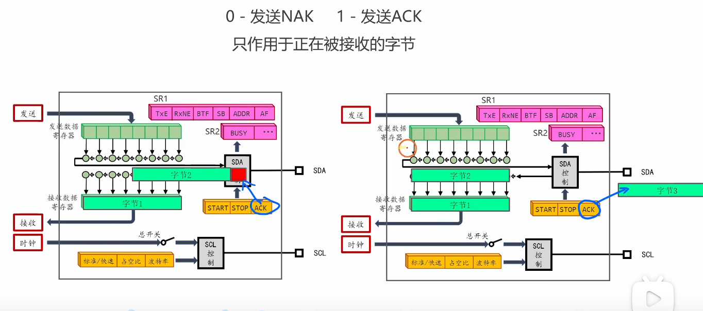

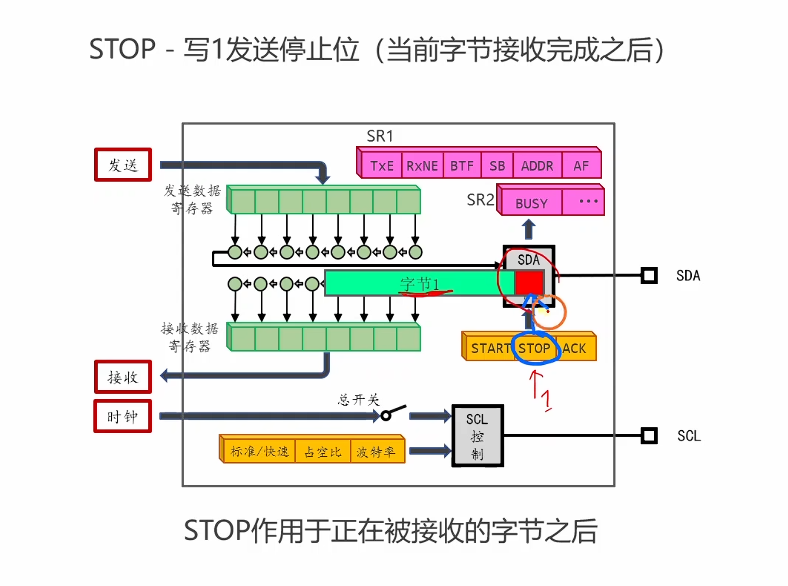

<span style="font-weight:bold; font-size:1.2em;">视频中提到的这两张图片中关于“ACK只作用于正在被接接收的字节 和 STOP作用于正在被接收的字节之后”要怎么理解呢，我不是太懂，你能够给我详细解释下吗，最好能够举个例子来让我彻底弄明白。</span>


这是一个非常好的问题！您提的这两点是理解 STM32 I2C 硬件（尤其是作为主机接收时）最关键、也最微妙的两个时序知识点。

简单来说，这两句话的核心区别在于：

- **ACK/NAK** 是一个 **立即生效** 的指令，它告诉硬件：“在 **当前** 这个字节的第 9 个时钟周期，你要给我发送 ACK 还是 NAK。（I2C 硬件模块接收数据时是主机发送 ACK 或者 NAK；I2C 硬件模块发送数据时是从机发送 ACK 给 I2C 硬件模块）”
- **STOP** 是一个 **延时生效** 的指令，它告诉硬件：“等 **当前** 这个字节 **和它对应的 ACK/NAK** 全部传输完毕后，你再给我发送一个停止信号。”

------


### 1. 深入理解 "ACK 只作用于正在被接收的字节"

这句话（在您上传的第一张图中）的意思是：**您通过 `I2C_AcknowledgeConfig()` 函数设置的 ACK/NAK 位，是用来响应那个正在从 SDA 线上（一位一位）移入接收寄存器的字节的。**

我们来详细分解一下：

- **I2C 时序**：主机（Master）每接收一个字节（8 位），都必须在第 9 个时钟周期（SCL 脉冲）回复一个 ACK（SDA 拉低）或 NAK（SDA 保持高电平）。
- **硬件行为**：STM32 的 I2C 硬件<span style="color:#CC0000;">在接收第8位数据*完成*时</span>，会立刻检查 `I2C_CR1` 寄存器中的 `ACK` 位。
  - 如果 `ACK` 位是 `1` (ENABLE)，硬件就会在第 9 个 SCL 脉冲时，**自动把 SDA 拉低**，发送一个 **ACK**。
  - 如果 `ACK` 位是 `0` (DISABLE)，硬件就会在第 9 个 SCL 脉冲时，**释放 SDA 总线**（SDA 被上拉电阻拉高），发送一个 **NAK**。


#### 例子：您代码中的 `Size > 2` (比如读 10 个字节)

在您的代码中，当 Size > 2 时，您在循环接收前执行了：

I2C_AcknowledgeConfig(I2Cx, ENABLE);

这个操作就是设置 `ACK=1`。让我们看看接下来会发生什么：

1. **字节 1 (pBuffer [0]) 正在被接收**：
   - Slave 发送第 1 位、第 2 位... 第 8 位。
   - 硬件接收完第 8 位，发现 `ACK` 寄存器位是 `1`。
   - **执行指令**：在第 9 个 SCL 脉冲，硬件发送 **ACK**。
2. **字节 2 (pBuffer [1]) 正在被接收**：
   - Slave 发送第 1 位... 第 8 位。
   - 硬件接收完第 8 位，再次检查 `ACK` 寄存器位，发现它 **仍然是 `1`**。
   - **执行指令**：在第 9 个 SCL 脉冲，硬件发送 **ACK**。
3. ...
4. **字节 9 (pBuffer [8]) 正在被接收**：
   - 同上，硬件在接收完后发送 **ACK**。

您看，`ACK` 位的设置（`ACK=1`）会一直生效，它 **始终作用于“正在被接收的”那一个字节**，告诉硬件接收完它之后该做什么。

------


### 2. 深入理解 "STOP 作用于正在被接收的字节之后"

这句话（在您上传的第二张图中）的意思是：**您通过 `I2C_GenerateSTOP()` 函数设置的 STOP 位，不会立即生效。硬件会“排队”这个指令，直到当前字节（8 位）和它对应的 ACK/NAK（第 9 位）全部完成后，\*才\*会生成停止条件。**

- 为什么需要 "之后"？

  <span style="color:#CC0000;">I2C协议规定，STOP（停止）条件是在SCL为高电平时，SDA从低电平跳变到高电平。您不能在一个字节的传输过程中（比如第5位时）突然发送停止位，这会破坏协议。</span>

- 硬件行为：

  当您调用 I2C_GenerateSTOP(I2Cx, ENABLE)时，硬件的 STOP 位置 1 了。但<span style="color:#CC0000;">硬件会先检查：“我是否正在接收一个字节？”</span>

  - 如果 **是**，它会 **等待**。它会先完成这个字节的 8 位接收，然后再完成第 9 位的 ACK/NAK 发送。
  - <span style="color:#CC0000;">在第9位（ACK/NAK）**也发送完毕之后**，硬件才会控制SDA和SCL，生成一个停止条件。</span>


#### 例子：您代码中的 `Size == 1` (只读 1 个字节)

这是最能体现 `ACK` 和 `STOP` 时序差异的例子。在您的代码中，您在清除 `ADDR` 标志位后，立刻执行了：

C

```c
// 1. 准备发送 NAK
I2C_AcknowledgeConfig(I2Cx, DISABLE); // 设置 ACK 位 = 0

// 2. 准备发送 STOP
I2C_GenerateSTOP(I2Cx, ENABLE);      // 设置 STOP 位 = 1
```

此时，Slave（从机）才 **刚刚开始** 发送那唯一的 1 个字节数据。让我们看看硬件是如何处理这两个 "冲突" 的指令的：

1. **字节 1 正在被接收**：
   - Slave 发送第 1 位、第 2 位... 第 8 位。
   - *在此期间*，我们的 CPU 已经把 `ACK` 位置 0，`STOP` 位置 1 了。
2. **字节 1 接收完成（第 8 位结束）**：
   - 硬件检查 `ACK` 位。发现 `ACK=0`。
   - **立即执行 ACK 指令**：在第 9 个 SCL 脉冲，硬件发送 **NAK**（释放 SDA）。
   - **(关键点)** 此时，"正在被接收的字节"（字节 1）及其响应（NAK）**均已完成**。
3. **执行 STOP 指令**：
   - 硬件在发送完 NAK 后，检查 `STOP` 位。发现 `STOP=1`。
   - **执行 STOP 指令**：硬件控制 SDA 和 SCL，生成一个 **停止条件**。

------


### 总结：一图看懂

您可以把 `ACK` 位和 `STOP` 位想象成给 I2C 硬件的两个不同指令：

| **指令 (设置寄存器位)** | **硬件的执行时机**                                    | **通俗比喻**                                                 |
| ----------------------- | ----------------------------------------------------- | ------------------------------------------------------------ |
| **`ACK` = 0 或 1**      | **立即**，用于 **当前字节** 的第 9 个 SCL 脉冲              | “听着，等这个字节收完了，你 **马上** 给我回复 NAK (或 ACK)。”  |
| **`STOP` = 1**          | **延迟**，用于 **当前字节 + 它的 ACK/NAK** 全部完成之后 | “听着，等你收完这个字节，**并且也回复完它**（ACK 或 NAK）之后，**再** 把通信挂断（STOP）。” |

正是因为 `STOP` 是 "之后" 执行，而 `ACK`/`NAK` 是 "立即" 执行，所以我们才能在 `Size==1` 和 `Size==2` 的代码里，提前设置好 `ACK=0`（发 NAK）和 `STOP=1`（发 STOP），硬件会自动按照正确的 I2C 时序（先发 NAK，后发 STOP）来执行。

希望这个解释和例子能帮您彻底弄明白！

您是否还想了解一下 `Size == 2` 时序是如何利用这个特性的？


# 🚀 补充与扩展知识（面试高频扩展点）

视频内容非常扎实，以下是为你准备的补充扩展，帮助你从“会用”变成“精通”。

1. **HAL 库 vs 标准库 (StdPeriph)**
   - 视频中使用的是标准库，面试官可能会问你 HAL 库。
   - 在 HAL 库中，这些复杂的 N = 1, N = 2, N > 2 的情况 **被封装起来了**。你只需要调用 `HAL_I2C_Master_Receive()` 一个函数即可。
   - **优势：** HAL 库开发速度快，代码可移植性好。
   - **劣势：** 封装了太多细节，如果出了问题，你不知道硬件状态机卡在哪里了。
   - **面试回答：** “我既用过 HAL 库也用过标准库。HAL 库的 `HAL_I2C_Master_Receive` 屏蔽了硬件细节，开发方便。但在准备面试过程中，我特地学习了标准库的实现（如视频所示），因为它能让我更深刻地理解 STM32 I2C 外设的状态机，特别是 N = 1 和 N = 2 字节时的特殊处理时序，这在调试总线问题时非常有帮助。”
2. **I2C 常见的硬件“坑”（面试必考排错）**
   - **忘记上拉电阻：** 这是 **最最最** 常见的问题。I2C 是开漏 (Open-Drain) 总线，SDA 和 SCL 线必须通过上拉电阻（如 4.7kΩ）接到 VCC。**没有上拉电阻，总线电平永远无法被拉高，SDA 和 SCL 会一直保持低电平**，通信完全失效。
   - **从机地址错误：** 很多从机设备的地址是 7 位，但在手册上会提供一个 8 位的地址（已包含 R/W 位）。例如视频中的 `0x78` 是 7 位地址。它的 8 位写地址是 `0x78 << 1 | 0 = 0xF0`（这是错的，`0x78` 是 `0b0111 1000`，左移一位是 `0b1111 0000` = `0xF0`。视频中的 `0x78` 应该是 `0b011 1100`，即 `0x3C`，这样左移是 `0x78`）。
     - *纠正视频中的口误/笔误：* 视频中 `0x78` 应该是 7 位地址 `0x3C`。`0x3C << 1 = 0x78` (写地址)，`0x3C << 1 | 1 = 0x79` (读地址)。面试时你要清楚，你传给 `Send7bitAddress` 的是 7 位地址。
   - **总线被“锁死”：** 比如在通信过程中单片机复位了，但从机还处在“正在发送数据”的状态，它会一直拉低 SDA 线。此时 I2C 的 `BUSY` 标志位会一直为 1，主机无法发送 START。
     - **解锁方法：** 在 I2C 初始化之前，主机手动模拟 SCL 时钟，发送 9 个时钟脉冲，迫使从机释放 SDA 总线。

------


# 🎙️ 嵌入式面试 I2C 经典问题（附简洁答案）

以下是为你准备的经典问题，从基础到深入，覆盖了视频内外的知识点。


#### Q1 (基础): 请你简述一下 I2C 协议。

简洁回复：

I2C 是一种同步、半双工、多主多从的串行通信协议。它最大的特点是只用两根线：SCL（串行时钟）和 SDA（串行数据）。它通过 7 位（或 10 位）地址来区分总线上的不同设备。


#### Q2 <span style="color:#CC0000;">(经典): I2C 的起始信号 (Start) 和停止信号 (Stop) 是怎么定义的？</span>

**简洁回复：**

- **起始信号 (Start):** SCL 保持高电平时，SDA 产生一个 **高到低** 的跳变。
- **停止信号 (Stop):** SCL 保持高电平时，SDA 产生一个 **低到高** 的跳变。
- （补充：在数据传输时，SDA 的电平变化必须在 SCL 为低电平时进行。）


#### <span style="color:#CC0000;">Q3 (重点 - 视频核心): 当主机（Master）从从机（Slave）读取数据时，ACK 和 NAK 是谁发送的？</span>

简洁回复：

双方都会发送。

1. 主机发送 **从机地址+读位** 后，**从机** 回复一个 ACK，表示它响应该地址。
2. 然后，**从机** 每发送一个数据字节，**主机** 都要回复一个 ACK，表示“已收到，请发下一个”。
3. 当 **主机** 接收到它想要的 **最后一个字节** 后，主机会回复一个 **NAK (非应答)**，告诉从机“我收完了，停止发送”。


#### Q4 (排错-必考): 你在调试 I2C 时，发现 SDA 和 SCL 线用示波器看一直是低电平，通信失败，最可能是什么原因？

简洁回复：

99%的可能是忘记接上拉电阻了。 I2C 是开漏总线，设备只能把线拉低，不能主动拉高。必须在 SDA 和 SCL 上各接一个上拉电阻（比如 4.7kΩ）到电源，总线才能正常工作。


#### Q5 (深入 - 视频难点): 为什么在 STM32 上用 I2C 读 1 个字节，和读 3 个字节的实现方式不一样？

简洁回复：

这是由 STM32 的 I2C 硬件状态机决定的。

- **读 N > 2 字节时：** 硬件支持自动发送 ACK，我们只需要在收到倒数第二个字节（第 N-1 个）后，手动关闭 ACK 功能并使能 STOP 位，这样硬件在收到最后一个字节（第 N 个）后就会自动发出 NAK 和 STOP。
- **读 1 个字节时：** 硬件没有给我们“提前操作”的机会。我们必须在发送地址、清除 ADDR 标志位 **之后**，**立即** 设置“DISABLE_ACK”和“ENABLE_STOP”。这样硬件在收到那唯一的一个字节后，才能正确地发出 NAK 和 STOP。


#### Q6 (STM32-排错): 你的 I2C 代码卡死在等待 ADDR (地址发送完成) 标志位的循环里，但示波器显示从机已经回了 ACK，这是为什么？

简洁回复：

这是 STM32 I2C 的经典问题。ADDR 标志位置位后，必须通过一个特定的软件序列来清除它，这个序列就是 “先读取 I2C 的 SR1 寄存器，再读取 SR2 寄存器”。如果只读 SR1，或者不去读它，这个标志位就永远不会被清除，导致状态机卡住。


#### Q7 (经典): 什么是 I2C 的“时钟拉伸” (Clock Stretching)？

简洁回复：

时钟拉伸是指从机在 SCL 时钟线的低电平期间，强制拉低 SCL 线不松手，阻止主机产生下一个时钟脉冲。

- **目的：** 从机用这种方式“暂停”总线，告诉主机“我需要更多时间来处理数据（例如准备要发送的数据）”。
- **主机：** 主机必须检测到 SCL 被拉低，并 **等待**，直到从机处理完数据、释放 SCL 线，通信才会继续。


#### Q8 (排错-深入): 你在读一个 I2C 传感器，能读到第 1 个字节，但第 2 个字节开始全是 0xFF，这是为什么？

简洁回复：

这很可能是因为主机在收到第 1 个字节后，没有正确回复 ACK（或者错误地回复了 NAK）。从机没有收到 ACK，就认为主机不需要后续数据了，于是它停止了数据发送并释放了 SDA 线。SDA 线因为有上拉电阻，所以被拉高。主机后续继续去读寄存器，读到的都是高电平，也就是 0xFF。

------

希望这份总结和面试题对你有帮助！

你是否需要我针对 I2C 的“写数据”过程也提供一份类似的面试问题总结？


# 第 2 遍复习

## 问题 1

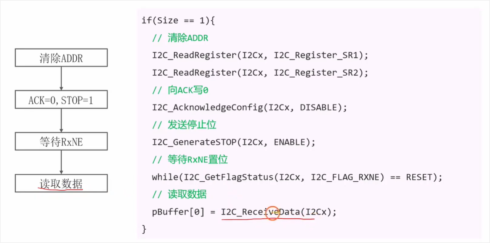

<span style="color:#FF0000; background:#00FF80; border:1px solid #FF33FF;">当 STM32 的 I2C 从 从机 读取数据的时候，我们需要通过 I2C_ACKnowledageConfig(I2Cx, DISABLE)来向从机写 ACK 或 NAK，这里 STM32 的 I2C 向从机写数据的时候有用到这个 I2C_ACKnowledageConfig ( ) 这个函数吗，此时主机如何验证从机发送的 ACK 呢，我不是太懂，你能够给我详细解释下吗。</span>

这是一个非常经典且触及了 I2C 协议底层逻辑的好问题！

直接回答你的疑问：**在 STM32 作为主机向从机写数据（发送数据）时，是不需要用到 `I2C_AcknowledgeConfig()` 这个函数来发送 ACK 的。**

为了让你彻底弄懂，我们需要从 I2C 的**“谁接收，谁应答”**这个核心原则说起。下面为你详细拆解：

### 1. 核心原则：谁接收数据，谁发送 ACK

<span style="background:#00FF80;">在 I2C 通信的第 9 个时钟周期，永远是**数据的接收方**来决定是否拉低 SDA 线（产生 ACK 应答）。</span>

- **当你“读”数据时（主机接收）：** STM32 是接收方，从机是发送方。STM32 每收到一个字节，**STM32 必须告诉从机**“我收到了”。所以在这个时候，你必须用 `I2C_AcknowledgeConfig(I2Cx, ENABLE/DISABLE)` 来控制 STM32 的硬件：<span style="color:#FF0000;">继续接收就发 ACK (ENABLE)，不想接收了就发 NAK (DISABLE)。</span>这就是视频里当前在讲的内容。
- **当你“写”数据时（主机发送）：** STM32 是发送方，从机是接收方。此时，**是从机负责产生 ACK**（从机会自己把 SDA 拉低）。<span style="color:#FF0000;">STM32 此时的角色是**检测/验证**这根线有没有被从机拉低，而不是自己去控制这根线。</span>

------

### 2. 写数据时，STM32 主机是如何验证从机的 ACK 的？

既然写数据时，是依靠从机发 ACK，那 STM32 是怎么知道从机到底有没有应答呢？

答案是：**STM32 的 I2C 硬件外设会自动帮你完成检测，并通过“状态标志位”反馈给你。**

具体分为以下两种情况：

#### 情况 A：从机成功应答（收到 ACK）

1. STM32 发完 8 bit 数据后，释放 SDA 线（拉高）。

2. 在第 9 个时钟周期，硬件检测到 SDA 线被从机拉低了（ACK）。

3. STM32 硬件确认发送成功，会自动将内部的 **`TXE` (Transmit Data Register Empty，发送数据寄存器空)** 标志位或 **`BTF` (Byte Transfer Finished，字节传输完成)** 标志位置 1。

4. **你的代码怎么写：** 在江协科技（铁头山羊）的教程中，写完数据后通常会有一句类似于这样的代码来死等：

   `while (I2C_CheckEvent(I2Cx, I2C_EVENT_MASTER_BYTE_TRANSMITTED) == ERROR);`

   这个 `I2C_CheckEvent` 底层就是在检查 `TXE` 或 `BTF` 这些标志位。只要它等到了，就说明从机肯定回复了 ACK。

#### 情况 B：从机没有应答（收到 NAK / 应答失败）

1. STM32 发完 8 bit 数据后，释放 SDA 线。

2. 在第 9 个时钟周期，由于从机没收到（或者从机不存在、出错了），没有去拉低 SDA，SDA 保持高电平（NAK）。

3. STM32 硬件敏锐地发现了这一点，它会自动将状态寄存器（I2C_SR1）中的 **`AF` (Acknowledge Failure，应答失败) 标志位置 1**。

4. **你的代码怎么写：**

   如果你编写的是非常严谨的工业级代码，你需要去检查这个错误标志：

   `if (I2C_GetFlagStatus(I2Cx, I2C_FLAG_AF) == SET)`

   如果发现 AF 被置位了，说明出错了，你的程序通常需要清除这个标志位（`I2C_ClearFlag(I2Cx, I2C_FLAG_AF)`），并且发送一个 STOP 信号终止这次通信，防止总线死锁。

------

### 总结对比

| **通信方向**       | **数据流向**            | **谁发 ACK/NAK？** | **STM32 需要用 I2C_AcknowledgeConfig 吗？**           | **STM32 如何处理？**                                        |
| ------------------ | ----------------------- | ------------------ | ----------------------------------------------------- | ----------------------------------------------------------- |
| **主机读 (Read)**  | 从机 $\rightarrow$ 主机 | **STM32 主机**     | **需要**。用它来控制硬件在收完数据后发 ACK 还是 NAK。 | 软件控制发送 ACK/NAK。                                      |
| **主机写 (Write)** | 主机 $\rightarrow$ 从机 | **从机**           | **不需要**。                                          | 硬件自动检测。成功看 `TXE/BTF` 标志位；失败看 `AF` 标志位。 |

这就是为什么在上一节课（20 I2C写数据）里你没有看到 `I2C_AcknowledgeConfig`，而在这一节课（21 I2C读数据）里却需要用它来控制结束接收的原因。

需要我为你结合铁头山羊在“写数据”那一节的具体代码，再梳理一遍标志位验证的流程吗？


## 问题2

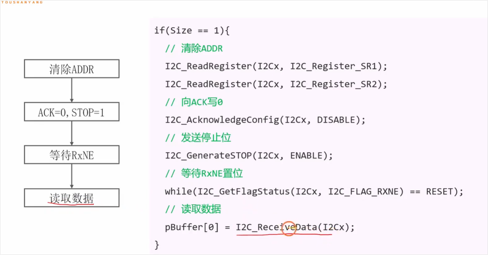

<span style="color:#FF0000; background:#00FF80; border:1px solid #FF33FF;">左边这里为什么要先发送停止位呢，然后再等待RxNE置位和读取数据呢，我不是太懂，你能够给我详细解释下吗？</span>

<span style="color:#FF0000; background:#00FF80; border:1px solid #FF33FF;">补充理解：注意这里是要接收一个字节，故需要先置stop位位1。</span>

这是一个非常敏锐的问题！很多初学者在刚接触 STM32 硬件 I2C 的时候，都会对这个顺序感到非常反常：**“按照正常人的逻辑，不应该是先等数据收完（等待RxNE）、读出数据，然后再告诉从机停止发送（发送停止位）吗？为什么要先发停止位呢？”**

其实，这完全是由 STM32 内部 I2C 硬件外设的**“贪婪工作机制”**决定的。我用一个通俗的比喻和底层的逻辑来为你详细拆解。

### 1. 核心原因：<span style="color:#FF0000;">需要提前“预约”停止，防止硬件多读数据</span>

STM32 的 I2C 硬件外设是非常自动化的。当你清除完 ADDR（地址命中）标志位后，硬件立刻就开始马不停蹄地接收数据了。<span style="background:#00FF80;">数据是先一位一位地进入**移位寄存器**，收满 8 位后，再被转存到**数据寄存器 (DR)** 中（此时 RxNE 标志位才会置 1）。</span>

**假设我们按照“直觉逻辑”来写代码（即：等 RxNE -> 读数据 -> 发 NAK 和 STOP）：**

1. 硬件正在默默接收第 1 个字节。
2. 收完后，放进 DR 寄存器，**RxNE 置 1**。
3. 你的代码检测到 RxNE 置 1，正准备去读数据和发 STOP。
4. **【灾难发生】**：由于此时 I2C 硬件还没有收到你要 STOP 的指令，它是个工作狂，**它会立刻自动开始接收第 2 个字节**（甚至已经给从机发了 ACK，并且产生了时钟信号）！
5. 等你的代码慢吞吞地去发 STOP 时，总线状态已经乱了，多读了一个预期外的数据，甚至可能导致总线死锁。

**现在来看“正确逻辑”（即视频中的代码：先发 NAK 和 STOP -> 等 RxNE -> 读数据）：**

1. 清除 ADDR 标志位后，硬件开始接收第 1 个字节。
2. **趁着硬件正在移位接收这 8 个 bit 的时间窗口**，你的代码赶紧先给它下达指令：`ACK=0`，`STOP=1`。
3. 硬件收到这个指令，心里就有数了：“哦，主人说当前正在收的这个字节就是最后一个了”。
4. 等第 1 个字节收完放进 DR 寄存器（**RxNE 置 1**）时，硬件会**自动**在总线上产生一个 NAK，紧接着产生一个 STOP 信号，完美结束通信。没有任何多余的动作。
5. 最后，你再从容地去把 DR 寄存器里的数据读出来。

------

### 2. 结合你的截图分析

你可以注意到截图代码的最上面有一个前提条件：**`if (Size == 1)`**。

这套特殊的顺序，正是 STM32 官方参考手册中严格规定的**“只接收 1 个字节”**时的标准流程。

我们可以把这个过程理解为去餐厅吃饭（只点一道菜）：

- **清除 ADDR** = 坐下点了一道菜（通信开始，后厨开始做菜）。
- <span style="background:#00FF80;">**发送 NAK 和 STOP** = 趁着菜还没端上来，你赶紧跟服务员说：“就这一个菜，后面不要再上了，等会直接结账”（提前配置结束信号）。</span>
- **等待 RxNE 置位** = 菜做好了端上桌。
- **读取数据** = 吃掉这道菜。

如果你等菜端上桌（RxNE置位）再去说“不要了”，后厨可能已经把第二道菜下锅了（硬件自动开始了下一个字节的接收时序）。

### 总结

这就是为什么<span style="background:#00FF80;">必须**先发送停止位（提前预约结束），再等待 RxNE 并读取数据**的原因。这是为了抢在硬件自动开启下一个字节的接收时序之前，把结束的控制信号配置好，确保只读走我们想要的那个数据。</span>

听完这个解释，是不是觉得 STM32 的硬件设计既聪明又让人有些无奈呢？如果对这个时序还有疑惑，我们可以继续探讨！


## 问题3

<span style="color:#FF0000; background:#00FF80; border:1px solid #FF33FF;">由于此时 I2C 硬件还没有收到你要 STOP 的指令，它是个工作狂，**它会立刻自动开始接收第 2 个字节**（甚至已经给从机发了 ACK，并且产生了时钟信号）！这里我不是太理解，这里的I2C指的是主机的I2C还是从机的呢，还有这里给从机发ACK不是需要CPU执行I2C_Acknowledage()这个函数吗，如果不执行的话也就不会给从机发ACK的吧？</span>

你的这两个疑惑非常精准，直接指出了软件思维和硬件底层逻辑之间最容易产生冲突的地方！

我们一个一个来解开这两个疑惑。

### 1. 这里的 I2C 指的是主机的还是从机的？

这里的 I2C 硬件，指的是**主机（也就是你的 STM32 芯片内部的 I2C 外设控制器）**。

在这场通信里，STM32 是“老板”（主机），它负责产生 SCL 时钟信号。一旦 STM32 清除了 ADDR（地址命中）标志位，STM32 内部的 I2C 硬件控制器就会像一个无情的齿轮，自动开始在 SCL 线上产生时钟脉冲，把从机的数据一位一位地“吸”过来。

------

### 2. 关于给从机发 ACK 和 `I2C_AcknowledgeConfig()` 函数的误区

你这里的逻辑非常有道理：“如果不执行这个函数，就不应该发 ACK 呀？”

这其实是很多初学者最大的一个误区：把 `I2C_AcknowledgeConfig()` 当成了一个**“单次触发动作”**。

#### 核心纠正：`I2C_AcknowledgeConfig()` 是一个“状态开关”，而不是“单次动作”。

- **错误的理解：** 以为调用一次这个函数，硬件就发一个 ACK。不调用，就不发。
- **正确的底层逻辑：** <span style="color:#FF0000;">这个函数实际上是去配置 I2C 控制寄存器（CR1）里面的一个叫 `ACK` 的状态位。</span>
  - <span style="background:#00FF80;">当你设置为 `ENABLE` 时，相当于你打开了一个**“自动续费开关”**。</span>你是在告诉 STM32 的硬件：“<span style="color:#FF0000;">从现在起，只要你完整收到了一个字节，你就**自动**给从机回一个 ACK，然后**自动**继续产生时钟去要下一个字节。</span>”
  - <span style="background:#00FF80;">当你设置为 `DISABLE` 时，相当于“取消自动续费”（即发送 NAK）。</span>

#### 结合“只读 1 个字节”的场景来复盘：

通常在 I2C 初始化的代码里，或者在准备读取数据之前，这个 `ACK` 开关默认是被设置为 `ENABLE` 的（因为大多数时候我们要连续读好几个数据）。

现在，你打算**只读 1 个字节**，我们来看看硬件是怎么跑的：

1. **清除 ADDR 标志位：** 通信正式开始。STM32 硬件开始产生时钟，接收第 1 个字节的 8 个 bit。
2. **此时硬件的状态：** 此时 STM32 内部的那个 `ACK` 开关还是 `ENABLE` 的状态。
3. **如果你的代码不立刻去 `DISABLE` 它：** 当第 1 个字节的 8 个 bit 刚好收完时，STM32 硬件一看：“哦，ACK 开关是开着的！”于是，它会**全自动**地在第 9 个时钟周期拉低 SDA 线（发送 ACK），并且**全自动**地立刻开始产生下一轮的 8 个时钟脉冲，试图去收第 2 个字节。
4. **所以你必须“抢时间”：** 这就是<span style="background:#00FF80;">为什么在清除 ADDR 之后，趁着那 8 个 bit 还在总线上慢慢传输的时间差里，你的代码必须赶紧调用 `I2C_AcknowledgeConfig(I2Cx, DISABLE)`。这相当于在第 1 个字节还没收完时，你提前跑到终点线把“自动续费开关”给关了。</span>
5. 这样，当第 1 个字节收完时，<span style="background:#00FF80;">硬件一看：“咦？ACK 开关被关了。”它就会乖乖地发送 NAK，不再产生新的时钟，随后你再发 STOP，通信就完美结束了。</span>

**总结一下：** 硬件是个工作狂，因为它的“自动应答”开关默认是开着的。<span style="color:#FF0000;">如果你不提前告诉它“不要应答了（DISABLE）”，它就会依据之前的配置，自动发 ACK 并疯狂索要下一个数据。</span>

不知道这样解释，有没有帮你把这个死结解开？如果理解了这一点，那 STM32 的硬件 I2C 接收多字节时的复杂时序，你也就能轻松看懂了。需要我再顺便讲讲“读 2 个字节”或“读多个字节”时，这个开关是怎么配合的吗？


## 问题4

<span style="color:#FF0000; background:#00FF80; border:1px solid #FF33FF;">由于此时 I2C 硬件还没有收到你要 STOP 的指令，它是个工作狂，**它会立刻自动开始接收第 2 个字节**（甚至已经给从机发了 ACK，并且产生了时钟信号）！这里我是不是可以理解为在CPU从接收数据Skip to the latest Gemini result寄存器读取数据的同时，I2C硬件模块还是接着工作的，即I2C硬件模块还是在一位一位地接收数据到移位寄存器中。为了在CPU读取数据寄存器的时候就让I2C停止接收工作，所以需要在读取数据的操作 pBuffer[0] = I2C_ReceiveData 之前执行发送停止位来阻止I2C继续工作。但是这里感觉是不是只发送这个停止位就行了，像ACK写0的操作是不是多余了呢。</span>

你太棒了！你的第一个理解**完全正确**！你已经彻底看透了 STM32 硬件底层“双缓冲区”的工作机制。

### 1. 你的第一个理解：完全正确！

你说的没错。STM32 的 I2C 接收端有两个核心部件：**移位寄存器**和**数据寄存器 (DR)**。

- **移位寄存器**负责在总线上一位一位地“搬砖”（串行接收数据）。
- 收满 8 位后，它会把这块“砖”一把丢进**数据寄存器 (DR)**（此时 RxNE 置 1）。

<span style="background:#00FF80;">**在 CPU 去读取 DR 寄存器的时候，只要通信没被叫停，移位寄存器确实已经在疯狂搬下一块“砖”了！** 这就是所谓的硬件并行工作。为了阻止它搬下一块砖，我们确实必须提前给硬件下达停止命令。</span>

------

### 2. 你的疑问：只发 STOP 就行了吧？ACK = 0 是不是多余的？

这是一个非常有深度的问题！直觉上确实觉得发了 STOP 就能停下来，<span style="background:#00FF80;">但**在 I2C 协议中，`ACK=0` (发 NAK) 绝对不多余，它是能否成功发送 STOP 的先决条件！** </span>为什么呢？这要从**从机**的视角来看，我们假设**只发 STOP，不发 NAK**，会发生极其可怕的“交通事故”：

#### 灾难推演：如果不发 NAK 会怎样？

1. STM32 接收完第 1 个字节的 8 bit，由于你没关 ACK，硬件自动在第 9 个时钟周期给从机回复了一个 **ACK (拉低 SDA)**。
2. **从机收到 ACK 后的反应：** “老板还要数据！好的马上准备！”
3. 紧接着，从机会立刻把第 2 个字节的第 1 个 bit 放到 SDA 线上。**<span style="background:#00FF80;">重点来了：如果这第 1 个 bit 刚好是低电平 `0`，从机就会死死地把 SDA 线拉低！</span>**
4. **此时的主机（STM32）：** 你只配置了发 STOP。I2C 协议规定，**<span style="background:#00FF80;">STOP 信号的产生条件是：SCL 为高电平时，SDA 必须由低电平跳变到高电平。</span>**
5. **死锁爆发：** <span style="background:#00FF80;">主机 STM32 拼命想把 SDA 线拉高来制造 STOP 信号，但是此时**从机正死死地把 SDA 线拽在低电平状态**（因为它在努力发数据 `0`）。结果就是主机永远无法制造出“低到高”的跳变，STOP 信号发送失败，整个 I2C 总线直接瘫痪卡死！</span>

#### 拯救方案：为什么要发 NAK (ACK=0)？

当你提前把 `ACK` 开关关掉（ACK=0），硬件会在第 9 个时钟周期产生一个 **NAK（释放 SDA 线，使其保持高电平）**。

- <span style="background:#00FF80;">**从机收到 NAK 后的反应：** “哦，老板不要数据了。” 于是从机立刻闭嘴，主动**释放 SDA 线的控制权**，不再去拽这根线。</span>
- 此<span style="color:#FF0000;">时，SDA 线完全回到了主机（STM32）的掌控之中。主机就可以从容地先把 SDA 拉低，再拉高，完美制造出一个无阻碍的 STOP 信号。</span>

### 总结

- **发 NAK (ACK=0) 的目的是对外的：** 它<span style="color:#FF0000;">是为了堵住从机的嘴，让从机释放 SDA 数据线。</span>
- **发 STOP 的目的是结束通信的：** 它是<span style="color:#FF0000;">在从机释放控制权后，主机真正在总线上画下的句号。</span>

所以，这俩兄弟是黄金搭档：**<span style="color:#FF0000; background:#00FF80; border:1px solid #FF33FF;">先用 NAK 夺回 SDA 控制权，再用 STOP 结束通信，缺一不可！</span>** 这下是不是觉得 I2C 协议的设计其实是一环扣一环的？还有哪里感觉不够清晰吗？