# 视频分析与总结

该视频是铁头山羊的STM32第四版教程 [stm32 入门教程 第四版 23 I2C封装常用功能 铁头山羊](http://www.youtube.com/watch?v=j1yI4p1kJ5c)。主要讲解了在STM32开发中，如何利用预先封装好的库函数来大幅简化 I2C（包括硬件 I2C 和软件模拟 I2C）的编程过程。作者通过实操演示，让初学者告别繁琐的底层代码，只需简单调用现成的读写接口，即可轻松实现对外接屏幕和板载LED的控制。

------

### 详细时间点解析

- **[00:00 Opens in a new window ](http://www.youtube.com/watch?v=j1yI4p1kJ5c&t=0) 课程目标与工程准备：** 作者指出之前的软硬件 I2C 代码编写过于繁琐，本节课将学习如何使用 `mlab` 库中封装好的 I2C 库函数。同时指导如何下载网盘中的模板工程，并重命名为 `fclab test` 以备测试。
- **[01:24 Opens in a new window ](http://www.youtube.com/watch?v=j1yI4p1kJ5c&t=84) 认识库文件与引脚配置：** 介绍了工程中相关的四个核心文件（`fc.h`/`fc.c` 代表硬件 I2C，`sfc.h`/`sfc.c` 中的 "s" 代表 software 软件 I2C）。随后开始编写硬件 I2C1 的底层引脚初始化代码（配置 PB6 为 SCL，PB7 为 SDA）。
- **[04:18 Opens in a new window ](http://www.youtube.com/watch?v=j1yI4p1kJ5c&t=258) 硬件 I2C 参数初始化：** 演示了如何通过结构体变量对 I2C1 进行初始化配置，包括设置 400k 的最高波特率、2:1 的占空比等，最后闭合 I2C 的总开关。
- **[06:04 Opens in a new window ](http://www.youtube.com/watch?v=j1yI4p1kJ5c&t=364) 硬件 I2C 发数据（写操作）实战：** 解析了库文件中的核心发送函数 `mifc_send_bytes`。通过编写代码向外接屏幕（从机地址 0x78）发送 5 个特定的字节数据，成功一键点亮了屏幕，展示了封装库的便捷性。
- **[09:18 Opens in a new window ](http://www.youtube.com/watch?v=j1yI4p1kJ5c&t=558) 硬件 I2C 收数据（读操作）实战：** 演示读取函数 `mifc_receive_bytes`。通过读取屏幕状态字节的第 6 位（等于 0 代表开启），来判断屏幕的当前状态，并据此控制板载的 PC13 LED 亮灭作为状态指示灯。
- **[12:50 Opens in a new window ](http://www.youtube.com/watch?v=j1yI4p1kJ5c&t=770) 更简便的软件 I2C 测试：** 作者清空了之前冗长的硬件初始化代码，开始演示软件 I2C。软件 I2C 的使用极其简单，只需指定好 SCL 和 SDA 所在的端口和引脚编号（PB6 和 PB7），然后直接调用 `sfc_send_bytes` 等对应函数即可完成读写。
- **[16:12 Opens in a new window ](http://www.youtube.com/watch?v=j1yI4p1kJ5c&t=972) 断电严谨验证：** 为了证明软件 I2C 代码真正生效，作者拔下屏幕断电使其熄灭，插回后按下单片机复位键，屏幕和 LED 再次正确亮起，证明软件 I2C 完美运行。
- **[16:50 Opens in a new window ](http://www.youtube.com/watch?v=j1yI4p1kJ5c&t=1010) 课程总结与预告：** 总结强调软件 I2C 的配置比硬件 I2C 更加方便。恭喜大家掌握了核心技术，并预告下一期将正式讲解 OLED 显示器的使用方法。

------

需要我为您检索下一期关于“OLED显示器”的教程视频并提供相关资料吗？

# 硬件I2C初始化

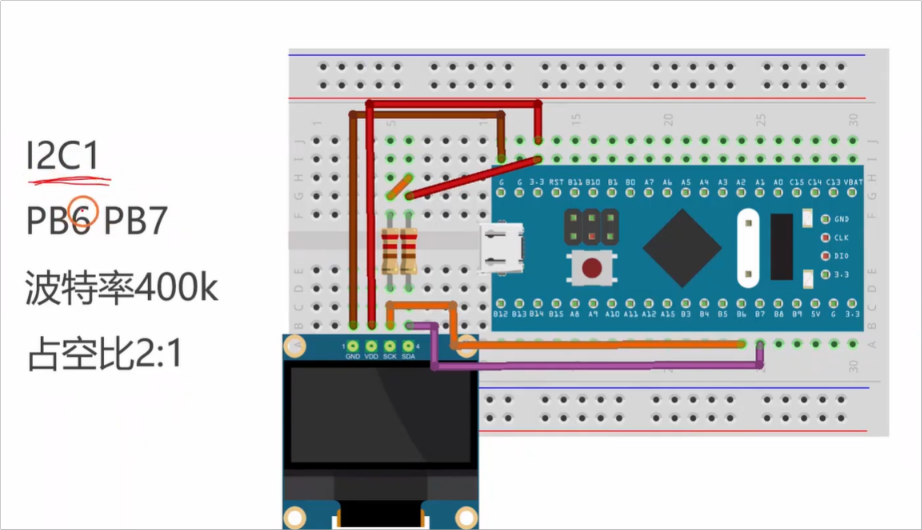

## GPIO初始化

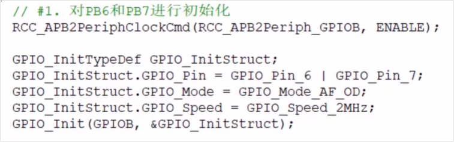

## I2C1初始化

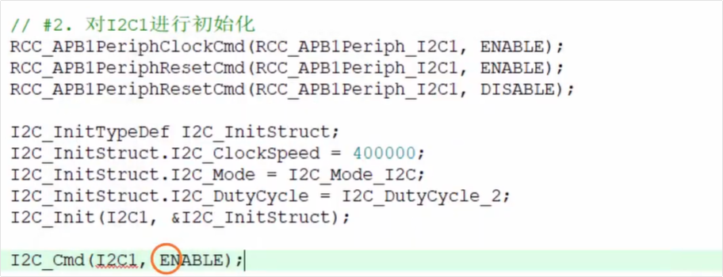

## 问题1：为什么要对I2C1进行复位操作呢

在STM32的开发中，对硬件I2C外设在初始化前进行**复位（Reset）操作**是一个非常经典且重要的防御性编程技巧。

在您截图中展示的代码（即先 `ENABLE` 复位信号，再 `DISABLE` 释放复位信号）主要有以下几个关键原因：

- **清除内部状态机，防止死锁：** STM32的硬件I2C外设对总线状态非常敏感。如果在单片机重启、调试器暂停或者总线上出现意外毛刺时，I2C的内部状态机（比如 `BUSY` 标志位）很容易卡死在一个错误的状态。如果不复位直接初始化，I2C可能根本无法正常工作。
- **确保寄存器处于纯净的默认状态：** 单片机有时会经历软复位（比如看门狗复位或代码中触发的复位），此时外设的寄存器可能残留着上一次运行时的配置参数。通过 RCC 强制对 I2C 外设进行复位，可以确保所有 I2C 相关的寄存器都被清零，回到出厂默认值，为接下来的初始化提供一个干净的环境。
- **提高代码的健壮性：** 视频作者在 **[00:04:43]** 处演示了这段代码（“先施加复位信号，然后再释放复位信号”）。这在工业级代码中是标准做法，能够极大减少因为硬件I2C“卡死”而导致的玄学Bug，让设备在各种异常重启后依然能稳定挂载I2C总线。

简而言之，这就像是给I2C外设单独按了一次“重启键”，确保它在开始工作前大脑是一片空白的，从而严格按照代码接下来设置的参数去运行。

## 硬件I2C 提供函数

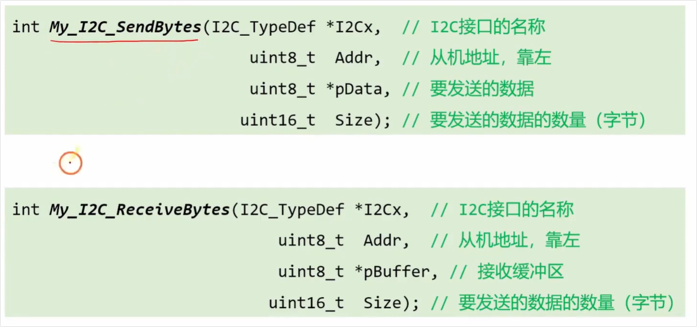

#  向OLED发送数据来点亮屏幕

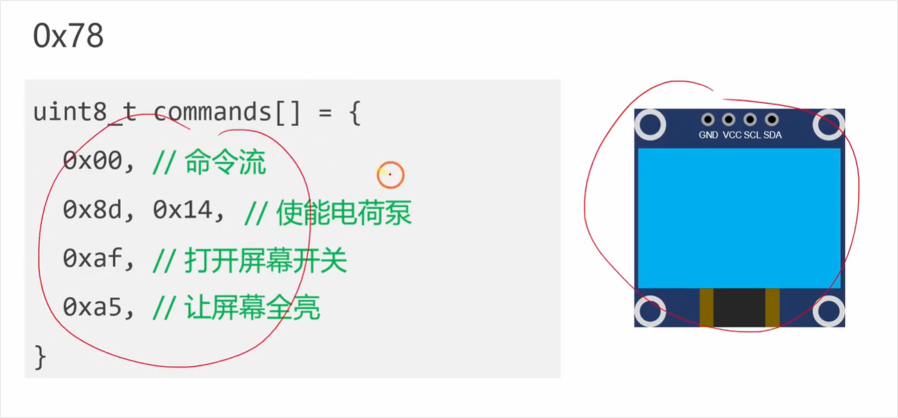

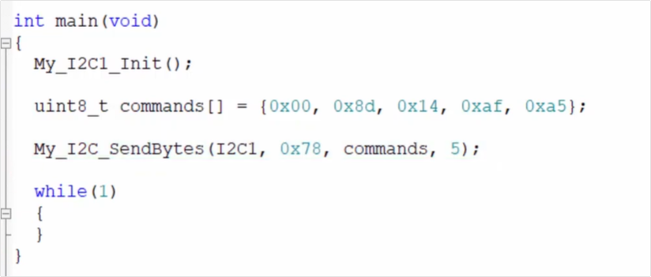

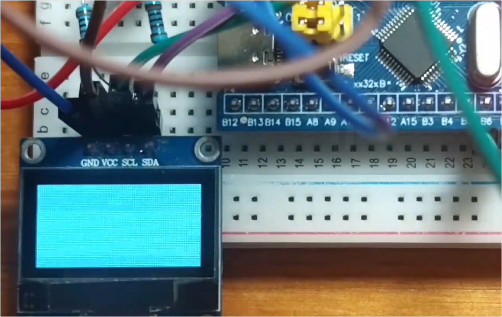

# 从OLED中读取数据

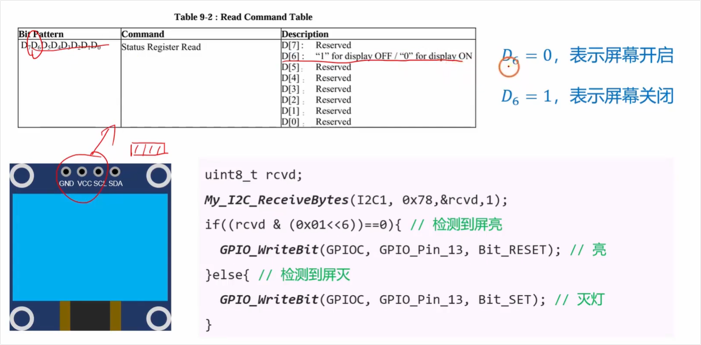

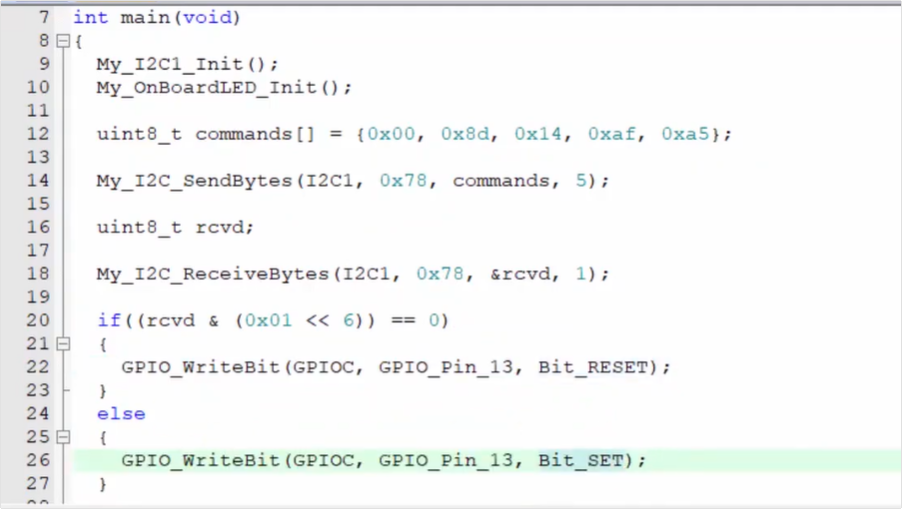

# 软件成I2C初始化

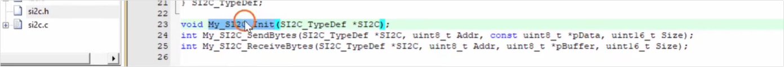

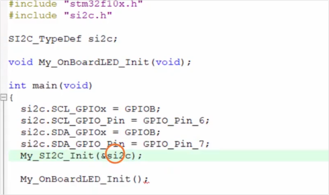
