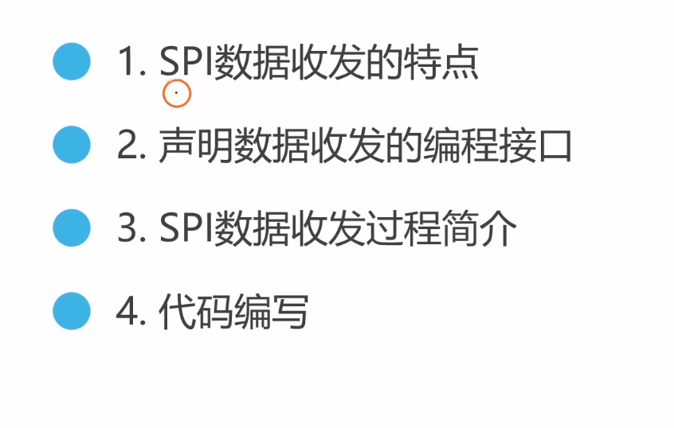
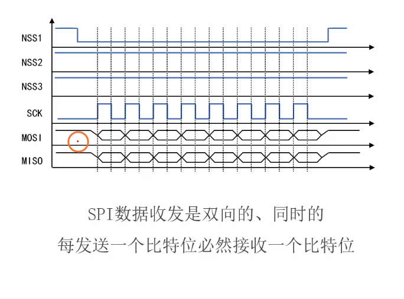
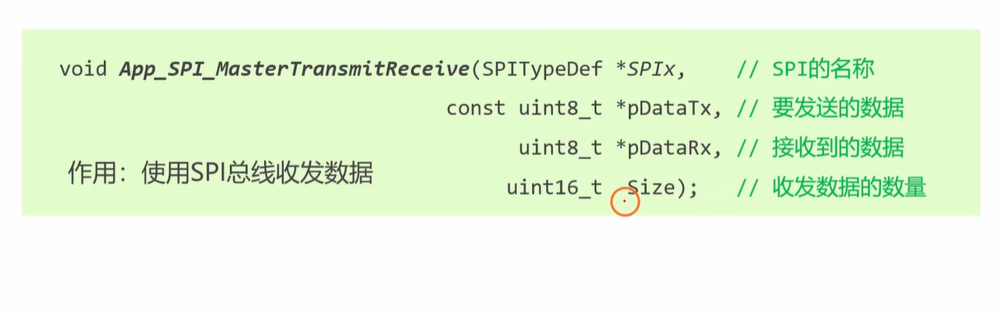
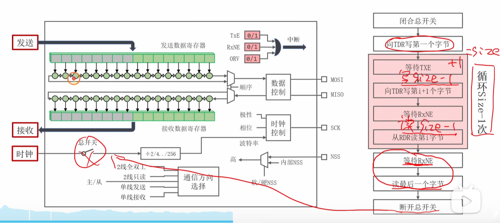
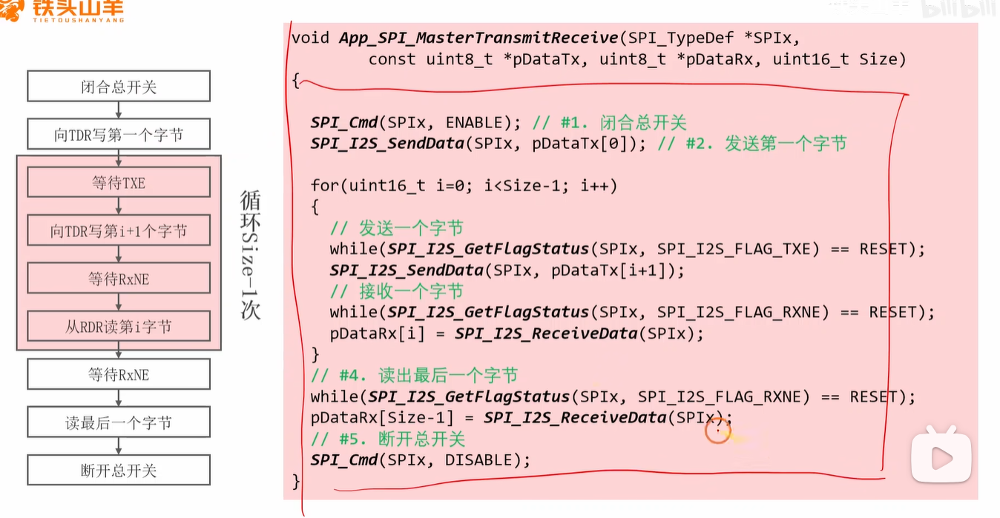

当然，这是为您翻译和整理的完整中文版本。

### 视频内容摘要

该视频教程重点讲解了如何在STM32微控制器上进行SPI数据的发送和接收。核心要点包括：

1. **核心SPI数据传输特性：** 视频中强调的最重要特性是 **SPI本质上是一个全双工协议**。这意味着主设备在MOSI线上每发送一个比特（或字节），就会同时在MISO线上接收一个比特（或字节）。这两个动作是不可分割的。

   

2. **编程接口：** 视频中提出了一个自定义函数 `App_SPI_MasterTransmitReceive` 来处理这种同步收发操作。该函数接受两个指针参数：一个指向发送缓冲区（你想要发送的数据），另一个指向接收缓冲区（用于存放接收到的数据）。

   

3. **基于轮询的传输流程：** 视频详细介绍了一种基于阻塞式（轮询）的SPI通信方法，该方法依赖于检查两个状态标志位：
   
   
   
   - **TXE (Transmit Buffer Empty - 发送缓冲区空)：** 此标志位表明发送缓冲区已空，可以接收下一个要发送的数据。
   - **RXNE (Receive Buffer Not Empty - 接收缓冲区非空)：** 此标志位表明已完整接收一个字节的数据，可以从接收缓冲区中读取。
   
4. **“哑字节”概念 (Dummy Byte):** 这是一个关键点：如果你只想从从机 *接收* 数据，你仍然 **必须向SPI数据寄存器写入** 一些东西。正是这个“写入”操作，才会产生SCK时钟信号，从机才能依据时钟把数据发送出来。在这种情况下，你发送的那个字节是什么内容无所谓，通常被称为“哑字节”（例如 `0xFF` 或 `0x00`）。

5. **代码实现：** 视频演示了如何用C语言实现这一逻辑，通过一个循环来完成以下操作：
   
   
   
   - 等待 `TXE` 标志位置位。
   - 将下一个字节写入SPI数据寄存器 (`SPI_I2S_SendData`)。
   - 等待 `RXNE` 标志位置位。
   - 从SPI数据寄存器中读出接收到的字节 (`SPI_I2S_ReceiveData`)。

------

### 深入扩展与补充信息

为了让您的理解超越视频内容，以应对更深入的问题，以下是一些关键概念的扩展：

#### **阻塞式 (轮询) vs. 非阻塞式 (中断 & DMA)**

视频中展示的是**阻塞式**（也称**轮询**）方法。CPU会卡在 `while` 循环里，空等着 `TXE` 和 `RXNE` 标志位，这期间无法执行任何其他任务，效率很低。

在实际项目中，几乎总是使用更高效的**非阻塞式**方法：

- **中断驱动的SPI：**
  - 为 `TXE` 和/或 `RXNE` 开启SPI中断。
  - 要开始传输，只需写入第一个字节，之后CPU就可以处理其他任务了。
  - 当发送缓冲区为空时，会触发 `TXE` 中断，在中断服务程序（ISR）中发送下一个字节。
  - 当接收到一个字节时，会触发 `RXNE` 中断，在ISR中读取数据。
  - **优点：** 在字节传输的间隙，CPU是自由的，效率更高。
- **DMA驱动的SPI (效率最高)：**
  - 对于传输大量数据块，DMA（直接内存访问）是最佳选择。
  - 你只需配置好DMA控制器，它就会自动地、在后台将数据从内存缓冲区搬运到SPI数据寄存器，或者从SPI数据寄存器搬运到内存缓冲区，完全无需CPU干预。
  - 整个传输过程CPU完全解放，只在所有数据传输完成后，DMA才会触发一次中断来通知CPU。
  - **优点：** 性能极高，CPU占用率极低，是高速数据记录、图形显示等应用场景的必备技术。

#### **什么是SPI“事务” (Transaction)？**

视频聚焦于字节层面的收发，但一次完整的通信序列，即一个“事务”，涉及更多步骤。一个典型的事务由**片选（CS/NSS）信号**来界定：

1. **拉低CS：** 主机将目标从机的CS线**拉为低电平**，表示选中它。
2. **交换数据：** 主机发送一个或多个字节（如命令、地址），并同时接收数据。
3. **拉高CS：** 主机将CS线**拉为高电平**，表示通信结束。

这个完整的序列（CS拉低 → 数据交换 → CS拉高）应该被视为一个**原子操作**，不应被其他SPI通信打断。

------

### 经典面试问题与简洁回复

以下问题旨在测试您从基础到实践的SPI知识掌握程度。

#### **1. 基础概念**

**问题1：SPI是全双工协议是什么意思？在编写驱动时，这最重要的实际影响是什么？**

> **答：** 全双工意味着数据可以同时发送（主→从，在MOSI线）和接收（从→主，在MISO线），并由同一个时钟同步。最重要的实际影响是：**你每发送一个字节，就必然会接收到一个字节**，反之亦然。

**问题2：我只想从一个SPI传感器读取数据，为什么仍然需要执行“写”操作？这个写入的数据叫什么？**

> **答：** 因为**SPI的主机负责产生时钟信号（SCK）**，而时钟信号只在主机发送数据时才会产生。为了让从机能够把数据传回来，主机必须主动发送一些数据来驱动时钟。这个被发送的、内容无所谓的数据被称为**“哑字节”（Dummy Byte）**。

**问题3：处理SPI数据传输有哪三种主要方式？它们的优缺点是什么？**

> **答：**
>
> 1. **轮询（阻塞式）：** 实现简单，但CPU在等待时被完全占用，效率极低。
> 2. **中断：** 比轮询高效，CPU在字节间是空闲的，但频繁的中断会带来一定的系统开销。
> 3. **DMA（直接内存访问）：** 效率最高的方式，它将整个数据传输任务从CPU中解放出来，是高速、大批量数据传输的理想选择。

#### **2. 实践与排错问题**

**问题4：在读取SPI Flash等设备时，为什么接收到的第一个字节常常是无意义的数据（如`0xFF`）？**

> **答：** 这是由SPI全双工特性决定的。第一个字节是在主机发送**命令字节**（例如“读取数据”命令）的**同时**被接收的。此时，从机才刚刚收到命令，还没来得及准备好要返回的有效数据，因此在MISO线上输出的是无效电平。真正有效的数据是从第二个字节开始接收的。

**问题5：在一次SPI“事务”中，片选（CS/NSS）信号的作用是什么？**

> **答：** 片选信号有两个主要作用：
>
> 1. **选择设备：** 在共享总线上，通过拉低特定的CS线来选择要通信的从机。
> 2. **帧定通信：** 它为一次完整的通信提供了边界。从机通过CS的下降沿知道一次事务的开始，通过上升沿知道事务的结束，这对于协议同步至关重要。

**问题6：你编写了一个基于轮询的SPI驱动，在实际产品中它有什么主要风险？你会如何规避？**

> **答：** 主要风险是：如果从设备没有响应（比如断开或损坏），程序会**永远卡在等待标志位的 `while` 循环里，导致系统死锁**。为了规避这个问题，我会实现一个**软件超时机制**：在 `while` 循环里加入一个计数器，如果循环次数超过了预设的阈值，就强制跳出循环并返回一个错误码，从而让系统能够处理异常而不是完全卡死。