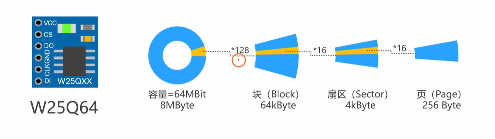
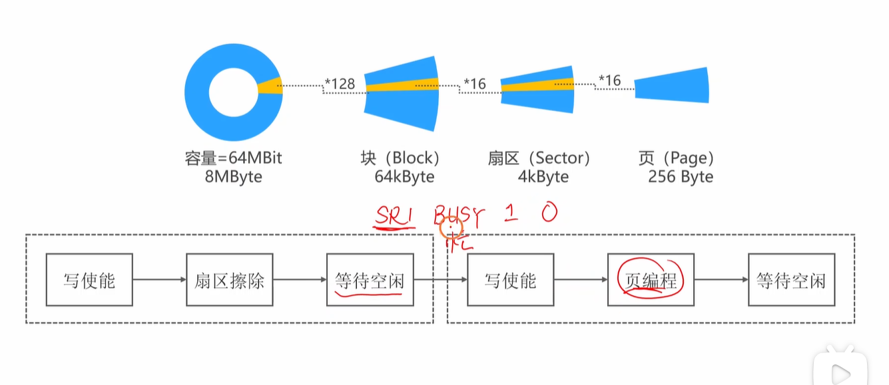
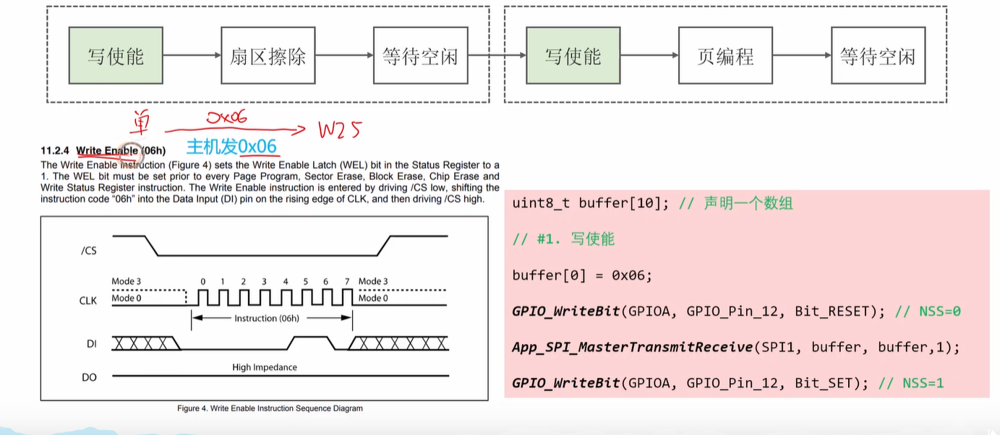

好的，这是根据您之前的要求，将我生成的英文内容完整翻译成的中文版本。


### 视频内容摘要

该视频是“铁头山羊”系列的一个实战教程，演示了<span style="color:#CC0000;">如何使用STM32微控制器与W25Q64 SPI NOR Flash存储芯片进行接口通信</span>。本次实验（上）的<span style="color:#CC0000;">主要目标是成功地向Flash写入一个字节，然后再将其读回</span>，以验证整个通信链路和存储器操作的正确性。

**视频中涵盖的关键阶段：**

1. **硬件介绍：** 展示了物理连接设置，通过面包板将STM32开发板（很可能是F103系列）与W25Q64模块相连。视频强调了SPI的连接：SCK（时钟）、MOSI（主出从入）、MISO（主入从出）和CS（<span style="color:#CC0000;">片选，由一个标准GPIO引脚PA15管理</span>）。

2. **软件初始化 (`App_SPI_Init`)**：

   - **时钟使能：** 使能<span style="color:#CC0000;">SPI外设（SPI1）</span>以及<span style="color:#CC0000;">相关的GPIO端口（GPIOA, GPIOB）</span>的<span style="color:#CC0000;">时钟</span>。

   - **GPIO配置：** 将SPI引脚（PB3-SCK, PB4-MISO, PB5-MOSI）配置为复用功能推挽输出和输入。同时，将片选引脚（PA15）配置为标准的推挽输出。

     提问：

   - **SPI外设配置：** 对SPI1外设本身进行设置，包括配置为主机模式、定义数据宽度（8位）、时钟极性（CPOL）和时钟相位（CPHA），以及设置通信速率（波特率预分频器）。

3. **W25Q64 Flash存储概念：**

   - **存储层次结构：** 解释了这块64Mbit（<span style="color:#FF0000;">8MByte</span>）的<span style="color:#FF0000;">存储器</span>是<span style="color:#FF0000;">如何分层组织</span>的：<span style="color:#FF0000;">块</span>（Block, 64KB）> <span style="color:#CC0000;">扇区</span>（Sector, 4KB）> <span style="color:#CC0000;">页</span>（Page, 256 Bytes）。

     

   - **<span style="color:#CC0000;">先擦除后写入</span>原则：** 视频着重解释了一个关键概念：对于NOR Flash，你不能直接用“1”覆盖一个“0”。<span style="color:#CC0000;">你必须首先擦除一个扇区（或块），这个操作会将所有的数据位（bit）都设置为“1”。只有这样，你才能进行“编程”（即写入），将某些位从“1”变为“0”。</span>

   

4. **Flash命令的实现：** 教程的核心是将W25Q64数据手册中的命令序列转化为C语言函数。讲解者详细地展示了实现关键操作的代码逻辑：

   - **写使能 (`0x06`)：** 在执行任何擦除或编程操作之前，发送此命令是强制性的。

     

   - **扇区擦除 (`0x20`)：** 发送此命令，并紧跟一个24位的地址，可以擦除对应的4KB扇区。

   - **读取状态寄存器 (`0x05`)：** 在发送擦除或编程命令后，芯片会进入“忙”状态。该函数用于轮询状态寄存器中的BUSY位，以判断操作何时完成。

   - **页编程 (`0x02`)：** 这是实际的写入命令。发送该命令后，紧跟一个24位地址，然后是需要写入的数据（最多256字节）。

   - **读取数据 (`0x03`)：** 发送该命令，并紧跟一个24位地址，即可从该地址开始读取数据。

5. **实战测试：** 视频最后演示了代码的编译和调试过程。讲解者通过单步执行代码，保存一个字节（`0x12`），然后将其读回到一个变量中，并在调试器中验证了读取到的值是正确的。

------

 

<span style="font-weight:bold; font-size:1.4em;">补充提问：</span>

<span style="color:#CC0000; font-size:1.3em;">提问1：我有一个问题，当引脚配置为输入浮空或者输入上拉时，此时CPU从哪个寄存器中来去读取数据；如果配置SPI的MISO引脚为复用功能输入呢（输入浮空和输入上拉应该都是可以完成接受数据的功能的吧），此时CPU从哪个寄存器中来去读取数据呢，此时CPU还是可以之前对应GPIO的那个寄存器中来进行读取数据吗？</span>

很好的问题，这正好触及了MCU内部数据路径的核心。答案是：**无论哪种输入模式，CPU都可以从GPIO的输入数据寄存器（IDR）读取引脚的瞬时电平**。但对于SPI通信，我们**不应该**这样做。

下面是简洁的解释：


<span style="font-weight:bold; font-size:1.2em;">1. 当配置为“输入浮空”或“输入上拉”时 (普通输入模式)</span>

- 从哪个寄存器读？

  CPU从 GPIOx->IDR (输入数据寄存器) 中读取数据。

- 代码实现：

  通常使用库函数 GPIO_ReadInputDataBit() 来读取，这个函数底层访问的就是IDR寄存器。

- 用途：

  用于读取按键状态、电平信号等非高速、非同步的通用场景。


<span style="font-weight:bold; font-size:1.2em;">2. 当配置为“复用功能输入”时 (SPI MISO模式)</span>

- CPU应该从哪个寄存器读？

  CPU应该从 SPIx->DR (SPI数据寄存器) 中读取。

- 代码实现：

  使用库函数 SPI_ReceiveData() 来获取数据，这个函数访问的是SPI外设的数据寄存器。

- 此时还能从GPIO的IDR寄存器读吗？

  是的，仍然可以！ 在硬件设计上，引脚的输入信号被同时送往了两个地方：

  1. 一路送往GPIO的IDR寄存器。
  2. 另一路送往SPI外设模块。

- **为什么绝不能用IDR寄存器读SPI数据？**

  - **同步问题：** SPI是**同步**通信，SPI硬件会在SCK时钟的**精确边沿**去采样MISO线上的数据。
  - **时序错乱：** 如果你用CPU去读GPIO的IDR寄存器，这是一个**异步**操作，你完全无法保证读取的时刻正好在SCK的有效边沿上，读到的数据必然是混乱和错误的。
  - **数据不完整：** SPI硬件会自动为你接收并拼装好一个完整的字节（8位），而你从IDR只能读到某一个瞬间的1位电平（IDR寄存器每一位对应一个GPIO引脚）。

**总结：**

即使引脚被复用，CPU依然保留了从GPIO的`IDR`寄存器读取其**瞬时物理电平**的能力。但对于像SPI这样的同步外设，必须从外设专属的**数据寄存器`DR`中去取由硬件精准采样并处理好的最终数据**。


<span style="color:#CC0000; font-size:1.2em;">提问2：我有一个问题，就是不同的GPIO引脚除了通用的输入输出功能之外，不是还有某些引脚会有一些特殊功能吗，比如SPI，I2C，UART，TIME，此时这个引脚指的是这个外设的具体某个引脚吗，还有就是这个GPIO引脚是如何区分是为普通的GPIO引脚还是为某个特殊功能模块的引脚的呢，如果配置为GPIO复用输出，这样当这个引脚同时有多个外设模块的功能引脚时，不会产生冲突吗，我这里有点不太懂，你能够给我详细解释下吗</span>

这是一个非常棒的问题，问到了单片机引脚设计的核心。我来为你详细解释，并尽量保持简洁。

你可以把每个多功能引脚想象成一个**复杂的十字路口**，而MCU内部有一个**交通调度员（硬件复用器MUX）**。

------


<span style="color:#CC0000; font-weight:bold; font-size:1.2em;">1.“特殊功能”是指具体的某个引脚吗？</span>

**是的，完全正确。**

当我们说PA9引脚有UART功能时，它指的是**具体的**`USART1_TX`（发送）功能，而PA10指的是`USART1_RX`（接收）。同样，`SPI1_MOSI`、`SPI1_SCK`等都是具体到某个引脚上的某个特定功能。你可以在芯片的数据手册（Datasheet）中的**“引脚复用功能映射表”**上找到所有这些对应关系。

------


<span style="color:#CC0000; font-size:1.2em; font-weight:bold;">2.GPIO引脚如何区分是“普通”还是“特殊”模式？</span>

**通过软件配置来区分。**

你在代码里通过设置GPIO的模式寄存器来告诉这个引脚“十字路口”听谁的指挥：

- 配置为通用输出 (GPIO_Mode_Out_PP)：

  这相当于你告诉引脚：“听CPU的指挥”。这时，<span style="color:#CC0000;">引脚的控制权在你写的代码手上</span>，你可以通过 GPIO_WriteBit() 函数让它输出高电平或低电平。

- 配置为复用输出 (GPIO_Mode_AF_PP)：

  这相当于你告诉引脚：“听交通调度员（外设）的指挥”。这时，引脚的控制权就交给了内部的硬件外设（比如SPI模块），CPU不再直接控制它。

------


<span style="font-weight:bold; font-size:1.2em; color:#CC0000;">3.配置为“复用输出”，多个外设功能不会冲突吗？</span>

**这是最关键的问题，答案是：不会冲突。**

因为你把引脚设置为“复用输出模式”**只是第一步**。这步操作仅仅是告诉引脚：“你现在由交通调度员（硬件复用器MUX）来管理”。

但究竟是听SPI的，还是听I2C的，还是听定时器的？这需要**下一步精确的配置**来告诉“交通调度员”该让哪条路的车通过。

**完整的配置流程其实是三步：**

1. **设置引脚模式：** `GPIO_Init()` 时，将 `GPIO_Mode` 设置为 `GPIO_Mode_AF_PP`。

   - **作用：** 告诉引脚，你的输出信号源不再是CPU，而是来自内部的“交通调度员”（复用器MUX）。

2. **配置并使能具体外设：** `SPI_Init()`、`USART_Init()` 等。

   - **作用：** 把SPI或USART这些“部门”本身准备好，让它们开始工作。

3. **配置复用功能映射 (最关键的一步！)：**

   - **作用：** 这一步就是去配置那个“交通调度员”（复用器MUX），明确告诉它：“**对于这个引脚，现在只允许SPI1_MOSI这条路的信号通过，其他所有路（如TIM1_CH1, I2C1_SCL等）全部不准通！**”

   - **代码实现：** 在较新的STM32库中（如HAL库或F4的标准库），会有一个非常明确的函数，例如 `GPIO_PinAFConfig()`。你会这样写：

     ```c
     // 假设PA5同时可以作为 SPI1_SCK 和 TIM2_CH1
     // 我想让它作为SPI1_SCK
     GPIO_PinAFConfig(GPIOA, GPIO_PinSource5, GPIO_AF_SPI1); 
     ```

     这行代码就精确地指定了PA5连接到SPI1外设。此时，TIM2（定时器2）就无法通过PA5输出任何信号了。

**总结：**

配置一个引脚为“复用功能”并不会让所有功能同时生效。它只是把引脚的控制权交给了内部的一个“调度系统”。你必须通过**额外的复用映射配置**，来明确指定**有且仅有一个**外设功能连接到该引脚上，从而完美地避免了冲突。


<span style="font-size:1.3em; font-weight:bold; color:#CC0000;">提问3：那么一个引脚不会既可以是SPI功能的某个引脚，又可以是TIME或者I2C或者是UART的某个引脚吗，此时是如何区分的呢，从代码角度来给我讲解下？</span>

你说到了点子上，这正是STM32引脚复用设计中最核心也最容易混淆的地方。

是的，**一个引脚完全可以同时是SPI、TIM、I2C、UART等多个外设的备选引脚**。

那么此时是如何区分的呢？答案很简单：**通过你的软件代码来决定，并且遵循一个核心原则：在任何一个时刻，一个引脚只能分配给一个外设功能。**

下面从代码角度来详细解释：

------

我们以一个经典的引脚 **`PA9`** 为例。查阅STM32F103的数据手册，你会发现 `PA9` 可以作为：

- `USART1_TX` (串口1的发送引脚)
- `TIM1_CH2` (定时器1的通道2)
- 等等...


<span style="font-weight:bold; font-size:1.3em;">区分方式：你初始化并使能了哪个外设，引脚就归谁用</span>

<span style="font-weight:bold; font-size:1.2em;">场景一：你想让 `PA9` 作为串口发送引脚</span>

你的代码会这样做：

1. **配置GPIO：**

   ```c
   // 将 PA9 配置为复用推挽输出
   GPIO_InitStructure.GPIO_Pin = GPIO_Pin_9;
   GPIO_InitStructure.GPIO_Mode = GPIO_Mode_AF_PP; 
   GPIO_Init(GPIOA, &GPIO_InitStructure);
   ```

2. **配置并使能USART1外设：**

   ```c
   // 使能 USART1 的时钟
   RCC_APB2PeriphClockCmd(RCC_APB2Periph_USART1, ENABLE);
   // 初始化 USART1 的参数 (波特率等)
   USART_Init(USART1, &USART_InitStructure);
   // 最终使能 USART1 模块
   USART_Cmd(USART1, ENABLE);
   ```

**结果：** 执行完这些代码后，`PA9` 引脚的控制权就**完全交给了 `USART1`**。此时它就是一个串口发送引脚，定时器 `TIM1` 跟它毫无关系。


<span style="font-weight:bold; font-size:1.2em;">场景二：你想让 `PA9` 作为定时器PWM输出引脚</span>

你的代码会这样做：

1. **配置GPIO：** (这一步和上面一样)

   ```c
   // 将 PA9 配置为复用推挽输出
   GPIO_InitStructure.GPIO_Pin = GPIO_Pin_9;
   GPIO_InitStructure.GPIO_Mode = GPIO_Mode_AF_PP;
   GPIO_Init(GPIOA, &GPIO_InitStructure);
   ```

2. **配置并使能TIM1外设：**

   ```c
   // 使能 TIM1 的时钟
   RCC_APB2PeriphClockCmd(RCC_APB2Periph_TIM1, ENABLE);
   // 初始化 TIM1 的参数 (周期、PWM模式等)
   TIM_TimeBaseInit(TIM1, &TIM_TimeBaseStructure);
   TIM_OC2Init(TIM1, &TIM_OCInitStructure); // 初始化通道2
   // 最终使能 TIM1 模块
   TIM_Cmd(TIM1, ENABLE);
   ```

**结果：** 执行完这些代码后，`PA9` 引脚的控制权就**完全交给了 `TIM1`**。此时它就是一个PWM输出引脚，`USART1` 跟它也毫无关系。


<span style="font-weight:bold; font-size:1.2em;">那么，如果我同时初始化并使能了两个外设会怎么样？—— 这就是冲突！</span>


这是一个**<span style="color:#CC0000;">编程逻辑错误</span>**。如果你在代码中同时使能了 `USART1` 和 `TIM1`（且没有进行重映射），那么这两个硬件模块就会去争夺 `PA9` 的控制权，试图同时往这个引脚上输出信号，这会导致：

- **电气冲突：** 两个驱动源互相干扰。
- **功能错乱：** 两个外设都无法正常工作。

**正确的做法是：**

在<span style="color:#CC0000;">项目规划时，**你必须做出选择**。如果你发现两个你需要**同时使用**的功能恰好占用了同一个引脚（例如你既要用`USART1`又要用`TIM1_CH2`），你就必须使用我们之前讨论的**引脚重映射（`GPIO_PinRemapConfig`）功能，将其中一个外设的整套引脚**“搬”到芯片设计好的其他备用位置去，从而避开冲突。</span>


<span style="color:#CC0000; font-size:1.4em;">提问4：</span>

<span style="color:#CC0000; font-size:1.1em;">// 假设PA5同时可以作为 SPI1_SCK 和 TIM2_CH1// 我想让它作为SPI1_SCK </span>

<span style="color:#CC0000; font-size:1.1em;"> GPIO_PinAFConfig(GPIOA, GPIO_PinSource5, GPIO_AF_SPI1); </span>

<span style="color:#CC0000;"> <span style="font-size:1.2em;">这段代码对应的标准库中的代码是什么呢，就是用来区分不同的外设的？</span></span>

非常好的问题！你注意到了一个关键点：我之前举例的 `GPIO_PinAFConfig()` 函数是用于**<span style="color:#CC0000;">较新系列</span>**的<span style="color:#CC0000;">STM32芯片</span>（如F4、L4、F7等）的，它提供了非常灵活的<span style="color:#CC0000;">逐个引脚复用功能选择</span>。

而视频中使用的<span style="color:#CC0000;">STM32F103系列芯片</span>，它的复用机制要**更简单一些**，不使用这个函数。

在STM32F1系列的标准库中，区分不同外设是通过 **“引脚重映射 (Pin Remapping)”** 机制来实现的，使用的函数是：

```
GPIO_PinRemapConfig()
```


<span style="font-weight:bold; font-size:1.2em;">它是如何工作的？</span>

F1系列的芯片不像新芯片那样，可以给一个引脚从十几个复用功能里随便选一个。它的设计是：一个外设（比如SPI1）通常有一组**默认的引脚**，和一组或几组**重映射后的引脚**。你只能在这些<span style="color:#CC0000;">固定的“套餐”</span>之间进行选择。

`GPIO_PinRemapConfig()` 函数就是用来选择使用哪个“引脚套餐”的。


<span style="font-weight:bold; color:#CC0000;">代码对比 (以视频中的SPI1为例)</span>

**1. 使用SPI1的默认引脚**

- **引脚对应:** `SCK -> PA5`, `MISO -> PA6`, `MOSI -> PA7`

- **代码:**

  ```c
  // 禁用SPI1的重映射功能，或者干脆不调用这个函数
  GPIO_PinRemapConfig(GPIO_Remap_SPI1, DISABLE); 
  ```

**2. 使用SPI1的重映射引脚 (视频中的做法)**

- **引脚对应:** `SCK -> PB3`, `MISO -> PB4`, `MOSI -> PB5`

- **代码:**

  ```c
  // 使能AFIO时钟，因为重映射功能由AFIO外设管理
  RCC_APB2PeriphClockCmd(RCC_APB2Periph_AFIO, ENABLE);
  
  // 启用SPI1的重映射功能
  GPIO_PinRemapConfig(GPIO_Remap_SPI1, ENABLE);
  ```

**总结：**

在STM32F1系列中，你**<span style="color:#CC0000;">不是为单个引脚选择一个功能</span>**，而是为**<span style="color:#CC0000;">整个外设选择一套引脚布局</span>**。通过调用`GPIO_PinRemapConfig()`，你就告诉了MCU：“SPI1不要用默认的PA5/6/7了，请切换到PB3/4/5这套引脚上来”。这样就自然地解决了冲突问题，因为一套引脚布局是固化在硬件里的，不会有歧义。

<span style="color:#FF0000;">注意：STM32F103这个系列的芯片不支持单个引脚复用为其他外设的引脚，改变引脚只能够通过`GPIO_PinRemapConfig()`这个引脚重映射函数，此时是将该外设的一整套引脚（如SPI的4个引脚）复用到另外一套引脚上。</span>


<span style="font-weight:bold; font-size:1.2em; color:#CC0000;">提问5：“ 因为一套引脚布局是固化在硬件里的，不会有歧义 ”这句话要怎么理解，我不是太懂，你能够给我详细解释下吗？</span>

好的，这个问题非常好。我们用一个简单的比喻来解释 "一套引脚布局是固化在硬件里的，不会有歧义" 这句话。


<span style="font-weight:bold; font-size:1.3em;">把它想象成在一家快餐店点“套餐”</span>

假设你去的这家快餐店（**STM32F1芯片**）菜单非常简单，关于“1号套餐”（**SPI1外设**），只有两种固定的搭配：

- **套餐A (默认套餐):** 汉堡 (`PA5`) + 薯条 (`PA6`) + 可乐 (`PA7`)
- **套餐B (优惠套餐):** 鸡块 (`PB3`) + 鸡米花 (`PB4`) + 芬达 (`PB5`)

“**固化在硬件里**” 就意味着：

1. **搭配是锁死的：** 你不能自由组合。你不能点一个汉堡(`PA5`)，再配一份鸡米花(`PB4`)。想吃汉堡，就必须搭配薯条和可乐。想吃鸡块，就必须搭配鸡米花和芬达。这些组合是厨师（芯片设计师）在设计厨房（芯片）时就定死的，你无法更改。
2. **选择是唯一的：** 你在点餐时（**写代码配置**），只需要告诉服务员（**AFIO重映射寄存器**）你要“套餐A”还是“套餐B”。


<span style="font-weight:bold; font-size:1.3em;">“不会有歧义”是什么意思？</span>

这句话的意思是，你的选择非常明确，硬件的执行结果也是唯一且确定的。

- 当你用代码 `GPIO_PinRemapConfig(GPIO_Remap_SPI1, DISABLE)` 时，就等于告诉服务员：“**我不要优惠套餐**”。
  - **结果：** 硬件**明确地、毫无疑问地**将SPI1的SCK、MISO、MOSI功能分别连接到`PA5`、`PA6`、`PA7`上。它绝不可能错误地连接到`PB3`或其他任何引脚上。
- 当你用代码 `GPIO_PinRemapConfig(GPIO_Remap_SPI1, ENABLE)` 时，就等于告诉服务员：“**我要那个优惠套餐**”。
  - **结果：** 硬件**明确地、毫无疑问地**将SPI1的SCK、MISO、MOSI功能从`PA5`、`PA6`、`PA7`上断开，然后连接到`PB3`、`PB4`、`PB5`上。

**总结：**

<span style="color:#CC0000;">对于STM32F1芯片来说，你不是在为单个引脚自由选择功能，而是在为**一整个外设**从**几个固定的“引脚组合套餐”**中选择一个。因为这些“套餐”是硬件预先定义好的，所以你的选择不会产生任何混淆或冲突。这就是“固化在硬件里，不会有歧义”的真正含义。</span>


<span style="color:#FF0000; font-size:1.2em;">提问6：我有一个问题，就是我将某个GPIO引脚复用为 UART、I2C、SPI这些通信引脚中的输入或者输出引脚时，此时CPU是通过这些外设对应的发送数据寄存器或者接收数据寄存器来控制这些引脚的输出，或者从对应的引脚中接受数据吧。这种应该是属于CPU间接控制引脚，相对于通用输入输出CPU直接控制GPIO发送数据寄存器发送数据，或者CPU从GPIO接受数据寄存器读取数据（只能够读到对应引脚的某一位，而且是瞬时的）。还有CPU就是代码的意思吧，CPU执行写入读取寄存器操作其实就是我们在代码中写的各个外设模块寄存器（从寄存器角度开发）;还有一部分就是正常读写变量，堆栈这些就是我们在和stm32内部的flash存储芯片，也就是内存在打交道是吗。我的理解对吗。</span>

你的理解**非常准确和深刻**！这套逻辑模型已经相当清晰了，完全正确。你已经抓住了嵌入式软件开发中几个最核心的概念。

我帮你把你的理解稍微梳理和补充一下，让它更系统化：


<span style="color:#FF0000; font-size:1.2em;">1. CPU对引脚的“直接控制” vs “间接控制”</span>

- **直接控制 (通用输入输出 - GPIO):**
  - **完全正确。** CPU就像一个亲力亲为的工人，直接操作 **GPIO 的数据寄存器** (`ODR`用于输出，`IDR`用于输入)。
  - **输出时：** CPU往`ODR`寄存器的某一位写1或0，引脚电平就**立即**变化。
  - **输入时：** CPU从`IDR`寄存器读取某一位，得到的是引脚**在那一瞬间**的电平状态。
- **间接控制 (复用功能 - SPI/I2C/UART):**
  - **完全正确。** CPU这时变成了“指挥官”，它不直接干活。
  - **输出时：** CPU把一整个字节的数据（比如 `'A'`）丢给**外设的数据寄存器**（比如 `SPI1->DR`）。然后，SPI硬件模块这个“专家”会自动把这个字节一位一位地、按照精确的时钟节拍（SCK）从MOSI引脚上发送出去。CPU下达完命令就不用管了。
  - **输入时：** SPI硬件模块在SCK时钟的驱动下，自动从MISO引脚一位一位地接收数据，并在内部拼装成一个完整的字节。完成后，CPU只需要从`SPI1->DR`这个寄存器里一次性把这个完整的字节取走就行了。


<span style="color:#FF0000; font-size:1.2em;">2. “CPU就是代码的意思吧”</span>

**从程序员的角度看，这么理解是完全可以的。**

更精确一点说：

- **代码** 是我们用高级语言（如C语言）编写的，给CPU下达的**指令集**。
- **CPU** 是**执行这些指令的物理硬件**。

我们写的每一行C代码，最终都会被编译器翻译成CPU能懂的一条或多条机器指令（比如加载、存储、运算）。所以你说“CPU执行...就是我们在代码中写的...”，这个逻辑是完全通顺的。我们通过代码来指挥CPU去操作寄存器。


<span style="color:#FF0000; font-size:1.2em;">3. “读写变量、堆栈就是在和内部Flash（相当于电脑硬盘）、内存（内部SRAM）打交道”</span>

**这个理解也完全正确，非常棒！** 这正好区分了MCU内部的两个核心部分：**处理器核心**与**存储系统**。

我们可以把CPU的交互对象分为两大类：

- **<span style="color:#FF0000;">一类是与“内部世界”打交道，即内存和存储器</span>：**
  - **内部Flash：** 存放你的**程序代码**（编译后的机器指令）和**只读常量**（`const`变量）。它的特点是掉电不丢失。
  - **内部SRAM (RAM)：** 存放你的**全局/静态变量**、**局部变量**和**堆栈**。它的特点是速度快，但掉电后数据会丢失。
  - 当你写 `int a = 10; a++;` 这样的代码时，CPU就是在通过**内存总线**和SRAM进行高速的数据交换。
- **另一类是与“外部世界”打交道，即外设：**
  - **GPIO/SPI/UART等外设寄存器：** 这些寄存器虽然也在MCU的地址空间里，但它们的作用不是存变量，而是像一个个**控制面板上的开关和指示灯**。
  - 当你写 `SPI1->DR = 0xAA;` 这样的代码时，CPU是在通过**外设总线（APB/AHB）**去“拨动”SPI模块上的一个开关，从而触发一次硬件通信。

**总结：**

你的理解已经形成了一个非常清晰的逻辑闭环。简单来说，MCU的工作就是：**CPU作为大脑，执行存放在Flash里的代码指令，使用SRAM作为草稿纸来处理变量和堆栈，并通过读写外设寄存器来感知和控制外部世界。** 你的理解非常到位！


### 知识补充与扩展

以下是在视频内容基础上的一些更深入的见解和相关概念。

- **为什么选择SPI接口连接Flash存储器？**
  - **速度：** SPI是一种同步、全双工的协议，能够达到非常高的速度，通常可达几十MHz。这对于需要快速读写大量数据的应用至关重要，例如从Flash启动处理器、存储高清图像资源等。
  - **简单性：** 协议本身比I2C更简单。总线上没有复杂的地址机制，设备选择由一条专用的片选线（CS）处理，这使得硬件和软件实现都相对直接。
- **状态寄存器的关键作用（轮询 vs. 中断）：**
  - 视频中使用了一个`while`循环来不断检查状态寄存器的BUSY位。这种方法称为**轮询（Polling）**。
  - **轮询的优点：** 实现和理解起来非常简单。
  - **轮询的缺点：** 效率极低。在等待Flash芯片完成其擦除/编程周期时（这可能需要数毫秒，对于高速微控制器来说是极长的时间），CPU被困在`while`循环中，消耗着功耗，无法执行其他任务。
  - **替代方案：** 在一个更复杂的实时系统中，更好的方法是使用**中断**。你可以启动擦除/编程操作，然后让CPU去处理其他事情。虽然W25Q64没有专用的中断输出引脚，但更常见的高级方法是使用一个定时器中断来周期性地检查状态寄存器，从而将主循环从阻塞中解放出来。或者使用DMA（直接存储器访问）配合传输完成中断来处理SPI通信，完全不占用CPU时间。
- **软件 vs. 硬件片选（NSS管理）：**
  - 视频中正确地使用了一个标准的GPIO引脚作为片选，并手动控制它（`GPIO_WriteBit`）。这被称为**软件NSS管理**。
  - **为什么这么用？** 它提供了最大的灵活性。你可以使用任何GPIO引脚作为CS线，并且这是在同一SPI总线上管理多个从设备的唯一实用方法（每个从设备都需要自己独立的CS线）。
  - **硬件NSS管理**是另一种选择，由SPI外设自身自动控制NSS引脚。它在传输开始时自动将NSS拉低，结束时拉高。这种方式不太常见，因为它灵活性较差，通常用于特定的单从设备或多主机配置。
- **SPI模式（CPOL & CPHA）：**
  - W25Q64的数据手册中提到它支持**模式0（Mode 0）\**和\**模式3（Mode 3）**。这是一个基础且重要的SPI概念。
  - **CPOL (Clock Polarity, 时钟极性):** 定义时钟信号在空闲状态下的电平。`CPOL=0`表示时钟空闲时为低电平。`CPOL=1`表示时钟空闲时为高电平。
  - **CPHA (Clock Phase, 时钟相位):** 定义数据在时钟的哪个边沿被采样。`CPHA=0`表示在第一个时钟边沿采样数据。`CPHA=1`表示在第二个时钟边沿采样数据。
  - **四种模式总结：**
    - **模式 0:** CPOL=0, CPHA=0 (空闲低电平，第一个边沿即上升沿采样)
    - **模式 1:** CPOL=0, CPHA=1 (空闲低电平，第二个边沿即下降沿采样)
    - **模式 2:** CPOL=1, CPHA=0 (空闲高电平，第一个边沿即下降沿采样)
    - **模式 3:** CPOL=1, CPHA=1 (空闲高电平，第二个边沿即上升沿采样)
  - 为了保证通信成功，主机（STM32）和从机（W25Q64）必须配置为相同的模式。

------


### 面试问题与简洁回答


以下是基于视频内容，从基础到进阶的一系列面试问题，旨在考察深层次的理解。

**问题1：基础知识**

- **问：** “你在使用像W25Q64这样的SPI NOR Flash时，为什么在‘页编程’（写入）新数据之前，必须先执行‘扇区擦除’操作？”
- **答：** 这是由NOR Flash的物理特性决定的。一次“编程”或“写入”操作只能将数据位（bit）从‘1’变为‘0’，而无法将‘0’变回‘1’。“擦除”操作是唯一能将一个扇区或块中所有位都恢复到默认‘1’状态的方法，这样才能为下一次编程做好准备。

**问题2：协议机制**

- **问：** “视频中，片选（CS）线是通过GPIO函数手动控制的。这种技术叫什么？STM32的SPI外设提供了什么替代方案？为什么手动控制的方式更常用？”
- **答：** 这种技术叫做**软件NSS（从设备选择）管理**。替代方案是**硬件NSS管理**，即由SPI外设自动控制NSS引脚。软件方式更常用，因为它更灵活，允许使用任意GPIO作为CS引脚，并且是在单个SPI总线上控制多个从设备时必不可少的，因为每个从设备都需要一条独立的CS线。

**问题3：系统效率与设计**

- **问：** “在发送擦除命令后，代码进入一个`while`循环，重复读取状态寄存器来检查BUSY位。这种技术叫什么？它的主要缺点是什么？在一个不能容忍CPU等待的实时系统中，你会如何实现一个更高效的方案？”
- **答：** 这种方法叫做**轮询（Polling）**。它的主要缺点是它属于**阻塞式操作**——CPU被卡在循环里，无法执行其他任务，浪费了宝贵的处理时间。一个更高效的方案是**非阻塞式**的。例如，可以使用一个定时器周期性地触发中断来检查状态寄存器，或者使用DMA（直接存储器访问）控制器配合传输完成中断来处理SPI通信，从而完全解放CPU。

**问题4：数据手册解读与调试**

- **问：** “W25Q64数据手册说它支持SPI模式0和模式3。请简要解释这两种模式的区别。如果你的通信失败，读到了乱码，你会首先检查哪些SPI设置？”
- **答：** 模式0和模式3都在时钟的**上升沿**采样数据。它们唯一的区别在于时钟的空闲状态：**模式0的时钟空闲时是低电平（CPOL=0）**，而**模式3的时钟空闲时是高电平（CPOL=1）**。如果我读到乱码，我会首先检查：
  1. **SPI模式：** 确保STM32（主机）的CPOL/CPHA设置与数据手册的要求一致。
  2. **时钟速率：** 从设备可能不支持主机配置的那么高的通信速度，我会尝试降低SPI的波特率。
  3. **数据顺序：** 确保主机和从机都同意是MSB（最高位）优先还是LSB（最低位）优先传输。

**问题5：高级应用设计**

- **问：** “假设你需要实现一个数据记录仪，频繁地（例如每100毫秒）将传感器数据（一个32字节的数据包）存入W25Q64。如果每次写入32字节都去擦除一个4KB的扇区，效率会极低且很快会耗尽Flash寿命。请描述一个更稳健、更高效的数据记录策略。”
- **答：** 一个稳健的策略会引入**RAM缓冲区**和**写指针**。
  1. **缓冲：** 我会在STM32的RAM中创建一个256字节的缓冲区，这正好对应Flash的一个页（Page）大小。
  2. **追加：** 每次采集到的32字节数据都追加到这个RAM缓冲区中。
  3. **页编程：** 一旦RAM缓冲区满了（8次采集后），我就执行一次**页编程**操作，将这256字节一次性写入Flash。
  4. **指针管理：** 我会维护一个指向下一个可用页地址的指针（可以存在Flash的固定位置或RAM中）。每次写入后，我递增这个指针。当指针到达一个扇区的末尾时，我会寻找下一个可用的扇区，执行一次扇区擦除，然后将页指针重置到这个新扇区的起始位置。这种方法能极大减少擦除次数，显著提高效率和Flash寿命。