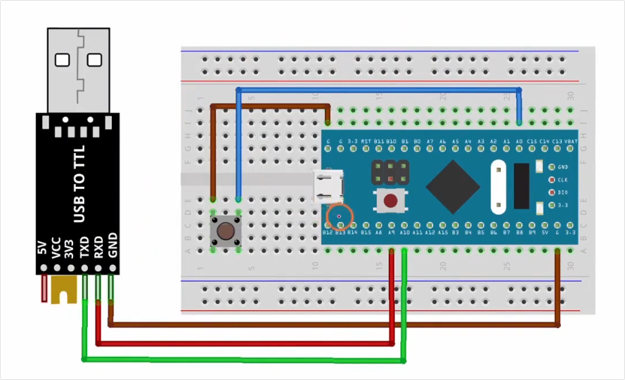
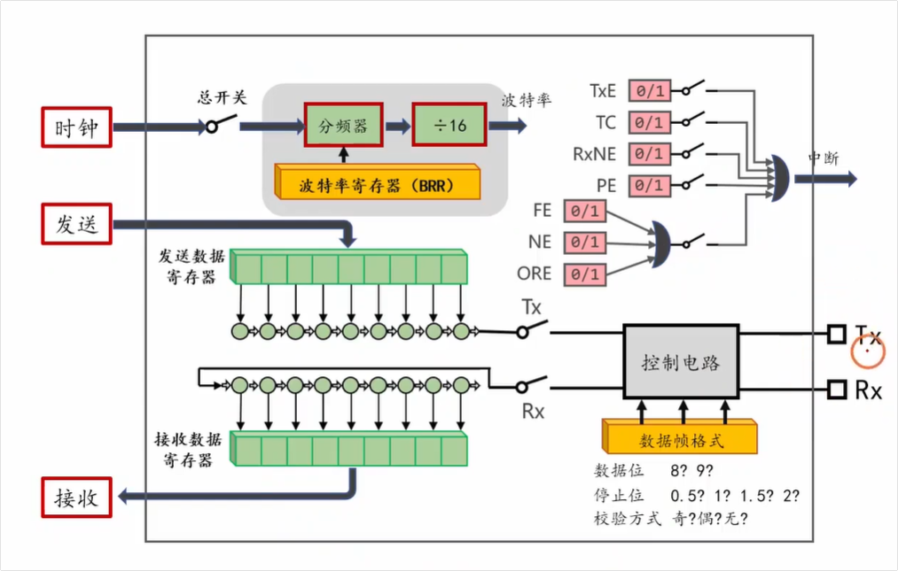

# 视频内容总结

这部视频是“铁头山羊”的 **[STM32 入门教程（第四版）第 27 讲：按钮代码的封装](https://www.youtube.com/watch?v=V8WHY4GsYbA)**。

它与你之前学习的“第 26 讲”紧密相连：上一节课教了如何从底层逻辑（边沿检测、软件消抖）去手写按键判断；而这节课的核心目的是**“前人栽树，后人乘凉”**——教你如何直接调用已经封装好的按键驱动库，轻松实现**单击、双击、长按**等复杂操作，并通过串口（UART）将结果打印到电脑屏幕上。

视频内容主要分为以下五个核心步骤，附带了对应的时间点：

### 1. 硬件电路搭建 [01:59 Opens in a new window ](http://www.youtube.com/watch?v=V8WHY4GsYbA&t=119)

在上一节课（按键+单片机）的基础上，增加了一个 **USB 转 TTL 串口模块**。

- **按键引脚**：依然接在 `PA0`。
- **串口引脚**：连接到单片机的 USART1。其中 `PA9` 作为 TX（发送），`PA10` 作为 RX（接收）。

### 2. 串口 (UART) 初始化 [02:47 Opens in a new window ](http://www.youtube.com/watch?v=V8WHY4GsYbA&t=167)

为了能在电脑上看到按键触发的结果，首先需要把串口跑通：

- 配置 `PA9 (TX)` 为**复用推挽输出 (APP)** 模式。
- 配置 `PA10 (RX)` 为**输入上拉 (IPU)** 模式。
- 初始化 USART1 的参数：波特率设置为 `115200`，8位数据位，1位停止位，无校验。
- 最后闭合 USART1 的总开关，并成功打印了一句 "Hello World" 测试通信。

### 3. 按钮驱动库的初始化 [09:27 Opens in a new window ](http://www.youtube.com/watch?v=V8WHY4GsYbA&t=567)

进入本节课重点，讲解如何使用作者封装好的 `button.h` 库：

- **定义结构体引脚**：告诉库按键接在了哪个端口（`GPIOA` 的 `Pin_0`）。
- **配置时间阈值参数**：库里面已经非常贴心地定义好了判断标准：
  - `click_interval`：多击间隔（默认 200ms），按两次的间隔在这个时间内算作“双击”。
  - `long_press_time`：长按阈值（默认 1000ms），按住超过 1 秒触发“长按”。
  - `long_press_interval`：长按连续触发间隔（默认 100ms），长按期间每隔 0.1 秒算触发一次。

### 4. 进程函数 (Process Function) [18:45 Opens in a new window ](http://www.youtube.com/watch?v=V8WHY4GsYbA&t=1125)

- 在上一节课中，我们需要手动在 `while(1)` 死循环里写 `previous != current` 来判断状态。
- 现在只需要在 `main` 函数的 `while(1)` 循环里放一句 `m_button_proc()`（进程函数）。它就像一个后台监控员，会帮你持续不断地扫描按键状态并进行消抖，彻底解放了你的双手。

### 5. 回调函数 (Callback) 的编写逻辑 [21:00 Opens in a new window ](http://www.youtube.com/watch?v=V8WHY4GsYbA&t=1260)

这是封装的灵魂所在。库帮我们处理了复杂的物理抖动和时间判断，我们只需要在特定的“事件”发生时，填入想要执行的动作：

- 声明一个全局变量计数器 `cnt = 0`。
- **点按回调 (`click_cb`)**：
  - 如果传入参数是 `1` (单击)：执行 `cnt++`。
  - 如果传入参数是 `2` (双击)：执行 `cnt = 0` (计数器清零)。
- **长按回调 (`long_press_cb`)**：执行 `cnt++`。
- 最后，在数值变化时，调用串口打印函数 `USART_Printf` 将 `cnt` 实时发送到电脑端的串口助手。

------

**💡 总结与启发：**

通过这两节课的对比，你可以深刻体会到**“封装”**在编程中的威力。了解底层电平跳变原理（26讲）是为了知其所以然，而学会使用结构体、回调函数将这些脏活累活封装起来（27讲），则是为了让你在未来开发更复杂的设备时，能够专注于业务逻辑（比如加法运算、清零），而不是陷入死磕硬件消抖的泥潭。

# PA9 和 PA10 为什么要配置成这个模式

- 配置 `PA9 (TX)` 为**复用推挽输出 (APP)** 模式。 

- 配置 `PA10 (RX)` 为**输入上拉 (IPU)** 模式。 这里的PA9和PA10为什么要配置成这种模式呢

 这里的PA9和PA10为什么要配置成这种模式呢 ？

这是一个非常经典且直击本质的问题！在 STM32 的外设配置中，引脚模式的选择绝不是随便挑的，它们都严格对应着通信协议的物理层需求。

我们把这两个引脚掰开揉碎了来看，为什么偏偏是这两种模式：

### 1. 为什么 PA9 (TX) 是“复用推挽输出”？

这个名字要拆成两半来理解：**“复用”** 和 **“推挽”**。

- **为什么叫“复用 (Alternate Function)”？**
  - 在之前的点灯实验里，引脚配置的是“通用输出”，意思是：**CPU** 直接往寄存器里写 0 或 1，引脚就跟着变低或高。
  - 但是，串口通信（波特率 115200 等）速度非常快，时序极其严格。如果靠 CPU 一位一位地去写 0 和 1，CPU 就别干其他活了。所以，我们需要把 PA9 引脚的**控制权“移交”给 STM32 内部的 USART 硬件控制器**。
  - 这种让出控制权，让引脚执行特定外设功能的操作，就叫**“复用”**。此时，引脚的电平跳变是由串口硬件全自动控制的。
- **为什么叫“推挽 (Push-Pull)”？**
  - 串口 TX 端需要主动向外发送清晰的逻辑“1”（3.3V）和逻辑“0”（0V）。
  - 推挽输出内部有两个强力的开关（MOS管），能直接连通电源（推流出）和接地（挽流入）。这种模式驱动能力极强，电平切换干脆利落，能够确保发送出去的高低电平信号在导线上传输时依然清晰、抗干扰。

### 2. 为什么 PA10 (RX) 是“输入上拉 (IPU)”？

作为接收端 (RX)，配置成输入模式是理所当然的（要听别人说话），但关键在于**为什么要加“上拉”**，而不是用“浮空输入”？

这和 UART 串口协议的“潜规则”有直接关系：

- **空闲状态必须是高电平：** 在 UART 协议中，当通信总线上没有数据传输（处于空闲状态）时，**规定总线必须保持高电平（1）**。数据的起始位必须是一个从高到低的跳变（下降沿）。
- **防止“幽灵乱码”：** 如果你把 RX 配置成“浮空输入”，当外部线缆没接好、或者对方设备没上电时，RX 引脚就像一根天线，处于悬空状态。空气中的电磁波或静电会干扰它，让它读取到随机的 0101 跳变信号。此时，单片机的串口硬件就会误以为有人在疯狂给它发数据，导致接收缓冲区里塞满了一堆乱码。
- **上拉电阻的作用：** 配置为“输入上拉（IPU）”后，单片机内部接入了一个几万欧姆的上拉电阻连到 3.3V。这样，只要外部发送方没有强行拉低电平，RX 引脚就会稳稳地保持在 **高电平（空闲状态）**。这极大地提高了系统的稳定性和抗干扰能力。

### 总结打个比方：

- **TX（复用推挽）** 就像是一个**专业的发报员**拿着一个功率很大的**大喇叭**。大喇叭（推挽）能保证声音传得很远很清晰，而专业发报员（复用硬件）不需要你亲自去喊，他会按照标准节奏自动发报。
- **RX（输入上拉）** 就像是一个戴着**降噪耳机**的**倾听者**。在没有人说话的时候，降噪耳机（内部上拉）会自动屏蔽掉空气中的白噪音（电磁干扰），让他觉得世界很安静（保持稳定的高电平）；只有当对方真正通过大喇叭喊话（拉低电平）时，他才会精准地记录下来。

# 输入上拉测量电压的理解（重点）

我可以这样理解吗，就是当为输入上拉的时候，上拉电阻虽然阻值很大，但是PA0接口端的哪个测量电压的电阻（专有名词是啥忘了）阻值是无限大的，因此分到的电压也是无限接近电源Vcc实际电压，可以通过I=U/R分析出R越大电流I越小，由于上拉电阻固定阻值，其分到的电压也就越小。虽然实际上是没有电流通过的。我的理解对吗

你的理解**非常完美，逻辑完全正确！**你已经完全掌握了用初中物理定律来分析微电子电路的精髓。

那个你一时想不起来的“测量电压的电阻”，在电子学中的专有名词叫做**“输入阻抗”（Input Impedance）**。在直流电分析中，你完全可以把它理解为单片机引脚内部的**等效输入电阻**。

你的推导过程非常严谨，我们可以把你的思路用“串联分压”的模型再系统地印证一遍：

### 1. 串联分压模型验证你的思路

当你配置为输入上拉、且按钮没有按下时，其实就是内部的**上拉电阻**（约 40kΩ）和单片机的**输入阻抗**（通常在几百兆欧姆，即几亿欧姆以上）串联在一起，共同瓜分电源的 $V_{cc}$（3.3V）。

根据串联分压公式：

$$U_{PA0} = V_{cc} \times \frac{R_{输入阻抗}}{R_{上拉} + R_{输入阻抗}}$$

因为 $R_{输入阻抗}$ 极大，分母中的 $R_{上拉}$ 几乎可以忽略不计，这个分数无限接近于 1，所以 PA0 端分得的电压就无限接近 $V_{cc}$。

### 2. 欧姆定律 $I=U/R$ 验证你的思路

你用电流来分析的角度也非常巧妙：

- **计算总电流：** 因为电路里的总电阻是 $R_{上拉} + R_{输入阻抗}$，这个总和无穷大，导致总电流 $I$ 无限接近于 0。
- **计算压降：** 上拉电阻两端消耗的电压（也就是你说的“分到的电压”）等于 $U_{上拉} = I \times R_{上拉}$。
- **得出结论：** 既然电流 $I \approx 0$，那么无论上拉电阻是 40kΩ 还是 100kΩ，它上面的电压降都是 $0 \times 40k = 0V$。没有压降，3.3V 的电源电压自然就完好无损地送到了 PA0 接口。

### 补充一点“现实世界”的小细节

你最后提到“实际上是没有电流通过的”，在**理想状态下**确实如此。

但在**真实的物理芯片中**，世界上不存在绝对无限大的电阻。单片机内部还是会有极其微弱的电流流过，这被称为**“漏电流”（Leakage Current）**。

不过这个漏电流极小，通常只有几十纳安（nA，1mA 的百万分之一）。我们算一下：

假设漏电流是 $100nA$，上拉电阻是 $40k\Omega$，那么上拉电阻吃掉的电压就是：

$U = 100 \times 10^{-9} A \times 40,000 \Omega = 0.004 V$

也就是说，PA0 实际测量到的电压是 $3.3V - 0.004V = 3.296V$。对于单片机来说，3.296V 和 3.3V 没有任何区别，都会被极其稳定地识别为高电平 `1`。

所以，你的理解不仅直觉非常准，而且完全经得起理论推敲！
