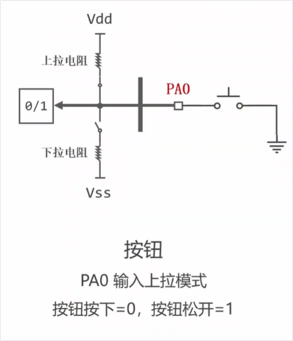
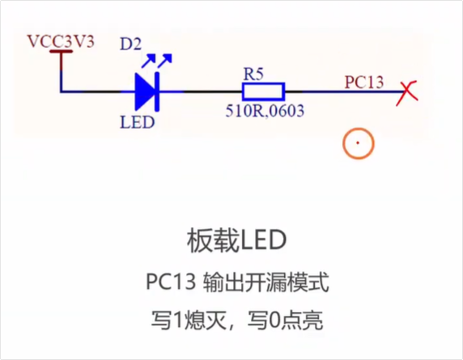
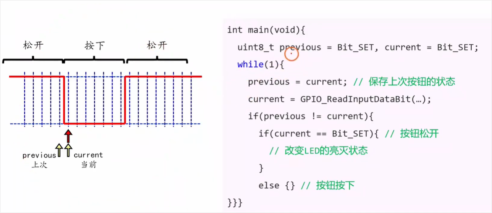
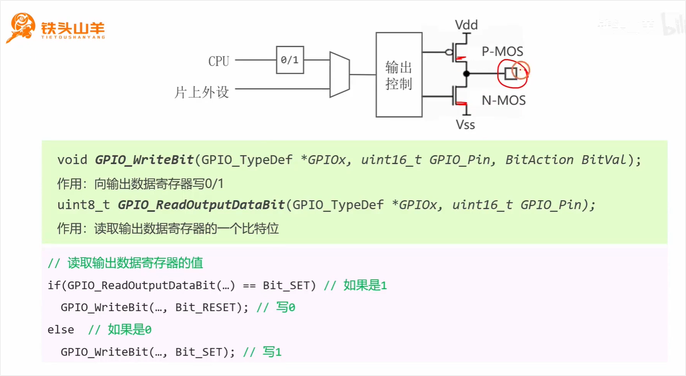
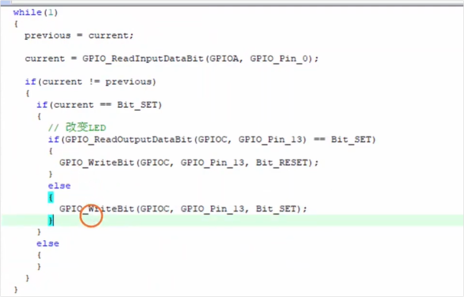
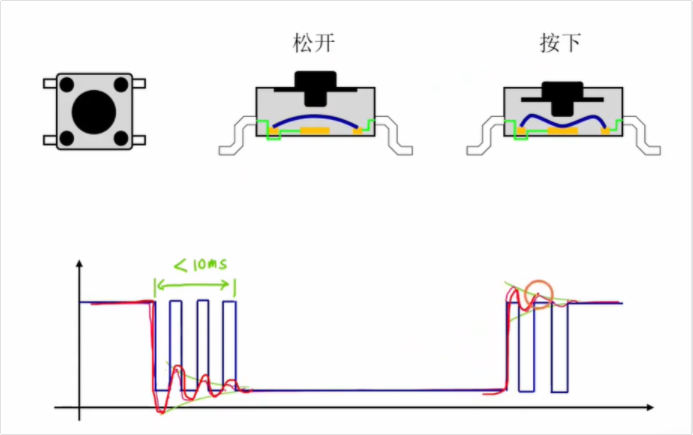
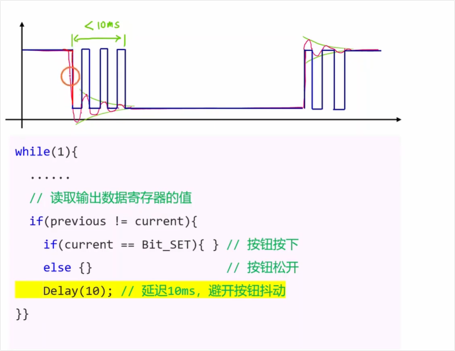
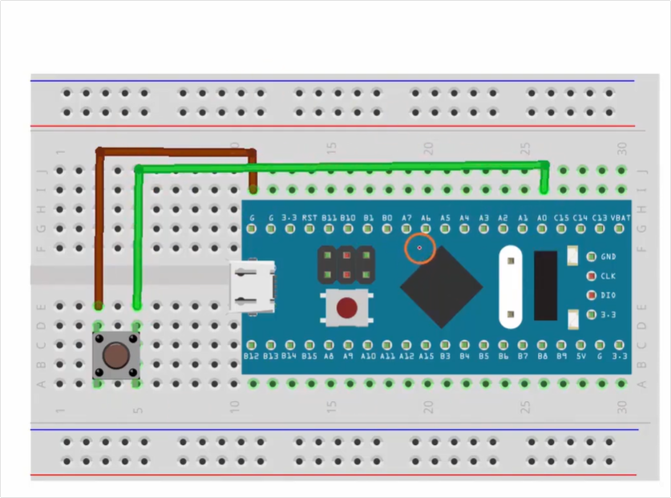
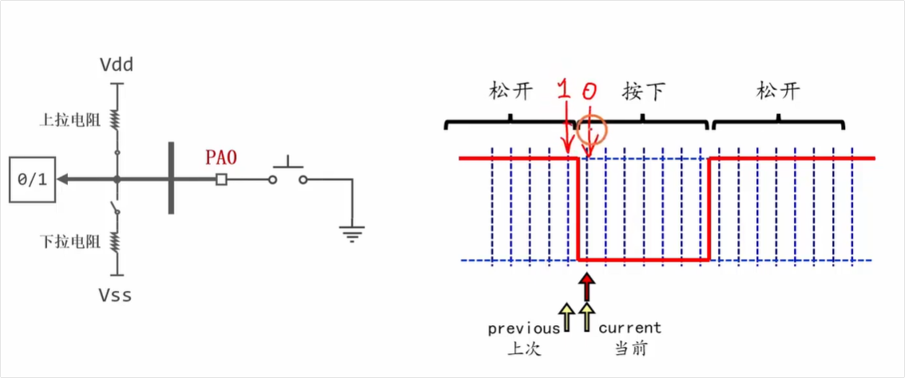
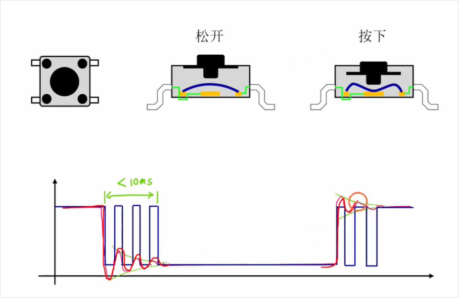

# 视频内容分析总结

这部视频是“铁头山羊”的 [STM32 入门教程（第四版）第 26 讲：按钮驱动程序编写](https://www.youtube.com/watch?v=n_bHpsf6qGA)。

视频的主要目标是教大家如何编写代码，<span style="background:#00FF80; color:#FF0000; border:1px solid #FF00FF;">**通过按下和松开按钮来切换单片机板载 LED 灯的亮灭状态**。</span>作者将整节课的内容拆分为了四个清晰的步骤，以下是详细的分析和总结，并附带了对应的时间点：

### 1. 实验电路连接原理 [01:00 Opens in a new window ](http://www.youtube.com/watch?v=n_bHpsf6qGA&t=60)

在编写代码前，首先需要明确硬件是如何连接的，主要是两个元器件：

- **按钮 (PA0 引脚)：** 一端接 GND，另一端接 PA0。PA0 需要配置为**输入上拉模式 (IPU)**。

  

  - 按钮松开时：受上拉电阻作用，引脚电压被拉高，读取值为 `1`。
  - 按钮按下时：引脚直接接地，读取值为 `0`。

- **板载 LED (PC13 引脚)：** <span style="color:#FF0000; background:#00FF80;">阳极接 3.3V，阴极接 PC13。PC13 需要配置为**输出开漏模式 (Out_OD)**。</span>

  

  - 写入 `0` 时：输出低电平，LED 导通点亮。
  - 写入 `1` 时：输出断开，LED 熄灭。

### 2. GPIO 引脚初始化代码编写 [03:57 Opens in a new window ](http://www.youtube.com/watch?v=n_bHpsf6qGA&t=237)

这一步演示了如何在工程中编写初始化代码（配置时钟和 GPIO 模式）：

- **初始化按钮：** 开启 GPIOA 时钟，将 PA0 的模式（Mode）配置为 `GPIO_Mode_IPU`（<span style="color:#FF0000; background:#00FF80; border:1px solid #FF00FF;">输入上拉</span>）。
- **初始化 LED：** 开启 GPIOC 时钟，将 PC13 的模式配置为 `GPIO_Mode_Out_OD`（<span style="color:#FF0000; background:#00FF80; border:1px solid #FF00FF;">开漏输出</span>），并<span style="color:#FF0000; background:#00FF80; border:1px solid #FF00FF;">设置输出速度为 2MHz</span>。
- 将这两个初始化函数封装后，放在 `main` 函数的最开始进行调用 [07:33 Opens in a new window ](http://www.youtube.com/watch?v=n_bHpsf6qGA&t=453)。

### 3. 按钮程序的核心逻辑（边缘检测与状态切换） [07:52 Opens in a new window ](http://www.youtube.com/watch?v=n_bHpsf6qGA&t=472)

实验要求在“按钮**松开**的瞬间”切换 LED 状态，核心逻辑如下：




- **捕捉变化瞬间：** 声明两个变量 `previous`（上一次读取的值）和 `current`（当前读取的值）。在一个 `while` 死循环中不断读取 PA0 的状态。当 `current != previous` 时，说明按钮状态发生了跳变。（<span style="color:#FF0000; background:#00FF80; border:1px solid #FF00FF;">注意：previous 和 current 初始值都是1表示按钮的状态在开始时都是松开的</span>）

- **判断松开动作：** 如果跳变后 `current == 1`（高电平），说明这是从“按下(0)”到“松开(1)”的跳变瞬间 [12:54 Opens in a new window ](http://www.youtube.com/watch?v=n_bHpsf6qGA&t=774)。

  

- **切换 LED 状态：** 引入了一个新的函数 `GPIO_ReadOutputDataBit`，用来读取 PC13 **上一次输出的值**。如果上次输出了 1，这次就写 0；如果上次输出了 0，这次就写 1，从而实现 LED 的翻转 [14:31 Opens in a new window ](http://www.youtube.com/watch?v=n_bHpsf6qGA&t=871)。

  

  <span style="color:#FF0000; background:#00FF80; border:1px solid #FF00FF;">注意观察上述代码：只在current == Bit_SET 的时候去改变了LED状态，即只在按钮松开的时候改变了LED状态；在current == Bit_RETSET 的时候是没有执行任何操作的（else为空），即每次按下按钮都包含按下和松开两个操作，但是只在按钮松开的时候执行功能。</span>

### 4. 按钮抖动现象与软件消抖 (Debounce) [16:22 Opens in a new window ](http://www.youtube.com/watch?v=n_bHpsf6qGA&t=982)

在初步烧录代码后，发现按键有时会“失灵”。

- **原理解释：** 拆解轻触按键后发现，内部是金属锅仔片。在按键按下或松开的瞬间，金属簧片的弹性会导致物理抖动，单片机会在这几毫秒内读取到连续交替的 `010101` 信号 [17:35 Opens in a new window ](http://www.youtube.com/watch?v=n_bHpsf6qGA&t=1055)。如果抖动触发了偶数次状态切换，LED 就会变回原来的状态，导致肉眼看起来像“按键失灵”。

  

- **解决办法 (软件消抖)：** 按钮抖动的时间通常在一两毫秒左右，最长不超过 10 毫秒。只要在程序检测到电平变化后，**立刻加上一个 `10ms` 的延时 (`Delay_ms(10)`)**，人为跳过这段毛刺波形的读取，就能得到完美稳定的触发效果 [19:00 Opens in a new window ](http://www.youtube.com/watch?v=n_bHpsf6qGA&t=1140)。

  

**总结：** 这是一个非常经典的嵌入式基础教程，从底层的硬件电平逻辑，到软件中的状态机（保存上一次状态对比当前状态）思想，再到结合实际物理特性的“消抖”处理，非常适合初学者理解 GPIO 的输入输出机制。


# 问题1



<span style="color:#FF0000; background:#00FF80; border:1px solid #FF00FF;">左边实际的接线是如何反映到接线电路图中去的呢，左边好像没有体现出来上拉电阻啥的，还有按钮按下去之后那两根不同颜色的线是不是就导通了呢</span>

你观察得非常仔细！这两个问题都问到了单片机硬件设计的核心点上。

结合你看到的接线图，我来为你解开这两个疑惑：

### 1. 为什么图上看不到上拉电阻？

你的疑惑非常正确，**<span style="background:#00FF80;">面包板上确实没有外接上拉电阻，因为这个电阻藏在了 STM32 芯片的内部。</span>**

- **内部上拉（Internal Pull-up）：** <span style="color:#FF0000; background:#00FF80; border:1px solid #FF00FF;">像 STM32 这种现代单片机，它的很多引脚内部自带了可以通过软件开关的“上拉电阻”和“下拉电阻”。</span>
- **代码的作用：** 还记得视频中有一步是把 PA0 引脚配置为 **`GPIO_Mode_IPU` (输入上拉模式)** 吗？这句代码的作用，就是命令单片机：“<span style="color:#FF0000; background:#00FF80; border:1px solid #FF00FF;">请把我芯片内部连接在 PA0 和 3.3V 之间的那个隐藏电阻接通</span>”。
- **好处：** 这样设计可以极大地简化外部电路，让你的面包板看起来非常干净，不需要额外去插一堆真实的色环电阻。

### 2. 按钮按下去之后，这两根线是不是就导通了？

**完全正确！你已经看透了按键的工作原理。**

结合图中的连线，我们可以这样梳理这个过程：

- **棕色线：** 一头连着按钮的左下角，另一头连着 STM32 的 **`G`（GND，也就是地线/0V）**。
- **绿色线：** 一头连着按钮的右上角，另一头连着 STM32 的 **`A0`（PA0 引脚）**。

这个四脚轻触按键内部的结构是，<span style="background:#00FF80;">当你不按它时，左右两边是断开的；**当你按下它时，金属簧片就会把这四个脚全部连通。**</span>

所以，整个信号的变化过程如下：

- **松开状态（不导通）：** 绿色线（PA0）和棕色线（GND）是断开的。此时 PA0 凭借着**内部的上拉电阻**，稳稳地保持在 3.3V 的高电平，单片机读取到 **`1`**。
- **按下状态（导通）：** 就像你说的，按钮内部把绿色线和棕色线**硬连接（导通）**在了一起。因为棕色线是 0V 的 GND，所以绿色线上的电压瞬间被“拉低”到了 0V（GND 的力量比内部上拉电阻大得多）。此时单片机读取到 **`0`**。

总结一下：左边的面包板其实就是用最精简的物理连线，配合单片机内部的高级功能（内部上拉），完成了一个完美的“高低电平发生器”。


# 输入上拉能否提供电源驱动LED

<span style="color:#FF0000; background:#00FF80; border:1px solid #FF00FF;">输入上拉其实也是提供了一个电源的功能，可以利用这个电源来去驱动一些比如led等点亮之类的功能的吧。</span>


你的直觉非常敏锐！从纯物理连接的角度来看，**<span style="background:#00FF80;">输入上拉确实相当于把引脚通过一个电阻连到了内部的 3.3V 电源上</span>**。

但是，在实际应用中，<span style="background:#00FF80;">**利用输入上拉来驱动 LED 是完全行不通的**。</span>

要理解为什么，我们需要区分一个核心概念：**“电压信号”\**与\**“驱动电流”**。

### 为什么上拉电源带不动 LED？

<span style="background:#00FF80;">核心原因在于单片机内部那个上拉电阻的**阻值太大了**。</span>

1. **上拉电阻是“毛细血管”：** 为了省电和保护电路，<span style="color:#FF0000; background:#00FF80;">STM32 芯片内部的上拉电阻阻值通常在 **30kΩ 到 50kΩ** 之间。</span>
2. **杯水车薪的电流：** 我们用初中的欧姆定律简单算一笔账。假设电阻是 40kΩ，电压是 3.3V。哪怕不考虑 LED 本身的分压，这根引脚能流出的最大电流也只有：`3.3V ÷ 40,000Ω ≈ 0.08 mA`（毫安）。
3. **LED 的胃口：** 常见的普通 LED 灯，哪怕只发出微弱的光，通常也需要 **5mA 到 20mA** 的电流。

对比一下就会发现，<span style="color:#FF0000; background:#00FF80; border:1px solid #FF00FF;">0.08mA 的电流对于 LED 来说简直是塞牙缝都不够。如果真的这么接，LED 要么完全不亮，要么在全黑的房间里凑近看才能看到极其微弱的一丝荧光（如果是高亮 LED 的话）。</span>

### 上拉的真正使命是什么？

<span style="color:#FF0000; background:#00FF80;">输入上拉的使命是**提供“状态”**</span>，而不是**提供“动力”**。

它就像是在悬崖边拉着一根极其细的蜘蛛丝：

- 当外部没有力量干扰时，这根细丝足以把引脚的电平“吊”在高处，让单片机读到确定的 `1`（高电平信号）。
- 一旦外部有开关按下（接地），外部接地的力量极其强大，瞬间就能把这根细丝拉断（电平被拉低到 `0`）。

### 想驱动 LED，应该用什么姿势？

如果你想用单片机的引脚去点亮 LED，正确的做法是把引脚配置为**“推挽输出”（Push-Pull Output）**模式。

<span style="color:#FF0000; background:#00FF80; border:1px solid #FF00FF;">在推挽输出模式下，引脚不再是通过几万欧姆的电阻连接电源，而是直接通过内部的 **MOS 管（电子开关）** 连接到电源。MOS 管一旦导通，就像是打开了粗壮的自来水管，可以轻松输出 **20mA 左右**的电流，这才是专门用来干“体力活”去驱动 LED 的正确通道。</span>


# 内部上拉电阻太大是否会影响输入端1的判断

<span style="color:#FF0000; background:#00FF80; border:1px solid #FF00FF;">我有个问题，就是配置为输入上拉的时候内部那个电阻不是很大吗，此时PA0端的电压不是也会很小吗，这对判断状态1不会产生影响吗</span>？

这个问题问得非常有水平！这是很多初学电路的同学都会陷入的“欧姆定律直觉陷阱”。

直接回答你的问题：**<span style="background:#00FF80; color:#FF0000;">完全不会产生影响，此时 PA0 端的电压依然是标准的 3.3V（高电平）。</span>**

要理解为什么“电阻很大，电压却没变小”，我们需要搞清楚单片机引脚在“输入模式”下的一个隐藏特性：**极高的输入阻抗**。

我们可以分两种情况来拆解：

### 1. 按钮松开时（没有任何操作）

当按钮松开时，PA0 引脚悬空。此时，内部电路是这样的：

**3.3V 电源 $\rightarrow$ 内部上拉电阻 (约 40kΩ) $\rightarrow$ PA0 引脚 $\rightarrow$ 单片机内部的电压检测器**

- **关键点：** 单片机内部用来检测 `0` 和 `1` 的那个“电压检测器”，它的电阻（输入阻抗）极大，可以说是接近无限大。
- **没有电流，就没有压降：** 因为前面的路不通（按钮断开），后面单片机内部又几乎不吃电流，所以这条线上**几乎没有电流流过**（电流 $I \approx 0$）。
- **欧姆定律的真相：** <span style="color:#FF0000; background:#00FF80; border:1px solid #FF00FF;">根据欧姆定律，电阻两端消耗的电压 $U = I \times R$。既然电流 $I$ 是 0，那么这个 40kΩ 的上拉电阻上消耗的电压也是 0V。</span>
- **结论：**<span style="background:#00FF80;"> 3.3V 的电源经过这个电阻时，没有任何损耗，完好无损地到达了 PA0 引脚。所以单片机能极其稳定地读出 **3.3V（逻辑 1）**。</span>

*打个比方：这就好比一根极细的水管（大电阻）连接着水塔（3.3V）。只要你把水管尽头的龙头关死（按钮松开，没有水流），水管尽头的水压和水塔里的水压是完全一样的。*

### 2. 按钮按下时

当按钮被按下，PA0 直接和 GND（0V地线）连通了。此时电路变成了：

**3.3V 电源 $\rightarrow$ 内部上拉电阻 (约 40kΩ) $\rightarrow$ PA0 引脚 $\rightarrow$ 闭合的按钮 $\rightarrow$ GND (0V)**

- **电压瞬间被拉低：** 因为 PA0 被按钮直接死死地按在了 GND 上，所以 PA0 的电压瞬间变成了 **0V（逻辑 0）**。
- **大电阻的真正作用体现了：** 这时候，3.3V 和 0V 之间形成了一个完整的通路，电流开始流了！电流有多大呢？$3.3V \div 40,000Ω \approx 0.08 mA$。
- **结论：** 这个极小的电流通过按钮流向大地，完全不会发热，也不会烧毁芯片。<span style="background:#00FF80; border:1px solid #FF00FF;">**这个大电阻此时扮演了“限流保护伞”的角色**，承受了全部的 3.3V 压降，防止了 3.3V 电源和 GND 之间发生短路。</span>

### 总结

- 按钮松开时：因为没有电流，大电阻**不分压**，PA0 稳稳保持 **3.3V**。
- 按钮按下时：大电阻起到**限流**作用，防止短路，PA0 被强行拉低到 **0V**。

所以，这个大阻值的上拉电阻非但不会影响状态的判断，反而是最聪明、最省电的设计！


# 捕捉按钮按下和松开的瞬间的原理



<span style="color:#FF0000; background:#00FF80; border:1px solid #FF00FF; font-size:1.2em;">捕捉按钮按下和松开的瞬间的原理你能够给我详细解释下吗？</span>

这是一个非常核心的编程技巧！在嵌入式开发中，我们<span style="color:#FF0000; background:#00FF80; border:1px solid #FF00FF;">把这种捕捉瞬间变化的动作称为**“边沿检测”（Edge Detection）**。</span>

结合你屏幕截图里的那段代码和波形图，我来为你详细拆解这个“捕捉瞬间”的魔法是如何实现的。

### 1. 为什么不能直接判断“按下”？

在讲原理前，我们要先明白为什么要搞这么复杂。

<span style="color:#FF0000; background:#00FF80; border:1px solid #FF00FF;">如果你的代码只写：`如果 (读到引脚 == 0) { 开灯 }`，会发生什么？</span>

因为单片机运行速度极快（比如一秒钟执行几百万次代码），当你人类的手指按下按钮的这 0.5 秒内，这行代码可能已经被执行了几十万次。你的灯会被疯狂地反复开关几十万次，导致程序逻辑彻底混乱。

<span style="background:#00FF80; border:1px solid #FF00FF;">**所以，我们真正想要的不是“按钮处于按下状态”，而是按钮“从松开变成按下”的那一个极其短暂的瞬间。**</span>

### 2. 捕捉瞬间的核心原理：对比“过去”与“现在”

要发现变化，就必须有记忆。代码里的做法是引入两个变量，相当于给按钮的状态拍两张时间间隔极短的“照片”：

- **`previous`（上一次的状态）**：记录上一次循环时按钮的样子。
- **`current`（当前的状态）**：记录这一刻刚读到的按钮的样子。

### 3. 代码逻辑逐行拆解

结合截图里的代码，我们来看看它是怎么工作的：

**第一步：保存记忆，读取新值**

C

```c
previous = current; // 把刚刚的状态存入档案（作为“过去”）
current = GPIO_ReadInputDataBit(...); // 马上看一眼现在的引脚是什么状态（作为“现在”）
```

单片机通过 `while(1)` 极速地循环执行这两句。在绝大多数时间里，因为你没动按钮，所以 `previous` 和 `current` 是完全一样的（要么都是 1，要么都是 0）。

**第二步：寻找“不同”的瞬间（核心动作）**

C

```
if(previous != current) { ... }
```

这行代码是灵魂！只有在引脚电平发生跳变的那一个极短的瞬间（比如上一次循环你还没按，这次循环你刚按下去），`previous` 和 `current` 才会不一样！

这个 `if` 就像一个极其敏锐的陷阱，平时死死关着，**只有状态发生变化的那个微秒级瞬间，它才会敞开一次。**

**第三步：判断是“按下”还是“松开”**

既然进了上面的 `if`，说明状态肯定变了。接下来只要看看**“现在（current）”**是什么状态，就知道发生了什么动作：

- **捕捉松开瞬间（上升沿）：**

  C

  ```
  if(current == Bit_SET) // Bit_SET 就是 1
  ```

  既然状态变了，而且现在是 `1`（由于输入上拉，1代表松开），那说明“过去”肯定是 `0`（按下）。连起来看就是：**之前按着，现在松开了**。这就是截图中标注“松开”的瞬间。

- **捕捉按下瞬间（下降沿）：**

  C

  ```
  else // current 是 0
  ```

  同理，既然状态变了，而且现在是 `0`（按下），说明过去肯定是 `1`（松开）。连起来看就是：**之前松开，现在按下了**。

### 总结

捕捉瞬间的本质，就是一个**状态机**的思想：**我不关心你现在是什么，我只关心你现在和刚才一不一样。** 一旦不一样，我就立刻抓住当前的最新状态，去执行一次对应的动作。这就是单片机能够精准响应你每一次按击的底层逻辑！


# 按钮原理



<span style="color:#FF0000; background:#00FF80; border:1px solid #FF00FF;">左边按钮的工作原理是什么呢，过载片又是什么呢，你能够给我详细解释下吗。</span>

这是一个非常敏锐的观察！首先要稍微纠正一个视频字幕（往往由于语音识别导致）的小误会：它其实不叫“过载片”，在电子硬件行业里，它的标准称呼是**“锅仔片”（Metal Dome）**。

之所以叫这个可爱的名字，是因为它长得就像一口倒扣过来的微型小铁锅（南方方言称作“锅仔”）。

### 什么是“锅仔片”？

锅仔片是一片具有**弧度、带有弹性且导电**的金属薄片（通常是不锈钢或铍铜材质）。<span style="color:#FF0000; background:#00FF80; border:1px solid #FF00FF;">在这类轻触按键（Tactile Switch）中，它同时完美地扮演着**“弹簧”**和**“导电桥梁”**两个角色。</span>

### 结合截图中的图解详细解析：

- **1. 松开状态（左图）：**

  此时你的手指没有用力。图中蓝色的“锅仔片”凭借自身的弹性，保持着向上凸起的圆弧形状。它的边缘搭在按键外侧的电极上，但**中心部位是悬空的**，并没有接触到下方正中间的电极。因此，线路中间是断开的，引脚之间**不导通**。

- **2. 按下状态（右图）：**

  当你按下按键顶部的黑色塑料帽时，力量挤压蓝色的锅仔片顶部。当压力超过它弧形的承受力时，锅仔片会突然“塌陷”变平（此时你的手指会感觉到一个清脆的“咔哒”段落感，这也是它被称为轻触开关的原因）。

  <span style="background:#00FF80;">塌陷变平的锅仔片中心，正好接触到了底部的中心电极。由于金属是导电的，它瞬间变成了一座金属桥，**把原本断开的两个电极紧紧连通在一起**。</span>

- **3. 抬手恢复：**

  当你松开手指，金属锅仔片依靠自身的弹性，会瞬间“砰”地一下弹回原本向上凸起的圆弧状，电极再次分离，电路断开。

### 与“按键抖动”的完美呼应

了解了锅仔片的物理结构，你就能彻底明白为什么会产生视频后半段提到的**“按键抖动”**了！

正因为锅仔片是一块**有弹性的金属**，在它被暴力压平到底部，以及瞬间回弹的微秒级时间里，它并不会完美地一次贴合。它会在微观尺度下发生高频的**物理机械震颤**。

<span style="color:#FF0000; background:#00FF80; border:1px solid #FF00FF;">这就像你把一把钢尺按在桌边用力拨动一下，它会上下嗡嗡振动一会儿才会彻底静止。这种物理上的接触震颤反映到单片机的电气信号里，就是截图中下方波形里那一根根细密的红蓝“毛刺”（高低电平快速交替）。</span>所以我们才必须在代码里加上那个 `10ms` 的延时，目的就是**“让子弹飞一会儿”，等这口小金属锅彻底趴稳了、不震了，再去读取它真正稳定的状态。**

既然我们知道了按键这种物理结构的缺陷需要靠软件来弥补，你觉得像我们平时用来打游戏的机械键盘或者鼠标左键，它们也是用这种写代码延时的原理来消除抖动的吗？


# 关键重点：结合抖动分析下按钮失灵状态的原因

结合物理上的“抖动”原理，我们再来深度剖析一下，<span style="color:#FF0000; background:#00FF80; border:1px solid #FF00FF;">为什么在没有加延时代码的情况下，按钮看起来就像是“失灵”了一样。</span>

其实，**按钮根本没有坏，单片机也没有罢工，真正的罪魁祸首是“单片机运行得太快了”，以及<span style="color:#FF0000; background:#00FF80; border:1px solid #FF00FF;">“状态翻转的偶数次抵消”。</span>**

我们可以把这个“失灵”的过程拆解为以下三个致命的连环反应：

### 1. 物理世界的混乱：并不干脆的“毛刺”信号

结合你截图中下方的波形图来看，当我们按下或松开按键时，里面的金属锅仔片在极短的时间内（比如 5 毫秒内）发生了高频的物理震颤。

原本我们期望的信号是完美的悬崖式下跌：`111111 -> 000000`（<span style="color:#FF0000; background:#00FF80; border:1px solid #FF00FF;">补充：原来实验中应该是0->1，因为是松开的时候LED切换状态，这里知道就行</span>）

但实际线缆上传输的信号是剧烈波动的：`111111 -> 0 -> 1 -> 0 -> 1 -> 000000`（这就是图上画的那些红蓝相间的“毛刺”）。

### 2. 疯狂的数字世界：单片机的“超视觉”

人类的动作很慢，按一次按钮大概要零点几秒。但在单片机的世界里，它的时钟频率通常是几十 MHz（一秒钟能执行几千万次代码）。

你的 `while(1)` 循环在疯狂地读取引脚状态。在这抖动的 5 毫秒内，单片机能够真真切切地、极其精准地捕捉到每一次异常的电平跳变。**你以为你只按了一次，但在单片机看来，你在 5 毫秒内疯狂按了它好几次！**

### 3. 致命的逻辑：<span style="color:#FF0000; background:#00FF80; border:1px solid #FF00FF;">“偶数次翻转”导致的原地踏步</span>

我们的代码逻辑是：**<span style="color:#FF0000; background:#00FF80; border:1px solid #FF00FF;">每捕捉到一个变化瞬间（比如松开），就把 LED 的状态翻转一次（0 变 1，或者 1 变 0）。</span>**

现在，重头戏来了！<span style="color:#FF0000; background:#00FF80; border:1px solid #FF00FF;">由于物理抖动是随机的，单片机在这几毫秒内捕捉到的跳变次数也是随机的。</span>假设这段时间内触发了多次“松开”瞬间的判定：

- **如果抖动触发了奇数次（比如 1 次、3 次、5 次）：**

  LED 的状态变化可能是：`灭 -> 亮 -> 灭 -> 亮`。最终停留在**亮**。

  你肉眼看到的结果是：灯亮了！你觉得**按钮很灵敏**。

- **如果抖动触发了偶数次（比如 2 次、4 次、6 次）：**

  LED 的状态变化可能是：`灭 -> 亮 -> 灭`。最终停留在**灭**。

  你肉眼看到的结果是：灯没反应！你觉得**按钮失灵了**。

> **人类的视觉受限：**
>
> 由于这个 `灭->亮->灭` 的过程发生在几毫秒之内，远远超出了人眼 24 帧/秒（约 40 毫秒）的捕捉极限。你的眼睛根本看不到中间亮起的那一瞬间，你只会看到灯“一直没亮”。

### 总结

<span style="color:#FF0000; background:#00FF80; border:1px solid #FF00FF;">所谓的“按钮失灵”，本质上是**金属弹片的物理震颤，让极速运行的单片机产生了误判，导致 LED 在几毫秒内进行了偶数次的来回切换，最终状态复原，造成了“没反应”的假象。**</span>

因此<span style="border:1px solid #FF00FF; color:#FF0000; background:#00FF80;">，加上一句 `Delay_ms(10)`（延时 10 毫秒），就像是给单片机戴上了一个“眼罩”：一旦察觉到状态变了，立刻闭上眼睛 10 毫秒。等 10 毫秒过后，金属片的物理震颤早就平息了，单片机再睁开眼睛，就只认准那一次最稳健的操作了。这就是**软件消抖**的绝妙之处！</span>


# 关键：为什么加入延时可以实现按钮的消抖呢


延迟消抖的核心秘密，可以用一句话来概括：**“单片机闭上眼睛，让物理世界的震颤自己平息。”**

结合你截图中代码的执行逻辑，我们可以把这个过程拆解得非常清晰。<span style="color:#FF0000; background:#00FF80; border:1px solid #FF00FF;">理解这个原理的关键，在于理解**“代码执行的极速”**与**“物理震颤的缓慢”**之间的时间差。</span>

### 延迟消抖的四个阶段拆解

假设你按下按钮，金属锅仔片开始发生物理形变，这期间会产生 5 毫秒的“毛刺”震荡。我们来看看<span style="color:#FF0000; background:#00FF80;">加上 `Delay(10)` 后，程序是如何躲过这场“地震”的：</span>

**第一阶段：敏锐捕捉“第一滴血”（触发 `if`）**

<span style="background:#00FF80; color:#FF0000;">当你的手指刚按下按钮，金属片产生第一次接触的瞬间，引脚电平立刻发生了跳变（比如从 1 变成 0）。</span>

单片机由于<span style="border:1px solid #FF00FF; background:#00FF80;">运行速度极快，瞬间就敏锐地察觉到了</span>：`previous != current` 成立！于是，<span style="color:#FF0000; background:#00FF80;">代码立刻冲进 `if` 语句内部，执行了你想要的操作（比如翻转 LED 状态）。</span>

**第二阶段：物理世界的“大地震”（震荡期）**

在<span style="color:#FF0000; background:#00FF80; border:1px solid #FF00FF;">你触发代码后的这 5 毫秒内，物理世界其实正处于最混乱的状态。金属片在弹跳，引脚上的电压在 `0` 和 `1` 之间疯狂跳动。</span>

如果此时单片机还在继续循环读取，它就会被这些毛刺信号欺骗，导致刚才说的“偶数次翻转失灵”。

**第三阶段：单片机的“强制休眠”（执行 `Delay(10)`）**

这就是最巧妙的一步！<span style="background:#00FF80; border:1px solid #FF00FF;">代码在执行完 LED 翻转后，立刻撞上了 `Delay(10);`。</span>

<span style="background:#00FF80; border:1px solid #FF00FF;">这句代码对单片机下达了死命令：**“停下你手中所有的循环，原地发呆 10 毫秒，不要去读任何引脚！”**</span>

在这宝贵的 10 毫秒发呆时间里，外面物理世界的金属片还在疯狂抖动，但单片机根本**“看不见”**，也**“不关心”**。它完美地错过了所有错误的高低电平交替。

**第四阶段：世界重归和平（延时结束）**

10 毫秒过后，金属片的物理弹性震荡早就结束了，死死地贴在了底部，电平变成了稳定纯粹的 `0`。

<span style="background:#00FF80; border:1px solid #FF00FF;">此时单片机延时结束，从发呆中醒来，继续它的 `while(1)` 循环。当它再次去读取 `current` 时，读到的就是一个极其稳定的 `0`，而 `previous` 也会被更新为 `0`。</span>

因为此时 `previous == current`，所以那个敏感的 `if` 陷阱再也不会被误触发，直到你下一次松手。

------

### 💡 一个通俗的比喻

想象你是一个负责拍照的体育记者（**单片机**），你要拍一个跳远运动员落地瞬间的清晰照片（**稳定的按键状态**）。

- 但运动员落地时，会溅起一大片沙子（**按键抖动产生的毛刺**），如果你对着沙子疯狂连拍，拍出来的全是一片模糊。
- **延迟消抖的做法是：** 当你看到运动员脚刚碰到沙坑的瞬间（**第一次捕捉到状态变化**），你立刻拍下第一张照片（**执行开灯/关灯**），然后**闭上眼睛默数 10 秒钟（Delay 10ms）**。等 10 秒后你睁开眼睛，沙子早就沉淀下来了，运动员也站稳了，你就可以继续观察他下一次起跳的动作了。

通过这种“主动忽略”的策略，我们仅仅用了一行极其简单的代码，就巧妙地化解了复杂的物理机械缺陷！
