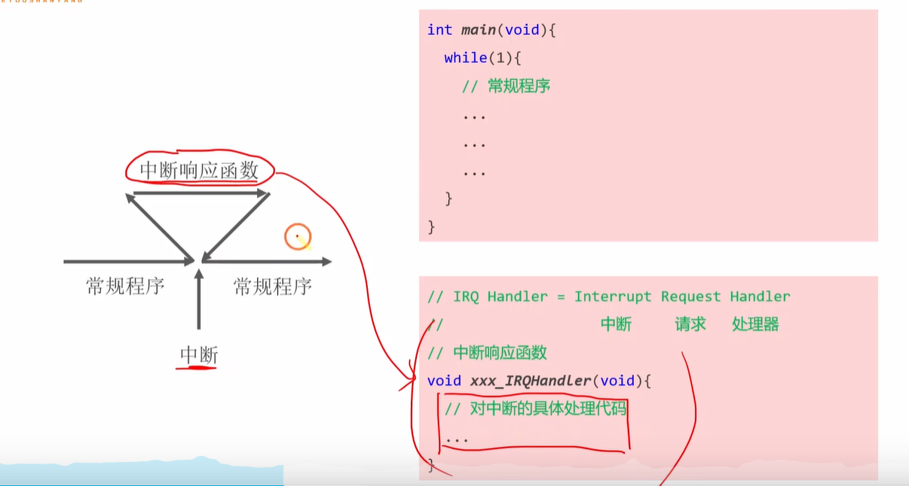
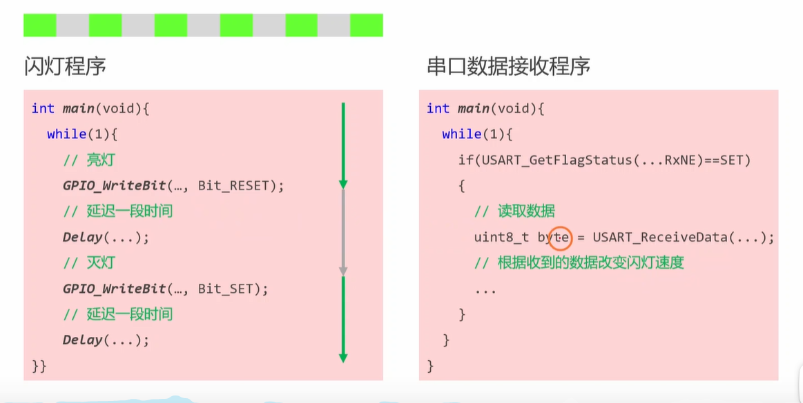
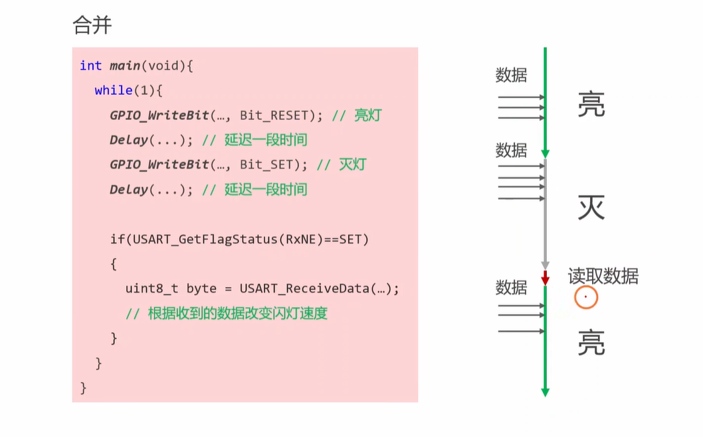
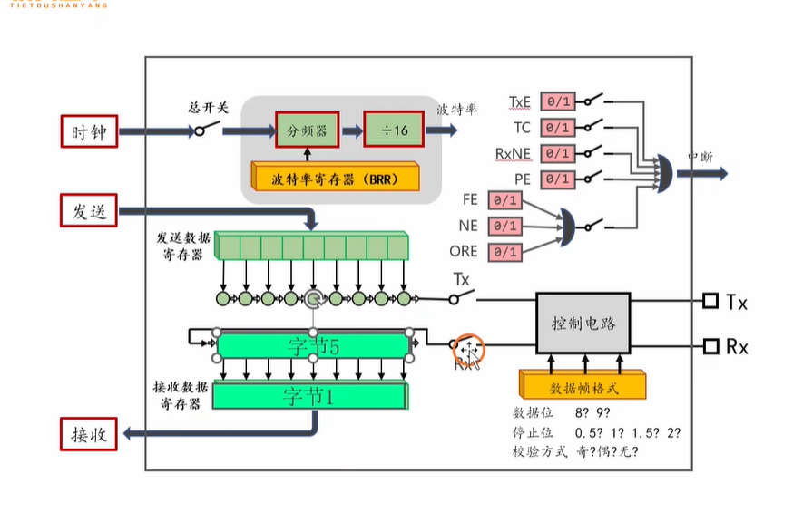
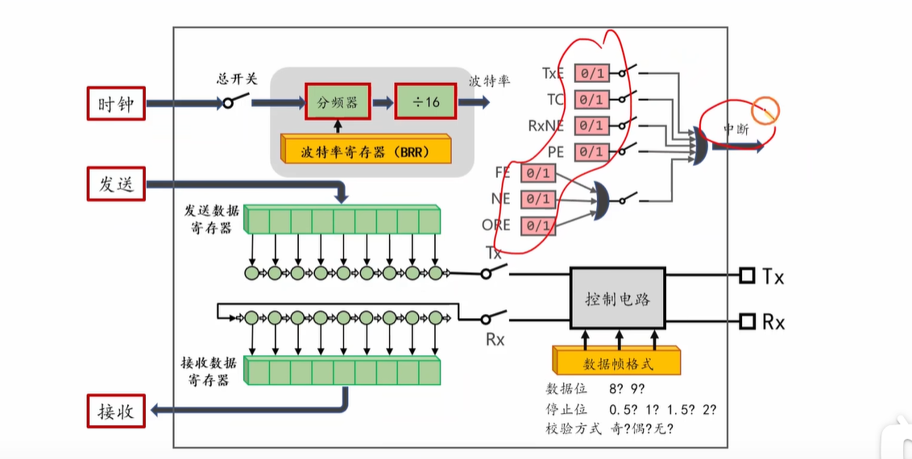
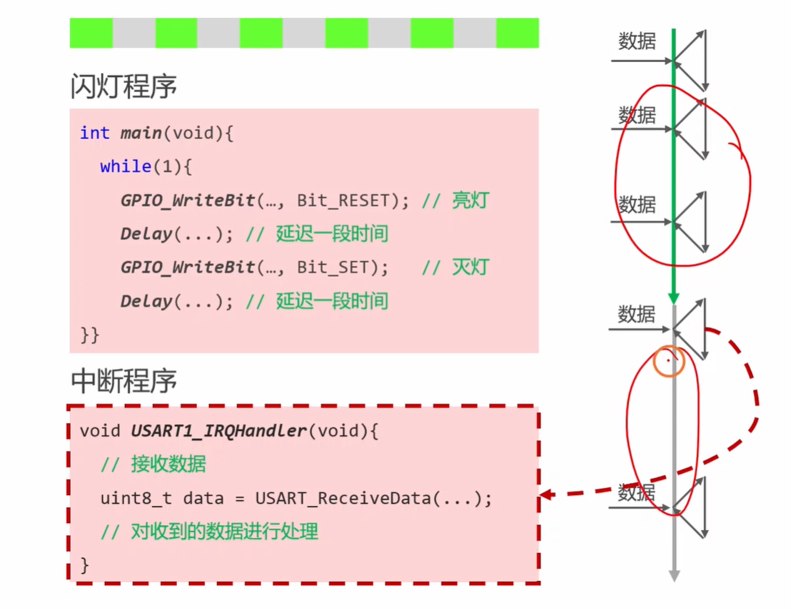
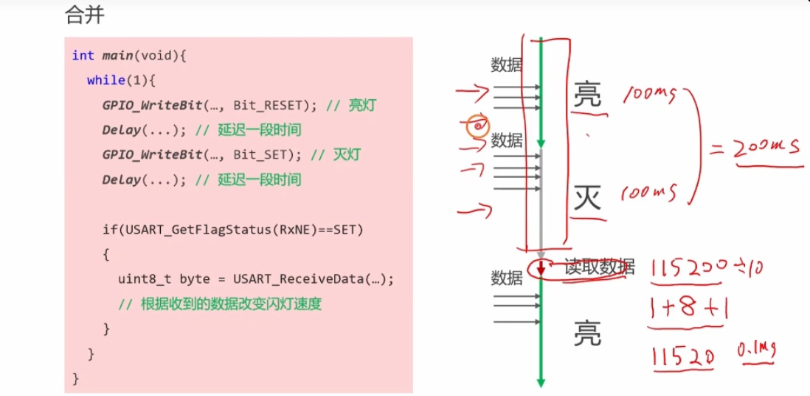

好的，这个视频是嵌入式开发中一个极其核心的概念——中断（Interrupt）的入门讲解。下面我将为你详细解析视频内容，进行知识扩展，并提供一系列有深度的面试题及答案，帮助你充分准备嵌入式的面试。


### 视频内容摘要

这个视频是“铁头山羊”STM32教程中关于**中断**的第一课，主要讲解了中断的基本概念，并通过一个编程实例来展示中断的作用。

**视频核心内容分为两部分：**

1. **中断的基本概念 (What is an Interrupt?)**

   - **核心定义：** 讲师将<span style="color:#CC0000;">中断</span>定义为“<span style="color:#CC0000;">单片机应对突发事件的一种方式</span>”。

   - **生活化类比：** 为了让概念更易于理解，视频用了三个生动的例子：

     

     - **看书时遇到蚊子：** 你的“主程序”是阅读。突然，“蚊子来了”（突发事件/中断请求）。你会**暂停**阅读，去执行“<span style="color:#CC0000;">拍蚊子”这个**中断服务程序**</span>。完成后，再**返回**继续阅读。
     - **跑步时鞋带开了：** 主程序是跑步，<span style="color:#CC0000;">中断是鞋带开了，中断服务是系鞋带</span>。
     - **玩游戏时快递到了：** 主程序是玩游戏，<span style="color:#CC0000;">中断是快递员敲门，中断服务是开门取快递</span>。

   - **引申到单片机：** 

     

     这个模型被直接映射到单片机编程中。<span style="color:#CC0000;">单片机正在执行`main`函数里的`while(1)`循环（**常规程序**），这时一个外部事件（如串口收到数据）发生，触发了**中断**。CPU会立即**暂停**当前的常规程序，跳转去执行一个预先写好的函数，即**中断服务函数 (ISR - Interrupt Service Routine)**。ISR执行完毕后，CPU再**自动返回**到之前被暂停的地方，继续执行常规程序。</span>

2. **中断编程举例 (Why Interrupts are Necessary)**

   - **问题提出：** 视频通过对比<span style="color:#CC0000;">两种程序结构</span>，展示了不使用中断的弊端。假设<span style="color:#CC0000;">一个程序需要同时做两件事</span>：**<span style="color:#CC0000;">闪烁LED</span>**和**<span style="color:#CC0000;">接收串口数据</span>**

     

     

   - **轮询方式（Polling）的弊端：** 如果将两个任务都放在`main`函数的`while(1)`循环里，程序会先执行闪灯（亮灯、长延时、灭灯、长延时），**然后**再去检查串口有没有数据。由于<span style="color:#CC0000;">闪灯的`Delay()`函数是**阻塞式**的</span>，会占用大量CPU时间。在<span style="color:#CC0000;">这段延时期间，串口可能已经收到了很多数据，但CPU却没空去处理，从而导致**数据丢失**</span>。

   

   <span style="color:#CC0000; font-size:1.2em;">注意：最终只会读取到 字节1 和 字节5 的数据，剩下的3个字节数据都会被覆盖掉。</span>

   - **中断方式的优势：** 正确的做法是将耗时短、需要及时响应的任务（如接收串口数据）放入中断中。程序的主循环`while(1)`只负责不那么紧急的任务（如闪灯）。当串口硬件收到一个字节的数据后，会立刻向CPU发出一个中断请求。CPU无论正在主循环里做什么，都会立即暂停，跳转到串口中断服务函数中，及时地把数据读走，然后再返回主循环。这样就保证了数据**不会丢失**，也提高了CPU的**整体效率**。

     

     <span style="color:#CC0000; font-size:1.2em;">注意：上述中圈起来的那些标志位都是可以产生中断的。</span>

   

------

---

<span style="font-weight:bold; color:#CC0000; font-size:1.3em;">提问1：你能够将视频中提到的这个数据计算的例子给我解释下吗，简洁回复下，不要长篇大论？</span>




好的，这个计算是为了<span style="color:#CC0000;">用具体数字来说明</span>**<span style="color:#CC0000;">为什么不使用中断（即轮询方式）会丢失串口数据</span>**。

这是一个简洁的解释：

<span style="font-weight:bold; font-size:1.2em;">1. 闪灯程序（主循环）的耗时</span>

- 从图中的手写笔记可以看出，程序`亮灯延时100ms` + `灭灯延时100ms`。
- 这意味着 `while(1)` 循环**<span style="color:#CC0000;">执行一圈至少需要200毫秒</span>**。在<span style="color:#0000CC;">这200毫秒的大部分时间里，CPU都在执行`Delay()`函数，处于“卡死”状态，无法做别的事情（比如检查串口）。</span>


<span style="font-weight:bold; font-size:1.2em;">2. 串口接收一个字节数据的耗时</span>

- **波特率 (Baud Rate):** `115200` bps，意思是<span style="color:#CC0000;">每秒可以传输 115200 个比特（bit）</span>。
- **数据帧 (Data Frame):** <span style="color:#CC0000;">串口通信时，发送一个字节（8 bit）的数据，通常还需要额外加上1个起始位和1个停止位。所以传输一个字节实际需要 `1 + 8 + 1 = 10` 个比特。</span>
- **计算：** 因此，接收一个字节所需的时间是 `10 bit / 115200 bit/s` ≈ 0.000087秒，约等于 **0.1毫秒**。


<span style="font-weight:bold; font-size:1.2em;">结论</span>

**耗时对比非常悬殊：**

- 主循环被延时函数**阻塞了200毫秒**。
- 而串口接收一个字节仅需**0.1毫秒**。

这意味着<span style="color:#CC0000;">，在主程序“卡住”的200毫秒内，串口硬件其实已经可以接收 **2000个**（200 / 0.1）字节的数据</span>。但<span style="color:#CC0000;">因为程序一直在延时，没有及时去`if`语句里读取，所以串口硬件接收缓冲区里的数据早就被后来的新数据一次又一次地**覆盖丢失**了。</span>

**这个计算有力地证明了：<span style="color:#CC0000;">对于高速、异步的数据，使用轮询是极其不可靠的，必须使用中断来确保数据不丢失。</span>**

---

---


### 知识补充与扩展

视频内容很精彩地解释了“是什么”和“为什么”，下面我为你补充一些更深层次的“怎么样”和“还有什么”。

- 中断处理的完整硬件过程（<span style="color:#CC0000;">CPU在幕后做了什么？</span>）

  当一个中断发生时，<span style="color:#CC0000;">CPU硬件</span>会自动完成一系列操作，这个过程通常<span style="color:#CC0000;">对程序员是透明</span>的：

  1. **现场保护 (Context Save)：** CPU会把当前正在执行的程序的重要信息（如程序计数器PC、通用寄存器、状态寄存器等）自动压入<span style="color:#CC0000;">当前任务的栈</span>中。这就像“在书上夹个书签，并记住自己刚才在想什么”。
  2. **向量跳转 (Vector Fetch)：** CPU会根据中断源（比如是哪个串口、哪个定时器）去一个叫做**中断向量表 (Interrupt Vector Table)** 的<span style="color:#CC0000;">固定地址区域</span>查找对应的<span style="color:#CC0000;">中断服务函数（ISR）的入口地址</span>。
  3. **执行ISR：** CPU跳转到该地址，开始执行你写的中断服务函数代码。
  4. **现场恢复 (Context Restore)：** 当ISR执行完毕（通常是一条特殊的中断返回指令），<span style="color:#CC0000;">CPU会自动将之前压入栈中的寄存器信息全部恢复回来。</span>
  5. **返回主程序：**<span style="color:#CC0000;"> 程序计数器PC被恢复，CPU从之前被打断的地方无缝地继续执行，仿佛什么都没发生过</span>。

- **中断的要素：中断优先级与中断嵌套**

  - **中断优先级 (Priority)：** <span style="color:#CC0000;">当多个中断同时发生时，CPU该先响应哪一个？</span>这就是由中断优先级决定的。每个中断源都可以被配置一个优先级，**优先级越高的中断会优先得到响应**<span style="color:#CC00CC;">。例如，一个用于紧急停机的外部按键中断，其优先级通常会高于一个普通的串口数据接收中断。</span>
  - **中断嵌套 (Nesting)：** <span style="color:#CC0000;">当一个低优先级的中断服务函数正在执行时，如果一个更高优先级的中断发生了，CPU会再次暂停当前（低优先级的）ISR，转而去执行那个更高优先级中断的ISR。</span>当高优先级的ISR执行完毕后，再返回继续执行低优先级的ISR。这个过程就叫做中断嵌套。**是否允许中断嵌套**通常是<span style="color:#CC0000;">可以配置</span>的。

- 中断与轮询的抉择 (The Trade-off)

  虽然中断效率高，但并非所有场景都必须用中断。

  - **何时用中断？**
    - 对**<span style="color:#CC0000;">实时性要求高</span>**的事件（如电机编码器信号、数据采集ADC转换完成）。
    - **<span style="color:#CC0000;">发生频率不确定</span>**的异步事件（如按键按下、串口数据到达）。
    - 需要**<span style="color:#CC0000;">唤醒低功耗模式下CPU</span>**的<span style="color:#CC0000;">事件</span>。
  - **何时用轮询？**
    - <span style="color:#CC0000;">实时性要求不高</span>，允许有一定延迟的场景。
    - <span style="color:#990000;">事件发生**频率非常高**</span>，如果用中断会导致CPU频繁进行上下文切换，反而降低效率的场景。
    - 硬件接口简单，本身就需要软件轮询来获取状态的设备（如某些SPI Flash的状态寄存器）。
  - **<span style="color:#FF0000;">核心思想</span>：** <span style="color:#CC0000;">中断</span>是**“<span style="color:#FF0000;">事件驱动</span>”**的，<span style="color:#CC0000;">轮询</span>是**“<span style="color:#FF0000;">状态查询</span>”**的。

- 编写ISR的注意事项（<span style="color:#CC0000;">面试高频考点</span>）

  <span style="color:#CC0000;">中断服务函数非常特殊，编写时必须遵循<span style="font-weight:bold;">“快进快出”</span>的原则</span>：

  1. **短小精悍：** ISR代码必须尽可能地简短高效，只做最核心、最紧急的操作（<span style="color:#CC0000;">如读取数据到缓冲区、设置一个标志位</span>）。
  2. **避免延时和耗时操作：** **<span style="color:#CC0000;">绝对不能</span>**<span style="color:#0000CC;">在ISR中使用软件延时 (`Delay`) 或任何可能阻塞的函数。</span>
  3. **避免复杂计算：** <span style="color:#CC0000;">复杂的计算和逻辑处理应该放在主循环中，ISR只负责触发和传递数据。</span>
  4. **共享资源保护：** <span style="color:#CC0000;">如果ISR和主程序要访问同一个全局变量，必须进行“原子操作”保护，比如在访问前关闭全局中断，访问后再打开，以防止数据竞争。</span>

------


### 面试问题与简洁回答

**问题1：核心概念**

- **问：** “请用你自己的话解释一下什么是中断，以及它和轮询（Polling）相比，核心优势是什么？”
- **答：** 中断是CPU处理**异步突发事件**的一种硬件机制。它的核心优势是**“事件驱动”**和**高效率**。相比于轮询需要CPU不断主动查询状态，中断允许CPU在空闲时处理其他任务，只有当事件发生时才被“打断”去处理，处理完再返回。这极大地提高了CPU的利用率和系统的实时响应能力。

**问题2：中断流程**

- **问：** “当一个外部中断触发后，CPU从暂停主程序到执行完中断服务函数再返回，这个过程中硬件和软件层面都发生了什么？”
- **答：** 这是一个**上下文切换**的过程。
  1. **<span style="color:#CC0000;">硬件层面</span>：** <span style="color:#CC0000;">CPU自动**保存现场**（将PC、寄存器等压入栈中），然后通过**中断向量表**找到并跳转到对应的中断服务函数（ISR）地址。ISR执行完毕后，硬件再自动**恢复现场**（出栈）。</span>
  2. **软件层面：** <span style="color:#CC0000;">执行我们预先编写好的ISR代码，完成对中断事件的处理。</span>

**问题3：中断优先级与嵌套**

- **问：** “什么是中断优先级和中断嵌套？为什么需要这个机制？”
- **答：**
  - **中断优先级**决定了当多个中断同时请求时，CPU应该先响应哪一个，确保**更重要的事件得到优先处理**。
  - **中断嵌套**允许一个高优先级中断打断一个正在执行的低优先级中断，这进一步保证了**关键任务的实时性不会被非关键任务所阻塞**。
  - 这个机制是构建可靠、实时系统的基础，它确保了系统的不同任务能按照其重要性等级被调度。

**问题4：ISR设计原则（考察工程素养）**

- **问：** “你在编写中断服务函数（ISR）时，会遵循哪些基本原则？为什么不能在ISR里面调用一个普通的延时函数？”
- **答：** ISR设计的核心原则是**“快进快出”**。我会确保ISR代码尽可能短小，只做最核心的、必须马上完成的工作，比如读取数据、设置标志位。**绝对不能在ISR中调用延时函数或执行任何长时间的循环**，因为中断期间通常会屏蔽其他同级或低级中断，长时间占用CPU会导致系统实时性严重下降，甚至“死机”。

**问题5：实际应用场景**

- **问：** “假设你在做一个项目，需要通过串口接收GPS模块每秒发送的一串数据。你是选择在主循环里轮询接收，还是使用串口接收中断？为什么？”
- **答：** 我会**毫不犹豫地选择使用串口接收中断**。
  - **原因：**
    1. **数据可靠性：** 轮询方式下，如果主循环因为处理其他任务而被阻塞，就极有可能错过GPS发来的数据，导致数据丢失或不完整。
    2. **CPU效率：** 使用中断，CPU可以在没有数据到达的绝大部分时间里去执行其他任务（如数据解析、UI刷新等），而不是浪费在`while`循环里空等数据。
    3. **实时性：** 中断能保证一旦数据到达，CPU会立即响应并进行处理，确保了数据处理的及时性。


# 补充提问：

## <span style="font-weight:bold; color:#CC0000; font-size:0.9em;">提问1：上述问题2中 硬件层面和软件层面发生的事情你能够再给我详细解释下吗，我感觉有点模糊？</span>

当然，非常乐意为你详细解释这个关键的过程。你的理解已经很接近了，我们把它拆解得更细致一些，就能彻底清晰了。

我们可以把这个过程想象成**CPU（硬件）**和**程序（软件）**之间的一次精妙配合。


### <span style="font-size:0.8em;"><span style="color:#CC0000;">硬件层面</span>：CPU的自动化流水线</span>

<span style="color:#CC0000;">当一个中断被触发时，CPU硬件会自动执行一套固定的、不可改变的流程</span>。这个过程非常快，完全<span style="color:#CC0000;">由芯片的电路逻辑完成，你的C代码无法干预</span>。

1. **触发与仲裁：**
   - 一个外部事件发生（比如串口接收完一个字节），对应的外设硬件会向一个叫做 **NVIC（嵌套向量中断控制器）** 的“中断管理员”发送一个请求信号。
   - NVIC会检查这个中断是否被允许（即有没有被屏蔽），以及它的**优先级**是否足够高，可以打断当前正在运行的程序。
2. **保存现场 (Context Save) - “记住我刚才在干嘛”**
   - 一旦NVIC决定响应中断，CPU会立即完成当前正在执行的那一条机器指令（确保指令的完整性）。
   - 然后，**硬件会自动地**将<span style="color:#CC0000;">几个关键寄存器</span>的当前值**压入栈（Stack）中**。这些寄存器就像是CPU的“短期记忆”，最重要的包括：
     - **PC (Program Counter):** 程序计数器，记录着下一条要执行的指令地址。<span style="color:#CC0000;">把它保存下来，CPU才能知道处理完中断后该从哪里继续。</span>
     - **LR (Link Register):** 链接寄存器，在函数调用时保存返回地址。
     - **PSR (Program Status Register):** <span style="color:#CC0000;">程序状态寄存器</span>，记录着当前的运算状态（比如是否有进位、结果是否为零等）。
     - **通用寄存器 (R0-R3, R12):** 保存一些临时数据。
   - 这个过程俗称**“入栈”**或**“压栈”**，是整个中断机制得以实现的基础。
3. **向量跳转 (Vector Fetch & Jump) - “翻阅手册，找到处理办法”**
   - CPU会<span style="color:#CC0000;">去内存的一个固定地址区域</span>，这个区域叫做**中断向量表 (Vector Table)**。这个表就像一本“应急预案手册”。
   - 每个中断源（如USART1、TIM2等）都在这个表里有一个固定的条目，该条目里存放的就是对应**中断服务函数（ISR）的入口地址**。
   - CPU根据触发的中断源，从向量表中**取出这个地址**，然后**加载到PC（程序计数器）中**。
   - PC一变，CPU的下一条指令就自然而然地跳转到了你的中断服务函数的第一行代码处。


### <span style="font-size:0.8em;">软件层面：程序员的工作</span>

硬件把舞台搭建好之后，就轮到我们写的C代码——中断服务函数（ISR）——登场了。

- **执行中断服务函数 (`void USART1_IRQHandler(void)`)**
  - 这就是你作为程序员需要编写的部分。CPU跳转过来后，就开始**逐行执行你在这个函数里写的C代码**。
  - 你的代码应该快速地完成几件核心事情：
    1. **处理事件：** 比如，通过 `USART_ReceiveData()` 读取串口数据寄存器里的数据，并存放到一个全局变量或缓冲区中。
    2. **清除中断标志位：** 这是**极其重要**的一步。你需要告诉外设：“我知道这个中断了，已经处理完了”，否则这个中断会一直触发，导致程序卡在中断里出不来。
- **中断返回**
  - 当你的ISR函数执行到末尾的 `}` 时，编译器会自动在这里插入一条特殊的中断返回指令（如 `BX LR`）。
  - CPU执行到这条指令时，就知道中断处理结束了，于是触发**硬件**再次介入。


### <span style="font-size:0.8em;">硬件层面：自动化的返场工作</span>

1. **恢复现场 (Context Restore) - “我想起来刚才干到哪了”**
   - CPU硬件会自动地将之前压入栈中的所有寄存器值**弹回（Pop）**到它们原来的位置。
   - PC寄存器被恢复成了中断发生前的值，其他寄存器的状态也和被打断时一模一样。
2. **返回主程序**
   - 因为PC寄存器已经恢复，CPU就从主程序被暂停的那一行代码后面，继续往下执行，仿佛从未被打断过一样。

**总结：**

- **硬件**负责的是整个中断的**“调度框架”**：**保存现场、跳转、恢复现场**。这个过程是自动的、高速的、固定的。
- **软件**负责的是中断的**“核心业务”**：在硬件搭建好的舞台上，**具体执行处理事件的代码**。

所以，整个流程是一个**硬件 -> 软件 -> 硬件**的无缝衔接过程。这种设计既保证了事件响应的**速度和确定性**（由硬件完成），又给予了开发者**处理事件的灵活性**（由软件完成）。


## <span style="font-size:0.8em;">提问2：下面这张图是现代电脑中的一个中断处理流程。</span>


非常感谢你的补充，这个信息非常关键！你说得对，如果这张图描述的是**现代电脑操作系统（如Windows/Linux）**的中断处理流程，那么它的画法就是完全合理的。

你没有搞混，你的困惑来源于一个非常核心的区别：**现代MCU和现代PC在中断处理上，硬件和软件的分工不同**。

我们来详细拆解一下这个过程，你马上就能明白了。

------


### <span style="font-size:0.8em;">电脑操作系统中的中断处理流程（你提供的图）</span>

在PC上，当一个硬件（比如网卡收到一个数据包）触发中断时，流程如下：

1. **硬件的初步响应（图中未画出，但实际发生）：**
   - CPU硬件检测到中断信号。
   - CPU**硬件自动**完成**最最核心**的现场保存。这通常只包括程序计数器（PC）和状态寄存器（Flags Register）等最关键的几个寄存器。这足以让CPU知道中断结束后该跳回到哪里。
   - CPU**硬件自动**跳转到操作系统内核预设好的一个总入口点（通过中断描述符表IDT查找）。
2. **进入内核的中断处理（图中流程的开始）：**
   - **`关中断`**：CPU此时已经进入了操作系统的内核代码。内核为了防止在处理这个中断时被其他中断再次打断，会先执行指令关闭（或屏蔽）其他中断。
   - **`保存现场`（软件层面）：** 你的记忆和图都是对的，这一步确实是在“中断服务程序”里。这里的“现场”指的是除了硬件已经自动保存的那些寄存器之外的**所有通用寄存器**（如EAX, EBX, ECX等）。因为内核接下来的处理代码可能会用到这些寄存器，所以必须**用软件指令（比如汇编的`PUSHAD`）把它们全部手动保存到栈上**。
   - **`执行中断服务程序`：** 内核代码执行，识别中断源，调用对应的驱动程序来处理具体事务（比如从网卡读取数据）。
   - **`恢复现场`（软件层面）：** 中断处理完毕后，内核**用软件指令（比如汇编的`POPAD`）把刚才手动保存的所有通用寄存器从栈里恢复**。
   - **`开中断`** 和 **`中断返回`**：内核重新打开中断，然后执行一条特殊的中断返回指令（如`IRET`）。
3. **硬件的收尾工作（图中未画出）：**
   - CPU硬件在收到`IRET`指令后，**自动**将第一步里**硬件保存**的那几个核心寄存器从栈里弹回。
   - 程序无缝地回到被打断的地方继续执行。

------


### <span style="font-size:0.8em;">总结与对比：谁来保存现场？</span>

**所以，你的困惑点在于“保存现场”这一步到底是谁干的。答案是：在电脑上，是硬件和软件接力完成的。**

- **在电脑上（你的图）：**
  - **硬件先跑第一棒：** 自动保存最核心的返回地址和状态。
  - **操作系统（软件）跑第二棒：** 手动保存其他所有通用寄存器，处理完再手动恢复。
  - 你看到的流程图，画的是**操作系统软件层面**的工作，它默认硬件已经完成了第一步的跳转。
- **在单片机上（我之前的解释）：**
  - **硬件几乎跑了全程：** ARM Cortex-M内核的硬件设计得非常先进，它把“保存核心寄存器”和“保存通用寄存器”的大部分工作都**自动化**了。当中断发生时，硬件**一次性地**把PC、LR、xPSR、R0-R3、R12等多个寄存器全部自动压栈。
  - **结果就是，** 对于单片机来说，程序员写的那个中断服务函数（ISR）一上来就可以直接用C语言写业务逻辑，**几乎不需要关心保存现场的问题**，因为硬件已经帮你做好了。

**一句话帮你理清：**

- **电脑中断：** 硬件只做了最少的保存，操作系统内核（软件）需要做大量的保存和恢复工作。
- **STM32中断：** 硬件做了大部分的保存工作，程序员（软件）基本不用操心保存寄存器的事情。

所以，你和图都没有错，只是观察的“平面”不同。STM32把这个过程对程序员大大简化了。


## <span style="font-size:0.8em;">提问3：为什么这两者会不同呢，电脑中的按照我的理解就是，我们不同的应用程序在内存中定义的变量也不一样，它们对应的是内存中的不同存储单元，我们这里在操作系统内部的保存现场应该就是保存这些变量的值吧，就是保存它们的地址和值保存起来，因为不同的程序定义变量不同，所以这个保存现场操作只能够在中断处理程序中来完成。而stm32单片机中按照我的理解就是，由于我们在中断服务函数中只是做一些简单地处理（对一些外设寄存器进行写入读取操作），不会涉及到定义变量操作，所以也就在中断服务函数中也就没有这个保存现场操作了。我这样的理解对吗。还有这里压栈保存是把原来的PC PSW等通过硬件自动保存的，还有在中断服务中通过软件保存的，压入哪个栈呢，给我解释下</span>

你的思考非常深入，已经从“是什么”进入到了“为什么”的层面。你的理解中有非常正确的部分，但也存在一些普遍且容易混淆的误区。我们来逐一剖析，这个问题非常关键。


### <span style="font-size:0.8em;">你的理解对吗？</span>


**部分正确，但核心原因需要修正。**

#### <span style="font-size:0.9em;">1. 关于电脑的“保存现场”：保存的是CPU的“大脑状态”，而不是内存里的“所有变量”。</span>

你的理解：“因为不同程序变量不同，所以保存现场要在中断程序里（软件）完成”，这个推导过程是**不准确**的。

- “现场”到底是什么？

  中断时需要保存的“现场(Context)”，主要指的是 CPU内部几十个寄存器 的状态，而不是内存中成千上万的变量。这些寄存器包括：

  - **程序计数器(PC):** 下一条指令在哪。
  - **栈指针(SP):** 当前的栈顶在哪。
  - **通用寄存器(EAX, EBX...):** 正在进行的计算的中间结果。
  - **状态寄存器:** 当前计算的状态（比如结果是否为负）。

  你可以把CPU想象成一个正在做菜的厨师，内存是他的大仓库。中断就像有人叫他去接个电话。“保存现场”不是把整个仓库的食材（内存里的变量）都打包，而是记下：**菜谱翻到了哪一页（PC），手里的勺子和锅铲放在哪（通用寄存器），火候调到多大（状态寄存器）**。只要记下这些“CPU状态”，厨师接完电话回来就能无缝继续做菜。

- 为什么电脑OS用软件保存？

  因为现代OS需要管理非常复杂的进程和线程，硬件自动保存的几个核心寄存器不够用。操作系统内核需要完整的控制权，用软件来保存所有通用寄存器，才能完美地实现进程的调度和隔离。所以，不是因为变量不同，而是因为OS需要进行更复杂的管理。


#### <span style="font-size:0.9em;">2. 关于单片机的“保存现场”：不是因为不用变量，而是因为硬件太强大了。</span>

你的理解：“因为中断函数里很简单，不定义变量，所以硬件就自动完成了”，这个因果关系是**说反了**。

- **中断函数可以有变量：** 中断服务函数（ISR）本质上也是一个C函数，你**完全可以在里面定义局部变量**。当你定义局部变量时，编译器会自动生成代码利用栈来存取它们。

- 为什么你不用操心？

  你在STM32里之所以不用手动写代码保存现场，不是因为ISR简单，而是因为Cortex-M内核的硬件太智能了。硬件自动完成了大部分寄存器的保存和恢复工作，编译器也知道这一点。所以当你写C代码时，编译器可以放心地使用那些已经被硬件自动保存好的寄存器，整个过程对你是透明的，让你感觉“好像没有保存现场这个操作”。

------


### <span style="font-size:0.8em;">现场保存在哪个栈？—— 这是区分操作系统和裸机的关键</span>

你的第二个问题非常棒：数据到底压入了哪个栈？


#### <span style="font-size:0.9em;">在电脑中（有操作系统）：压入**内核栈 (Kernel Stack)**</span>

现代操作系统为每个进程都分配了两个栈：

- **用户栈(User Stack):** 你的应用程序平时运行时用的栈。
- **内核栈(Kernel Stack):** 当你的程序需要操作系统提供服务（即系统调用）或者发生中断时，CPU会从用户模式切换到权限更高的**内核模式**，并**自动切换**到这个进程专属的**内核栈**上。

所以，中断发生时，所有的现场信息（无论是硬件自动保存的还是软件手动保存的）都被压入了**当前进程的内核栈**中。这样做是为了**安全和隔离**，防止应用程序的栈溢出等问题破坏到操作系统内核。


#### <span style="font-size:0.8em;">在单片机中（裸机/RTOS）：</span>

- **裸机环境：** 通常整个系统只有一个栈，即**主栈 (Main Stack)**。中断发生时，现场信息就被压入这个**当前正在使用的唯一的栈**中。
- **RTOS环境：** 在RTOS中，**每个任务都有自己独立的栈**。中断发生时，现场信息会被压入**当前正在运行的那个任务的栈**中。这也是为什么RTOS中每个任务都需要你为其分配独立栈空间的核心原因。


## <span style="font-size:0.8em;">提问4：那么在一个函数中定义的变量如果不进行保存的话，那么当中断返回的时候不会被其他中断函数给修改吗？</span>

这是一个非常非常好的问题，它触及了函数调用和内存管理的核心。你的顾虑非常合理，但幸运的是，现代处理器和编译器已经通过一个精巧的机制完美地解决了这个问题。

答案是：**不会，在一个函数中定义的局部变量（Local Variables）绝对不会被另一个中断函数“意外”修改。**

原因就在于一个叫做**“栈”（Stack）**的神奇内存区域。

------


### “栈”：为每个函数提供独立的办公桌

你可以把“栈”内存想象成一摞无限高的、干净的**办公桌**。


#### 1. 普通函数调用过程

1. **进入函数：** 当你的 `main()` 函数调用另一个函数，比如 `func_A()` 时，CPU会在这摞办公桌的**最顶上**放一张**新的、干净的桌子**。这张新桌子就是 `func_A()` 的专属工作区，术语叫**栈帧（Stack Frame）**。
2. **创建局部变量：** 你在 `func_A()` 里定义的所有**局部变量**（比如 `int a; char b;`），都会被放在这张**新桌子**上。`main()` 函数的变量则还在它自己的那张旧桌子上，两者互不干扰。
3. **退出函数：** 当 `func_A()` 执行完毕返回时，CPU会把这张**新桌子连同上面的所有东西（局部变量）一起扔掉**，彻底销毁。工作区回到 `main()` 函数原来的那张桌子。


#### 2. 中断发生时的过程

**中断发生时，这个过程是完全一样的，只是由硬件自动触发！**

1. **中断触发：** 你的 `main()` 函数正在它自己的“办公桌”（栈帧）上工作。突然，一个串口中断来了。
2. **硬件保存现场：** CPU硬件自动地把当前 `main()` 函数的“工作进度”（PC、寄存器等）**记录并保存在 `main()` 函数的这张桌子上**（即压入当前栈）。
3. **为中断函数分配新桌子：** 接着，CPU立刻在**顶上又放了一张全新的、干净的办公桌**，这张新桌子专属于中断服务函数 `USART1_IRQHandler()`。
4. **中断函数中的变量：** 如果你在中断服务函数中定义了任何局部变量（比如 `uint8_t received_data;`），这个变量就存放在这张**专属于中断函数的新桌子**上。它和下面 `main()` 函数桌子上的变量处于完全隔离的空间。
5. **中断返回：** 中断服务函数执行完毕后，它这张**新桌子被立即销毁**。然后，CPU硬件根据第2步保存的“工作进度”，完美地恢复了 `main()` 函数的所有状态，继续在它原来的桌子上工作。

**图形化理解：**

```
    |-------------------|  <-- 栈顶 (Stack Pointer)  <-- 中断来了，为ISR分配新空间
    | ISR的局部变量   |
    |-------------------|  <-- ISR的栈帧
    | 硬件保存的现场  |
    |-------------------|  <-- main函数的栈顶
    | main的局部变量  |
    |-------------------|  <-- main函数的栈帧
    | ... (更多栈内容) |
    |-------------------|
```

当ISR返回时，顶部的“ISR栈帧”和“硬件保存的现场”都会被弹出，栈顶指针回到原来的位置。

------


### 真正需要担心的是什么？—— 全局变量和静态变量

你所担心的“数据被修改”的问题，真正会发生在**全局变量 (Global Variables)** 和 **静态变量 (Static Variables)** 上。

- 因为这些变量**不存放在栈上**，而是存放在一个固定的、所有函数（包括主程序和所有中断函数）都能访问的**共享内存区域**（.data或.bss段）。
- 如果在主程序正在修改一个全局变量的过程中，一个中断发生，并且这个中断服务函数也去修改**同一个**全局变量，那么就会发生数据竞争，导致程序出错。
- 这也就是为什么我们在处理**主程序和中断共享的全局变量**时，必须进行**关中断**等保护操作的原因。

**总结：**

- **局部变量是安全的**，因为每个函数（包括ISR）都有自己独立的栈空间（“办公桌”），函数结束时空间自动回收，互不影响。
- **全局/静态变量是危险的**，因为它们是共享的，必须通过关中断或互斥锁等手段来保护，防止并发修改。


