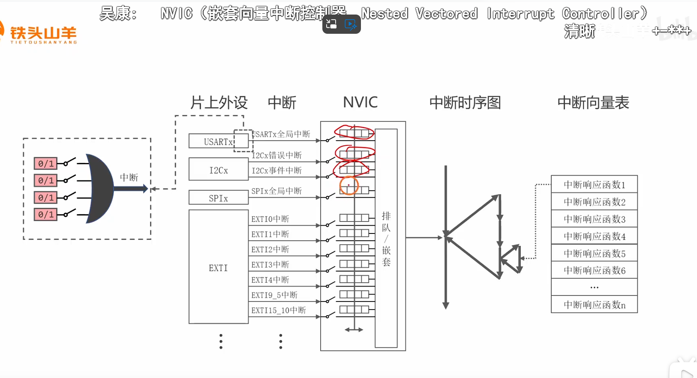
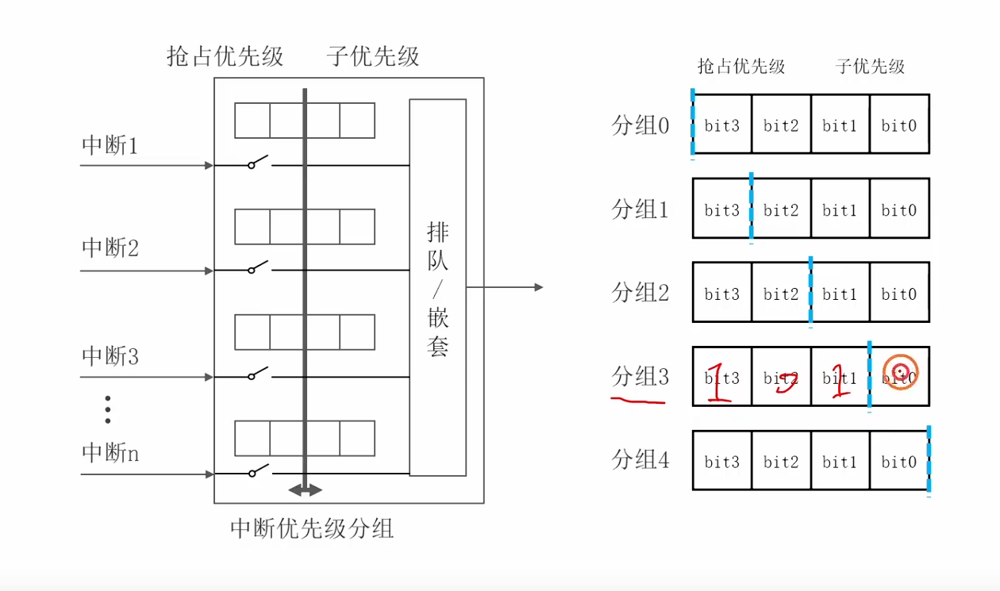
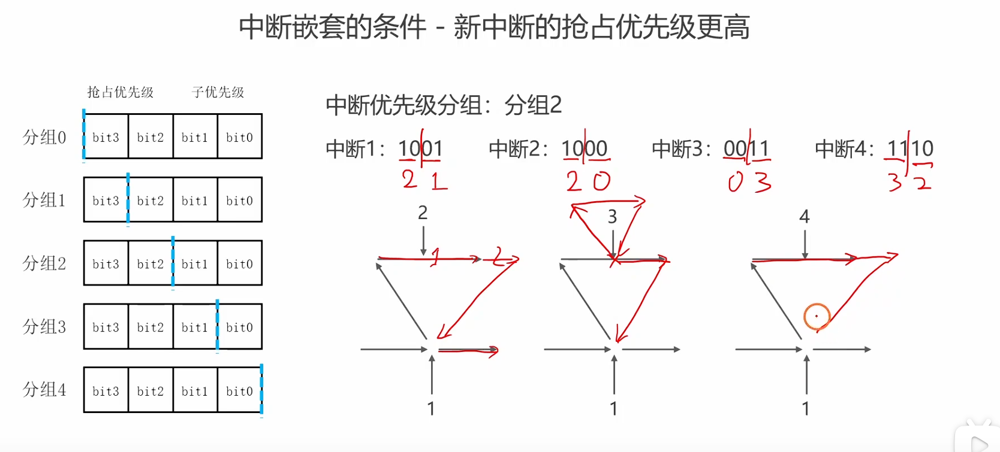
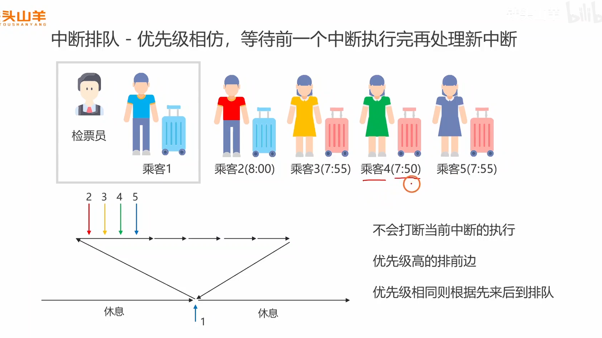

好的，这个视频是上一节“中断概念”的完美进阶，深入讲解了中断系统中至关重要的**优先级**机制。这部分内容是嵌入式面试中的绝对高频考点。

下面我将为你详细解析视频内容，进行知识扩展，并提供一系列经典且有深度的面试题及简洁回复。

### 视频内容摘要

这个视频详细介绍了STM32（基于ARM Cortex-M内核）中断优先级的概念、表示方法以及两个核心优先级——**抢占优先级**和**子优先级**——是如何协同工作的。

**视频核心内容可以分为以下几个关键点：**

1. **中断优先级的概念：**

   - **为什么需要优先级？** 因为系统中的突发事件有轻重缓急之分。中断优先级就是用来表示中断的“紧急程度”的。

   - **核心原则：** 当多个中断同时发生时，CPU会优先响应**优先级更高**的中断。

   - **生动类比：** 视频用了“医生看病”的例子来类比两种情况：

     

     - **中断排队：** 医生正在给病人1看病，此时来了病情差不多的病人2和病人3。医生会先看完病人1，然后再根据2和3的紧急程度（比如谁要赶火车）决定下一个看谁。这说明优先级可以决定**等待执行**的中断的先后顺序。

       

     - **中断嵌套（抢占）：** 医生正在给普通病人4看病，突然来了一个需要急诊的危重病人5。医生会**立即暂停**对病人4的诊治，转而去处理危重病人5。处理完后，再回来继续给病人4看病。这说明**更高优先级的中断可以打断正在执行的低优先级中断**。

2. **中断优先级的表示方法 (NVIC)：**

   

   - **硬件基础：** 视频展示了STM32中断处理的硬件框图，指出所有片上外设的中断请求都会汇总到**NVIC（嵌套向量中断控制器）**中进行统一管理。
   - **优先级寄存器：** NVIC为每个中断通道都提供了一个**4位的寄存器**来设置其优先级。
   - **抢占优先级 vs 子优先级：** 这是本节课的精髓。STM32的这4位优先级被分成了两个部分：
     - **抢占优先级 (Preemption Priority)：** 决定了一个中断**能否打断**另一个正在执行的中断。
     - **子优先级 (Sub-priority / Subpriority)：** 决定了当多个**抢占优先级相同**的中断同时发生时，**谁先被执行**。
   - **规则：** 优先级的数值**越小**，代表其优先级**越高**。

3. **中断优先级分组 (Priority Grouping)：**

   

   - **作用：** 决定了上述4个比特位如何划分给“抢占优先级”和“子优先级”。
   - **分组方式：** STM32提供了5个分组选项（0-4）。例如，选择“分组2”，则4个比特位中的高2位用于表示抢占优先级（有22=4个级别），低2位用于表示子优先级（也有22=4个级别）。

4. **抢占与嵌套，子级与排队：**

   - **抢占优先级决定能否“插队”（中断嵌套）：** 只有当新来的中断的**抢占优先级**高于（即数值小于）当前正在执行的中断的抢占优先级时，才会发生中断嵌套。

     

   - **子优先级决定“谁先来”（中断排队）：** 如果多个中断的**抢占优先级相同**，它们之间不能互相嵌套。当它们同时请求时，NVIC会根据它们的**子优先级**来决定谁先执行。

     

------

### 知识补充与扩展

视频对STM32的中断优先级讲解得非常清晰。在此基础上，我们进行一些横向和纵向的扩展。

- 为什么要设计“抢占”和“子”两种优先级？

  这套双层优先级系统为嵌入式系统设计提供了极大的灵活性。

  - **抢占优先级**是保证**硬实时**性能的关键。例如，一个控制电机运行的PWM“刹车”中断，必须能够立即抢占一个正在进行数据打印的串口中断，否则可能发生危险。因此，“刹车”中断的抢占优先级必须设置得更高。
  - **子优先级**则提供了一种**有序处理非抢占性任务**的能力。例如，你有两个串口，它们的中断处理逻辑都不希望被对方打断（抢占优先级设为相同），但你希望串口1的数据总是比串口2的优先处理，这时就可以将串口1的子优先级设置得比串口2更高。

- NVIC (Nested Vectored Interrupt Controller) 的深层意义

  NVIC是ARM Cortex-M内核相比于传统单片机（如51、AVR）的一大优势。它不仅仅是管理优先级，其“Vectored（向量）”的特性使得中断响应非常快。当一个中断被响应时，CPU可以直接从中断向量表中获取对应ISR的地址并跳转，省去了传统单片机中需要软件查询中断源的耗时过程。这使得Cortex-M内核具有非常低的中断延迟 (Interrupt Latency)。

- 中断优先级在RTOS中的关键应用

  这是面试中非常容易与中断优先级结合起来考察的知识点。

  - 在FreeRTOS这样的实时操作系统中，内核本身会使用到几个中断，最关键的是**SysTick中断**（用于产生系统节拍和任务调度）和**PendSV中断**（用于执行上下文切换）。
  - FreeRTOS引入了一个极其重要的概念：`configMAX_SYSCALL_INTERRUPT_PRIORITY`。这是一个在`FreeRTOSConfig.h`中定义的宏。
  - **规则：**
    1. 任何需要调用FreeRTOS API的中断（例如在ISR中发信号量`xSemaphoreGiveFromISR`），它的优先级**绝对不能高于** `configMAX_SYSCALL_INTERRUPT_PRIORITY`（即其**数值必须大于或等于**该宏定义的值）。
    2. 如果某个中断需要极低的延迟，并且其ISR中**不调用任何RTOS API**，那么可以把它设置为比这个宏更高的优先级（即数值更小）。
  - **原因：** 这是为了保护RTOS内核的临界区代码不被意外中断，确保内核数据结构的一致性和系统的稳定性。这个配置有效地将中断分为了“**RTOS可管理的中断**”和“**纯硬件级中断**”两个类别。

------

### 面试问题与简洁回答

**问题1：核心概念辨析 (必考)**

- **问：** “在STM32中，抢占优先级和子优先级有什么本质区别？请分别举例说明它们的应用场景。”
- **答：** 本质区别在于：**抢占优先级决定能否“中断别人”，而子优先级决定能否“优先排队”**。
  - **抢占优先级**用于处理不同紧急程度的任务，一个高抢占优先级的中断可以打断正在执行的低抢占优先级中断，这称为“中断嵌套”。例如，一个紧急的“掉电保护”中断（抢占级0）必须能打断一个普通的“按键扫描”中断（抢占级1）。
  - **子优先级**用于处理多个抢占优先级相同的任务。它们之间不能互相打断，但如果同时触发，子优先级高的（数值小）会先执行。例如，两个串口中断抢占级都设为2，但设置串口A的子优先级为0，串口B为1，那么当它们同时收到数据时，串口A的中断会先被处理。

**问题2：配置与系统设计**

- **问：** “STM32的中断优先级分组有什么作用？如果你的系统需要很多可嵌套的中断层级，你会选择哪个分组？如果需要很多不会互相打断但有先后顺序的中断，又该如何选择？”
- **答：** 优先级分组的作用是**划分4个优先级比特位给抢占优先级和子优先级**。
  - 如果需要**很多嵌套层级**，我会选择**分组0**，因为它把所有4位都分给了抢占优先级，可以提供16个可嵌套的抢占级别。
  - 如果需要**很多不会互相打断但有先后顺序**的中断，我会选择**分组4**，因为它把所有4位都分给了子优先级，可以提供16个不同的排队顺序，但所有中断之间都不能嵌套。

**问题3：问题排查 (考察实战经验)**

- **问：** “在一个项目中，你发现一个高优先级的ADC中断，有时无法及时响应，似乎被一个低优先级的串口中断给阻塞了。你认为最可能的原因是什么？”
- **答：** 最可能的原因是**中断优先级配置错误**。具体来说，ADC中断的**抢占优先级**被设置得**等于或低于**（即数值大于或等于）串口中断的抢占优先级。只有抢占优先级的数值更小，才能实现中断嵌套。很可能是我只设置了更高的子优先级，而子优先级是不能触发中断嵌套的。

**问题4：与RTOS结合 (考察知识体系广度)**

- **问：** “在FreeRTOS项目中，FreeRTOSConfig.h里的`configMAX_SYSCALL_INTERRUPT_PRIORITY`这个宏是做什么用的？它如何影响你对其他外设中断优先级的设置？”
- **答：** 这个宏定义了一个“**API安全优先级界限**”。
  - 任何需要在中断服务函数中调用FreeRTOS API（`...FromISR`结尾的函数）的外设中断，其**抢占优先级绝对不能高于这个界限**（即数值必须大于或等于这个宏的值）。
  - 这条规则保证了RTOS内核在执行临界操作时不会被这些中断打断，从而确保了系统的稳定。对于那些不调用RTOS API但要求极高实时性的中断，可以设置为比这个界限更高的优先级。

**问题5：深层原理**

- **问：** “请解释一下‘中断向量表’。为什么说它是Cortex-M内核中断响应速度快的一个重要原因？”
- **答：** 中断向量表是内存中一个**存放中断服务函数（ISR）入口地址的数组**。每个中断源在表中都有一个唯一且固定的位置。当中断发生时，NVIC会直接告诉CPU这是几号中断，CPU利用这个号作为索引，直接从向量表中取出ISR的地址并跳转执行。这个过程完全由硬件完成，**省去了传统单片机需要用软件去查询中断源的步骤**，因此极大地降低了中断延迟，响应速度非常快。