好的，这门课程非常适合嵌入式学习和面试准备。视频内容讲解清晰、实操性强，非常适合初学者。下面我将为你进行详细的梳理、补充扩展，并提出有深度的面试级问题与回复。


## 视频核心内容总结

这是一个关于 **STM32 单片机串口中断编程** 的入门实践教程。视频通过一个具体实验，循序渐进地讲解了<span style="color:#CC0000;">如何利用中断机制实现 PC 对单片机的异步控制。</span>

核心目标：

<span style="color:#0000CC;">通过电脑上的串口调试助手发送不同的字符（'0', '1', '2'），来控制 STM32 开发板上 LED 灯的闪烁速度（慢、中、快）</span>。

**实验步骤（编程逻辑）：**

1. **编写基础闪灯代码：** 在主循环 `while(1)` 中实现基本的 LED 亮灭和延时逻辑。<span style="color:#CC0000;">关键点</span>是<span style="color:#CC0000;">延时时间</span>使用一个<span style="color:#CC0000;">**全局变量 `blinkInterval`** 来控制</span>，为后续中断修改它做好铺垫。

   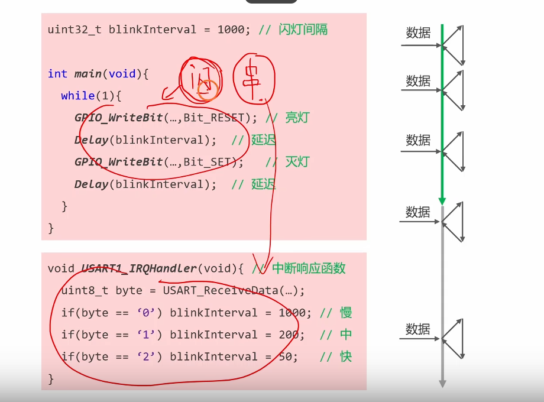

   

   <span style="color:#CC0000;">实时改变程序中的变量值（技巧）：</span>

   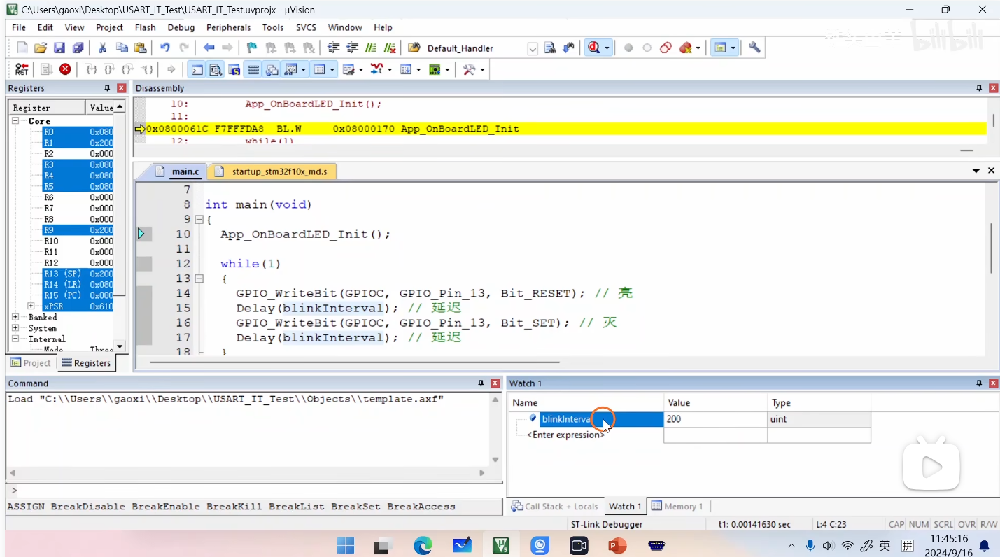

2. **初始化串口 (USART)：**

   - 配置 GPIO 引脚：将 PA9 (TX) 配置为复用推挽输出，PA10 (RX) 配置为浮空/上拉输入。

   - 配置 USART1 本身：设置波特率 (115200)、数据位 (8)、停止位 (1)、无校验位等参数。

     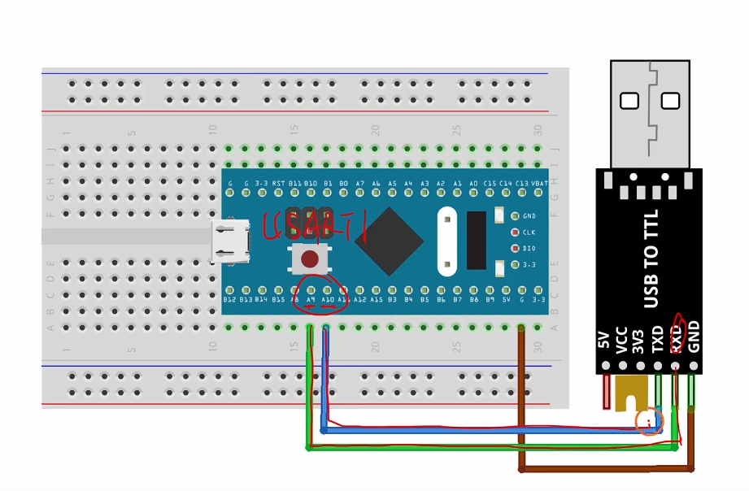

3. **使能<span style="color:#CC0000;">串口接收中断 (RXNE)</span>：** 配置 USART1，使其在<span style="color:#CC0000;">**接收到数据**（即 `RXNE` 标志位置位）时能够产生中断信号</span>。

   

   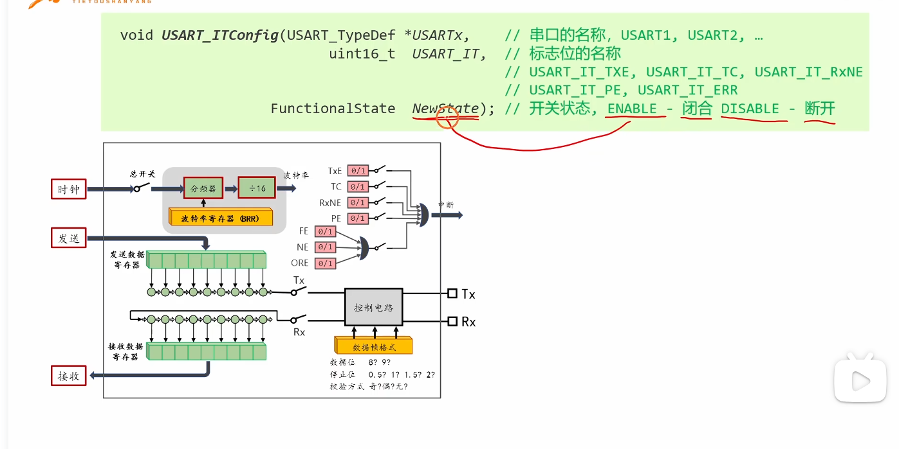

   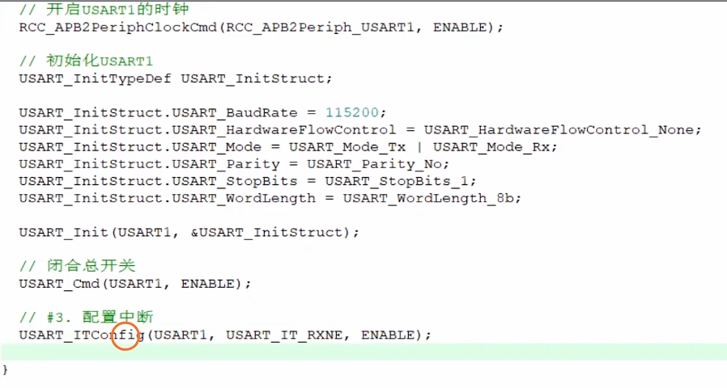

4. **配置 NVIC (嵌套向量中断控制器)：**

   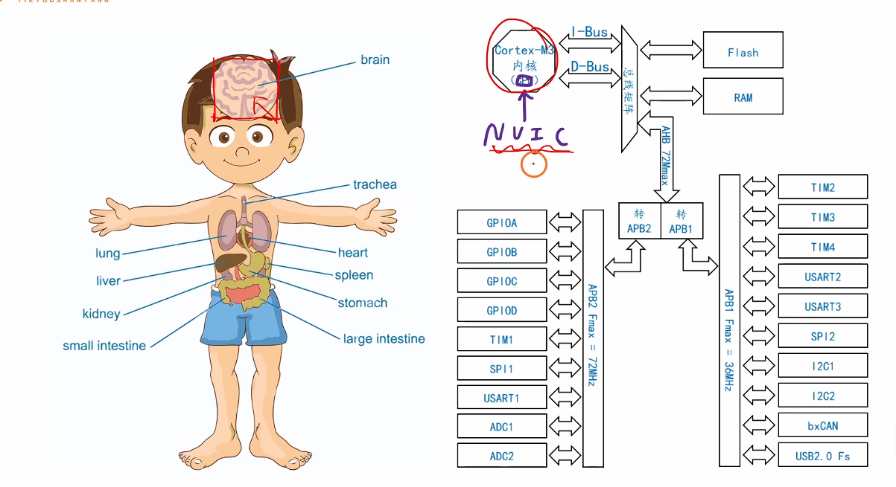

   - 设置中断优先级分组。

     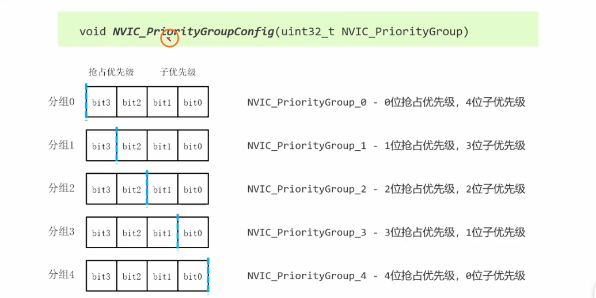

   - 配置 USART1 的中断通道，包括抢占优先级和子优先级。

   - 使能该中断通道。

     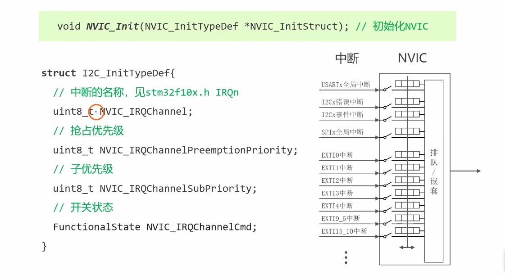

   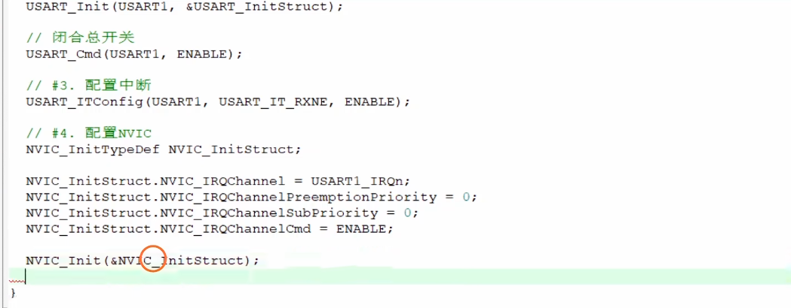

5. **编写中断服务函数 (ISR - Interrupt Service Routine)：**

   - 函数名必须与启动文件中定义的一致 (`USART1_IRQHandler`)。
   
   - 在函数内部，首先判断是否是“接收数据寄存器非空”中断 (`USART_FLAG_RXNE`)。
   
   - 读取串口接收到的数据。
   
   - 根据数据的值 ('0', '1', '2')，修改全局变量 `blinkInterval` 的值。
   
     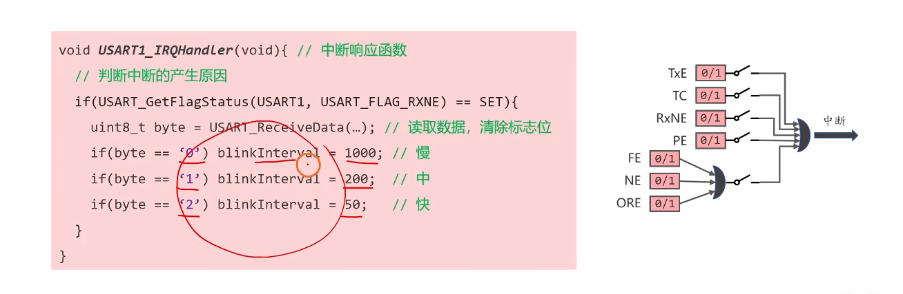

核心思想：

<span style="color:#CC0000;">主程序</span>负责<span style="color:#CC0000;">循环执行“闪灯”</span>这个常规任务，而<span style="color:#CC0000;">中断</span>则负责<span style="color:#CC0000;">处理“接收串口数据”这个异步、突发的事件</span>。当中断发生时，CPU 会暂停主程序，跳转执行中断服务函数来更新闪灯速度，执行完毕后再返回主程序继续执行。这完美体现了中断“打断常规，处理紧急”的核心作用。

------


## <span style="font-size:0.9em;">提问1：下面这个中断的逻辑或门，与开关为中断屏蔽，对这两个部分的理解你能够给我详细解释下吗，我还是有点不太清晰？</span>

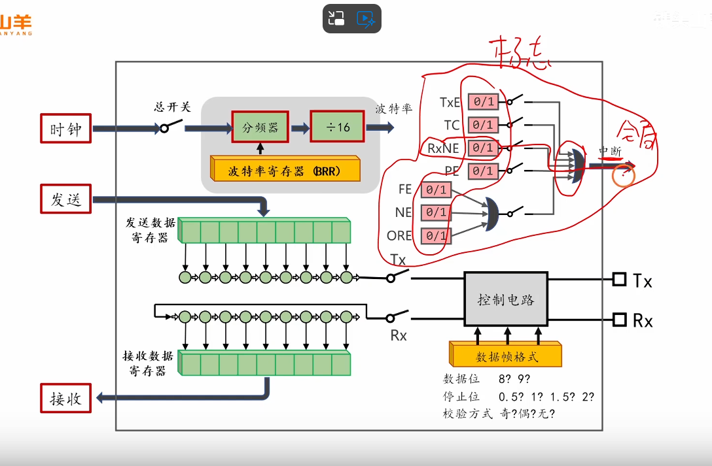


当然可以！这是一个非常核心且重要的概念，理解了它，你对单片机中断的理解会深入一大步。我们用一个生动的比喻来彻底搞懂它。

想象一下你家里有一个**中央安防系统**。这个系统连接着你家所有房间的**传感器**：

- 客厅的**烟雾传感器** (`RXNE` - 收到数据了)
- 厨房的**燃气泄漏传感器** (`ORE` - 数据覆盖了)
- 大门的**红外传感器** (`TXE` - 可以发新数据了)
- 窗户的**玻璃破碎传感器** (`FE` - 数据出错了)

这个安防系统最终只会发出**一个警报**：“家里出事了！”。然后你（CPU）才会去查看具体是哪个房间出了问题。

现在，我们来分别解释图中的两个部分：


#### 1. 逻辑或门 (或门) - “警报汇总器”

- 它是什么？

  在数字电路中，“或门”的逻辑非常简单：只要任何一个输入是“1”（有信号），它的输出就是“1”（发出信号）。只有当所有输入都是“0”时，它的输出才是“0”。

- 在这里的作用是什么？

  <span style="color:#CC0000;">这个“或门”就相当于你家的中央警报主机。图中的 TXE, TC, RXNE, FE 等都是状态标志位，它们就是前面提到的各种“传感器”。</span>

  - 当串口**接收**到新数据时，`RXNE` 标志位由硬件自动置为“1”。
  - 当串口**发送**完一个数据，发送寄存器空了时，`TXE` 标志位由硬件自动置为“1”。
  - 当发生奇偶校验错误时，`PE` 标志位由硬件自动置为“1”。

  **<span style="color:#CC0000;">或门的作用就是把所有这些独立的事件信号汇集起来</span>。** <span style="color:#FF0000;">只要 `TXE`、`RXNE` 或者其他任何一个标志位变成了“1”，这个或门的输出就会变成“1”，然后向CPU的中断控制器（NVIC）发出一个统一的、最终的**“串口中断请求”**信号。</span>

- 简单来说：

  或门告诉你**“<span style="color:#FF0000;">串口有事发生了”，但它不具体告诉你“发生了什么事</span>”**。它<span style="color:#CC0000;">只负责汇总并触发警报。至于具体是什么事（是收到了数据还是发送完成了？），需要你（CPU）在中断服务函数里自己去查询判断</span>。

------

#### 2. 开关 (中断屏蔽位) - “传感器的独立开关”

- 它是什么？

  图中的<span style="color:#CC0000;">每一个“开关”</span>实际上是<span style="color:#CC0000;">中断使能位</span>，也叫<span style="color:#CC0000;">中断屏蔽位</span> (Interrupt Mask)。它们存在于<span style="color:#CC0000;">串口的控制寄存器中（例如 USART_CR1 寄存器）。你可以通过写代码来“打开”或“关闭”这些开关。</span>

- 在这里的作用是什么？

  这些开关让你拥有了选择权，<span style="color:#CC0000;">决定哪些事件有资格去触发最终的警报</span>。

  - **场景1：你只关心接收数据。** 你就可以在初始化代码里，只“闭合”`RXNE` 后面的那个开关（即设置 `RXNEIE` 位为1），而让其他开关（如 `TXEIE`）保持“断开”（为0）。这样一来，<span style="color:#CC0000;">即使发送寄存器空了（`TXE` 标志位置1），它的信号也因为开关是断开的，无法到达或门，也就不会产生中断。</span>只有当 `RXNE` 标志位置1时，信号才能通过闭合的开关闭合，触发或门，最终产生中断。
  - **场景2：<span style="color:#CC0000;">你既关心接收，也关心发送完成</span>。** 那么<span style="color:#CC0000;">你就可以把 `RXNE` 和 `TC` 两个事件对应的开关都“闭合”。</span>

- 简单来说：

  这些“开关”就是你家安防系统里每个传感器的独立开关按钮。你出门时，可以选择只打开大门和窗户的传感器，而关闭厨房的燃气传感器（因为你在炖汤）。<span style="color:#CC00CC;">“屏蔽”就意味着你主动忽略某个事件，不让它来打扰你。</span>


#### 总结与流程梳理

现在我们把这两个部分串起来，看看一个完整的串口接收中断是如何发生的：

1. **事件发生：** 外部设备通过串口发送了一个字节的数据过来。
2. **标志位置位：** STM32的串口硬件检测到数据，自动将 **`RXNE` 状态标志位** 置为 '1'。
3. **中断使能检查：** CPU检查你之前配置的“开关”（即**中断屏蔽位 `RXNEIE`**）。因为你在程序里已经把它“闭合”（使能）了，所以这个'1'的信号可以通过。
4. **信号汇总：** `RXNE` 的 '1' 信号到达了 **“或门”** 的输入端。
5. **触发中断：** <span style="color:#CC0000;">“或门”的输出变为'1'，向 **NVIC（中断控制器）** 发出一个强烈的信号：“USART1 请求中断！”</span>
6. **CPU响应：** <span style="color:#FF0000;">NVIC通知CPU，CPU立刻放下手头的主循环工作，跳转到预设的 `USART1_IRQHandler()` 中断服务函数中。</span>
7. **查询与处理：** <span style="color:#FF0000;">在中断服务函数里，你的代码需要查询状态寄存器，确认“哦，原来是 `RXNE` 标志位被置1了”，然后读取数据，并清除标志位，完成处理。</span>

希望这个比喻和分步解释能让你对这个机制有一个清晰、深刻的理解！这是嵌入式编程中非常基础且关键的一环。


### 提问2：它只负责汇总并触发警报。至于具体是什么事（是收到了数据还是发送完成了？），需要你（CPU）在中断服务函数里自己去查询判断。 这句话要怎么理解呢，你能够给我详细解释下吗？

您这个问题问到了点子上，这正是<span style="color:#FF0000;">理解中断处理流程的关键一步</span>。之前那个比喻非常好，我们继续用它来把这个概念彻底讲透。


#### 详细解释：一通报警电话 vs. 具体的火情报告

**前情回顾：**

- **各个状态标志位（`RXNE`, `TXE` 等）** = 每个房间的烟雾、燃气传感器。
- **逻辑或门** = 中央警报主机。
- **<span style="color:#FF0000;">一个统一的“串口中断”信号</span>** = 中央警报主机打给你的**唯一一通报警电话**。


##### <span style="font-size:1.2em;">1. 中断触发：你只接到一通“模糊”的报警电话</span>

当中断发生时，CPU 的体验就像这样：

> 你的手机响了，来电显示是“**家庭安防系统**”。你接起电话，里面只传来一个自动语音：“**警报！请立即处理！**” 然后电话就挂了。

请注意，这通电话只告诉了你**两件事**：

1. **是谁打来的**：是“家庭安防系统”（对应STM32里的 `USART1_IRQHandler`，CPU知道是<span style="color:#CC0000;">**串口1**发生了中断</span>）。
2. **发生了什么**：<span style="color:#CC0000;">有“警报”（有中断事件）</span>。

但<span style="color:#CC0000;">这通电话**没有告诉你**</span>：

- 是**厨房**着火了？（`RXNE` - 收到数据了？）
- 还是**大门**被撬了？（`TXE` - 发送缓冲区空了？）
- 还是**窗户**碎了？（`FE` - 传输错误了？）

<span style="color:#CC0000;">因为所有的传感器（标志位）都连到同一个“中央警报主机”（或门），主机只要发现**任何一个**传感器被触发，就立刻打出**内容完全相同**的报警电话。</span>


##### <span style="font-weight:bold; font-size:1.2em;">2. 中断服务函数：你赶回家查看“安防面板”</span>

你（CPU）接到报警电话后，会立刻放下手头所有的事情（比如正在看电视，对应 `while(1)` 循环），以最快的速度冲回家（跳转到 `USART1_IRQHandler` 函数内部）。

进门之后，你做的第一件事是什么？**不是盲目地去每个房间乱跑，而是先去看墙上的那个“中央安防面板”**。

这个面板上有很多指示灯，每个灯对应一个传感器：

- [厨房烟雾] 指示灯   <-- 对应 `RXNE` 标志位
- [大门红外] 指示灯   <-- 对应 `TXE` 标志位
- [窗户玻璃] 指示灯   <-- 对应 `FE` 标志位

现在，你通过查看这个面板，发现 [厨房烟雾] 的指示灯正在**闪烁红光**。这时你才恍然大悟：“哦！原来是厨房有烟雾了！”

**这就是“<span style="color:#FF0000;">在中断服务函数里自己去查询判断</span>”这句话的精确含义。**


##### <span style="font-size:1.2em;">对应到代码层面</span>

我们来看一下视频里的这段代码：

C

```C
void USART1_IRQHandler(void)
{
    // 进入了中断，CPU赶到“事发现场”

    // 第一步：去查看“安防面板”（查询状态寄存器）
    // 这行代码就是在问：“这次警报是不是因为‘接收到数据’（RXNE）这个事件引起的？”
    if(USART_GetFlagStatus(USART1, USART_FLAG_RXNE) == SET)
    {
        // 面板上RXNE的灯亮了，确认是收到了数据！

        // 第二步：处理具体事件
        // 读取数据，并根据数据内容去修改闪灯速度
        uint8_t byte = USART_ReceiveData(USART1);
        if (byte == '0') {
            blinkInterval = 1000;
        } else if (byte == '1') {
            // ...
        }
        
        // （隐藏的重要一步）：读取数据的操作会自动“熄灭”RXNE这个指示灯（清除中断标志位）。
        // 这就相当于你处理完厨房的烟雾后，按下了面板上的复位按钮，否则警报会一直响。
    }

    // 你还可以在这里继续查询其他“指示灯”
    // else if (USART_GetFlagStatus(USART1, USART_FLAG_TXE) == SET)
    // {
    //     // 处理发送缓冲区为空的事件...
    // }
}
```


#### 总结

所以，我们把整个流程梳理一下：

1. **<span style="color:#CC0000;">硬件层面</span>（触发）：** 串口外设内部的**多个事件源**（`RXNE`, `TXE`等）通过一个**逻辑或门**，汇聚成一个**单一的中断信号**发给CPU。这是一个“粗略”的通知。
2. **<span style="color:#CC0000;">软件层面</span>（处理）：** CPU响应中断，进入**唯一对应**的中断服务函数（`USART1_IRQHandler`）。<span style="color:#CC0000;">在函数内部，程序**必须**通过读取**状态寄存器**来判断具体是哪个事件源（哪个标志位）触发了这次中断，然后再执行相应的处理代码。</span>这是一个“精确”的排查。

这种“**硬件统一上报，软件分别查询**”的设计模式，极大地简化了CPU内核的设计。否则，如果每个外设的每个中断标志位都要单独连接一根中断线到CPU，那CPU将需要成百上千个引脚，这是不现实的。

希望这个解释能让你彻底清晰！这是嵌入式中断处理的一个普适性原理。


### 提问3：这个函数的功能是闭合或者断开某个标志位连向或门的开关吧，如果我想要同时闭合多个开关，或者同时断开多个开关，或者同时既闭合既断开若干个开关，这个函数是不是就不适用了呢，这个函数对应的寄存器又是那些呢？给我详细解释下，我有点不是太懂？

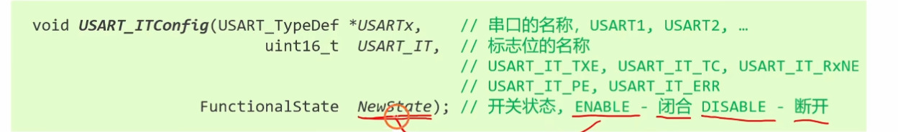


您提的这个问题非常棒，完全问到了库函数封装与底层寄存器操作的核心区别上，这在嵌入式面试中是绝对的高频考点。我来为您详细拆解一下。

您的理解是**完全正确**的：`void USART_ITConfig(...)` 这个函数的设计就是<span style="color:#CC0000;">**一次只操作一个“开关”**（一个中断标志位）</span>。

现在我们来深入探讨您提出的几个场景。


#### 场景分析：如何操作多个“开关”？


##### 1. 同时闭合（或断开）多个开关

问： 我想同时使能“接收中断(RXNE)”和“发送完成中断(TC)”，能用这个函数一次搞定吗？

答： 不能。这个函数的设计决定了它一次只能接收一个中断标志位作为参数。正确的做法是<span style="color:#CC0000;">调用两次这个函数</span>：

C

```c
// 场景：同时使能接收中断和发送完成中断
USART_ITConfig(USART1, USART_IT_RXNE, ENABLE); // 闭合 RXNE 的开关
USART_ITConfig(USART1, USART_IT_TC, ENABLE);   // 闭合 TC 的开关
```

对于标准库开发来说，这是最清晰、最规范的做法。同理，<span style="color:#CC0000;">要同时断开多个，也是分别调用多次并传入 `DISABLE` 即可</span>。


##### 2. 同时进行“闭合”和“断开”操作

问： 我想在一条指令里，同时“闭合”RXNE的开关，并“断开”TXE的开关，这个函数能做到吗？

答： 更加不能了。因为它第三个参数 NewState 只能是 ENABLE 或 DISABLE 其中之一，无法同时表达两种状态。

------


#### 深入底层：这个函数到底在操作什么寄存器？

要真正理解这一切，我们必须揭开库函数的“面纱”，看看它在硬件层面到底做了什么。

这个 `USART_ITConfig` 函数背后操作的，其实就是USART的**<span style="color:#CC0000;">控制寄存器</span>（Control Registers）**，主要是 `USART_CR1`、`USART_CR2` 和 `USART_CR3` 这三个。我们重点看 `USART_CR1`，因为大部分常用中断的“开关”都在这里。

您可以把 `USART_CR1` 寄存器想象成一个 **“中断控制面板”**，它是一个32位的寄存器，但我们只关心其中的几个“开关”位：

**USART_CR1 寄存器（简化示意）**

| ...  | 位7       | 位6      | 位5        | ...  |
| ---- | --------- | -------- | ---------- | ---- |
| ...  | **TXEIE** | **TCIE** | **RXNEIE** | ...  |

- **`RXNEIE` (位5):** 就是图中 `RxNE` 标志位后面的那个开关。`IE` 是 Interrupt Enable (中断使能) 的缩写。
- **`TCIE` (位6):** 就是 `TC` 标志位后面的开关。
- **`TXEIE` (位7):** 就是 `TXE` 标志位后面的开关。

**现在我们来解密 `USART_ITConfig` 函数的内部逻辑：**

当您调用 `USART_ITConfig(USART1, USART_IT_RXNE, ENABLE);` 时，这个函数在底层实际上执行了类似这样的操作：

C

```c
// ENABLE 的情况 (闭合开关)
// 用“按位或”操作，把 RXNEIE 这一位置为1，且不影响其他位
USART1->CR1 |= (1 << 5); 
```

当您调用 `USART_ITConfig(USART1, USART_IT_RXNE, DISABLE);` 时，它执行的是：

C

```c
// DISABLE 的情况 (断开开关)
// 用“按位与”和一个“取反”操作，把 RXNEIE 这一位置为0，且不影响其他位
USART1->CR1 &= ~(1 << 5); 
```

库函数只是把这种复杂的位操作封装成了一个简单易懂的函数调用。`USART_IT_RXNE` 这个宏定义，其本质就是一个代表了**位偏移量**的数值，帮助函数定位到正确的“开关”。

------


#### 终极答案：如何实现“同时操作多个开关”？

现在我们就可以回答您那个‘<span style="color:#CC0000;">同时闭合/断开多个</span>’的问题了。答案是：**<span style="color:#CC0000;">可以，但需要我们绕开库函数，直接对寄存器进行操作</span>。** 这也是面试时展示你底层功底的绝佳机会。

**场景：** 我要用**一条指令**，同时**使能** `RXNE` 和 `TXE` 中断，并**禁止** `TC` 中断。

**直接操作寄存器的代码如下：**

C

```c
// 1. 定义一个掩码(mask)，标明我们要使能哪些中断
//    USART_IT_RXNE 和 USART_IT_TXE 这些宏本质上就是代表了不同位的数值
uint16_t interrupt_enable_mask = USART_IT_RXNE | USART_IT_TXE;

// 2. 定义另一个掩码，标明我们要禁止哪些中断
uint16_t interrupt_disable_mask = USART_IT_TC;

// 3. 使用“按位或”操作，一次性使能所有需要的中断
//    这会把 CR1 寄存器中 RXNEIE 和 TXEIE 两个位同时置1
USART1->CR1 |= interrupt_enable_mask;

// 4. 使用“按位与+取反”操作，一次性禁止所有需要的中断
//    这会把 CR1 寄存器中 TCIE 这个位清零
USART1->CR1 &= ~interrupt_disable_mask;
```

**更高级、更高效的“原子操作”写法（一条语句完成）：**

C

```c
// 读取CR1寄存器的当前值，然后清除掉要关闭的位，再加上要开启的位，最后一次性写回。
USART1->CR1 = (USART1->CR1 & ~interrupt_disable_mask) | interrupt_enable_mask;
```

这种直接操作寄存器的方式，执行效率更高，并且是一种**原子操作**，在有操作系统（RTOS）的复杂环境中能避免“竞态条件”的发生，是更专业、更底层的做法。


#### 总结

- **库函数 `USART_ITConfig`：** 为了**清晰易懂**和**安全**，设计为一次只操作一个中断开关。日常简单应用推荐使用。
- **直接操作寄存器：** 更**高效**、更**灵活**，可以一次性修改多个中断使能状态。是理解硬件工作原理和应对复杂场景（如RTOS）的必备技能。

理解了这一点，您就从“会用库函数”的层次，提升到了“懂寄存器原理”的层次，这在嵌入式面试中是非常重要的。


### 提问4：你能够将这个图给我解释下吗，我有点看不太懂，还有这个NVIC的功能，我对这个模块不太熟悉，还有这个模块好像是属于coretx内核里面的吧，是不是不需要配置时钟，还有其他什么外设也是属于coretex内核里面的，我该怎么区分一个外设到底是不是属于cortex内核的呢？

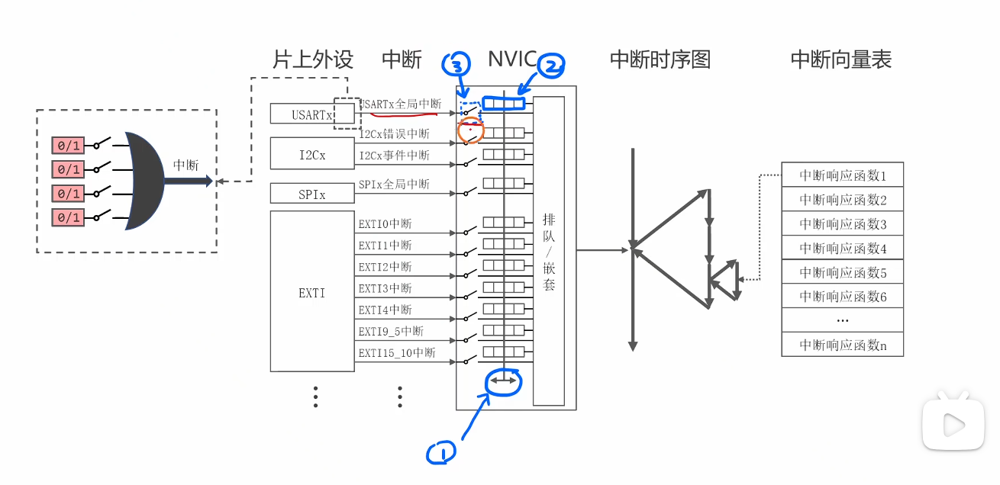

您好！这张图画得非常经典，完美地展示了STM32中一个中断信号从产生到被处理的完整“旅程”。看不懂很正常，因为这正是从“外设”到“内核”交互的核心枢纽。

我将为您分步拆解这张图，并详细解答您关于NVIC、内核外设以及如何区分它们的疑问。

------


#### 图解中断处理的“四大关卡”

我们可以把这张图从左到右看作是中断信号需要闯过的四个关卡，我用一个**“公司紧急事件上报”**的流程来比喻：


##### 第①站：片上外设 - “基层部门”发生事件

- **图示部分：** 左侧虚线框内，`RXNE`等标志位通过或门产生一个`中断`信号。
- **技术解释：** 这是<span style="color:#CC0000;">中断的源头</span>。比如 USART1（串口1部门）收到了一个数据，它的 `RXNE` 标志位（事件指示灯）就会亮起。部门内部的多个事件（如`RXNE`亮了、`TXE`亮了等）通过一个或门汇总，向上传递一个**统一的部门求助信号**：“串口1有情况！”
- **公司比喻：** 销售部（USART1）接到一个紧急订单（收到数据），员工（`RXNE`标志位）立刻按响了部门的**红色警铃**（产生中断信号）。


##### 第②站：中断线 -> NVIC - “部门主管”上报给“总裁办”

- **图示部分：** 从“中断”到“NVIC”的连线，以及NVIC入口处的开关。
- **技术解释：** 每个外设（如USART1, I2C1, EXTI等）都有一条**<span style="color:#CC0000;">专属的中断线</span>**连接到NVIC。<span style="color:#CC0000;">NVIC</span>就像一个<span style="color:#CC0000;">中断的“总调度中心”</span>。图中标注的 **② 开关** 代表**NVIC里的中断使能位**。只有这个开关是闭合的，这个部门的求助信号才能被调度中心接收。
- **公司比喻：** 销售部主管（中断线）拿着紧急报告冲到总裁办公室（NVIC）门口。门口的秘书（NVIC使能位）如果被授权接收销售部的报告（开关**闭合**），就会把报告收下；否则（开关**断开**），主管就只能在门口干着急。


##### 第③站：NVIC内部 - “总裁办”决定优先级并分派任务

- **图示部分：** NVIC内部的“排队/嵌套”逻辑。
- **技术解释：** 这是NVIC的核心功能。如果同时有多个部门（USART1, TIM2, EXTI...）都上报了紧急事件，NVIC会根据预设的**优先级**来决定先处理哪个。它负责“排队”，并且支持“嵌套”（即处理A事件时，如果来了更紧急的B事件，可以先暂停A去处理B）。决定好处理哪个之后，它会直接告诉CPU应该去执行哪一个预案。
- **公司比喻：** 总裁办同时收到了销售部的“紧急订单”和生产部的“设备故障”报告。根据规定，“设备故障”优先级更高，总裁办就先将这份报告递交给总裁（CPU），并告诉他去执行“设备故障应急预案”。


##### 第④站：中断向量表 - 总裁（CPU）根据预案编号找到并执行任务

- **图示部分：** 从NVIC出来指向“中断向量表”，再指向“中断响应函数”。
- **技术解释：** **中断向量表**是内存中一张至关重要的“地址地图”。每个中断源（如USART1、EXTI0等）都在这张表里有一个固定的“门牌号”。这个门牌号对应的地址，就是处理该中断的**中断服务函数（ISR）**的入口地址。当NVIC告诉CPU处理USART1中断时，CPU就会自动去中断向量表里找到USART1对应的地址，然后跳转到那个地址去执行代码（即 `USART1_IRQHandler()` 函数）。
- **公司比喻：** 总裁（CPU）从总裁办（NVIC）那里拿到了“设备故障”这个任务，任务编号是“预案005”。他立刻翻开《公司应急预案手册》（中断向量表），找到第005条，上面写着：“请立即前往车间，执行《设备故障处理流程》这份文件里的步骤”（跳转并执行`TIM2_IRQHandler()`）。

------


#### 深入解答您的疑问

##### 1. NVIC模块的功能是什么？

NVIC (Nested Vectored Interrupt Controller - 嵌套向量中断控制器) 是中断的**“交通总指挥”**。它的核心功能有：

- **中断使能/屏蔽 (Interrupt Enable/Disable):** 它是每个中断源的总开关（图中的②）。你可以决定让CPU“听”或“不听”某个外设的中断信号。
- **优先级管理 (Priority Management):** 它可以为每个中断设置不同的优先级。当多个中断同时发生时，它确保CPU总是先处理最紧急的事务。
- **中断嵌套 (Nesting):** 这是它最高级的功能。如果一个低优先级的中断正在被处理时，来了一个更高优先级的中断，NVIC会让CPU暂停当前的中断服务，转而去处理那个更紧急的中断，处理完再回来。这就是“嵌套”。


##### 2. NVIC属于Cortex内核吗？需要配置时钟吗？

- **归属：** **是的，完全正确！** NVIC 是 ARM 公司设计的 **Cortex-M 内核** 的一个标准组成部分。它不是ST（意法半导体）这种芯片厂商自己加的外设。
- **时钟：** **您推断得非常准确，它不需要像GPIO或USART那样单独配置时钟。** 因为它是内核的一部分，所以它和CPU核心使用同一个时钟源。只要CPU在运行，NVIC就在运行。这也是为什么你找不到 `RCC_EnableClock(RCC_NVIC)` 这样的函数。


##### 3. 还有哪些外设属于Cortex内核？

除了NVIC，Cortex-M内核还标配了几个“核心内”的外设，它们在所有使用同款内核的芯片上（无论厂商是ST、NXP还是TI）都存在且行为一致：

- **SysTick 定时器：** 一个非常简单但极其重要的24位倒计时定时器。它通常被操作系统（如FreeRTOS）用作“心跳时钟”（System Tick），或者用于实现不依赖任何外部定时器外设的 `delay` 函数。
- **MPU (Memory Protection Unit):** 内存保护单元。在需要高安全性和稳定性的系统中（尤其是有RTOS时），用来划分内存区域的访问权限，防止某个任务的错误指针毁掉整个系统。
- **调试相关的模块：** 如DWT (数据观察点和跟踪单元)、ITM (指令跟踪宏单元)等，用于高级调试。


##### 4. 如何区分一个外设是否属于Cortex内核？

这是一个非常好的问题，体现了从使用者到设计者思维的转变。有三个非常实用的判断方法：

1. **查阅官方手册（最权威）：** 在芯片的**《参考手册》(Reference Manual)** 中，目录结构会清晰地分开。通常会有一个大章节专门介绍“ARM Cortex-M Core Peripherals”（ARM Cortex-M内核外设），里面会包含NVIC和SysTick。而其他所有外设，如GPIO, USART, SPI, ADC, Timers等，都会在另外的章节里，这些就是芯片厂商（ST）自己设计的“片上外设”。
2. **看时钟配置（最实用）：** 凡是需要在代码里使用 `RCC_APB1PeriphClockCmd()` 或 `RCC_APB2PeriphClockCmd()` 等函数**手动开启时钟**的，**100%是芯片厂商的片上外设**。而像NVIC和SysTick这种直接配置、不需要开时钟的，就是内核自带的外设。
3. **看代码可移植性（从概念理解）：** 你为STM32写的配置NVIC和SysTick的代码，几乎可以原封不动地移植到一块使用同样Cortex-M内核的NXP芯片上。但是你写的STM32的GPIO和USART初始化代码，拿到NXP的芯片上是完全不能用的，因为它们的寄存器地址、结构和库函数都完全不同。**可跨厂商移植的是内核外设，不可移植的是片上外设。**

希望这份详尽的解释能帮助您建立一个清晰的STM32中断系统架构图，这对于面试和实际开发都非常有帮助！


## 针对视频内容的补充与扩展（面试加分项）

视频讲解了“怎么做”，但在面试中，面试官更关心你是否知道“**为什么这么做**”以及“**还能怎么做**”。

1. **为什么使用中断，而不是在主循环里轮询？ (中断与轮询的对比)**
   - **视频中的方法（中断）：** CPU 大部分时间都在执行自己的主任务（闪灯），只有在串口真正收到数据时，才被“通知”去处理一下。这是一种**被动、高效**的方式。
   - **替代方法（轮询）：** 在 `while(1)` 循环里，除了闪灯，还要不断地去检查串口有没有收到数据，就像你每隔几秒钟就去检查一下手机有没有新消息一样。这是一种**主动、低效**的方式，会占用大量 CPU 资源，并且可能导致响应不及时。
   - **面试扩展：** 你可以进一步说明，对于需要**实时响应**和**多任务并行**的嵌入式系统，中断是不可或缺的机制。它解放了 CPU，让 CPU 可以专注于主要任务，同时又能对外部事件做出快速反应。
2. **中断服务函数 (ISR) 设计的“黄金法则”：快进快出**
   - 视频中的 ISR 非常简洁，只做了读数据和修改变量两件事，这是非常正确的做法。
   - **面试扩展：** 你要强调，**中断服务函数应该尽可能地简短、快速**。绝对不能在中断函数中加入 `Delay()` 这样的长延时操作或复杂的计算。因为中断期间，主程序是被挂起的。如果中断处理时间过长，会严重影响主程序的实时性。正确的做法是在中断里**只做最关键的事**（如读取数据、设置标志位），然后把耗时的处理逻辑交还给主循环去完成。
3. **深入理解 NVIC (嵌套向量中断控制器)**
   - 视频提到了配置 NVIC，但面试官可能深挖。
   - **面试扩展：** NVIC 是 ARM Cortex-M 内核的核心部分，它负责管理所有中断。你需要知道两个关键概念：
     - **抢占优先级 (Preemption Priority):** 优先级高的中断可以**打断**正在执行的优先级低的中断。就像急诊室里，心脏病突发的病人会优先于感冒的病人得到处理。
     - **子优先级 (Sub-priority):** 当两个抢占优先级相同的中断同时到来时，子优先级高的先被响应，但它们之间**不能互相打断**。
   - **场景举例：** 如果一个控制电机紧急停止的中断和一个上报温度的中断，那么“紧急停止”的抢占优先级必须设置得更高。
4. **串口接收数据的健壮性 (Robustness)**
   - 视频中的代码是理想情况。在实际项目中，串口通信可能会有**丢包、误码**等问题。
   - **面试扩展：** 你可以提出，为了提高通信的可靠性，通常会设计一套**通信协议**。例如，定义**帧头、帧尾、数据长度、校验和**等。在中断函数中，不再是接收一个字节就处理，而是将接收到的字节先存入一个缓冲区（Buffer），同时在主循环中不断地解析这个缓冲区，寻找完整、正确的数据帧进行处理。这体现了你对工程实践的理解。

------


## 经典面试问题与简洁回复

**问题一：请解释一下什么是“中断”，以及它在单片机编程中的作用是什么？**

简洁回复：

中断是单片机处理外部突发事件的一种机制。它允许 CPU 在执行主程序时，被外部信号（如串口收到数据、按键按下）“打断”，临时跳转去执行一段特定的“中断服务函数”来处理这个事件，处理完后再返回原处继续执行。它的核心作用是实现异步事件处理，提高 CPU 效率和系统的实时响应能力。

**问题二：视频中，如果把 `Delay()` 延时函数写进 `USART1_IRQHandler()` 中断服务函数里，会有什么潜在风险？**

简洁回复：

这会带来严重风险。中断服务函数执行期间，主程序是暂停的。如果在中断里加入长延时，会导致主循环被长时间挂起，系统的实时性会遭到严重破坏。例如，闪灯任务会变得极不稳定，其他更重要的任务也可能无法及时响应。中断服务函数设计的核心原则是“快进快出”。

**问题三：当多个中断同时发生时，STM32 是如何决定先响应哪一个的？**

简洁回复：

这是由 NVIC（嵌套向量中断控制器） 来管理的。NVIC 会根据预先设定的中断优先级来决定响应顺序。首先比较抢占优先级，高抢占优先级的中断可以打断低抢占优先级的中断；如果抢占优先级相同，再比较子优先级，高子优先级的中断会先于低子优先级的被响应，但它们之间不能互相嵌套（打断）。

**问题四：如果串口需要连续接收一串数据（比如10个字节），而不是单个字符，你会如何优化视频中的代码？**

简洁回复：

我会引入一个接收缓冲区（RX Buffer）和一个状态机。在中断服务函数中，我只负责将接收到的字节快速存入缓冲区。然后在主循环 while(1) 中，我会不断地检查这个缓冲区，根据预定义的通信协议（例如帧头、数据长度、校验和）来解析数据，确认接收到完整且正确的数据帧后再进行处理。这种“中断接收，主循环处理”的模式可以有效避免长时间占用中断，提高系统的稳定性和可靠性。