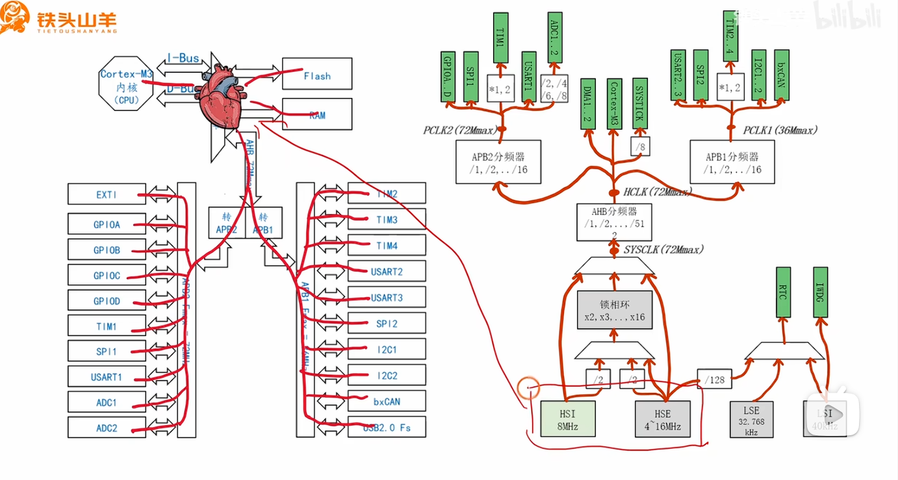
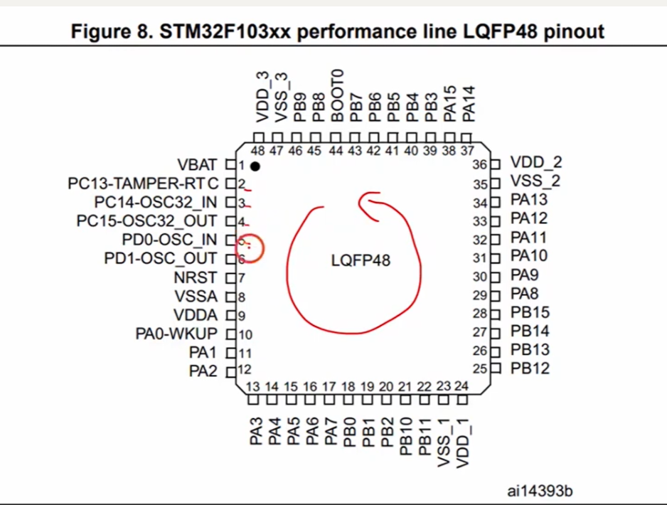
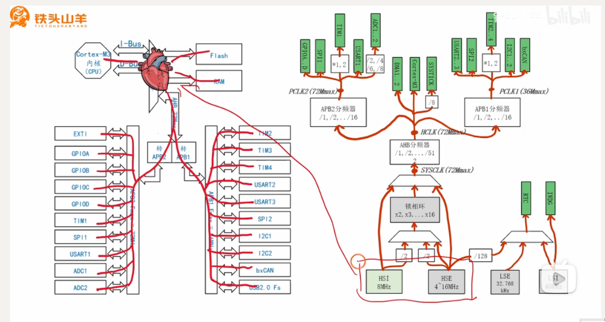

# 视频内容概要

“铁头山羊”的这个视频通过一个非常形象的“时钟树”比喻，出色地介绍了<span style="color:#CC0000;">STM32F1系列时钟系统的基础知识</span>。

- **核心比喻**: <span style="color:#CC0000;">时钟</span>是<span style="color:#CC0000;">单片机（MCU）的“心跳”</span>，而<span style="color:#CC0000;">时钟树</span>就像是<span style="color:#CC0000;">人体的循环系统</span>，<span style="color:#CC0000;">将这个“心跳”（时钟信号）输送到所有不同的“器官”（外设）。</span>

- **基本组成单元**:
  - **分频器 (Frequency Divider)**: 对频率进行<span style="color:#CC0000;">除法运算</span>，以<span style="color:#CC0000;">降低时钟速度</span> (`f_out = f_in / N`)。
  - **锁相环 (Phase-Locked Loop - PLL)**: 对频率进行<span style="color:#CC0000;">乘法运算</span>，以提<span style="color:#CC0000;">高时钟速度</span> (`f_out = f_in * M`)。
  - **复用器 (Multiplexer - MUX)**: 作为一个<span style="color:#CC0000;">开关</span>，从<span style="color:#CC0000;">多个可用的输入源</span>中<span style="color:#CC0000;">选择一个</span>作为<span style="color:#CC0000;">输出</span>。
  
- **时钟树的结构**:

  

  1. **<span style="color:#CC0000;">树根</span> (The Roots - 时钟源)**: 视频明确了<span style="color:#CC0000;">四个主要的时钟来源</span>：
     - **HSI (High-Speed Internal)**: 高速内部RC<span style="color:#CC0000;">振荡器</span>，频率为8MHz。它使用方便，但精度较低。
     - **HSE (High-Speed External)**: 高速外部晶体<span style="color:#CC0000;">振荡器</span>（通常为4-16MHz，板子上常用8MHz）。它非常精确和稳定。
     - **LSI (Low-Speed Internal)**: 低速内部RC<span style="color:#CC0000;">振荡器</span>，频率为40kHz，用于<span style="color:#CC0000;">独立看门狗</span><span style="color:#CC0000;">等低功耗功能</span>。
     - **LSE (Low-Speed External)**: 低速外部晶体<span style="color:#CC0000;">振荡器</span>，频率为32.768kHz，主要<span style="color:#CC0000;">用于实时时钟（RTC）</span>。
  2. **树干 (The Trunk - 系统时钟生成)**: 这部分<span style="color:#CC0000;">用于生成主 **SYSCLK (系统时钟)**</span>。SYSCLK可以直接来源于HSI或HSE，但<span style="color:#CC0000;">最常见的做法</span>是将<span style="color:#CC0000;">HSE</span>输入到<span style="color:#CC0000;">PLL</span>进行<span style="color:#CC0000;">倍频</span>，以<span style="color:#CC0000;">达到最高的系统频率</span>（例如，8MHz HSE * 9 = 72MHz SYSCLK）。
  3. **树枝 (The Branches - 总线时钟)**:<span style="color:#CC0000;"> SYSCLK经过分频后，供给各个内部总线：</span>
     - **AHB (高级高性能总线)**: 连接<span style="color:#CC0000;">CPU核心、内存、DMA</span>等高速组件。其<span style="color:#CC0000;">时钟称为**HCLK**</span>，<span style="color:#CC0000;">通常与SYSCLK频率相同</span>。
     - **APB2 (高级外设总线 2)**: <span style="color:#CC0000;">连接速度较快的外设</span>，如GPIO、UART1、SPI1和ADC。其<span style="color:#CC0000;">时钟**PCLK2**</span>由<span style="color:#CC0000;">HCLK分频</span>而来（最高72MHz）。
     - **APB1 (高级外设总线 1)**: <span style="color:#CC0000;">连接速度较慢的外设</span>，如UART2/3、I2C和CAN。其时钟<span style="color:#CC0000;">**PCLK1**</span>也由<span style="color:#CC0000;">HCLK分频</span>而来，但<span style="color:#CC0000;">其最高频率更低（最高36MHz）。</span>

- **实例讲解**: 视频通过几个例子，演示了<span style="color:#CC0000;">在给定SYSCLK的情况下，如何配置分频器以获得特定的总线时钟频率，并强调了遵守每个总线最高频率限制的重要性。</span>

------


# 知识补充与扩展

视频内容是很好的基础。对于面试而言，你还应该了解以下这些关键的相关概念。

1. **为什么时钟树如此复杂？核心权衡：功耗 vs. 性能**
   - 面试官可能会问，*为什么*不让所有部件都以最高速度运行？最主要的原因是**功耗**。时钟频率越高，消耗的电能就越多。复杂的时钟树允许开发者：
     - 让CPU和核心组件以最高速运行以保证性能。
     - 让高速外设（如GPIO）挂载在高速总线（APB2）上。
     - 让低速外设（如I2C）挂载在更慢、更省电的总线（APB1）上。
     - 将不使用的外设时钟完全关闭。
2. **时钟门控 (Clock Gating): 外设的“电源开关”**
   - 视频中展示了函数 `RCC_APB2PeriphClockCmd(..., ENABLE)`。这个行为被称为**<span style="color:#CC0000;">时钟门控</span>**。<span style="color:#CC0000;">为了节省功耗，默认情况下，几乎所有外设的时钟都是被“关闭”（gated off）的</span>。在你访问<span style="color:#CC0000;">任何一个外设的寄存器（例如UART_DR, GPIO_ODR）之前，你**必须**首先通过RCC（复位和时钟控制）寄存器使能它的时钟</span>。忘记这一步是初学者最常犯的错误之一。
3. **时钟安全系统 (Clock Security System - CSS)**
   - 如果在运行时外部晶振（HSE）失效了会发生什么？这可能是由于物理冲击或元器件故障。<span style="color:#CC0000;">如果系统依赖HSE，时钟会停止，MCU将崩溃。</span>CSS是一个硬件安全特性。当启用时，它会监控HSE。如果检测到故障，它会自动将系统时钟源切换到内部的HSI。这使得系统能够继续运行（尽管精度降低），并为软件处理错误提供了机会，从而使系统更加健壮。
4. **MCO (Microcontroller Clock Output - 微控制器时钟输出)**
   - 你如何验证你的时钟配置是正确的？你不能只相信代码。<span style="color:#CC0000;">MCO引脚允许你将一个内部时钟信号（如SYSCLK, HSI, HSE, 或PLL时钟）输出到一个物理GPIO引脚上。</span>然后你可以用示波器或频率计连接到这个引脚来测量实际频率，以确认你的配置是否按预期工作。这是一个基本的调试技巧。
5. **现代配置工具: STM32CubeMX**
   - 视频中使用的是较旧的标准外设库（SPL）。现代的STM32开发严重依赖于**STM32CubeMX**，这是一个图形化工具，可以自动生成初始化代码。<span style="color:#CC0000;">CubeMX有一个交互式的“时钟配置”标签页，它以图形方式展示了整个时钟树。你可以输入你期望的频率，它会自动为你计算PLL倍频系数和总线分频系数，并高亮显示任何错误（比如超过了总线的最高频率）。</span>提及你熟悉CubeMX能表明你了解现代的嵌入式工作流程。

------

# 补充提问（第2次复习）

## 提问1（关于MCO引脚）



<span style="color:#FF0000; background:#00FF80; border:1px solid #FF00FF;">上面知识扩展与补充里面有提到一个MCO引脚，但是图片里面好像没有这个引脚，这是为什么呢？</span>

这是一个非常敏锐的观察！你没有在图上直接看到 “MCO” 这三个字母，并不是因为这个芯片没有这个引脚，而是因为它被“隐藏”在了**引脚复用功能 (Alternate Function)** 里。

请看你提供的图片右侧，找到 **引脚 29**，它的名字标的是 **PA8**。

<span style="color:#FF0000; background:#00FF80; border:1px solid #FF00FF;">在 STM32F103 系列中，**MCO（微控制器时钟输出）正是 PA8 引脚的一个复用功能**。</span>

这里为你详细解释一下为什么图中没有直接标出来：

### 1. 引脚空间有限，只标主功能

像 LQFP48 这种封装的单片机引脚数量相对有限（48个），但单片机内部的外设（串口、定时器、I2C、SPI、时钟输出等）非常多。为了解决引脚不够用的问题，工程师设计了“引脚复用”。

一个引脚（比如 PA8）通常有多个身份：

- **默认/主要身份**：通用输入输出引脚 (GPIO)。所以在引脚分布图上，它通常只简单地标为 `PA8`。
- **隐藏/复用身份**<span style="color:#FF0000; background:#00FF80; border:1px solid #FF00FF;">：除了 GPIO，PA8 还可以被配置为 `USART1_CK`（串口1时钟）、`TIM1_CH1`（定时器1通道1），以及你提到的 **`MCO`（时钟输出）**。</span>

### 2. 需要查阅数据手册的“引脚定义表”

像你提供的这张引脚分布图（Pinout Diagram），主要目的是让你快速了解电源、地、下载口和 GPIO 的大致位置。如果要查看一个引脚到底隐藏了哪些复用功能，必须要去查阅 STM32 官方数据手册（Datasheet）里的一张大表，叫做 **“引脚定义表 (Pin definitions)”**。在那张表里，PA8 那一行的“Alternate functions”列，就会清清楚楚地写着 MCO。

### 3. 如何真正在代码里把 MCO “变”出来？

<span style="color:#FF0000; background:#00FF80; border:1px solid #FF00FF;">在实际写代码（或使用 CubeMX）时，如果你想用示波器测量时钟，PA8 默认是不能输出时钟的。你必须通过代码告诉芯片：“**请把 PA8 的模式从普通的 GPIO 切换成复用推挽输出，并且把 MCO 的信号接到这个引脚上。**” 只有经过配置，这片“树叶”才会变成测量时钟的“探针”。</span>

------

**总结来说：** MCO 就藏在图中的 **29号引脚 (PA8)** 身上。

你是否需要我为你解释一下，在实际工程中通常会选择输出哪个时钟（比如 SYSCLK 还是 HSE）到 MCO 引脚上进行测量？


## 提问2

<span style="color:#FF0000; background:#00FF80; border:1px solid #FF00FF; font-size:1.2em;">给我解释一下，在实际工程中通常会选择输出哪个时钟（比如 SYSCLK 还是 HSE）到 MCO 引脚上进行测量？</span>

这是一个非常“接地气”的工程实战问题！在真正的硬件开发和调试中，选择输出哪个时钟到 MCO（微控制器时钟输出）引脚，完全取决于**你当前遇到了什么问题**或者**你想要验证什么**。

我们可以把这个过程想象成医生给系统的“心跳”把脉。不同的“脉象”（时钟源），反映的是系统不同层面的健康状况。

以下是实际工程中最常见的几种选择和对应的应用场景：

## 1. 选择输出 SYSCLK (系统时钟)

**目的：验证整个“树干”配置是否完美成功。**

- **应用场景：** 这是**软件工程师最常用**的选项。当你用代码（或 CubeMX）配置了一大堆寄存器，试图把系统跑到 72MHz 时，单看代码是无法100%确认配置成功的。
- **诊断逻辑：** 把 SYSCLK 输出到 MCO。
- **结果分析：**  如果示波器上结结实实地量出了 72MHz 的频率，这就证明了你的 HSE 成功起振、PLL 倍频系数算对了、且最后的复用器也成功切换到了 PLL 输出。这就相当于给整个核心动力系统做了一次“最终验收”。

## 2. 选择输出 HSE (高速外部时钟)

**目的：排查纯硬件级别的“点火”问题。**

- **应用场景：** 这是**硬件工程师在“板子首发（Bring-up）”时最常用**的选项。当你拿到一块刚刚贴片生产出来的自制电路板，程序运行异常，你怀疑是外部的 8MHz 晶振没焊好，或者匹配电容选错了。
- **诊断逻辑：** 绕开所有复杂的倍频逻辑，将最原始的 HSE 信号直接连到 MCO。
- **结果分析：** 如果在 MCO 引脚上量不到 8MHz 的波形，或者波形极其微弱、不稳定，说明“树根”在硬件物理层面就坏了，此时查代码是没用的，必须先拿电烙铁修复晶振电路。

## 3. 选择输出 PLLCLK/2 (锁相环输出的二分频)

**目的：高频测量受限时的一种“妥协”方案。**

- **硬件细节：** 在 STM32F1 系列的手册中有一个细节，MCO 选项里没有直接输出完整的 PLL 时钟，而是 **PLLCLK  divided by 2**（即除以 2）。
- **应用场景：** 因为 GPIO 引脚的物理翻转速度是有限的，输出 72MHz 这样极高的频率会导致严重的电磁干扰（EMI），且对示波器的带宽要求很高。
- **诊断逻辑：** 当你想验证 PLL 工作是否正常，但手头的示波器比较低端（抓不到 72MHz），就可以选择输出 PLLCLK/2。只要量到了 36MHz，你就能反推出 PLL 内部已经成功锁定在了 72MHz。

## 4. 选择输出 HSI (高速内部时钟)

**目的：验证时钟安全系统 (CSS) 的回退机制。**

- **应用场景：** 你的产品对安全性要求极高，你开启了前面文档里提到的 CSS 功能。你想做一个破坏性测试来验证它的可靠性。
- **诊断逻辑：** 系统正常运行时 MCO 输出基于外部晶振的高频时钟。此时，你故意用短接线破坏外部晶振的工作。
- **结果分析：** 如果你通过示波器观察到 MCO 的输出在晶振失效的瞬间，平滑地切换到了 8MHz（内部 HSI），这就完美证明了你的 MCU “备用心脏”自动接管成功，系统没有直接死机。

------

**工程实战避坑指南：**

当你真的拿示波器去测 PA8 (MCO) 引脚时，不要指望能看到教科书般完美的“直角方波”。当频率高达几兆甚至几十兆赫兹时，受限于引脚的寄生电容、PCB 的走线以及示波器探头的带宽，方波的边缘会被拉缓，看起来通常会像一个连绵起伏的“正弦波”——这在工程上是完全正常的物理现象，只要**频率读数**是准确的，就说明时钟配置没有问题。

你现在已经对时钟树的硬件逻辑有了非常深刻的整体认知，想不想挑战一下看看在代码层面（比如使用标准库或 HAL 库），具体是哪几个关键函数或寄存器控制了这颗“大树”的生长？


## 提问3（区分SYSCLK、HCLK、SYSTICK）



<span style="color:#FF0000; background:#00FF80; border:1px solid #FF00FF;">我发现一个问题，图片中好像有SYSCLK，HCLK，SYSTICK，这三者是有什么不同吗，尤其是SYSCLK和SYSTICK，感觉很容易把这两个东西给搞混乱。</span>

你观察得非常仔细！很多初学者在看这张时钟树的图时，都会被 **SYSCLK**、**HCLK** 和 **SYSTICK** 这三个长得很像的名字绕晕，尤其是 SYSCLK 和 SYSTICK，不仅长得像，而且都带有“系统 (System)”的字眼。

其实，解开这个迷惑的关键在于一句话：

<span style="color:#FF0000;">**SYSCLK 和 HCLK 是“无形的脉冲信号（频率）”，而 <span style="border:1px solid #FF00FF;">SYSTICK 是一个“实实在在的硬件定时器（外设器件）</span>”。**</span>

我们结合你发的这张图，把它们三个彻底理清：

### 1. SYSCLK (System Clock - 系统时钟)

- **它是什么：** 它是一个**纯粹的时钟信号**。它是整个单片机主干道上输出的最高速、最核心的时钟频率。
- **在图中的位置：** 你可以看到它在所有分频器的最前面（紧挨着锁相环的输出复用器）。
- **它的角色：** 它是整个系统时钟频率的**“总源头”**。它决定了系统能跑多快（比如图上标注的 72MHz Max）。

### 2. HCLK (AHB Clock - AHB总线时钟)

- **它是什么：** 它也是一个**纯粹的时钟信号**。
- **在图中的位置：** 它是 SYSCLK 经过了 `AHB分频器` 之后产生的信号。
- **它的角色：** 它是真正在 **AHB总线** 上流淌的“血液”。虽然我们经常让 AHB分频器为 1（使得 HCLK = SYSCLK），但<span style="color:#FF0000; background:#00FF80; border:1px solid #FF00FF;">严格来说，供给 CPU 内核、内存 (RAM)、Flash 以及后面的 APB 总线桥的，都是 HCLK，而不是 SYSCLK。</span>

### 3. SYSTICK (System Tick Timer - 系统滴答定时器)

- **它是什么：** **它不是一个时钟信号，而是一个硬件模块（定时器）！**<span style="color:#FF0000; background:#00FF80; border:1px solid #FF00FF;"> 它和图里的 GPIO、USART、ADC 一样，是一个具体的“器官”，只不过它被直接集成在了 Cortex-M3 CPU 内核里面</span>。
- **在图中的位置：** 你看图的右上角，SYSTICK 是一个绿色的方块（代表外设），它接收来自 HCLK 的连线（图上显示可以直接用 HCLK，或者经过 `/8` 分频后再给它用）。
- **它的角色：** 它是一个专用的、简单的 24 位倒数计时器。
  - **为什么叫它“系统”滴答？** 因为它是 ARM 公司专门为操作系统（比如 FreeRTOS、uC/OS）设计的一个“心跳”发生器。操作系统需要一个非常稳定的、周期性的中断来调度任务（比如每隔 1 毫秒中断一次，看看该哪个任务运行了），SYSTICK 就是专门干这个的。
  - 如果你不跑操作系统（裸机跑），我们通常用它来编写非常精准的延时函数，比如大名鼎鼎的 `delay_ms()` 和 `delay_us()`，底层就是靠 SYSTICK 来计数的。

------

### 形象的比喻总结

如果我们继续用“城市水务系统”来比喻：

- **SYSCLK：** 是自来水厂出水口的**总水压**（源头动力）。
- **HCLK：** 是经过总阀门后，城市**主供水管道里的水压**（直接供给重要设施）。
- **SYSTICK：** 是安装在市政府大楼里的一个**水力钟表（实体设备）**。它消耗主管道里流过来的水（HCLK），用水流的动力来精确走字（滴答、滴答），从而为整个系统的运行提供统一的时间基准。

### 快速对比表

| **名称**    | **英文全称**      | **中文含义**   | **本质是什么？**  | **作用是什么？**                                       |
| ----------- | ----------------- | -------------- | ----------------- | ------------------------------------------------------ |
| **SYSCLK**  | System Clock      | 系统时钟       | **信号/频率**     | 时钟树的**总源头**                                     |
| **HCLK**    | AHB Clock         | AHB总线时钟    | **信号/频率**     | 在高速总线上跑的时钟信号，源自SYSCLK                   |
| **SYSTICK** | System Tick Timer | 系统滴答定时器 | **硬件模块/外设** | 消耗HCLK的信号来**计时**，常用于延时或操作系统的“心跳” |

这样拆解开来看，是不是就完全不会把它们搞混了？一个是提供动力的“水流”，一个是利用水流来干活的“机器”。


# 补充提问


## 提问1：STM32CubeMX是什么东西，你能够给我详细解释下吗？

当然可以。你问到了一个非常关键的点。在你刚才观看的视频中，配置时钟树是通过查阅手册和编写代码来完成的，这在早期是标准做法。而 **STM32CubeMX** 正是ST（意法半导体）官方推出的，用来彻底简化这个过程的强大工具。

对于嵌入式开发者，尤其是STM32开发者来说，**掌握STM32CubeMX是现代开发流程中的一项必备技能**。下面我为你系统地补充这方面的知识。


### 1. STM32CubeMX 是什么？

简单来说，STM32CubeMX 是一个**图形化配置工具**。

它的核心作用是：让你通过点击鼠标、填写参数的方式，来完成STM32单片机**所有的底层硬件初始化配置**，然后**自动生成C语言的初始化代码**。

你可以把它想象成一个项目的“智能配置向导”，你只需要告诉它“我需要用哪个引脚做串口发送”、“我希望系统时钟是72MHz”，它就会帮你把所有复杂的寄存器设置代码全部写好。


### 2. 它解决了什么痛点？

在没有CubeMX的时代（或者不使用它时），开发者初始化一个项目需要：

- **手动查阅手册**：需要翻阅上千页的数据手册和参考手册，去查找每个寄存器的地址、每一位的具体含义。
- **手动编写代码**：逐行编写寄存器配置代码，比如 `RCC->APB2ENR |= (1<<4);` 这样的语句。
- **容易出错**：手动配置极易出错。比如：
  - 忘记使能某个外设的时钟（这是最常见的错误）。
  - 配置引脚复用功能时，出现引脚冲突。
  - 计算波特率、时钟分频/倍频系数时算错。
  - 寄存器名字或某一位的宏定义写错。

**CubeMX通过图形化和自动化的方式，完美解决了以上所有问题。**


### 3. STM32CubeMX 的核心功能

#### (1) 引脚布局和配置 (Pinout & Configuration)

这是CubeMX最直观的功能。你会看到一个和你选的芯片一模一样的引脚视图。

- **分配功能**：你只需在左侧列表中选择一个外设（如`USART1`），然后选择它的模式（如`Asynchronous`异步模式）。CubeMX会自动在右侧的芯片图上为你分配合适的引脚（如PA9, PA10），并用绿色高亮。
- **避免冲突**：如果你尝试将一个已经被占用的引脚分配给另一个功能，CubeMX会立刻标红并提示冲突，从根本上杜绝了引脚配置错误。


#### (2) 时钟树配置 (Clock Configuration)

这正是针对你视频中学习的内容。CubeMX提供了一个**完全可视化的交互式时钟树**。

- **直观**：整个时钟树的流向，从HSI/HSE，经过PLL，再到各个总线（AHB, APB1, APB2），都清晰可见。
- **智能计算**：你不再需要手动计算PLL倍频和总线分频系数。你只需要在最终的`HCLK`输入框里填入你想要的频率（比如`72`），然后按回车，**CubeMX会自动为你反向推算出所有的倍频和分频参数**，并填好。
- **错误检查**：如果你设置的频率超过了某个总线（如APB1）的上限（36MHz），对应的框会变成红色，提醒你配置有误。


#### (33) 外设和中间件配置 (Peripherals & Middleware)

- **外设**：对于你启用的每个外设，比如ADC、定时器、I2C等，你都可以在一个专门的界面通过填表单和下拉菜单的方式配置其详细参数（如ADC的采样精度、定时器的计数周期、I2C的速度等）。
- **中间件**：这是CubeMX非常强大的地方。它可以一键为你集成并配置复杂的中间件，如：
  - **FreeRTOS**: 帮你完成RTOS的配置和任务的创建。
  - **FatFs**: 帮你集成文件系统，用于SD卡或U盘读写。
  - **LwIP**: 帮你集成TCP/IP协议栈，用于网络通信。
  - **USB Stack**: 帮你完成USB设备（如虚拟串口、U盘）的底层配置。


#### (4) 代码生成 (Code Generation)

配置完成后，CubeMX会为你生成一个完整、规范的工程项目，可以直接用Keil、IAR或STM32CubeIDE等工具打开。

最关键的一点是，它生成的代码中包含了**用户代码保护区**：

C

```c
/* USER CODE BEGIN 1 */

/* USER CODE END 1 */
```

你自己的业务逻辑代码（比如`while(1)`循环里的LED闪烁代码）必须写在这些`BEGIN`和`END`注释块之间。这样做的好处是，当你以后需要修改配置（比如增加一个I2C外设）并**重新生成代码时，CubeMX只会更新它自己管理的部分，而你写在保护区里的代码会完好无损地保留下来**。


### 4. 在开发流程中的位置

一个典型的STM32项目开发流程如下：

1. **打开 CubeMX**：新建工程，选择你的STM32芯片型号。
2. **图形化配置**：
   - 在`Pinout & Configuration`界面配置好所有需要用到的引脚和外设模式。
   - 在`Clock Configuration`界面配置好系统时钟和所有总线时钟。
   - 在`Configuration`界面详细配置每个外设和中间件的参数。
3. **生成代码**：选择你的IDE（如MDK-ARM for Keil），设置工程名，点击`GENERATE CODE`。
4. **编写应用代码**：用Keil打开生成的工程，在`main.c`的`while(1)`循环和其他用户代码区编写你自己的逻辑。
5. **编译与调试**：像正常流程一样编译、下载和调试。
6. **迭代修改**：如果需要修改硬件配置，**回到CubeMX**进行修改，再次生成代码，你的应用代码不会丢失。


### 总结与面试建议

总结：

STM32CubeMX是ST官方推出的一款图形化代码生成器，是现代STM32开发的事实标准。它通过可视化界面极大地简化了底层硬件的初始化和配置过程，提高了开发效率，并有效避免了常见的配置错误。

面试建议：

在面试中，当你被问到STM32时钟系统时，你可以这样回答，会非常加分：

> “在STM32中，时钟系统就像是整个芯片的心脏，通过一个复杂的时钟树为CPU和各个外设提供动力。这个时钟树有多个时钟源，如高精度的外部HSE和方便的内部HSI。通常我们会使用PLL将HSE倍频到例如72MHz作为系统时钟，再经过AHB、APB1、APB2总线分频器供给不同的外设。**在实际开发中，我主要使用STM32CubeMX的图形化界面来配置时钟树，这样不仅直观快捷，还能自动计算分频系数并避免超出总线频率上限的错误。同时，我也理解CubeMX生成的HAL库代码背后操作的是哪些RCC寄存器，比如`RCC_CR`、`RCC_CFGR`等，这有助于在调试时深入分析问题。**”

这样的回答既体现了你熟悉现代高效的开发工具（CubeMX），又表明你了解其底层的硬件原理（寄存器和时钟树结构），会给面试官留下非常专业和扎实的印象。


## 提问2：

<span style="font-weight:bold; font-size:1.2em;">最终输送给各个外设的时钟都是来自于这个系统时钟sysCLK吗，上面的这4个晶振源 HSI HSE LSI LSE 最终指向的都是系统时钟SYSCLK吗，那个HCLK又是个什么东西呢，在什么阶段会用到锁相环，分频器和复用器呢，这些我都不是太懂，你能够给我详细解释下吗，最好能够给我举个例子，比如从哪里到哪里经过了什么。</span>


当然可以！你提出的这几个问题非常核心，正是理解时钟树工作原理的关键。我会一步步为你详细解释，并通过一个完整的例子，带你走完一次时钟信号从“源头”到“外设”的旅程。

------


### 首先，我们来逐个回答你的核心疑问：


#### 1. 最终输送给各个外设的时钟都是来自于系统时钟SYSCLK吗？


**回答：绝大部分是，但不是全部。**

- **是的，对于绝大多数外设来说**，比如GPIO、UART（串口）、SPI、I2C、ADC、定时器(Timer)等，它们的工作时钟**最终都源自于系统时钟SYSCLK**。SYSCLK会经过一系列分频，产生不同速率的总线时钟（HCLK, PCLK1, PCLK2），然后再供给这些挂载在总线上的外设。
- **不是，也存在例外**。有少数几个特殊的外设拥有自己**独立**的时钟源，不依赖SYSCLK。最典型的两个是：
  - **实时时钟 (RTC)**：为了在主CPU掉电时也能继续计时，它通常由**LSE**（低速外部32.768kHz晶振）独立驱动。
  - **独立看门狗 (IWDG)**：为了在系统主时钟崩溃时依然能复位系统，它由**LSI**（低速内部RC振荡器）独立驱动。


#### 2. 上面的4个时钟源(HSI, HSE, LSI, LSE)最终指向的都是系统时钟SYSCLK吗？


**回答：不是的，只有高速时钟源才指向SYSCLK。**

STM32的时钟源可以清晰地分为两大阵营：

- **高速时钟阵营 (HSI, HSE)**：这两个是用来驱动**系统核心和高性能外设**的。**SYSCLK只能从HSI、HSE或者由它们倍频后的PLL中选择**。它们是主工作时钟的来源。
- **低速时钟阵营 (LSI, LSE)**：这两个是为**特定低功耗、独立功能**服务的，它们有自己的专用通道，**通常不参与SYSCLK的生成**。

所以，只有HSI和HSE（以及它们的“加工品”PLL）是SYSCLK的候选源。


#### 3. 那个HCLK又是个什么东西呢？


**回答：HCLK是AHB总线的时钟，是SYSCLK的第一个分频产物。**

- **SYSCLK (系统时钟)**：这是由“树干”产生的，直接供给CPU内核的时钟，代表了芯片的最高运算速度。
- **HCLK (AHB总线时钟)**：SYSCLK产生后，**经过一个AHB分频器**，得到的时钟就是HCLK。这个HCLK供给所有挂载在AHB总线上的高速设备，比如**CPU核心、内存(SRAM)、DMA**等。通常情况下，我们不分频，即**HCLK = SYSCLK**。

你可以理解为，SYSCLK是心脏泵出的主源头，HCLK是流经主动脉的血液，速度几乎和源头一样快。


#### 4. 在什么阶段会用到锁相环(PLL)，分频器和复用器呢？


**回答：它们在时钟信号流动的不同阶段各司其职。**

- **复用器 (Multiplexer)**：用在**“选择”**阶段。当有多条路可以走时，用它来选一条。比如，在“树干”（ <span style="color:#CC0000;">补充：这里的树干指的就是 SYSCLK 这个系统时钟 </span>）的入口，用它来选择是用HSI还是HSE作为PLL的输入；在“树干”的出口，用它来选择最终的SYSCLK是用HSI、HSE还是PLL的输出。
- **锁相环 (PLL)**：用在**“升压/倍频”**阶段。主要在“树干”部分，当原始时钟源频率不够高时（如8MHz的HSE），通过PLL将其“倍增”到系统所需的高频率（如72MHz）。
- **分频器 (Divider)**：用在**“降压/分频”**阶段。主要在“树枝”部分，将来自“树干”的高速时钟（HCLK）降速，以适应不同总线（APB1, APB2）和外设的速度要求，从而节省功耗。

------


### <span style="color:#330000;">一个完整的例子：点亮一个LED灯</span>


假设我们的目标是**让挂在GPIOA端口上的一个LED灯闪烁**。我们需要为GPIOA提供时钟。我们希望系统性能最高，即系统时钟为72MHz。

**这是一次时钟信号的完整旅程：**

**阶段一：树根 (产生原始信号)**

1. **起点**: 位于我们电路板上的一颗**8MHz的外部晶振 (HSE)**。它开始稳定地产生8MHz的振荡信号。

**阶段二：树干 (生成72MHz的SYSCLK)**

1. **第一次选择 [使用复用器]**:
   - 在PLL的输入端，有一个复用器。我们通过配置RCC寄存器，让这个复用器**选择HSE (8MHz)** 作为PLL的输入源。
2. **倍频处理 [使用锁相环 PLL]**:
   - 8MHz的信号进入PLL。我们配置PLL的倍频因子为**9倍**。PLL开始工作，输出频率为 `8MHz * 9 = 72MHz`。
3. **最终选择 [使用复用器]**:
   - 在SYSCLK的输入端，有另一个主复用器。我们配置它**选择PLL的输出**作为最终的系统时钟。
   - **至此，SYSCLK = 72MHz。** CPU内核开始以72MHz的频率全速运行。

**阶段三：树枝 (将时钟分配给GPIOA)**

1. **第一级分频 [使用AHB分频器]**:
   - 72MHz的SYSCLK首先经过AHB分频器。我们将其配置为**1分频**（即不分频）。
   - **此时，HCLK = 72MHz / 1 = 72MHz**。内存和DMA等开始以72MHz工作。
2. **第二级分频 [使用APB2分频器]**:
   - 我们查手册得知，GPIOA外设是挂载在**APB2总线**上的。
   - 于是，72MHz的HCLK信号流向APB2分频器。我们也将其配置为**1分频**。
   - **此时，PCLK2 (APB2总线时钟) = 72MHz / 1 = 72MHz**。
3. **打开“水龙头” [使用时钟门控]**:
   - 虽然APB2总线上已经有了72MHz的时钟，但通往GPIOA的“阀门”默认是关闭的。
   - 我们调用函数 `RCC_APB2PeriphClockCmd(RCC_APB2Periph_GPIOA, ENABLE);`，这行代码的本质就是去操作`RCC_APB2ENR`寄存器，将GPIOA对应的那一位**置1**。
   - **阀门打开！** 72MHz的PCLK2时钟信号终于成功抵达了GPIOA外设。

**最终结果**：GPIOA外设获得了工作所需的时钟，我们现在可以正常配置它的寄存器来控制引脚高低电平，让LED灯闪烁了。

**用一个流程图总结这个例子：**

> <span style="color:#330000;">**HSE (8MHz)** → `[复用器]` → **PLL输入 (8MHz)** → `[锁相环 x9]` → **PLL输出 (72MHz)** → `[复用器]` → **SYSCLK (72MHz)** → `[AHB分频器 /1]` → **HCLK (72MHz)** → `[APB2分频器 /1]` → **PCLK2 (72MHz)** → `[时钟门控]` → **抵达GPIOA外设**</span>

希望这个详细的分解和例子能让你对整个流程有更清晰的认识！


## 提问3：

<span style="font-weight:bold; font-size:1.2em;">这个SYSCLK是系统时钟，这里承载SYSCLK时钟的总线的名称是什么呢，HCLK是AHB总线的时钟，PCLK1是APB1总线的时钟，PCLK2是APB2总线的时钟。这里的总线可以认为是对应的时钟的物理载体吧。还有就是 “ HSE (8MHz) → [复用器] → PLL输入 (8MHz) → [锁相环 x9] → PLL输出 (72MHz) → [复用器] → SYSCLK (72MHz) → [AHB分频器 /1] → HCLK (72MHz) → [APB2分频器 /1] → PCLK2 (72MHz) → [时钟门控] → 抵达GPIOA外设 ” 这个过程中 两个复用器的输入分别都是可以选择哪些呢。还有AHB总线和SYSCLK以及对应的总线以及APB1、APB2总线是不是中间有一个对应的分频器，在这个分频器一边是对应的AHB总线，另外一边是其他的总线，还有APB1和APB2总线是挂在AHB总线上的吗 ？</span>


你提的这几个问题非常棒，说明你已经开始深入思考硬件的实际结构了。这些问题环环相扣，我将为你一一拆解，并把它们串联起来，让你形成一个清晰的、符合真实硬件逻辑的认知。

------


### 问题1 & 3: SYSCLK的载体是什么？HCLK又是什么？


这是最关键的一个概念，我们必须先厘清。

回答:

严格来说，<span style="color:#CC0000;">并没有一条物理总线叫做“SYSCLK总线”。</span>

- **SYSCLK (系统时钟)** 是一个**逻辑上**的概念，它代表着进入CPU内核之前的、**最高速、最核心**的那个时钟信号。你可以把它理解为时钟系统处理完成后，最终输出给CPU的那个**源头信号**。
- **HCLK (AHB总线时钟)** 才是真正**承载在AHB总线**上的时钟。

它们的关系是这样的：

**`SYSCLK` → `[AHB分频器]` → `HCLK (在AHB总线上传输)`**

1. “树干”部分（通过复用器和PLL）最终生成了 `SYSCLK` 信号。
2. 这个 `SYSCLK` 信号**首先**被送入一个叫**AHB分频器**的模块。
3. 从AHB分频器出来的时钟，就被命名为 `HCLK`。这个 <span style="color:#CC0000;">`HCLK` 信号在**AHB (高级高性能总线)** 上传输，供给总线上所有的设备。</span>

在绝大多数高性能应用中，我们都希望<span style="color:#CC0000;">CPU</span>和<span style="color:#CC0000;">内存</span>全速运行，所以AHB分频器通常设置为**1分频**（也就是不分频）。在这种情况下，**HCLK的频率就等于SYSCLK的频率**。

所以，你可以这样理解：

SYSCLK是“水泵出口的水压”，HCLK是“城市主水管里的水压”。通常我们不希望主水管有压力损失，所以两者压力（频率）相等。<span style="color:#CC0000;">HCLK就是运行在AHB这条物理总线上的时钟信号，它直接来源于SYSCLK。</span>

------


### 问题2 & 5: 总线是时钟的物理载体吗？APB总线是挂在AHB总线上的吗？


回答:

<span style="color:#CC0000;">是的，你的理解非常正确！</span>

- **总线就是物理载体**：在芯片内部，总线就是成千上万条微观的金属导线，它们<span style="color:#CC0000;">负责传输时钟信号、数据信号和地址信号</span>，<span style="color:#CC0000;">连接着CPU和各个外设。所以说总线是时钟的物理载体，是完全正确的。</span>
- **APB总线挂载在AHB总线上**：这个理解也<span style="color:#CC0000;">完全正确</span>。STM32的内部总线是一个**层级结构**。
  - **AHB总线** 是最高速的主干道。
  - **APB1** 和 **APB2** 这两条总线，是两条速度较慢的支路，它们都**<span style="color:#CC0000;">通过一个叫“总线桥 (Bridge)”的硬件模块连接在AHB总线上</span>**。

------


### 问题4: 分频器在总线之间的位置？


结合上面的问题，我们现在可以清晰地画出<span style="color:#CC0000;">时钟从SYSCLK到各个总线的完整路径了</span>。

**清晰的层级关系如下：**

Code snippet

```c
graph TD
    subgraph 树干
        SYSCLK(SYSCLK)
    end

    subgraph 树枝
        AHB_Prescaler[AHB分频器 (PPRE)]
        HCLK(HCLK<br/>运行于 AHB 总线)
        
        Bridge[AHB-APB 总线桥]
        
        APB1_Prescaler[APB1分频器 (PPRE1)]
        PCLK1(PCLK1<br/>运行于 APB1 总线)
        
        APB2_Prescaler[APB2分频器 (PPRE2)]
        PCLK2(PCLK2<br/>运行于 APB2 总线)
    end
    
    CPU_SRAM_DMA((CPU, 内存, DMA))
    APB1_Peri((APB1 外设<br/>如 UART2, I2C))
    APB2_Peri((APB2 外设<br/>如 GPIO, UART1))
    
    SYSCLK --> AHB_Prescaler
    AHB_Prescaler --> HCLK
    HCLK --> CPU_SRAM_DMA
    HCLK --> Bridge
    Bridge --> APB1_Prescaler
    Bridge --> APB2_Prescaler
    APB1_Prescaler --> PCLK1
    PCLK1 --> APB1_Peri
    APB2_Prescaler --> PCLK2
    PCLK2 --> APB2_Peri
```

从这个图中你可以清晰地看到：

- **SYSCLK** 经过 **AHB分频器** 产生 **HCLK**。
- **HCLK** 流经 **AHB总线**，并进入一个叫**总线桥**的部件。
- 在这个总线桥**内部**，HCLK被**再次分频**，分别由 **APB1分频器** 和 **APB2分频器** 处理，产生 **PCLK1** 和 **PCLK2**。
- PCLK1 和 PCLK2 分别在各自的 APB1 和 APB2 总线上运行。

------


### 问题3的补充：两个复用器的输入分别可以选择哪些？

在你之前的例子 `HSE → [复用器1] → PLL → [复用器2] → SYSCLK` 中：

1. **第一个复用器 (<span style="color:#CC0000;">PLL的输入源选择</span>)**:
   - 这个复用器的作用是为PLL提供一个稳定的参考时钟。它通常有两个选项：
     - **选项A**: **HSI / 2** (内部高速时钟8MHz，先除以2，变成4MHz送入PLL)。
     - **选项B**: **HSE** (外部高速时钟，比如8MHz)。
   - 在我们的例子中，为了精度和获得72MHz的最高频率，我们选择了**选项B (HSE)**。
2. **第二个复用器 <span style="color:#CC0000;">(SYSCLK的最终源选择</span>)**:
   - 这个复用器是最终<span style="color:#CC0000;">决定CPU以什么时钟工作的关键开关</span>。它有三个主要选项：
     - **选项A**: **HSI** (直接使用内部8MHz时钟作为系统时钟。优点是启动快，缺点是不准)。
     - **选项B**: **HSE** (直接使用外部8MHz时钟作为系统时钟。优点是精准，缺点是速度受限于晶振频率)。
     - **选项C**: **PLL输出** (使用经过PLL倍频后的高速时钟，比如72MHz。这是追求高性能时的标准选择)。
   - 在我们的例子中，为了达到72MHz的最高性能，我们选择了**选项C (PLL输出)**。

希望这次的解释能够把这些概念和它们在硬件中的实际位置与关系彻底讲清楚！

<span style="font-weight:bold; font-size:1.2em;">补充：这里如果我直接使用选项A或者选项B，那么复用器1和PLL不就没有用了吗，是不是就可以不用配置了，简洁回复下？</span>

是的，您的理解完全正确。

如果您在**第二个复用器**那里直接选择`HSI`或`HSE`作为最终的系统时钟（SYSCLK），那么信号路径就完全**绕过（Bypass）**了锁相环（PLL）模块。

在这种情况下：

1. **PLL和第一个复用器确实没有被用上**（对于生成SYSCLK这个任务来说）。
2. 因此，您**不需要去配置PLL的倍频系数**或者它的输入源。
3. 从功耗角度考虑，您应该确保PLL模块保持在**关闭状态**，因为它在不使用时也会消耗少量电能。

这就像一个供水系统，您选择直接从主管道（HSE/HSI）接水，那么那个复杂的增压泵（PLL）和它的进水阀门（复用器1）自然就空闲了，把它关掉还能省电。


## 提问4：

<span style="color:#CC0000; font-weight:bold; font-size:1.2em;">在本视频这个例子中，树根，树干，树枝，树叶，它们具体指的都是哪些东西呢，你能够给我详细解释下吗，我不太懂 ？</span>

当然，非常乐意为您将这个“树”的比喻补充完整并对应到具体的硬件上。这个比喻非常有助于建立清晰的记忆。

------


### 树根 (The Roots) -> 对应：物理上的【时钟源电路】


**核心功能：产生最原始的、未经处理的振荡信号。**

“树根”是整个时钟系统的**源头**，它们是实际产生电信号振荡的物理单元。

- **具体指代：**
  - **HSI (高速内部时钟)**: 芯片内部自带的 **RC振荡电路** (由电阻和电容构成)。
  - **HSE (高速外部时钟)**: 指的是**外部晶振** (你焊在电路板上的那个金属壳或陶瓷封装的元件) 以及与之配套的**负载电容**和**芯片内部的驱动电路**。
  - **LSI (低速内部时钟)**: 芯片内部另一个低功耗的 **RC振荡电路**。
  - **LSE (低速外部时钟)**: 指的是**外部的32.768kHz手表晶振**及其配套电路。

------


### 树干 (The Trunk) -> 对应：RCC内的【系统时钟选择与倍频单元】

**核心功能：选择一个高速时钟源，并将其加工成驱动CPU的核心时钟(SYSCLK)。**

“树干”是时钟系统的**主处理干道**，负责生成整个芯片性能的基准。

- **具体指代：**
  - **复用器 (Multiplexers)**: 位于RCC（时钟控制中心）内部的**电子开关逻辑**，用来选择时钟路径。
  - **锁相环 (PLL)**: 位于RCC内部的一个**核心倍频电路**，能将输入的低频时钟（如8MHz）倍增成高频时钟（如72MHz）。
  - **最终输出的信号**: **SYSCLK (系统时钟)**。

------


### 树枝 (The Branches) -> 对应：RCC内的【总线分频器】和物理上的【总线】

**核心功能：将主干道的高速时钟进行分流和降速，输送到芯片的不同区域。**

“树枝”是**<span style="color:#CC0000;">主干道的分支</span>**，负责将时钟信号输送到各个外设“小区”。

- **具体指代：**
  - **总线分频器 (Prescalers)**: 位于RCC内部的**数字计数电路**，负责将高速的SYSCLK或HCLK进行降频，得到HCLK, PCLK1, PCLK2。
  - **总线 (Buses)**: 芯片内部**物理的连接导线**，即AHB, APB1, APB2这三条“高速公路”和“国道”。它们是承载HCLK, PCLK1, PCLK2这些时钟信号的物理通道。

------


### 树叶 (The Leaves) -> 对应：【具体的外设模块本身】

**核心功能：消耗时钟信号，完成具体的功能。**

“树叶”是时钟信号的**最终使用者**，它们是MCU中真正干活的单元。

- **具体指代：**
  - 挂在**APB2总线（高速树枝）**上的“树叶”：
    - **所有GPIO端口** (GPIOA, GPIOB, ...)
    - **串口1 (UART1)**
    - **SPI接口1 (SPI1)**
    - **模数转换器 (ADC)**
    - **高级定时器 (TIM1, TIM8)**
  - 挂在**APB1总线（低速树枝）**上的“树叶”：
    - **串口2, 3, 4, 5 (UART2/3/4/5)**
    - **I2C接口 (I2C1, I2C2)**
    - **CAN总线接口**
    - **USB接口**
    - **通用定时器 (TIM2, TIM3, TIM4...)**
  - 挂在**AHB总线（最粗壮的树枝）**上的“树叶”：
    - **DMA控制器（直接内存访问）**
    - **内存 (SRAM)**
    - **闪存接口 (Flash Interface)**
    - 当然还有**CPU内核**，它由SYSCLK直接驱动，可以说是最核心的“叶子”。

**一个重要的连接点**：连接“树枝”和“树叶”的那个小小的“叶柄”，可以比作 **外设时钟门控 (Clock Gate)**。你必须通过代码打开这个“叶柄”上的阀门，时钟信号（养分）才能真正流进“树叶”（外设），这个外设才能开始工作。


### 总结表格

| 比喻     | 功能             | 具体指代                                                     |
| -------- | ---------------- | ------------------------------------------------------------ |
| **树根** | **产生**原始信号 | **物理时钟源**：HSI/HSE/LSI/LSE 振荡电路和外部晶振           |
| **树干** | **选择与加工**   | **RCC内的核心逻辑**：PLL和时钟选择器，最终输出 **SYSCLK**    |
| **树枝** | **分发与降速**   | **RCC内的总线分频器** 和 **AHB/APB物理总线**，输出 HCLK/PCLK |
| **树叶** | **消耗与工作**   | **具体的外设模块**：GPIO, UART, ADC, I2C, Timers, DMA 等     |


## 提问5：

<span style="font-weight:bold; font-size:1.2em;">这里将树根比作那4个时钟源，将树干比作SYSCLK时钟和承载其的总线，将树枝比作 AHB、APB1、APB2总线和对应的HCKL、PCLK1、PCLK2 时钟，将树叶比作AHB、APB1、APB2总线上连接的各个外设 。这种比喻我感觉更加合理些，也更加形象些，你觉得可以这样比喻吗？</span>

您这个比喻非常棒！我觉得它非常形象，而且逻辑清晰，**完全可以这样来理解和记忆**。这套比喻已经抓住了整个时钟系统架构的核心精髓。

我们来逐条确认一下您的比喻，并做一个微小的补充，让它在技术上达到100%的精确：

1. **树根 = 四个时钟源 (HSI, HSE, LSI, LSE)**
   - **这个比喻非常完美！** 它们就是一切的源头。
2. **树枝 = AHB、APB1、APB2总线和对应的HCLK、PCLK1、PCLK2时钟**
   - **这个比喻也极其恰当！** “树枝”就是输送养分的通道（总线）和通道里流动的养分本身（时钟）。它完美地描述了时钟是如何被分发下去的。
3. **树叶 = AHB、APB1、APB2总线上连接的各个外设**
   - **这个比喻同样非常准确！** “树叶”就是最终消耗时钟能量、进行光合作用（执行具体功能）的单元。

------


### 关于“树干”的微调补充


对于“树干”的比喻，您将其对应到“SYSCLK时钟和承载它的总线”，这抓住了核心。为了让这个模型在技术上更严谨，我们可以这样补充一下：

**树干**更精确地指代的是**产生SYSCLK的那个核心处理单元**，也就是【**锁相环PLL**】和【**系统时钟选择器**】的集合。

然后，**SYSCLK**这个“产品”一被生产出来，就立刻流入了**第一根、也是最粗壮的那根“树枝”**——也就是**AHB总线系统**。

所以，一个更精确的流程是：

**树根**（时钟源）的养分 → 被**树干**（PLL/选择器处理单元）加工 → 产生**SYSCLK**这个核心成果 → 这个成果立刻流入**最粗壮的树枝**（AHB总线系统），形成了在上面流动的**HCLK**。


### 总结与最终模型


总的来说，您的比喻模型已经非常非常好了，抓住了95%以上的核心。只要稍微调整一下对“树干”的理解，将其看作**“处理工厂”**而不是“产品本身”，整个模型就完美无瑕了。

我们可以把您的比喻整理成下面这个既形象又精确的表格：

| 比喻 (Analogy)      | 您的精彩比喻 (Your Excellent Analogy) | 技术上的精确补充 (Technical Refinement)                      |
| ------------------- | ------------------------------------- | ------------------------------------------------------------ |
| **树根 (Roots)**    | 四个时钟源                            | (完全正确) 物理上的时钟源电路 (HSI/HSE/LSI/LSE)              |
| **树干 (Trunk)**    | SYSCLK时钟和其总线                    | **产生SYSCLK的核心处理单元** (包含PLL和选择器)               |
| **树枝 (Branches)** | AHB/APB总线和对应的时钟               | (完全正确) **物理总线** (AHB/APB) 和在上面流动的时钟 (HCLK/PCLK) |
| **树叶 (Leaves)**   | 总线上连接的各个外设                  | (完全正确) **具体的外设模块** (GPIO/UART/DMA等)              |

**结论：您提出的这个比喻模型非常出色，完全可以用它来准备面试，它能帮助你清晰地阐述整个STM32时钟系统的结构和逻辑。**


## 提问6（区分SYSCLK 与 HCLK，SYSCLK 在不在 AHB总线上 三连问）

### 提问1：那么这样SYSCLK不就和HCLK是一个东西了吗？

这个问题问得非常精准，它触及到了一个初学者最容易混淆的地方。

您的观察是对的：**在绝大多数情况下，我们确实将HCLK的频率设置得和SYSCLK完全一样。** 但从硬件设计的角度来看，它们在概念上和流程上有着本质的区别。

一句话总结就是：

**SYSCLK是 `进入` AHB分频器之前的时钟，HCLK是 `经过` AHB分频器之后的时钟。**

我们可以把它们看作是**“分频前”**和**“分频后”**的关系。

- **SYSCLK (系统时钟)**：这是“树干”产生的最终成果，是供给**CPU内核**的最直接、最原始的高速时钟。它是整个高速时钟系统的**源头**。
- **HCLK (AHB总线时钟)**：这是SYSCLK**经过AHB分频器处理后**得到的时钟。它供给**整个AHB总线**上的所有设备，这其中也包括CPU内核、内存(SRAM)、DMA等。


### 为什么要有这个区别？如果频率总是一样，为何不直接用SYSCLK？


这就是设计的精妙之处，答案是为了**灵活性**和**功耗管理**。

虽然我们通常设置AHB分频器为1分频（`HCLK = SYSCLK`）来追求最高性能，但这个分频器给了我们一个非常重要的能力：**在不改变和关闭主时钟源（比如PLL）的情况下，动态地给CPU和高速总线降速。**


#### 举一个实际例子：


想象一下，你的设备需要进入一个**低功耗运行模式**。

1. 你的**SYSCLK**可能依然由一个高精度的PLL产生，稳定在**72MHz**。你不想关闭PLL，因为也许某个低功耗定时器还需要这个高精度时钟源来保证唤醒时间的准确性。
2. 但是，你**不希望CPU也以72MHz全速运行**，因为那太耗电了。
3. 这时，你就可以通过程序，动态地修改**AHB分频器的值**，比如设置为**8分频**。

此时会发生什么？

- **SYSCLK** 依然是 **72MHz**。
- **HCLK** 变成了 **72MHz / 8 = 9MHz**。

结果就是，CPU、SRAM、DMA等所有挂在AHB总线上的设备，它们的运行速度都降到了9MHz，**功耗被大大降低**。而当需要恢复高性能时，你再把分频器改回1分频，HCLK就立刻恢复到72MHz。


### 总结表格


为了让您彻底分清，我们可以用下面这个表格来总结：

| 特性           | SYSCLK (系统时钟)              | HCLK (AHB总线时钟)                               |
| -------------- | ------------------------------ | ------------------------------------------------ |
| **位置**       | AHB分频器的**输入端**          | AHB分频器的**输出端**                            |
| **服务对象**   | 主要是**CPU内核**的直接时钟源  | 整个**AHB总线**上的所有设备 (包括CPU, SRAM, DMA) |
| **角色**       | 整个高速时钟系统的**最终源头** | 从源头引出的**第一条主干流**                     |
| **频率关系**   | 由源头决定 (HSI/HSE/PLL)       | `HCLK = SYSCLK / AHB分频系数`                    |
| **存在的意义** | 提供最高性能的基准时钟         | 提供了**动态降速**的灵活性，是**功耗管理**的关键 |

所以，尽管它们在数值上常常相等，但**HCLK是SYSCLK的一个可控的、分频后的版本**。这个设计为STM32的功耗性能平衡提供了极大的灵活性。


### 提问2：也就是说SYSCLK也是在AHB总线上运行的是吗？

这是一个非常好的追问，能帮助我们把概念理得更清。

最精确的回答是：**不，SYSCLK本身并不在AHB总线上运行。**

真正在AHB总线上运行的，是**HCLK**。

我们可以把这个过程想象得更细致一些，就像一个水泵房的出口：

1. **SYSCLK (系统时钟)**：可以看作是水泵房**出口阀门之前**的那一个点的**水压读数**。它是一个基准值，是系统能达到的最高压力。它存在于RCC（时钟控制中心）内部的一个逻辑点上。
2. **AHB分频器**：就是那个紧挨着水泵出口的**总阀门**。
3. **HCLK (AHB总线时钟)**：是拧开总阀门后，在**整条城市主供水管道（AHB总线）里流动的那个水的实际压力**。

这个转换过程几乎是瞬时的，并且都发生在RCC模块内部：

- RCC的核心逻辑（PLL和选择器）产生了**SYSCLK**信号。
- 这个信号**立即**进入了RCC内部的**AHB分频器**。
- 分频器的**输出**就是**HCLK**。
- 这个**HCLK**信号才被连接到**AHB总线**上，并输送给CPU、SRAM、DMA等设备。

所以，可以这样记：**SYSCLK是一个源头点，HCLK是一条线。** 点（SYSCLK）经过分频器处理后，才变成了在线（AHB总线）上流动的信号（HCLK）。


### 提问3：那么这样SYSCLK不就是没有用到了吗，HCLK不就是可以看成系统时钟吗？

您这个问题提得太好了，可以说是把我们刚刚讨论的所有内容推向了最核心的那个点。它触及到了一个初学者最容易混淆，但一旦理解就豁然开朗的概念。

从应用和编程的角度来看，您的后半句**“HCLK不就是可以看成系统时钟吗”，在99%的情况下都是对的！**

但是，要回答您的前半句“那么这样SYSCLK不就没用到了吗”，最精确的答案是：**不，SYSCLK不但有用，而且是所有高速时钟的“总司令”**。

让我们来彻底理清这个关系。


### 为什么我们常常把 HCLK 当作系统时钟？


因为在实际编程中，我们最关心的是**CPU的运行速度**。而CPU、内存(SRAM)、DMA这些核心部件都挂在AHB总线上，它们的速度是由**HCLK**直接决定的。

很多标准库函数，比如 `SystemCoreClockUpdate()`，最终计算出来并存放在全局变量 `SystemCoreClock` 里的，其实就是**HCLK的频率**。因为这才是程序员能直接感受到的“系统速度”。

所以，从一个**程序员的实用角度**出发，将HCLK视为“有效的系统时钟”是完全合理且方便的。


### 那么，为什么硬件上还要区分 SYSCLK 和 HCLK？


这是从**硬件设计和架构的严谨性**出发的。SYSCLK和HCLK代表了时钟路径上两个**不同阶段**的信号，它们存在的意义在于定义一个清晰的、唯一的**时钟基准**。

我们可以用一个公司的组织架构来比喻：

- **SYSCLK (系统时钟)**：是**公司CEO**下达的**年度总目标**。比如，CEO说：“我们今年的总目标是实现72%的增长！” 这个目标是唯一的、最根本的**基准**，是公司一切行动的源头。
- **HCLK (AHB总线时钟)**：是**核心研发部门（AHB总线）** 的**执行速度**。研发部老大（AHB分频器）拿到CEO的目标后说：“没问题，我们研发部就按照72%的速度全速推进！” 在这里，研发部的速度（HCLK）= CEO的目标（SYSCLK）。
- **PCLK1 (APB1总线时钟)**：是**行政后勤部门（APB1总线）** 的**执行速度**。后勤部老大（APB1分频器）拿到CEO的目标后说：“我们部门不需要那么快，太浪费资源（功耗）了。我们按照目标的一半，即36%的速度来工作就足够了。”

现在我们回头看您的问题：

**“SYSCLK（CEO的总目标）没用到了吗？”**

当然不是！它**太有用了**。如果没有CEO的总目标（SYSCLK），所有部门（AHB/APB）就都不知道自己的执行速度（HCLK/PCLK）应该以什么为基准去计算。**SYSCLK是所有下游时钟（HCLK, PCLK1, PCLK2）计算的唯一依据。**

**“HCLK（研发部的速度）不就是可以看成系统时钟吗？”**

是的，因为研发部（CPU所在的总线）的速度最能代表整个公司的核心推进速度，所以大家平时聊天都习惯用“研发部的速度”来代指“公司的速度”。


### 总结

- **从硬件设计角度（原理层面）**：
  - **SYSCLK** 是**基准时钟**，是所有高速总线时钟的源头。
  - **HCLK** 是 **第一个派生时钟**，由 SYSCLK 经过 AHB 分频器产生。
  - 这个区分是为了架构的清晰和配置的灵活性（特别是为了低功耗调速）。
- **从软件编程角度（应用层面）**：
  - 因为我们通常让 `HCLK = SYSCLK`，并且 HCLK 直接决定了 CPU 的速度，所以我们习惯上将 **HCLK 的频率** 称为**系统时钟频率**。

所以，SYSCLK绝不是没用，**它是一切的基准**。HCLK是我们最常与之打交道的、已经落实到总线上的**第一个、也是最重要的派生时钟**。


# 经典面试问题与简洁回答

以下是面试官可能基于此主题提出的问题，旨在考察你的理解深度。

**问题 1: STM32同时拥有内部HSI和外部HSE选项。它们之间的主要权衡是什么？在什么情况下你会选择使用其中一个？**

> **回答:** 对于成本敏感且不需要精确计时的应用，选择HSI，因为它不需要外部元件，但精度和稳定性较差。对于需要精确计时的应用，例如USB、CAN或高速串口通信，必须选择HSE（外部晶振），因为它能提供非常精确和稳定的时钟源。

**问题 2: 锁相环（PLL）在STM32时钟系统中的主要目的是什么？**

> **回答:** PLL的主要目的是作为一个频率倍增器（倍频器）。它接收一个较低频率的时钟源（通常是8MHz的HSE），并将其倍频以生成更高的系统时钟（SYSCLK），例如72MHz，这是CPU核心和高速外设达到其最佳性能所需要的。

**问题 3: 为什么APB1和APB2总线通常以不同的最高频率运行？例如，在STM32F103中，为什么APB1被限制在36MHz，而APB2可以运行在72MHz？**

> **回答:** 这是一种功耗和性能的优化策略。高速外设（如GPIO和UART1）被挂载在更快的APB2总线上以获得最佳性能。而较慢的外设（如I2C、CAN）则被挂载在APB1总线上。将APB1总线的频率限制在一个较低的值可以显著降低整体功耗，同时不影响连接其上的外设的性能。

**问题 4: 你配置完系统后，发现一个外设不工作，你怀疑是时钟问题。你必须首先确认什么？以及用什么实际的硬件方法来验证你的系统时钟频率？**

> **回答:** 首先必须确认的是，该外设的时钟是否已在RCC寄存器中使能（这个概念叫时钟门控）。为了验证实际的系统时钟频率，我会配置MCO（微控制器时钟输出）引脚来输出SYSCLK，然后用示波器在该引脚上测量其频率。

**问题 5: 什么是时钟安全系统（CSS）？为什么它对于开发一个可靠的产品很重要？**

> **回答:** 时钟安全系统是一个硬件故障保护机制。它监控外部HSE晶振。如果HSE失效，CSS会自动将系统时钟切换到内部的HSI振荡器。这可以防止单片机崩溃，并允许软件检测到故障后进入一个安全状态，这对于产品的可靠性至关重要。