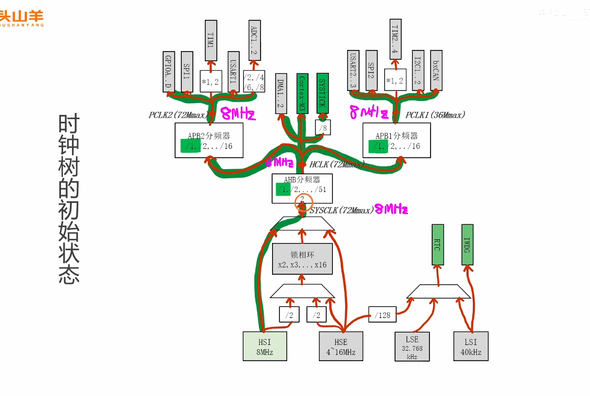
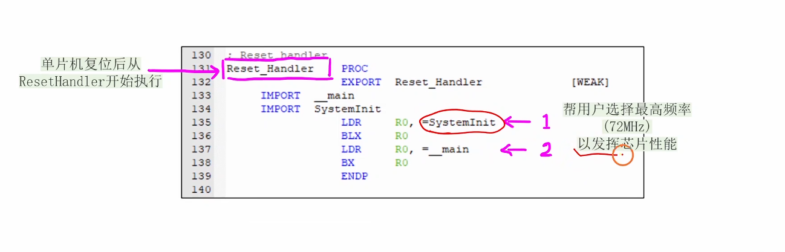
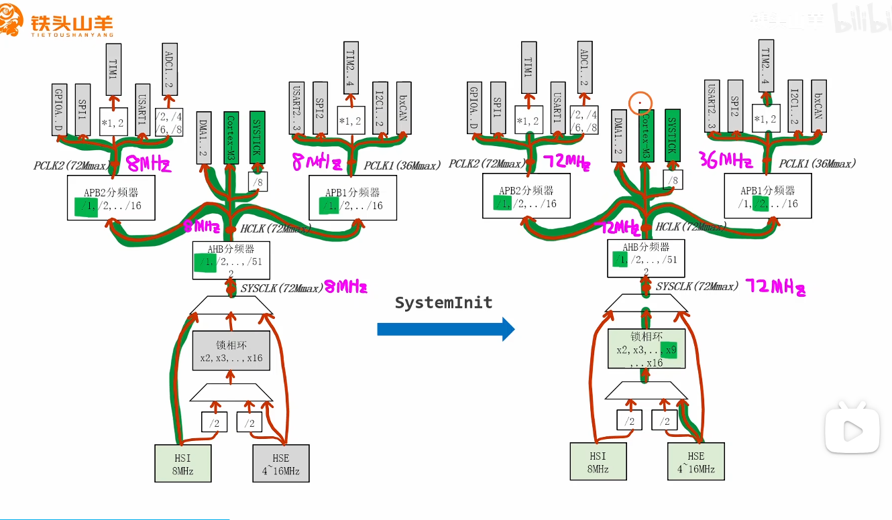
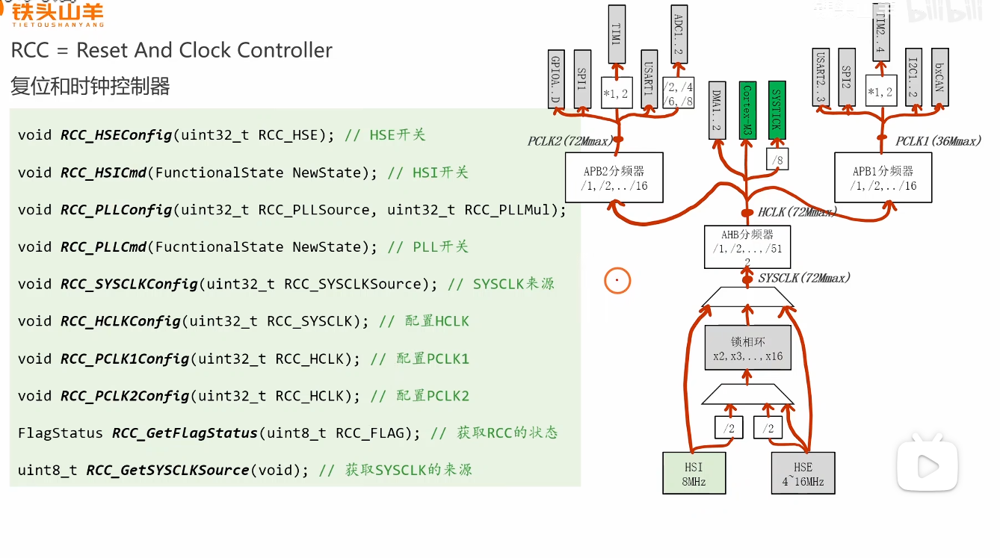
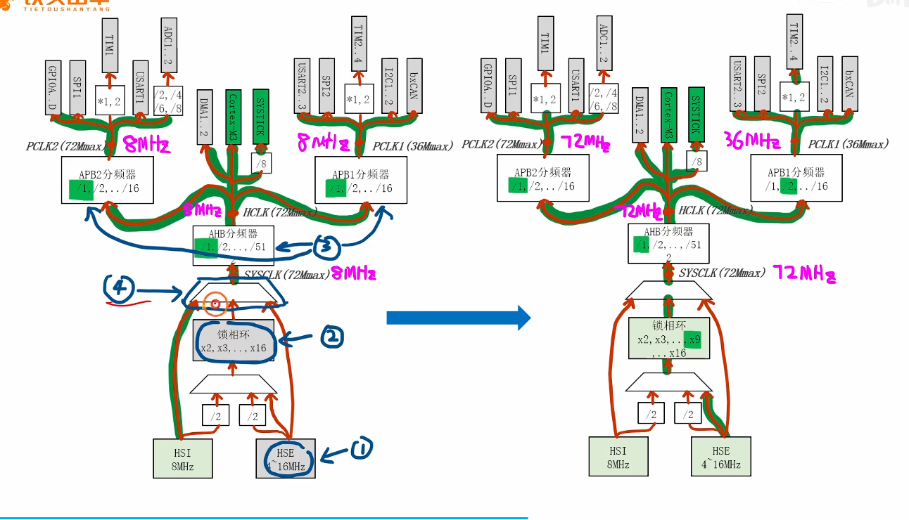
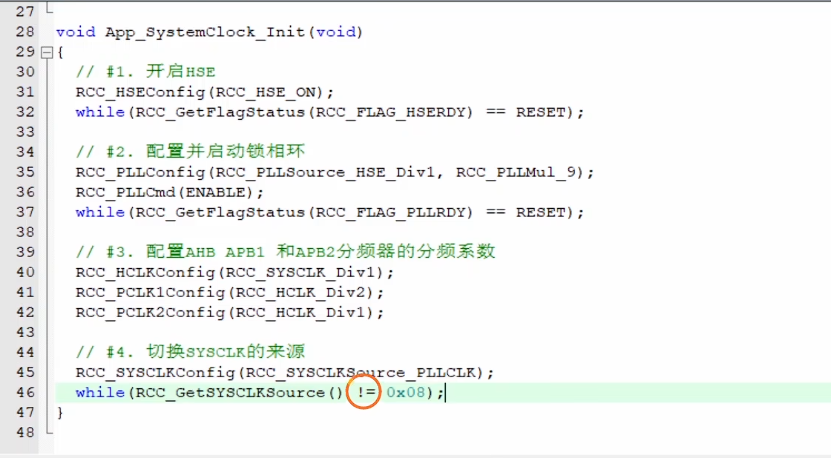
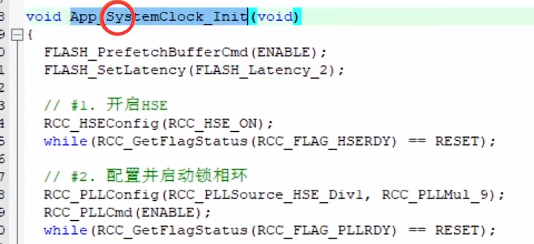
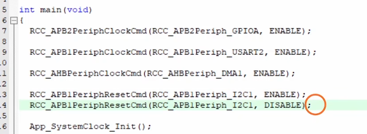

好的，这是对上述英文内容的中文翻译。


# 视频内容摘要


该视频是一份关于理解和编程 STM32F1 系列微控制器时钟系统的实践指南。它涵盖了以下几个关键点：

1. **时钟初始状态：** 视频解释了<span style="color:#CC0000;">在MCU上电或复位后</span>，它并不会以最高速度运行。<span style="color:#CC0000;">默认情况下</span>，它使用<span style="background:#FFFFFF; color:#CC0000;">内部高速 RC 振荡器（HSI）</span>，<span style="color:#CC0000;">频率为 8MHz</span>。<span style="color:#CC0000;">所有的系统和外设时钟</span>（SYSCLK, HCLK, PCLK1, PCLK2）都<span style="color:#CC0000;">直接从这个 8MHz 的时钟源派生而来</span>，<span style="color:#CC0000;">没有任何分频</span>。

   

2. **标准库启动代码的角色：** 视频揭示了一个关键细节：在你的 `main()` 函数被调用之前，一个名为 `SystemInit()` 的函数会被执行。这个函数是标准库的一部分，其默<span style="color:#CC0000;">认功能是自动配置时钟树</span>，<span style="color:#CC0000;">使用外部高速振荡器（HSE）和锁相环（PLL）来达到系统的最高频率（通常是 72MHz）</span>。这就解释了<span style="color:#CC0000;">为什么一个简单的 LED 闪烁程序可能会比预期运行得快得多，即便你没有在 `main` 函数中编写任何时钟配置代码</span>。

   

   

3. **手动配置时钟树：** 教程的核心是分步演示<span style="color:#CC0000;">如何手动配置时钟树以使其运行在 72MHz</span>，这实际上是<span style="color:#CC0000;">重复了 `SystemInit()` 的工作</span>。步骤如下：

   - **使能外部高速振荡器 (HSE)** 并等待其稳定。

   - **配置锁相环 (PLL)：** 选择 <span style="color:#CC0000;">HSE 作为输入源</span>，并<span style="color:#CC0000;">设置倍频因子</span>（例如，对于一个 8MHz 的晶振，使用 9 倍倍频得到 72MHz）。

   - **使能锁相环 (PLL)** 并等待其锁定稳定。

   - **配置总线分频器：** 为 AHB (HCLK), APB1 (PCLK1) 和 APB2 (PCLK2) 总线<span style="color:#CC0000;">设置时钟分频器</span>，以确保它们在各自的最大频率限制内运行。

   - **切换系统时钟 (SYSCLK)**，<span style="color:#CC0000;">使用 PLL 的输出作为其时钟源</span>。

     

     

     

4. **Flash 预取和延迟：** 视频提到了一个重要的性能考量。<span style="color:#CC0000;">当 CPU 以高速（例如 > 24MHz）运行时，Flash 存储器无法足够快地提供指令</span>。为了解决这个问题，必须做两件事：

   - **使能 Flash 预取缓存：** 这<span style="color:#CC0000;">允许系统在执行当前指令的同时预先获取下一条指令。</span>

   - **设置 Flash 访问延迟 (等待周期)：** <span style="color:#CC0000;">这会插入等待周期，以确保 CPU 不会从较慢的 Flash 存储器中读取到损坏的数据。所需的等待周期数量取决于 SYSCLK 的频率。对于 72MHz 的 STM32F103，需要两个等待周期。</span>

     

5. **<span style="color:#CC0000;">使能外设时钟</span>：** 最后，视频强调，要使用任何外设（如 GPIO、USART、定时器），必须首先使用 `RCC_APB2PeriphClockCmd()` 这样的函数来使能其在相应总线（AHB, APB1, 或 APB2）上的时钟。如果外设时钟未被使能，对其寄存器的写操作将不会有任何效果。



# 补充提问

## 提问1：

**Flash 预取和延迟：** 视频提到了一个重要的性能考量。<span style="color:#CC0000;">当 CPU 以高速（例如 > 24MHz）运行时，Flash 存储器无法足够快地提供指令</span>。为了解决这个问题，必须做两件事：

- **使能 Flash 预取缓存：** 这<span style="color:#CC0000;">允许系统在执行当前指令的同时预先获取下一条指令。</span>
- **设置 Flash 访问延迟 (等待周期)：** <span style="color:#CC0000;">这会插入等待周期，以确保 CPU 不会从较慢的 Flash 存储器中读取到损坏的数据。所需的等待周期数量取决于 SYSCLK 的频率。对于 72MHz 的 STM32F103，需要两个等待周期。</span>

<span style="font-weight:bold; font-size:1.2em;">上面这段话我不是太理解，你能够帮我解释下吗 ？</span>


好的，完全没问题。这是一个非常核心且重要的嵌入式概念，理解它对于编写高性能代码至关重要。我会用一个生动的比喻来为您详细解释。


### 核心问题：速度不匹配

首先，我们要明确核心矛盾：**<span style="color:#CC0000;">CPU的速度远远快于Flash存储器的速度。</span>**

- **CPU (中央处理器):** 像一个反应极快的短跑冠军。在72MHz的时钟频率下，它完成一个基本操作只需要大约14纳秒 (`1 / 72,000,000 秒`)。它每14纳秒就需要一条新的指令来执行。
- **Flash (闪存):** 像一个普通人。它被设计用来长期、稳定地存储数据（你的程序代码就存在这里），但读取速度相对较慢。从Flash中取一条指令可能需要50-70纳秒。

**矛盾出现了：** 短跑冠军(CPU)每14纳秒就要吃一颗能量豆(指令)，但仓库管理员(Flash)需要50-70纳秒才能从货架上找到一颗并递给他。如果不想办法解决，短跑冠军大部分时间都在原地等待，根本跑不起来。


### 生动的比喻：快手厨师和慢速储藏室

为了更好地理解，我们来打个比方：

- **你 (CPU):** 一位世界顶级的快手厨师，切菜速度飞快。
- **你的菜谱 (程序代码):** 一步步的指令。
- **一个巨大且缓慢的储藏室 (Flash):** 存放所有食材（指令）的地方。储藏室很大，但管理员动作很慢。
- **你的操作台 (CPU寄存器/内部总线):** 你在这里处理食材。

场景1：没有做任何优化 (低速运行, SYSCLK <= 24MHz)

你的切菜速度不快，每次喊“拿个番茄”，储藏室管理员都能在你用完上一个食材前把番茄给你。一切都很和谐。

场景2：只提升你的速度 (高速运行, SYSCLK > 24MHz)

你现在是快手厨师了，1秒钟能切10个番茄。但你喊“拿个鸡蛋”后，管理员需要5秒才能把鸡蛋给你。结果就是，你切1秒，然后叉着腰等4秒，效率极低。这就是CPU在等待Flash。

现在，为了解决这个问题，我们有两种策略，这两种策略分别对应**“等待周期”**和**“预取缓存”**。

------


### 策略一：设置访问延迟 (等待周期 - Wait State)

这是为了**保证正确性**，告诉快手厨师（CPU）要有耐心。

- **解释:** 我们在CPU和Flash之间制定一个规则：CPU每次从Flash请求数据后，必须强制“暂停”或“等待”固定的几个时钟周期。这给了Flash足够的时间来准备好数据，确保CPU在读取时，数据已经稳定地放在总线上了，不会读错。

- **比喻:** 你（快手厨师）被告知：“每次你要新食材时，必须在原地默数两个数（等待2个周期），然后再去拿。因为管理员动作慢，你数完数，食材肯定准备好了。”

- **具体例子 (以72MHz为例，Flash需要2个等待周期):**

  - **时钟周期1:** CPU发出“读取下一条指令”的请求给Flash。
  - **时钟周期2:** CPU**被强制停顿（Stall）**，什么也不做，只是等待。Flash正在努力获取指令。
  - **时钟周期3:** CPU**再次被强制停顿**，继续等待。Flash终于把指令准备好了。
  - **时钟周期4:** CPU读取到指令，开始执行。

  可以看到，为了正确读取一条指令，消耗了3个时钟周期（1个请求 + 2个等待）。虽然效率不高，但**保证了每次拿到的食材都是对的**，程序不会出错。

------


### 策略二：使能预取缓存 (Prefetch Buffer)

这是为了**提升效率**，让厨师尽可能少地等待。

- **解释:** 我们在CPU和Flash之间增加一个小的、超高速的缓存区（Prefetch Buffer）。这个缓存区有一个聪明的“预判”逻辑。当CPU在执行第N条指令时，这个逻辑会猜测CPU接下来很可能需要第N+1条指令（因为程序大多是顺序执行的），于是它就**提前**去Flash里把第N+1条指令取出来，放在这个高速缓存区里。
- **比喻:** 你雇了一个手脚麻利的助手（预取缓存逻辑），并在你的操作台旁边放了一个小托盘（高速缓存区）。
  - 当你正在切番茄（执行指令N）时，助手看了一眼菜谱，发现下一步是切鸡蛋（指令N+1）。
  - 助手立刻跑到慢速储藏室，在你切完番茄**之前**，就把鸡蛋拿了回来，放在了你手边的小托盘上。
  - 当你切完番茄，喊“拿个鸡蛋”时，你发现鸡蛋就在手边！你无需等待，直接拿来就用。**Flash的延迟被完美地隐藏了！**
- **预取的局限性（分支跳转）:**
  - 但是，如果菜谱突然出现一个分支：“如果锅里的油热了，就跳过切鸡蛋，直接拿大蒜。”（对应程序中的`if-else`或`jump`指令）。
  - 这时，助手提前拿回来的鸡蛋就没用了。你喊“拿大蒜”，助手才反应过来，赶紧跑去储藏室拿。这个时候，**你（CPU）还是得等待**。这次等待的时间就叫做“分支惩罚”（Branch Penalty）。


### 总结：两者如何协同工作

在实际配置中，**“等待周期”和“预取缓存”是同时使用的**，它们相辅相成。

1. **设置等待周期 (FLASH_SetLatency):** 这是**保底措施**。它确保了在任何情况下（无论是顺序执行还是分支跳转），CPU最终都能从Flash中正确地读取到数据，保证了程序的稳定性。
2. **使能预取缓存 (FLASH_PrefetchBufferCmd):** 这是**优化措施**。在大部分程序顺序执行的情况下，它能极大地提升性能，让CPU无需等待，感觉就像在和高速内存交互一样。

| 场景                        | 工作方式                                                     | 顺序代码性能                     | 分支/跳转性能            |
| --------------------------- | ------------------------------------------------------------ | -------------------------------- | ------------------------ |
| **无任何配置**              | CPU高速请求，Flash低速响应                                   | **程序可能崩溃或出错**           | **程序可能崩溃或出错**   |
| **仅设置等待周期**          | CPU每次读取都强制等待2个周期                                 | 较低（每次读取都停顿）           | 较低（每次读取都停顿）   |
| **设置等待周期 + 开启预取** | 预取缓存提前加载指令。如果命中，CPU不等待；如果未命中（跳转），CPU按设定的等待周期去等待Flash。 | **非常高**（绝大多数情况无等待） | 较低（发生跳转时需等待） |

因此，在将STM32的时钟频率超频到24MHz以上时，正确设置Flash的等待周期和开启预取缓存，是保证程序既能稳定运行又能发挥最高性能的关键步骤。


## 提问2:

<span style="font-weight:bold; font-size:1.2em;">我有个问题，CPU不是从SRAM中去取指令吗，这里怎么变成CPU从flash中取指令了，我不太懂？</span>


您提出的这个问题非常关键，它触及了通用计算机（如PC）和微控制器（MCU）在架构上的一个核心区别。您的理解在PC的世界里是完全正确的，但在典型的MCU中，情况有所不同。

简单来说：在STM32这样的微控制器中，**CPU默认直接从Flash（闪存）中读取并执行指令**。SRAM主要用于存储变量、堆栈等会动态变化的数据。

下面我们来详细拆解这个问题。


### 1. 核心概念：统一的地址空间 与 就地执行 (XIP)

与PC不同，STM32这样的MCU拥有一个**统一的地址空间**。这意味着Flash、SRAM、以及所有的外设寄存器（GPIO、USART等）都被映射到了一个连续的内存地址范围内。

- **Flash的地址范围:** 例如，从 `0x08000000` 开始。
- **SRAM的地址范围:** 例如，从 `0x20000000` 开始。
- **外设的地址范围:** 例如，从 `0x40000000` 开始。

CPU本身并不“关心”一个地址是Flash还是SRAM。当它需要取指令时，程序计数器(PC)会指向一个地址，CPU就向这个地址发出“读取”请求。内存控制器会根据这个地址，自动地去对应的物理设备（Flash或SRAM）中获取数据。

**就地执行 (Execute-In-Place, XIP):** 这是MCU的一个关键特性。MCU上电复位后，它的硬件被设计为**从一个固定的地址开始取第一条指令**，这个地址通常是`0x08000004`（在Flash的起始位置，存放着复位中断向量）。因此，CPU天生就是被设计为直接从Flash开始执行代码的，这种技术就叫做“就地执行”。


### 2. PC架构 vs. MCU架构的对比

为了加深理解，我们可以对比一下您熟悉的PC架构和MCU架构：

| 特性               | 通用计算机 (PC)                                              | 微控制器 (MCU)                                            | 原因和优势                                            |
| ------------------ | ------------------------------------------------------------ | --------------------------------------------------------- | ----------------------------------------------------- |
| **程序存储**       | 硬盘 / SSD (非易失性)                                        | **片上Flash** (非易失性)                                  | MCU将程序固化在芯片内部，实现上电即用，无需外部存储。 |
| **运行内存**       | DRAM / 内存条 (易失性)                                       | **片上SRAM** (易失性)                                     | MCU的SRAM容量小但速度快，用于存放运行时的数据。       |
| **启动过程**       | BIOS/UEFI从硬盘加载操作系统到内存(DRAM)，然后CPU从内存开始执行。 | CPU上电后，**直接从Flash的复位地址开始执行指令。**        | MCU启动过程极快，无需“加载”过程，实现了“瞬时启动”。   |
| **指令执行位置**   | **几乎完全从DRAM中执行。**                                   | **主要从Flash中执行 (XIP)。**                             | 这是两者最核心的区别。MCU的这种设计更简单、成本更低。 |
| **SRAM的主要用途** | 存放正在运行的程序和数据。                                   | 存放**变量**、**堆栈(Stack)**、**堆(Heap)**等运行时数据。 | 在MCU中，SRAM是“数据区”，Flash是“代码区”。            |


### 3. 特殊情况：什么时候会从SRAM中执行代码？

虽然默认从Flash执行，但在某些特定场景下，我们会**手动将一小部分代码复制到SRAM中，然后让CPU跳转到SRAM里去执行**。这是一种高级优化技巧。

- **追求极致的速度:** SRAM的访问速度比Flash快，通常是**0等待周期**的。对于那些对时间要求极其严苛的代码，比如一个需要快速响应的中断服务程序（ISR）或者一个复杂的算法，可以把它放到SRAM中执行，以消除Flash访问延迟带来的性能损失。
- **对Flash进行编程时:** 这是一个非常典型的应用。Flash存储器有一个特性：**你不能在执行一个Flash扇区中代码的同时，去擦除或写入同一个扇区**。因此，当我们需要进行在线升级（IAP）等操作时，标准的做法是：将负责擦写Flash的函数整体复制到SRAM中，然后让CPU跳转到SRAM中去执行这段代码，这样它就能安全地回头去操作Flash了。


### 总结

- **默认情况：** STM32的CPU直接从Flash中取指令并执行（XIP）。这是MCU为实现低成本、高集成度和快速启动而采用的标准架构。
- **SRAM的用途：** 默认情况下，SRAM用来存放程序运行中需要读写的数据（全局变量、局部变量、函数调用栈等），而不是指令。
- **特殊情况：** 只有在对性能有极致要求或需要在线更新固件等特殊场景下，我们才会特意将代码搬运到SRAM中执行。

所以，您之前关于Flash访问延迟和预取的困惑是完全成立的，正是因为CPU大部分时间都在和相对较慢的Flash打交道，我们才需要这些技术来弥补速度差异，提升整体性能。


## 提问3：

<span style="font-weight:bold; font-size:1.2em;">内存控制器会根据这个地址，自动地去对应的物理设备（Flash或SRAM）中获取数据。 </span>

<span style="font-weight:bold; font-size:1.2em;"> 这里从Flash和SRAM中获取的数据分别是什么数据呢，我不太懂，你能够给我详细解释下吗？</span>


当然可以，这是一个非常好的问题，能够帮助你彻底弄清程序在MCU中是如何运作的。我们还是用一个具体的比喻来开始，然后深入到技术细节。


### 核心比喻：菜谱 vs. 厨房操作台


想象一下你要做一道复杂的菜：

- **Flash (闪存) = 菜谱 (Cookbook)**
  - **特点：** 菜谱是印刷好的，内容是固定的，你**只能读，不能改**。关掉厨房的灯再打开（断电再上电），菜谱上的内容**不会丢失**（非易失性）。
  - **存放内容：** 菜谱上写着做菜的每一个**步骤和流程**，以及一些**固定不变的配方用量**（比如“盐：5克”，“酱油：10毫升”）。
- **SRAM (静态随机存取存储器) = 厨房操作台 (Kitchen Counter)**
  - **特点：** 操作台是你的工作空间，你可以在上面**随意摆放、混合、加工食材**（可读可写）。但一旦你离开厨房并关灯（断电），第二天再来时，操作台上的所有东西都**被清空了**（易失性）。
  - **存放内容：** 你的**临时食材**（比如从冰箱拿出来的鸡蛋）、正在处理的**半成品**（比如切好的葱花）、以及你脑子里记的“下一步要干嘛”的**临时想法**。


### 从Flash和SRAM中获取的具体数据


现在，我们把这个比喻对应到你的C语言程序中。

------


#### 1. 从 Flash (菜谱) 中获取的数据


CPU从Flash中读取的主要是**编译后就固定不变、只读(Read-Only)的数据**。

- **程序指令 (代码段, `.text` section):**
  - **这是最主要的部分。** 你的所有C函数（`main`、`delay`、`printf`等）被编译器转换成的机器码指令，都存放在Flash里。CPU的程序计数器（PC指针）大部分时间就是在Flash的地址范围内移动，一条一条地取出这些指令来执行。
  - **例子：** `for (i=0; i<100; i++)` 这个循环语句，编译后会变成多条机器指令（如加载、比较、跳转等），这些指令本身就存储在Flash中。
- **常量数据 (只读数据段, `.rodata` section):**
  - 所有<span style="color:#FF0000;">被`const`修饰符定义的常量</span>，以及<span style="color:#FF0000;">字符串字面量</span>。
  - **例子 1：** `const float PI = 3.14159;` 这个 `PI` 的值 `3.14159` 就被存储在Flash中。程序运行时，CPU会从Flash的特定地址读取这个值，但不能修改它。
  - **例子 2：** `printf("Hello, World!");` 这个字符串 `"Hello, World!"` 也被存储在Flash中。
- **已初始化全局变量/静态变量的“初始值”：**
  - 这是一个关键点。当你定义 `int global_value = 100;` 时，这个初始值 `100` 会被保存在Flash里。程序启动时，需要有一个“搬运”的动作，我们稍后会讲。

------


#### 2. 从 SRAM (厨房操作台) 中获取的数据

CPU从SRAM中读取和写入的是**程序运行时需要动态改变的数据**。

- **已初始化的全局/静态变量 (数据段, `.data` section):**

  - **例子：** `int global_value = 100;`
  - 在程序开始运行时（`main`函数执行前），启动代码会把存放在Flash中的**初始值 `100` 复制到SRAM**的一块内存区域。之后，程序中所有对 `global_value` 的读写操作，都是在SRAM的这个地址上进行的。比如执行 `global_value++;` 后，SRAM里的值会变成`101`，而Flash里的初始值`100`保持不变。

- **未初始化的全局/静态变量 (BSS段, `.bss` section):**

  - **例子：** `int buffer[100];`
  - 这些变量没有初始值。程序启动时，启动代码会**把SRAM中这块区域全部清零**。之后程序对 `buffer` 数组的读写就发生在这片SRAM区域。

- **栈 (Stack):**

  - 这是SRAM中非常重要的一块区域，用于存放**函数的局部变量、函数参数、返回地址**等。

  - **例子：**

    C

    ```C++
    void my_function() {
        int local_var = 10; // local_var 就存放在栈上
        // ...
    }
    ```

  - 当你调用 `my_function` 时，系统会在SRAM的栈顶为 `local_var` 分配空间；当函数执行完毕返回时，这块空间会被自动释放。栈是自动管理的，后进先出（LIFO）。

- **堆 (Heap):**

  - 用于动态内存分配（例如通过`malloc`函数）。程序员需要手动申请和释放。在资源有限的MCU中不常用，但也是SRAM的一部分。


### 程序运行全流程示例


让我们把整个过程串起来，看看一个程序从上电到运行的完整生命周期：

1. **编译链接：** 你的C代码被编译成一个二进制文件。这个文件里明确划分了代码段(`.text`)、只读数据段(`.rodata`)、已初始化数据段(`.data`的初始值)等。
2. **烧录程序：** 你将这个二进制文件整个烧录到STM32的**Flash**中。
3. **上电/复位：**
   - CPU醒来，PC指针指向Flash的复位地址，开始执行**启动代码**（这段代码本身也在Flash里）。
   - 启动代码执行一个关键任务：**内存初始化**。
     - 它从Flash中读取`.data`段的初始值，把它们**复制**到SRAM中对应的位置。
     - 它将SRAM中的`.bss`段**全部清零**。
     - 它设置好栈指针（SP），指向SRAM中栈的顶部。
   - 启动代码最后调用 `main()` 函数。
4. **`main()`函数运行：**
   - CPU开始从**Flash**中逐条取出`main`函数的指令来执行。
   - 当遇到 `global_value = 50;` 这样的语句时，CPU会向**SRAM**中 `global_value` 所在的地址写入`50`。
   - 当遇到 `const float a = PI;` 这样的语句时，CPU会从**Flash**中读取`PI`的值，然后存入位于**SRAM栈**上的局部变量`a`中。

总结一下：

<span style="color:#CC0000;">Flash 存储的是程序的“灵魂”和“蓝图”——永不改变的指令和常量。</span>

<span style="color:#CC0000;">SRAM 存储的是程序的“活动状态”和“草稿纸”——所有在运行中可能被修改的数据。</span>

CPU就像一个严格按照菜谱（Flash）操作的厨师，而他所有的中间产品和临时数据都放在操作台（SRAM）上。


## 提问3-1（第2次复习）

你的C代码被编译成一个二进制文件。这个文件里明确划分了代码段(`.text`)、只读数据段(`.rodata`)、已初始化数据段(`.data`的初始值)等。

<span style="color:#FF0000; background:#33FF99; border:1px solid #FF00FF;">这里只读数据段 （.rodata） 里面应该是代码中用const修饰的变量吧，已初始化数据段（.data）里面应该是代码中定义的全局和静态变量吧，我的理解对吗，还有没有什么需要补充的呢。另外，代码应该还会划分未初始化数据段（.bss），这里应该是代码中未初始化的全局和静态变量吧。除此之外，在函数内部用const修饰的局部变量 还有 函数内部用static修饰的静态变量也分别是存放在.rodata和.data数据段的吗。</span>

你的理解**非常准确**，基本功已经非常扎实了！<span style="color:#FF0000; border:1px solid #FF00FF;">你对 `.rodata`、`.data` 和 `.bss` 的分类总结得完全正确</span>。你已经抓住了 C 语言内存管理的核心骨架。

针对你提出的补充问题（关于函数内部的 `const` 和 `static` 局部变量），这正是区分普通程序员和优秀嵌入式工程师的“分水岭”问题。

我们来详细拆解一下这几个让你疑惑的特殊情况：

### 1. 函数内部的 `static` 局部变量存放在哪？

你的猜测是对了一半的：**它们和全局变量的待遇完全一样。**

在 C 语言中，<span style="color:#FF0000;">`static` 赋予了局部变量“全局的生命周期”，只是把它的“可见范围（作用域）”锁死在了函数内部。</span>

- **如果初始化为非零值：** 存放在 **`.data` 段**。
- **如果未初始化或初始化为 0：** 存放在 **`.bss` 段**。

### 2. 函数内部的 `const` 局部变量存放在哪？

这是一个极其经典的面试坑！很多初学者会理所当然地认为只要带有 `const` 就一定进 `.rodata`，但<span style="color:#FF0000;">**实际上，函数内部普通的 `const` 局部变量通常存放在栈 (Stack) 上**。</span>

**为什么会在栈上呢？**

- **生命周期决定位置：** 局部变量的特性是每次调用函数时诞生，函数结束时销毁。它必须在栈上动态分配。
- **`const` 只是编译器的“紧箍咒”：** 对于局部变量，`const` 仅仅是**在编译阶段**给编译器下达的指令：“如果发现后续代码试图修改这个变量，请给我报错”。它改变的是访问权限的检查，而通常不改变变量的物理存储区域。

**特殊例外（编译器优化）：**

如果你的局部 `const` 变量是一个非常大的数组，比如 `const int big_array[1000] = {1, 2, ...};`，聪明的编译器为了节省栈空间和提高效率，可能会在底层偷偷把它优化放到 `.rodata` 段中。但对于普通的单值变量（如 `const int a = 10;`），它依然在栈上。

------

### 终极梳理表格

为了让你一目了然，我把你提到的所有情况做了一个终极对照表：

| **变量定义方式**                          | **举例**                   | **存储的逻辑段**     | **物理位置 (STM32)**        |
| ----------------------------------------- | -------------------------- | -------------------- | --------------------------- |
| **普通的全局变量** (非零初始值)           | `int a = 10;`              | **`.data` 段**       | 初始值在 Flash，运行在 SRAM |
| **普通的全局变量** (未初始化/为0)         | `int b;` 或 `int c = 0;`   | **`.bss` 段**        | 运行在 SRAM                 |
| **静态的全局变量** (非零初始值)           | `static int d = 10;`       | **`.data` 段**       | 初始值在 Flash，运行在 SRAM |
| **带有 `const` 的全局变量**               | `const int e = 10;`        | **`.rodata` 段**     | 永远在 Flash                |
| **普通的局部变量** (函数内)               | `int f = 10;`              | **栈 (Stack)**       | 运行在 SRAM (高地址)        |
| **带有 `const` 的局部变量** (函数内)      | `const int g = 10;`        | **通常在栈 (Stack)** | 运行在 SRAM                 |
| **带有 `static` 的局部变量** (非零初始值) | `static int h = 10;`       | **`.data` 段**       | 初始值在 Flash，运行在 SRAM |
| **带有 `static` 的局部变量** (初始化为0)  | `static int i = 0;`        | **`.bss` 段**        | 运行在 SRAM                 |
| **带有 `static const` 的局部变量**        | `static const int j = 10;` | **`.rodata` 段**     | 永远在 Flash                |

*(提示：<span style="color:#FF0000; background:#33FF99; border:1px solid #FF00FF;">如果你想让一个函数内的局部常量绝对不占用宝贵的 SRAM 栈空间，最好的写法就是加上 `static const`)</span>*

你看，把 `static` 和 `const` 拆开来看它们的本质含义，整个内存布局就变得像拼图一样严丝合缝了。

你想不想了解在单片机上电那一刻，是谁（哪段神秘代码）负责把 Flash 里的 `.data` 初始值辛辛苦苦搬运到 SRAM 里的？


## 提问3-2（第2次复习）

<span style="color:#FF0000; background:#33FF99; border:1px solid #FF00FF;">这里.text、.rodata、.data、.bss 和SRAM、flash的关系是什么呢，我不太懂，你能够给我详细解释下吗？</span>

这个问题非常经典！把这些英文缩写和物理芯片对应起来，是彻底搞懂单片机底层运行机制的最后一块拼图。

你可以这样理解：**`.text`、`.rodata`、`.data`、`.bss` 是编译器<span style="color:#FF0000; background:#33FF99; border:1px solid #FF00FF;">在软件逻辑上分出的“类别</span>”**，这就好比我们把物品分为“工具”、“参考书”、“消耗品”；而 **Flash 和 SRAM 是<span style="color:#FF0000; background:#33FF99; border:1px solid #FF00FF;">单片机上实实在在的“物理仓库</span>”**。

我们把<span style="color:#FF0000; border:1px solid #FF00FF; background:#33FF99;">它们之间的映射关系</span>拆解开来，主要分为两类：**永远待在 Flash 里的**，以及**要在 SRAM 里活动的**。

### 1. 永远待在 Flash 里的“固定资产”

Flash 的特点是掉电不丢失（非易失性），相当于电脑的硬盘。所以，所有不需要改变、也不能丢失的东西都存放在这里。

- **`.text` (代码段)：** 存放你写的 C 语言代码编译后生成的机器指令。CPU 会直接从 Flash 中读取这些指令并执行（这叫就地执行 XIP）。
- **`.rodata` (只读数据段)：** 存放程序里的常量（比如 `const` 修饰的变量、像 `"Hello"` 这样的字符串）。因为它们是只读的，程序运行期间绝不会被修改，所以直接放在 Flash 里，CPU 用到的时候去读就行了，可以节省宝贵的 SRAM 空间。

### 2. <span style="color:#FF0000;">横跨两界的特殊存在</span>：`.data` (已初始化数据段)

`.data` 段是最特殊的，它存放的是**有非零初始值的全局变量和静态变量**（比如 `int a = 100;`）。它和 Flash、SRAM 都有关系，这是一个“接力”的过程：

- **在 Flash 中（备胎/出厂设置）：** 当你把程序烧录到单片机时，这个初始值 `100` 会被固化在 Flash 中。如果不保存在这里，一断电这个初始值就彻底消失了。
- **在 SRAM 中（干活的地方）：** SRAM 是易失性内存，读写速度极快，相当于操作台。单片机上电启动时，启动代码会把 Flash 里的初始值 `100` **复制**到 SRAM 分配好的一块区域中。程序后续所有对变量 `a` 的加减乘除，都是在 **SRAM** 里进行的。

### 3. 完全属于 SRAM 的“临时工”

SRAM 的特点是读写极快，但掉电立刻清空，所以专门用来存放运行时不断变化的数据。

- **`.bss` (未初始化数据段)：** 存放未初始化或初始化为 0 的全局/静态变量（比如 `int b;`）。它**完全不占用 Flash 的空间**（Flash 里只记录了它需要多大位置），单片机启动时，启动代码会在 **SRAM** 中为它划出一块地盘，并全部清零。
- **栈 (Stack) & 堆 (Heap)：** 你的局部变量、函数参数等，全都在 **SRAM** 里动态分配和释放。

------

### 总结对照表

为了方便你记忆，我们可以用一张表来总结它们的物理归宿：

| **逻辑分段**     | **存放内容**              | **最终的物理位置 (STM32)**            | **作用比喻**                       |
| ---------------- | ------------------------- | ------------------------------------- | ---------------------------------- |
| **`.text`**      | 机器指令                  | **Flash**                             | 永远不能改的“菜谱操作步骤”         |
| **`.rodata`**    | `const` 常量、字符串      | **Flash**                             | 永远不能改的“调料配方表”           |
| **`.data`**      | 非零初始值的全局/静态变量 | 初始值在 **Flash**，运行时在 **SRAM** | 从仓库拿出来放在操作台上的“原材料” |
| **`.bss`**       | 未初始化的全局/静态变量   | 运行时在 **SRAM** (上电清零)          | 操作台上专门腾出来放废料的“空盆”   |
| **Stack / Heap** | 局部变量、动态内存        | 运行时在 **SRAM**                     | 操作台上切菜的“砧板”               |

理清了这个关系，以后你看代码时，就能在脑子里清晰地看到哪个变量存在了哪个硬件芯片里了。

提到刚才 `.data` 和 `.bss` 的上电搬运和清零操作，你想不想知道这段神奇的“启动代码”到底藏在工程里的哪个文件中，它是如何先于 `main()` 函数悄悄执行的？


## 提问4：

<span style="font-weight:bold; font-size:1.2em;">下面中的global_value是个已经初始化为100的全局变量。</span>

<span style="color:#CC0000;">在程序开始运行时（main函数执行前），启动代码会把存放在Flash中的初始值 100 复制到SRAM的一块内存区域。之后，程序中所有对 global_value 的读写操作，都是在SRAM的这个地址上进行的。比如执行 global_value++; 后，SRAM里的值会变成101，而Flash里的初始值100保持不变。 </span>

<span style="color:#CC0000; font-size:1.2em;"> <span style="font-weight:bold;">这里flash里面的值如果在SRAM里面改变了不用再写回去改变吗？</span></span>


您提出了一个非常好的问题，这触及了易失性内存（SRAM）和非易失性内存（Flash）最根本的区别和用途。

**答案是：<span style="color:#CC0000;">不需要，并且在正常程序运行中，通常也绝对不会把SRAM中的变量值再写回Flash。</span>**

让我们来深入探讨一下为什么会这样，以及这样设计的目的。


### 1. Flash 和 SRAM 的根本职责不同


首先，我们要理解这两种存储器的“天职”：

**Flash (闪存) - 你的程序的“安装光盘”或“硬盘”**

- **非易失性 (Non-Volatile):** 断电后数据**不会**丢失。你的程序代码必须存在这里，否则下次上电MCU就“失忆”了。
- **读快写慢:** <span style="color:#CC0000;">读取速度相对较快（虽然仍比CPU慢）</span>，但**<span style="color:#CC0000;">写入和擦除操作非常非常慢</span>**（通常是毫秒级别）。
- **寿命有限:** Flash有<span style="color:#CC0000;">擦写次数限制</span>（通常在<span style="color:#CC0000;">一万到十万次</span>之间）。如果你频繁地去写它，它很快就会损坏。
- **擦除-写入机制:** 你<span style="color:#CC0000;">不能像改写一个字那样直接修改Flash里的数据</span>。你<span style="color:#CC0000;">必须先将一整块区域（一个扇区或页）**全部擦除**（所有位都变为1），然后再把新的数据**整个写进去**。</span>

**SRAM (静态随机存取存储器) - 你的“高速草稿纸”或“内存条”**

- **易失性 (Volatile):** 断电后数据**会立刻**丢失。
- **读写速度极快:** 它的<span style="color:#CC0000;">读写速度和CPU是同一个数量级</span>的，可以做到**<span style="color:#CC0000;">零等待周期</span>**访问。
- **寿命无限:** 理论上可以无限次地读写，不会损坏。
- **按字节写入:** 你<span style="color:#CC0000;">可以随时、立即地修改其中任意一个字节</span>，而不会影响到旁边的数据。


### 2. 为什么SRAM的值不写回Flash？


基于以上的职责不同，我们可以得出结论：

1. **性能要求：** 像 <span style="color:#CC0000;">`global_value++` 这样的操作，在一个循环里可能每秒执行几万甚至几百万次。如果每次都去写Flash，那程序就会被拖慢到几乎无法运行的地步，因为每次写操作都要耗费毫秒级的时间。而写入SRAM是纳秒级的，完全跟得上CPU的节奏。</span>
2. **硬件寿命：** 如果<span style="color:#CC0000;">每次变量改变都写回Flash</span>，那么这个<span style="color:#CC0000;">Flash存储单元可能在几分钟内就达到了它的擦写寿命上限，导致MCU永久性损坏</span>。
3. **设计意图：** `int global_value = 100;` 这句代码的意图是：“<span style="color:#CC0000;">**每次程序启动时**，我希望 `global_value` 的**初始值**是100</span>”。<span style="color:#CC0000;">Flash里存储</span>的就是这个“<span style="color:#CC0000;">初始值</span>”或者说“<span style="color:#CC0000;">出厂设置</span>”。程序运行过程中，`global_value` 在SRAM中的变化是程序的**当前状态**或**临时状态**。<span style="color:#CC0000;">当MCU复位或重新上电时，我们希望一切都恢复到最初的、可预期的状态，也就是再次从Flash中加载那个初始值`100`到SRAM中，重新开始。</span>

**再次使用“菜谱 vs. 厨房操作台”的比喻来解释你这个问题：**

- 菜谱（Flash）上写着：“取面粉100克”。
- 你开始做菜时（程序启动），从储藏室（Flash）拿出100克面粉（初始值）放到了操作台（SRAM）上。
- 你做蛋糕用掉了10克面粉，现在操作台上（SRAM）只剩下90克了 (`global_value--`)。

你问：“这时候需不需要拿笔，去把菜谱（Flash）上的‘100克’改成‘90克’？”

**答案是：当然不需要！** 菜谱是永久的配方。你这次做菜用了多少面粉，只是这一次的临时状态。如果你修改了菜谱，那下次再做这道菜的时候，你一开始就只能拿90克面粉了，这会把整个流程都搞乱。我们希望的是，每次做菜都从一个标准、干净的状态开始。


### 那么，如果我真的想保存数据怎么办？


你可能会接着问：“如果我想保存用户的设置、或者游戏的最高分，这些数据需要断电不丢失，那该怎么办？”

这就引出了一个特殊的操作——<span style="color:#CC0000;">**将数据作为“配置信息”而不是“程序变量”来写入Flash**。</span>

这是一个**刻意的、非默认的**行为，通常步骤如下：

1. **在Flash中预留一块专用区域：** 在你的程序代码之外，专门留出一个扇区（Sector）或一页（Page）的Flash空间，用来存放需要永久保存的数据。
2. **执行保存操作：** 当用户点击“保存设置”按钮时，程序会调用专门的Flash擦写函数，执行“擦除整个扇区 -> 写入新数据”这个缓慢但持久的操作。
3. **开机时加载配置：** 在<span style="color:#CC0000;">启动代码或`main`函数的一开始，程序会先去Flash的这个专用区域检查有没有保存过的数据。如果有，就用这里的数据来覆盖SRAM中变量的默认初始值。</span>

这样，我们就把程序的“易变的状态”（普通变量在SRAM中）和“需要持久化的状态”（配置数据在Flash中）清晰地分开了。


## 提问5：

<span style="color:#CC0000; font-size:1.2em;">这个.data， .bss，只读代码段，数据段，栈，堆等，还有什么未初始化的和已经初始化的静态或者全局变量存在位置什么的，你能够从stm32单片机和电脑两个维度给我系统的讲述下吗，我不太懂，最好能够举些例子来帮助我深刻的理解下？</span>

当然！您问到了一个嵌入式开发乃至所有C/C++程序开发中最核心、最基础的问题。<span style="color:#CC0000;">理解了内存的划分</span>，你就能真正明白你的代码是如何在硬件上运行的。

我会从 **STM32单片机** 和 **电脑(PC)** 两个维度，为你系统地、并配合大量实例来讲解这些概念。


### 核心思想

无论是在单片机还是电脑上，一个C/C++程序在编译链接后，其占用的内存都会被逻辑上划分为几个不同的“段”或“区”（Segment）。<span style="color:#CC0000;">**两者的主要区别在于，这些逻辑上的“段”最终被映射到哪些物理存储设备上。**</span>

- **单片机物理设备：** Flash (非易失性，像硬盘) 和 SRAM (易失性，像内存)。
- **电脑物理设备：** 硬盘/SSD (非易失性) 和 内存/DRAM (易失性)。

------


### C代码示例


我们先定义一个贯穿全文的C代码例子，然后分析其中每一部分最终会去到哪里。

C

```C
// a_memory_example.c

#include <stdio.h>
#include <stdlib.h>

const char* ro_data_str = "Hello, Read-Only World!"; // 只读数据
int initialized_global_var = 100;                    // 已初始化的全局变量
int uninitialized_global_var;                        // 未初始化的全局变量
static int initialized_static_var = 50;              // 已初始化的静态全局变量
static int uninitialized_static_var;                 // 未初始化的静态全局变量

void function(int param) {
    int local_var = param;                           // 局部变量
    static int uninitialized_local_static = 0;       // 未初始化的静态局部变量（对于静态或全局变量，初始化为0和未初始化一样）
    char* dynamic_mem = (char*)malloc(10);           // 动态分配的内存
}

int main() {
    // ... 函数体内的可执行代码 ...
    function(5);
    initialized_global_var++;
    return 0;
}
```

------


### 内存段的详细解析


#### 1. 代码段 (Code Segment / `.text` Section)

- **存放内容：** 存放程序执行的**机器指令**。这部分是<span style="color:#CC0000;">只读</span>的，防止程序意外修改自身的指令。
- **例子：** `main`函数和`function`函数内部所有的逻辑（如循环、判断、函数调用、变量自增等），编译后生成的二进制机器码。
- **STM32单片机上的位置：** **Flash**。
  - **原因：** 代码是固化的，断电不能丢失，且<span style="color:#CC0000;">运行时不需要修改</span>。<span style="color:#CC0000;">CPU通过“就地执行(XIP)”技术直接从Flash中读取并执行这些指令。</span>
- **电脑上的位置：**
  - **编译后：** 存在<span style="color:#CC0000;">可执行文件（如`.exe`）的`.text`段</span>中，保存在**硬盘/SSD**上。
  - **运行时：** 操作系统（如Windows, Linux）的**加载器(Loader)**会把它从硬盘加载到**内存(DRAM)**中，并标记为只读。CPU从内存中执行指令。


#### 2. 只读数据段 (Read-Only Data Segment / `.rodata` Section)

- **存放内容：** 存放**常量数据**，比如字符串字面量和用`const`修饰的全局变量。
- **例子：**
  - `"Hello, Read-Only World!"` 这个字符串本身。
  - `ro_data_str`这个指针变量本身指向的这个字符串地址。
- **STM32单片机上的位置：** **Flash**。
  - **原因：** 和代码一样，它们是程序固有的一部分，只读且不能丢失。放在Flash里可以节省宝贵的SRAM空间。
- **电脑上的位置：**
  - **编译后：** 存在<span style="color:#CC0000;">可执行文件的`.rodata`段</span>中，保存在**硬盘/SSD**上。
  - **运行时：** 被加载器加载到**内存(DRAM)**的只读区域。


#### 3. 已初始化数据段 (Initialized Data Segment / `.data` Section)

- **存放内容：** 存放被明确**<span style="color:#CC0000;">初始化为非零值</span>**的**全局变量**和**静态变量**。
- **例子：**
  - `int initialized_global_var = 100;`
  - `static int initialized_static_var = 50;`
- **STM32单片机上的位置：** 这是一个**“协作”**过程。
  - **编译后：** 初始值`100`和`50`被保存在**Flash**中。
  - **运行时：** 在`main`函数执行前，**启动代码**会负责把这些初始值从Flash**复制**到**SRAM**中。程序运行时，所有对这些变量的读写操作都发生在这块SRAM区域。
- **电脑上的位置：**
  - **编译后：** 初始值存在<span style="color:#CC0000;">可执行文件的`.data`段</span>中，保存在**硬盘/SSD**上。
  - **运行时：** 被加载器加载到**内存(DRAM)**的可读写区域。


#### 4. 未初始化数据段 (Uninitialized Data Segment / `.bss` Section)

- **存放内容：** 存放**<span style="color:#CC0000;">未被初始化</span>**或**<span style="color:#CC0000;">初始化为0</span>**的**全局变量**和**静态变量**。
- **例子：**
  - `int uninitialized_global_var;`
  - `static int uninitialized_static_var;`
  - `static int uninitialized_local_static = 0;` (<span style="color:#CC0000;">初始化为0也算在这里</span>)
- **<span style="color:#CC0000;">为什么要单独分一个BSS段？</span>** 为了节省可执行文件的体积。<span style="color:#CC0000;">对于一个巨大的未初始化数组`int big_array[10000];`，我们没必要在文件里存40000个零。只需在文件中记录“我需要40000字节，请在运行时把它们都变成0”，这就大大减小了文件大小。</span>
- **STM32单片机上的位置：**
  - **编译后：** **<span style="color:#CC0000;">不占用Flash空间</span>**，<span style="color:#CC0000;">只在文件中记录大小。</span>
  - **运行时：** 在`main`函数执行前，**启动代码**会在**SRAM**中分配这块空间，并将其**全部清零**。
- **电脑上的位置：**
  - **编译后：** **<span style="color:#CC0000;">不占用可执行文件空间</span>**，<span style="color:#CC0000;">只记录大小。</span>
  - **运行时：** 加载器在**内存(DRAM)**中分配空间并清零。


#### 5. 堆 (Heap)

- **存放内容：** 存放程序运行时**动态分配**的内存，由程序员手动通过`malloc`/`new`申请，并通过`free`/`delete`释放。
- **例子：** `(char*)malloc(10);` 申请到的那10个字节的空间。
- **STM32单片机上的位置：** **SRAM**中一块未被`.data`和`.bss`段占用的剩余区域。堆从低地址向高地址增长。
- **电脑上的位置：** **内存(DRAM)**中。由操作系统管理。


#### 6. 栈 (Stack)

- **存放内容：** 存放**函数的参数**、**局部变量**、函数返回地址等。它由编译器自动管理，函数调用时分配，函数返回时释放（后进先出LIFO）。
- **例子：** 在`function(5)`被调用时，参数`param`（值为5）和局部变量`local_var`都会被压入栈中。
- **STM32单片机上的位置：**<span style="color:#CC0000;"> **SRAM**的最高地址区域，从高地址向低地址增长。</span>
- **电脑上的位置：** **内存(DRAM)**中，每个线程都有自己独立的栈。


### 总结与对比表格

| C代码元素                | 逻辑段                     | STM32 物理位置                              | PC 物理位置 (运行时) |
| ------------------------ | -------------------------- | ------------------------------------------- | -------------------- |
| `main()` 函数体          | **代码段 (.text)**         | **Flash**                                   | **内存 (DRAM)**      |
| `const char*` 和 `"..."` | **只读数据段 (.rodata)**   | **Flash**                                   | **内存 (DRAM)**      |
| `int global = 10;`       | **已初始化数据段 (.data)** | 初始值`10`在**Flash**，运行时变量在**SRAM** | **内存 (DRAM)**      |
| `static int s_var;`      | **未初始化数据段 (.bss)**  | **SRAM**                                    | **内存 (DRAM)**      |
| `int local;` (在函数内)  | **栈 (Stack)**             | **SRAM**                                    | **内存 (DRAM)**      |
| `malloc(10);`            | **堆 (Heap)**              | **SRAM**                                    | **内存 (DRAM)**      |

希望这个结合了比喻、代码实例和对比表格的系统性讲解，能帮助你深刻地理解程序内存布局在不同平台上的实现方式！


# 内容扩展与深度解析

以下是对视频内容的扩展，提供了更深层次的背景知识：

- **HSE vs. HSI - 精度的权衡：**

  - **HSI (内部高速时钟):** 这是一个 RC (电阻-电容) 振荡器。它很方便，因为它是<span style="color:#CC0000;">内置的并且启动非常快</span>。然而，它的<span style="color:#CC0000;">频率不是很精确</span>，会<span style="color:#CC0000;">随着温度和电压的变化而漂</span>移。它适用于那些对精确定时要求不高的应用。
  - **HSE (外部高速时钟):** 通常使用外部的石英晶振。它比 HSI 精确和稳定得多。对于需要稳定时钟的通信外设，如 **USB、CAN 和以太网**，这种精度是**必需的**。<span style="color:#CC0000;">大多数高性能应用都会使用 HSE 作为 PLL 的时钟源。</span>

- 为什么分频器至关重要 (APB1 vs. APB2):

  视频提到了设置分频器，但理解其原因至关重要。STM32 上的不同总线有不同的最高频率限制。在常见的 STM32F103 系列上：

  - **AHB 总线 (HCLK):** 连接<span style="color:#CC0000;">内核</span>、<span style="color:#CC0000;">内存</span>和 <span style="color:#CC0000;">DMA</span>。最高频率是 72MHz。
  - **APB2 总线 (PCLK2):** 连接<span style="color:#CC0000;">高速外设</span>，如<span style="color:#CC0000;">大部分 GPIO、ADC1/2、TIM1、SPI1、USART1</span>。<span style="color:#CC0000;">最高频率是 72MHz</span>。
  - **APB1 总线 (PCLK1):** 连接<span style="color:#CC0000;">低速外设</span>，如 <span style="color:#CC0000;">TIM2-7、SPI2/3、USART2/3、I2C、CAN、USB</span>。**它的<span style="color:#CC0000;">最高频率只有 36MHz</span>。** 这是一个非常常见的陷阱。如果你将 SYSCLK 设置为 72MHz，并且 AHB 分频器为 1，那么你*必须*将 APB1 分频器至少设置为 2 (72MHz / 2 = 36MHz)。否则，挂载在该总线上的外设可能会行为异常或完全不工作。

- 现代开发方式：STM32CubeMX 和 HAL:

  该视频使用的是较旧的标准外设库 (SPL)。虽然这对于学习底层原理非常有帮助，但现代的 STM32 开发几乎全部使用 STM32CubeMX 工具和 HAL (硬件抽象层) 库。

  - **STM32CubeMX** 提供了一个图形化的时钟配置工具。你只需输入晶振频率和期望的系统时钟速度，它就会自动为你计算所有的 PLL 倍频因子和总线分频器，并高亮显示任何错误（例如，超过 APB1 的频率限制）。
  - 然后，<span style="color:#CC0000;">它会自动为你生成初始化代码（等同于视频中的 `SystemInit` 和你手动配置的代码）</span>。这种方法更快、更不容易出错，是当今的行业标准。面试官会期望你熟悉这种现代化的工作流程。

- 时钟配置与功耗管理：

  你选择的时钟源和频率对功耗有直接且显著的影响。让 CPU 以 72MHz 运行比用 HSI 以 8MHz 运行消耗的功率要大得多。对于电池供电的设备，一个常见的策略是动态时钟缩放：在<span style="color:#CC0000;">执行密集任务时以全速运行 MCU，当设备空闲时，切换到较低速的时钟源（如 HSI 甚至 LSI 低速内部时钟）并进入低功耗模式（如睡眠或停止模式）。</span>

------


# 补充提问：

## 提问1：

<span style="font-weight:bold; font-size:1.2em;">上面内存扩展与深度解析中说CAN是要HSE，下面又说要PCLK1，这里是不是冲突了呢，我不太懂诶？</span>


您又提出了一个非常棒的问题！这说明您在深入思考时钟树中各个时钟的关系。它们不但不冲突，反而揭示了STM32时钟系统设计的精妙之处：

**一个外设的“<span style="color:#CC0000;">工作时钟</span>”和它用于“<span style="color:#CC0000;">通信同步的位时钟</span>”可以是<span style="color:#CC0000;">来自不同源头的，或者说，它们有不同的要求</span>。**

让我们来彻底理清这个关系。对于<span style="color:#CC0000;">CAN</span>、<span style="color:#CC0000;">USB</span>、<span style="color:#CC0000;">USART</span>这样的通信外设，我们需要区分<span style="color:#CC0000;">两种“时钟”：</span>

1. **<span style="color:#CC0000;">外设内核时钟</span> (Peripheral Kernel Clock)**
2. **<span style="color:#CC0000;">位时钟 / 波特率时钟</span> (Bit Clock / Baud Rate Clock)**

------


### 1. 外设内核时钟：让外设“活起来”

- **作用：** 这个时钟是用来驱动CAN外设**<span style="color:#CC0000;">内部逻辑电路</span>**的，比如它的寄存器、状态机、缓冲区等。简单来说，它就是给CAN这个“小部门”供电的。
- **来源：** <span style="color:#CC0000;">这个时钟直接来自于它所挂载的总线</span>。正如您所见，<span style="color:#CC0000;">CAN外设</span>挂载在**<span style="color:#CC0000;">APB1总线</span>**上，所以它的<span style="color:#CC0000;">内核工作时钟</span>就是 <span style="color:#CC0000;">**PCLK1** (通常是36MHz)</span>。
- **必要性：** 如果你不通过 `RCC_APB1PeriphClockCmd()` 函数使能CAN的时钟，那么PCLK1就到不了CAN模块。<span style="color:#CC0000;">此时，CAN外设就处于“断电”状态，你无法读写它的任何寄存器，它根本就不会工作。</span>

**比喻：** PCLK1 就像是 **<span style="color:#CC0000;">CAN办公室的供电系统</span>**。没有电，办公室里的电脑、灯、空调（寄存器、状态机）都无法启动。

------


### 2. 位时钟/波特率时钟：保证通信“听得懂”

- **作用：** 这个时钟是用来**<span style="color:#CC0000;">生成和采样</span>**在CAN总线（就是那两条物理线CAN_H和CAN_L）上传输的**数据位的精确时序**。它直接决定了<span style="color:#CC0000;">通信的波特率</span>（比如 500kbps 或 1Mbps）。
- **来源的“精度”要求：** CAN协议是一种**异步总线**，它没有单独的时钟线。总线上的所有设备（节点）必须事先约定好一个通信速率，并依靠自己内部的、**高度精确的时钟**来在正确的时间点发送和采样数据。如果各个节点的时钟有偏差（也就是不够精确），A节点发送的信号，B节点可能就会在错误的时间点去采样，从而把“1”误读成“0”，导致通信失败。
  - 这就是为什么CAN通信**必须依赖一个高精度的时钟基准**。<span style="color:#CC0000;">这个基准最终追溯到源头，就是**HSE（外部高精度石英晶振）**。</span>
- **生成方式：** CAN外设的内部设计是这样的：它把PCLK1（比如36MHz）作为**输入时钟**，然后通过其内部一个**专用的波特率分频器**，对PCLK1进行分频，从而产生出所需的、精确的位时钟。

**比喻：** HSE 就像是 **国家标准时间中心**，提供一个极其精准的时间基准。CAN办公室里的每个人（CAN内部逻辑）都戴着一块根据这个国家标准时间校准过的、非常精准的手表。虽然办公室的供电（PCLK1）是市政电网提供的，但他们开会、下班（发送和接收数据位）的时间点，完全依赖于自己手上那块精准的手表。


### 总结与流程梳理

所以，这两句话不但不冲突，而且描述了一个完整的流程和依赖关系：

1. **精度源头 (HSE):** 我们使用高精度的HSE（例如8MHz）作为整个系统的时钟基准。
2. **频率提升 (PLL):** HSE经过PLL倍频后，产生高频率且高精度的系统时钟SYSCLK（例如72MHz）。
3. **工作时钟供给 (PCLK1):** SYSCLK经过AHB和APB1分频器后，产生PCLK1时钟（例如36MHz）。这个时钟**继承了HSE的高精度**，并被送到CAN外设，作为其**内核工作时钟**。
4. **波特率生成 (CAN内部):** CAN外设接收到精确的36MHz PCLK1后，再使用**内部的分频器**进行精确分频，最终生成符合CAN协议要求的、特定波特率的**位时钟**，用于总线通信。

**结论就是：**

- **HSE提供的是“精度的基准”**，保证了最终用于通信的位时钟不会因为温漂等原因而出错。
- **PCLK1提供的是驱动外设逻辑的“工作时钟”**，并且它本身也承载了来自HSE的高精度特性。

CAN通信的可靠性依赖于HSE的精度，而CAN外设的正常工作（能读写寄存器）则依赖于PCLK1的供给。两者各司其职，缺一不可。


## 提问2：

<span style="font-weight:bold; font-size:1.1em;">HSE (外部高速时钟): 通常使用外部的石英晶振。它比 HSI 精确和稳定得多。对于需要稳定时钟的通信外设，如 USB、CAN 和以太网，这种精度是必需的。大多数高性能应用都会使用 HSE 作为 PLL 的时钟源。 </span>

<span style="font-size:1.1em;"><span style="font-weight:bold;"> 这里以太网不是一种通信协议吗，这里怎么是个外设呢，我不太懂，你能够给我详细解释下吗</span>？</span>

您提了一个非常好的问题，这个问题精准地指出了软件协议和硬件实现之间的区别，这是理解嵌入式系统中“外设”概念的关键。

您的理解是完全正确的：**以太网（Ethernet）本身是一套通信协议**。

那么，为什么在STM32的语境下，我们称它为一个“外设”呢？

答案是：**STM32内部集成了一个专门用来处理以太网协议中一部分工作的硬件模块。这个硬件模块，我们就称之为“以太网外设”或“以太网控制器”。**

下面我为您详细解释一下这个过程：


### 1. 从协议到硬件的分解

以太网协议非常复杂，通常按照OSI七层模型来划分，它主要涉及最底下的两层：

- **物理层 (Physical Layer, PHY):** 规定了数据传输的物理媒介（如双绞线）、电压、信号时序、接口（如RJ45）等。它负责将数字的0和1转换成能在网线上跑的电信号，反之亦然。
- **数据链路层 (Data Link Layer):** 这一层又包含一个子层，叫做 **媒体访问控制 (Media Access Control, MAC)**。它负责将数据打包成“以太网帧”，处理MAC地址（物理地址），计算校验和（CRC），以及控制数据如何被发送到物理媒介上。

为了实现完整的以太网通信，一个设备通常需要两个核心硬件部分：**MAC控制器** 和 **PHY收发器**。


### 2. STM32的角色：内置的MAC控制器

现在我们来看看STM32在其中扮演的角色：

- **以太网外设 = MAC控制器 (Ethernet Peripheral = MAC Controller):** 很多高性能的STM32型号（如STM32F107, F407, F7, H7系列等）在其芯片内部**集成了一个完整的MAC控制器**。这个控制器就是一个硬件电路模块，它的任务就是处理数据链路层的工作。CPU不需要去手动一个比特一个比特地组装数据帧，只需要把要发送的数据准备好，然后通过寄存器或DMA告诉这个“MAC外设”：“请把这段数据发送到这个MAC地址”，这个MAC外设就会自动完成打包、添加地址、计算校验和等所有繁重的工作。
  - 正因为它是一个**独立于CPU、专门用于处理特定任务（以太网数据链路层）的硬件单元**，所以我们称它为**“外设”（Peripheral）**，就像GPIO、USART、SPI、I2C一样。
- **外部的PHY芯片 (External PHY Chip):** 物理层（PHY）的工作，即将MAC处理好的数字信号转换成网线上的模拟电信号，这个功能通常由一个**外部的、独立的PHY芯片**来完成。STM32通过一个标准的接口（如MII或RMII接口）与这个外部的PHY芯片连接。


### 3. 一个生动的比喻：寄信

您可以把这个过程想象成寄一封信：

- **你 (CPU):** 负责写信的内容（准备要发送的数据）。
- **邮局 (STM32的MAC外设):** 你把信交给邮局，并告诉它收件人地址。邮局负责检查地址格式是否正确，把信装进标准信封（打包成以太网帧），贴上邮票和邮戳（添加MAC地址、CRC校验等）。邮局帮你处理了所有符合“邮政协议”的流程。
- **邮车/飞机 (外部PHY芯片和网线):** 邮局把处理好的信件交给邮车，邮车负责把信件从一个城市运输到另一个城市（物理层传输）。

在这个比喻中，邮局就是一个专门处理信件协议的“外设机构”。同样，STM32的MAC控制器就是一个专门处理以太网协议的“硬件外设”。


### 4. 为什么HSE时钟对以太网外设至关重要？

现在回到我们最初的讨论点。STM32的MAC外设和外部的PHY芯片之间需要非常精准的时钟信号来同步数据传输。

- **MII/RMII接口的时钟要求:** 这个接口需要一个非常稳定和精确的时钟源（对于RMII接口，通常是50MHz）。
- **HSI的局限性:** 内部的HSI振荡器精度不够，会随温度变化而漂移，完全无法满足以太网通信所需的严格时序要求。如果时钟不准，MAC和PHY之间的数据收发就会出错，导致通信失败。
- **HSE的必要性:** 因此，必须使用一个高精度的外部晶振（HSE），并通过STM32内部的PLL（锁相环）倍频或分频，生成一个稳定、精准的50MHz时钟信号供给PHY芯片和MAC控制器使用。

**总结:**

当说“以太网是一个外设”时，我们指的是 **STM32芯片内部集成的、用于处理以太网数据链路层协议的MAC控制器硬件模块**。它是一个外设，因为它是一个独立于CPU的硬件功能单元。而要让这个外设正常工作，就必须给它和与它配合的外部PHY芯片提供一个由HSE产生的高精度时钟。希望这个解释能帮助您彻底理解这个概念！


# 面试问题与解答


这里有一些基于视频内容的经典面试问题，旨在考察你对核心概念的深入理解。

**问题 1：STM32 MCU 上电复位后，它的系统时钟源是什么，频率大约是多少？为什么制造商要这样设计？**

> **简洁回复：** 复位后，STM32<span style="color:#CC0000;"> 默认使用内部的 8MHz RC 振荡器 (HSI) 作为系统时钟源。</span>这是一种故障安全设计。因为内部 HSI 启动快速且可靠，而外部晶振 (HSE) 可能失效或未在 PCB 上安装。<span style="color:#CC0000;">从一个低速、可靠的时钟启动可以确保芯片在可预测的状态下开始执行。</span>

**问题 2：我编写了一个简单的带有软件延迟循环的 LED 闪烁程序，但运行时 LED 的闪烁速度比我计算的要快得多。我没有在 `main` 函数中编写任何时钟配置代码。最可能的原因是什么？**

> **简洁回复：** 最可能的原因是<span style="color:#CC0000;">在 `main()` 函数执行前，启动代码调用了 `SystemInit()` 函数。这个标准库函数默认会自动配置系统时钟使用外部晶振 (HSE) 和锁相环 (PLL) 运行在 MCU 的最高频率（通常是 72MHz），这远快于默认的 8MHz HSI，导致了软件延时的缩短。</span>

**问题 3：要使用一个 8MHz 的外部晶振（HSE）将 STM32F103 运行在 72MHz 的最高速度，需要配置 PLL。请描述配置 PLL 和切换系统时钟的关键步骤是什么？**

> **简洁回复：** 关键步骤如下：
>
> 1. 使能 HSE，并等待其就绪标志位 (`HSERDY`) 被置位。
> 2. 配置 PLL 的时钟源为 HSE，并设置 PLL 的倍频因子为 9 (8MHz * 9 = 72MHz)。
> 3. 使能 PLL，并等待其锁定标志位 (`PLLRDY`) 被置位。
> 4. 将系统时钟源 (SYSCLK) 切换到 PLL。
> 5. 通过检查系统时钟切换状态位，等待切换完成。

**问题 4：什么是 Flash 的“等待周期”（Wait State）或“延迟”（Latency）？为什么当系统时钟速度超过 24MHz 时，设置它是必需的？**

> **简洁回复：** Flash 等待周期是内存控制器插入的延迟时钟周期。这是必需的，因为高速运行的 CPU 内核（如 72MHz）请求指令的速度超过了 Flash 存储器的响应速度。如果没有等待周期，CPU 可能会读取到无效或错误的数据。增加等待周期会强制 CPU 等待，给 Flash 足够的时间来准备好正确的指令，从而保证系统的稳定运行。

**问题 5：一位同事正在尝试使用 I2C2 外设，他已经正确配置了 GPIO 引脚和 I2C 寄存器，但外设完全没有响应。你会建议他检查的第一个与时钟相关的问题是什么？**

> **简洁回复：** 我会首先问他是否使能了 I2C2 外设的时钟。为了节省功耗，所有外设的时钟在默认情况下都是关闭的（时钟门控）。I2C2 挂载在 APB1 总线上，因此他必须调用 `RCC_APB1PeriphClockCmd()` 函数，传入 `RCC_APB1Periph_I2C2` 参数并使能它，这样外设才能获得工作时钟，其寄存器才可被正常访问。